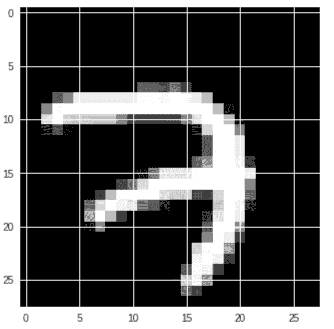

# 第二章：使用回归训练神经网络进行预测

欢迎来到我们的第一个 Python 深度学习项目！今天我们要做的是构建一个分类器，解决从图像数据集中识别特定手写样本的问题。在这个假设的使用案例中，一家餐饮连锁店要求我们做到这一点，他们需要准确地将手写数字分类成数字。他们让顾客在一个简单的 iPad 应用程序中写下自己的电话号码。当顾客可以入座时，他们会收到一条短信，提示他们前往餐厅接待员处。我们需要准确分类手写数字，以便应用程序的输出能够精确预测电话号码中的各个数字标签。然后，这些信息可以发送到他们（假设的）自动拨号服务中进行短信发送，从而将通知送到正确的饥饿顾客手中！

**定义成功**：一个好的做法是在项目开始时定义成功的标准。我们应该用什么指标来衡量这个项目的成功？我们将使用全球准确度测试作为一个百分比来衡量我们在这个项目中的表现。

数据科学在分类问题上的方法可以以多种方式进行配置。事实上，在本书后续部分，我们将研究如何通过卷积神经网络提高图像分类的准确度。

**迁移学习**：这意味着在一个不同（但非常相似）的数据集上预训练深度学习模型，以加快在另一个（通常较小）数据集上的学习速度和准确度。在这个项目和我们假设的使用案例中，通过在 MNIST 数据集上对深度学习**多层感知器**（**MLP**）进行预训练，可以使我们在不需要长时间收集数据样本的情况下，部署一个用于手写识别的生产系统，而不是在一个实际但不具备功能的系统中长时间进行数据收集。Python 深度学习项目非常酷！

让我们从基准深度神经网络模型架构开始。我们将牢固地建立我们的直觉和技能，为学习更复杂的架构做好准备，进而解决我们在本书项目中遇到的更广泛问题。

本章将学习以下内容：

+   什么是 MLP？

+   探索一个常见的开源手写数据集——MNIST 数据集

+   建立我们的直觉和为模型架构做准备

+   编写模型代码并定义超参数

+   构建训练循环

+   测试模型

# 使用 MLP 深度神经网络构建回归模型进行预测

在任何真实的人工智能团队工作中，其中一个主要目标是构建能够在非线性数据集上进行预测的回归模型。由于现实世界的复杂性以及你将处理的数据，简单的线性回归模型无法提供你所寻求的预测能力。这就是为什么在本章中，我们将讨论如何使用 MLP 构建世界级的预测模型。更多信息可以在[`www.deeplearningbook.org/contents/mlp.html`](http://www.deeplearningbook.org/contents/mlp.html)中找到，下面展示了一个 MLP 架构的示例：


一个具有两层隐藏层的多层感知器（MLP）

我们将使用 TensorFlow 实现一个简单架构的神经网络，只有两层，该网络将在我们提供的 MNIST 数据集([`yann.lecun.com/exdb/mnist/`](http://yann.lecun.com/exdb/mnist/))上进行回归。我们可以（并且会）在后续的项目中深入探讨架构！我们假设你已经熟悉反向传播（如果没有，请阅读 Michal Nielsen 关于反向传播的文章，链接为[`neuralnetworksanddeeplearning.com/chap2.html`](http://neuralnetworksanddeeplearning.com/chap2.html)）。我们不会花太多时间讲解 TensorFlow 的工作原理，但如果你有兴趣深入了解这项技术的底层实现，可以参考官方教程，网址为[`www.tensorflow.org/versions/r0.10/get_started/basic_usage.html`](https://www.tensorflow.org/versions/r0.10/get_started/basic_usage.html)。

# 探索 MNIST 数据集

在我们开始构建我们令人惊叹的神经网络之前，让我们先来看一下著名的 MNIST 数据集。所以让我们在本节中可视化 MNIST 数据集。

**智慧之言**：你必须了解你的数据以及它是如何预处理的，这样你才能知道为什么你所构建的模型会有那样的表现。本节回顾了数据集准备过程中所做的重要工作，这使得我们当前构建 MLP 的任务更加轻松。永远记住：数据科学始于数据！

因此，让我们通过以下命令开始下载数据：

```py
from tensorflow.examples.tutorials.mnist import input_data
mnist = input_data.read_data_sets("/tmp/data/", one_hot=True)
```

如果我们检查`mnist`变量的内容，我们可以看到它以特定格式构建，包含三个主要部分——**TRAIN**（训练集）、**TEST**（测试集）和**VALIDATION**（验证集）。每个集合都有手写图像及其相应的标签。图像以扁平化的方式存储为单个向量：


MNIST 数据集的格式

让我们从数据集中提取一张图像并绘制它。由于单张图像矩阵的存储形状为`[1,784]`，我们需要将这些向量重塑为`[28,28]`以可视化原始图像：

```py
sample_image = mnist.train.images[0].reshape([28,28])
```

一旦我们拥有了图像矩阵，我们将使用`matplotlib`来绘制它，如下所示：

```py
import matplotlib.pyplot as plt
plt.gray()
plt.imshow(sample_image)
```

输出将如下所示：



MNIST 数据集的一个示例

与这张图类似，共有 55,000 张类似的手写数字[0-9]图像。MNIST 数据集中的标签是图像中数字的真实值。因此，我们的目标是通过这组图像和标签训练一个模型，使其能够预测任何来自 MNIST 数据集的图像的标签。

**成为深度学习探索者**：如果你有兴趣操作数据集，你可以尝试使用 Colab Notebook，链接地址为 [`drive.google.com/file/d/1-GVlob72EyiJyQpk8EL2fg2mvzaEayJ_/view?usp=sharing`](https://drive.google.com/file/d/1-GVlob72EyiJyQpk8EL2fg2mvzaEayJ_/view?usp=sharing)。

# 直觉与准备

让我们围绕这个项目建立直觉。我们需要做的是构建一个深度学习技术，它能准确地为输入图像分配类别标签。我们使用的深度神经网络被称为 MLP。这个技术的核心是回归的数学原理。具体的微积分证明超出了本书的范围，但在这一部分，我们为你提供了一个理解的基础。我们还概述了项目的结构，以便你能轻松理解创建我们想要的结果所需的主要步骤。

# 定义回归

我们的第一个任务是定义一个将在提供的 MNIST 数据集上执行回归的模型。因此，我们将创建一个具有两个隐藏层的 TensorFlow 模型，作为一个完全连接的神经网络的一部分。你可能会听到它被称为 MLP。

该模型将执行以下方程的操作，其中 *y* 是标签，*x* 是图像，*W* 是模型将学习的权重，*b* 是偏置，模型也会学习它，以下是该模型的回归方程：


模型的回归方程

**监督学习**：当你有数据和准确的标签用于训练集（也就是说，你知道答案）时，你处于一个监督式深度学习的范式中。模型训练是一个数学过程，通过这个过程，数据的特征被学习并与正确的标签关联，以便当一个新的数据点（测试数据）被呈现时，能够输出准确的类别标签。换句话说，当你提供一个新的数据点并且没有标签（也就是说，你不知道答案）时，你的模型可以通过高度可靠的类别预测为你生成标签。

每次迭代将尝试概括权重和偏置的值，并减少误差率。同时，请记住，我们需要确保模型不会发生过拟合，这可能导致对未见数据集的错误预测。我们将向你展示如何编写代码并可视化进度，以帮助你理解模型性能。

# 定义项目结构

让我们按照以下模式组织我们的项目：

+   `hy_param.py`：所有的超参数和其他配置都在这里定义

+   `model.py`：模型的定义和架构在这里进行定义

+   `train.py`：用于训练模型的代码在这里编写

+   `inference.py`：执行训练好的模型并进行预测的代码在这里定义

+   `/runs`：此文件夹将存储在训练过程中创建的所有检查点

你可以从代码库克隆代码——代码可以在`Chapter02`文件夹中找到，链接地址是[`github.com/PacktPublishing/Python-Deep-Learning-Projects/`](https://github.com/PacktPublishing/Python-Deep-Learning-Projects/)。

# 让我们开始编写实现代码吧！

为了实现代码，我们首先会定义超参数，然后定义模型，接着构建并执行训练循环。最后，我们检查模型是否过拟合，并编写推理代码，加载最新的检查点，然后基于学习到的参数进行预测。

# 定义超参数

我们将在`hy_param.py`文件中定义所有需要的超参数，并在其他代码中导入它作为模块。这使得部署变得更加方便，并且将代码模块化是一个良好的实践。让我们看看在`hy_param.py`文件中定义的超参数配置：

```py
#!/usr/bin/env python2

# Hyperparameters and all other kind of params

# Parameters
learning_rate = 0.01
num_steps = 100
batch_size = 128
display_step = 1

# Network Parameters
n_hidden_1 = 300 # 1st layer number of neurons
n_hidden_2 = 300 # 2nd layer number of neurons
num_input = 784 # MNIST data input (img shape: 28*28)
num_classes = 10 # MNIST total classes (0-9 digits)

#Training Parameters
checkpoint_every = 100
checkpoint_dir = './runs/'
```

我们将在整个代码中使用这些值，并且它们是完全可配置的。

作为一个 Python 深度学习项目的探索机会，我们邀请你，作为我们的项目团队成员和读者，尝试不同的学习率和隐藏层数量，进行实验并构建更好的模型！

由于前面展示的图像的平坦向量大小为[1 x 786]，因此`num_input=784`在这种情况下是固定的。此外，MNIST 数据集中的类别数为`10`。我们有 0 到 9 的数字，因此显然我们有`num_classes=10`。

# 模型定义

首先，我们将加载 Python 模块；在这种情况下，加载 TensorFlow 包以及我们之前定义的超参数：

```py
import tensorflow as tf
import hy_param
```

然后，我们定义将用于输入数据到模型中的占位符。`tf.placeholder`允许我们将输入数据传递给计算图。我们可以定义占位符的形状约束，以便仅接受特定形状的张量。请注意，通常会为第一个维度提供`None`，这允许我们在运行时动态指定批次大小。

**精通你的技艺**：批处理大小往往对深度学习模型的性能有很大影响。在这个项目中，尝试不同的批处理大小。结果会有什么变化？你的直觉是什么？批处理大小是你数据科学工具箱中的另一个工具！

我们还给占位符分配了名称，以便在构建推理代码时可以使用它们：

```py
X = tf.placeholder("float", [None, hy_param.num_input],name="input_x")
Y = tf.placeholder("float", [None, hy_param.num_classes],name="input_y")
```

现在，我们将定义保存权重和偏置值的变量。`tf.Variable`允许我们在图中存储并更新张量。为了使用正态分布的随机值初始化变量，我们将使用`tf.random_normal()`（更多细节可以在[`www.tensorflow.org/api_docs/python/tf/random_normal`](https://www.tensorflow.org/api_docs/python/tf/random_normal)查看）。这里需要注意的重点是层之间的映射变量大小：

```py
weights = {
 'h1': tf.Variable(tf.random_normal([hy_param.num_input, hy_param.n_hidden_1])),
 'h2': tf.Variable(tf.random_normal([hy_param.n_hidden_1, hy_param.n_hidden_2])),
 'out': tf.Variable(tf.random_normal([hy_param.n_hidden_2, hy_param.num_classes]))
 }
 biases = {
 'b1': tf.Variable(tf.random_normal([hy_param.n_hidden_1])),
 'b2': tf.Variable(tf.random_normal([hy_param.n_hidden_2])),
 'out': tf.Variable(tf.random_normal([hy_param.num_classes]))
 }
```

现在，让我们设置之前在本章中定义的操作。这是逻辑回归操作：

```py
layer_1 = tf.add(tf.matmul(X, weights['h1']), biases['b1'])
layer_2 = tf.add(tf.matmul(layer_1, weights['h2']), biases['b2'])
logits = tf.matmul(layer_2, weights['out']) + biases['out']
```

使用`tf.nn.softmax()`将逻辑值转换为概率值。Softmax 激活将每个单元的输出值压缩到 0 和 1 之间：

```py
prediction = tf.nn.softmax(logits, name='prediction')
```

接下来，我们使用`tf.nn.softmax_cross_entropy_with_logits`来定义我们的成本函数。我们将使用 Adam 优化器优化性能。最后，我们可以使用内置的`minimize()`函数来计算每个网络参数的**随机梯度下降**（**SGD**）更新规则：

```py
loss_op = tf.reduce_mean(tf.nn.softmax_cross_entropy_with_logits(logits=logits, labels=Y))
optimizer = tf.train.AdamOptimizer(learning_rate=hy_param.learning_rate)
train_op = optimizer.minimize(loss_op)
```

接下来，我们进行预测。为了计算并捕获批次中的准确度值，以下函数是必需的：

```py
correct_pred = tf.equal(tf.argmax(prediction, 1), tf.argmax(Y, 1))
accuracy = tf.reduce_mean(tf.cast(correct_pred, tf.float32) ,name='accuracy')
```

完整的代码如下：

```py
#!/usr/bin/env python2
# -*- coding: utf-8 -*-

import tensorflow as tf
import hy_param

## Defining Placeholders which will be used as inputs for the model
X = tf.placeholder("float", [None, hy_param.num_input],name="input_x")
Y = tf.placeholder("float", [None, hy_param.num_classes],name="input_y")

# Defining variables for weights & bias
weights = {
    'h1': tf.Variable(tf.random_normal([hy_param.num_input, hy_param.n_hidden_1])),
    'h2': tf.Variable(tf.random_normal([hy_param.n_hidden_1, hy_param.n_hidden_2])),
    'out': tf.Variable(tf.random_normal([hy_param.n_hidden_2, hy_param.num_classes]))
}
biases = {
    'b1': tf.Variable(tf.random_normal([hy_param.n_hidden_1])),
    'b2': tf.Variable(tf.random_normal([hy_param.n_hidden_2])),
    'out': tf.Variable(tf.random_normal([hy_param.num_classes]))
}

# Hidden fully connected layer 1 with 300 neurons
layer_1 = tf.add(tf.matmul(X, weights['h1']), biases['b1'])
# Hidden fully connected layer 2 with 300 neurons
layer_2 = tf.add(tf.matmul(layer_1, weights['h2']), biases['b2'])
# Output fully connected layer with a neuron for each class
logits = tf.matmul(layer_2, weights['out']) + biases['out']

# Performing softmax operation
prediction = tf.nn.softmax(logits, name='prediction')

# Define loss and optimizer
loss_op = tf.reduce_mean(tf.nn.softmax_cross_entropy_with_logits(
    logits=logits, labels=Y))
optimizer = tf.train.AdamOptimizer(learning_rate=hy_param.learning_rate)
train_op = optimizer.minimize(loss_op)

# Evaluate model
correct_pred = tf.equal(tf.argmax(prediction, 1), tf.argmax(Y, 1))
accuracy = tf.reduce_mean(tf.cast(correct_pred, tf.float32) ,name='accuracy')
```

太棒了！代码的繁重部分已经完成。我们将模型代码保存在`model.py`文件中。到目前为止，我们已经定义了一个简单的两层隐藏层模型架构，每层有 300 个神经元，使用 Adam 优化器来学习最佳权重分布，并预测十个类别的概率。以下是这些层的示意图：


我们创建的模型示意图

# 构建训练循环

下一步是利用模型进行训练，并记录已学习的模型参数，我们将在`train.py`中完成此任务。

让我们首先导入所需的依赖项：

```py
import tensorflow as tf
import hy_param

# MLP Model which we defined in previous step
import model
```

然后，我们定义需要输入到 MLP 中的变量：

```py
# This will feed the raw images
X = model.X
# This will feed the labels associated with the image
Y = model.Y
```

让我们创建一个文件夹，用于保存我们的检查点。检查点基本上是学习过程中捕获`W`和`b`值的中间步骤。然后，我们将使用`tf.train.Saver()`函数（更多详情请见[`www.tensorflow.org/api_docs/python/tf/train/Saver`](https://www.tensorflow.org/api_docs/python/tf/train/Saver)）来保存和恢复`checkpoints`：

```py
checkpoint_dir = os.path.abspath(os.path.join(hy_param.checkpoint_dir, "checkpoints"))
checkpoint_prefix = os.path.join(checkpoint_dir, "model")
if not os.path.exists(checkpoint_dir):
    os.makedirs(checkpoint_dir)

# We only keep the last 2 checkpoints to manage storage
saver = tf.train.Saver(tf.global_variables(), max_to_keep=2)
```

为了开始训练，我们需要在 TensorFlow 中创建一个新的会话。在此会话中，我们将初始化图中的变量，并将有效数据提供给模型操作：

```py
# Initialize the variables
init = tf.global_variables_initializer()

# Start training
with tf.Session() as sess:

    # Run the initializer
    sess.run(init)

    for step in range(1, hy_param.num_steps+1):
        # Extracting 
        batch_x, batch_y = mnist.train.next_batch(hy_param.batch_size)
        # Run optimization op (backprop)
        sess.run(model.train_op, feed_dict={X: batch_x, Y: batch_y})
        if step % hy_param.display_step == 0 or step == 1:
            # Calculate batch loss and accuracy
            loss, acc = sess.run([model.loss_op, model.accuracy], feed_dict={X: batch_x,
                                                                 Y: batch_y})
            print("Step " + str(step) + ", Minibatch Loss= " + \
                  "{:.4f}".format(loss) + ", Training Accuracy= " + \
                  "{:.3f}".format(acc))
        if step % hy_param.checkpoint_every == 0:
            path = saver.save(
                        sess, checkpoint_prefix, global_step=step)
            print("Saved model checkpoint to {}\n".format(path))

    print("Optimization Finished!")
```

我们将从 MNIST 数据集中提取 128 个训练图像-标签对，并将其输入到模型中。经过后续步骤或多个 epoch 后，我们将使用`saver`操作存储检查点：

```py
#!/usr/bin/env python2
# -*- coding: utf-8 -*-

from __future__ import print_function

# Import MNIST data
import os
from tensorflow.examples.tutorials.mnist import input_data
mnist = input_data.read_data_sets("/tmp/data/", one_hot=True)

import tensorflow as tf
import model
import hy_param

## tf Graph input
X = model.X
Y = model.Y

checkpoint_dir = os.path.abspath(os.path.join(hy_param.checkpoint_dir, "checkpoints"))
checkpoint_prefix = os.path.join(checkpoint_dir, "model")
if not os.path.exists(checkpoint_dir):
    os.makedirs(checkpoint_dir)
saver = tf.train.Saver(tf.global_variables(), max_to_keep=2)

#loss = tf.Variable(0.0)
# Initialize the variables
init = tf.global_variables_initializer()
all_loss = []
# Start training
with tf.Session() as sess:
    writer_1 = tf.summary.FileWriter("./runs/summary/",sess.graph)

    sum_var = tf.summary.scalar("loss", model.accuracy)
    write_op = tf.summary.merge_all()

    # Run the initializer
    sess.run(init)

    for step in range(1, hy_param.num_steps+1):
        # Extracting 
        batch_x, batch_y = mnist.train.next_batch(hy_param.batch_size)
        # Run optimization op (backprop)
        sess.run(model.train_op, feed_dict={X: batch_x, Y: batch_y})
        if step % hy_param.display_step == 0 or step == 1:
            # Calculate batch loss and accuracy
            loss, acc, summary = sess.run([model.loss_op, model.accuracy, write_op], feed_dict={X: batch_x,
                                                                 Y: batch_y})
            all_loss.append(loss)
            writer_1.add_summary(summary, step)
            print("Step " + str(step) + ", Minibatch Loss= " + \
                  "{:.4f}".format(loss) + ", Training Accuracy= " + \
                  "{:.3f}".format(acc))
        if step % hy_param.checkpoint_every == 0:
            path = saver.save(
                        sess, checkpoint_prefix, global_step=step)
# print("Saved model checkpoint to {}\n".format(path))

    print("Optimization Finished!")

    # Calculate accuracy for MNIST test images
    print("Testing Accuracy:", \
        sess.run(model.accuracy, feed_dict={X: mnist.test.images,
                                      Y: mnist.test.labels}))
```

一旦我们执行了 `train.py` 文件，你将在控制台上看到进度，如前面的截图所示。这显示了每一步损失的减少，以及准确率的提升：


训练时期的输出，包括小批量损失和训练准确率参数

此外，你还可以在下面的图表中看到小批量损失的变化，随着每一步的推进，它逐渐接近最小值：


绘制每一步计算出的损失值

可视化模型的表现非常重要，这样你就可以分析并防止模型出现欠拟合或过拟合。过拟合是在处理深度模型时非常常见的情况。让我们花些时间详细了解它们，并学习一些克服它们的技巧。

# 过拟合和欠拟合

强大的能力带来巨大的责任，而更深的模型也带来了更深的问题。深度学习的一个基本挑战是找到泛化和优化之间的正确平衡。在深度学习过程中，我们正在调整超参数，并经常不断配置和调整模型，以便基于我们用于训练的数据生成最佳结果。这就是 **优化**。关键问题是，我们的模型在对未见过的数据进行预测时，泛化能力如何？

作为专业的深度学习工程师，我们的目标是构建具有良好实际世界泛化能力的模型。然而，泛化能力受到模型架构和训练数据集的影响。我们通过减少模型学习到与目标无关的模式或仅仅是数据中相似的简单模式的可能性来引导模型达到最大的实用性。如果没有做到这一点，它可能会影响泛化过程。一个好的解决方案是通过获取更多的数据来训练模型，并优化模型架构，提供模型可能具有更好（即更完整且通常更复杂）信号的更多信息，这有助于你真正想要建模的内容。以下是一些防止过拟合的快速技巧，可以提高你的模型：

+   获取更多用于训练的数据

+   通过调整层数或节点数来减少网络容量

+   使用 L2（并尝试 L1）权重正则化技术

+   在模型中添加丢弃层或池化层

L1 正则化，其中附加的代价与权重系数的绝对值成正比，也称为 *L1 范数*。L2 正则化，其中附加的代价与权重系数值的平方成正比，也称为 *L2 范数* 或 *权重衰减*。

当模型完全训练完毕后，其输出会作为检查点被存入 `/runs` 文件夹，其中包含 `checkpoints` 的二进制转储，如下面的截图所示：


训练过程完成后的检查点文件夹

# 构建推理

现在，我们将创建一个推理代码，加载最新的检查点，然后根据已学习的参数进行预测。为此，我们需要创建一个`saver`操作，提取最新的检查点并加载元数据。元数据包含有关我们在图表中创建的变量和节点的信息：

```py
# Pointing the model checkpoint
checkpoint_file = tf.train.latest_checkpoint(os.path.join(hy_param.checkpoint_dir, 'checkpoints'))
saver = tf.train.import_meta_graph("{}.meta".format(checkpoint_file))
```

我们知道这一点的重要性，因为我们希望从存储的检查点加载类似的变量和操作。我们通过使用`tf.get_default_graph().get_operation_by_name()`将它们加载到内存中，*通过传递在模型中定义的操作名称作为参数：*

```py
# Load the input variable from the model
input_x = tf.get_default_graph().get_operation_by_name("input_x").outputs[0]

# Load the Prediction operation
prediction = tf.get_default_graph().get_operation_by_name("prediction").outputs[0]
```

现在，我们需要初始化会话，并将测试图像的数据传递给执行预测操作的代码，如下所示：

```py
# Load the test data
test_data = np.array([mnist.test.images[0]])

with tf.Session() as sess:
    # Restore the model from the checkpoint
    saver.restore(sess, checkpoint_file)

    # Execute the model to make predictions 
    data = sess.run(prediction, feed_dict={input_x: test_data })

    print("Predicted digit: ", data.argmax() )

```

以下是完整代码：

```py
#!/usr/bin/env python2
# -*- coding: utf-8 -*-

from __future__ import print_function

import os
import numpy as np
import tensorflow as tf
import matplotlib.pyplot as plt

import hy_param

from tensorflow.examples.tutorials.mnist import input_data
mnist = input_data.read_data_sets("/tmp/data/", one_hot=True)

# Pointing the model checkpoint
checkpoint_file = tf.train.latest_checkpoint(os.path.join(hy_param.checkpoint_dir, 'checkpoints'))
saver = tf.train.import_meta_graph("{}.meta".format(checkpoint_file))

# Loading test data
test_data = np.array([mnist.test.images[6]])

# Loading input variable from the model
input_x = tf.get_default_graph().get_operation_by_name("input_x").outputs[0]

# Loading Prediction operation
prediction = tf.get_default_graph().get_operation_by_name("prediction").outputs[0]

with tf.Session() as sess:
    # Restoring the model from the checkpoint
    saver.restore(sess, checkpoint_file)

    # Executing the model to make predictions 
    data = sess.run(prediction, feed_dict={input_x: test_data })

    print("Predicted digit: ", data.argmax() )

# Display the feed image
print ("Input image:")
plt.gray()
plt.imshow(test_data.reshape([28,28]))
```

这样，我们就完成了第一个项目：预测手写图像中的数字！以下是模型在接收来自 MNIST 数据集的测试图像时所做的一些预测结果：


模型的输出，展示了模型的预测和输入图像

# 项目总结

今天的项目是构建一个分类器，解决从图像数据集中识别特定手写样本的问题。我们的假设使用场景是应用深度学习技术，让餐厅连锁的顾客可以在简单的 iPad 应用中写下他们的电话号码，从而收到通知，告知他们的桌位已准备好。我们的具体任务是构建能驱动这个应用的智能系统。

**重新审视我们的成功标准**：我们做得怎么样？我们成功了吗？我们的成功有什么影响？正如我们在项目开始时定义的那样，这些是我们作为深度学习数据科学家需要问的关键问题，尤其是当我们准备结束一个项目时。

我们的 MLP 模型准确度达到了 87.42%！考虑到模型的深度和我们在开始时选择的超参数，这个成绩还不错。看看你能否调整模型，获得更高的测试集准确度。

这个准确度意味着什么？我们来计算一下错误发生的概率，导致客户服务问题（也就是客户没有收到“桌位已准备好”的短信，并因为在餐厅等待时间过长而感到不满）。

每个顾客的电话号码是十位数。假设我们的假设餐厅在每个地点平均有 30 张桌子，并且这些桌子在高峰时段每晚翻台两次，而此时系统正处于高使用频率，最后，这个餐厅连锁有 35 个分店。这意味着每天运营中大约会捕捉到 21,000 个手写数字（30 张桌子 x 每天翻台 2 次 x 35 个分店 x 10 位电话号码）。

显然，所有数字必须被正确分类，才能将信息传递给等待的餐厅顾客。因此，任何单一数字的错误分类都会导致失败。在我们的示例中，87.42%的模型准确率将导致每天错误分类 2,642 个数字。假设的最坏情况是，每个电话号码中只有一个数字被错误分类。由于只有 2,100 个顾客和相应的电话号码，这意味着每个电话号码都会有一个错误分类（100%的失败率），没有一个顾客能收到他们的座位通知！在这种情况下，最佳情景是每个电话号码中的所有 10 个数字都被错误分类，这将导致 2,100 个号码中有 263 个错误电话号码（12.5%的失败率）。即使在这种情况下，餐厅连锁也不太可能满意这一性能水平。

**箴言**：模型表现不一定等同于系统或应用程序的表现。许多因素决定了系统在现实世界中的鲁棒性或脆弱性。模型表现是一个关键因素，但其他具有独立容错能力的因素同样发挥着作用。了解你的深度学习模型如何融入更大的项目中，这样你才能设定正确的期望！

# 摘要

在本章的项目中，我们成功构建了一个多层感知机（MLP），用来基于手写数字进行回归分类预测。我们通过使用 MNIST 数据集和深度神经网络模型架构积累了经验，同时也有机会定义一些关键的超参数。最后，我们对模型在测试中的表现进行了评估，判断是否达成了我们的目标。
