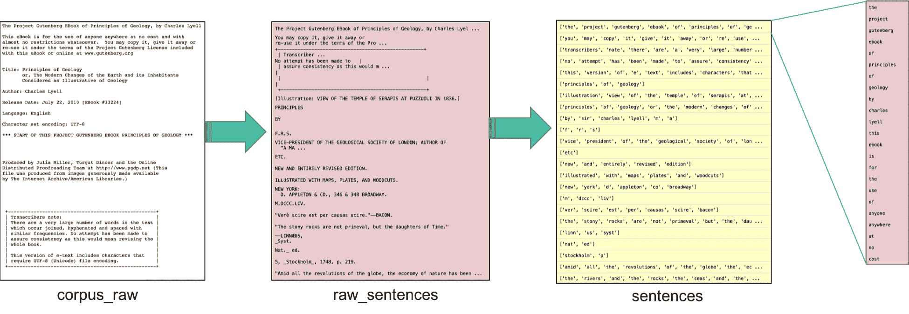
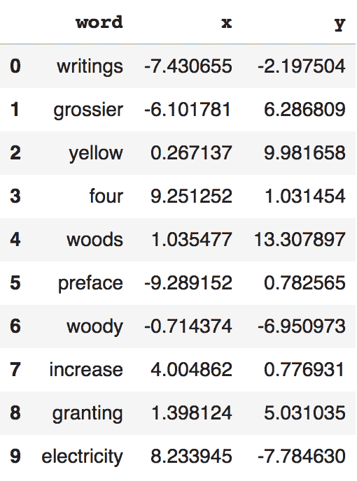
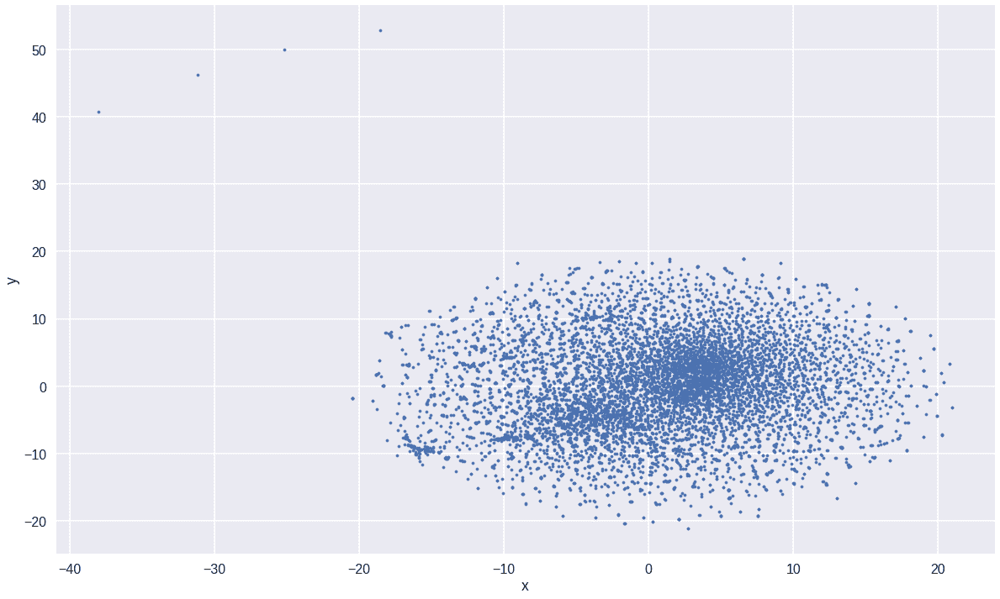
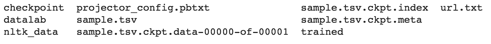
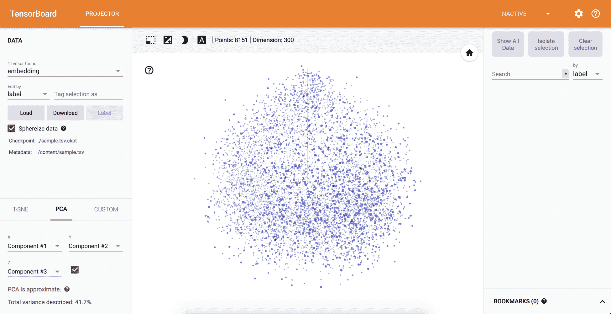
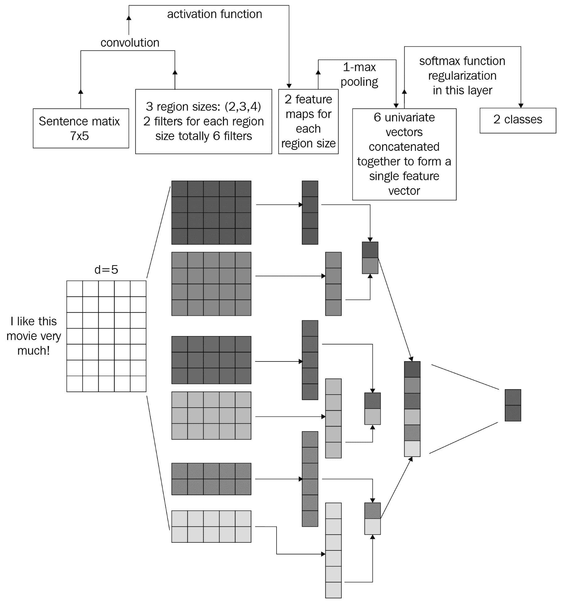
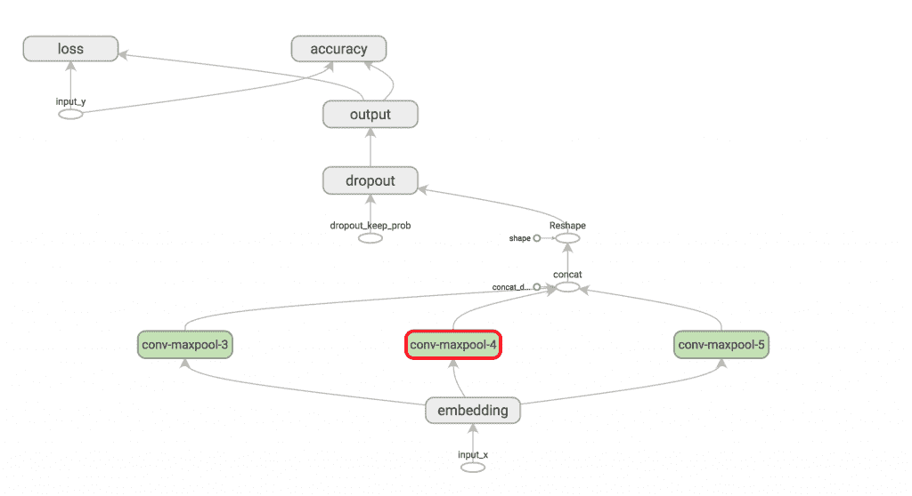
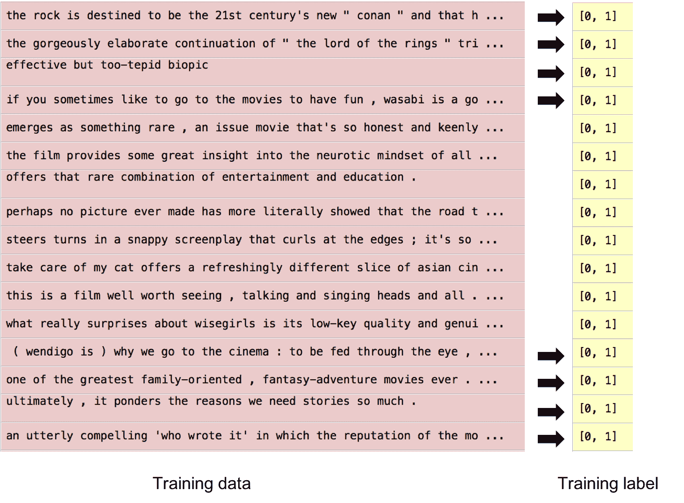
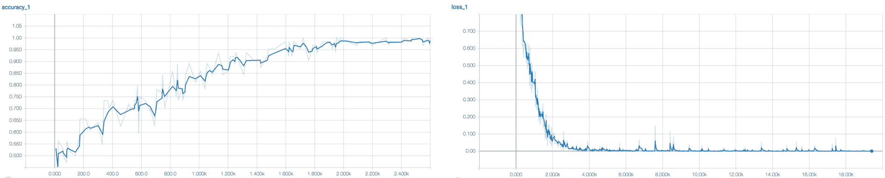

# 第三章：使用 word2vec 进行词表示

我们的*Python 深度学习项目*团队做得很好，我们（假设的）业务用例已经扩展！在上一个项目中，我们被要求准确地对手写数字进行分类，以生成电话号码，以便向餐饮连锁的顾客发送*可用桌位通知*短信。我们从项目中学到的是，餐厅发送的短信内容既友好又容易被接受。餐厅实际上收到了顾客的短信回复！

通知文本是：*我们很高兴你来了，你的桌子已经准备好了！请见迎宾员，我们现在为您安排座位。*

回复文本内容各异且通常较短，但迎宾员和餐厅管理层注意到了这些回复，并开始考虑也许可以利用这个简单的系统来获取就餐体验的反馈。这些反馈可以提供有价值的商业智能，了解食物的味道、服务的质量以及整体就餐体验的好坏。

**定义成功**：本项目的目标是构建一个计算语言学模型，使用 word2vec，它可以接受文本回复（如我们本章假设的用例所示），并输出一个有意义的情感分类。

本章将介绍**深度学习**（**DL**）在计算语言学中的基础知识。

我们介绍了词的稠密向量表示在各种计算语言学任务中的作用，以及如何从无标签的单语语料库中构建这些表示。

然后，我们将展示语言模型在各种计算语言学任务中的作用，如文本分类，以及如何使用**卷积神经网络**（**CNNs**）从无标签的单语语料库中构建它们。我们还将探讨用于语言建模的 CNN 架构。

在进行机器学习/深度学习（DL）时，数据的结构非常重要。不幸的是，原始数据通常非常脏且无结构，特别是在**自然语言处理**（**NLP**）的实践中。处理文本数据时，我们不能将字符串直接输入大多数深度学习算法；因此，**词嵌入**方法应运而生。词嵌入用于将文本数据转换为稠密的向量（张量）形式，我们可以将其输入到学习算法中。

有几种方法可以进行词嵌入，如独热编码、GloVe、word2vec 等，每种方法都有其优缺点。我们目前最喜欢的是 word2vec，因为它已被证明是学习高质量特征时最有效的方法。

如果你曾经处理过输入数据为文本的案例，那么你就知道这是一件非常杂乱的事，因为你需要教计算机理解人类语言的种种不规则性。语言有很多歧义，你需要像处理层级结构一样教会计算机，语法是稀疏的。这些就是词向量解决的问题，通过消除歧义并使不同种类的概念变得相似。

在本章中，我们将学习如何构建 word2vec 模型，并分析我们可以从提供的语料库中学到哪些特征。同时，我们将学习如何构建一个利用卷积神经网络（CNN）和训练好的词向量的语言模型。

# 学习词向量

为了实现一个完全功能的词嵌入模型，我们将执行以下步骤：

1.  加载所有依赖项

1.  准备文本语料库

1.  定义模型

1.  训练模型

1.  分析模型

1.  使用 **t-分布随机邻域嵌入**（**t-SNE**）算法绘制词汇集群

1.  在 TensorBoard 上绘制模型

让我们一起制作世界级的词嵌入模型！

本节的代码可以在 [`github.com/PacktPublishing/Python-Deep-Learning-Projects/blob/master/Chapter03/create_word2vec.ipynb`](https://github.com/PacktPublishing/Python-Deep-Learning-Projects/blob/master/Chapter03/create_word2vec.ipynb) 找到。

# 加载所有依赖项

在本章中，我们将使用 `gensim` 模块（[`github.com/RaRe-Technologies/gensim`](https://github.com/RaRe-Technologies/gensim)）来训练我们的 `word2vec` 模型。Gensim 为许多流行算法提供了大规模多核处理支持，包括 **潜在狄利克雷分配**（**LDA**）、**层次狄利克雷过程**（**HDP**）和 word2vec。我们还可以采取其他方法，例如使用 TensorFlow ([`github.com/tensorflow/models/blob/master/tutorials/embedding/word2vec_optimized.py`](https://github.com/tensorflow/models/blob/master/tutorials/embedding/word2vec_optimized.py)) 定义我们自己的计算图并构建模型——这将是我们稍后要探讨的内容。

了解代码！Python 的依赖项相对容易管理。你可以在 [`packaging.python.org/tutorials/managing-dependencies/`](https://packaging.python.org/tutorials/managing-dependencies/) 了解更多内容。

本教程将引导你通过使用 Pipenv 来管理应用程序的依赖项。它会展示如何安装和使用必要的工具，并给出关于最佳实践的强烈建议。请记住，Python 被广泛用于各种不同的目的，你管理依赖项的方式可能会根据你决定如何发布软件而发生变化。这里的指导最直接适用于网络服务（包括 Web 应用程序）的开发和部署，但也非常适合用于任何类型项目的开发和测试环境的管理。

我们将使用`seaborn`包来绘制词汇集群，使用`sklearn`来实现 t-SNE 算法，并使用`tensorflow`来构建 TensorBoard 图表：

```py
import multiprocessing
import os , json , requests
import re
import nltk
import gensim.models.word2vec as w2v
import sklearn.manifold
import pandas as pd
import seaborn as sns
import tensorflow as tf
from tensorflow.contrib.tensorboard.plugins import projector
```

# 准备文本语料库

我们将使用之前训练过的**自然语言工具包**（**NLTK**）分词器（[`www.nltk.org/index.html`](http://www.nltk.org/index.html)）和英语的停用词，来清理我们的语料库，并从中提取相关的唯一单词。我们还将创建一个小模块来清理提供的集合，该集合包含未处理的句子列表，最终输出单词列表：

```py
"""**Download NLTK tokenizer models (only the first time)**"""

nltk.download("punkt")
nltk.download("stopwords")

def sentence_to_wordlist(raw):
    clean = re.sub("[^a-zA-Z]"," ", raw)
    words = clean.split()
    return map(lambda x:x.lower(),words)

```

由于我们还没有从假设的业务案例中的文本响应捕获数据，先让我们收集一个高质量的数据集，这些数据集可以从网络上获得。通过使用这个语料库来展示我们的理解和技能，将为我们准备处理假设的业务用例数据。你也可以使用自己的数据集，但重要的是拥有大量的单词，这样`word2vec`模型才能很好地进行泛化。因此，我们将从古腾堡项目网站加载我们的数据，网址是[Gutenberg.org](http://Gutenberg.org)。

然后，我们将原始语料库分词成唯一且干净的单词列表，如下图所示：



该过程展示了数据转化的过程，从原始数据到将输入到 word2vec 模型中的单词列表。

在这里，我们将从 URL 下载文本数据并按照前面图示的方式处理它们：

```py
# Article 0on earth from Gutenberg website
filepath = 'http://www.gutenberg.org/files/33224/33224-0.txt

corpus_raw = requests.get(filepath).text

tokenizer = nltk.data.load('tokenizers/punkt/english.pickle')

raw_sentences = tokenizer.tokenize(corpus_raw)

#sentence where each word is tokenized
sentences = []
for raw_sentence in raw_sentences:
    if len(raw_sentence) > 0:
        sentences.append(sentence_to_wordlist(raw_sentence))

```

# 定义我们的 word2vec 模型

现在让我们在定义`word2vec`模型时使用`gensim`。首先，我们定义模型的一些超参数，例如维度，它决定了我们希望学习多少低级特征。每个维度将学习一个独特的概念，比如性别、物体、年龄等。

**计算语言学模型小贴士 #1**：增加维度数量可以提高模型的泛化能力……但同时也会增加计算复杂度。正确的维度数是一个经验性问题，需要你作为应用人工智能深度学习工程师来决定！

**计算语言学模型小贴士 #2**：注意`context_size`。*这很重要，因为它设定了当前单词与目标单词预测之间的最大距离限制。这个参数帮助模型学习单词与其他相邻单词之间的深层关系。*

使用`gensim`实例，我们将定义我们的模型，包括所有超参数：

```py
num_features = 300

# Minimum word count threshold.
min_word_count = 3

# Number of threads to run in parallel.

#more workers, faster we train
num_workers = multiprocessing.cpu_count()

# Context window length.
context_size = 7

# Downsample setting for frequent words. 0 - 1e-5 is good for this
downsampling = 1e-3

seed = 1

model2vec = w2v.Word2Vec(
            sg=1,
            seed=seed,
            workers=num_workers,
            size=num_features,
            min_count=min_word_count,
            window=context_size,
            sample=downsampling
        )

model2vec.build_vocab(sentences)
```

# 训练模型

一旦我们配置了`gensim word2vec`对象，我们需要给模型一些训练。请做好准备，因为根据数据量和计算能力的不同，这可能需要一些时间。在此过程中，我们需要定义训练的轮次（epoch），这可以根据数据的大小而有所不同。你可以调整这些值并评估`word2vec`模型的性能。

此外，我们将保存训练好的模型，以便在构建语言模型时能够稍后使用：

```py
"""**Start training, this might take a minute or two...**"""

model2vec.train(sentences ,total_examples=model2vec.corpus_count , epochs=100)

"""**Save to file, can be useful later**"""

if not os.path.exists(os.path.join("trained",'sample')):
    os.makedirs(os.path.join("trained",'sample'))

model2vec.save(os.path.join("trained",'sample', ".w2v"))
```

一旦训练过程完成，你可以看到一个二进制文件存储在`/trained/sample.w2v`中。你可以将`sample.w2v`文件分享给他人，他们可以在他们的 NLP 应用中使用这些词向量，并将其加载到任何其他 NLP 任务中。

# 分析模型

现在我们已经训练了`word2vec`模型，让我们来探索一下模型能够学到什么。我们将使用`most_similar()`来探索不同单词之间的关系。在下面的例子中，你会看到模型学到了`earth`这个词与`crust`、`globe`等词是相关的。很有趣的是，我们只提供了原始数据，模型就能够自动学习到这些关系和概念！以下是这个例子：

```py
model2vec.most_similar("earth")

[(u'crust', 0.6946468353271484),  
 (u'globe', 0.6748907566070557),  
 (u'inequalities', 0.6181437969207764),  
 (u'planet', 0.6092090606689453),  
 (u'orbit', 0.6079996824264526),  
 (u'laboring', 0.6058655977249146),  
 (u'sun', 0.5901342630386353),  
 (u'reduce', 0.5893668532371521),  
 (u'moon', 0.5724939107894897),  
 (u'eccentricity', 0.5709577798843384)]
```

让我们试着找出与`human`相关的词，并看看模型学到了什么：

```py
model2vec.most_similar("human")

 [(u'art', 0.6744576692581177),  
 (u'race', 0.6348963975906372),  
 (u'industry', 0.6203593611717224),  
 (u'man', 0.6148483753204346),  
 (u'population', 0.6090731620788574),  
 (u'mummies', 0.5895125865936279),  
 (u'gods', 0.5859177112579346),  
 (u'domesticated', 0.5857442021369934),  
 (u'lives', 0.5848811864852905),  
 (u'figures', 0.5809590816497803)]
```

**批判性思维提示**：有趣的是，`art`、`race`和`industry`是最相似的输出。请记住，这些相似性是基于我们用来训练的语料库的，应该在这个上下文中加以理解。当过时或不相关的训练语料库的相似性被用于训练应用于新的语言数据或文化规范的模型时，泛化以及它的不受欢迎的伴侣偏见可能会产生影响。

即使我们试图通过使用两个正向向量`earth`和`moon`，以及一个负向向量`orbit`来推导类比，模型仍然预测出`sun`这个词，这是有道理的，因为月球绕地球公转，地球绕太阳公转之间存在语义关系：

```py
model2vec.most_similar_cosmul(positive=['earth','moon'], negative=['orbit'])

(u'sun', 0.8161555624008179)
```

所以，我们了解到，通过使用`word2vec`模型，我们可以从原始未标记数据中提取有价值的信息。这个过程在学习语言的语法和词语之间的语义关联方面至关重要。

稍后，我们将学习如何将这些`word2vec`特征作为分类模型的输入，这有助于提高模型的准确性和性能。

# 使用 t-SNE 算法绘制词汇聚类

所以，在我们的分析之后，我们知道我们的`word2vec`模型从提供的语料库中学到了一些概念，但我们如何可视化它呢？因为我们已经创建了一个 300 维的空间来学习特征，实际上我们不可能直接进行可视化。为了使其成为可能，我们将使用一个降维算法，叫做 t-SNE，它在将高维空间降到更容易理解的二维或三维空间方面非常有名。

"t-分布随机邻居嵌入（t-SNE）([`lvdmaaten.github.io/tsne/`](https://lvdmaaten.github.io/tsne/))是一种（获奖的）降维技术，特别适合于高维数据集的可视化。该技术可以通过 Barnes-Hut 近似实现，从而可以应用于大型真实世界数据集。我们将其应用于包含多达 3000 万个示例的数据集。"

– Laurens van der Maaten

为了实现这一点，我们将使用`sklearn`包，并定义`n_components=2`，这意味着我们希望输出的是二维空间。接下来，我们将通过将单词向量输入到 t-SNE 对象中来进行变换。

在这一步之后，我们现在有一组每个单词的值，可以分别作为`x`和`y`坐标，用于在二维平面上绘制它。让我们准备一个`DataFrame`来存储所有单词及其`x`和`y`坐标在同一个变量中，如下图所示，并从中获取数据来创建散点图：

```py
tsne = sklearn.manifold.TSNE(n_components=2, random_state=0)

all_word_vectors_matrix = model2vec.wv.vectors

all_word_vectors_matrix_2d = tsne.fit_transform(all_word_vectors_matrix)

points = pd.DataFrame(
    [
        (word, coords[0], coords[1])
        for word, coords in [
            (word, all_word_vectors_matrix_2d[model2vec.wv.vocab[word].index])
            for word in model2vec.wv.vocab
        ]
    ],
    columns=["word", "x", "y"]
)

sns.set_context("poster")  
ax = points.plot.scatter("x", "y", s=10, figsize=(20, 12))
fig = ax.get_figure()

```

这是我们的`DataFrame`，包含了单词及其`x`和`y`坐标：



我们的单词列表及使用 t-SNE 获得的坐标值。

这是在二维平面上绘制了 425,633 个标记后，整个集群的样子。每个点的位置是在学习了附近单词的特征和关联后确定的，如下所示：



在二维平面上绘制所有独特单词的散点图

# 通过在 TensorBoard 上绘制模型来可视化嵌入空间

如果不能利用可视化来理解模型的学习过程和内容，那么可视化是没有意义的。为了更好地理解模型学到了什么，我们将使用 TensorBoard。

TensorBoard 是一个强大的工具，可以用来构建各种类型的图表，以监控模型在训练过程中的状态，并且在构建深度学习架构和词嵌入时非常有用。让我们构建一个 TensorBoard 嵌入投影，并利用它进行各种分析。

为了在 TensorBoard 中构建嵌入图，我们需要执行以下步骤：

1.  收集我们在之前步骤中学习到的单词及其相应的张量（300 维向量）。

1.  在图中创建一个变量，用于存储张量。

1.  初始化投影器。

1.  包含一个合适命名的嵌入层。

1.  将所有单词存储在一个`.tsv`格式的元数据文件中。这些文件类型由 TensorBoard 使用，以加载和显示单词。

1.  将`.tsv`元数据文件链接到投影器对象。

1.  定义一个函数，用于存储所有的总结检查点。

以下是完成前面七个步骤的代码：

```py
vocab_list = points.word.values.tolist()
embeddings = all_word_vectors_matrix

embedding_var = tf.Variable(all_word_vectors_matrix, dtype='float32', name='embedding')
projector_config = projector.ProjectorConfig()

embedding = projector_config.embeddings.add()
embedding.tensor_name = embedding_var.name

LOG_DIR='./'
metadata_file = os.path.join("sample.tsv")

with open(os.path.join(LOG_DIR, metadata_file), 'wt') as metadata:
    metadata.writelines("%s\n" % w.encode('utf-8') for w in vocab_list)

embedding.metadata_path = os.path.join(os.getcwd(), metadata_file)

# Use the same LOG_DIR where you stored your checkpoint.
summary_writer = tf.summary.FileWriter(LOG_DIR)

# The next line writes a projector_config.pbtxt in the LOG_DIR. TensorBoard will
# read this file during startup.
projector.visualize_embeddings(summary_writer, projector_config)

saver = tf.train.Saver([embedding_var])

with tf.Session() as sess:
    # Initialize the model
    sess.run(tf.global_variables_initializer())

    saver.save(sess, os.path.join(LOG_DIR, metadata_file+'.ckpt'))
```

一旦执行了 TensorBoard 准备模块，二进制文件、元数据和检查点就会存储到磁盘中，如下图所示：



TensorBoard 创建的输出

要可视化 TensorBoard，请在终端中执行以下命令：

```py
tensorboard --logdir=/path/of/the/checkpoint/
```

现在，在浏览器中打开`http://localhost:6006/#projector`，你应该能看到 TensorBoard，其中所有数据点都投影到 3D 空间中。你可以放大、缩小，查找特定的词语，以及使用 t-SNE 重新训练模型，查看数据集的聚类形成：



TensorBoard 嵌入投影

数据可视化帮助你讲述故事！TensorBoard 非常酷！你的业务案例相关方喜欢令人印象深刻的动态数据可视化。它们有助于提升你对模型的直觉，并生成新的假设以进行测试。

# 使用 CNN 和 word2vec 构建语言模型

现在我们已经学习了计算语言学的核心概念，并从提供的数据集中训练了关系，我们可以利用这一学习来实现一个可以执行任务的语言模型。

在本节中，我们将构建一个文本分类模型，用于情感分析。对于分类，我们将使用 CNN 和预训练的`word2vec`模型的结合，这部分我们在本章的前一节中已经学习过。

这个任务是我们假设的业务案例的模拟，目的是从餐厅顾客的文本反馈中提取信息，并将他们的回复分类为餐厅有意义的类别。

我们受到了 Denny Britz 的启发（[`twitter.com/dennybritz`](https://twitter.com/dennybritz)），在他关于*在 TensorFlow 中实现 CNN 进行文本分类* ([`www.wildml.com/2015/12/implementing-a-cnn-for-text-classification-in-tensorflow/`](http://www.wildml.com/2015/12/implementing-a-cnn-for-text-classification-in-tensorflow/))的工作基础上，构建了我们自己的 CNN 和文本分类模型。我们邀请你查看他创作的博客，以便更全面地了解 CNN 在文本分类中的内部机制。

总体而言，这种架构从输入嵌入步骤开始，然后是使用多个滤波器的最大池化进行的 2D 卷积，最后是一个 softmax 激活层输出结果。

# 探索 CNN 模型

你可能会问，CNN 在图像处理领域最常用，如何将其用于文本分类呢？

文献中有很多讨论（在本提示底部提供了链接），证明了 CNN 是一个通用的特征提取函数，可以计算**位置不变性**和**组合性**。位置不变性帮助模型捕捉词语的上下文，无论它们在语料库中的出现位置如何。组合性有助于利用低级特征推导出更高级的表示：

+   用于句子分类的卷积神经网络 ([`arxiv.org/abs/1408.5882`](https://arxiv.org/abs/1408.5882))

+   基于 CNN 的场景中文文本识别算法与合成数据引擎 ([`arxiv.org/abs/1604.01891`](https://arxiv.org/abs/1604.01891))

+   文本注意卷积神经网络用于场景文本检测([`arxiv.org/pdf/1510.03283.pdf`](https://arxiv.org/pdf/1510.03283.pdf))

因此，模型接收到的不是图像的像素值，而是一个热编码的词向量或`word2vec`矩阵，代表一个词或一个字符（对于基于字符的模型）。Denny Britz 的实现中有两个滤波器，每个滤波器有两个、三个和四个不同的区域大小。卷积操作通过这些滤波器在句子矩阵上进行处理，生成特征图。通过对每个激活图执行最大池化操作来进行下采样。最后，所有输出都被连接并传递到 softmax 分类器中。

因为我们正在执行情感分析，所以会有正面和负面两个输出类别目标。softmax 分类器将输出每个类别的概率，如下所示：



该图来自 Denny Britz 的博客文章，描述了 CNN 语言模型的工作原理

让我们看看模型的实现。我们通过添加先前训练的`word2vec`模型组件的输入，修改了现有的实现。

这个项目的代码可以在[`github.com/PacktPublishing/Python-Deep-Learning-Projects/tree/master/Chapter03/sentiment_analysis`](https://github.com/PacktPublishing/Python-Deep-Learning-Projects/tree/master/Chapter03/sentiment_analysis)找到。

模型位于`text_cnn.py`中。我们创建了一个名为`TextCNN`的类，该类接受一些超参数作为模型配置的输入。以下是超参数的列表：

+   `sequence_length`：固定的句子长度

+   `num_classes`：softmax 激活输出的类别数（正面和负面）

+   `vocab_size`：我们词向量中唯一词的数量

+   `embedding_size`：我们创建的嵌入维度

+   `filter_sizes`：卷积滤波器将覆盖这么多的词

+   `num_filters`：每个滤波器大小将有这么多的滤波器

+   `pre_trained`：集成了先前训练过的`word2vec`表示

以下是`TextCNN()`类的声明，`init()`函数初始化了所有超参数值：

```py
import tensorflow as tf
import numpy as np

class TextCNN(object):
    """
    A CNN for text classification.
    Uses an embedding layer, followed by a convolutional, max-pooling and softmax layer.
    """

    def __init__(self,
                 sequence_length,
                 num_classes,
                 vocab_size,
                 embedding_size,
                 filter_sizes,
                 num_filters,
                 l2_reg_lambda=0.0,
                 pre_trained=False):
```

代码被分为六个主要部分：

1.  **输入的占位符**：我们首先定义了所有需要包含模型输入值的占位符。在这种情况下，输入是句子向量和相关标签（正面或负面）。`input_x`保存句子，`input_y`保存标签值，我们使用`dropout_keep_prob`来表示我们在 dropout 层中保留神经元的概率。以下代码展示了一个示例：

```py
# Placeholders for input, output and dropout
self.input_x = tf.placeholder(
    tf.int32, [
        None,
        sequence_length,
    ], name="input_x")
self.input_y = tf.placeholder(
    tf.float32, [None, num_classes], name="input_y")
self.dropout_keep_prob = tf.placeholder(
    tf.float32, name="dropout_keep_prob")
# Keeping track of l2 regularization loss (optional)
l2_loss = tf.constant(0.0)
```

1.  **嵌入层**：我们模型的第一层，是我们将 `word2vec` 模型训练过程中学习到的单词表示输入的嵌入层。我们将修改仓库中的基准代码，使用我们预训练的嵌入模型，而不是从头开始学习嵌入。这将提高模型的准确性。这也是一种 `迁移学习`，我们将从通用的 Wikipedia 或社交媒体语料库中转移学到的一般知识。通过 `word2vec` 模型初始化的嵌入矩阵命名为 `W`，如下所示：

```py
# Embedding layer
with tf.device('/cpu:0'), tf.name_scope("embedding"):
    if pre_trained:
        W_ = tf.Variable(
            tf.constant(0.0, shape=[vocab_size, embedding_size]),
            trainable=False,
            name='W')
        self.embedding_placeholder = tf.placeholder(
            tf.float32, [vocab_size, embedding_size],
            name='pre_trained')
        W = tf.assign(W_, self.embedding_placeholder)
    else:
        W = tf.Variable(
            tf.random_uniform([vocab_size, embedding_size], -1.0, 1.0),
            name="W")
    self.embedded_chars = tf.nn.embedding_lookup(W, self.input_x)
    self.embedded_chars_expanded = tf.expand_dims(
        self.embedded_chars, -1)
```

1.  **卷积与最大池化**：定义卷积层是通过 `tf.nn.conv2d()` 完成的。它的输入是前一个嵌入层的权重（`W`—过滤矩阵），并应用一个非线性 ReLU 激活函数。然后，使用 `tf.nn.max_pool()` 对每个过滤器大小进行进一步的最大池化。结果会被串联起来，形成一个单一的向量，作为下一层模型的输入：

```py
# Create a convolution + maxpool layer for each filter size
pooled_outputs = []
for i, filter_size in enumerate(filter_sizes):
    with tf.name_scope("conv-maxpool-%s" % filter_size):
        # Convolution Layer
        filter_shape = [filter_size, embedding_size, 1, num_filters]
        W = tf.Variable(
            tf.truncated_normal(filter_shape, stddev=0.1), name="W")
        b = tf.Variable(
            tf.constant(0.1, shape=[num_filters]), name="b")
        conv = tf.nn.conv2d(
            self.embedded_chars_expanded,
            W,
            strides=[1, 1, 1, 1],
            padding="VALID",
            name="conv")
        # Apply nonlinearity
        h = tf.nn.relu(tf.nn.bias_add(conv, b), name="relu")
        # Maxpooling over the outputs
        pooled = tf.nn.max_pool(
            h,
            ksize=[1, sequence_length - filter_size + 1, 1, 1],
            strides=[1, 1, 1, 1],
            padding='VALID',
            name="pool")
        pooled_outputs.append(pooled)

# Combine all the pooled features
num_filters_total = num_filters * len(filter_sizes)
self.h_pool = tf.concat(pooled_outputs, 3)
self.h_pool_flat = tf.reshape(self.h_pool, [-1, num_filters_total])
```

1.  **Dropout 层**：为了正则化 CNN 并防止模型过拟合，少量来自神经元的信号会被阻断。这迫使模型学习更多独特或个别的特征：

```py
# Add dropout
with tf.name_scope("dropout"):
    self.h_drop = tf.nn.dropout(self.h_pool_flat,
                                self.dropout_keep_prob)
```

1.  **预测**：一个 TensorFlow 包装器执行 *W * x+b* 度量乘法，其中 `x` 是上一层的输出。这个计算将计算分数的值，预测结果将通过 `tf.argmax()` 产生：

```py
# Final (unnormalized) scores and predictions
with tf.name_scope("output"):
    W = tf.get_variable(
        "W",
        shape=[num_filters_total, num_classes],
        initializer=tf.contrib.layers.xavier_initializer())
    b = tf.Variable(tf.constant(0.1, shape=[num_classes]), name="b")
    l2_loss += tf.nn.l2_loss(W)
    l2_loss += tf.nn.l2_loss(b)
    self.scores = tf.nn.xw_plus_b(self.h_drop, W, b, name="scores")
    self.predictions = tf.argmax(self.scores, 1, name="predictions")
```

1.  ****准确率****：我们可以使用我们的分数定义 `loss` 函数。记住，我们网络所犯的错误的衡量标准叫做 **loss**。作为优秀的深度学习工程师，我们希望最小化它，让我们的模型更加准确。对于分类问题，交叉熵损失 ([`cs231n.github.io/linear-classify/#softmax`](http://cs231n.github.io/linear-classify/#softmax)) 是标准的 `loss` 函数：

```py
# CalculateMean cross-entropy loss
with tf.name_scope("loss"):
    losses = tf.nn.softmax_cross_entropy_with_logits(
        labels=self.input_y, logits=self.scores)
    self.loss = tf.reduce_mean(losses) + l2_reg_lambda * l2_loss

# Accuracy
with tf.name_scope("accuracy"):
    correct_predictions = tf.equal(self.predictions,
                                   tf.argmax(self.input_y, 1))
    self.accuracy = tf.reduce_mean(
        tf.cast(correct_predictions, "float"), name="accuracy")
```

就这样，我们的模型完成了。让我们使用 TensorBoard 来可视化网络并提高我们的直觉，如下所示：



CNN 模型架构定义

# 理解数据格式

在本案例中，使用了一个有趣的数据集，来自 Rotten Tomatoes 的 *电影评论数据* ([`www.cs.cornell.edu/people/pabo/movie-review-data/`](http://www.cs.cornell.edu/people/pabo/movie-review-data/))。一半的评论是正面的，另一半是负面的，总共有大约 10,000 个句子。词汇表中大约有 20,000 个不同的单词。数据集存储在 `data` 文件夹中。

它包含两个文件：一个，`rt-polarity.neg`，包含所有负面句子；另一个，`rt-polarity.pos`，只包含正面句子。为了执行分类，我们需要将它们与标签关联。每个正面句子与一个独热编码标签 `[0, 1]` 关联，每个负面句子与 `[1, 0]` 关联，如下图所示：



一些正面句子的示例及与这些句子关联的标签

文本数据的预处理通过以下四个步骤完成：

1.  **加载**：确保加载正面和负面句子数据文件

1.  **清理**：使用正则表达式移除标点符号和其他特殊字符

1.  **填充**：通过添加`<PAD>`标记使每个句子大小相同

1.  **索引**：将每个单词映射到一个整数索引，以便每个句子都能变成整数向量

现在我们已经将数据格式化为向量，我们可以将其输入到模型中。

# 将 word2vec 与 CNN 结合

所以，上次我们创建`word2vec`模型时，我们将该模型导出了一个二进制文件。现在是时候将该模型作为 CNN 模型的一部分来使用了。我们通过将嵌入层中的`W`权重初始化为这些值来实现这一点。

由于我们在之前的`word2vec`模型中使用了非常小的语料库，让我们选择一个已经在大规模语料库上预训练的`word2vec`模型。一种不错的策略是使用 fastText 嵌入，它是在互联网上可用的文档和 294 种语言上训练的（[`github.com/facebookresearch/fastText/blob/master/pretrained-vectors.md`](https://github.com/facebookresearch/fastText/blob/master/pretrained-vectors.md)）。我们按以下步骤进行：

1.  我们将下载英语 Embedding fastText 数据集（[`s3-us-west-1.amazonaws.com/fasttext-vectors/wiki.en.zip`](https://s3-us-west-1.amazonaws.com/fasttext-vectors/wiki.en.zip)）

1.  接下来，将词汇表和嵌入向量提取到一个单独的文件中

1.  将它们加载到`train.py`文件中

就是这样——通过引入这一步骤，我们现在可以将预训练的`word2vec`模型馈入嵌入层。信息的整合提供了足够的特征，来改善 CNN 模型的学习过程。

# 执行模型

现在是时候使用提供的数据集和预训练的嵌入模型来训练我们的模型了。需要对一些超参数进行微调，以达到良好的结果。但一旦我们使用合理的配置执行`train.py`文件，就可以证明该模型能够在分类时很好地区分正面和负面句子。

如下图所示，准确率的性能指标逐渐趋近于 1，而损失因子在每次迭代中逐渐减少至 0：



在训练过程中，CNN 模型的性能指标准确率和损失的图表

就这样！我们刚刚使用了预训练的嵌入模型来训练我们的 CNN 分类器，平均损失为 6.9，准确率为 72.6%。

一旦模型训练成功完成，模型的输出将包含以下内容：

+   检查点存储在`/runs/folder`目录下。我们将使用这些检查点来进行预测。

+   一个包含所有损失、准确率、直方图和训练过程中捕获的梯度值分布的总结。我们可以使用 TensorBoard 可视化这些信息。

# 将模型部署到生产环境

现在，我们的模型二进制文件已存储在`/runs/`文件夹中，我们只需编写一个 RESTful API，可以使用 Flask，然后调用在`model_inference.py`代码中定义的`sentiment_engine()`。

始终确保使用最佳模型的检查点和正确的嵌入文件，定义如下：

```py
checkpoint_dir = "./runs/1508847544/"
embedding = np.load('fasttext_embedding.npy')
```

# 总结

今天的项目是使用 word2vec 构建一个深度学习计算语言学模型，在情感分析范式中准确分类文本。我们的假设使用案例是将深度学习应用于帮助餐厅连锁管理层理解客户通过短信回答问题后的整体情感。我们的具体任务是构建一个自然语言处理模型，从这个简单（假设的）应用中获得数据，生成商业智能。

**回顾我们的成功标准**：我们做得怎么样？我们成功了吗？成功的影响是什么？正如我们在项目开始时定义的那样，这些是我们作为深度学习数据科学家在结束项目时会问的关键问题。

我们的 CNN 模型，基于本章前面创建的训练好的`word2vec`模型，达到了 72.6%的准确率！这意味着我们能够合理准确地将无结构的文本句子分类为正面或负面。

这种准确性的意义是什么？在我们的假设案例中，这意味着我们可以将一堆数据总结出来，而这些数据如果没有这个深度学习自然语言处理模型是很难总结的，并通过总结得出可操作的见解供餐厅管理层使用。通过总结对短信问题的正面或负面情感的数据点，餐厅连锁可以跟踪表现，进行调整，甚至可能奖励员工的改进。

在本章的项目中，我们学习了如何构建`word2vec`模型，并分析了我们可以从提供的语料库中学到哪些特征。我们还学习了如何使用训练好的词嵌入构建一个基于 CNN 的语言模型。

最后，我们查看了模型在测试中的表现，并确定是否成功达成了目标。在下一个章节的项目中，我们将利用更多的计算语言学技能，创建一个自然语言管道，驱动一个开放域问答的聊天机器人。这是一个令人兴奋的工作——让我们看看接下来会发生什么！
