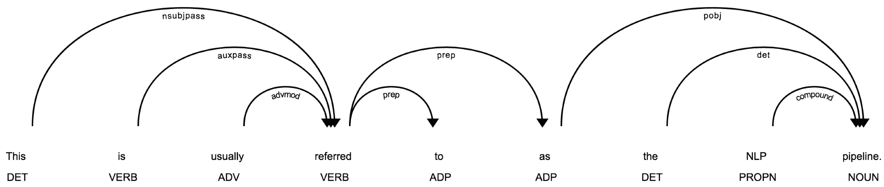
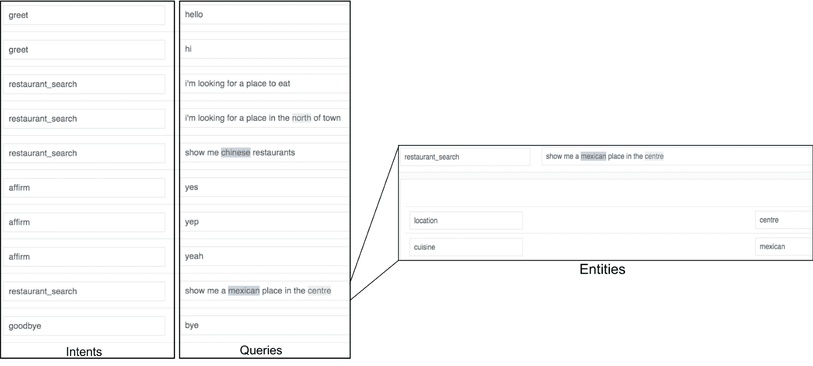
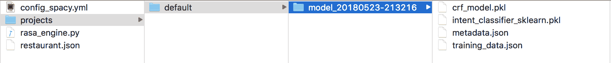
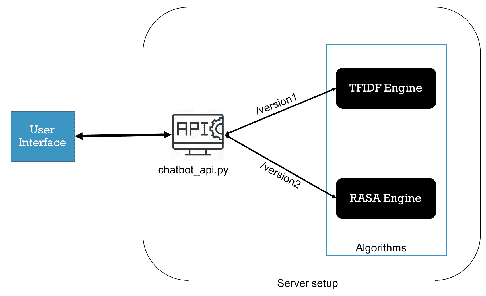

# 第四章：为构建聊天机器人建立 NLP 管道。

我们的项目再次扩展了，这要归功于我们所做的出色工作。最初，我们为一家餐饮连锁店工作，帮助他们对手写数字进行分类，用于一个文本通知系统，提醒等待的客人他们的餐桌已经准备好。基于这一成功，当店主意识到顾客实际上在回应这些短信时，我们被要求贡献一个深度学习解决方案，利用**自然语言处理**（**NLP**）来准确地将文本分类为有意义的情感类别，以便为店主提供顾客在用餐体验中的满意度反馈。

你知道做得好深度学习工程师会发生什么吗？他们会被要求做更多的事！

这个下一步的商业用例项目非常酷。我们被要求做的是创建一个自然语言处理管道，为开放域问答提供支持。这个（假设的）餐饮连锁店有一个网站，上面有菜单、历史、地点、营业时间和其他信息，他们希望添加一个功能，使网站访问者可以在查询框中提问，然后由我们的深度学习 NLP 聊天机器人找到相关信息并反馈给他们。他们认为，将正确的信息快速传达给网站访问者，有助于推动到店访问并改善整体客户体验。

**命名实体识别**（**NER**）是我们将使用的方法，它将赋予我们快速分类输入文本的能力，然后我们可以将其与相关内容匹配以回应。这是一种很好的方法，可以利用大量不断变化的非结构化数据，而无需使用硬编码的启发式方法。

在本章中，我们将学习 NLP 模型的构建模块，包括预处理、分词和词性标注。我们将利用这些理解来构建一个系统，能够读取非结构化的文本，以便为特定问题制定回答。我们还将描述如何将这个深度学习组件纳入经典的 NLP 管道中，以便检索信息，从而提供一个无需结构化知识库的开放域问答系统。

在本章中，我们将做以下几件事：

+   使用统计建模框架构建一个基于常见问题的聊天机器人，能够检测意图和实体，以回答开放域问题。

+   学习如何生成句子的密集表示。

+   构建一个文档阅读器，从非结构化文本中提取答案。

+   学习如何将深度学习模型集成到经典的 NLP 管道中。

**定义目标**：构建一个能够理解上下文（意图）并能够提取实体的聊天机器人。为了做到这一点，我们需要一个能够执行意图分类，并结合 NER 提取的 NLP 管道，以便提供准确的回应。

**学习的技能**：你将学习如何使用经典的自然语言处理管道构建一个开放领域的问答系统，文档阅读器组件使用深度学习技术来生成句子表示。

让我们开始吧！

# 自然语言处理管道基础

文本数据是一个非常庞大的信息来源，正确处理它对于成功至关重要。因此，为了处理这些文本数据，我们需要遵循一些基本的文本处理步骤。

本节中覆盖的大部分处理步骤在自然语言处理（NLP）中是常用的，并涉及将多个步骤组合成一个可执行流程。这就是我们所说的 NLP 管道。这个流程可以是分词、词干提取、词频统计、词性标注等多个元素的组合。

让我们详细了解如何实现 NLP 管道中的各个步骤，特别是每个处理阶段的功能。我们将使用 **自然语言工具包**（**NLTK**）——一个用 Python 编写的 NLP 工具包，你可以通过以下方式安装它：

```py
import nltk
nltk.download('punkt')
nltk.download('averaged_perceptron_tagger')
```

该项目的代码可在 [`github.com/PacktPublishing/Python-Deep-Learning-Projects/blob/master/Chapter04/Basic%20NLP%20Pipeline.ipynb`](https://github.com/PacktPublishing/Python-Deep-Learning-Projects/blob/master/Chapter04/Basic%20NLP%20Pipeline.ipynb)找到。

# 分词

分词将语料库分割成句子、单词或词项。分词是让我们的文本准备好进行进一步处理的必要步骤，也是构建 NLP 管道的第一步。一个词项的定义可以根据我们执行的任务或我们所工作的领域而有所不同，所以在定义词项时要保持开放的心态！

**了解代码**：NLTK 非常强大，因为库中已经完成了大量的硬编码工作。你可以在 [`www.nltk.org/api/nltk.tokenize.html#nltk.tokenize.api.TokenizerI.tokenize_sents`](http://www.nltk.org/api/nltk.tokenize.html#nltk.tokenize.api.TokenizerI.tokenize_sents) 阅读更多关于 NLTK 分词的信息。

让我们尝试加载一个语料库，并使用 NLTK 分词器首先将原始语料库分割成句子，然后进一步将每个句子分割成单词：

```py
text = u"""
Dealing with textual data is very crucial so to handle these text data we need some 
basic text processing steps. Most of the processing steps covered in this section are 
commonly used in NLP and involve the combination of several steps into a single 
executable flow. This is usually referred to as the NLP pipeline. These flow 
can be a combination of tokenization, stemming, word frequency, parts of 
speech tagging, etc.
"""

# Sentence Tokenization
sentenses = nltk.sent_tokenize(text)

# Word Tokenization
words = [nltk.word_tokenize(s) for s in sentenses]

OUTPUT:
SENTENCES:
[u'\nDealing with textual data is very crucial so to handle these text data we need some \nbasic text processing steps.', 
u'Most of the processing steps covered in this section are \ncommonly used in NLP and involve the combination of several steps into a single \nexecutable flow.', 
u'This is usually referred to as the NLP pipeline.', 
u'These flow \ncan be a combination of tokenization, stemming, word frequency, parts of \nspeech tagging, etc.']

WORDS:
[[u'Dealing', u'with', u'textual', u'data', u'is', u'very', u'crucial', u'so', u'to', u'handle', u'these', u'text', u'data', u'we', u'need', u'some', u'basic', u'text', u'processing', u'steps', u'.'], [u'Most', u'of', u'the', u'processing', u'steps', u'covered', u'in', u'this', u'section', u'are', u'commonly', u'used', u'in', u'NLP', u'and', u'involve', u'the', u'combination', u'of', u'several', u'steps', u'into', u'a', u'single', u'executable', u'flow', u'.'], [u'This', u'is', u'usually', u'referred', u'to', u'as', u'the', u'NLP', u'pipeline', u'.'], [u'These', u'flow', u'can', u'be', u'a', u'combination', u'of', u'tokenization', u',', u'stemming', u',', u'word', u'frequency', u',', u'parts', u'of', u'speech', u'tagging', u',', u'etc', u'.']]

```

# 词性标注

一些单词有多重含义，例如，*charge* 是一个名词，但也可以是动词，(*to) charge*。了解**词性**（**POS**）有助于消除歧义。句子中的每个词项都有多个属性，我们可以用来进行分析。词性的例子包括：名词表示人、地点或事物；动词表示动作或发生的事情；形容词是描述名词的词汇。利用这些属性，我们可以轻松创建文本摘要，统计最常见的名词、动词和形容词：

```py
tagged_wt = [nltk.pos_tag(w)for w in words]

[[('One', 'CD'), ('way', 'NN'), ('to', 'TO'), ('extract', 'VB'), ('meaning', 'VBG'), ('from', 'IN'), ('text', 'NN'), ('is', 'VBZ'), ('to', 'TO'), ('analyze', 'VB'), ('individual', 'JJ'), ('words', 'NNS'), ('.', '.')], [('The', 'DT'), ('processes', 'NNS'), ('of', 'IN'), ('breaking', 'VBG'), ('up', 'RP'), ('a', 'DT'), ('text', 'NN'), ('into', 'IN'), ('words', 'NNS'), ('is', 'VBZ'), ('called', 'VBN'), ('tokenization', 'NN'), ('--', ':'), ('the', 'DT'), ('resulting', 'JJ'), ('words', 'NNS'), ('are', 'VBP'), ('referred', 'VBN'), ('to', 'TO'), ('as', 'IN'), ('tokens', 'NNS'), ('.', '.')], [('Punctuation', 'NN'), ('marks', 'NNS'), ('are', 'VBP'), ('also', 'RB'), ('tokens', 'NNS'), ('.', '.')], [('Each', 'DT'), ('token', 'NN'), ('in', 'IN'), ('a', 'DT'), ('sentence', 'NN'), ('has', 'VBZ'), ('several', 'JJ'), ('attributes', 'IN'), ('we', 'PRP'), ('can', 'MD'), ('use', 'VB'), ('for', 'IN'), ('analysis', 'NN'), ('.', '.')]]

patternPOS= []
for tag in tagged_wt:
  patternPOS.append([v for k,v in tag])

[['CD', 'NN', 'TO', 'VB', 'VBG', 'IN', 'NN', 'VBZ', 'TO', 'VB', 'JJ', 'NNS', '.'], ['DT', 'NNS', 'IN', 'VBG', 'RP', 'DT', 'NN', 'IN', 'NNS', 'VBZ', 'VBN', 'NN', ':', 'DT', 'JJ', 'NNS', 'VBP', 'VBN', 'TO', 'IN', 'NNS', '.'], ['NN', 'NNS', 'VBP', 'RB', 'NNS', '.'], ['DT', 'NN', 'IN', 'DT', 'NN', 'VBZ', 'JJ', 'IN', 'PRP', 'MD', 'VB', 'IN', 'NN', '.'], ['DT', 'NN', 'IN', 'NN', 'IN', 'DT', 'NN', 'VBZ', 'CD', 'NN', ':', 'NNS', 'VBP', 'DT', 'NN', ',', 'NN', ',', 'CC', 'NN', ':', 'NNS', 'VBP', 'NNS', 'CC', 'NNS', ':', 'NNS', 'VBP', 'NNS', 'IN', 'NN', 'NNS', '.'], ['VBG', 'DT', 'NNS', ',', 'PRP', 'VBZ', 'JJ', 'TO', 'VB', 'DT', 'NN', 'IN', 'DT', 'NN', 'IN', 'NN', 'IN', 'VBG', 'DT', 'RBS', 'JJ', 'NNS', ',', 'NNS', ',', 'CC', 'NNS', '.']]

```

# 提取名词

让我们提取语料库中所有的名词。这在你需要提取特定内容时非常有用。我们使用 `NN`、`NNS`、`NNP` 和 `NNPS` 标签来提取名词：

```py
nouns = [] 
for tag in tagged_wt:
nouns.append([k for k,v in tag if v in ['NN','NNS','NNP','NNPS']])

[['way', 'text', 'words'], ['processes', 'text', 'words', 'tokenization', 'words', 'tokens'], ['Punctuation', 'marks', 'tokens'], ['token', 'sentence', 'analysis'], ['part', 'speech', 'word', 'example', 'nouns', 'person', 'place', 'thing', 'verbs', 'actions', 'occurences', 'adjectives', 'words', 'describe', 'nouns'], ['attributes', 'summary', 'piece', 'text', 'nouns', 'verbs', 'adjectives']]
```

# 提取动词

让我们提取语料库中所有的动词。在这种情况下，我们使用`VB`、`VBD`、`VBG`、`VBN`、`VBP`和`VBZ`作为动词标签：

```py
verbs = [] 
for tag in tagged_wt:
verbs.append([k for k,v in tag if v in ['VB','VBD','VBG','VBN','VBP','VBZ']])

[['extract', 'meaning', 'is', 'analyze'], ['breaking', 'is', 'called', 'are', 'referred'], ['are'], ['has', 'use'], ['is', 'are', 'are', 'are'], ['Using', "'s", 'create', 'counting']]

```

现在，让我们使用`spacy`对一段文本进行分词，并访问每个词语的词性（POS）属性。作为示例应用，我们将对前一段进行分词，并通过以下代码统计最常见的名词。我们还将对这些词语进行词形还原（lemmatization），将词语还原为其根形，以帮助我们在不同形式的词语之间进行标准化：

```py
! pip install -q spacy 
! pip install -q tabulate
! python -m spacy download en_core_web_lg

from collections import Counter
import spacy
from tabulate import tabulate
nlp = spacy.load('en_core_web_lg')

doc = nlp(text)
noun_counter = Counter(token.lemma_ for token in doc if token.pos_ == 'NOUN')

print(tabulate(noun_counter.most_common(5), headers=['Noun', 'Count']))
```

以下是输出结果：

```py
Noun         Count 
-----------  ------- 
step          3 
combination   2 
text          2 
processing    2 
datum         2
```

# 依存句法分析

依存句法分析是一种理解句子中词语之间关系的方法。依存关系是一种更细粒度的属性，可以帮助建立模型对单词在句子中的关系的理解：

```py
doc = nlp(sentenses[2])
spacy.displacy.render(doc,style='dep', options={'distance' : 140}, jupyter=True)
```

这些词语之间的关系可能会变得复杂，取决于句子的结构。依存句法分析的结果是一个树形数据结构，其中动词是根节点，如下图所示：



句子的依存句法分析树结构，其中动词是根节点。

# NER

最后，还有 NER。命名实体是句子中的专有名词。计算机已经能够相当准确地判断句子中是否存在这些实体，并对它们进行分类。`spacy`在文档级别处理 NER，因为实体的名称可能跨越多个词语：

```py
doc = nlp(u"My name is Jack and I live in India.")
entity_types = ((ent.text, ent.label_) for ent in doc.ents)
print(tabulate(entity_types, headers=['Entity', 'Entity Type']))

Output:
Entity     Entity Type 
--------   ------------- 
Jack       PERSON 
India      GPE
```

所以，我们刚刚看到了一些 NLP 管道的基本构建模块。这些管道在各种 NLP 项目中被一致地使用，无论是在机器学习领域还是在深度学习领域。

有什么看起来熟悉的吗？

在前一章中，我们使用了其中一些 NLP 管道构建块，第三章，*使用 word2vec 的词表示*，来构建我们的 word2vec 模型。对 NLP 管道构建块的更深入解释帮助我们在项目中迈出下一步，因为我们寻求部署越来越复杂的模型！

就像本书中关于*Python 深度学习项目*的其他内容一样，我们鼓励你也尝试将之前的处理流程与数据科学职业中所处理的用例相结合。现在，让我们使用这些管道实现一个聊天机器人！

# 构建对话机器人

在本节中，我们将学习一些基本的统计建模方法，以构建一个信息检索系统，使用**词频**-**逆文档频率**（**TF-IDF**），我们可以将其与 NLP 管道结合使用，构建功能齐全的聊天机器人。此外，稍后我们将学习构建一个更为高级的对话机器人，能够提取特定的信息，比如位置、捕获时间等，使用命名实体识别（NER）。

# 什么是 TF-IDF？

TF-IDF 是一种将文档表示为特征向量的方式。那么它们到底是什么呢？TF-IDF 可以理解为 **词频** (**TF**) 和 **逆文档频率** (**IDF**) 的修改版。TF 是特定单词在给定文档中出现的次数。TF-IDF 背后的概念是根据一个词汇出现在多少个文档中来减少它的权重。这里的核心思想是，出现在很多不同文档中的词汇很可能不重要，或者对 NLP 任务（如文档分类）没有什么有用的信息。

# 准备数据集

如果我们考虑使用 TF-IDF 方法构建一个聊天机器人，我们首先需要构建一个支持带标签训练数据的数据结构。现在，让我们以一个聊天机器人的例子为例，假设它是用来回答用户提问的。

在这种情况下，通过使用历史数据，我们可以形成一个数据集，其中包含两列，一列是问题，另一列是该问题的答案，如下表所示：

| **问题** | **答案** |
| --- | --- |
| 你们店什么时候开门？ | 我们的营业时间是工作日早上 9:00 至晚上 9:00，周末是早上 11:00 到午夜 12:00。 |
| 今天的特价是什么？ | 今天我们提供各种意大利面，配上特制酱料，还有更多其他面包店的选项。 |
| 美式咖啡多少钱？ | 一杯单份美式咖啡的价格是 1.4 美元，双份是 2.3 美元。 |
| 你们卖冰淇淋吗？ | 我们确实有甜点，比如冰淇淋、布朗尼和糕点。 |

让我们继续考虑前面的例子，把它看作一个样本数据集。它是一个非常小的例子，而在原始的假设场景中，我们会有一个更大的数据集来处理。典型的流程如下：用户将与机器人互动，并输入关于商店的随机查询。机器人会将查询发送给 NLP 引擎，使用 API，然后由 NLP 模型决定针对新查询（测试数据）返回什么内容。参考我们的数据集，所有问题都是训练数据，而答案是标签。在出现新的查询时，TF-IDF 算法会将其与数据集中某个问题进行匹配，并给出一个置信度分数，这个分数告诉我们用户提问的新问题与数据集中的某个特定问题相近，针对该问题的答案就是我们的机器人返回的答案。

让我们进一步考虑前面的例子。当用户查询：“我能买一杯美式咖啡吗？顺便问一下，多少钱？”时，我们可以看到像 *I*、*an* 和 *it* 这些词汇，在其他问题中也会有较高的出现频率。

现在，如果我们匹配其余的重要词汇，我们会发现这个问题最接近："美式咖啡多少钱？" 所以，我们的机器人会回复这个问题的历史答案：“一杯单份美式咖啡的价格是 1.4 美元，双份是 2.3 美元。”

# 实现

在之前提到的以表格格式创建数据结构之后，我们将在每次用户查询我们的机器人时计算预测的答案。我们从数据集中加载所有问题-答案对。

让我们使用`pandas`加载我们的 CSV 文件，并对数据集进行一些预处理：

```py
import pandas as pd

filepath = 'sample_data.csv'
csv_reader=pd.read_csv(filepath)

question_list = csv_reader[csv_reader.columns[0]].values.tolist()
answers_list = csv_reader[csv_reader.columns[1]].values.tolist()

query= 'Can I get an Americano, btw how much it will cost ?'
```

该项目的代码可以在[`github.com/PacktPublishing/Python-Deep-Learning-Projects/tree/master/Chapter04/tfidf_version`](https://github.com/PacktPublishing/Python-Deep-Learning-Projects/tree/master/Chapter04/tfidf_version)找到。

# 创建向量化器

现在，让我们初始化 TF-IDF 向量化器并定义一些参数：

+   `min_df`：在构建词汇表时，忽略文档频率低于给定阈值的术语

+   `ngram_range`：配置我们的向量化器一次捕捉*n*个单词

+   `norm`：用于使用 L1 或 L2 范数对术语向量进行归一化

+   `encoding`：处理 Unicode 字符

还有许多其他参数，您可以查看、配置并进行实验：

```py
from sklearn.feature_extraction.text import TfidfVectorizer

vectorizer = TfidfVectorizer(min_df=0, ngram_range=(2, 4), strip_accents='unicode',norm='l2' , encoding='ISO-8859-1')
```

现在，我们将在问题上训练模型：

```py
# We create an array for our train data set (questions)
X_train = vectorizer.fit_transform(np.array([''.join(que) for que in question_list]))

# Next step is to transform the query sent by user to bot (test data)
X_query=vectorizer.transform(query)
```

# 处理查询

为了处理查询，我们需要找到它与其他问题的相似度。我们通过计算训练数据矩阵与查询数据的转置的点积来实现这一点：

```py
XX_similarity=np.dot(X_train.todense(), X_query.transpose().todense())
```

现在，我们将查询与训练数据的相似度提取为一个列表：

```py
XX_sim_scores= np.array(XX_similarity).flatten().tolist()
```

# 排名结果

我们为查询创建了一个相似度排序字典：

```py
dict_sim= dict(enumerate(XX_sim_scores))

sorted_dict_sim = sorted(dict_sim.items(), key=operator.itemgetter(1), reverse =True)
```

最后，在排序的字典中，我们检查最相似问题的索引，以及该索引在答案列中的响应值。如果没有找到任何结果，我们可以返回默认答案：

```py
if sorted_dict_sim[0][1]==0:
       print("Sorry I have no answer, please try asking again in a nicer way :)")
elif sorted_dic_sim[0][1]>0:
       print answer_list [sorted_dic_sim[0][0]]
```

# 使用 NER 的高级聊天机器人

我们刚刚创建了一个非常基本的聊天机器人，它能够理解用户的查询，并根据情况做出回应。但它还无法理解上下文，因为它无法提取诸如产品名称、地点或其他任何实体的信息。

为了构建一个理解上下文（意图）并能够提取实体的机器人，我们需要一个 NLP 管道，能够执行意图分类和 NER 提取，并提供准确的响应。

牢记目标！这就是我们开放领域问答机器人所追求的目标。

为此，我们将使用一个名为 Rasa NLU 的开源项目（[`github.com/RasaHQ/rasa_nlu`](https://github.com/RasaHQ/rasa_nlu)）。

Rasa NLU 是一个**自然语言理解**工具，用于理解文本，尤其是短文本中所表达的内容。例如，假设系统接收到类似以下的简短消息：

```py
"I'm looking for an Italian restaurant in the center of town"
```

在这种情况下，系统返回以下内容：

```py
intent: search_restaurant
entities:     
      - cuisine : Italian    
     - location : center of town
```

因此，通过利用 RASA 的强大功能，我们可以构建一个能够进行意图分类和 NER 提取的聊天机器人。

太好了，我们开始吧！

该项目的代码可以在[`github.com/PacktPublishing/Python-Deep-Learning-Projects/tree/master/Chapter04/rasa_version`](https://github.com/PacktPublishing/Python-Deep-Learning-Projects/tree/master/Chapter04/rasa_version)找到。

# 安装 Rasa

使用以下命令在我们的本地环境或服务器中安装 Rasa：

```py
pip install rasa_nlu
pip install coloredlogs sklearn_crfsuite spacy
python -m spacy download en
```

如果安装失败，可以通过查看[`nlu.rasa.com/installation.html`](https://nlu.rasa.com/installation.html)中的详细方法来解决。

Rasa 使用多种 NLP 管道，例如`spacy`、`sklearn`或 MITIE。你可以选择其中任何一个，或者构建自己的自定义管道，其中可以包含任何深度模型，例如我们在前一章节中创建的带有 word2vec 的 CNN。在我们的案例中，我们将使用`spacy`和`sklearn`。

# 准备数据集

在我们之前的项目中，我们创建了一个 CSV 文件数据集，包含了问题和答案对的两列。我们需要再次执行此操作，但使用不同的格式。在这种情况下，我们需要将问题与其意图相关联，如下图所示，这样我们就有一个标注为**greet**的**hello**问题。同样，我们将为所有问题标注各自的意图。

一旦我们准备好了所有问题和意图的形式，就需要标注实体。在这种情况下，如下图所示，我们有一个**location**实体，值为**centre**，以及一个**cuisine**实体，值为**mexican**：



这张图展示了我们为聊天机器人准备的数据内容。最主要的是所有意图的列表，我们需要让我们的机器人理解这些意图。然后，我们为每个意图提供相应的示例语句。最右侧部分表示具体实体的标注，实体的标签是“location”和“cuisine”，在这个例子中就是这样。

要将数据输入到 Rasa 中，我们需要将这些信息存储为特定的 JSON 格式，格式如下所示：

```py
# intent_list : Only intent part
[
  {
    "text": "hey",
    "intent": "greet"
  },
  {
    "text": "hello",
    "intent": "greet"
  }
]

# entity_list : Intent with entities
[{
  "text": "show me indian restaurants",
  "intent": "restaurant_search",
  "entities": [
    {
      "start": 8,
      "end": 15,
      "value": "indian",
      "entity": "cuisine"
    }
  ]
},
]

```

JSON 的最终版本应该具有如下结构：

```py
{
  "rasa_nlu_data": {
    "entity_examples": [entity_list],
    "intent_examples": [intent_list]
  }
}
```

为了简化操作，提供了一个在线工具，您可以将所有数据输入并标注，然后下载 JSON 版本。您可以按照[`github.com/RasaHQ/rasa-nlu-trainer`](https://github.com/RasaHQ/rasa-nlu-trainer)上的说明在本地运行编辑器，或者直接使用其在线版本：[`rasahq.github.io/rasa-nlu-trainer/`](https://rasahq.github.io/rasa-nlu-trainer/)。

将此 JSON 文件保存为`restaurant.json`，并存放在当前工作目录中。

# 训练模型

现在我们将创建一个配置文件。这个配置文件将定义在训练和构建模型过程中使用的管道。

在您的工作目录中创建一个名为`config_spacy.yml`的文件，并将以下代码插入其中：

```py
language: "en"
pipeline: "spacy_sklearn"
fine_tune_spacy_ner: true
```

**了解代码**：spaCy 配置自定义是有原因的。其他数据科学家已经发现能够在这里更改值有一定的用处，随着你对这项技术的熟悉，探索这一点是一个很好的实践。这里有一个配置的庞大列表，你可以在[`nlu.rasa.com/config.html`](https://nlu.rasa.com/config.html)查看。

这个配置表示我们将使用英语语言模型，并且后台运行的管道将是基于 spaCy 和 scikit-learn。现在，为了开始训练过程，执行以下命令：

```py
python -m rasa_nlu.train \
    --config config_spacy.yml \
    --data restaurant.json \
    --path projects
```

这将配置文件和训练数据文件作为输入。`--path`参数是存储训练模型的位置。

一旦模型训练过程完成，你将看到一个新文件夹，命名为`projects/default/model_YYYYMMDD-HHMMSS`格式，包含训练完成时的时间戳。完整的项目结构将如以下截图所示：



训练过程完成后的文件夹结构。模型文件夹将包含所有在训练过程中学到的二进制文件和元数据。

# 部署模型

现在是让你的机器人上线的时候了！使用 Rasa 时，你不需要编写任何 API 服务——一切都可以在包内完成。所以，为了将训练好的模型暴露为服务，你需要执行以下命令，该命令需要存储的训练模型路径：

```py
python -m rasa_nlu.server --path projects
```

如果一切顺利，将会在`5000`端口暴露一个 RESTful API，你应该能在控制台屏幕上看到以下日志：

```py
2018-05-23 21:34:23+0530 [-] Log opened.
2018-05-23 21:34:23+0530 [-] Site starting on 5000
2018-05-23 21:34:23+0530 [-] Starting factory <twisted.web.server.Site instance at 0x1062207e8>

```

要访问 API，你可以使用以下命令。我们正在查询模型，提出一个语句，比如"`I am looking for Mexican food`"（我在寻找墨西哥菜）：

```py
curl -X POST localhost:5000/parse -d '{"q":"I am looking for Mexican food"}' | python -m json.tool

Output:
{
 "entities": [
 {
 "confidence": 0.5348393725109971,
 "end": 24,
 "entity": "cuisine",
 "extractor": "ner_crf",
 "start": 17,
 "value": "mexican"
 }
 ],
 "intent": {
 "confidence": 0.7584285478135262,
 "name": "restaurant_search"
 },
 "intent_ranking": [
 {
 "confidence": 0.7584285478135262,
 "name": "restaurant_search"
 },
 {
 "confidence": 0.11009204166074991,
 "name": "goodbye"
 },
 {
 "confidence": 0.08219245368495268,
 "name": "affirm"
 },
 {
 "confidence": 0.049286956840770876,
 "name": "greet"
 }
 ],
 "model": "model_20180523-213216",
 "project": "default",
 "text": "I am looking for Mexican food"
}
```

所以在这里，我们可以看到模型在意图分类和实体提取过程中表现得相当准确。它能够以 75.8%的准确率将意图分类为`restaurant_search`，并且能够检测到`cuisine`实体，值为`mexican`。

# 服务化聊天机器人

到目前为止，我们已经看到了如何使用`TF-IDF`和`Rasa NLU`两种方法来构建聊天机器人。接下来，我们将把它们暴露为 API。这个简单聊天机器人框架的架构将如下所示：



这个聊天机器人流程说明了我们可以将任何用户界面（如 Slack、Skype 等）与我们暴露的`chatbot_api`进行集成。在后台，我们可以设置任意数量的算法，如`TFIDF`和`RASA`。

请参考本章节的 Packt 仓库（可访问 [`github.com/PacktPublishing/Python-Deep-Learning-Projects/tree/master/Chapter04`](https://github.com/PacktPublishing/Python-Deep-Learning-Projects/tree/master/Chapter04)）获取 API 代码，并查看 `chatbot_api.py` 文件。在这里，我们实现了一个通用 API，可以加载两种版本的机器人，你现在可以在其基础上构建完整的框架。

执行 API 服务时，请按照以下步骤操作：

1.  使用以下命令进入章节目录：

```py
cd Chapter04/
```

1.  这将使 Rasa 模块暴露在 `localhost:5000`。如果您尚未训练 Rasa 引擎，请使用以下命令：

```py
python -m rasa_nlu.server --path ./rasa_version/projects
```

1.  在一个单独的控制台中，执行以下命令。这将在 `localhost:8080` 暴露一个 API：

```py
python chatbot_api.py
```

1.  现在，您的聊天机器人已准备好通过 API 进行访问。试试以下操作：

+   +   调用以下 API 执行 TFIDF 版本：

```py
curl http://localhost:8080/version1?query=Can I get an Americano
```

+   +   调用以下 API 执行 Rasa 版本：

```py
http://localhost:8080/version2?query=where is Indian cafe
```

# 总结

在这个项目中，我们被要求创建一个自然语言处理管道，为开放领域问答的聊天机器人提供支持。一个（假设的）餐饮连锁公司在其网站上拥有大量基于文本的数据，包括菜单、历史、位置、营业时间等信息，他们希望为网站访客提供一个查询框，允许他们提问。我们的深度学习 NLP 聊天机器人将根据这些信息找到相关内容，并返回给访客。

我们首先展示了如何构建一个简单的 FAQ 聊天机器人，该机器人接收随机查询，将其与预定义问题匹配，并返回一个响应，带有表示输入问题与数据库中问题相似度的置信度评分。但这仅仅是通向我们真正目标的第一步，我们的目标是创建一个能够捕捉问题意图并准备适当响应的聊天机器人。

我们探索了一种命名实体识别（NER）方法，赋予我们所需的能力，快速对输入文本进行分类，然后匹配到相关的响应内容。这种方法适合我们的目标，即支持开放领域问答，并且能够利用大量不断变化的非结构化数据，而无需使用硬编码的启发式方法（就像我们假设的餐厅例子中一样）。

我们学会了使用 NLP 模型的基本构建模块，包括预处理、分词和 POS 标注。我们利用这些理解，构建了一个能够读取非结构化文本的系统，以便理解针对特定问题的答案。

具体来说，我们在这个项目中获得了以下技能：

+   使用统计建模构建基于 FAQ 的基础聊天机器人框架，能够检测意图和实体以回答开放领域问题。

+   生成句子的密集表示

+   构建一个文档读取器，从非结构化文本中提取答案

+   学习了如何将深度学习模型集成到经典的 NLP 管道中。

这些技能在你的职业生涯中将非常有用，因为你将会遇到类似的商业应用场景，同时，随着对话式用户界面日益流行，它们也会变得更加重要。做得好——让我们来看看下一项目 Python 深度学习项目会带来什么！
