# 第五章：用于构建聊天机器人的序列到序列模型

我们学到了很多东西，并且做了一些有价值的工作！在我们假设的商业用例的演进过程中，本章直接建立在 第四章 *构建聊天机器人 NLP 管道* 的基础上，我们在该章中创建了 **自然语言处理**（**NLP**）管道。我们到目前为止在计算语言学中学到的技能应该能够让我们有信心扩展到本书中的训练示例之外，并着手处理下一个项目。我们将为我们假设的餐饮连锁店构建一个更先进的聊天机器人，自动化接听电话订单的过程。

这个需求意味着我们需要结合我们迄今为止所学的一些技术。但在这个项目中，我们将学习如何制作一个更加上下文敏感且强大的聊天机器人，以便将其集成到这个假设的更大系统中。通过在这个训练示例中展示我们的掌握程度，我们将有信心在实际情况下执行这个任务。

在前几章中，我们学习了表示学习方法，如 word2vec，并了解了如何将其与一种名为 **卷积神经网络**（**CNN**）的深度学习算法结合使用。但是，使用 CNN 构建语言模型时存在一些限制，如下所示：

+   该模型将无法保持状态信息

+   句子的长度需要在输入值和输出值之间保持固定大小

+   CNN 有时无法充分处理复杂的序列上下文

+   **循环神经网络**（**RNNs**）在建模序列信息方面表现更好

因此，为了解决这些问题，我们有一个替代算法，它专门设计来处理以序列形式输入的数据（包括单词序列或字符序列）。这种类型的算法被称为 RNN。

在本章中，我们将做以下事情：

+   学习 RNN 及其各种形式

+   使用 RNN 创建一个语言模型实现

+   基于 **长短期记忆**（**LSTM**）模型构建我们的直觉

+   创建 LSTM 语言模型实现并与 RNN 模型进行比较

+   基于 LSTM 单元实现一个编码器-解码器 RNN，用于简单的问答任务序列

**定义目标**：构建一个具有记忆功能的更强大的聊天机器人，以提供更具上下文相关性的正确回答。

让我们开始吧！

# 介绍 RNN

RNN 是一种深度学习模型架构，专门为序列数据设计。该模型的目的是通过使用一个小窗口来遍历语料库，从而提取文本中单词和字符的相关特征。

RNN 对序列中的每个项应用非线性函数。这被称为 RNN *单元*或*步*，在我们的例子中，这些项是序列中的单词或字符。RNN 中的输出是通过对序列中每个元素应用 RNN 单元的输出得到的。关于使用文本数据作为输入的自然语言处理和聊天机器人，模型的输出是连续的字符或单词。

每个 RNN 单元都包含一个内部记忆，用于总结它目前为止看到的序列的历史。

该图帮助我们可视化 RNN 模型架构：

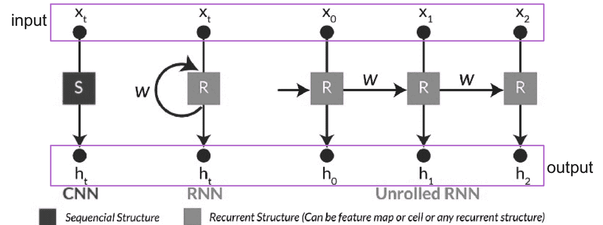

RNN 模型架构的经典版本。

RNN 的核心目的在于引入一种反馈机制，通过使用固定权重的反馈结构来实现上下文建模。这样做的目的是建立当前映射到先前版本之间的连接。基本上，它使用序列的早期版本来指导后续版本。

这非常聪明；然而，它也并非没有挑战。梯度爆炸和梯度消失使得在处理复杂时间序列问题时，训练这些类型的模型变得极其令人沮丧。

有一个很好的参考资料深入讲解了梯度消失和梯度爆炸问题，并提供了可行解决方案的技术解释，可以参考 Sepp 1998 年的工作（[`dl.acm.org/citation.cfm?id=355233`](https://dl.acm.org/citation.cfm?id=355233)）。

另一个发现的问题是，RNN 只会捕捉到两种时间结构中的一种：短期结构或长期结构。然而，最佳模型的性能需要能够同时从两种类型的特征（短期和长期）中学习。解决方案是将基础的 RNN 单元更换为**门控递归单元**（**GRU**）或 LSTM 单元。

若要了解更多关于 GRU 的信息，请参考[`www.wildml.com/2015/10/recurrent-neural-network-tutorial-part-4-implementing-a-grulstm-rnn-with-python-and-theano/`](http://www.wildml.com/2015/10/recurrent-neural-network-tutorial-part-4-implementing-a-grulstm-rnn-with-python-and-theano/)，或者，若要了解更多关于 LSTM 的内容，请参考[`colah.github.io/posts/2015-08-Understanding-LSTMs/`](http://colah.github.io/posts/2015-08-Understanding-LSTMs/)。

我们将在本章后续部分详细探讨 LSTM 架构。让我们先直观地了解 LSTM 的价值，这将有助于我们实现目标。

# RNN 架构

我们将主要使用 LSTM 单元，因为它在大多数自然语言处理任务中表现更好。LSTM 在 RNN 架构中的主要优点是，它能够在保持记忆的同时进行长序列的模型训练。为了解决梯度问题，LSTM 包括更多的门控机制，有效控制对单元状态的访问。

我们发现 Colah 的博客文章([`colah.github.io/posts/2015-08-Understanding-LSTMs/`](http://colah.github.io/posts/2015-08-Understanding-LSTMs/))是一个很好的地方，可以帮助理解 LSTM 的工作原理。

这些 RNN 的小型 LSTM 单元可以以多种形式组合来解决各种类型的使用案例。RNN 在结合不同输入和输出模式方面非常灵活，具体如下：

+   **多对一**：该模型将完整的输入序列作为输入，做出单一的预测。这在情感分析模型中使用。

+   **一对多**：该模型将单一的输入（例如一个日期）转化为生成一个序列字符串，如“日”、“月”或“年”。

+   **多对多**：这是一个**序列到序列**（**seq2seq**）模型，它将整个序列作为输入，转换为第二个序列的形式，正如问答系统所做的那样。

这张图很好地展示了这些关系：

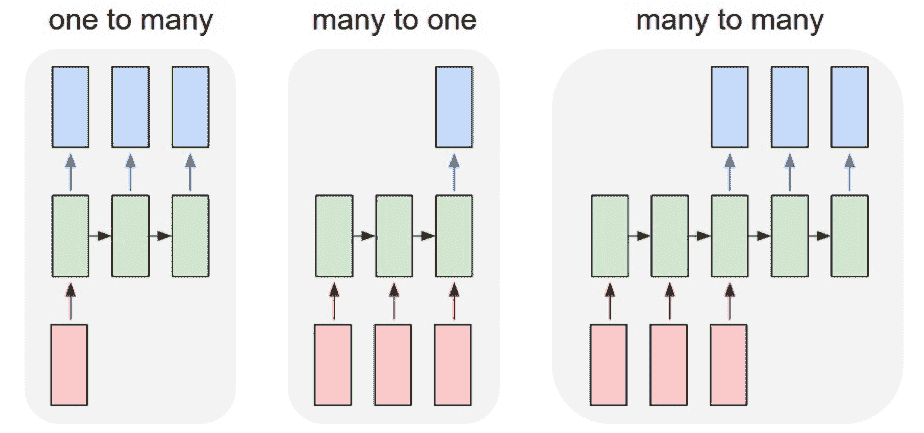

在本章中，我们将重点关注**多对多**关系，也称为 seq2seq 架构，以构建一个问答聊天机器人。解决 seq2seq 问题的标准 RNN 方法包括三个主要组成部分：

+   **编码器**：这些将输入句子转换为某种抽象的编码表示

+   **隐藏层**：在这里处理编码后的句子转换表示

+   **解码器**：这些输出解码后的目标序列

让我们来看看以下图表：

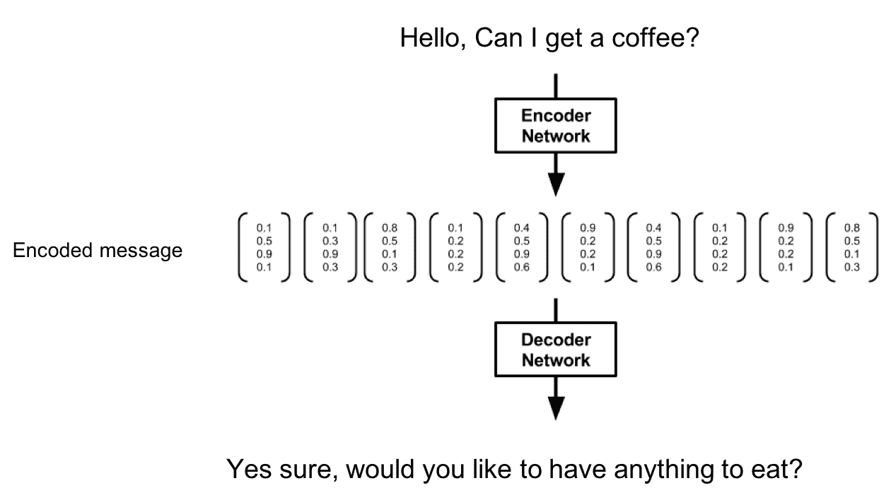

这是构建编码解码模型的示意图，该模型将输入文本（问题）传递到编码器，在中间步骤中进行转换，然后与解码器进行映射，解码器表示相应的文本（答案）。

让我们通过首先实现 RNN 模型的基本形式，来建立对 RNN 的直觉。

# 实现基本的 RNN

在本节中，我们将实现一个语言模型，使用基础的 RNN 进行情感分类。模型的代码文件可以在[`github.com/PacktPublishing/Python-Deep-Learning-Projects/blob/master/Chapter05/1.%20rnn.py`](https://github.com/PacktPublishing/Python-Deep-Learning-Projects/blob/master/Chapter05/1.%20rnn.py)找到。

# 导入所有依赖项

这段代码导入了 TensorFlow 和 RNN 的关键依赖项：

```py
from utils import *
import tensorflow as tf
from sklearn.cross_validation import train_test_split
import time
```

# 准备数据集

在本项目中，我们将使用来自 Rotten Tomatoes 的*电影评论数据*([`www.cs.cornell.edu/people/pabo/movie-review-data/`](http://www.cs.cornell.edu/people/pabo/movie-review-data/))。该数据集包含 10,662 个示例评论句子，约一半是正面评价，一半是负面评价。数据集的词汇量约为 20,000 个单词。我们将使用`sklearn`包装器从原始文件加载数据集，然后使用`separate_dataset()`辅助函数清理数据集，并将其从原始形式转换为分离的列表结构：

```py
#Helper function
def separate_dataset(trainset,ratio=0.5):
   datastring = []
    datatarget = []
    for i in range(int(len(trainset.data)*ratio)):
        data_ = trainset.data[i].split('\n')
        data_ = list(filter(None, data_))
        for n in range(len(data_)):
            data_[n] = clearstring(data_[n])
        datastring += data_
        for n in range(len(data_)):
            datatarget.append(trainset.target[i])
    return datastring, datatarget
```

在这里，`trainset`是一个存储所有文本数据和情感标签数据的对象：

```py
trainset = sklearn.datasets.load_files(container_path = './data', encoding = 'UTF-8')
trainset.data, trainset.target = separate_dataset(trainset,1.0)
print (trainset.target_names)
print ('No of training data' , len(trainset.data))
print ('No. of test data' , len(trainset.target))

# Output: ['negative', 'positive']
No of training data 10662
No of test data 10662
```

现在我们将标签转化为一热编码。

理解一热编码向量的维度很重要。由于我们有`10662`个独立的句子，且有两个情感类别，`negative`和`positive`，因此我们的“一热”向量的大小将是[*10662, 2*]。

我们将使用一个流行的`train_test_split()` sklearn 包装器来随机打乱数据，并将数据集分为两个部分：`training`集和`test`集。进一步地，借助另一个`build_dataset()`辅助函数，我们将使用基于词频的方式创建词汇表：

```py
ONEHOT = np.zeros((len(trainset.data),len(trainset.target_names)))
ONEHOT[np.arange(len(trainset.data)),trainset.target] = 1.0
train_X, test_X, train_Y, test_Y, train_onehot, test_onehot = train_test_split(trainset.data, trainset.target, 
ONEHOT, test_size = 0.2)

concat = ' '.join(trainset.data).split()
vocabulary_size = len(list(set(concat)))
data, count, dictionary, rev_dictionary = build_dataset(concat, vocabulary_size)
print('vocab from size: %d'%(vocabulary_size))
print('Most common words', count[4:10])
print('Sample data', data[:10], [rev_dictionary[i] for i in data[:10]])

# OUTPUT:vocab from size: 20465
'Most common words', [(u'the', 10129), (u'a', 7312), (u'and', 6199), (u'of', 6063), (u'to', 4233), (u'is', 3378)]

'Sample data': 
[4, 662, 9, 2543, 8, 22, 4, 3558, 18064, 98] --> 
[u'the', u'rock', u'is', u'destined', u'to', u'be', u'the', u'21st', u'centurys', u'new']
```

你也可以尝试将任何嵌入模型放入这里，以提高模型的准确性。

在为 RNN 模型准备数据集时，有一些重要的事项需要记住。我们需要在词汇表中明确添加特殊标签，以跟踪句子的开始、额外的填充、句子的结束以及任何未知的词汇。因此，我们在词汇字典中为特殊标签保留了以下位置：

```py
# Tag to mark the beginning of the sentence
'GO' = 0th position
# Tag to add extra padding in the sentence
'PAD'= 1st position
# Tag to mark the end of the sentence
'EOS'= 2nd position
# Tag to mark the unknown word
'UNK'= 3rd position
```

# 超参数

我们将为模型定义一些超参数，如下所示：

```py
size_layer = 128
num_layers = 2
embedded_size = 128
dimension_output = len(trainset.target_names)
learning_rate = 1e-3
maxlen = 50
batch_size = 128
```

# 定义一个基本的 RNN 单元模型

现在我们将创建 RNN 模型，它需要几个输入参数，包括以下内容：

+   `size_layer`：RNN 单元中的单元数

+   `num_layers`：隐藏层的数量

+   `embedded_size`：嵌入的大小

+   `dict_size`：词汇表大小

+   `dimension_output`：我们需要分类的类别数

+   `learning_rate`：优化算法的学习率

我们的 RNN 模型架构由以下部分组成：

1.  两个占位符；一个用于将序列数据输入模型，另一个用于输出

1.  用于存储从词典中查找嵌入的变量

1.  然后，添加包含多个基本 RNN 单元的 RNN 层

1.  创建权重和偏差变量

1.  计算`logits`

1.  计算损失

1.  添加 Adam 优化器

1.  计算预测和准确率

这个模型类似于前一章中创建的 CNN 模型，第四章，*构建自然语言处理管道以创建聊天机器人*，除了 RNN 单元部分：

```py
class Model:
    def __init__(self, size_layer, num_layers, embedded_size,
                 dict_size, dimension_output, learning_rate):

        def cells(reuse=False):
            return tf.nn.rnn_cell.BasicRNNCell(size_layer,reuse=reuse)

        self.X = tf.placeholder(tf.int32, [None, None])
        self.Y = tf.placeholder(tf.float32, [None, dimension_output])

        encoder_embeddings = tf.Variable(tf.random_uniform([dict_size, embedded_size], -1, 1))
        encoder_embedded = tf.nn.embedding_lookup(encoder_embeddings, self.X)

        rnn_cells = tf.nn.rnn_cell.MultiRNNCell([cells() for _ in range(num_layers)])
        outputs, _ = tf.nn.dynamic_rnn(rnn_cells, encoder_embedded, dtype = tf.float32)

        W = tf.get_variable('w',shape=(size_layer, dimension_output),initializer=tf.orthogonal_initializer())
        b = tf.get_variable('b',shape=(dimension_output),initializer=tf.zeros_initializer())

        self.logits = tf.matmul(outputs[:, -1], W) + b
        self.cost = tf.reduce_mean(tf.nn.softmax_cross_entropy_with_logits(logits = self.logits, labels = self.Y))
        self.optimizer = tf.train.AdamOptimizer(learning_rate = learning_rate).minimize(self.cost)

        correct_pred = tf.equal(tf.argmax(self.logits, 1), tf.argmax(self.Y, 1))
        self.accuracy = tf.reduce_mean(tf.cast(correct_pred, tf.float32))
```

在这个模型中，数据从我们在*步骤 1*中创建的变量流动。接着，它进入在*步骤 2*中定义的嵌入层，然后是我们的 RNN 层，它在两个隐藏层的 RNN 单元中执行计算。之后，`logits`通过进行权重与 RNN 层输出的矩阵乘法并加上偏差来计算。最后一步是我们定义`cost`函数；我们将使用`softmax_cross_entropy`函数。

这是计算后完整模型的样子：

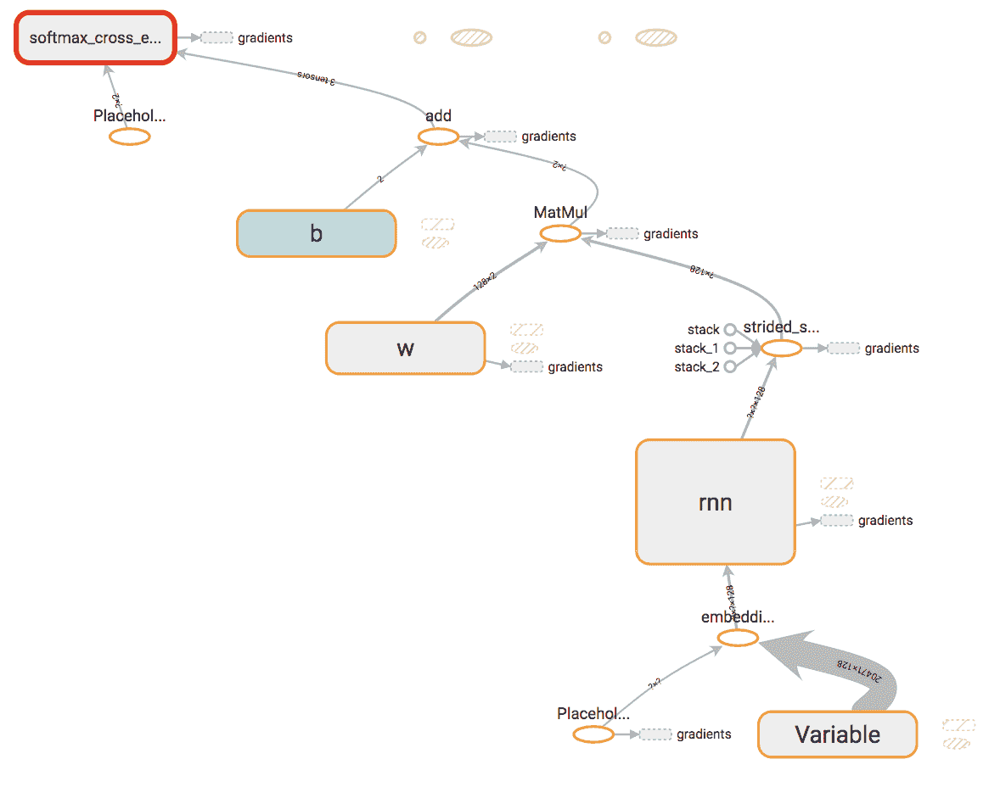

TensorBoard 图形可视化 RNN 架构

下图表示前面截图中的 RNN 块结构。在这个架构中，我们有两个 RNN 单元被集成在隐藏层中：

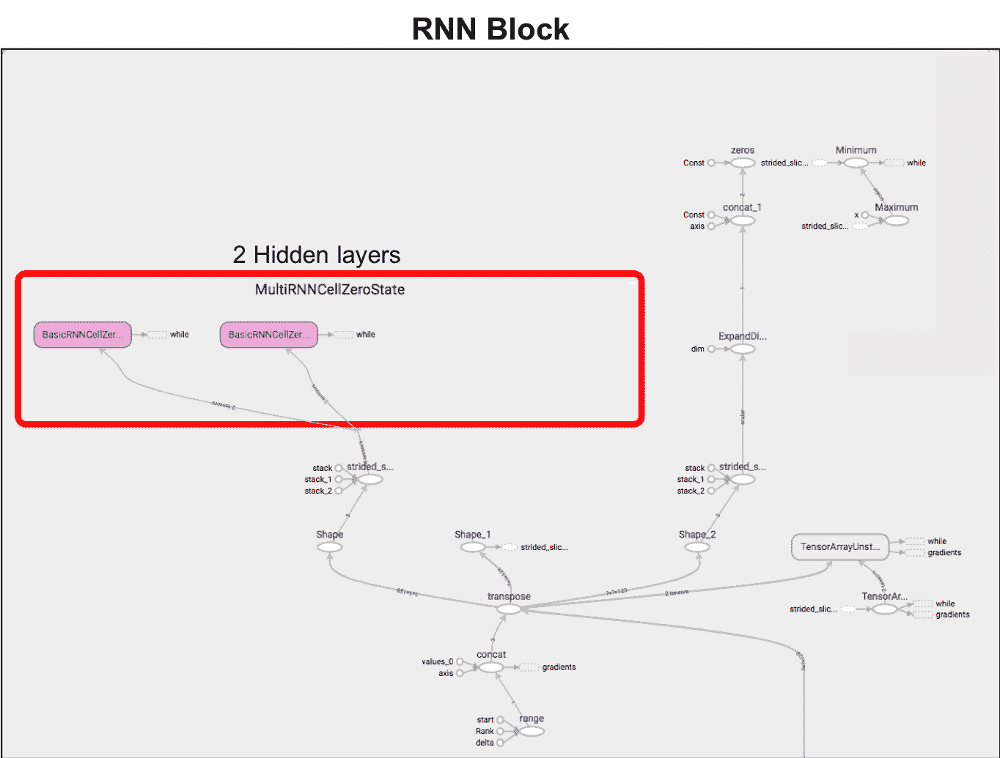

TensorBoard 可视化 RNN 块，其中包含代码中定义的 2 个隐藏层

# 训练 RNN 模型

现在我们已经定义了模型架构，接下来让我们训练模型。我们从 TensorFlow 图初始化开始，并按以下步骤执行训练：

```py
tf.reset_default_graph()
sess = tf.InteractiveSession()
model = Model(size_layer,num_layers,embedded_size,vocabulary_size+4,dimension_output,learning_rate)
sess.run(tf.global_variables_initializer())

EARLY_STOPPING, CURRENT_CHECKPOINT, CURRENT_ACC, EPOCH = 5, 0, 0, 0
while True:
    lasttime = time.time()
    if CURRENT_CHECKPOINT == EARLY_STOPPING:
        print('break epoch:%d\n'%(EPOCH))
        break

    train_acc, train_loss, test_acc, test_loss = 0, 0, 0, 0
    for i in range(0, (len(train_X) // batch_size) * batch_size, batch_size):
        batch_x = str_idx(train_X[i:i+batch_size],dictionary,maxlen)
        acc, loss, _ = sess.run([model.accuracy, model.cost, model.optimizer], 
                           feed_dict = {model.X : batch_x, model.Y : train_onehot[i:i+batch_size]})
        train_loss += loss
        train_acc += acc

    for i in range(0, (len(test_X) // batch_size) * batch_size, batch_size):
        batch_x = str_idx(test_X[i:i+batch_size],dictionary,maxlen)
        acc, loss = sess.run([model.accuracy, model.cost], 
                           feed_dict = {model.X : batch_x, model.Y : train_onehot[i:i+batch_size]})
        test_loss += loss
        test_acc += acc

    train_loss /= (len(train_X) // batch_size)
    train_acc /= (len(train_X) // batch_size)
    test_loss /= (len(test_X) // batch_size)
    test_acc /= (len(test_X) // batch_size)

    if test_acc > CURRENT_ACC:
        print('epoch: %d, pass acc: %f, current acc: %f'%(EPOCH,CURRENT_ACC, test_acc))
        CURRENT_ACC = test_acc
        CURRENT_CHECKPOINT = 0
    else:
        CURRENT_CHECKPOINT += 1

    print('time taken:', time.time()-lasttime)
   print('epoch: %d, training loss: %f, training acc: %f, valid loss: %f, valid acc: %f\n'%(EPOCH,train_loss, train_acc,test_loss,test_acc))
    EPOCH += 1

```

在训练 RNN 模型时，我们可以看到每个 epoch 的日志，如下所示：

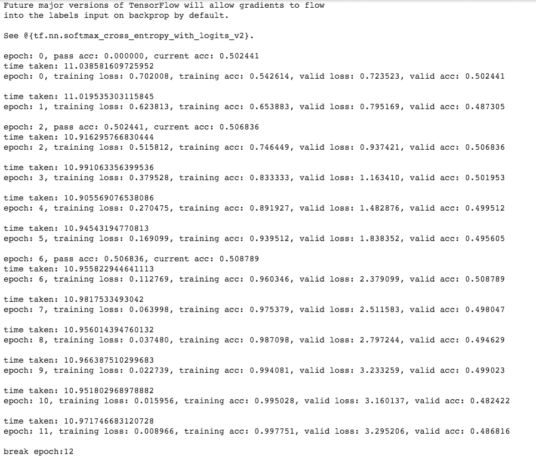

# RNN 模型评估

让我们来看看结果。一旦模型训练完成，我们就可以输入本章前面准备好的测试数据并评估预测结果。在这种情况下，我们将使用几种不同的指标来评估模型：精度、召回率和 F1 分数。

为了评估您的模型，选择合适的指标非常重要——与准确率分数相比，F1 分数被认为更为实用。

以下是一些帮助你简单理解这些概念的关键点：

+   **准确率**：正确预测的数量除以已评估的总样本数。

+   **精度**：高精度意味着你正确识别了几乎所有的正例；低精度意味着你经常错误地预测出一个正例，而实际上并没有。

+   **召回率**：高召回率意味着你正确预测了数据中几乎所有的真实正例；低召回率意味着你经常漏掉实际存在的正例。

+   **F1 分数**：召回率和精度的平衡调和均值，给予这两个指标相等的权重。F1 分数越高，表现越好。

现在我们将通过提供包含词汇表和文本最大长度的测试数据来执行模型。这将生成`logits`值，我们将利用这些值来生成评估指标：

```py
logits = sess.run(model.logits, feed_dict={model.X:str_idx(test_X,dictionary,maxlen)})
print(metrics.classification_report(test_Y, np.argmax(logits,1), target_names = trainset.target_names))
```

输出结果如下：

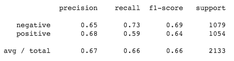

在这里，我们可以看到使用基本 RNN 单元时，我们的平均`f1-score`是 66%。让我们看看是否通过使用其他 RNN 架构变体能有所改进。

# LSTM 架构

为了更有效地建模序列数据，并且克服梯度问题的限制，研究人员创造了 LSTM 变体，这是在之前的 RNN 模型架构基础上发展出来的。LSTM 由于引入了控制细胞内存过程的门控机制，因此能够实现更好的性能。以下图示展示了一个 LSTM 单元：

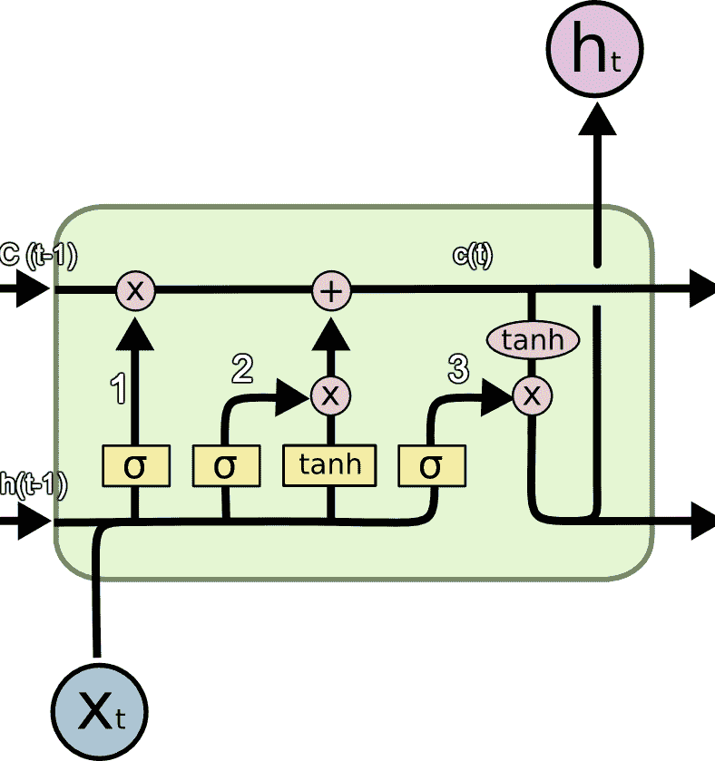

LSTM 单元（来源：http://colah.github.io/posts/2015-08-Understanding-LSTMs）

LSTM 由三个主要部分组成，在上述图示中标记为**1**、**2**和**3**：

1.  **遗忘门 f(t)**：该门控机制在 LSTM 单元架构中提供了忘记不需要信息的能力。Sigmoid 激活函数接受输入*X(t)*和**h(t-1)**，并有效地决定通过传递*0*来移除旧的输出信息。该门控的输出是*f(t)*c(t-1)*。

1.  从新输入的 *X(t)* 中，需要保留的信息将在下一步中存储在单元状态中。此过程中使用了一个 sigmoid 激活函数来更新或忽略新信息的部分。接下来，通过 **tanh** 激活函数创建一个包含新输入所有可能值的向量。新单元状态是这两个值的乘积，然后将这个新记忆添加到旧记忆 **c(t-1)** 中，得出 **c(t)**。

1.  LSTM 单元的最后一个过程是确定最终输出。一个 sigmoid 层决定输出单元状态的哪些部分。然后，我们将单元状态通过 **tanh** 激活生成所有可能的值，并将其与 sigmoid 门的输出相乘，以根据非线性函数产生所需的输出。

LSTM 单元过程中的这三步产生了显著的效果，即模型可以被训练去学习哪些信息需要保存在长期记忆中，哪些信息需要被遗忘。真是天才！

# 实现 LSTM 模型

我们之前执行的构建基本 RNN 模型的过程将保持不变，唯一的区别是模型定义部分。所以，让我们实现这个并检查新模型的性能。

模型的代码可以在 [`github.com/PacktPublishing/Python-Deep-Learning-Projects/blob/master/Chapter05/2.%20rnn_lstm.py`](https://github.com/PacktPublishing/Python-Deep-Learning-Projects/blob/master/Chapter05/2.%20rnn_lstm.py) 查看。

# 定义我们的 LSTM 模型

再次，大部分代码将保持不变——唯一的主要变化是使用 `tf.nn.rnn_cell.LSTMCell()`，而不是 `tf.nn.rnn_cell.BasicRNNCell()`。在初始化 LSTM 单元时，我们使用了一个正交初始化器，它会生成一个随机的正交矩阵，这是对抗梯度爆炸和消失的有效方法：

```py
class Model:
    def __init__(self, size_layer, num_layers, embedded_size,
                 dict_size, dimension_output, learning_rate):

        def cells(reuse=False):
            return tf.nn.rnn_cell.LSTMCell(size_layer,initializer=tf.orthogonal_initializer(),reuse=reuse)

        self.X = tf.placeholder(tf.int32, [None, None])
        self.Y = tf.placeholder(tf.float32, [None, dimension_output])

        encoder_embeddings = tf.Variable(tf.random_uniform([dict_size, embedded_size], -1, 1))
        encoder_embedded = tf.nn.embedding_lookup(encoder_embeddings, self.X)

        rnn_cells = tf.nn.rnn_cell.MultiRNNCell([cells() for _ in range(num_layers)])
        outputs, _ = tf.nn.dynamic_rnn(rnn_cells, encoder_embedded, dtype = tf.float32)

        W = tf.get_variable('w',shape=(size_layer, dimension_output),initializer=tf.orthogonal_initializer())
        b = tf.get_variable('b',shape=(dimension_output),initializer=tf.zeros_initializer())

        self.logits = tf.matmul(outputs[:, -1], W) + b
        self.cost = tf.reduce_mean(tf.nn.softmax_cross_entropy_with_logits(logits = self.logits, labels = self.Y))
        self.optimizer = tf.train.AdamOptimizer(learning_rate = learning_rate).minimize(self.cost)

        correct_pred = tf.equal(tf.argmax(self.logits, 1), tf.argmax(self.Y, 1))
        self.accuracy = tf.reduce_mean(tf.cast(correct_pred, tf.float32))
```

所以，这是 LSTM 模型的架构——与之前的基本模型几乎相同，唯一的不同是增加了 LSTM 单元在**RNN 块**中的位置：

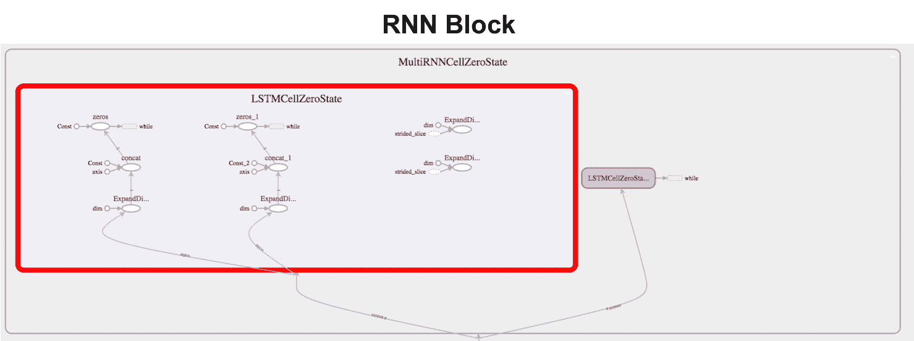

# 训练 LSTM 模型

现在，我们已经建立了 LSTM 直觉并构建了模型，让我们按照以下方式训练它：

```py
EARLY_STOPPING, CURRENT_CHECKPOINT, CURRENT_ACC, EPOCH = 5, 0, 0, 0
while True:
    lasttime = time.time()
    if CURRENT_CHECKPOINT == EARLY_STOPPING:
        print('break epoch:%d\n'%(EPOCH))
        break

    train_acc, train_loss, test_acc, test_loss = 0, 0, 0, 0
    for i in range(0, (len(train_X) // batch_size) * batch_size, batch_size):
        batch_x = str_idx(train_X[i:i+batch_size],dictionary,maxlen)
        acc, loss, _ = sess.run([model.accuracy, model.cost, model.optimizer], 
                           feed_dict = {model.X : batch_x, model.Y : train_onehot[i:i+batch_size]})
        train_loss += loss
        train_acc += acc

    for i in range(0, (len(test_X) // batch_size) * batch_size, batch_size):
        batch_x = str_idx(test_X[i:i+batch_size],dictionary,maxlen)
        acc, loss = sess.run([model.accuracy, model.cost], 
                           feed_dict = {model.X : batch_x, model.Y : train_onehot[i:i+batch_size]})
        test_loss += loss
        test_acc += acc

    train_loss /= (len(train_X) // batch_size)
    train_acc /= (len(train_X) // batch_size)
    test_loss /= (len(test_X) // batch_size)
    test_acc /= (len(test_X) // batch_size)

    if test_acc > CURRENT_ACC:
        print('epoch: %d, pass acc: %f, current acc: %f'%(EPOCH,CURRENT_ACC, test_acc))
        CURRENT_ACC = test_acc
        CURRENT_CHECKPOINT = 0
    else:
        CURRENT_CHECKPOINT += 1

    print('time taken:', time.time()-lasttime)
    print('epoch: %d, training loss: %f, training acc: %f, valid loss: %f, valid acc: %f\n'%(EPOCH,train_loss,
                                                                                          train_acc,test_loss,
                                                                                          test_acc))
    EPOCH += 1
```

在 LSTM 模型训练时，我们可以看到每个 epoch 的日志，如下截图所示：

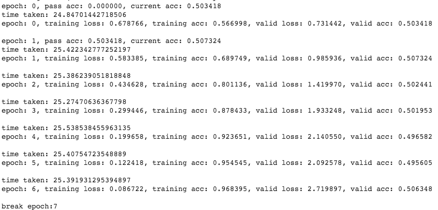

以下是输出结果：

```py
('time taken:', 18.061596155166626)
epoch: 10, training loss: 0.015714, training acc: 0.994910, valid loss: 4.252270, valid acc: 0.500000

('time taken:', 17.786305904388428)
epoch: 11, training loss: 0.011198, training acc: 0.995975, valid loss: 4.644272, valid acc: 0.502441

('time taken:', 19.031064987182617)
epoch: 12, training loss: 0.009245, training acc: 0.996686, valid loss: 4.575824, valid acc: 0.499512

('time taken:', 16.996762990951538)
epoch: 13, training loss: 0.006528, training acc: 0.997751, valid loss: 4.449901, valid acc: 0.501953

('time taken:', 17.008245944976807)
epoch: 14, training loss: 0.011770, training acc: 0.995739, valid loss: 4.282045, valid acc: 0.499023

break epoch:15
```

你会注意到，即使使用相同的模型配置，基于 LSTM 的模型所需的训练时间仍然比 RNN 模型要长。

# LSTM 模型的评估

现在，让我们再次计算指标并比较性能：

```py
logits = sess.run(model.logits, feed_dict={model.X:str_idx(test_X,dictionary,maxlen)})
print(metrics.classification_report(test_Y, np.argmax(logits,1), target_names = trainset.target_names))
```

计算的输出如下所示：

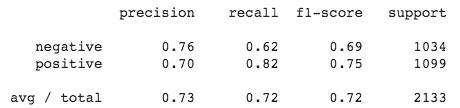

因此，我们可以清晰地看到模型性能的提升！现在，使用 LSTM 后，`f1-score` 提高到了 72%，而在我们之前的基本 RNN 模型中，它为 66%，这意味着提高了 7%，是一个相当不错的进步。

# 序列到序列模型

在本节中，我们将实现一个基于 LSTM 单元的 seq2seq 模型（编码器-解码器 RNN），用于一个简单的序列到序列的问答任务。这个模型可以训练将输入序列（问题）映射到输出序列（答案），这些答案的长度不一定与问题相同。

这种类型的 seq2seq 模型在其他许多任务中表现出色，如语音识别、机器翻译、问答、**神经机器翻译**（**NMT**）和图像描述生成。

以下图帮助我们可视化我们的 seq2seq 模型：

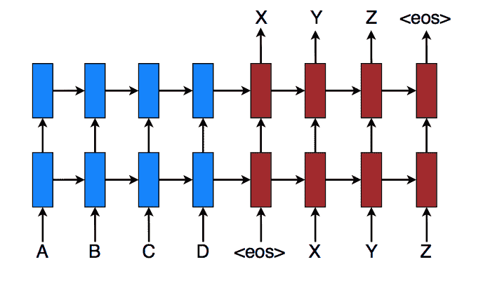

序列到序列（seq2seq）模型的示意图。每个矩形框表示一个 RNN 单元，其中蓝色的是编码器，红色的是解码器。

在编码器-解码器结构中，一个 RNN（蓝色）**编码**输入序列。编码器输出上下文**C**，通常是其最终隐藏状态的简单函数。第二个 RNN（红色）**解码器**计算目标值并生成输出序列。一个关键步骤是让编码器和解码器进行通信。在最简单的方法中，您使用编码器的最后一个隐藏状态来初始化解码器。其他方法则让解码器在解码过程中在不同的时间步访问编码输入的不同部分。

现在，让我们开始进行数据准备、模型构建、训练、调优和评估我们的 seq2seq 模型，看看它的表现如何。

模型文件可以在[`github.com/PacktPublishing/Python-Deep-Learning-Projects/blob/master/Chapter05/3.%20rnn_lstm_seq2seq.py`](https://github.com/PacktPublishing/Python-Deep-Learning-Projects/blob/master/Chapter05/3.%20rnn_lstm_seq2seq.py)找到。

# 数据准备

在这里，我们将构建我们的问答系统。对于该项目，我们需要一个包含问题和答案对的数据集，如下图所示。两列数据都包含词序列，这正是我们需要输入到 seq2seq 模型中的内容。此外，请注意我们的句子可以具有动态长度：


我们准备的包含问题和答案的数据集

让我们加载它们并使用`build_dataset()`执行相同的数据处理。最终，我们将得到一个以单词为键的字典，相关值是该单词在相应语料中的出现次数。此外，我们还会得到之前在本章中提到的四个额外的值：

```py
import numpy as np
import tensorflow as tf
import collections
from utils import *

file_path = './conversation_data/'

with open(file_path+'from.txt', 'r') as fopen:
    text_from = fopen.read().lower().split('\n')
with open(file_path+'to.txt', 'r') as fopen:
    text_to = fopen.read().lower().split('\n')
print('len from: %d, len to: %d'%(len(text_from), len(text_to)))

concat_from = ' '.join(text_from).split()
vocabulary_size_from = len(list(set(concat_from)))
data_from, count_from, dictionary_from, rev_dictionary_from = build_dataset(concat_from, vocabulary_size_from)

concat_to = ' '.join(text_to).split()
vocabulary_size_to = len(list(set(concat_to)))
data_to, count_to, dictionary_to, rev_dictionary_to = build_dataset(concat_to, vocabulary_size_to)

GO = dictionary_from['GO']
PAD = dictionary_from['PAD']
EOS = dictionary_from['EOS']
UNK = dictionary_from['UNK']
```

# 定义一个 seq2seq 模型

在本节中，我们将概述 TensorFlow seq2seq 模型的定义。我们采用了一个嵌入层，将整数表示转化为输入的向量表示。这个 seq2seq 模型有四个主要组成部分：嵌入层、编码器、解码器和成本/优化器。

您可以在以下图表中查看模型的图形表示：

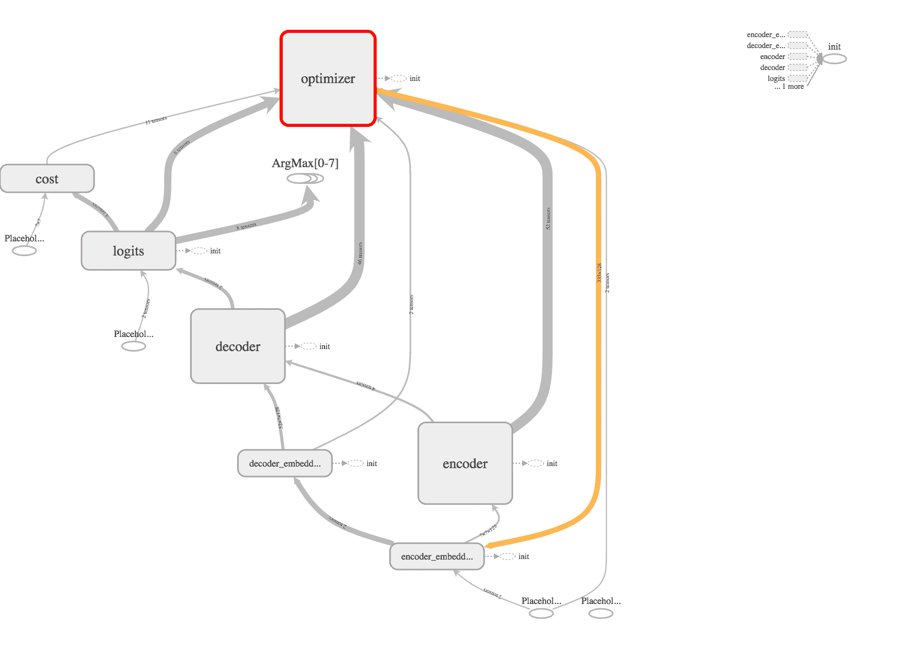

seq2seq 模型的 TensorBoard 可视化。该图显示了编码器与解码器之间的连接，以及其他相关组件如优化器。

以下是 TensorFlow seq2seq 模型定义的正式大纲：

```py
class Chatbot:
 def __init__(self, size_layer, num_layers, embedded_size,
 from_dict_size, to_dict_size, learning_rate, batch_size):

 def cells(reuse=False):
 return tf.nn.rnn_cell.LSTMCell(size_layer,initializer=tf.orthogonal_initializer(),reuse=reuse)

 self.X = tf.placeholder(tf.int32, [None, None])
 self.Y = tf.placeholder(tf.int32, [None, None])
 self.X_seq_len = tf.placeholder(tf.int32, [None])
 self.Y_seq_len = tf.placeholder(tf.int32, [None])

 with tf.variable_scope("encoder_embeddings"): 
 encoder_embeddings = tf.Variable(tf.random_uniform([from_dict_size, embedded_size], -1, 1))
 encoder_embedded = tf.nn.embedding_lookup(encoder_embeddings, self.X)
 main = tf.strided_slice(self.X, [0, 0], [batch_size, -1], [1, 1])

 with tf.variable_scope("decoder_embeddings"): 
 decoder_input = tf.concat([tf.fill([batch_size, 1], GO), main], 1)
 decoder_embeddings = tf.Variable(tf.random_uniform([to_dict_size, embedded_size], -1, 1))
 decoder_embedded = tf.nn.embedding_lookup(encoder_embeddings, decoder_input)

 with tf.variable_scope("encoder"):
 rnn_cells = tf.nn.rnn_cell.MultiRNNCell([cells() for _ in range(num_layers)])
 _, last_state = tf.nn.dynamic_rnn(rnn_cells, encoder_embedded,
 dtype = tf.float32)
 with tf.variable_scope("decoder"):
 rnn_cells_dec = tf.nn.rnn_cell.MultiRNNCell([cells() for _ in range(num_layers)])
 outputs, _ = tf.nn.dynamic_rnn(rnn_cells_dec, decoder_embedded, 
 initial_state = last_state,
 dtype = tf.float32)
 with tf.variable_scope("logits"): 
 self.logits = tf.layers.dense(outputs,to_dict_size)
 print(self.logits)
 masks = tf.sequence_mask(self.Y_seq_len, tf.reduce_max(self.Y_seq_len), dtype=tf.float32)
 with tf.variable_scope("cost"): 
 self.cost = tf.contrib.seq2seq.sequence_loss(logits = self.logits,
 targets = self.Y,
 weights = masks)
 with tf.variable_scope("optimizer"): 
 self.optimizer = tf.train.AdamOptimizer(learning_rate = learning_rate).minimize(self.cost)
```

# 超参数

现在我们已经准备好模型定义，我们将定义超参数。我们将保持大部分配置与之前相同：

```py
size_layer = 128
num_layers = 2
embedded_size = 128
learning_rate = 0.001
batch_size = 32
epoch = 50
```

# 训练 seq2seq 模型

现在，让我们来训练模型。我们将需要一些辅助函数来填充句子并计算模型的准确率：

```py
def pad_sentence_batch(sentence_batch, pad_int):
    padded_seqs = []
    seq_lens = []
    max_sentence_len = 50
    for sentence in sentence_batch:
        padded_seqs.append(sentence + [pad_int] * (max_sentence_len - len(sentence)))
        seq_lens.append(50)
    return padded_seqs, seq_lens

def check_accuracy(logits, Y):
    acc = 0
    for i in range(logits.shape[0]):
        internal_acc = 0
        for k in range(len(Y[i])):
            if Y[i][k] == logits[i][k]:
                internal_acc += 1
        acc += (internal_acc / len(Y[i]))
    return acc / logits.shape[0]
```

我们初始化模型并迭代会话，训练指定的 epoch 次数：

```py
tf.reset_default_graph()
sess = tf.InteractiveSession()
model = Chatbot(size_layer, num_layers, embedded_size, vocabulary_size_from + 4, 
                vocabulary_size_to + 4, learning_rate, batch_size)
sess.run(tf.global_variables_initializer())

for i in range(epoch):
 total_loss, total_accuracy = 0, 0
 for k in range(0, (len(text_from) // batch_size) * batch_size, batch_size):
 batch_x, seq_x = pad_sentence_batch(X[k: k+batch_size], PAD)
 batch_y, seq_y = pad_sentence_batch(Y[k: k+batch_size], PAD)
 predicted, loss, _ = sess.run([tf.argmax(model.logits,2), model.cost, model.optimizer], 
 feed_dict={model.X:batch_x,
 model.Y:batch_y,
 model.X_seq_len:seq_x,
 model.Y_seq_len:seq_y})
 total_loss += loss
 total_accuracy += check_accuracy(predicted,batch_y)
 total_loss /= (len(text_from) // batch_size)
 total_accuracy /= (len(text_from) // batch_size)
 print('epoch: %d, avg loss: %f, avg accuracy: %f'%(i+1, total_loss, total_accuracy))

OUTPUT:
epoch: 47, avg loss: 0.682934, avg accuracy: 0.000000
epoch: 48, avg loss: 0.680367, avg accuracy: 0.000000
epoch: 49, avg loss: 0.677882, avg accuracy: 0.000000
epoch: 50, avg loss: 0.678484, avg accuracy: 0.000000
.
.
.
epoch: 1133, avg loss: 0.000464, avg accuracy: 1.000000
epoch: 1134, avg loss: 0.000462, avg accuracy: 1.000000
epoch: 1135, avg loss: 0.000460, avg accuracy: 1.000000
epoch: 1136, avg loss: 0.000457, avg accuracy: 1.000000
```

# 评估 seq2seq 模型。

所以，在 GPU 上运行训练过程几个小时后，你可以看到准确率已达到`1.0`，并且损失显著降低至`0.00045`。让我们看看当我们提出一些通用问题时，模型表现如何。

为了进行预测，我们将创建一个 `predict()` 函数，它将接受任意大小的原始文本作为输入，并返回我们提出问题的答案。我们对 **Out Of Vocab**（**OOV**）词汇进行了快速修复，通过将其替换为 `PAD` 来处理：

```py
def predict(sentence):
    X_in = []
    for word in sentence.split():
        try:
            X_in.append(dictionary_from[word])
        except:
            X_in.append(PAD)
            pass

    test, seq_x = pad_sentence_batch([X_in], PAD)
    input_batch = np.zeros([batch_size,seq_x[0]])
    input_batch[0] =test[0] 

    log = sess.run(tf.argmax(model.logits,2), 
                                      feed_dict={
                                              model.X:input_batch,
                                              model.X_seq_len:seq_x,
                                              model.Y_seq_len:seq_x
                                              }
                                      )

    result=' '.join(rev_dictionary_to[i] for i in log[0])
    return result
```

当模型经过前 50 次 epoch 训练后，我们得到了以下结果：

```py
>> predict('where do you live')
>> i PAD PAD PAD PAD PAD PAD PAD PAD PAD PAD PAD PAD PAD PAD PAD PAD PAD PAD PAD PAD PAD PAD PAD PAD PAD PAD PAD PAD PAD PAD PAD PAD PAD PAD PAD PAD PAD PAD PAD PAD PAD PAD PAD PAD PAD PAD PAD PAD PAD

>> print predict('how are you ?')
>> i am PAD PAD PAD PAD PAD PAD PAD PAD PAD PAD PAD PAD PAD PAD PAD PAD PAD PAD PAD PAD PAD PAD PAD PAD PAD PAD PAD PAD PAD PAD PAD PAD PAD PAD PAD PAD PAD PAD PAD PAD PAD PAD PAD PAD PAD PAD PAD PAD
```

当模型训练了 1,136 个 epoch 后：

```py
>> predict('where do you live')
>> miami florida PAD PAD PAD PAD PAD PAD PAD PAD PAD PAD PAD PAD PAD PAD PAD PAD PAD PAD PAD PAD PAD PAD PAD PAD PAD PAD PAD PAD PAD PAD PAD PAD PAD PAD PAD PAD PAD PAD PAD PAD PAD PAD PAD PAD PAD PAD PAD PAD

>> print predict('how are you ?')
>> i am fine thank you PAD PAD PAD PAD PAD PAD PAD PAD PAD PAD PAD PAD PAD PAD PAD PAD PAD PAD PAD PAD PAD PAD PAD PAD PAD PAD PAD PAD PAD PAD PAD PAD PAD PAD PAD PAD PAD PAD PAD PAD PAD PAD PAD PAD PAD
```

哇！这很令人印象深刻，对吧？现在你的模型不仅能理解上下文，还能逐词生成回答。

# 总结

在本章中，我们涵盖了基本的 RNN 单元、LSTM 单元，以及 seq2seq 模型，构建了一个可以用于多种 NLP 任务的语言模型。我们从头开始实现了一个聊天机器人，通过从提供的数据集中生成词语序列来回答问题。

这次练习的经验展示了 LSTM 作为 RNN 的一个常见必要组件的价值。有了 LSTM，我们能够看到以下相较于过去的 CNN 模型的改进：

+   LSTM 能够保持状态信息。

+   输入和输出的句子长度可能是可变且不同的。

+   LSTM 能够有效地处理复杂的上下文。

具体来说，在本章中，我们做了以下工作：

+   获得了对 RNN 及其主要形式的直觉理解。

+   实现了一个基于 RNN 的语言模型。

+   学习了 LSTM 模型。

+   实现了 LSTM 语言模型并与 RNN 进行了比较。

+   实现了一个基于 LSTM 单元的编码器-解码器 RNN，用于一个简单的序列到序列的问答任务。

有了正确的训练数据，就有可能使用这个模型实现假设客户（餐饮连锁店）的目标，即构建一个强大的聊天机器人（结合我们探索的其他计算语言学技术），可以自动化电话订餐过程。

做得好！
