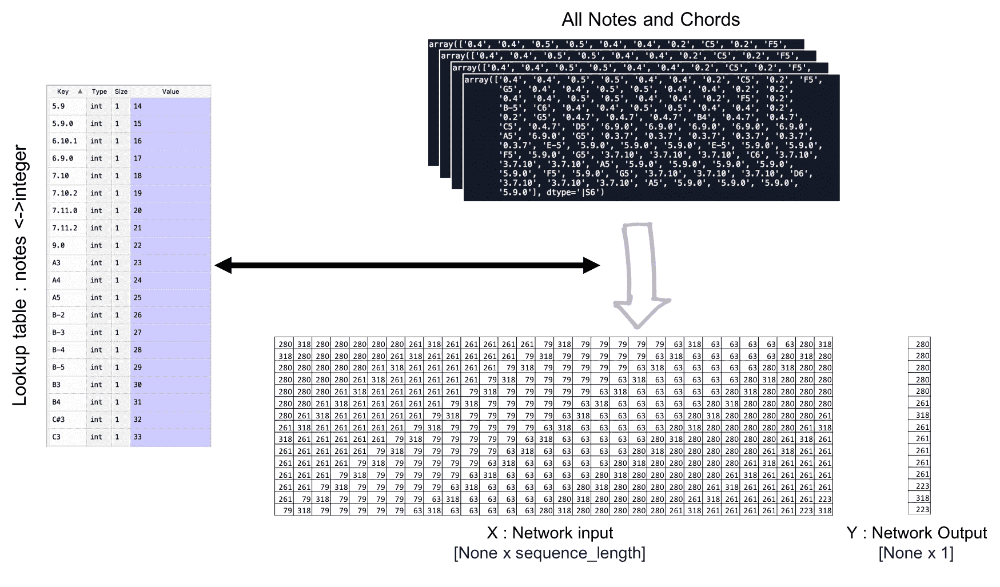

# 第六章：内容创作的生成性语言模型

这项工作无疑令人兴奋，而且已经有消息传出，我们正在展示一套专业的深度学习能力，通过为各种商业用例提供解决方案！作为数据科学家，我们理解自己技能的可迁移性。我们知道，在处理我们知道结构上相似但乍看之下不同的问题时，通过运用核心技能，我们能够提供价值。这一点在下一个深度学习项目中尤为真实。接下来，我们（假设性地）将参与一个项目，创意团队请求我们帮助为电影剧本、歌曲歌词，甚至音乐创作一些原创内容！

我们如何将解决餐饮连锁店问题的经验，运用到如此不同的行业中呢？让我们探索一下我们所知道的和将要做的事情。在过去的项目中，我们展示了如何以图像为输入并输出类别标签（第二章，*使用回归进行预测的神经网络训练*）；我们训练了一个模型，接受文本输入并输出情感分类（第三章，*使用 word2vec 进行词汇表示*）；我们构建了一个开放领域问题解答聊天机器人的 NLP 管道，接受文本输入并从语料库中提取相关文本作为适当输出（第四章，*为构建聊天机器人构建 NLP 管道*）；我们还扩展了该聊天机器人的功能，使其能够为餐厅提供自动化点餐系统服务（第五章，*用于构建聊天机器人的序列到序列模型*）。

**定义目标**：在这个项目中，我们将迈出计算语言学旅程的下一步，在 *Python 深度学习项目* 中为客户生成新的内容。我们需要通过提供一个深度学习解决方案来帮助他们，生成可用于电影剧本、歌曲歌词和音乐的新内容。

在本章中，我们将实现一个生成模型，使用 **长短期记忆**（**LSTM**）、变分自编码器和 **生成对抗网络**（**GANs**）来生成内容。我们将实现用于文本和图像的模型，生成图像和文本供艺术家和各种商业使用。

在本章中，我们将讨论以下主题：

+   使用 LSTM 进行文本生成

+   双向 LSTM 在文本生成中的额外优势

+   深度（多层）LSTM 生成歌曲歌词

+   深度（多层）LSTM 音乐生成用于歌曲创作

# LSTM 在文本生成中的应用

在本节中，我们将探索一种流行的深度学习模型：**循环神经网络**（**RNN**），以及它如何用于生成序列数据。在深度学习中，创建序列数据的通用方法是训练一个模型（通常是 RNN 或 ConvNet）来预测序列中的下一个标记或下几个标记，基于前面的标记作为输入。例如，假设我们给定输入句子：`I love to work in deep learning`。我们将训练该网络以预测下一个字符作为目标。

在处理文本数据时，标记通常是单词或字符，任何能够基于前一个标记预测下一个标记的网络都称为语言模型，它可以捕捉语言的潜在空间。

训练语言模型后，我们可以开始输入一些初始文本，要求它生成下一个标记，然后将生成的标记重新输入语言模型，以预测更多的标记。对于我们的假设用例，我们的创意客户将使用此模型，并随后提供一些文本示例，我们将被要求在该风格下创建新的内容。

构建文本生成模型的第一步是导入所需的所有模块。该项目将使用 Keras API 来创建模型，Keras 工具将用于下载数据集。为了构建文本生成模块，我们需要大量简单的文本数据。

你可以在[`github.com/PacktPublishing/Python-Deep-Learning-Projects/blob/master/Chapter06/Basics/generative_text.py`](https://github.com/PacktPublishing/Python-Deep-Learning-Projects/blob/master/Chapter06/Basics/generative_text.py)找到该代码文件：

```py
import keras
import numpy as np
from keras import layers
# Gather data
path = keras.utils.get_file(
    'sample.txt',
    origin='https://s3.amazonaws.com/text-datasets/nietzsche.txt')
text = open(path).read().lower()
print('Number of words in corpus:', len(text))
```

# 数据预处理

让我们执行数据预处理，将原始数据转换为编码形式。我们将提取固定长度的句子，使用独热编码过程对它们进行编码，最后构建一个形状为（`sequence`，`maxlen`，`unique_characters`）的张量，如下图所示。同时，我们将准备目标向量`y`，用于包含每个提取序列后续的字符。

以下是我们将用于预处理数据的代码：

```py
# Length of extracted character sequences
maxlen = 100

# We sample a new sequence every 5 characters
step = 5

# List to hold extracted sequences
sentences = []

# List to hold the target characters 
next_chars = []

# Extracting sentences and the next characters.
for i in range(0, len(text) - maxlen, step):
    sentences.append(text[i: i + maxlen])
    next_chars.append(text[i + maxlen])
print('Number of sequences:', len(sentences))

# List of unique characters in the corpus
chars = sorted(list(set(text)))

# Dictionary mapping unique characters to their index in `chars`
char_indices = dict((char, chars.index(char)) for char in chars)

# Converting characters into one-hot encoding.
x = np.zeros((len(sentences), maxlen, len(chars)), dtype=np.bool)
y = np.zeros((len(sentences), len(chars)), dtype=np.bool)
for i, sentence in enumerate(sentences):
    for t, char in enumerate(sentence):
        x[i, t, char_indices[char]] = 1
    y[i, char_indices[next_chars[i]]] = 1
```

以下是数据预处理的过程。我们已经将原始数据转换为张量，接下来将用于训练目的：


# 定义用于文本生成的 LSTM 模型

这个深度模型是一个由一个隐藏的 LSTM 层（具有`128`个内存单元）组成的网络，后面跟着一个`Dense`分类器层，并对所有可能的字符使用`softmax`激活函数。目标是独热编码，这意味着我们将使用`categorical_crossentropy`作为`loss`函数来训练模型。

以下代码块定义了模型的架构：

```py
model = keras.models.Sequential()
model.add(layers.LSTM(128, input_shape=(maxlen, len(chars))))
model.add(layers.Dense(len(chars), activation='softmax')) 

optimizer = keras.optimizers.RMSprop(lr=0.01)
model.compile(loss='categorical_crossentropy', optimizer=optimizer)
```

下图帮助我们可视化模型的架构：


# 训练模型

在文本生成中，选择后续字符的方式至关重要。最常见的方法（贪婪采样）会导致重复的字符，无法生成连贯的语言。这就是为什么我们使用一种不同的方法，称为**随机采样**。这种方法在预测概率分布中添加了一定程度的随机性。

使用以下代码重新加权预测概率分布并采样一个字符索引：

```py
def sample(preds, temperature=1.0):
    preds = np.asarray(preds).astype('float64')
    preds = np.log(preds) / temperature
    exp_preds = np.exp(preds)
    preds = exp_preds / np.sum(exp_preds)
    probas = np.random.multinomial(1, preds, 1)
    return np.argmax(probas)
```

现在，我们开始迭代训练和文本生成，首先进行 30 轮训练，然后对模型进行 1 次迭代拟合。接着，随机选择一个种子文本，将其转换为独热编码格式，并预测 100 个字符。最后，在每次迭代中将新生成的字符附加到种子文本后。

每次迭代后，通过使用不同的温度值进行生成。这样可以查看并理解在模型收敛时生成文本的演变，以及温度在采样策略中的影响。

**Temperature**是 LSTM 的超参数，它通过在应用 softmax 之前进行 logit 缩放来影响预测的随机性。

我们需要执行以下代码，以便训练模型：

```py
for epoch in range(1, 30):
    print('epoch', epoch)
    # Fit the model for 1 epoch 
    model.fit(x, y, batch_size=128, epochs=1, callbacks=callbacks_list)

 # Select a text seed randomly
    start_index = random.randint(0, len(text) - maxlen - 1)
    generated_text = text[start_index: start_index + maxlen]
    print('---Seeded text: "' + generated_text + '"')

    for temperature in [0.2, 0.5, 1.0, 1.2]:
        print('------ Selected temperature:', temperature)
        sys.stdout.write(generated_text)

        # We generate 100 characters
        for i in range(100):
            sampled = np.zeros((1, maxlen, len(chars)))
            for t, char in enumerate(generated_text):
                sampled[0, t, char_indices[char]] = 1.

            preds = model.predict(sampled, verbose=0)[0]
            next_index = sample(preds, temperature)
            next_char = chars[next_index]

            generated_text += next_char
            generated_text = generated_text[1:]

            sys.stdout.write(next_char)
            sys.stdout.flush()
        print()
```

# 推理与结果

这将引导我们进入生成语言模型的激动人心的部分——创建自定义内容！深度学习中的推理步骤是我们将训练好的模型暴露于新数据，并进行预测或分类。在本项目的当前背景下，我们寻找的是模型输出，也就是新的句子，这将是我们的新颖自定义内容。让我们看看我们的深度学习模型能做什么！

我们将使用以下代码将检查点存储到一个二进制文件中，该文件保存所有权重：

```py
from keras.callbacks import ModelCheckpoint

filepath="weights-{epoch:02d}-{loss:.4f}.hdf5"
checkpoint = ModelCheckpoint(filepath, monitor='loss', verbose=1, save_best_only=True, mode='min')
callbacks_list = [checkpoint]
```

现在，我们将使用训练好的模型生成新的文本：

```py
seed_text = 'i want to generate new text after this '
print (seed_text)

# load the network weights 
filename = "weights-30-1.545.hdf5" 
model.load_weights(filename) 
model.compile(loss='categorical_crossentropy', optimizer='adam') 

for temperature in [0.5]:
        print('------ temperature:', temperature)
        sys.stdout.write(seed_text)

        # We generate 400 characters
        for i in range(40):
            sampled = np.zeros((1, maxlen, len(chars)))
            for t, char in enumerate(seed_text):
                sampled[0, t, char_indices[char]] = 1.

            preds = model.predict(sampled, verbose=0)[0]
            next_index = sample(preds, temperature)
            next_char = chars[next_index]

            seed_text += next_char
            seed_text = seed_text[1:]

            sys.stdout.write(next_char)
            sys.stdout.flush()
        print()
```

在成功训练模型后，我们将在第 30^(th)轮看到以下结果：

```py
--- Generating with seed:
the "good old time" to which it belongs, and as an expressio"
------ temperature: 0.2
the "good old time" to which it belongs, and as an expression of the sense of the stronger and subli
------ temperature: 0.5 and as an expression of the sense of the stronger and sublication of possess and more spirit and in
------ temperature: 1.0 e stronger and sublication of possess and more spirit and instinge, and it: he ventlumentles, no dif
------ temperature: 1.2
d more spirit and instinge, and it: he ventlumentles, no differific and does amongly domen--whete ac
```

我们发现，当`temperature`超参数取较低值时，模型能够生成更实用和更真实的词语。当我们使用较高的温度时，生成的文本变得更加有趣和不寻常——有些人甚至会说它是具有创意的。有时，模型甚至会发明出一些听起来模糊可信的新词。因此，低温度的使用理念对于需要保持现实的商业用例更为合理，而较高温度值则适用于更加创意和艺术化的用例。

深度学习和生成语言模型的艺术在于平衡学习到的结构和随机性，这使得输出变得有趣。

# 使用深度（多层）LSTM 生成歌词

现在我们已经为文本生成构建了基本的 LSTM 模型并学习了它的价值，让我们再进一步，创建一个适用于生成音乐歌词任务的深层 LSTM 模型。我们现在有了一个新目标：构建并训练一个模型，输出完全新颖、原创性的歌词，符合任意数量艺术家的风格。

让我们开始吧。您可以参考位于 `Lyrics-ai` 文件夹中的代码文件 ([`github.com/PacktPublishing/Python-Deep-Learning-Projects/tree/master/Chapter06/Lyrics-ai`](https://github.com/PacktPublishing/Python-Deep-Learning-Projects/tree/master/Chapter06/Lyrics-ai)) 进行此练习。

# 数据预处理

要构建一个能够生成歌词的模型，我们需要大量的歌词数据，可以从各种来源轻松提取。我们从大约 10,000 首歌曲中收集了歌词，并将它们存储在一个名为 `lyrics_data.txt` 的文本文件中。您可以在我们的 GitHub 仓库 ([`github.com/PacktPublishing/Python-Deep-Learning-Projects/blob/master/Chapter06/Lyrics-ai/lyrics_data.txt`](https://github.com/PacktPublishing/Python-Deep-Learning-Projects/blob/master/Chapter06/Lyrics-ai/lyrics_data.txt)) 中找到数据文件。

现在我们有了数据，我们需要将这些原始文本转换为独热编码版本：

```py
import numpy as np
import codecs

# Class to perform all preprocessing operations
class Preprocessing:
    vocabulary = {}
    binary_vocabulary = {}
    char_lookup = {}
    size = 0
    separator = '->'
# This will take the data file and convert data into one hot encoding and dump the vocab into the file.
    def generate(self, input_file_path):
        input_file = codecs.open(input_file_path, 'r', 'utf_8')
        index = 0
        for line in input_file:
            for char in line:
                if char not in self.vocabulary:
                    self.vocabulary[char] = index
                    self.char_lookup[index] = char
                    index += 1
        input_file.close()
        self.set_vocabulary_size()
        self.create_binary_representation()

# This method is to load the vocab into the memory
    def retrieve(self, input_file_path):
        input_file = codecs.open(input_file_path, 'r', 'utf_8')
        buffer = ""
        for line in input_file:
            try:
                separator_position = len(buffer) + line.index(self.separator)
                buffer += line
                key = buffer[:separator_position]
                value = buffer[separator_position + len(self.separator):]
                value = np.fromstring(value, sep=',')

                self.binary_vocabulary[key] = value
                self.vocabulary[key] = np.where(value == 1)[0][0]
                self.char_lookup[np.where(value == 1)[0][0]] = key

                buffer = ""
            except ValueError:
                buffer += line
        input_file.close()
        self.set_vocabulary_size()

# Below are some helper functions to perform pre-processing.
    def create_binary_representation(self):
        for key, value in self.vocabulary.iteritems():
            binary = np.zeros(self.size)
            binary[value] = 1
            self.binary_vocabulary[key] = binary

    def set_vocabulary_size(self):
        self.size = len(self.vocabulary)
        print "Vocabulary size: {}".format(self.size)

    def get_serialized_binary_representation(self):
        string = ""
        np.set_printoptions(threshold='nan')
        for key, value in self.binary_vocabulary.iteritems():
            array_as_string = np.array2string(value, separator=',', max_line_width=self.size * self.size)
            string += "{}{}{}\n".format(key.encode('utf-8'), self.separator, array_as_string[1:len(array_as_string) - 1])
        return string

```

预处理模块的总体目标是将原始文本数据转换为独热编码，如下图所示：


该图表示数据预处理部分。原始歌词数据用于构建词汇映射，进而转换为独热编码。

成功执行预处理模块后，将会以 `{dataset_filename}.vocab` 的形式导出一个二进制文件。此 `vocab` 文件是在训练过程中必须提供给模型的文件之一，连同数据集一起。

# 定义模型

我们将使用此项目中早期使用的 Keras 模型方法来构建这个模型。为了构建一个更复杂的模型，我们将使用 TensorFlow 从头开始编写每一层。作为数据科学家和深度学习工程师，TensorFlow 为我们提供了对模型架构更精细的控制。

对于这个模型，我们将使用以下代码块中的代码创建两个占位符，用于存储输入和输出值：

```py
import tensorflow as tf
import pickle
from tensorflow.contrib import rnn

    def build(self, input_number, sequence_length, layers_number, units_number, output_number):
        self.x = tf.placeholder("float", [None, sequence_length, input_number])
        self.y = tf.placeholder("float", [None, output_number])
        self.sequence_length = sequence_length
```

接下来，我们需要将权重和偏置存储到我们创建的变量中：

```py
        self.weights = {
            'out': tf.Variable(tf.random_normal([units_number, output_number]))
        }
        self.biases = {
            'out': tf.Variable(tf.random_normal([output_number]))
        }

        x = tf.transpose(self.x, [1, 0, 2])
        x = tf.reshape(x, [-1, input_number])
        x = tf.split(x, sequence_length, 0)

```

我们可以通过使用多个 LSTM 层来构建此模型，基本的 LSTM 单元为每个层分配指定数量的单元，如下图所示：


Tensorboard 可视化 LSTM 架构

以下是此过程的代码：

```py
        lstm_layers = []
        for i in range(0, layers_number):
            lstm_layer = rnn.BasicLSTMCell(units_number)
            lstm_layers.append(lstm_layer)

        deep_lstm = rnn.MultiRNNCell(lstm_layers)

        self.outputs, states = rnn.static_rnn(deep_lstm, x, dtype=tf.float32)

        print "Build model with input_number: {}, sequence_length: {}, layers_number: {}, " \
              "units_number: {}, output_number: {}".format(input_number, sequence_length, layers_number,
                                                           units_number, output_number)
# This method is using to dump the model configurations 
        self.save(input_number, sequence_length, layers_number, units_number, output_number)
```

# 训练基于 TensorFlow 的深度 LSTM 模型

现在我们有了必要的输入，即数据集文件路径、`vocab` 文件路径和模型名称，我们将启动训练过程。让我们定义模型的所有超参数：

```py
import os
import argparse
from modules.Model import *
from modules.Batch import *

def main():
    parser = argparse.ArgumentParser()
    parser.add_argument('--training_file', type=str, required=True)
    parser.add_argument('--vocabulary_file', type=str, required=True)
    parser.add_argument('--model_name', type=str, required=True)

    parser.add_argument('--epoch', type=int, default=200)
    parser.add_argument('--batch_size', type=int, default=50)
    parser.add_argument('--sequence_length', type=int, default=50)
    parser.add_argument('--log_frequency', type=int, default=100)
    parser.add_argument('--learning_rate', type=int, default=0.002)
    parser.add_argument('--units_number', type=int, default=128)
    parser.add_argument('--layers_number', type=int, default=2)
    args = parser.parse_args()
```

由于我们是在进行批量训练，我们将使用`Batch`模块将数据集划分为定义好的`batch_size`批次：

```py
batch = Batch(training_file, vocabulary_file, batch_size, sequence_length)
```

每个批次将返回两个数组。一个是输入序列的输入向量，形状为[`batch_size`, `sequence_length`, `vocab_size`]，另一个数组将保存标签向量，形状为[`batch_size`, `vocab_size`]。

现在，我们初始化模型并创建优化器函数。在这个模型中，我们使用了`Adam`优化器。

Adam 优化器是一个强大的工具。你可以通过官方的 TensorFlow 文档了解更多内容

[`www.tensorflow.org/api_docs/python/tf/train/AdamOptimizer`](https://www.tensorflow.org/api_docs/python/tf/train/AdamOptimizer)

接下来，我们将训练我们的模型，并对每一批次进行优化：

```py
# Building model instance and classifier
    model = Model(model_name)
    model.build(input_number, sequence_length, layers_number, units_number, classes_number)
    classifier = model.get_classifier()

# Building cost functions
    cost = tf.reduce_mean(tf.square(classifier - model.y))
    optimizer = tf.train.AdamOptimizer(learning_rate=learning_rate).minimize(cost)

# Computing the accuracy metrics
    expected_prediction = tf.equal(tf.argmax(classifier, 1), tf.argmax(model.y, 1))
    accuracy = tf.reduce_mean(tf.cast(expected_prediction, tf.float32))
 # Preparing logs for Tensorboard
    loss_summary = tf.summary.scalar("loss", cost)
    acc_summary = tf.summary.scalar("accuracy", accuracy)

    train_summary_op = tf.summary.merge_all()
    out_dir = "{}/{}".format(model_name, model_name)
    train_summary_dir = os.path.join(out_dir, "summaries")

##

# Initializing the session and executing the training

init = tf.global_variables_initializer()
with tf.Session() as sess:
        sess.run(init)
        iteration = 0

        while batch.dataset_full_passes < epoch:
            iteration += 1
            batch_x, batch_y = batch.get_next_batch()
            batch_x = batch_x.reshape((batch_size, sequence_length, input_number))

            sess.run(optimizer, feed_dict={model.x: batch_x, model.y: batch_y})
            if iteration % log_frequency == 0:
                acc = sess.run(accuracy, feed_dict={model.x: batch_x, model.y: batch_y})
                loss = sess.run(cost, feed_dict={model.x: batch_x, model.y: batch_y})
                print("Iteration {}, batch loss: {:.6f}, training accuracy: {:.5f}".format(iteration * batch_size,
                                                                                           loss, acc))
        batch.clean()
```

一旦模型完成训练，检查点将被存储。我们可以稍后用于推理。以下是训练过程中准确率和损失的图示：


随时间变化的准确率（上）和损失（下）图。我们可以看到，准确率随着时间增加而提高，损失随着时间减少。

# 推理

现在模型已准备就绪，我们可以使用它来进行预测。我们将首先定义所有的参数。在构建推理时，我们需要提供一些种子文本，就像我们在前一个模型中做的那样。同时，我们还需要提供`vocab`文件的路径和我们将存储生成歌词的输出文件。我们还将提供生成文本的长度：

```py
import argparse
import codecs
from modules.Model import *
from modules.Preprocessing import *
from collections import deque

def main():
    parser = argparse.ArgumentParser()
    parser.add_argument('--model_name', type=str, required=True)
    parser.add_argument('--vocabulary_file', type=str, required=True)
    parser.add_argument('--output_file', type=str, required=True)

    parser.add_argument('--seed', type=str, default="Yeah, oho ")
    parser.add_argument('--sample_length', type=int, default=1500)
    parser.add_argument('--log_frequency', type=int, default=100)

```

接下来，我们将通过提供我们在前面的代码训练步骤中使用的模型名称来加载模型，并从文件中恢复词汇：

```py
    model = Model(model_name)
    model.restore()
    classifier = model.get_classifier()

    vocabulary = Preprocessing()
    vocabulary.retrieve(vocabulary_file)
```

我们将使用堆栈方法来存储生成的字符，附加到堆栈上，然后用相同的堆栈以交互的方式将其输入到模型中：

```py
# Preparing the raw input data 
    for char in seed:
        if char not in vocabulary.vocabulary:
            print char,"is not in vocabulary file"
            char = u' '
        stack.append(char)
        sample_file.write(char)

# Restoring the models and making inferences
    with tf.Session() as sess:
        tf.global_variables_initializer().run()

        saver = tf.train.Saver(tf.global_variables())
        ckpt = tf.train.get_checkpoint_state(model_name)

        if ckpt and ckpt.model_checkpoint_path:
            saver.restore(sess, ckpt.model_checkpoint_path)

            for i in range(0, sample_length):
                vector = []
                for char in stack:
                    vector.append(vocabulary.binary_vocabulary[char])
                vector = np.array([vector])
                prediction = sess.run(classifier, feed_dict={model.x: vector})
                predicted_char = vocabulary.char_lookup[np.argmax(prediction)]

                stack.popleft()
                stack.append(predicted_char)
                sample_file.write(predicted_char)

                if i % log_frequency == 0:
                    print "Progress: {}%".format((i * 100) / sample_length)

            sample_file.close()
            print "Sample saved in {}".format(output_file)
```

# 输出

执行成功后，我们将获得自己新鲜出炉的、由 AI 生成的歌词，经过审核并发布。以下是其中一首歌词的示例。我们已修改部分拼写，以使句子更通顺：

```py
Yeah, oho once upon a time, on ir intasd

I got monk that wear your good
So heard me down in my clipp

Cure me out brick
Coway got baby, I wanna sheart in faic

I could sink awlrook and heart your all feeling in the firing of to the still hild, gavelly mind, have before you, their lead
Oh, oh shor,s sheld be you und make

Oh, fseh where sufl gone for the runtome
Weaaabe the ligavus I feed themust of hear
```

在这里，我们可以看到模型已经学会了如何生成段落和句子，并且使用了适当的空格。它仍然不完美，并且有些地方不合逻辑。

**看到成功的迹象**：第一个任务是创建一个能够学习的模型，第二个任务是改进该模型。通过使用更大的训练数据集和更长的训练时间来训练模型，可以实现这一点。

# 使用多层 LSTM 生成音乐

我们的（假设的）创意代理客户非常喜欢我们在生成音乐歌词方面的成果。现在，他们希望我们能创作一些音乐。我们将使用多个 LSTM 层，如下图所示：


到目前为止，我们知道 RNNs 适合处理序列数据，我们也可以将一首音乐曲目表示为音符和和弦的序列。在这种范式中，音符变成包含八度、偏移量和音高信息的数据对象。和弦则变成包含同时演奏的音符组合信息的数据容器对象。

**音高**是音符的声音频率。音乐家使用字母表示音符[A, B, C, D, E, F, G]，其中 G 是最低音，A 是最高音。

**八度**标识在演奏乐器时使用的音高集合。

**偏移量**标识音符在乐曲中的位置。

让我们探讨以下部分，建立如何通过首先处理音频文件、将其转换为序列映射数据，然后使用 RNN 训练模型来生成音乐的直觉。

我们开始吧。你可以参考此练习的 Music-ai 代码，代码可以在[`github.com/PacktPublishing/Python-Deep-Learning-Projects/tree/master/Chapter06/Music-ai`](https://github.com/PacktPublishing/Python-Deep-Learning-Projects/tree/master/Chapter06/Music-ai)找到。

# 数据预处理

为了生成音乐，我们需要一组足够大的音乐文件训练数据。这些数据将用于提取序列，并建立我们的训练数据集。为了简化此过程，在本章中，我们使用单一乐器的原声带。我们收集了一些旋律并将其存储在 MIDI 文件中。以下 MIDI 文件的示例展示了其内容：


该图片表示了一个示例 MIDI 文件的音高和音符分布

我们可以看到音符之间的间隔、每个音符的偏移量以及音高。

为了提取我们的数据集内容，我们将使用 music21。它还可以将模型的输出转化为音乐符号。Music21 ([`web.mit.edu/music21/`](http://web.mit.edu/music21/)) 是一个非常有用的 Python 工具包，用于计算机辅助音乐学。

为了开始，我们将加载每个文件，并使用`converter.parse(file)`函数来创建一个 music21 `stream`对象*。*稍后，我们将通过这个`stream`对象获取文件中的所有音符和和弦列表。由于音符的音高最显著的特征可以通过谱号重现，我们将附加每个音符的音高。为了处理和弦，我们将把和弦中每个音符的 ID 编码为一个单一字符串，音符之间用点分隔，并将其附加到和弦上。这个编码过程使我们能够轻松地解码模型生成的输出，得到正确的音符和和弦。

我们将把 MIDI 文件中的数据加载到一个数组中，如下代码片段所示：

```py
from music21 import converter, instrument, note, chord
import glob

notes = []

for file in glob.glob("/data/*.mid"):
    midi = converter.parse(file)
    notes_to_parse = None
    parts = instrument.partitionByInstrument(midi)
    if parts: # file has instrument parts
        notes_to_parse = parts.parts[0].recurse()
    else: # file has notes in a flat structure
        notes_to_parse = midi.flat.notes
    for element in notes_to_parse:
        if isinstance(element, note.Note):
            notes.append(str(element.pitch))
        elif isinstance(element, chord.Chord):
            notes.append('.'.join(str(n) for n in element.normalOrder))

```

下一步是为模型创建输入序列和相应的输出，如下图所示：


数据处理部分的概述，其中我们从 MIDI 文件中提取音符和和弦，并将它们存储为数组。

模型对每个输入序列输出一个音符或和弦。我们使用输入序列中第一个音符或和弦，在我们的音符列表中继续。为了完成数据准备的最后一步，我们需要对输出进行独热编码。这将标准化下一次迭代的输入。

我们可以通过以下代码来实现：

```py
sequence_length = 100
# get all pitch names
pitchnames = sorted(set(item for item in notes))

# create a dictionary to map pitches to integers
note_to_int = dict((note, number) for number, note in enumerate(pitchnames))
network_input = []
network_output = []
# create input sequences and the corresponding outputs
for i in range(0, len(notes) - sequence_length, 1):
    sequence_in = notes[i:i + sequence_length]
    sequence_out = notes[i + sequence_length]
    network_input.append([note_to_int[char] for char in sequence_in])
    network_output.append(note_to_int[sequence_out])
n_patterns = len(network_input)
# reshape the input into a format compatible with LSTM layers
network_input = numpy.reshape(network_input, (n_patterns, sequence_length, 1))
# normalize input
network_input = network_input / float(n_vocab)
network_output = np_utils.to_categorical(network_output)
```

现在我们已经提取了所有音符和和弦。我们将创建我们的训练数据 X 和 Y，如下图所示：



捕获的音符和和弦在数组中进一步转换为独热编码向量，通过映射词汇表中的值。所以我们将把 X 矩阵中的序列输入到模型中，并期望模型能够学习预测给定序列的 Y。

# 定义模型和训练

现在，我们进入了所有深度学习工程师喜爱的部分：设计模型架构！我们将在模型架构中使用四种不同类型的层：

+   **LSTM**：这是一种 RNN 层。

+   **Dropout**：一种正则化技术。它通过随机丢弃一些节点来帮助防止模型过拟合。

+   **Dense**：这是一个全连接层，其中每个输入节点都与每个输出节点相连。

+   **Activation**：这个决定了将用于生成节点输出的`activation`函数。

我们将再次使用 Keras API 来快速实现：

```py
model = Sequential()
model.add(LSTM(
    256,
    input_shape=(network_input.shape[1], network_input.shape[2]),
    return_sequences=True
))
model.add(Dropout(0.5))
model.add(LSTM(512, return_sequences=True))
model.add(Dropout(0.3))
model.add(LSTM(256))
model.add(Dense(256))
model.add(Dropout(0.3))
model.add(Dense(n_vocab))
model.add(Activation('softmax'))
model.compile(loss='categorical_crossentropy', 
                  optimizer='rmsprop', 
                  metrics=['accuracy'])

```

我们设计的生成模型架构包含三层 LSTM、三层`Dropout`、两层`Dense`和一层`Activation`，如下面的图所示：


音乐生成的模型架构

将使用类别交叉熵来计算每次训练迭代的损失。我们将在此网络中再次使用 Adam 优化器。现在我们已经配置了深度学习模型架构，接下来是时候训练模型了。我们决定训练模型 200 个周期，每个周期有 25 个批次，使用`model.fit()`。我们还希望跟踪每个周期损失的减少，并将使用检查点来实现这个目的。

现在我们将执行训练操作，并将模型保存到以下代码中提到的文件：

```py
filepath = "weights-{epoch:02d}-{loss:.4f}.hdf5"
checkpoint = ModelCheckpoint(
    filepath,
    monitor='loss',
    verbose=0,
    save_best_only=True,
    mode='min'
)
callbacks_list = [checkpoint]

history = model.fit(network_input, network_output, epochs=200, batch_size=64, callbacks=callbacks_list)
```

模型的性能如下所示：


精度和损失在各个周期中的变化图

现在训练过程已完成，我们将加载训练好的模型并生成我们自己的音乐。

# 生成音乐

真正有趣的部分来了！让我们生成一些器乐音乐。我们将使用模型设置和训练中的代码，但不执行训练（因为我们的模型已经训练完成），而是插入我们在之前训练中获得的学习到的权重。

以下代码块执行这两个步骤：

```py
model = Sequential()
model.add(LSTM(
    512,
    input_shape=(network_input.shape[1], network_input.shape[2]),
    return_sequences=True
))
model.add(Dropout(0.5))
model.add(LSTM(512, return_sequences=True))
model.add(Dropout(0.3))
model.add(LSTM(512))
model.add(Dense(256))
model.add(Dropout(0.3))
model.add(Dense(n_vocab))
model.add(Activation('softmax'))
model.compile(loss='categorical_crossentropy', optimizer='adam')

# Load the weights to each node
model.load_weights('weights_file.hdf5')
```

通过这样做，我们创建了相同的模型，但这次是为了预测目的，并添加了一行额外的代码来将权重加载到内存中。

由于我们需要一个种子输入，以便模型可以开始生成音乐，我们选择使用从处理文件中获得的随机音符序列。只要你确保序列长度恰好为 100，你也可以发送你自己的节点：

```py
# Randomly selected a note from our processed data
start = numpy.random.randint(0, len(network_input)-1)
pattern = network_input[start]

int_to_note = dict((number, note) for number, note in enumerate(pitchnames))

prediction_output = []

# Generate 1000 notes of music
for note_index in range(1000):
    prediction_input = numpy.reshape(pattern, (1, len(pattern), 1))
    prediction_input = prediction_input / float(n_vocab)

    prediction = model.predict(prediction_input, verbose=0)

    index = numpy.argmax(prediction)
    result = int_to_note[index]
    prediction_output.append(result)

    pattern.append(index)
    pattern = pattern[1:len(pattern)]
```

我们迭代了 1,000 次模型生成，这创建了 1,000 个音符，并通过网络生成了大约五分钟的音乐。我们用来选择每次迭代下一个序列的过程是：我们从第一个序列开始提交，因为它是起始索引位置的音符序列。对于后续的输入序列，我们去掉第一个音符，并将前一次迭代的输出附加到序列的末尾。这是一种非常粗糙的方法，称为滑动窗口方法。你可以尝试并为每个选择的序列添加一些随机性，这可能会为生成的音乐带来更多的创造力。

此时，我们有一个包含所有音符和和弦编码表示的数组。为了将这个数组转换回`Note`和`Chord`对象，我们需要对其进行解码。

当我们检测到模式是`Chord`对象时，我们将把字符串分解成音符数组。然后，我们将遍历字符串中每个音符的表示形式，为每个项目创建一个`Note`对象。接着，我们创建`Chord`对象，其中包含这些音符。

当模式是`Note`对象时，我们将使用音高模式的字符串表示形式来创建`Note`对象。在每次迭代结束时，我们将偏移量增加`0.5`，这可以再次更改，并且可以引入随机性。

以下函数负责确定输出是`Note`还是`Chord`对象。最后，我们可以使用 music21 输出的`stream`对象来创建 MIDI 文件。以下是一些生成的音乐样本：[`github.com/PacktPublishing/Python-Deep-Learning-Projects/tree/master/Chapter06/Music-ai/generated_music`](https://github.com/PacktPublishing/Python-Deep-Learning-Projects/tree/master/Chapter06/Music-ai/generated_music)。

要执行这些步骤，你可以使用这个`helper`函数，如以下代码块所示：

```py
def create_midi_file(prediction_output):
    """ convert the output from the prediction to notes and create a midi file"""
    offset = 0
    output_notes = []

    for pattern in prediction_output:
        # pattern is a chord
        if ('.' in pattern) or pattern.isdigit():
            notes_in_chord = pattern.split('.')
            notes = []
            for current_note in notes_in_chord:
                new_note = note.Note(int(current_note))
                new_note.storedInstrument = instrument.Piano()
                notes.append(new_note)
            new_chord = chord.Chord(notes)
            new_chord.offset = offset
            output_notes.append(new_chord)
        # pattern is a note
        else:
            new_note = note.Note(pattern)
            new_note.offset = offset
            new_note.storedInstrument = instrument.Piano()
            output_notes.append(new_note)

        # increase offset each iteration so that notes do not stack
        offset += 0.5

    midi_stream = stream.Stream(output_notes)

    midi_stream.write('midi', fp='generated.mid')

```

# 总结

哇，这些都是使用深度学习项目在 Python 中构建解决方案的实用示例，真是太令人印象深刻了！让我们回顾一下我们为自己设定的目标。

**定义目标**：

在这个项目中，我们将继续在深度学习项目中进行计算语言学的下一步，并为我们的客户生成新的内容。我们需要为他们提供一个深度学习解决方案，生成可以用于电影剧本、歌曲歌词和音乐的新内容。

使用深度学习生成创意内容显然是非常棘手的。本章的现实目标是展示并训练你掌握启动此类项目所需的技能和架构。要产生可接受的结果，必须与数据、模型及其输出进行互动，并通过适当的受众进行测试。需要记住的关键点是，你的模型输出可以根据具体任务进行高度个性化，而且你可以拓展思维，思考哪些商业用例是你在职业生涯中应当自信从事的。

在本章中，我们实现了一个生成模型，通过使用 LSTM 来生成内容。我们实现了适用于文本和音频的模型，假设它们为艺术家和创意领域的各类企业（如：音乐和电影产业）生成内容。

本章中我们学到的内容如下：

+   使用 LSTM 进行文本生成

+   双向 LSTM 在文本生成中的附加功能

+   深度（多层）LSTM 用于生成歌曲歌词

+   深度（多层）LSTM 用于生成歌曲音乐

这是一些令人兴奋的关于深度学习的工作，并且它将在下一章继续展开。让我们看看接下来有什么内容！
