# 第七章：使用 DeepSpeech2 构建语音识别

这是一段很棒的旅程，在 Python 中使用图像、文本和声音数据构建了出色的深度学习项目。

在之前的章节中，我们在构建聊天机器人中相当重视语言模型。聊天机器人是客户参与和各种业务流程自动化的强大工具，从客户服务到销售。聊天机器人实现了重复和/或多余交互的自动化，如常见问题或产品订购工作流程。这种自动化为企业节省了时间和金钱。如果我们作为深度学习工程师做得很好，这也意味着消费者因此而获得了更好的**用户体验**（**UX**）。

通过聊天机器人进行新的业务与客户之间的互动非常有效，每一方都能获得价值。让我们看看互动场景，并确定我们下一个项目应该关注的任何约束。到目前为止，我们所有的聊天互动都是通过文本进行的。让我们思考这对消费者意味着什么。文本互动通常（但不限于）通过移动设备发起。其次，聊天机器人开辟了一种新的**用户界面**（**UI**）—对话式 UI。对话式 UI 的强大之处在于它可以消除物理键盘的限制，并打开了现在可以进行此类互动的位置和设备范围。

通过流行设备（如您的智能手机与苹果的 Siri、亚马逊的 Echo 和谷歌 Home）进行的语音识别系统使得会话界面成为可能。这是非常酷的技术，消费者喜爱它，采用这项技术的企业在其行业中获得了优势。

在本章中，我们将构建一个使用**DeepSpeech2**（**DS2**）模型识别英语语音的系统。

您将学到以下内容：

+   为了处理语音和频谱图

+   构建一个端到端的语音识别系统

+   **连接主义时序分类**（**CTC**）损失函数

+   用于**递归神经网络**（**RNNs**）的批归一化和 SortaGrad

让我们开始深入研究语音数据，学习如何从中提取特征工程的语音数据，提取各种类型的特征，然后构建一个可以检测您或注册用户声音的语音识别系统。

**定义目标**：本项目的目标是构建和训练一个**自动语音识别**（**ASR**）系统，用于接收并转换音频呼叫为文本，然后可以作为文本聊天机器人的输入，能够理解并作出响应。

# 数据预处理

在本项目中，我们将使用*LibriSpeech ASR corpus*（[`www.openslr.org/12/`](http://www.openslr.org/12/)），这是 1,000 小时的 16 kHz 英语语音数据。

让我们使用以下命令来下载语料库并解压缩 LibriSpeech 数据：

```py
mkdir -p data/librispeech
cd data/librispeech
wget http://www.openslr.org/resources/12/train-clean-100.tar.gz
wget http://www.openslr.org/resources/12/dev-clean.tar.gz
wget http://www.openslr.org/resources/12/test-clean.tar.gz
mkdir audio
cd audio
tar xvzf ../train-clean-100.tar.gz LibriSpeech/train-clean-100 --strip-components=1
tar xvzf ../dev-clean.tar.gz LibriSpeech/dev-clean --strip-components=1
tar xvzf ../test-clean.tar.gz LibriSpeech/test-clean --strip-components=1
```

这个过程需要一些时间，完成后我们将得到如下截图所示的`data`文件夹结构：

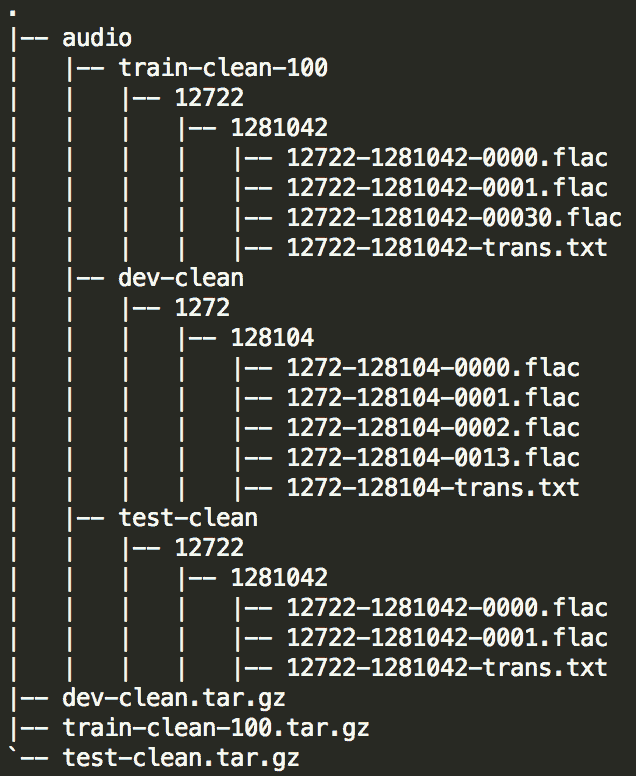

我们现在有三个文件夹，分别名为`train-clean-100`、`dev-clean`和`test-clean`。每个文件夹都有一些子文件夹，这些子文件夹包含与成绩单和音频的小段落映射相关的 ID。所有音频文件都为`.flac`扩展名，每个文件夹中都会有一个`.txt`文件，这是音频文件的成绩单。

# 语料库探索

让我们详细探讨数据集。首先，我们通过从文件读取音频文件并绘制它来查看音频文件。为了读取音频文件，我们将使用`pysoundfile`包，命令如下：

```py
pip install pysoundfile
```

接下来，我们将导入模块，读取音频文件，并通过以下代码块绘制它们：

```py
import soundfile as sf
import matplotlib.pyplot as plt

def plot_audio(audio):
    fig, axs = plt.subplots(4, 1, figsize=(20, 7))
    axs[0].plot(audio[0]);
    axs[0].set_title('Raw Audio Signals')
    axs[1].plot(audio[1]);
    axs[2].plot(audio[2]);
    axs[3].plot(audio[3]);

audio_list =[]
for i in xrange(4): 
    file_path = 'data/128684/911-128684-000{}.flac'.format(i+1)
    a, sample_rate = sf.read(file_path)
    audio_list.append(a) 
plot_audio(audio_list)
```

以下是每个语音段的频率表示：

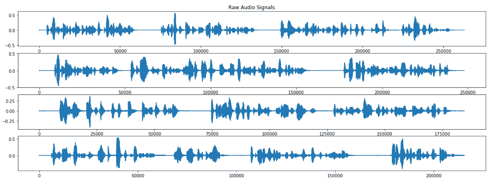

来自音频 MIDI 文件的原始音频信号图

现在让我们看一下成绩单文本文件的内容。它是文本的清洁版本，开头是音频文件 ID，后面是相关的文本：

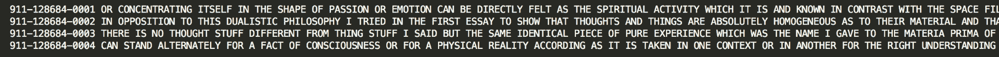

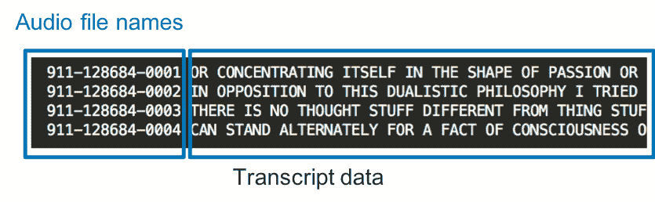

成绩单数据以特定格式存储。左边的数字是 midi 文件名，右边是实际的成绩单。这有助于建立 midi 文件与其相应成绩单之间的映射。

我们看到每个音频文件都是该文件中成绩单的叙述。我们的模型将尝试学习这个序列模式。但在我们处理模型之前，我们需要从音频文件中提取一些特征，并将文本转换为独热编码格式。

# 特征工程

所以，在将原始音频数据输入我们的模型之前，我们需要将数据转化为数值表示，即特征。在本节中，我们将探索从语音数据中提取特征的各种技术，这些特征可以用于输入到模型中。模型的准确性和性能取决于我们使用的特征类型。作为一个富有好奇心的深度学习工程师，这是你探索和学习特征的机会，并使用最适合当前用例的特征。

以下表格给出了技术及其属性的列表：

| **技术** | **属性** |
| --- | --- |
| **主成分分析** (**PCA**) |

+   基于特征向量的方法

+   非线性特征提取方法

+   支持线性映射

+   比其他技术更快

+   适合高斯数据

|

| **线性判别分析** (**LDA**) |
| --- |

+   线性特征提取方法

+   支持监督式线性映射

+   比其他技术更快

+   对分类来说优于 PCA

|

| **独立成分分析** (**ICA**) |
| --- |

+   盲源分离方法

+   支持线性映射

+   本质上是迭代的

+   适合非高斯数据

|

| 倒谱分析 |
| --- |

+   静态特征提取方法

+   功率谱方法

+   用于表示谱包络

|

| 梅尔频率尺度分析 |
| --- |

+   静态特征提取方法

+   谱分析方法

+   计算梅尔尺度

|

| **梅尔频率倒谱系数** (**MFCCs**) |
| --- |

+   功率谱是通过进行傅里叶分析来计算的

+   语音特征提取的稳健且动态的方法

|

| 小波技术 |
| --- |

+   比傅里叶变换更好的时间分辨率

+   实时因子最小

|

MFCC 技术是最有效的，通常用于提取语音识别的语音特征。MFCC 基于人耳的临界带宽频率的已知变化，低频部分的滤波器是线性间隔的。MFCC 的过程如下图所示：

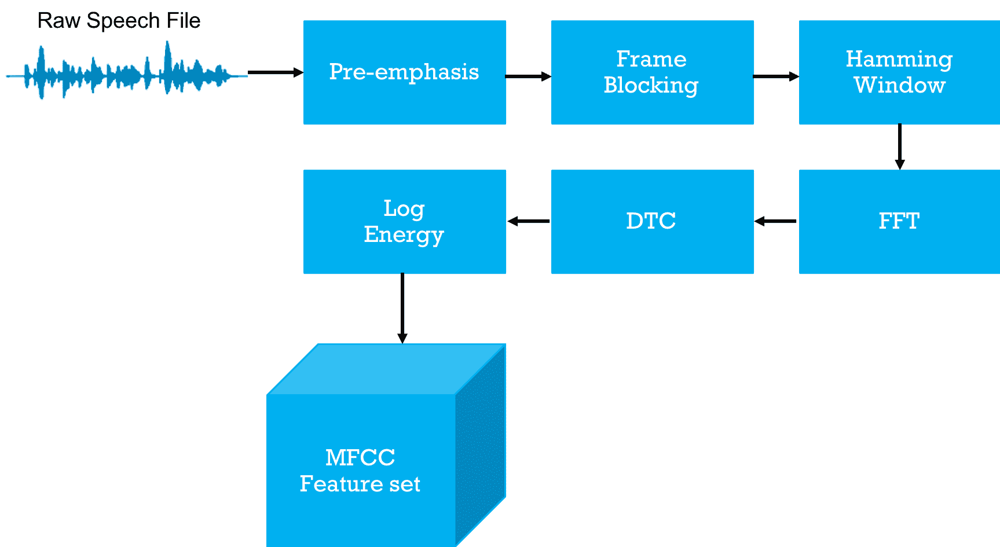

MFCC 过程的框图

对于我们的实现目的，我们不打算执行每个步骤；相反，我们将使用一个名为`python_speech_features`的 Python 包，它提供了 ASR 常用的语音特征，包括 MFCC 和滤波器组能量。

让我们使用以下命令`pip install`安装该包：

```py
pip install python_speech_features
```

所以，让我们定义一个函数来归一化音频时间序列数据并提取 MFCC 特征：

```py
from python_speech_features import mfcc

def compute_mfcc(audio_data, sample_rate):
    ''' Computes the MFCCs.
    Args:
        audio_data: time series of the speech utterance.
        sample_rate: sampling rate.
    Returns:
        mfcc_feat:[num_frames x F] matrix representing the mfcc.
    '''

    audio_data = audio_data - np.mean(audio_data)
    audio_data = audio_data / np.max(audio_data)
    mfcc_feat = mfcc(audio_data, sample_rate, winlen=0.025, winstep=0.01,
                     numcep=13, nfilt=26, nfft=512, lowfreq=0, highfreq=None,
                     preemph=0.97, ceplifter=22, appendEnergy=True)
    return mfcc_feat
```

让我们绘制音频和 MFCC 特征并可视化它们：

```py
audio, sample_rate = sf.read(file_path)
feats[audio_file] = compute_mfcc(audio, sample_rate)
plot_audio(audio,feats[audio_file])
```

以下是频谱图的输出：

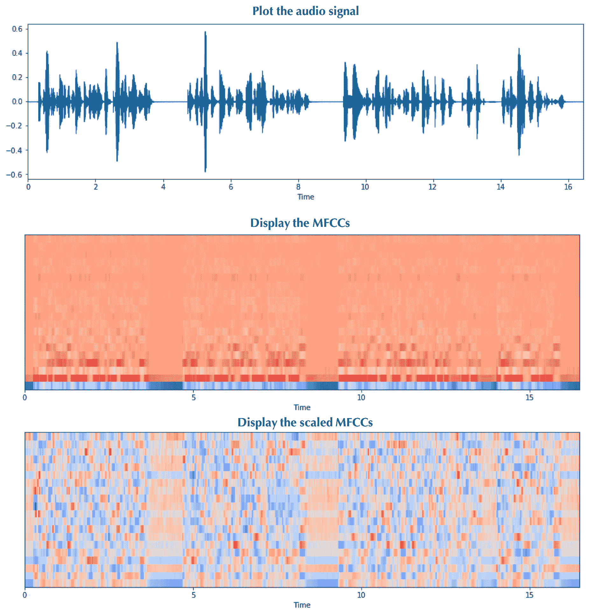

# 数据转换

一旦我们获得了需要输入模型的所有特征，我们将把原始的 NumPy 张量转换为 TensorFlow 特定的格式——`TFRecords`*。*

在下面的代码片段中，我们正在创建文件夹以存储所有已处理的记录。`make_example()`函数根据序列长度、MFCC 特征和相应的转录创建单一发音的序列示例。然后，使用`tf.python_io.TFRecordWriter()`函数将多个序列记录写入 TFRecord 文件：

```py
if os.path.basename(partition) == 'train-clean-100':
    # Create multiple TFRecords based on utterance length for training
    writer = {}
    count = {}
    print('Processing training files...')
    for i in range(min_t, max_t+1):
        filename = os.path.join(write_dir, 'train' + '_' + str(i) +
                                '.tfrecords')
        writer[i] = tf.python_io.TFRecordWriter(filename)
        count[i] = 0

    for utt in tqdm(sorted_utts):
        example = make_example(utt_len[utt], feats[utt].tolist(),
                               transcripts[utt])
        index = int(utt_len[utt]/100)
        writer[index].write(example)
        count[index] += 1

    for i in range(min_t, max_t+1):
        writer[i].close()
    print(count)

    # Remove bins which have fewer than 20 utterances
    for i in range(min_t, max_t+1):
        if count[i] < 20:
            os.remove(os.path.join(write_dir, 'train' +
                                   '_' + str(i) + '.tfrecords'))
else:
    # Create single TFRecord for dev and test partition
    filename = os.path.join(write_dir, os.path.basename(write_dir) +
                            '.tfrecords')
    print('Creating', filename)
    record_writer = tf.python_io.TFRecordWriter(filename)
    for utt in sorted_utts:
        example = make_example(utt_len[utt], feats[utt].tolist(),
                               transcripts[utt])
        record_writer.write(example)
    record_writer.close()
    print('Processed '+str(len(sorted_utts))+' audio files')
```

所有数据处理代码都写在`preprocess_LibriSpeech.py`文件中，该文件将执行所有先前提到的数据处理部分，操作完成后，处理后的数据将存储在`data/librispeech/processed/`位置。使用以下命令运行该文件：

```py
python preprocess_LibriSpeech.py
```

# DS2 模型描述与直觉

DS2 架构由多个递归连接层、卷积滤波器和非线性层组成，还包括批量归一化对 RNN 的特定实例的影响，如下所示：

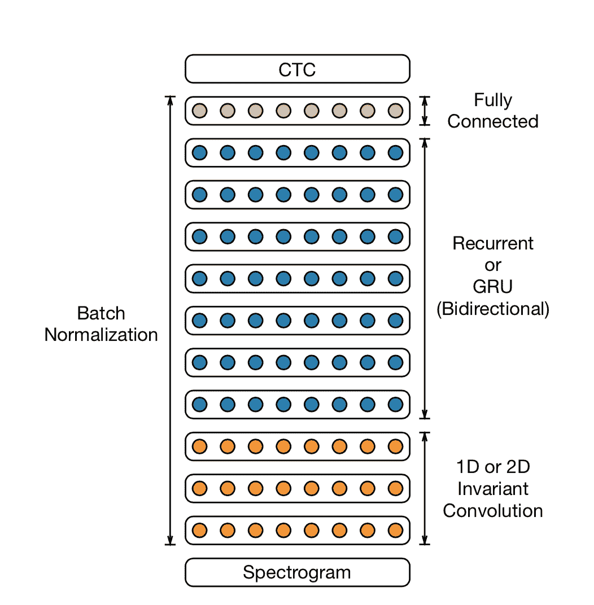

为了从包含大量数据的数据集进行学习，DS2 模型通过增加更多深度来提升容量。架构由最多 11 层的双向递归层和卷积层组成。为了成功优化这些模型，使用了 RNN 的批量归一化和一种名为 SortaGrad 的新优化课程。

训练数据是输入序列`x(i)`和转录`y(i)`的组合，而 RNN 层的目标是学习`x(i)`和`y(i)`之间的特征：

```py
training set X =  {(x(1), y(1)), (x(2), y(2)), . . .}
utterance =  x(i)
label = y(i)
```

用于系统特征的输入是功率归一化后的音频剪辑的谱图，网络的输出是每种语言的字形。为了增加非线性，使用了**修正线性单元**（**ReLU**）函数，*σ(x) = min{max{x, 0}, 20}*。在双向循环层之后，放置一个或多个全连接层，输出层*L*是 softmax 层，计算字符的概率分布。

现在让我们深入了解 DS2 架构的实现。你可以在这里找到完整代码：[`github.com/PacktPublishing/Python-Deep-Learning-Projects/tree/master/Chapter07`](https://github.com/PacktPublishing/Python-Deep-Learning-Projects/tree/master/Chapter07)。

以下是模型在 TensorBoard 中的显示：

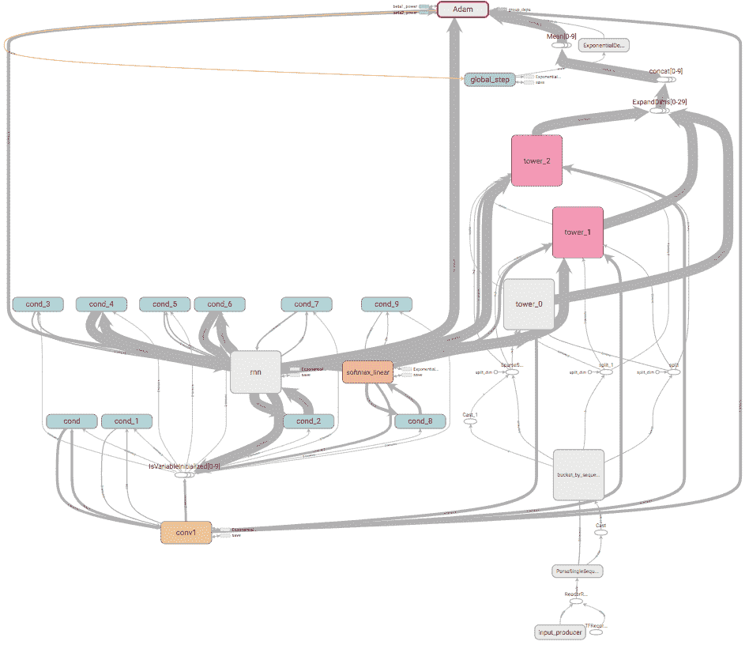

对于卷积层，我们有一个大小为`[11, input_seq_length, number_of_filter]`的卷积核，接着对输入序列进行 2D 卷积操作，然后应用`dropout`以防止过拟合。

以下代码段执行这些步骤：

```py
    with tf.variable_scope('conv1') as scope:
        kernel = _variable_with_weight_decay(
            'weights',
            shape=[11, feat_len, 1, params.num_filters],
            wd_value=None, use_fp16=params.use_fp16)

        feats = tf.expand_dims(feats, dim=-1)
        conv = tf.nn.conv2d(feats, kernel,
                            [1, params.temporal_stride, 1, 1],
                            padding='SAME')

        biases = _variable_on_cpu('biases', [params.num_filters],
                                  tf.constant_initializer(-0.05),
                                  params.use_fp16)
        bias = tf.nn.bias_add(conv, biases)
        conv1 = tf.nn.relu(bias, name=scope.name)
        _activation_summary(conv1)

        # dropout
        conv1_drop = tf.nn.dropout(conv1, params.keep_prob)
```

接下来，我们进入循环层，在这里我们将卷积层的输出重塑，以便将数据适配到 RNN 层。然后，根据一个叫做`rnn_type`的超参数创建自定义的 RNN 单元，它可以是单向的或双向的，之后是 dropout 单元。

以下代码块创建了模型的 RNN 部分：

```py
    with tf.variable_scope('rnn') as scope:

        # Reshape conv output to fit rnn input
        rnn_input = tf.reshape(conv1_drop, [params.batch_size, -1,
                                            feat_len*params.num_filters])
        # Permute into time major order for rnn
        rnn_input = tf.transpose(rnn_input, perm=[1, 0, 2])
        # Make one instance of cell on a fixed device,
        # and use copies of the weights on other devices.
        cell = rnn_cell.CustomRNNCell(
            params.num_hidden, activation=tf.nn.relu6,
            use_fp16=params.use_fp16)
        drop_cell = tf.contrib.rnn.DropoutWrapper(
            cell, output_keep_prob=params.keep_prob)
        multi_cell = tf.contrib.rnn.MultiRNNCell(
            [drop_cell] * params.num_rnn_layers)

        seq_lens = tf.div(seq_lens, params.temporal_stride)
        if params.rnn_type == 'uni-dir':
            rnn_outputs, _ = tf.nn.dynamic_rnn(multi_cell, rnn_input,
                                               sequence_length=seq_lens,
                                               dtype=dtype, time_major=True,
                                               scope='rnn',
                                               swap_memory=True)
        else:
            outputs, _ = tf.nn.bidirectional_dynamic_rnn(
                multi_cell, multi_cell, rnn_input,
                sequence_length=seq_lens, dtype=dtype,
                time_major=True, scope='rnn',
                swap_memory=True)
            outputs_fw, outputs_bw = outputs
            rnn_outputs = outputs_fw + outputs_bw
        _activation_summary(rnn_outputs)
```

此外，创建了线性层来执行 CTC 损失函数，并从 softmax 层输出结果：

```py
    with tf.variable_scope('softmax_linear') as scope:
        weights = _variable_with_weight_decay(
            'weights', [params.num_hidden, NUM_CLASSES],
            wd_value=None,
            use_fp16=params.use_fp16)
        biases = _variable_on_cpu('biases', [NUM_CLASSES],
                                  tf.constant_initializer(0.0),
                                  params.use_fp16)
        logit_inputs = tf.reshape(rnn_outputs, [-1, cell.output_size])
        logits = tf.add(tf.matmul(logit_inputs, weights),
                        biases, name=scope.name)
        logits = tf.reshape(logits, [-1, params.batch_size, NUM_CLASSES])
        _activation_summary(logits)
```

**生产规模提示**：在这些规模下训练单个模型需要数十个 exaFLOP，单 GPU 执行这些任务需要三到六周的时间。这使得模型探索变得非常耗时，因此 DeepSpeech 的开发者们构建了一个高度优化的训练系统，使用八个或十六个 GPU 来训练一个模型，并且使用同步**随机梯度下降**（**SGD**），这种方法在测试新想法时更容易调试，同时对于相同的数据并行度也能更快地收敛。

# 训练模型

现在我们已经理解了使用的数据和 DeepSpeech 模型架构，接下来让我们设置环境以训练模型。创建项目的虚拟环境有一些预备步骤，这些步骤是可选的，但强烈建议使用。另外，建议使用 GPU 来训练这些模型。

除了 Python 版本 3.5 和 TensorFlow 版本 1.7+，以下是一些先决条件：

+   `python-Levenshtein`：用来计算**字符错误率**（**CER**），基本上是计算距离

+   `python_speech_features`：用来从原始数据中提取 MFCC 特征

+   `pysoundfile`：用来读取 FLAC 文件

+   `scipy`：用于窗口化的辅助函数

+   `tqdm`: 用于显示进度条

让我们创建虚拟环境并安装所有依赖项：

```py
conda create -n 'SpeechProject' python=3.5.0
source activate SpeechProject
```

安装以下依赖项：

```py
(SpeechProject)$ pip install python-Levenshtein
(SpeechProject)$ pip install python_speech_features
(SpeechProject)$ pip install pysoundfile
(SpeechProject)$ pip install scipy
(SpeechProject)$ pip install tqdm
```

安装支持 GPU 的 TensorFlow：

```py
(SpeechProject)$ conda install tensorflow-gpu
```

如果看到`sndfile`错误，请使用以下命令：

```py
(SpeechProject)$ sudo apt-get install libsndfile1
```

现在，你需要克隆包含所有代码的仓库：

```py
(SpeechRecog)$ git clone https://github.com/FordSpeech/deepSpeech.git
(SpeechRecog)$ cd deepSpeech
```

让我们移动在*数据转换*部分中创建的 TFRecord 文件。计算得到的 MFCC 特征存储在`data/librispeech/processed/`目录中：

```py
cp -r ./data/librispeech/audio /home/deepSpeech/data/librispeech
cp -r ./data/librispeech/processed /home/deepSpeech/librispeech
```

一旦我们将所有数据文件准备好，就可以开始训练模型。我们定义了四个超参数：`num_rnn_layers`设置为`3`，`rnn_type`设置为`bi-dir`，`max_steps`设置为`30000`，`initial_lr`设置为`3e-4`：

```py
(SpeechRecog)$python deepSpeech_train.py --num_rnn_layers 3 --rnn_type 'bi-dir' --initial_lr 3e-4 --max_steps 30000 --train_dir ./logs/ 
```

此外，如果你想使用[`drive.google.com/file/d/1E65g4HlQU666RhgY712Sn6FuU2wvZTnQ/view`](https://drive.google.com/file/d/1E65g4HlQU666RhgY712Sn6FuU2wvZTnQ/view)中的预训练模型继续训练，可以下载并解压到`logs`文件夹中：

`(SpeechRecog)$python deepSpeech_train.py --checkpoint_dir ./logs/ --max_steps 40000`

请注意，在第一个 epoch 期间，成本将增加，且随着后续步骤的训练，训练时间会变得更长，因为语音样本是按照排序顺序呈现给网络的。

以下是训练过程中涉及的步骤：

```py
# Learning rate set up from the hyper-param.
learning_rate, global_step = set_learning_rate()

# Create an optimizer that performs gradient descent.
optimizer = tf.train.AdamOptimizer(learning_rate)

# Fetch a batch worth of data for each tower to train.
data = fetch_data()

# Construct loss and gradient ops.
loss_op, tower_grads, summaries = get_loss_grads(data, optimizer)

# Calculate the mean of each gradient. Note that this is the synchronization point across all towers.
grads = average_gradients(tower_grads)

# Apply the gradients to adjust the shared variables.
apply_gradient_op = optimizer.apply_gradients(grads,
                                              global_step=global_step)

# Track the moving averages of all trainable variables.
variable_averages = tf.train.ExponentialMovingAverage(
    ARGS.moving_avg_decay, global_step)
variables_averages_op = variable_averages.apply(
    tf.trainable_variables())

# Group all updates to into a single train op.
train_op = tf.group(apply_gradient_op, variables_averages_op)

# Build summary op.
summary_op = add_summaries(summaries, learning_rate, grads)

# Create a saver.
saver = tf.train.Saver(tf.all_variables(), max_to_keep=100)

# Start running operations on the Graph with allow_soft_placement set to True 
# to build towers on GPU.
sess = tf.Session(config=tf.ConfigProto(
    allow_soft_placement=True,
    log_device_placement=ARGS.log_device_placement))

# Initialize vars depending on the checkpoints.
if ARGS.checkpoint is not None:
    global_step = initialize_from_checkpoint(sess, saver)
else:
    sess.run(tf.initialize_all_variables())

# Start the queue runners.
tf.train.start_queue_runners(sess)

# Run training loop.
run_train_loop(sess, (train_op, loss_op, summary_op), saver)
```

在训练过程中，我们可以看到显著的改进，如下图所示。以下图表显示了 50k 步之后的准确率：

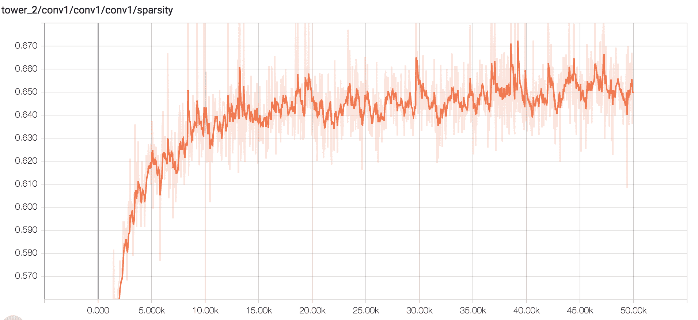

以下是 50k 步骤的损失图：

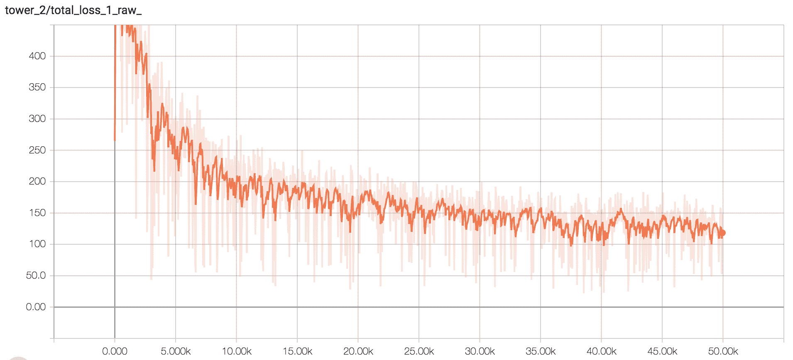

学习率随着时间的推移逐渐减小：

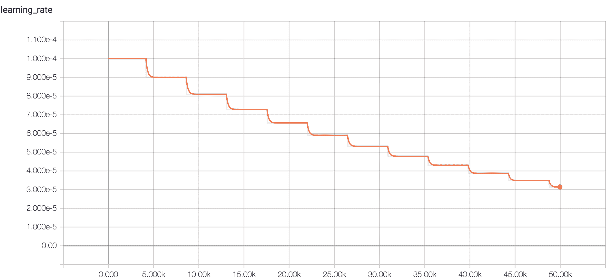

# 测试和评估模型

一旦模型训练完成，你可以执行以下命令，使用`test`数据集执行`test`步骤：

```py
(SpeechRecog)$python deepSpeech_test.py --eval_data 'test' --checkpoint_dir ./logs/
```

我们通过在先前未见过的语音样本上测试模型来评估其性能。模型生成概率向量的序列作为输出，因此我们需要构建解码器，将模型的输出转换为单词序列。尽管在字符序列上训练，DS2 模型仍能学习到一个隐式的语言模型，并且已经相当擅长根据发音拼写单词，正如以下表格所示。模型的拼写性能通常通过计算基于 Levenshtein 距离（[`en.wikipedia.org/wiki/Levenshtein_distance`](https://en.wikipedia.org/wiki/Levenshtein_distance)）的字符级 CER 来衡量：

| 真实值 | 模型输出 |
| --- | --- |
| 这对他起到了安抚作用 | 这对他起到了安抚作用 |
| 他进去查看了信件，但没有来自快递员的信 | 他进去查看了信件，但没有来自快递员的信 |
| 设计不同，但东西显然是一样的 | 设计不同，但东西显然是一样的 |

尽管模型展示了优秀的 CER（字符错误率），但它们倾向于按音标拼写单词，导致相对较高的词错误率（WER）。你可以通过允许解码器结合外部词典和语言模型的约束来改善模型的**词错误率**（**WER**）。

我们观察到，模型预测中的许多错误发生在训练集中没有出现的单词上。因此，随着我们增加训练集的大小和训练步骤，整体 CER 有望持续改善。经过 30k 步训练后，它达到了 15%的 CER。

# 总结

我们直接进入了这个 Python 深度学习项目，创建并训练了一个能够理解语音数据的 ASR 模型。我们学习了如何对语音数据进行特征工程，从中提取各种特征，然后构建一个能够识别用户声音的语音识别系统。

我们很高兴达成了我们设定的目标！

在本章中，我们构建了一个识别英语语音的系统，使用了 DS2 模型。

你学习了以下内容：

+   使用语音和声谱图进行工作

+   构建一个端到端的语音识别系统

+   CTC 损失函数

+   批量归一化和用于 RNN 的 SortaGrad

这标志着本书中深度学习项目的一个主要部分的结束，这些项目涉及聊天机器人、自然语言处理（NLP）和使用 RNN（单向和双向，包括或不包括 LSTM 组件）以及 CNN 的语音识别。我们已经看到了这些技术为现有业务流程提供智能，以及创造全新智能系统的潜力。这是应用 AI 领域中令人兴奋的前沿工作，利用深度学习推动创新！在本书的下半部分，我们将探索通常归类为计算机视觉技术的 Python 深度学习项目。

让我们翻到下一页，开始吧！
