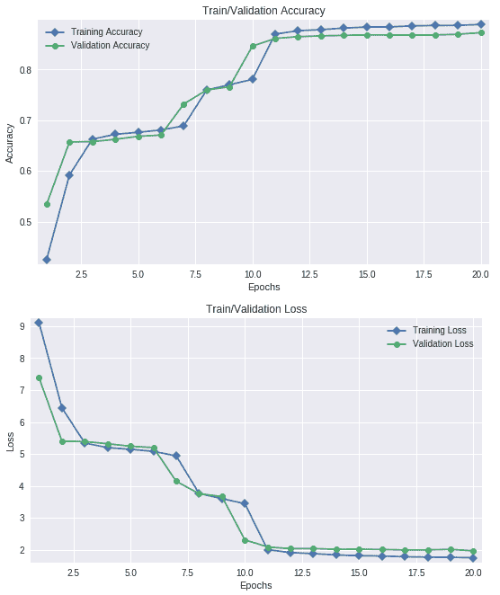
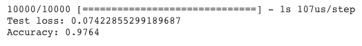

# 第八章：使用 ConvNets 进行手写数字分类

欢迎来到本章，介绍如何使用**卷积神经网络**（**ConvNets**）对手写数字进行分类。在第二章，《使用回归训练神经网络进行预测》中，我们建立了一个简单的神经网络来分类手写数字。这个网络的准确率为 87%，但我们对其表现并不满意。在本章中，我们将了解卷积的概念，并构建一个 ConvNet 来对手写数字进行分类，帮助餐饮连锁公司更准确地将短信发送给正确的人。如果你还没有学习过[第二章](https://cdp.packtpub.com/python_deep_learning_projects/wp-admin/post.php?post=31&action=edit#post_25)《使用回归训练神经网络进行预测》，请先学习它，这样你能更好地理解案例背景。

本章将涵盖以下主题：

+   卷积

+   池化

+   Dropout（丢弃法）

+   训练模型

+   测试模型

+   构建更深的模型

如果你在学习本章时边做边实现代码片段，最好使用 Jupyter Notebook 或任何源代码编辑器。这将帮助你更轻松地跟进并理解代码的不同部分是如何工作的。

本章所有 Python 文件和 Jupyter Notebook 文件可以在[`github.com/PacktPublishing/Python-Deep-Learning-Projects/tree/master/Chapter08`](https://github.com/PacktPublishing/Python-Deep-Learning-Projects/tree/master/Chapter08)找到。

# 代码实现

在本次练习中，我们将使用 Keras 深度学习库，它是一个高层次的神经网络 API，能够在 TensorFlow、Theano 和 CNTK 之上运行。

了解代码！我们不会花时间去理解 Keras 是如何工作的，但如果你感兴趣，可以参考 Keras 官方提供的这份简单易懂的文档：[`keras.io/`](https://keras.io/)。

# 导入所有依赖项

在本次练习中，我们将使用`numpy`、`matplotlib`、`keras`、`scipy`和`tensorflow`这些包。这里，TensorFlow 作为 Keras 的后端。你可以通过`pip`安装这些包。对于 MNIST 数据集，我们将使用`keras`模块中的数据集，并通过简单的`import`导入：

```py
import numpy as np
```

设置`seed`以确保结果可复现非常重要：

```py
# set seed for reproducibility
seed_val = 9000
np.random.seed(seed_val)
```

# 探索数据

让我们用以下代码导入`keras`中的`mnist`模块：

```py
from keras.datasets import mnist
```

然后，使用以下代码解压`mnist`的训练和测试图片：

```py
# unpack mnist data
(X_train, y_train), (X_test, y_test) = mnist.load_data()
```

现在数据已导入，让我们来探索这些数字：

```py
print('Size of the training_set: ', X_train.shape)
print('Size of the test_set: ', X_test.shape)
print('Shape of each image: ', X_train[0].shape)
print('Total number of classes: ', len(np.unique(y_train)))
print('Unique class labels: ', np.unique(y_train))
```

以下是前述代码的输出：


图 8.1：数据的打印信息

从前面的截图中，我们可以看到，我们有`60000`张训练图片，`10000`张测试图片，每张图片的大小为`28`*`28`，总共有`10`个可预测类别。

现在，让我们绘制`9`个手写数字。在此之前，我们需要导入`matplotlib`库用于绘图：

```py
import matplotlib.pyplot as plt
# Plot of 9 random images
for i in range(0, 9):
    plt.subplot(331+i) # plot of 3 rows and 3 columns
    plt.axis('off') # turn off axis
    plt.imshow(X_train[i], cmap='gray') # gray scale
```

以下是前面代码的输出：


图 8.2：可视化 MNIST 数字

打印出`training_set`中像素的最大值和最小值：

```py
# maximum and minimum pixel values
print('Maximum pixel value in the training_set: ', np.max(X_train))
print('Minimum pixel value in the training_set: ', np.min(X_train))
```

以下是前面代码的输出：


图 8.3：数据中最大和最小像素值的打印输出

我们可以看到，训练集中像素的最大值和最小值分别为`255`和`0`。

# 定义超参数

以下是我们将在代码中使用的一些超参数。这些参数都是可配置的：

```py
# Number of epochs
epochs = 20

# Batchsize
batch_size = 128

# Optimizer for the generator from keras.optimizers import Adam
optimizer = Adam(lr=0.0001)

# Shape of the input image
input_shape = (28,28,1)
```

如果回顾一下[第二章](https://cdp.packtpub.com/python_deep_learning_projects/wp-admin/post.php?post=31&action=edit#post_25)，*使用回归训练神经网络进行预测*，你会看到当时使用的`optimizer`是`Adam`。因此，我们将从`keras`模块导入`Adam`优化器，并设置其学习率，如前面的代码所示。在接下来的大多数情况中，我们将训练`20`个`epochs`，以便于比较。

要了解更多关于 Keras 中的`optimizers`及其 API，请访问 [`keras.io/optimizers/`](https://keras.io/optimizers/)。

尝试不同的学习率、优化器和批量大小，看看这些因素如何影响模型的质量。如果你得到更好的结果，可以向深度学习社区展示。

# 构建和训练一个简单的深度神经网络

现在我们已经将数据加载到内存中，接下来需要构建一个简单的神经网络模型来预测 MNIST 数字。我们将使用与第二章中相同的架构，*使用回归训练神经网络进行预测*。

我们将构建一个`Sequential`模型。所以，让我们从 Keras 中导入它，并用以下代码初始化它：

```py
from keras.models import Sequential
model = Sequential()
```

要了解更多关于 Keras 模型 API 的信息，请访问 [`keras.io/models/model/`](https://keras.io/models/model/)。

接下来，我们需要定义`Dense`/感知机层。在 Keras 中，可以通过导入`Dense`层来完成，如下所示：

```py
from keras.layers import Dense
```

然后，我们需要将`Dense`层添加到`Sequential`模型中，如下所示：

```py
model.add(Dense(300, input_shape=(784,), activation = 'relu'))
```

要了解更多关于 Keras `Dense` API 的信息，请访问 [`keras.io/layers/core/`](https://keras.io/layers/core/)。

`add`命令用于将一个层追加到`Sequential`模型中，在这种情况下是`Dense`层。

在前面的代码中的`Dense`层中，我们定义了第一隐藏层的神经元数量，即`300`。我们还将`input_shape`参数定义为`(784,)`，以便告诉模型它将接受形状为`(784,)`的输入数组。这意味着输入层将有`784`个神经元。

需要应用于结果的激活函数类型可以通过 `activation` 参数定义。在本例中，这是 `relu`。

使用以下代码添加另一个包含 `300` 个神经元的 `Dense` 层：

```py
model.add(Dense(300,  activation='relu'))
```

以及具有以下代码的最终 `Dense` 层：

```py
model.add(Dense(10,  activation='softmax'))
```

这里，最终层有 `10` 个神经元，因为我们需要它预测 `10` 个类别的分数。这里选择的 `activation` 函数是 `softmax`，以便我们将分数限制在 0 到 1 之间，并使所有分数之和为 1。

在 Keras 中编译模型非常简单，可以通过以下代码完成：

```py
# compile the model
model.compile(loss = 'sparse_categorical_crossentropy', optimizer=optimizer , metrics = ['accuracy'])
```

编译模型时，所需要做的就是调用模型的 `compile` 方法，并指定 `loss`、`optimizer` 和 `metrics` 参数，在本例中分别为 `sparse_categorical_crossentropy`、`Adam` 和 `['accuracy']`。

要了解更多关于 Keras Model 的 `compile` 方法，请访问 [`keras.io/models/model/`](https://keras.io/models/model/)。

在学习过程中需要监控的指标必须作为列表传递给 `compile` 方法的 `metrics` 参数。

使用以下代码打印出模型的摘要：

```py
# print model summary
model.summary()
```

以下是前述代码的输出：


图 8.4：多层感知器模型的摘要

请注意，该模型有 `328,810` 个可训练参数，这是合理的。

现在，使用从 `sklearn` 导入的 `train_test_split` 函数，将训练数据拆分为训练和验证数据：

```py
from sklearn.model_selection import train_test_split

# create train and validation data
X_train, X_val, y_train, y_val = train_test_split(X_train, y_train, stratify = y_train, test_size = 0.08333, random_state=42)

X_train = X_train.reshape(-1, 784)
X_val = X_val.reshape(-1, 784)
X_test = X_test.reshape(-1, 784)

print('Training Examples', X_train.shape[0])
print('Validation Examples', X_val.shape[0])
print('Test Examples', X_test.shape[0])
```

我们将数据分割成了 55,000 个训练示例和 5,000 个验证示例。

你还会看到我们已经重塑了数组，使得每个图像的形状为 `(784,)`。这是因为我们已经定义了模型接受形状为 `(784,)` 的图像/数组。

正如我们在 第二章 中所做的，*使用回归进行预测训练神经网络*，我们现在将在 55,000 个训练示例上训练模型，在 5,000 个示例上验证，并在 10,000 个示例上测试。

将拟合结果赋值给一个变量，会存储相关信息，如每个 `epoch` 的训练和验证损失及准确率，之后可以用来绘制学习过程。

# 拟合模型

在 Keras 中拟合模型时，结合训练数字和训练标签，调用模型的 `fit` 方法，并传入以下参数：

+   `epochs`：训练的轮数

+   `batch_size`：每个批次中的图像数量

+   `validation_data`：验证图像和验证标签的元组

查看本章的 *定义超参数* 部分，获取 `epochs` 和 `batch_size` 的定义值：

```py
# fit the model
history = model.fit(X_train, y_train, epochs = epochs, batch_size=batch_size, validation_data=(X_val, y_val))
```

以下是前述代码的输出：


以下是代码执行结束时的输出：


图 8.5：在 MLP 训练过程中打印出的指标

# 评估模型

为了在测试数据上评估模型，你可以通过将测试图像和测试标签传入`model`的`evaluate`方法来进行评估：

```py
# evaluate the model
loss, acc = model.evaluate(X_test, y_test)
print('Test loss:', loss)
print('Accuracy:', acc)
```

以下是前面代码的输出：


图 8.6：MLP 评估的打印输出

从验证和测试准确率来看，我们可以看到，在经过 20 个周期的训练后，我们达到了与第二章中*使用回归训练神经网络进行预测*相同的准确率，但代码量非常少。

现在，让我们定义一个函数，绘制我们存储在`history`变量中的训练和验证损失及准确率：

```py
import matplotlib.pyplot as plt

def loss_plot(history):
    train_acc = history.history['acc']
    val_acc = history.history['val_acc']

    plt.figure(figsize=(9,5))
    plt.plot(np.arange(1,21),train_acc, marker = 'D', label = 'Training Accuracy')
    plt.plot(np.arange(1,21),val_acc, marker = 'o', label = 'Validation Accuracy')
    plt.xlabel('Epochs')
    plt.ylabel('Accuracy')
    plt.title('Train/Validation Accuracy')
    plt.legend()
    plt.margins(0.02)
    plt.show()

    train_loss = history.history['loss']
    val_loss = history.history['val_loss']

    plt.figure(figsize=(9,5))
    plt.plot(np.arange(1,21),train_loss, marker = 'D', label = 'Training Loss')
    plt.plot(np.arange(1,21),val_loss, marker = 'o', label = 'Validation Loss')
    plt.xlabel('Epochs')
    plt.ylabel('Loss')
    plt.title('Train/Validation Loss')
    plt.legend()
    plt.margins(0.02)
    plt.show()

# plot training loss
loss_plot(history)
```

以下是前面代码的输出：



图 8.7：训练过程中 MLP 损失/准确率图

# MLP – Python 文件

该模块实现了一个简单 MLP 的训练和评估：

```py
"""This module implements a simple multi layer perceptron in keras."""
import numpy as np
from keras.datasets import mnist
from keras.models import Sequential
from keras.layers import Dense
import matplotlib.pyplot as plt

from sklearn.model_selection import train_test_split
from loss_plot import loss_plot

# Number of epochs
epochs = 20
# Batchsize
batch_size = 128
# Optimizer for the generator
from keras.optimizers import Adam
optimizer = Adam(lr=0.0001)
# Shape of the input image
input_shape = (28,28,1)

(X_train, y_train), (X_test, y_test) = mnist.load_data()

X_train, X_val, y_train, y_val = train_test_split(X_train, y_train,
                                                  stratify = y_train,
                                                  test_size = 0.08333,
                                                  random_state=42)

X_train = X_train.reshape(-1, 784)
X_val = X_val.reshape(-1, 784)
X_test = X_test.reshape(-1, 784)

model = Sequential()
model.add(Dense(300, input_shape=(784,), activation = 'relu'))
model.add(Dense(300, activation='relu'))
model.add(Dense(10, activation='softmax'))
model.compile(loss = 'sparse_categorical_crossentropy', optimizer=optimizer,
              metrics = ['accuracy'])

history = model.fit(X_train, y_train, epochs = epochs, batch_size=batch_size,
                    validation_data=(X_val, y_val))

loss,acc = model.evaluate(X_test, y_test)
print('Test loss:', loss)
print('Accuracy:', acc)

loss_plot(history)
```

# 卷积

卷积可以定义为将一个小的卷积核/滤波器/数组沿着目标数组滑动，并在每个位置计算卷积核与目标数组相同大小子集的逐元素相乘的和。

考虑以下示例：

```py
array = np.array([0, 1, 0, 1, 0, 1, 0, 1, 0, 1])
kernel = np.array([-1, 1, 0])
```

这里，你有一个长度为 10 的目标`array`和一个长度为 3 的`kernel`。

当你开始卷积时，执行以下步骤：

1.  `kernel`将与目标`array`中索引 0 到 2 的子集进行相乘。这将是[-1,1,0]（卷积核）与[0,1,0]（目标数组索引 0 到 2 的部分）。这个逐元素相乘的结果将被求和，得到所谓的卷积结果。

1.  然后，`kernel`将按 1 单位步幅移动，并与目标`array`中索引 1 到 3 的子集相乘，像*步骤 1*那样，得到结果。

1.  *步骤 2*会重复执行，直到在新的步幅位置无法提取出与`kernel`长度相等的子集。

每一步卷积的结果都存储在一个`array`中。这个存储卷积结果的`array`被称为特征图。1 维特征图的长度（步幅为 1 时）等于`kernel`和目标`array`长度的差值再加 1。

只有在这种情况下，我们需要考虑以下方程：

*特征图的长度 = 目标数组的长度 - 卷积核的长度 + 1*

这里有一个实现 1 维卷积的代码片段：

```py
array = np.array([0, 1, 0, 1, 0, 1, 0, 1, 0, 1])
kernel = np.array([-1, 1, 0])

# empty feature map
conv_result = np.zeros(array.shape[0] - kernel.shape[0] +1).astype(int)

for i in range(array.shape[0] - kernel.shape[0] +1):
    # convolving
    conv_result[i] = (kernel * array[i:i+3]).sum()
    print(kernel, '*', array[i:i+3], '=', conv_result[i])

print('Feature Map :', conv_result)
```

以下是前面代码的输出：


图 8.8：示例特征图的打印输出

# Keras 中的卷积

现在你已经了解了卷积是如何工作的，让我们将其付诸实践，构建一个基于 MNIST 数字的 CNN 分类器。

为此，导入 Keras 的`layers`模块中的`Conv2D` API。你可以使用以下代码来实现：

```py
from keras.layers import Conv2D
```

由于卷积会被定义为接受`28`*`28`*`1`形状的图像，因此我们需要将所有图像重塑为`28`*`28`*`1`：

```py
# reshape data 
X_train = X_train.reshape(-1,28,28,1)
X_val = X_val.reshape(-1,28,28,1)
X_test = X_test.reshape(-1,28,28,1)

print('Train data shape:', X_train.shape)
print('Val data shape:', X_val.shape)
print('Test data shape:', X_test.shape)
```

以下是前述代码的输出：


图 8.9：重塑后的数据形状

要构建 `model`，就像之前那样，我们需要将 `model` 初始化为 `Sequential`：

```py
model = Sequential()
```

现在，使用以下代码将 `Conv2D` 层添加到 `model` 中：

```py
model.add(Conv2D(32, kernel_size=(3,3), input_shape=input_shape, activation = 'relu'))
```

在 `Conv2D` API 中，我们定义了以下参数：

+   `units`：`32`（卷积核/滤波器的数量）

+   `kernel_size`：`(3,3)`（每个卷积核的大小）

+   `input_shape`：`28*28*1`（它将接收的输入数组的形状）

+   `activation`：`relu`

有关 `Conv2D` API 的更多信息，请访问 [`keras.io/layers/convolutional/`](https://keras.io/layers/convolutional/)。

前述卷积操作的结果是 `32` 个 26*26 的特征图。现在，这些 2-D 特征图需要转换成 1-D 特征图。这可以通过以下 Keras 代码完成：

```py
from keras.layers import Flatten
model.add(Flatten())
```

前述代码片段的结果就像一个简单神经网络中的神经元层。`Flatten` 函数将所有的 2-D 特征图转换为一个单一的 `Dense` 层。在此层中，我们将添加一个包含 `128` 个神经元的 `Dense` 层：

```py
model.add(Dense(128, activation = 'relu'))
```

由于我们需要获取每个 `10` 个可能类别的分数，我们必须添加另一个包含 `10` 个神经元的 `Dense` 层，并使用 `softmax` 作为 `activation` 函数：

```py
model.add(Dense(10, activation = 'softmax'))
```

现在，就像我们在前述代码中构建的简单全连接神经网络一样，我们将编译并拟合模型：

```py
# compile model
model.compile(loss = 'sparse_categorical_crossentropy', optimizer=optimizer, metrics = ['accuracy'])

# print model summary
model.summary()
```

以下是前述代码的输出：


图 8.10：卷积分类器的总结

从模型的总结中，我们可以看到，这个卷积分类器有 `2,770,634` 个参数。与感知机模型相比，这是一个非常庞大的参数数量。让我们拟合这个模型并评估其性能。

# 拟合模型

使用以下代码将卷积神经网络模型拟合到数据：

```py
# fit model
history = model.fit(X_train, y_train, epochs = epochs, batch_size=batch_size, validation_data=(X_val, y_val))
```

以下是前述代码的输出：


以下是代码执行结束时的输出：


图 8.11：卷积分类器训练过程中打印出的指标

我们可以看到，卷积分类器在验证数据上的准确率为 97.72%。

# 评估模型

您可以使用以下代码评估卷积模型在测试数据上的表现：

```py
# evaluate model
loss,acc = model.evaluate(X_test, y_test)
print('Test loss:', loss)
print('Accuracy:', acc)
```

以下是前述代码的输出：


图 8.12：卷积分类器评估的打印输出

我们可以看到，模型在测试数据上的准确率为 97.92%，在验证数据上的准确率为 97.72%，在训练数据上的准确率为 99.71%。从损失情况来看，模型在训练数据上有些过拟合。我们稍后将讨论如何处理过拟合问题。

现在，让我们绘制训练和验证指标，以查看训练进展情况：

```py
# plot training loss
loss_plot(history)
```

以下是前述代码的输出：


图 8.13：卷积分类器训练过程中的损失/准确率图

# 卷积 – Python 文件

该模块实现了卷积分类器的训练和评估：

```py
"""This module implements a simple convolution classifier."""
import numpy as np
from keras.datasets import mnist
from keras.models import Sequential
from keras.layers import Dense, Conv2D, Flatten
import matplotlib.pyplot as plt

from sklearn.model_selection import train_test_split
from loss_plot import loss_plot

# Number of epochs
epochs = 20
# Batchsize
batch_size = 128
# Optimizer for the generator
from keras.optimizers import Adam
optimizer = Adam(lr=0.0001)
# Shape of the input image
input_shape = (28,28,1)

(X_train, y_train), (X_test, y_test) = mnist.load_data()

X_train, X_val, y_train, y_val = train_test_split(X_train, y_train,
                                                  stratify = y_train,
                                                  test_size = 0.08333,
                                                  random_state=42)

X_train = X_train.reshape(-1,28,28,1)
X_val = X_val.reshape(-1,28,28,1)
X_test = X_test.reshape(-1,28,28,1)

model = Sequential()
model.add(Conv2D(32, kernel_size=(3,3), input_shape=input_shape,
                 activation = 'relu'))
model.add(Flatten())
model.add(Dense(128, activation = 'relu'))
model.add(Dense(10, activation='softmax'))
model.compile(loss = 'sparse_categorical_crossentropy', optimizer=optimizer,
              metrics = ['accuracy'])

history = model.fit(X_train, y_train, epochs = epochs, batch_size=batch_size,
                    validation_data=(X_val, y_val))

loss,acc = model.evaluate(X_test, y_test)
print('Test loss:', loss)
print('Accuracy:', acc)

loss_plot(history)
```

# 池化

最大池化可以定义为将一组值用该组中的最大值进行总结的过程。类似地，如果计算平均值，那么就是平均池化。池化操作通常在卷积后生成的特征图上执行，以减少参数的数量。

让我们考虑卷积时使用的示例数组：

```py
array = np.array([0, 1, 0, 1, 0, 1, 0, 1, 0, 1])
```

现在，如果你在这个 `array` 上执行最大池化，池大小设置为 1*2，步幅为 2，结果将是数组 [1,1,1,1,1]。这个 1*10 的 `array` 由于最大池化，已经被缩小为 1*5。

在这里，由于池大小为 1*2，你将从索引 0 到索引 2 提取目标 `array` 的子集，即 [0,1]，然后计算该子集的最大值为 1。对于从索引 2 到索引 4、从索引 4 到索引 6、从索引 6 到索引 8，最后从索引 8 到 10，你都会执行相同的操作。

类似地，平均池化可以通过计算池化部分的平均值来实现。在这种情况下，结果数组将是 [0.5, 0.5, 0.5, 0.5, 0.5]。

以下是几个实现最大池化和平均池化的代码片段：

```py
# 1D Max Pooling
array = np.array([0, 1, 0, 1, 0, 1, 0, 1, 0, 1])
result = np.zeros(len(array)//2)
for i in range(len(array)//2):
    result[i] = np.max(array[2*i:2*i+2])
result
```

以下是前面代码的输出：


图 8.14：最大池化操作在数组上的结果

以下是平均池化的代码片段：

```py
# 1D Average Pooling
array = np.array([0, 1, 0, 1, 0, 1, 0, 1, 0, 1])
result = np.zeros(len(array)//2)
for i in range(len(array)//2):
    result[i] = np.mean(array[2*i:2*i+2])
result
```

以下是前面代码的输出：


图 8.15：平均池化操作在数组上的结果

以下是解释最大池化操作的图示：


图 8.16：2*2 最大池化，步幅为 2（来源：https://en.wikipedia.org/wiki/Convolutional_neural_network）

请考虑以下关于数字的代码：

```py
plt.imshow(X_train[0].reshape(28,28), cmap='gray') 
```

以下是前面代码的输出：


图 8.17：随机 MNIST 数字

该图像的形状是 `28`*`28`。现在，如果你对其执行 2*2 最大池化操作，结果图像的形状将变为 `14`*`14`。

现在，让我们编写一个函数来实现 MNIST 数字的 2*2 最大池化操作：

```py
def square_max_pool(image, pool_size=2):
    result = np.zeros((14,14))
    for i in range(result.shape[0]):
        for j in range(result.shape[1]):
            result[i,j] = np.max(image[i*pool_size : i*pool_size+pool_size, j*pool_size : j*pool_size+pool_size])

    return result

# plot a pooled image
plt.imshow(square_max_pool(X_train[0].reshape(28,28)), cmap='gray')
```

以下是前面代码的输出：


图 8.18：最大池化后的随机 MNIST 数字

你可能已经注意到，我们在上一节中构建的卷积分类器大约有 270 万个参数。已经证明，在许多情况下，拥有大量参数会导致过拟合。此时池化操作就显得至关重要。它帮助我们保留数据中的重要特征，并减少参数的数量。

现在，让我们实现一个带有最大池化的卷积分类器。

使用以下代码从 Keras 导入最大池化操作：

```py
from keras.layers import MaxPool2D
```

然后，定义并编译模型：

```py
# model
model = Sequential()
model.add(Conv2D(32, kernel_size=(3,3), input_shape=input_shape, activation = 'relu'))
model.add(MaxPool2D(2,2))
model.add(Dropout(0.2))
model.add(Flatten())
model.add(Dense(128, activation = 'relu'))
model.add(Dense(10, activation = 'softmax'))

# compile model
model.compile(loss = 'sparse_categorical_crossentropy', optimizer= optimizer, metrics = ['accuracy'])

# print model summary
model.summary()
```

以下是前述代码的输出：


图 8.19：带最大池化的卷积分类器概述

从摘要中，我们可以看到，使用步长为 2 的 2*2 池化滤波器后，参数数量已降至`693,962`，是卷积分类器参数数量的 1/4。

# 拟合模型

现在，让我们在数据上拟合模型：

```py
# fit model
history = model.fit(X_train, y_train, epochs = epochs, batch_size=batch_size, validation_data=(X_val, y_val))
```

以下是前述代码的输出：


以下是代码执行完毕后的输出：


图 8.20：带最大池化的卷积分类器训练过程中打印出的指标

我们可以看到，带最大池化的卷积分类器在验证数据上的准确率为 97.72%。

# 评估模型

现在，在测试数据上评估带最大池化的卷积模型：

```py
# evaluate model
loss, acc = model.evaluate(X_test, y_test)
print('Test loss:', loss)
print('Accuracy:', acc)
```

以下是前述代码的输出：


图 8.21：带最大池化的卷积分类器评估的打印输出

我们可以看到，模型在测试数据上的准确率为 97.88%，在验证数据上的准确率为 97.72%，在训练数据上的准确率为 99.74%。带池化的卷积模型与不带池化的卷积模型表现相同，但参数减少了四倍。

在这种情况下，我们可以从损失值中清楚地看到，模型在训练数据上略微过拟合。

就像我们之前做的那样，绘制训练和验证指标，查看训练的进展：

```py
# plot training loss
loss_plot(history)
```

以下是前述代码的输出：


图 8.22：带最大池化的卷积分类器训练过程中的损失/准确率图

# 卷积与池化 – Python 文件

本模块实现了带池化操作的卷积分类器的训练与评估：

```py
"""This module implements a convolution classifier with maxpool operation."""
import numpy as np
from keras.datasets import mnist
from keras.models import Sequential
from keras.layers import Dense, Conv2D, Flatten, MaxPool2D
import matplotlib.pyplot as plt

from sklearn.model_selection import train_test_split
from loss_plot import loss_plot

# Number of epochs
epochs = 20
# Batchsize
batch_size = 128
# Optimizer for the generator
from keras.optimizers import Adam
optimizer = Adam(lr=0.0001)
# Shape of the input image
input_shape = (28,28,1)

(X_train, y_train), (X_test, y_test) = mnist.load_data()

X_train, X_val, y_train, y_val = train_test_split(X_train, y_train,
                                                  stratify = y_train,
                                                  test_size = 0.08333,
                                                  random_state=42)

X_train = X_train.reshape(-1,28,28,1)
X_val = X_val.reshape(-1,28,28,1)
X_test = X_test.reshape(-1,28,28,1)

model = Sequential()
model.add(Conv2D(32, kernel_size=(3,3), input_shape=input_shape,
                 activation='relu'))
model.add(MaxPool2D(2,2))
model.add(Flatten())
model.add(Dense(128, activation = 'relu'))
model.add(Dense(10, activation='softmax'))
model.compile(loss = 'sparse_categorical_crossentropy', optimizer=optimizer,
              metrics = ['accuracy'])

history = model.fit(X_train, y_train, epochs = epochs, batch_size=batch_size,
                    validation_data=(X_val, y_val))

loss,acc = model.evaluate(X_test, y_test)
print('Test loss:', loss)
print('Accuracy:', acc)

loss_plot(history)
```

# Dropout

Dropout 是一种正则化技术，用于防止过拟合。在训练过程中，它通过在每次前向和反向传播时随机从原始神经网络中采样一个神经网络，然后在输入数据的批次上训练这个子集网络来实现。测试时不进行 dropout。测试结果作为所有采样网络的集合获得：


图 8.23：Dropout，如在《Dropout：防止神经网络过拟合的一种简单方法》所示

过拟合论文（来源：http://www.cs.toronto.edu/~rsalakhu/papers/srivastava14a.pdf）

在 Keras 中，实现`Dropout`非常简单。首先，从`keras`的`layers`模块中导入它：

```py
from keras.layers import Dropout
```

然后，将该层放置在需要的地方。对于我们的 CNN，我们将在最大池化操作后放置一个层，在`Dense`层后放置另一个层，如以下代码所示：

```py
# model
model = Sequential()
model.add(Conv2D(32, kernel_size=(3,3), input_shape=input_shape, activation = 'relu'))
model.add(MaxPool2D(2,2))
model.add(Dropout(0.2))
model.add(Flatten())
model.add(Dense(128, activation = 'relu'))
model.add(Dropout(0.2))
model.add(Dense(10, activation = 'softmax'))

# compile model
model.compile(loss = 'sparse_categorical_crossentropy', optimizer= optimizer, metrics = ['accuracy'])

# model summary
model.summary()
```

以下是前述代码的输出：


图 8.24：卷积分类器总结

由于`Dropout`是一种正则化技术，将其添加到模型中不会改变可训练参数的数量。

# 拟合模型

再次在标准的 20 个`epochs`上训练模型：

```py
# fit model
history = model.fit(X_train, y_train, epochs = epochs, batch_size=batch_size, validation_data=(X_val, y_val))
```

以下是前述代码的输出：


以下是代码执行结束时的输出：


图 8.25：训练过程中打印出的卷积分类器的指标，使用最大池化和丢弃法

我们看到使用最大池化和丢弃法的卷积分类器在验证数据上的准确率为 98.52%。

# 评估模型

现在，让我们评估模型并捕捉损失和准确率：

```py
# evaluate model
loss, acc = model.evaluate(X_test, y_test)
print('Test loss:', loss)
print('Accuracy:', acc)
```

以下是前述代码的输出：


图 8.26：使用最大池化和丢弃法评估卷积分类器的输出

我们可以看到，模型在测试数据上的准确率为 98.42%，在验证数据上为 98.52%，在训练数据上为 99.26%。带有池化和丢弃法的卷积模型提供了与没有池化的卷积模型相同的性能水平，但参数量减少了四倍。如果你也查看`loss`，你会发现这个模型比我们之前训练的其他模型达到了一个更好的最小值。

绘制指标图以了解训练进度：

```py
# plot training loss
loss_plot(history)
```

以下是前述代码的输出：


图 8.27：卷积分类器训练过程中，使用最大池化和丢弃法的损失/准确度曲线

# 使用池化的卷积 – Python 文件

本模块实现了一个带有最大池化和`Dropout`操作的卷积分类器的训练与评估：

```py
"""This module implements a deep conv classifier with max pool and dropout."""
import numpy as np
from keras.datasets import mnist
from keras.models import Sequential
from keras.layers import Dense, Conv2D, Flatten, MaxPool2D, Dropout
import matplotlib.pyplot as plt

from sklearn.model_selection import train_test_split
from loss_plot import loss_plot

# Number of epochs
epochs = 20
# Batchsize
batch_size = 128
# Optimizer for the generator
from keras.optimizers import Adam
optimizer = Adam(lr=0.0001)
# Shape of the input image
input_shape = (28,28,1)

(X_train, y_train), (X_test, y_test) = mnist.load_data()

X_train, X_val, y_train, y_val = train_test_split(X_train, y_train,
                                                  stratify = y_train,
                                                  test_size = 0.08333,
                                                  random_state=42)

X_train = X_train.reshape(-1,28,28,1)
X_val = X_val.reshape(-1,28,28,1)
X_test = X_test.reshape(-1,28,28,1)

model = Sequential()
model.add(Conv2D(32, kernel_size=(3,3), input_shape=input_shape,
                 activation = 'relu'))
model.add(MaxPool2D(2,2))
model.add(Dropout(0.2))
model.add(Conv2D(64, kernel_size=(3,3), activation = 'relu'))
model.add(MaxPool2D(2,2))
model.add(Dropout(0.2))
model.add(Conv2D(128, kernel_size=(3,3), activation = 'relu'))
model.add(MaxPool2D(2,2))
model.add(Dropout(0.2))
model.add(Flatten())
model.add(Dense(128, activation = 'relu'))
model.add(Dropout(0.2))
model.add(Dense(10, activation = 'softmax'))

model.compile(loss = 'sparse_categorical_crossentropy', optimizer= optimizer,
              metrics = ['accuracy'])

history = model.fit(X_train, y_train, epochs = epochs, batch_size=batch_size,
                    validation_data=(X_val, y_val))

loss,acc = model.evaluate(X_test, y_test)
print('Test loss:', loss)
print('Accuracy:', acc)

loss_plot(history)
```

# 向更深的网络进发

使用最大池化和丢弃法的卷积分类器似乎是迄今为止最好的分类器。然而，我们也注意到训练数据上存在轻微的过拟合现象。

让我们构建一个更深的模型，看看能否创建一个比我们迄今训练的其他模型更准确的分类器，并看看能否让它达到一个更好的最小值。

我们将通过向目前最好的模型中添加两个卷积层来构建一个更深的模型：

+   第一层是一个卷积 2D 层，包含 32 个大小为 3*3 的滤波器，`activation`使用`relu`，接着进行大小为 2*2 的最大池化下采样，最后使用`Dropout`作为正则化方法

+   第二层是一个卷积 2D 层，包含 64 个大小为 3*3 的滤波器，`activation`使用`relu`，接着进行大小为 2*2 的最大池化下采样，最后使用`Dropout`作为正则化方法

+   第三层是一个卷积二维层，具有 128 个 3*3 大小的滤波器，`activation`为`relu`，接着是 2*2 大小的最大池化进行下采样，最后是`Dropout`作为正则化器

# 编译模型

以下是更深层模型的代码：

```py
# model
model = Sequential()
model.add(Conv2D(32, kernel_size=(3,3), input_shape=input_shape, activation = 'relu'))
model.add(MaxPool2D(2,2))
model.add(Dropout(0.2))
model.add(Conv2D(64, kernel_size=(3,3), activation = 'relu'))
model.add(MaxPool2D(2,2))
model.add(Dropout(0.2))
model.add(Conv2D(128, kernel_size=(3,3), activation = 'relu'))
model.add(MaxPool2D(2,2))
model.add(Dropout(0.2))
model.add(Flatten())
model.add(Dense(128, activation = 'relu'))
model.add(Dropout(0.2))
model.add(Dense(10, activation = 'softmax'))

# compile model
model.compile(loss = 'sparse_categorical_crossentropy', optimizer= optimizer, metrics = ['accuracy'])

# print model summary
model.summary()
```

以下是前述代码的输出：


图 8.28：深度卷积分类器的总结

从总结中可以看到，更深层的模型仅有`110,474`个参数。现在，让我们看看一个具有更少参数的更深层模型是否能比我们到目前为止做得更好。

# 拟合模型

就像之前一样，拟合模型，但将`epochs`设置为`40`，因为更深的模型需要更长时间来学习。首先尝试训练 20 个 epoch，看看会发生什么：

```py
# fit model
history = model.fit(X_train, y_train, epochs = 40, batch_size=batch_size, validation_data=(X_val, y_val))
```

以下是前述代码的输出：


以下是代码执行结束时的输出：


图 8.29：深度卷积分类器训练过程中的度量输出

# 评估模型

现在，使用以下代码评估模型：

```py
# evaluate model
loss,acc = model.evaluate(X_test, y_test)
print('Test loss:', loss)
print('Accuracy:', acc)
```

以下是前述代码的输出：


图 8.30：深度卷积分类器评估结果输出

我们可以看到，模型在测试数据上的准确率为 99.01%，在验证数据上的准确率为 98.84%，在训练数据上的准确率为 98.38%。具有池化和 Dropout 的更深层卷积模型仅有 110,000 个参数，却提供了更好的性能。如果你也查看`loss`，这个模型能够达到比我们之前训练的其他模型更好的最小值：

绘制度量图表，以了解训练进度：

```py
# plot training loss
loss_plot(history)
```

以下是前述代码的输出：


图 8.31：深度卷积分类器训练过程中的损失/准确率图

这是你可以获得的最佳训练图之一。我们可以看到完全没有过拟合。

# 卷积与池化以及 Dropout – Python 文件

该模块实现了一个深度卷积分类器的训练与评估，包含最大池化和`Dropout`操作：

```py
"""This module implements a deep conv classifier with max pool and dropout."""
import numpy as np
from keras.datasets import mnist
from keras.models import Sequential
from keras.layers import Dense, Conv2D, Flatten, MaxPool2D, Dropout
import matplotlib.pyplot as plt

from sklearn.model_selection import train_test_split
from loss_plot import loss_plot

# Number of epochs
epochs = 20
# Batchsize
batch_size = 128
# Optimizer for the generator
from keras.optimizers import Adam
optimizer = Adam(lr=0.0001)
# Shape of the input image
input_shape = (28,28,1)

(X_train, y_train), (X_test, y_test) = mnist.load_data()

X_train, X_val, y_train, y_val = train_test_split(X_train, y_train,
                                                  stratify = y_train,
                                                  test_size = 0.08333,
                                                  random_state=42)

X_train = X_train.reshape(-1,28,28,1)
X_val = X_val.reshape(-1,28,28,1)
X_test = X_test.reshape(-1,28,28,1)

model = Sequential()
model.add(Conv2D(32, kernel_size=(3,3), input_shape=input_shape,
                 activation = 'relu'))
model.add(MaxPool2D(2,2))
model.add(Dropout(0.2))
model.add(Conv2D(64, kernel_size=(3,3), activation = 'relu'))
model.add(MaxPool2D(2,2))
model.add(Dropout(0.2))
model.add(Conv2D(128, kernel_size=(3,3), activation = 'relu'))
model.add(MaxPool2D(2,2))
model.add(Dropout(0.2))
model.add(Flatten())
model.add(Dense(128, activation = 'relu'))
model.add(Dropout(0.2))
model.add(Dense(10, activation = 'softmax'))

model.compile(loss = 'sparse_categorical_crossentropy', optimizer= optimizer,
              metrics = ['accuracy'])

history = model.fit(X_train, y_train, epochs = epochs, batch_size=batch_size,
                    validation_data=(X_val, y_val))

loss,acc = model.evaluate(X_test, y_test)
print('Test loss:', loss)
print('Accuracy:', acc)

loss_plot(history)
```

# 数据增强

想象一个场景，你可能希望在一小组图像上构建一个卷积分类器。这里的问题是，分类器很容易在这小部分数据上过拟合。分类器之所以过拟合，是因为相似的图像非常少。也就是说，模型在特定类别中捕捉到的变化不多，因此很难在新的数据上表现得既强大又精准。

Keras 提供了一个名为`ImageDataGenerator`的预处理工具，可以通过简单的配置来增强图像数据。

它的功能包括以下内容：

+   `zoom_range`：随机对图像进行缩放，至给定的缩放级别

+   `horizontal_flip`：随机水平翻转图像

+   `vertical_flip`：随机垂直翻转图像

+   `rescale`：用提供的因子乘以数据

它还包括随机旋转、随机剪切等多种功能。

访问官方 Keras 文档（[`keras.io/preprocessing/image/`](https://keras.io/preprocessing/image/)）以了解更多关于 `image_data_generator` API 的附加功能。

# 使用 ImageDataGenerator

`image_data_generator` API 会在进行过程中按批次转换和增强数据，而且使用起来非常简单。

首先，导入 `ImageDataGenerator`：

```py
from keras.preprocessing.image import ImageDataGenerator
```

实现一个随机水平翻转增强器：

```py
train_datagen = ImageDataGenerator(horizontal_flip=True)  
```

在训练数据上拟合增强器：

```py
# fit the augmenter
train_datagen.fit(X_train)
```

拟合后，我们通常使用 `transform` 命令。在这里，我们使用 `flow` 命令代替 `transform`。它接受图像及其对应标签，然后生成指定批次大小的转换数据。

让我们转换一批图像并查看结果：

```py
# transform the data
for img, label in train_datagen.flow(X_train, y_train, batch_size=6):
    for i in range(0, 6):
        plt.subplot(2,3,i+1)
        plt.title('Label {}'.format(label[i]))
        plt.imshow(img[i].reshape(28, 28), cmap='gray')
    break
plt.tight_layout()
plt.show()
```

以下是前述代码的输出：


图 8.32：水平翻转增强后的数字

类似地，我们可以实现一个随机缩放增强器，如下所示：

```py
train_datagen = ImageDataGenerator(zoom_range=0.3)
 #fit
train_datagen.fit(X_train)

#transform
for img, label in train_datagen.flow(X_train, y_train, batch_size=6):
    for i in range(0, 6):
        plt.subplot(2,3,i+1)
        plt.title('Label {}'.format(label[i]))
        plt.imshow(img[i].reshape(28, 28), cmap='gray')
    break
plt.tight_layout()
plt.show()
```

以下是前述代码的输出：


图 8.33：缩放增强后的数字

# 拟合 ImageDataGenerator

现在，我们用与深度卷积模型相同的架构（带池化和 Dropout）构建一个分类器，但使用增强数据。

首先，定义 `ImageDataGenerator` 的特性，如下所示：

```py
train_datagen = ImageDataGenerator(
        rescale = 1./255,
        zoom_range = 0.2,
        horizontal_flip = True)  
```

我们已经定义了 `ImageDataGenerator` 可以执行以下操作

+   重标定

+   随机缩放

+   随机水平翻转

重标定操作将像素值缩放到 0 到 1 的范围内。

下一步是将此生成器拟合到训练数据上：

```py
train_datagen.fit(X_train)
```

# 编译模型

我们需要这样定义并编译深度卷积模型：

```py
# define model
model = Sequential()
model.add(Conv2D(32, kernel_size=(3,3), input_shape=input_shape, activation = 'relu'))
model.add(MaxPool2D(2,2))
model.add(Dropout(0.2))
model.add(Conv2D(64, kernel_size=(3,3), activation = 'relu'))
model.add(MaxPool2D(2,2))
model.add(Dropout(0.2))
model.add(Conv2D(128, kernel_size=(3,3), activation = 'relu'))
model.add(MaxPool2D(2,2))
model.add(Dropout(0.2))
model.add(Flatten())
model.add(Dense(128, activation = 'relu'))
model.add(Dropout(0.2))
model.add(Dense(10, activation = 'softmax'))

# compile model
model.compile(loss = 'sparse_categorical_crossentropy', optimizer= optimizer, metrics = ['accuracy'])
```

# 拟合模型

最后，我们需要拟合模型：

```py
# fit the model on batches with real-time data augmentation
history = model.fit_generator(train_datagen.flow(X_train, y_train, batch_size=128), steps_per_epoch=len(X_train) / 128, epochs=10, validation_data=(train_datagen.flow(X_val, y_val)))
```

以下是前述代码的输出：


代码执行结束时的输出如下：


图 8.34：深度卷积分类器在增强数据上训练过程中的打印指标

# 评估模型

现在，我们需要评估模型：

```py
# transform/augment test data
for test_img, test_lab in train_datagen.flow(X_test, y_test, batch_size = X_test.shape[0]):
    break

# evaluate model on test data 
loss,acc = model.evaluate(test_img, test_lab)
print('Test loss:', loss)
print('Accuracy:', acc)
```

以下是前述代码的输出：



图 8.35：深度卷积分类器在增强数据上的评估打印输出

然后，我们需要绘制深度卷积分类器：

```py
# plot the learning
loss_plot(history)
```

以下是前述代码的输出：


图 8.36：深度卷积分类器在增强数据上的训练损失/准确率图

# 增强 – Python 文件

本模块实现了深度卷积分类器在增强数据上的训练和评估：

```py
"""This module implements a deep conv classifier on augmented data."""
import numpy as np
from keras.datasets import mnist
from keras.models import Sequential
from keras.layers import Dense, Conv2D, Flatten, MaxPool2D, Dropout
import matplotlib.pyplot as plt
from keras.preprocessing.image import ImageDataGenerator

from sklearn.model_selection import train_test_split
from loss_plot import loss_plot

# Number of epochs
epochs = 10
# Batchsize
batch_size = 128
# Optimizer for the generator
from keras.optimizers import Adam
optimizer = Adam(lr=0.001)
# Shape of the input image
input_shape = (28,28,1)

(X_train, y_train), (X_test, y_test) = mnist.load_data()

X_train, X_val, y_train, y_val = train_test_split(X_train, y_train,
                                                  stratify = y_train,
                                                  test_size = 0.08333,
                                                  random_state=42)

X_train = X_train.reshape(-1,28,28,1)
X_val = X_val.reshape(-1,28,28,1)
X_test = X_test.reshape(-1,28,28,1)

train_datagen = ImageDataGenerator(
        rescale=1./255,
        zoom_range=0.2,
        horizontal_flip=True)

train_datagen.fit(X_train)

model = Sequential()
model.add(Conv2D(32, kernel_size=(3,3), input_shape=input_shape,
                 activation = 'relu'))
model.add(MaxPool2D(2,2))
model.add(Dropout(0.2))
model.add(Conv2D(64, kernel_size=(3,3), activation = 'relu'))
model.add(MaxPool2D(2,2))
model.add(Dropout(0.2))
model.add(Conv2D(128, kernel_size=(3,3), activation = 'relu'))
model.add(MaxPool2D(2,2))
model.add(Dropout(0.2))
model.add(Flatten())
model.add(Dense(128, activation = 'relu'))
model.add(Dropout(0.2))
model.add(Dense(10, activation = 'softmax'))

model.compile(loss = 'sparse_categorical_crossentropy', optimizer= optimizer,
              metrics = ['accuracy'])

# fits the model on batches with real-time data augmentation:
history = model.fit_generator(train_datagen.flow(X_train, y_train,
                                                 batch_size=128),
                              steps_per_epoch=len(X_train) / 128, epochs=epochs,
                              validation_data=(train_datagen.flow(X_val,
                                                                  y_val)))

for test_img, test_lab in train_datagen.flow(X_test, y_test,
                                             batch_size = X_test.shape[0]):
    break

loss,acc = model.evaluate(test_img, test_lab)
print('Test loss:', loss)
print('Accuracy:', acc)

loss_plot(history)
```

# 附加主题 – 卷积自编码器

自编码器是由两部分组成的：编码器和解码器。简单自编码器的编码器和解码器通常由全连接层构成，而卷积自编码器则由卷积层构成：


图 8.37：自编码器的结构（图像来源：维基百科）

自编码器的编码器部分接受图像并通过池化操作压缩为更小的尺寸。在我们的例子中，这是最大池化。解码器接受编码器的输入，并通过使用卷积和上采样来学习扩展图像到我们想要的尺寸。

想象一下，你想从模糊的图像中构建高分辨率图像的情况：


图 8.38：左侧是低分辨率数字，右侧是高分辨率数字。

卷积自编码器能够非常好地完成这项任务。你看到的前述高分辨率数字实际上是使用卷积自编码器生成的。

到本节结束时，你将构建一个卷积自编码器，它接受低分辨率的 14*14*1 MNIST 数字并生成高分辨率的 28*28*1 数字。

# 导入依赖项

在开始本节之前，请考虑重新启动会话：

```py
import numpy as np
import matplotlib.pyplot as plt
%matplotlib inline

from keras.datasets import mnist
(X_train, y_train), (X_test, y_test) = mnist.load_data()

from keras.layers import Conv2D, MaxPooling2D, UpSampling2D
from keras.models import Model, Sequential
from keras.optimizers import Adam
from keras import backend as k

# for resizing images
from scipy.misc import imresize
```

# 生成低分辨率图像

为了生成低分辨率图像，定义一个名为`reshape()`的函数，该函数将输入的图像/数字调整为`14`*`14`的大小。定义完成后，我们将使用`reshape()`函数生成低分辨率的训练和测试图像：

```py
def reshape(x):
    """Reshape images to 14*14"""
    img = imresize(x.reshape(28,28), (14, 14))
    return img

# create 14*14 low resolution train and test images
XX_train = np.array([*map(reshape, X_train.astype(float))])
XX_test = np.array([*map(reshape, X_test.astype(float))])
```

`XX_train`和`XX_test`将是我们输入到编码器中的图像，`X_train`和`X_test`将是目标。

# 缩放

将训练输入、测试输入和目标图像缩放到 0 到 1 之间，这样学习过程会更快：

```py
# scale images to range between 0 and 1
# 14*14 train images
XX_train = XX_train/255
# 28*28 train label images
X_train = X_train/255

# 14*14 test images
XX_test = XX_test/255
# 28*28 test label images
X_test = X_test/255
```

# 定义自编码器

我们将要构建的卷积自编码器将接受 14*14*1 的图像作为输入，28*28*1 的图像作为目标，并将具有以下特点：

在编码器中：

+   第一层是一个卷积二维层，包含 64 个大小为 3*3 的滤波器，接着是批量归一化，`activation`为`relu`，然后是使用大小为 2*2 的`MaxPooling2D`进行下采样。

+   第二层，即编码器部分的最后一层，再次是一个卷积二维层，包含 128 个大小为 3*3 的滤波器，进行批量归一化，`activation`为`relu`。

在解码器中：

+   第一层是一个卷积二维层，包含 128 个大小为 3*3 的滤波器，`activation`为`relu`，接着是通过`UpSampling2D`进行上采样。

+   第二层是一个卷积二维层，包含 64 个大小为 3*3 的滤波器，`activation`为`relu`，接着是使用`UpSampling2D`进行上采样。

+   第三层，或解码器部分的最后一层，是一个卷积二维层，包含 1 个大小为 3*3 的滤波器，`activation`为`sigmoid`。

以下是我们的自编码器代码：

```py
batch_size = 128
epochs = 40
input_shape = (14,14,1)

# define autoencoder
def make_autoencoder(input_shape):

    generator = Sequential()
    generator.add(Conv2D(64, (3, 3), activation='relu', padding='same', input_shape=input_shape))
    generator.add(MaxPooling2D(pool_size=(2, 2)))

    generator.add(Conv2D(128, (3, 3), activation='relu', padding='same'))

    generator.add(Conv2D(128, (3, 3), activation='relu', padding='same'))
    generator.add(UpSampling2D((2, 2)))

    generator.add(Conv2D(64, (3, 3), activation='relu', padding='same'))
    generator.add(UpSampling2D((2, 2)))

    generator.add(Conv2D(1, (3, 3), activation='sigmoid', padding='same'))

    return generator

autoencoder = make_autoencoder(input_shape)

# compile auto encoder
autoencoder.compile(loss='mean_squared_error', optimizer = Adam(lr=0.0002, beta_1=0.5))

# auto encoder summary
autoencoder.summary()
```

以下是前述代码的输出：


图 8.39：自编码器摘要

我们使用`mean_squared_error`作为`loss`，因为我们希望模型预测像素值。

如果你查看摘要，输入的图像大小为 14*14*1，在宽度和高度维度上被压缩到 7*7 的大小，但在通道维度上从 1 扩展到 128。这些小/压缩的特征图被输入到解码器中，学习生成高分辨率图像所需的映射，这些图像的定义尺寸在此为 28*28*1。

如果你对 Keras API 的使用有任何疑问，请访问 Keras 官方文档：[`keras.io/`](https://keras.io/)。

# 拟合自编码器

像任何常规模型拟合一样，拟合自编码器：

```py
# fit autoencoder 
autoencoder_train = autoencoder.fit(XX_train.reshape(-1,14,14,1), X_train.reshape(-1,28,28,1), batch_size=batch_size,
                                    epochs=epochs, verbose=1,
                                    validation_split = 0.2)
```

以下是前述代码的输出：


以下是代码执行结束时的输出：


图 8.40：自编码器训练过程中的打印输出

你会注意到在拟合过程中，我们指定了一个叫做`validation_split`的参数，并将其设置为`0.2`。这会将训练数据分割为训练数据和验证数据，其中验证数据占原始训练数据的 20%。

# 损失图和测试结果

现在，让我们绘制训练过程中训练和验证损失的变化曲线。同时，我们还将通过将测试图像输入模型，绘制模型生成的高分辨率图像结果：

```py
loss = autoencoder_train.history['loss']
val_loss = autoencoder_train.history['val_loss']
epochs_ = [x for x in range(epochs)]
plt.figure()
plt.plot(epochs_, loss, label='Training loss')
plt.plot(epochs_, val_loss, label='Validation loss')
plt.title('Training and validation loss')
plt.legend()
plt.show()

print('Input')
plt.figure(figsize=(5,5))
for i in range(9):
    plt.subplot(331 + i)
    plt.imshow(np.squeeze(XX_test.reshape(-1,14,14)[i]), cmap='gray')
plt.show()

# Test set results
print('GENERATED')
plt.figure(figsize=(5,5))
for i in range(9):
    pred = autoencoder.predict(XX_test.reshape(-1,14,14,1)[i:i+1], verbose=0)
    plt.subplot(331 + i)
    plt.imshow(pred[0].reshape(28,28), cmap='gray')
plt.show()
```

以下是前述代码的输出：


图 8.41：训练/验证损失图

以下是从低分辨率图像生成的高分辨率图像的输出：


图 8.42：从低分辨率测试（14*14）图像生成的高分辨率测试（28*28）图像

# 自编码器 – Python 文件

本模块实现了在 MNIST 数据上训练自编码器：

```py
"""This module implements a convolution autoencoder on MNIST data."""
import numpy as np
import matplotlib.pyplot as plt

from keras.datasets import mnist
(X_train, y_train), (X_test, y_test) = mnist.load_data()

from keras.layers import Conv2D, MaxPooling2D, UpSampling2D
from keras.models import Model, Sequential
from keras.optimizers import Adam
from keras import backend as k

# for resizing images
from scipy.misc import imresize

def reshape(x):
    """Reshape images to 14*14"""
    img = imresize(x.reshape(28,28), (14, 14))
    return img

# create 14*14 low resolution train and test images
XX_train = np.array([*map(reshape, X_train.astype(float))])
XX_test = np.array([*map(reshape, X_test.astype(float))])

# scale images to range between 0 and 1
#14*14 train images
XX_train = XX_train/255
#28*28 train label images
X_train = X_train/255

#14*14 test images
XX_test = XX_test/255
#28*28 test label images
X_test = X_test/255

batch_size = 128
epochs = 40
input_shape = (14,14,1)

def make_autoencoder(input_shape):

    generator = Sequential()
    generator.add(Conv2D(64, (3, 3), activation='relu', padding='same',
                         input_shape=input_shape))
    generator.add(MaxPooling2D(pool_size=(2, 2)))

    generator.add(Conv2D(128, (3, 3), activation='relu', padding='same'))

    generator.add(Conv2D(128, (3, 3), activation='relu', padding='same'))
    generator.add(UpSampling2D((2, 2)))

    generator.add(Conv2D(64, (3, 3), activation='relu', padding='same'))
    generator.add(UpSampling2D((2, 2)))

    generator.add(Conv2D(1, (3, 3), activation='sigmoid', padding='same'))

    return generator

autoencoder = make_autoencoder(input_shape)
autoencoder.compile(loss='mean_squared_error', optimizer = Adam(lr=0.0002,
                                                                beta_1=0.5))

autoencoder_train = autoencoder.fit(XX_train.reshape(-1,14,14,1),
                                    X_train.reshape(-1,28,28,1),
                                    batch_size=batch_size,
                                    epochs=epochs, verbose=1,
                                    validation_split = 0.2)

loss = autoencoder_train.history['loss']
val_loss = autoencoder_train.history['val_loss']
epochs_ = [x for x in range(epochs)]
plt.figure()
plt.plot(epochs_, loss, label='Training loss', marker = 'D')
plt.plot(epochs_, val_loss, label='Validation loss', marker = 'o')
plt.title('Training and validation loss')
plt.legend()
plt.show()

print('Input')
plt.figure(figsize=(5,5))
for i in range(9):
    plt.subplot(331 + i)
    plt.imshow(np.squeeze(XX_test.reshape(-1,14,14)[i]), cmap='gray')
plt.show()

# Test set results
print('GENERATED')
plt.figure(figsize=(5,5))
for i in range(9):
    pred = autoencoder.predict(XX_test.reshape(-1,14,14,1)[i:i+1], verbose=0)
    plt.subplot(331 + i)
    plt.imshow(pred[0].reshape(28,28), cmap='gray')
plt.show()
```

# 结论

本项目的目标是构建一个 CNN 分类器，用于比我们在[第二章](https://cdp.packtpub.com/python_deep_learning_projects/wp-admin/post.php?post=31&action=edit#post_25)中的*使用回归训练神经网络进行预测*章节中通过多层感知机分类手写数字更好的模型。

我们的深度卷积神经网络分类器，使用最大池化和丢弃法，在 10000 张图像/数字的测试集上达到了 99.01%的准确率。这是一个很好的成绩，比我们的多层感知机模型高出几乎 12%。

然而，这里有一些影响。这个准确率的含义是什么？理解这一点很重要。就像我们在第二章中的*使用回归训练神经网络进行预测*一章一样，让我们计算一下导致客户服务问题的错误发生率。

为了帮助我们回忆，在这个假设的用例中，我们假设每个餐厅地点平均有 30 张桌子，并且这些桌子在高峰时段（系统可能会被使用时）每晚翻台两次，最后，假设该餐厅连锁有 35 个地点。这意味着每天运营时，大约会捕捉到 21,000 个手写数字（30 张桌子 x 2 次翻台/天 x 35 个地点 x 10 位电话号码）。

最终目标是正确分类所有数字，因为即使是一个数字的误分类也会导致失败。使用我们构建的分类器，每天会错误分类 208 个数字。如果我们考虑最坏的情况，在 2,100 个顾客中，将会有 208 个电话号码被误分类。也就是说，即使在最坏的情况下，我们仍然有 90.09%的时间（(2,100-208)/2,100）会将短信发送给正确的顾客。

最好的情况是，如果每个电话号码中的所有十个数字都被误分类，那么我们只会错误分类 21 个电话号码。这意味着我们的失败率为((2,100-21)/2,100) 1%。这已经是最理想的情况了。

除非你想减少那个 1%的错误率……

# 总结

在这一章中，我们了解了如何在 Keras 中实现卷积神经网络分类器。现在你对卷积、平均池化、最大池化和丢弃法有了简要的理解，并且你还构建了一个深度模型。你了解了如何减少过拟合，以及在数据量不足时，如何生成更多的训练/验证数据来构建一个可泛化的模型。最后，我们评估了模型在测试数据上的表现，并确认我们成功达到了目标。本章的结尾，我们介绍了自编码器。
