# 第九章：使用 OpenCV 和 TensorFlow 进行物体检测

欢迎来到第二章，专注于计算机视觉的内容，出自 *Python 深度学习项目*（让我们用一个数据科学的双关语开始吧！）。让我们回顾一下在第八章中我们所取得的成就，*使用卷积神经网络（ConvNets）进行手写数字分类*，在这一章中，我们能够使用**卷积神经网络**（**CNN**）训练一个图像分类器，准确地对图像中的手写数字进行分类。原始数据的一个关键特征是什么？我们的业务目标又是什么？数据比可能的情况要简单一些，因为每张图片中只有一个手写数字，我们的目标是准确地为图像分配数字标签。

如果每张图片中包含多个手写数字会发生什么？如果我们有一段包含数字的视频呢？如果我们想要识别图片中数字的位置呢？这些问题代表了现实世界数据所体现的挑战，并推动我们的数据科学创新，朝着新的模型和能力发展。

让我们将问题和想象力扩展到下一个（假设的）业务用例，针对我们的 Python 深度学习项目，我们将构建、训练和测试一个物体检测和分类模型，供一家汽车制造商用于其新一代自动驾驶汽车。自动驾驶汽车需要具备基本的计算机视觉能力，而这种能力正是我们通过生理和经验性学习所自然具备的。我们人类可以检查我们的视野并报告是否存在特定物体，以及该物体与其他物体的位置关系（如果存在的话）。所以，如果我问你是否看到了一个鸡，你可能会说没有，除非你住在农场并正在望着窗外。但如果我问你是否看到了一个键盘，你可能会说是的，并且甚至能够说出键盘与其他物体的不同，且位于你面前的墙之前。

对于计算机来说，这不是一项简单的任务。作为深度学习工程师，你将学习到直觉和模型架构，这将使你能够构建一个强大的物体检测与分类引擎，我们可以设想它将被用于自动驾驶汽车的测试。在本章中，我们将处理的数据输入比以往的项目更为复杂，且当我们正确处理这些数据时，结果将更加令人印象深刻。

那么，让我们开始吧！

# 物体检测直觉

当你需要让应用程序在图像中找到并命名物体时，你需要构建一个用于目标检测的深度神经网络。视觉领域非常复杂，静态图像和视频的相机捕捉的帧中包含了许多物体。目标检测被用于制造业的生产线过程自动化；自动驾驶车辆感知行人、其他车辆、道路和标志等；当然，还有面部识别。基于机器学习和深度学习的计算机视觉解决方案需要你——数据科学家——构建、训练和评估能够区分不同物体并准确分类检测到的物体的模型。

正如你在我们处理的其他项目中看到的，CNN 是处理图像数据的非常强大的模型。我们需要查看在单张（静态）图像上表现非常好的基础架构的扩展，看看哪些方法在复杂图像和视频中最有效。

最近，以下网络取得了进展：Faster R-CNN、**基于区域的全卷积网络** (**R-FCN**)、MultiBox、**固态硬盘** (**SSD**) 和 **你只看一次** (**YOLO**)。我们已经看到了这些模型在常见消费者应用中的价值，例如 Google Photos 和 Pinterest 视觉搜索。我们甚至看到其中一些模型足够轻量且快速，能够在移动设备上表现良好。

可以通过以下参考文献列表进行近期该领域的研究：

+   *PVANET: 用于实时目标检测的深度轻量级神经网络*, arXiv:1608.08021

+   *R-CNN: 用于准确目标检测和语义分割的丰富特征层次结构*, CVPR, 2014.

+   *SPP: 用于视觉识别的深度卷积网络中的空间金字塔池化*, ECCV, 2014.

+   *Fast R-CNN*, arXiv:1504.08083.

+   *Faster R-CNN: 使用区域提议网络实现实时目标检测*, arXiv:1506.01497.

+   *R-CNN 减去 R*, arXiv:1506.06981.

+   *拥挤场景中的端到端人物检测*, arXiv:1506.04878.

+   *YOLO – 你只看一次：统一的实时目标检测*, arXiv:1506.02640

+   *Inside-Outside Net: 使用跳跃池化和递归神经网络在上下文中检测物体*

+   *深度残差网络：用于图像识别的深度残差学习*

+   *R-FCN: 基于区域的全卷积网络进行目标检测*

+   *SSD: 单次多框检测器*, arXiv:1512.02325

另外，以下是从 1999 年到 2017 年目标检测发展的时间线：

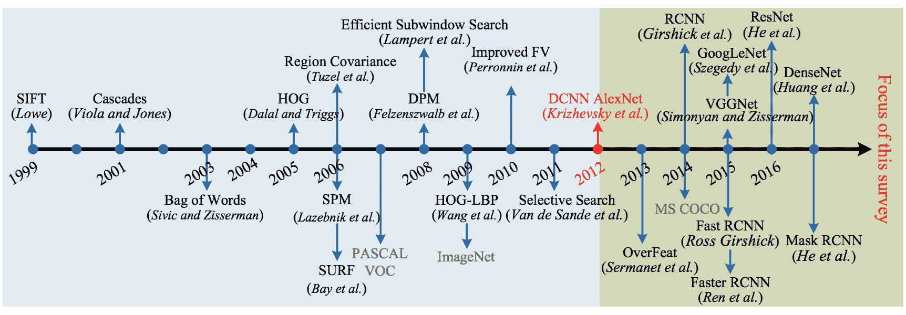

图 9.1：1999 到 2017 年目标检测发展时间线

本章的文件可以在[`github.com/PacktPublishing/Python-Deep-Learning-Projects/tree/master/Chapter09`](https://github.com/PacktPublishing/Python-Deep-Learning-Projects/tree/master/Chapter09)找到。

# 目标检测模型的改进

物体检测和分类一直是研究的主题。使用的模型建立在前人研究的巨大成功基础上。简要回顾进展历史，从 2005 年 Navneet Dalal 和 Bill Triggs 开发的计算机视觉模型**方向梯度直方图**（**HOG**）特征开始。

HOG 特征速度快，表现良好。深度学习和 CNN 的巨大成功使其成为更精确的分类器，因为其深层网络。然而，当时 CNN 的速度相较之下过于缓慢。

解决方案是利用 CNN 的改进分类能力，并通过一种技术提高其速度，采用选择性搜索范式，形成了 R-CNN。减少边界框的数量确实在速度上有所提升，但不足以满足预期。

SPP-net 是一种提出的解决方案，其中计算整个图像的 CNN 表示，并驱动通过选择性搜索生成的每个子部分的 CNN 计算表示。选择性搜索通过观察像素强度、颜色、图像纹理和内部度量来生成所有可能的物体位置。然后，这些识别出的物体会被输入到 CNN 模型中进行分类。

这一改进催生了名为 Fast R-CNN 的模型，采用端到端训练，从而解决了 SPP-net 和 R-CNN 的主要问题。通过名为 Faster R-CNN 的模型进一步推进了这项技术，使用小型区域提议 CNN 代替选择性搜索表现得非常好。

这是 Faster R-CNN 物体检测管道的快速概述：

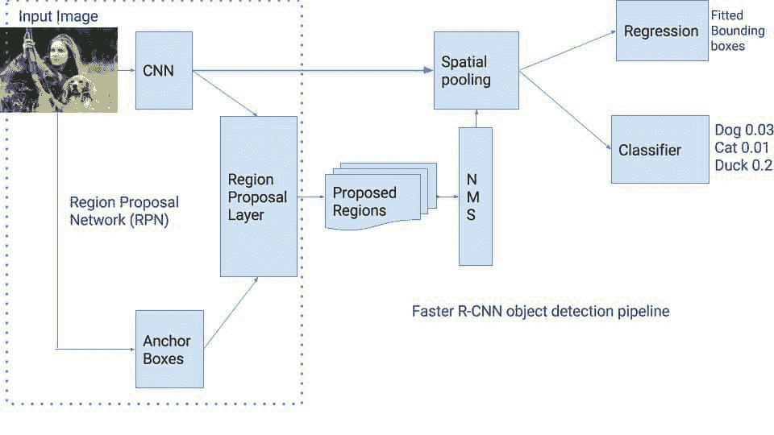

对之前讨论的 R-CNN 版本进行的快速基准对比显示如下：

|  | R-CNN | Fast R-CNN | Faster R-CNN |
| --- | --- | --- | --- |
| 平均响应时间 |  ~50 秒 | ~2 秒 | ~0.2 秒 |
| 速度提升 | 1 倍 | 25 倍 | 250 倍 |

性能提升令人印象深刻，Faster R-CNN 是目前在实时应用中最准确、最快的物体检测算法之一。其他近期强大的替代方法包括 YOLO 模型，我们将在本章后面详细探讨。

# 使用 OpenCV 进行物体检测

让我们从**开源计算机视觉**（**OpenCV**）的基本或传统实现开始我们的项目。该库主要面向需要计算机视觉能力的实时应用。

OpenCV 在 C、C++、Python 等多种语言中都有 API 封装，最佳的前进方式是使用 Python 封装器或任何你熟悉的语言来快速构建原型，一旦代码完成，可以在 C/C++中重写以用于生产。

在本章中，我们将使用 Python 封装器创建我们的初始物体检测模块。

所以，让我们开始吧。

# 一种手工制作的红色物体检测器

在本节中，我们将学习如何创建一个特征提取器，能够使用各种图像处理技术（如腐蚀、膨胀、模糊等）从提供的图像中检测任何红色物体。

# 安装依赖

首先，我们需要安装 OpenCV，我们通过这个简单的 `pip` 命令来完成：

```py
pip install opencv-python
```

接着我们将导入它以及其他用于可视化和矩阵运算的模块：

```py
import cv2
import matplotlib
from matplotlib import colors
from matplotlib import pyplot as plt
import numpy as np
from __future__ import division
```

此外，让我们定义一些帮助函数，帮助我们绘制图像和轮廓：

```py
# Defining some helper function
def show(image):
    # Figure size in inches
    plt.figure(figsize=(15, 15))

    # Show image, with nearest neighbour interpolation
    plt.imshow(image, interpolation='nearest')

def show_hsv(hsv):
    rgb = cv2.cvtColor(hsv, cv2.COLOR_HSV2BGR)
    show(rgb)

def show_mask(mask):
    plt.figure(figsize=(10, 10))
    plt.imshow(mask, cmap='gray')

def overlay_mask(mask, image):
    rgb_mask = cv2.cvtColor(mask, cv2.COLOR_GRAY2RGB)
    img = cv2.addWeighted(rgb_mask, 0.5, image, 0.5, 0)
    show(img)

def find_biggest_contour(image):
    image = image.copy()
    im2,contours, hierarchy = cv2.findContours(image, cv2.RETR_LIST, cv2.CHAIN_APPROX_SIMPLE)

    contour_sizes = [(cv2.contourArea(contour), contour) for contour in contours]
    biggest_contour = max(contour_sizes, key=lambda x: x[0])[1]

    mask = np.zeros(image.shape, np.uint8)
    cv2.drawContours(mask, [biggest_contour], -1, 255, -1)
    return biggest_contour, mask

def circle_countour(image, countour):
    image_with_ellipse = image.copy()
    ellipse = cv2.fitEllipse(countour)

    cv2.ellipse(image_with_ellipse, ellipse, (0,255,0), 2)
    return image_with_ellipse

```

# 探索图像数据

在任何数据科学问题中，首先要做的就是探索和理解数据。这有助于我们明确目标。所以，让我们首先加载图像并检查图像的属性，比如色谱和尺寸：

```py
# Loading image and display
image = cv2.imread('./ferrari.png')
show(image)
```

以下是输出结果：

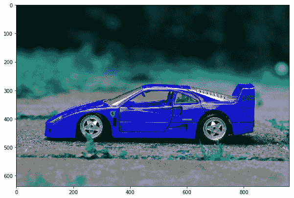

由于图像在内存中存储的顺序是**蓝绿红**（**BGR**），我们需要将其转换为**红绿蓝**（**RGB**）：

```py
image = cv2.cvtColor(image, cv2.COLOR_BGR2RGB)
show(image)
```

以下是输出结果：

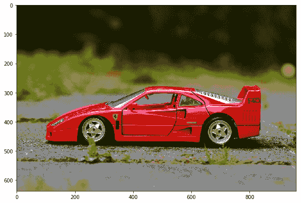

图 9.2：RGB 色彩格式中的原始输入图像。

# 对图像进行归一化处理

我们将缩小图像尺寸，为此我们将使用 `cv2.resize()` 函数：

```py
max_dimension = max(image.shape)
scale = 700/max_dimension
image = cv2.resize(image, None, fx=scale,fy=scale)
```

现在我们将执行模糊操作，使像素更加规范化，为此我们将使用高斯核。高斯滤波器在研究领域非常流行，常用于各种操作，其中之一是模糊效果，能够减少噪声并平衡图像。以下代码执行了模糊操作：

```py
image_blur = cv2.GaussianBlur(image, (7, 7), 0)
```

然后我们将把基于 RGB 的图像转换为 HSV 色谱，这有助于我们使用颜色强度、亮度和阴影来提取图像的其他特征：

```py
image_blur_hsv = cv2.cvtColor(image_blur, cv2.COLOR_RGB2HSV)
```

以下是输出结果：

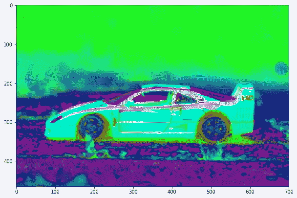

图：9.3：HSV 色彩格式中的原始输入图像。

# 准备掩膜

我们需要创建一个掩膜，可以检测特定的颜色谱；假设我们要检测红色。现在我们将创建两个掩膜，它们将使用颜色值和亮度因子进行特征提取：

```py
# filter by color
min_red = np.array([0, 100, 80])
max_red = np.array([10, 256, 256])
mask1 = cv2.inRange(image_blur_hsv, min_red, max_red)

# filter by brightness
min_red = np.array([170, 100, 80])
max_red = np.array([180, 256, 256])
mask2 = cv2.inRange(image_blur_hsv, min_red, max_red)

# Concatenate both the mask for better feature extraction
mask = mask1 + mask2
```

以下是我们的掩膜效果：

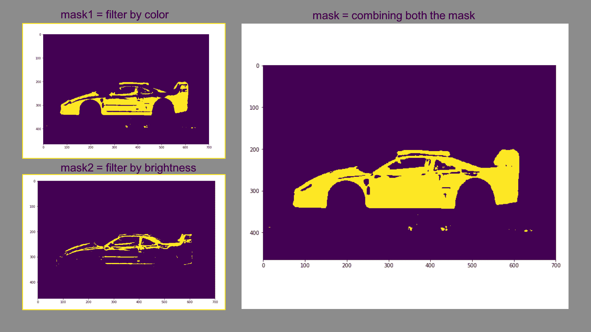

# 掩膜的后处理

一旦我们成功创建了掩膜，我们需要执行一些形态学操作，这是用于几何结构分析和处理的基本图像处理操作。

首先，我们将创建一个内核，执行各种形态学操作，对输入图像进行处理：

```py
kernel = cv2.getStructuringElement(cv2.MORPH_ELLIPSE, (15, 15))
```

**闭操作**：*膨胀后腐蚀* 对于关闭前景物体内部的小碎片或物体上的小黑点非常有帮助。

现在让我们对掩膜执行闭操作：

```py
mask_closed = cv2.morphologyEx(mask, cv2.MORPH_CLOSE, kernel)
```

开操作 *腐蚀后膨胀* 用于去除噪声。

然后我们执行开操作：

```py
mask_clean = cv2.morphologyEx(mask_closed, cv2.MORPH_OPEN, kernel)
```

以下是输出结果：

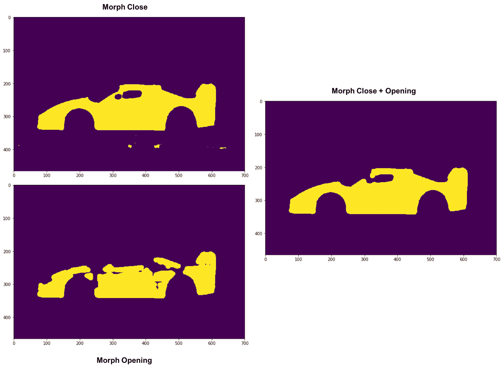

图 9.4：此图展示了形态学闭运算和开运算的输出（左侧），我们将二者结合起来得到最终处理后的掩膜（右侧）。

在前面的截图中，你可以看到（截图的左侧）形态学操作如何改变掩膜的结构，并且当将两种操作结合时（截图的右侧），你会得到去噪后的更干净的结构。

# 应用掩膜

现在是时候使用我们创建的掩膜从图像中提取物体了。首先，我们将使用辅助函数找到最大的轮廓，这是我们需要提取的物体的最大区域。然后将掩膜应用于图像，并在提取的物体上绘制一个圆形边界框：

```py
# Extract biggest bounding box
big_contour, red_mask = find_biggest_contour(mask_clean)

# Apply mask
overlay = overlay_mask(red_mask, image)

# Draw bounding box
circled = circle_countour(overlay, big_contour)

show(circled)
```

以下是输出：

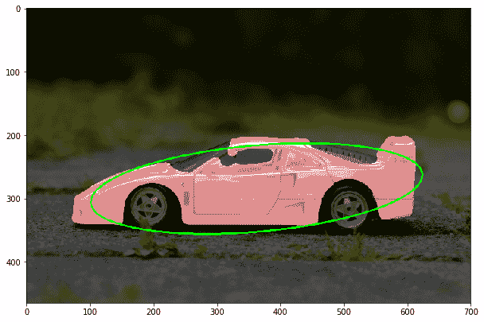

图 9.5：此图展示了我们从图像中检测到红色区域（汽车车身），并在其周围绘制了一个椭圆。

啪！我们成功提取了图像，并使用简单的图像处理技术在物体周围绘制了边界框。

# 使用深度学习进行物体检测

在本节中，我们将学习如何构建一个世界级的物体检测模块，而不需要太多使用传统的手工技术。我们将使用深度学习方法，这种方法足够强大，可以自动从原始图像中提取特征，然后利用这些特征进行分类和检测。

首先，我们将使用一个预制的 Python 库构建一个物体检测器，该库可以使用大多数最先进的预训练模型，之后我们将学习如何使用 YOLO 架构实现一个既快速又准确的物体检测器。

# 快速实现物体检测

物体检测在 2012 年后由于行业趋势向深度学习的转变而得到了广泛应用。准确且越来越快的模型，如 R-CNN、Fast-RCNN、Faster-RCNN 和 RetinaNet，以及快速且高度准确的模型如 SSD 和 YOLO，现在都在生产中使用。在本节中，我们将使用 Python 库中功能齐全的预制特征提取器，只需几行代码即可使用。此外，我们还将讨论生产级设置。

那么，开始吧。

# 安装所有依赖项

这与我们在前几章中执行的步骤相同。首先，让我们安装所有依赖项。在这里，我们使用一个名为 ImageAI 的 Python 模块（[`github.com/OlafenwaMoses/ImageAI`](https://github.com/OlafenwaMoses/ImageAI)），它是一个有效的方法，可以帮助你快速构建自己的物体检测应用程序：

```py
pip install tensorflow
pip install keras
pip install numpy
pip install scipy
pip install opencv-python
pip install pillow
pip install matplotlib
pip install h5py
# Here we are installing ImageAI
pip3 install https://github.com/OlafenwaMoses/ImageAI/releases/download/2.0.2/imageai-2.0.2-py3-none-any.whl
```

我们将使用 Python 3.x 环境来运行这个模块。

对于此实现，我们将使用一个在 COCO 数据集上训练的预训练 ResNet 模型（[`cocodataset.org/#home`](http://cocodataset.org/#home)）（一个大规模的目标检测、分割和描述数据集）。你也可以使用其他预训练模型，如下所示：

+   `DenseNet-BC-121-32.h5` ([`github.com/OlafenwaMoses/ImageAI/releases/download/1.0/DenseNet-BC-121-32.h5`](https://github.com/OlafenwaMoses/ImageAI/releases/download/1.0/DenseNet-BC-121-32.h5)) (31.7 MB)

+   `inception_v3_weights_tf_dim_ordering_tf_kernels.h5` ([`github.com/OlafenwaMoses/ImageAI/releases/download/1.0/inception_v3_weights_tf_dim_ordering_tf_kernels.h5`](https://github.com/OlafenwaMoses/ImageAI/releases/download/1.0/inception_v3_weights_tf_dim_ordering_tf_kernels.h5)) (91.7 MB)

+   `resnet50_coco_best_v2.0.1.h5` ([`github.com/OlafenwaMoses/ImageAI/releases/download/1.0/resnet50_coco_best_v2.0.1.h5`](https://github.com/OlafenwaMoses/ImageAI/releases/download/1.0/resnet50_coco_best_v2.0.1.h5)) (146 MB)

+   `resnet50_weights_tf_dim_ordering_tf_kernels.h5` ([`github.com/OlafenwaMoses/ImageAI/releases/download/1.0/resnet50_weights_tf_dim_ordering_tf_kernels.h5`](https://github.com/OlafenwaMoses/ImageAI/releases/download/1.0/resnet50_weights_tf_dim_ordering_tf_kernels.h5)) (98.1 MB)

+   `squeezenet_weights_tf_dim_ordering_tf_kernels.h5` ([`github.com/OlafenwaMoses/ImageAI/releases/download/1.0/squeezenet_weights_tf_dim_ordering_tf_kernels.h5`](https://github.com/OlafenwaMoses/ImageAI/releases/download/1.0/squeezenet_weights_tf_dim_ordering_tf_kernels.h5)) (4.83 MB)

+   `yolo-tiny.h5` ([`github.com/OlafenwaMoses/ImageAI/releases/download/1.0/yolo-tiny.h5`](https://github.com/OlafenwaMoses/ImageAI/releases/download/1.0/yolo-tiny.h5)) (33.9 MB)

+   `yolo.h5` ([`github.com/OlafenwaMoses/ImageAI/releases/download/1.0/yolo.h5`](https://github.com/OlafenwaMoses/ImageAI/releases/download/1.0/yolo.h5)): 237 MB

要获取数据集，请使用以下命令：

```py
wget https://github.com/OlafenwaMoses/ImageAI/releases/download/1.0/resnet50_coco_best_v2.0.1.h5
```

# 实现

现在我们已经准备好所有的依赖项和预训练模型，我们将实现一个最先进的目标检测模型。我们将使用以下代码导入 ImageAI 的`ObjectDetection`类：

```py
from imageai.Detection import ObjectDetection
import os
model_path = os.getcwd()
```

然后我们创建`ObjectDetection`对象的实例，并将模型类型设置为`RetinaNet()`。接下来，我们设置下载的 ResNet 模型部分，并调用`loadModel()`函数：

```py
object_detector = ObjectDetection()
object_detector.setModelTypeAsRetinaNet()
object_detector.setModelPath( os.path.join(model_path , "resnet50_coco_best_v2.0.1.h5"))
object_detector.loadModel()
```

一旦模型被加载到内存中，我们就可以将新图像输入模型，图像可以是任何常见的图像格式，如 JPEG、PNG 等。此外，函数对图像的大小没有限制，因此你可以使用任何维度的数据，模型会在内部处理它。我们使用`detectObjectsFromImage()`来输入图像。此方法返回带有更多信息的图像，例如检测到的对象的边界框坐标、检测到的对象的标签以及置信度分数。

以下是一些用作输入模型并执行目标检测的图像：

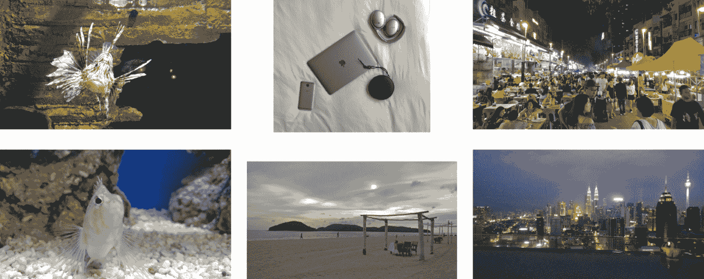

图 9.6：由于在写这章时我正在去亚洲（马来西亚/兰卡威）旅行，我决定尝试使用一些我在旅行中拍摄的真实图像。

以下代码用于将图像输入到模型中：

```py
object_detections = object_detector.detectObjectsFromImage(input_image=os.path.join(model_path , "image.jpg"), output_image_path=os.path.join(model_path , "imagenew.jpg"))
```

此外，我们迭代`object_detection`对象，以读取模型预测的所有物体及其相应的置信度分数：

```py
for eachObject in object_detections:
    print(eachObject["name"] , " : " , eachObject["percentage_probability"]) 
```

以下是结果的展示方式：

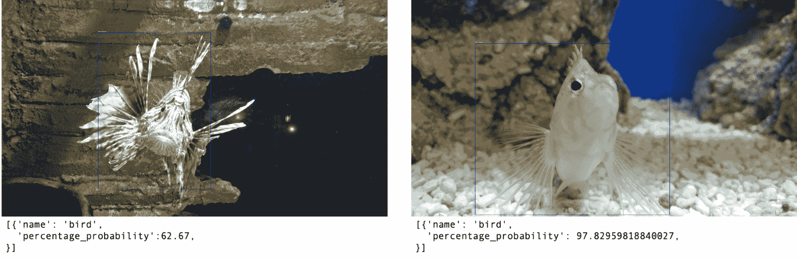

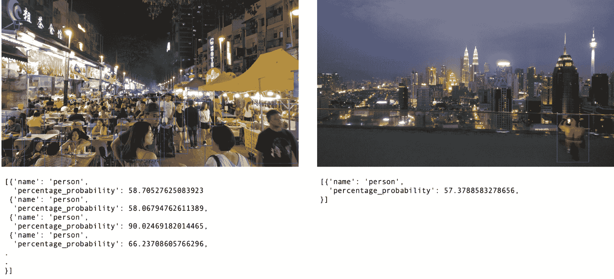

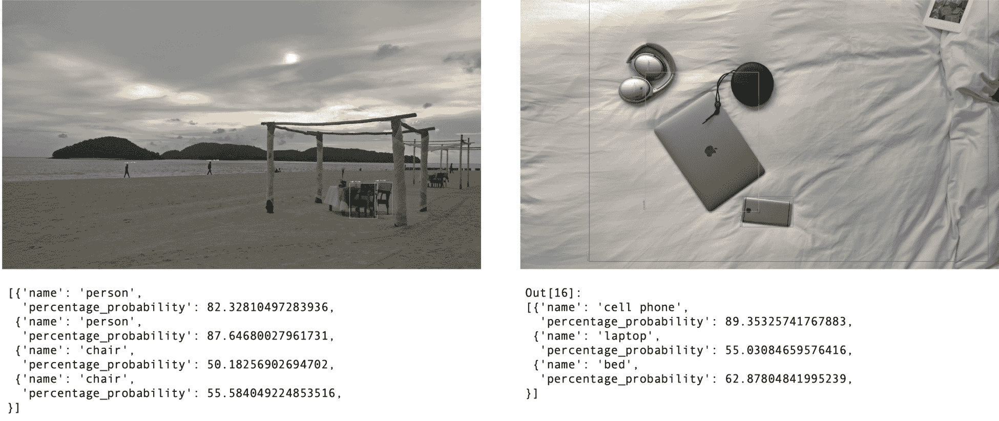

图 9.7：从目标检测模型中提取的结果，图中包含了检测到的物体周围的边界框。结果包含物体的名称和置信度分数。

所以，我们可以看到，预训练模型表现得非常好，只用了很少的代码行。

# 部署

现在我们已经准备好所有基本代码，让我们将`ObjectDetection`模块部署到生产环境中。在本节中，我们将编写一个 RESTful 服务，它将接受图像作为输入，并返回检测到的物体作为响应。

我们将定义一个`POST`函数，它接受带有 PNG、JPG、JPEG 和 GIF 扩展名的图像文件。上传的图像路径将传递给`ObjectDetection`模块，后者执行检测并返回以下 JSON 结果：

```py
from flask import Flask, request, jsonify, redirect
import os , json
from imageai.Detection import ObjectDetection

model_path = os.getcwd()

PRE_TRAINED_MODELS = ["resnet50_coco_best_v2.0.1.h5"]

# Creating ImageAI objects and loading models

object_detector = ObjectDetection()
object_detector.setModelTypeAsRetinaNet()
object_detector.setModelPath( os.path.join(model_path , PRE_TRAINED_MODELS[0]))
object_detector.loadModel()
object_detections = object_detector.detectObjectsFromImage(input_image='sample.jpg')

# Define model paths and the allowed file extentions
UPLOAD_FOLDER = model_path
ALLOWED_EXTENSIONS = set(['png', 'jpg', 'jpeg', 'gif'])

app = Flask(__name__)
app.config['UPLOAD_FOLDER'] = UPLOAD_FOLDER

def allowed_file(filename):
    return '.' in filename and \
           filename.rsplit('.', 1)[1].lower() in ALLOWED_EXTENSIONS

@app.route('/predict', methods=['POST'])
def upload_file():
    if request.method == 'POST':
        # check if the post request has the file part
        if 'file' not in request.files:
            print('No file part')
            return redirect(request.url)
        file = request.files['file']
        # if user does not select file, browser also
        # submit a empty part without filename
        if file.filename == '':
            print('No selected file')
            return redirect(request.url)
        if file and allowed_file(file.filename):
            filename = file.filename
            file_path = os.path.join(app.config['UPLOAD_FOLDER'], filename) 
            file.save(file_path) 

    try:
        object_detections = object_detector.detectObjectsFromImage(input_image=file_path)
    except Exception as ex:
        return jsonify(str(ex))
    resp = []
    for eachObject in object_detections :
        resp.append([eachObject["name"],
                     round(eachObject["percentage_probability"],3)
                     ]
                    )

    return json.dumps(dict(enumerate(resp)))

if __name__ == "__main__":
    app.run(host='0.0.0.0', port=4445)
```

将文件保存为`object_detection_ImageAI.py`并执行以下命令来运行 Web 服务：

```py
python object_detection_ImageAI.py
```

以下是输出结果：

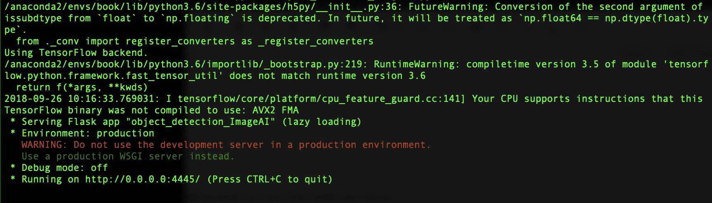

图 9.8：成功执行 Web 服务后的终端屏幕输出。

在另一个终端中，你现在可以尝试调用 API，如下所示的命令：

```py
curl -X POST \
 http://0.0.0.0:4445/predict \
 -H 'content-type: multipart/form-data; boundary=----WebKitFormBoundary7MA4YWxkTrZu0gW' \
 -F file=@/Users/rahulkumar/Downloads/IMG_1651.JPG
```

以下是响应输出：

```py
{
 "0": ["person",54.687],
 "1": ["person",56.77],
 "2": ["person",55.837],
 "3": ["person",75.93],
 "4": ["person",72.956],
 "5": ["bird",81.139]
}
```

所以，这真是太棒了；仅用了几个小时的工作，你就准备好了一个接近最先进技术的生产级目标检测模块。

# 使用 YOLOv2 进行实时目标检测

目标检测和分类的重大进展得益于一个过程，即你只需对输入图像进行一次查看（You Only Look Once，简称 YOLO）。在这一单次处理过程中，目标是设置边界框的角坐标，以便绘制在检测到的物体周围，并使用回归模型对物体进行分类。这个过程能够避免误报，因为它考虑了整个图像的上下文信息，而不仅仅是像早期描述的区域提议方法那样的较小区域。如下所示的**卷积神经网络**（**CNN**）可以一次性扫描图像，因此足够快，能够在实时处理要求的应用中运行。

YOLOv2 在每个单独的网格中预测 N 个边界框，并为每个网格中的对象分类关联一个置信度级别，该网格是在前一步骤中建立的 S×S 网格。

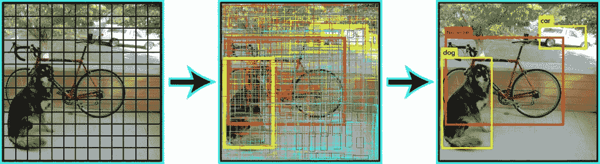

图 9.9：YOLO 工作原理概述。输入图像被划分为网格，然后被送入检测过程，结果是大量的边界框，这些框通过应用一些阈值进一步过滤。

这个过程的结果是生成 S×S×N 个补充框。对于这些框的很大一部分，你会得到相当低的置信度分数，通过应用一个较低的阈值（在本例中为 30%），你可以消除大多数被错误分类的对象，如图所示。

在本节中，我们将使用一个预训练的 YOLOv2 模型进行目标检测和分类。

# 准备数据集

在这一部分，我们将探索如何使用现有的 COCO 数据集和自定义数据集进行数据准备。如果你想用很多类别来训练 YOLO 模型，你可以按照已有部分提供的指示操作，或者如果你想建立自己的自定义目标检测器，跟随自定义构建部分的说明。

# 使用预先存在的 COCO 数据集

在此实现中，我们将使用 COCO 数据集。这是一个用于训练 YOLOv2 以进行大规模图像检测、分割和标注的优质数据集资源。请从 [`cocodataset.org`](http://cocodataset.org) 下载数据集，并在终端中运行以下命令：

1.  获取训练数据集：

```py
wget http://images.cocodataset.org/zips/train2014.zip
```

1.  获取验证数据集：

```py
wget http://images.cocodataset.org/zips/val2014.zip
```

1.  获取训练和验证的标注：

```py
wget http://images.cocodataset.org/annotations/annotations_trainval2014.zip
```

现在，让我们将 COCO 格式的标注转换为 VOC 格式：

1.  安装 Baker：

```py
pip install baker
```

1.  创建文件夹以存储图像和标注：

```py
mkdir images annotations
```

1.  在 `images` 文件夹下解压 `train2014.zip` 和 `val2014.zip`：

```py
unzip train2014.zip -d ./images/
unzip val2014.zip -d ./images/
```

1.  将 `annotations_trainval2014.zip` 解压到 `annotations` 文件夹：

```py
unzip annotations_trainval2014.zip -d ./annotations/

```

1.  创建一个文件夹来存储转换后的数据：

```py
mkdir output
mkdir output/train
mkdir output/val

python coco2voc.py create_annotations /TRAIN_DATA_PATH train /OUTPUT_FOLDER/train
python coco2voc.py create_annotations /TRAIN_DATA_PATH val /OUTPUT_FOLDER/val
```

最终转换后的文件夹结构如下所示：

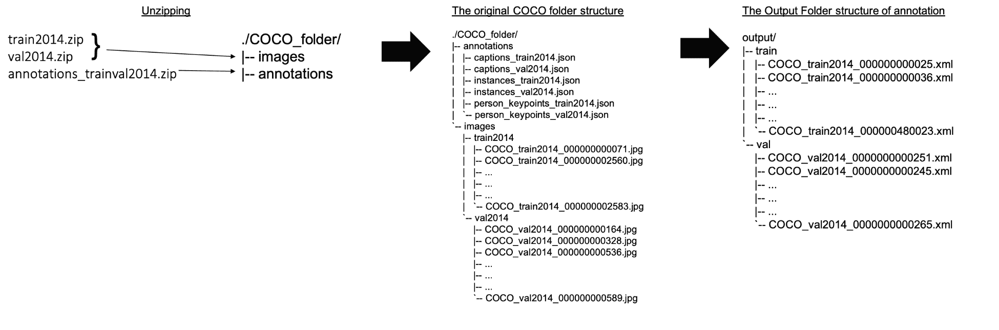

图 9.10：COCO 数据提取和格式化过程示意图

这建立了图像和标注之间的完美对应关系。当验证集为空时，我们将使用 8:2 的比例自动拆分训练集和验证集。

结果是我们将有两个文件夹，`./images` 和 `./annotation`，用于训练目的。

# 使用自定义数据集

现在，如果你想为你的特定应用场景构建一个目标检测器，那么你需要从网上抓取大约 100 到 200 张图像并进行标注。网上有很多标注工具可供使用，比如 LabelImg ([`github.com/tzutalin/labelImg`](https://github.com/tzutalin/labelImg)) 或 **Fast Image Data Annotation Tool** (**FIAT**) ([`github.com/christopher5106/FastAnnotationTool`](https://github.com/christopher5106/FastAnnotationTool))。

为了让你更好地使用自定义目标检测器，我们提供了一些带有相应标注的示例图像。请查看名为 `Chapter09/yolo/new_class/` 的代码库文件夹。

每个图像都有相应的标注，如下图所示：

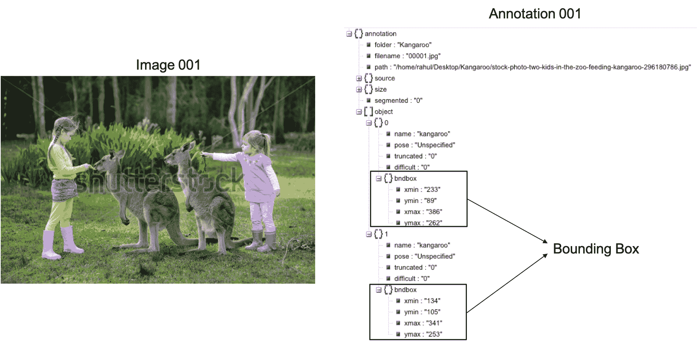

图 9.11：这里显示的是图像与标注之间的关系

此外，我们还需要从 [`pjreddie.com/darknet/yolo/`](https://pjreddie.com/darknet/yolo/) 下载预训练权重文件， 我们将用它来初始化模型，并在这些预训练权重的基础上训练自定义目标检测器：

```py
wget https://pjreddie.com/media/files/yolo.weights
```

# 安装所有依赖：

我们将使用 Keras API 结合 TensorFlow 方法来创建 YOLOv2 架构。让我们导入所有依赖：

```py
pip install keras tensorflow tqdm numpy cv2 imgaug
```

以下是相关的代码：

```py
from keras.models import Sequential, Model
from keras.layers import Reshape, Activation, Conv2D, Input, MaxPooling2D, BatchNormalization, Flatten, Dense, Lambda
from keras.layers.advanced_activations import LeakyReLU
from keras.callbacks import EarlyStopping, ModelCheckpoint, TensorBoard
from keras.optimizers import SGD, Adam, RMSprop
from keras.layers.merge import concatenate
import matplotlib.pyplot as plt
import keras.backend as K
import tensorflow as tf
import imgaug as ia
from tqdm import tqdm
from imgaug import augmenters as iaa
import numpy as np
import pickle
import os, cv2
from preprocessing import parse_annotation, BatchGenerator
from utils import WeightReader, decode_netout, draw_boxes

#Setting GPU configs
os.environ["CUDA_DEVICE_ORDER"] = "PCI_BUS_ID"
os.environ["CUDA_VISIBLE_DEVICES"] = ""
```

总是建议使用 GPU 来训练任何 YOLO 模型。

# 配置 YOLO 模型

YOLO 模型是通过一组超参数和其他配置来设计的。这个配置定义了构建模型的类型，以及模型的其他参数，如输入图像的大小和锚点列表。目前你有两个选择：tiny YOLO 和 full YOLO。以下代码定义了要构建的模型类型：

```py
# List of object that YOLO model will learn to detect from COCO dataset 
#LABELS = ['person', 'bicycle', 'car', 'motorcycle', 'airplane', 'bus', 'train', 'truck', 'boat', 'traffic light', 'fire hydrant', 'stop sign', 'parking meter', 'bench', 'bird', 'cat', 'dog', 'horse', 'sheep', 'cow', 'elephant', 'bear', 'zebra', 'giraffe', 'backpack', 'umbrella', 'handbag', 'tie', 'suitcase', 'frisbee', 'skis', 'snowboard', 'sports ball', 'kite', 'baseball bat', 'baseball glove', 'skateboard', 'surfboard', 'tennis racket', 'bottle', 'wine glass', 'cup', 'fork', 'knife', 'spoon', 'bowl', 'banana', 'apple', 'sandwich', 'orange', 'broccoli', 'carrot', 'hot dog', 'pizza', 'donut', 'cake', 'chair', 'couch', 'potted plant', 'bed', 'dining table', 'toilet', 'tv', 'laptop', 'mouse', 'remote', 'keyboard', 'cell phone', 'microwave', 'oven', 'toaster', 'sink', 'refrigerator', 'book', 'clock', 'vase', 'scissors', 'teddy bear', 'hair drier', 'toothbrush']

# Label for the custom curated dataset.
LABEL = ['kangaroo']
IMAGE_H, IMAGE_W = 416, 416
GRID_H,  GRID_W  = 13 , 13
BOX              = 5
CLASS            = len(LABELS)
CLASS_WEIGHTS    = np.ones(CLASS, dtype='float32')
OBJ_THRESHOLD    = 0.3
NMS_THRESHOLD    = 0.3
ANCHORS          = [0.57273, 0.677385, 1.87446, 2.06253, 3.33843, 5.47434, 7.88282, 3.52778, 9.77052, 9.16828]

NO_OBJECT_SCALE  = 1.0
OBJECT_SCALE     = 5.0
COORD_SCALE      = 1.0
CLASS_SCALE      = 1.0

BATCH_SIZE       = 16
WARM_UP_BATCHES  = 0
TRUE_BOX_BUFFER  = 50
```

配置预训练模型和图像的路径，如以下代码所示：

```py
wt_path = 'yolo.weights'                      
train_image_folder = '/new_class/images/'
train_annot_folder = '/new_class/anno/' 
valid_image_folder = '/new_class/images/' 
valid_annot_folder = '/new_class/anno/'
```

# 定义 YOLO v2 模型

现在，让我们来看看 YOLOv2 模型的架构：

```py
# the function to implement the organization layer (thanks to github.com/allanzelener/YAD2K)
def space_to_depth_x2(x):
    return tf.space_to_depth(x, block_size=2)
input_image = Input(shape=(IMAGE_H, IMAGE_W, 3))
true_boxes  = Input(shape=(1, 1, 1, TRUE_BOX_BUFFER , 4))

# Layer 1
x = Conv2D(32, (3,3), strides=(1,1), padding='same', name='conv_1', use_bias=False)(input_image)
x = BatchNormalization(name='norm_1')(x)
x = LeakyReLU(alpha=0.1)(x)
x = MaxPooling2D(pool_size=(2, 2))(x)

# Layer 2
x = Conv2D(64, (3,3), strides=(1,1), padding='same', name='conv_2', use_bias=False)(x)
x = BatchNormalization(name='norm_2')(x)
x = LeakyReLU(alpha=0.1)(x)
x = MaxPooling2D(pool_size=(2, 2))(x)

# Layer 3
# Layer 4
# Layer 23
# For the entire architecture, please refer to the yolo/Yolo_v2_train.ipynb notebook here: https://github.com/PacktPublishing/Python-Deep-Learning-Projects/blob/master/Chapter09/yolo/Yolo_v2_train.ipynb
```

我们刚刚创建的网络架构可以在这里找到：[`github.com/PacktPublishing/Python-Deep-Learning-Projects/blob/master/Chapter09/Network_architecture/network_architecture.png`](https://github.com/PacktPublishing/Python-Deep-Learning-Projects/blob/master/Chapter09/Network_architecture/network_architecture.png)

以下是输出结果：

```py
Total params: 50,983,561
Trainable params: 50,962,889
Non-trainable params: 20,672
```

# 训练模型

以下是训练模型的步骤：

1.  加载我们下载的权重并用它们初始化模型：

```py
weight_reader = WeightReader(wt_path)
weight_reader.reset()
nb_conv = 23
for i in range(1, nb_conv+1):
    conv_layer = model.get_layer('conv_' + str(i))

    if i < nb_conv:
        norm_layer = model.get_layer('norm_' + str(i))

        size = np.prod(norm_layer.get_weights()[0].shape)

        beta  = weight_reader.read_bytes(size)
        gamma = weight_reader.read_bytes(size)
        mean  = weight_reader.read_bytes(size)
        var   = weight_reader.read_bytes(size)

        weights = norm_layer.set_weights([gamma, beta, mean, var])       

    if len(conv_layer.get_weights()) > 1:
        bias   = weight_reader.read_bytes(np.prod(conv_layer.get_weights()[1].shape))
        kernel = weight_reader.read_bytes(np.prod(conv_layer.get_weights()[0].shape))
        kernel = kernel.reshape(list(reversed(conv_layer.get_weights()[0].shape)))
        kernel = kernel.transpose([2,3,1,0])
        conv_layer.set_weights([kernel, bias])
    else:
        kernel = weight_reader.read_bytes(np.prod(conv_layer.get_weights()[0].shape))
        kernel = kernel.reshape(list(reversed(conv_layer.get_weights()[0].shape)))
        kernel = kernel.transpose([2,3,1,0])
        conv_layer.set_weights([kernel])
```

1.  随机化最后一层的权重：

```py
layer   = model.layers[-4] # the last convolutional layer
weights = layer.get_weights()

new_kernel = np.random.normal(size=weights[0].shape)/(GRID_H*GRID_W)
new_bias   = np.random.normal(size=weights[1].shape)/(GRID_H*GRID_W)

layer.set_weights([new_kernel, new_bias])
```

1.  生成如下代码中的配置：

```py
generator_config = {
    'IMAGE_H' : IMAGE_H, 
    'IMAGE_W' : IMAGE_W,
    'GRID_H' : GRID_H, 
    'GRID_W' : GRID_W,
    'BOX' : BOX,
    'LABELS' : LABELS,
    'CLASS' : len(LABELS),
    'ANCHORS' : ANCHORS,
    'BATCH_SIZE' : BATCH_SIZE,
    'TRUE_BOX_BUFFER' : 50,
}
```

1.  创建训练和验证批次：

```py
# Training batch data
train_imgs, seen_train_labels = parse_annotation(train_annot_folder, train_image_folder, labels=LABELS)
train_batch = BatchGenerator(train_imgs, generator_config, norm=normalize)

# Validation batch data
valid_imgs, seen_valid_labels = parse_annotation(valid_annot_folder, valid_image_folder, labels=LABELS)
valid_batch = BatchGenerator(valid_imgs, generator_config, norm=normalize, jitter=False)
```

1.  设置早停和检查点回调：

```py
early_stop = EarlyStopping(monitor='val_loss', 
                           min_delta=0.001, 
                           patience=3, 
                           mode='min', 
                           verbose=1)

checkpoint = ModelCheckpoint('weights_coco.h5', 
                             monitor='val_loss', 
                             verbose=1, 
                             save_best_only=True, 
                             mode='min', 
                             period=1)
```

1.  使用以下代码来训练模型：

```py
tb_counter = len([log for log in os.listdir(os.path.expanduser('~/logs/')) if 'coco_' in log]) + 1
tensorboard = TensorBoard(log_dir=os.path.expanduser('~/logs/') + 'coco_' + '_' + str(tb_counter), 
                          histogram_freq=0, 
                          write_graph=True, 
                          write_images=False)

optimizer = Adam(lr=0.5e-4, beta_1=0.9, beta_2=0.999, epsilon=1e-08, decay=0.0)
#optimizer = SGD(lr=1e-4, decay=0.0005, momentum=0.9)
#optimizer = RMSprop(lr=1e-4, rho=0.9, epsilon=1e-08, decay=0.0)

model.compile(loss=custom_loss, optimizer=optimizer)

model.fit_generator(generator = train_batch, 
                    steps_per_epoch = len(train_batch), 
                    epochs = 100, 
                    verbose = 1,
                    validation_data = valid_batch,
                    validation_steps = len(valid_batch),
                    callbacks = [early_stop, checkpoint, tensorboard], 
                    max_queue_size = 3)
```

以下是输出结果：

```py
Epoch 1/2
11/11 [==============================] - 315s 29s/step - loss: 3.6982 - val_loss: 1.5416

Epoch 00001: val_loss improved from inf to 1.54156, saving model to weights_coco.h5
Epoch 2/2
11/11 [==============================] - 307s 28s/step - loss: 1.4517 - val_loss: 1.0636

Epoch 00002: val_loss improved from 1.54156 to 1.06359, saving model to weights_coco.h5
```

以下是仅两个 epoch 的 TensorBoard 输出：

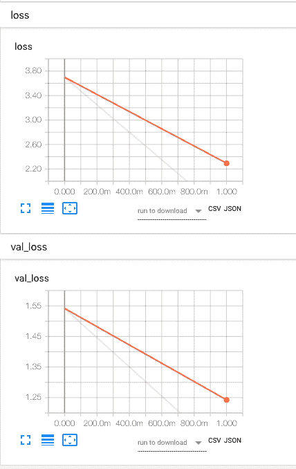

图 9.12：该图表示 2 个 epoch 的损失曲线

# 评估模型

一旦训练完成，让我们通过将输入图像馈送到模型中来执行预测：

1.  首先，我们将模型加载到内存中：

```py
model.load_weights("weights_coco.h5")
```

1.  现在设置测试图像路径并读取它：

```py
input_image_path = "my_test_image.jpg"
image = cv2.imread(input_image_path)
dummy_array = np.zeros((1,1,1,1,TRUE_BOX_BUFFER,4))
plt.figure(figsize=(10,10))
```

1.  对图像进行归一化：

```py
input_image = cv2.resize(image, (416, 416))
input_image = input_image / 255.
input_image = input_image[:,:,::-1]
input_image = np.expand_dims(input_image, 0)
```

1.  做出预测：

```py
netout = model.predict([input_image, dummy_array])

boxes = decode_netout(netout[0], 
                      obj_threshold=OBJ_THRESHOLD,
                      nms_threshold=NMS_THRESHOLD,
                      anchors=ANCHORS, 
                      nb_class=CLASS)

image = draw_boxes(image, boxes, labels=LABELS)

plt.imshow(image[:,:,::-1]); plt.show()
```

这是一些结果：

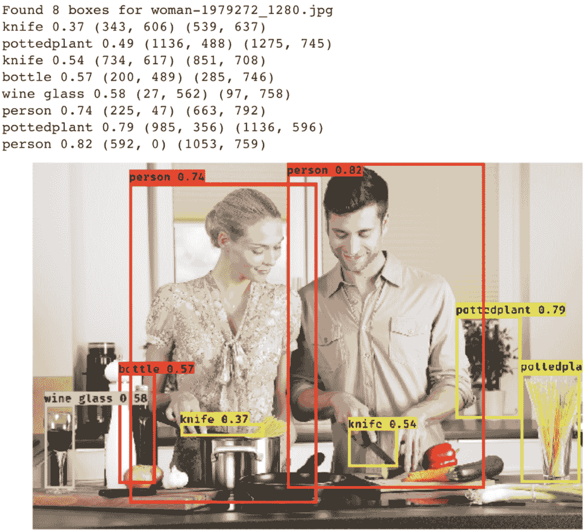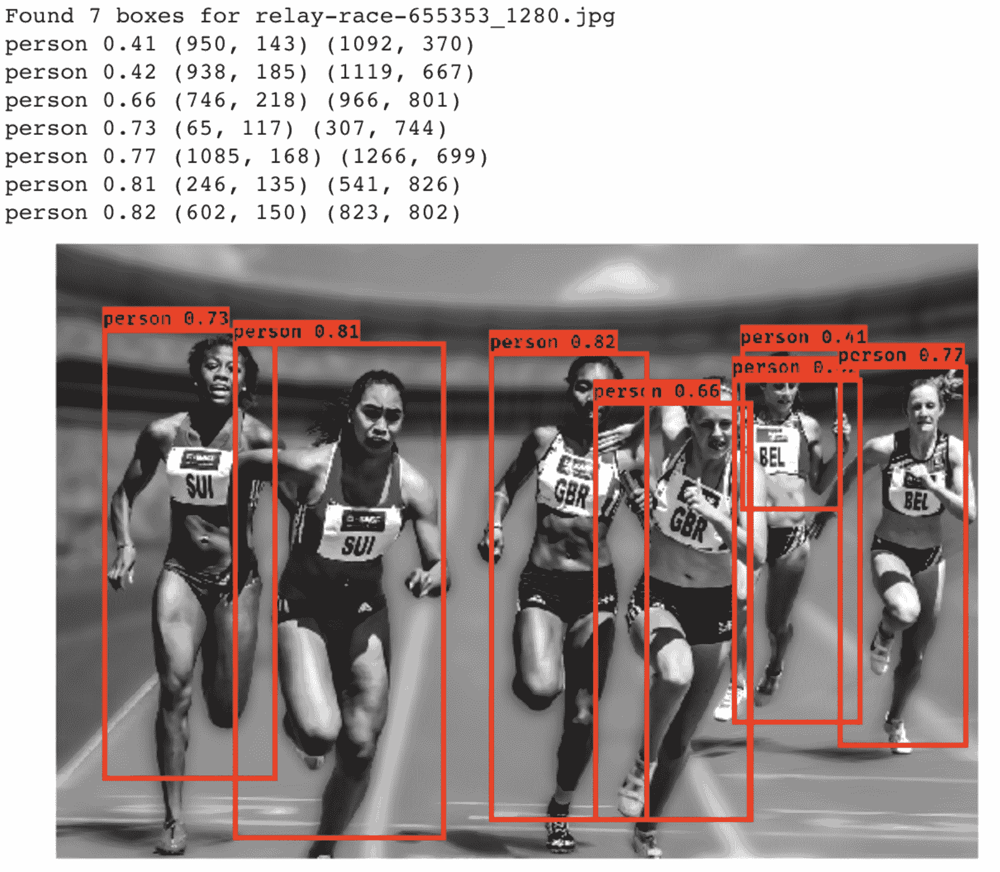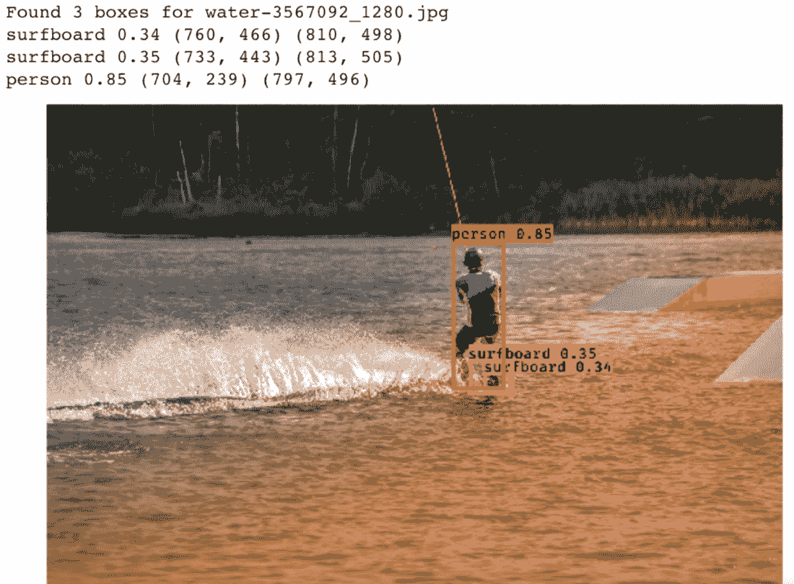

恭喜你，你已经开发出了一个非常快速且可靠的最先进物体检测器。

我们学习了如何使用 YOLO 架构构建一个世界级的物体检测模型，结果看起来非常有前景。现在，你也可以将相同的模型部署到其他移动设备或树莓派上。

# 图像分割

图像分割是将图像中的内容按像素级别进行分类的过程。例如，如果你给定一张包含人的图片，将人从图像中分离出来就是图像分割，并且是通过像素级别的信息来完成的。

我们将使用 COCO 数据集进行图像分割。

在执行任何 SegNet 脚本之前，你需要做以下工作：

```py
cd SegNet
wget http://images.cocodataset.org/zips/train2014.zip
mkdir images
unzip train2014.zip -d images
```

在执行 SegNet 脚本时，确保你的当前工作目录是`SegNet`。

# 导入所有依赖项

在继续之前，确保重新启动会话。

我们将使用`numpy`、`pandas`、`keras`、`pylab`、`skimage`、`matplotlib`和`pycocotools`，如以下代码所示：

```py
from __future__ import absolute_import
from __future__ import print_function

import pylab
import numpy as np
import pandas as pd
import skimage.io as io
import matplotlib.pyplot as plt

from pycocotools.coco import COCO
pylab.rcParams['figure.figsize'] = (8.0, 10.0)
import cv2

import keras.models as models, Sequential
from keras.layers import Layer, Dense, Dropout, Activation, Flatten, Reshape, Permute
from keras.layers import Conv2D, MaxPool2D, UpSampling2D, ZeroPadding2D
from keras.layers import BatchNormalization

from keras.callbacks import ModelCheckpoint, ReduceLROnPlateau
from keras.optimizers import Adam

import keras
keras.backend.set_image_dim_ordering('th')

from tqdm import tqdm
import itertools
%matplotlib inline
```

# 探索数据

我们将首先定义用于图像分割的注释文件的位置，然后初始化 COCO API：

```py
# set the location of the annotation file associated with the train images
annFile='annotations/annotations/instances_train2014.json'

# initialize COCO api with
coco = COCO(annFile)
```

下面是应该得到的输出：

```py
loading annotations into memory...
Done (t=12.84s)
creating index...
index created!
```

# 图像

由于我们正在构建一个二进制分割模型，让我们考虑从`images/train2014`文件夹中只标记为`person`标签的图像，以便将图像中的人分割出来。COCO API 为我们提供了易于使用的方法，其中两个常用的方法是`getCatIds`和`getImgIds`。以下代码片段将帮助我们提取所有带有`person`标签的图像 ID：

```py
# extract the category ids using the label 'person'
catIds = coco.getCatIds(catNms=['person'])

# extract the image ids using the catIds
imgIds = coco.getImgIds(catIds=catIds )

# print number of images with the tag 'person'
print("Number of images with the tag 'person' :" ,len(imgIds))
```

这应该是输出结果：

```py
Number of images with the tag 'person' : 45174
```

现在让我们使用以下代码片段来绘制图像：

```py
# extract the details of image with the image id
img = coco.loadImgs(imgIds[2])[0]
print(img)

# load the image using the location of the file listed in the image variable
I = io.imread('images/train2014/'+img['file_name'])

# display the image
plt.imshow(I)
```

下面是应该得到的输出：

```py
{'height': 426, 'coco_url': 'http://images.cocodataset.org/train2014/COCO_train2014_000000524291.jpg', 'date_captured': '2013-11-18 09:59:07', 'file_name': 'COCO_train2014_000000524291.jpg', 'flickr_url': 'http://farm2.staticflickr.com/1045/934293170_d1b2cc58ff_z.jpg', 'width': 640, 'id': 524291, 'license': 3}
```

我们得到如下输出图像：

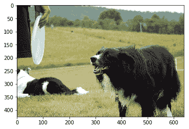

图 9.13：数据集中样本图像的绘制表示。

在前面的代码片段中，我们将一个图像 ID 传入 COCO 的`loadImgs`方法，以提取与该图像对应的详细信息。如果你查看`img`变量的输出，列出的一项键是`file_name`键。这个键包含了位于`images/train2014/`文件夹中的图像名称。

然后，我们使用已导入的`io`模块的`imread`方法读取图像，并使用`matplotlib.pyplot`进行绘制。

# 注释

现在让我们加载与之前图片对应的标注，并在图片上绘制该标注。`coco.getAnnIds()`函数帮助我们通过图像 ID 加载标注信息。然后，借助`coco.loadAnns()`函数，我们加载标注并通过`coco.showAnns()`函数绘制出来。重要的是，你要先绘制图像，再进行标注操作，代码片段如下所示：

```py
# display the image
plt.imshow(I)

# extract the annotation id 
annIds = coco.getAnnIds(imgIds=img['id'], catIds=catIds, iscrowd=None)

# load the annotation
anns = coco.loadAnns(annIds)

# plot the annotation on top of the image
coco.showAnns(anns)
```

以下应为输出：

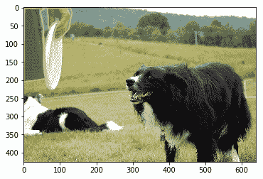

图 9.14：在图像上可视化标注

为了能够获取标注标签数组，使用`coco.annToMask()`函数，如以下代码片段所示。该数组将帮助我们形成分割目标：

```py
# build the mask for display with matplotlib
mask = coco.annToMask(anns[0])

# display the mask
plt.imshow(mask)
```

以下应为输出：

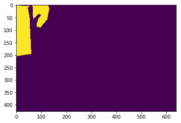

图 9.15：仅可视化标注

# 准备数据

现在让我们定义一个`data_list()`函数，它将自动化加载图像及其分割数组到内存，并使用 OpenCV 将它们调整为 360*480 的形状。此函数返回两个列表，其中包含图像和分割数组：

```py
def data_list(imgIds, count = 12127, ratio = 0.2):
    """Function to load image and its target into memory.""" 
    img_lst = []
    lab_lst = []

    for x in tqdm(imgIds[0:count]):
        # load image details
        img = coco.loadImgs(x)[0]

        # read image
        I = io.imread('images/train2014/'+img['file_name'])
        if len(I.shape)<3:
            continue

        # load annotation information
        annIds = coco.getAnnIds(imgIds=img['id'], catIds=catIds, iscrowd=None)

        # load annotation
        anns = coco.loadAnns(annIds)

        # prepare mask
        mask = coco.annToMask(anns[0])

        # This condition makes sure that we select images having only one person 
        if len(np.unique(mask)) == 2:

            # Next condition selects images where ratio of area covered by the 
 # person to the entire image is greater than the ratio parameter
 # This is done to not have large class imbalance
            if (len(np.where(mask>0)[0])/len(np.where(mask>=0)[0])) > ratio :

                # If you check, generated mask will have 2 classes i.e 0 and 2 
 # (0 - background/other, 1 - person).
 # to avoid issues with cv2 during the resize operation
 # set label 2 to 1, making label 1 as the person. 
                mask[mask==2] = 1

                # resize image and mask to shape (480, 360)
                I= cv2.resize(I, (480,360))
                mask = cv2.resize(mask, (480,360))

                # append mask and image to their lists
                img_lst.append(I)
                lab_lst.append(mask)
    return (img_lst, lab_lst)

# get images and their labels
img_lst, lab_lst = data_list(imgIds)

print('Sum of images for training, validation and testing :', len(img_lst))
print('Unique values in the labels array :', np.unique(lab_lst[0]))
```

以下应为输出：

```py
Sum of images for training, validation and testing : 1997
Unique values in the labels array : [0 1]
```

# 图像归一化

首先，让我们定义`make_normalize()`函数，它接受一张图像并对其进行直方图归一化操作。返回的对象是一个归一化后的数组：

```py
def make_normalize(img):
    """Function to histogram normalize images."""
    norm_img = np.zeros((img.shape[0], img.shape[1], 3),np.float32)

    b=img[:,:,0]
    g=img[:,:,1]
    r=img[:,:,2]

    norm_img[:,:,0]=cv2.equalizeHist(b)
    norm_img[:,:,1]=cv2.equalizeHist(g)
    norm_img[:,:,2]=cv2.equalizeHist(r)

    return norm_img

plt.figure(figsize = (14,5))
plt.subplot(1,2,1)
plt.imshow(img_lst[9])
plt.title(' Original Image')
plt.subplot(1,2,2)
plt.imshow(make_normalize(img_lst[9]))
plt.title(' Histogram Normalized Image')
```

以下应为输出：

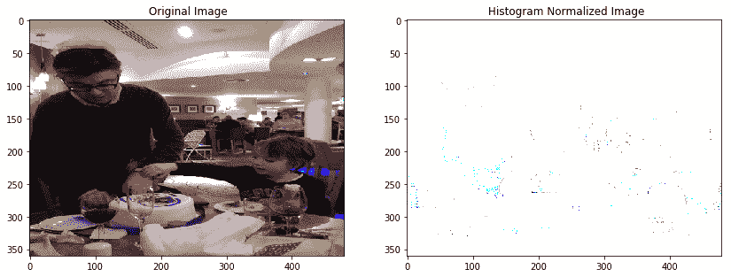

图 9.16：图像直方图归一化前后对比

在前面的截图中，我们看到左边是原始图片，非常清晰，而右边是归一化后的图片，几乎看不见。

# 编码

定义了`make_normalize()`函数后，我们现在定义一个`make_target`函数。该函数接受形状为(360, 480)的分割数组，然后返回形状为(`360`,`480`,`2`)的分割目标。在目标中，通道`0`表示背景，并且在图像中代表背景的位置为`1`，其他位置为零。通道`1`表示人物，并且在图像中代表人物的位置为`1`，其他位置为`0`。以下代码实现了该函数：

```py
def make_target(labels):
    """Function to one hot encode targets."""
    x = np.zeros([360,480,2])
    for i in range(360):
        for j in range(480):
            x[i,j,labels[i][j]]=1
    return x

plt.figure(figsize = (14,5))
plt.subplot(1,2,1)
plt.imshow(make_target(lab_lst[0])[:,:,0])
plt.title('Background')
plt.subplot(1,2,2)
plt.imshow(make_target(lab_lst[0])[:,:,1])
plt.title('Person')
```

以下应为输出：

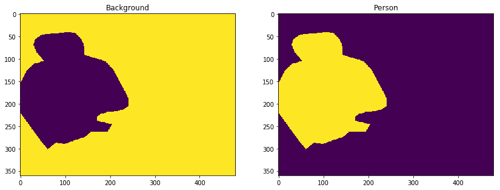

图 9.17：可视化编码后的目标数组

# 模型数据

我们现在定义一个名为`model_data()`的函数，它接受图像列表和标签列表。该函数将对每个图像应用`make_normalize()`函数以进行归一化，并对每个标签/分割数组应用`make_encode()`函数以获得编码后的数组。

该函数返回两个列表，一个包含归一化后的图像，另一个包含对应的目标数组：

```py
def model_data(images, labels):
    """Function to perform normalize and encode operation on each image."""
    # empty label and image list
    array_lst = []
    label_lst=[]

    # apply normalize function on each image and encoding function on each label
    for x,y in tqdm(zip(images, labels)):
        array_lst.append(np.rollaxis(normalized(x), 2))
        label_lst.append(make_target(y))

    return np.array(array_lst), np.array(label_lst)

# Get model data
train_data, train_lab = model_data(img_lst, lab_lst)

flat_image_shape = 360*480

# reshape target array
train_label = np.reshape(train_lab,(-1,flat_image_shape,2))

# test data
test_data = test_data[1900:]
# validation data
val_data = train_data[1500:1900]
# train data
train_data = train_data[:1500]

# test label
test_label = test_label[1900:]
# validation label
val_label = train_label[1500:1900]
# train label
train_label = train_label[:1500]
```

在前面的代码片段中，我们还将数据划分为训练集、测试集和验证集，其中训练集包含`1500`个数据点，验证集包含`400`个数据点，测试集包含`97`个数据点。

# 定义超参数

以下是一些我们将在整个代码中使用的定义超参数，它们是完全可配置的：

```py
# define optimizer
optimizer = Adam(lr=0.002)

# input shape to the model
input_shape=(3, 360, 480)

# training batchsize
batch_size = 6

# number of training epochs
nb_epoch = 60
```

要了解更多关于`optimizers`及其在 Keras 中的 API，请访问[`keras.io/optimizers/`](https://keras.io/optimizers/)。如果遇到关于 GPU 的资源耗尽错误，请减少`batch_size`。

尝试不同的学习率、`optimizers`和`batch_size`，看看这些因素如何影响模型的质量，如果得到更好的结果，可以与深度学习社区分享。

# 定义 SegNet

为了进行图像分割，我们将构建一个 SegNet 模型，它与我们在第八章中构建的自编码器非常相似：*使用卷积神经网络进行手写数字分类*，如图所示：

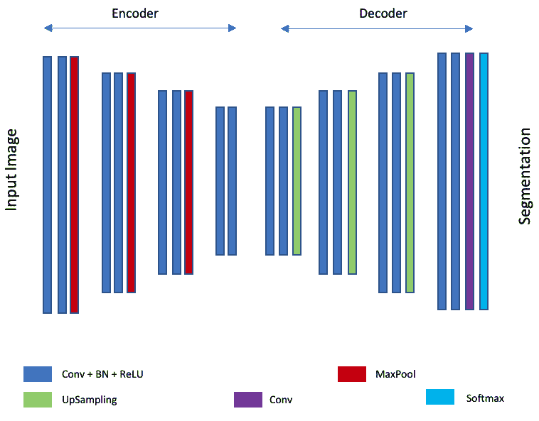

图 9.18：本章使用的 SegNet 架构

我们将定义的 SegNet 模型将接受(*3,360, 480*)的图像作为输入，目标是(*172800, 2*)的分割数组，并且在编码器中将具有以下特点：

+   第一层是一个具有 64 个 3*3 大小滤波器的二维卷积层，`activation`为`relu`，接着是批量归一化，然后是使用大小为 2*2 的 MaxPooling2D 进行下采样。

+   第二层是一个具有 128 个 3*3 大小滤波器的二维卷积层，`activation`为`relu`，接着是批量归一化，然后是使用大小为 2*2 的 MaxPooling2D 进行下采样。

+   第三层是一个具有 256 个 3*3 大小滤波器的二维卷积层，`activation`为`relu`，接着是批量归一化，然后是使用大小为 2*2 的 MaxPooling2D 进行下采样。

+   第四层再次是一个具有 512 个 3*3 大小滤波器的二维卷积层，`activation`为`relu`，接着是批量归一化。

模型在解码器中将具有以下特点：

+   第一层是一个具有 512 个 3*3 大小滤波器的二维卷积层，`activation`为`relu`，接着是批量归一化，然后是使用大小为 2*2 的 UpSampling2D 进行下采样。

+   第二层是一个具有 256 个 3*3 大小滤波器的二维卷积层，`activation`为`relu`，接着是批量归一化，然后是使用大小为 2*2 的 UpSampling2D 进行下采样。

+   第三层是一个具有 128 个 3*3 大小滤波器的二维卷积层，`activation`为`relu`，接着是批量归一化，然后是使用大小为 2*2 的 UpSampling2D 进行下采样。

+   第四层是一个具有 64 个 3*3 大小滤波器的二维卷积层，`activation`为`relu`，接着是批量归一化。

+   第五层是一个大小为 1*1 的 2 个卷积 2D 层，接着是 Reshape、Permute 和一个`softmax`激活层，用于预测得分。

使用以下代码描述模型：

```py
model = Sequential()
# Encoder
model.add(Layer(input_shape=input_shape))
model.add(ZeroPadding2D())
model.add(Conv2D(filters=64, kernel_size=(3,3), padding='valid', activation='relu'))
model.add(BatchNormalization())
model.add(MaxPool2D(pool_size=(2,2)))

model.add(ZeroPadding2D())
model.add(Conv2D(filters=128, kernel_size=(3,3), padding='valid', activation='relu'))
model.add(BatchNormalization())
model.add(MaxPool2D(pool_size=(2,2)))

model.add(ZeroPadding2D())
model.add(Conv2D(filters=256, kernel_size=(3,3), padding='valid', activation='relu'))
model.add(BatchNormalization())
model.add(MaxPool2D(pool_size=(2,2)))

model.add(ZeroPadding2D())
model.add(Conv2D(filters=512, kernel_size=(3,3), padding='valid', activation='relu'))
model.add(BatchNormalization())

# Decoder # For the remaining part of this section of the code refer to the segnet.ipynb file in the SegNet folder. Here is the github link: https://github.com/PacktPublishing/Python-Deep-Learning-Projects/tree/master/Chapter09

```

# 编译模型

在模型定义完成后，使用`categorical_crossentropy`作为`loss`，`Adam`作为`optimizer`来编译模型，这由超参数部分中的`optimizer`变量定义。我们还将定义`ReduceLROnPlateau`，以便在训练过程中根据需要减少学习率，如下所示：

```py
# compile model
model.compile(loss="categorical_crossentropy", optimizer=Adam(lr=0.002), metrics=["accuracy"])

# use ReduceLROnPlateau to adjust the learning rate
reduceLROnPlat = ReduceLROnPlateau(monitor='val_acc', factor=0.75, patience=5,
                      min_delta=0.005, mode='max', cooldown=3, verbose=1)

callbacks_list = [reduceLROnPlat]
```

# 拟合模型

模型编译完成后，我们将使用模型的`fit`方法在数据上拟合模型。在这里，由于我们在一个小的数据集上进行训练，重要的是将参数 shuffle 设置为`True`，以便在每个 epoch 后对图像进行打乱：

```py
# fit the model
history = model.fit(train_data, train_label, callbacks=callbacks_list,
                    batch_size=batch_size, epochs=nb_epoch,
                    verbose=1, shuffle = True, validation_data = (val_data, val_label))
```

这应为输出结果：

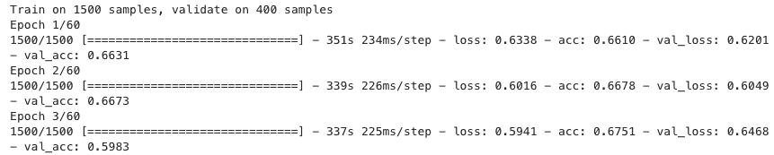

图 9.19：训练输出

以下展示了准确率和损失曲线：

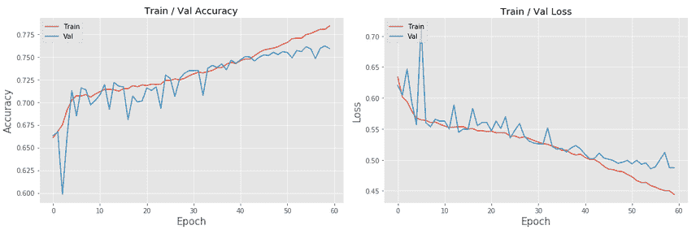

图 9.20：展示训练进展的曲线

# 测试模型

训练好模型后，在测试数据上评估模型，如下所示：

```py
loss,acc = model.evaluate(test_data, test_label)
print('Loss :', loss)
print('Accuracy :', acc)
```

这应为输出结果：

```py
97/97 [==============================] - 7s 71ms/step
Loss : 0.5390811630131043
Accuracy : 0.7633129960482883
```

我们看到，我们构建的 SegNet 模型在测试图像上损失为 0.539，准确率为 76.33。

让我们绘制测试图像及其相应生成的分割结果，以便理解模型的学习情况：

```py
for i in range(3):
    plt.figure(figsize = (10,3))
    plt.subplot(1,2,1)
    plt.imshow(img_lst[1900+i])
    plt.title('Input')
    plt.subplot(1,2,2)
    plt.imshow(model.predict_classes(test_data[i:(i+1)*1]).reshape(360,480))
    plt.title('Segmentation')
```

以下应为输出结果：

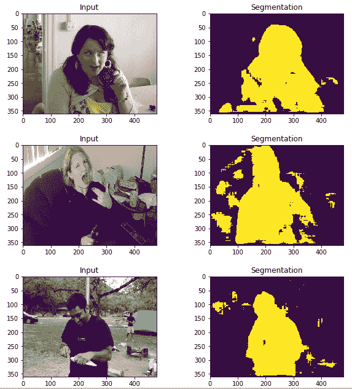

图 9.21：在测试图像上生成的分割结果

从前面的图中，我们可以看到模型能够从图像中分割出人物。

# 结论

项目的第一部分是使用 Keras 中的 YOLO 架构构建一个目标检测分类器。

项目的第二部分是建立一个二进制图像分割模型，针对的是包含人物和背景的 COCO 图像。目标是建立一个足够好的模型，将图像中的人物从背景中分割出来。

我们通过在 1500 张形状为 360*480*3 的图像上进行训练构建的模型，在训练数据上的准确率为 79%，在验证和测试数据上的准确率为 78%。该模型能够成功地分割出图像中的人物，但分割的边缘略微偏离应有的位置。这是由于使用了一个较小的训练集。考虑到训练所用的图像数量，模型在分割上做得还是很不错的。

在这个数据集中还有更多可用于训练的图像，虽然使用 Nvidia Tesla K80 GPU 训练所有图像可能需要一天以上的时间，但这样做将能够获得非常好的分割效果。

# 总结

在本章的第一部分，我们学习了如何使用现有的分类器构建一个 RESTful 服务来进行目标检测，并且我们还学习了如何使用 YOLO 架构的目标检测分类器和 Keras 构建一个准确的目标检测器，同时实现了迁移学习。在本章的第二部分，我们了解了图像分割是什么，并在 COCO 数据集的图像上构建了一个图像分割模型。我们还在测试数据上测试了目标检测器和图像分割器的性能，并确定我们成功达成了目标。
