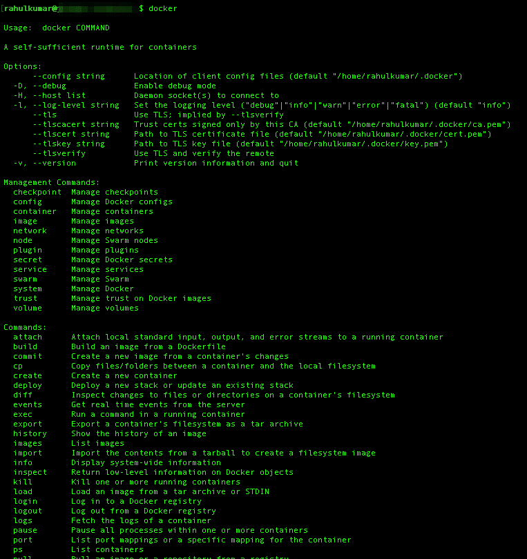

# 第十章：使用 FaceNet 构建人脸识别

在上一章中，我们学习了如何在图像中检测物体。本章中，我们将探讨物体检测的一个具体应用——人脸识别。人脸识别结合了两项主要操作：人脸检测，接着是人脸分类。

在这个项目中提供我们业务用例的（假设）客户是一个高性能计算数据中心，属于 Tier III，并获得了可持续性认证。他们设计了这个设施，以满足对自然灾害的最高保护标准，并配备了许多冗余系统。

目前该设施已经实施了超高安全协议，以防止恶意的人为灾难，并且他们希望通过人脸识别技术增强其安全性，用于控制设施内的安全区域访问。

他们所容纳和维护的服务器处理着世界上最敏感、最有价值且最具影响力的数据，因此风险非常高：


这个人脸识别系统需要能够准确识别出他们自己员工的身份，同时也能识别出偶尔参观数据中心进行检查的客户员工。

他们要求我们提供一个基于智能的能力的 POC，供审查并随后在他们的数据中心中应用。

所以，在本章中，我们将学习如何构建一个世界级的人脸识别系统。我们将定义如下的流程：

1.  **人脸检测**：首先，查看一张图像并找到其中所有可能的人脸

1.  **人脸提取**：其次，聚焦于每一张人脸图像并理解它，例如它是否转向一侧或光线较暗

1.  **特征提取**：第三，使用卷积神经网络（CNN）从人脸中提取独特特征

1.  **分类器训练**：最后，将该人脸的独特特征与所有已知人员的特征进行比较，从而确定此人的姓名

你将学习每个步骤背后的主要思想，以及如何使用以下深度学习技术在 Python 中构建你自己的面部识别系统：

+   **dlib** (**[`dlib.net/`](http://dlib.net/)**)：提供一个可以用于人脸检测和对齐的库。

+   **OpenFace** (**[`cmusatyalab.github.io/openface/`](https://cmusatyalab.github.io/openface/)**)：一个深度学习人脸识别模型，由 Brandon Amos *等人*（[`bamos.github.io/`](http://bamos.github.io/)）开发。它还能够在实时移动设备上运行。

+   **FaceNet** (**[`arxiv.org/abs/1503.03832`](https://arxiv.org/abs/1503.03832)**)：一种用于特征提取的 CNN 架构。FaceNet 使用三元组损失作为损失函数。三元组损失通过最小化正样本之间的距离，同时最大化负样本之间的距离来工作。

# 设置环境

由于设置过程可能非常复杂并且耗时，且本章不涉及这些内容，我们将构建一个包含所有依赖项（包括 dlib、OpenFace 和 FaceNet）的 Docker 镜像。

# 获取代码

从仓库中获取我们将用来构建人脸识别的代码：

```py
git clone https://github.com/PacktPublishing/Python-Deep-Learning-Projects
cd Chapter10/
```

# 构建 Docker 镜像

Docker 是一个容器平台，简化了部署过程。它解决了在不同服务器环境中安装软件依赖的问题。如果你是 Docker 新手，可以在 [`www.docker.com/`](https://www.docker.com/) 阅读更多内容。

要在 Linux 机器上安装 Docker，请运行以下命令：

```py
curl https://get.docker.com | sh
```

对于 macOS 和 Windows 等其他系统，请访问 [`docs.docker.com/install/`](https://docs.docker.com/install/)。如果你已经安装了 Docker，可以跳过此步骤。

安装 Docker 后，你应该能够在终端中使用 `docker` 命令，示例如下：



现在我们将创建一个 `docker` 文件，安装所有依赖项，包括 OpenCV、dlib 和 TensorFlow。该文件可以在 GitHub 仓库中找到，链接如下：[`github.com/PacktPublishing/Python-Deep-Learning-Projects/tree/master/Chapter10/Dockerfile`](https://github.com/PacktPublishing/Python-Deep-Learning-Projects/tree/master/Chapter10/Dockerfile)：

```py
#Dockerfile for our env setup
FROM tensorflow/tensorflow:latest

RUN apt-get update -y --fix-missing
RUN apt-get install -y ffmpeg
RUN apt-get install -y build-essential cmake pkg-config \
                    libjpeg8-dev libtiff5-dev libjasper-dev libpng12-dev \
                    libavcodec-dev libavformat-dev libswscale-dev libv4l-dev \
                    libxvidcore-dev libx264-dev \
                    libgtk-3-dev \
                    libatlas-base-dev gfortran \
                    libboost-all-dev \
                    python3 python3-dev python3-numpy

RUN apt-get install -y wget vim python3-tk python3-pip

WORKDIR /
RUN wget -O opencv.zip https://github.com/Itseez/opencv/archive/3.2.0.zip \
    && unzip opencv.zip \
    && wget -O opencv_contrib.zip https://github.com/Itseez/opencv_contrib/archive/3.2.0.zip \
    && unzip opencv_contrib.zip

# install opencv3.2
RUN cd /opencv-3.2.0/ \
   && mkdir build \
   && cd build \
   && cmake -D CMAKE_BUILD_TYPE=RELEASE \
            -D INSTALL_C_EXAMPLES=OFF \
            -D INSTALL_PYTHON_EXAMPLES=ON \
            -D OPENCV_EXTRA_MODULES_PATH=/opencv_contrib-3.2.0/modules \
            -D BUILD_EXAMPLES=OFF \
            -D BUILD_opencv_python2=OFF \
            -D BUILD_NEW_PYTHON_SUPPORT=ON \
            -D CMAKE_INSTALL_PREFIX=$(python3 -c "import sys; print(sys.prefix)") \
            -D PYTHON_EXECUTABLE=$(which python3) \
            -D WITH_FFMPEG=1 \
            -D WITH_CUDA=0 \
            .. \
    && make -j8 \
    && make install \
    && ldconfig \
    && rm /opencv.zip \
    && rm /opencv_contrib.zip

# Install dlib 19.4
RUN wget -O dlib-19.4.tar.bz2 http://dlib.net/files/dlib-19.4.tar.bz2 \
    && tar -vxjf dlib-19.4.tar.bz2

RUN cd dlib-19.4 \
    && cd examples \
    && mkdir build \
    && cd build \
    && cmake .. \
    && cmake --build . --config Release \
    && cd /dlib-19.4 \
    && pip3 install setuptools \
    && python3 setup.py install \
    && cd $WORKDIR \
    && rm /dlib-19.4.tar.bz2

ADD $PWD/requirements.txt /requirements.txt
RUN pip3 install -r /requirements.txt

CMD ["/bin/bash"]
```

现在执行以下命令来构建镜像：

```py
docker build -t hellorahulk/facerecognition -f Dockerfile
```

安装所有依赖项并构建 Docker 镜像大约需要 20-30 分钟：


# 下载预训练模型

我们将下载一些额外的文件，这些文件将在本章后面详细使用和讨论。

使用以下命令下载 dlib 的人脸关键点预测器：

```py
curl -O http://dlib.net/
```

```py
files/shape_predictor_68_face_landmarks.dat.bz2
bzip2 -d shape_predictor_68_face_landmarks.dat.bz2
cp shape_predictor_68_face_landmarks.dat facenet/
```

下载预训练的 Inception 模型：

```py
curl -L -O https://www.dropbox.com/s/hb75vuur8olyrtw/Resnet-185253.pb
cp Resnet-185253.pb pre-model/
```

一旦我们准备好所有组件，文件夹结构应该大致如下所示：


代码的文件夹结构

确保你将要训练模型的人的图像保存在 `/data` 文件夹中，并将该文件夹命名为 `/data/<class_name>/<class_name>_000<count>.jpg`。

`/output` 文件夹将包含训练后的 SVM 分类器和所有预处理的图像，这些图像将保存在一个子文件夹 `/intermediate` 中，使用与 `/data` 文件夹相同的命名规则。

**专业提示**：为了提高准确度，始终确保每个类别有超过五张样本图像。这将有助于模型更快地收敛，并且能够更好地泛化。

# 构建管道

人脸识别是一种生物识别解决方案，它通过测量面部的独特特征来进行识别。为了执行人脸识别，你需要一种方式来唯一地表示一个面孔。

任何人脸识别系统的基本思想是将面部特征分解为独特的特征，然后使用这些特征来表示身份。

构建一个强大的特征提取流水线非常重要，因为它将直接影响我们系统的性能和准确性。1960 年，伍德罗·布莱德索（Woodrow Bledsoe）使用了一种技术，标记出面部显著特征的坐标。这些特征包括发际线、眼睛和鼻子的位置信息。

后来，在 2005 年，发明了一种更强大的技术——**定向梯度直方图**（**HOG**）。这种技术捕捉了图像中密集像素的朝向。

目前最先进的技术，超越了所有其他技术，使用的是卷积神经网络（CNN）。2015 年，谷歌的研究人员发布了一篇论文，描述了他们的系统 FaceNet ([`arxiv.org/abs/1503.03832`](https://arxiv.org/abs/1503.03832))，该系统使用 CNN 依赖图像像素来识别特征，而不是手动提取它们。

为了构建面部识别流水线，我们将设计以下流程（在图中用橙色方块表示）：

+   **预处理**：找到所有的面部，修正面部的朝向。

+   **特征提取**：从处理过的面部图像中提取独特的特征。

+   **分类器训练**：使用 128 维特征训练 SVM 分类器。

图示如下：


这张图示例了面部识别流水线的端到端流程。

我们将详细查看每一个步骤，并构建我们世界级的面部识别系统。

# 图像的预处理

我们流水线的第一步是面部检测。然后我们将对面部进行对齐，提取特征，并最终在 Docker 上完成预处理。

# 面部检测

很显然，首先定位给定照片中的面部是非常重要的，这样它们才能被送入流水线的后续部分。检测面部有很多方法，例如检测皮肤纹理、椭圆/圆形形状检测以及其他统计方法。我们将使用一种叫做 HOG 的方法。

**HOG**是一种特征描述符，表示梯度方向（或定向梯度）的分布（直方图），这些梯度被用作特征。图像的梯度（*x*和*y*导数）是有用的，因为在边缘和角落（强度变化突然的区域）周围，梯度的幅值较大，而这些是图像中的优秀特征。

为了在图像中找到面部，我们将把图像转换为灰度图像。然后，我们会逐个查看图像中的每个像素，并尝试使用 HOG 检测器提取像素的朝向。我们将使用`dlib.get_frontal_face_detector()`来创建我们的面部检测器。

以下小示例展示了基于 HOG 的面部检测器在实现中的应用：

```py
import sys
import dlib
from skimage import io

# Create a HOG face detector using the built-in dlib class
face_detector = dlib.get_frontal_face_detector()

# Load the image into an array
file_name = 'sample_face_image.jpeg'
image = io.imread(file_name)

# Run the HOG face detector on the image data.
# The result will be the bounding boxes of the faces in our image.
detected_faces = face_detector(image, 1)

print("Found {} faces.".format(len(detected_faces)))

# Loop through each face we found in the image
for i, face_rect in enumerate(detected_faces):
 # Detected faces are returned as an object with the coordinates 
 # of the top, left, right and bottom edges
  print("- Face #{} found at Left: {} Top: {} Right: {} Bottom: {}".format(i+1, face_rect.left(), face_rect.top(), face_rect.right(), face_rect.bottom()))
```

输出结果如下：

```py
Found 1 faces. 
-Face #1 found at Left: 365 Top: 365 Right: 588 Bottom: 588
```

# 对齐面部

一旦我们知道面部所在的区域，就可以执行各种隔离技术，从整体图像中提取出面部。

需要解决的一个挑战是，图像中的人脸可能会被旋转成不同的方向，使其在机器看来有些不同。

为了解决这个问题，我们将对每张图像进行扭曲，使得眼睛和嘴唇始终位于提供图像中的相同位置。这将使我们在接下来的步骤中更容易进行人脸比较。为此，我们将使用一种叫做**人脸地标估计**的算法。

基本思想是，我们将提出 68 个特定的关键点（称为*地标*），这些关键点存在于每张脸上——下巴顶部、每只眼睛的外缘、每条眉毛的内缘等等。然后，我们将训练一个机器学习算法，使其能够在任何脸部上找到这 68 个特定的关键点。

我们将在每张脸上定位的 68 个地标显示在下图中：


这张图像是由 Brandon Amos 创建的（[`bamos.github.io/`](http://bamos.github.io/)），他在 OpenFace 项目中工作（[`github.com/cmusatyalab/openface`](https://github.com/cmusatyalab/openface)）。

这里有一个小片段，演示了如何使用我们在*环境设置*部分下载的人脸地标：

```py
import sys
import dlib
import cv2
import openface

predictor_model = "shape_predictor_68_face_landmarks.dat"

# Create a HOG face detector , Shape Predictor and Aligner
face_detector = dlib.get_frontal_face_detector()
face_pose_predictor = dlib.shape_predictor(predictor_model)
face_aligner = openface.AlignDlib(predictor_model)

# Take the image file name from the command line
file_name = 'sample_face_image.jpeg'

# Load the image
image = cv2.imread(file_name)

# Run the HOG face detector on the image data
detected_faces = face_detector(image, 1)

print("Found {} faces.".format(len(detected_faces))

# Loop through each face we found in the image
for i, face_rect in enumerate(detected_faces):

  # Detected faces are returned as an object with the coordinates 
  # of the top, left, right and bottom edges
  print("- Face #{} found at Left: {} Top: {} Right: {} Bottom: {}".format(i, face_rect.left(), face_rect.top(), face_rect.right(), face_rect.bottom()))

 # Get the the face's pose
  pose_landmarks = face_pose_predictor(image, face_rect)

 # Use openface to calculate and perform the face alignment
  alignedFace = face_aligner.align(534, image, face_rect, landmarkIndices=openface.AlignDlib.OUTER_EYES_AND_NOSE)

 # Save the aligned image to a file
  cv2.imwrite("aligned_face_{}.jpg".format(i), alignedFace)
```

使用这个方法，我们可以执行各种基本的图像变换，如旋转和缩放，同时保持平行线的特性。这些变换也被称为仿射变换（[`en.wikipedia.org/wiki/Affine_transformation`](https://en.wikipedia.org/wiki/Affine_transformation)）。

输出结果如下：


通过*分割*，我们解决了在图像中找到最大脸部的问题，而通过*对齐*，我们基于眼睛和下唇的位置，将输入图像标准化为居中。

这是我们数据集中的一个示例，展示了原始图像和处理后的图像：


# 特征提取

现在我们已经完成了数据的分割和对齐，我们将生成每个身份的向量嵌入。这些嵌入可以作为分类、回归或聚类任务的输入。

训练一个 CNN 输出人脸嵌入的过程需要大量的数据和计算能力。然而，一旦网络训练完成，它就可以为任何脸部生成测量结果，甚至是它从未见过的脸！因此，这一步只需要做一次。

为了方便起见，我们提供了一个已经在 Inception-Resnet-v1 上预训练的模型，您可以在任何人脸图像上运行它，以获取 128 维特征向量。我们在*环境设置*部分下载了此文件，它位于`/pre-model/Resnet-185253.pb`目录中。

如果您想自己尝试这个步骤，OpenFace 提供了一个 Lua 脚本（[`github.com/cmusatyalab/openface/blob/master/batch-represent/batch-represent.lua`](https://github.com/cmusatyalab/openface/blob/master/batch-represent/batch-represent.lua)），该脚本会生成文件夹中所有图像的嵌入，并将它们写入 CSV 文件。

创建输入图像嵌入的代码可以在段落后找到。该代码可在仓库中找到：[`github.com/PacktPublishing/Python-Deep-Learning-Projects/blob/master/Chapter10/facenet/train_classifier.py`](https://github.com/PacktPublishing/Python-Deep-Learning-Projects/blob/master/Chapter10/facenet/train_classifier.py)。

在这个过程中，我们从 Resnet 模型加载了训练好的组件，如`embedding_layer`、`images_placeholder`和`phase_train_placeholder`，以及图像和标签：

```py
def _create_embeddings(embedding_layer, images, labels, images_placeholder, phase_train_placeholder, sess):
    """
    Uses model to generate embeddings from :param images.
    :param embedding_layer: 
    :param images: 
    :param labels: 
    :param images_placeholder: 
    :param phase_train_placeholder: 
    :param sess: 
    :return: (tuple): image embeddings and labels
    """
    emb_array = None
    label_array = None
    try:
        i = 0
        while True:
            batch_images, batch_labels = sess.run([images, labels])
            logger.info('Processing iteration {} batch of size: {}'.format(i, len(batch_labels)))
            emb = sess.run(embedding_layer,
                           feed_dict={images_placeholder: batch_images, phase_train_placeholder: False})

            emb_array = np.concatenate([emb_array, emb]) if emb_array is not None else emb
            label_array = np.concatenate([label_array, batch_labels]) if label_array is not None else batch_labels
            i += 1

    except tf.errors.OutOfRangeError:
        pass

    return emb_array, label_array
```

这是嵌入创建过程的快速概览。我们将图像和标签数据以及来自预训练模型的几个组件一起输入：


该过程的输出将是一个 128 维的向量，表示人脸图像。

# 在 Docker 上执行

我们将在 Docker 镜像上实现预处理。我们将通过`-v`标志将`project`目录挂载为 Docker 容器中的一个卷，并在输入数据上运行预处理脚本。结果将写入通过命令行参数指定的目录。

`align_dlib.py`文件来自 CMU。它提供了检测图像中的人脸、查找面部特征点并对齐这些特征点的方法：

```py
docker run -v $PWD:/facerecognition \
-e PYTHONPATH=$PYTHONPATH:/facerecognition \
-it hellorahulk/facerecognition python3 /facerecognition/facenet/preprocess.py \
--input-dir /facerecognition/data \
--output-dir /facerecognition/output/intermediate \
--crop-dim 180
```

在前面的命令中，我们通过`--input-dir`标志设置了输入数据路径。该目录应包含我们要处理的图像。

我们还使用`--output-dir`标志设置了输出路径，存储分割对齐的图像。我们将使用这些输出图像作为训练输入。

`--crop-dim`标志用于定义图像的输出尺寸。在这种情况下，所有图像将被存储为 180 × 180。

该过程的结果将在`/output`文件夹内创建一个`/intermediate`文件夹，其中包含所有预处理过的图像。

# 训练分类器

首先，我们将从`input`目录（`--input-dir`标志）加载已分割并对齐的图像。在训练过程中，我们将对图像进行预处理。此预处理将向图像添加随机变换，从而生成更多的图像用于训练。

这些图像将以 128 的批量大小输入到预训练模型中。该模型将为每张图像返回一个 128 维的嵌入，为每个批次返回一个 128 x 128 的矩阵。

在创建这些嵌入后，我们将使用它们作为特征输入到 scikit-learn 的 SVM 分类器中，进行每个身份的训练。

以下命令将启动该过程并训练分类器。分类器将作为`pickle`文件保存在`--classifier-path`参数定义的路径中：

```py
docker run -v $PWD:/facerecognition \
-e PYTHONPATH=$PYTHONPATH:/facerecognition \
-it hellorahulk/facerecognition \
python3 /facerecognition/facenet/train_classifier.py \
--input-dir /facerecognition/output/intermediate \
--model-path /facerecognition/pre-model/Resnet-185253.pb \
--classifier-path /facerecognition/output/classifier.pkl \
--num-threads 16 \
--num-epochs 25 \
--min-num-images-per-class 10 \
--is-train
```

一些自定义参数可以调整：

+   `--num-threads`：根据 CPU/GPU 配置进行修改

+   `--num-epochs`：根据你的数据集进行更改

+   `--min-num-images-per-class`：根据你的数据集进行更改

+   `--is-train`：设置为`True`标志表示训练

这个过程可能需要一段时间，具体取决于你用于训练的图像数量。完成后，你会在`/output`文件夹内找到一个`classifier.pkl`文件。

现在，你可以使用`classifier.pkl`文件进行预测，并将其部署到生产环境中。

# 评估

我们将评估训练好的模型的性能。为此，我们将执行以下命令：

```py
docker run -v $PWD:/facerecognition \
-e PYTHONPATH=$PYTHONPATH:/facerecognition \
-it hellorahulk/facerecognition \
python3 /facerecognition/facenet/train_classifier.py \
--input-dir /facerecognition/output/intermediate \
--model-path /facerecognition/pre-model/Resnet-185253.pb \
--classifier-path /facerecognition/output/classifier.pkl \
--num-threads 16 \
--num-epochs 2 \
--min-num-images-per-class 10 \
```

执行完成后，你将看到带有置信度分数的预测结果，如下图所示：


我们可以看到，模型能够以 99.5%的准确度进行预测，并且预测速度相对较快。

# 总结

我们成功完成了一个世界级的人脸识别概念验证（POC）项目，利用 OpenFace、dlib 和 FaceNet 的深度学习技术，服务于我们假设的高性能数据中心。

我们构建了一个包含以下内容的流水线：

+   **人脸检测**：检查图像并找到其中包含的所有人脸

+   **人脸提取**：集中关注每张人脸并了解其基本特征

+   **特征提取**：通过卷积神经网络（CNN）从人脸中提取独特特征

+   **分类器训练**：将这些独特特征与所有已知的人进行比较，并确定该人的名字

强大的面部识别系统为访问控制提供的安全等级，符合这一 Tier III 设施所要求的高标准。这个项目是深度学习强大能力的一个极佳例子，能够为我们客户的业务运营带来有意义的影响。
