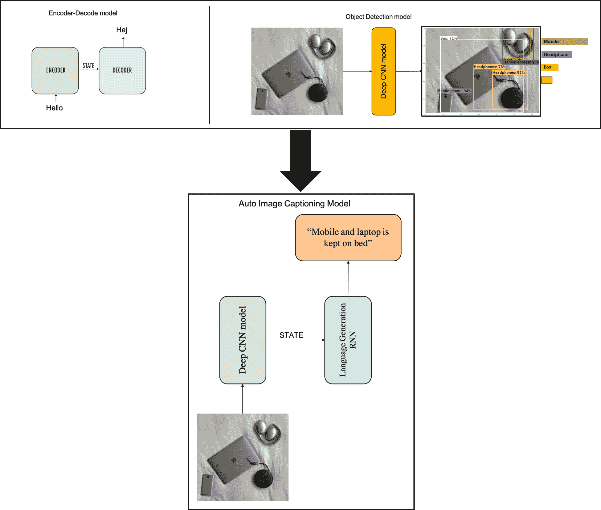
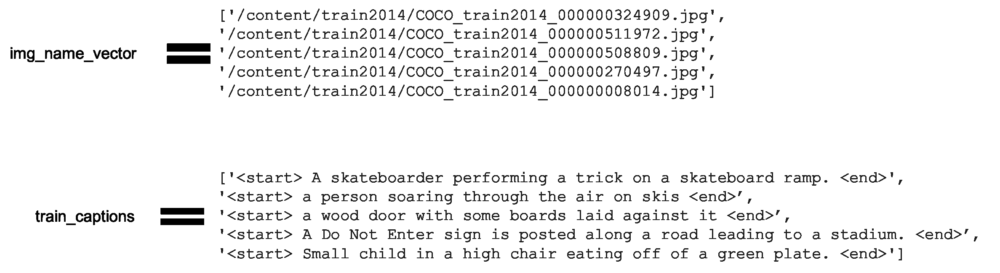
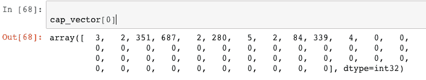
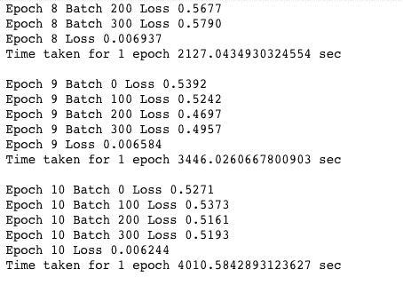
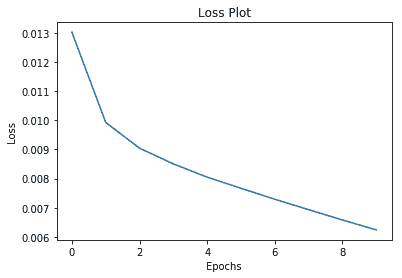
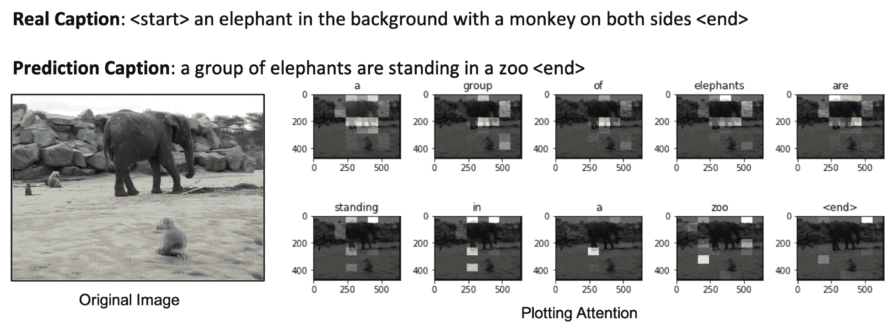
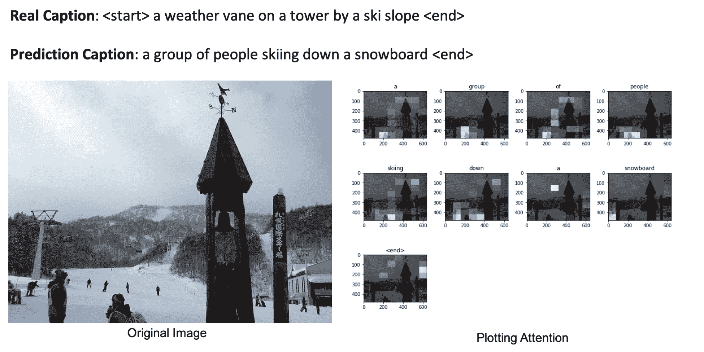
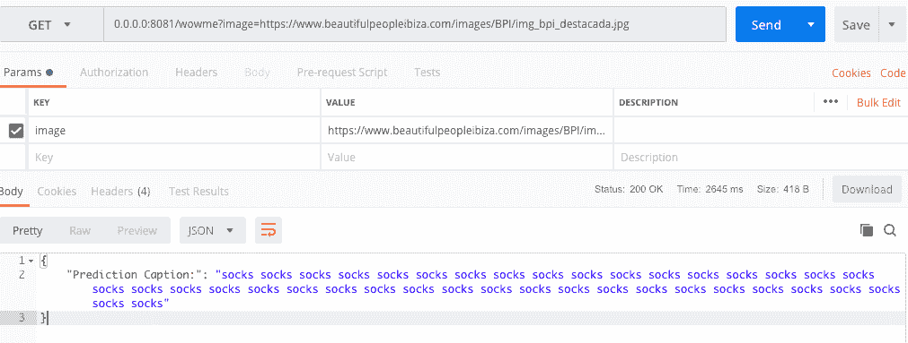

# 第十一章：自动图像描述

在上一章中，我们了解了如何构建物体检测和分类模型，这非常令人兴奋。但在这一章中，我们将做一些更令人印象深刻的事情，结合计算机视觉和自然语言处理的当前最先进技术，形成一个完整的图像描述方法（[`www.cs.cmu.edu/~afarhadi/papers/sentence.pdf`](https://www.cs.cmu.edu/~afarhadi/papers/sentence.pdf)）。这将负责构建任何提供图像的计算机生成的自然描述。

我们的团队被要求构建这个模型，以生成自然语言的图像描述，用作一家公司的核心智能，该公司希望帮助视障人士利用网络上照片分享的爆炸式增长。想到这项深度学习技术可能具备有效地为这一社区带来图像内容的能力，令人兴奋。可能会喜欢我们工作的成果的人群包括从出生时就视力受损的人到老年人群体。这些用户类型及更多人群可以使用基于本项目模型的图像描述机器人，从而了解发布的图像内容，举个例子，他们可以跟上家人的动态。

考虑到这一点，我们来看一下我们需要做的深度学习工程。这个想法是用一个经过训练的深度**卷积神经网络**（**CNN**）替换编码器-解码器架构中的编码器（RNN 层），该 CNN 用于分类图像中的物体。

通常，CNN 的最后一层是 softmax 层，它为每个物体分配该物体在图像中出现的概率。但如果我们将 CNN 中的 softmax 层去除，我们可以将 CNN 对图像的丰富编码传递给解码器（语言生成 RNN），该解码器设计用于生成短语。然后，我们可以直接在图像及其描述上训练整个系统，这样可以最大化生成的描述与每个图像的训练描述最佳匹配的可能性。

这是**自动图像描述模型**的小示意图。在左上角是**编码器-解码器**架构，用于序列到序列的模型，并与**物体检测模型**结合，如下图所示：



在此实现中，我们将使用预训练的 Inception-v3 模型作为特征提取器，在 ImageNet 数据集上训练一个编码器。

# 数据准备

让我们导入构建自动描述模型所需的所有依赖项。

本章的所有 Python 文件和 Jupyter Notebook 可以在[`github.com/PacktPublishing/Python-Deep-Learning-Projects/tree/master/Chapter11`](https://github.com/PacktPublishing/Python-Deep-Learning-Projects/tree/master/Chapter11)找到。

# 初始化

对于此实现，我们需要 TensorFlow 版本大于或等于 1.9，并且我们还将启用即时执行模式（[`www.tensorflow.org/guide/eager`](https://www.tensorflow.org/guide/eager)），这将帮助我们更有效地调试代码。以下是代码：

```py
# Import TensorFlow and enable eager execution
import tensorflow as tf
tf.enable_eager_execution()

import matplotlib.pyplot as plt

from sklearn.model_selection import train_test_split
from sklearn.utils import shuffle

import re
import numpy as np
import os
import time
import json
from glob import glob
from PIL import Image
import pickle
```

# 下载并准备 MS-COCO 数据集

我们将使用 MS-COCO 数据集 ([`cocodataset.org/#home`](http://cocodataset.org/#home)) 来训练我们的模型。该数据集包含超过 82,000 张图片，每张图片都至少有五个不同的标题注释。以下代码将自动下载并提取数据集：

```py
annotation_zip = tf.keras.utils.get_file('captions.zip', 
                                          cache_subdir=os.path.abspath('.'),
                                          origin = 'http://images.cocodataset.org/annotations/annotations_trainval2014.zip',
                                          extract = True)
annotation_file = os.path.dirname(annotation_zip)+'/annotations/captions_train2014.json'

name_of_zip = 'train2014.zip'
if not os.path.exists(os.path.abspath('.') + '/' + name_of_zip):
  image_zip = tf.keras.utils.get_file(name_of_zip, 
                                      cache_subdir=os.path.abspath('.'),
                                      origin = 'http://images.cocodataset.org/zips/train2014.zip',
                                      extract = True)
  PATH = os.path.dirname(image_zip)+'/train2014/'
else:
  PATH = os.path.abspath('.')+'/train2014/'
```

这将涉及一个大的下载过程。我们将使用训练集，它是一个 13 GB 的文件。

以下是输出结果：

```py
Downloading data from http://images.cocodataset.org/annotations/annotations_trainval2014.zip 
252878848/252872794 [==============================] - 6s 0us/step 
Downloading data from http://images.cocodataset.org/zips/train2014.zip 
13510574080/13510573713 [==============================] - 322s 0us/step
```

在这个示例中，我们将选择 40,000 个标题的子集，并使用这些标题及其对应的图片来训练模型。和往常一样，如果选择使用更多数据，标题质量会得到提升：

```py
# read the json annotation file
with open(annotation_file, 'r') as f:
    annotations = json.load(f)

# storing the captions and the image name in vectors
all_captions = []
all_img_name_vector = []

for annot in annotations['annotations']:
    caption = '<start> ' + annot['caption'] + ' <end>'
    image_id = annot['image_id']
    full_coco_image_path = PATH + 'COCO_train2014_' + '%012d.jpg' % (image_id)

    all_img_name_vector.append(full_coco_image_path)
    all_captions.append(caption)

# shuffling the captions and image_names together
# setting a random state
train_captions, img_name_vector = shuffle(all_captions,
                                          all_img_name_vector,
                                          random_state=1)

# selecting the first 40000 captions from the shuffled set
num_examples = 40000
train_captions = train_captions[:num_examples]
img_name_vector = img_name_vector[:num_examples]
```

数据准备完成后，我们将把所有图片路径存储在 `img_name_vector` 列表变量中，相关的标题存储在 `train_caption` 中，如下图所示：



# 深度 CNN 编码器的数据准备

接下来，我们将使用预训练的 Inception-v3（在 ImageNet 上训练）来对每张图片进行分类。我们将从最后一个卷积层提取特征。我们将创建一个辅助函数，将输入图像转换为 Inception-v3 期望的格式：

```py
#Resizing the image to (299, 299)
#Using the preprocess_input method to place the pixels in the range of -1 to 1.

def load_image(image_path):
    img = tf.read_file(image_path)
    img = tf.image.decode_jpeg(img, channels=3)
    img = tf.image.resize_images(img, (299, 299))
    img = tf.keras.applications.inception_v3.preprocess_input(img)
    return img, image_path

```

现在让我们初始化 Inception-v3 模型，并加载预训练的 ImageNet 权重。为此，我们将创建一个 `tf.keras` 模型，其中输出层是 Inception-v3 架构中的最后一个卷积层。

在创建 `keras` 模型时，你可以看到一个名为 `include_top=False` 的参数，它表示是否包括网络顶部的全连接层：

```py
image_model = tf.keras.applications.InceptionV3(include_top=False, 
                                                weights='imagenet')
new_input = image_model.input
hidden_layer = image_model.layers[-1].output

image_features_extract_model = tf.keras.Model(new_input, hidden_layer)
```

输出结果如下：

```py
Downloading data from https://github.com/fchollet/deep-learning-models/releases/download/v0.5/inception_v3_weights_tf_dim_ordering_tf_kernels_notop.h5
87916544/87910968 [==============================] - 40s 0us/step
```

所以，`image_features_extract_model` 是我们的深度 CNN 编码器，它负责从给定的图像中学习特征。

# 执行特征提取

现在我们将使用深度 CNN 编码器对每张图片进行预处理，并将输出保存到磁盘：

1.  我们将使用之前创建的 `load_image()` 辅助函数按批加载图像

1.  我们将把图像输入编码器以提取特征

1.  将特征作为 `numpy` 数组输出：

```py
encode_train = sorted(set(img_name_vector))
#Load images
image_dataset = tf.data.Dataset.from_tensor_slices(
                                encode_train).map(load_image).batch(16)
# Extract features
for img, path in image_dataset:
  batch_features = image_features_extract_model(img)
  batch_features = tf.reshape(batch_features, 
                              (batch_features.shape[0], -1, batch_features.shape[3]))
#Dump into disk
  for bf, p in zip(batch_features, path):
    path_of_feature = p.numpy().decode("utf-8")
    np.save(path_of_feature, bf.numpy())
```

# 语言生成（RNN）解码器的数据准备

第一步是对标题进行预处理。

我们将对标题执行一些基本的预处理步骤，例如以下操作：

+   首先，我们将对标题进行分词（例如，通过空格拆分）。这将帮助我们构建一个包含数据中所有唯一单词的词汇表（例如，“playing”，“football”等）。

+   接下来，我们将把词汇表大小限制为前 5,000 个单词以节省内存。我们将用`unk`（表示未知）替换所有其他单词。你显然可以根据使用场景进行优化。

+   最后，我们将创建一个单词到索引的映射以及反向映射。

+   然后，我们将对所有序列进行填充，使其长度与最长的序列相同。

这里是相关代码：

```py
# Helper func to find the maximum length of any caption in our dataset

def calc_max_length(tensor):
    return max(len(t) for t in tensor)

# Performing tokenization on the top 5000 words from the vocabulary
top_k = 5000
tokenizer = tf.keras.preprocessing.text.Tokenizer(num_words=top_k, 
                                                  oov_token="<unk>", 
                                                  filters='!"#$%&()*+.,-/:;=?@[\]^_`{|}~ ')

# Converting text into sequence of numbers
tokenizer.fit_on_texts(train_captions)
train_seqs = tokenizer.texts_to_sequences(train_captions)

tokenizer.word_index = {key:value for key, value in tokenizer.word_index.items() if value <= top_k}

# putting <unk> token in the word2idx dictionary
tokenizer.word_index[tokenizer.oov_token] = top_k + 1
tokenizer.word_index['<pad>'] = 0

# creating the tokenized vectors
train_seqs = tokenizer.texts_to_sequences(train_captions)

# creating a reverse mapping (index -> word)
index_word = {value:key for key, value in tokenizer.word_index.items()}

# padding each vector to the max_length of the captions
cap_vector = tf.keras.preprocessing.sequence.pad_sequences(train_seqs, padding='post')

# calculating the max_length 
# used to store the attention weights
max_length = calc_max_length(train_seqs)

```

所以，最终的结果将是一个整数序列数组，如下图所示：



现在，我们将使用 80:20 的比例将数据分为训练样本和验证样本：

```py
img_name_train, img_name_val, cap_train, cap_val = train_test_split(img_name_vector,cap_vector,test_size=0.2,random_state=0)

# Checking the sample counts
print ("No of Training Images:",len(img_name_train))
print ("No of Training Caption: ",len(cap_train) )
print ("No of Training Images",len(img_name_val))
print ("No of Training Caption:",len(cap_val) )

No of Training Images: 24000
No of Training Caption:  24000
No of Training Images 6000
No of Training Caption: 6000
```

# 设置数据管道

我们的图像和标题已准备好！接下来，让我们创建一个`tf.data`数据集（[`www.tensorflow.org/api_docs/python/tf/data/Dataset`](https://www.tensorflow.org/api_docs/python/tf/data/Dataset)）用于训练我们的模型。现在，我们将通过对它们进行转换和批处理来为图像和文本模型准备管道：

```py
# Defining parameters
BATCH_SIZE = 64
BUFFER_SIZE = 1000
embedding_dim = 256
units = 512
vocab_size = len(tokenizer.word_index)

# shape of the vector extracted from Inception-V3 is (64, 2048)
# these two variables represent that
features_shape = 2048
attention_features_shape = 64

# loading the numpy files 
def map_func(img_name, cap):
    img_tensor = np.load(img_name.decode('utf-8')+'.npy')
    return img_tensor, cap

#We use the from_tensor_slices to load the raw data and transform them into the tensors

dataset = tf.data.Dataset.from_tensor_slices((img_name_train, cap_train))

# Using the map() to load the numpy files in parallel
# NOTE: Make sure to set num_parallel_calls to the number of CPU cores you have
# https://www.tensorflow.org/api_docs/python/tf/py_func
dataset = dataset.map(lambda item1, item2: tf.py_func(
          map_func, [item1, item2], [tf.float32, tf.int32]), num_parallel_calls=8)

# shuffling and batching
dataset = dataset.shuffle(BUFFER_SIZE)
dataset = dataset.batch(BATCH_SIZE)
dataset = dataset.prefetch(1)
```

# 定义字幕生成模型

我们用来构建自动字幕的模型架构灵感来自于*Show, Attend and Tell*论文（[`arxiv.org/pdf/1502.03044.pdf`](https://arxiv.org/pdf/1502.03044.pdf)）。我们从 Inception-v3 的低层卷积层提取的特征给我们一个形状为(8, 8, 2048)的向量。然后，我们将其压缩成(64, 2048)的形状。

然后，这个向量通过 CNN 编码器传递，该编码器由一个单一的全连接层组成。RNN（在我们的案例中是 GRU）会关注图像来预测下一个词：

```py
def gru(units):
  if tf.test.is_gpu_available():
    return tf.keras.layers.CuDNNGRU(units, 
                                    return_sequences=True, 
                                    return_state=True, 
                                    recurrent_initializer='glorot_uniform')
  else:
    return tf.keras.layers.GRU(units, 
                               return_sequences=True, 
                               return_state=True, 
                               recurrent_activation='sigmoid', 
                               recurrent_initializer='glorot_uniform')
```

# 注意

现在，我们将定义广为人知的注意力机制——巴赫达诺注意力（Bahdanau Attention）（[`arxiv.org/pdf/1409.0473.pdf`](https://arxiv.org/pdf/1409.0473.pdf)）。我们将需要来自 CNN 编码器的特征，形状为（`batch_size`，`64`，`embedding_dim`）。该注意力机制将返回上下文向量和时间轴上的注意力权重：

```py
class BahdanauAttention(tf.keras.Model):
  def __init__(self, units):
    super(BahdanauAttention, self).__init__()
    self.W1 = tf.keras.layers.Dense(units)
    self.W2 = tf.keras.layers.Dense(units)
    self.V = tf.keras.layers.Dense(1)

  def call(self, features, hidden):
    # hidden_with_time_axis shape == (batch_size, 1, hidden_size)
    hidden_with_time_axis = tf.expand_dims(hidden, 1)

    # score shape == (batch_size, 64, hidden_size)
    score = tf.nn.tanh(self.W1(features) + self.W2(hidden_with_time_axis))

    # attention_weights shape == (batch_size, 64, 1)
    # we get 1 at the last axis because we are applying score to self.V
    attention_weights = tf.nn.softmax(self.V(score), axis=1)

    # context_vector shape after sum == (batch_size, hidden_size)
    context_vector = attention_weights * features
    context_vector = tf.reduce_sum(context_vector, axis=1)

    return context_vector, attention_weights

```

# CNN 编码器

现在让我们定义 CNN 编码器，它将是一个单一的全连接层，后面跟着 ReLU 激活函数：

```py
class CNN_Encoder(tf.keras.Model):
    # Since we have already extracted the features and dumped it using pickle
    # This encoder passes those features through a Fully connected layer
    def __init__(self, embedding_dim):
        super(CNN_Encoder, self).__init__()
        # shape after fc == (batch_size, 64, embedding_dim)
        self.fc = tf.keras.layers.Dense(embedding_dim)

    def call(self, x):
        x = self.fc(x)
        x = tf.nn.relu(x)
        return x
```

# RNN 解码器

在这里，我们将定义 RNN 解码器，它将接受来自编码器的编码特征。这些特征被输入到注意力层，与输入的嵌入向量连接。然后，连接后的向量被传递到 GRU 模块，进一步通过两个全连接层：

```py
class RNN_Decoder(tf.keras.Model):
  def __init__(self, embedding_dim, units, vocab_size):
    super(RNN_Decoder, self).__init__()
    self.units = units

    self.embedding = tf.keras.layers.Embedding(vocab_size, embedding_dim)
    self.gru = gru(self.units)
    self.fc1 = tf.keras.layers.Dense(self.units)
    self.fc2 = tf.keras.layers.Dense(vocab_size)

    self.attention = BahdanauAttention(self.units)

  def call(self, x, features, hidden):
    # defining attention as a separate model
    context_vector, attention_weights = self.attention(features, hidden)

    # x shape after passing through embedding == (batch_size, 1, embedding_dim)
    x = self.embedding(x)

    # x shape after concatenation == (batch_size, 1, embedding_dim + hidden_size)
    x = tf.concat([tf.expand_dims(context_vector, 1), x], axis=-1)

    # passing the concatenated vector to the GRU
    output, state = self.gru(x)

    # shape == (batch_size, max_length, hidden_size)
    x = self.fc1(output)

    # x shape == (batch_size * max_length, hidden_size)
    x = tf.reshape(x, (-1, x.shape[2]))

    # output shape == (batch_size * max_length, vocab)
    x = self.fc2(x)

    return x, state, attention_weights

  def reset_state(self, batch_size):
    return tf.zeros((batch_size, self.units))

encoder = CNN_Encoder(embedding_dim)
decoder = RNN_Decoder(embedding_dim, units, vocab_size)
```

# 损失函数

我们正在使用`Adam`优化器来训练模型，并对为`<PAD>`键计算的损失进行屏蔽：

```py
optimizer = tf.train.AdamOptimizer()

# We are masking the loss calculated for padding
def loss_function(real, pred):
    mask = 1 - np.equal(real, 0)
    loss_ = tf.nn.sparse_softmax_cross_entropy_with_logits(labels=real, logits=pred) * mask
    return tf.reduce_mean(loss_)
```

# 训练字幕生成模型

现在，让我们训练模型。我们需要做的第一件事是提取存储在相应`.npy`文件中的特征，然后将这些特征通过 CNN 编码器传递。

编码器的输出、隐藏状态（初始化为 0）以及解码器输入（即起始标记）将传递给解码器。解码器返回预测结果和解码器的隐藏状态。

然后，解码器的隐藏状态会被传回模型中，预测结果将用于计算损失。在训练过程中，我们使用**教师强迫技术**来决定解码器的下一个输入。

教师强迫是一种技术，将目标词作为下一个输入传递给解码器。这种技术有助于快速学习正确的序列或序列的正确统计特性。

最后一步是计算梯度并将其应用于优化器，然后进行反向传播：

```py
EPOCHS = 20
loss_plot = []

for epoch in range(EPOCHS):
    start = time.time()
    total_loss = 0

    for (batch, (img_tensor, target)) in enumerate(dataset):
        loss = 0

        # initializing the hidden state for each batch
        # because the captions are not related from image to image
        hidden = decoder.reset_state(batch_size=target.shape[0])

        dec_input = tf.expand_dims([tokenizer.word_index['<start>']] * BATCH_SIZE, 1)

        with tf.GradientTape() as tape:
            features = encoder(img_tensor)

            for i in range(1, target.shape[1]):
                # passing the features through the decoder
                predictions, hidden, _ = decoder(dec_input, features, hidden)

                loss += loss_function(target[:, i], predictions)

                # using teacher forcing
                dec_input = tf.expand_dims(target[:, i], 1)

        total_loss += (loss / int(target.shape[1]))

        variables = encoder.variables + decoder.variables

        gradients = tape.gradient(loss, variables) 

        optimizer.apply_gradients(zip(gradients, variables), tf.train.get_or_create_global_step())

        if batch % 100 == 0:
            print ('Epoch {} Batch {} Loss {:.4f}'.format(epoch + 1, 
                                                          batch, 
                                                          loss.numpy() / int(target.shape[1])))
    # storing the epoch end loss value to plot later
    loss_plot.append(total_loss / len(cap_vector))

    print ('Epoch {} Loss {:.6f}'.format(epoch + 1, 
                                         total_loss/len(cap_vector)))
    print ('Time taken for 1 epoch {} sec\n'.format(time.time() - start))

```

以下是输出：



在执行了几次训练迭代后，让我们绘制`Epoch`与`Loss`的图表：

```py
plt.plot(loss_plot)
plt.xlabel('Epochs')
plt.ylabel('Loss')
plt.title('Loss Plot')
plt.show()
```

输出如下：



训练过程中的损失与迭代次数图

# 评估字幕生成模型

评估函数与训练循环类似，唯一的不同是我们这里不使用教师强迫。每次时间步解码器的输入是它之前的预测结果、隐藏状态以及编码器的输出。

做预测时需要记住的几个要点：

+   当模型预测结束标记时，停止预测

+   存储每个时间步的注意力权重

让我们定义`evaluate()`函数：

```py
def evaluate(image):
 attention_plot = np.zeros((max_length, attention_features_shape))

 hidden = decoder.reset_state(batch_size=1)

 temp_input = tf.expand_dims(load_image(image)[0], 0)
 img_tensor_val = image_features_extract_model(temp_input)
 img_tensor_val = tf.reshape(img_tensor_val, (img_tensor_val.shape[0], -1, img_tensor_val.shape[3]))

 features = encoder(img_tensor_val)

 dec_input = tf.expand_dims([tokenizer.word_index['<start>']], 0)
 result = []

 for i in range(max_length):
 predictions, hidden, attention_weights = decoder(dec_input, features, hidden)

 attention_plot[i] = tf.reshape(attention_weights, (-1, )).numpy()

 predicted_id = tf.argmax(predictions[0]).numpy()
 result.append(index_word[predicted_id])

 if index_word[predicted_id] == '<end>':
 return result, attention_plot

 dec_input = tf.expand_dims([predicted_id], 0)

 attention_plot = attention_plot[:len(result), :]
 return result, attention_plot
```

此外，让我们创建一个`helper`函数来可视化预测单词的注意力点：

```py
def plot_attention(image, result, attention_plot):
    temp_image = np.array(Image.open(image))

    fig = plt.figure(figsize=(10, 10))

    len_result = len(result)
    for l in range(len_result):
        temp_att = np.resize(attention_plot[l], (8, 8))
        ax = fig.add_subplot(len_result//2, len_result//2, l+1)
        ax.set_title(result[l])
        img = ax.imshow(temp_image)
        ax.imshow(temp_att, cmap='gray', alpha=0.6, extent=img.get_extent())

    plt.tight_layout()
    plt.show()

# captions on the validation set
rid = np.random.randint(0, len(img_name_val))
image = img_name_val[rid]
real_caption = ' '.join([index_word[i] for i in cap_val[rid] if i not in [0]])
result, attention_plot = evaluate(image)

print ('Real Caption:', real_caption)
print ('Prediction Caption:', ' '.join(result))
plot_attention(image, result, attention_plot)
# opening the image
Image.open(img_name_val[rid])
```

输出如下：





# 部署字幕生成模型

现在，让我们将整个模块部署为 RESTful 服务。为此，我们将编写一个推理代码，加载最新的检查点，并对给定的图像进行预测。

查看仓库中的`inference.py`文件。所有代码与训练循环相似，唯一的不同是我们这里不使用教师强迫。每次时间步解码器的输入是它之前的预测结果、隐藏状态以及编码器的输出。

一个重要部分是将模型加载到内存中，我们使用`tf.train.Checkpoint()`方法来加载所有学习到的权重，包括`optimizer`、`encoder`、`decoder`，并将它们加载到内存中。以下是相应的代码：

```py
checkpoint_dir = './my_model'
checkpoint_prefix = os.path.join(checkpoint_dir, "ckpt")
checkpoint = tf.train.Checkpoint(
                                 optimizer=optimizer,
                                 encoder=encoder,
                                 decoder=decoder,
                                )

checkpoint.restore(tf.train.latest_checkpoint(checkpoint_dir))
```

因此，我们将创建一个`evaluate()`函数，该函数定义了预测循环。为了确保预测在某些词语后停止，我们将在模型预测结束标记`<end>`时停止预测：

```py
def evaluate(image):
    attention_plot = np.zeros((max_length, attention_features_shape))

    hidden = decoder.reset_state(batch_size=1)

    temp_input = tf.expand_dims(load_image(image)[0], 0)
 # Extract features from the test image
    img_tensor_val = image_features_extract_model(temp_input)
    img_tensor_val = tf.reshape(img_tensor_val, (img_tensor_val.shape[0], -1, img_tensor_val.shape[3]))
 # Feature is fed into the encoder
    features = encoder(img_tensor_val)

    dec_input = tf.expand_dims([tokenizer.word_index['<start>']], 0)
    result = []
 # Prediction loop
    for i in range(max_length):
        predictions, hidden, attention_weights = decoder(dec_input, features, hidden)

        attention_plot[i] = tf.reshape(attention_weights, (-1, )).numpy()

        predicted_id = tf.argmax(predictions[0]).numpy()
        result.append(index_word[predicted_id])
 # Hard stop when end token is predicted
        if index_word[predicted_id] == '<end>':
            return result, attention_plot

        dec_input = tf.expand_dims([predicted_id], 0)

    attention_plot = attention_plot[:len(result), :]
    return result, attention_plot
```

现在让我们在 Web 应用程序代码中使用这个`evaluate()`函数：

```py
#!/usr/bin/env python2
# -*- coding: utf-8 -*-
"""
@author: rahulkumar
"""

from flask import Flask , request, jsonify

import time
from inference import evaluate
import tensorflow as tf

app = Flask(__name__)

@app.route("/wowme")
def AutoImageCaption():
    image_url=request.args.get('image')
    print('image_url')
    image_extension = image_url[-4:]
    image_path = tf.keras.utils.get_file(str(int(time.time()))+image_extension, origin=image_url)
    result, attention_plot = evaluate(image_path)
    data = {'Prediction Caption:': ' '.join(result)}

    return jsonify(data)

if __name__ == "__main__":
    app.run(host = '0.0.0.0',port=8081)
```

在终端执行以下命令来运行 Web 应用程序：

```py
python caption_deploy_api.py 
```

你应该会得到以下输出：

```py
* Running on http://0.0.0.0:8081/ (Press CTRL+C to quit)
```

现在我们请求 API，如下所示：

```py
curl 0.0.0.0:8081/wowme?image=https://www.beautifulpeopleibiza.com/images/BPI/img_bpi_destacada.jpg 
```

我们应该能得到预测的字幕，如下图所示：



确保在大图像上训练模型，以获得更好的预测效果。

哇！我们刚刚部署了最先进的自动字幕生成模块。

# 总结

在这个实现中，我们使用了一个预训练的 Inception-v3 模型作为特征提取器，并将其作为编码器的一部分，在 ImageNet 数据集上进行训练，作为深度学习解决方案的一部分。该解决方案结合了目前最先进的*计算机视觉*和*自然语言处理*技术，形成了一个完整的图像描述方法([`www.cs.cmu.edu/~afarhadi/papers/sentence.pdf`](https://www.cs.cmu.edu/~afarhadi/papers/sentence.pdf))，能够为任何提供的图像构建计算机生成的自然描述。通过这个训练好的模型，我们有效地打破了图像与语言之间的障碍，并提供了一项技术，可以作为应用程序的一部分，帮助视障人士享受照片分享这一大趋势带来的益处！伟大的工作！
