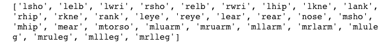

# 第十二章：使用卷积神经网络（ConvNets）进行 3D 模型的姿势估计

欢迎来到我们关于人体姿势估计的章节。在本章中，我们将构建一个神经网络，该网络将使用 2D 图像预测 3D 人体姿势。我们将借助迁移学习，使用 VGG16 模型架构，并根据当前问题对其进行修改。到本章结束时，你将拥有一个**深度学习**（**DL**）模型，它能够很好地预测人体姿势。

电影中的**视觉效果**（**VFX**）成本高昂。它们涉及使用大量昂贵的传感器，这些传感器将在拍摄时安装在演员的身体上。然后，来自这些传感器的信息将用于构建视觉效果，所有这些都最终变得非常昂贵。在这个假设的案例中，我们被一家大型电影制片厂问是否可以通过构建一个人体姿势估算器来帮助他们的图形部门构建更便宜、更好的视觉效果，他们将使用该估算器来在编辑时更好地估计屏幕上的姿势。

对于本任务，我们将使用来自**电影标签框架**（**FLIC**）的图像。这些图像尚未准备好用于建模。所以，请准备好在本章花费更多时间来准备图像数据。此外，我们将只估算手臂、肩膀和头部的姿势。

在本章中，我们将学习以下主题：

+   为姿势估计处理/准备图像

+   VGG16 模型

+   迁移学习

+   构建并理解训练循环

+   测试模型

如果你在本章中逐步实现代码片段，最好使用 Jupyter Notebook 或任何源代码编辑器。这将使你更容易跟上进度，并理解代码的每一部分的作用。

本章的所有 Python 文件和 Jupyter 笔记本可以在[`github.com/PacktPublishing/Python-Deep-Learning-Projects/tree/master/Chapter12`](https://github.com/PacktPublishing/Python-Deep-Learning-Projects/tree/master/Chapter12)找到。

# 代码实现

在这个练习中，我们将使用 Keras 深度学习库，它是一个高级神经网络 API，能够在 TensorFlow、Theano 和 CNTK 之上运行。

如果你有任何关于 Keras 的问题，请参考这个易于理解的 Keras 文档：[`keras.io`](https://keras.io)。

在继续本章内容之前，请从 GitHub 下载`Chapter12`文件夹。

本项目涉及从多个来源下载文件，这些文件将在脚本中调用。为了确保 Python 脚本或 Jupyter Notebook 能够正确定位下载的文件，请按照以下步骤操作：

1.  打开终端并使用`cd`命令切换到`Chapter12`文件夹。

1.  使用以下命令下载`FLIC-full`数据文件：

```py
wget http://vision.grasp.upenn.edu/video/FLIC-full.zip
```

1.  使用以下命令解压 ZIP 文件：

```py
unzip FLIC-full.zip
```

1.  使用以下命令删除 ZIP 文件：

```py
rm -rf FLIC-full.zip
```

1.  使用以下命令在`FLIC-full`文件夹中切换目录：

```py
cd FLIC-full
```

1.  下载包含训练索引的文件：

```py
wget http://cims.nyu.edu/~tompson/data/tr_plus_indices.mat
```

1.  将目录切换回`Chapter12`文件夹。

1.  启动你的 Jupyter Notebook 或从`Chapter12`目录运行 Python 脚本。

你可以在[`bensapp.github.io/flic-dataset.html`](https://bensapp.github.io/flic-dataset.html)找到关于`FLIC-full`数据文件夹的更多信息。

# 导入依赖包

本次练习中我们将使用`numpy`、`matplotlib`、`keras`、`tensorflow`和`tqdm`包。在这里，TensorFlow 作为 Keras 的后端。你可以通过`pip`安装这些包。对于 MNIST 数据，我们将使用`keras`模块中提供的数据集，使用简单的`import`即可：

```py
import matplotlib.pyplot as plt
%matplotlib inline

import os
import random
import glob
import h5py
from scipy.io import loadmat
import numpy as np
import pandas as pd
import cv2 as cv
from __future__ import print_function

from sklearn.model_selection import train_test_split

from keras.models import Sequential, Model
from keras.layers.core import Flatten, Dense, Dropout
from keras.optimizers import Adam
from keras import backend as K
from keras import applications
K.clear_session()
```

为了可重复性，请务必设置`seed`：

```py
# set seed for reproducibility
seed_val = 9000
np.random.seed(seed_val)
random.seed(seed_val)
```

# 探索和预处理数据

下载并解压完`FLIC-full`数据文件夹后，你应该能在`FLIC-full`文件夹中找到`tr_plus_indices.mat`和`examples.mat` MATLAB 文件，并且还有一个名为`images`的文件夹，里面是将用于本项目的图像。

你会发现，这些图像是从电影如*速度与激情 2*、*与波莉同行*、*美国婚礼*等中截取的。每张图像的大小为 480*720 像素。这些图像只是选定电影中演员场景的截图，我们将使用它们进行姿势估计。

让我们加载 MATLAB 文件`examples.mat`。我们将借助已经导入的`loadmat`模块来完成这项操作，并打印出文件中的一些信息：

```py
# load the examples file
examples = loadmat('FLIC-full/examples.mat')

# print type of the loaded file
print('examples variable is of', type(examples))

# print keys in the dictionary examples
print('keys in the dictionary examples:\n', examples.keys())ut
```

以下是输出：


图 12.1：来自打印输出 1 的示例文件信息

从打印输出中，我们可以看到该 MATLAB 文件已作为字典加载，其中包含四个键，其中一个是我们需要的：`examples`键。我们来看一下这个键的内容：

```py
# print type and shape of values in examples key
print('Shape of value in examples key: ',examples['examples'].shape)

# print examples
print('Type: ',type(examples['examples']))

# reshape the examples array 
examples = examples['examples'].reshape(-1,)

# print shape of examples array
print("Shape of reshaped 'examples' array:", examples.shape)
```

以下是输出：


图 12.2：来自打印输出 1 的示例文件信息

这里需要注意的是，`examples`键的值是一个形状为(1, 20928)的 numpy 数组。你还会看到，这个数组已经被重塑为形状`(20928,)`。`examples`键包含的是图像（在`images`文件夹中）的 ID 及其对应的姿势坐标，可用于建模。

让我们打印出一个图像 ID 及其对应的坐标数组及其形状。我们需要的图像 ID 存储在索引`3`中，相关的坐标存储在索引`2`中。我们来打印这些出来：

```py
print('Coordinates at location/index 3 of example 0:\n' ,examples[0][2].T)

print('\n Data type in which the coordinates are stored: ',type(examples[0][2]))

print('\n Shape of the coordinates:', examples[0][2].shape)

print('\n Name of the image file the above coordinates correspond to :\n ',examples[0][3][0])
```

以下是输出：


图 12.3：来自打印输出 2 的示例文件信息

从之前的截图中，我们可以看到坐标数组的形状是(2,29)：

```py
# each coordinate corresponds to the the below listed body joints/locations and in the same order
joint_labels = ['lsho', 'lelb', 'lwri', 'rsho', 'relb', 'rwri', 'lhip',
               'lkne', 'lank', 'rhip', 'rkne', 'rank', 'leye', 'reye',
                'lear', 'rear', 'nose', 'msho', 'mhip', 'mear', 'mtorso',
                'mluarm', 'mruarm', 'mllarm', 'mrlarm', 'mluleg', 'mruleg',
                'mllleg', 'mrlleg']

# print joint_labels
print(joint_labels)
```

以下是输出：



图 12.4：关节标签列表

但是，如果你回顾前面的截图中我们打印的坐标数组，在 29 个坐标中，我们只得到了 11 个身体关节/位置的信息。具体如下：

```py
# print list of known joints
known_joints = [x for i,x in enumerate(joint_labels) if i in np.r_[0:7, 9, 12:14, 16]]
print(known_joints)
```

以下是输出结果：


图 12.5：带坐标的关节标签列表

对于本项目，我们只需要以下身体关节/位置的信息：

```py
# print needed joints for the task
target_joints = ['lsho', 'lelb', 'lwri', 'rsho', 'relb',
                 'rwri', 'leye', 'reye', 'nose']
print('Joints necessary for the project:\n', target_joints)

# print the indices of the needed joints in the coordinates array
joints_loc_id = np.r_[0:6, 12:14, 16]
print('\nIndices of joints necessary for the project:\n',joints_loc_id)
```

以下是输出结果：


图 12.6：数组中所需的关节及其索引

`lsho`：左肩

`lelb`：左肘

`lwri`：左手腕

`rsho`：右肩

`relb`：右肘

`rwri`：右手腕

`leye`：左眼

`reye`：右眼

`nose`：鼻子

现在，让我们定义一个函数，该函数接受包含九个关节标签和坐标的字典，并返回一个包含七个坐标（*7*（*x*,*y*）对）的列表。七个坐标的原因是，当我们对`leye`、`reye`和`nose`坐标取平均时，它们会合并成一个头部坐标：

```py
def joint_coordinates(joint):
    """Store necessary coordinates to a list"""
    joint_coor = []
    # Take mean of the leye, reye, nose to obtain coordinates for the head
    joint['head'] = (joint['leye']+joint['reye']+joint['nose'])/3
    joint_coor.extend(joint['lwri'].tolist())
    joint_coor.extend(joint['lelb'].tolist())
    joint_coor.extend(joint['lsho'].tolist())
    joint_coor.extend(joint['head'].tolist())
    joint_coor.extend(joint['rsho'].tolist())
    joint_coor.extend(joint['relb'].tolist())
    joint_coor.extend(joint['rwri'].tolist())
    return joint_coor
```

现在让我们加载`tr_plus_indices.mat` MATLAB 文件，就像我们之前做的那样：

我们需要使用`tr_plus_indices.mat`文件的原因是，它包含了仅应用于训练的图像的索引，以及一些未列出的用于测试的图像。这样的划分目的是确保训练集和测试集来自完全不同的电影片段，从而避免过拟合。有关更多信息，请访问 [`bensapp.github.io/flic-dataset.html`](https://bensapp.github.io/flic-dataset.html)。

```py
# load the indices matlab file
train_indices = loadmat('FLIC-full/tr_plus_indices.mat')

# print type of the loaded file
print('train_indices variable is of', type(train_indices))

# print keys in the dictionary training_indices
print('keys in the dictionary train_indices:\n', train_indices.keys())
```

以下是输出结果：


图 12.7：train_indices 文件信息输出 1

从之前的截图可以看到，MATLAB 文件已作为字典加载，包含四个键，其中之一是`tr_plus_indices`，这是我们需要的。让我们看一下这个键的内容：

```py
# print type and shape of values in tr_plus_indices key
print('Shape of values in tr_plus_indices key: ',train_indices['tr_plus_indices'].shape)

# print tr_plus_indices
print('Type: ',type(train_indices['tr_plus_indices']))

# reshape the training_indices array 
train_indices = train_indices['tr_plus_indices'].reshape(-1,)

# print shape of train_indices array
print("Shape of reshaped 'train_indices' array:", train_indices.shape)
```

以下是输出结果：


图 12.8：train_indices 文件信息输出 2

我们可以看到，`tr_plus_indices`键对应一个形状为(17380*1)的数组。为了方便起见，我们将其重塑为`(17380, )`。

`tr_plus_indices`包含了`examples.mat`文件中`examples`键的数据索引，这些数据仅应用于训练。使用这些信息，我们将数据划分为训练集和测试集：

```py
# empty list to store train image ids
train_ids = []
# empty list to store train joints
train_jts = []
# empty list to store test image ids
test_ids = []
# empty list to store test joints
test_jts = []

for i, example in enumerate(examples):
    # image id
    file_name = example[3][0]
    # joint coordinates
    joint = example[2].T
    # dictionary that goes into the joint_coordinates function
    joints = dict(zip(target_joints, [x for k,x in enumerate(joint) if k in joints_loc_id]))
    # obtain joints for the task
    joints = joint_coordinates(joints)
    # use train indices list to decide if an image is to be used for training or testing
    if i in train_indices:
        train_ids.append(file_name)
        train_jts.append(joints)
    else:
        test_ids.append(file_name)
        test_jts.append(joints)

# Concatenate image ids dataframe and the joints dataframe and save it as a csv
```

对于代码片段的其余部分，请参阅`deeppose.ipynb`文件： [`github.com/PacktPublishing/Python-Deep-Learning-Projects/blob/master/Chapter12/deeppose.ipynb`](https://github.com/PacktPublishing/Python-Deep-Learning-Projects/blob/master/Chapter12/deeppose.ipynb)

我们可以看到，训练数据有 17,380 个数据点，每个数据点有一个图像 ID 和*7*（*x*,*y*）的关节坐标。同样，测试数据有 3,548 个数据点。

在前面的代码片段中，我们首先初始化了四个空列表，两个用于保存训练和测试图像 ID，两个用于保存训练和测试关节。然后，对于 `examples` 键中的每个数据点，我们执行以下操作：

1.  提取文件名。

1.  提取关节坐标。

1.  将目标关节（目标关节标签）与相应的关节坐标配对，并将其转换为字典。

1.  将字典传递给 `joint_coordinates` 函数，以获取此任务所需的关节。

1.  使用 `train_indices` 列表，将之前步骤中得到的图像 ID 和相应的关节添加到训练或测试列表中。

最后，将列表转换为训练和测试数据框，并将其保存为 CSV 文件。保存数据框时，请确保不将索引和标题参数设置为 `False`。

让我们加载在前一步保存的 `train_joints.csv` 和 `test_joints.csv` 文件，并打印出一些细节：

```py
# load train_joints.csv
train_data = pd.read_csv('FLIC-full/train_joints.csv', header=None)

# load test_joints.csv
test_data = pd.read_csv('FLIC-full/test_joints.csv', header = None)

# train image ids
train_image_ids = train_data[0].values
print('train_image_ids shape', train_image_ids.shape)

# train joints
train_joints = train_data.iloc[:,1:].values
print('train_image_ids shape', train_joints.shape)

# test image ids
test_image_ids = test_data[0].values
print('train_image_ids shape', test_image_ids.shape)

# test joints
test_joints = test_data.iloc[:,1:].values
print('train_image_ids shape', test_joints.shape)
```

以下是输出：


图 12.9：图像 ID 和关节数组形状的打印输出

现在，让我们从 `images` 文件夹加载一些图像，并绘制它们，看看它们的样子：

```py
import glob
image_list = glob.glob('FLIC-full/images/*.jpg')[0:8]

plt.figure(figsize=(12,5))
for i in range(8):
    plt.subplot(2,4,(i+1))
    img = plt.imread(image_list[i])
    plt.imshow(img, aspect='auto')
    plt.axis('off')
    plt.title('Shape: '+str(img.shape))

plt.tight_layout()
plt.show()
```

以下是输出：


图 12.10：来自 FLIC_full 文件夹中的图像文件夹的八张图像的绘图

我们可以看到每张图像的形状为 (480*720*3)。接下来的任务是通过使用我们所拥有的关节坐标来裁剪原始图像并聚焦于感兴趣的对象。我们将图像调整为 224*224*3 的大小，以便将其输入到 VGG16 模型中。最后，我们还将构建一个 `plotting` 函数，用于在图像上绘制关节：


图 12.11：显示每张图像必须经过的变换的绘图

# 数据准备

现在让我们实现之前章节结尾时讨论的任务所需的函数。

# 裁剪

我们将首先从 `image_cropping()` 函数开始。此函数接受图像 ID 及其相应的关节坐标。它将图像加载到内存中，然后裁剪图像，只保留图像中由坐标框定的部分。裁剪后的图像将被填充，以便关节和肢体完全可见。对于添加的填充，关节坐标也会相应调整。完成此操作后，图像将被返回。这是转换中最重要的部分。花点时间分析这个函数，看看到底发生了什么（`crop_pad_inf` 和 `crop_pad_sup` 参数控制填充量）：

```py
def image_cropping(image_id, joints, crop_pad_inf = 1.4, crop_pad_sup=1.6, shift = 5, min_dim = 100):
    """Function to crop original images"""
    ## image cropping
 # load the image 
    image = cv.imread('FLIC-full/images/%s' % (image_id))
    # convert joint list to array 
    joints = np.asarray([int(float(p)) for p in joints])
    # reshape joints to shape (7*2)
    joints = joints.reshape((len(joints) // 2, 2))
    # transform joints to list of (x,y) tuples
    posi_joints = [(j[0], j[1]) for j in joints if j[0] > 0 and j[1] > 0]
    # obtain the bounding rectangle using opencv boundingRect
    x_loc, y_loc, width, height = cv.boundingRect(np.asarray([posi_joints]))
    if width < min_dim:
        width = min_dim
    if height < min_dim:
        height = min_dim

    ## bounding rect extending
    inf, sup = crop_pad_inf, crop_pad_sup
    r = sup - inf
    # define width padding
    pad_w_r = np.random.rand() * r + inf # inf~sup
    # define height padding
    pad_h_r = np.random.rand() * r + inf # inf~sup
    # adjust x, y, w and h by the defined padding
    x_loc -= (width * pad_w_r - width) / 2
    y_loc -= (height * pad_h_r - height) / 2
    width *= pad_w_r
    height *= pad_h_r

    ## shifting
    ## clipping
    ## joint shifting
```

对于此代码片段的剩余部分，请参阅此处的文件`deeppose.ipynb`：[`github.com/PacktPublishing/Python-Deep-Learning-Projects/blob/master/Chapter12/deeppose.ipynb`](https://github.com/PacktPublishing/Python-Deep-Learning-Projects/blob/master/Chapter12/deeppose.ipynb)

让我们将图像 ID 及其关节传递给`image_cropping()`函数，并绘制输出图像：

```py
# plot the original image 
plt.figure(figsize = (15,5))
plt.subplot(1,2,1)
plt.title('Original')
plt.imshow(plt.imread('FLIC-full/images/'+train_image_ids[0]))

# plot the cropped image
image, joint = image_cropping(train_image_ids[0], train_joints[0])
plt.subplot(1,2,2)
plt.title('Cropped')
plt.imshow(image)
```

以下是输出：


图 12.12：裁剪后的图像与原始图像的绘图对比

# 调整大小

在*Cropping*部分中，我们看到形状为(480*720*3)的原始图像被裁剪为形状为(393*254*3)。然而，VGG16 架构接受形状为(224*224*3)的图像。因此，我们将定义一个名为`image_resize()`的函数来完成调整大小。它接受裁剪后的图像及其由`image_cropping()`函数产生的关节作为输入，并返回调整大小后的图像及其关节坐标：

```py
def image_resize(image, joints, new_size = 224):
    """Function resize cropped images"""
    orig_h, orig_w = image.shape[:2]
    joints[0::2] = joints[0::2] / float(orig_w) * new_size
    joints[1::2] = joints[1::2] / float(orig_h) * new_size
    image = cv.resize(image, (new_size, new_size), interpolation=cv.INTER_NEAREST)
    return image, joints
# plot resized image
image, joint = image_resize(image, joint)
plt.title('Cropped + Resized')
plt.imshow(image)
```

以下是输出：


图 12.13：调整大小后图像的绘图

将裁剪后的图像传递给`image_resize()`函数后，我们可以看到生成的图像形状为(224*224*3)。现在可以将此图像及其关节传递到模型进行训练。

# 绘制关节和四肢

让我们也定义绘制功能，它将在调整大小后的图像上绘制四肢。以下定义的`plot_joints()`函数接受调整大小后的图像及其关节，并返回相同形状的带有绘制四肢的图像：

```py
def plot_limb(img, joints, i, j, color):
    """Function to plot the limbs"""
    cv.line(img, joints[i], joints[j], (255, 255, 255), thickness=2, lineType=16)
    cv.line(img, joints[i], joints[j], color, thickness=1, lineType=16)
    return img

def plot_joints(img, joints, groundtruth=True, text_scale=0.5):
    """Function to draw the joints"""
    h, w, c = img.shape
    if groundtruth:
        # left hand to left elbow
        img = plot_limb(img, joints, 0, 1, (0, 255, 0))

        # left elbow to left shoulder
        img = plot_limb(img, joints, 1, 2, (0, 255, 0))

        # left shoulder to right shoulder
        img = plot_limb(img, joints, 2, 4, (0, 255, 0))

        # right shoulder to right elbow
        img = plot_limb(img, joints, 4, 5, (0, 255, 0))

        # right elbow to right hand
        img = plot_limb(img, joints, 5, 6, (0, 255, 0))

        # neck coordinate
        neck = tuple((np.array(joints[2]) + np.array(joints[4])) // 2)
        joints.append(neck)
        # neck to head
        img = plot_limb(img, joints, 3, 7, (0, 255, 0))
        joints.pop()

    # joints
    for j, joint in enumerate(joints):
        # plot joints
        cv.circle(img, joint, 5, (0, 255, 0), -1)
        # plot joint number black
        cv.putText(img, '%d' % j, joint, cv.FONT_HERSHEY_SIMPLEX, text_scale,
                   (0, 0, 0), thickness=2, lineType=16)
        # plot joint number white
        cv.putText(img, '%d' % j, joint, cv.FONT_HERSHEY_SIMPLEX, text_scale,
                   (255, 255, 255), thickness=1, lineType=16)

    else:
```

对于此代码片段的剩余部分，请参阅此处的`deeppose.ipynb`文件：[`github.com/PacktPublishing/Python-Deep-Learning-Projects/blob/master/Chapter12/deeppose.ipynb`](https://github.com/PacktPublishing/Python-Deep-Learning-Projects/blob/master/Chapter12/deeppose.ipynb)

以下是输出：


图 12.14：显示真实关节坐标在图像顶部的绘图

# 转换图像

现在让我们使用我们之前定义的函数将图像及其对应的关节转换为所需形式。我们将借助定义如下的`model_data()`函数来实现这一点：

```py
def model_data(image_ids, joints, train = True):
    """Function to generate train and test data."""
    if train:
        # empty list 
        train_img_joints = []

        # create train directory inside FLIC-full
        if not os.path.exists(os.path.join(os.getcwd(), 'FLIC-full/train')):
            os.mkdir('FLIC-full/train')

        for i, (image, joint) in enumerate(zip(image_ids, joints)):
            # crop the image using the joint coordinates
            image, joint = image_cropping(image, joint)

            # resize the cropped image to shape (224*224*3)
            image, joint = image_resize(image, joint)

            # save the image in train folder
            cv.imwrite('FLIC-full/train/train{}.jpg'.format(i), image)

            # store joints and image id/file name of the saved image in the initialized list
            train_img_joints.append(['train{}.jpg'.format(i)] + joint.tolist())

        # convert to a dataframe and save as a csv
        pd.DataFrame(train_img_joints).to_csv('FLIC-full/train/train_joints.csv', index=False, header=False)
    else:
        # empty list 
        test_img_joints = []
```

对于此代码片段的剩余部分，请参阅此处的`deeppose.ipynb`文件：[`github.com/PacktPublishing/Python-Deep-Learning-Projects/blob/master/Chapter12/deeppose.ipynb`](https://github.com/PacktPublishing/Python-Deep-Learning-Projects/blob/master/Chapter12/deeppose.ipynb)

前述定义的 `model_data()` 函数接受三个参数：`image_ids`（图像 ID 数组）、`joints`（关节点数组），以及一个布尔类型的参数 `train`。在转换训练图像和关节点时，将 `train` 参数设置为 `True`，在转换测试图像和关节点时，将其设置为 `False`。

当 `train` 参数设置为 `True` 时，执行以下步骤：

1.  初始化一个空列表，用于存储转换后的图像 ID 及其关节点坐标。

1.  如果 `images` 文件夹中不存在 `train` 文件夹，则将在该文件夹内创建一个新的 `train` 文件夹。

1.  首先将图像及其关节点坐标传递给我们之前定义的 `image_cropping` 函数，该函数将返回裁剪后的图像和关节点坐标。

1.  *步骤 3* 的结果被传递给 `image_resize` 函数，然后该函数将图像调整为所需的形状。在我们的例子中，这是 224*224*3。

1.  然后，调整大小后的图像通过 OpenCV 的 `imwrite()` 函数写入 `train` 文件夹，并附上新的图像 ID（例如 `train0.jpg`）。

1.  新的图像 ID 和关节点将被附加到 *步骤 1* 中初始化的列表中。

1.  *步骤 3* 到 *步骤 6* 会重复执行，直到所有训练图像都被转换。

1.  在 *步骤 1* 中定义的列表现在包含了新的图像 ID 和关节点坐标，这些数据将被转换为数据框并保存为 CSV 文件，存放在 `train` 文件夹中。

为了转换测试数据，前述过程会重复执行，将 `train` 参数设置为 `False`，并输入测试图像 ID 和关节点。

在 `model_data()` 函数中生成的训练和测试数据框将作为没有头部和索引列的 CSV 文件存储。加载这些文件时要注意这一点。

# 定义训练的超参数

以下是我们在代码中将使用的一些已定义的超参数，这些都可以进行配置：

```py
# Number of epochs
epochs = 3

# Batchsize
batch_size = 128

# Optimizer for the model
optimizer = Adam(lr=0.0001, beta_1=0.5)

# Shape of the input image
input_shape = (224, 224, 3)

# Batch interval at which loss is to be stored
store = 40
```

尝试不同的学习率、优化器、批量大小，以及平滑值，看看这些因素如何影响模型的质量。如果获得了更好的结果，可以向深度学习社区展示。

# 构建 VGG16 模型

VGG16 模型是一种深度卷积神经网络图像分类器。该模型使用 Conv2D、MaxPooling2D 和 Dense 层的组合形成最终的架构，且使用 ReLU 激活函数。它接受形状为 224*224*3 的彩色图像，并能够预测 1,000 个类别。这意味着最终的 Dense 层有 1,000 个神经元，并使用 softmax 激活函数来获得每个类别的得分。

# 定义 VGG16 模型

在这个项目中，我们希望输入形状为 224*224*3 的图像，并能够预测图像中身体的关节点坐标。也就是说，我们希望能够预测 14 个数值（*7*（*x*，*y*）对）。因此，我们将最后的 Dense 层修改为 14 个神经元，并使用 ReLU 激活函数代替 sigmoid。

在本地机器上训练一个深度学习模型，如 VGG16，可能需要一周的时间。这是非常耗时的。在我们的案例中，替代方案是通过迁移学习使用已经训练好的 VGG16 模型的权重。

我们将借助于在开始时导入的 Keras 应用模块以及其他导入来完成此操作。

在以下代码中，我们将加载 VGG16 模型的一部分，直到但不包括 Flatten 层以及相应的权重。将`include_top`参数设置为`False`可以实现这一点：

以下代码的第一行也将从 Keras 服务器下载 VGG16 的权重，因此你无需担心从其他地方下载权重文件。

```py
# load the VGG16 model 
model = applications.VGG16(weights = "imagenet", include_top=False, input_shape = input_shape)

# print summary of VGG16 model
model.summary()
```

以下是输出：


图 12.15：VGG16 模型的总结（直到 Flatten）

从总结中，我们可以看到 VGG16 模型的所有层（直到但不包括 Flatten 层）已经加载了它们的权重。

要了解 Keras 的应用模块的附加功能，请查看官方文档：[`keras.io/applications/`](https://keras.io/applications/)。

我们不希望这些层的任何权重被训练。因此，在以下代码中，我们需要将每个层的`trainable`参数设置为`False`：

```py
# set layers as non trainable
for layer in model.layers:
    layer.trainable = False
```

下一步，扁平化前面部分的模型输出，然后添加三个 Dense 层，其中两个层每个有 1,024 个神经元，并且它们之间有一个 dropout，最后添加一个 Dense 层，包含 14 个神经元，用来获取 14 个关节坐标。我们将仅训练以下代码片段中定义的层的权重：

```py
# Adding custom Layers
x = model.output
x = Flatten()(x)
x = Dense(1024, activation="relu")(x)
x = Dropout(0.5)(x)
x = Dense(1024, activation="relu")(x)

# Dense layer with 14 neurons for predicting 14 numeric values
predictions = Dense(14, activation="relu")(x)
```

一旦所有层都被定义和配置完毕，我们将使用 Keras 中的`Model`函数将它们组合在一起，如下所示：

```py
# creating the final model 
model_final = Model(inputs = model.input, outputs = predictions)

# print summary
model_final.summary()
```

以下是输出：


图 12.16：定制化 VGG16 模型的总结

从总结中，我们可以看到`26,755,086`个参数是可训练的，而`14,714,688`个参数是不可训练的，因为我们已经将它们设置为不可训练。

然后，模型使用`mean_squared_error`作为`loss`进行编译。这里使用的`optimizer`是 Adam，其学习率为 0.0001，这是在超参数部分通过优化器变量定义的：

```py
# compile the model 
model_final.compile(loss = "mean_squared_error", optimizer = optimizer)
```

# 训练循环

现在 VGG16 模型已经准备好用于训练，接下来我们加载`train`文件夹中的`train_joints.csv`文件，该文件包含了裁剪和调整大小后的图像的 ID 以及它们的关节坐标。

然后，使用来自`sklearn`的`train_test_split`模块将数据拆分为 80:20 的训练集和验证集。我们在本章开头与其他导入一起导入了它。由于验证数据较少，将所有相应的图像加载到内存中：

请注意加载多少验证图像到内存，因为这可能会在内存较小的系统中成为问题。

```py
# load the train data
train = pd.read_csv('FLIC-full/train/train_joints.csv', header = None)

# split train into train and validation
train_img_ids, val_img_ids, train_jts, val_jts = train_test_split(train.iloc[:,0], train.iloc[:,1:], test_size=0.2, random_state=42)

# load validation images
val_images = np.array([cv.imread('FLIC-full/train/{}'.format(x)) for x in val_img_ids.values])

# convert validation images to dtype float 
val_images = val_images.astype(float)
```

使用 pandas 的`head`、`tail`和`info`函数探索数据。请注意，在使用 pandas 加载`.csv`文件时，要将`header`参数设置为`False`，这样 pandas 就知道文件没有头部。

我们现在将定义`training()`函数，该函数将在训练图像上训练 VGG16 模型。此函数接受 VGG16 模型、训练图像 ID、训练关节、验证图像和验证关节作为参数。以下步骤定义了`training()`函数的工作过程：

1.  该函数通过使用`loss_lst`定义空列表来存储训练损失，并使用`val_loss_lst`来存储验证损失。它还定义了一个计数器 count，用于跟踪批次的总数。

1.  它接着创建了一个包含训练图像 ID 和其对应关节的批次。

1.  使用批次图像 ID，它通过使用 OpenCV 的`imread()`函数将相应的图像加载到内存中。

1.  它接着将加载的训练图像转换为`float`，并将其与联合 ID 一起输入到模型的`train_on_batch()`函数进行拟合。

1.  每经过第 40 次批次，它会在验证数据上评估模型，并将训练和验证损失存储在定义的列表中。

1.  它接着重复*步骤 2* 到 *步骤 5*，直到达到所需的训练轮次。

以下是代码：

```py
def training(model, image_ids, joints ,val_images, val_jts, batch_size = 128, epochs=3, store = 40):
    # empty train loss list
    loss_lst = []

    # empty validation loss list
    val_loss_lst = []

    # counter
    count = 0
    count_lst = []

    # create shuffled batches
    batches = np.arange(len(image_ids)//batch_size)
    data_idx = np.arange(len(image_ids))
    random.shuffle(data_idx)
    print('......Training......')
    for epoch in range(epochs):
        for batch in (batches):
            # batch of training image ids
            imgs = image_ids[data_idx[batch*batch_size : (batch+1)*batch_size:]]

            # corresponding joints for the above images
            jts = joints[data_idx[batch*batch_size : (batch+1)*batch_size:]]

            # load the training image batch
            batch_imgs = np.array([cv.imread('FLIC-full/train/{}'.format(x)) for x in imgs])

            # fit model on the batch
            loss = model.train_on_batch(batch_imgs.astype(float), jts)

            if batch%store==0:
```

关于此代码段的其余部分，请参阅`deeppose.ipynb`文件：[`github.com/PacktPublishing/Python-Deep-Learning-Projects/blob/master/Chapter12/deeppose.ipynb`](https://github.com/PacktPublishing/Python-Deep-Learning-Projects/blob/master/Chapter12/deeppose.ipynb)

输出如下：


以下是代码执行完毕后的输出：


图 12.17：训练模型时的损失输出

如果你使用的是小型 GPU 进行训练，请减少批次大小以避免 GPU 内存问题。还要记住，较小的批次大小可能不会得到本章节中所示的相同拟合结果。

# 绘制训练和验证损失图

通过`loss_lst`和`val_loss_lst`在每 40 个批次的间隔中包含训练和验证的 MSE 损失，让我们绘制图表并查看学习进展：

```py
plt.style.use('ggplot')
plt.figure(figsize=(10, 6))
plt.plot(count_lst, loss_lst, marker='D', label = 'training_loss')
plt.plot(count_lst, val_loss_lst, marker='o', label = 'validation_loss')
plt.ylabel('Mean Squared Error')
plt.title('Plot of MSE over time')
plt.legend(loc = 'upper right')
plt.show()
```

以下是输出：


图 12.18：训练和验证损失图

通过减少存储超参数，可以获得平滑的训练验证损失图。较小的存储值将导致更长的训练时间。

# 预测

这是我们一直在等待的……

进行测试预测！

我们将定义一个函数，该函数以模型作为输入，测试我们已经预处理并保存在`test`文件夹中的测试数据。除了预测结果外，它还将通过使用我们在前一部分定义的`plot_limb()`和`plot_joints()`函数，将测试图像上的真实和预测关节绘制出来：

```py
def test(model, nrows=200, batch_size=128):
    # load the train data
    test = pd.read_csv('FLIC-full/test/test_joints.csv', header = None, nrows=nrows)
    test_img_ids = test.iloc[:,0].values

    # load validation images
    test_images = np.array([cv.imread('FLIC-full/test/{}'.format(x)) for x in test_img_ids])

    # convert validation images to dtype float 
    test_images = test_images.astype(float)

    # joints
    test_joints = test.iloc[:,1:].values

    # evaluate
    test_loss = model.evaluate(test_images, test_joints, verbose = 0, batch_size=batch_size)

    # predict
    predictions = model.predict(test_images, verbose = 0, batch_size=batch_size)

    # folder to save the results
    if not os.path.exists(os.path.join(os.getcwd(), 'FLIC-full/test_plot')):
        os.mkdir('FLIC-full/test_plot')

    for i, (ids, image, joint, pred) in enumerate(zip(test_img_ids, test_images, test_joints, predictions)):
        joints = joint.tolist()
        joints = list(zip(joints[0::2], joints[1::2]))

        # plot original joints
        image = plot_joints(image.astype(np.uint8), joints, groundtruth=True, text_scale=0.5)

        pred = pred.astype(np.uint8).tolist()
        pred = list(zip(pred[0::2], pred[1::2]))

        # plot predicted joints
        image = plot_joints(image.astype(np.uint8), pred, groundtruth=False, text_scale=0.5)

        # save resulting images with the same id
        plt.imsave('FLIC-full/test_plot/'+ids, image)
    return test_loss

# test and save results
test_loss = test(m, batch_size)

# print test loss
print('Test Loss:', test_loss)
```

以下是输出：


图 12.19：测试损失

在 200 张测试图像的测试集中，测试 MSE 损失为 454.80，与验证 MSE 损失 503.85 非常接近，这表明该模型没有在训练数据上过拟合。

如果可能的话，继续训练模型更多的周期，并检查是否能得到更好的拟合。注意你想加载多少测试图像到内存中进行评估，因为在内存有限的机器上，这可能会成为问题。

现在让我们绘制在测试期间保存的图像，以衡量真实关节点与预测关节点的对比：

```py
image_list = glob.glob('FLIC-full/test_plot/*.jpg')[8:16]

plt.figure(figsize=(16,8))
for i in range(8):
    plt.subplot(2,4,(i+1))
    img = cv.imread(image_list[i])
    plt.imshow(img, aspect='auto')
    plt.axis('off')
    plt.title('Green-True/Red-Predicted Joints')

plt.tight_layout()
plt.show()
```

以下是输出结果：


图 12.20：测试图像及其真实和预测关节点的重叠图

从前面的图像中，我们可以看到模型在预测未见图像中的七个关节点时表现得非常好。

# 模块化形式的脚本

整个脚本可以分为四个模块，分别是`train.py`、`test.py`、`plotting.py`和`crop_resize_transform.py`。你应该能够在`Chapter12`文件夹中找到这些脚本。按照本章*代码实现*部分的说明来运行这些脚本。在你最喜欢的源代码编辑器中将`Chapter12`设置为项目文件夹，然后运行`train.py`文件。

`train.py` Python 文件将在执行所需的位置导入其他模块中的函数。

现在让我们逐步查看每个文件的内容。

# 模块 1 – crop_resize_transform.py

该 Python 文件包含`image_cropping()`、`image_resize()`和`model_data()`函数，如下所示：

```py
"""This module contains functions to crop and resize images."""

import os
import cv2 as cv
import numpy as np
import pandas as pd

def image_cropping(image_id, joints, crop_pad_inf=1.4, crop_pad_sup=1.6,
                   shift=5, min_dim=100):
    """Crop Function."""
    # # image cropping
    # load the image
    image = cv.imread('FLIC-full/images/%s' % (image_id))
    # convert joint list to array
    joints = np.asarray([int(float(p)) for p in joints])
    # reshape joints to shape (7*2)
    joints = joints.reshape((len(joints) // 2, 2))
    # transform joints to list of (x,y) tuples
    posi_joints = [(j[0], j[1]) for j in joints if j[0] > 0 and j[1] > 0]
    # obtain the bounding rectangle using opencv boundingRect
    x_loc, y_loc, width, height = cv.boundingRect(np.asarray([posi_joints]))
    if width < min_dim:
        width = min_dim
    if height < min_dim:
        height = min_dim

    # # bounding rect extending
    inf, sup = crop_pad_inf, crop_pad_sup
    r = sup - inf
    # define width padding
    pad_w_r = np.random.rand() * r + inf # inf~sup
    # define height padding
    pad_h_r = np.random.rand() * r + inf # inf~sup
    # adjust x, y, w and h by the defined padding
    x_loc -= (width * pad_w_r - width) / 2
    y_loc -= (height * pad_h_r - height) / 2
    width *= pad_w_r
    height *= pad_h_r

    # # shifting
    x_loc += np.random.rand() * shift * 2 - shift
    y_loc += np.random.rand() * shift * 2 - shift

    # # clipping
    x_loc, y_loc, width, height = [int(z) for z in [x_loc, y_loc,
                                                    width, height]]
    x_loc = np.clip(x_loc, 0, image.shape[1] - 1)
    y_loc = np.clip(y_loc, 0, image.shape[0] - 1)
    width = np.clip(width, 1, image.shape[1] - (x_loc + 1))
    height = np.clip(height, 1, image.shape[0] - (y_loc + 1))
    image = image[y_loc: y_loc + height, x_loc: x_loc + width]

    # # joint shifting
    # adjust joint coordinates onto the padded image
    joints = np.asarray([(j[0] - x_loc, j[1] - y_loc) for j in joints])
    joints = joints.flatten()

    return image, joints

def image_resize(image, joints, new_size=224):
    """Resize Function."""
    orig_h, orig_w = image.shape[:2]
    joints[0::2] = joints[0::2] / float(orig_w) * new_size
    joints[1::2] = joints[1::2] / float(orig_h) * new_size
    image = cv.resize(image, (new_size, new_size),
                      interpolation=cv.INTER_NEAREST)
    return image, joints

def model_data(image_ids, joints, train=True):
    """Function to generate train and test data."""
    if train:
        # empty list
        train_img_joints = []
        # create train directory inside FLIC-full
        if not os.path.exists(os.path.join(os.getcwd(), 'FLIC-full/train')):
            os.mkdir('FLIC-full/train')

        for i, (image, joint) in enumerate(zip(image_ids, joints)):
            # crop the image using the joint coordinates
            image, joint = image_cropping(image, joint)
            # resize the cropped image to shape (224*224*3)
            image, joint = image_resize(image, joint)
            # save the image in train folder
            cv.imwrite('FLIC-full/train/train{}.jpg'.format(i), image)
            # store joints and image id/file name of the saved image in
            # the initialized list
            train_img_joints.append(['train{}.jpg'.format(i)] + joint.tolist())

        # convert to a dataframe and save as a csv
        pd.DataFrame(train_img_joints
                     ).to_csv('FLIC-full/train/train_joints.csv',
                              index=False, header=False)
    else:
        # empty list
        test_img_joints = []
        # create test directory inside FLIC-full
        if not os.path.exists(os.path.join(os.getcwd(), 'FLIC-full/test')):
            os.mkdir('FLIC-full/test')

        for i, (image, joint) in enumerate(zip(image_ids, joints)):
            # crop the image using the joint coordinates
            image, joint = image_cropping(image, joint)
            # resize the cropped image to shape (224*224*3)
            image, joint = image_resize(image, joint)
            # save the image in test folder
            cv.imwrite('FLIC-full/test/test{}.jpg'.format(i), image)
            # store joints and image id/file name of the saved image
            # in the initialized list
            test_img_joints.append(['test{}.jpg'.format(i)] + joint.tolist())

        # convert to a dataframe and save as a csv
        pd.DataFrame(test_img_joints).to_csv('FLIC-full/test/test_joints.csv',
                                             index=False, header=False)
```

# 模块 2 – plotting.py

该 Python 文件包含两个函数，分别是`plot_limb()`和`plot_joints()`，如下所示：

```py
"""This module contains functions to plot the joints and the limbs."""
import cv2 as cv
import numpy as np

def plot_limb(img, joints, i, j, color):
    """Limb plot function."""
    cv.line(img, joints[i], joints[j], (255, 255, 255), thickness=2,
            lineType=16)
    cv.line(img, joints[i], joints[j], color, thickness=1, lineType=16)
    return img

def plot_joints(img, joints, groundtruth=True, text_scale=0.5):
    """Joint and Limb plot function."""
    h, w, c = img.shape
    if groundtruth:
        # left hand to left elbow
        img = plot_limb(img, joints, 0, 1, (0, 255, 0))

        # left elbow to left shoulder
        img = plot_limb(img, joints, 1, 2, (0, 255, 0))

        # left shoulder to right shoulder
        img = plot_limb(img, joints, 2, 4, (0, 255, 0))

        # right shoulder to right elbow
        img = plot_limb(img, joints, 4, 5, (0, 255, 0))

        # right elbow to right hand
        img = plot_limb(img, joints, 5, 6, (0, 255, 0))

        # neck coordinate
        neck = tuple((np.array(joints[2]) + np.array(joints[4])) // 2)
        joints.append(neck)
        # neck to head
        img = plot_limb(img, joints, 3, 7, (0, 255, 0))
        joints.pop()

    # joints
    for j, joint in enumerate(joints):
        # plot joints
        cv.circle(img, joint, 5, (0, 255, 0), -1)
        # plot joint number black
        cv.putText(img, '%d' % j, joint, cv.FONT_HERSHEY_SIMPLEX, text_scale,
                   (0, 0, 0), thickness=2, lineType=16)
        # plot joint number white
        cv.putText(img, '%d' % j, joint, cv.FONT_HERSHEY_SIMPLEX, text_scale,
                   (255, 255, 255), thickness=1, lineType=16)

    else:
        # left hand to left elbow
        img = plot_limb(img, joints, 0, 1, (0, 0, 255))

        # left elbow to left shoulder
        img = plot_limb(img, joints, 1, 2, (0, 0, 255))

        # left shoulder to right shoulder
        img = plot_limb(img, joints, 2, 4, (0, 0, 255))

        # right shoulder to right elbow
        img = plot_limb(img, joints, 4, 5, (0, 0, 255))

        # right elbow to right hand
        img = plot_limb(img, joints, 5, 6, (0, 0, 255))

        # neck coordinate
        neck = tuple((np.array(joints[2]) + np.array(joints[4])) // 2)
        joints.append(neck)

        # neck to head
        img = plot_limb(img, joints, 3, 7, (0, 0, 255))
        joints.pop()

    # joints
    for j, joint in enumerate(joints):
        # plot joints
        cv.circle(img, joint, 5, (0, 0, 255), -1)
        # plot joint number black
        cv.putText(img, '%d' % j, joint, cv.FONT_HERSHEY_SIMPLEX, text_scale,
                   (0, 0, 0), thickness=3, lineType=16)
        # plot joint number white
        cv.putText(img, '%d' % j, joint, cv.FONT_HERSHEY_SIMPLEX, text_scale,
                   (255, 255, 255), thickness=1, lineType=16)

    return img
```

# 模块 3 – test.py

该模块包含了`test()`函数，该函数将在`train_dqn.py`脚本中调用，用于测试训练模型的性能，如下所示：

```py
"""This module contains the function to test the vgg16 model performance."""
from plotting import *

import os
import pandas as pd
import numpy as np
import cv2 as cv
import matplotlib.pyplot as plt

def test(model, nrows=200, batch_size=128):
    """Test trained vgg16."""
    # load the train data
    test = pd.read_csv('FLIC-full/test/test_joints.csv', header=None,
                       nrows=nrows)
    test_img_ids = test.iloc[:, 0].values

    # load validation images
    test_images = np.array(
            [cv.imread('FLIC-full/test/{}'.format(x)) for x in test_img_ids])

    # convert validation images to dtype float
    test_images = test_images.astype(float)

    # joints
    test_joints = test.iloc[:, 1:].values

    # evaluate
    test_loss = model.evaluate(test_images, test_joints,
                               verbose=0, batch_size=batch_size)

    # predict
    predictions = model.predict(test_images, verbose=0, batch_size=batch_size)

    # folder to save the results
    if not os.path.exists(os.path.join(os.getcwd(), 'FLIC-full/test_plot')):
        os.mkdir('FLIC-full/test_plot')

    for i, (ids, image, joint, pred) in enumerate(zip(test_img_ids,
                                                      test_images,
                                                      test_joints,
                                                      predictions)):
        joints = joint.tolist()
        joints = list(zip(joints[0::2], joints[1::2]))

        # plot original joints
        image = plot_joints(image.astype(np.uint8), joints,
                            groundtruth=True, text_scale=0.5)

        pred = pred.astype(np.uint8).tolist()
        pred = list(zip(pred[0::2], pred[1::2]))

        # plot predicted joints
        image = plot_joints(image.astype(np.uint8), pred,
                            groundtruth=False, text_scale=0.5)

        # save resulting images with the same id
        plt.imsave('FLIC-full/test_plot/'+ids, image)
    return test_loss
```

# 模块 4 – train.py

在这个模块中，我们有`joint_coordinates()`和`training()`函数，以及用于训练和测试 VGG16 模型的调用：

```py
"""This module imports other modules to train the vgg16 model."""
from __future__ import print_function

from crop_resize_transform import model_data
from test import test

import matplotlib.pyplot as plt

import random
from scipy.io import loadmat
import numpy as np
import pandas as pd
import cv2 as cv
import glob

from sklearn.model_selection import train_test_split

from keras.models import Model
from keras.optimizers import Adam
from keras.layers import Flatten, Dense, Dropout
from keras import backend as K
from keras import applications
K.clear_session()

# set seed for reproducibility
seed_val = 9000
np.random.seed(seed_val)
random.seed(seed_val)

# load the examples file
examples = loadmat('FLIC-full/examples.mat')
# reshape the examples array
examples = examples['examples'].reshape(-1,)

# each coordinate corresponds to the the below listed body joints/locations
# in the same order
joint_labels = ['lsho', 'lelb', 'lwri', 'rsho', 'relb', 'rwri', 'lhip',
                'lkne', 'lank', 'rhip', 'rkne', 'rank', 'leye', 'reye',
                'lear', 'rear', 'nose', 'msho', 'mhip', 'mear', 'mtorso',
                'mluarm', 'mruarm', 'mllarm', 'mrlarm', 'mluleg', 'mruleg',
                'mllleg', 'mrlleg']

# print list of known joints
known_joints = [x for i, x in enumerate(joint_labels) if i in np.r_[0:7, 9,
                                                                    12:14, 16]]
target_joints = ['lsho', 'lelb', 'lwri', 'rsho', 'relb',
                 'rwri', 'leye', 'reye', 'nose']
# indices of the needed joints in the coordinates array
joints_loc_id = np.r_[0:6, 12:14, 16]

def joint_coordinates(joint):
    """Store necessary coordinates to a list."""
    joint_coor = []
    # Take mean of the leye, reye, nose to obtain coordinates for the head
    joint['head'] = (joint['leye']+joint['reye']+joint['nose'])/3
    joint_coor.extend(joint['lwri'].tolist())
    joint_coor.extend(joint['lelb'].tolist())
    joint_coor.extend(joint['lsho'].tolist())
    joint_coor.extend(joint['head'].tolist())
    joint_coor.extend(joint['rsho'].tolist())
    joint_coor.extend(joint['relb'].tolist())
    joint_coor.extend(joint['rwri'].tolist())
    return joint_coor

# load the indices matlab file
train_indices = loadmat('FLIC-full/tr_plus_indices.mat')
# reshape the training_indices array
train_indices = train_indices['tr_plus_indices'].reshape(-1,)

# empty list to store train image ids
train_ids = []
# empty list to store train joints
train_jts = []
# empty list to store test image ids
test_ids = []
# empty list to store test joints
test_jts = []

for i, example in enumerate(examples):
    # image id
    file_name = example[3][0]
    # joint coordinates
    joint = example[2].T
    # dictionary that goes into the joint_coordinates function
    joints = dict(zip(target_joints,
                      [x for k, x in enumerate(joint) if k in joints_loc_id]))
    # obtain joints for the task
    joints = joint_coordinates(joints)
    # use train indices list to decide if an image is to be used for training
    # or testing
    if i in train_indices:
        train_ids.append(file_name)
        train_jts.append(joints)
    else:
        test_ids.append(file_name)
        test_jts.append(joints)

# Concatenate image ids dataframe and the joints dataframe and save it as a csv
train_df = pd.concat([pd.DataFrame(train_ids), pd.DataFrame(train_jts)],
                     axis=1)
test_df = pd.concat([pd.DataFrame(test_ids), pd.DataFrame(test_jts)], axis=1)
train_df.to_csv('FLIC-full/train_joints.csv', index=False, header=False)
test_df.to_csv('FLIC-full/test_joints.csv', index=False, header=False)

# load train_joints.csv
train_data = pd.read_csv('FLIC-full/train_joints.csv', header=None)
# load test_joints.csv
test_data = pd.read_csv('FLIC-full/test_joints.csv', header=None)

# train image ids
train_image_ids = train_data[0].values
# train joints
train_joints = train_data.iloc[:, 1:].values
# test image ids
test_image_ids = test_data[0].values
# test joints
test_joints = test_data.iloc[:, 1:].values

model_data(train_image_ids, train_joints, train=True)
model_data(test_image_ids, test_joints, train=False)

# Number of epochs
epochs = 3
# Batchsize
batch_size = 128
# Optimizer for the model
optimizer = Adam(lr=0.0001, beta_1=0.5)
# Shape of the input image
input_shape = (224, 224, 3)
# Batch interval at which loss is to be stores
store = 40

# load the vgg16 model
model = applications.VGG16(weights="imagenet", include_top=False,
                           input_shape=input_shape)

# set layers as non trainable
for layer in model.layers:
    layer.trainable = False

# Adding custom Layers
x = model.output
x = Flatten()(x)
x = Dense(1024, activation="relu")(x)
x = Dropout(0.5)(x)
x = Dense(1024, activation="relu")(x)

# Dense layer with 14 neurons for predicting 14 numeric values
predictions = Dense(14, activation="relu")(x)
# creating the final model
model_final = Model(inputs=model.input, outputs=predictions)
# compile the model
model_final.compile(loss="mean_squared_error", optimizer=optimizer)
# load the train data
train = pd.read_csv('FLIC-full/train/train_joints.csv', header=None)
# split train into train and validation
train_img_ids, val_img_ids, train_jts, val_jts = train_test_split(
        train.iloc[:, 0], train.iloc[:, 1:], test_size=0.2, random_state=42)

# load validation images
val_images = np.array(
    [cv.imread('FLIC-full/train/{}'.format(w)) for w in val_img_ids.values])

# convert validation images to dtype float
val_images = val_images.astype(float)

def training(model, image_ids, joints, val_images, val_jts,
             batch_size=128, epochs=2):
    """Train vgg16."""
    # empty train loss and validation loss list
    loss_lst = []
    val_loss_lst = []
    count = 0 # counter
    count_lst = []

    # create shuffled batches
    batches = np.arange(len(image_ids)//batch_size)
    data_idx = np.arange(len(image_ids))
    random.shuffle(data_idx)
    print('......Training......')
    for epoch in range(epochs):
        for batch in (batches):
            # batch of training image ids
            imgs = image_ids[data_idx[batch*batch_size:(batch+1)*batch_size:]]
            # corresponding joints for the above images
            jts = joints[data_idx[batch*batch_size:(batch+1)*batch_size:]]
            # load the training image batch
            batch_imgs = np.array(
                    [cv.imread('FLIC-full/train/{}'.format(x)) for x in imgs])
            # fit model on the batch
            loss = model.train_on_batch(batch_imgs.astype(float), jts)
            if batch % 40 == 0:
                # evaluate model on validation set
                val_loss = model.evaluate(val_images, val_jts, verbose=0,
                                          batch_size=batch_size)
                # store train and val loss
                loss_lst.append(loss)
                val_loss_lst.append(val_loss)
                print('Epoch:{}, End of batch:{}, loss:{:.2f},val_loss:{:.2f}\
                '.format(epoch+1, batch+1, loss, val_loss))

                count_lst.append(count)
            else:
                print('Epoch:{}, End of batch:{}, loss:{:.2f}\
                '.format(epoch+1, batch+1, loss))
            count += 1
    count_lst.append(count)
    loss_lst.append(loss)
    val_loss = model.evaluate(val_images, val_jts, verbose=0,
                              batch_size=batch_size)
    val_loss_lst.append(val_loss)
    print('Epoch:{}, End of batch:{}, VAL_LOSS:{:.2f}\
    '.format(epoch+1, batch+1, val_loss))
    return model, loss_lst, val_loss_lst, count_lst

m, loss_lst, val_loss_lst, count_lst = training(model_final,
                                                train_img_ids.values,
                                                train_jts.values,
                                                val_images,
                                                val_jts.values,
                                                epochs=epochs,
                                                batch_size=batch_size)

# plot the learning
plt.style.use('ggplot')
plt.figure(figsize=(10, 6))
plt.plot(count_lst, loss_lst, marker='D', label='training_loss')
plt.plot(count_lst, val_loss_lst, marker='o', label='validation_loss')
plt.xlabel('Batches')
plt.ylabel('Mean Squared Error')
plt.title('Plot of MSE over time')
plt.legend(loc='upper right')
plt.show()

# test and save results
test_loss = test(m)

# print test_loss
print('Test Loss:', test_loss)

image_list = glob.glob('FLIC-full/test_plot/*.jpg')[8:16]

plt.figure(figsize=(16, 8))
for i in range(8):
    plt.subplot(2, 4, (i+1))
    img = cv.imread(image_list[i])
    plt.imshow(img, aspect='auto')
    plt.axis('off')
    plt.title('Green-True/Red-Predicted Joints')

plt.tight_layout()
plt.show()
```

# 结论

这个项目的目的是构建一个**卷积神经网络** (**CNN**)分类器，来解决使用从电影中捕捉的帧估计 3D 人体姿势的问题。我们的假设用例是让视觉特效专家能够轻松估计演员的姿势（通过视频帧中的肩膀、脖子和头部）。我们的任务是为这个应用程序构建智能。

我们通过迁移学习构建的修改版 VGG16 架构，其在 200 个测试图像中对每个 14 个坐标（即*7*（*x*，*y*）对）的测试均方误差（MSE）为 454.81 平方单位。我们还可以说，对于每个 14 个坐标，200 个测试图像的测试均方根误差（RMSE）为 21.326 单位。这意味着什么呢？

**均方根误差** (**RMSE**) 在此情况下是衡量预测的关节坐标/关节像素位置与实际关节坐标/关节像素位置之间差距的指标。

RMSE 损失值为 21.32 单位，相当于在形状为 224*224*3 的图像中，每个预测的坐标偏差为 21.32 像素。*图 13.20* 中的测试结果展示了这一度量。

每个坐标偏差 21.32 像素在一般层面上是可以接受的，但我们希望构建的产品将用于电影制作，其中误差的容忍度要低得多，偏差 21 像素是不可接受的。

为了改进模型，您可以采取以下措施：

+   尝试使用较低的学习率，增加训练的轮数

+   尝试使用不同的损失函数（例如，**均值绝对误差** (**MAE**)）

+   尝试使用更深的模型，例如 RESNET50 或 VGG19

+   尝试对数据进行中心化和标准化

+   获取更多的数据

如果您在完成本章后有兴趣成为该领域的专家，以下是一些您应该采取的额外步骤。

# 总结

在本章中，我们成功地在 Keras 中构建了一个深度卷积神经网络/VGG16 模型，应用于 FLIC 图像。我们亲手实践了如何准备这些图像以供建模使用。我们成功实现了迁移学习，并理解到这样做将节省大量时间。在某些地方，我们还定义了一些关键的超参数，并推理为什么使用这些参数。最后，我们测试了修改后的 VGG16 模型在未见数据上的表现，并确认我们成功达成了目标。
