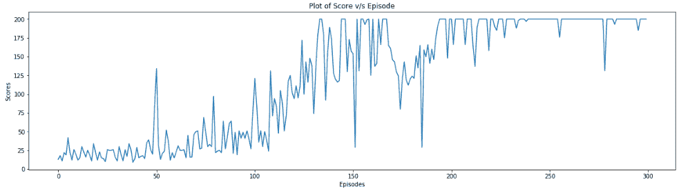

# 第十四章：开发一个深度强化学习的自主代理

欢迎来到强化学习这一章节。在之前的章节中，我们已经解决了监督学习的问题。在本章中，我们将学习如何构建和训练一个能够玩游戏的深度强化学习模型。

强化学习通常是深度学习工程师接触到的一种新范式，这也是我们选择用游戏框架进行本次训练的原因。我们需要关注的业务应用场景通常涉及过程优化。强化学习在游戏中表现出色，但也适用于从无人机控制（[`arxiv.org/pdf/1707.05110.pdf`](https://arxiv.org/pdf/1707.05110.pdf)）和导航到优化移动网络文件下载（[`anrg.usc.edu/www/papers/comsnets_2017.pdf`](http://anrg.usc.edu/www/papers/comsnets_2017.pdf)）等各种应用场景。

我们将通过深度 Q 学习和深度**状态-动作-奖励-状态-动作**（**SARSA**）学习来实现这一点。我们的想法是构建一个深度学习模型，在强化学习术语中也称为代理（Agent），它与游戏环境互动，并在多次游戏尝试后学习如何玩游戏，同时最大化奖励。这里是一个强化学习的示意图：


图 14.1：强化学习

本章中，我们将使用 OpenAI Gym 的倒立摆游戏（CartPole）。

本章我们将学习以下内容：

+   如何与 Gym 工具包进行交互

+   什么是 Q 学习和 SARSA 学习

+   编写强化学习模型并定义超参数

+   构建和理解训练循环

+   测试模型

最好在本章进行时就实现代码片段，无论是在 Jupyter Notebook 还是任何源代码编辑器中。这将使你更容易跟上进度，并理解代码的每一部分所做的事情。

本章的所有 Python 和 Jupyter Notebook 文件可以在[`github.com/PacktPublishing/Python-Deep-Learning-Projects/tree/master/Chapter14`](https://github.com/PacktPublishing/Python-Deep-Learning-Projects/tree/master/Chapter14)找到。

# 让我们开始编码吧！

在这个练习中，我们将使用来自 OpenAI 的 Gym 工具包来开发强化学习模型。它支持像倒立摆（CartPole）和弹球（Pinball）这样的游戏教学。

要了解更多关于 OpenAI Gym 工具包及其支持的游戏，请访问[`gym.openai.com/`](http://gym.openai.com/)。

我们还将使用 Keras 深度学习库，它是一个高级神经网络 API，能够运行在 TensorFlow、Theano 或认知工具包（CNTK）之上。

要了解更多关于 Keras 及其功能的信息，请访问[`keras.io/`](https://keras.io/)。

# 深度 Q 学习

在这一部分中，我们将实现深度 Q 学习，并使用 Keras 深度学习库构建的深度学习模型作为函数近似器。

我们将从如何使用 Gym 模块的简单介绍开始，然后继续了解什么是 Q 学习，最后实现深度 Q 学习。我们将使用 OpenAI Gym 中的 CartPole 环境。

为了跟进，参考 Jupyter Notebook 代码文件中的深度 Q 学习部分：[`github.com/PacktPublishing/Python-Deep-Learning-Projects/blob/master/Chapter%2015/DQN.ipynb`](https://github.com/PacktPublishing/Python-Deep-Learning-Projects/blob/master/Chapter%2015/DQN.ipynb)。

# 导入所有依赖

在本节练习中，我们将使用 `numpy`、`gym`、`matplotlib`、`keras` 和 `tensorflow` 包。在这里，TensorFlow 将作为 Keras 的后端。你可以使用 `pip` 安装这些包：

```py
import random
import numpy as np
import matplotlib.pyplot as plt
from keras.layers import Dense, Dropout, Activation
from keras.models import Sequential
from keras.optimizers import Adam
from keras import backend as k
from collections import deque
import gym
```

`deque` 是一个类似列表的容器，可以在两端快速追加和弹出元素。

# 探索 CartPole 游戏

在 CartPole 游戏中，你会看到一根通过未固定的关节连接到小车的杆，杆在无摩擦的轨道上移动。在每一局游戏开始时，杆会处于竖直位置，目标是尽可能长时间地保持杆在竖直位置，或者保持给定的时间步数。你可以通过施加 +1 和 -1 的力（分别使小车向右或向左移动）来控制 CartPole 系统，防止杆倒下。游戏/回合结束的条件是小车从中心位置移动超过 2.4 个单位，或者杆与竖直方向的夹角超过 45 度。

# 与 CartPole 游戏互动

OpenAI Gym 使得与游戏交互变得非常简单。在本节中，我们将介绍如何加载、重置并玩 CartPole 游戏。

# 加载游戏

让我们从 `gym` 模块加载 `CartPole-v1` 游戏。非常简单，你只需要将游戏名称传递给 `gym.make()` 函数。在我们的例子中，游戏是 `CartPole-v1`。然后 Gym 会将游戏加载到你的工作空间中：

```py
env = gym.make('CartPole-v1')
```

设置 `seed` 以保证结果可复现非常重要：

```py
# Set seed for reproducibility
seed_val = 456
np.random.seed(seed_val)
env.seed(seed_val)
random.seed(seed_val)
```

让我们探索一下在 CartPole 游戏中有哪些变量：

```py
states = env.observation_space.shape[0]
print('Number of states/variables in the cartpole environment', states) 
```

以下是输出：


我们可以看到 CartPole 游戏有 `4` 个变量，分别是位置（`x`）、速度（`x_dot`）、角度位置（`theta`）和角速度（`theta_dot`）。

让我们探索一下在这个游戏中我们有多少种可能的响应，使用以下代码：

```py
actions = env.action_space.n
print('Number of responses/classes in the cartpole environment', actions) 
```

以下是输出：


我们看到 CartPole 环境有 `2` 种可能的响应/按钮，即向左移动和向右移动。

# 重置游戏

你可以使用以下代码重置游戏：

```py
state = env.reset() # reset the game
print('State of the Cart-Pole after reset', state)
print('Shape of state of the Cart-Pole after reset', state.shape)
```

上面的代码片段将重置游戏，并返回重置后 CartPole 的状态（`x`、`x_dot`、`theta`、`theta_dot`），该状态将是形状为 (`4`,) 的数组。

# 玩游戏

现在，一旦你重置了游戏，接下来就是玩游戏。你可以使用以下代码将你的动作/响应输入到游戏中：

```py
action = 0
new_state, reward, done, info = env.step(action) 
print((new_state, reward, done, info))
```

`env.step` 函数接受你的响应/动作（向左或向右移动），并生成 CartPole 系统的 `new_state`/方向（x, x_dot, theta, theta_dot）。随着新状态的生成，`env.step` 函数还返回 `reward`，即你刚才采取的 `action` 得到的分数；`done`，指示游戏是否结束；以及 `info`，包含系统相关信息。

当游戏开始时，`done` 被设置为 `False`。只有当 CartPole 的方向超出游戏规则时，`done` 才会被设置为 `True`，这表示要么小车已从中心位置移动了 2.4 单位，要么杆子与垂直方向的夹角超过了 45 度。

只要你所采取的每一步都在游戏规则范围内，那么该步骤的奖励为 1 单位，否则为零。

让我们通过进行随机动作来玩这个游戏：

```py
def random_actions_game(episodes):
    for episode in range(episodes):
        state = env.reset() # reset environment
        done = False # set done to False
        score = 0
        while not done:
            #env.render() # Display cart pole game on the screen
            action = random.choice([0,1]) # Choose between 0 or 1
            new_state, reward, done, info = env.step(action) # perform the action
            score+=1
        print('Episode: {} Score: {}'.format(episode+1, score))

# play game
random_actions_game(10) 
```

以下是终端输出：


图 14.2：随机动作游戏的得分

以下是 CartPole 游戏的输出：


图 14.3：渲染时显示的 CartPole 游戏快照

`random.choice` 从非空序列（如列表/数组）中返回随机选择的项。

# Q-learning

Q-learning 是一种基于策略的强化学习技术，Q-learning 的目标是学习一种最优策略，帮助智能体在环境的不同状态下决定采取什么行动。

要实现 Q-learning，你需要了解什么是 *Q* 函数。

一个 *Q* 函数接受一个状态和相应的动作作为输入，并返回总期望奖励。它可以表示为 *Q(s, a)*。当处于 *s* 状态时，最优的 *Q* 函数会告诉智能体选择某个动作 *a* 的优劣。

对于单一状态 *s* 和动作 *a*，*Q(s, a)* 可以通过以下公式表示为下一个状态 *s'* 的 *Q* 值：


这就是著名的贝尔曼方程。它告诉我们，最大奖励是智能体进入当前状态 *s* 所得到的奖励和下一个状态 *s'* 的折扣后最大未来奖励之和。

以下是《强化学习：导论》一书中 Q-learning 算法的伪代码，作者是 Richard S. Sutton 和 Andrew G. Barto：


图 14.4：Q-learning 的伪代码

《强化学习：导论》一书，由 Richard S. Sutton 和 Andrew G. Barto 编著 *（* [`incompleteideas.net/book/ebook/the-book.html`](http://incompleteideas.net/book/ebook/the-book.html)）。

# 定义深度 Q 学习（DQN）的超参数

以下是我们在代码中使用的一些超参数，这些超参数完全可配置：

```py
# Discount in Bellman Equation
gamma = 0.95 

# Epsilon
epsilon = 1.0

# Minimum Epsilon
epsilon_min = 0.01

# Decay multiplier for epsilon
epsilon_decay = 0.99

# Size of deque container
deque_len = 20000

# Average score needed over 100 epochs
target_score = 200

# Number of games
episodes = 2000

# Data points per episode used to train the agent
batch_size = 64

# Optimizer for training the agent
optimizer = 'adam'

# Loss for training the agent
loss = 'mse'
```

以下是所使用的参数：

+   `gamma`：贝尔曼方程中的折扣参数

+   `epsilon_decay`：你希望在每一局/游戏后按比例折扣`epsilon`的值。

+   `epsilon_min`：`epsilon`的最小值，低于该值后不再衰减。

+   `deque_len`：`deque`容器的大小，用于存储训练示例（包括状态、奖励、完成标志和动作）。

+   `target_score`：你希望代理在 100 个训练周期内达到的平均得分，达到该分数后停止学习过程。

+   `episodes`：你希望代理玩的最大游戏次数。

+   `batch_size`：用于训练代理的批量数据大小（存储在`deque`容器中），每一局游戏后使用这些数据来训练代理。

+   `optimizer`：用于训练代理的优化器

+   `loss`：用于训练代理的损失函数

尝试不同的学习率、优化器、批次大小以及`epsilon_decay`值，看看这些因素如何影响模型的质量。如果得到更好的结果，分享给深度学习社区。

# 构建模型组件

在本节中，我们将定义所有用于训练强化学习代理的函数。这些函数如下：

+   代理

+   代理动作

+   记忆

+   性能图

+   回放

+   训练和测试，用于训练和测试代理

# 定义代理

让我们定义一个代理/函数近似器。

代理其实就是一个简单的深度神经网络，输入的是 CartPole 系统的状态（四个变量），输出的是每个动作的最大可能奖励。

第一、第二和第三层是简单的`Dense`层，具有 16 个神经元，激活函数为`relu`。

最后一层是一个`Dense`层，具有两个神经元，等于可能的`actions`数量：

```py
def agent(states, actions):
    """Simple Deep Neural Network."""
    model = Sequential()
    model.add(Dense(16, input_dim=states))
    model.add(Activation('relu'))
    model.add(Dense(16))
    model.add(Activation('relu'))
    model.add(Dense(16))
    model.add(Activation('relu'))
    model.add(Dense(actions))
    model.add(Activation('linear'))
    return model

# print summary of the agent
print(agent(states, actions).summary())
```

以下是输出：


图 14.5：代理摘要

根据你要解决的问题调整代理的参数。必要时可以在模型中尝试使用泄漏`relu`。

# 定义代理动作

让我们定义一个函数，当被调用时，将返回该特定状态下需要采取的动作：

```py
def agent_action(model, epsilon, state, actions):
    """Define action to be taken."""
    if np.random.rand() <= epsilon:
        act = random.randrange(actions)
    else:
        act = np.argmax(model.predict(state)[0])
    return act
```

对于来自均匀分布（介于 0 和 1 之间）的任何值，如果小于或等于`epsilon`，返回的动作将是`random`。对于任何大于`epsilon`的值，选择的动作将是我们在前面的代码中定义的代理预测的动作。

`numpy.random.rand`函数从 0 到 1 的均匀分布中生成一个随机数。`numpy.argmax`返回序列中最大值的索引。`random.randrange`从`range()`中随机选择一个项目。

# 定义记忆

让我们定义一个`deque`对象，用来存储与每个相关步骤（如游戏过程中的`state`、`action`、`reward`和`done`）相关的信息。我们将使用存储在这个`deque`对象中的数据进行训练：

```py
training_data = deque(maxlen=deque_len)
```

我们将`deque`对象的大小定义为`20000`。一旦该容器填满 20,000 个数据点，每当在一端添加新数据时，另一端的数据点会被弹出。然后，我们将只保留最新的信息。

我们将定义一个名为`memory`的函数，在游戏中调用时，它会在该时间步接受与`action`、`state`、`reward`和`done`相关的信息作为输入，然后将其存储在我们在前面代码中定义的训练数据`deque`容器中。你会看到，我们在每个时间步将这五个变量作为元组条目进行存储：

```py
def memory(state, new_state, reward, done, action):
    """Function to store data points in the deque container."""
    training_data.append((state, new_state, reward, done, action))
```

# 定义性能图

以下`performance_plot`函数绘制模型的性能随时间变化的图像。这个函数被放置在只有当我们达成 200 分的目标时才会绘制。你也可以将这个函数放置在每训练 100 个回合后绘制进度：

```py
def performance_plot(scores, target_score):
    """Plot the game progress."""
    scores_arr = np.array(scores) # convert list to array
    scores_arr[np.where(scores_arr > target_score)] = target_score # scores
    plt.figure(figsize=(20, 5)) # set figure size to 20 by 5
    plt.title('Plot of Score v/s Episode') # title
    plt.xlabel('Episodes') # xlabel
    plt.ylabel('Scores') # ylabel
    plt.plot(scores_arr)
    plt.show()
```

以下是函数（在目标达成后）示例图输出的截图：


图 14.6：性能图函数的示例输出

# 定义 replay

以下`replay`函数会在游戏结束时，在`train`函数（在下一节定义）内部被调用，用于训练代理。在这个函数中，我们使用*Q*函数贝尔曼方程来定义每个状态的目标：

```py
def replay(epsilon, gamma, epsilon_min, epsilon_decay, model, training_data, batch_size=64):
    """Train the agent on a batch of data."""
    idx = random.sample(range(len(training_data)), min(len(training_data), batch_size))
    train_batch = [training_data[j] for j in idx]
    for state, new_state, reward, done, action in train_batch:
        target = reward
        if not done:
            target = reward + gamma * np.amax(model.predict(new_state)[0])
        #print('target', target)
        target_f = model.predict(state)
        #print('target_f', target_f)
        target_f[0][action] = target
        #print('target_f_r', target_f)

        model.fit(state, target_f, epochs=1, verbose=0)
    if epsilon > epsilon_min:
        epsilon *= epsilon_decay
    return epsilon
```

正是在这个函数中，我们训练代理使用均方误差损失来学习最大化奖励。我们这样做是因为我们在预测两个动作的奖励的数值。记住，代理将状态作为输入，状态的形状是 1*4。该代理的输出形状是 1*2，它基本上包含了两个可能动作的期望奖励。

所以，当一个回合结束时，我们使用存储在`deque`容器中的一批数据来训练代理。

在这批数据中，考虑第 1 个元组：

```py
state = [[-0.07294358 -0.94589796 0.03188364 1.40490844]]
new_state = [[-0.09186154 -1.14140094 0.05998181 1.70738606]]
reward = 1
done = False
action = 0
```

对于`state`，我们知道需要采取的`action`以进入`new_state`，以及为此所获得的`reward`。我们还有`done`，它表示进入的`new_state`是否符合游戏规则。

只要进入的新状态，*s'*，符合游戏规则，即`done`为`False`，根据贝尔曼方程，进入新状态*s'*通过采取`action`从状态*s*过渡的总`reward`可以在 Python 中写为如下：

```py
target = reward + gamma * np.amax(model.predict(new_state)[0])
```

`model.predict(new_state)[0]`的输出为`[-0.55639267, 0.37972435]`。`np.amax([-0.55639267, 0.37972435])`的结果为`0.37972435`*。*

在折扣/`gamma`为 0.95 和`reward`为`1`时，得到如下值。`reward + gamma * np.amax(model.predict(new_state)[0])`的结果为`1.36073813587427`。

这是先前定义的目标值。

使用模型，我们预测当前状态下两种可能动作的奖励。`target_f = model.predict(state)` 将返回 `[[-0.4597198 0.31523475]]`。

由于我们已经知道需要采取的 `action`，即 `0`，以最大化下一个状态的奖励，我们将 `target_f` 中索引为零的 `reward` 设置为使用贝尔曼方程计算得到的 `reward`，即 `target_f[0][action] = 1.3607381358742714`。

最终，`target_f` 将等于 `[[1.3607382 0.31523475]]`。

我们将使用状态作为 `input`，`target_f` 作为目标奖励，并根据它来训练代理/模型。

这个过程将对训练数据批次中的所有数据点重复执行。此外，每次调用回放函数时，epsilon 的值会根据衰减因子减少。

`random.sample` 从一个集合中随机抽取 *n* 个元素。`np.amax` 返回数组中的最大值。

# 训练循环

现在，让我们将到目前为止形成的所有部分结合起来，使用我们在此定义的 `train()` 函数实现代理的训练：

1.  通过调用 `agent()` 函数加载代理，并将其与损失函数 `loss` 和优化器 `optimizer` 编译，这些内容我们已在 *定义深度 Q 学习（DQN）超参数* 章节中定义。

1.  重置环境并调整初始状态的形状。

1.  调用 `agent_action` 函数，传入 `model`、`epsilon` 和 `state` 信息，获取需要采取的下一个动作。

1.  使用 `env.step` 函数获取在 *Step 3* 中获得的动作。通过调用 `memory` 函数并传递必要的参数，将结果信息存储在 `training_data` 双端队列容器中。

1.  将在 *Step 4* 中获得的新状态分配给 `state` 变量，并将时间步长增加 1 单位。

1.  直到 *Step 4* 返回 `True`，重复 *Step 3* 到 *Step 5*。

1.  在每次回合/游戏结束时，调用 `replay` 函数，在一批训练数据上训练代理。

1.  重复 *Step 2* 到 *Step 7*，直到达到目标分数：

以下代码展示了 `train()` 函数的实现：

```py
def train(target_score, batch_size, episodes,
 optimizer, loss, epsilon,
 gamma, epsilon_min, epsilon_decay, actions, render=False):
 """Training the agent on games."""
 print('----Training----')
 k.clear_session()

 # define empty list to store the score at the end of each episode
 scores = []

 # load the agent
 model = agent(states, actions)

 # compile the agent with mean squared error loss
 model.compile(loss=loss, optimizer=optimizer)

 for episode in range(1, (episodes+1)):
 # reset environment at the end of each episode
 state = env.reset()

 # reshape state to shape 1*4
 state = state.reshape(1, states)

 # set done value to False
 done = False
```

有关此代码片段的其余部分，请参阅此处的 `DQN.ipynb` 文件：[`github.com/PacktPublishing/Python-Deep-Learning-Projects/blob/master/Chapter14/DQN.ipynb`](https://github.com/PacktPublishing/Python-Deep-Learning-Projects/blob/master/Chapter14/DQN.ipynb)

若要在训练时在屏幕上查看 CartPole 游戏，请将 `train` 函数中的 `render` 参数设置为 `True`。另外，游戏可视化会减慢训练速度。

以下两张图片是 DQN 训练过程中生成的输出：


图 14.7：训练代理时的分数输出



图 14.8：训练代理时分数与回合的关系图

我们可以看到，在训练智能体时，我们设定的 200 分目标在`300`场游戏结束时达到了，且这个分数是在最近`100`场游戏中平均计算得出的。

我们一直在使用ε-greedy 策略来训练智能体。一旦你掌握了 DQN 的训练过程，可以尝试使用[`github.com/keras-rl/keras-rl/blob/master/rl/policy.py`](https://github.com/keras-rl/keras-rl/blob/master/rl/policy.py)中列出的其他策略。

训练智能体时，不一定每次都能在 300 场游戏内完成。有时可能需要超过 300 场游戏。你可以参考这个笔记本：[`github.com/PacktPublishing/Python-Deep-Learning-Projects/blob/master/Chapter%2015/DQN.ipynb`](https://github.com/PacktPublishing/Python-Deep-Learning-Projects/blob/master/Chapter%2015/DQN.ipynb)，查看训练智能体的五次尝试以及每次训练所用的游戏回合数。

# 测试 DQN 模型

现在，让我们测试我们训练的 DQN 模型在新游戏中的表现。以下`test`函数使用训练好的 DQN 模型进行十场游戏，看看我们设定的 200 分的目标能否达成：

```py
def test(env, model, states, episodes=100, render=False):
    """Test the performance of the DQN agent."""
    scores_test = []
    for episode in range(1, (episodes+1)):
        state = env.reset()
        state = state.reshape(1, states)

        done = False
        time_step = 0

        while not done:
            if render:
                env.render()
            action = np.argmax(model.predict(state)[0])
            new_state, reward, done, info = env.step(action)
            new_state = new_state.reshape(1, states)
            state = new_state
            time_step += 1
        scores_test.append(time_step)
        if episode % 10 == 0:
            print('episode {}, score {} '.format(episode, time_step))
    print('Average score over 100 test games: {}'.format(np.mean(scores_test)))

test(env, model, states, render=False)
```

要在测试时查看 CartPole 游戏画面，请在`test`函数内将`render`参数设置为`true`。

以下是输出结果：


图 14.9：使用训练好的 Q 智能体测试得分

当智能体在新的 100 场 CartPole 游戏中进行测试时，它的平均得分为`277.88`。

移除 200 分的门槛，目标是训练智能体始终保持平均得分为 450 分或更多。

# 深度 Q 学习脚本模块化形式

整个脚本可以分为四个模块，分别是`train_dqn.py`、`agent_reply_dqn.py`、`test_dqn.py`和`hyperparameters_dqn.py`。将它们存储在你选择的文件夹中，例如`chapter_15`。将`chapter_15`设置为你喜欢的源代码编辑器中的项目文件夹，然后运行`train_dqn.py`文件。

`train_dqn.py` Python 文件将在需要执行的地方从其他模块中导入函数。

现在让我们逐步讲解每个文件的内容。

# 模块 1 – hyperparameters_dqn.py

这个 Python 文件包含 DQN 模型的超参数：

```py
"""This module contains hyperparameters for the DQN model."""

# Discount in Bellman Equation
gamma = 0.95
# Epsilon
epsilon = 1.0
# Minimum Epsilon
epsilon_min = 0.01
# Decay multiplier for epsilon
epsilon_decay = 0.99
# Size of deque container
deque_len = 20000
# Average score needed over 100 epochs
target_score = 200
# Number of games
episodes = 2000
# Data points per episode used to train the agent
batch_size = 64
# Optimizer for training the agent
optimizer = 'adam'
# Loss for training the agent
loss = 'mse'
```

# 模块 2 – agent_replay_dqn.py

这个 Python 文件包含四个函数，分别是`agent()`、`agent_action()`、`performance_plot()`和`replay()`：

```py
"""This module contains."""
import random
import numpy as np
import matplotlib.pyplot as plt
from keras.layers import Dense, Dropout, Activation
from keras.models import Sequential
from keras.optimizers import Adam

def agent(states, actions):
    """Simple Deep Neural Network."""
    model = Sequential()
    model.add(Dense(16, input_dim=states))
    model.add(Activation('relu'))
    model.add(Dense(16))
    model.add(Activation('relu'))
    model.add(Dense(16))
    model.add(Activation('relu'))
    model.add(Dense(actions))
    model.add(Activation('linear'))
    return model
```

有关此文件的其余部分，请访问这里：[`github.com/PacktPublishing/Python-Deep-Learning-Projects/blob/master/Chapter14/agent_replay_dqn.py`](https://github.com/PacktPublishing/Python-Deep-Learning-Projects/blob/master/Chapter14/agent_replay_dqn.py)

# 模块 3 – test_dqn.py

这个模块包含`test()`函数，它将在`train_dqn.py`脚本中调用，以测试 DQN 智能体的表现：

```py
"""This module contains function to test the performance of the DQN model."""
import numpy as np

def test(env, model, states, episodes=100, render=False):
    """Test the performance of the DQN agent."""
    scores_test = []
    for episode in range(1, (episodes+1)):
        state = env.reset()
        state = state.reshape(1, states)

        done = False
        time_step = 0

        while not done:
            if render:
                env.render()
            action = np.argmax(model.predict(state)[0])
            new_state, reward, done, info = env.step(action)
            new_state = new_state.reshape(1, states)
            state = new_state
            time_step += 1
        scores_test.append(time_step)
        if episode % 10 == 0:
            print('episode {}, score {} '.format(episode, time_step))
    print('Average score over 100 test games: {}'.format(np.mean(scores_test)))
```

# 模块 4 – train_dqn.py

在这个模块中，我们包括了`memory()`和`train()`函数，并且调用了用于训练和测试强化学习模型的函数：

```py
"""This module is used to train and test the DQN agent."""
import random
import numpy as np
from agent_replay_dqn import agent, agent_action, replay, performance_plot
from hyperparameters_dqn import *
from test_dqn import test
from keras import backend as k
from collections import deque
import gym

env = gym.make('CartPole-v1')

# Set seed for reproducibility
seed_val = 456
np.random.seed(seed_val)
env.seed(seed_val)
random.seed(seed_val)

states = env.observation_space.shape[0]
actions = env.action_space.n
training_data = deque(maxlen=deque_len)

def memory(state, new_state, reward, done, action):
    """Function to store data points in the deque container."""
    training_data.append((state, new_state, reward, done, action))

def train(target_score, batch_size, episodes,
          optimizer, loss, epsilon,
          gamma, epsilon_min, epsilon_decay, actions, render=False):
    """Training the agent on games."""
    print('----Training----')
    k.clear_session()
```

对于此代码的其余部分，请访问：[`github.com/PacktPublishing/Python-Deep-Learning-Projects/blob/master/Chapter14/train_dqn.py`](https://github.com/PacktPublishing/Python-Deep-Learning-Projects/blob/master/Chapter14/train_dqn.py)

# 深度 SARSA 学习

在本部分中，我们将使用`keras-rl`库实现深度 SARSA 学习。`keras-rl`库是一个简单的神经网络 API，允许简单而易于实现强化学习模型（Q、SARSA 等）。要了解更多有关`keras-rl`库的信息，请访问文档：[`keras-rl.readthedocs.io/en/latest/`](https://keras-rl.readthedocs.io/en/latest/)。

我们将继续使用到现在为止在 OpenAI Gym 中使用的相同 CartPole 环境。

一个关于深度 SARSA 学习的 Jupyter Notebook 代码示例可以在[`github.com/PacktPublishing/Python-Deep-Learning-Projects/blob/master/Chapter14/Deep%20SARSA.ipynb`](https://github.com/PacktPublishing/Python-Deep-Learning-Projects/blob/master/Chapter14/Deep%20SARSA.ipynb)找到。

# SARSA 学习

SARSA 学习方法和 Q-learning 一样，都是基于策略的强化学习技术。它的目标是学习一个最优策略，帮助智能体在不同的可能情况下决定需要采取的行动。

SARSA 和 Q-learning 非常相似，除了 Q-learning 是一个脱离策略的算法，而 SARSA 是一个基于策略的算法。SARSA 学习的 Q 值不是像 Q-learning 那样基于贪心策略，而是基于当前策略下执行的动作。

对于单个状态，*s*，和一个动作，*a*，*Q(s, a)* 可以通过以下公式表示为下一个状态，*s'*，和动作，*a'*，的 Q 值：


以下是《强化学习：导论》一书中，*理查德·S·萨顿*和*安德鲁·G·巴托*编写的 SARSA 学习算法的伪代码：


图 14.10：SARSA 学习的伪代码

# 导入所有依赖项

在本部分练习中，我们将使用`numpy`、`gym`、`matplotlib`、`keras`、`tensorflow`和`keras-rl`包。这里，TensorFlow 将作为 Keras 的后端。您可以使用`pip`安装这些包：

```py
import numpy as np
import gym
from keras.models import Sequential
from keras.layers import Dense, Activation, Flatten
from keras.optimizers import Adam
from rl.agents import SARSAAgent
from rl.policy import EpsGreedyQPolicy
```

# 加载游戏环境

就像在 DQN 部分加载游戏一样，我们将游戏加载到工作区并设置`seed`以确保结果可重复：

```py
env = gym.make('CartPole-v1')

# set seed 
seed_val = 456
env.seed(seed_val)
np.random.seed(seed_val)

states = env.observation_space.shape[0]
actions = env.action_space.n
```

# 定义智能体

对于深度 SARSA 学习，我们将使用在深度 Q-learning 部分中使用的相同智能体：

```py
def agent(states, actions):
 """Simple Deep Neural Network."""
 model = Sequential()
 model.add(Flatten(input_shape=(1,states)))
 model.add(Dense(16))
 model.add(Activation('relu'))
 model.add(Dense(16))
 model.add(Activation('relu'))
 model.add(Dense(16))
 model.add(Activation('relu'))
 model.add(Dense(actions))
 model.add(Activation('linear'))
 return model

model = agent(states, actions)
```

# 训练智能体

使用`keras-rl`库训练智能体非常简单：

1.  定义您希望训练遵循的策略。我们将使用 epsilon-greedy 策略。与 DQN 部分相对应的是智能体的`action`函数。要了解更多其他策略的信息，请访问[`github.com/keras-rl/keras-rl/blob/master/rl/policy.py`](https://github.com/keras-rl/keras-rl/blob/master/rl/policy.py)。

1.  加载您希望使用的智能体。在这种情况下，SARSA 智能体有许多参数，重要的参数包括`model`、`nb_actions`和`policy`。`model`是您在前面代码中定义的深度学习智能体，`nb_actions`是系统中可能的操作数，而`policy`是您偏好的训练 SARSA 智能体的策略。

1.  我们为 SARSA 智能体编译所选的损失函数和优化器。

1.  我们通过将环境和训练步数作为参数传递给`.fit`函数来训练 SARSA 智能体：

要获取`keras-rl`库中智能体的完整使用细节及其参数定义，请访问 Keras 的文档：[`keras-rl.readthedocs.io/en/latest/agents/sarsa/#sarsaagent`](http://keras-rl.readthedocs.io/en/latest/agents/sarsa/#sarsaagent)。

```py
# Define the policy
policy = EpsGreedyQPolicy()

# Loading SARSA agent by feeding it the policy and the model
sarsa = SARSAAgent(model=model, nb_actions=actions, policy=policy)

# compile sarsa with mean squared error loss
sarsa.compile('adam', metrics=['mse'])

# train the agent for 50000 steps
sarsa.fit(env, nb_steps=50000, visualize=False, verbose=1)
```

在训练时，要在`.fit`函数内将`visualize`参数设置为`true`，以便在屏幕上查看 CartPole 游戏。但可视化游戏会减慢训练速度。

这是训练 SARSA 智能体时的得分输出：


图 14.11：训练 SARSA 智能体时的得分输出

# 测试智能体

一旦智能体经过训练，我们将在 100 个新的回合上评估其表现。可以通过调用`.test`函数并提供测试环境和回合数作为参数来实现：

```py
# Evaluate the agent on 100 new episodes
scores = sarsa.test(env, nb_episodes=100, visualize=False)

print('Average score over 100 test games: {}'.format(np.mean(scores.history['episode_reward'])))
```

在测试时，要在`.test`函数内将`visualize`参数设置为`True`，以便在屏幕上查看 CartPole 游戏。

以下是测试 100 轮后的输出：


以下是代码执行结束后的输出：


图 14.12：训练后的 SARSA 智能体测试得分

# 深度 SARSA 学习脚本（模块化形式）

对于 SARSA 学习，我们只有一个脚本，它实现了 SARSA 智能体的训练和测试：

```py
"""This module implements training and testing of SARSA agent."""
import gym
import numpy as np
from keras.layers import Dense, Activation, Flatten
from keras.models import Sequential
from rl.agents import SARSAAgent
from rl.policy import EpsGreedyQPolicy

# load the environment
env = gym.make('CartPole-v1')

# set seed
seed_val = 456
env.seed(seed_val)
np.random.seed(seed_val)

states = env.observation_space.shape[0]
actions = env.action_space.n

def agent(states, actions):
    """Agent/Deep Neural Network."""
    model = Sequential()
    model.add(Flatten(input_shape=(1, states)))
    model.add(Dense(16))
    model.add(Activation('relu'))
    model.add(Dense(16))
    model.add(Activation('relu'))
    model.add(Dense(16))
    model.add(Activation('relu'))
    model.add(Dense(actions))
    model.add(Activation('linear'))
    return model

model = agent(states, actions)

# Define the policy
policy = EpsGreedyQPolicy()
# Define SARSA agent by feeding it the policy and the model
sarsa = SARSAAgent(model=model, nb_actions=actions, nb_steps_warmup=10,
                   policy=policy)
# compile sarsa with mean squared error loss
sarsa.compile('adam', metrics=['mse'])
# train the agent for 50000 steps
sarsa.fit(env, nb_steps=50000, visualize=False, verbose=1)

# Evaluate the agent on 100 new episodes.
scores = sarsa.test(env, nb_episodes=100, visualize=False)
print('Average score over 100 test games: {}'
      .format(np.mean(scores.history['episode_reward'])))
```

# 项目的结论

本项目的目标是构建一个深度强化学习模型，成功地玩 OpenAI Gym 中的 CartPole-v1 游戏。本章的用例是在一个简单的游戏环境中构建强化学习模型，然后将其扩展到其他复杂的游戏，如 Atari。

本章前半部分，我们构建了一个深度 Q 学习（DQN）模型来玩 CartPole 游戏。在测试过程中，DQN 模型在 100 场游戏中的平均得分为 277.88 分。

在本章的后半部分，我们建立了一个深度 SARSA 学习模型（使用与 Q-learning 相同的 epsilon-greedy 策略）来玩 CartPole 游戏。SARSA 模型在测试期间，100 局游戏的平均得分为 365.67 分。

现在，让我们遵循之前章节中用于评估模型表现的相同方法，从餐饮连锁的角度来看待模型的表现。

这个得分意味着什么？

Q-learning 平均得分为 277.88，这意味着我们已经成功解决了 OpenAI 网站定义的 CartPole 游戏。这也意味着我们的模型能够存活超过游戏时长的一半，且总游戏时长为 500 分钟。

至于 SARSA 学习，另一方面，Q-learning 的平均得分为 365.67，这意味着我们已经成功解决了 OpenAI 网站定义的 CartPole 游戏，并且我们的模型能够存活超过游戏时长的 70%，总游戏时长为 500 分钟。

这仍然不是你应该感到满意的表现水平，因为目标不仅仅是解决问题，而是训练一个能够在每局游戏中稳定得分 500 分的优秀模型，因此你可以理解为什么我们需要继续对模型进行微调，以获得最大的性能。

# 总结

在本章中，我们成功构建了一个深度强化学习模型，分别使用 Q-learning 和 SARSA 学习，基于 OpenAI Gym 中的 CartPole 游戏。我们理解了 Q-learning、SARSA 学习，如何与 Gym 中的游戏环境交互，以及代理（深度学习模型）的功能。我们定义了一些关键的超参数，并且在一些地方，我们也解释了为什么选择使用这些方法。最后，我们在新游戏上测试了我们强化学习模型的表现，并确定我们成功地实现了目标。
