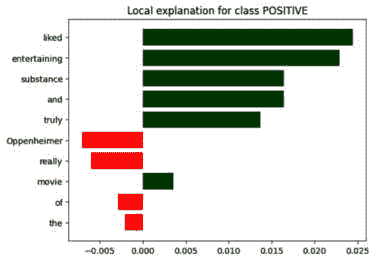
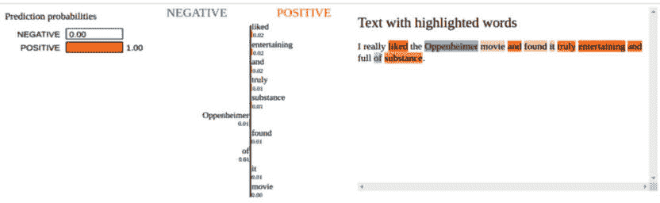

# 第九章：自然语言理解

在本章中，我们将探讨一些食谱，这些食谱将使我们能够解释和理解包含在短篇和长篇段落中的文本。**自然语言理解**（**NLU**）是一个非常宽泛的术语，作为NLU一部分开发的各种系统并不以与人类读者相同的方式解释或理解一段文本。然而，基于任务的特定性，我们可以创建一些应用，这些应用可以组合起来生成一种解释或理解，用于解决与文本处理相关的特定问题。

拥有大量文档语料库的组织需要一个无缝的方式来搜索文档。更具体地说，用户真正需要的是一个针对特定问题的答案，而无需浏览作为文档搜索结果返回的文档列表。用户更愿意将查询以自然语言问题的形式提出，并以相同的方式输出答案。

另一套应用是文档摘要和文本蕴涵。在处理大量文档时，如果能够缩短文档长度而不丢失意义或上下文，那就很有帮助。此外，确定文档中包含的信息在句子层面上是否蕴涵自身也很重要。

当我们处理和分类文档时，总会有理解为什么或如何模型将标签分配给文本片段的挑战——更具体地说，文本的哪些部分有助于不同的标签。

本章将涵盖探索先前描述的各种技术的不同方法。我们将遵循食谱，使我们能够执行这些任务，并理解帮助我们实现最终目标的底层构建块。

作为本章的一部分，我们将为以下任务构建食谱：

+   从短文本段落中回答问题

+   从长文本段落中回答问题

+   以提取方式从文档语料库中回答问题

+   以抽象方式从文档语料库中回答问题

+   使用基于Transformers的预训练模型总结文本

+   检测句子蕴涵

+   通过分类器不变方法增强可解释性

+   通过文本生成增强可解释性

# 技术要求

本章的代码位于GitHub书籍仓库中名为`Chapter9`的文件夹中（[https://github.com/PacktPublishing/Python-Natural-Language-Processing-Cookbook-Second-Edition/tree/main/Chapter09](https://github.com/PacktPublishing/Python-Natural-Language-Processing-Cookbook-Second-Edition/tree/main/Chapter09)）。

与前几章一样，本章所需的包是`poetry`环境的一部分。或者，您可以使用`requirements.txt`文件安装所有包。

# 从短文本段落中回答问题

要开始问答，我们将从一个简单的配方开始，这个配方可以回答来自简短段落的问题。

## 准备工作

作为本章的一部分，我们将使用来自 Hugging Face 的库 ([huggingface.co](http://huggingface.co))。对于这个配方，我们将使用 Transformers 包中的 `BertForQuestionAnswering` 和 `BertTokenizer` 模块。`BertForQuestionAnswering` 模型使用的是在 `SQuAD` 数据集上训练的基于 BERT 的基础大模型，并针对问答任务进行了微调。这个预训练模型可以用来加载一段文本并基于段落内容回答问题。如果你需要从一个现有的笔记本开始工作，可以使用代码网站上的 `9.1_question_answering.ipynb` 笔记本。

## 如何操作...

在这个配方中，我们将加载一个在 SQuAD 数据集 ([https://huggingface.co/datasets/squad](https://huggingface.co/datasets/squad)) 上训练的预训练模型。

配方执行以下操作：

+   它初始化一个基于预训练的 **BertForQuestionAnswering** 模型和 **BertTokenizer** 分词器的问答管道。

+   它进一步初始化一个上下文段落和一个问题，并基于这两个参数输出答案。它还打印出答案的确切文本。

+   它通过只更改问题文本来向同一个管道提出后续问题，并打印出问题的确切文本答案。

配方的步骤如下：

1.  执行必要的导入，从 **datasets** 包中导入必要的类型和函数：

    ```py
    from transformers import (
        pipeline, BertForQuestionAnswering, BertTokenizer)
    import torch
    ```

1.  在这个步骤中，我们分别使用预训练的 **bert-large-uncased-whole-word-masking-finetuned-squad** 艺术品初始化模型和分词器。如果这些艺术品没有在本地机器上作为这些调用的一部分存在，它们将从 Hugging Face 网站下载。我们已经为我们的配方选择了特定的模型和分词器，但你可以自由探索 Hugging Face 网站上可能适合你需求的其它模型。作为这个和下一个配方的通用步骤，我们检查系统中是否有任何 GPU 设备，并尝试使用它们。如果没有检测到 GPU，我们将使用 CPU：

    ```py
    device = torch.device("cuda" if torch.cuda.is_available() 
        else "cpu")
    qa_model = BertForQuestionAnswering.from_pretrained(
        'bert-large-uncased-whole-word-masking-finetuned-squad',
        device_map=device)
    qa_tokenizer = BertTokenizer.from_pretrained(
        'bert-large-uncased-whole-word-masking-finetuned-squad',
        device=device)
    ```

1.  在这个步骤中，我们使用模型和分词器初始化一个问答管道。这个管道的任务类型设置为 **问答**：

    ```py
    question_answer_pipeline = pipeline(
        "question-answering", model=qa_model,
        tokenizer=qa_tokenizer)
    ```

1.  在这个步骤中，我们初始化一个 **上下文** 段落。这个段落是我们 *通过 Transformers 生成文本* 的例子中的一部分，在 [*第 8 章*](B18411_08.xhtml#_idTextAnchor205)。如果你想要使用不同的段落，那是完全可以接受的：

    ```py
    context = "The cat had no business entering the neighbors garage, but she was there to help. The neighbor, who asked not to be identified, said she didn't know what to make of the cat's behavior. She said it seemed like it was trying to get into her home, and that she was afraid for her life. The neighbor said that when she went to check on her cat, it ran into the neighbor's garage and hit her in the face, knocking her to the ground."
    ```

1.  在这个步骤中，我们初始化一个问题文本，使用上下文和问题调用管道，并将结果存储在一个变量中。结果类型是一个 Python **dict** 对象：

    ```py
    question = "Where was the cat trying to enter?"
    result = question_answer_pipeline(question=question, 
        context=context)
    ```

1.  在这个步骤中，我们打印结果值。**score**值显示了答案的概率。**start**和**end**值表示构成答案的上下文段落中的起始和结束字符索引。**answer**值表示答案的实际文本：

    ```py
    print(result)
    ```

```py
{'score': 0.25, 'start': 33, 'end': 54, 'answer': 'the neighbors garage,'}
```

1.  在此步骤中，我们打印出确切的文本答案。这个答案在**result**字典的**answer**键中：

    ```py
    print(result['answer'])
    ```

```py
the neighbors garage,
```

1.  在这个步骤中，我们使用相同上下文提出另一个问题并打印结果：

    ```py
    question = "What did the cat do after entering the garage"
    result = question_answer_pipeline(
        question=question, context=context)
    print(result['answer'])
    ```

```py
hit her in the face, knocking her to the ground.
```

# 从长文本段落中回答问题

在上一个菜谱中，我们学习了一种在给定上下文的情况下提取问题答案的方法。这种模式涉及模型从给定的上下文中检索答案。模型不能回答不在上下文中的问题。这在我们需要从给定上下文中获取答案的情况下是有用的。这种问答系统被定义为**封闭域问答**（**CDQA**）。

另有一种问答系统可以回答本质上是普遍性的问题。这些系统在更大的语料库上进行了训练。这种训练使它们能够回答本质上是开放性的问题。这些系统被称为**开放域问答**（**ODQA**）系统。

## 准备工作

作为这个菜谱的一部分，我们将使用`deeppavlov`库以及**知识库问答**（**KBQA**）模型。这个模型已经在英语维基数据上作为知识库进行了训练。它使用各种NLP技术，如实体链接和消歧，知识图谱等，以提取问题的确切答案。

这个菜谱需要几个步骤来设置正确的执行环境。这个菜谱的`poetry`文件位于`9.2_QA_on_long_passages`文件夹中。我们还需要通过执行以下命令来安装和下载文档语料库：

```py
python -m deeppavlov install kbqa_cq_en
```

您也可以使用包含在同一文件夹中的`9.2_QA_on_long_passages.ipynb`笔记本。

## 如何操作...

在这个菜谱中，我们将基于`DeepPavlov`库初始化KBQA模型，并使用它来回答一个开放性问题。菜谱的步骤如下：

1.  执行必要的导入：

    ```py
    from deeppavlov import build_model
    ```

1.  在这个步骤中，我们初始化KBQA模型，**kbqa_cq_en**，并将其作为参数传递给**build_model**方法。我们还设置**download**参数为**True**，以便在本地缺失的情况下也下载模型：

    ```py
    kbqa_model = build_model('kbqa_cq_en', download=True)
    ```

1.  我们使用初始化后的模型并传递我们想要回答的几个问题：

    ```py
    result = kbqa_model(['What is the capital of Egypt?', 
        'Who is Bill Clinton\'s wife?'])
    ```

1.  我们打印出模型返回的结果。结果包含三个数组。

    第一个数组包含按与原始输入相同顺序排列的精确答案。在这种情况下，答案`Cairo`和`Hillary Clinton`与它们相关的问题顺序相同。

    您可能会在输出中观察到一些额外的工件。这些是由库生成的内部标识符。为了简洁起见，我们已省略它们：

    ```py
    [['Cairo', 'Hillary Clinton']]
    ```

## 参见

有关DeepPavlov工作内部细节的更多信息，请参阅[https://deeppavlov.ai](https://deeppavlov.ai)。

# 以提取方式从文档语料库回答问题

对于包含大量文档的文档语料库的使用案例，在运行时加载文档内容以回答问题是不切实际的。这种方法会导致查询时间过长，并且不适合生产级系统。

在这个食谱中，我们将学习如何预处理文档并将它们转换成一种更快阅读、索引和检索的形式，这样系统就可以在短时间内查询到给定问题的答案。

## 准备工作

作为这个食谱的一部分，我们将使用**Haystack**([https://haystack.deepset.ai/](https://haystack.deepset.ai/))框架来构建一个**问答系统**，该系统能够从文档语料库中回答问题。我们将下载一个基于《权力的游戏》的数据集并进行索引。为了使我们的问答系统性能良好，我们需要事先对文档进行索引。一旦文档被索引，回答问题将遵循两步过程：

1.  **Retriever**：由于我们有很多文档，扫描每个文档以获取答案不是一个可行的方法。我们将首先使用**Retriever**组件检索一组可能包含我们问题答案的候选文档。这一步是通过**Retriever**组件执行的。它搜索预先创建的索引，以过滤出我们需要扫描以检索确切答案的文档数量。

1.  **Reader**：一旦我们有一个可能包含答案的候选文档集，我们将搜索这些文档以检索我们问题的确切答案。

在这个食谱中，我们将讨论这些组件的详细信息。如果您需要从一个现有的笔记本开始工作，可以使用代码网站上的`9.3_QA_on_document_corpus.ipynb`笔记本。首先，让我们设置先决条件。

## 如何做到这一点...

1.  在这一步中，我们进行必要的导入：

    ```py
    import os
    from haystack.document_stores import InMemoryDocumentStore
    from haystack.nodes import BM25Retriever, FARMReader
    from haystack.pipelines import ExtractiveQAPipeline
    from haystack.pipelines.standard_pipelines import( 
        TextIndexingPipeline)
    from haystack.utils import (fetch_archive_from_http, 
        print_answers)
    ```

1.  在这一步中，我们指定一个文件夹，用于保存我们的数据集。然后，我们从源中检索数据集。**fetch_archive_from_http**方法的第二个参数是数据集将被下载到的文件夹。我们将该参数设置为第一行中定义的文件夹。**fetch_archive_from_http**方法解压缩**.zip**存档文件，并将所有文件提取到同一个文件夹中。然后我们从文件夹中读取并创建文件夹中包含的文件列表。我们还打印了现有文件的数量：

    ```py
    doc_dir = "data/got_dataset"
    fetch_archive_from_http(
        url="https://s3.eu-central-1.amazonaws.com/deepset.ai-farm-qa/datasets/documents/wiki_gameofthrones_txt1.zip",
        output_dir=doc_dir,
        )
    files_to_index = [doc_dir + "/" + f for f in os.listdir(
        doc_dir)]
    print(len(files_to_index))
    183
    ```

1.  我们基于文件初始化一个文档存储。我们基于文档存储创建一个索引管道并执行索引操作。为了实现这一点，我们初始化一个 **InMemoryDocumentStore** 实例。在这个方法调用中，我们将 **use_bm25** 参数设置为 **True**。文档存储使用 **最佳匹配 25** （**bm25**）作为检索步骤的算法。**bm25** 算法是一个基于词袋的简单算法，它使用一个评分函数。这个函数利用了术语在文档中出现的次数和文档的长度。[*第 3 章*](B18411_03.xhtml#_idTextAnchor067) 更详细地介绍了 **bm25** 算法，我们建议您参考该章节以获得更好的理解。请注意，还有各种其他 **DocumentStore** 选项，例如 **ElasticSearch**、**OpenSearch** 等。我们使用 **InMemoryDocumentStore** 文档存储来简化配方并专注于检索器和阅读器概念：

    ```py
    document_store = InMemoryDocumentStore(use_bm25=True)
    indexing_pipeline = TextIndexingPipeline(document_store)
    indexing_pipeline.run_batch(file_paths=files_to_index)
    ```

1.  一旦我们加载了文档，我们就初始化我们的检索器和阅读器实例。为了实现这一点，我们初始化检索器和阅读器组件。**BM25Retriever** 使用 **bm25** 分数函数检索初始文档集。对于阅读器，我们初始化 **FARMReader** 对象。这是基于 deepset 的 FARM 框架，可以利用 Hugging Face 的 QA 模型。在我们的情况下，我们使用 **deepset/roberta-base-squad2** 模型作为阅读器。**use_gpu** 参数可以根据您的设备是否有 GPU 适当设置：

    ```py
    retriever = BM25Retriever(document_store=document_store)
    reader = FARMReader(
        model_name_or_path="deepset/roberta-base-squad2",
        use_gpu=True)
    ```

1.  我们现在创建一个可以用来回答问题的管道。在前一个步骤中初始化检索器和阅读器之后，我们希望将它们结合起来进行查询。Haystack 框架的 **pipeline** 抽象允许我们使用一系列针对不同用例的管道来集成阅读器和检索器。在这个例子中，我们将使用 **ExtractiveQAPipeline** 作为我们的问答系统。在初始化管道后，我们从 *权力的游戏* 系列中生成一个问题答案。**run** 方法将问题作为查询。第二个参数，**params**，决定了检索器和阅读器结果如何组合以呈现答案：

    +   **"Retriever": {"top_k": 10}**: The **top_k** keyword argument specifies that the top-k (in this case, **10**) results from the retriever are used by the reader to search for the exact answer

    +   **"Reader": {"top_k": 5}**: The **top_k** keyword argument specifies that the top-k (in this case, *`5`*) results from the reader are presented as the output of the method:

        ```py
        pipe = ExtractiveQAPipeline(reader, retriever)
        prediction = pipe.run(
            query="Who is the father of Arya Stark?",
            params={"Retriever": {"top_k": 10}, "Reader": {"top_k": 5}}
        )
        ```

1.  我们打印出问题的答案。系统会打印出确切的答案以及它用来提取答案的相关上下文。注意，我们使用**all**值作为**details**参数的值。使用**all**值作为相同参数会打印出答案的**start**和**end**范围以及所有辅助信息。将**details**参数的值设置为**medium**会提供每个答案的相对分数。这个分数可以用来根据系统的准确性要求进一步过滤结果。使用**medium**参数只显示答案和上下文。我们鼓励您根据自己的需求做出合适的选择：

    ```py
    print_answers(prediction, details="all")
    'Query: Who is the father of Arya Stark?'
    'Answers:'
    [<Answer {'answer': 'Eddard',
    'type': 'extractive',
    'score': 0.993372917175293,
    'context': "s Nymeria after a legendary warrior queen. She travels with her father, Eddard, to King's Landing when he is made Hand of the King. Before she leaves,", 'offsets_in_document': [{'start': 207, 'end': 213}], 'offsets_in_context': [{'start': 72, 'end': 78}], 'document_ids': ['9e3c863097d66aeed9992e0b6bf1f2f4'], 'meta': {'_split_id': 3}}>,
    <Answer {'answer': 'Ned',
    'type': 'extractive',
    'score': 0.9753613471984863,
    'context': "k in the television series.\n\n====Season 1====\nArya accompanies her father Ned and her sister Sansa to King's Landing. Before their departure, Arya's h", 'offsets_in_document': [{'start': 630, 'end': 633}], 'offsets_in_context': [{'start': 74, 'end': 77}], 'document_ids': ['7d3360fa29130e69ea6b2ba5c5a8f9c8'], 'meta': {'_split_id': 10}}>,
    <Answer {'answer': 'Lord Eddard Stark',
    'type': 'extractive',
    'score': 0.9177322387695312,
    'context': 'rk daughters.\n\nDuring the Tourney of the Hand to honour her father Lord Eddard Stark, Sansa Stark is enchanted by the knights performing in the event.', 'offsets_in_document': [{'start': 280, 'end': 297}], 'offsets_in_context': [{'start': 67, 'end': 84}], 'document_ids': ['5dbccad397381605eba063f71dd500a6'], 'meta': {'_split_id': 3}}>,
    <Answer {'answer': 'Ned',
    'type': 'extractive',
    'score': 0.8396496772766113,
    'context': " girl disguised as a boy all along and is surprised to learn she is Arya, Ned Stark's daughter. After the Goldcloaks get help from Ser Amory Lorch and", 'offsets_in_document': [{'start': 848, 'end': 851}], 'offsets_in_context': [{'start': 74, 'end': 77}], 'document_ids': ['257088f56d2faba55e2ef2ebd19502dc'], 'meta': {'_split_id': 31}}>,
    <Answer {'answer': 'King Robert',
    'type': 'extractive',
    'score': 0.6922298073768616,
    'context': "en refuses to yield Gendry, who is actually a bastard son of the late King Robert, to the Lannisters.  The Night's Watch convoy is overrun and massacr", 'offsets_in_document': [{'start': 579, 'end': 590}], 'offsets_in_context': [{'start': 70, 'end': 81}], 'document_ids': ['4d51b1876e8a7eac8132b97e2af04401'], 'meta': {'_split_id': 4}}>]
    ```

## 参见

为了使QA系统在高性能的生产系统中运行，建议使用不同于内存的文档存储。我们建议您参考[https://docs.haystack.deepset.ai/docs/document_store](https://docs.haystack.deepset.ai/docs/document_store)，并根据您生产级的要求使用适当的文档存储。

# 以抽象方式从文档语料库回答问题

```py
 source). There are techniques to generate an abstractive answer too, which is more readable by end users compared to an extractive one.
```

## 准备工作

对于这个配方，我们将构建一个提供抽象性答案的QA系统。我们将从Hugging Face网站加载`bilgeyucel/seven-wonders`数据集，并从中初始化一个检索器。这个数据集包含关于古代世界七大奇迹的内容。为了生成答案，我们将使用Haystack框架的`PromptNode`组件来设置一个可以以抽象方式生成答案的管道。如果您需要从一个现有的笔记本开始工作，可以使用代码网站的`9.4_abstractive_qa_on_document_corpus.ipynb`笔记本。让我们开始吧。

## 如何操作

步骤如下：

1.  在这一步，我们进行必要的导入：

    ```py
    from datasets import load_dataset
    from haystack.document_stores import InMemoryDocumentStore
    from haystack.nodes import (
        BM25Retriever, PromptNode,
        PromptTemplate, AnswerParser)
    from haystack.pipelines import Pipeline
    ```

1.  作为这一步骤的一部分，我们将**bilgeyucel/seven-wonders**数据集加载到内存文档存储中。这个数据集是从**古代世界七大奇迹**的维基百科页面创建的([https://en.wikipedia.org/wiki/Wonders_of_the_World](https://en.wikipedia.org/wiki/Wonders_of_the_World))。这个数据集已经预处理并上传到Hugging Face网站，可以通过使用Hugging Face的**datasets**模块轻松下载。我们使用**InMemoryDocumentStore**作为我们的文档存储，使用**bm25**作为搜索算法。我们将数据集中的文档写入文档存储。为了获得高性能的查询时间，**write_documents**方法会自动优化文档的写入方式。一旦文档写入完成，我们就基于**bm25**初始化检索器，类似于我们之前的配方：

    ```py
    dataset = load_dataset("bilgeyucel/seven-wonders", 
        split="train")
    document_store = InMemoryDocumentStore(use_bm25=True)
    document_store.write_documents(dataset)
    retriever = BM25Retriever(document_store=document_store)
    ```

1.  作为这一步骤的一部分，我们初始化一个提示模板。我们可以使用`document`和**query**来定义模型要执行的任务，将其作为英语中的简单指令。这些参数在运行时预期存在于执行上下文中。第二个参数**output_parser**接受一个**AnswerParser**对象。此对象指示**PromptNode**对象将结果存储在**answers**元素中。在定义提示后，我们使用模型和提示模板初始化一个**PromptNode**对象。我们使用**google/flan-t5-large**模型作为答案生成器。该模型基于Google T5语言模型，并经过微调（**flan**代表**微调语言模型**）。使用指令数据集微调语言模型允许语言模型根据简单指令执行任务，并基于给定上下文和指令生成文本。模型训练过程中的一个微调步骤是操作人类编写的指令作为任务。这使得模型仅通过指令即可执行不同的下游任务，并减少了训练时对任何少样本示例的需求。

    ```py
    rag_prompt = PromptTemplate(
        prompt="""Synthesize a comprehensive answer from the following text for the given question.
            Provide a clear and concise response that summarizes the key points and information presented in the text.
            Your answer should be in your own words and be no longer than 50 words.
            \n\n Related text: {join(documents)} \n\n Question: {query} \n\n Answer:""",
        output_parser=AnswerParser(),
    )
    prompt_node = PromptNode(
        model_name_or_path="google/flan-t5-large",
        default_prompt_template=rag_prompt, use_gpu=True)
    ```

1.  现在，我们创建一个管道，并添加我们在上一步中初始化的**retriever**和**prompt_node**组件。**retriever**组件操作用户提供的查询并生成一组结果。这些结果传递给提示节点，该节点使用配置的**flan-t5-model**生成答案：

    ```py
    pipe = Pipeline()
    pipe.add_node(component=retriever, name="retriever", 
        inputs=["Query"])
    pipe.add_node(component=prompt_node,
        name="prompt_node", inputs=["retriever"])
    ```

1.  一旦设置好管道，我们就用它来根据数据集回答关于内容的问题：

    ```py
    output = pipe.run(query="What is the Great Pyramid of Giza?")
    print(output["answers"][0].answer)
    output = pipe.run(query="Where are the hanging gardens?")
    print(output["answers"][0].answer)
    ```

```py
The Great Pyramid of Giza was built in the early 26th century BC during a period of around 27 years.[3]
The Hanging Gardens of Semiramis are the only one of the Seven Wonders for which the location has not been definitively established.
```

## 参见

请参阅Haystack上的提示工程指南，了解如何为您的用例生成提示（[https://docs.haystack.deepset.ai/docs/prompt-engineering-guidelines](https://docs.haystack.deepset.ai/docs/prompt-engineering-guidelines)）。

# 使用基于Transformer的预训练模型进行文本摘要

现在，我们将探讨执行文本摘要的技术。为长篇文本生成摘要允许NLP从业者提取其用例中的相关信息，并使用这些摘要进行其他下游任务。在摘要过程中，我们将探讨使用Transformer模型生成摘要的配方。

## 准备工作

我们的第一种摘要配方将使用来自代码网站的Google `9.5_summarization.ipynb`笔记本，如果您需要从一个现有的笔记本开始工作。

## 如何操作

让我们开始吧：

1.  执行必要的导入：

    ```py
    from transformers import pipeline
    ```

1.  作为这一步骤的一部分，我们初始化了需要总结的输入段落以及管道。我们还计算了段落的长度，因为这将作为下一个步骤中任务执行时传递给管道的参数。由于我们将任务定义为**总结**，管道模块返回的对象是**SummarizationPipeline**类型。我们还传递**t5-large**作为管道的模型参数。这个模型基于**编码器-解码器**Transformer模型，并作为一个纯序列到序列模型。这意味着模型的输入和输出都是文本序列。这个模型使用寻找句子中掩码词的降噪目标进行预训练，随后在总结、文本蕴涵、语言翻译等特定下游任务上进行微调：

    ```py
    passage = "The color of animals is by no means a matter of chance; it depends on many considerations, but in the majority of cases tends to protect the animal from danger by rendering it less conspicuous. Perhaps it may be said that if coloring is mainly protective, there ought to be but few brightly colored animals. There are, however, not a few cases in which vivid colors are themselves protective. The kingfisher itself, though so brightly colored, is by no means easy to see. The blue harmonizes with the water, and the bird as it darts along the stream looks almost like a flash of sunlight."
    passage_length = len(passage.split(' '))
    pipeline_instance = pipeline("summarization", model="t5-large")
    ```

1.  我们现在使用之前步骤中初始化的**pipeline_instance**并将文本段落传递给它以执行**总结**步骤。如果需要总结多个序列，也可以传递一个字符串数组。我们将**max_length=512**作为第二个参数传递。T5模型内存密集，计算需求随着输入文本长度的增加而呈二次增长。根据您执行此操作的环境的计算能力，这一步骤可能需要几分钟才能完成：

    ```py
    pipeline_result = pipeline_instance(
        passage, max_length=passage_length)
    ```

1.  一旦**总结**步骤完成，我们就从输出中提取结果并打印出来。管道返回一个字典列表。列表中的每个项目对应于输入参数。在这种情况下，由于我们只传递了一个字符串作为输入，列表中的第一个项目是包含我们的摘要的输出字典。可以通过在**summary_text**元素上索引字典来检索摘要：

    ```py
    result = pipeline_result[0]["summary_text"]
    print(result)
    ```

```py
the color of animals is by no means a matter of chance; it depends on many considerations . in the majority of cases, coloring tends to protect the animal from danger . there are, however, not a few cases in which vivid colors are themselves protective .
```

## 还有更多…

现在我们已经看到了如何使用T5模型生成摘要，我们可以使用相同的代码框架并稍作调整，以使用其他模型生成摘要。

以下行对于我们将使用的其他总结食谱来说是常见的。我们添加了一个名为`device`的额外变量，我们将在我们的管道中使用它。我们将此变量设置为生成摘要时将使用的设备值。如果系统中存在并配置了GPU，它将被使用；否则，将使用CPU进行总结：

```py
from transformers import pipeline
import torch
device = torch.device("cuda" if torch.cuda.is_available() else "cpu")
passage = "The color of animals is by no means a matter of chance; it depends on many considerations, but in the majority of cases tends to protect the animal from danger by rendering it less conspicuous. Perhaps it may be said that if coloring is mainly protective, there ought to be but few brightly colored animals. There are, however, not a few cases in which vivid colors are themselves protective. The kingfisher itself, though so brightly colored, is by no means easy to see. The blue harmonizes with the water, and the bird as it darts along the stream looks almost like a flash of sunlight."
```

在以下示例中，我们使用了Facebook的**BART**模型([https://huggingface.co/facebook/bart-large-cnn](https://huggingface.co/facebook/bart-large-cnn))。这个模型使用降噪目标进行训练。一个函数会在输入序列中添加一些随机的文本片段。模型基于降噪或从输入序列中移除噪声文本的目标进行训练。该模型进一步使用**CNN DailyMail**数据集([https://huggingface.co/datasets/abisee/cnn_dailymail](https://huggingface.co/datasets/abisee/cnn_dailymail))进行微调，用于总结：

```py
pipeline_instance = pipeline("summarization", 
    model="facebook/bart-large-cnn", device=device)
pipeline_result = pipeline_instance(passage, 
    max_length=passage_length)
result = pipeline_result[0]["summary_text"]
print(result)
The color of animals is by no means a matter of chance; it depends on many considerations, but in the majority of cases tends to protect the animal from danger by rendering it less conspicuous. There are, however, not a few cases in which vivid colors are themselves protective. The blue harmonizes with the water, and the bird as it darts along the stream looks almost like a flash of sunlight.
```

从生成的摘要中我们可以观察到，它具有冗长和提取性的特点。让我们尝试使用另一个模型来生成摘要。

在以下示例中，我们使用 Google 的 **PEGASUS** 模型（[https://huggingface.co/google/pegasus-large](https://huggingface.co/google/pegasus-large)）进行摘要。这是一个基于 Transformer 的编码器-解码器模型，它使用大型新闻和网页语料库 C4（[https://huggingface.co/datasets/allenai/c4](https://huggingface.co/datasets/allenai/c4)）和巨大的新闻数据集进行预训练，训练目标是检测重要句子。巨大的新闻数据集是从 2013 年至 2019 年从新闻和类似新闻网站上精心挑选的 15 亿篇文章的数据集。该模型进一步使用相同数据集的子集进行摘要微调。微调的训练目标涉及屏蔽重要句子，并使模型生成包含这些重要句子的摘要。该模型生成抽象摘要：

```py
pipeline_instance = pipeline("summarization", 
    model="google/pegasus-large", device=device)
pipeline_result = pipeline_instance([passage, passage], 
    max_length=passage_length)
result = pipeline_result[0]["summary_text"]
print(result)
Perhaps it may be said that if coloring is mainly protective, there ought to be but few brightly colored animals.
```

从生成的摘要中我们可以观察到，它简洁且具有抽象性。

## 参考阅读

由于总是有许多新的和改进的摘要模型正在开发中，我们建议您参考 Hugging Face 网站上的模型（[https://huggingface.co/models?pipeline_tag=summarization](https://huggingface.co/models?pipeline_tag=summarization)），并根据您的需求做出相应的选择。

# 检测句子蕴涵

在这个菜谱中，我们将探讨检测 `前提` 的技术，它设定了上下文。第二句是 `假设`，它作为主张。文本蕴涵确定了 `前提` 和 `假设` 之间的上下文关系。这些关系可以分为三种类型，如下定义：

+   **蕴涵** – 假设支持前提

+   **矛盾** – 假设与前提矛盾

+   **中立** – 假设既不支持也不反驳前提

## 准备工作

我们将使用 Transformers 库来检测文本蕴涵。如果您需要从一个现有的笔记本开始工作，可以使用代码网站上的 `9.6_textual_entailment.ipynb` 笔记本。

## 如何操作...

在这个菜谱中，我们将初始化与之前定义的每种关系相关的不同句子集，并探讨检测这些关系的方法。让我们开始吧：

1.  执行必要的导入：

    ```py
    import torch
    from transformers import T5Tokenizer, T5ForConditionalGeneration
    ```

1.  初始化设备、分词器和模型。在这种情况下，我们使用 Google 的 **t5-small** 模型。我们将 **legacy** 标志设置为 **False**，因为我们不需要使用模型的旧行为。我们根据执行环境中可用的任何设备设置 **device** 值。同样，对于模型，我们设置与分词器相似的 **model** 名称和 **device** 参数。我们将 **return_dict** 参数设置为 **True**，以便我们以字典的形式获取模型结果，而不是元组：

    ```py
    device = torch.device("cuda" if torch.cuda.is_available() 
        else "cpu")
    tokenizer = T5Tokenizer.from_pretrained(
        't5-small', legacy=False, device=device)
    model = T5ForConditionalGeneration.from_pretrained(
        't5-small', return_dict=True, device_map=device)
    ```

1.  我们初始化**premise**和**hypothesis**句子。在这种情况下，假设支持前提：

    ```py
    premise = "The corner coffee shop serves the most awesome coffee I have ever had."
    hypothesis = "I love the coffee served by the corner coffee shop."
    ```

1.  在这一步中，我们使用**mnli premise**和**hypothesis**值调用分词器。这是一个简单的文本连接步骤，用于设置分词器以进行**entailment**任务。我们读取**input_ids**属性以获取连接字符串的标记标识符。一旦我们有了标记ID，我们就使用模型来生成蕴涵预测。这返回一个包含预测的张量列表，我们在下一步中使用这些张量：

    ```py
    input_ids = tokenizer(
        "mnli premise: " + premise + " hypothesis: " + hypothesis,
        return_tensors="pt").input_ids
    entailment_ids = model.generate(input_ids.to(device), 
        max_new_tokens=20)
    ```

1.  在这一步中，我们调用分词器的**decode**方法，并传递模型**generate**调用返回的张量中的第一个张量（或向量）。我们还指示分词器跳过分词器内部使用的特殊标记。分词器从传入的向量中生成字符串标签。我们打印预测结果。在这种情况下，模型生成的预测是**entailment**：

    ```py
    prediction = tokenizer.decode(
        entailment_ids[0], skip_special_tokens=True, device=device)
    print(prediction)
    ```

```py
entailment
```

## 还有更多...

既然我们已经展示了使用单个句子进行蕴涵的例子，相同的框架可以用来处理句子批处理以生成蕴涵预测。我们将根据这个例子调整之前食谱中的*步骤3*、*步骤4*和*步骤5*。我们分别为`premise`和`hypothesis`初始化一个包含两个句子的数组。两个`premise`句子相同，而`hypothesis`句子分别是`entailment`和`contradiction`：

```py
premise = ["The corner coffee shop serves the most awesome coffee I have ever had.", "The corner coffee shop serves the most awesome coffee I have ever had."]
hypothesis = ["I love the coffee served by the corner coffee shop.", "I find the coffee served by the corner coffee shop too bitter for my taste."]
```

由于我们既有`premises`也有`hypothesis`的句子数组，我们创建一个包含连接输入的数组，这些输入结合了`tokenizer`指令。这个数组用于传递给分词器，我们在下一步中使用分词器返回的标记ID：

```py
premises_and_hypotheses = [f"mnli premise: {pre} 
    hypothesis: {hyp}" for pre, hyp in zip(premise, hypothesis)]
input_ids = tokenizer(
    text=premises_and_hypotheses, padding=True,
    return_tensors="pt").input_ids
```

我们现在使用之前使用的方法生成预测。然而，在这一步中，我们通过迭代模型输出返回的张量来生成推理标签：

```py
entailment_ids = model.generate(input_ids.to(device), 
    max_new_tokens=20)
for _tensor in entailment_ids:
    entailment = tokenizer.decode(_tensor,
        skip_special_tokens=True, device=device)
    print(entailment)
```

# 通过分类器不变方法增强可解释性

现在，我们将探索一些食谱，这些食谱将使我们能够理解文本分类器所做的决策。我们将探讨使用情感分类器和NLP可解释性库来解释分类标签及其与输入文本关系的技巧，特别是在文本中单个单词的方面。

尽管目前许多NLP中的文本分类模型都是基于深度神经网络，但很难通过网络权重或参数来解释分类结果。将这些网络参数映射到输入的各个组件或单词同样具有挑战性。然而，在NLP领域仍有一些技术可以帮助我们理解分类器的决策。我们将在当前食谱和下一个食谱中探讨这些技术。

在这个配方中，我们将学习如何解释文本段落中每个单词的特征重要性，同时保持对分类器模型的无关性。这项技术可以用于任何文本分类器，因为我们把分类器视为黑盒，并使用预测结果从可解释性的角度推断结果。

## 准备工作

我们将使用`lime`库来进行可解释性。如果您想从一个现有的笔记本开始工作，可以使用代码网站上的`9.7_explanability_via_classifier.ipynb`笔记本。

## 如何做到这一点...

在这个配方中，我们将重新利用我们在*Transformers*章节中构建的分类器，并使用它来生成情感预测。我们将多次调用此分类器，并对输入进行扰动，以了解每个单词对情感的贡献。让我们开始吧：

1.  执行必要的导入：

    ```py
    import numpy as np
    import torch
    from lime.lime_text import LimeTextExplainer
    from transformers import pipeline
    ```

1.  在这一步中，我们初始化设备以及情感分类的流水线。有关此步骤的更多详细信息，请参阅第8章。

    ```py
    device = torch.device(
        "cuda" if torch.cuda. is_available() else "cpu")
    roberta_pipe = pipeline(
        "sentiment-analysis",
        model="siebert/sentiment-roberta-large-english",
        tokenizer="siebert/sentiment-roberta-large-english",
        top_k=1,
        device=device
    )
    ```

1.  在这一步中，我们初始化一个样本文本段落，并设置打印选项。设置打印选项允许我们在后续步骤中以易于阅读的格式打印输出：

    ```py
    sample_text = "I really liked the Oppenheimer movie and found it truly entertaining and full of substance."
    np.set_printoptions(suppress = True,
        formatter = {'float_kind':'{:f}'.format},
        precision = 2)
    ```

1.  在这一步中，我们为情感分类创建一个包装函数。此方法由解释器用于多次调用分类管道，以衡量段落中每个单词的贡献：

    ```py
    def predict_prob(texts):
        preds = roberta_pipe(texts)
        preds = np.array([
            [label[0]['score'], 1 - label[0]['score']]
            if label[0]['label'] == 'NEGATIVE'
            else [1 - label[0]['score'], label[0]['score']]
            for label in preds
        ])
        return preds
    ```

1.  在这一步中，我们实例化**LimeTextExplainer**类，并为其调用**explain_instance**方法。此方法需要样本文本以及**分类器**包装函数。传递给此方法的包装函数期望它接受一个字符串的单个实例，并返回目标类别的概率。在这种情况下，我们的包装函数接受一个简单的字符串，并按顺序返回**负面**和**正面**类别的概率：

    ```py
    explainer = LimeTextExplainer(
        class_names=['NEGATIVE', 'POSITIVE'])
    exp = explainer.explain_instance(
        text_instance=sample_text,
        classifier_fn=predict_prob)
    ```

1.  在这一步中，我们打印样本文本的类别概率。正如我们所观察到的，样本文本被分配了分类器的**正面**情感：

    ```py
    original_prediction = predict_prob(sample_text)
    print(original_prediction)
    ```

```py
[[0.001083 0.998917]]
```

1.  在这一步中，我们打印解释。正如我们从每个单词的概率中观察到的那样，单词**娱乐**和**喜欢**对**正面**类别的贡献最大。有一些单词对正面情绪有负面影响，但总体而言，句子被分类为正面：

    ```py
    print(np.array(exp.as_list()))
    ```

```py
[['liked' '0.02466976195824297']
 ['entertaining' '0.023293546246506702']
 ['and' '0.018718510660163126']
 ['truly' '0.015312955730851004']
 ['Oppenheimer' '-0.012689413190611268']
 ['substance' '0.011282896692531665']
 ['of' '-0.007935237702088416']
 ['movie' '0.00665836523527015']
 ['it' '0.004033408096240486']
 ['found' '0.003214157926470171']]
```

1.  让我们初始化另一个具有负面情绪的文本：

    ```py
    modified_text = "I found the Oppenheimer movie very slow, boring and veering on being too scientific."
    ```

1.  获取分类器对新文本预测的类别概率并打印出来：

    ```py
    new_prediction = predict_prob(modified_text)
    print(new_prediction)
    ```

```py
[[0.999501 0.000499]]
```

1.  使用**解释器**实例来评估文本并打印每个单词对负面情绪的贡献。我们观察到单词**无聊**和**缓慢**对负面情绪的贡献最大：

    ```py
    exp = explainer.explain_instance(
        text_instance=modified_text,
        classifier_fn=predict_prob)
    print(np.array(exp.as_list()))
    ```

```py
[['boring' '-0.1541527292742657']
 ['slow' '-0.13677434672789646']
 ['too' '-0.07536450832681185']
 ['veering' '-0.06154593708589755']
 ['Oppenheimer' '-0.021333762714731672']
 ['found' '0.015601753307753232']
 ['movie' '0.011810474276051267']
 ['I' '0.01014260838624105']
 ['the' '-0.008070326804220167']
 ['scientific' '-0.006083605323956207']]
```

## 还有更多...

现在我们已经看到了如何解释情感分类中的单词贡献，我们希望进一步改进我们的配方，以提供可解释性的可视化表示：

1.  从食谱中的*步骤5*继续，我们还可以使用**pyplot**打印解释：

    ```py
    exp = explainer.explain_instance(text_instance=sample_text,
        classifier_fn=predict_prob)
    _ = exp.as_pyplot_figure()
    ```



图9.1 – 句中每个单词对最终类别的概率贡献

1.  我们还可以突出显示文本中的确切单词。每个单词的贡献也使用分配的类别的浅色或深色阴影突出显示，在这种情况下，是橙色。带有蓝色高亮的单词是那些对**POSITIVE**类有贡献的单词：

    ```py
    exp.show_in_notebook()
    ```



图9.2 – 每个单词的高亮类别关联

# 通过文本生成增强可解释性

在这个食谱中，我们将学习如何通过文本生成理解分类器发出的推理。我们将使用与我们在*通过分类器不变方法进行可解释性*食谱中使用的相同的分类器。为了更好地理解分类器在随机设置中的行为，我们将用不同的标记替换输入句子中的单词。

## 准备工作

为了完成这个食谱，我们需要安装一个`spacy`工件。请在开始此食谱之前，在您的环境中使用以下命令。

现在我们已经安装了`spacy`，我们还需要在以下步骤之前下载`en_core_web_sm`管道：

```py
python3 -m spacy download en_core_web_sm
```

如果您需要从一个现有的笔记本开始工作，可以使用代码网站上的`9.8_explanability_via_generation.ipynb`笔记本。

## 如何操作

让我们开始吧：

1.  执行必要的导入：

    ```py
    import numpy as np
    import spacy
    import time
    import torch
    from anchor import anchor_text
    from transformers import pipeline
    ```

1.  在这一步，我们使用**en_core_web_sm**模型初始化**spacy**管道。这个管道包含**tok2vec**、**tagger**、**parser**、**ner**、**lemmatizer**等组件，并针对CPU进行了优化：

    ```py
    nlp = spacy.load('en_core_web_sm')
    ```

1.  在这一步，我们初始化设备和我们的分类器。我们使用与我们在*通过分类器不变方法进行可解释性*食谱中使用的相同的句子分类器。想法是理解相同的分类器，并观察其分类在不同输入下的行为，这些输入由**锚点**可解释性库生成：

    ```py
    device = torch.device("cuda" if torch.cuda.is_available(# Load model directly
    from transformers import( AutoTokenizer, 
        AutoModelForSequenceClassification)
    tokenizer = AutoTokenizer.from_pretrained(
        "jonathanfernandes/imdb_model")
    model = AutoModelForSequenceClassification.from_pretrained(
        "jonathanfernandes/imdb_model")) else "cpu")
    classifier = pipeline(
        "sentiment-analysis",
        model="siebert/sentiment-roberta-large-english",
        tokenizer="siebert/sentiment-roberta-large-english",
        top_k=1,
        device=device)
    ```

1.  在这一步，我们定义一个函数，它接受一个句子列表并为其发出**POSITIVE**或**NEGATIVE**标签列表。此方法内部调用之前步骤中初始化的分类器：

    ```py
    def predict_prob(texts):
        preds = classifier(texts)
        preds = np.array([
            0 if label[0]['label'] == 'NEGATIVE' else 1
            for label in preds])
        spacy pipeline, the class labels, and use_unk_distribution as true. The class labels in this case are NEGATIVE and POSITIVE. The use_unk_distribution parameter specifies that the explainer uses the UNK token for masked words when it generates text for explanability.explainer = anchor_text.AnchorText(nlp, [‘NEGATIVE’, ‘POSITIVE’], use_unk_distribution=True)
    ```

1.  在这一步，我们初始化一段文本。我们使用该文本句子通过使用**predict_prob**方法预测其类别概率，并打印预测结果：

    ```py
    text = 'The little mermaid is a good story.'
    pred = explainer.class_names[predict_prob([text])[0]]
    print('Prediction: %s' % pred)
    Prediction: POSITIVE
    ```

    在这一步，我们为解释器实例调用`explain_instance`方法。我们传递给它输入句子、`predict_prob`方法和一个`threshold`参数。解释器实例使用`predict_prob`方法来调用分类器，对输入句子的不同变体进行解释，以确定哪些单词对贡献最大。它还识别当输入句子中的某些单词被`UNK`标记替换时发出的类标签。`threshold`参数定义了给定类别的最小概率，低于此概率的所有生成的样本都将被忽略。这意味着解释器生成的所有句子对于给定类别都将具有大于阈值的概率.exp = explainer.explain_instance(text, predict_prob, threshold=0.95)

1.  我们打印出在这种情况下对**积极**标签贡献最大的**锚点**单词。我们还打印出解释器测量的精度。我们观察到它将单词**good**、*`a`*和**is**识别为对**积极**分类贡献最大：

    ```py
    print('Anchor: %s' % (' AND '.join(exp.names())))
    print('Precision: %.2f' % exp.precision())
    ```

```py
Anchor: good AND a AND is
Precision: 1.00
```

1.  我们打印出解释器认为可能导致**积极**分类的一些可能句子。解释器通过将一个或多个单词替换为**UNK**标记来扰动输入句子，并在扰动后的句子上调用分类器方法。关于分类器行为的一些有趣观察。例如，句子**UNK UNK 是一个好故事 UNK**被标记为**积极**。这表明故事标题与分类无关。另一个有趣的例子是句子**UNK 美人鱼是一个好 UNK UNK**。在这个句子中，我们观察到分类器对上下文中的对象（在这种情况下是故事）是不变的：

    ```py
    print('\n'.join([x[0] for x in exp.examples(
        only_same_prediction=True)]))
    ```

```py
The little UNK is a good UNK .
The UNK mermaid is a good story .
The UNK UNK is a good story UNK
UNK little mermaid is a good story UNK
The UNK mermaid is a good UNK .
UNK little UNK is a good UNK .
The little mermaid is a good story UNK
The UNK UNK is a good UNK .
The little UNK is a good UNK .
The little mermaid is a good UNK .
```

1.  与上一步类似，我们现在要求解释器打印出可能导致**消极**分类的句子。在这种情况下，解释器无法仅通过替换单词来生成任何负面示例。解释器无法生成任何**消极**示例。这是因为解释器只能使用**UNK**标记来扰动输入句子。由于**UNK**标记与任何**积极**或**消极**情感无关，仅使用该标记无法提供影响分类器以生成**消极**分类的方法。这一步没有输出：

    ```py
    print('\n'.join([x[0] for x in exp.examples(
        only_different_prediction=True)]))
    ```

1.  到目前为止，我们使用**UNK**标记来改变或扰动输入到分类器的数据。文本中**UNK**标记的存在使其显得不自然。为了更好地理解分类器，列举自然句子并了解它们如何影响分类将是有用的。我们将使用**BERT**来扰动输入，并让解释器生成自然句子。这将帮助我们更好地理解在自然句子上下文中结果如何不同：

    ```py
    explainer = anchor_text.AnchorText(nlp, 
        ['negative', 'positive'],
        use_unk_distribution=False)
    exp = explainer.explain_instance(text, 
        predict_prob, threshold=0.95)
    ```

1.  我们现在打印出一些句子，分类器认为这些句子的标签应该是**正面的**。在这种情况下，我们观察到解释器生成的句子是自然的。例如，生成的句子**我的小美人鱼讲述了一个好故事**，将原句中的**the**一词替换成了**my**。这个单词是通过BERT生成的。BERT使用了Transformer架构的编码器部分，并且经过训练，可以通过遮蔽句子中的缺失单词来预测这些单词。在这种情况下，解释器遮蔽了输入句子中的单个单词，并使用BERT生成替换单词。由于生成文本的底层模型是一个概率模型，你的输出可能与以下内容不同，并且在不同的运行中也可能有所变化：

    ```py
    print('\n'.join([x[0] for x in exp.examples(
        only_same_prediction=True)]))
    ```

```py
the weeping mermaid gives his good story .
Me ##rmaid mermaid : a good story .
rainbow moon mermaid theater " good story "
my little mermaid tells a good story .
Pretty little mermaid tells a good story .
My black mermaid song sweet good story ;
" little mermaid : very good story .
This damned mermaid gives a good story .
| " mermaid " : good story .
Me ##rmaid mermaid : very good story .
```

1.  我们现在打印出一些句子，分类器认为这些句子的标签应该是**负面的**。尽管并非所有句子都表现出**负面**的情感，但其中相当多的是这样的情感：

    ```py
    print('\n'.join([x[0] for x in exp.examples(
        only_different_prediction=True)]))
    ```

```py
' til mermaid brings a good story …
only little mermaid : too good story ##book
smash hit mermaid with any good story ...
nor did mermaid tell a good story !
† denotes mermaid side / good story .
no native mermaid has a good story .
no ordinary mermaid is a good story .
Very little mermaid ain any good story yet
miss rainbow mermaid made a good story .
The gorgeous mermaid ain your good story (
```
