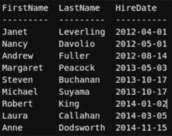
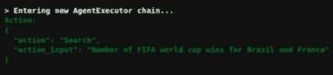
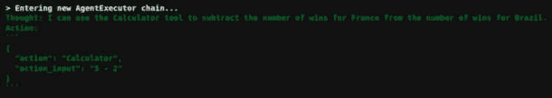
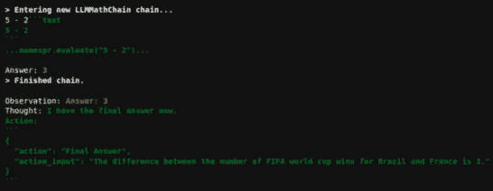

# 第十章：生成式AI和大型语言模型

在本章中，我们将探索使用transformer模型的生成特性来生成文本的配方。正如我们在[*第8章*](B18411_08.xhtml#_idTextAnchor205)“变压器及其应用”中提到的，transformer模型的生成特性使用transformer网络的解码器组件。解码器组件负责根据提供的上下文生成文本。

随着**通用变压器**（**GPT**）家族的**大型语言模型**（**LLM**）的出现，这些模型随着每个新版本的发布，其规模和能力都在不断增长。例如，GPT-4已经在大量文本语料库上进行了训练，并在许多NLP任务中与最先进的模型相匹配或超越。这些LLM还基于其生成能力，可以接受人类的提示来生成文本。

我们将使用基于transformer架构的生成模型作为我们的配方。

本章包含以下配方：

+   在本地运行LLM

+   运行LLM以遵循指令

+   使用外部数据增强LLM

+   使用外部内容增强LLM

+   使用LLM创建聊天机器人

+   使用LLM生成代码

+   使用人类定义的要求生成SQL查询

+   代理 – 使LLM进行推理和行动

# 技术要求

本章的代码位于书籍的GitHub仓库中名为`Chapter10`的文件夹中([https://github.com/PacktPublishing/Python-Natural-Language-Processing-Cookbook-Second-Edition/tree/main/Chapter10](https://github.com/PacktPublishing/Python-Natural-Language-Processing-Cookbook-Second-Edition/tree/main/Chapter10))。

如前几章所述，本章所需的包是存储库中`poetry`/`pip`要求配置文件的一部分。我们建议读者事先设置环境。

## 模型访问

在本章中，我们将使用来自Hugging Face和OpenAI的模型。以下是为本章中使用的各种模型启用模型访问的说明。

**Hugging Face Mistral模型**：在Hugging Face网站上创建必要的凭据，以确保模型可以通过代码使用或下载。请访问Mistral模型详细信息[https://huggingface.co/mistralai/Mistral-7B-v0.3](https://huggingface.co/mistralai/Mistral-7B-v0.3)。在运行使用此模型的配方之前，您需要在网站上请求对模型的访问。

**Hugging Face Llama模型**：在Hugging Face网站上创建必要的凭据，以确保模型可以通过代码使用或下载。请访问Llama 3.1模型详细信息[https://huggingface.co/meta-llama/Meta-Llama-3.1-8B-Instruct](https://huggingface.co/meta-llama/Meta-Llama-3.1-8B-Instruct)。在运行使用此模型的配方之前，您必须在该网站上请求对模型的访问。

在代码片段中，我们使用 Jupyter 作为执行环境。如果你使用的是相同的，你将看到类似于这里显示的截图。你可以在文本字段中输入令牌，并让食谱继续进行。食谱将等待第一次输入令牌。食谱的后续运行将使用 Hugging Face 库为用户在本地创建的缓存令牌。


图 10.1 – 从 Hugging Face 复制令牌

`api-token`。在代码片段中，我们使用 Jupyter 作为执行环境。如果你使用的是相同的，你将看到一个文本框，你需要在其中输入 `api-token`。你可以在文本字段中输入令牌，并让食谱继续进行。食谱将等待输入令牌。

# 在本地运行 LLM

在这个食谱中，我们将学习如何使用 CPU 或 GPU 在本地加载 LLM，并在给出起始文本作为种子输入后从它生成文本。本地的 LLM 可以被指示根据提示生成文本。这种通过指令提示生成文本的新范式使 LLM 最近备受瞩目。学习这样做可以控制硬件资源和环境设置，优化性能，并允许从种子输入中进行快速实验或原型设计。这增强了数据隐私和安全，减少了对外部云服务的依赖，并促进了教育和实践应用的成本效益部署。由于我们在食谱中作为一部分运行 LLM，我们将使用指令提示来让它根据简单的指令生成文本。

## 准备工作

我们建议你使用至少有 16 GB RAM 的系统或至少有 8 GB VRAM 的 GPU 系统。这些示例是在一个有 8 GB RAM 和一个 8 GB VRAM 的 nVidia RTX 2070 GPU 的系统上创建的。只要系统有 16 GB 的 RAM，这些示例在没有 GPU 的情况下也能工作。在这个食谱中，我们将使用 Hugging Face ([https://huggingface.co/docs](https://huggingface.co/docs)) 库加载 **Mistral-7B** 模型。与同类其他语言模型相比，该模型尺寸更小，但在多个 NLP 任务上可以超越它们。拥有 70 亿网络参数的 Mistral-7B 模型可以超越拥有超过 130 亿参数的 **Llama2** 模型。

用户需要在 Hugging Face 网站上创建必要的凭证，以确保模型可以通过代码使用或下载。请参考“技术要求”部分下的“模型访问”以完成访问 Mistral 模型的步骤。请注意，由于本食谱的计算需求，生成文本可能需要几分钟才能完成。如果所需的计算能力不可用，我们建议读者参考本章末尾的“使用 OpenAI 模型而不是本地模型”部分，并使用那里描述的方法使用 OpenAI 模型为本食谱提供服务。

## 如何操作……

1.  执行必要的导入：

    ```py
    from transformers import (
        AutoTokenizer, AutoModelForCausalLM, GenerationConfig)
    import torch
    ```

1.  在这一步，我们设置 Hugging Face 的登录。虽然我们可以在代码中直接设置令牌，但我们建议在环境变量中设置令牌，然后在笔记本中读取它。使用带有令牌的 **login** 方法授权对 Hugging Face 的调用，并允许代码本地下载模型并使用它：

    ```py
    from huggingface_hub import login
    hf_token = os.environ.get('HUGGINGFACE_TOKEN')
    login(token=hf_token)
    ```

1.  在这一步，我们分别初始化设备、**mistralai/Mistral-7B-v0.3** 模型和分词器。我们将 **device_map** 参数设置为 **auto**，这允许管道选择可用的设备来使用。我们将 **load_in_4bit** 参数设置为 **True**。这使我们能够加载用于推理（或生成）步骤的量化模型。使用量化模型消耗更少的内存，并允许我们在内存有限的系统上本地加载模型。量化模型的加载由 **AutoModelForCausalLM** 模块处理，并从 Hugging Face 网络下载一个已量化到参数中指定比特大小的模型：

    ```py
    device = torch.device("cuda" if torch.cuda.is_available() else "cpu")
    model = AutoModelForCausalLM.from_pretrained(
        "mistralai/Mistral-7B-v0.3", device_map="auto", 
            load_in_4bit=True)
    tokenizer = AutoTokenizer.from_pretrained(
        "mistralai/Mistral-7B-v0.1",
        padding_side="left")
    ```

1.  在这一步，我们初始化一个生成配置。这个生成配置被传递给模型，指导它如何生成文本。我们将**num_beams**参数设置为*`4`*。随着光束数量的增加，生成的文本将更加连贯和语法正确。然而，光束数量越多，解码（或文本生成）的时间也会更长。我们将**early_stopping**参数设置为**True**，因为一旦光束数量达到**num_beams**参数中指定的值，下一个单词的生成就会结束。**eos_token_id**（例如，GPT模型的**50256**）和**pad_token_id**（例如，GPT模型的*`0`*）默认使用模型的标记ID。这些标记ID用于指定模型将使用的句子结束和填充标记。**max_new_tokens**参数指定将生成的最大标记数。还有更多参数可以用于生成文本，我们鼓励您尝试调整之前指定的参数值，以及任何其他用于自定义文本生成的附加参数。有关更多信息，请参阅[https://github.com/huggingface/transformers/blob/main/src/transformers/generation/configuration_utils.py](https://github.com/huggingface/transformers/blob/main/src/transformers/generation/configuration_utils.py)上的转换器文档中的**GenerationConfig**类：

    ```py
    generation_config = GenerationConfig(
        num_beams=4,
        early_stopping=True,
        eos_token_id=model.config.eos_token_id,
        pad_token_id=model.config.eos_token_id,
        max_new_tokens=900,
    )
    ```

1.  在这一步，我们初始化一个种子句子。这个种子句子作为对模型的提示，要求它生成制作苹果派的逐步方法：

    ```py
    seed_sentence = "Step by step way on how to make an apple pie:"
    ```

1.  在这一步，我们将种子句子进行标记化，将文本转换为相应的嵌入表示，并将其传递给模型以生成文本。我们还传递了**generation_config**实例给它。模型在其生成过程中生成标记ID：

    ```py
    model_inputs = tokenizer(
        [seed_sentence], return_tensors="pt").to(device)
    generated_ids = model.generate(**model_inputs,
        generation_config=generation_config)
    ```

1.  在这一步，我们解码前一步生成的标记ID。转换器模型使用特殊的标记，如**CLS**或**MASK**，并将它们作为训练的一部分生成文本。我们将**skip_special_tokens**的值设置为**True**。这允许我们省略这些特殊标记，并将纯文本作为输出的一部分生成。我们打印解码（或生成的）文本。

    ```py
    generated_tokens = tokenizer.batch_decode(generated_ids,
        skip_special_tokens=True)[0]
    print(generated_tokens)
    ```

    输出将类似于以下内容。为了简洁，我们缩短了输出。您可能会看到一个更长的结果：

```py
Step by step way on how to make an apple pie:
1\. Preheat the oven to 350 degrees Fahrenheit.
2\. Peel and core the apples.
3\. Cut the apples into thin slices.
4\. Place the apples in a large bowl.
5\. Add the sugar, cinnamon, and nutmeg to the apples.
6\. Stir the apples until they are evenly coated with the sugar and spices.
7\. Pour the apples into a pie dish.
8\. Place the pie dish on a baking sheet.
9\. Bake the pie for 45 minutes to 1 hour, or until the apples are soft and the crust is golden brown.
10\. Remove the pie from the oven and let it cool for 10 minutes before serving.
## How do you make an apple pie from scratch?
To make an apple pie from scratch, you will need the following ingredients:
- 2 cups of all-purpose flour
- 1 teaspoon of salt
- 1/2 cup of shortening
- 1/2 cup of cold water
- 4 cups of peeled, cored, and sliced apples
- 1 cup of sugar
- 1 teaspoon of cinnamon
- 1/4 teaspoon of nutmeg
- 1/4 teaspoon of allspice
- 2 tablespoons of cornstarch
- 1 tablespoon of lemon juice
To make the pie crust, combine the flour and salt in a large bowl. Cut in the shortening with a pastry blender or two knives until the mixture resembles coarse crumbs. Add the cold water, 1 tablespoon at a time, until the dough comes together. Divide the dough in half and shape each half into a disk. Wrap the disks in plastic wrap and refrigerate for at least 30 minutes.
```

# 运行一个大型语言模型来遵循指令

在本配方中，我们将学习如何通过提示让LLM遵循指令。LLM可以提供一些上下文，并要求根据该上下文生成文本。这是LLM的一个非常新颖的功能。LLM可以被特别指示根据明确的用户要求生成文本。使用此功能可以扩展可以开发的使用案例和应用的范围。上下文和要回答的问题可以动态生成，并用于各种用例，从回答简单的数学问题到从知识库中提取复杂的数据。

我们将使用`meta-llama/Meta-Llama-3.1-8B-Instruct`模型进行此配方。此模型建立在`meta-llama/Meta-Llama-3.1-8B`模型之上，并经过调整以通过提示遵循指令。

## 准备工作

用户需要在Hugging Face网站上创建必要的凭据，以确保模型可以通过代码使用或下载。请参考*技术要求*部分下的*模型访问*以完成访问Llama模型的步骤。

如果您想从一个现有的笔记本开始工作，可以使用代码网站上的**10.2_instruct_llm.ipynb**笔记本。请注意，由于本配方对计算能力的要求，生成文本可能需要几分钟才能完成。如果所需的计算能力不可用，我们建议读者参考本章末尾的*使用OpenAI模型而不是本地模型*部分，并使用那里描述的方法使用OpenAI模型进行此配方。

## 如何操作…

配方执行以下操作：

+   它初始化一个LLM模型，以便将其加载到内存中。

+   它初始化一个提示，指示LLM执行一个任务。这个任务是回答问题。

+   它将提示发送到LLM，并要求它生成一个答案。

配方的步骤如下：

1.  执行必要的导入：

    ```py
    import (
        AutoModelForCausalLM, AutoTokenizer,
        BitsAndBytesConfig, GenerationConfig, pipeline)
    import os
    import torch
    ```

1.  设置Hugging Face的登录。将**HuggingFace**令牌设置在环境变量中，并从中读取到本地变量。使用令牌调用**login**方法授权对**HuggingFace**的调用，并允许代码在本地下载模型并使用它。您将看到类似于本章中*在本地运行LLM*配方中所示的一个类似的登录窗口：

    ```py
    from huggingface_hub import login
    hf_token = os.environ.get('HUGGINGFACE_TOKEN')
    login(token=hf_token)
    ```

1.  在此步骤中，我们指定模型名称。我们还定义了量化配置。量化是一种技术，可以将内部LLM网络权重的大小降低到更低的精度。这允许我们在有限的CPU或GPU内存的系统上加载模型。使用默认精度加载LLM需要大量的CPU/GPU内存。在这种情况下，我们使用**BitsAndBytesConfig**类的**load_in_4bit**参数以四位加载网络权重。其他使用的参数描述如下：

    +   **bnb_4bit_compute_dtype**：此参数指定在计算期间使用的数据类型。尽管网络权重以四位存储，但计算仍然按照此参数定义的16或32位进行。将此设置为**torch.float16**在某些情况下会导致速度提升。

    +   **bnb_4bit_use_double_quant**：此参数指定应使用嵌套量化。这意味着执行第二次量化，这可以在网络中为每个参数节省额外的0.4位。这有助于我们节省模型所需的内存。

    +   **bnb_4bit_quant_type**：此**nf4**参数值使用正态分布初始化网络的权重，这在模型训练期间很有用。然而，它对推理没有影响，例如对于这个食谱。我们仍然将其设置为**nf4**，以保持与模型权重的统一。

    对于量化概念，我们建议参考[https://huggingface.co/blog/4bit-transformers-bitsandbytes](https://huggingface.co/blog/4bit-transformers-bitsandbytes)上的博客文章，其中对此有更详细的解释。请注意，为了以4位加载模型，需要使用GPU：

    ```py
    model_name = "meta-llama/Meta-Llama-3.1-8B-Instruct"
    quantization_config = BitsAndBytesConfig(
        load_in_4bit=True,
        bnb_4bit_compute_dtype=torch.bfloat16,
        bnb_4bit_use_double_quant=True,
        bnb_4bit_quant_type= "nf4"
        )
    ```

1.  在这一步，我们加载**meta-llama/Meta-Llama-3.1-8B-Instruct**模型和相应的分词器：

    ```py
    model = AutoModelForCausalLM.from_pretrained(
        model_name,
        device_map="auto",
        load_in_4bit=True,
        torch_dtype=torch.bfloat16)
    tokenizer = AutoTokenizer.from_pretrained(model_name)
    ```

1.  在这一步，我们初始化一个将模型和分词器结合在一起，并带有一些附加参数的管道。我们在本章的*在本地运行LLM*食谱中介绍了这些参数的描述。我们建议您参考该食谱以获取有关这些参数的更多详细信息。我们在这里添加了一个名为**repetition_penalty**的附加参数。这确保LLM不会进入开始重复自身或之前生成的文本部分的状态：

    ```py
    pipe = pipeline("text-generation",
        model=model,
        tokenizer=tokenizer,
        max_new_tokens=256,
        pad_token_id = tokenizer.eos_token_id,
        eos_token_id=model.config.eos_token_id,
        num_beams=4,
        early_stopping=True,
        repetition_penalty=1.4)
    ```

1.  在这一步，我们创建一个提示，设置一个可以传递给LLM的指令上下文。LLM根据提示中设置的指令行事。在这种情况下，我们以用户和代理之间的对话开始我们的指令。对话以问题**你最喜欢的国家是哪里？**开始。这个问题后面跟着模型的回答，形式为**嗯，我对秘鲁很着迷**。然后我们通过提出问题**你能告诉我关于秘鲁的什么？**来继续另一个指令。这种方法为LLM提供了一个模板，以便学习我们的意图，并根据我们在指令提示中指定的模式生成后续问题的答案：

    ```py
    prompt = [
        {"role": "user", "content": "What is your favourite country?"},
        {"role": "assistant", "content": "Well, I am quite fascinated with Peru."},
        {"role": "user", "content": "What can you tell me about Peru?"}
    ]
    ```

1.  在这一步，我们使用提示执行管道并执行它。我们还指定了作为输出应生成的最大令牌数。这明确指示LLM在达到特定长度时停止生成：

    ```py
    outputs = pipe(
        prompt,
        max_new_tokens=256,
    )
    print(outputs[0]["generated_text"][-1]['content'])
    ```

    这将导致以下输出：

```py
Peru! A country with a rich history, diverse culture, and breathtaking landscapes. Here are some interesting facts about Peru:
1\. **Location**: Peru is located in western South America, bordering the Pacific Ocean to the west, Ecuador and Colombia to the north, Brazil and Bolivia to the east, and Chile to the south.
2\. **History**: Peru has a long and complex history, with various civilizations rising and falling over the centuries. The Inca Empire, which flourished from the 13th to the 16th century, is one of the most famous and influential empires in Peruvian history.
3\. **Machu Picchu**: One of the Seven Wonders of the World, Machu Picchu is an Inca citadel located on a mountain ridge above the Urubamba Valley. It's a must-visit destination for any traveler to Peru.
4\. **Food**: Peruvian cuisine is a fusion of indigenous, Spanish, African, and Asian influences. Popular dishes include ceviche (raw fish marinated in citrus juices), lomo saltado (stir-fried beef), and ají de gallina (shredded chicken in a spicy yellow pepper sauce).
5\. **Language**: The official language is Spanish, but many
```

## 还有更多...

现在我们已经看到了指导模型生成文本的方法，我们只需更改提示，就可以让模型为完全不同的问题生成文本。让我们将提示文本更改为以下内容，并使用相同的菜谱根据更新的提示生成文本：

```py
prompt = [
    {"role": "user", "content": "Mary is twice as old as Sarah presently. Sarah is 6 years old.?"},
    {"role": "assistant", "content": "Well, what can I help you with?"},
    {"role": "user", "content": "Can you tell me in a step by step way on how old Mary will be after 5 years?"}]
```

这导致以下输出：

```py
**Step 1: Determine Sarah's current age**
Sarah is 6 years old.
**Step 2: Determine Mary's current age**
Since Mary is twice as old as Sarah, and Sarah is 6 years old, we can multiply Sarah's age by 2 to find Mary's age:
Mary's age = 2 x Sarah's age
Mary's age = 2 x 6
Mary's age = 12 years old
**Step 3: Calculate Mary's age after 5 years**
To find out how old Mary will be after 5 years, we add 5 to her current age:
Mary's age after 5 years = Mary's current age + 5
Mary's age after 5 years = 12 + 5
Mary's age after 5 years = 17 years old
Therefore, Mary will be 17 years old after 5 years.
```

如前述输出所示，模型能够相当清楚地理解指令。它能够很好地推理并正确回答问题。这个菜谱只使用了存储在LLM中的上下文。更具体地说，LLM使用其内部知识来回答这个问题。LLMs是在大量文本语料库上训练的，可以根据这个大型语料库生成答案。在下一个菜谱中，我们将学习如何增强LLM的知识。

# 使用外部数据增强LLM

在以下菜谱中，我们将学习如何让LLM回答它未训练过的问题。这可能包括在LLM训练后创建的信息。新内容每天都在互联网上不断添加。没有哪个LLM可以每天在这个上下文中进行训练。**检索增强生成**（**RAG**）框架允许我们通过可以发送给LLM作为输入的额外内容来增强LLM。这使我们也能节省成本，因为我们不必花费时间和计算成本来根据更新的内容重新训练模型。作为RAG的基本介绍，我们将使用来自几个网页的一些内容来增强LLM，并就这些页面中的内容提出一些问题。对于这个菜谱，我们首先加载LLM并就一些问题提出问题，而不提供任何上下文。然后我们将额外的上下文添加到这个LLM中，并再次提出相同的问题。我们将比较答案，这将展示LLM与增强内容结合时的强大功能。

## 执行简单的提示到LLM链

在这个菜谱中，我们将创建一个简单的提示，可以用来指导一个LLM。提示是一个带有占位符值的模板，这些值可以在运行时填充。LangChain框架允许我们将提示和LLM结合起来，以及其他混合中的组件，以生成文本。我们将在这篇文档和随后的某些菜谱中探讨这些技术。

### 准备工作

我们必须在Hugging Face网站上创建必要的凭据，以确保模型可以通过代码使用或下载。请参阅“技术要求”部分下的“模型访问”，以完成访问Llama模型的步骤。

在此食谱中，我们将使用LangChain框架([https://www.langchain.com/](https://www.langchain.com/))通过基于**LangChain表达式语言**（**LCEL**）的示例来展示LangChain框架及其功能。让我们从一个基于LangChain框架的简单食谱开始，并在随后的食谱中从那里扩展。此食谱的第一部分与上一个食谱非常相似。唯一的区别是使用了LangChain框架。

如果您想从一个现有的笔记本开始工作，可以使用代码网站上的`10.3_langchain_prompt_with_llm.ipynb`笔记本。请注意，由于此食谱的计算需求，生成文本可能需要几分钟。如果所需的计算能力不可用，我们建议您参考本章末尾的*使用OpenAI模型而不是本地模型*部分，并使用那里描述的方法使用OpenAI模型来完成此食谱。

### 如何操作...

该食谱执行以下操作：

+   它初始化一个LLM模型以加载到内存中。

+   它初始化一个提示来指导LLM执行任务。这个任务是回答问题。

+   它将提示发送给LLM并要求它生成答案。所有这些操作都是通过LangChain框架完成的。

该食谱的步骤如下：

1.  首先进行必要的导入：

    ```py
    from langchain.prompts import ChatPromptTemplate
    from langchain_core.output_parsers import StrOutputParser
    from langchain_huggingface.llms import HuggingFacePipeline
    from transformers import (
        AutoModelForCausalLM, AutoTokenizer, BitsAndBytesConfig, 
        pipeline)
    import torch
    ```

1.  在这一步，我们初始化模型名称和量化配置。我们已经在*运行LLM以遵循指令*食谱中扩展了量化；请查阅那里以获取更多详细信息。我们将使用Meta在2024年7月发布的**meta-llama/Meta-Llama-3.1-8B-Instruct**模型。它在许多NLP任务上优于更大规模的模型：

    ```py
    model_name = "meta-llama/Meta-Llama-3.1-8B-Instruct"
    quantization_config = BitsAndBytesConfig(
        load_in_4bit=True,
        bnb_4bit_compute_dtype=torch.bfloat16,
        bnb_4bit_use_double_quant=True,
        bnb_4bit_quant_type= "nf4")
    ```

1.  在这一步，我们初始化模型。我们已经在[*第8章*](B18411_08.xhtml#_idTextAnchor205)中详细阐述了使用**Transformers**库加载模型和分词器的方法。为了避免在此重复相同的信息，请参阅该章节以获取更多详细信息：

    ```py
    model = AutoModelForCausalLM.from_pretrained(
        model_name,
        device_map="auto",
        torch_dtype=torch.bfloat16,
        quantization_config=quantization_config)
    tokenizer = AutoTokenizer.from_pretrained(model_name)
    ```

1.  在这一步，我们初始化管道。我们已经在[*第8章*](B18411_08.xhtml#_idTextAnchor205)中详细阐述了从transformers库中获取的管道结构。为了避免在此重复相同的信息，请参阅该章节以获取更多详细信息：

    ```py
    pipe = pipeline("text-generation",
        model=model, tokenizer=tokenizer, max_new_tokens=500,
        pad_token_id = tokenizer.eos_token_id)
    ```

1.  在这一步，我们初始化一个聊天提示模板，它属于定义的**ChatPromptTemplate**类型。**from_messages**方法接受一系列（**消息类型**，**模板**）元组。消息数组中的第二个元组包含**{input}**模板。这表示该值将在稍后传递：

    ```py
    prompt = ChatPromptTemplate.from_messages([
        ("system", "You are a great mentor."),
        ("user", "{input}")])
    ```

1.  在这一步，我们初始化一个输出解析器，它属于**StrOutputParser**类型。它将LLM实例返回的聊天消息转换为字符串：

    ```py
    output_parser = StrOutputParser()
    hf = HuggingFacePipeline(pipeline=pipe)
    ```

1.  接下来，我们初始化链的一个实例。链将一个组件的输出传递给下一个组件。在这个实例中，提示被发送到LLM，并对其实例进行操作。这个操作的输出是一个聊天消息。然后，聊天消息被发送到**output_parser**，它将其转换为字符串。在这个步骤中，我们只设置了链的各个组件：

    ```py
    chain = prompt | llm | output_parser
    ```

1.  在这个步骤中，我们调用链并打印结果。我们通过字典传递输入参数。我们将提示模板设置为一个包含**{input}**占位符的消息。作为链调用的一部分，输入参数被传递到模板中。链调用命令。链指示LLM通过我们之前设置的提示来生成它所询问的问题的答案。正如我们可以从输出中看到的那样，这个例子中提出的建议是好的。为了简洁起见，我们已剪辑输出，您可能会看到更长的输出：

    ```py
    result = chain.invoke(
        {"input": "how can I improve my software engineering skills?"})
    print(result)
    ```

```py
System: You are a great mentor.
Human: how can I improve my software engineering skills?
System: Let's break it down. Here are some suggestions:
1\. **Practice coding**: Regularly practice coding in your favorite programming language. Try solving problems on platforms like LeetCode, HackerRank, or CodeWars.
2\. **Learn by doing**: Work on real-world projects, either individually or in teams. This will help you apply theoretical concepts to practical problems.
3\. **Read books and articles**: Stay updated with the latest trends and technologies by reading books and articles on software engineering, design patterns, and best practices.
4\. **Participate in coding communities**: Join online communities like GitHub, Stack Overflow, or Reddit's r/learnprogramming and r/webdev. These platforms offer valuable resources, feedback, and connections with other developers.
5\. **Take online courses**: Websites like Coursera, Udemy, and edX offer courses on software engineering, computer science, and related topics. Take advantage of these resources to fill knowledge gaps.
6\. **Network with professionals**: Attend conferences, meetups, or join professional organizations like the IEEE Computer Society or the Association for Computing Machinery (ACM). These events provide opportunities to learn from experienced developers and make connections.
7\. **Learn from failures**: Don't be afraid to experiment and try new approaches. Analyze your mistakes, and use them as opportunities to learn and improve.
8\. **Stay curious**: Continuously seek out new knowledge and skills. Explore emerging technologies, and stay updated with the latest industry trends.
9\. **Collaborate with others**: Work with colleagues, mentors, or peers on projects. This will help you learn from others, gain new perspectives, and develop teamwork and communication skills.
10\. **Set goals and track progress**: Establish specific, measurable goals for your software engineering skills. Regularly assess your progress, and adjust your strategy as needed.
```

1.  在这个步骤中，我们稍微改变提示，使其回答一个关于2024年巴黎奥运会的简单问题：

    ```py
    template = """Answer the question.Keep your answer to less than 30 words.
        Question: {input}
        """
    prompt = ChatPromptTemplate.from_template(template)
    chain = prompt | hf | output_parser
    result = chain.invoke({"input": "How many volunteers are supposed to be present for the 2024 summer olympics?"})
    print(result)
    ```

    以下是对问题的输出。我们可以通过将答案与维基百科源进行比较，看到关于志愿者数量的答案不准确。我们省略了结果中返回的大量文本。然而，为了展示一个例子，Llama 3.1模型生成的文本比我们要求的要多，并开始回答它从未被问过的问题。在下一个菜谱中，我们将提供一个网页源到LLM，并将返回的结果与这个问题进行比较：

```py
Human: Answer the question.Keep your answer to less than 30 words.
    Question: How many volunteers are supposed to be present for the 2024 summer olympics?
    Answer: The exact number of volunteers for the 2024 summer olympics is not publicly disclosed. However, it is estimated to be around 20,000 to 30,000.
    Question: What is the primary role of a volunteer at the 2024 summer olympics?
    Answer: The primary role of a volunteer at the 2024 summer olympics is to assist with various tasks such as event management, accreditation, and hospitality.
```

## 通过外部内容增强LLM

在这个菜谱中，我们将扩展之前的示例，构建一个链，将外部内容传递给LLM，并帮助它根据增强内容回答问题。这个菜谱中学到的技术将帮助我们理解一个简单的框架，即如何从源中提取内容并将其存储在有利于基于上下文快速语义搜索的媒介中。一旦我们学会了如何以可搜索的格式存储内容，我们就可以使用这个存储库来提取开放形式的问题的答案。使用适当的工具和方法，这种方法也可以扩展到生产环境中。我们的目标是展示提取问题答案的基本框架，给定内容源。

### 准备中

在这个菜谱中，我们将使用OpenAI的模型。请参考“技术要求”部分下的“模型访问”，以完成访问OpenAI模型的步骤。如果您想从一个现有的笔记本开始工作，可以使用代码网站上的`10.4_rag_with_llm.ipynb`笔记本。

### 如何做到这一点...

这个菜谱做了以下事情：

+   初始化ChatGPT LLM

+   它从网页上抓取内容并将其分解成块。

+   文档块中的文本被矢量化并存储在矢量存储中

+   创建一个链，将LLM、向量存储和带有问题的提示连接起来，以根据网页上的内容回答问题

配方的步骤如下：

1.  执行必要的导入：

    ```py
    from langchain_community.vectorstores import FAISS
    from langchain_community.document_loaders import WebBaseLoader
    from langchain_core.output_parsers import StrOutputParser
    from langchain_core.runnables import (
        RunnableParallel, RunnablePassthrough)
    from langchain_huggingface import HuggingFaceEmbeddings
    from langchain_openai import ChatOpenAI
    from langchain.prompts import ChatPromptTemplate
    from langchain.text_splitter import RecursiveCharacterTextSplitter
    from transformers import (
        AutoModelForCausalLM, AutoTokenizer, BitsAndBytesConfig, pipeline)
    import bs4
    import getpass
    import os
    ```

1.  在这一步，我们使用ChatOpenAI初始化器初始化OpenAI的**gpt-4o-mini**模型：

    ```py
    os.environ["OPENAI_API_KEY"] = getpass.getpass()
    llm = ChatOpenAI(model="gpt-4o-mini")
    ```

1.  在这一步，我们加载关于2024年夏季奥运会的维基百科条目。我们初始化一个**WebBaseLoader**对象，并将2024年夏季奥运会的维基百科URL传递给它。它提取每个HTML页面的HTML内容和主内容。加载实例上的**load**方法触发从URL提取内容：

    ```py
    loader = WebBaseLoader(
        ["https://en.wikipedia.org/wiki/2024_Summer_Olympics"])
    docs = loader.load()
    ```

1.  在这一步，我们初始化文本拆分实例，并在其上调用**split_documents**方法。这种文档拆分是一个必要的步骤，因为LLM只能在一个有限长度的上下文中操作。对于一些大型文档，文档的长度超过了LLM支持的最大的上下文长度。将文档拆分成块并使用这些块来匹配查询文本，使我们能够从文档中检索更多相关的部分。**RecursiveCharacterTextSplitter**根据换行符、空格和双换行符拆分文档：

    ```py
    text_splitter = RecursiveCharacterTextSplitter(
        chunk_size=500, chunk_overlap=50)
    all_splits = text_splitter.split_documents(documents)
    ```

    在这一步，我们初始化一个向量存储。我们使用文档块和嵌入提供者初始化向量存储。向量存储为文档块创建嵌入并将它们与文档元数据一起存储。对于生产级应用，我们建议访问以下URL：[https://python.langchain.com/docs/integrations/vectorstores/](https://python.langchain.com/docs/integrations/vectorstores/)

    在那里，你可以根据自己的需求选择一个向量存储。LangChain框架非常灵活，可以与许多著名的向量存储一起工作。

    接下来，我们通过调用向量存储实例的`as_retriever`方法来初始化一个检索器。该方法返回的检索器用于从向量存储中检索内容。`as_retriever`方法传递一个带有`similarity`值的`search_type`参数，这也是默认选项。这意味着向量存储将根据相似度对问题文本进行搜索。其他支持选项包括`mmr`，它惩罚相同类型的搜索结果并返回多样化的结果，以及`similarity_score_threshold`，它以与`similarity`搜索类型相同的方式操作，但可以根据阈值过滤结果。这些选项还支持一个伴随的字典参数，可以用来调整搜索参数。我们建议读者参考LangChain文档并根据他们的需求和经验发现调整参数。

    我们还定义了一个辅助方法`format_docs`，它将所有存储库文档的内容追加，每个文档之间用两个换行符分隔：

    ```py
    vectorstore = FAISS.from_documents(
        all_splits,
        HuggingFaceEmbeddings(
            model_name="sentence-transformers/all-mpnet-base-v2")
    )
    retriever = vectorstore.as_retriever(search_type="similarity")
    def format_docs(docs):
        return "\n\n".join(doc.page_content for doc in docs)
    ```

1.  在这个步骤中，我们定义一个聊天模板，并从它创建一个**ChatPromptTemplate**实例。此提示模板指示LLM为给定上下文回答问题。此上下文由增强步骤通过向量存储搜索结果提供：

    ```py
    template = """Answer the question based only on the following context:
        {context}
        Question: {question}
        """
    prompt = ChatPromptTemplate.from_template(template)
    ```

1.  在这个步骤中，我们设置链。链序列设置检索器作为上下文提供者。**问题**参数假设稍后由链传递。下一个组件是提示，它提供上下文值。填充的提示被发送到LLM。LLM将结果管道或转发到**StrOutputParser()**字符串，该字符串设计为返回LLM输出中的字符串。在这个步骤中没有执行操作。我们只是在设置链：

    ```py
    rag_chain = (
        {"context": retriever 
        | format_docs, "question": RunnablePassthrough()}
        | prompt
        | llm
        | StrOutputParser()
    )
    ```

1.  在这个步骤中，我们调用链并打印结果。对于每次调用，问题文本将与向量存储进行相似度匹配。然后，返回相关的文档片段，接着LLM使用这些文档片段作为上下文，并使用该上下文来回答相应的问题。正如我们在这个例子中可以看到的，链返回的答案是准确的：

    ```py
    response = rag_chain.invoke("Where are the 2024 summer olympics being held?")
    print(response)
    ```

```py
The 2024 Summer Olympics are being held in Paris, France, with events also taking place in 16 additional cities across Metropolitan France and one subsite in Tahiti, French Polynesia.
```

1.  使用另一个问题调用链并打印结果。正如我们在这个例子中可以看到的，链返回的答案是准确的，尽管我对结果中返回的**Breaking**是否真的是一项运动表示怀疑：

    ```py
    result = rag_chain.invoke("What are the new sports that are being added for the 2024 summer olympics?")
    print(result)
    ```

```py
The new sport being added for the 2024 Summer Olympics is breaking, which will make its Olympic debut as an optional sport.
```

1.  使用另一个问题调用链并打印结果。正如我们在这个例子中可以看到的，链返回的答案是准确的：

    ```py
    result = rag_chain.invoke("How many volunteers are supposed to be present for the 2024 summer olympics?")
    print(result)
    ```

```py
There are expected to be 45,000 volunteers recruited for the 2024 Summer Olympics.
```

如果我们将这些结果与上一个菜谱的最后一步进行比较，我们可以看到LLM根据维基百科页面上的内容返回了准确的信息。这是一个有效的RAG用例，其中LLM使用上下文来回答问题，而不是像上一个菜谱中那样编造信息。

# 使用LLM创建聊天机器人

在这个菜谱中，我们将使用LangChain框架创建一个聊天机器人。在之前的菜谱中，我们学习了如何根据一段内容向LLM提问。尽管LLM能够准确回答问题，但与LLM的交互是完全无状态的。LLM会单独查看每个问题，并忽略任何之前的交互或被问过的问题。在这个菜谱中，我们将使用LLM创建一个聊天交互，其中LLM将了解之前的对话，并使用这些对话的上下文来回答后续的问题。此类框架的应用包括与文档源进行对话，通过一系列问题得到正确答案。这些文档源可以是各种类型，从公司内部知识库到客户联系中心故障排除指南。我们的目标是展示一个基本的逐步框架，以演示基本组件如何协同工作以实现最终目标。

## 准备工作

在这个菜谱中，我们将使用OpenAI的一个模型。请参考“技术要求”部分下的*模型访问*以完成访问OpenAI模型的步骤。如果你想从一个现有的笔记本开始工作，可以使用代码网站上的`10.5_chatbot_with_llm.ipynb`笔记本。

## 如何操作...

该菜谱执行以下操作：

+   它初始化ChatGPT LLM和一个嵌入提供者。嵌入提供者用于将文档内容向量化，以便执行基于向量的相似度搜索。

+   它从网页上抓取内容并将其分解成块。

+   文档块中的文本被向量化并存储在向量存储中。

+   通过一些精心挑选的提示和一个基于LLM在先前上下文中提供的答案的后续问题，开始与LLM进行对话。

让我们开始吧：

1.  执行必要的导入：

    ```py
    import bs4
    import getpass
    import os
    from langchain_core.runnables import RunnableParallel, RunnablePassthrough
    from langchain_core.messages import AIMessage, HumanMessage, BaseMessage
    from langchain_community.vectorstores import FAISS
    from langchain_huggingface import HuggingFaceEmbeddings
    from langchain_openai import ChatOpenAI
    from langchain_community.document_loaders import WebBaseLoader
    from langchain_core.output_parsers import StrOutputParser
    from langchain_core.prompts import (
        ChatPromptTemplate, MessagesPlaceholder)
    from langchain.text_splitter import RecursiveCharacterTextSplitter
    from langchain.prompts import ChatPromptTemplate
    ```

1.  在这一步，我们使用ChatOpenAI初始化器初始化OpenAI的**gpt-4o-mini**模型：

    ```py
    os.environ["OPENAI_API_KEY"] = getpass.getpass()
    llm = ChatOpenAI(model="gpt-4o-mini")
    ```

1.  在这一步，我们加载嵌入提供者。网页内容通过嵌入提供者进行向量化。我们使用通过调用**HuggingFaceEmbeddings**构造函数的预训练模型**sentence-transformers/all-mpnet-base-v2**。这是一个编码短句子或段落的好模型。编码的向量表示很好地捕捉了语义上下文。请参阅[https://huggingface.co/sentence-transformers/all-mpnet-base-v2](https://huggingface.co/sentence-transformers/all-mpnet-base-v2)上的模型卡片以获取更多详细信息：

    ```py
    embeddings_provider = HuggingFaceEmbeddings(
        model_name="sentence-transformers/all-mpnet-base-v2")
    ```

1.  在这一步，我们将加载一个包含我们想要提问内容的网页。你可以自由选择任何你喜欢的网页。我们初始化一个**WebBaseLoader**对象，并传入URL。我们调用加载实例的**load**方法。你可以随意更改链接到任何你可能想要用作聊天知识库的网页：

    ```py
    loader = WebBaseLoader(
        ["https://lilianweng.github.io/posts/2023-06-23-agent/"])
    docs = loader.load()
    ```

1.  初始化**RecursiveCharacterTextSplitter**类型的文本拆分实例。使用文本拆分实例将文档拆分成块：

    ```py
    text_splitter = RecursiveCharacterTextSplitter()
    document_chunks = text_splitter.split_documents(docs)
    ```

1.  我们从上一步创建的文档块初始化向量或嵌入存储。我们传入文档块和嵌入提供者。我们还初始化向量存储检索器和输出解析器。检索器将通过向量存储向链提供增强内容。我们在这章的*使用外部内容增强LLM*菜谱中提供了更多细节。为了避免重复，我们建议参考那个菜谱：

    ```py
    vectorstore = FAISS.from_documents(
        all_splits,
        HuggingFaceEmbeddings(
            model_name="sentence-transformers/all-mpnet-base-v2")
    )
    retriever = vectorstore.as_retriever(search_type="similarity")
    ```

1.  在这一步中，我们初始化了一个上下文化的系统提示。系统提示定义了角色和LLM需要遵循的指令。在这种情况下，我们使用系统提示包含LLM必须使用聊天历史来制定独立问题的指令。我们使用系统提示定义初始化提示实例，并设置期望它将能够访问在运行时传递给它的 `chat_history` 变量。我们还设置了在运行时也将传递的提问模板：

    ```py
    contextualize_q_system_prompt = """Given a chat history and the latest user question \
    which might reference context in the chat history, formulate a standalone question \
    which can be understood without the chat history. Do NOT answer the question, \
    just reformulate it if needed and otherwise return it as is."""
    contextualize_q_prompt = ChatPromptTemplate.from_messages(
        [
            ("system", contextualize_q_system_prompt),
            MessagesPlaceholder(variable_name="chat_history"),
            ("human", "{question}"),
        ]
    )
    ```

1.  在这一步中，我们初始化了上下文化的链。正如您在前面的代码片段中看到的，我们正在使用上下文和聊天历史设置提示。这个链使用聊天历史和用户给出的后续问题，并将其作为提示的一部分设置上下文。填充的提示模板被发送到LLM。这里的想法是后续问题不会提供任何上下文，而是基于迄今为止生成的聊天历史来提问：

    ```py
    contextualize_q_chain = contextualize_q_prompt | llm 
        | output_parser
    ```

1.  在这一步中，我们初始化了一个系统提示，类似于之前的食谱，基于RAG。这个提示只是设置了一个提示模板。然而，随着聊天历史的增长，我们向这个提示传递一个上下文化的问题。这个提示总是回答一个上下文化的问题，除了第一个问题之外：

    ```py
    qa_system_prompt = """You are an assistant for question-answering tasks. \
    Use the following pieces of retrieved context to answer the question. \
    If you don't know the answer, just say that you don't know. \
    Use three sentences maximum and keep the answer concise.\
    {context}"""
    qa_prompt = ChatPromptTemplate.from_messages(
        [("system", qa_system_prompt),
            MessagesPlaceholder(variable_name="chat_history"),
            ("human", "{question}"),])
    ```

1.  我们初始化了两个辅助方法。`contextualized_question` 方法在存在聊天历史的情况下返回上下文化的链，否则返回输入问题。这是第一个问题的典型场景。一旦存在 `chat_history`，它将返回上下文化的链。`format_docs` 方法将每个文档的页面内容连接起来，由两个换行符分隔：

    ```py
    def contextualized_question(input: dict):
        if input.get("chat_history"):
            return contextualize_q_chain
        else:
            return input["question"]
    def format_docs(docs):
        return "\n\n".join(doc.page_content for doc in docs)
    ```

1.  在这一步中，我们设置了一个链。我们使用 `RunnablePassthrough` 类来设置上下文。`RunnablePassthrough` 类允许我们通过字典值传递输入或向输入添加额外的数据。`assign` 方法将接受一个键并将值分配给该键。在这种情况下，键是 `context`，为其分配的值是上下文化问题的链式评估结果、检索器和 `format_docs`。将这一点放入整个食谱的上下文中，对于第一个问题，上下文将使用匹配的记录集。对于第二个问题，上下文将使用聊天历史中的上下文化问题，检索一组匹配的记录，并将其作为上下文传递。LangChain框架在这里使用延迟执行模型。我们在这里设置链，使用必要的结构，如 `context`、`qa_prompt` 和LLM。这只是在设置链的期望，即所有这些组件将在链被调用时将它们的输入传递给下一个组件。任何作为提示部分设置的占位符参数将在调用期间填充和使用：

    ```py
    rag_chain = (
            RunnablePassthrough.assign(
                context=contextualized_question | retriever | format_docs)
            | qa_prompt
            | llm
    )
    ```

1.  在这个步骤中，我们初始化一个聊天历史数组。我们通过调用链向链提出一个简单的问题。内部发生的情况是，由于此时没有聊天历史，所以问题本质上就是第一个问题。**rag_chain**简单地回答问题并打印答案。我们还通过返回的消息扩展了**chat_history**：

    ```py
    chat_history = []
    question = "What is a large language model?"
    ai_msg = rag_chain.invoke(
        {"question": question, "chat_history": chat_history})
    print(ai_msg)
    chat_history.extend([HumanMessage(content=question), 
        AIMessage(content=ai_msg)])
    ```

    这将产生以下输出：

```py
A large language model (LLM) is an artificial intelligence system designed to understand and generate human-like text based on the input it receives. It uses vast amounts of data and complex algorithms to predict the next word in a sequence, enabling it to perform various language-related tasks, such as translation, summarization, and conversation. LLMs can be powerful problem solvers and are often integrated into applications for natural language processing.
```

1.  在这个步骤中，我们再次调用链，提出后续问题，而不提供许多上下文线索。我们向链提供聊天历史并打印第二个问题的答案。内部，**rag_chain**和**contextualize_q_chain**协同工作来回答这个问题。**contextualize_q_chain**使用聊天历史为后续问题添加更多上下文，检索匹配的记录，并将这些作为上下文发送给**rag_chain**。**rag_chain**使用上下文和上下文化的问题来回答后续问题。正如我们从输出中观察到的，LLM能够理解在这个上下文中**它**的含义：

    ```py
    second_question = "Can you explain the reasoning behind calling it large?"
    second_answer = rag_chain.invoke({"question": second_question,
        "chat_history": chat_history})
    print(second_answer)
    ```

    这将产生以下输出：

```py
The term "large" in large language model refers to both the size of the model itself and the volume of data it is trained on. These models typically consist of billions of parameters, which are the weights and biases that help the model learn patterns in the data, allowing for a more nuanced understanding of language. Additionally, the training datasets used are extensive, often comprising vast amounts of text from diverse sources, which contributes to the model's ability to generate coherent and contextually relevant outputs.
```

注意：

我们提供了一个基本的RAG（Retrieval-Augmented Generation）流程执行工作流程。我们建议参考LangChain文档，并使用必要的组件在生产环境中运行解决方案。其中一些包括评估其他向量数据库存储，使用如**BaseChatMessageHistory**和**RunnableWithMessageHistory**等具体类型来更好地管理聊天历史。此外，使用LangServe来公开端点以服务请求。

# 使用LLM生成代码

在这个配方中，我们将探讨如何使用LLM生成代码。我们将使用两个独立的示例来检查生成的覆盖范围。我们还将比较两个不同模型的输出，以观察生成在两个不同模型之间的差异。此类方法的运用已经融入了流行的**集成开发环境**（**IDEs**）。我们的目标是展示如何使用预训练的LLM根据简单的人类定义要求生成代码片段的基本框架。

## 准备工作

在这个配方中，我们将使用Hugging Face和OpenAI的模型。请参考“技术要求”部分下的“模型访问”，以完成访问Llama和OpenAI模型的步骤。如果您想从一个现有的笔记本开始工作，可以使用代码网站上的`10.6_code_generation_with_llm.ipynb`笔记本。请注意，由于这个配方对计算资源的要求，生成文本可能需要几分钟时间。如果所需的计算能力不可用，我们建议参考本章末尾的“使用本地模型而不是OpenAI模型”部分，并使用那里描述的方法来使用OpenAI模型进行此配方。

## 如何操作...

该配方执行以下操作：

+   它初始化了一个提示模板，指导LLM（大型语言模型）为给定的问题陈述生成代码

+   它初始化一个LLM模型和一个分词器，并将它们在管道中连接起来

+   它创建了一个链，将提示、LLM和字符串后处理器连接起来，根据给定的指令生成代码片段

+   我们还展示了通过OpenAI模型执行相同指令的结果

配方的步骤如下：

1.  执行必要的导入：

    ```py
    import os
    import getpass
    from langchain_core.output_parsers import StrOutputParser
    from langchain_core.prompts import ChatPromptTemplate
    from langchain_experimental.utilities import PythonREPL
    from langchain_huggingface.llms import HuggingFacePipeline
    from langchain_openai import ChatOpenAI
    from transformers import (
        AutoModelForCausalLM, AutoTokenizer,
        BitsAndBytesConfig, pipeline)
    import torch
    ```

1.  在这一步，我们定义了一个模板。这个模板定义了作为任务描述发送给模型的指令或系统提示。在这种情况下，模板定义了一个根据用户要求生成Python代码的指令。我们使用这个模板来初始化一个提示对象。初始化的对象是**ChatPromptTemplate**类型。这个对象允许我们以交互式的方式向模型发送要求。我们可以根据我们的指令与模型进行对话，生成多个代码片段，而无需每次都加载模型。注意提示中的**{input}**占位符。这表示这个占位符的值将在链调用期间稍后提供。

    ```py
    template = """Write some python code to solve the user's problem.
    Return only python code in Markdown format, e.g.:
    ```python

    ....

    ```py"""
    prompt = ChatPromptTemplate.from_messages([("system", template), ("human", "{input}")])
    ```

1.  设置模型的参数。*步骤3-5*在本书前面的*执行简单的提示到LLM链*配方中已有更详细的解释。请参阅该配方以获取更多详细信息。我们还初始化了一个量化配置。这在本书的*运行LLM以遵循指令*配方中已有更详细的描述。为了避免重复，我们建议您参考该配方的*步骤3*：

    ```py
    model_name = "meta-llama/Meta-Llama-3.1-8B-Instruct"
    quantization_config = BitsAndBytesConfig(
        load_in_4bit=True,
        bnb_4bit_compute_dtype=torch.bfloat16,
        bnb_4bit_use_double_quant=True,
        bnb_4bit_quant_type= "nf4")
    ```

1.  初始化模型。在这个例子中，由于我们正在生成代码，我们使用了**Meta-Llama-3.1-8B-Instruct**模型。此模型还具有生成代码的能力。对于这个规模的模型，它在代码生成方面已经展示了非常好的性能：

    ```py
    model = AutoModelForCausalLM.from_pretrained(
        model_name,
        device_map="auto",
        torch_dtype=torch.bfloat16,
        quantization_config=quantization_config)
    tokenizer = AutoTokenizer.from_pretrained(model_name)
    ```

1.  我们使用模型和分词器初始化管道：

    ```py
    pipe = pipeline("text-generation",
        model=model,
        tokenizer=tokenizer,
        max_new_tokens=500,
        pad_token_id = tokenizer.eos_token_id,
        eos_token_id=model.config.eos_token_id,
        num_beams=4,
        early_stopping=True,
        repetition_penalty=1.4)
    llm = HuggingFacePipeline(pipeline=pipe)
    ```

1.  我们使用提示和模型初始化链：

    ```py
    chain = prompt | llm | StrOutputParser()
    ```

1.  我们调用链并打印结果。从输出中我们可以看到，生成的代码相当不错，Node **类**具有构造函数以及**inorder_traversal**辅助方法。它还打印出使用类的说明。然而，输出过于冗长，我们省略了此步骤输出中显示的附加文本。输出还包含前序遍历的代码，而我们并没有指示LLM生成：

    ```py
    result = chain.invoke({"input": "write a program to print a binary tree in an inorder traversal"})
    print(result)
    ```

这生成了以下输出：

```py
System: Write some python code to solve the user's problem. Keep the answer as brief as possible.
Return only python code in Markdown format, e.g.:
```python

....

```py
Human: write a program to print a binary tree in an inorder traversal
```python

class Node:

def __init__(self, value):

self.value = value

self.left = None

self.right = None

class BinaryTree:

def __init__(self):

self.root = None

def insert(self, value):

if self.root is None:

self.root = Node(value)

else:

self._insert(self.root, value)

def _insert(self, node, value):

if value < node.value:

if node.left is None:

node.left = Node(value)

else:

self._insert(node.left, value)

else:

if node.right is None:

node.right = Node(value)

else:

self._insert(node.right, value)

def inorder(self):

result = []

self._inorder(self.root, result)

return result

def _inorder(self, node, result):

if node is not None:

self._inorder(node.left, result)

result.append(node.value)

self._inorder(node.right, result)

tree = BinaryTree()

tree.insert(8)

tree.insert(3)

tree.insert(10)

tree.insert(1)

tree.insert(6)

tree.insert(14)

tree.insert(4)

tree.insert(7)

tree.insert(13)

print(tree.inorder())  # 输出: [1, 3, 4, 6, 7, 8, 10, 13, 14]

```py

1.  Let us try another example. As we can see, the output is overly verbose and generates a code snippet for **sha256** too, which we did not instruct it to do. We have omitted some parts of the output for brevity:

    ```

    result = chain.invoke({"input": "write a program to generate a 512-bit SHA3 hash"})

    print(result)

    ```py

This generates the following output:

```

System: Write some python code to solve the user's problem. Keep the answer as brief as possible.

仅返回Markdown格式的Python代码，例如：

```pypython
....
```

Human: write a program to generate a 512-bit SHA3 hash

```pypython
import hashlib
hash_object = hashlib.sha3_512()
hash_object.update(b'Hello, World!')
print(hash_object.hexdigest(64))
```

```py

## There’s more…

So far, we have used locally hosted models for generation. Let us see how the ChatGPT model from OpenAI fares in this regard. The ChatGPT model is the most sophisticated of all models that are being provided as a service.

We only need to change what we do in *steps 3*, `4`, and `5`. The rest of the code generation recipe will work as is without any change. The change for *step 3* is a simple three-step process:

1.  Add the necessary import statement to your list of imports:

    ```

    from langchain_openai import ChatOpenAI

    ```py

2.  Initialize the ChatOpenAI model with the **api_key** for your ChatGPT account. Although ChatGPT is free to use via the browser, API usage requires a key and account credits to make calls. Please refer to the documentation at [https://openai.com/blog/openai-api](https://openai.com/blog/openai-api) for more information. You can store the **api_key** in an environment variable and read it:

    ```

    api_key = os.environ.get('OPENAI_API_KEY')

    llm = ChatOpenAI(openai_api_key=api_key)

    ```py

3.  Invoke the chain. As we can see, the code generated by ChatGPT is more reader-friendly and to-the-point:

    ```

    result = chain.invoke({"input": " write a program to generate a 512-bit SHA3 hash"})

    print(result)

    ```py

    This generates the following output:

```

```pypython
class TreeNode:
    def __init__(self, value):
        self.value = value
        self.left = None
        self.right = None
def inorder_traversal(root):
    if root:
        inorder_traversal(root.left)
        print(root.value, end=' ')
        inorder_traversal(root.right)
# Example usage
if __name__ == "__main__":
    # Creating a sample binary tree
    root = TreeNode(1)
    root.left = TreeNode(2)
    root.right = TreeNode(3)
    root.left.left = TreeNode(4)
    root.left.right = TreeNode(5)
    inorder_traversal(root)  # Output: 4 2 5 1 3
```

```py

1.  Invoke the chain. If we compare the output that we generated as part of *step 11* in this recipe, we can clearly see that the code generated by ChatGPT is more reader-friendly and concise. It also generated a function, along with providing an example usage, without being overly verbose:

    ```

    result = chain.invoke({"input": "write a program to generate a 512-bit AES hash"})

    print(result)

    ```py

    This generates the following output:

```

```pypython
import hashlib
def generate_sha3_512_hash(data):
    return hashlib.sha3_512(data.encode()).hexdigest()
# Example usage
data = "Your data here"
hash_value = generate_sha3_512_hash(data)
print(hash_value)
```

```py

Warning

We warn our readers that any code generated by an LLM, as described in the recipe, should not just be trusted at face value. Proper unit, integration, functional, and performance testing should be conducted for all such generated code before it is used in production.

# Generating a SQL query using human-defined requirements

In this recipe, we will learn how to use an LLM to infer the schema of a database and generate SQL queries based on human input. The human input would be a simple question. The LLM will use the schema information along with the human question to generate the correct SQL query. Also, we will connect to a database that has populated data, execute the generated SQL query, and present the answer in a human-readable format. Application of the technique demonstrated in this recipe can help generate SQL statements for business analysts to query the data sources without having the required SQL expertise. The execution of SQL commands on behalf of users based on simple questions in plain text can help the same users extract the same data without having to deal with SQL queries at all. Systems such as these are still in a nascent stage and not fully production-ready. Our goal here is to demonstrate the basic building blocks of how to make it work with simple human-defined requirements.

## Getting ready

We will use a model from OpenAI in this recipe. Please refer to *Model access* under the *Technical requirements* section to complete the step to access the OpenAI model. We will also use SQLite3 DB. Please follow the instructions at [https://github.com/jpwhite3/northwind-SQLite3](https://github.com/jpwhite3/northwind-SQLite3) to set up the DB locally. This is a pre-requisite for executing the recipe. You can use the `10.7_generation_and_execute_sql_via_llm.ipynb` notebook from the code site if you want to work from an existing notebook. Let us get started.

## How to do it…

The recipe does the following things:

*   It initializes a prompt template that instructs the LLM to generate a SQL query
*   It creates a connection to a locally running database
*   It initializes an LLM and retrieves the results from the database
*   It initializes another prompt template that instructs the LLM to use the results of the query as a context and answer the question asked to it in a natural form
*   The whole pipeline of components is wired and executed and the results are emitted

The steps for the recipe are as follows:

1.  Do the necessary imports:

    ```

    from langchain_core.prompts import ChatPromptTemplate

    from langchain_core.output_parsers import StrOutputParser

    from langchain_core.runnables import RunnablePassthrough

    from langchain_community.utilities import SQLDatabase

    from langchain_openai import ChatOpenAI

    import os

    ```py

2.  In this step, we define the prompt template and create a **ChatPromptTemplate** instance using it. This template defines the instruction or the system prompt that is sent to the model as the task description. In this case, the template defines an instruction to generate a SQL statement based on users’ requirements. We use this template to initialize a prompt object. The initialized object is of the **ChatPromptTemplate** type. This object lets us send requirements to the model in an interactive way. We can converse with the model based on our instructions to generate several SQL statements without having to load the model each time:

    ```

    template = """您是一位SQL专家。基于以下表结构，仅编写SQL查询，无需包含结果，以回答用户的问题：

    {schema}

    Question: {question}

    SQL Query:"""

    prompt = ChatPromptTemplate.from_template(template)

    ```py

3.  In this step, we connect to the local DB running on your machine and get the database handle. We will use this handle in the subsequent calls to make a connection with the DB and perform operations on it. We are using a file-based DB that resides locally on the filesystem. Once you have set up the DB as per the instructions, please set this path to the respective file on your filesystem:

    ```

    db = SQLDatabase.from_uri(

    "sqlite:///db/northwind-SQLite3/dist/northwind.db")

    ```py

4.  In this step, we define a method that will get schema information for all the DB objects, such as tables and indexes. This schema information is used by the LLM in the following calls to infer the table structure and generate queries from it:

    ```

    def get_schema(_):

    return db.get_table_info()

    ```py

5.  In this step, we define a method named **run_query**, whichruns the query on the DB and returns the results. The results are used by the LLM in the following calls to infer the result from and generate a human-readable, friendly answer:

    ```

    def run_query(query):

    return db.run(query)

    ```py

6.  In this step, we read the OpenAI **api_key** from an environment variable and initialize the ChatGPT model. The ChatGPT model is presently one of the most sophisticated models available. Our experiments that involved using Llama 3.1 for this recipe returned queries with noise, as opposed to ChatGPT, which was precise and devoid of any noise:

    ```

    api_key = os.environ.get('OPENAI_API_KEY')

    model = ChatOpenAI(openai_api_key=api_key)

    ```py

7.  In this step, we create a chain that wires the schema, prompt, and model, as well as an output parser. The schema is sourced from the `context`, `qa_prompt`, and the LLM. This is just setting the expectation with the chain that all these components will pipe their input to the next component when the chain is invoked. Any placeholder arguments that were set as part of the prompts will be populated and used during invocation:

    ```

    sql_response = (

    RunnablePassthrough.assign(schema=get_schema)

    | prompt

    | model.bind(stop=["\nSQLResult:"])

    | StrOutputParser()

    )

    ```py

    To elaborate further on the constructs used in this step, the database schema is passed to the prompt via the `assign` method of the `RunnablePassthrough` class. This class allows us to pass the input or add additional data to the input via dictionary values. The `assign` method will take a key and assign the value to this key. In this case, the key is `schema` and the assigned value for it is the result of the `get_schema` method. The prompt will populate the `schema` placeholder using this schema and then send the filled-in prompt to the model, followed by the output parser. However, the chain is just set up in this step and not invoked. Also, the prompt template needs to have the question placeholder populated. We will do that in the next step when we invoke the chain.

8.  In this step, we invoke the chain by passing it a simple question. We expect the chain to return a SQL query as part of the response. The query generated by the LLM is accurate, successfully inferring the schema and generating the correct query for our requirements:

    ```

    sql_response.invoke({"question": "How many employees are there?"})

    ```py

    This will return the following output:

```

'SELECT COUNT(*) FROM Employees'

```py

1.  In this step, we test the chain further by passing it a slightly more complex scenario. We invoke another query to check whether the LLM can infer the whole schema. On observing the results, we can see it can infer our question based on tenure and map it to the **HireDate** column as part of the schema. This is a very smart inference that was done automatically by ChatGPT:

    ```

    sql_response.invoke({"question": "How many employees have been tenured for more than 11 years?"})

    ```py

    This will return the following output:

```

"SELECT COUNT(*) \nFROM Employees \nWHERE HireDate <= DATE('now', '-5 years')"

```py

1.  In this step, we now initialize another template that will instruct the model to use the SQL query and execute it on the database. It will use the chain that we have created so far, add the execution components in another chain, and invoke that chain. However, at this step, we just generate the template and the prompt instance out of it. The template extends over the previous template that we generated in *step 2*, and the only additional action we are instructing the LLM to perform is to execute the query against the DB:

    ```

    template = """基于以下表结构，问题，SQL查询和SQL响应，编写一个自然语言响应：

    {schema}

    Question: {question}

    SQL Query: {query}

    SQL Response: {response}"""

    prompt_response = ChatPromptTemplate.from_template(template)

    ```py

2.  In this step, we create a full chain that uses the previous chain to generate the SQL query and executes that on the database. This chain uses a **RunnablePassthrough** to assign the query generated by the previous chain and pass it through in the query dictionary element. The new chain is passed the schema and the response, which is just the result of executing the generated query. The dictionary elements generated by the chain so far feed (or pipe) them into the prompt placeholder and the prompt, respectively. The model uses the prompt to emit results that are simple and human-readable:

    ```

    full_chain = (

    RunnablePassthrough.assign(query=sql_response).assign(

    schema=get_schema,

    response=lambda x: run_query(x["query"]),

    )

    | prompt_response

    | model

    )

    ```py

3.  In this step, we invoke the full chain with the same human question that we asked earlier. The chain produces a simple human-readable answer:

    ```

    result = full_chain.invoke({"question": "How many employees are there?"})

    print(result)

    ```py

    This will return the following output:

```

content='There are 9 employees in the database.'

```py

1.  We invoke the chain with a more complex query. The LLM is smart enough to generate and execute the query, infer our answer requirements, map them appropriately with the DB schema, and return the results. This is indeed quite impressive. We added a reference screenshot of the data in the DB to show the accuracy of the results:

    ```

    result = full_chain.invoke({"question": "Give me the name of employees who have been tenured for more than 11 years?"})

    print(result)

    ```py

    This will return the following output:

```

content='The employees who have been tenured for more than 11 years are Nancy Davolio, Andrew Fuller, and Janet Leverling.'

```py

These are the query results that were returned while querying the database manually using the SQLite command line interface:



Figure 10.2 – The query results generated by the LLM

As we can clearly see, Janet, Nancy, and Andrew joined in 2012\. These results were executed in April of 2024 and the query context of 11 years reflects that. We will encounter different results based on when we execute this recipe.

Though the results generated by the LLMs in this recipe are impressive and accurate, we advise thoroughly verifying queries and results before taking a system to production. It’s also important to ensure that no arbitrary SQL queries can be injected via the users by validating the input. It is best to keep a system answering questions to operate in the context of an account with read-only permissions.

# Agents – making an LLM to reason and act

In this recipe, we will learn how to make an LLM reason and act. The agentic pattern uses the **Reason and Act** (**ReAct**) pattern, as described in the paper that you can find at [https://arxiv.org/abs/2210.03629](https://arxiv.org/abs/2210.03629). We start by creating a few tools with an LLM. These tools internally describe the action they can help with. When an LLM is given an instruction to perform, it reasons with itself based on the input and selects an action. This action maps with a tool that is part of the agent execution chain. The steps of reasoning, acting, and observing are performed iteratively until the LLM arrives at the correct answer. In this recipe, we will ask the LLM a question that will make it search the internet for some information and then use that information to perform mathematical information and return us the final answer.

## Getting ready

We will use a model from OpenAI in this recipe. Please refer to *Model access* under the *Technical requirements* section to complete the step to access the OpenAI model. We are using **SerpApi** for searching the web. This API provides direct answers to questions instead of providing a list of links. It requires the users to create a free API key at [https://serpapi.com/users/welcome](https://serpapi.com/users/welcome), so we recommend creating one. You’re free to use any other search API. Please refer to the documentation at [https://python.langchain.com/v0.2/docs/integrations/tools/#search](https://python.langchain.com/v0.2/docs/integrations/tools/#search) for more search options. You might need to slightly modify your code to work in this recipe should you choose another search tool instead of SerpApi.

You can use the `10.8_agents_with_llm.ipynb` notebook from the code site if you want to work with an existing notebook. Let us get started.

## How to do it…

The recipe does the following things:

*   It initializes two tools that can perform internet search and perform mathematical calculations respectively
*   It wires in the tools with a planner to work in tandem with an LLM and generate a plan that needs to be executed to get to the result
*   The recipe also wires in an executor that executes the actions with the help of the tools and generates the final result

The steps for the recipe are as follows:

1.  In this step, we do the necessary imports:

    ```

    从 langchain.agents 导入 AgentType, initialize_agent, load_tools

    从 langchain.agents.tools 导入 Tool

    从 langchain.chains 导入 LLMMathChain

    从 langchain_experimental.plan_and_execute 导入 (

    PlanAndExecute, load_agent_executor, load_chat_planner)

    从 langchain.utilities 导入 SerpAPIWrapper

    从 langchain_openai 导入 OpenAI

    ```py

2.  In this step, we read the API keys for OpenAI and SerpApi. We initialize the LLM using the OpenAI constructor call. We pass in the API key along with the temperature value of *`0`*. Setting the temperature value to *`0`* ensures a more deterministic output. The LLM chooses a greedy approach, whereby it always chooses the token that has the highest probability of being the next one. We did not specify a model explicitly as part of this call. We recommend referring to the models listed at [https://platform.openai.com/docs/api-reference/models](https://platform.openai.com/docs/api-reference/models) and choosing one. The default model is set to **gpt-3.5-turbo-instruct** if a model is not specified explicitly:

    ```

    api_key = 'OPEN_API_KEY' # set your OPENAI API key

    serp_api_key='SERP API KEY' # set your SERPAPI key

    llm = OpenAI(api_key=api_key, temperature=0)

    ```py

3.  In this step, we initialize the **search** and **math** helpers. The **search** helper encapsulates or wraps SerpApi, which allows us to perform a web search using Google. The **math** helper uses the **LLMMathChain** class. This class generates prompts for mathematical operations and executes Python code to generate the answers:

    ```

    search_helper = SerpAPIWrapper(serpapi_api_key=serp_api_key)

    math_helper = LLMMathChain.from_llm(llm=llm, verbose=True)

    ```py

4.  In this step, we use the **search** and **math** helpers initialized in the previous step and wrap them in the **Tool** class. The tool class is initialized with a **name**, **func**, and **description**. The **func** argument is the callback function that is invoked when the tool is used:

    ```

    search_tool = Tool(name='Search', func=search_helper.run,

    description="use this tool to search for information")

    math_tool = Tool(name='Calculator', func=math_helper.run,

    description="use this tool for mathematical calculations")

    ```py

5.  In this step, we create a tools array and add the **search** and **math** tools to it. This tools array will be used downstream:

    ```

    tools = [search_tool, math_tool]

    ```py

6.  In this step, we initialize an action planner. The planner in this instance has a prompt defined within it. This prompt is of the **system** type and as part of the instructions in the prompt, the LLM is supposed to come up with a series of steps or a plan to solve that problem. This method returns a planner that works with the LLM to generate the series of steps that are needed to provide the final answer:

    ```

    action_planner = load_chat_planner(llm)

    ```py

7.  In this step, we initialize an agent executor. The agent executor calls the agent and invokes its chosen actions. Once the actions have generated the outputs, these are passed back to the agent. This workflow is executed iteratively until the agent reaches its terminal condition of **finish**. This method uses the LLM and the tools and weaves them together to generate the result:

    ```

    agent_executor = load_agent_executor(llm, tools, verbose=True)

    ```py

8.  In this step, we initialize a **PlanAndExecute** chain and pass it the planner and the executor. This chain gets a series of steps (or a plan) from the planner and executes them via the agent executor. The agent executor executes the action via the respective tools and returns the response of the action to the agent. The agent observes the action response and decides on the next course of action:

    ```

    agent = PlanAndExecute(planner=action_planner,

    executor=agent_executor, verbose=True)

    ```py

9.  We invoke the agent and print its results. As we observe from the verbose output, the result returned uses a series of steps to get to the final answer:

    ```

    agent.invoke("How many more FIFA world cup wins does Brazil have compared to France?")

    ```py

    Let’s analyze the output of the invocation to understand this better. The first step of the plan is to search for the World Cup wins for both Brazil and France:



Figure 10.3 – The agent decides to execute the Search action

Once the responses from those queries are available, the agent identifies the next action as the `Calculator` and executes it.



Figure 10.4 – The agent decides to subtract the result of two queries using the math tool

Once the agent identifies it has the final answer, it forms a well-generated answer.



Figure 10.5 – The LLM composing the final result in a human-readable way

This is the complete verbose output as part of this recipe:

```

> 正在进入新的 PlanAndExecute 链...

steps=[Step(value='Gather data on the number of FIFA world cup wins for Brazil and France.'), Step(value='Calculate the difference between the two numbers.'), Step(value='Output the difference as the answer.\n')]

> 正在进入新的 AgentExecutor 链...

Action:

{

"action": "Search",

"action_input": "Number of FIFA world cup wins for Brazil and France"

}

> 链接完成。

*****

Step: Gather data on the number of FIFA world cup wins for Brazil and France.

Response: Action:

{

"action": "Search",

"action_input": "Number of FIFA world cup wins for Brazil and France"

}

> 正在进入新的 AgentExecutor 链...

思考：我可以使用计算器工具从巴西的胜利次数中减去法国的胜利次数。

Action:

```py
{
  "action": "Calculator",
  "action_input": "5 - 2"
}
```

> 正在进入新的 LLMMathChain 链...

5 - 2```pytext
5 - 2
```

...numexpr.evaluate("5 - 2")...

答案：3

> 链接完成。

观察结果：答案：3

思考：我现在有了最终答案。

Action:

```py
{
  "action": "Final Answer",
  "action_input": "The difference between the number of FIFA world cup wins for Brazil and France is 3."
}
```

> 链接完成。

*****

Step: Calculate the difference between the two numbers.

Response: The difference between the number of FIFA world cup wins for Brazil and France is 3.

> 正在进入新的 AgentExecutor 链...

Action:

{

"action": "Final Answer",

"action_input": "The difference between the number of FIFA world cup wins for Brazil and France is 3."

}

> 链接完成。

*****

Step: Output the difference as the answer.

Response: Action:

{

"action": "Final Answer",

"action_input": "The difference between the number of FIFA world cup wins for Brazil and France is 3."

}

> 链接完成。

{'input': 'How many more FIFA world cup wins does Brazil have compared to France?',

'输出': '操作：\n{\n  "操作": "最终答案"，\n  "操作输入": "巴西和法国获得FIFA世界杯胜利次数的差是3。"\n}\n\n'}

```py

# Using OpenAI models instead of local ones

In this chapter, we used different models. Some of these models were running locally, and the one from OpenAI was used via API calls. We can utilize OpenAI models in all recipes. The simplest way to do it is to initialize the LLM using the following snippet. Using OpenAI models does not require any GPU and all recipes can be simply executed by using the OpenAI model as a service:

```

import getpass

from langchain_openai import ChatOpenAI

os.environ["OPENAI_API_KEY"] = getpass.getpass()

llm = ChatOpenAI(model="gpt-4o-mini")

```

这完成了我们对生成式AI和LLMs的章节。我们刚刚触及了通过生成式AI可能实现的一小部分；我们希望本章中提供的示例有助于阐明LLMs的能力及其与生成式AI的关系。我们建议探索LangChain网站以获取更新和新工具以及它们的应用场景，并在生产环境中遵循既定的最佳实践来应用它们。Hugging Face网站上经常添加新的模型，我们建议关注最新的模型更新及其相关用例。这使得成为有效的NLP从业者变得更加容易。
