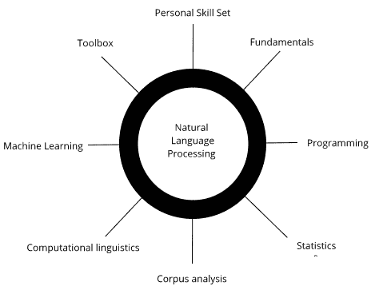
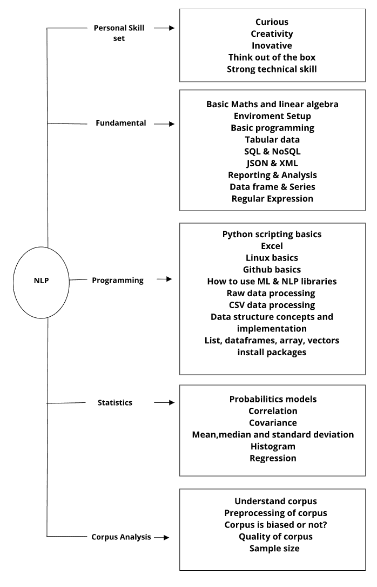
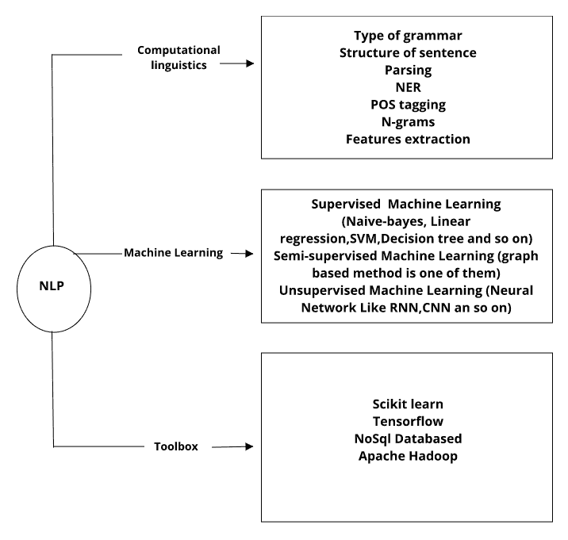
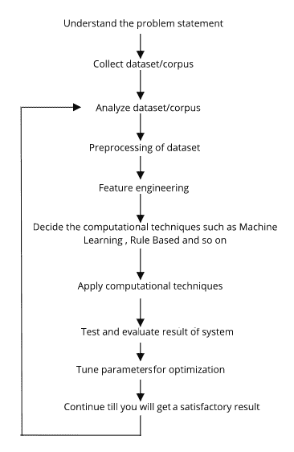
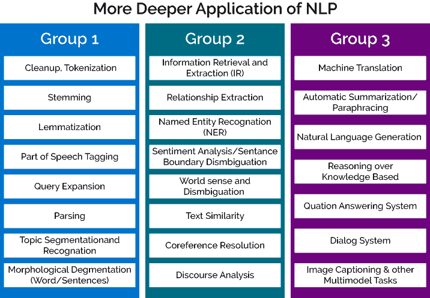
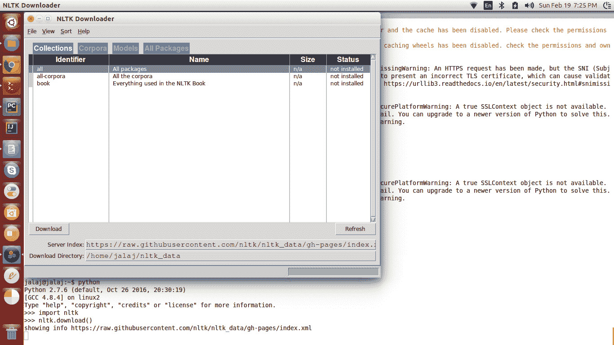

# 第一章：介绍

在本章中，我们将对**自然语言处理**（**NLP**）进行简要介绍，并讨论自然语言处理概念是如何在现实中的人工智能应用中使用的。我们将主要关注用于开发 NLP 应用的 Python 编程范式。之后，本章还会有一个为读者准备的提示部分。如果你真的有兴趣了解不同编程范式在 NLP 中的对比，以及为什么 Python 是最好的编程范式，那么作为读者，你应该阅读本书的*前言*。作为一名行业专业人士，我尝试过多种编程范式来开发 NLP 应用。我使用过 Java、R 和 Python 来开发 NLP 应用。相信我，Python 在开发使用 NLP 概念的应用时非常简单且高效。

本章将涵盖以下主题：

+   理解 NLP

+   理解基本应用

+   理解高级应用

+   NLP 和 Python 的结合优势

+   NLTK 的环境设置

+   读者提示

# 理解自然语言处理

在过去几年里，**人工智能**（**AI**）的各个分支引起了广泛关注，其中包括数据科学、数据分析、预测分析、NLP 等。

正如本书*前言*中提到的，我们专注于 Python 和自然语言处理。让我问你一些问题——你真的知道什么是自然语言吗？什么是自然语言处理？在使用各种自然语言处理概念构建专家系统时，涉及哪些其他分支？我们如何利用 NLP 的概念构建智能系统？

让我们开始理解 NLP 的过山车之旅。

什么是自然语言？

+   作为人类，我们通过语言表达我们的思想或感情

+   你说、读、写或听的任何内容大多都是自然语言的形式，因此通常被称为自然语言

+   例如：

    +   本书的内容是自然语言的来源

    +   你在日常生活中说、听和写的所有内容也是自然语言的形式

    +   电影对话也是自然语言的来源

    +   你在 WhatsApp 上的对话也被视为自然语言的一种形式

什么是自然语言处理？

+   现在你对自然语言有了了解。NLP（自然语言处理）是人工智能的一个子领域。让我们通过一个例子来理解 NLP 的概念。假设你想构建一个与人类通过自然语言互动的机器。这样的智能系统需要计算技术和计算语言学来构建，系统像人类一样处理自然语言。

+   你可以将上述 NLP 的概念与世界顶尖科技公司现有的 NLP 产品相联系，比如谷歌的 Google Assistant、苹果的 Siri 语音助手等。

+   现在你将能够理解 NLP 的定义，具体如下：

    +   自然语言处理是计算技术和/或计算语言学处理人类自然语言的能力

    +   自然语言处理是计算机科学、人工智能和计算语言学领域的一个分支，涉及计算机与人类（自然）语言之间的交互。

    +   自然语言处理可以定义为对人类自然语言进行自动（或半自动）处理。

在使用各种 NLP 概念构建专家系统时，还涉及哪些其他分支？*图 1.1* 是了解在构建使用 NLP 概念的专家系统时涉及多少其他分支的最佳方法：



图 1.1：NLP 概念

*图 1.2* 和 *1.3* 传达了在 *图 1.1* 中提到的每个分支中包含的所有子主题：



图 1.2：NLP 概念的子分支

*图 1.3* 描述了其余的子分支：

图 1.3：NLP 概念的子分支

如何利用 NLP 概念构建智能系统？*图 1.4* 是基本模型，指示如何为 NLP 应用程序构建专家系统的开发生命周期在下图中定义：



图 1.4：开发生命周期

让我们看看与 NLP 相关问题的开发生命周期的一些细节：

1.  如果您正在解决一个 NLP 问题，您首先需要理解问题陈述。

1.  一旦您理解了问题陈述，思考一下您需要解决问题所需的数据或语料库类型。因此，数据收集是解决问题的基本活动。

1.  在收集足够的数据后，您可以开始分析数据。我们的语料库的质量和数量如何？根据数据的质量和您的问题陈述，您需要进行预处理。

1.  一旦您完成预处理，您需要开始进行特征工程的过程。特征工程是 NLP 和数据科学相关应用程序中最重要的方面。我们将在第五章，*特征工程和 NLP 算法*以及第六章，*高级特征工程和 NLP 算法*中更详细地介绍与特征工程相关的方面。

1.  从原始预处理数据中选择和提取功能后，您需要决定哪些计算技术对解决您的问题陈述有用，例如，您是否想要应用机器学习技术或基于规则的技术？

1.  现在，根据您将使用的技术，应准备好要提供给所选择算法的特征文件。

1.  运行您的逻辑，然后生成输出。

1.  测试和评估您系统的输出。

1.  调整参数以进行优化，并继续直到获得满意的结果。

本章我们将快速覆盖大量信息，如果您遇到不立即能理解的内容，请不要感到迷茫，耐心一点。我们将在下一章开始详细探讨所有细节和示例，这肯定会帮助您理清思路。

# 理解基础应用

自然语言处理（NLP）是人工智能的一个子领域。NLP 的概念被应用于以下专家系统：

+   语音识别系统

+   问答系统

+   从一种特定语言翻译到另一种特定语言

+   文本摘要

+   情感分析

+   基于模板的聊天机器人

+   文本分类

+   主题分割

我们将在后续章节中学习大多数在前述应用中使用的 NLP 概念。

# 理解高级应用

高级应用包括以下内容：

+   理解自然语言指令并与人类进行自然语言互动的类人机器人

+   构建一个通用的机器翻译系统是 NLP 领域的长期目标，因为你可以很容易地建立一个将一种特定语言翻译成另一种特定语言的机器翻译系统，但这个系统可能无法帮助你翻译其他语言。借助深度学习，我们可以开发一个通用的机器翻译系统，谷歌最近宣布他们离实现这一目标非常接近。我们将在第九章中使用深度学习构建自己的机器翻译系统，*深度学习在 NLP 和 NLG 问题中的应用。*

+   NLP 系统是生成给定文档逻辑标题的高级应用之一。此外，借助深度学习，您还可以生成文档标题并进行摘要处理。您将在第九章中看到这种应用，*深度学习在 NLP 和 NLG 问题中的应用。*

+   NLP 系统，用于生成特定主题或图像的文本，也被认为是一个高级 NLP 应用。

+   高级聊天机器人，能够为人类生成个性化文本并忽略人类写作中的错误，也是我们力图实现的目标。

+   还有许多其他 NLP 应用，您可以在**图 1.5：**中看到：



图 1.5：NLP 领域的应用

# 团结的优势 - NLP 与 Python

以下几点说明了为什么 Python 是构建基于 NLP 的专家系统的最佳选择之一：

+   使用 Python 开发基于 NLP 的专家系统原型非常简单且高效

+   有许多开源的 NLP 库可以供 Python 程序员使用。

+   社区支持非常强大

+   易于使用，适合初学者，且复杂度低

+   快速发展：测试和评估简便且不复杂

+   许多新的框架，如 Apache Spark、Apache Flink、TensorFlow 等，都提供了 Python 的 API。

+   基于 NLP 的系统优化比其他编程范式更为简单。

# NLTK 环境设置

我建议所有读者从 GitHub 拉取`NLPython`仓库。仓库的 URL 是 [`github.com/jalajthanaki/NLPython`](https://github.com/jalajthanaki/NLPython)

我使用的是 Linux（Ubuntu）操作系统，所以如果你不熟悉 Linux，最好先熟悉它，因为大多数高级框架，如 Apache Hadoop、Apache Spark、Apache Flink、Google TensorFlow 等，都需要 Linux 操作系统。

GitHub 仓库包含了如何安装 Linux 的说明，以及本书中将使用的基本 Linux 命令。如果你是 Git 新手，在 GitHub 上也能找到有关 Git 的基础命令。URL 是 [`github.com/jalajthanaki/NLPython/tree/master/ch1/documentation`](https://github.com/jalajthanaki/NLPython/tree/master/ch1/documentation)

我为读者提供了一个安装指南，用于设置本书章节的环境。URL 是 [`github.com/jalajthanaki/NLPython/tree/master/ch1/installation_guide`](https://github.com/jalajthanaki/NLPython/tree/master/ch1/installation_guide)

安装 nltk 的步骤如下（或者你可以访问 URL: [`github.com/jalajthanaki/NLPython/blob/master/ch1/installation_guide/NLTK%2BSetup.md`](https://github.com/jalajthanaki/NLPython/blob/master/ch1/installation_guide/NLTK%2BSetup.md)）：

1.  手动安装 Python 2.7.x，但在 Linux Ubuntu 14.04 上已经预装；如果没有安装，可以使用 `python -V` 命令检查你的 Python 版本。

1.  配置 pip 以安装 Python 库 ([`github.com/jalajthanaki/NLPython/blob/master/ch1/installation_guide/NLTK%2BSetup.md`](https://github.com/jalajthanaki/NLPython/blob/master/ch1/installation_guide/NLTK%2BSetup.md))。

1.  打开终端，执行以下命令：

```py
 pip install nltk or sudo pip install nltk

```

1.  打开终端，执行 `python` 命令。

1.  在 Python shell 中，执行 `import nltk` 命令。

如果你的 `nltk` 模块已成功安装，系统不会显示任何信息。

1.  在 Python shell 中，执行 `nltk.download()` 命令。

1.  这将打开一个额外的对话框，你可以选择特定的库，但在我们的情况下，点击 "All packages"（所有包），然后可以选择包存放的路径。等待所有包下载完成。下载可能会花费较长时间。下载完成后，你可以在之前指定的路径下找到名为 `nltk_data` 的文件夹。请查看以下截图中的 NLTK 下载器：



图 1.6：NLTK 下载器

这个仓库包含了安装指南、代码、维基页面等。如果读者有问题或疑问，可以在 Gitter 群组中发布自己的问题。Gitter 群组的 URL 是 [`gitter.im/NLPython/Lobby?utm_source=share-link&utm_medium=link&utm_campaign=share-link`](https://gitter.im/NLPython/Lobby?utm_source=share-link&utm_medium=link&utm_campaign=share-link)

# 给读者的建议

本书是一本实用指南。作为一名行业专业人士，我强烈建议所有读者复制已经在 GitHub 上提供的代码，并进行书中给出的练习。这将帮助你加深对 NLP 概念的理解。如果不进行这些实践，你几乎不可能彻底掌握所有的 NLP 概念。顺便说一下，我保证实现这些代码会很有趣。

接下来的章节流程如下：

+   概念的解释

+   概念的应用

+   概念的需求

+   实现这些概念的可能方式（代码在 GitHub 上）

+   概念的挑战

+   克服挑战的小贴士

+   练习

# 总结

本章为你介绍了 NLP。你现在对 NLP 涉及的分支以及使用 NLP 概念构建专家系统的各个阶段有了一个简要了解。最后，我们为 NLTK 设置了环境。所有安装指南和代码都可以在 GitHub 上找到。

在下一章中，我们将看到 NLP 相关应用中使用了什么样的语料库，以及在分析语料库时需要牢记的所有关键点。我们将处理不同类型的文件格式和数据集。让我们一起探索吧！
