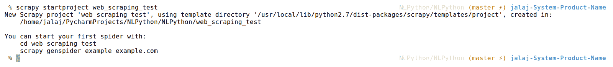

# 第二章：语料库和数据集的实际理解

在这一章中，我们将探索自然语言处理的第一个构建模块。我们将涵盖以下主题，以便对语料库或数据集有一个实际的理解：

+   什么是语料库？

+   我们为什么需要语料库？

+   理解语料库分析

+   理解数据属性的类型

+   探索数据集的不同文件格式

+   获取免费语料库的资源

+   为 NLP 应用准备数据集

+   开发网页抓取应用

# 什么是语料库？

与自然语言处理相关的应用是基于大量数据构建的。用通俗的话来说，你可以将大量数据集合称为**语料库**。因此，更正式和技术上讲，语料库可以定义如下：

语料库是存储在计算机上的书面或口语自然语言材料的集合，用于研究语言的使用方式。更准确地说，语料库是一个系统化的计算机化真实语言集合，用于语言学分析和语料库分析。如果你有多个语料库，这些集合称为**语料库**。

为了开发 NLP 应用，我们需要书面或口语的自然语言材料。我们使用这些材料或数据作为输入数据，并尝试找出能够帮助我们开发 NLP 应用的事实。有时，NLP 应用使用单一语料库作为输入，有时则使用多个语料库作为输入。

使用语料库开发 NLP 应用的原因有很多，以下是其中一些：

+   借助语料库，我们可以进行一些统计分析，如词频分布、词汇共现等。别担心，我们将在本章后面看到一些语料库的基本统计分析。

+   我们可以为各种自然语言处理（NLP）应用定义和验证语言学规则。如果你正在构建一个语法纠错系统，你将使用文本语料库，尝试找出语法上不正确的实例，然后定义帮助我们纠正这些实例的语法规则。

+   我们可以定义一些特定的语言学规则，这些规则依赖于语言的使用方式。借助基于规则的系统，你可以定义语言学规则，并使用语料库验证这些规则。

在语料库中，大量数据可以有以下几种格式：

+   文本数据，指书面材料

+   语音数据，指口语材料

让我们来看看文本数据到底是什么以及如何收集文本数据。文本数据是书面信息的集合。有多种资源可以用来获取书面信息，例如新闻文章、书籍、数字图书馆、电子邮件信息、网页、博客等等。现在，我们都生活在一个数字化的世界中，因此文本信息的数量正在迅速增长。因此，我们可以使用所有这些资源来获取文本数据，并且可以创建自己的语料库。举个例子：如果你想构建一个系统来总结新闻文章，你首先需要收集互联网上的各种新闻文章，然后生成一个新闻文章的集合，这个集合就是你的新闻文章语料库，包含文本数据。你可以使用网页抓取工具从原始 HTML 页面中获取信息。在本章中，我们将开发一个工具。

现在我们来看一下语音数据是如何收集的。语音数据语料库通常有两部分：一部分是音频文件，另一部分是其文本转录。通常，我们可以通过音频录音来获得语音数据。这些音频录音可能包含人们的对话或交流。举个例子：在印度，当你拨打银行客服部门电话时，如果你留心，会发现每个电话都被录音。这就是你可以生成语音数据或语音语料库的方式。对于本书，我们专注于文本数据，而非语音数据。

在某些情况下，语料库也被称为数据集。

语料库有三种类型：

+   **单语语料库：** 这种类型的语料库只有一种语言。

+   **双语语料库：** 这种类型的语料库有两种语言。

+   **多语种语料库：** 这种类型的语料库有多于一种语言。

以下是一些可用语料库的例子：

+   Google Books Ngram 语料库

+   布朗语料库

+   美国国家语料库

# 我们为什么需要语料库？

在任何自然语言处理（NLP）应用中，我们都需要数据或语料库来构建 NLP 工具和应用程序。语料库是任何与 NLP 相关的应用程序中最关键和最基本的构建块。它为我们提供了定量数据，用于构建 NLP 应用程序。我们还可以使用部分数据来测试和挑战我们对语言的想法和直觉。语料库在 NLP 应用程序中起着非常重要的作用。关于为 NLP 应用程序创建语料库的挑战如下：

+   决定我们需要哪种类型的数据来解决问题陈述

+   数据的可用性

+   数据的质量

+   数据量的充足性

现在你可能想了解前面所有问题的详细信息；为了帮助你轻松理解所有前述内容，我将举一个例子。假设你想制作一个 NLP 工具，用于了解特定患者的医疗状况，并能在经过适当医疗分析后生成诊断。

这里，我们的角度更偏向语料库层面，并且是概括性的。如果你作为 NLP 学习者看待前面的例子，你应该按以下方式处理问题陈述：

+   如果我要解决问题陈述，我需要什么样的数据？

    +   临床笔记或病史记录

    +   医生与病人之间的对话录音

+   你是否拥有这种语料库或数据？

    +   如果是，那就太好了！你处于一个很好的位置，可以继续回答下一个问题。

    +   如果不是，没关系！不用担心。你需要再处理一个问题，可能是一个困难但有趣的问题。

+   是否有开源语料库可用？

    +   如果是，下载它，并继续到下一个问题。

    +   如果不是，想一想你如何访问数据并构建语料库。可以考虑使用网页抓取工具和技术。但你需要探索网页抓取工具的伦理和法律方面的问题。

+   语料库的质量水平如何？

    +   浏览语料库，并尝试找出以下几点：

        +   如果你根本无法理解数据集，那么该怎么办？

            +   多花些时间与数据集互动。

            +   像机器一样思考，试着想象如果你被喂入这种数据集，你会处理哪些事情。不要认为你会抛出错误！

            +   找出你觉得可以开始的事情。

            +   假设你的 NLP 工具已经诊断出一种人类疾病，想象一下如果你是医生的机器，你会问病人什么问题。现在你可以开始理解你的数据集，并思考预处理部分。不要急于处理它。

        +   如果你能理解数据集，那么接下来该做什么？

            +   构建 NLP 系统时，是否需要语料库中的每一个内容？

                +   如果是，那么请继续到下一个阶段，我们将在第五章中讨论，*特征工程与 NLP 算法*。

                +   如果不是，那么继续到下一个阶段，我们将在第四章中讨论，*预处理*。

+   数据量是否足够，至少能在**概念验证**（**POC**）基础上解决问题？

    +   根据我的经验，我更倾向于至少拥有 500MB 到 1GB 的数据用于小型 POC。

    +   对于初创企业来说，收集 500MB 到 1GB 的数据也面临挑战，原因如下：

        +   初创企业是商业中新手。

        +   有时它们非常创新，并且没有现成的可用数据集。

        +   即使他们成功构建了 POC，在现实生活中验证他们的产品也是一项挑战。

请参考*图 2.1*，以了解前述过程的描述：


图 2.1：为什么我们需要语料库？过程描述。

# 理解语料库分析

在本节中，我们首先将了解什么是语料库分析。之后，我们将简要探讨语音分析。我们还将了解如何为不同的自然语言处理（NLP）应用分析文本语料库。最后，我们将进行一些实际的文本语料库分析。让我们开始吧！

语料库分析可以定义为一种方法论，用于在真实和交际情境的背景下深入调查语言概念。在这里，我们讨论的是数字存储的语言语料库，这些语料库可以通过计算机进行访问、检索和分析。

语音数据的语料库分析需要对每个数据实例的语音理解进行分析。除了语音分析外，我们还需要进行对话分析，这有助于我们了解特定语言中日常生活中社会互动的发生方式。例如，在现实生活中，如果你正在进行英语口语对话分析，你可能会发现像*What's up, dude?*这样的句子在对话中比*How are you, sir (or madam)?*使用得更频繁。

文本数据的语料库分析包括统计性地探查、操纵和概括数据集。因此，对于文本数据集，我们通常会分析语料库中有多少不同的单词，以及某些单词在语料库中的频率。如果语料库中有任何噪声，我们会尝试去除这些噪声。在几乎所有的自然语言处理（NLP）应用中，我们都需要进行一些基本的语料库分析，以便更好地理解我们的语料库。`nltk`为我们提供了一些内建的语料库，因此我们可以使用这些内建的语料库进行语料库分析。在开始实际操作之前，了解`nltk`中有哪些类型的语料库是非常重要的。

`nltk`有四种类型的语料库。让我们来看一下它们：

+   **孤立语料库**：这种类型的语料库是一个由文本或自然语言组成的集合。此类语料库的例子包括`gutenberg`、`webtext`等。

+   **分类语料库**：这种类型的语料库是由分为不同类别的文本组成的集合。

    这种语料库的一个例子是`brown`语料库，它包含了不同类别的数据，如新闻、爱好、幽默等。

+   **重叠语料库**：这种类型的语料库是由分类文本组成，但这些分类之间是相互重叠的。此类语料库的一个例子是`reuters`语料库，它包含了被分类的数据，但定义的分类之间是重叠的。

    更明确地说，我想定义`reuters`语料库的例子。例如，如果你把不同类型的椰子视为一个类别，你会看到椰子油和棉花油是其子类别。因此，在`reuters`语料库中，各种数据类别是重叠的。

+   **时间语料库**：这种类型的语料库是一个涵盖一定时间段内自然语言使用情况的集合。

    这种语料库的一个例子是`inaugural address`语料库。

    假设你在 1950 年记录了印度某城市的语言使用情况。然后你重复相同的活动，分别记录该城市在 1980 年和 2017 年的语言使用情况。你将记录关于人们如何使用语言以及随时间变化的各项数据属性。

现在，理论讲解足够了，我们来看看实际操作。你可以通过以下链接查看代码：

该章节的代码位于 GitHub 目录 URL：[`github.com/jalajthanaki/NLPython/tree/master/ch2`](https://github.com/jalajthanaki/NLPython/tree/master/ch2)。

请在此 URL 查看 Python 代码：[`nbviewer.jupyter.org/github/jalajthanaki/NLPython/blob/master/ch2/2_1_Basic_corpus_analysis.html`](https://nbviewer.jupyter.org/github/jalajthanaki/NLPython/blob/master/ch2/2_1_Basic_corpus_analysis.html)

这段 Python 代码包含了如何通过`nltk` API 访问语料库的基本命令。我们使用的是`brown`和`gutenberg`语料库，并简要介绍了一些与语料库相关的基本 API。

以下表格描述了基本 API 属性：

| **API 属性** | **描述** |
| --- | --- |
| `fileids()` | 显示语料库中的文件 |
| `fileids([categories])` | 显示与这些类别对应的语料库文件 |
| `categories()` | 列出语料库的类别 |
| `categories([fileids])` | 显示与这些文件对应的语料库类别 |
| `raw()` | 显示语料库的原始内容 |
| `raw(fileids=[f1,f2,f3])` | 显示指定文件的原始内容 |
| `raw(categories=[c1,c2])` | 显示指定类别的原始内容 |
| `words()` | 显示整个语料库的单词 |
| `words(fileids=[f1,f2,f3])` | 显示指定`fileids`的单词 |
| `words(categories=[c1,c2])` | 显示指定类别的单词 |
| `sents()` | 显示整个语料库的句子 |
| `sents(fileids=[f1,f2,f3])` | 显示指定`fileids`的句子 |
| `sents(categories=[c1,c2])` | 显示指定类别的句子 |
| `abspath(fileid)` | 显示给定文件在磁盘上的位置 |
| `encoding(fileid)` | 显示文件的编码方式（如果已知） |
| `open(fileid)` | 基本上是打开一个流以读取给定的语料库文件 |
| `root` | 显示路径，如果它是本地安装的语料库的根路径 |
| `readme()` | 显示语料库的`README`文件内容 |

我们已经看过了如何使用`nltk`加载自定义语料库的代码，并且对可用语料库及我们自定义语料库进行了频率分布分析。

`FreqDist`类用于编码频率分布，用于统计每个单词在语料库中出现的次数。

所有`nltk`语料库并非都很嘈杂。它们需要进行基本的预处理，才能从中生成特征。使用`nltk`的基础语料库加载 API，可以帮助你识别极端的垃圾数据。假设你有一个生物化学语料库，那么可能会包含大量无法准确解析的方程式和复杂的化学名称。在这种情况下，你可以根据问题陈述决定是否在预处理阶段删除它们，或保留它们并在**词性标注**（**POS**）级别进行解析的定制。

在实际应用中，语料库通常非常杂乱。使用`FreqDist`，你可以查看单词的分布情况，了解我们应该考虑和不应该考虑的内容。在预处理阶段，你需要检查许多复杂的属性，如解析结果、词性标注和句子拆分是否恰当。我们将在第四章《预处理》和第五章《特征工程与 NLP 算法》中详细讲解这些内容。

注意，这里语料库的分析是从技术角度进行的。我们并不专注于语料库语言学分析，因此大家不要混淆两者。

如果你想进一步阅读语料库语言学分析的内容，请参考此网址：

[`en.wikipedia.org/wiki/Corpus_linguistics`](https://en.wikipedia.org/wiki/Corpus_linguistics)

如果你想进一步探索`nltk` API，网址是 [`www.nltk.org/`](http://www.nltk.org/)。

# 练习

1.  计算`brown`语料库中`fileID: fileidcc12`的单词数。

1.  创建你自己的语料库文件，使用`nltk`加载它，然后检查该语料库的频率分布。

# 理解数据属性的类型

现在让我们专注于语料库中可能出现的各种数据属性。*图 2.3*为你提供了不同类型数据属性的详细信息：


图 2.3：数据属性的类型

我想给出一些不同类型语料库的例子。这些例子是概括性的，目的是让大家理解不同类型的数据属性。

# 分类或定性数据属性

分类或定性数据属性如下：

+   这些类型的数据属性更具描述性

+   示例包括我们的书面笔记，`nltk`提供的语料库，以及记录了不同种类狗的品种（如柯利犬、牧羊犬和梗犬）的语料库。

分类数据属性有两个子类型：

+   **序数数据**：

    +   这种数据属性用于衡量非数值的概念，如满意度、幸福感、不适感等。

    +   请考虑以下问题，作为例子，你需要从给定的选项中选择答案：

        +   问题 1：你今天感觉如何？

        +   问题 1 的选项：

            +   非常不好

            +   不好

            +   好

            +   开心

            +   非常开心

        +   现在，您将选择任何给定的选项。假设您选择了“好”，没有人能将您感受到的“好”转换成数值。

    +   所有前面的选项都是非数值概念。因此，它们属于有序数据类别。

        +   问题 2：您如何评价我们的酒店服务？

        +   问题 2 的选项：

            +   坏

            +   平均

            +   高于平均水平

            +   好

            +   很好

    +   假设您选择了任意给定选项。所有上述选项都会衡量您的满意度，而由于每个人的回答不同，很难将您的答案转换为数值，因为不同人的答案会有所不同。

    +   因为一个人说“好”，另一个人说“高于平均水平”，可能他们对酒店服务的感受是一样的，但给出的回答却不同。简单来说，您可以说，一个选项与另一个选项之间的差异是未知的。所以，您不能精确地为这些数据决定数值。

+   **名义数据**：

    +   这种类型的数据属性用于记录不重叠的数据。

    +   示例：您的性别是什么？答案是男性或女性，且答案不重叠。

    +   再举一个例子：您的眼睛是什么颜色？答案是黑色、棕色、蓝色或灰色。（顺便说一下，我们不考虑市场上销售的彩色隐形眼镜！）

在与自然语言处理相关的应用中，我们主要处理的是类别数据属性。因此，从具有类别数据属性的语料库中提取适当的数据点是特征工程的一部分。我们将在第五章*特征工程与自然语言处理算法*中详细讨论。

一些语料库包含了这两种类别数据的子类型。

# 数值型或定量数据属性

以下是数值型或定量数据属性：

+   这类数据属性是数值型的，表示一个可衡量的量

+   示例：财务数据、城市人口、人体体重等

数值数据属性有两个子类型：

+   **连续数据**：

    +   这类数据属性是连续的

    +   示例：如果您记录一个学生的体重，从 10 到 12 岁，您收集到的关于该学生体重的数据是连续数据；鸢尾花语料库

+   **离散数据**：

    +   离散数据只能取某些特定的值

    +   示例：如果您掷两个骰子，您只能得到 2、3、4、5、6、7、8、9、10、11 和 12 这些结果；如果您掷两个骰子，结果永远不会是 1 或 1.5

    +   再举一个例子：如果您掷硬币，您将得到正面或反面。

这类数据属性是分析应用中的主要部分。

# 探索语料库的不同文件格式

语料库可以有许多不同的格式。实际上，我们可以使用以下文件格式。这些文件格式通常用于存储特征，我们稍后将把这些特征输入到机器学习算法中。关于如何处理以下文件格式的实际内容将在第四章 *预处理* 及之后的章节中进行介绍。以下是上述文件格式：

+   `.txt`：这种格式通常是作为原始数据集提供给我们的。`gutenberg` 语料库就是一个示例语料库。一些实际应用中有平行语料库。假设你想制作一个类似 Grammarly 的语法修正软件，那么你将需要一个平行语料库。

+   `.csv`：这种文件格式通常会在我们参加一些黑客马拉松或者在 Kaggle 上时提供给我们。我们使用这种格式保存从原始文本中提取的特征，而特征 `.csv` 文件将用于训练我们的机器进行 NLP 应用。

+   `.tsv`：为了理解这种文件格式的用法，我们将举一个例子。假设你想制作一个 NLP 系统，建议我们在句子中应该放置逗号的位置。在这种情况下，我们不能使用 `.csv` 文件格式来存储特征，因为我们的一些特征属性包含逗号，这会在开始处理特征文件时影响性能。你也可以使用任何自定义的分隔符。你可以使用 \t、|| 等，方便后续处理。

+   `.xml`：一些知名的 NLP 解析器和工具会以 `.xml` 格式提供结果。例如，斯坦福 CoreNLP 工具包会以 `.xml` 格式提供解析结果。这种文件格式主要用于存储 NLP 应用的结果。

+   `.json`：斯坦福 CoreNLP 工具包以 `.json` 格式提供其结果。这种文件格式主要用于存储 NLP 应用的结果，并且易于展示和与网页应用集成。

+   `LibSVM`：这是其中一种特殊的文件格式。参考下面的 *图 2.4*：


图 2.4：LibSVM 文件格式示例

+   `LibSVM` 支持稀疏训练数据。只有非零值会被包含在训练数据集中。因此，索引指定了实例数据的列（特征索引）。要从传统数据集转换，只需遍历数据，如果 `X(i,j)` 的值非零，则输出 `j + 1: X(i,j)`。

+   `X(i,j)`：这是一个稀疏矩阵：

    +   如果 `X(i,j)` 的值不等于零，则将其包含在 `LibSVM` 格式中

        +   `j+1`：这是 `X(i,j)` 的值，其中 `j` 是矩阵的列索引，从 `0` 开始，因此我们加上 `1`

    +   否则，请不要将其包含在 `LibSVM` 格式中

+   让我们来看下面的例子：

    +   示例：1 5:1 7:1 14:1 19:1

        +   这里，*1* 是类别或标签

        +   在上述例子中，让我们关注 *5:1*，其中 *5* 是键，*1* 是值；*5:1* 是键值对

        +   *5* 是列号或数据属性号，是关键字段，并采用 `LibSVM` 格式；我们仅考虑包含非零值的数据列，因此在这里，*1* 是该值。

        +   参数的值中，索引为 1、2、3、4、6 以及其他未提及的值均为 0，因此我们在示例中未包含这些。

+   这种数据格式用于 Apache Spark 训练数据，您将从第五章 *特征工程与 NLP 算法* 开始学习如何将文本数据转换为 `LibSVM` 格式。

+   **自定义格式**：您可以使用自定义文件格式创建特征文件。（参考 `CoNLL` 数据集。）这是一种自定义的文件格式。

    由于 `CoNLL` 每年都有不同的共享任务，所以有许多不同的 `CoNLL` 格式。*图 2.5* 显示了一个 `CoNLL` 格式的数据示例：


图 2.5：CoNLL 格式的数据示例

# 访问免费语料库的资源

获取语料库是一项具有挑战性的任务，但在本节中，我将提供一些链接，您可以通过这些链接下载免费语料库，并将其用于构建 NLP 应用程序。

`nltk` 库提供了一些内置的 `corpus`。要列出所有语料库名称，请执行以下命令：

```py
 import nltk.corpus
    dir(nltk.corpus) # Python shell print dir(nltk.corpus) # Pycharm IDE syntax

```

在 *图 2.2* 中，您可以看到前面代码的输出；高亮部分表示已经安装的语料库的名称：


图 2.2：nltk 中所有可用语料库的列表

如果你们想使用 IDE 开发一个 Python NLP 应用程序，可以使用 PyCharm 社区版。点击以下 URL 可以查看安装步骤：[`github.com/jalajthanaki/NLPython/blob/master/ch2/Pycharm_installation_guide.md`](https://github.com/jalajthanaki/NLPython/blob/master/ch2/Pycharm_installation_guide.md)

如果您想探索更多语料库资源，可以查看 *Big Data: 33 Brilliant and Free Data Sources for 2016*，Bernard Marr （[`www.forbes.com/sites/bernardmarr/2016/02/12/big-data-35-brilliant-and-free-data-sources-for-2016/#53369cd5b54d`](https://www.forbes.com/sites/bernardmarr/2016/02/12/big-data-35-brilliant-and-free-data-sources-for-2016/#53369cd5b54d)）。

到目前为止，我们已经学习了很多基础内容。现在让我为您展示如何为自然语言处理应用程序准备数据集，该应用程序将借助机器学习进行开发。

# 为 NLP 应用程序准备数据集

在本节中，我们将介绍一些基本步骤，帮助您为 NLP 或任何数据科学应用程序准备数据集。准备数据集的基本步骤如下：

+   选择数据

+   数据预处理

+   转换数据

# 选择数据

假设你正在与全球科技巨头如 Google、Apple、Facebook 等公司合作，那么你可以轻松获得大量数据。但是，如果你不是与这些巨头合作，而是在进行独立研究或学习一些 NLP 概念，那么你该如何以及从哪里获取数据集呢？首先，根据你希望开发的 NLP 应用，确定你需要什么样的数据集。同时，考虑你所要构建的 NLP 应用的最终结果。如果你想为医疗健康领域制作一个聊天机器人，你就不应该使用银行客服对话数据集。因此，彻底理解你的应用或问题陈述是非常重要的。

你可以使用以下链接下载免费数据集：

[`github.com/caesar0301/awesome-public-datasets`](https://github.com/caesar0301/awesome-public-datasets)。

[`www.kaggle.com/datasets`](https://www.kaggle.com/datasets)。

[`www.reddit.com/r/datasets/`](https://www.reddit.com/r/datasets/)。

你还可以使用 Google 高级搜索功能，或者使用 Python 的网页抓取库，例如`beautifulsoup`或`scrapy`。

在根据应用选择好数据集后，你可以继续进行下一步。

# 预处理数据集

在这一步中，我们将进行一些基本的数据分析，例如数据集包含了哪些属性。这个阶段有三个子阶段，我们将逐一探讨。你将在第四章中找到更多关于预处理阶段的细节，*预处理*。在这里，我会给你提供一些基本信息。

# 格式化

在这一步中，生成你最习惯使用的数据集格式。如果你有一个 JSON 格式的数据集，而你觉得使用 CSV 格式更为方便，那么就将数据集从 JSON 格式转换为 CSV 格式。

# 清理

在这一步中，我们将清理数据。如果数据集中有缺失值，可以删除该数据记录，或者用最合适的邻近值替换它。如果发现有不必要的数据属性，也可以将其删除。假设你正在做一个语法修正系统，那么你可以删除数据集中的数学方程式，因为你的语法修正应用不需要方程式。

# 抽样

在这个阶段，你实际上可以尝试弄清楚我们当前数据集中有哪些可用的数据属性，以及哪些数据属性可以由我们推导出来。我们还在试图找出根据我们的应用最重要的数据属性。假设我们正在构建一个聊天机器人，我们将尝试将句子拆解成单词，以识别句子的关键词。因此，单词级别的信息可以从句子中推导出来，单词级别和句子级别的信息对聊天机器人应用来说都非常重要。因此，除去无用的句子外，我们不会删除任何句子。通过抽样，我们尝试提取那些能够很好地代表整体数据集的最佳数据属性。

现在我们可以看看最后一个阶段，即转换阶段。

# 数据转换

在这一阶段，我们将应用一些特征工程技术，帮助我们将文本数据转换为数值数据，使机器能够理解我们的数据集，并尝试找出数据集中的模式。所以，这一阶段基本上是数据处理阶段。在 NLP 领域，转化阶段，我们可以使用一些编码和向量化技术。别被术语吓到，我们将在第五章*特征工程与 NLP 算法*和第六章*高级特征工程与 NLP 算法*中详细讨论所有的数据处理技术和特征提取技术。

所有前面的步骤是为任何 NLP 或数据科学相关应用准备数据集的基本步骤。现在，让我们看看如何通过网页抓取生成数据。

# 网页抓取

要开发一个网页抓取工具，我们可以使用`beautifulsoup`和`scrapy`等库。这里，我给出一些网页抓取的基础代码。

查看*图 2.6*中的代码片段，该片段用于开发一个使用`beautifulsoup`的基本网页抓取工具：


图 2.6：使用 beautifulsoup 的基本网页抓取工具

以下*图 2.7*展示了输出结果：


图 2.7：使用 beautifulsoup 的基本网页抓取工具的输出

你可以在这个链接中找到`beautifulsoup`和`scrapy`的安装指南：

[`github.com/jalajthanaki/NLPython/blob/master/ch2/Chapter_2_Installation_Commands.txt`](https://github.com/jalajthanaki/NLPython/blob/master/ch2/Chapter_2_Installation_Commands.txt)。

你可以通过这个链接找到代码：

[`github.com/jalajthanaki/NLPython/blob/master/ch2/2_2_Basic_webscraping_byusing_beautifulsuop.py`](https://github.com/jalajthanaki/NLPython/blob/master/ch2/2_2_Basic_webscraping_byusing_beautifulsuop.py)。

如果在运行脚本时收到任何警告，没关系，不用担心警告。

现在，让我们使用`scrapy`进行一些网页抓取。为此，我们需要创建一个新的 scrapy 项目。

按照命令创建 scrapy 项目。请在终端中执行以下命令：

```py
  $ scrapy startproject project_name

```

我正在创建一个名为`web_scraping_test`的 scrapy 项目，命令如下：

```py
  $ scrapy startproject web_scraping_test

```

一旦执行前面的命令，你将看到如*图 2.8*所示的输出：



图 2.8：创建新 scrapy 项目时的输出

创建项目后，执行以下步骤：

1.  编辑你已经创建的`items.py`文件。

1.  在`spiders`目录下创建`WebScrapingTestspider`文件。

1.  进入你想抓取的网页，选择该元素的`xpath`。你可以通过点击此链接阅读更多关于`xpath`选择器的信息：

    [`doc.scrapy.org/en/1.0/topics/selectors.html`](https://doc.scrapy.org/en/1.0/topics/selectors.html)[](https://doc.scrapy.org/en/1.0/topics/selectors.html)

请查看*图 2.9*中的代码片段。其代码可在 GitHub 网址获取：

[`github.com/jalajthanaki/NLPython/tree/master/web_scraping_test`](https://github.com/jalajthanaki/NLPython/tree/master/web_scraping_test)


图 2.9：我们定义了需要抓取的项目的 items.py 文件

*图 2.10*用于使用`scrapy`开发一个基础网页抓取工具：


图 2.10：包含实际代码的蜘蛛文件

*图 2.11*演示了输出，格式为 CSV 文件：


图 2.11：抓取器的输出被重定向到 CSV 文件

如果你收到任何与 SSL 相关的警告，请参考此链接中的答案：

[`stackoverflow.com/questions/29134512/insecureplatformwarning-a-true-sslcontext-object-is-not-available-this-prevent`](https://stackoverflow.com/questions/29134512/insecureplatformwarning-a-true-sslcontext-object-is-not-available-this-prevent)

你可以开发一个绕过 AJAX 和脚本的网页抓取工具，但你在做这个时需要非常小心，因为你必须确保自己没有做任何不道德的事情。因此，我们在这里不会涉及如何绕过 AJAX 和脚本来抓取数据的部分。如果你感到好奇，可以在网上查找别人是如何做到这一点的。你可以使用`Selenium`库来自动点击执行网页事件。

# 总结

在本章中，我们了解到语料库是自然语言处理应用的基本构建块。我们还了解了不同类型的语料库及其数据属性。我们简要探讨了语料库的实际分析方面。我们使用`nltk` API 来简化语料库分析。

在下一章中，我们将通过使用词性、词汇项和分词等语言学概念，探讨自然语言的基本有效方面，这将进一步帮助我们在数据预处理和特征工程中。
