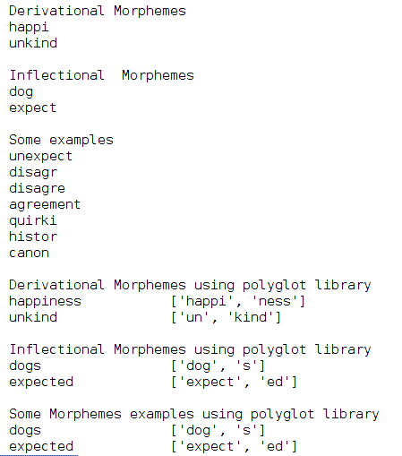

# 第三章：理解句子的结构

在这一章中，我们将探索 NLP 的基本概念。本章是最重要的一章，因为它有助于打下坚实的基础。

我们将涵盖以下主题，以帮助你更好地理解 NLP 的基本概念，这将有助于理解下一章：

+   理解 NLP 的组成部分

+   什么是无上下文文法？

+   形态学分析

+   词汇分析

+   句法分析

+   语义分析

+   处理歧义

+   语篇整合

+   语用分析

# 理解 NLP 的组成部分

NLP 有两个主要组成部分，我们将理解这两者。

# 自然语言理解

让我们了解自然语言理解：

+   **自然语言理解**（**NLU**）被认为是 NLP 的第一个组成部分

+   NLU 被认为是**人工智能**-**硬**（**AI**-**Hard**）问题或**人工智能**-**完全**（**AI-Complete**）问题

+   NLU 被认为是一个 AI-Hard 问题，因为我们正在尝试使计算机具备与人类一样的智能

+   NLU 很难，但现在，科技巨头和研究界正在改进传统的机器学习算法，并应用各种类型的深度神经网络，以帮助实现目标（计算机也可以具备处理**自然语言**（**NL**）的智能）

+   NLU 被定义为使用计算语言学工具将自然语言输入转化为有用表示的过程

+   NLU（自然语言理解）需要进行以下分析，将自然语言（NL）转化为有用的表示：

    +   形态学分析

    +   词汇分析

    +   句法分析

    +   语义分析

    +   处理歧义

    +   语篇整合

    +   语用分析

在本书中，我们将专注于 NLU，并开发一个基于 NLP 的系统，利用 NLU 表示。

# 自然语言生成

让我们了解一下**自然语言生成**（**NLG**）：

+   NLG 被认为是 NLP 的第二个组成部分。

+   NLG 被定义为机器生成自然语言输出的过程。

+   机器的输出应该是合乎逻辑的，意味着机器生成的任何自然语言（NL）都应该是合逻辑的。

+   为了生成逻辑输出，许多 NLG 系统使用基本事实或基于知识的表示。

+   举个例子，你有一个系统，可以就某个特定话题写一篇文章。如果我指示我的机器生成关于**牛**的话题的 100 个词，而我的机器生成了 100 个关于牛的话题的词，那么机器生成的输出（这里是关于牛的 100 个词）应该是有效的句子形式，所有句子都应该逻辑正确，且语境也应合理。

# NLU 与 NLG 的区别

在这一节中，我们将讨论 NLU 和 NLG 之间的区别：

| **NLU** | **NLG** |
| --- | --- |
| 该组件帮助解释自然语言背后的意义，无论是书面文本还是语音格式。我们可以分析英语、法语、西班牙语、印地语或任何其他人类语言。 | 该组件帮助使用机器生成自然语言。 |
| NLU 通过使用各种工具和技术，如词性标注器、解析器等，从自然语言中生成事实，以便开发 NLP 应用。 | NLG 从像词性标注、解析结果等事实开始生成自然语言。 |
| 它是阅读和解释语言的过程。 | 它是编写或生成语言的过程。 |

# NLP 的分支

自然语言处理（NLP）涉及两个主要分支，帮助我们开发 NLP 应用。一个是计算分支，即**计算机科学**分支，另一个是**语言学**分支。

参见*图 3.1*：

图 3.1：NLP 的分支

**语言学**分支专注于如何使用各种科学技术分析自然语言。因此，**语言学**分支进行形式、意义和上下文的科学分析。

所有语言学分析都可以借助计算机科学技术实现。我们可以使用这些分析结果，并将分析元素输入机器学习算法，进而构建 NLP 应用。在这里，机器学习算法属于**计算机科学**，而语言分析则属于**语言学**。

计算语言学是一个领域，帮助你理解计算机科学和语言学方法的结合。

以下是一些语言学概念的工具，它们通过计算机科学技术得以实现。这些工具通常用于开发 NLP 应用：

+   对于词性标注，使用词性标注器。著名的库有`nltk`和`pycorenlp`。

+   形态分析器用于生成单词级别的词干提取。为此，使用`nltk`和`polyglot`库。

+   解析器用于识别句子的结构。为此，我们使用 Stanford CoreNLP 和`nltk`来生成解析树。你也可以使用一个名为`spaCy`的 Python 包。

# 定义上下文无关文法

现在让我们关注自然语言理解（NLU），要理解它，首先我们需要理解**上下文无关文法**（**CFG**）以及它在自然语言理解中的应用。

上下文无关文法由四个主要组成部分定义。这四个组成部分在 CFG 的符号表示中有所展示：

+   一组非终结符号，**N**

+   一组终结符，**T**

+   一个起始符号，**S**，它是一个非终结符号

+   一组称为**生成规则**的**生产规则 P**，用于生成句子

让我们通过一个例子来更好地理解上下文无关文法的术语：

***X ->** *

这里，***X->** * 称为**短语结构规则**或**生成规则**，**P**。*X* ε *N*表示*X*属于非终结符号； ε {**N** 或 **T**} 表示  属于终结符号或非终结符号。*X*可以以  的形式进行重写。该规则告诉你哪个元素可以被重写以生成句子，以及这些元素的顺序。

现在我将以一个实际的 NLP 示例为例。我将使用 CFG 规则生成一个句子。我们将处理简单的句子结构，以便理解这些概念。

让我们思考一下。生成语法正确的英语句子所需的基本元素是什么？你记得吗？想一想！

我希望你记得，名词短语和动词短语是句子的关键元素。所以，从这里开始。我想生成以下句子：

他喜欢板球。

为了生成上面的句子，我提出了以下生成规则：

+   R1: S -> NP VP

+   R2: NP -> N

+   R3: NP -> Det N

+   R4: VP -> V NP

+   R5: VP -> V

+   R6: N -> Person Name | He | She | Boy | Girl | It | cricket | song | book

+   R7: V -> likes | reads | sings

请查看句子**He likes cricket**的语法分析树，见*图 3.2*：

图 3.2：使用生成规则的句子语法分析树

现在，让我们来了解一下我们是如何生成语法分析树的：

+   根据生成规则，我们可以看到**S**可以被重写为**名词短语**（**NP**）和**动词短语**（**VP**）的组合；参见规则*R1*。

+   **NP**可以进一步被重写为**名词**（**NN**）或**限定词**（**Det**）后接一个名词；参见规则*R2*和*R3*。

+   现在你可以将**VP**重写为**动词**（**V**）后接一个**NP**，或者**VP**可以被重写为仅为**V**；参见规则*R4*和*R5*。

+   这里，**N**可以被重写为**人名**、**He**、**She**等。**N**是一个终结符号；参见规则*R6*。

+   **V**可以通过使用规则*R7*右边的任一选项来重写。**V**也是一个终结符号。

通过使用所有规则，我们生成了*图 3.2*中的语法分析树。

如果你无法生成语法分析树，不要担心。我们将在第五章，*特征工程与 NLP 算法*中看到该概念和实现细节。

这里，我们看到的是一个非常基础且简单的上下文无关文法（CFG）示例。上下文无关文法也叫做**短语结构文法**。

# 练习

1.  使用本节中给出的规则生成一个语法分析树，并为以下句子生成语法分析树：

    她唱歌。

1.  生成生成规则并为以下句子制作语法分析树：

    那个男孩正在读一本书。

# 形态学分析

在这里，我们将探索形态学分析领域中使用的基本术语。这些术语和概念将帮助你在解决实际问题时提供帮助。

# 什么是形态学？

形态学是语言学的一个分支，研究词语如何被构造和形成。

# 什么是语素？

在语言学中，语素是某种语言中最小的有意义单位。形态学中最重要的部分是语素，它们是形态学的基本单元。

让我们举个例子。单词*boy*由一个语素组成，而*boys*由两个语素组成；一个是*boy*，另一个语素是*-s*

# 什么是词干？

词的部分，附加词缀附着在其上，叫做**词干**。单词*tie*是**根**，而*Untie*是**词干**。

现在，让我们来理解形态学分析。

# 什么是形态学分析？

形态学分析被定义为对词如何通过使用语素来构成的语法分析，语素是最小的意义单位。

通常，语素是词缀。这些词缀可以分为四种类型：

+   前缀，出现在词干之前，如**un**happy

+   后缀，出现在词干之后，如 happi**ness**

+   插入词缀，出现在词干内部，如 b**um**ili（这在菲律宾的塔加洛语中意味着购买）

+   环绕附加词缀称为环附缀。它附加在词干的开始和结尾。例如，**ka**baddang**an**（这在菲律宾的一种语言 Tuwali Ifugao 中意味着帮助）

形态学分析用于词汇切分，**词性**（**POS**）标注也使用这种分析。我将在*词法分析*部分解释 POS，请耐心等待，直到我们将这些点连接起来。

让我们举个例子来实际解释我提出的概念。我想以单词**Unexpected**为例。参考*图 3.3*，它向你展示了语素以及形态学分析是如何进行的：

图 3.3：语素与形态学分析

在*图 3.3*中，我们将**Unexpected**表示为语素，并对这些语素进行了形态学分析。在这里，**Un**是一个**前缀**，**ed**是一个**后缀**。**Un**和**ed**可以视为**词缀**，而**Unexpect**是**词干**。

让我们参考另一个重要的概念，并试着将它与语素的概念联系起来。我在说的是你如何定义一个词。让我们看看。

# 什么是词？

词可以从句子中分离出来，作为句子中带有意义的最小单元。这个最小的独立单元叫做**词**。

请再次参考语素的定义，并尝试将其与词的定义联系起来。我之所以让你这么做，是因为你可能会混淆词和语素，或者你可能不确定它们之间的区别。这种思考是完全可以理解的。如果你没有正确理解它们，它们确实会让人感到困惑。

定义看起来相似，但词和语素之间有非常小的区别。我们可以通过以下表格看到这些区别：

| **语素** | **词** |
| --- | --- |
| 语素可以独立存在，也可以不独立存在。*cat* 这个词可以独立存在，但复数标记 *-s* 不能独立存在。在这里，*cat* 和 *-s* 都是语素。 | 一个词可以独立存在。所以，词在句子中基本上是独立存在的单位。 |
| 当一个语素独立存在时，这个语素被称为**词根**，因为它传达了自身的意义，否则语素大多会附加词缀。语素会附加哪些词缀的分析属于形态学分析的范畴。 | 一个词可以由一个语素组成。 |
| 例如，*cat* 是一个独立的语素，但当你考虑 *cats* 时，后缀 *-s* 出现了，它传达了 *cat* 是一个语素的信息，并且后缀 *-s* 表示该语素是 *cat* 的复数形式。 | 例如：*Cat* 是一个独立的词。*Cats* 也是一个独立的词。 |

# 语素的分类

语素的分类为我们提供了有关形态学分析整体概念的很多信息。参见 *图 3.4*：

图 3.4：语素的分类

语素有两个主要部分。

# 自由语素

自由语素可以解释如下：

+   自由语素可以独立存在并作为一个词。它们也叫做**无绑定语素**或**独立语素**。

+   让我们看一些例子：

    +   Dog, cats, town 和 house。

    +   所有前面的词也可以与其他词一起使用。自由语素可以与其他词一起出现。这些词所传达的意义，如果单独看这些词时，会有所不同。

        +   让我们来看一些例子：

            +   Doghouse, town hall.

            +   在这里，doghouse 的含义不同于 dog 和 house 的单独含义。town hall 也是如此。

# 绑定语素

绑定语素通常需要附加词缀。它们进一步分为两类。

# 派生语素

派生语素是指当插入语素与词根结合时，改变了语义的意义。

现在，让我们看一些例子：

+   以 **unkind** 为例。在这个词中，**un** 是前缀，**kind** 是词根。前缀 **un** 作为一个派生语素，将 **kind** 的意思转变为相反的意思，即 unkind。

+   以 **happiness** 为例。在这个词中，-**ness** 是一个派生语素，**happy** 是词根。所以，-**ness** 将 happy 转变为 happiness。查看词性标签，**happy** 是形容词，**happiness** 是名词。在这里，表示词类的标签，如形容词和名词，被称为词性标签（POS）。

# 屈折语素

变形语素是加到词语上的后缀，用来赋予词语特定的语法属性。变形语素被视为语法标记，表示时态、数、词性等。因此，用更简单的语言来说，变形语素被认定为修改动词时态、体、语气、人称、数（单数和复数）、性别或格的语素，而不改变词语的意义或词性。

这里是一些示例：

+   在单词**dogs**中，-**s**改变了**dog**的数量。-**s**将**dog**从单数形式转换为复数形式。

+   单词**expected**包含-**ed**，这是一个变形语素，修改了动词的时态。

这是生成词干的代码，我们使用了 `nltk` 和 `polyglot` 库。你可以通过这个链接找到代码：[`github.com/jalajthanaki/NLPython/blob/master/ch3/3_1_wordsteam.py`](https://github.com/jalajthanaki/NLPython/blob/master/ch3/3_1_wordsteam.py)

参见*图 3.5*和*图 3.6*中的代码片段：

图 3.5：使用 NLTK 从语素生成词干

现在，让我们看看 `polyglot` 库是如何使用的，参考*图 3.6*：

图 3.6：使用 Polyglot 库从语素生成词干

代码片段的输出显示在*图 3.7*中：

图 3.7：图 3.5 和图 3.6 中代码片段的输出

# 词干和词根有什么区别？

这可以这样解释：

| **词干** | **词根** |
| --- | --- |
| 为了生成词干，我们需要去除词语中的附加成分 | 词根不能再进一步分解为更小的语素 |
| 从词干中，我们可以通过进一步分解生成词根 | 词干是通过词根加派生语素生成的 |
| 单词**Untie**是词干 | 单词**tie**是词根 |

# 练习

1.  对单词“redness”、“quickly”、“teacher”、“unhappy”和“disagreement”中的语素做形态学分析，像我们在*图 3.3*中做的那样。定义前缀、后缀、动词和词干。

1.  使用 `nltk` 和 `polyglot` 库生成“redness”，“quickly”，“teacher”，“disagreement”，“reduce”，“construction”，“deconstruction”和“deduce”的词干。

1.  生成“disagree”，“disagreement”，“historical”的词干和词根。

# 词法分析

词法分析定义为将文本分解为单词、短语和其他有意义的元素的过程。词法分析基于单词层面的分析。在这种分析中，我们还关注单词、短语和其他元素（如符号）的含义。

有时，词法分析也被宽泛地描述为**词元化过程**。因此，在讨论词元化之前，让我们先理解什么是词元以及什么是词性标记（POS 标签）。

# 什么是词元？

词元被定义为通过词汇分析技术生成的有意义的元素。

# 什么是词性标注？

词性是具有相似语法属性的单词或词汇项目的类别。属于同一**词性**（**POS**）类别的单词在句子的语法结构中具有相似的行为。

在英语中，词性（POS）包括动词、名词、形容词、副词、代词、介词、连词、感叹词，有时还包括数词、冠词或限定词。

# 词元派生过程

句子是由一连串单词组成的，从句子中我们需要派生出各个有意义的部分，这些部分叫做**词元**，派生词元的过程叫做**分词**：

+   从一段文本中派生词元的过程分为两个阶段。如果有很多段落，首先需要进行句子分词，然后是单词分词，并生成词元的意义。

+   分词和词形还原是对词汇分析有帮助的过程。使用`nltk`库，我们可以进行分词和词形还原。

+   分词可以定义为识别句子或单词的边界。

+   词形还原可以定义为一个过程，旨在识别句子中单词的正确词性和意义。

+   词形还原还包括词性标注，以消除词元的歧义。在这个过程中，上下文窗口可以是短语级别或句子级别。

你可以在 GitHub 链接找到代码：[`github.com/jalajthanaki/NLPython/tree/master/ch3`](https://github.com/jalajthanaki/NLPython/tree/master/ch3)

代码片段见*图 3.8*：

图 3.8：分词的代码片段

*图 3.8*中的代码输出见*图 3.9*：

图 3.9：分词和词形还原的输出

# 词干提取与词形还原的区别

词干提取和词形还原这两个概念都用于通过去除词缀并考虑其含义来规范化给定的单词。它们之间的主要区别如下：

| **词干提取** | **词形还原** |
| --- | --- |
| 词干提取通常在没有上下文知识的情况下处理单一单词 | 词形还原通常考虑单词及其在句子中的上下文 |
| 词干提取不考虑词性标签 | 词形还原考虑词性标签 |
| 词干提取用于将具有相似基本意义的单词归为一类 | 词形还原的概念用于构建字典或类似 WordNet 的词典。 |

# 应用

你一定在想，这种词汇分析是如何被用于开发 NLP 应用的。所以，在这里我们列出了一些使用词汇分析概念的 NLP 应用：

+   句子分词和停用词识别等词汇分析通常用于预处理。

+   词法分析也被用于开发词性标注器。词性标注器是一个为文本流生成词性标签的工具。

# 语法分析

我们已经在词法分析中看到过单词级分析。在这一节中，我们将从更高的层次来考虑问题。我们将重点关注句子的语法和结构，通过考虑句子中的短语。

现在，让我们定义语法分析，并看看它如何在自然语言处理应用中使用。

# 什么是语法分析？

语法分析被定义为分析告诉我们某些给定句子或句子部分的逻辑意义。我们还需要考虑语法规则，以定义句子的逻辑意义以及其正确性。

让我们举个例子：如果我考虑英语，并且有一个句子如**School go a boy**，这个句子在逻辑上无法传达其意义，而且语法结构不正确。所以，语法分析告诉我们给定的句子是否传达了其逻辑意义，是否语法正确。

语法分析是自然语言处理的一个成熟领域，涉及自然语言的语法。在语法分析中，使用语法规则来判断哪些句子是合法的。语法已经被应用于开发解析算法，以生成结构表示或解析树。

在这里，我将通过使用`nltk`和 Python 包装库`pycorenlp`（用于 Stanford CoreNLP）来生成解析树。请参考*图 3.10*和*图 3.11*中的代码片段，输出见*图 3.12*：

图 3.10：语法分析的代码片段

如何使用斯坦福解析器进行语法分析将在下一个*图 3.11*中展示：

图 3.11：语法分析的代码片段

你可以看到前面两个代码片段的输出，如下所示。参考*图 3.12*：

图 3.12：作为语法分析一部分的解析输出

我们将在第五章《特征工程与自然语言处理算法》中看到与解析工具及其开发周期相关的详细信息，*特征工程与自然语言处理算法*。

# 语义分析

语义分析基本上关注自然语言的意义。它的定义、各种元素及其应用将在本节中探讨。

现在让我们开始我们的语义之旅，如果你想在这个领域做一些有趣的研究，确实非常吸引人。

# 什么是语义分析？

语义分析是为自然语言的意义生成表示。你可能会想，如果词汇分析也专注于文本流中单词的意义，那么语义分析和词汇分析有什么区别呢？答案是，词汇分析基于更小的单元，它的重点是单词的意义，而语义分析则专注于更大的块。语义分析可以在短语级别、句子级别、段落级别，甚至有时在文档级别进行。语义分析可以分为两部分，如下所示：

+   对单个词语意义的研究称为**词汇语义学**

+   研究单个单词如何结合提供句子或段落的意义，涉及处理更大的自然语言单元的背景。

我想举个例子。如果你有一个句子，如**白宫很棒**，这可以意味着该陈述是关于美国白宫的背景，而也有可能是字面上在说附近的某个房子，其颜色是白色并且很棒。所以，理解句子的正确含义是语义分析的任务。

# 词汇语义学

词汇语义学包括单词、子词或子单元，如词缀，甚至复合词和短语。在这里，单词、子词等被称为**词汇项**。

词汇语义学研究包括以下几点：

+   词汇项的分类

+   词汇项的分解

+   不同词汇语义结构之间的差异和相似性

+   词汇语义学是词汇项之间、句子的意义与句法之间的关系。

让我们看看语义分析中涉及的各种元素。

# 下义词和下义词关系

下义词描述了一个通用术语与指定通用术语实例之间的关系。这里，通用术语叫做**上义词**，而通用术语的实例叫做**下义词**。

所以，color 是一个上义词；red、green、yellow 等是下义词。

# 同义词

同义词是具有相同句法或相同拼写或相同形式的单词，但它们的意义是不同的且彼此无关。

单词“bank”是一个经典的例子。它可以表示一个金融机构或河岸，等等。

# 多义词

为了理解多义词，我们重点关注句子中的单词。多义词是指具有不同但相关意义的词或短语。这类词也被称为词汇歧义词。

以单词“bank”为例。你可以考虑它的几种含义或意义。

+   Bank 是金融机构

+   Bank 可以被解释为河岸

# 多义词和同义词有什么区别？

如果一个词用于表达不同的意义，则称该词为**多义词**。该词的不同含义可能很明显。

如果两个或更多的单词具有相同的发音或相同的拼写，但没有相关的意义，则这些单词被称为**同义词**。

# 语义分析的应用

语义分析是一个开放的研究领域，因此它的基本概念可以被以下应用使用：

+   词义消歧是 NLP 中的一项主要任务，其中语义分析得到了广泛应用，并且它仍然是印度语言的一个开放研究领域。

+   我们将在 第七章 中看到 **词义消歧** (**WSD**) 的应用，*基于规则的 NLP 系统*。

+   word2vec 概念应运而生，用于处理语义相似性。我们将在第六章 *高级特征工程与 NLP 算法* 中进一步探讨这一点。

# 处理歧义

当我们进入语义分析时，可能会发现有许多情况对于 NLP 系统来说过于模糊，无法处理。在这些情况下，我们需要了解存在哪些类型的歧义，以及如何处理它们。

歧义是 NLP 和认知科学领域中的一个问题，尚未找到明确的解决方案。有时，句子过于复杂和模糊，只有说话者才能定义句子的原始或确定意义。

如果一个词、短语或句子有多重含义，那么它就是歧义的。如果我们考虑单词 **light**，它可以表示不重或不暗。这就是单词级别的歧义。短语 **porcelain egg container** 是结构级别的歧义。所以，在这里我们将看到 NLP 中的不同类型歧义。

首先，让我们看看歧义的类型，然后看看如何利用现有的手段来处理它们。请参考 *图 3.13* 了解不同类型的歧义：

图 3.13：歧义类型

# 词汇歧义

词汇歧义是单词级别的歧义。单个词根据其内部结构和句法类别可能具有模糊的含义。让我们看几个例子：

+   句子 1：看那些星星。这里，*look* 是一个动词。

+   句子 2：那个人给了他一个温暖的目光。这里，*look* 是一个名词。

+   句子 3：她赢得了三枚银牌。这里，*silver* 是一个名词。

+   句子 4：她发表了银质演讲。这里，*silver* 是一个形容词。

+   句子 5：他的压力使头发变白。这里，*silvered* 是一个动词。

在前面的例子中，特定的单词根据其在句子结构中的使用改变了词性标注。这种歧义可以通过以下两种方法来解决：

+   通过使用准确的词性标注工具，这种歧义可以得到解决。

+   WordNet 的词义包含了针对特定词性标注的多个场景，这也有助于处理歧义。

许多印度语言也存在词汇歧义的问题。

# 句法歧义

我们已经在句法分析中看到，单词序列是按语法结构组织的。词序列有多种解释方式，每种结构都有不同的解释。在句法歧义中，语法不明确，而不是单词级别的含义。以下是结构歧义的一个例子：

+   那个人看到了拿着望远镜的女孩。这里的歧义在于，不清楚是那个人看到了女孩（她拿着望远镜），还是那个人通过望远镜看到了女孩。这种歧义被称为**介词短语**（**PP**）歧义。

# 处理句法歧义的方法

为了处理这种歧义，我们需要使用统计方法，并获得最大的似然比。我们需要从一方面考虑动词与介词的共现，另一方面考虑介词与名词的共现，然后通过以下公式计算对数似然比：

图 3.14：对数似然比

这里，*p(p/v)* 是在动词 *v* 后看到带介词 *p* 的介词短语（PP）的概率。

并且 *p(p/n)* 是在名词 *n* 后看到带介词 *p* 的介词短语（PP）的概率。

如果 *F(v,p,n) < 0*，则需要将介词附加到名词上；如果 *F(v,p,n)* >0，则需要将介词附加到动词上。我们将在第五章中看到实现，*特征工程与自然语言处理算法*。

# 语义歧义

语义歧义发生在单词本身的意义可能被误解的情况下。以下是一个例子：

+   ABC 头部寻求武器

+   这里，单词“head”可以指“首席”或“身体部位”，同样，“arms”可以被解释为武器或身体部位。

+   这种歧义被视为语义歧义的一部分。

高准确度地处理语义歧义仍然是一个开放的研究领域。如今，word2vec 表示技术对处理语义歧义非常有用。

# 语用歧义

语用歧义发生在一个短语的上下文使其有多种不同解释的情况下。我们来看一个例子：

+   把它给那个女孩。这句话可能有多种解释。

现在让我们来看一个较大的上下文：

+   我有巧克力和一包饼干。把它给那个女孩。这里不清楚“它”是指巧克力还是那包饼干。

处理这种歧义仍然是一个开放的研究领域。

# 语篇整合

语篇整合与语用学密切相关。语篇整合被视为自然语言结构中任何较小部分的更大上下文。自然语言如此复杂，大多数情况下，文本的序列依赖于先前的语篇。

这个概念经常出现在语用歧义中。这一分析处理的是前一句话如何影响下一句话的意义和解释。在这里，语境可以在更大的上下文中进行分析，例如段落级别、文档级别等。

# 应用

语篇整合的概念已经被以下自然语言处理（NLP）应用使用：

+   这个概念经常在自然语言生成（NLG）应用中使用。

+   聊天机器人是为了实现通用人工智能而开发的。在这种应用中，深度学习已被广泛使用。我们将在第九章中看到基于深度学习的 NLG，*自然语言生成与深度学习问题*。

# 语用分析

语用分析处理的是外部世界知识，即文档和/或查询之外的知识。语用学分析关注的是对已描述内容的再解释，旨在从实际意义中提取语言的不同方面，这些方面需要依赖现实世界的知识。

让我们来看一个例子：

+   修剪树木是一个漫长的过程。

+   在这里，修剪树木是计算机科学算法技术中的一个概念。因此，**修剪**这个词与切割实际的物理树木无关，我们讨论的是计算机科学算法。这是一个模糊的情形；如何处理这种模糊情况也是一个开放的研究领域。大型科技公司使用深度学习技术进行语用分析，尝试生成句子的准确上下文，从而开发出高度精确的 NLP 应用。

# 摘要

本章探讨了语言学的基础知识，这些知识通常用于开发 NLP 应用。我们已经了解了与自然语言相关的各种分析方法，涵盖了单词层级分析和更大语境的分析。我们还区分了一些关键概念，以解决任何可能的混淆。在本章之后，你可以识别哪些语言学概念或工具对你更有吸引力，便于使用。研究人员如果想从事语言学、计算语言学或以 NLP 为主的计算机科学研究，可以发现潜在的研究领域。

在下一章中，我们将专注于实践和编码方面，开始开发 NLP 应用的旅程。下一章将讨论**数据预处理**，这是开发 NLP 应用的基本但重要的步骤。预处理包括我们在这里描述的一些概念，我们将结合标准的预处理方法来使用它们。
