# 第四章：预处理

从此处开始，我们的所有章节大多将包含代码。我想提醒所有读者在自己端运行并开发代码。让我们开始编程忍者之旅。

在本章中，我们将学习如何根据不同的 NLP 应用进行预处理。我们将学习以下主题：

+   处理语料库-原始文本

+   处理语料库-原始句子

+   基础预处理

+   实践和定制化预处理

# 处理语料库-原始文本

在本节中，我们将了解如何获取原始文本，在接下来的章节中，我们将对文本进行预处理并识别句子。

本节的过程见*图 4.1*：

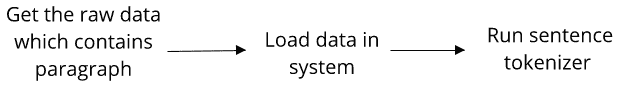

图 4.1：处理语料库-原始文本的过程

# 获取原始文本

在本节中，我们将使用三个来源来获取原始文本数据。

以下是数据来源：

+   原始文本文件

+   在脚本中以本地变量的形式定义原始数据文本

+   使用`nltk`提供的任何语料库

让我们开始：

+   原始文本文件访问：我在本地计算机上保存了一个`.txt`文件，文件中包含以段落形式呈现的文本数据。我希望读取该文件的内容，并将其作为下一步加载。我将运行一个句子分词器以提取其中的句子。

+   在脚本中以本地变量的形式定义原始数据文本：如果我们有少量数据，可以将数据分配给本地字符串变量。例如：**Text = 这是一个句子，这是另一个示例**。

+   使用`nltk`提供的语料库：我们可以从`nltk`导入可用的语料库，如`brown`语料库、`gutenberg`语料库等，并加载其内容。

我已定义了三个函数：

+   `fileread()`：此函数读取文件内容

+   `localtextvalue()`：此函数加载本地定义的文本

+   `readcorpus()`：此函数读取`gutenberg`语料库内容

请参阅*图 4.2*中给出的代码片段，其中描述了之前定义的三种情况：

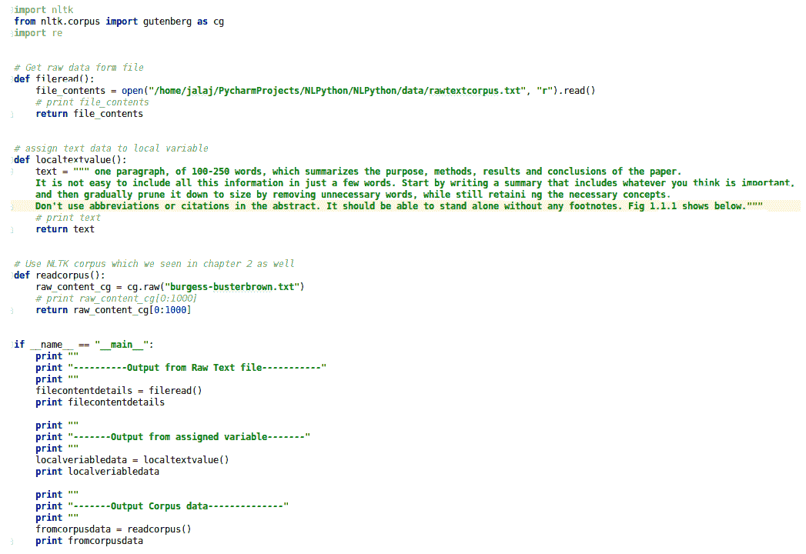

图 4.2：获取原始数据的各种方式

你可以通过点击 GitHub 链接找到代码：[`github.com/jalajthanaki/NLPython/blob/master/ch4/4_1_processrawtext.py`](https://github.com/jalajthanaki/NLPython/blob/master/ch4/4_1_processrawtext.py)

# 小写转换

将所有数据转换为小写有助于预处理过程，并且在 NLP 应用的后续阶段（例如解析时）也会有帮助。

因此，将文本转换为小写格式非常简单。你可以通过此 GitHub 链接找到代码：[`github.com/jalajthanaki/NLPython/blob/master/ch4/4_4_wordtokenization.py`](https://github.com/jalajthanaki/NLPython/blob/master/ch4/4_4_wordtokenization.py)

你可以在*图 4.3*中找到代码片段：

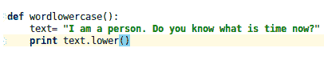

图 4.3：将数据转换为小写

前面代码片段的输出如下：

```py
----------converting data to lower case ---------- 
i am a person. do you know what is time now? 

```

# 句子分词

在原始文本数据中，数据是段落形式的。如果你想从段落中提取句子，那么就需要进行句子级别的标记化。

句子标记化是识别句子边界的过程。它也被称为**句子边界检测**、**句子分割**或**句子边界消歧义**。这个过程识别句子的起始和结束点。

一些专门的情况需要为句子标记化器定制规则。

以下是可用于执行句子标记化的开源工具：

+   OpenNLP

+   Stanford CoreNLP

+   GATE

+   nltk

这里我们使用的是`nltk`句子标记化器。

我们使用来自`nltk`的`sent_tokenize`并将其导入为`st`：

+   `sent_tokenize(rawtext)`：它接受一个原始数据字符串作为参数。

+   `st(filecontentdetails)`：这是我们自定义的原始数据，它作为输入参数提供。

你可以在这个 GitHub 链接上找到代码：[`github.com/jalajthanaki/NLPython/blob/master/ch4/4_1_processrawtext.py`](https://github.com/jalajthanaki/NLPython/blob/master/ch4/4_1_processrawtext.py)。

你可以在*图 4.4*中的以下代码片段中查看代码：

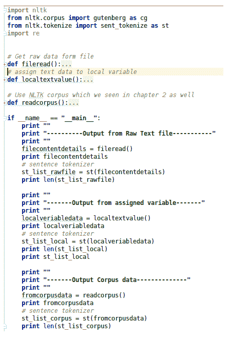

图 4.4：nltk 句子标记化器的代码片段

# 句子标记化的挑战

乍一看，你可能会问，从给定的原始文本中找出句子边界有什么大不了的？

句子标记化因语言而异。

当你需要处理以下情况时，事情变得复杂起来。我们将使用示例来解释这些情况：

+   如果句号后面跟着小写字母，则句子不应在句号后分割。以下是一个例子：

    +   句子：他完成了他的 Ph.D. 学位。他很高兴。

    +   在上面的例子中，句子标记化器应该在**degree**后分割句子，而不是在**Ph.D.**后分割。

+   如果句号后面跟着小写字母，则句子应在句号后进行分割。这是一个常见的错误。让我们来看一个例子：

    +   句子：这是一个苹果。一个苹果有益于健康。

    +   在上面的例子中，句子标记化器应该在**apple**后分割句子。

+   如果句子中有首字母缩写名，则句子不应在缩写后分割：

    +   句子：哈利·波特是由 J.K. Rowling 写的。它是一部有趣的作品。

    +   在上面的例子中，句子不应在**J.**后分割。理想情况下，它应在**Rowling**后分割。

+   Grammarly Inc.，语法纠正软件，为句子识别定制了一条规则，并实现了高准确度的句子边界检测。请参见博客链接：

    [`tech.grammarly.com/blog/posts/How-to-Split-Sentences.html`](https://tech.grammarly.com/blog/posts/How-to-Split-Sentences.html)。

为了克服之前的挑战，你可以采取以下方法，但每种方法的准确性取决于实现。这些方法如下：

+   你可以开发基于规则的系统来提高句子分词器的性能：

    +   对于前面的方法，你可以使用**命名实体识别**（**NER**）工具、词性标注器或解析器，然后分析所描述工具的输出，以及句子分词器的输出，并修正句子分词器出错的地方。在 NER 工具、词性标注器和解析器的帮助下，你能否修正句子分词器的错误输出？在这种情况下，编写规则，编写代码，检查输出是否符合预期。

    +   测试你的代码！你需要检查异常情况。你的代码表现如何？如果是，太棒了！如果不是，稍作修改：

        +   你可以通过使用**机器学习**（**ML**）或深度学习技术来改进句子分词器：

            +   如果你有足够的人工标注数据，那么你可以使用标注数据集训练模型。基于该训练模型，我们可以生成一个新的预测，来确定句子边界应该在哪里结束。

            +   在这种方法中，你需要检查模型的表现。

# 原始文本的词干提取

正如我们在第三章《理解句子结构》中看到的，*词干提取*是通过删除或替换后缀将句子中的每个单词转换为其词根形式的过程。

在本节中，我们将对原始文本应用`Stemmer`概念。

这里是代码，我们使用的是`nltk`中可用的`PorterStemmer`。请参见*图 4.5*：

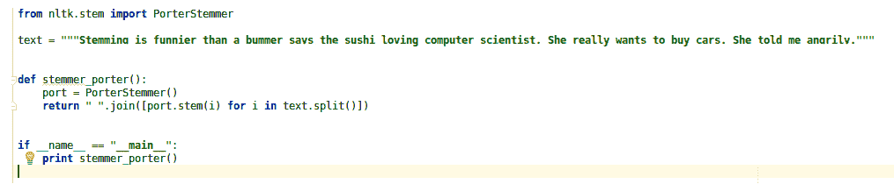

图 4.5：原始文本的 PorterStemmer 代码

前面代码的输出是：

```py
stem is funnier than a bummer say the sushi love comput scientist. she realli want to buy cars. she told me angrily. 

```

当你将前面的输出与原始文本进行比较时，我们可以看到以下变化：

```py
Stemming is funnier than a bummer says the sushi loving computer scientist. She really wants to buy cars. She told me angrily. 

```

如果你想看到差异，你可以参考高亮显示的单词来查看区别。

# 原始文本的词干提取挑战

最初，词干提取工具是为英语语言开发的。英语语言的词干提取工具准确度较高，但对于像乌尔都语和希伯来语这样的语言，词干提取工具的表现不佳。因此，开发适用于其他语言的词干提取工具是相当具有挑战性的。这仍然是一个开放的研究领域。

# 原始文本的词形还原

词形还原是一个过程，它识别句子中单词的正确词性（**part-of-speech**，**POS**）和意义。

在词形还原中，我们去除屈折词尾，将单词转换为其基本形式，该基本形式在字典或词汇表中存在。如果我们正确使用词汇表和原始文本中所有单词的形态学分析，那么我们可以获得较高的词形还原准确性。

词形还原通过使用标注字典（如 WordNet）将原始文本中的单词转换为其词元。

词形还原与词干提取密切相关。

在词形还原中，我们考虑词性标签，而在词干提取中，我们不考虑词性标签和单词的上下文。

让我们举几个例子来澄清这些概念。以下是这些句子：

+   句子 1：对你来说更好。

    +   句子 1 中有一个单词 **better**。因此，单词 **better** 的词形还原是 **good**，作为一个词元。但词干提取是缺失的，因为它需要查阅字典。

+   句子 2：人正在走路。

    +   单词 **walking** 来源于基本单词 walk，在这里，词干提取和词形还原是相同的。

+   句子 3：我们明天见面。

    +   这里，to meet 是基本形式。单词 **meeting** 来源于该基本形式。基本形式 meet 可以是名词，也可以是动词。所以这取决于上下文。词形还原尝试根据词性标签选择正确的词元。

+   请参阅 *图 4.6* 中的代码片段进行原始文本的词形还原：

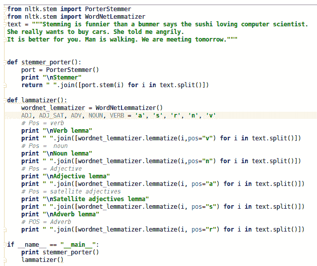

图 4.6：原始文本的词干提取和词形还原

前面代码的输出如下所示：

给定的输入是：

```py
text = """Stemming is funnier than a bummer says the sushi loving computer scientist.She really wants to buy cars. She told me angrily.It is better for you. Man is walking. We are meeting tomorrow.""" 

```

输出如下所示：

```py
Stemmer 
stem is funnier than a bummer say the sushi love comput scientist. she realli want to buy cars. she told me angrily. It is better for you. man is walking. We are meet tomorrow. 
Verb lemma 
Stemming be funnier than a bummer say the sushi love computer scientist. She really want to buy cars. She tell me angrily. It be better for you. Man be walking. We be meet tomorrow. 
Noun lemma 
Stemming is funnier than a bummer say the sushi loving computer scientist. She really want to buy cars. She told me angrily. It is better for you. Man is walking. We are meeting tomorrow. 
Adjective lemma 
Stemming is funny than a bummer says the sushi loving computer scientist. She really wants to buy cars. She told me angrily. It is good for you. Man is walking. We are meeting tomorrow. 
Satellite adjectives lemma 
Stemming is funny than a bummer says the sushi loving computer scientist. She really wants to buy cars. She told me angrily. It is good for you. Man is walking. We are meeting tomorrow. 
Adverb lemma 
Stemming is funnier than a bummer says the sushi loving computer scientist. She really wants to buy cars. She told me angrily. It is well for you. Man is walking. We are meeting tomorrow. 

```

在词形还原中，我们使用不同的词性标签（POS 标签）。其缩写说明如下：

+   `v` 代表动词

+   `n` 代表名词

+   `a` 代表形容词

+   `s` 代表卫星形容词

+   `r` 代表副词

你可以看到，在 `lemmatizer()` 函数内，我已经使用了所有描述过的词性标签。

你可以从 GitHub 链接下载代码：[`github.com/jalajthanaki/NLPython/blob/master/ch4/4_2_rawtext_Stemmers.py`](https://github.com/jalajthanaki/NLPython/blob/master/ch4/4_2_rawtext_Stemmers.py)。

# 词形还原原始文本的挑战

词形还原使用像 WordNet 这样的标注字典。通常，这是一个人工标注的字典。因此，制作不同语言的 WordNet 所需的人工努力和时间是具有挑战性的。

# 停用词移除

停用词移除是一些 NLP 应用程序（如情感分析、文本摘要等）的重要预处理步骤。

移除停用词以及常见词的移除是一个基础但重要的步骤。以下是将要移除的停用词列表。此列表已从 `nltk` 生成。请参阅图 4.7 中的代码片段：

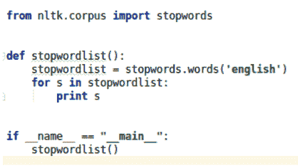

图 4.7：查看英语停用词列表的代码

前面代码的输出是 `nltk` 中可用的停用词列表，参见 *图 4.8*：

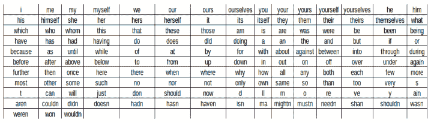

图 4.8：英语停用词列表的 nltk 输出

`nltk` 提供了现成的英语停用词列表。你也可以根据正在开发的 NLP 应用程序自定义要移除的单词。

你可以在 *图 4.9* 中看到移除自定义停用词的代码片段：

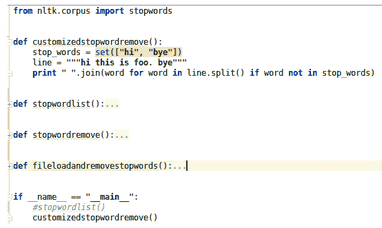

图 4.9：移除自定义停用词

图 4.9 中代码的输出如下：

```py
this is foo. 

```

图 4.10 中的代码片段执行从原始文本中实际移除停用词的操作，该原始文本是英语文本：

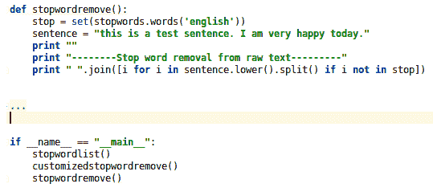

图 4.10：从原始文本中去除停用词

上述代码片段的输出如下：

```py
Input raw sentence: ""this is a test sentence. I am very happy today."" 
--------Stop word removal from raw text--------- 
test sentence. happy today. 

```

# 练习

以一个位于数据文件夹中名为`rawtextcorpus.txt`的文件为例，打开文件并以读取模式加载内容，然后使用 nltk 停用词列表去除停用词。请分析输出结果，以更好地理解其工作原理。

直到这一节，我们一直在分析原始文本。下一节，我们将进行句子级别和单词级别的预处理。

# 处理语料库原始句子

在上一节中，我们处理了原始文本，并探讨了句子级别的概念。在这一节中，我们将讨论在单词级别上进行标记化、词形还原等相关概念。

# 单词标记化

单词标记化定义为将一段文本切割成单词、短语和有意义的字符串的过程。这个过程叫做**单词标记化**。该过程的输出是经过标记化后得到的单词，这些被称为**标记（token）**。

让我们看看*图 4.11*中的单词标记化代码片段：

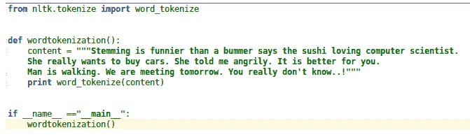

图 4.11：单词标记化代码片段

*图 4.11*中的代码输出如下：

单词标记化的输入为：

```py
Stemming is funnier than a bummer says the sushi loving computer scientist.She really wants to buy cars. She told me angrily. It is better for you.Man is walking. We are meeting tomorrow. You really don''t know..! 

```

单词标记化的输出为：

```py
[''Stemming'', ''is'', ''funnier'', ''than'', ''a'', ''bummer'', ''says'', ''the'', ''sushi'', ''loving'', ''computer'', ''scientist'', ''.'', ''She'', ''really'', ''wants'', ''to'', ''buy'', ''cars'', ''.'', ''She'', ''told'', ''me'', ''angrily'', ''.'', ''It'', ''is'', ''better'', ''for'', ''you'', ''.'', ''Man'', ''is'', ''walking'', ''.'', ''We'', ''are'', ''meeting'', ''tomorrow'', ''.'', ''You'', ''really'', ''do'', ""n''t"", ''know..'', ''!''] 

```

# 单词标记化的挑战

如果你分析前面的输出，你会发现单词`don't`被标记化为`do, n't know`。使用`nltk`的`word_tokenize`处理这类单词是相当麻烦的。

为了解决上述问题，你可以编写例外代码并提高准确性。你需要编写模式匹配规则，这些规则解决了定义的挑战，但它们是高度定制化的，并且在不同的应用中有所不同。

另一个挑战涉及一些语言，如乌尔都语、希伯来语、阿拉伯语等。它们在确定单词边界和从句子中找出有意义的标记方面相当困难。

# 单词词形还原

单词词形还原是我们在第一部分定义的相同概念。我们将快速回顾一下它，然后在单词级别实现词形还原。

单词词形还原是将一个单词从其屈折形式转换为其基本形式。在单词词形还原中，我们会考虑词性标签（POS），根据词性标签，我们可以得出在词汇库 WordNet 中可用的基本形式。

你可以在*图 4.12*中找到代码片段：

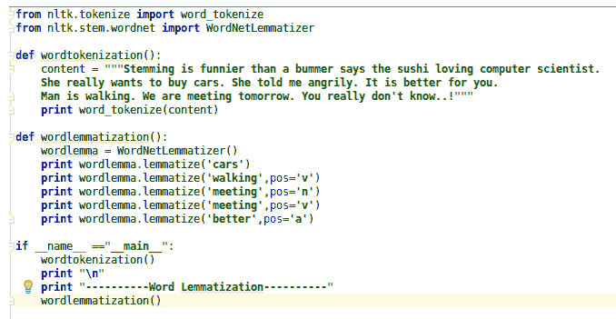

图 4.12：单词词形还原代码片段

单词词形还原的输出如下：

```py
Input is: wordlemma.lemmatize(''cars'')  Output is: car 
Input is: wordlemma.lemmatize(''walking'',pos=''v'') Output is: walk 
Input is: wordlemma.lemmatize(''meeting'',pos=''n'') Output is: meeting 
Input is: wordlemma.lemmatize(''meeting'',pos=''v'') Output is: meet 
Input is: wordlemma.lemmatize(''better'',pos=''a'') Output is: good 

```

# 单词词形还原的挑战

构建词汇字典是一个耗时的过程。如果你想要构建一个可以考虑更大上下文的词形还原工具，考虑前文的上下文，那么这个问题仍然是研究中的一个开放领域。

# 基本预处理

在基本预处理过程中，我们包括了一些简单且易于编码的内容，但当我们为 NLP 应用进行预处理时，它们会引起我们的注意。

# 正则表达式

现在我们将开始一些有趣的预处理概念，这些概念最为有用。我们将看看一些更高级的正则表达式应用。

对于初学正则表达式的人，我想解释一下**正则表达式**（**regex**）的基本概念。

正则表达式有助于从字符序列中查找或查找替换特定模式。当你编写正则表达式时，需要遵循特定的语法。

有许多在线工具可以为你提供开发和测试正则表达式的功能。我最喜欢的在线正则表达式开发工具链接如下：[`regex101.com/`](https://regex101.com/)

你也可以参考 Python 正则表达式库的文档：[`docs.python.org/2/library/re.html`](https://docs.python.org/2/library/re.html)

# 基础级别正则表达式

正则表达式是一个强大的工具，当你需要进行自定义预处理或当你有嘈杂数据时非常有用。

在这里，我展示了一些基本的语法，然后我们将看到在 Python 中的实际实现。在 Python 中，`re`库是可用的，使用这个库我们可以实现正则表达式。你可以在这个 GitHub 链接找到代码：[`github.com/jalajthanaki/NLPython/blob/master/ch4/4_5_regualrexpression.py`](https://github.com/jalajthanaki/NLPython/blob/master/ch4/4_5_regualrexpression.py)

# 基本标志

基本标志有`I`、`L`、`M`、`S`、`U`、`X`：

+   `re.I`：这个标志用于忽略大小写

+   `re.M`：如果你想在多行中查找模式，这个标志很有用

+   `re.L`：这个标志用于查找本地依赖

+   `re.S`：这个标志用于查找点符号匹配

+   `re.U`：这个标志用于处理 unicode 数据

+   `re.X`：这个标志用于以更易读的格式编写正则表达式

我们主要使用了`re.I`、`re.M`、`re.L`和`re.U`标志。

我们正在使用`re.match()`和`re.search()`函数。它们都用于查找模式，然后你可以根据应用的需求进行处理。

让我们来看看`re.match()`和`re.search()`之间的区别：

+   `re.match()`：它仅检查字符串开头是否存在匹配项。如果在输入字符串的开头找到模式，它会返回匹配的模式，否则返回`None`。

+   `re.search()`：它检查字符串中的任何位置是否存在匹配项。它会查找给定输入字符串或数据中模式的所有出现。

请参考*图 4.13*中给出的代码片段：

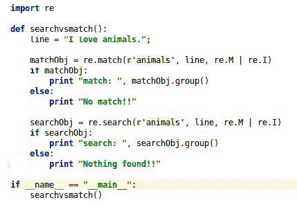

图 4.13：代码片段，用于查看`re.match()`与`re.search()`的区别

*图 4.13*中的代码片段输出在*图 4.14*中给出：

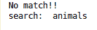

图 4.14：re.match() 与 re.search() 的输出

语法如下：

查找字符`a`和`b`的单次出现：

```py
Regex: [ab] 

```

查找除`a`和`b`之外的字符：

```py
Regex: [^ab] 

```

查找`a`到`z`的字符范围：

```py
Regex: [a-z] 

```

查找除`z`之外的范围：

```py
Regex: [^a-z] 

```

查找所有字符`a`到`z`以及`A`到`Z`：

```py
Regex: [a-zA-Z] 

```

任意单个字符：

```py
Regex: . 

```

任意空白字符：

```py
Regex: \s 

```

任意非空白字符：

```py
Regex: \S 

```

任意数字字符：

```py
Regex: \d 

```

任意非数字字符：

```py
Regex: \D 

```

任意非单词字符：

```py
Regex: \W 

```

任意单词：

```py
Regex: \w 

```

匹配`a`或`b`：

```py
Regex: (a|b) 

```

`a`的出现次数为零次或一次：

```py
Regex: a? ; ? Matches  zero or one occurrence not more than 1 occurrence 

```

`a`的出现次数为零次或更多：

```py
Regex: a* ; * matches zero or more than that 

```

`a`的出现次数为一次或更多：

```py
Regex: a+ ; + matches occurrences one or more that one time 

```

精确匹配三次出现的`a`：

```py
Regex: a{3} 

```

同时匹配`a`的出现次数为`3`次或更多：

```py
Regex: a{3,} 

```

同时匹配`a`的出现次数在`3`到`6`之间：

```py
Regex: a{3,6} 

```

字符串的开始：

```py
Regex: ^ 

```

字符串的结束：

```py
Regex: $ 

```

匹配单词边界：

```py
Regex: \b 

```

非单词边界：

```py
Regex: \B 

```

基本代码片段见*图 4.15*：

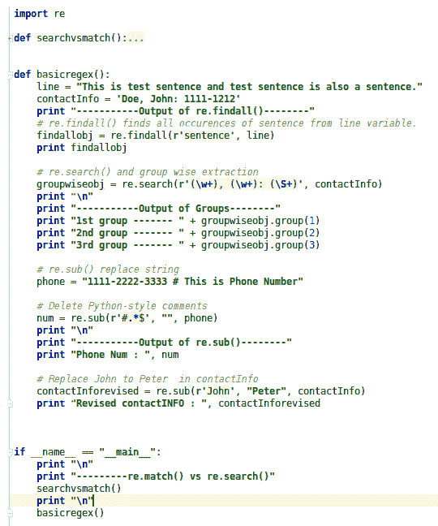

图 4.15：基本正则表达式函数代码片段

*图 4.15*的代码片段输出见*图 4.16*：

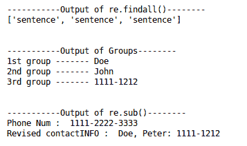

图 4.16：基本正则表达式函数代码片段的输出

# 高级正则表达式

有一些正则表达式的高级概念将会非常有用。

**前瞻**和**后瞻**用于从数据中查找子串模式。让我们开始。我们将用基础语言理解这些概念。然后我们会看它们的实现。

# 正向前瞻

正向前瞻会在字符串中匹配子串，前提是定义的模式被该子串所跟随。如果您不理解，那么让我们看一下以下示例：

+   考虑句子：I play on the playground.

+   现在，您希望提取*play*作为模式，但仅当它跟随*ground*时。在这种情况下，您可以使用正向前瞻。

正向前瞻的语法是`(?=pattern)`

正则表达式`rplay(?=ground)`匹配*play*，但仅当它后面跟着*ground*时才匹配。因此，文本中的第一个*play*不会被匹配。

# 正向后瞻

正向后瞻会在字符串中匹配子串，前提是定义的模式被该子串所前置。参考以下示例：

+   考虑句子：I play on the playground. It is the best ground.

+   现在您希望提取*ground*，如果它前面有字符串*play*。在这种情况下，您可以使用正向后瞻。

正向后瞻的语法是`(?<=pattern)`

正则表达式`r(?<=play)ground`匹配*ground*，但仅当它前面有*play*时才匹配。

# 负向前瞻

负向前瞻匹配的是那些后面绝对不会跟着我们在正则表达式中定义的模式的字符串。

让我们举个例子来理解负向前瞻：

+   考虑句子：I play on the playground. It is the best ground.

+   现在您希望提取*play*，仅当它后面没有字符串*ground*时。在这种情况下，您可以使用负向前瞻。

负向前瞻的语法是`(?!pattern)`

正则表达式`r play(?!ground)`匹配*play*，但仅当其后不是*ground*时才匹配。因此，*play*紧跟*on*时会被匹配。

# 否定前瞻

否定前瞻匹配的字符串是明确没有被我们在正则表达式中定义的模式所预先出现的字符串。

让我们看一个例子来理解否定前瞻：

+   考虑这个句子：I play on the playground. It is the best ground.

+   现在你只想提取*ground*，但仅当其前面没有*play*字符串时。在这种情况下，你可以使用否定前瞻。

否定前瞻的语法是`(?<!pattern)`

正则表达式`r(?<!play)ground`匹配*ground*，但仅当其前面没有*play*时。

你可以看到代码片段，这是`advanceregex()`在*图 4.17*中的实现：

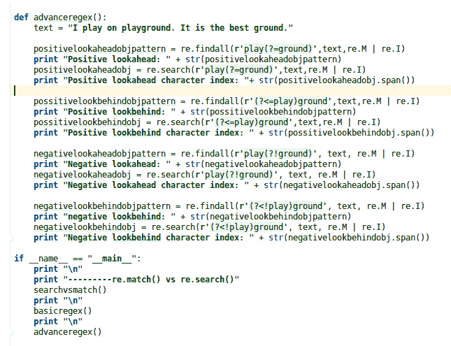

图 4.17：高级正则表达式代码片段

*图 4.17*的代码片段输出在*图 4.18*中给出：

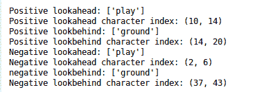

图 4.18：高级正则表达式代码片段的输出

# 实践中的定制化预处理

当我们开始为 NLP 应用程序进行预处理时，有时你需要根据自己的 NLP 应用程序做一些定制。那时，可能需要考虑我在下面描述的一些要点。

# 自己决定

本节讨论了当你不知道开发 NLP 应用程序需要什么样的预处理时，如何进行预处理。在这种情况下，你可以做的是向自己提出以下问题并做出决策。

你的 NLP 应用程序是什么？你需要什么样的数据来构建这个 NLP 应用程序？

+   一旦你理解了问题陈述，并且清楚了输出应该是什么，那么你就处于一个很好的位置。

+   一旦你了解了问题陈述和预期输出，接下来就思考一下，你需要从原始数据集中提取哪些数据点。

+   为了理解前面提到的两点，让我们举个例子。如果你想做一个文本摘要应用程序，假设你正在使用网络上的新闻文章，你想用这些文章来构建新闻文本摘要应用程序。现在，你已经建立了一个抓取器，从网络上抓取新闻文章。这些原始新闻文章数据集可能包含 HTML 标签、长文本等。

对于新闻文本摘要，我们如何进行预处理？为了回答这个问题，我们需要问自己几个问题。所以，让我们来看看一些关于预处理的问题。

# 是否需要进行预处理？

+   现在你有了用于文本摘要的原始数据，并且你的数据集包含 HTML 标签、重复的文本等。

+   如果你的原始数据包含我在第一点中描述的所有内容，那么就需要进行预处理，在这种情况下，我们需要删除 HTML 标签和重复的句子；否则，不需要预处理。

+   你还需要应用小写字母规则。

+   之后，你需要在你的文本摘要数据集上应用句子标记器。

+   最后，你需要在你的文本摘要数据集上应用词汇标记器。

+   是否需要预处理你的数据集，取决于你的问题陈述和原始数据集所包含的数据。

你可以在*图 4.19*中看到流程图：

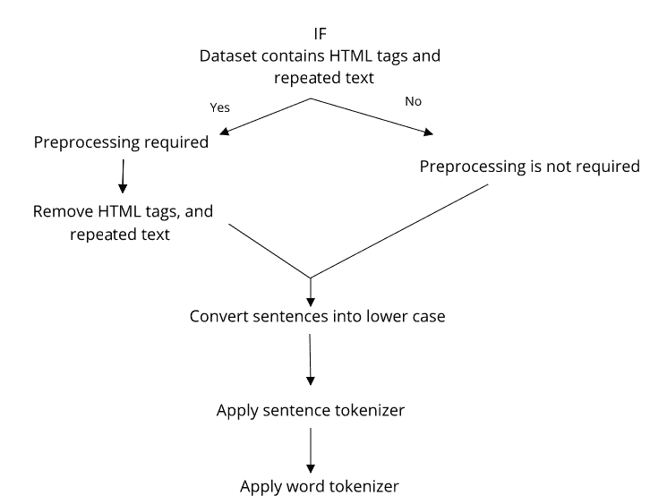

图 4.19：文本摘要预处理的基本流程图

# 需要什么样的预处理？

在我们关于文本摘要的示例中，如果原始数据集包含 HTML 标签、长文本、重复文本，那么在你开发应用程序的过程中，以及在输出中，你不需要以下数据：

+   你不需要 HTML 标签，因此你可以将其删除。

+   你不需要重复的句子，所以你也可以将它们删除。

+   如果文本内容较长，并且你能找到停用词和高频小词，那么你应该将它们删除。

# 理解预处理的案例研究

我在这里解释的关于定制预处理的内容，当你有一些真实案例研究时，会对你更有意义。

# 语法纠错系统

+   你正在建立一个语法纠错系统。现在，考虑它的子任务。你想建立一个系统，预测在特定句子中冠词 a、an 和 the 的位置。

+   对于这种类型的系统，如果你认为每次都需要去除停用词，那么，哎呀，你错了，因为这次我们真的不能盲目地删除所有停用词。最终，我们需要预测冠词 a、an 和 the。

+   你可以删除完全没有意义的词，例如当数据集中包含数学符号时，你可以将其删除。但这时，你需要进行详细分析，判断是否能删除短小的词汇，比如缩写，因为你的系统还需要预测哪些缩写不带冠词，哪些带冠词。

现在，让我们看看一个可以应用我们在这里描述的所有预处理技术的系统。让我们按照情感分析中的要点进行操作。

# 情感分析

情感分析的核心是评估客户的评价，并将其分类为正面、负面和中性类别：

+   对于这种类型的系统，你的数据集包含用户评价，因此用户的写作通常包含日常语言。

+   数据包含非正式语言，因此我们需要去除停用词，例如 Hi、Hey、Hello 等。我们不会通过 Hi、Hey、How are u? 来判断用户评价是正面、负面还是中性。

+   除此之外，你还可以去除重复的评论。

+   你还可以通过使用词汇标记化和词形还原来预处理数据。

# 机器翻译

机器翻译也是一种广泛使用的 NLP 应用。在机器翻译中，我们的目标是以逻辑的方式将一种语言翻译成另一种语言。所以，如果我们想将英语翻译成德语，那么你可以应用以下预处理步骤：

1.  我们可以将整个数据集转换为小写字母。

1.  对数据集应用句子分割器，这样你可以获取每个句子的边界。

1.  现在，假设你有一个语料库，其中所有的英文句子都在`English_Sentence_File`中，所有的德文句子都在`German_Sentence_File`中。现在，你知道每个英文句子都有一个对应的德文句子存在于`German_Sentence_File`中。这种类型的语料库被称为**平行**语料库。所以，在这种情况下，你还需要检查这两个文件中的所有句子是否对齐。

1.  你还可以对每个句子的单词应用词干提取。

# 拼写纠正

拼写纠正也是一种非常有用的预处理工具，它有助于改善你的 NLP 应用。

# 方法

拼写纠正的概念来源于两个字符串之间的相似性。这一概念用于比较两个字符串。现在这个概念已经广泛应用。我们将考虑一些示例，以更好地理解如何利用这个检查字符串相似性的概念来帮助我们。

当你在谷歌搜索时，如果你的搜索查询中有拼写错误，浏览器会给你一个建议，显示“Did you mean:”，并显示你纠正后的查询和正确的拼写。这个机制可以纠正你的拼写错误，谷歌也有自己的一套方法，每次几乎都能提供完美的结果。谷歌不仅仅做拼写纠正，它还会对你提交的查询进行索引，并展示最适合的结果。所以，拼写纠正背后的概念是两个字符串之间的相似性。

再举一个例子：如果你正在开发一个机器翻译系统，当你看到机器翻译的字符串时，你的下一步可能是验证你的输出。所以现在你将把机器的输出与人工翻译进行比较，而这种情况可能与机器的输出并不完全相同。

如果机器翻译的字符串是：**She said could she help me?**，那么人工翻译的字符串可能是：**She asked could she help me?** 当你检查系统翻译字符串与人工翻译字符串的相似性时，你可能会发现*said*被替换成了 asked。

因此，两个字符串相似性的概念可以应用于许多应用，包括语音识别、自然语言处理（NLP）应用等等。

当我们讨论衡量两个字符串的相似度时，有三种主要操作：插入、删除和替换。这些操作用于拼写修正操作的实现。现在，为了避免复杂性，我们不考虑转置和长字符串编辑操作。

我们从操作开始，然后将具体讨论拼写修正的算法。

**插入操作**

如果你有一个不正确的字符串，现在通过插入一个或多个字符，你将得到正确的字符串或预期的字符串。

让我们看一个例子。

如果我输入了字符串`aple`，那么在插入`p`之后我们会得到`apple`，这是正确的。如果你输入了字符串`staemnt`，那么在插入`t`和`e`之后你会得到`statement`，这是正确的。

**删除操作**

你可能有一个不正确的字符串，可以通过删除一个或多个字符来将其转换为正确的字符串。

下面是一个例子：

如果我输入了`caroot`，那么为了得到正确的字符串，我们需要删除一个`o`。之后，我们会得到正确的字符串`carrot`。

**替换操作**

如果你通过替换一个或多个字符得到正确的字符串，那就叫做**替换操作**。

假设你有一个字符串`implemantation`。要使其正确，你需要将第一个`a`替换为`e`，这样你就会得到正确的字符串`implementation`。

**拼写修正算法**

我们正在使用最小编辑距离算法来理解拼写修正。

**最小编辑距离**

这个算法是将一个字符串`X`转换为另一个字符串`Y`，我们需要找出将字符串`X`转换为字符串`Y`的最小编辑成本。因此，你可以进行插入、删除或替换操作，将字符串`X`转化为字符串`Y`，并用最少的字符编辑序列实现。

假设你有一个长度为`n`的字符串`X`，和一个长度为`m`的字符串`Y`。

按照算法的步骤进行：

```py
Input: Two String, X and Y  
Output: cheapest possible sequences of the character edits for converting string from X to Y. D( i , j ) = minimum distance cost for converting X string to Y  

```

让我们看一下以下步骤：

1.  设置`n`为 P 的长度。

    设置`m`为 Q 的长度。

1.  如果`n = 0`，返回`m`并退出。

    如果`m = 0`，返回`n`并退出。

1.  创建一个包含 0 到`m`行和 0 到`n`列的矩阵。

1.  初始化第一行为 0 到`n`。

    初始化第一列为 0 到`m`。

1.  遍历 P 的每个字符（`i` 从 1 到 `n`）。

    遍历 Q 的每个字符（`j` 从 1 到 `m`）。

1.  如果 P[i]等于 Q[j]，则成本为 0。

    如果 Q[i]不等于 Q[j]，则成本为 1。

设置矩阵中单元格`v[i,j]`的值为以下三点的最小值：

1.  紧挨上面的单元格加 1：`v[i-1,j] + 1`

1.  紧挨左侧的单元格加 1：`v[i,j-1] + 1`

1.  对于最小编辑距离，单元格对角线前一个加上成本：`v[i-1,j-1] +1`。如果你使用的是 Levenshtein 距离，则应考虑`v[i-1,j-1] +` 成本。

1.  在 *步骤 7* 到 *步骤 9* 的迭代完成后，距离值存储在单元格 `v[n,m]` 中。

之前的步骤是开发拼写校正逻辑的基本算法，但我们还可以使用单词的概率分布并考虑这一点。这种算法方法基于动态规划。

让我们通过理解需要删除 `u`，将字符串 `tutour` 转换为 `tutor`。因此，编辑距离为 1。由定义的算法生成的表格用于计算最小编辑距离，如 *图 4.20* 所示：

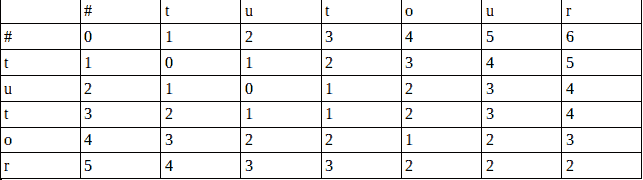

图 4.20：计算最小编辑距离

**实现**

现在，对于拼写校正，我们需要添加一个字典或从大文档中提取单词。因此，在实现中，我们使用了一个大文档，并从中提取了单词。除此之外，我们还使用了文档中单词出现的概率来了解分布情况。您可以通过点击此链接查看有关实现部分的更多详细信息：[`norvig.com/spell-correct.html`](http://norvig.com/spell-correct.html)

我们已经实现了最小编辑距离 2 的拼写校正。

请参见 *图 4.21* 中的拼写校正实现：

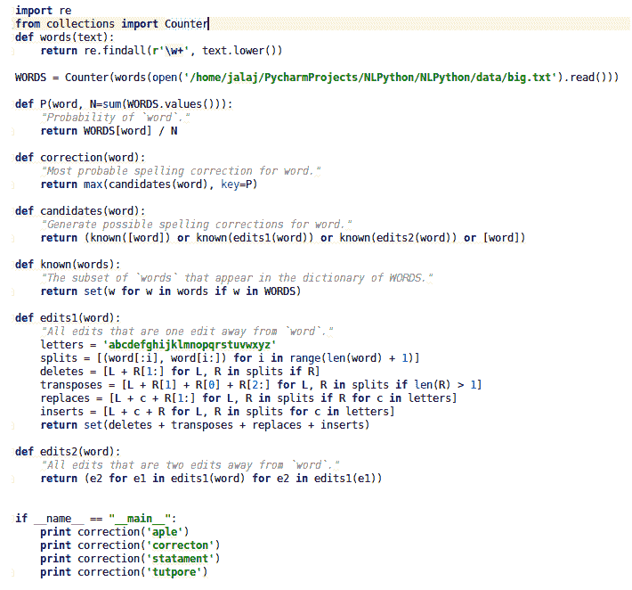

图 4.21：拼写校正的实现

请参见 *图 4.22* 中拼写校正的输出。

我们提供了字符串 `aple`，它成功地转换为 `apple`：

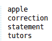

图 4.22：拼写校正的输出

# 摘要

在本章中，我们介绍了各种预处理技术，这些技术在您开发 NLP 系统或 NLP 应用程序时会非常有用。我们还提到了一个拼写校正系统，您可以将其视为预处理技术的一部分，因为它对未来开发的许多 NLP 应用程序都很有帮助。顺便说一下，您可以通过点击以下链接访问 GitHub 上的代码：[`github.com/jalajthanaki/NLPython/tree/master/ch4`](https://github.com/jalajthanaki/NLPython/tree/master/ch4)

在下一章，我们将讨论任何 NLP 系统中最重要的部分：特征工程。NLP 系统的性能主要取决于我们提供给系统的数据类型。特征工程是一项艺术和技能，您将在下一章开始时掌握它。相信我，它是开发 NLP 系统中最重要的组成部分，因此请好好阅读，并将其付诸实践以丰富您的技能。
