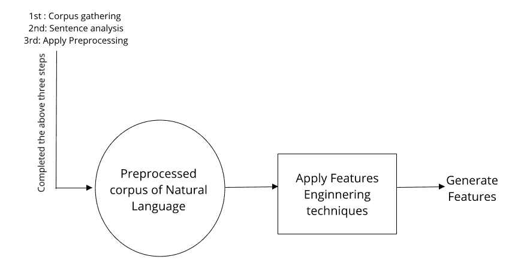
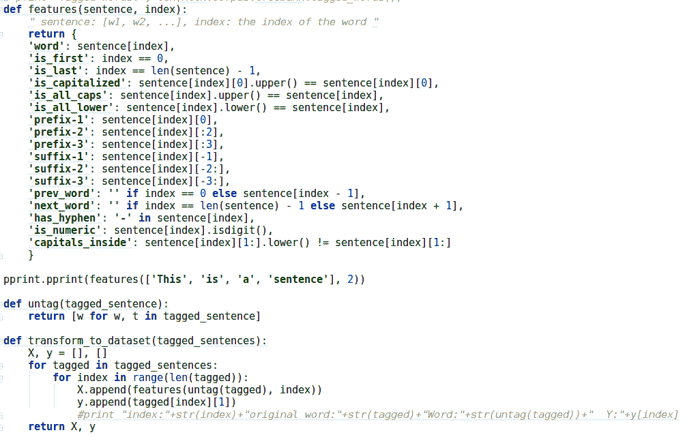
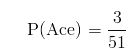

# 第五章：特征工程与 NLP 算法

特征工程是开发 NLP 应用中最重要的部分。特征是**机器学习**（**ML**）算法的输入参数。这些 ML 算法会根据输入特征生成输出。特征工程是一种艺术和技能，因为它生成最佳的特征，选择最合适的算法来开发 NLP 应用需要大量的努力，并且需要理解特征工程、NLP 和 ML 算法。在第二章，*语料库和数据集的实用理解*中，我们看到数据是如何收集的，以及数据或语料库的不同格式是什么。在第三章，*理解句子结构*中，我们讨论了一些 NLP 和语言学的基础但重要的方面。我们将在本章中使用这些概念来导出特征。在第四章，*预处理*中，我们介绍了预处理技术。现在，我们将处理我们已经预处理过的语料库，并从中生成特征。

参考*图 5.1*，这将帮助你理解到目前为止我们所覆盖的所有阶段，以及本章的所有重点：



图 5.1：特征生成过程概览

你可以参考第一章中的*图 1.4*，*介绍部分*。我们在前面的三章中已经覆盖了前四个阶段。

在本章中，我们将主要关注 NLP 应用的实践方面。我们将涵盖以下主题：

+   什么是特征工程？

+   理解 NLP 的基本特征

+   NLP 的基本统计特征

此外，我们还将探讨如何开发各种工具或库来生成特征，哪些库是我们可以使用的，以及在需要时如何调整开源库或开源工具。

我们还将探讨每个概念的挑战。在这里，我们不会从零开始开发工具，因为这超出了本书的范围，但我们会带你了解开发这些工具所使用的过程和算法。所以，如果你想尝试构建定制化工具，这将对你有所帮助，并且会让你了解如何处理这类问题陈述。

# 理解特征工程

在深入特征生成技术之前，我们需要理解特征工程及其目的。

# 什么是特征工程？

特征工程是从原始数据或语料库中生成或导出特征（现象的属性或可衡量的单独特性）的过程，这些特征将帮助我们开发 NLP 应用或解决 NLP 相关问题。

特征可以定义为在构建 NLP 应用程序或预测 NLP 应用程序输出时有用的信息或可衡量的属性。

我们将使用机器学习（ML）技术来处理自然语言，并开发模型以提供最终输出。这个模型被称为**机器学习模型**（**ML 模型**）。我们将为机器学习算法提供特征作为输入，以生成机器学习模型。之后，我们将使用生成的机器学习模型为自然语言处理（NLP）应用程序生成适当的输出。

如果你在想哪些信息可以成为特征，那么答案是：任何属性都可以成为特征，只要它在生成一个能够准确有效地产生 NLP 应用程序输出的优秀机器学习模型时是有用的。在这里，你的输入特征完全取决于你的数据集和 NLP 应用程序。

特征是利用领域知识为 NLP 应用程序推导出的。这也是为什么我们要探索自然语言的基本语言学方面，以便能够在特征工程中使用这些概念。

# 特征工程的目的是什么？

在本节中，我们将查看有助于我们理解特征工程的主要特征：

+   我们有的是计算机无法理解的自然语言原始数据，算法也没有能力接受这些原始自然语言并生成 NLP 应用程序所期望的输出。当你使用机器学习技术开发 NLP 应用程序时，特征起着至关重要的作用。

+   我们需要生成那些能代表我们的语料库的属性，并且能够被机器学习算法理解的属性。机器学习算法只能理解特征的语言进行沟通，而提出适当的属性或特征是一项重要任务。这就是特征工程的全部目的。

+   一旦我们生成了特征，就需要将其作为输入传递给机器学习算法，经过处理这些输入特征后，我们将得到机器学习模型。这个机器学习模型将用于预测或生成新的特征输出。机器学习模型的准确性和效率主要依赖于特征，这也是为什么我们说特征工程是一种艺术和技能。

# 挑战

以下是特征工程中涉及的挑战：

+   提出好的特征是困难的，有时是复杂的。

+   在生成特征后，我们需要决定应该选择哪些特征，这些特征的选择在我们进行机器学习技术时也起着重要作用。选择适当特征的过程被称为**特征选择**。

+   有时，在特征选择过程中，我们需要剔除一些不太重要的特征，这些特征的剔除也是特征工程中的一个关键部分。

+   手动特征工程非常耗时。

+   特征工程需要领域专业知识，或者至少需要一些基础的领域知识。

# NLP 的基本特征

除了挑战之外，NLP 应用程序在很大程度上依赖于基于各种 NLP 概念手工制作的特征。从现在开始，我们将探讨 NLP 领域中可用的基本特征。让我们深入了解吧！

# 解析器和解析

通过解析句子，你可以推导出一些对几乎所有 NLP 应用都非常重要的特征。

我们将探讨解析器和解析的概念。稍后，我们将理解**上下文无关文法**（**CFG**）和**概率上下文无关文法**（**PCFG**）。我们将了解统计解析器是如何开发的。如果你想创建自己的解析器，我们会解释如何进行，或者如果你想调整现有的解析器，我们也会告诉你应该遵循哪些步骤。我们还将使用现有的解析工具进行实际操作。稍后我们将在同一章节中讨论遇到的挑战。

# 理解解析器的基础

在这里，我将从 NLP 领域的角度解释解析器。解析器的概念也出现在其他计算机科学领域，但我们将聚焦于 NLP 领域，开始理解解析器及其能为我们做什么。

在 NLP 领域，解析器是一个程序，或者更具体地说，是一个工具，它接受以句子或一系列标记的形式呈现的自然语言。它将输入流拆分成更小的部分。这有助于我们理解流中每个元素的句法作用以及句子的基本语法层次含义。在 NLP 中，解析器实际上是使用上下文无关文法或概率上下文无关文法的规则来分析句子的。我们在第三章中已经介绍了 CFG，*理解句子的结构*。

解析器通常生成解析树或抽象语法树形式的输出。我们将在这里看一些解析树的例子。解析器使用某些文法规则生成包含单词或词汇项的解析树。

请参见*图 5.2*中的文法规则：


图 5.2：解析器的文法规则

让我们先讨论一下符号：

+   `S` 代表句子

+   **NP** 代表名词短语

+   **VP** 代表动词短语

+   `V` 代表动词

+   `N` 代表名词

+   **ART** 代表冠词 a、an 或 the

请参见使用*图 5.3*中的文法规则生成的解析树：


图 5.3：根据图 5.2 中定义的文法规则生成的解析树

在*图 5.3*中，我们将句子转换为解析树格式，正如你所见，句子的每个单词都通过我们在*图 5.2*中定义的文法符号表示。

解析器主要有两种类型。我们不会深入探讨每种解析器的技术细节，因为它更多涉及到编译器设计方面。相反，我们将探索不同类型的解析器，以便你能清楚地了解在自然语言处理（NLP）中我们通常使用哪种解析器。请参阅*图 5.4*：


图 5.4：解析器类型

在接下来的章节中，我们还将比较自顶向下解析器和自底向上解析器之间的区别，因为这种区别与过程相关，接下来将介绍每种解析器，以便我们理解它们之间的不同。

让我们深入了解解析的概念。

# 理解解析的概念

首先，我们来讨论什么是解析。我们来定义一下“解析”这个术语。解析是一个形式化分析过程，利用句子或符号流，并借助定义的正式语法规则，我们可以理解句子的结构和含义。所以，解析使用句子中的每一个单词，并通过构成结构来确定其结构。什么是构成结构呢？构成结构是基于观察哪些单词与其他单词结合形成合理的句子单位。在英语中，主语通常位于句子的开头；句子**He is Tom**对我们来说是有意义的，而句子**is Tom he**则没有意义。通过解析，我们实际上是检查并尝试获得一个合理的构成结构。以下是解析器和解析为我们所做的几点说明：

+   解析器工具根据语法规则执行解析过程，并生成一个解析树。这个解析树结构用于验证句子的句法结构。如果句子的解析树遵循语法规则并生成一个有意义的句子，那么我们就说该语法以及使用该语法生成的句子是有效的。

+   在解析的最后，生成一个解析树作为输出，它将帮助你检测句子中的歧义，因为歧义句子往往会产生多个解析树。

让我们来看看自顶向下解析器和自底向上解析器之间的区别：

| **自顶向下解析** | **自底向上解析** |
| --- | --- |
| 自顶向下解析是由假设驱动的。 | 自底向上解析是由数据驱动的。 |
| 在每个解析阶段，解析器假设一个结构，并按顺序从句子中取出一个单词，测试该单词或符号是否符合假设。 | 在这种解析方法中，首先从输入字符串中取出单词，然后解析器检查是否存在任何预定义的类别，以生成有效的句子结构，最后尝试将它们组合成语法中可接受的结构。 |
| 它以从左到右的方式扫描句子。当语法生成规则推导出词汇项时，解析器通常会检查输入，以查看是否正在推导出正确的句子。 | 这种解析通常从终结符的输入字符串开始。这种类型的解析会查找工作字符串的子字符串，因为如果任何字符串或子字符串与语法的右侧生成规则匹配，它就会用匹配的右侧规则替换左侧非终结符。 |
| 它包括回溯机制。当确定使用了错误的规则时，它会回退并尝试另一个规则。 | 它通常不包括回溯机制。 |

你将在接下来的章节中了解这个解析器是如何构建的。

# 从零开始开发一个解析器

在本节中，我们将尝试理解最著名的斯坦福解析器的过程，以及开发最成功的统计解析器时使用了哪些算法。

为了了解最终的过程，我们需要首先理解一些构建块和概念。然后，我们将结合所有这些概念，理解构建统计解析器（如斯坦福解析器）的整体过程。

# 语法的类型

在本节中，我们将看到两种语法类型，这些语法类型将帮助我们理解解析器如何工作的概念。作为先决条件，我们将简单地解释它们，避免过于深入地探讨该主题。我们会尽量简化它们，并探讨一些基本直觉，以帮助理解开发解析器的过程。开始吧！

有两种语法类型。你可以参考*图 5.5*：

+   上下文无关文法

+   概率上下文无关文法


图 5.5：语法的类型

# 上下文无关文法

我们在第三章《理解句子结构》中已经看过上下文无关文法的基本概念。我们已经看过 CFG 的正式定义，可以稍微回忆一下。现在，我们将了解在构建解析器时，语法规则有多么重要。

CFG 也被称为短语结构语法。所以，CFG 和短语结构语法是两个术语，但指代同一个概念。现在，让我们看一些与这种语法类型相关的例子，然后讨论为了生成更自然的语法规则形式所遵循的约定。参考*图 5.6*中的语法规则、词汇和句子：


图 5.6：CFG 规则、词汇和句子

在这里，`S` 是语法的起点。**NP** 代表名词短语，**VP** 代表动词短语。现在我们将应用自上而下的解析法，从右侧非终结符 `S` 的规则开始，并用 **NP** 和 **VP** 替代 `S`。接着，用 `N` 替代 **NP**，用 `V` 和 **NP** 替代 **VP**，然后用 people 替代 `N`。将 `V` 替代为 **fish**，**NP** 替代为 `N`，并将 `N` 替代为 **tank**。你可以在*图 5.7* 中看到这一过程的示意图：


图 5.7：由给定语法生成的一个句子的解析树表示

现在，试着为第二个句子自己生成一个解析树。如果你玩一下这个语法规则，你很快就会发现它是一个非常模糊的规则。除此之外，我们还将讨论语言学家用来推导句子结构的更实际的上下文无关文法（CFG）。这是一种更自然的 CFG 形式，非常类似于 CFG 的正式定义，唯一的不同之处是，我们在这种语法中定义了预终结符符号。如果你参考*图 5.7*，你会看到像 **N, V** 这样的符号被称为**预终结符号**。现在，看看*图 5.8* 中自然形式的 CFG 定义：


图 5.8：更自然形式的 CFG 的正式表示

这里，*****符号表示空序列的存在。我们从 `S` 符号开始，但在统计解析器中，我们增加了一个额外的阶段，即 TOP 或 ROOT。因此，当我们生成解析树时，最顶层的主节点由 `S` 表示。更多信息请参见*图 5.7*。现在，我们将在 `S` 之前加上一个带有 ROOT 或 TOP 符号的额外节点。

你可能注意到在*图 5.6* 中有一个奇怪的规则。**NP** 可以使用 `e` 进行替代，`e` 代表空字符串。让我们来看看这个空字符串规则的用途。我们将首先通过一个例子来详细了解这种语法和空字符串规则的作用。我们将从预终结符的概念开始，因为这对你来说可能是新的。以英语中的名词短语为例——任何包含限定词（如 a、an 或 the）以及名词本身的短语。当你将 **NP** 替代为符号 **DT** 和 **NN** 时，你进入了实际的词汇终结符；而当我们将 **NP** 替代为 **DT** 和 **NN** 时，这被称为预终结符符号。现在，让我们谈谈空字符串规则。我们引入这个规则是因为在实际生活中，你会遇到许多句子缺失部分的情况。为了处理这些情况，我们在语法中加入了这个空字符串规则。接下来，我们将给你一个例子，帮助你理解。

我们已经看到了词序列**people fish tank**。从中，你可以提取出两个短语：一个是**fish tank**，另一个是**people fish**。在这两个例子中，都缺少名词。我们将这些短语表示为**e fish tank**和**people fish e**。这里，`e`代表空字符串。你会注意到，在第一个短语中，短语的开头缺少一个名词；更准确地说，缺少的是主语。在第二个例子中，短语的末尾缺少一个名词；更准确地说，缺少的是宾语。这类情况在处理真实的**自然语言**（**NL**）数据时非常常见。

还有一件事我们需要描述，这将在**语法转换**主题中用到。请参考*图 5.6*，你将看到相关规则。在阅读时，请继续参考这些语法规则。右侧只有空字符串的规则被称为**空规则**。你可以看到有些规则的右侧和左侧都有一个符号，它们被称为**一元规则**，因为你可以将一个类别转换为另一个类别，例如**NP -> N**。还有一些规则，它们的右侧有两个符号，比如**VP -> V NP**。这些规则被称为**二元规则**。另外，也有一些规则，它们的右侧有三个符号；我们会应用一些技巧来去除右侧有超过两个符号的规则。我们将很快讨论这些。

现在我们已经看过了 CFG 以及理解它所需的概念。你将在接下来的章节中将这些知识串联起来。现在是时候进入下一部分，它将让你对概率 CFG 有个更清晰的了解。

# 概率上下文无关语法

在概率语法中，我们加入了概率的概念。别担心——这是我们到目前为止看到的最简单的上下文无关语法（CFG）扩展。接下来，我们将看一下**概率上下文无关语法**（**PCFG**）。

让我们正式定义概率上下文无关语法（PCFG），然后探讨它的另一个方面。请参考*图 5.9*：


图 5.9：PCFG 的正式定义

在这里，`T`、`N`、`S` 和 `R` 与 CFG 类似；唯一的新内容是概率函数，所以让我们在这里看看，概率函数接受每个语法规则，并给出每个规则的概率值。这个概率映射为一个实数，`R`。`R`的范围是[0,1]。我们并不是盲目地取任意的概率值。我们设定了一个约束，规定任何非终结符的概率总和应该等于 1。让我们看一个例子来理解这些内容。你可以在*图 5.10*中看到带有概率的语法规则：


图 5.10：语法规则的概率

你可以在*图 5.11*中看到带有概率的词汇语法规则：


图 5.11：词汇规则的概率

如你所见，*图 5.10* 中有三个 NP 规则，如果你看一下概率分布，你会注意到以下几点：

+   它的概率相加为 1（0.1 + 0.2 + 0.7 = 1.0）

+   可能 NP 会进一步重写为名词，因为它的概率是 0.7

同样，你可以看到，句子开头的第一个规则值为 1.0，这是由于某个先发生的事件。如果你仔细观察，你会注意到我们去除了空字符串规则，以使我们的语法更少歧义。

那么，我们如何使用这些概率值呢？这个问题引导我们进入计算树和字符串概率的描述。

# 计算树的概率

如果我们要计算一棵树的概率，那是相当简单的，因为你只需要将词汇和语法规则的概率值相乘。这将给我们树的概率。

让我们看一个例子来理解这个计算。这里，我们将选择两棵树和为其生成的句子，**people fish tank with rods**。

请参阅 *图 5.12* 和 *图 5.13* 中的树结构及其相应的概率值，然后再计算每棵树的概率：


图 5.12：解析树

如果我们想要计算图 *5.12* 中给出的解析树的概率，获取该概率的步骤如下所示。我们从树的顶部开始扫描，所以我们的字符串点是 `S`，解析树的最顶端节点。在这里，介词修饰动词：

*P(t1)* = 1.0 * 0.7 * 0.4 * 0.5 * 0.6 * 0.7 * 1.0 * 0.2 * 1.0 * 0.7 * 0.1 = 0.0008232

0.0008232 是树的概率。现在，你可以为另一个解析树（如图 *5.13* 所示）计算相同的概率。在这个解析树中，介词修饰名词。计算这个解析树的树概率：


图 5.13：第二棵解析树

如果你计算解析树的概率，值应该是 0.00024696。

现在让我们来看看使用树的概率概念计算字符串概率。

# 计算字符串的概率

相比于计算树的概率，计算字符串的概率要复杂得多。在这里，我们想要计算由词组成的字符串的概率，为此我们需要考虑所有可能生成该字符串的树结构。我们首先需要考虑所有包含该字符串的树，然后通过将不同的概率值加在一起，计算最终的概率值。

让我们重新审视一下我们用来计算树概率的*图 5.12*和*图 5.13*。现在，为了计算字符串的概率，我们需要同时考虑树和树的概率，然后将其加起来。按照以下步骤计算字符串的概率：

*P(S) = P(t1) +P(t2)*

*= 0.0008232 + 0.00024696*

*= 0.00107016*

这里，*t1* 树有很高的概率，所以比起附有**NP**的 *t2*，更可能生成附有**VP**的句子结构。原因在于，*t1* 有一个带有*0.4*的**VP**节点，而 *t2* 有两个节点，一个是**VP**，其概率为*0.6*，另一个是**NP**，其概率为*0.2*。当你将这两个概率相乘时，你得到*0.12*，这比*0.4*小。所以，*t1* 解析树是最有可能的结构。

现在你应该理解了不同类型的语法。接下来，是时候探索语法转换的概念，以提高解析效率了。

# 语法转换

语法转换是一种使语法更加限制的技术，从而提高解析过程的效率。我们将使用**查姆斯基范式**（**CNF**）来转换语法规则。在看一个例子之前，让我们先探讨一下 CNF。

让我们先看看 CNF。它说明所有规则应遵循以下规则：

*X-> Y Z* 或 *X-> w* 其中 *X, Y, Z* 属于 N，`w` 属于 T

这个规则的意思非常简单。任何语法规则的右侧不能有超过两个非终结符；你可以包括那些右侧只有一个终结符的规则。为了将现有的语法转化为 CNF（查姆斯基范式），你可以遵循以下基本步骤：

+   空规则和单一规则可以通过递归函数去除。

+   `N`元规则通过在语法规则中引入新的非终结符来划分。这适用于右侧有两个以上非终结符的规则。当你使用 CNF 时，你可以通过新的转换规则得到相同的字符串，但它的解析结构可能会有所不同。应用 CNF 后生成的新语法仍然是 CFG（上下文无关文法）。

让我们看一个直观的例子。我们采用之前在*图 5.6*中定义的语法规则，并应用 CNF 来转换这些语法规则。让我们开始吧。请看以下步骤：

1.  我们首先去除空规则。当右侧有**NP**时，你可以有两个规则，例如**S -> NP VP**，而当你为**NP**设置空值时，你会得到**S -> VP**。通过递归应用这种方法，你将去除语法中的空规则。

1.  然后，我们必须尝试去除单一规则。因此，在这种情况下，如果你尝试去除第一个单一规则**S -> VP**，那么你需要考虑所有左边是**VP**的规则。当你这样做时，你需要引入新规则，因为`S`将立即转到**VP**。我们将引入规则**S -> V NP**。你需要继续这样做，直到去除所有的单一规则。当你去掉所有的单一规则，如**S -> V**，你还需要改变词汇项。

请参考*图 5.14*，了解 CNF 过程：


图 5.14：CNF 步骤 1 到 5

你可以在*图 5.15*中看到 CNF 过程的最终结果。


图 5.15：步骤 6 - 应用 CNF 后的最终语法规则

在现实生活中，并不一定需要应用完整的 CNF（范式），而且这样做往往会相当痛苦。它只是让解析更高效，使你的语法规则更简洁。在实际应用中，我们保留单一规则作为语法规则，因为它们告诉我们一个词是作为动词还是名词使用，以及非终结符号信息，这意味着我们拥有词性标签（POS）的信息。

够了，够了，别再讲那些无聊的概念部分了。现在是时候将所有解析器和解析的基本概念结合起来，学习开发解析器所用的算法了。

# 使用 Cocke-Kasami-Younger 算法开发解析器

对于英语语言，有许多你可以使用的解析器，若要为其他语言构建解析器，可以使用**Cocke-Kasami-Younger**（**CKY**）算法。在这里，我们将看看一些对你开发解析器有帮助的信息。我们还将看看 CKY 算法的主要逻辑。

我们需要在开始算法之前，先了解我们所考虑的假设。我们的技术假设是，在这里，每个解析器子树都是独立的。这意味着，如果我们有一个树节点 NP，那么我们只关注这个 NP 节点，而不是它派生出来的节点；每个子树都是独立作用的。CKY 算法可以在立方时间内给出结果。

现在让我们来看一下 CKY 算法的逻辑。该算法从句子中提取单词，并尝试使用自下而上的解析方法生成解析树。在这里，我们将定义一个被称为**解析三角形**或**图表**的数据结构。参见*图 5.16*：


图 5.16：CKY 算法的解析三角形

它的底部单元格表示单个单词，如**fish**、**people**、**fish**和**tanks**。中间行的单元格表示重叠的单词对，如**Fish people**、**People fish**和**fish tanks**。第三行表示没有重叠的两个单词的对，如**Fish people**和**fish tanks**。最后一行表示句子的顶部或根节点。为了理解这个算法，我们首先需要语法规则的规则概率。为了理解算法，我们应该参考*图 5.17*：


图 5.17：理解 CKY 算法（图片来源：http://spark-public.s3.amazonaws.com/nlp/slides/Parsing-Probabilistic.pdf 第 36 页）

如*图 5.17*所示，为了解释算法逻辑，我们已将基本概率值输入到最底部的单元格中。在这里，我们需要找到所有符合语法规则的组合。按照给定的步骤继续操作：

1.  我们首先从“people”单元格中取**NP**，从“fish”单元格中取**VP**。在语法规则中，检查是否有任何语法规则包含序列**NP VP**，你需要在语法规则的右侧找到这个序列。在这里，我们发现规则是**S -> NP VP**，概率为 0.9。

1.  现在，计算概率值，为此你需要将**NP**在“people”单元格中的概率值、**VP**在“fish”单元格中的概率值以及语法规则本身的概率值相乘。因此，**NP**在“people”单元格中的概率值*=* 0.35，**VP**在“fish”单元格中的概率值*=* 0.06，语法规则**S -> NP VP**的概率值*=* 0.9。

1.  然后，我们将 0.35（**NP**在“people”单元格中的概率）* 0.06（**VP**在“fish”单元格中的概率）* 0.9（语法规则**S -> NP VP**的概率）相乘。因此，最终的乘积值*= 0.35 * 0.06 * 0.9 = 0.0189*。*0.0189*是我们将`S`扩展为**NP VP**语法规则时的最终概率。

1.  同样的方式，你可以计算其他组合，如**NP**来自“people”单元格和**NP**来自“fish”单元格，并找到语法规则，即右侧的**NP NP**。在这里，存在**NP - NP NP**规则。因此，我们计算概率值，*0.35 * 0.14 * 0.2 = 0.0098*。我们继续这个过程，直到为所有组合生成概率值，然后我们可以看到哪一个组合生成了最大概率。找到最大概率的过程称为**Viterbi 最大得分**。

1.  对于组合**S -> NP VP**，当单元格生成其向上的非终结符时，我们将获得最大概率。因此，这两个单元格生成`S`，即句子。

这是 CKY 算法的核心逻辑。我们来看一个具体的例子来说明这个概念。为了便于书写，我们将解析三角形顺时针旋转 90 度。参见 *图 5.18*：


图 5.18：CKY 算法的第一步（图片来源：http://spark-public.s3.amazonaws.com）

在这里，*单元格 (0,1)* 用于 **fish**，并通过词汇规则进行填充。我们为 `N` -> **fish** 赋予 *0.2* 的概率，因为这是我们语法规则中定义的内容。我们为 **V -> fish** 赋予 *0.6* 的概率。现在我们专注于一些只有 `N` 或 `V` 在右侧的单一规则。我们需要通过考虑语法规则的概率和词汇概率来计算概率。因此，对于规则 **NP -> N**，概率是 *0.7*，而 **N -> fish** 的概率是 *0.2*。我们需要将这些值相乘，得到语法规则 **NP -> N** 的概率 *= 0.14*。同样，我们为规则 **VP -> V** 计算概率，结果是 *0.1 * 0.6 = 0.6*。这样，你需要填充所有四个单元格。

在下一个阶段，我们遵循相同的过程，计算从语法规则生成的每个组合的概率。参见 *图 5.19*：


图 5.19：CKY 算法的第二阶段（图片来源：http://spark-public.s3.amazonaws.com）

在 *图 5.20* 中，你可以看到最终的概率值，使用这些概率值，你可以为给定数据选择最佳的解析树：


图 5.20：CKY 算法的最终阶段（图片来源：http://spark-public.s3.amazonaws.com）

现在你知道了如何生成解析树，我们想与您分享一些关于斯坦福解析器的重要信息。它是基于这个 CKY 算法构建的。斯坦福解析器应用了一些技术假设和改进，但以下是用于构建解析器的核心技术。

# 分步开发解析器

在这里，我们将介绍构建你自己解析器的步骤，并借助 CKY 算法来完成。让我们开始总结：

1.  你应该已经标注了带有人类注释的解析树的语料库：如果它是按照 Penn Treebank 注释格式标注的，那么你就可以继续了。

1.  使用这个标注过的解析语料库，你可以推导出语法规则，并为每个语法规则生成概率。

1.  你应该应用 CNF 进行语法转换。

1.  使用具有概率的语法规则，并将其应用于大型语料库；使用带有 Viterbi 最大分数的 CKY 算法来获得最可能的解析结构。如果你提供了大量数据，那么可以使用 ML 学习技术，将此问题视为一个多类分类问题。最后阶段是根据概率值得到给定数据的最佳解析树。

理论讲解到此为止；现在让我们实际使用一些著名的现有分析工具，并查看你能从解析树中生成哪些特征。

# 现有的分析器工具

在这一部分中，我们将看一下现有的一些分析器，并讨论如何生成一些可以用于机器学习算法或基于规则的系统中的酷特征。

在这里，我们将看到两个分析器：

+   斯坦福分析器

+   spaCy 分析器

# 斯坦福分析器

让我们从斯坦福分析器开始。你可以从[`stanfordnlp.github.io/CoreNLP/`](https://stanfordnlp.github.io/CoreNLP/)下载它。下载后，你只需将其解压到你喜欢的任何位置。运行斯坦福分析器的前提是你应该在系统中安装了 Java 运行环境。现在，你需要执行以下命令来启动斯坦福分析器服务：

```py
    $ cd stanford-corenlp-full-2016-10-31/
    $ java -mx4g -cp "*"        edu.stanford.nlp.pipeline.StanfordCoreNLPServer

```

在这里，你可以将内存从`-mx4g`更改为`-mx3g`。

在完全专注于编码部分之前，我们先来看一下分析器中的依赖关系概念。

分析器中的依赖结构显示了句子中哪些词依赖于其他词。在句子中，一些词修饰其他词的含义；另一方面，有些词作为其他词的论元。所有这些关系都通过依赖来描述。在斯坦福分析器中有几种依赖关系，我们将逐一讲解。我们来举个例子，一边讲解一边进行。

句子是：The boy put the tortoise on the rug.

对于这个给定的句子，句子的**中心词**是*put*，它修饰了三个部分：*boy*、*tortoise*和*on the rug*。如何找到句子的中心词？通过以下问题来找出答案：

+   谁把它放下的？你会得到答案：*boy*

+   然后，他放下的是什么东西？你会得到答案：*tortoise*

+   它被放在哪里？你会得到答案：*on the rug*

所以，单词**put**修饰了三样东西。现在看看单词*boy*，检查它是否有任何修饰词。是的，它有一个修饰词：**the**。接着，检查*the tortoise*是否有修饰词。是的，它有一个修饰词：**the**。对于短语*on the rug*，*on*是对*rug*的补充，而*rug*是这个短语的中心词，接受修饰词*the*。参考*图 5.21*：


图 5.21：句子的依赖结构

斯坦福解析器有诸如`nsubjpass`（被动名词主语）、`auxpass`（被动助动词）、`prep`（介词修饰语）、`pobj`（介词宾语）、`conj`（连接词）等依赖关系。我们不会详细讨论这些内容，但值得一提的是，依赖解析也遵循树形结构，并通过称为**依赖关系**的二元不对称关系进行链接。你可以通过访问斯坦福解析器文档了解每个依赖关系的更多细节：[`nlp.stanford.edu/software/dependencies_manual.pdf`](https://nlp.stanford.edu/software/dependencies_manual.pdf)。

你可以在*图 5.22*中看到基本示例：


图 5.22：句子的依赖解析

现在，如果你想在 Python 中使用斯坦福解析器，你需要使用名为`pycorenlp`的依赖包。我们将使用它来生成斯坦福解析器的输出。

你可以看到我们使用斯坦福解析器解析句子的示例代码。你也可以解析多个句子。你可以在以下 GitHub 链接找到代码：

[`github.com/jalajthanaki/NLPython/tree/master/ch5/parserexample`](https://github.com/jalajthanaki/NLPython/tree/master/ch5/parserexample)。

你可以在*图 5.23*中看到代码片段：


图 5.23：斯坦福解析器演示的代码片段

你可以在*图 5.24*中看到此代码的输出：


图 5.24：斯坦福解析器的输出

# spaCy 解析器

这个解析器帮助你生成句子的解析结果。这是一个依赖解析器。你可以在以下 GitHub 链接找到代码：

[`github.com/jalajthanaki/NLPython/blob/master/ch5/parserexample/scpacyparserdemo.py`](https://github.com/jalajthanaki/NLPython/blob/master/ch5/parserexample/scpacyparserdemo.py)。

你可以在*图 5.25*中找到该解析器的代码片段：


图 5.25：spaCy 依赖解析器代码

你可以在*图 5.26*中看到 spaCy 解析器的输出：


图 5.26：spaCy 解析器输出

人们使用斯坦福解析器，因为它提供了良好的准确性，并且在生成输出方面具有很大的灵活性。使用斯坦福解析器，您可以以 JSON 格式、XML 格式或文本格式生成输出。你可能认为我们通过前面的代码获取了解析树，但我们将在下一节讨论从解析结果中可以派生的特征类型。

# 提取和理解特征

通常，使用解析结果，你可以派生出许多特征，例如生成名词短语和名词短语中的词性标签；你还可以从短语中提取主词。你可以使用每个单词及其标签，也可以将依赖关系作为特征。你可以在*图 5.27*中看到代码片段：


图 5.27：从句子中获取 NP 的代码

输出片段见*图 5.28*：


图 5.28：从句子中输出所有的 NP

你可以从每个单词中生成词干和词元，正如我们在第三章，*理解句子结构*中所看到的那样。

在实际应用中，你可以通过库轻松生成特征，但选择哪些特征至关重要，这取决于你的 NLP 应用。假设你正在开发一个语法修正系统；在这种情况下，你需要考虑句子的所有短语以及每个单词在短语中的词性标签。如果你正在开发一个问答系统，那么名词短语和动词短语是你可以选择的重要特征。

特征选择有点棘手，你需要做一些迭代来了解哪些特征适合你的 NLP 应用。尝试将你的特征存储在一个`.csv`文件中，这样你可以在后续处理中使用该文件。每个特征都可以是`.csv`文件中的一列。例如，你可以将 NP 词汇存储在一列，将每个词在 NP 中的词元存储在另一列，等等。现在，假设你有超过 100 列，在这种情况下，你需要找出哪些列（特征）是重要的，哪些是不重要的。根据问题陈述和特征，你可以决定哪些特征是最重要的，有助于我们解决问题。在第八章，*面向 NLP 问题的机器学习*中，我们将更详细地讨论特征选择。

# 自定义解析器工具

在实际应用中，数据集通常非常复杂且凌乱。在这种情况下，解析器可能无法给出完美或准确的结果。让我们来看一个例子。

假设你想解析一个包含研究论文文本内容的数据集，这些研究论文属于化学领域。如果你使用斯坦福解析器生成该数据集的解析树，那么包含化学符号和方程式的句子可能无法正确解析。这是因为斯坦福解析器是在 Penn TreeBank 语料库上训练的，因此它在生成化学符号和方程式的解析树时准确性较低。在这种情况下，你有两个选择——要么你可以寻找一个能准确生成符号和方程式解析的解析器，要么如果你有一个已经标注好的语料库，你可以利用这个标注数据重新训练斯坦福解析器。

你可以按照 Penn TreeBank 数据中给出的标注符号为你的数据集进行标注，然后使用以下命令在你的数据集上重新训练斯坦福解析器，保存训练好的模型，并在之后使用它。你可以使用以下命令来重新训练斯坦福解析器：

```py
$ java -mx1500m -cp "stanford-parser.jar"  edu.stanford.nlp.parser.lexparser.LexicalizedParser -sentences newline -tokenized -tagSeparator / -outputFormat "penn" englishPCFG.ser.gz /home/xyz/PROJECT/COMPARING_PARSER_NOTES/data/483_18.taggedsents > /home/xyz/PROJECT/COMPARING_PARSER_NOTES/data/483_18.stanford.parsed 

```

# 挑战

这里是一些与分析器相关的挑战：

+   为希伯来语、古吉拉特语等语言生成分析器非常困难，原因是我们没有标注过的语料库。

+   为融合语言开发分析器非常困难。融合语言意味着你在使用英语的同时，还使用另一种语言，句子中包含多种语言。处理这种句子非常困难。

现在我们已经了解了分析器的一些特点，接下来我们可以讨论下一个概念，即词性标注。这是自然语言处理（NLP）中的一个基本概念。

# 词性标注与词性标注器

在本节中，我们将讨论备受期待的词性标注话题。

# 理解词性标注和词性标注器的概念

词性标注（POS tagging）定义为在语料库中标记单词并对应其特定词性的过程。一个单词的词性取决于其定义和上下文。它也被称为**语法标注**或**词类消歧**。单词的词性标注还依赖于它与给定短语、句子和段落中相邻和相关单词的关系。

词性标注器（POS tagger）是用于为给定数据分配词性标签的工具。分配词性标注并不是一项简单的任务，因为单词的词性会根据句子结构和语义发生变化。我们来看一个例子。假设我们有单词"dogs"；一般来说，我们都知道 dogs 是复数名词，但在某些句子中它充当动词。看看这个句子：**The sailor dogs the hatch**。在这里，*dogs*的正确词性应该是动词，而不是复数名词。通常，许多词性标注器使用由宾夕法尼亚大学生成的词性标签。你可以通过以下链接找到单词级别的词性标签及其定义：

[`www.ling.upenn.edu/courses/Fall_2003/ling001/penn_treebank_pos.html`](https://www.ling.upenn.edu/courses/Fall_2003/ling001/penn_treebank_pos.html)。

现在我们将讨论一些词性标注。Penn Treebank 词性列表中有 36 个词性标注，例如**NN**表示名词，**DT**表示限定词，**FW**表示外来词。对于新出现的词，一般会分配**FW**标注。拉丁语名称和符号通常会被词性标注工具分配**FW**标签。因此，如果你有一个（λ）符号，词性标注器可能会为它推荐**FW**标签。你可以在*图 5.29*中看到一些单词级别的词性标注：


图 5.29：一些单词级别的词性标注

也有在短语级别和从句级别的词性标注。所有这些标签可以通过以下 GitHub 链接找到：

[`github.com/jalajthanaki/NLPython/blob/master/ch5/POStagdemo/POS_tags.txt`](https://github.com/jalajthanaki/NLPython/blob/master/ch5/POStagdemo/POS_tags.txt)。

查看我们在文件中指定的每个标签，它们在评估解析树结果时非常有用。词性标签及其定义非常直观，如果你了解基础的英语语法，就能轻松理解它们。

你一定很好奇词性标注器是如何构建的。让我们一起看看如何制作自己的词性标注器的过程。

# 步骤化开发词性标注器

要构建自己的词性标注器，你需要执行以下步骤：

1.  你需要一个标注好的语料库。

1.  选择特征。

1.  使用 Python 库中可用的决策树分类器`scikit-learn`进行训练。

1.  检查你的准确性。

1.  尝试使用你自己训练的模型来预测词性标注（POS tags）。

本节的一个重要部分是，我们将用 Python 编写自己的词性标注器，这样你就能理解前述每个阶段是如何实际执行的。如果你不知道什么是决策树算法，不用担心——我们将在第八章，*NLP 应用的机器学习*中详细介绍这个话题。

在这里，我们将看到一个实用的示例，帮助你理解开发词性标注器的过程。你可以在每个阶段找到相应的代码片段，也可以通过以下 GitHub 链接访问代码：

[`github.com/jalajthanaki/NLPython/tree/master/ch5/CustomPOStagger`](https://github.com/jalajthanaki/NLPython/tree/master/ch5/CustomPOStagger)。

查看获取 Pann TreeBank 语料库的代码片段，如*图 5.30*所示：


图 5.30：从 NLTK 加载 Penn TreeBank 数据

你可以在*图 5.31*中看到特征选择的代码片段：



图 5.31：提取每个单词的特征

我们需要为每个单词提取特征。你可以在*图 5.32*中看到一些基本转换的代码片段，例如将数据集拆分为训练集和测试集：


图 5.32：将数据分为训练集和测试集

查看使用决策树算法训练模型的代码，如*图 5.33*所示：


图 5.33：使用决策树算法的实际训练

查看你提供的句子的词性标注输出，如*图 5.34*所示：


图 5.34：自定义词性标注器的输出

你现在应该已经理解了制作自己词性标注器的实际操作，但你仍然可以使用一些很棒的现成词性标注器。

# 即插即用现有的词性标注器

现在有很多词性标注器可用。在这里，我们将使用斯坦福 CoreNLP 和 polyglot 库中的词性标注器。还有其他如 Tree tagger，NLTK 也有一个词性标注器可以使用。你可以通过以下 GitHub 链接找到代码：

[`github.com/jalajthanaki/NLPython/blob/master/ch5/POStagdemo`](https://github.com/jalajthanaki/NLPython/blob/master/ch5/POStagdemo/).

# 斯坦福词性标注器示例

你可以在*图 5.35*中看到斯坦福词性标注器的代码片段：


图 5.35：斯坦福词性标注器代码

你可以在*图 5.36*中看到来自斯坦福词性标注器的输出：


图 5.36：斯坦福词性标注器生成的词性标签

# 使用 polyglot 生成词性标注

你可以在*图 5.37*中看到`polyglot`词性标注器的代码片段：


图 5.37：Polyglot 词性标注器

你可以在*图 5.38*中看到来自`polyglot`词性标注器的输出：


图 5.38：Polyglot 词性标注器输出

# 练习

尝试使用 TreeTagger 库来生成词性标注。你可以在以下链接找到安装详情：

[`www.cis.uni-muenchen.de/~schmid/tools/TreeTagger/.`](http://www.cis.uni-muenchen.de/~schmid/tools/TreeTagger/)

# 使用词性标签作为特征

现在我们已经使用词性标注器为我们的文本数据生成了词性标签，那么我们可以在哪里使用它们呢？接下来我们将看看可以将这些词性标签作为特征的 NLP 应用。

词性标签在你使用机器学习算法构建聊天机器人时非常重要。当机器需要理解不同的句子结构时，词性标签序列非常有用。如果你正在构建一个识别**多词表达式**（**MWE**）的系统，它也会很有用。MWE 短语的示例包括：be able to、a little bit about、you know what 等。

如果你有一个句子：**He backed off from the tour plan of Paris**。在这里，*backed off* 就是 MWE。为了识别句子中的这类 MWE，你可以使用词性标签和词性标签序列作为特征。你还可以在情感分析中使用词性标签，除此之外还有其他应用。

# 挑战

以下是词性标签的一些挑战：

+   在模棱两可的句法结构中识别某个单词的正确词性标签是很困难的，如果该单词在上下文中的含义非常不同，那么词性标注器可能会生成错误的词性标签。

+   开发适用于印度语言的词性标注器有点困难，因为对于某些语言，你找不到已标注的数据集。

现在让我们进入下一部分，我们将在其中学习如何在句子中找到不同的实体。

# 命名实体识别

在本节中，我们将介绍一个名为 **命名实体识别** (**NER**) 的工具。这个工具的使用方法如下：如果你有一句话，例如 **美国银行今天宣布了其财报**，我们作为人类能够理解 *美国银行* 是一个金融机构的名字，应该作为一个整体来识别。然而，对于机器来说，要处理和识别这个实体是相当具有挑战性的。这时，NER 工具就派上了用场，帮助我们解决这个问题。

使用 NER 工具，你可以识别出像人名、组织名、地点等实体。NER 工具有一些类别，用于对实体进行分类。在这里，我们考虑的是句子的词汇来查找实体，以及是否存在任何实体。让我们深入了解一下，通过一些可用的 NER 工具，我们能在句子中找到哪些类型的实体。

# NER 类别

NER 工具通常将实体划分为一些预定义的类别。不同的 NER 工具有不同类型的类别。斯坦福 NER 工具有三个不同的版本，基于 NER 类别的不同：

+   第一个版本是三类 NER 工具，可以识别地点、人物或组织这三类实体。

+   第二个版本是四类 NER 工具，可以识别地点、人物、组织和杂项。杂项指的是一种多种类型的实体。如果一个实体既不属于地点、人物或组织，但仍然是一个实体，那么你可以将其标记为杂项。

+   第三个版本是一个七类工具，可以识别人物、地点、组织、金钱、百分比、日期和时间。

spaCy 解析器还提供了一个包含以下类别的 NER 包。

+   `PERSON` 类别用于识别人物的名字

+   `NORP` 类别表示国籍、宗教或政治团体

+   `FACILITY` 类别包括建筑物、机场、高速公路等

+   `ORG` 类别用于组织、机构等

+   `GPE` 类别用于城市、国家等

+   `LOC` 类别用于非 GPE 的地点，如山脉和水体

+   `PRODUCT` 类别包括物体、车辆、食物等，但不包括服务

+   `EVENT` 类别用于运动事件、战争、命名的飓风等

+   `WORK_OF_ART` 类别用于书籍、歌曲等作品的标题

+   `LANGUAGE` 类别用于标记任何命名的语言

+   除此之外，spaCy 的 NER 包还包括日期、时间、百分比、金钱、数量、序数和基数等类别

现在是时候做一些实践操作了。在下一节中，我们将使用斯坦福 NER 工具和 spaCy NER 工具。

# 与现有 NER 工具即插即用

在本节中，我们将讨论编码部分以及如何实际使用这些 NER 工具的信息。我们将从斯坦福 NER 工具开始，然后介绍 Spacy NER。你可以通过以下 GitHub 链接找到代码：

[`github.com/jalajthanaki/NLPython/tree/master/ch5/NERtooldemo`](https://github.com/jalajthanaki/NLPython/tree/master/ch5/NERtooldemo)。

# 一个斯坦福 NER 示例

你可以按照以下方式找到代码和输出片段。你需要下载斯坦福 NER 工具，访问[`nlp.stanford.edu/software/CRF-NER.shtml#Download`](https://nlp.stanford.edu/software/CRF-NER.shtml#Download)。

你可以在*图 5.39*中看到代码片段：


图 5.39：斯坦福 NER 工具代码

你可以在*图 5.40*中看到输出片段：


图 5.40：斯坦福 NER 输出

# 一个 Spacy NER 示例

你可以按照以下方式找到代码和输出片段。你可以在*图 5.41*中看到代码片段：


图 5.41：spaCy NER 工具代码片段

你可以在*图 5.42*中看到输出片段：


图 5.42：spaCy 工具的输出

# 提取和理解特征

NER 标签非常重要，因为它们帮助你理解句子结构，并帮助机器或自然语言处理（NLP）系统理解句子中某些词语的含义。

举个例子。如果你正在构建一个校对工具，那么这个命名实体识别（NER）工具非常有用，因为 NER 工具可以识别出一个人的名字、一个组织的名字、与货币相关的符号、数字格式等，这些都能帮助你的校对工具识别文本中存在的特殊情况。然后，根据 NER 标签，系统可以建议必要的修改。以这句话为例，**美国银行今天早上宣布了其财报**。在这种情况下，NER 工具为*美国银行*赋予了组织标签，这帮助我们的系统更好地理解句子的含义和结构。

如果你正在构建一个问答系统，NER 标签也非常重要，因为提取实体在这个系统中至关重要。一旦生成了实体，你可以利用句法关系来理解问题。在这个阶段之后，你就可以处理问题并生成答案。

# 挑战

对于 NER 系统来说，存在一些挑战，具体如下：

+   NER 工具是在封闭领域的数据集上进行训练的。因此，为某一领域开发的 NER 系统通常无法在其他领域表现良好。这就需要一个通用的 NER 工具，能够适用于所有领域，并且在训练后应具备足够的泛化能力来应对未见过的情况。

+   有时你会发现一些词语既是地点的名字，也可能是人的名字。NER 工具无法处理某个词既可以表示地点名称、也可以表示人名或组织名称的情况。这对于所有的 NER 工具来说都是一个非常具有挑战性的案例。假设你有词语 TATA 医院；单词 TATA 既可以是一个人的名字，也可以是一个组织的名字。在这种情况下，NER 工具无法判断 TATA 是一个人的名字还是一个组织的名字。

+   为微博平台专门构建一个 NER 工具也是一个具有挑战性的任务。

让我们进入下一部分，讲解 n-gram 算法。你将学习一些非常有趣的内容。

# n-gram

n-gram 是 NLP 领域中一种非常流行且广泛使用的技术。如果你处理的是文本数据或语音数据，你可以使用这个概念。

让我们看看 n-gram 的正式定义。n-gram 是从给定的文本数据或语音数据序列中提取的 n 个项的连续序列。在这里，项可以是音素、音节、字母、单词或根据你正在解决的应用，可能是碱基对。

有一些版本的 n-gram 对你来说非常有用。如果我们将 n=1，那么这个 n-gram 被称为单元语法。如果我们将 n=2，那么我们得到的是双元语法。如果我们将 n=3，那么这个 n-gram 被称为三元语法，而如果你将 n=4 或 n=5，那么这些 n-gram 版本分别称为四元语法和五元语法。现在让我们从不同领域中举一些例子，以更详细地了解 n-gram。请参阅 NLP 和计算生物学的示例，以了解*图 5.43*中的单元语法：


图 5.43：单元语法示例序列

你已经看过单元语法。现在我们来看双元语法。双元语法考虑的是重叠对，正如你在以下示例中看到的那样。我们使用相同的 NLP 和计算生物学序列来理解双元语法。见*图 5.44*：


图 5.44：双元语法示例序列

如果你理解了双元语法重叠配对的概念，那么三元语法对你来说会更容易理解。三元语法只是双元语法的扩展，但如果你仍然感到困惑，那么让我们用通俗的语言为你解释。在*图 5.44*的前三行中，我们生成了基于字符的双元语法，第四行是基于词的双元语法。我们从第一个字符开始，考虑下一个字符，因为我们考虑的是 n=2，词语也是如此。请看第一行，我们考虑了如*AG*这样的双元语法作为第一个双元语法。然后，在下一次迭代中，我们再次考虑`G`并生成*GC*。在接下来的迭代中，我们再次考虑`C`，依此类推。要生成三元语法，请参阅我们之前看的相同示例。参考*图 5.45*：


图 5.45：三元语法示例序列

上述例子是非常自解释的。你可以根据 n 的数量理解我们是如何进行序列化的。在这里，我们取的是重叠的序列，这意味着如果你正在取三元组，并将单词**this**、**is**和`a`作为一个单独的对，下一次你会考虑**is**、`a`和**pen**。这里，单词*is*重叠了，但这种重叠的序列有助于存储上下文。如果我们使用较大的 n 值——五元组或六元组——我们可以存储更多的上下文，但我们仍然需要更多的空间和时间来处理数据集。

# 通过实践例子理解 n-gram

现在我们将使用`nltk`库实现 n-gram。你可以在这个 GitHub 链接中查看代码：

[`github.com/jalajthanaki/NLPython/tree/master/ch5/n_gram`](https://github.com/jalajthanaki/NLPython/tree/master/ch5/n_gram)

你可以在*图 5.46*中看到代码片段：


图 5.46：NLTK n-gram 代码

你可以在*图 5.47*中看到输出代码片段：


图 5.47：n-gram 的输出

# 应用

在本节中，我们将看到 n-gram 已经被应用于哪些方面：

+   如果你正在制作一个抄袭检测工具，你可以使用 n-gram 来提取被复制的模式，因为其他抄袭工具就是这样做的，以提供基本功能。

+   计算生物学使用 n-gram 来识别各种 DNA 模式，以便识别任何异常的 DNA 模式；基于此，生物学家决定一个人可能患有什么样的遗传疾病。

现在让我们进入下一个概念，这是一个简单但对 NLP 应用非常有用的概念：词袋模型。

# 词袋模型

**词袋模型**（**BOW**）是 NLP 领域中使用的一种技术。

# 理解 BOW

这个 BOW 模型让我们的生活变得更简单，因为它简化了 NLP 中使用的表示方法。在这个模型中，数据以文本的形式存在，并被表示为其单词的集合或多重集合，忽略了语法和单词顺序，只保留单词。这里，文本可以是一个句子或文档。让我们通过一个例子更好地理解 BOW。

让我们来看以下这组样本文档：

文本文档 1：John 喜欢看板球。Chris 也喜欢板球。

文本文档 2：John 也喜欢看电影。

基于这两个文本文档，你可以生成以下列表：

```py
List  of words= ["John", "likes", "to", "watch", "cricket", "Chris", "too", "also", "movies"] 

```

这个列表被称为**BOW**。在这里，我们不考虑句子的语法，也不关心单词的顺序。现在是时候看看 BOW 的实际实现了。BOW 通常用于生成特征；生成 BOW 后，我们可以推导出文档中每个单词的词频，随后可以将其输入到机器学习算法中。对于上述文档，你可以生成以下频率列表：

文档 1 的频率计数：[1, 2, 1, 1, 2, 1, 1, 0, 0]

文档 2 的频率计数：[1, 1, 1, 1, 0, 0, 0, 1, 1]

那么，我们是如何生成频率计数列表的呢？为了生成文档 1 的频率计数，考虑一下单词列表并检查每个单词在文档 1 中出现的次数。这里，我们首先拿出单词*John*，它在文档 1 中出现了一次；文档 1 的频率计数为 1。**文档 1 的频率计数：[1]**。对于第二个条目，单词*like*在文档 1 中出现了两次，所以频率计数是 2。**文档 1 的频率计数：[1, 2]**。现在，我们将取出列表中的第三个单词，单词是*to*。这个单词在文档 1 中出现了一次，所以我们将频率计数的第三个条目设为 1。**文档 1 的频率计数：[1, 2, 1]**。我们以相同的方式生成了文档 1 和文档 2 的频率计数。我们将在本章接下来的部分——TF-IDF 中深入学习频率。

# 使用实际示例理解 BOW

在这一部分，我们将通过`scikit-learn`来看 BOW 的实际实现。你可以在这个 GitHub 链接找到代码：

[`github.com/jalajthanaki/NLPython/blob/master/ch5/bagofwordsdemo/BOWdemo.py`](https://github.com/jalajthanaki/NLPython/blob/master/ch5/bagofwordsdemo/BOWdemo.py)。

参见*图 5.48*中的代码片段：


图 5.48：BOW 的 scikit-learn 实现

输出的第一行属于包含单词`words`的第一个文档，第二行属于包含单词`wprds`的文档。你可以在*图 5.49*中看到输出：


图 5.49：BOW 向量表示

# 比较 n-grams 和 BOW

我们已经了解了 n-grams 和 BOW 的概念。现在，让我们看看 n-grams 和 BOW 是如何不同或相关的。

让我们首先讨论它们的不同之处。这里，区别在于它们在 NLP 应用中的使用方式。在 n-grams 中，单词的顺序很重要，而在 BOW 中，保持单词顺序并不重要。在 NLP 应用中，n-gram 用于考虑单词的实际顺序，以便我们能够了解某个特定单词的上下文；BOW 用于为文本数据集构建词汇表。

现在，让我们看看 n-grams 和 BOW 之间的一些有意义的关系，这将帮助你理解 n-grams 和 BOW 是如何相互关联的。如果你将 n-gram 作为特征，那么 BOW 是通过单一词法（unigram）得出的文本表示。所以，在这种情况下，n-gram 等同于一个特征，而 BOW 等同于使用其中包含的单一词法（one-gram）表示的文本。

现在，让我们看看 BOW 的一个应用。

# 应用

在这一部分，我们将看看哪些应用使用 BOW 作为 NLP 领域的特征：

+   如果你想制作一个可以将文档分类到不同类别的 NLP 应用，那么你可以使用 BOW。

+   BOW（词袋模型）还用于从数据集中生成词频统计和词汇表。这些衍生出的属性随后被用于自然语言处理应用中，如情感分析、Word2vec 等。

现在是时候看看我们可以使用的一些语义工具，如果我们想在自然语言处理应用中加入语义级别的信息。

# 语义工具和资源

尽管我们确实有一些最近开发的技术和资源可以用来从自然语言中获取语义，但在自然语言处理领域，准确理解自然语言的含义仍然是一个具有挑战性的任务。在这一部分中，我们将尝试理解这些技术和资源。

潜在语义分析算法使用**词频 - 逆文档频率**（**tf-idf**）以及线性代数中的概念，如余弦相似度和欧几里得距离，来找到具有相似含义的词汇。这些技术是分布式语义的一部分。另一种方法是 word2vec。这是由谷歌最近开发的算法，可以帮助我们找到词汇的语义以及具有相似含义的词汇。我们将在第六章，*高级特征工程与 NLP 算法*中探讨 word2vec 和其他技术。

除了 Word2vec，另一个强大的资源是`WordNet`，这是我们能使用的最大语料库，并且由人工标注。它还包含了每个词的词义标签。这些数据库对于找出特定词汇的语义非常有帮助。

你可以通过以下链接查看`WordNet`：[`wordnet.princeton.edu/`](https://wordnet.princeton.edu/)

这里，我们列出了一些用于生成语义的最有用的资源和工具。这个领域还有很大的改进空间。

我们已经了解了大多数与自然语言处理领域相关的概念，并且已经看到如何利用这些概念和现有工具来提取特征。现在是时候进入下一个部分，这一部分将为我们提供关于统计特征的信息。

# 自然语言处理的基本统计特征

在上一部分中，我们介绍了大多数可用于提取特征的自然语言处理（NLP）概念、工具和算法。现在是学习一些统计特征的时刻了。在这里，我们将探讨统计方面的内容。你将了解统计概念如何帮助我们提取一些最有用的特征。

在我们跳入统计特征之前，作为先决条件，你需要理解基本的数学概念、线性代数概念和概率概念。因此，在这里，我们将首先理解这些概念，然后再理解统计特征。

# 基础数学

我们将从线性代数和概率的基础知识开始；这是因为我们希望你能回忆并记住必要的概念，以便它们在本章以及接下来的章节中能对你有所帮助。我们将在需要时解释必要的数学概念。

# NLP 中的线性代数基本概念

在这一部分中，我们不会详细讨论所有线性代数的概念。本部分的目的是让你熟悉基本概念。除了给出的概念外，还有许多其他概念可以用于 NLP 应用。在这里，我们只会介绍必要的概念。关于算法及其数学方面的所有必要细节将在接下来的章节中提供。让我们从基础开始。

在 NLP 和机器学习中，你将经常遇到以下四个术语：

+   **标量**：它们只是单一的实数

+   **向量**：它们是一个一维的数字数组

+   **矩阵**：它们是二维的数字数组

+   **张量**：它们是 n 维的数字数组

图示表示见*图 5.50*：


图 5.50：标量、向量、矩阵和张量的图示表示（图片来源：http://hpe-cct.github.io/programmingGuide/img/diagram1.png）

矩阵操作可以通过`NumPy`库进行。你可以使用`SciPy`和`scikit-learn`库进行与向量相关的操作。我们推荐某些库，因为它们的源代码旨在为你提供最佳解决方案，并为你提供高层次的 API，这样你就不需要担心背后发生了什么。但是，如果你想开发自定义的应用程序，你就需要了解每个操作的数学方面。我们还会讨论线性回归、梯度下降和线性代数的概念。如果你真的想深入探讨与机器学习和深度学习相关的数学，以下的学习资料会对你有帮助。

本书的第一部分将对你大有帮助：

[`www.deeplearningbook.org/`](http://www.deeplearningbook.org/)

可以在此链接找到统计学、线性代数和微积分的备忘单：

[`github.com/jalajthanaki/NLPython/tree/master/Appendix2/Cheatsheets/11_Math`](https://github.com/jalajthanaki/NLPython/tree/master/Appendix2/Cheatsheets/11_Math)。

如果你对数学比较陌生，我们建议你观看这些视频：

[`www.khanacademy.org/math/linear-algebra`](https://www.khanacademy.org/math/linear-algebra) [`www.khanacademy.org/math/probability`](https://www.khanacademy.org/math/probability) [`www.khanacademy.org/math/calculus-home`](https://www.khanacademy.org/math/calculus-home)

[`www.khanacademy.org/math/calculus-home/multivariable-calculus`](https://www.khanacademy.org/math/calculus-home/multivariable-calculus) [`www.khanacademy.org/math`](https://www.khanacademy.org/math) [如果你想了解各种向量相似性概念，那么这篇文章将帮助你：](https://www.khanacademy.org/math/calculus-home/multivariable-calculus) [`dataaspirant.com/2015/04/11/five-most-popular-similarity-measures-implementation-in-python/`](http://dataaspirant.com/2015/04/11/five-most-popular-similarity-measures-implementation-in-python/)

现在让我们进入下一部分，讲解概率的相关内容。这是概率论中的核心概念之一。

# 自然语言处理中的概率论基本概念

在这一部分，我们将探讨概率论的一些概念。我们还会看一些例子，以帮助你理解这些概念的实际应用。我们将从概率开始，然后讲解独立事件的概念，接着是条件概率。最后，我们会介绍贝叶斯定理。

# 概率

概率是衡量某个特定事件发生可能性的指标。概率以数字的形式量化，概率的范围介于 0 和 1 之间。0 表示该事件永远不会发生，而 1 则表示该事件必定会发生。机器学习技术广泛应用概率的概念。我们来看一个例子，以帮助复习这个概念。参见*图 5.51*：


图 5.51：概率示例（图片来源：http://www.algebra-class.com/image-files/examples-of-probability-3.gif）

现在让我们来看一下什么是相关事件和独立事件。

# 独立事件与相关事件

在这一部分，我们将探讨什么是相关事件与独立事件。之后，我们将学习如何判断一个事件是否是相关事件。首先，让我们从定义开始。

如果一个事件的发生概率不影响另一个事件的发生概率，那么这种事件被称为独立事件。严格来说，如果你有两个事件 A 和 B，且 A 发生的事实不影响 B 发生的概率，那么这两个事件就叫做独立事件。掷公正的硬币是一个独立事件，因为它不依赖于其他任何事件。

有时，某些事件会影响其他事件。当一个事件发生的概率会影响另一个事件发生时，这两个事件被认为是相关的。

例如，如果你从一副 52 张牌中抽取两张牌，而你第一次抽到的是一张王牌，那么第二次抽到王牌的概率就会发生变化，因为你第一次抽到了王牌。让我们计算一下这些不同的概率，看看发生了什么。

一副 52 张牌中有四张王牌。参见*图 5.52*：


图 5.52：概率方程

在你第一次抽取时，得到一张王牌的概率见于*图 5.53*：


图 5.53：计算步骤（图片来源： https://dj1hlxw0wr920.cloudfront.net/userfiles/wyzfiles/02cec729-378c-4293-8a5c-3873e0b06942.gif）

现在，如果你不把抽中的卡片放回牌堆，那么第二轮抽到王牌的概率在以下公式中给出。见*图 5.54*：


图 5.54：依赖事件概率公式（图片来源： https://dj1hlxw0wr920.cloudfront.net/userfiles/wyzfiles/7a45b393-0275-47ac-93e1-9669f5c31caa.gif）

查看*图 5.55*中的计算步骤：


图 5.55：计算步骤（图片来源： https://dj1hlxw0wr920.cloudfront.net/userfiles/wyzfiles/11221e29-96ea-44fb-b7b5-af614f1bec96.gif）

查看最终答案见于*图 5.56*：



图 5.56：示例的最终答案（图片来源： https://dj1hlxw0wr920.cloudfront.net/userfiles/wyzfiles/78fdf71e-fc1c-41d2-8fb8-bc2baeb25c25.gif）

如你所见，前面两个概率值是不同的，所以我们说这两个事件是相关的，因为第二个事件依赖于第一个事件。

检查事件是否相关或独立的数学条件如下：如果且仅当以下条件满足时，事件 A 和事件 B 是独立事件：

*P(A ∩ B) = P(A) * P(B)*

否则，`A` 和 `B` 被称为依赖事件。

现在让我们举个例子来理解定义的条件。

**示例**：一项调查发现，孟买市 72%的人口认为自己是足球迷。如果你从中随机挑选两个人，第一人是足球迷且第二人也是足球迷的概率是多少？第一人是足球迷而第二人不是的概率是多少？

**解答**：第一人是足球迷并不会影响第二个随机选择的人是否是足球迷。因此，事件是独立的。

这个概率可以通过将给定事件的各自概率相乘来计算。如果第一人和第二人都是足球迷，那么 P(A∩B) = P(A) P(B) = .72 * .72 = .5184。

对于第二个问题：第一人是足球迷，第二人不是：

*P(A∩非 B) = P(A) P( B' ) = .72 * ( 1 - 0.72) = 0.202*。

在这部分计算中，我们乘以了补集的概率。

在这里，事件 `A` 和 `B` 是独立的，因为公式 *P(A∩B) = P(A) P(B)* 成立。

现在是时候继续讲解下一个概念——条件概率了。

# 条件概率

在这一部分，我们将讨论一个名为条件概率的概念。我们将运用依赖事件和独立事件的概念来理解条件概率。

事件 `B` 的条件概率是给定事件 `A` 已经发生的情况下，事件 `B` 发生的概率。这个概率写作 *P(B|A)*，即给定 `A` 的情况下 `B` 发生的概率。现在让我们看看当事件是独立时，这个条件概率会是什么样。若事件 `A` 和 `B` 独立，那么给定事件 `A` 的情况下事件 `B` 的条件概率就是事件 B 的概率，即 *P(B)*。如果事件 `A` 和 `B` 不是独立的呢？那么，事件 `A` 和 `B` 的交集的概率意味着两个事件都发生的概率，由下列公式定义：

*P(A 和 B) = P(A) * P(B|A)*

现在我们来看看一个例子。

**示例**：Jalaj 最喜欢的两样食物是茶和比萨饼。事件 A 表示我早餐喝茶，B 表示我午餐吃比萨饼。在随机选择的日子里，我早餐喝茶的概率 P(A) 是 0.6。午餐吃比萨饼的概率 P(B) 是 0.5，而给定我午餐吃比萨的情况下我早餐喝茶的条件概率 P(A|B) 是 0.7。根据这些信息，请计算 P(B|A) 的条件概率。P(B|A) 表示给定我早餐喝茶的情况下，我午餐吃比萨的概率。通俗地说，就是找出早餐喝茶时午餐吃比萨的概率。

**解答**

*P(A) = 0.6 , P(B) = 0.5 , P(A|B) = 0.7*

这里，两个事件是依赖的，因为事件 B 发生的概率改变了事件 A 发生的概率。现在我们需要计算 P(B|A)。

看到公式 *P(A 和 B) = P(A) * P(B|A)*。要找出 P(B|A)，我们首先需要计算 P(A 和 B)：

*P(A 和 B) = P(B) * P(A|B) = P(A) * P(B|A)*

这里，我们知道 *P(B) = 0.5 且 P(A|B) = 0.7*

*P(A 和 B) = 0.5 * 0.7 = 0.35*

*P(B|A) = P(A 和 B) / P(A) = 0.35 / 0.6 = 0.5833*

所以，我们已经找到了依赖事件的条件概率。

现在我们已经了解了概率的基础知识，这些将在接下来的章节中帮助我们理解机器学习算法。我们会随着学习的深入定义更多的概念。`scikit-learn`、TensorFlow、SparkML 等库已经实现了主要的概率计算，提供了高级 API，并且有选项可以根据你的应用更改预定义参数并设置值。这些参数通常被称为 **超参数**。找到每个参数最适合的值称为 **超参数调优**。这个过程有助于我们优化系统。我们将在 第八章 *《自然语言处理应用中的机器学习》* 中讨论超参数调优和其他主要概念。

这是我们前提部分的结束。从这一部分开始，我们将看到一些有助于从文本中提取特征的统计概念。许多 NLP 应用也使用这些概念。

# TF-IDF

TF-IDF 的概念代表**词频-逆文档频率**。这是数值统计学中的一个概念。通过这个概念，我们能够决定某个单词在当前数据集或语料库中对给定文档的重要性。

# 理解 TF-IDF

这是一个非常简单但有用的概念。它实际上表示某个特定单词在数据集中出现的次数，以及该单词在理解文档或数据集中的重要性。我们来举个例子。假设你有一个数据集，学生们就“我的车”这一主题写作文。在这个数据集中，`a` 这个词出现了很多次，相较于数据集中的其他单词，它是一个高频词。数据集中还包含其他词汇，如**car**、**shopping**等，它们出现得较少，因此它们的频率较低，相比于`a`这个词，它们承载了更多的信息。这就是 TF-IDF 的直观理解。

让我们详细解释这个概念。我们也来看看它的数学方面。TF-IDF 有两个部分：词频（Term Frequency）和逆文档频率（Inverse Document Frequency）。我们从词频开始。词频显而易见，但我们还是来走一遍这个概念。词频表示文档或数据集中每个词汇的出现频率。所以，它的公式如下：

*TF(t) = （词 t 在文档中出现的次数） / （文档中的总词数）*

现在我们来看第二部分——逆文档频率。IDF 实际上告诉我们一个单词对文档的重要性。这是因为在我们计算 TF 时，我们对每个单词赋予了相等的重要性。现在，如果一个词在数据集中出现得更频繁，那么它的词频（TF）值会很高，但它对文档的实际重要性却不高。所以，如果**the**这个词在文档中出现了 100 次，那么它相较于数据集中出现较少的单词，承载的信息就少了。因此，我们需要定义一种方式，对频繁出现的词汇进行“降权”，同时对稀有词汇进行“加权”，从而决定每个单词的重要性。我们将通过以下公式来实现：

*IDF(t) = log10。*

所以，我们计算 TF-IDF 的公式如下。

*TF * IDF = [（词 t 在文档中出现的次数） / （文档中的总词数）] * log10（文档总数 / 包含词 t 的文档数）。*

请注意，在 TF-IDF 中，- 是连字符，而不是减号。实际上，TF-IDF 是 TF 和 IDF 的乘积，比如 *TF * IDF*。

现在，让我们举个例子，假设你有两个句子，并考虑将这两个句子视为不同的文档，以理解 TF-IDF 的概念：

文档 1：这是一个示例。

文档 2：这是另一个例子。

现在，为了计算 TF-IDF，我们将按照以下步骤进行：

1.  我们首先计算每个文档中每个词汇的频率。

1.  我们计算 IDF。

1.  我们将 TF 和 IDF 相乘。

参见*图 5.57*：


图 5.57：TF-IDF 示例

现在，让我们看看在*图 5.58*中 IDF 和 TF * IDF 的计算：


图 5.58：TF-IDF 示例

# 通过实际示例理解 TF-IDF

在这里，我们将使用两个库来计算 TF-IDF——textblob 和 scikit-learn。你可以在这个 GitHub 链接中看到代码：

[`github.com/jalajthanaki/NLPython/tree/master/ch5/TFIDFdemo`](https://github.com/jalajthanaki/NLPython/tree/master/ch5/onehotencodingdemo)。

# 使用 textblob

你可以在*图 5.59*中看到代码片段：


图 5.59：使用 textblob 的 TF-IDF

代码的输出如*图 5.60*所示：


图 5.60：短词的 TF-IDF 输出

# 使用 scikit-learn

我们将尝试使用一个小型的莎士比亚数据集生成 TF-IDF 模型。对于一个新的文档及其 TF-IDF 得分模型，我们将为该文档推荐前三个关键词。你可以在*图 5.61*中看到代码片段：


图 5.61：使用 scikit-learn 生成 TF-IDF 模型

你可以在*图 5.62*中看到输出：


图 5.62：TF-IDF 模型的输出

现在是时候看看我们可以在哪里使用 TF-IDF 概念了，让我们来看看一些应用。

# 应用

在本节中，我们将看看一些使用 TF-IDF 的酷应用：

+   一般来说，TF-IDF 可以轻松地进行文本数据分析。你可以获取关于数据集中最准确关键词的信息。

+   如果你正在开发一个文本摘要应用程序，并且选择了某种统计方法，那么 TF-IDF 是生成文档摘要时最重要的特征。

+   TF-IDF 加权方案的变体通常被搜索引擎用来确定文档与给定用户查询的相关性评分和排名。

+   文档分类应用程序结合 BOW 使用这项技术。

现在让我们来看一下 NLP 应用中的向量化概念。

# 向量化

向量化是 NLP 领域特征提取的一个重要方面。将文本转换为向量格式是一个主要任务。

向量化技术尝试将每个可能的单词映射到一个特定的整数。有许多现成的 API 可以让你的工作更加轻松。`scikit-learn`提供了`DictVectorizer`，它将文本转换为独热编码形式。另一个 API 是`CountVectorizer`，它将文本集合转换为一个标记计数矩阵。最后，还有一些其他的 API 可供使用。我们还可以使用 word2vec 将文本数据转换为向量形式。有关更多详细信息，请参考此链接的*From text*部分：

[`scikit-learn.org/stable/modules/classes.html#module-sklearn.feature_extraction.text`](http://scikit-learn.org/stable/modules/classes.html#module-sklearn.feature_extraction.text)。

现在让我们看看 NLP 应用中一热编码的概念。一热编码被认为是向量化的一部分。

# 编码器和解码器

在 NLP 中，编码的概念相当古老且有用。正如我们之前提到的，处理数据集中的类别数据属性并不容易。在这里，我们将探讨一种名为一热编码的编码技术，它帮助我们将类别特征转换为数值格式。

# 一热编码

在自然语言处理（NLP）应用中，你总是会遇到类别数据。类别数据大多数以单词的形式存在。这些单词组成了词汇表，而这些词汇表中的单词并不容易直接转化为向量。

假设你有一个大小为 N 的词汇表。通过将单词表示为一热编码的形式，我们可以近似表示语言的状态。这种技术用于将单词映射到长度为 n 的向量，其中第 n 位是特定单词存在的指示符。如果你将单词转换为一热编码格式，你会看到像 0000...001、0000...100、0000...010 等向量。词汇表中的每个单词由一个二进制向量的组合表示。这里，每个向量的第 n 位表示词汇表中第 n 个单词的存在。那么，这些单独的向量如何与语料库中的句子或其他单词相关呢？让我们通过一个例子来帮助你理解这个概念。

例如，你有一个句子，*Jalaj likes NLP*。假设应用一热编码后，这个句子变成了 00010 00001 10000。这种向量是基于词汇表的大小和编码方案生成的。一旦我们有了这个向量表示，就可以对它进行数值运算。在这里，我们将单词转换为向量，将句子转换为矩阵。

# 理解一热编码的实际例子

在本节中，我们将使用`scikit-learn`为一个小型数据集生成一热编码。你可以通过这个 GitHub 链接查看代码：

[`github.com/jalajthanaki/NLPython/tree/master/ch5/onehotencodingdemo`](https://github.com/jalajthanaki/NLPython/tree/master/ch5/onehotencodingdemo)。

你可以在*图 5.63*中看到代码片段：


图 5.63：使用 Pandas 和 scikit-learn 生成一热编码

你可以在*图 5.64*中看到输出：


图 5.64：一热编码的输出

# 应用

这些技术非常有用。让我们看看这种映射技术的一些基本应用：

+   许多人工神经网络接受一热编码格式的输入数据，并生成包含语义表示的输出向量

+   word2vec 算法接受以单词形式存在的输入数据，而这些单词则是通过一热编码生成的向量

现在是时候看看解码概念了。解码概念如今大多用于深度学习中。因此，在这里，我们将根据深度学习来定义解码器，因为我们将在第九章，*用于自然语言理解和自然语言生成问题的深度学习*，中使用这个编码和解码架构来开发翻译系统。

编码器将输入数据映射到不同的特征表示；我们在 NLP 领域使用的是独热编码。解码器将特征表示映射回输入数据空间。在深度学习中，解码器知道哪个向量表示哪个单词，因此它可以根据给定的输入架构解码单词。我们将在讲解序列到序列模型时详细讨论编码器-解码器的概念。

现在，让我们来看看下一个概念——**归一化**。

# 归一化

在这里，我们将从语言学和统计学的角度解释归一化。尽管它们不同，但归一化这个词常常会引起许多困惑。我们来解决这个困惑。

# 归一化的语言学方面

归一化的语言学方面包括文本归一化的概念。文本归一化是将给定文本转化为单一标准形式的过程。让我们通过一个例子来正确理解文本归一化。如果你正在开发一个搜索应用，并且希望用户输入**John**，那么 John 就成了搜索字符串，所有包含**John**的字符串也应该显示出来。如果你正在准备搜索数据，通常人们会选择词干化格式；即使你搜索**flying**或**flew**，它们最终都是由**fly**这个词派生出来的形式。所以，搜索系统使用词干形式，其他派生形式则被移除。如果你回想一下第三章，*理解句子的结构*，你就会记得我们已经讨论过如何推导词形、词干和词根。

# 归一化的统计学方面

归一化的统计学方面用于特征缩放。如果你的数据集中，某一数据属性的取值范围过大，而其他数据属性的取值范围过小，那么通常我们需要应用统计技术，将所有数据属性或特征带入一个统一的数值范围。执行这种转换的方法有很多种，但在这里我们将介绍最常见且简单的方式——**最小-最大缩放**。让我们通过方程式和数学示例来理解这个概念。

最小-最大缩放将特征带入[0,1]范围。通用公式如*图 5.65*所示：


图 5.65：最小-最大归一化方程式

假设你有一些特征值，如 *[1, 8, 22, 25]*；如果你应用前面的公式并计算每个元素的值，那么你将得到一个范围在 [0,1] 之间的特征值。对于第一个元素，*z = 1 - 1 / 25 -1 = 0*，对于第二个元素，*z =8 -1 /25-1 = 0.2917*，以此类推。`scikit-learn` 库提供了一个 API，你可以使用它对数据集进行最小-最大缩放。

在接下来的部分，我们将讨论语言模型。

# 概率模型

我们将讨论自然语言处理中最著名的概率模型之一，它已被应用于多种任务——语言模型。我们将了解语言模型的基本思想。我们不会深入探讨这个问题，但我们会对语言模型的工作原理以及它的应用场景有一个直观的了解。

# 理解概率语言建模

语言模型（**LM**）有两个基本目标：

+   语言模型（LM）的目标是为一句话或单词序列分配概率。

+   语言模型（LM）还告诉我们下一个单词的概率，这意味着它通过观察前一个单词序列来指示下一个最可能的单词。

如果任何模型能够计算前面提到的任务中的任何一个，那么它就被称为语言模型（LM）。语言模型使用条件概率链式法则。条件概率的链式法则实际上是条件概率的一种扩展。我们已经见过这个方程：

*P(A|B) = P(A and B) / P(B)*

*P(A and B) = P(A,B) = P(A|B) P(B)*

这里，P(A,B) 被称为**联合概率**。假设你有多个相互依赖的事件，那么计算联合概率的方程变得更加一般化：

*P(A,B,C,D) = P(A) P(B|A)P(C|A,B)P(D|A,B,C)*

*P(x1,x2,x3,...,xn) =P(x1)P(x2|x1)P(x3|x1,x2)...P(xn|x1,x2,x3,...xn-1)*

上述方程式称为条件概率的链式法则。语言模型使用此法则来预测即将出现的词的概率。我们通常通过计算特定事件发生的次数，并将其除以所有可能组合的总数来计算概率，但在语言中我们无法应用此方法，因为对于某些词，你可以生成数百万个句子。因此，我们不使用概率方程式，而是使用一种叫做**马尔可夫假设**的假设来计算概率。让我们在查看技术定义之前，先直观地理解这个概念。如果你有一个非常长的句子，并且你正在尝试预测句子序列中的下一个词，那么你实际上需要考虑句子中已经出现的所有词来计算下一个词的概率。这个计算非常繁琐，因此我们只考虑最后一个、两个或三个词来计算下一个词的概率；这就是所谓的马尔可夫假设。这个假设是，通过查看句子中最后一个或两个词，你可以计算下一个词的概率。让我们通过一个例子来理解这一点。如果你想计算给定词的概率，那么它只依赖于前一个词。你可以看到这里的方程式：

*P(the | its water is so transparent that) = P(the | that) 或者你也可以考虑前两个词 P(the | its water is so transparent that) = P(the | transparent that)*

一个简单的语言模型使用的是单元模型（unigram），意味着我们仅考虑单词本身并计算单个词的概率；你只是取单个词的概率并生成随机的词序列。如果你使用二元模型（bigram），则考虑前一个词将决定序列中的下一个词。你可以在*图 5.66*中看到二元模型的结果：


图 5.66：使用二元语言模型的输出

我们如何计算语言模型中作为核心部分的 n-gram 概率？让我们来看一下二元模型。我们将看到方程式，然后通过例子来讲解。请参见*图 5.67*中的方程式：


图 5.67：计算序列中下一个最可能词的方程式

这个方程式很容易理解。我们需要计算*wi-1*和*wi*一起出现的次数，还需要计算*wi-1*出现的次数。请参见*图 5.68*中的例子：


图 5.68：使用语言模型找出最可能的词的例子

如你所见，在三句话中，“we”后面跟着两次“*<s>*”，所以我们有 *P(I|<s>) = 2/3*，对于每个单词，我们都会计算其概率。通过使用语言模型（LM），我们可以了解单词对在语料库中的描述，以及语料库中出现的更常见的单词对。如果我们使用四元组或五元组模型，它会为语言模型提供一个良好的结果，因为有些句子在语法结构中具有长依赖关系，尤其是主语和动词之间的关系。因此，使用四元组或五元组模型，你可以构建一个非常好的语言模型。

# 语言模型的应用

语言模型（LM）在 NLP 领域有很多优秀的应用。大多数 NLP 应用都会在某个阶段使用语言模型。让我们来看一下这些应用：

+   机器翻译系统使用语言模型来计算每个翻译句子的概率，从而决定哪个翻译句子是给定输入句子的最佳翻译。

+   为了拼写正确的应用，我们可以使用二元语言模型（bigram LM）来提供最可能的单词建议。

+   我们可以使用语言模型进行文本摘要。

+   我们可以在问答系统中使用语言模型，根据概率对答案进行排名。

# 索引化

**索引化**是一种非常有用的技术。它用于将类别数据转换为数字格式。在 NLP 应用中，你可能会发现数据属性是类别型的，你希望将其转换为某个数字值。在这种情况下，索引化概念可以帮到你。我们可以使用 SparkML 库，它提供了多种 API 来生成索引。SparkML 有一个名为 StringIndexer 的 API，它利用类别数据的频率并根据频率计数分配索引。所以，出现最频繁的类别会得到索引值 0。虽然这有时可能是一种简单的索引生成方式，但在某些分析应用中，你可能会发现这种技术非常有用。你可以在以下链接查看示例：

[`spark.apache.org/docs/latest/ml-features.html#stringindexer`](https://spark.apache.org/docs/latest/ml-features.html#stringindexer)。

SparkML 有一个名为 IndexToString 的 API，当你需要将数值转换回类别值时可以使用它。你可以在以下链接找到示例：

[`spark.apache.org/docs/latest/ml-features.html#indextostring`](https://spark.apache.org/docs/latest/ml-features.html#indextostring)。

# 应用

这里是一些使用索引化提取特征的应用：

+   当我们处理一个多类别分类器，并且目标类别是文本格式时，我们想将目标类别标签转换为数字格式，可以使用 StringIndexer。

+   我们还可以使用 IndexToString API 生成`target`类别的文本。

现在是时候了解一个叫做排名的概念了。

# 排名

在许多应用中，排名扮演着关键角色。当你在网页上搜索任何内容时，就会使用到**排名**的概念。基本上，排名算法用于找出给定输入和生成输出之间的相关性。

让我们看一个例子。当你在网上搜索时，搜索引擎会处理你的查询并生成一些结果。它使用排序算法根据你的查询找到最相关的链接，并将最相关的链接或内容显示在顶部，而最不相关的则显示在底部。当你访问任何在线电子商务网站时也是如此；当你搜索某个产品时，它们会向你展示相关的产品列表。为了提升客户体验，它们会展示那些与你的查询相关、评价良好并且价格合理的产品。这些都作为参数传递给排序算法，用以生成最相关的产品。

排序算法的实现不属于本书的内容。你可以在这里找到更多有用的信息：

[`medium.com/towards-data-science/learning-to-rank-with-python-scikit-learn-327a5cfd81f`](https://medium.com/towards-data-science/learning-to-rank-with-python-scikit-learn-327a5cfd81f)。

索引和排序在 NLP 领域并不常用，但当你尝试构建一个与分析相关的机器学习应用时，它们变得尤为重要。它们主要用于学习用户的偏好。如果你正在制作类似 Google News 的 NLP 应用，在其中需要对特定新闻事件进行排序，那么排序和索引就起到了至关重要的作用。在问答系统中，为答案生成排名是最关键的任务，你可以结合使用索引、排序和语言模型，以获得最佳的结果。像语法修正、校对、摘要系统等应用则不使用这一概念。

我们已经看到了在 NLP 应用中可以使用的大部分基本特性。我们将在第八章《*NLP 应用中的机器学习*》中使用它们，届时我们将使用 ML 算法构建一些实际的 NLP 应用。在接下来的章节中，我们将解释特征工程的优势和挑战。

# 特征工程的优势

特征工程是 NLP 领域最重要的方面，当你尝试应用 ML 算法来解决 NLP 问题时。如果你能够提取出好的特征，那么你将拥有以下几个优势：

+   更好的特征会给你带来更大的灵活性。即使你选择了一个不太理想的 ML 算法，仍然能得到不错的结果。好的特征让你在选择算法时更具灵活性；即使选择了一个较简单的模型，依然可以得到较好的准确度。

+   如果你选择了好的特征，即使是简单的 ML 算法也能取得好效果。

+   更好的特征将带来更好的准确度。你应该花更多的时间进行特征工程，为你的数据集生成合适的特征。如果你能提取出最佳且合适的特征，那么你就赢得了大部分的胜利。

# 特征工程的挑战

在这里，我们将讨论 NLP 应用中的特征工程挑战。你一定在想，我们有很多工具和算法的选择，那么最具挑战性的部分是什么呢？让我们来找出答案：

+   在 NLP 领域，你可以轻松地推导出类别特征或基本的 NLP 特征。我们必须将这些特征转换为数字格式。这是最具挑战性的部分。

+   将文本数据转换为数字格式的有效方法相当具有挑战性。在这里，试错法可能会对你有所帮助。

+   尽管有一些技术可以用于将文本数据转换为数字格式，例如 TF-IDF、独热编码、排名、共现矩阵、词嵌入、Word2Vec 等，但方法并不多，因此人们觉得这一部分具有挑战性。

# 总结

在本章中，我们已经了解了 NLP 领域中广泛使用的许多概念和工具。所有这些概念都是特征工程的基本构建块。当你想生成 NLP 应用时，可以使用这些技术中的任何一种来生成特征。我们已经了解了如何通过解析、词性标注、命名实体识别（NER）、n-gram 和词袋模型生成与自然语言相关的特征。我们还探索了它们的构建方式，以及在需要定制特征来开发 NLP 应用时，如何调整一些现有工具。此外，我们已经学习了线性代数、统计学和概率论的基本概念。我们还了解了将来在机器学习算法中使用的概率论基本概念。我们还研究了一些有趣的概念，如 TF-IDF、索引、排名等，以及作为概率模型一部分的语言模型。

在下一章中，我们将介绍一些高级特征，如 word2vec、Doc2vec、Glove 等。所有这些算法都是词嵌入技术的一部分。这些技术将帮助我们有效地将文本特征转换为数字格式，尤其是当我们需要使用语义时。下一章将为你提供关于 word2Vec 算法的更详细信息。我们将覆盖 word2vec 模型背后的每一个技术细节。我们还将了解如何使用**人工神经网络**（**ANN**）来生成单词之间的语义关系，然后我们将从单词级别、句子级别、文档级别等方面探索这一概念的扩展。我们将构建一个包含一些精彩的 word2vec 可视化的应用程序。我们还将讨论向量化的重要性，所以请继续阅读！
