# 第七章：基于规则的自然语言处理系统

我们在第五章，*特征工程与自然语言处理算法*，以及第六章，*高级特征工程与自然语言处理算法*中，学习了如何利用语言学和统计学的概念来推导各种特征。为了开发一个自然语言处理应用，这些特征将作为输入传递给算法。这些算法将特征作为输入。正如你所知道的，我们将算法称为黑盒，它们执行某种魔法并给我们相应的输出。参考*图 7.1*，展示了我们至今为止的学习过程：

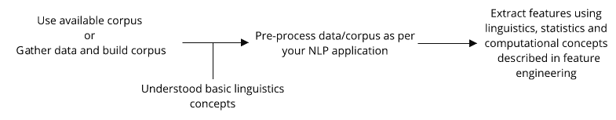

图 7.1：我们迄今为止学习的阶段

恭喜你，你已经学到了很多关于自然语言处理的知识，特别是关于自然语言理解（NLU）的知识！

现在是时候探索我们用来开发自然语言处理应用的算法了。我们将这些算法、技术或方法称为我们的黑盒，它们的逻辑就像是某种魔法一样。现在，是时候深入了解这些黑盒并理解其中的奥秘了。

自然语言处理应用的算法（实现技术或方法）可以分为两部分。参考*图 7.2*：

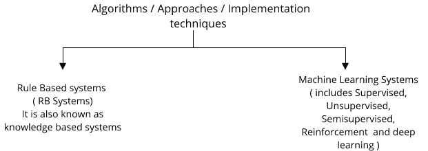

图 7.2：黑盒的算法、方法或实现技术

在本章中，我们将讨论**基于规则的**（**RB**）系统，以及第八章，*自然语言处理问题的机器学习*，和第九章，*自然语言处理和自然语言生成问题的深度学习*中的机器学习方法。

在本章中，我们将重点介绍基于规则的系统。我们将讨论以下主题：

+   了解 RB 系统

+   使用基于规则的系统的目的

+   RB 系统架构

+   了解 RB 系统开发生命周期

+   应用

+   使用 RB 系统开发自然语言处理应用

+   将 RB 方法与其他方法进行比较

+   优势

+   缺点

+   挑战

+   RB 系统的最新趋势

那么，让我们开始吧！

# 了解基于规则的系统

RB 系统也被称为**知识基础系统**。但首先，我们将了解 RB 系统的含义以及它为我们做了什么？通过这种方法可以实现哪些类型的自然语言处理应用？为了更好地理解，我将通过应用实例来解释这些概念。

# RB 系统是什么意思？

基于规则的系统是通过使用现有的知识或规则，我们开发出这样一个系统，利用规则将现有的系统规则应用于语料库，并尝试生成或推理结果。参考*图 7.3*，这将为你提供关于 RB 系统的概念：

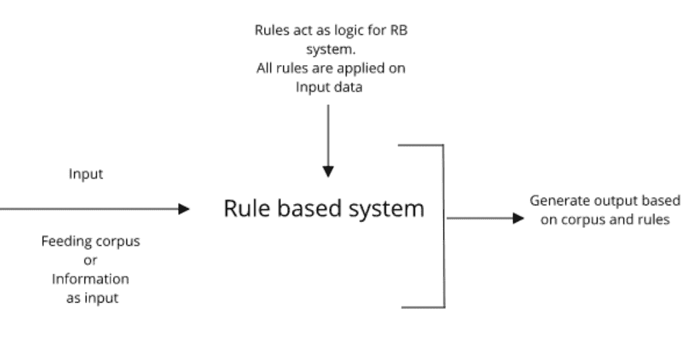

图 7.3：基于规则的系统输入/输出流程

简而言之，你可以说，RB 系统就是将现实生活中的规则或经验应用于可用语料库，按照规则操作信息，并得出某些决策或结果。在这里，规则是由人类生成或创建的。

RB 系统用于以有用的方式解释现有语料库（信息）。在这里，规则作为 RB 系统的核心逻辑。语料库是基于规则或知识进行解释的，因此我们的最终结果取决于这两个因素，一个是规则，另一个是我们的语料库。

现在，我将解释一种**AI**（**人工智能**）应用程序，以便理解 RB 系统的核心本质。

作为人类，我们每天都做非常复杂的工作以完成某些任务。为了完成任务，我们使用先前的经验或遵循规则来成功地完成任务。

举个例子：如果你在开车，你会遵循一些规则。你对这些规则有先前的了解。现在，如果你考虑自动驾驶汽车，那么这辆车应该反应并执行人类之前所做的整个任务。但汽车不能理解如何在没有驾驶员的情况下自动驾驶。开发这种无人驾驶汽车是相当复杂且具有挑战性的。

无论如何，你想要创造一辆无人驾驶汽车。你知道汽车需要学习很多规则才能像人类驾驶员一样表现得那么好。在这里，你面临一些主要挑战：

+   这是一种复杂的应用

+   汽车需要学习大量的规则和情况。

+   无人驾驶汽车的准确度应足够高，才能将其推向市场供消费者使用。

因此，为了解决这些挑战，我们遵循以下几个步骤：

1.  我们首先尝试将问题陈述分解为问题的小块，这些小块是原始问题陈述的一个子集。

1.  我们首先尝试解决问题的小块部分。

1.  为了解决这个问题，我们正在尝试提出一些通用规则，这些规则帮助我们解决问题，并帮助我们实现最终目标。

对于我们版本的无人驾驶汽车，我们需要从软件的角度来思考。那么，汽车应该首先学习的步骤是什么？想一想！

这辆车应该学会看到并识别道路上的物体。这是我们汽车的第一步，我们定义了一些通用规则，汽车将使用这些规则来学习并决定道路上是否有物体？然后根据这个来行驶。当汽车看到路况时，应该保持什么速度？等等，（现在请使用基于规则的系统思考一会儿，不要考虑深度学习方面来解决这个步骤）。

对于任务的每一个小部分，我们尝试定义规则并将规则逻辑输入到 RB 系统中。然后，我们检查该规则是否在给定的输入数据上正确工作。我们还会在得到输出后衡量系统的性能。

现在，你一定在想这是一本关于 NLP 的书，为什么我要举一个通用 AI 应用的例子？原因在于，自动驾驶汽车的例子容易理解，大家都能理解。我想强调一些有助于我们理解拥有基于规则系统目的的观点。

让我们通过一个通用的例子来理解其目的：

+   这个自动驾驶汽车的例子帮助你识别出，有时一个人类很容易完成的任务，对于机器而言却是极其复杂的。

+   这类复杂任务需要非常高的准确性！我的意思是，非常高！

+   我们并不指望系统覆盖和学习所有的情况，但无论我们输入什么规则到系统中，它应该以最佳的方式学习这些情况。

+   在 RB 系统中，覆盖的场景较少，但系统的准确性应当很高。这正是我们所需要的。

+   我们的规则来源于现实生活中的人类经验或通过使用人类知识。

+   规则的开发和实施是由人类完成的。

所有这些要点帮助我们决定何时何地使用基于规则的系统。这引导我们定义拥有基于规则系统的目的。那么让我们进入下一部分，定义一个使用基于规则方法的经验法则，适用于任何 NLP 或 AI 相关的应用。

# 拥有基于规则系统的目的。

通常，基于规则的系统用于开发 NLP 应用和通用 AI 应用。我们需要回答一系列问题，以便清晰地了解基于规则的系统。

# 我们为什么需要基于规则的系统？

基于规则的系统尝试模仿人类专家的知识，用于 NLP 应用。这里，我们将讨论一些有助于你理解 RB 系统目的的因素：

+   可用的语料库规模较小。

+   输出过于主观。

+   专门领域的专家容易为特定领域生成一些专业规则。

+   机器仅通过观察少量数据很难生成专门的规则。

+   系统输出应当具有很高的准确性。

如果你想使用 RB 系统开发 NLP 应用，所有前述因素都非常关键。这些因素如何帮助你决定是否选择 RB 方法？

你需要问以下问题：

+   你是拥有大量数据还是少量数据？

    +   如果你拥有少量数据，那么可以问下一个问题；如果你有大量数据，那么你有更多其他选择。

+   关于你要开发的 NLP 应用，它的输出是主观的还是通用的？

    +   如果你拥有少量数据，并且你要开发的应用输出过于主观，而且你知道用少量数据，机器无法概括出模式，那么选择 RB 系统。

+   你要开发的 NLP 应用应该具有非常高的准确性：

    +   如果你想开发的应用程序应该具有高精度，几乎与人类一样，且使用的是小数据集，那么请选择 RB 系统。

    +   在这里，你还应该记住，RB 系统中的规则是由人类专家创建的。根据该系统生成输出，因此 RB 系统具有很高的准确性，但并不能涵盖所有情境。

上述问题定义了我们可以在什么样的情况下使用 RB 系统。如果我要总结之前的问题，我会这样描述：如果你有少量数据，并且知道你需要一个高精度的系统，其中人类专家能够轻松识别出各种情境来制定规则并预测其输出，而机器则很难自己准确地识别出通用规则，那么 RB 系统就是适合你的选择！RB 系统的输出应该模仿人类专家的经验。这就是选择 RB 系统的经验法则。

我们将在第九章，“*自然语言处理和自然语言生成中的深度学习*”中看到，当你有大量数据时，存在更好的方法。在本章中，RB 方法帮助我们生成非常准确的 NLP 应用。

# 哪种类型的应用程序可以使用 RB 方法，而不是其他方法？

正如我们之前定义的，RB 系统是在人工领域专家的帮助下开发的。在本节中，我们将举几个例子，帮助证明我们的经验法则：

+   假设我们想构建一个从英语到印度语料库的机器翻译系统，但这些语料库太小。翻译系统必须足够准确才能开发。我们需要同时掌握英语和古吉拉特语的人工专家。我们不想一次性解决所有翻译层次的问题，因此需要先解决小块问题，然后在开发的原型上构建其他部分。因此，在这里，我也会选择 RB 系统。你怎么看？

+   假设我们想开发一个英语语法纠错系统。假设我们有一小部分平行语料库（包含语法错误的文档和没有语法错误的相同文档），通过现有的语料库，我们需要制作一个准确的语法纠错应用，能够识别并纠正语法错误。那么，在这种应用场景下，你会选择哪种方法？想一想，然后给出你的答案！在这里，根据我们的经验法则，我会选择 RB 系统。

# 练习

+   如果你想开发一个基本的聊天机器人系统，你会选择哪种方法？

    +   RB 方法

    +   机器学习方法

+   如果你想预测给定句子的情感，您会选择哪种方法？

    +   RB 方法

    +   机器学习方法

    +   混合方法

    +   都不适用

# 如果你想开发一个基于规则的系统，需要什么资源？

现在你已经理解了为什么我们使用 RB 系统以及我们将其应用于哪些类型的应用程序。第三个重要方面是，如果我们想要为任何 NLP 或 AI 应用程序开发 RB 系统，我们需要什么？

现在我们需要考虑三个主要资源。请参见 *图 7.4*：

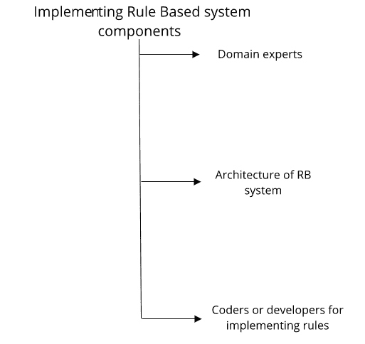

图 7.4：实现 RB 系统的资源

现在，让我们详细了解每个有助于定义 RB 系统组件的资源：

+   领域专家（人类专家/知识专家）：为了使用 RB 系统开发应用程序，首先我们需要一位领域专家，一个几乎了解该领域所有知识的人。

    假设你想建立一个机器翻译系统，那么你的领域专家可能是对源语言和目标语言的语言学有深入了解的人。他可以利用自己的专业知识和经验提出规则。

+   RB 系统的系统架构师（系统工程师）：为了定义 RB 系统的架构，你需要一个团队或个人，具备以下专长：

    +   领域的基本知识

    +   设计系统架构的深厚知识或高水平经验

架构是 RB 系统中最重要的部分，因为架构是决定整个系统效率的关键组件之一。良好的 RB 系统架构设计将提供良好的用户体验、准确高效的输出，除此之外，它还将使得程序员和其他技术团队（如支持团队或测试团队）能够轻松工作。系统架构由系统工程师或系统架构师负责。

+   编码人员（开发人员或知识工程师）实现规则：一旦领域专家开发出规则并且系统架构已经设计好，那么编码人员或开发人员便会介入。编码人员就是我们的真正的忍者！他们使用编程语言实现规则并帮助完成应用程序。他们的编程技能是 RB 系统中不可或缺的一部分。编程可以使用任何编程语言或脚本语言，如 C、C++、Java、Python、Perl、Shell 脚本等。根据架构的不同，你可以选择其中任何一种语言，但不能在单一系统中使用多种语言，除非有精心设计的架构。

稍后在本章中，我们将深入了解架构部分的更多技术内容。

# RB 系统架构

我将通过将其分为三个部分来解释 RB 系统的架构：

+   RB 系统作为专家系统的一般架构

+   用于 NLP 应用的 RB 系统的实际架构

+   自定义架构 - NLP 应用的 RB 系统

+   Apache **UIMA**（**非结构化信息管理架构**）为 NLP 应用提供的 RB 系统

# 作为专家系统的规则基础系统的一般架构

如果我们将我们的基于规则的系统描述为专家系统，那么这种基于规则的系统的架构将与*图 7.5*中的架构相同：

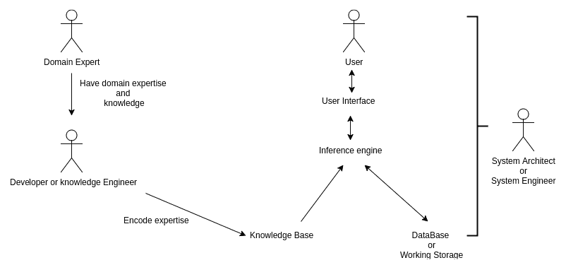

图 7.5：将 RB 系统视为专家系统时的架构

让我们详细看看架构中的每个组件：

+   **领域专家：**

    +   如我们在前一节中所见，领域专家是那些对特定领域有专长的人，他们可以帮助我们生成规则来解决问题

+   **开发者或知识工程师：**

    +   开发者使用由领域专家创建的规则，并通过编程技能将其转换为机器可理解的格式

    +   开发者对专家创建的规则进行编码

    +   通常，这种编码以伪代码的形式呈现

+   **知识库：**

    +   知识库是专家可以放置所有规则的地方

    +   领域专家可以添加、更新或删除规则

+   **数据库或工作存储：**

    +   所有与元信息相关的规则可以放在工作存储中

    +   在这里，我们可以存储规则、特殊场景、可用的列表、示例等

    +   我们还会保存要应用规则的数据

+   **推理引擎：**

    +   推理引擎是系统的核心部分

    +   在这里，我们为规则编写实际的代码

    +   当预定义的规则和条件与用户查询或我们给系统输入的数据集匹配时，规则会被触发

+   **用户推理：**

    +   有时候，我们的最终用户也会提供一些条件来缩小结果范围，因此当我们的系统生成输出时，这些用户推理也会被考虑在内。

+   **用户界面：**

    +   用户界面帮助用户提交输入，作为回报，他们会得到输出结果

    +   这为我们的最终用户提供了一个互动环境

+   **系统架构师：**

    +   系统架构师负责整个系统架构

    +   系统架构师还决定什么是 RB 系统的最有效架构

我们已经看到传统的 RB 系统架构，现在是时候看到 NLP 应用的 RB 系统的实际架构了。

# 基于规则的系统在自然语言处理（NLP）应用中的实际架构

我已经描述了整体架构，现在我们将看到 RB 系统在 NLP 应用中的实际架构。参考*图 7.6*：

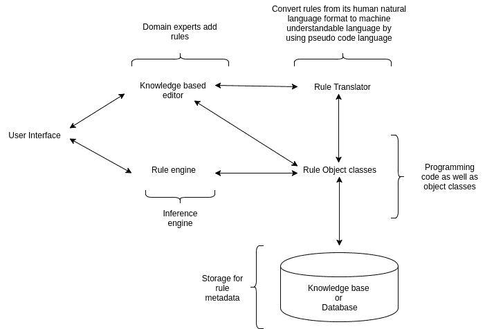

图 7.6：用于 NLP 应用的 RB 系统的实际架构

让我们详细看看架构中的每个组件。

我们在前一节中已经看到了一些部分，如领域专家、用户界面和系统工程师。所以，在这里，我们专注于新的组件：

+   **基于知识的编辑器：**

    +   领域专家可能不知道如何编码

    +   所以我们为他们提供了一个基于知识的编辑器，他们可以使用自然语言编写或创建规则

    +   假设我们正在开发一个英语语法纠错系统，并且我们有一个语言学家，他知道如何创建规则，但不知道如何将规则编码。

    +   在这种情况下，他们可以使用知识库编辑器来添加、更新或删除规则。

    +   所有创建的规则都以普通人类语言的形式进行说明。

+   **规则翻译器：**

    +   正如我们所知，所有规则都是以人类语言的形式表示的，因此我们需要将它们翻译或转换成机器可以理解的形式。

    +   因此，规则翻译器就是定义规则伪逻辑并给出示例的部分。

    +   假设我们考虑我们的语法纠错系统例子。在这里，我们的专家定义了一条规则：如果句子中有单数主语和复数动词，那么就将动词改为单数形式。

    +   在规则翻译器中，已定义的规则被转换成这样的格式：如果句子*`S`*有一个单数主语，词性标签为**PRP$**，而动词词性标签为**VBP**，则将动词更改为**VBZ**格式。为了理解规则，也给出了一些示例。

+   **规则对象类：**

    +   这个规则对象类充当支持库的容器。

    +   它包含各种先决条件库。

    +   它有时还包含一个可选的对象类，用于库的优化，进而优化整个系统。

    +   对于语法纠错系统，我们可以将解析器、词性标注器、**命名实体识别**（**NER**）等工具放入容器中，供规则引擎使用。

+   **数据库或知识库：** 一个数据库包含规则的元数据，例如：

    +   已经使用了哪些支持库来自规则对象类？

    +   规则的类别是什么？

    +   规则的优先级是什么？

+   **规则引擎：**

    +   这是核心部分，是 RB 系统的大脑。

    +   通过使用规则翻译器、规则对象类和知识库，我们需要开发核心代码，该代码实际运行在用户查询或输入数据集上，并生成输出。

    +   你可以使用任何适合你的应用程序及其架构的编程语言来编写代码。

    +   对于我们的语法纠错系统，我们将在此阶段编写规则，最终代码将被放入规则引擎的代码库中。

这些是开发 NLP 的 RB 系统时有用的所有组件。现在你一定会有一些问题。我们可以根据需要改变系统的架构吗？这样可以吗？要回答这些问题，你需要参考下一部分内容。

# 定制架构 - 用于 NLP 应用的 RB 系统

根据不同 NLP 应用的需求，你可以更改架构或组件。在这种方法中，可以进行定制。如果你正在设计一个定制的 RB 系统架构，有一些需要注意的点。请问以下问题：

+   你分析和研究过这个问题以及已有的架构吗？

    +   在进行定制之前，你需要对应用进行分析。如果存在现有系统，那么需要研究其架构，并从中提取优缺点。

    +   花足够的时间进行分析。

+   你真的需要定制架构吗？

    +   如果经过研究后，你觉得应用架构需要定制，那么写下你为什么真的需要它的原因。

    +   列出你所列出的理由，并通过一系列问题帮助你的系统变得更好。如果答案是肯定的，那么你已经走在正确的轨道上。

+   它是否有助于简化开发流程？

    +   新架构是否真的能帮助你的开发过程更好？如果是，那么你可以考虑使用该架构。

    +   大多数时候，定义一个流畅的 RB 系统开发流程是具有挑战性的，但如果你新的定制架构能够帮助你，那将是非常好的事情。

    +   这个流畅的过程是否真的稳定了你的 RB 系统？

+   它是否易于维护？

    +   定制化架构可以帮助你更轻松、高效地维护系统。

    +   如果你能将这个功能添加到定制架构中，那就太棒了！

+   它是否具有模块化？

    +   如果它能提供 RB 系统的模块化，那么它将非常有用，因为你可以轻松添加、删除或更新某些模块。

+   它是否具有可扩展性？

    +   借助新架构，你可以扩展系统。你也应该考虑到这一点。

+   它是否易于迁移？

    +   如果有了定义的架构，团队应该能够轻松地将系统从一个平台迁移到另一个平台。

    +   如果我们想将一个模块从一个系统迁移到另一个系统，那么技术团队和基础设施团队都应该能够轻松完成。

+   它是否安全？

    +   系统安全是一个主要问题。新的架构如果需要的话，应该具备安全性和用户隐私保护功能。

+   它是否易于部署？

    +   如果你未来想要部署一些变更，那么部署过程应该足够简便。

    +   如果你想销售最终产品，那么部署过程应该足够简便，以减少你的工作量和时间。

+   从开发时间的角度来看，它是否节省时间？

    +   使用该架构开发和实现 RB 系统应该是节省时间的。

    +   架构本身不应占用太多的实现时间。

+   对我们的用户来说，它是否易于使用？

    +   架构可能很复杂，但对于最终用户来说，它必须是用户友好且易于使用的。

如果你能采纳上述所有或大部分要点，那么尝试使用你认为最适合系统的架构，解决一小部分问题，然后最后再一次提出所有之前的问题，评估输出结果。

如果你仍然得到正面的答案，那么你可以放心了！在这里，设计没有绝对的对错；关键是找到最适合你的 NLP 应用的架构。

一个**问答**（**Q/A**）系统可以使用在*图 7.7*中展示的架构：

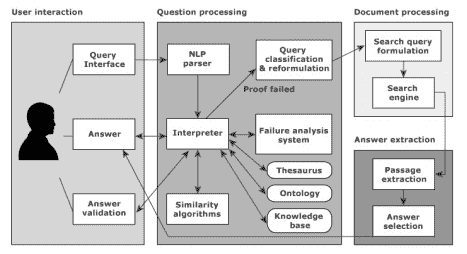

图 7.7：问答 RB 系统架构

你可以看到一种非常不同的架构。这个问答系统的方法是基于本体的 RB 系统。问题处理和文档处理是我们主要的规则引擎。在这里，我们并不考虑开发一个高级的问答系统。我们希望开发一个适合小孩子的问答系统，孩子们可以提问关于故事的问题，系统会根据规则和现有的故事数据返回答案。

让我们详细看看每个组件：

+   当用户提交问题时，解析器会解析问题。

+   使用解释器解析问题，将解析结果与知识库、本体和关键词词典进行匹配。

+   在这里，我们也应用了推理和事实。

+   我们从问题中提取一些事实，并通过查询分类和重构对用户问题进行分类。

+   之后，已经生成的事实和分类过的问题会被发送到文档处理部分，在那里事实会传递给搜索引擎。

+   答案提取是问答系统的核心 RB 引擎，因为它利用事实并应用推理技术，如前向链推理或后向链推理，来提取所有可能的答案。现在你可能想了解一下后向链推理和前向链推理。那么，在这里，我将为你提供一个简要的概述。在前向链推理中，我们从可用数据开始，使用推理规则从数据中提取更多事实，直到达成目标。该技术被用于专家系统中，以了解接下来可能发生的事情。而在后向链推理中，我们从一系列目标开始，倒推以找出哪些条件可能在过去发生，从而导致当前结果的产生。这些技术帮助我们理解为什么会发生这种情况。

+   一旦所有可能的答案生成完毕，它们将会返回给用户。

我心中有一个问题，想问你。

如果你开发一个问答系统，想选择什么类型的数据库？在继续之前，先思考一下！

我倾向于选择 NoSQL 数据库，而不是 SQL 数据库，背后有几个原因。系统应该 24 小时全天候对用户开放。在这里，我们非常关心我们的用户。用户可以随时访问系统，系统的可用性至关重要。因此，我希望选择 NoSQL 数据库。如果将来我们需要对用户的问题和答案进行一些分析，那么我们需要将用户的问题和系统的答案保存在数据库中。继续阅读以了解更多信息：

你可以选择自己的数据仓库或 NoSQL 数据库。如果你是 NoSQL 新手，可以通过这个链接了解 NoSQL：[`en.wikipedia.org/wiki/NoSQL`](https://en.wikipedia.org/wiki/NoSQL)；如果你对数据仓库这个词不熟悉，可以参考这个链接：[`en.wikipedia.org/wiki/Data_warehouse`](https://en.wikipedia.org/wiki/Data_warehouse)。这将帮助我们对用户进行分类，并能够做出真正对用户有意义的创意性改变。我们还可以为每个用户提供定制化的反馈或建议。

# 练习。

假设你正在开发一个语法纠正系统，你会设计什么样的系统架构？尝试在纸上设计它！让你的思路流露出来。

# Apache UIMA - 用于 NLP 应用程序的规则引擎系统。

在本节中，我们将研究用于 NLP 应用程序的规则引擎系统中的一个著名框架。

Apache UIMA 最初是由 IBM 开发的，用于处理非结构化数据。你可以通过点击此链接查看更多详细信息：[`uima.apache.org/index.html`](https://uima.apache.org/index.html)

在这里，我想强调这个框架中的一些要点，它们将帮助你使用规则引擎方法构建自己的自然语言处理（NLP）应用程序。

以下是 UIMA 的一些特性：

+   UIMA 将为我们提供基础设施、组件和框架。

+   UIMA 内建了规则引擎（RB 引擎）和 GATE 库，用于对文本数据进行预处理。

+   以下工具作为组件的一部分可用，我列举了一些：

    +   语言识别工具。

    +   句子分割工具。

    +   NER 工具

+   我们可以使用 Java、Ruta 和 C++ 编写代码。

+   这是一个灵活、模块化、易于使用的框架。

+   C/C++ 注释器还支持 Python 和 Perl。

UIMA 的应用/用途包括：

+   IBM Watson 使用 UIMA 来分析非结构化数据。

+   **临床文本分析与知识提取系统**（**Apache cTAKES**）使用基于 UIMA 的系统从医疗记录中提取信息。

使用 UIMA 的挑战包括：

+   你需要使用 Java、Ruta 或 C++ 编写规则。尽管为了优化，许多规则引擎（RB）系统使用 C++，但为 Ruta 招募到优秀的人才是一项具有挑战性的任务。

+   如果你是 UIMA 的新手，你需要一些时间来熟悉它。

# 了解规则引擎系统开发生命周期。

在本节中，我们将讨论规则引擎系统的开发生命周期。如果你以后想要开发自己的系统，这将对你有所帮助。*图 7.8* 描述了规则引擎系统的开发生命周期。这个图表非常直观，所以不需要额外的说明。

如果我们遵循规则引擎开发生命周期的各个阶段，那么生活将变得更轻松：

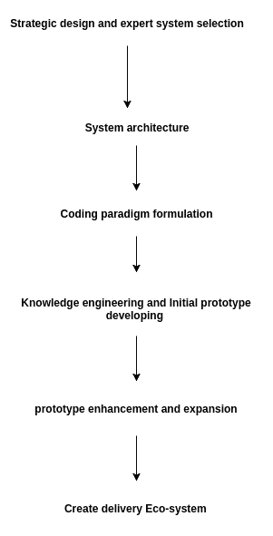

图 7.8：规则引擎系统开发生命周期。

# 应用程序。

在本节中，我将应用程序分为两个部分：一个是 NLP 应用程序，另一个是通用的 AI 应用程序。

# 使用规则引擎系统的 NLP 应用程序。

在这里，我们列出了一些使用基于规则系统的 NLP 应用：

+   句子边界检测：

    +   对一般的英语写作来说，句子边界检测比较容易，但当你处理研究论文或其他科学文档时，它会变得更加复杂。

    +   所以，手工制作的后处理规则将帮助我们准确识别句子边界。

    +   Grammarly 公司也使用这种方法用于语法纠错系统。

+   机器翻译：

    +   当我们想到机器翻译系统时，我们脑海中会想到**谷歌神经机器翻译**（**GNMT**）系统。

    +   对于许多印度语言，谷歌曾经使用一个复杂的基于规则的系统与统计预测系统，因此他们有一个混合系统。

    +   2016 年，谷歌推出了基于神经网络的机器翻译系统。

    +   许多研究项目仍然使用基于规则的系统进行机器翻译，并且他们中的大多数都在尝试开发那些尚未开发的语言。

+   基于模板的聊天机器人：

    +   如今，聊天机器人是市场上的新趋势和热潮。

    +   它们的基本版本是一种基于模板的方法，在这种方法中，我们有一套已定义的问题或关键词，并将每个关键词的答案进行了映射。

    +   这个系统的好处是匹配关键词。因此，如果你使用的是其他语言，但你的聊天信息中包含我们已定义的关键词，那么系统能够为你发送正确的响应信息。

    +   坏的一面是，如果你犯了拼写错误，系统将无法以正确的方式做出响应。

    +   我们将从零开始开发这个应用程序。我将在下一节中解释编码部分，所以请继续阅读并启动你的计算机！

+   语法纠错系统：

    +   语法纠错系统也是通过使用规则来实现的。

    +   在这个应用程序中，我们可以定义一些简单的规则，也可以定义一些非常复杂的规则。

    +   在下一节中，我们将看到一些基本的语法纠错规则，我们将使用 Python 来实现这些规则。

+   问答系统：

    +   问答系统也使用基于规则的系统，但这里有一个不同之处。

    +   问答系统通过语义学来获取提交问题的答案。

    +   为了将语义学融入其中，我们使用了基于本体的基于规则方法。

# 使用基于规则的系统的通用 AI 应用：

你已经看到了使用基于规则方法的 NLP 应用。现在，我们来看一下使用基于规则方法与其他技术结合的通用 AI 应用：

+   自动驾驶汽车或无人驾驶汽车：

    +   在本章开始时，我举了自动驾驶汽车的例子来突出基于规则系统的目的。

    +   自动驾驶汽车也使用了混合方法。许多大公司，从谷歌到特斯拉，都在尝试制造自动驾驶汽车，他们的实验旨在开发最值得信赖的自动驾驶汽车。

    +   这个应用程序在初期是通过使用复杂的基于规则（RB）系统开发的。

    +   然后，实验转向了机器学习技术的方向。

    +   如今，许多公司正在应用深度学习技术以使系统变得更好。

+   机器人应用：

    +   发展能够补充人类技能的机器人一直是人工智能社区的长期目标。

    +   我们的目标是开发能够帮助人类完成工作、处理耗时任务的机器人。

    +   假设有一个帮助你做家务的机器人。通过为所有可能的情况定义规则，机器人可以完成这种任务。

+   NASA 的专家系统：

    +   NASA 通过使用通用编程语言**CLIPS**（**C 语言集成生产系统**）开发了专家系统。

现在，我想理论部分已经足够了。现在我们应该尝试从零开始开发一些 RB 应用程序。准备好开始编码吧，我们将在下一节开始我们的编程之旅。

# 使用 RB 系统开发自然语言处理（NLP）应用程序。

在本节中，我们将看看如何使用 RB 系统开发 NLP 应用程序。我们将从头开始开发应用程序。因此，首先你需要以下依赖项。

你可以运行以下命令来安装所有的依赖项：

```py
 pip install -r pip-requirements.txt 

```

依赖项的列表可以通过点击此链接找到：[`github.com/jalajthanaki/NLPython/blob/master/pip-requirements.txt`](https://github.com/jalajthanaki/NLPython/blob/master/pip-requirements.txt)

# 制定规则的思维过程：

我们谈论了很多关于规则的内容，但这些规则到底是如何推导出来的呢？当语言学家为 NLP 应用程序推导规则时，他们的思维过程是什么样的？那么，让我们从这个思维过程开始。

你需要像语言学家一样思考一段时间。记住你至今在本书中学到的所有概念，成为一名语言学家。

假设你正在为语法修正系统开发规则，特别是针对英语语言。因此，我将描述语言学家的思维过程，而这个思维过程将帮助你在开发规则时：

+   我需要知道什么？

    +   你应该了解你所创建规则的语言的语法规则，这里的语言是英语。

    +   你应该了解语言的结构、词序和其他语言相关的概念。

    +   前面的两点是先决条件。

+   我应该从哪里开始？

    +   如果你了解所有与语言相关的内容，那么你就需要观察和研究不正确的句子。

    +   现在，当你学习不正确的句子时，你需要知道这些句子中有哪些错误。

    +   之后，你需要思考错误的分类，错误是与语法相关，还是由于语义歧义引起的。

    +   经过这一切后，你可以将你与语言相关的知识映射到句子中的错误上。

+   规则是如何推导的？

    +   一旦你发现了句子中的错误，那么此时就要专注于你的思维过程。当你捕捉到错误时，你的大脑是如何反应的？

    +   想一想你的大脑是如何对你已识别的每个错误作出反应的。

    +   你能够捕捉到错误，因为你了解语言的语法事实或其他与语言相关的技术内容（句子语法结构、语义知识等）。你的大脑实际上在帮助你。

    +   你的大脑知道如何使用给定的语言正确解读给定的文本。

    +   这就是你能够发现错误的原因。与此同时，你有了一些坚实的理由；基于这些理由，你已经识别出错误。

    +   一旦识别出错误，根据错误的不同类别，你可以通过使用某些逻辑规则来修改句子的部分内容，从而纠正错误。

    +   你可以改变词序，或者你可以改变主谓一致，或者你可以改变一些短语，或者所有这些都一起改变。

    +   Bingo！到此为止，你会得到你的规则。你知道错误是什么，你也知道这些步骤是用来将错误句子转化为正确句子的。

    +   你的规则逻辑不过就是将错误句子转换成正确句子的步骤。

+   我需要注意哪些元素？

    +   首先，你需要考虑一种非常简单的方式来修正错误或不正确的句子。

    +   尝试制定基于模式的规则。

    +   如果无法推导出基于模式的规则，那么检查你是否可以使用解析和/或形态分析器的结果，然后检查其他工具和库。

    +   顺便说一下，这里有一个要点。当你定义规则时，还需要考虑规则逻辑在实现上的可行性。

    +   是否有可用的工具？如果工具可用，你可以编写规则，或者开发者可以编写规则。

    +   如果工具不可用，那么你需要放弃你的规则。

    +   当你定义规则并检查是否有可供编码人员使用的工具时，研究就涉及其中。

    +   选定的工具应该能够编码规则的特殊情况。

    +   如果你的团队中有语言学家，定义规则和研究工具可能是语言学家的基本任务。如果没有，那么作为编码人员，你需要搜索可以用来编写规则逻辑的工具。

我们将毫不拖延地开始编码。

# 从简单的规则开始。

我编写了一个脚本，用于抓取标题为“编程语言”的维基百科页面。

点击这里打开该页面：[`en.wikipedia.org/wiki/Programming_language`](https://en.wikipedia.org/wiki/Programming_language)

从给定页面的文本中提取编程语言的名称是我们的目标。举个例子：该页面有 C、C++、Java、JavaScript 等编程语言。我想提取它们。这些词可能是句子的一部分，也可能独立出现在文本数据内容中。

现在，看看我们如何通过定义一个简单的规则来解决这个问题。脚本的 GitHub 链接是：[`github.com/jalajthanaki/NLPython/blob/master/ch7/7_1_simplerule.py`](https://github.com/jalajthanaki/NLPython/blob/master/ch7/7_1_simplerule.py)

GitHub 上的数据文件链接是：[`github.com/jalajthanaki/NLPython/blob/master/data/simpleruledata.txt`](https://github.com/jalajthanaki/NLPython/blob/master/data/simpleruledata.txt)

在这里，我们的任务可以分为三个部分：

+   抓取文本数据

+   定义我们的目标规则

+   编写规则并生成原型和结果

# 抓取文本数据

在这个阶段，我们将从编程语言的维基页面抓取文本，并将内容导出到文本文件中。你可以在*图 7.9*中看到代码片段：

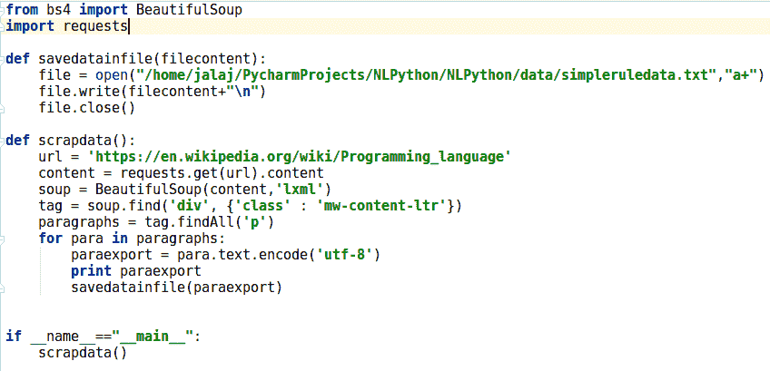

图 7.9：用于抓取文本数据的代码片段

抓取数据的输出结果如*图 7.10*所示：

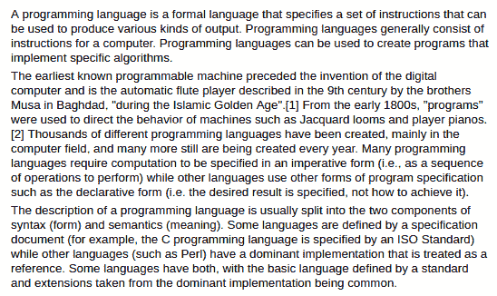

图 7.10：抓取脚本的输出结果

# 定义我们的目标规则

现在，如果你查看我们抓取的数据，你可以找到这些句子。经过分析文本后，你需要定义一个规则，用来提取编程语言名称，如 Java、JavaScript、MATLAB 等。然后，想一想，什么样的简单规则或逻辑可以帮助你实现目标。仔细思考，给自己一些时间！集中精力在思考过程中，并尽力找出模式。

如果我要定义一个规则，那么我会在给定数据的上下文中概括我的问题。在分析过程中，我发现大多数编程语言的关键字都会带有单词“language”。我注意到，当句子中出现“language”这个单词时，实际的编程语言名称也很有可能出现在该句子中。例如，C 编程语言是由 ISO 标准指定的。在这个例子中，C 编程语言和单词“language”都出现在句子中。所以，我将执行以下过程。

首先，我需要提取包含单词“language”的句子。接下来，作为第二步，我将开始处理提取的句子，检查句子中是否有任何大写单词或驼峰式大小写单词。然后，如果我发现有任何大写单词或驼峰式大小写单词，我需要将它们提取出来，并把它们放入列表中，因为大多数编程语言都以大写单词或驼峰式大小写格式出现。比如，C、C++、Java、JavaScript 等等。也会有情况，一句话中包含多个编程语言名称。

上述过程就是我们的规则，规则的逻辑形式如下所示：

+   提取包含单词“language”的句子

+   然后尝试找出句子中使用驼峰式大小写或大写形式的单词

+   将所有这些单词放入列表中

+   打印列表

# 编写规则并生成原型和结果

这个示例给你提供了规则制定过程的实际精髓。这是我们的第一步，因此我们并不太关注准确性。我知道，这不是解决这个问题的唯一方法，也不是最有效的方法。还有其他更有效的方式可以实现同样的功能，但我使用这个方法是因为我觉得这是最简单且最易理解的解决方案。

这个示例可以帮助你理解规则如何编码，并在得到第一个原型的结果后，你可以采取什么步骤来改进输出。

请参见*图 7.11*中的代码片段：

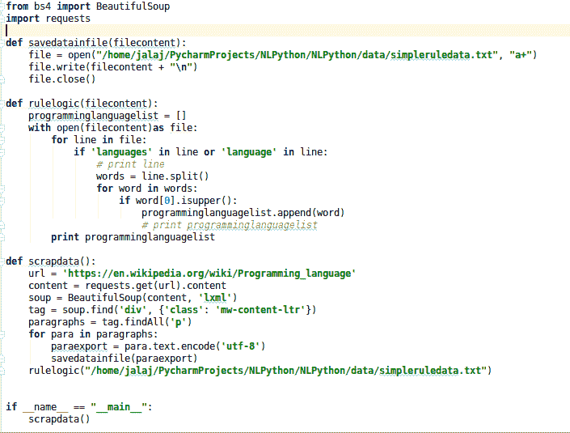

图 7.11：提取编程语言规则逻辑的实现代码

前面代码片段的输出如下：

```py
['A', 'Programming', 'The', 'Musa', 'Baghdad,', 'Islamic', 'Golden', 'Age".[1]', 'From', 'Jacquard', 'Thousands', 'Many', 'The', 'Some', 'C', 'ISO', 'Standard)', 'Perl)', 'Some', 'A', 'Some,', 'Traits', 'Markup', 'XML,', 'HTML,', 'Programming', 'XSLT,', 'Turing', 'XML', 'Moreover,', 'LaTeX,', 'Turing', 'The', 'However,', 'One', 'In', 'For', 'Another', 'John', 'C.', 'Reynolds', 'He', 'Turing-complete,', 'The', 'The', 'Absolute', 'The', 'These', 'The', 'An', 'Plankalk\xc3\xbcl,', 'German', 'Z3', 'Konrad', 'Zuse', 'However,', 'John', "Mauchly's", 'Short', 'Code,', 'Unlike', 'Short', 'Code', 'However,', 'At', 'University', 'Manchester,', 'Alick', 'Glennie', 'Autocode', 'A', 'The', 'Mark', 'University', 'Manchester', 'The', 'Mark', 'R.', 'A.', 'Brooker', 'Autocode".', 'Brooker', 'Ferranti', 'Mercury', 'University', 'Manchester.', 'The', 'EDSAC', 'D.', 'F.', 'Hartley', 'University', 'Cambridge', 'Mathematical', 'Laboratory', 'Known', 'EDSAC', 'Autocode,', 'Mercury', 'Autocode', 'A', 'Atlas', 'Autocode', 'University', 'Manchester', 'Atlas', 'In', 'FORTRAN', 'IBM', 'John', 'Backus.', 'It', 'It', 'Another', 'Grace', 'Hopper', 'US,', 'FLOW-MATIC.', 'It', 'UNIVAC', 'I', 'Remington', 'Rand', 'Hopper', 'English', 'The', 'FLOW-MATIC', 'Flow-Matic', 'COBOL,', 'AIMACO', 'The', 'These', 'The', 'Each', 'The', 'Edsger', 'Dijkstra,', 'Communications', 'ACM,', 'GOTO', 'The', 'C++', 'The', 'United', 'States', 'Ada,', 'Pascal', 'In', 'Japan', 'The', 'ML', 'Lisp.', 'Rather', 'One', 'Modula-2,', 'Ada,', 'ML', 'The', 'Internet', 'Perl,', 'Unix', 'Java', 'Pascal', 'These', 'C', 'Programming', 'Current', "Microsoft's", 'LINQ.', 'Fourth-generation', 'Fifth', 'All', 'These', 'A', 'Most', 'On', 'The', 'The', 'Since', 'Programming', 'Backus\xe2\x80\x93Naur', 'Below', 'Lisp:', 'Not', 'Many', 'In', 'Even', 'Using', 'The', 'C', 'The', 'Chomsky', 'The', 'Type-2', 'Some', 'Perl', 'Lisp,', 'Languages', 'In', "Lisp's", "Perl's", 'BEGIN', 'C', 'The', 'The', 'For', 'Examples', 'Many', 'Other', 'Newer', 'Java', 'C#', 'Once', 'For', 'The', 'There', 'Natural', 'A', 'Results', 'A', 'The', 'Any', 'In', 'In', 'The', 'A', 'For', 'The', 'Many', 'A', 'These', 'REXX', 'SGML,', 'In', 'High-level', 'BCPL,', 'Tcl,', 'Forth.', 'In', 'Many', 'Statically', 'In', 'In', 'Most', 'C++,', 'C#', 'Java,', 'Complete', 'Haskell', 'ML.', 'However,', 'Java', 'C#', 'Additionally,', 'Dynamic', 'As', 'Among', 'However,', 'Lisp,', 'Smalltalk,', 'Perl,', 'Python,', 'JavaScript,', 'Ruby', 'Strong', 'An', 'Strongly', 'An', 'Perl', 'JavaScript,', 'In', 'JavaScript,', 'Array,', 'Such', 'Strong', 'Some', 'Thus', 'C', 'Most', 'Core', 'The', 'In', 'However,', 'Indeed,', 'For', 'Java,', 'Smalltalk,', 'BlockContext', 'Conversely,', 'Scheme', 'Programming', 'But', 'A', 'By', 'While', 'Many', 'Many', 'Although', 'The', 'One', 'The', 'As', 'Because', 'This', 'Natural', 'However,', 'Edsger', 'W.', 'Dijkstra', 'Alan', 'Perlis', 'Hybrid', 'Structured', 'English', 'SQL.', 'A', 'The', 'The', 'A', 'An', 'There', 'It', 'Although', 'Proprietary', 'Some', 'Oracle', 'Corporation', 'Java', "Microsoft's", 'C#', 'Common', 'Language', 'Runtime', 'Many', 'MATLAB', 'VBScript.', 'Some', 'Erlang', "Ericsson's", 'Thousands', 'Software', 'Programming', 'When', 'However,', 'The', 'On', 'A', 'A', 'These', 'Programming', 'Programs', 'In', 'When', 'Unix', 'It', 'One', 'CPU', 'Some', 'For', 'COBOL', 'Fortran', 'Ada', 'C', 'Other', 'Various', 'Combining', 'C,', 'Java,', 'PHP,', 'JavaScript,', 'C++,', 'Python,', 'Shell,', 'Ruby,', 'Objective-C', 'C#.[70]', 'There', 'A', 'Languages', 'Ideas', 'The', 'For', 'Java', 'Python', 'In', 'Traditionally,', 'These', 'A', 'More', 'An', 'By', 'Some', 'A', 'For', 'English', 'Other'] 

```

如你所见，我们的基本规则提取了编程语言，但也提取了无关数据。现在，思考如何限制规则或添加一些约束，使其能够给出准确的输出。这将是你的任务。

# 练习

请通过添加一些约束来改进前面的输出（提示：你可以应用一些预处理，正则表达式也可以帮助你。）

# 用于校对应用程序的 Python 模式匹配规则

现在，假设你想制作一个校对工具。那么，在这里我将为你提供一个非常简单的错误，这个错误你可以在任何商务邮件或信件中轻松找到。然后我们将尝试以高准确率修正这些错误。

错误是，当人们在邮件中指定会议时间时，他们可能会指定为 2pm、2PM、2P.M. 或其他变体，但正确的格式应该是 2 p.m. 或 9 a.m.

这个错误可以通过基于模式的规则来修复。以下是规则逻辑。

假设长度为两位的数字从 1 到 12 开始。此数字后，如果出现`am`和`pm`且没有空格或没有句点，请添加空格和正确的句点符号。

我将使用正则表达式来实现它。

源模式：

```py
\b([1-9]|0[1-9]|1[0-2]{1,2})(am)\b 
\b([1-9]|0[1-9]|1[0-2]{1,2})(pm)\b 

```

目标模式：

```py
r'\b([1-9]|0[1-9]|1[0-2]{1,2})(am)\b', r'\1 a.m.'  
r'\b([1-9]|0[1-9]|1[0-2]{1,2})(pm)\b', r'\1 p.m.' 

```

你可以在 GitHub URL 上找到代码：[`github.com/jalajthanaki/NLPython/blob/master/ch7/7_2_basicpythonrule.py`](https://github.com/jalajthanaki/NLPython/blob/master/ch7/7_2_basicpythonrule.py)

代码片段见*图 7.12*：

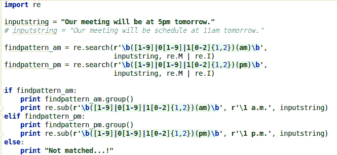

图 7.12：基于模式的规则代码片段

前面代码片段的输出是：


图 7.13：基于模式的规则输出

给出的示例是一个基础示例，但它帮助你思考如何进行校对。许多简单的规则集合可以应用到数据上，并根据模式，你将获得修正后的结果。

# 练习

编写类似的规则，帮助修正时间格式 11:30am 或 5:45pm 为 11:30 a.m. 或 5:45 p.m.

# 语法修正

我们将为简单现在时的主谓一致规则做一个简单的定义。

我们知道在简单现在时中，第三人称单数主语总是使用单数动词，动词后缀为 s/es。

这里是一些不正确句子的示例：

+   他早晨喝番茄汤

+   她会做饭

+   我们在线玩游戏

我们不能对这些不正确的句子执行基于模式的修正。在这里，为了制定规则，我们将解析每个句子并尝试通过解析结果进行检查。我们能制定任何规则吗？我已经解析了句子并生成了解析结果，你可以在*图 7.14*中看到解析树。这个结果是使用 Stanford 解析器生成的：

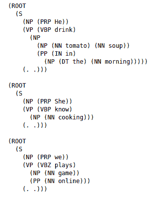

图 7.14：示例句子的解析结果

我们需要首先提取**NP**，它通常带有代词**PRP**/**NNP**或名词**NN**。这个规则可以限制为仅提取**PRP**。我们可以从句子中提取**PRP**标签。之后，我们需要提取**VP**。通过使用代词类型和**VP**，我们可以向用户建议更改。我猜你们应该记得**NP**、**PRP**、**NNP**等。这些都是词性标记（POS 标签），如我们在第五章中所展示的，*特征工程与 NLP 算法*。

规则逻辑：

+   提取带有**PRP**标签的**NP**

+   提取**VP**

+   根据**PRP**，在****VP****中进行修正

让我们为此编写代码：

我已经安装了 Stanford-`corenlp`和`pycornlp`库。你们已经在第五章中学习了如何安装 Stanford 解析器的步骤，*特征工程与 NLP 算法*。你们将编写代码。所以，这是一个完整的代码挑战。我提供了一段代码，其中为你提取了**PRP**和**VBZ**/**VBP**的模式。你的任务是检查**PRP**与**VBP**/**VBZ**的组合是否正确。如果不正确，则发出警报。你可以在此处找到代码：[`github.com/jalajthanaki/NLPython/blob/master/ch7/7_3_SVArule.py`](https://github.com/jalajthanaki/NLPython/blob/master/ch7/7_3_SVArule.py)

你可以在*图 7.15*和*图 7.16*中看到代码片段：

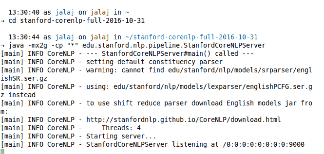

图 7.15：声明的 Stanford corenlp 服务器

我已经给你提供了代码，但你需要完成它：

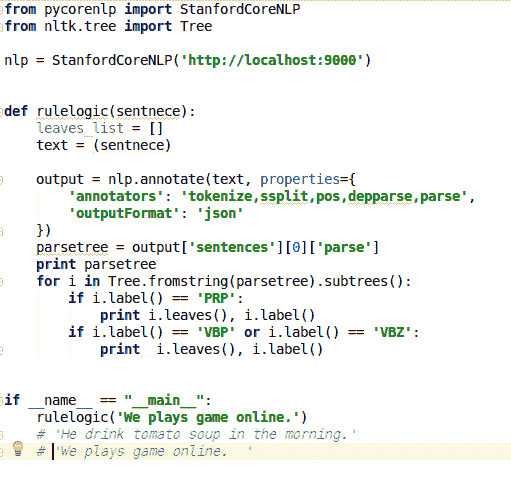

图 7.16：我已经给你提供的代码，但你需要完成它

你可以在*图 7.17*中看到我未完成的代码输出：

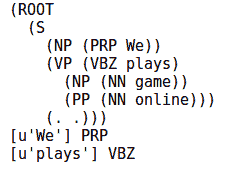

图 7.17：我未完成的代码输出

# 基于模板的聊天机器人应用

在这里，我们将看到如何为一个聊天机器人应用构建核心引擎，该应用可以帮助贷款申请人申请贷款。我们生成 JSON 格式的输出，因此任何前端开发人员都可以将这个输出集成到网站中。

在这里，我使用了 Flask Web 框架，并为我们的聊天机器人每个问题创建了 Web 服务。

如果你想保存用户数据，你需要安装 MongoDB。MongoDB 的安装步骤在这个链接中：[`docs.mongodb.com/manual/tutorial/install-mongodb-on-ubuntu/`](https://docs.mongodb.com/manual/tutorial/install-mongodb-on-ubuntu/)

我在`conversationengine.py`文件中定义了函数。该文件在 GitHub 上的路径是：[`github.com/jalajthanaki/NLPython/blob/master/ch7/chatbot/customscripts/conversationengine.py`](https://github.com/jalajthanaki/NLPython/blob/master/ch7/chatbot/customscripts/conversationengine.py)

你可以在`flaskengin.py`文件中看到 Flask Web 引擎的代码。GitHub 链接是：[`github.com/jalajthanaki/NLPython/blob/master/ch7/chatbot/customscripts/conversationengine.py`](https://github.com/jalajthanaki/NLPython/blob/master/ch7/chatbot/customscripts/conversationengine.py)

整个文件夹和包的路径是：[`github.com/jalajthanaki/NLPython/tree/master/ch7/chatbot`](https://github.com/jalajthanaki/NLPython/tree/master/ch7/chatbot)

# 代码流程

所以，我在`conversationengine.py`中编写了函数，根据你所提的问题生成 JSON 响应，这个 JSON 响应可以被前端开发团队用来在聊天机器人 UI 上显示消息。

然后，我使用 Flask 编写了一个 Web 服务，因此你可以在 JSON 中指定的 Web URL 上看到 JSON 响应。

`conversationengine.py`是核心规则引擎，包含手工编写的规则和代码。请参见*图 7.18*中的代码片段：

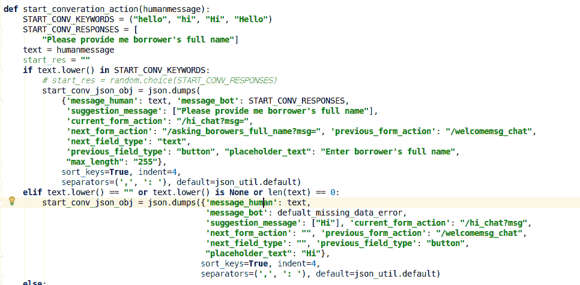

图 7.18：`conversationengine.py`的代码片段

在这里，我们使用了一个关键字列表和一个响应列表来实现聊天机器人。我还创建了自定义的 JSON 架构来导出对话。如果你来自 Web 开发背景，你可以编写 JavaScript，它将帮助你在前端显示这个 JSON，并展示图形用户界面。

现在，让我们看看*图 7.19*中的 Web 服务部分：

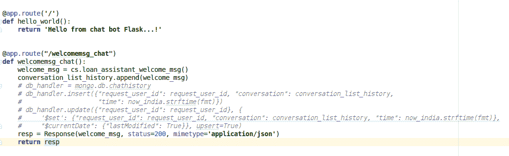

图 7.19：Flask Web 服务 URL 在`flaskengin.py`中定义

现在，要运行脚本并查看输出，按照以下步骤操作：

1.  首先运行`flaskengin.py`

1.  访问这个 URL：`http://0.0.0.0:5002/`，你将看到`Hello from chatbot Flask!`

1.  你可以通过使用这个 URL 查看聊天机器人的 JSON 响应：`http://0.0.0.0:5002/welcomemsg_chat`

1.  你可以在*图 7.20*中看到 JSON 响应：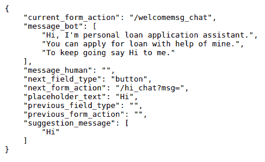

图 7.20：聊天机器人的 JSON 响应

1.  现在，我们正在向我们的用户提供建议，帮助他们分析他们期望的输入是什么。所以，在这里，你可以看到 JSON 属性`suggestion_message: ["Hi"]`。因此，用户将看到一个标签为`Hi`的按钮。

1.  如果你想跳转到下一页或下一个问题，可以使用`next_form_action` URL，并将用户参数放在`msg = USER ARGUMENT`之后。

1.  例如，我正在 `http://0.0.0.0:5002/welcomemsg_chat` 页面。现在，你可以阅读 `message_bot`。它告诉你需要对机器人说 `Hi`

1.  你可以像这样发送你的 `Hi` 响应：`http://0.0.0.0:5002/hi_chat?msg=Hi`

1.  当你在这个 URL 上时：`http://0.0.0.0:5002/hi_chat?msg=Hi`，你可以看到聊天机器人会询问你的名字，现在你需要输入你的名字。

1.  要输入你的名字并跳转到下一个问题，你需要再次检查 URL 中 `next_form_action` 属性的值

1.  这里的值是 `/asking_borowers_email_id?msg=`

1.  你需要在 `=` 符号后面输入你的名字，这样 URL 就变成 `/asking_borowers_email_id?msg=Jalaj Thanaki`

1.  当你使用 `http://0.0.0.0:5002/asking_borowers_full_name?msg=Jalaj%20Thanaki` 时，你可以看到聊天机器人提出下一个问题。

1.  首先你需要运行脚本：[`github.com/jalajthanaki/NLPython/blob/master/ch7/chatbot/flaskengin.py`](https://github.com/jalajthanaki/NLPython/blob/master/ch7/chatbot/flaskengin.py)，然后你可以查看以下 URL：

    +   `http://0.0.0.0:5002/welcomemsg_chat`

    +   `http://0.0.0.0:5002/hi_chat?msg=Hi`

    +   `http://0.0.0.0:5002/asking_borowers_full_name msg=Jalaj%20Thanaki`

    +   `http://0.0.0.0:5002/asking_borowers_email_id?msg=jalaj@gmail.com`

    +   `http://0.0.0.0:5002/mobilenumber_asking?msg=9425897412`

    +   `http://0.0.0.0:5002/loan_chat?msg=100000`

    +   `http://0.0.0.0:5002/end_chat?msg=Bye`

如果你想在 MongoDB 数据库中插入用户数据，这是可能的，代码中有相关内容，但已被注释掉。

# 基于模板的聊天机器人优点

+   实现容易。

+   时间和成本高效。

+   使用案例在开发之前就已经确定，因此用户体验也会很好。

+   这是一种模式匹配方法，所以如果用户在对话中使用英语和其他语言，聊天机器人也能提供回答，因为它识别出用户提供的英语关键词，并且如果这些英语关键词与聊天机器人的词汇表匹配，聊天机器人就能给出回答。

# 基于模板的聊天机器人缺点

+   它不能处理未见过的使用案例

+   用户需要处理一个严格的对话流程

+   用户的拼写错误会给聊天机器人带来问题。在这种情况下，我们将使用深度学习

# 练习

为酒店房间预订客户支持服务开发一个基于模板的聊天机器人应用程序。开发一些问题和答案，并开发应用程序。

# 将基于规则的方法与其他方法进行比较

基于规则的方法是一种非常可靠的引擎，它为你的应用程序提供高准确性。当你将 RB 方法与 ML 方法或深度学习方法进行比较时，你会发现以下几点：

+   对于 RB 方法，你需要一个领域专家，而对于 ML 方法或深度学习方法，你不需要领域专家

+   RB 系统不需要大量数据，而 ML 和深度学习需要非常大量的数据

+   对于 RB 系统，你需要手动寻找模式，而机器学习（ML）和深度学习技术则会根据数据和输入特征为你自动寻找模式。

+   RB 系统通常是开发最终产品初步版本的一个不错方法，在实践中仍然广受欢迎。

# 基于规则系统的优点

使用 RB 系统有很多优点。优点如下：

+   可用性：系统对用户的可用性不是问题。

+   成本效益：该系统在最终结果方面具有成本效益且准确。

+   速度：你可以优化系统，因为你了解系统的所有部分。因此，在几秒钟内提供输出不是一个大问题。

+   准确性和较低的错误率：尽管不同场景的覆盖面较少，但 RB 系统涵盖的所有场景都能提供高准确性。由于这些预定义规则，错误率也较低。

+   降低风险：我们在系统准确性方面降低了风险。

+   稳定响应：系统生成的输出依赖于规则，因此输出响应是稳定的，这意味着它不能模糊不清。

+   与人类相同的认知过程：该系统为你提供与人类相同的结果，因为它是由人类手工制作的。

+   模块化：RB 系统的模块化和良好的架构可以帮助技术团队轻松维护。这减少了人工工作和时间。

+   一致性：RB 系统在其实现和输出方面非常一致。这使得最终用户的生活更轻松，因为系统的输出容易被人类理解。

+   易于实现：该方法模仿了人类的思维过程，因此规则的实施对开发人员来说相对容易。

# 基于规则系统的缺点

RB 系统的缺点如下：

+   大量手工工作：RB 系统要求对领域有深刻的了解，同时需要大量的手工工作。

+   耗时：为一个复杂系统生成规则是一个相当具有挑战性且耗时的过程。

+   学习能力较弱：在这里，系统将根据规则生成结果，因此系统本身的学习能力较差。

+   复杂领域：如果你要构建的应用程序过于复杂，构建 RB 系统可能会耗费大量时间和分析。复杂模式识别是 RB 方法中的一项挑战性任务。

# 基于规则系统的挑战

让我们来看一下 RB 方法中的一些挑战：

+   模仿人类行为并不容易。

+   选择或设计架构是 RB 系统的关键部分。

+   为了开发 RB 系统，你需要是特定领域的专家，能够为我们生成规则。对于自然语言处理（NLP），我们需要了解如何分析语言的语言学家。

+   自然语言本身就是一个具有挑战性的领域，因为它有许多例外情况，而使用规则覆盖这些例外情况也是一个具有挑战性的任务，尤其当你有大量规则时。

+   阿拉伯语、古吉拉特语、印地语和乌尔都语在 RB 系统中难以实现，因为为这些语言寻找领域专家是一项艰巨的任务。对于这些语言，实施规则的工具也较少。

+   人类努力的时间消耗太大。

# 理解词义消歧的基础知识。

**词义消歧** (**WSD**) 是自然语言处理中的一个著名问题。首先，让我们了解一下什么是 WSD。WSD 用于在一个单词有多重含义的情况下，确定该单词在句子中的具体意义。当一个单词有多个含义时，机器很难识别正确的意义，解决这个挑战性问题的方法包括使用基于规则的系统或机器学习技术。

本章的重点是 RB 系统。因此，我们将了解 WSD 是如何被解决的。为了使用 RB 系统解决这个复杂问题，您可以采取以下步骤：

+   当你尝试解决任何语言的 WSD 时，你需要大量数据，其中包含多种不同情境下，单词含义会随句子变化的实例。

+   一旦你有了这种数据集，接下来就需要人类专家介入。

+   人类专家用于标注一个单词或多个单词的意义，通常这些标签都有一些预定义的 ID。现在，让我们举个例子：我有这样的句子：I went to river bank（我去了河岸），和 I went to bank to deposit my money（我去银行存钱）。

+   在前面的句子中，单词“bank”有多重含义，且其含义随着整体句子而变化。因此，需要人类专家来标注这些类型的单词。这里的单词是“bank”。

+   因此，人类专家使用预定义的 ID 标注“bank”在“river bank”（河岸）中的意义。假设此时的 ID 是 100。

+   在第二个句子中，单词“bank”通过使用预定义的 ID 被标注为金融机构。假设目前该 ID 是 101。

+   一旦这个标签被赋予，下一阶段就开始了，即选择基于规则的引擎或监督机器学习技术。

+   如果我们决定使用基于规则的系统，那么人类专家需要提出一定的模式或规则，帮助我们消除词义歧义。有时候，对于某些单词，专家可以通过使用解析结果或 POS 标签找到规则，但在大多数情况下，他们做不到。

+   如今，一旦标注完成，标注数据就作为输入，用于开发一个监督学习模型，帮助人类识别单词的词义。

+   有时候，仅靠基于规则的系统无法工作，单独的机器学习方法有时也无法帮你解决问题。根据我的经验，这是同样的情况。我认为混合方法会给你带来更好的结果。

+   在标注数据之后，我们应当构建一个规则库（RB）系统，它能够很好地处理已知的情况，同时也有一些情况我们无法定义规则。为了解决这些情况，我们需要构建一个机器学习模型。

+   你还可以使用向量化概念和深度学习模型来解决词义消歧（WSD）问题。通过使用深度学习来研究词义消歧，你的发现也可以作为一个研究课题。

# 讨论规则库系统的最新趋势

本节讨论的是当前市场如何使用规则库系统。许多人在不同的论坛上提出了许多问题，他们想了解规则库系统的未来。我想和你讨论一个重要问题，这个问题将帮助你了解 NLP 市场和规则库系统的未来趋势。我们将探讨一些问题。

规则库系统在自然语言处理（NLP）领域是否过时了？我想回答这个问题的答案是“没有”。规则库系统在所有 NLP 应用中得到了广泛应用，包括语法纠正、语音识别、机器翻译等！当你开始制作任何新的 NLP 应用时，这种方法是第一步。如果你想对你的想法进行实验，那么可以通过规则库方法轻松开发原型。进行原型开发时，你需要领域知识和基本的编码技能。你不需要了解高阶数学或机器学习技术。对于基础原型开发，你应该选择规则库系统。

深度学习和基于机器学习（ML）的方法能否取代基于规则库的系统？这个问题是一个相当开放性的问题。我希望在此提供一些事实，帮助你思考这个问题。如今，我们被大量数据淹没，并且拥有廉价的计算能力。人工智能行业及其基于人工智能的项目正在引起广泛关注。前面提到的两点使得深度学习和机器学习方法能够为自然语言处理（NLP）以及其他人工智能应用提供准确的结果。这些方法相比规则库系统需要更少的人工干预。这也是为什么许多人认为规则库系统不会被深度学习和基于机器学习的方法所取代。我认为规则库系统不会完全被取代，但它会与这些方法互为补充。那么，你可能会问，如何做到呢？我的答案是，我认为我们应该采用混合方法，这对我们更为有利。我们可以借助机器学习系统来发现模式或做出预测，然后将这些预测交给规则库系统，规则库系统可以验证这些预测，并为用户选择最佳方案。这实际上帮助我们解决了规则库系统的一个主要挑战——减少人工干预和时间。

对于前面的问题，没有绝对的对错答案。这完全取决于你如何看待这些问题和自然语言处理领域。我只是想给你留下一些思考，自己思考一下，尽量得出你自己的答案。

# 摘要

在这一章中，我们已经了解了与基于规则的系统相关的所有细节，以及基于规则的方法如何帮助我们为复杂问题开发具有高精度的快速原型。我们已经了解了基于规则的系统架构，学习了基于规则系统的优缺点和挑战。我们还看到，这个系统如何帮助我们开发自然语言处理（NLP）应用程序，例如语法纠错系统、聊天机器人等。我们还讨论了基于规则系统的最新趋势。

在下一章，我们将学习另一种主要方法——机器学习，用来解决 NLP 应用问题。接下来的章节将向你详细介绍开发 NLP 应用时需要使用哪些机器学习算法。我们将探讨监督学习、半监督学习和无监督学习技术，并从零开始开发一些应用。所以，继续阅读！

这次自动驾驶汽车考试
