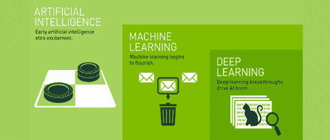
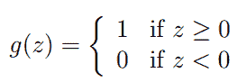
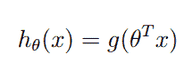
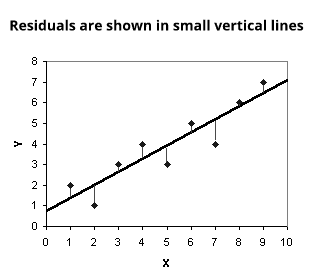
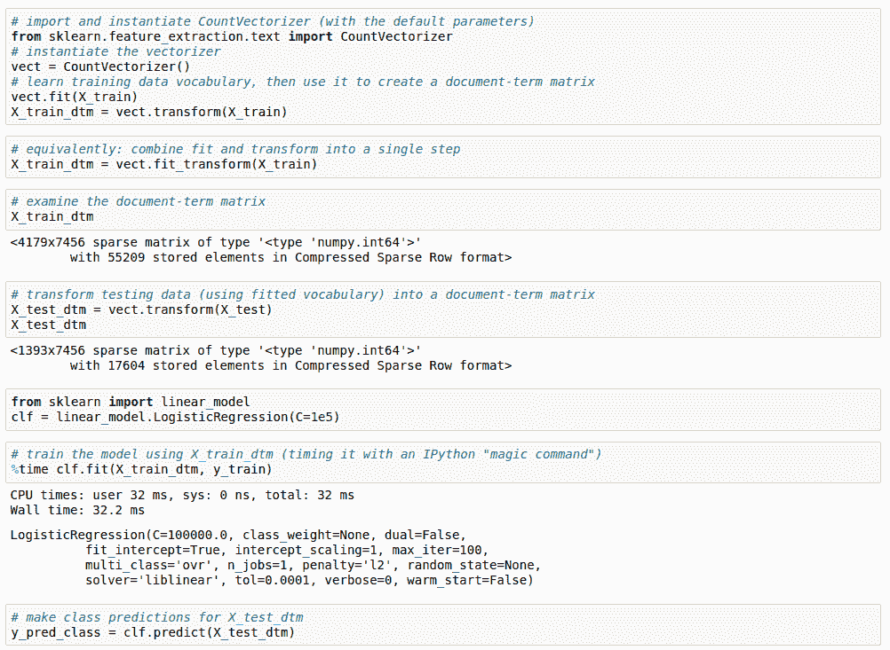
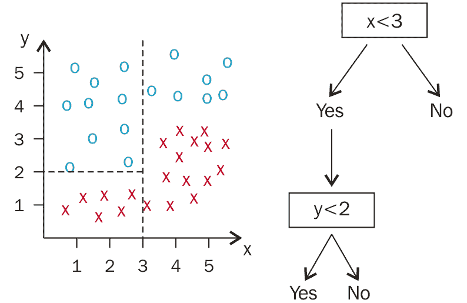

# 第八章：机器学习在 NLP 问题中的应用

我们已经看到了特征工程的基础和高级层面。我们还了解了基于规则的系统如何用于开发自然语言处理（NLP）应用程序。在本章中，我们将开发 NLP 应用程序，并且为了开发这些应用程序，我们将使用**机器学习**（**ML**）算法。我们将从机器学习的基础开始。接下来，我们将看到使用机器学习的 NLP 应用程序的基本开发步骤。我们主要会看到如何在 NLP 领域使用机器学习算法。然后，我们将进入特征选择部分。我们还将看看混合模型和后处理技术。

本章的大纲如下：

+   理解机器学习的基础

+   NLP 应用程序的开发步骤

+   理解机器学习算法和其他概念

+   NLP 应用的混合方法

一起探索机器学习的世界吧！

# 理解机器学习的基础

首先，我们将了解什么是机器学习。传统上，编程是关于定义所有步骤以达到某个预定结果。在编程的过程中，我们使用编程语言定义每一个细小的步骤，帮助我们实现目标。为了让你有一个基本的理解，我会举一个通用的例子。假设你想写一个程序来帮助你画一个面孔。你可能首先写绘制左眼的代码，然后写绘制右眼的代码，再写鼻子的代码，依此类推。在这里，你是在为每一个面部特征编写代码，但机器学习（ML）颠覆了这种方法。在机器学习中，我们定义结果，程序学习实现该结果的步骤。因此，取而代之的是为每个面部特征编写代码，我们向机器提供数百个人脸样本。我们期望机器能够学习绘制人脸所需的步骤，这样它就能画出一些新的面孔。除此之外，当我们提供新的人的面孔以及一些动物的面孔时，机器应该能够识别哪个面孔像是人的面孔。

我们来看一些常见的例子。如果你想识别某些州的有效车牌，在传统编程中，你需要写出车牌的形状应该是什么样的，颜色应该是什么，字体是什么等等。如果你试图手动为车牌的每个属性编写代码，这些步骤会非常冗长。使用机器学习，我们将向机器提供一些示例车牌，机器会学习步骤，从而能够识别新的有效车牌。

假设你想制作一个可以玩超级马里奥并且能够赢得比赛的程序。那么，定义每个游戏规则对我们来说太困难了。我们通常会定义一个目标，比如你需要在不死的情况下到达终点，机器学习将学习到达终点所需的所有步骤。

有时候，问题过于复杂，甚至我们自己也不知道应该采取哪些步骤来解决这些问题。例如，我们是一家银行，怀疑可能存在一些欺诈行为，但我们不确定如何检测这些行为，甚至不知道该寻找什么。我们可以提供所有用户活动的日志，并找到那些与其他用户行为不同的用户。机器通过自身学习来检测异常的步骤。

ML 无处不在于互联网上。每一家大型科技公司都在以某种方式使用它。当你观看任何 YouTube 视频时，YouTube 会更新并向你推荐你可能喜欢观看的其他视频。甚至你的手机也使用 ML 提供像 iPhone 的 Siri、Google 助手等功能。ML 领域目前正在迅速发展。研究人员使用旧的概念，改变其中的一些，或借用其他研究人员的工作，以使其更高效、更有用。

让我们来看一下传统的 ML 基本定义。1959 年，一位名叫 Arthur Samuel 的研究员赋予了计算机无需明确编程即可学习的能力。他将 ML 的概念从人工智能中的模式识别和计算学习理论中演化出来。1997 年，Tom Mitchell 给出了一个准确的定义，这个定义对于那些能够理解基础数学的人来说非常有用。Tom Mitchell 定义的 ML 是：如果一个计算机程序在某任务 T 上，通过经验 E 和性能评估 P 的衡量，其在 T 上的表现随着经验 E 的增加而提高，那么我们就说该程序已经从经验 E 中学习。

让我们将前面的定义与我们之前的示例联系起来。识别车牌号的任务称为任务**T**。你将使用车牌号的示例来运行一些 ML 程序，这些示例称为经验**E**，如果程序成功学习，那么它就能预测下一个未见过的车牌号，这个过程叫做性能评估**P**。现在是时候探索不同类型的 ML 以及它与 AI 的关系了。

# ML 的类型

在本节中，我们将查看不同类型的 ML 以及一些有趣的子分支和超分支关系。

ML 本身源自于被称为**人工智能**的分支。ML 还有一个近年来备受关注的分支，叫做**深度学习**，但我们将在第九章中详细讨论人工智能和深度学习，*深度学习在 NLP 和 NLG 问题中的应用*。

学习技术可以分为不同的类型。在本章中，我们重点关注的是 ML。请参见*图 8.1*：

图 8.1：ML 与其他分支的子集与超集关系（图片来源： https://portfortune.files.wordpress.com/2016/10/ai-vs-ml.jpg）

ML 技术可以分为三种不同的类型，您可以在*图 8.2*中看到：

图 8.2：三种机器学习类型（图片来源：https://cdn-images-1.medium.com/max/1018/1*Yf8rcXiwvqEAinDTWTnCPA.jpeg）

我们将详细介绍每种机器学习类型。那么，让我们开始吧！

# 监督学习

在这种类型的机器学习中，我们将提供一个已标记的数据集作为输入给 ML 算法，算法知道什么是正确的，什么是错误的。在这里，ML 算法学习标签与数据之间的映射关系。它生成 ML 模型，然后生成的 ML 模型可以用来解决给定的任务。

假设我们有一些文本数据，其标签为垃圾邮件和非垃圾邮件。数据集中的每个文本流都有这两个标签之一。当我们应用监督学习算法时，它使用标记数据并生成一个 ML 模型，预测未见过的文本流是垃圾邮件还是非垃圾邮件。这就是监督学习的一个例子。

# 无监督学习

在这种类型的机器学习中，我们将提供一个未标记的数据集作为输入给 ML 算法。因此，我们的算法无法获得任何关于数据是否正确的反馈。它必须通过自身学习数据的结构来解决给定的任务。使用未标记的数据集更具挑战性，但也更为便捷，因为并不是每个人都有一个完美标注的数据集。大部分数据都是未标记的、杂乱无章且复杂的。

假设我们正在尝试开发一个摘要应用程序。我们可能没有总结出与实际文档相对应的文档摘要。那么，我们将使用原始数据和实际文本文档来为给定文档创建摘要。在这里，机器不会收到关于 ML 算法生成的摘要是否正确的任何反馈。我们还将看到计算机视觉应用的一个例子。对于图像识别，我们将一些卡通角色的未标记图像数据集输入到机器中，并期望机器学习如何分类每个角色。当我们提供一个未见过的卡通角色图像时，机器应能够识别该角色，并将图像放入正确的类别，这是由机器自身生成的。

# 强化学习

第三种机器学习（ML）类型是强化学习。在这种情况下，ML 算法不会在每次预测后立即给出反馈，而是当 ML 模型达到目标时才会生成反馈。这种学习方式通常用于机器人技术领域，以及开发智能机器人来进行游戏。强化学习与通过试错方法与环境交互的思想密切相关。请参见*图 8.3*：

图 8.3：强化学习与环境的交互（图片来源：https://devblogs.nvidia.com/parallelforall/wp-content/uploads/2016/04/aeloop-300x183.png）

为了学习基础知识，让我们举一个例子。假设你想做一个能击败人类的国际象棋机器人。这种类型的机器人只有在赢得比赛时才会收到反馈。最近，Google 的 AlphaGo 击败了世界上最强的围棋选手。如果你想了解更多，可以参考以下链接：

[`techcrunch.com/2017/05/24/alphago-beats-planets-best-human-go-player-ke-jie/.`](https://techcrunch.com/2017/05/24/alphago-beats-planets-best-human-go-player-ke-jie/)

在本书中，我们不会详细探讨这种类型的机器学习，因为我们的主要重点是 NLP，而不是机器人技术或开发游戏机器人。

如果你真的想深入学习**强化学习**（**RL**），你可以参加这个课程：

[`www.udacity.com/course/reinforcement-learning--ud600`](https://in.udacity.com/course/reinforcement-learning--ud600/).

我知道你一定对不同类型的机器学习有所兴趣。所以，在阅读下一个段落时，请集中注意力。

对于监督学习，每个步骤或预测后都会收到反馈。而在强化学习中，只有当我们的模型达成目标时，我们才会收到反馈。在无监督学习中，即使我们达成了目标或我们的预测是正确的，我们也不会得到反馈。强化学习与现有环境进行互动，并使用试错法，而另外两种类型则不适用试错法。在监督学习中，我们使用有标签的数据，而在无监督学习中，我们使用无标签的数据，强化学习涉及多个目标和决策过程。你可以参考*图 8.4*：

图 8.4：监督学习、无监督学习和强化学习的比较（图片来源：http://www.techjini.com/wp-content/uploads/2017/02/mc-learning.jpg）

从这一部分开始，你将学习到很多新东西，如果一开始你不理解一些术语，别担心！请耐心一点；我会在本章中通过实际的例子解释每个概念。那么，让我们开始理解使用机器学习的 NLP 应用程序的开发步骤吧。

# NLP 应用程序的开发步骤

在这一部分，我们将讨论使用机器学习算法开发自然语言处理（NLP）应用程序的步骤。这些步骤在不同领域之间有所不同。对于 NLP 应用程序，数据可视化并不像分析型应用程序那样起着至关重要的作用，而分析型应用程序的数据可视化会提供很多洞察力。因此，这会因应用程序和领域的不同而有所变化。在这里，我的重点是 NLP 领域和 NLP 应用程序，当我们查看代码时，我一定会回顾我在这里描述的步骤，帮助你将各个点连接起来。

我将开发步骤分为两个版本。第一个版本考虑的是这是你 NLP 应用开发的第一次迭代。第二个版本将帮助你了解在第一次迭代后，你可以考虑的可能步骤。请参考*图 8.5*：

图 8.5：NLP 应用开发步骤版本

# 第一次迭代的开发步骤

首先，我们将看一下在使用 ML 开发 NLP 应用的第一次版本时，一般可以用到的步骤。在我的解释过程中，我将参考*图 8.6*，以便你能更好地理解：

图 8.6：使用 ML 算法开发应用的第一次版本和迭代

我将解释每一个步骤：

1.  这个版本的第一步是理解你的问题陈述、应用需求，或你正在尝试解决的目标。

1.  第二步是获取你解决目标所需的数据，或者如果你已经有了数据集，那么尝试了解该数据集包含什么，以及你需要什么来构建 NLP 应用。如果你需要其他数据，那么首先问问自己：你能否借助现有的数据集推导出所需的子数据属性？如果可以，那么可能不需要获取新的数据集；如果不行，那么尝试获取一个可以帮助你开发 NLP 应用的数据集。

1.  第三步是思考你想要什么样的最终结果，并根据这个结果开始探索数据集，进行一些基本分析。

1.  第四步是在对数据进行一般分析后，可以对其应用预处理技术。

1.  第五步是从预处理过的数据中提取特征，作为特征工程的一部分。

1.  第六步是，使用统计技术可视化特征值。这是 NLP 应用的一个可选步骤。

1.  第七步是为你的基准模型构建一个简单的基础模型。

1.  最后但同样重要的是，评估基本模型，如果达到预期标准，那就很好；否则，你需要更多的迭代，并且需要遵循另一个版本，我将在下一节中进行描述。

# 第二次到第 n 次迭代的开发步骤

我们已经看过第一次迭代的步骤，现在我们将看看如何执行第二次迭代，以便提高我们的模型准确性和效率。在这里，我们还试图使我们的模型尽可能简单。所有这些目标将成为这个开发版本的一部分。

现在我们将看看第一次迭代后的步骤。为了基本理解，请参考*图 8.7*：

图 8.7：ML 构建周期

第二次迭代的一些基本步骤如下：

1.  在第一次迭代后，你已经构建了一个模型，现在需要改进它。我建议你尝试不同的机器学习（ML）算法来解决同一个自然语言处理（NLP）应用，并比较其准确度。根据准确度选择最好的三个 ML 算法。这将是第一步。

1.  作为第二步，通常你可以对每个选择的 ML 算法进行超参数调优，以获得更好的准确度。

1.  如果参数优化对你帮助不大，那么你需要真正集中精力在特征工程部分，这将是你的第三步。

1.  现在，特征工程有两个主要部分：特征提取和特征选择。因此，在第一次迭代中，我们已经提取了特征，但为了优化我们的 ML 模型，我们需要在特征选择上进行工作。我们将在本章后面详细介绍所有的特征选择技术。

1.  在特征选择中，你基本上是选择那些真正重要的特征、变量或数据属性，这些特征对结果的生成至关重要或者贡献很大。因此，我们将只考虑重要的特征，去除其他的。

1.  你还可以去除离群值，执行数据标准化，并在输入数据上应用交叉验证，这将有助于你改进 ML 模型。

1.  在执行了这些技巧后，如果你没有得到准确的结果，那么你需要花一些时间推导出新的特征并使用它们。

1.  你可以反复执行之前的所有步骤，直到你得到一个令人满意的结果。

这就是你可以开发 NLP 应用的方法。你应该观察你的结果，然后在下一次迭代中采取合理且必要的步骤。聪明地分析，思考所有问题，然后反复调整来解决它们。如果你没有彻底分析你的结果，那么反复调整永远不会帮助你。因此，保持冷静，明智地思考，并不断迭代。别担心；当我们使用 ML 算法开发 NLP 应用时，我们会回顾之前的过程。如果你是研究人员，我强烈建议你理解 ML 算法背后的数学原理，但如果你是初学者且对数学不太熟悉，你可以阅读 ML 库的文档。在这两者之间的同学，尝试理解数学原理并加以实施。

现在，是时候深入探索 ML 世界，学习一些真正出色的算法了。

# 理解 ML 算法和其他概念

在这里，我们将介绍 NLP 领域中最广泛使用的机器学习算法。我们将根据机器学习的类型来看不同的算法。首先，我们将从监督学习算法开始，然后是无监督学习算法，最后是半监督学习算法。在这里，我们不仅会了解每个算法，还会学习其背后的数学原理。我会尽量简化内容，以便那些没有强大数学背景的人也能理解算法背后的直观概念。之后，我们将看到如何将这些算法应用于实际开发一个 NLP 应用程序。我们将开发一个很酷的 NLP 应用，它将帮助你理解这些算法，而不会让你感到困惑。

那么，让我们开始吧！

# 监督学习（Supervised ML）

我们在本章前面看到过监督学习的简介。我们所看到和使用的所有技术和数据集都包含了它们的结果、输出或标签，这些内容已经在数据集中给定了。因此，这意味着每当你拥有一个带标签的数据集时，你可以使用监督学习算法。

在开始学习算法之前，我会先介绍两个监督学习算法的主要概念。这也将帮助你决定在解决 NLP 或其他数据科学相关问题时，选择哪个算法：

+   回归

+   分类

# 回归

回归是一个统计过程，用于估算变量之间的关系。假设你有一堆变量，想要找出它们之间的关系。首先，你需要确定哪些是因变量，哪些是自变量。回归分析可以帮助你理解因变量如何根据自变量的取值变化其行为或值。在这里，因变量依赖于自变量的值，而自变量的取值则不依赖于其他变量。

让我们通过一个例子来帮助你更清楚地理解。如果你有一个数据集，里面包含人的身高数据，你需要根据身高来预测体重，这就是监督学习，而你数据集里已经包含了年龄数据。因此，你有两个属性，也叫变量：身高和体重。现在，你需要根据给定的身高预测体重。那么，稍微思考一下，告诉我哪个数据属性或变量是因变量，哪个是自变量。我希望你有一些想法。现在让我来解答。这里，体重是因变量，它依赖于身高这个自变量。身高是自变量。自变量也被称为**预测变量**（**s**）。所以，如果你有因变量和自变量之间的某种映射关系，你就可以根据身高预测体重。

请注意，当我们的输出或因变量是连续值时，使用的是回归方法。在我们的示例中，体重可以是任何值，例如 20 公斤、20.5 公斤、20.6 公斤、60 公斤等等。对于其他数据集或应用，因变量的值可以是任何实数。参见*图 8.8*：

图 8.8：线性回归示例

# 分类

在本节中，我们将探讨监督学习的另一个主要概念，即**分类技术**。这也叫做**统计分类**。

统计分类用于为给定的新观察值确定类别。因此，我们有许多类别可以将新观察值归类。然而，我们不会盲目地选择任何类别，而是会使用给定的数据集，并根据这个数据集，尝试确定最适合新观察值的类别，并将我们的观察值放入这个类别或类中。

让我们从自然语言处理领域本身举个例子。你有一个数据集，里面包含一堆电子邮件，并且这些电子邮件已经有了分类标签，标签是垃圾邮件（spam）或非垃圾邮件（non-spam）。所以，我们的数据集分为两个类别——垃圾邮件和非垃圾邮件。那么，如果我们收到一封新邮件，我们能否将其分类为垃圾邮件或非垃圾邮件呢？答案是肯定的。为了对新邮件进行分类，我们使用我们的数据集和机器学习算法，给新邮件提供最合适的分类。实现分类的算法叫做**分类器**。有时，分类器这个术语也指由分类器算法实现的数学函数，这个函数将输入数据映射到某个类别。

请注意，这一点有助于你识别回归和分类之间的区别。在分类中，输出变量采用的是类标签，基本上是离散的或类别性的值。而在回归中，我们的输出变量则是连续的值。参见*图 8.9*：

图 8.9：为了直观理解，展示的分类可视化

现在我们已经对回归和分类有了一个大致的了解，让我们理解一些基本术语，这些术语我会在解释机器学习算法，特别是分类时不断使用：

+   **实例：** 这指的是输入，通常它们是以向量的形式存在。这些是属性的向量。在 POS 标注器示例中，我们使用了从每个单词派生的特征，并通过`scikit-learn`的 API `DictVectorizer`将它们转换为向量。这些向量值被输入到机器学习算法中，所以这些输入向量就是实例。

+   **概念：** 概念是指将输入映射到输出的一个函数。所以，如果我们有一封电子邮件内容，并且我们试图判断该电子邮件是垃圾邮件还是非垃圾邮件，我们必须关注输入或实例中的某些特定参数，然后生成结果。如何从某个输入中识别出特定输出的过程称为**概念**。例如，你有一些关于人类身高的数据，以英尺为单位。看到这些数据后，你可以判断这个人是高还是矮。在这里，概念或函数帮助你根据给定的输入或实例找到输出。所以，如果我用数学的形式来表达，那么概念就是一个世界中对象与集合中的成员之间的映射。

+   **目标概念：** 目标概念是指我们试图找到的实际答案、特定函数或某个特定的想法。作为人类，我们已经理解了很多概念，比如通过阅读电子邮件，我们可以判断它是垃圾邮件还是非垃圾邮件，如果你的判断是正确的，那么你就可以得到实际的答案。你知道什么是**垃圾邮件**，什么不是，但除非我们实际将其写下来，否则我们无法知道它是否正确。如果我们为数据集中的每个原始数据记录下这些实际答案，那么我们就可以更轻松地识别哪些电子邮件应被视为垃圾邮件，哪些不应被视为垃圾邮件。这有助于你为新的实例找到实际答案。

+   **假设类：** 假设类是所有可能的函数的集合，它们可以帮助我们对实例进行分类。我们刚刚看到了目标概念，我们正在试图找出一个特定的函数，但在这里我们可以考虑所有可能且潜在的函数的一个子集，这些函数可以帮助我们找到分类问题的目标概念。在这里，我想指出的是，我们看到的这个术语是针对分类任务的，因此不要考虑 x2 函数，因为它是线性函数，而我们正在进行的是分类，而不是回归。

+   **训练数据集：** 在分类中，我们试图找出目标概念或实际答案。那么，我们如何实际获得这个最终答案呢？为了使用机器学习技术得到最终答案，我们将使用一些样本集、训练集或训练数据集，帮助我们找出实际答案。让我们看看什么是训练集。训练集包含所有与标签配对的输入。监督式分类问题需要一个带有实际答案或实际输出标签的训练数据集。所以，我们不仅是向机器传授什么是垃圾邮件或非垃圾邮件，我们还为机器提供了很多例子，比如这是垃圾邮件，这是非垃圾邮件，等等。对于机器来说，这样就能更容易理解目标概念。

+   **ML 模型：** 我们将使用训练数据集，并将这些数据输入到 ML 算法中。然后，ML 算法将尝试通过大量训练示例学习概念，并生成输出模型。这个输出模型可以在以后用于预测或判断给定的新邮件是垃圾邮件还是非垃圾邮件。这个生成的输出被称为**ML 模型**。我们将使用生成的 ML 模型，输入新的邮件，这个 ML 模型将生成是否该邮件属于垃圾邮件类别或非垃圾邮件类别的答案。

+   **候选：** 候选是我们的 ML 模型告诉我们新示例的潜在目标概念。所以，你可以说候选是机器预测的目标概念，但我们并不知道这个预测或生成的输出——即候选——是否是正确答案。让我们举个例子。我们已经提供了很多邮件示例给机器，机器可能会概括垃圾邮件和非垃圾邮件的概念。我们提供一封新的电子邮件，ML 模型可能会说它是非垃圾邮件，然而，我们需要检查 ML 模型的答案是否正确。这个答案被称为候选。那么，如何检查 ML 模型生成的答案是否与目标概念匹配呢？为了回答这个问题，我将介绍下一个术语——测试集。

+   **测试集：** 测试集看起来与训练数据集相似。我们的训练数据集包含带标签的电子邮件，例如垃圾邮件或非垃圾邮件。所以，我会拿一个被认为是候选答案的结果，我们将检查在测试集中的答案是否是非垃圾邮件还是垃圾邮件。我们将把我们的答案与测试集中的答案进行比较，并尝试找出候选答案是正确的还是错误的。假设非垃圾邮件是正确答案。现在，你会拿到另一封电子邮件，ML 模型将再次生成非垃圾邮件答案。我们将再次与测试集核对，结果这次 ML 模型生成了错误的答案——邮件实际上是垃圾邮件，但 ML 模型错误地将其分类为非垃圾邮件。所以，测试集帮助我们验证我们的 ML 模型。需要注意的是，训练集和测试集不应相同。因为，如果你的机器使用训练数据集来学习概念，并且你在训练数据集上测试 ML 模型，那么你就没有公平地评估你的 ML 模型。这被认为是在 ML 中作弊。因此，训练集和测试集应该始终不同；测试集是机器从未见过的数据集。我们这么做是因为我们需要检查机器在多大程度上能将给定问题进行泛化。这里，泛化意味着 ML 模型如何应对未知和未见过的例子。如果你仍然感到困惑，那么让我给你另一个例子。你是学生，老师教了你一些事实，并给了你一些例子。起初，你只是死记硬背这些事实。为了检查你是否掌握了正确的概念，老师将给你一场测试，并给你一些新颖的例子，你需要应用所学的知识。如果你能完美地将所学知识应用到测试中的新例子上，那么你实际上已经掌握了概念。这证明了我们可以将老师教的概念进行泛化。我们和机器做的事情是一样的。

现在让我们来了解 ML 算法。

# ML 算法

我们已经了解了 ML 的基本概念，现在我们将探索 ML 算法。首先，我们将了解在 NLP 领域中最常用的监督学习 ML 算法。我不会在这里涵盖所有的监督学习 ML 算法，但我会解释那些在 NLP 领域最广泛使用的算法。

在 NLP 应用中，我们主要通过应用各种 ML 技术进行分类。因此，在这里，我们的重点主要是算法的分类类型。其他领域，例如分析学，使用各种类型的线性回归算法，以及分析应用，但我们不会讨论这些算法，因为本书专注于 NLP 领域。由于一些线性回归的概念有助于我们理解深度学习技术，因此我们将在第九章中详细探讨线性回归和梯度下降，并通过实例展示，*深度学习在 NLP 和 NLG 问题中的应用*。

我们将使用各种算法开发一些自然语言处理应用程序，您可以看到算法是如何工作的，以及如何使用机器学习算法开发自然语言处理应用程序。我们将研究像垃圾邮件过滤这样的应用。

请参阅*图 8.10*：

图 8.10：我们将要理解的监督分类机器学习算法

现在让我们从核心的机器学习部分开始。

**逻辑回归**

我知道你一定很困惑，为什么我把逻辑回归放在分类类别里。让我告诉你，这只是给这个算法起的名字，但它用于预测离散的输出，因此这个算法属于分类类别。

对于这个分类算法，我将向您介绍逻辑回归算法的工作原理，并且我们将学习与之相关的一些基本数学知识。然后，我们将看看垃圾邮件过滤应用。

首先，我们将考虑二元类别，比如垃圾邮件或非垃圾邮件、好或坏、赢或输、0 或 1 等等，以理解算法及其应用。假设我想将电子邮件分类为垃圾邮件和非垃圾邮件。垃圾邮件和非垃圾邮件是离散的输出标签或目标概念。我们的目标是预测新的电子邮件是垃圾邮件还是非垃圾邮件。非垃圾邮件也称为**ham**。为了构建这个自然语言处理应用，我们将使用逻辑回归。

让我们先理解算法的技术细节。

在这里，我正在以非常简单的方式陈述与数学和这个算法相关的事实。理解这个算法的一般方法如下。如果你了解一些机器学习的知识，那么你可以连接这些点；如果你是机器学习的新手，那么不用担心，因为我们将逐步理解每个部分：

+   我们正在定义我们的假设函数，它帮助我们生成目标输出或目标概念。

+   我们正在定义成本函数或误差函数，并且我们选择误差函数的方式是使得我们可以推导出误差函数的偏导数，从而能够轻松计算梯度下降。

+   我们正在尝试最小化误差，以便生成更准确的标签，并准确分类数据。

在统计学中，逻辑回归也被称为**logit 回归**或**logit 模型**。这个算法通常作为二分类器使用，这意味着数据应该被分为两个不同的类别。二元逻辑回归模型用于估计二元响应的概率，并根据一个或多个预测变量、独立变量或特征生成响应。这也是一个在深度学习中使用基本数学概念的机器学习算法。

首先，我想解释一下为什么这个算法叫做**逻辑回归**。原因是该算法使用了逻辑函数或 S 型函数。逻辑函数和 S 型函数是同义词。

我们使用 Sigmoid 函数作为假设函数。假设函数是什么意思呢？嗯，正如我们之前所看到的，机器必须学习数据属性和给定标签之间的映射，以便它能够预测新数据的标签。如果机器能够通过一个数学函数学习这种映射，就能够实现这一目标。这个数学函数就是假设函数，机器将使用它来对数据进行分类并预测标签或目标概念。我们想构建一个二元分类器，所以我们的标签要么是垃圾邮件，要么是非垃圾邮件。因此，从数学上讲，我可以为非垃圾邮件赋值 0，为垃圾邮件赋值 1，或者反之。这些数学分配的标签就是我们的因变量。现在，我们需要让输出标签为零或一。从数学上讲，标签是 *y* 且 *y* *ε {0, 1}*。所以我们需要选择一个假设函数，将输出值转换为零或一。逻辑函数或 Sigmoid 函数正是做到了这一点，这也是为什么逻辑回归使用 Sigmoid 函数作为假设函数的主要原因。

**逻辑或 Sigmoid 函数**

逻辑或 Sigmoid 函数的数学方程如图所示：

图 8.11：逻辑或 Sigmoid 函数

你可以看到显示 *g(z)* 的图形。这里，*g(z)= Φ(z)*。参见 *图 8.12*：

图 8.12：Sigmoid 或逻辑函数的图形

从前面的图表中，你可以得出以下结论：

+   如果 *z* 值大于或等于零，则逻辑函数给出输出值一。

+   如果 *z* 值小于零，则逻辑函数生成输出零。

你可以看到逻辑函数的数学条件，如下所示：

图 8.13：逻辑函数的数学属性

我们可以使用这个函数来执行二元分类。

现在是时候展示这个 Sigmoid 函数如何作为假设函数来表示：

图 8.14：逻辑回归的假设函数

如果我们取前面的方程并将 *z* 的值替换为 *θ^Tx*，那么 *图 8.11* 中的方程将转化为 *图 8.15* 中的方程：

图 8.15：数学操作后的实际假设函数

这里，*h[θ]x* 是假设函数，*θ^T* 是特征或自变量的矩阵及其转置表示，*x* 是所有自变量或所有可能的特征集。为了生成假设方程，我们将逻辑函数的 *z* 值替换为 *θ^Tx*。

使用假设方程，机器实际上尝试学习输入变量或输入特征与输出标签之间的映射。让我们稍微谈谈这个假设函数的解释。你能想出预测类别标签的最佳方法吗？据我看，我们可以利用概率概念预测目标类别标签。我们需要为两类生成概率，无论哪一类的概率较高，都将分配给该特定特征实例。在二元分类中，*y* 的值或目标类别为零或一。如果你熟悉概率，那么你可以表示在*图 8.16*中给出的概率方程：

图 8.16：使用概率表示假设函数的解释

因此，那些对概率不熟悉的人，*P(y=1|x;θ )* 可以这样阅读 - 给定*x*，*θ* 参数化时，*y =1* 的概率。简单来说，你可以说这个假设函数将为目标输出*1*生成概率值，其中我们给出特征矩阵*x*和一些参数*θ*。稍后我们将看到为什么需要生成概率，以及如何为每个类别生成概率值。

在这里，我们已经完成了理解逻辑回归的一般方法的第一步。

**逻辑回归的成本或误差函数**

首先，让我们理解成本函数或误差函数。成本函数、损失函数或误差函数是机器学习中非常重要的概念，因此我们将理解成本函数的定义。

成本函数用于检查我们的机器学习分类器的精度如何。在我们的训练数据集中，我们有数据和标签。当我们使用假设函数并生成输出时，我们需要检查我们的预测与实际预测的接近程度。如果我们预测实际输出标签，则我们的假设函数输出与实际标签之间的差异为零或最小，如果我们的假设函数输出与实际标签不同，则它们之间存在很大差异。如果一个电子邮件的实际标签是垃圾邮件，即为 1，而我们的假设函数也生成结果 1，则实际目标值与预测输出值之间的差异为零，因此预测中的误差也为零。如果我们预测的输出为 1，而实际输出为零，则我们的实际目标概念和预测之间的误差最大。因此，对我们来说，预测中的误差最小非常重要。这是误差函数的非常基本的概念。我们稍后会讲到数学部分。有几种类型的误差函数可用，例如 r2 误差、平方误差和其他。根据机器学习算法和假设函数，我们的误差函数也会发生变化。

对于逻辑回归，误差函数将是什么？什么是 θ，如果我需要选择 θ 的某个值，我该如何接近它？那么，这里我将给出所有答案。

让我给你一些线性回归的背景知识。我们通常使用平方误差和残差误差作为线性回归中的代价函数。在线性回归中，我们试图为数据集生成最佳拟合直线。在前面的例子中，给定身高，我想预测体重。我们首先画一条线，并测量每个数据点到这条线的距离。我们将这些距离平方，求和并尝试最小化误差函数。参考*图 8.17*：

图 8.17：平方误差和残差误差表示图示

你可以看到，每个数据点到直线的距离通过小的垂直线表示。我们将这些距离平方后再求和。我们将使用这个误差函数。我们已经生成了一个关于直线斜率 *m* 和截距 *b* 的偏导数。在*图 8.17*中，我们的 *b* 大约是 *0.9*，而 *m* 大约是三分之二。每次，我们都会计算误差并更新 *m* 和 *b* 的值，以便生成最佳拟合直线。更新 *m* 和 *b* 的过程叫做**梯度下降**。通过使用梯度下降，我们更新 *m* 和 *b* 的方式使得误差函数的误差值最小化，从而可以生成最佳拟合直线。梯度下降给了我们需要绘制直线的方向。你可以在第九章《深度学习在自然语言处理和生成中的应用》中找到详细的例子。所以，通过定义误差函数并生成偏导数，我们可以应用梯度下降算法，帮助我们最小化误差或代价函数。

现在回到主要问题：我们能否将误差函数用于逻辑回归？如果你对函数和微积分非常了解，那么你的答案可能是否定的。那是正确的答案。让我为那些不熟悉函数和微积分的人解释一下。

在线性回归中，我们的假设函数是线性的，所以我们可以很容易地计算平方误差的总和，但在这里，我们将使用 Sigmoid 函数，这是一种非线性函数。如果你应用我们在线性回归中使用的相同函数，结果将不太理想，因为如果你把 Sigmoid 函数带入平方误差函数并尝试可视化所有可能的值，那么你将得到一个非凸曲线。参考*图 8.18*：

图 8.18：非凸和凸曲线（图片来源：[`www.yuthon.com/images/non-convex_and_convex_function.png`](http://www.yuthon.com/images/non-convex_and_convex_function.png)）

在机器学习中，我们通常使用能够提供凸曲线的函数，因为这样我们就可以使用梯度下降算法来最小化误差函数并达到全局最小值。正如你在*图 8.18*中看到的，非凸曲线有许多局部最小值，因此要达到全局最小值非常具有挑战性并且耗时，因为你需要应用二阶或*n*阶优化才能达到全局最小值，而在凸曲线中，你可以肯定且快速地达到全局最小值。

因此，如果我们将我们的 sigmoid 函数代入平方误差之和，就会得到非凸函数，因此我们不会定义与线性回归中使用的相同的误差函数。

我们需要定义一个不同的代价函数，它是凸的，这样我们才能应用梯度下降算法并生成全局最小值。我们将使用统计学中称为**似然**的概念。为了推导似然函数，我们将使用*图 8.16*中给出的概率方程，并考虑训练数据集中的所有数据点。这样，我们可以生成以下方程，这就是所谓的似然函数。参见*图 8.19*：

图 8.19：逻辑回归的似然函数（图片来源：http://cs229.stanford.edu/notes/cs229-notes1.pdf）

现在，为了简化求导过程，我们需要将似然函数转换为单调递增的函数。这可以通过对似然函数取自然对数来实现，这就是**对数似然**。这个对数似然就是我们用于逻辑回归的代价函数。参见*图 8.20*中的以下方程：

图 8.20：逻辑回归的代价函数

我们将绘制代价函数并理解它为我们提供的好处。在*x*轴上，我们有我们的假设函数。我们的假设函数的范围是*0*到*1*，因此我们在*x*轴上有这两个点。从第一个情况开始，*y = 1*。你可以看到在*图 8.21*中右上方生成的曲线：

图 8.21：逻辑函数代价函数图

如果你查看任何对数函数的图像，它看起来像是误差函数*y=0*的图形。在这里，由于我们有一个负号，我们翻转了该曲线，得到的就是我们为*y=1*值绘制的曲线。在*图 8.21*中，你可以看到对数图形，以及在*图 8.22*中翻转后的图形：

图 8.22：对数(x)和-log(x)图形比较，以更好地理解代价函数（图片来源：http://www.sosmath.com/algebra/logs/log4/log42/log422/gl30.gif）

在这里，我们关注的是*0*和*1*的值，因此我们正在考虑我们在*图 8.21*中描绘的图形的那一部分。这个代价函数有一些有趣且有用的特性。如果预测标签或候选标签与实际目标标签相同，那么代价将为零。你可以将其表示为*y = 1*，如果假设函数预测为*Hθ = 1*，那么*cost = 0*；如果*Hθ*趋向于*0*，即如果它更接近零，那么代价函数将飙升至*∞*。

对于*y = 0*，你可以看到位于*图 8.21*左上角的图形。这个情况也具有我们之前看到的相同优点和特性。当实际值为*0*且假设函数预测为*1*时，代价将飙升至*∞*。如果假设函数预测为*0*且实际目标也是*0*，那么*cost = 0*。

现在，我们来看看为什么我们选择这个代价函数。原因是这个函数使我们的优化变得简单，因为我们将使用最大对数似然函数，因为它有一个凸曲线，这将帮助我们进行梯度下降。

为了应用梯度下降，我们需要生成关于*θ*的偏导数，并生成*图 8.23*中给出的方程：

图 8.23：执行梯度下降的偏导数（图片来源：http://2.bp.blogspot.com/-ZxJ87cWjPJ8/TtLtwqv0hCI/AAAAAAAAAV0/9FYqcxJ6dNY/s1600/gradient+descent+algorithm+OLS.png）

这个方程用于更新参数*θ*的值；定义了学习率。这个参数用于设置你的算法学习或训练的速度。如果你设置的学习率过高，算法将无法学习；如果设置过低，训练将需要很长时间。所以你需要明智地选择学习率。

这是我们第二部分的结束，接下来我们可以开始第三部分，它更侧重于实现部分。你可以查看这个 GitHub 链接：

[`github.com/jalajthanaki/NLPython/blob/master/ch8/Own_Logistic_Regression/logistic.py`](https://github.com/jalajthanaki/NLPython/blob/master/ch8/Own_Logistic_Regression/logistic.py)

这实现了逻辑回归，你可以将其与给定的`scikit-learn`库中的实现进行比较。这里，代码归功于 Harald Borgen。

我们将使用这个算法进行垃圾邮件过滤。垃圾邮件过滤是自然语言处理（NLP）中的基本应用之一。使用这个算法，我们希望构建一个机器学习模型，将给定的邮件分类为垃圾邮件或正常邮件。接下来，让我们制作一个垃圾邮件过滤应用程序。完整的代码在这个 GitHub 链接上：

[`github.com/jalajthanaki/NLPython/blob/master/ch8/Spamflteringapplication/Spam_filtering_logistic_regression.ipynb`](https://github.com/jalajthanaki/NLPython/blob/master/ch8/Spamflteringapplication/Spam_filtering_logistic_regression.ipynb)

在垃圾邮件过滤中，我们将使用`scikit-learn`的`CountVectorizer` API 来生成特征，然后使用`LogisticRegression`进行训练。你可以在*图 8.24*中看到代码片段：

图 8.24：使用逻辑回归的垃圾邮件过滤

首先，我们进行一些基本的文本分析，帮助我们理解数据。在这里，我们使用`scikit-learn`的 API `Count Vectorizer()`将文本数据转换为向量格式。这个 API 在底层使用了**词频-逆文档频率**（**tf-idf**）。我们将数据集划分为训练集和测试集，以便检查我们的分类器模型在测试集上的表现。你可以在*图 8.25*中看到输出结果：

图 8.25：使用逻辑回归的垃圾邮件过滤输出结果

**逻辑回归的优点**

以下是逻辑回归的优点：

+   它能够处理非线性效应

+   它可以为每个类别生成概率得分，这使得解释变得简单

**逻辑回归的缺点**

以下是逻辑回归的缺点：

+   这种分类技术仅用于二分类。如果我们希望将数据分类到超过两个类别，我们可以使用其他算法，比如随机森林和决策树。

+   如果你为该算法提供大量特征作为输入，那么特征空间会增大，导致算法表现不佳

+   过拟合的风险较高，这意味着分类器在训练集上表现良好，但无法很好地推广，无法为未见过的数据预测正确的目标标签

现在是时候探索下一个算法——**决策树**了。

**决策树**

**决策树**（**DT**）是最古老的机器学习算法之一。这个算法非常简单，但又很强大。它为我们提供了一种树状结构来做决策。逻辑回归用于二分类问题，但如果你的数据集有超过两个类别，可以使用决策树。

通过一个例子来理解决策树。假设，Chris 喜欢风帆冲浪，但他有一些偏好——他通常喜欢阳光明媚和有风的日子来享受冲浪，而不喜欢雨天、阴天或者风力较小的日子。参考*图 8.26*：

图 8.26：理解概念的玩具数据集（图片来源：https://classroom.udacity.com）

如你所见，*o*（点）代表的是克里斯喜欢风帆冲浪的好天气条件，而*x*（叉）代表的是克里斯不喜欢风帆冲浪的坏天气条件。

我画出的数据是不可线性分割的，这意味着你无法仅使用一条直线将红色的叉号和蓝色的点分开。你可能会认为，如果目标只是将蓝色的点和红色的叉号分开，那么我可以使用两条线来实现这一点。然而，一条直线能分开蓝色的点和红色的叉号吗？答案是否定的，这就是为什么我告诉你这个数据集是不可线性分割的原因。所以在这种情况下，我们将使用决策树。

决策树到底能为你做什么呢？通俗来说，决策树学习实际上就是在问多个线性问题。让我们来理解一下线性问题的意思。

假设我们问一个问题：有风吗？你有两个答案：是或否。这个问题与风有关，因此我们需要关注*图 8.26*中的*x*轴。如果我们的回答是：是的，有风，那么我们应该考虑右侧区域，这里有红色的叉号和蓝色的点；如果我们回答：不，没有风，那么我们需要考虑左侧的所有红色叉号。为了更好地理解，你可以参考*图 8.27*：

图 8.27：问题的表示：有风吗？（图片来源：https://classroom.udacity.com/courses/ud120）

正如你在*图 8.27*中看到的，我画了一条通过* x *轴中点的线。我只是选择了一个中点，这没有特定的理由。所以我画了一条黑线。左侧红色的叉号表示：不，有风，右侧的红色叉号表示：是的，有风。在线的左侧，只有红色的叉号，没有一个蓝色点。如果你选择了“不”这个答案，那么实际上你会遍历标有“不”标签的分支。左侧的区域只有红色叉号，没有其他数据点，因此你会得到所有数据点都属于同一类别，即红色叉号表示的类别，对于该分支，你将不会继续提问。如果你选择了“是”，那么我们需要关注右侧的数据点。你可以看到那里有两种类型的数据点，蓝色的点和红色的叉号。所以，为了对它们进行分类，你需要提出一个线性边界，使得该线分隔出的区域内只有一种类型的数据点。我们将通过提问另一个问题来实现：今天是晴天吗？这时，你又有两个可能的答案——是或否。记住，我刚才已经遍历了第一个问题答案为“是”的树枝。所以我的关注点在数据点的右侧，因为那里有红色的叉号和蓝色的点。我们已经在* y *轴上描述了太阳，因此你需要查看那个轴，如果你画一条通过* y *轴中点的线，那么线上的上方表示“是，今天是晴天”。线下方的所有数据点则表示“不，今天不是晴天”。当你画出这样的线并停止扩展时，你就成功地将右侧的数据点分隔开来。所以，线上的上方只包含蓝色点，线下方则是红色叉号。你可以看到*图 8.28*中的水平线：

图 8.28：灰色线表示基于第一个问题进行的分类

我们可以观察到，通过一系列的问题或线性问题，我们实际上对表示 Chris 不冲浪的红色叉号和表示 Chris 冲浪的蓝色点进行了分类。

这是一个非常基础的示例，可以帮助你理解决策树是如何处理分类问题的。在这里，我们通过一系列问题构建了这棵树，并生成了多个线性边界来对数据点进行分类。让我们来看一个数字示例，这样会更清晰。请参见*图 8.29*：

图 8.29：请看二维图中的数据点（图片来源：https://classroom.udacity.com/courses/ud120）

你可以看到给定的数据点。让我们首先从*x*轴开始。你希望在*x*轴上选择哪个阈值，以便为这些数据点获得最佳分割？想一想！我想选择一个通过*x*轴上 3 点的线。现在你有了两个区域。在数学上，我选择了给定数据点的最佳分割，即，*x <= 3* 和 *x > 3*。参考*图 8.30*：

图 8.30：参见第一个线性问题和决策边界图（图片来源：https://classroom.udacity.com/courses/ud120）

让我们先专注于左侧部分。你希望在*y*轴上选择哪个值，以便在绘制该线后一个区域中只有一种数据点？你选择的*y*轴阈值是多少，以便在一个区域中有一种数据集，而在另一个区域中有另一种数据集？我将选择通过*y*轴上的点 2 的线。因此，线上方的数据点属于一类，线下方的数据点属于另一类。在数学上，*y <= 2* 给出一类，*y > 2* 给出另一类。参考*图 8.31*：

图 8.31：参见第二个线性问题和决策边界图（图片来源：https://classroom.udacity.com/courses/ud120）

现在专注于右侧部分；对于那部分，我们也需要根据*y*轴选择一个阈值。这里，分隔边界的最佳阈值是*y = 4*，所以*y < 4*部分只有红叉，而*y >= 4*部分只有蓝点。最终，通过一系列线性问题，我们能够对数据点进行分类。参考*图 8.32*：

图 8.32：最终的线性问题和决策边界图（图片来源：https://classroom.udacity.com/courses/ud120）

现在你已经对算法有了一个概念，但你心中可能还有一些疑问。我们有一个获取线的可视化，但决策树算法如何选择最佳的方式来分割数据点，并使用给定的特征生成决策边界呢？假设我有超过两个特征，比如十个特征；那么决策树如何知道它需要在第一次使用第二个特征而不是第三个特征呢？因此，我将通过解释决策树背后的数学来回答所有这些问题。我们将看一个与自然语言处理相关的例子，这样你就可以看到决策树在自然语言处理应用中的使用。

我有一些与决策树相关的问题，我们一个个地回答它们。我们将使用可视化来获取线性边界，但决策树是如何识别应该使用哪些特征以及哪个特征值来分裂数据的呢？让我们来看一下熵这一数学术语。所以，决策树使用熵的概念来决定在哪里分裂数据。让我们来理解熵。熵是树枝中杂质的度量。所以，如果树枝中的所有数据点都属于同一类别，那么熵 *E = 0*；否则，熵 *E > 0* 且 *E <= 1*。如果熵 *E = 1*，则表示该树枝非常不纯，或者数据点在所有可用类别之间均匀分布。让我们看一个例子，以便你理解熵和杂质的概念。

我们正在制作一个垃圾邮件过滤应用程序，并且有一个特征，那就是词汇和短语类型。现在我们将引入另一个特征，即数据集中出现短语的最小阈值计数。请参见*图 8.33*：

图 8.33：熵讨论的图表

现在，聚焦右侧的图表。在这个图表中，右侧部分只有一种类型的数据点，使用红色叉号表示。严格来说，所有数据点都是同质的，因为它们属于同一类别。因此，没有杂质，熵的值大约为零。如果你聚焦于左侧图表并观察其右侧部分，你会发现这些数据点属于其他类别标签。这个部分有杂质，因此熵较高。所以，在实现决策树时，你需要找出可以用来定义分裂点的变量以及这些变量。另一个需要记住的事情是，你需要尽量减少数据中的杂质，因此应根据这个原则来进行数据分裂。稍后我们将看到如何选择变量来进行分裂。

现在，让我们首先来看一下熵的数学公式。请参见*图 8.34*：

图 8.34：熵的数学公式（图片来源：http://dni-institute.in/blogs/wp-content/uploads/2015/08/Entrop.png）

我们来看一下这里的 *pi* 是什么。它是给定类别的比例值。假设 *i* 是类别，*T* 是可用类别的总值。假设你有四个数据点，如果其中两个点属于类别 A，另外两个属于类别 B，那么 *T = 2*。我们通过使用比例值生成对数值后进行求和。现在是时候进行熵的数学计算了，接下来我将告诉你如何使用熵来对变量或特征进行分裂。我们来看一个计算熵的例子。你可以在*图 8.35*中找到该例子的相关数据：

图 8.35：垃圾邮件过滤计算的数据显示集

如果你专注于**Filtering**列，你会看到有两个标签值为**Spam**，两个标签值为**Ham**——即*SSHH*。现在请回答以下问题：

+   我们有多少行数据？答案是四行

+   数据标签*S*在**Filtering**列中出现了多少次？答案是两次

+   数据标签*H*在**Filtering**列中出现了多少次？答案是两次

+   为了生成类标签*S*的分数值，你需要使用以下公式进行计算：

    +   *pS = S 出现的次数 / 数据总行数 = 2/4 = 0.5*

+   现在我们还需要计算*S*的*p*值：

    +   *pH = H 出现的次数 / 数据总行数 = 2/4 = 0.5*

+   现在我们已经拥有了所有生成熵所需的值。请关注*图 8.34*中的公式：

    +   *熵 = -pS* log2 -pH*log2 = -0.5 * log(0.5) -0.5*log(0.5) = 1.0*

+   你可以使用 Python 的 math 模块来进行这个计算

如你所见，我们得到的熵值是*E = 1*。这是最不纯的状态，其中数据在可用类别中均匀分布。因此，熵值告诉我们数据的状态是否为不纯状态。

现在我们来看最受期待的问题：我们怎么知道在哪个变量上，或者使用哪个特征进行分割呢？要理解这一点，我们需要了解信息增益。这是决策树算法的核心概念之一。让我介绍**信息增益**（**IG**）的公式：

*信息增益（IG） = 父节点熵 - [加权平均] 子节点熵*

现在我们来看一下这个公式。我们正在计算父节点的熵，并减去子节点的加权熵。如果我们对父节点进行分割，决策树会尝试最大化信息增益。通过使用 IG，决策树会选择我们需要进行分割的特征。这个计算会对所有可用的特征进行，所以决策树会准确知道在哪个位置进行分割。你需要参考*图 8.33*。

我们已经计算了父节点的熵：*E (父节点) = 1*。现在我们将专注于单词，并计算信息增益（IG）。让我们检查是否应该使用 IG 通过单词进行分割。在这里，我们专注于**Words**列。那么，让我回答一些问题，以便你理解 IG 的计算：

+   总共有多少个正面意义的单词？答案是三个

+   总共有多少个负面意义的单词？答案是一个

+   所以，对于这个分支，我们的熵值是*E = 0*。我们将在计算子节点的加权平均熵时使用这个值。

这里，我们的决策树如*图 8.36*所示：

图 8.36：决策树的第一次迭代

你可以看到，对于右侧节点，熵为零，所以该分支没有杂质，因此我们可以停在那里。然而，如果你看左侧节点，它有**SSH**类别，所以我们需要为每个类别标签计算熵。让我们一步步计算左侧节点的熵：

+   *PS* = 分支中*S*标签的数量 / 分支中总的样本数量 = 2/3

+   *PH* = 分支中*H*标签的数量 / 分支中总的样本数量 = 1/3

+   现在熵 *E* = -2/3 log[2] (2/3) -1/3 log[2] (1/3) = 0.918

在下一步，我们需要计算子节点的加权平均熵。

左侧分支有三个数据点，右侧分支有一个数据点，你可以在*图 8.36*中看到。所以数值和公式如下：

*子节点的加权平均熵 = 左分支数据点 / 总数据点数 * (该分支子节点的熵) + 右分支数据点 / 总数据点数 * (该分支子节点的熵)*

*子节点的加权平均熵 = [加权平均] 熵（子节点） = ¾ * 0.918 + ¼ * (0) = 0.6885*

现在是时候计算信息增益（IG）了：

*IG = 熵（父节点） - [加权平均] 熵（子节点）。我们手头有两个部分——E（父节点） = 1* 和 *[加权平均] 熵（子节点） = 0.6885*

所以，最终的计算如下：

*IG = 1 - 0.6885 = 0.3115*

让我们聚焦在短语出现次数这一列，并计算短语计数为三时的熵，*E[三(3)] = 1.0*，短语计数为四时的熵是 *E[四(4)] = 1.0*；现在 *[加权平均] 熵（子节点） = 1.0 , IG = 1.0 -1.0 = 0*。因此，这次特征分割没有带来任何信息增益。所以我们不应选择这个特征。

现在让我们聚焦在提到短语类别的那一列——**不常见短语**或**常见短语**。当我们使用这一列来划分数据点时，我们在一个分支中得到**垃圾邮件**类别，在另一个分支中得到**正常邮件**类别。所以这里，你需要自行计算信息增益（IG），但*IG = 1*。我们得到了最大的 IG。所以我们会选择这个特征进行分割。你可以在*图 8.37*中看到决策树：

图 8.37：使用短语类型特征生成的决策树

如果特征数量很大，决策树训练的速度会非常慢，因为它会为每个特征计算信息增益，并通过选择提供最大信息增益的特征进行分割。

现在是时候看看应用决策树的 NLP 应用了。我们将重新开发垃圾邮件过滤系统，但这次我们将使用决策树。

我们只需要更改算法来实现垃圾邮件过滤应用程序，并且我们采用了之前生成的相同特征集，这样你就可以比较逻辑回归和决策树在垃圾邮件过滤中的效果。这里，我们将使用`scikit-learn`中的`CountVectorizer` API 生成的相同特征。代码请见这个 GitHub 链接：

[`github.com/jalajthanaki/NLPython/blob/master/ch8/Spamflteringapplication/Spam_filtering_logistic_regression.ipynb`](https://github.com/jalajthanaki/NLPython/blob/master/ch8/Spamflteringapplication/Spam_filtering_logistic_regression.ipynb)

你可以在*图 8.38*中看到代码片段：

图 8.38：使用决策树进行垃圾邮件过滤

你可以在*图 8.39*中看到输出：

图 8.39：使用决策树进行垃圾邮件过滤输出

正如你所看到的，我们得到的准确度比逻辑回归低。现在是时候看看一些可以用来提高 ML 模型准确度的调节参数了。

**可调参数**

在本节中，我将解释一些可调节的`scikit-learn`。你可以在以下链接查看文档：

[`scikit-learn.org/stable/modules/generated/sklearn.tree.DecisionTreeClassifier.html#sklearn.tree.DecisionTreeClassifier`](http://scikit-learn.org/stable/modules/generated/sklearn.tree.DecisionTreeClassifier.html#sklearn.tree.DecisionTreeClassifier).

我将解释你可以使用的以下参数：

+   `scikit-learn`中有一个参数叫做`criterion`。你可以将其设置为`entropy`或`gini`。`entropy`或`gini`用于计算信息增益（IG）。因此，它们都有相似的机制来计算 IG，决策树将根据`entropy`或`gini`计算得出的 IG 来进行分裂。

+   有一个`min_sample_size`参数，默认值为`two`。因此，决策树分支会一直分裂，直到每个分支上有两个或更多的数据点。有时，决策树会尝试拟合最大量的训练数据，从而导致过拟合训练数据点。为了防止过拟合，你需要将`min_sample_size`从两个增加到五十或六十。

+   我们可以使用树剪枝技术，采用自底向上的方法。

现在让我们看看决策树的优缺点。

**决策树的优点**

以下是决策树提供的优点：

+   决策树简单且易于开发

+   决策树易于被人类解读，并且是一种白盒算法

+   它帮助我们确定不同场景下的最差、最好和预期值

**决策树的缺点**

以下是决策树的缺点：

+   如果你有很多特征，那么决策树可能会出现过拟合问题

+   训练时需要小心你传递的参数

我们已经看到了决策树的不足之处。决策树通常会对训练数据集发生过拟合。我们需要通过调整参数或使用决策树的变体——随机森林机器学习算法来解决这个问题。接下来，我们将了解随机森林算法。

**随机森林**

这个算法是决策树的一种变体，它解决了过拟合问题。

随机森林能够进行线性回归以及分类任务。在这里，我们专注于分类任务。它使用了一个非常简单的技巧，并且效果非常好。这个技巧就是随机森林使用投票机制来提高测试结果的准确性。

随机森林算法从训练数据集中生成一个随机子集，并利用这个子集生成每个数据子集的决策树。所有这些生成的树被称为**随机森林**。现在，让我们理解投票机制。一旦我们生成了决策树，我们检查每棵树为特定数据点提供的类别标签。假设我们已经生成了三棵随机森林决策树。其中两棵表示某个特定数据点属于类别 A，第三棵决策树则预测该数据点属于类别 B。算法会考虑票数较高的一方，并将类别标签 A 分配给该数据点。

对于随机森林，所有的分类计算与决策树类似。如我所承诺，我将参考我在第五章中给出的例子——*特征工程与自然语言处理算法*，即自定义词性标注器的例子。在那个例子中，我们使用了决策树。请参见此 GitHub 链接上的代码：

[`github.com/jalajthanaki/NLPython/blob/master/ch5/CustomPOStagger/ownpostag.py`](https://github.com/jalajthanaki/NLPython/blob/master/ch5/CustomPOStagger/ownpostag.py)。

让我们回顾一下这个例子，并理解*图 8.40*中给出的特性和代码：

图 8.40：scikit-learn 中决策树算法的代码片段

**随机森林的优点**

以下是随机森林的优点：

+   它有助于我们防止过拟合。

+   它既可以用于回归任务，也可以用于分类任务。

**随机森林的缺点**

以下是随机森林的缺点：

+   随机森林模型可以轻松地增长，这意味着如果数据集的随机子集较大，我们将得到更多的决策树，从而得到一组决策树，也称为决策树森林，可能会占用大量内存。

+   对于高维特征空间，理解树的每个节点非常困难，尤其是在一个森林中有大量树的情况下。

现在是时候了解我们的下一个机器学习算法——朴素贝叶斯了。

**朴素贝叶斯**

在这一部分，我们将理解在许多数据科学应用中广泛使用的概率机器学习算法。我们将使用这个算法来开发最著名的自然语言处理应用——情感分析，但在跳入应用之前，我们将先理解朴素贝叶斯算法是如何工作的。那么，开始吧！

朴素贝叶斯机器学习算法基于贝叶斯定理。根据这个定理，我们最重要的假设是事件是独立的，这是一个朴素的假设，这也是为什么这个算法叫做**朴素贝叶斯**。那么，让我先给你解释一下什么是独立事件。在分类任务中，我们有很多特征。如果我们使用朴素贝叶斯算法，那么我们假设我们提供给分类器的每一个特征都是相互独立的，这意味着某个类别的特征的存在不会影响其他特征。举个例子，你想要判断句子的情感倾向：它非常好！你有一些特征，比如词袋模型、形容词短语等等。即使这些特征彼此之间有关联，或者依赖于其他特征的存在，这些特征所包含的所有属性仍然独立地贡献了该句子具有积极情感的概率。这就是为什么我们称这个算法为“朴素”的原因。

这个算法非常简单，同时也非常强大。如果你有大量数据，它的效果非常好。它可以分类超过两个类别，因此在构建多类别分类器时非常有用。接下来，让我们看看一些能告诉我们朴素贝叶斯算法是如何工作的要点。我们将了解其背后的数学原理和概率定理。

我们首先理解贝叶斯规则。用非常简单的语言来说，你对某个事件有先验概率，然后你在测试数据中找到了该事件的一些证据，并将它们相乘。然后你得到后验概率，帮助你得出最终的预测结果。不要担心这些术语，我们会深入了解这些细节。

让我先给你一个方程式，然后我们将举一个例子，这样你就知道我们需要做什么样的计算了。请查看*图 8.41*中的方程式：

图 8.41：朴素贝叶斯算法使用贝叶斯定理方程（图片来源：http://www.saedsayad.com/images/Bayes_rule.png）

这里，*P(c|x)* 是类别 *c* 的概率，类别 *c* 是目标，*x* 是特征或数据属性。*P(C)* 是类别 *c* 的先验概率，*P(x|c)* 是给定目标类别时，预测器的似然估计，即该预测器的概率，*P(x)* 是预测器的先验概率。

让我们用这个公式来计算一个例子。假设有一个医学测试可以帮助判断一个人是否患有癌症。这个人患这种癌症的先验概率只有 *1 %*，即 *P(c) = 0.01 = 1%*，所以 *P(not c) = 0.99 = 99%*。如果这个人患有癌症，那么这个测试显示为阳性的概率是 *90%*。因此，*P(正结果 | c)* = *0.9 = 90%*，即使这个人没有癌症，结果仍然显示为阳性的概率是 *10%*，所以 *P(正结果 | not c)* = *0.1 = 10%*。

现在，我们需要检查这个人是否真的有癌症。如果结果显示为阳性，那么这个概率表示为 *P(c | 正结果)*，如果这个人没有癌症，但结果仍然为阳性，那么该概率表示为 *P(not c | 正结果)*。我们需要计算这两个概率以推导后验概率。首先，我们需要计算联合概率：

*联合概率 P(c | 正结果) = P(c) * P(正结果 | c) = 0.01 x 0.9 = 0.009*

*联合概率 P(not c | 正结果) = P(not c) * P(正结果 | not c) = 0.99 x 0.1 = 0.099*

上述概率称为**联合概率**。这对于推导最终的后验概率非常有帮助。为了获得后验概率，我们需要应用归一化：

*P（正结果） = P(c | 正结果) + P（not c | 正结果）= 0.009 + 0.099 = 0.108*

现在，实际的后验概率如下所示：

*P(c | 正结果) 的后验概率 = P(c | 正结果) 的联合概率 / P（正结果）= 0.009 / 0.108 = 0.083*

*P(not c | 正结果) 的后验概率 = P(not c | 正结果) 的联合概率 / P（正结果）= 0.099 / 0.108 = 0.916*

如果你将 *P(c | 正结果)* 的后验概率与 *P(not c | 正结果)* 的后验概率相加，它应该等于 *1*。在这种情况下，它确实加起来等于 *1*。

这里有很多数学内容，我会为你画一个图，帮助你理解这些内容。请参考 *图 8.42*：

图 8.42：后验概率计算图（图片来源：https://classroom.udacity.com/courses/ud120/lessons/2254358555/concepts/30144285350923）

我们将把这个概念扩展到 NLP 应用中。这里，我们将以一个基于 NLP 的基础示例为例。假设有两个人——Chris 和 Sara。我们有 Chris 和 Sara 的电子邮件详情。他们都使用诸如 life、love 和 deal 这样的词。为了简单起见，我们只考虑这三个词。他们以不同的频率使用这些词。

克里斯在他的邮件中只有 1% 的时间使用“love”一词，而 80% 的时间使用“deal”一词，1% 的时间使用“life”一词。另一方面，萨拉在她的邮件中有 50% 的时间使用“love”一词，20% 的时间使用“deal”一词，30% 的时间使用“life”一词。如果我们有一封新的电子邮件，那么我们需要决定它是克里斯写的还是萨拉写的。先验概率为 P(Chris) = 0.5 和 P(Sara) = 0.5。

邮件中有句子 "Life Deal"，所以概率计算为 P(Chris| "Life Deal") = P(life) * P(deal) * P(Chris) = 0.04，P(Sara | "Life Deal") = P(life) * P(deal) * P(Sara) = 0.03。现在，让我们应用归一化并生成实际概率。为此，我们需要计算联合概率 = P(Chris| "Life Deal") + P(Sara | "Life Deal") = 0.07。以下是实际的概率值：

P(Chris| "Life Deal") = 0.04 / 0.07 = 0.57

P(Sara| "Life Deal") = 0.03 / 0.07 = 0.43

句子 "Life Deal" 更可能是克里斯写的。这是示例的结尾，现在是时候进行实际操作了。在这里，我们正在开发最著名的自然语言处理（NLP）应用程序，即情感分析。我们将对文本数据进行情感分析，因此我们可以说情感分析是对人类生成的意见的文本分析。情感分析帮助我们分析客户对某个产品或事件的看法。

对于情感分析，我们将使用词袋模型方法。你也可以使用人工神经网络，但我这里讲解的是一种基本且简单的方法。你可以在这个 GitHub 链接上看到代码：

[`github.com/jalajthanaki/NLPython/blob/master/ch8/sentimentanalysis/sentimentanalysis_NB.py`](https://github.com/jalajthanaki/NLPython/blob/master/ch8/sentimentanalysis/sentimentanalysis_NB.py)

我们将使用 `scikit-learn` 的 `TfidVectorizer` API 以及 `MultinomialNB` 朴素贝叶斯。请参见 *图 8.43* 中的代码片段：

图 8.43：使用朴素贝叶斯进行情感分析的代码片段

请参见 *图 8.44* 中的输出：

图 8.44：使用朴素贝叶斯进行情感分析的输出

现在是时候看看一些调参参数了。

**可调参数**

对于这个算法，有时你需要应用平滑处理。那么，什么是平滑处理呢？让我简要介绍一下。某些词出现在训练数据中，我们的算法利用这些数据生成一个机器学习模型。如果机器学习模型在测试数据中遇到不在训练数据中的词，那么此时我们的算法就无法很好地预测。我们需要解决这个问题。作为解决方案，我们需要应用平滑处理，这意味着我们还要计算稀有词的概率，这是 `scikit-learn` 中的可调参数。这只是一个标志——如果启用，它会执行平滑处理；如果禁用，则不会应用平滑。

**朴素贝叶斯的优点**

下面是朴素贝叶斯算法的优点：

+   你可以使用朴素贝叶斯算法处理高维特征空间

+   它可以用于分类超过两个类别

**朴素贝叶斯的缺点**

下面是朴素贝叶斯算法的缺点：

+   如果你有一个由不同单词组成的短语，且这些单词具有不同的含义，那么该算法将无法帮助你。比如，你有一个短语，“Gujarat Lions”。这是一个板球队的名称，但“Gujarat”是印度的一个州，“lion”是一个动物。所以，朴素贝叶斯算法会将这些单词分别处理并单独解释，因此它无法正确理解“Gujarat Lions”。

+   如果某些类别数据仅出现在测试数据集中，而不出现在训练数据中，那么朴素贝叶斯将无法为该数据提供预测。因此，为了解决这个问题，我们需要应用平滑技术。你可以通过这个链接了解更多：

    [`stats.stackexchange.com/questions/108797/in-naive-bayes-why-bother-with-laplacian-smoothing-when-we-have-unknown-words-i`](https://stats.stackexchange.com/questions/108797/in-naive-bayes-why-bother-with-laplacian-smoothing-when-we-have-unknown-words-i)

+   现在是时候来看一下最后一个分类算法——支持向量机了。那么，让我们开始吧！

**支持向量机**

这是我们在本章中将要讨论的最后一个监督式机器学习算法，**支持向量机**（**SVM**）。该算法用于分类任务和回归任务，同时也可用于多类分类任务。

SVM 接收带标签的数据，并尝试通过使用一条被称为**超平面**的线将数据点分类。目标是获得一个最优超平面，用于对现有数据以及新的、未见过的例子进行分类。如何获得最优超平面是我们接下来要理解的内容。

让我们先来理解一下“最优超平面”这一术语。我们需要以这样的方式获得超平面，使得得到的超平面最大化其到所有类别最近点的距离，这个距离被称为**间隔**。在这里，我们将讨论二分类器。间隔是超平面（或直线）与两个类别中的任意一个类别的最近点之间的距离。SVM 试图最大化这个间隔。参见*图 8.45*：

图 8.45：SVM 分类器基本图像（图片来源：http://docs.opencv.org/2.4/_images/optimal-hyperplane.png）

在给定的图中，有三条线* a *，* b *和* c *。现在，选择你认为最能分隔数据点的那条线。我会选择* b *，因为它最大化了两个类别之间的间隔，而另外两条线* a *和* c *则做不到这一点。

请注意，SVM 首先尝试完美地执行分类任务，然后再尝试最大化间隔。因此，对于 SVM，正确执行分类任务是首要任务。SVM 可以获得线性超平面，也可以生成非线性超平面。那么，让我们理解一下其背后的数学原理。

如果你有 n 个特征，那么使用 SVM，你可以绘制*n-1*维的超平面。如果你有二维特征空间，那么你可以绘制一个一维的超平面。如果你有三维特征空间，那么你可以绘制一个二维的超平面。在任何机器学习算法中，我们实际上都在尝试最小化我们的损失函数，因此我们首先为 SVM 定义损失函数。SVM 使用铰链损失函数。我们使用这个损失函数并尝试最小化我们的损失，同时获得最大的间隔来支持超平面。铰链损失函数的公式如下：

*C (x, y, f(x)) = (1 - y * f(x))[+]*

这里，*x*是样本数据点，*y*是真实标签，*f(x)*是预测标签，*C*是损失函数。公式中的*+*符号表示，当我们计算*y*f(x)*并且结果*> = 1*时，我们试图从*1*中减去它并得到负值。我们不希望发生这种情况，因此用*+*符号来表示：

现在是定义目标函数的时候，它包含损失函数以及一个称为**正则化项**的λ项。我们将看到它为我们做了什么。不过，它也是一个调节参数。请参阅 F*igure 8.46*中的数学公式：

图 8.46：包含正则化项λ的目标函数

SVM 有两个调节参数需要我们注意。一个是表示正则化项的λ。如果正则化项过高，那么我们的机器学习模型会发生过拟合，无法很好地泛化到未见过的数据。如果过低，则会发生欠拟合，从而导致巨大的训练误差。因此，我们也需要为正则化项确定一个精确的值。我们需要注意正则化项，它能帮助我们防止过拟合，同时我们还需要最小化我们的损失函数。因此，我们对这两个项进行偏导数计算；以下是我们可以用来执行梯度下降的正则化项和损失函数的导数，这样我们就能最小化损失并获得准确的正则化值。请参阅*Figure 8.47*中的偏导数公式：

图 8.47：正则化项的偏导数

请参见*Figure 8.48*中的损失函数偏导数：

图 8.48：损失函数的偏导数

我们需要计算偏导数的值，并相应地更新权重。如果我们错误分类了数据点，那么我们需要使用以下公式来更新权重。请参考 F*igure 8.49*：

图 8.49：错误分类条件

所以如果 *y* 是 *< 1*，那么我们需要使用 *图 8.50* 中的以下方程：

图 8.50：使用此方程进行错误分类条件下的权重更新规则

这里，长的 n 形状被称为 eta，表示学习率。学习率是一个调优参数，它告诉你算法应该运行得有多快。学习率需要一个准确的值，因为如果它太高，训练会太快完成，算法可能会错过全局最小值。另一方面，如果它太低，训练可能会耗费太多时间，并且可能永远无法收敛。

如果发生错误分类，那么我们需要更新损失函数以及正则化项。

那么，如果算法正确地分类了数据点呢？在这种情况下，我们不需要更新损失函数；我们只需要更新正则化参数，你可以通过 *图 8.51* 中给出的方程来看到这一点：

图 8.51：用于正则化的权重更新

当我们有一个合适的正则化值和全局最小值时，就可以对所有点进行 SVM 分类；此时，间隔值也会变为最大。

如果你想使用 SVM 进行非线性分类器，那么你需要应用核技巧。简而言之，我们可以说核技巧是关于将低维特征空间转化为高维特征空间，从而引入非线性属性，以便你可以对数据集进行分类。请参见 *图 8.52* 中的示例：

图 8.52：非线性 SVM 示例

为了对这些数据进行分类，我们有 **X**、**Y** 特征。我们引入了新的非线性特征 *X² + Y²*，它帮助我们绘制一个超平面，能够正确地分类数据。

所以，现在是时候实现 SVM 算法了，我们将再次开发情感分析应用程序，但这次我使用的是 SVM，并看看准确率有什么不同。你可以在这个 GitHub 链接中找到代码：

[`github.com/jalajthanaki/NLPython/blob/master/ch8/sentimentanalysis/sentimentanalysis_SVM.py`](https://github.com/jalajthanaki/NLPython/blob/master/ch8/sentimentanalysis/sentimentanalysis_SVM.py)

你可以在 *图 8.53* 中看到代码片段：

图 8.53：使用 SVM 的情感分析

你可以在 *图 8.54* 中找到输出：

图 8.54：SVM 输出

现在是时候来看一下调优参数了。让我们看一下吧！

**可调参数**

让我们来看看一些 SVM 调优参数，它们可以帮助我们：

+   `scikit-learn` 提供了一个对核技巧非常有用的调优参数。你可以使用各种类型的核，例如线性核、rbf 核等。

+   还有其他参数，如 **C** 和 **gamma**。

+   C 控制平滑决策边界与正确分类训练点之间的权衡。C 的大值会让你获得更多正确的训练点。

+   Gamma 在你尝试设置边界时很有用。如果你为 gamma 设置高值，则只有附近的数据点会被考虑进来画出决策边界；如果 gamma 值较低，则远离决策边界的点也会被考虑进来，以衡量决策边界是否最大化了边界。

现在是时候查看 SVM 的优缺点了。

**SVM 的优点**

以下是 SVM 算法为我们提供的优势：

+   它对复杂数据集的表现良好

+   它可以用于多类分类器

**SVM 的缺点**

以下是 SVM 算法的缺点：

+   当数据集非常庞大时，它表现不佳，因为需要大量的训练时间

+   当数据过于嘈杂时，它将无法有效工作

这标志着监督机器学习算法的结束。你学到了很多数学和概念，如果你想深入探索，可以尝试以下练习。

# 练习

+   你需要探索**K-最近邻（KNN）**及其在自然语言处理（NLP）领域的应用

+   你需要探索 AdaBoost 及其在 NLP 领域的应用

我们已经介绍了在 NLP 中使用的许多酷炫的分类技术，并将黑盒机器学习算法转化为白盒算法。因此，现在你知道算法内部发生了什么。我们也开发了 NLP 应用程序，现在是时候进入无监督机器学习的领域了。

# 无监督机器学习

这是另一种类型的机器学习算法。当我们没有任何标记数据时，我们可以使用无监督机器学习算法。在 NLP 领域，常见的情况是你找不到标记数据集，这时这种类型的机器学习算法就能派上用场。

在这里，我们将讨论一种无监督机器学习算法——K-means 聚类。该算法有许多应用。Google 已经将这种无监督学习算法应用于他们的许多产品中。YouTube 视频推荐使用了聚类算法。

以下图像将帮助你了解数据点在无监督机器学习算法中的表示方式。参考*图 8.55*：

图 8.55：无监督机器学习算法中数据点的普遍表示

正如你在*图 8.55*中看到的，数据点没有与之关联的标签，但从视觉上看，你可以看到它们形成了一些组或簇。我们实际上将尝试使用无监督机器学习算法来揭示数据中的结构，以便为未见过的数据点提供有价值的洞察。

在这里，我们将研究 k-means 聚类算法，并开发一个与 NLP 领域相关的文档分类示例。那么，让我们开始吧！

# k-means 聚类

在本节中，我们将讨论 k-means 聚类算法。我们首先了解该算法。k-means 聚类使用迭代优化技术。

让我们了解一些关于 k-means 算法的基础知识。k 表示我们想要生成的簇的数量。现在，你可以选择一个随机点，并将质心放在这个点上。k-means 聚类中的质心数量不超过 k 的值，这意味着质心数量不超过簇的数量 k。

该算法有以下两个步骤，我们需要重新迭代：

1.  第一步是分配质心。

1.  第二步是计算优化步骤。

为了理解 k-means 的步骤，我们来看一个例子。在此之前，我建议你查看这个动画图像，它将帮助你更好地理解 k-means：

[`github.com/jalajthanaki/NLPython/blob/master/ch8/K_means_clustering/K-means_convergence.gif`](https://github.com/jalajthanaki/NLPython/blob/master/ch8/K_means_clustering/K-means_convergence.gif)

现在，让我们以一个例子来说明。你有五个数据点，见下表，我们希望将这些数据点分为两个簇，因此 *k = 2*。请参见 *图 8.56*：

图 8.56：k-means 聚类数据点计算

我们选择了点 *A(1,1)* 和点 *C(0,2)* 来作为我们的质心。这是分配步骤的结束，接下来让我们了解优化步骤。

我们将计算每个点到该质心的欧几里得距离。欧几里得距离的公式在 *图 8.57* 中给出：

图 8.57：k-means 聚类算法的欧几里得距离

每次，我们都需要计算两个质心之间的欧几里得距离。让我们来检查一下计算。初始质心均值是 *C1 = (1,1)* 和 *C2 = (0,2)*。这里，我们想要分成两个簇，这就是我们选择两个质心的原因。

**第一次迭代**

对于点 *A = (1,1)*：

*C1 = (1,1)* 所以 *ED = 平方根 ((1-1)² + (1-1)²) = 0*

*C2 = (0,2)* 所以 *ED = 平方根 ((1-0)² + (1-2)²) = 1.41*

这里，*C1 < C2*，因此点 *A* 属于簇 1。

对于点 *B = (1,0)*：

*C1 = (1,1)* 所以 *ED = 平方根 ((1-1)² + (0-1)²) = 1*

*C2 = (0,2)* 所以 *ED = 平方根 ((1-0)² + (0-2)²) = 2.23*

这里，*C1 < C2*，因此点 *B* 属于簇 1。

对于点 *C = (0,2)*：

*C1 = (1,1)* 所以 *ED = 平方根 ((0-1)² + (2-1)²) = 1.41*

*C2 = (0,2)* 所以 *ED = 平方根 ((0-0)² + (2-2)²) = 0*

这里，*C1 > C2*，因此点 *C* 属于簇 2。

对于点 *D = (2,4)*：

*C1 = (1,1)* 所以 *ED = 平方根 ((2-1)² + (4-1)²) = 3.16*

*C2 = (0,2)* 所以 *ED = 平方根 ((2-0)² + (4-2)²) = 2.82*

这里，*C1 > C2*，因此点 *C* 属于簇 2。

对于点 *E = (3,5)*：

*C1 = (1,1)* 所以 *ED = 平方根 ((3-1)² + (5-1)²) = 4.47*

*C2 = (0,2)* 所以 *ED = Square root ((3-0)² + (5-2)²)= 4.24*

这里，*C1 > C2*，所以点 *C* 属于聚类 2。

第一次迭代后，我们的聚类如下所示。聚类 *C1* 包含点 *A* 和 *B*，而 *C2* 包含点 *C*、*D* 和 *E*。因此，在这里，我们需要根据新的聚类点重新计算质心均值：

*C1 = XA + XB / 2 = (1+1) / 2 = 1*

*C1 = YA + YB / 2 = (1+0) / 2 = 0.5*

所以新的 *C1 = (1,0.5)*

*C2 = Xc + XD + XE / 3 = (0+2+3) / 3 = 1.66*

*C2 = Yc +YD + YE / 3 = (2+4+5) / 3 = 3.66*

所以新的 *C2 = (1.66,3.66)*

我们需要按照*迭代 1*的方式重新进行所有计算。我们得到如下数值。

**迭代 2**

对于点 *A = (1,1)*：

*C1 = (1,0.5)* 所以 *ED = Square root ((1-1)² + (1-0.5)²) = 0.5*

*C2 = (1.66,3.66)* 所以 *ED = Square root ((1-1.66)² + (1-3.66)²) = 2.78*

这里，*C1 < C2*，所以点 *A* 属于聚类 1。

对于点 *B = (1,0)*：

*C1 = (1,0.5)* 所以 *ED = Square root ((1-1)² + (0-0.5)²) = 1*

*C2 = (1.66,3.66)* 所以 *ED = Square root ((1-1.66)² + (0-3.66)²) = 3.76*

这里，*C1 < C2*，所以点 *B* 属于聚类 1。

对于点 *C = (0,2)*：

*C1 = (1,0.5)* 所以 *ED = Square root ((0-1)² + (2-0.5)²)= 1.8*

*C2 = (1.66, 3.66)* 所以 *ED = Square root ((0-1.66)² + (2-3.66)²)= 2.4*

这里，*C1 < C2*，所以点 *C* 属于聚类 1。

对于点 *D = (2,4)*：

*C1 = (1,0.5)* 所以 *ED = Square root ((2-1)² + (4-0.5)²)= 3.6*

*C2 = (1.66,3.66)* 所以 *ED = Square root ((2-1.66)² + (4-3.66)²)= 0.5*

这里，*C1 > C2*，所以点 *C* 属于聚类 2。

对于点 *E = (3,5)*：

*C1 = (1,0.5)* 所以 *ED = Square root ((3-1)² + (5-0.5)²) = 4.9*

*C2 = (1.66,3.66)* 所以 *ED = Square root ((3-1.66)² + (5-3.66)²) = 1.9*

这里，*C1 > C2*，所以点 *C* 属于聚类 2。

第二次迭代后，我们的聚类如下所示。*C1* 包含点 *A*、*B* 和 *C*，而 *C2* 包含点 *D* 和 *E*：

*C1 = XA + XB + Xc / 3 = (1+1+0) / 3 = 0.7*

*C1 = YA + YB + Yc / 3 = (1+0+2 ) / 3 = 1*

所以新的 *C1 = (0.7,1)*

*C2 = XD + XE / 2 = (2+3) / 2 = 2.5*

*C2 = YD + YE / 2 = (4+5) / 2 = 4.5*

所以新的 *C2 = (2.5,4.5)*

我们需要继续进行迭代，直到聚类不再变化。这就是为什么这个算法被称为**迭代算法**。这就是 K-means 聚类算法的直觉。现在我们将看一个实际的文档分类应用示例。

# 文档聚类

文档聚类有助于推荐系统。假设你有很多研究论文，但没有标签，你可以使用 k-means 聚类算法，它可以帮助你根据文档中出现的单词来形成聚类。你可以构建一个新闻分类应用程序。所有同一类别的新闻应聚合在一起；你有一个超类类别，例如体育新闻，这个体育新闻类别包含关于板球、足球等的新闻。

在这里，我们将电影分类为五种不同的类型。代码归功于 Brandon Rose。你可以通过这个 GitHub 链接查看代码：

[`github.com/jalajthanaki/NLPython/blob/master/ch8/K_means_clustering/K-mean_clustering.ipynb`](https://github.com/jalajthanaki/NLPython/blob/master/ch8/K_means_clustering/K-mean_clustering.ipynb)。

查看图 *Figure 8.58* 中的代码片段：

图 8.58：K-means 算法的简短代码片段

查看图 F*igure 8.59* 中的输出：

图 8.59：K-means 聚类的输出

你可以通过这个链接了解层次聚类：

[`brandonrose.org/clustering`](http://brandonrose.org/clustering)。

# K-means 聚类的优点

这些是 K-means 聚类为我们提供的优点：

+   这对于自然语言处理应用来说是一个非常简单的算法。

+   它解决了主要问题，因为它不需要标记数据或结果标签，你可以使用这个算法处理未标记的数据。

# K-means 聚类的缺点

这些是 K-means 聚类的缺点：

+   聚类中心的初始化是非常关键的一部分。假设你有三个聚类，并且你把两个质心放在同一个聚类里，另一个放在最后一个聚类里。不知怎么的，K-means 聚类最小化了所有数据点在聚类中的欧几里得距离，它会变得稳定，因此实际上会有两个质心在一个聚类中，而第三个聚类只有一个质心。在这种情况下，你最终只会得到两个聚类。这就是聚类中的**局部最小值**问题。

这就是无监督学习算法的结束部分。在这里，你了解了 K-means 聚类算法并开发了文档分类应用。如果你想了解更多关于这个技术的内容，尝试做一下练习吧。

# 练习

你需要探索层次聚类及其在自然语言处理领域的应用。

我们的下一部分非常有趣。我们将学习半监督机器学习技术。在这里，我们将对这些技术进行概述。那么，让我们了解一下这些技术吧。

# 半监督学习

**半监督机器学习**（**semi-supervised learning**，**SSL**）基本上是在你拥有一个包含部分数据标签的训练数据集时使用的，另一部分数据没有标签。如果你有这种数据集，你可以应用半监督机器学习算法。当我们拥有非常少量的标注数据和大量的未标注数据时，可以使用半监督技术。如果你想为任何本地语言（除了英语）构建 NLP 工具，并且你拥有很少的标注数据，那么你可以使用半监督方法。在这种方法中，我们将使用一个分类器，它利用标注数据生成一个机器学习模型。这个机器学习模型用于为未标注的数据集生成标签。分类器用于对未标注数据集进行高置信度的预测。你可以使用任何合适的分类算法来对标注数据进行分类。

半监督技术是一个重要的研究领域，尤其是对于 NLP 应用。去年，谷歌研究开发了基于图的半监督技术：

[`research.googleblog.com/2016/10/graph-powered-machine-learning-at-google.html`](https://research.googleblog.com/2016/10/graph-powered-machine-learning-at-google.html)。

为了更好的理解，您还可以阅读一些这里提供的非常有趣的内容：

[`medium.com/@jrodthoughts/google-expander-and-the-emergence-of-semi-supervised-learning-1919592bfc49`](https://medium.com/@jrodthoughts/google-expander-and-the-emergence-of-semi-supervised-learning-1919592bfc49)。

[`arxiv.org/ftp/arxiv/papers/1511/1511.06833.pdf`](https://arxiv.org/ftp/arxiv/papers/1511/1511.06833.pdf)。

[`www.aclweb.org/anthology/W09-2208`](http://www.aclweb.org/anthology/W09-2208)。

[`cogprints.org/5859/1/Thesis-David-Nadeau.pdf`](http://cogprints.org/5859/1/Thesis-David-Nadeau.pdf)。

[`www.cmpe.boun.edu.tr/~ozgur/papers/896_Paper.pdf`](https://www.cmpe.boun.edu.tr/~ozgur/papers/896_Paper.pdf)。

[`graph-ssl.wdfiles.com/local--files/blog%3A_start/graph_ssl_acl12_tutorial_slides_final.pdf`](http://graph-ssl.wdfiles.com/local--files/blog%3A_start/graph_ssl_acl12_tutorial_slides_final.pdf)。

对研究感兴趣的人可以为任何 NLP 应用开发新的半监督学习（SSL）技术。

现在我们已经完成了机器学习算法部分。我们需要理解一些关键点。现在是时候深入探讨这些重要概念了。

# 其他重要概念

在本节中，我们将探讨一些帮助我们了解使用机器学习算法训练数据集的进展的概念，如何判断生成的机器学习模型是否能够推广到未见过的场景，以及如何识别模型无法正确推广的信号。一旦发现这些情况，应该采取哪些步骤？对于 NLP 应用，有哪些广泛使用的评估矩阵？

那么，让我们找出所有这些问题的答案。我将涵盖以下几个主题，我们会逐一查看：

+   偏差-方差权衡

+   欠拟合

+   过拟合

+   评估矩阵

# 偏差-方差权衡

在这里，我们将探讨偏差-方差权衡的高层次概念。让我们逐一理解每个术语。

首先让我们理解偏差这个术语。当你使用机器学习算法进行训练，并且你看到生成的机器学习模型在第一次训练迭代后没有表现出明显的不同，那么你可以立即意识到机器学习算法存在高偏差。在这种情况下，机器学习算法无法从给定的数据中学习，因此它没有学习你期望它学习的新知识。如果你的算法偏差非常高，最终它就停止学习。假设你正在构建一个情感分析应用程序，并且已经创建了机器学习模型。现在，你对模型的准确度不满意，想要改进它。你会通过添加一些新特征并更改一些算法参数来训练模型。现在，这个新生成的模型在测试数据上的表现不好或表现不同，这提示你可能存在高偏差。你的机器学习算法无法以预期的方式收敛，从而无法改进模型的结果。

让我们理解第二个术语——方差。你使用任何机器学习算法训练模型时，观察到你得到了非常好的训练准确度。然而，你将相同的机器学习模型应用于未见过的测试数据集时，模型表现不好。这个情况，即训练准确度非常好，但机器学习模型在未见数据上表现不佳，称为**高方差**的情况。在这种情况下，机器学习模型只能复制它在训练数据中看到的预测或输出，并且没有足够的偏差来对未见过的情况进行泛化。换句话说，你可以说你的机器学习算法正在尝试记住每一个训练样本，最后只是在测试数据集上模仿这些输出。如果你有高方差问题，那么你的模型就会以一种方式收敛，它试图将数据集中的每个示例分类到某个特定类别。这种情况导致了过拟合。我会解释什么是过拟合，所以不用担心！几分钟后我们会讲到。

为了克服前面提到的两种不良情况，我们确实需要一些介于两者之间的东西，也就是说，既没有高偏差，也没有高方差。生成最优偏差和最佳方差的艺术对于机器学习算法至关重要，这样才能得到最佳的机器学习模型。你的机器学习模型可能不完美，但这就是关于生成最佳的偏差-方差权衡。

在接下来的章节中，你将学习*欠拟合*和*过拟合*的概念，以及一些技巧，帮助你摆脱高偏差和高方差的情形。

# 欠拟合

在本节中，我们将讨论欠拟合这一术语。什么是欠拟合，它与偏差-方差权衡有何关系？

假设你使用任何机器学习算法训练数据，并且得到一个较高的训练误差。参考*图 8.60*：

图 8.60：表示高训练误差的图表（图片来源：http://www.learnopencv.com/wp-content/uploads/2017/02/bias-variance-tradeoff.png）

上述情况，即训练误差非常高的情况，称为**欠拟合**。机器学习算法在训练数据上无法表现良好。现在，我们不再使用线性决策边界，而是尝试使用更高阶的多项式。参考*图 8.61*：

图 8.61：高偏差情况（图片来源：http://www.learnopencv.com/wp-content/uploads/2017/02/bias-variance-tradeoff.png）

这张图有一条非常曲折的线，无法在训练数据上做出良好的预测。换句话说，你可以说它的表现与之前的迭代相同。这表明该机器学习模型具有较高的偏差，无法学习新的内容。

# 过拟合

在本节中，我们将讨论过拟合这一术语。在上一节讲解方差时，我提到了这个术语。所以，现在是时候解释过拟合了，为了说明这一点，我想通过一个例子来说明。

假设我们有一个数据集，并将所有数据点绘制在二维平面上。现在我们尝试对数据进行分类，机器学习算法绘制决策边界以对数据进行分类。你可以参见*图 8.62*：

图 8.62：过拟合与方差

（图片来源：http://www.learnopencv.com/wp-content/uploads/2017/02/bias-variance-tradeoff-test-error.png）

如果你看左侧的图表，你会看到作为决策边界的线性线。现在，这张图展示了训练误差，因此你在第二次迭代中调整了参数，并且得到了非常好的训练准确率；请参见右侧的图表。你希望在测试数据上也能获得良好的准确率，但机器学习模型在测试数据的预测上表现非常差。因此，这种情况，算法在训练数据上表现非常好但在测试数据上表现不好，称为**过拟合**。这就是机器学习模型具有高方差，无法对未见数据进行泛化的情况。

现在你已经了解了欠拟合和过拟合，接下来有一些经验法则可以帮助你避免这些情况。始终将你的训练数据分成三部分：

+   60%的数据集应当被视为训练数据集。

+   20%的数据集应当被视为验证数据集或开发数据集，这对获取机器学习算法的中间准确率非常有用，以便捕捉到意外的情况并根据这些情况调整算法。

+   20%的数据集应被保留用于报告最终准确性，这将作为测试数据集。

你还应该应用 k 折交叉验证。k 表示验证需要进行的次数。假设我们设置为三次。我们将训练数据分成三等份。在训练算法的第一次迭代中，我们使用两部分数据进行训练，并用一部分进行测试，因此技术上它将用 66.66%的数据进行训练，33.34%的数据进行测试。然后，在第二次迭代中，机器学习算法使用一部分数据进行训练，并用两部分数据进行测试，最后一次迭代时，它将使用整个数据集进行训练和测试。经过三次迭代后，我们将计算平均误差以找出最佳模型。通常，在合理的数据集大小下，k 应取 10。

你无法实现 100%的准确率，原因主要在于输入数据中存在一些噪声，而这些噪声是你无法去除的，这就是所谓的**不可约误差**。

所以，机器学习算法中的最终误差公式如下：

*总误差 = 偏差 + 方差 + 不可约误差*

你真的无法消除不可约误差，所以你应该集中精力处理偏差和方差。请参阅*图 8.63*，它将有助于展示如何处理偏差和方差之间的权衡：

图 8.63：消除高偏差或高方差情况的步骤（图片来源：[`www.learnopencv.com/wp-content/uploads/2017/02/Machine-Learning-Workflow.png`](http://www.learnopencv.com/wp-content/uploads/2017/02/Machine-Learning-Workflow.png)）

既然我们已经了解了机器学习的一些内容，接下来我们来看看一个非常有用的评估矩阵。

# 评估矩阵

对于我们的代码，我们检查其准确性，但我们实际上并不理解在评估机器学习模型时，哪些属性发挥了重要作用。所以，在这里，我们将考虑一个在自然语言处理应用中广泛使用的矩阵。

这个评估矩阵叫做**F1 分数**或**F-measure**。它有三个主要组成部分；在此之前，我们先了解一些术语：

+   **真正例** (**TP**)：这是一个被分类器标记为 A 的数据点，并且它实际属于 A 类。

+   **真阴性** (**TN**)：这是分类器对任何类别的适当拒绝，意味着分类器不会随机地将数据点归类为 A 类，而是会拒绝错误的标签。

+   **假阳性** (**FP**)：这也叫做**I 类错误**。让我们通过一个例子来理解这个度量：一个人进行癌症检测，实际上他没有癌症，但检测结果是阳性。这就叫做 FP。

+   **假阴性** (**FN**)：这也叫做**II 类错误**。让我们通过一个例子来理解这个度量：一个人进行癌症检测，他有癌症，但检测结果是阴性。所以实际上忽视了类别标签。这就叫做 FN。

+   **精确度**：精确度是精确性的度量；即分类器标记为阳性的那些数据点中，实际为阳性的百分比：

    *精确度 = TP / (TP + FP)*

+   **召回率**：召回率是完整性的衡量标准；分类器将多少百分比的正类数据点标记为正类：

    *召回率 = TP / (TP + FN)*

+   **F 值**：这只是精确度和召回率的加权衡量。请参见以下方程：

    F = 2 * 精确度 * 召回率 / (精确度 + 召回率)

除此之外，你可以使用混淆矩阵来了解每个 TP、TN、FP 和 FN。你还可以使用 ROC 曲线下面积来表示分类器区分负类和正类的能力。*ROC = 1.0* 表示模型正确预测了所有类别；0.5 的面积表示模型只是做出随机预测。

如果你想探索新的术语和技术，可以做以下练习。

# 练习

阅读关于欠采样和过采样技术的资料。

现在是时候了解如何在第一次迭代后改进我们的模型了，有时，特征工程在这方面对我们帮助很大。在第五章《特征工程与自然语言处理算法》和第六章《高级特征工程与自然语言处理算法》中，我们解释了如何使用各种自然语言处理和统计学概念从文本数据中提取特征，作为特征工程的一部分。特征工程包括特征提取和特征选择。现在是时候探索特征选择中所涉及的技术了。特征提取和特征选择为我们的自然语言处理应用提供了最重要的特征。一旦我们确定了这些特征，可以使用各种机器学习算法来生成最终结果。

让我们开始了解特征选择的部分。

# 特征选择

如我之前提到的，特征提取和特征选择是特征工程的一部分，在本节中，我们将重点讨论特征选择。你可能会想，为什么我们要学习特征选择，但这背后有一些原因，我们将逐一探讨。首先，我们将了解特征选择的基本概念。

特征选择也被称为变量选择、属性选择或变量子集选择。特征选择是选择最相关的特征、变量或数据属性的过程，这些特征有助于我们开发更高效的机器学习模型。如果你能够识别哪些特征贡献较大，哪些贡献较小，你可以选择最重要的特征并删除其他不太重要的特征。

不妨退后一步，首先理解我们在通过特征选择来解决的问题是什么。

使用特征选择技术，我们可以获得以下好处：

+   选择相关和适当的特征将有助于简化你的机器学习模型。这将有助于你更轻松地解释机器学习模型，并减少模型的复杂性。

+   使用特征选择技术选择合适的特征将帮助我们提高机器学习模型的准确性。

+   特征选择有助于机器学习算法更快地训练。

+   特征选择还可以防止过拟合。

+   它帮助我们摆脱维度灾难。

# 维度灾难

让我们理解一下“维度灾难”是什么意思，因为这个概念将帮助我们理解为什么我们需要特征选择技术。维度灾难的意思是，随着特征或维度数量的增加，也就是向机器学习算法中添加新特征时，我们需要的数据量会指数级增长，以便准确地进行泛化。让我们通过一个例子来看一下。

假设你有一条线，一维特征空间，我们在这条线上放置了五个点。你可以看到，每个点在这条线上占据了一些空间。每个点占据了线段空间的五分之一。参见*图 8.64*：

图 8.64：一个一维特征空间，包含五个数据点

如果你有一个二维特征空间，那么我们需要超过五个数据点才能填充这个空间。所以，对于这两个维度，我们需要 25 个数据点。现在每个点占据空间的 1/25。请参见*图 8.65*：

图 8.65：一个二维特征空间，包含 25 个数据点

如果你有一个三维特征空间，这意味着我们有三个特征，那么我们需要填充这个立方体。你可以在*图 8.66*中看到这一点：

图 8.66：一个三维特征空间，包含 1/25 的数据点

然而，要填充这个立方体，你需要准确地 125 个数据点，就像你在*图 8.66*中看到的那样（假设有 125 个点）。因此，每次我们添加特征时，我们需要更多的数据。我想你们都会同意，数据点的增长是指数级的，从 5、25、125，依此类推。所以，通常情况下，你需要*Xd*特征空间，其中*X*是你在训练中使用的数据点数量，*d*是特征或维度的数量。如果你只是盲目地添加越来越多的特征，以便让你的机器学习算法更好地理解数据集，你实际上是在强迫你的机器学习算法用数据填充更大的特征空间。你可以通过一种简单的方法来解决这个问题。在这种情况下，你需要给你的算法更多的数据，而不是特征。

现在你可能真的认为我在限制你添加新特征。那么，让我来澄清一下这一点。如果有必要添加特征，你可以添加；你只需要选择最适合且最少量的特征，帮助你的机器学习算法从中学习。我真心建议你不要盲目地添加太多特征。

现在，如何得出最佳特征集呢？对于我正在构建的特定应用程序，最佳特征集是什么？我如何知道我的机器学习算法在这个特征集下会表现良好？我将在下一节*特征选择技术*中回答这些问题。在这里，我将给你一个关于特征选择技术的基本概念。我建议你在我们迄今为止开发的 NLP 应用程序中实际实现这些技术。

# 特征选择技术

让一切尽可能简单，但不能过于简化

这句阿尔伯特·爱因斯坦的名言，在我们讨论特征选择技术时非常真实。我们已经看到，为了摆脱维度灾难，我们需要特征选择技术。接下来我们将介绍以下几种特征选择技术：

+   过滤方法

+   包装方法

+   嵌入式方法

那么，让我们从每种方法开始。

**过滤方法**

特征选择是一个独立的活动，与机器学习算法无关。对于数值数据集，当我们进行数据预处理时，通常会使用此方法；而对于 NLP 领域，当我们将文本数据转换为数值格式或向量格式时，应该执行此方法。让我们首先查看*图 8.67*中该方法的基本步骤：

图 8.67：特征选择的过滤方法（图片来源：https://upload.wikimedia.org/wikipedia/commons/2/2c/Filter_Methode.png）

步骤非常清晰且不言自明。在这里，我们使用统计技术来为每个特征打分，并根据这个分数来决定是保留特征，还是删除它或丢弃它。请参见*图 8.68*：

图 8.68：特征选择技术列表

让我为你简化*图 8.68*：

+   如果特征和响应都是连续的，那么我们将执行相关性分析

+   如果特征和响应都是分类的，那么我们将使用卡方检验；在 NLP 中（我们主要使用这个）

+   如果特征是连续的，响应是分类的，那么我们将使用**线性判别分析**（**LDA**）

+   如果特征是分类的，响应是连续的，那么我们将使用方差分析（Anova）

我将更集中在 NLP 领域，解释 LDA 和卡方检验的基础。

LDA 通常用于寻找特征的线性组合，这些特征能够描述或区分多个类别的分类变量，而卡方检验（Chi-Square）主要在 NLP 中使用，与 LDA 相比。卡方检验应用于一组分类特征，通过其频率分布来评估特征之间的相关性或关联的可能性。

**包装方法**

在这种方法中，我们正在寻找最佳特征集。由于每次迭代都需要搜索最佳特征子集，这种方法在计算上非常昂贵。请参见*图 8.69*中的基本步骤：

图 8.69：包装方法步骤（图片来源： https://upload.wikimedia.org/wikipedia/commons/0/04/Feature_selection_Wrapper_Method.png）

我们可以使用三种子方法来选择最佳特征子集：

+   向前选择

+   向后选择

+   递归特征消除

在向前选择中，我们从没有特征开始，并在每次迭代中添加那些能改善我们机器学习模型的特征。我们会继续这个过程，直到模型的准确性不再提高。

向后选择是另一种方法，我们从所有特征开始，在每次迭代中，找到最佳特征并移除其他不必要的特征，重复此过程直到在机器学习模型中没有进一步的改进。

递归特征消除使用贪心算法找出表现最好的特征子集。它反复创建模型，并在每次迭代时保留表现最好的或最差的特征。下一次，它使用最好的特征来创建模型，直到所有特征都被耗尽；最后，它根据特征被消除的顺序对特征进行排名。

**嵌入式方法**

在这种方法中，我们结合了过滤方法和包装方法的特点。这种方法由具有自己内置特征选择方法的算法实现。请参考图 8.70：

图 8.70：嵌入式特征选择方法（图片来源： https://upload.wikimedia.org/wikipedia/commons/b/bf/Feature_selection_Embedded_Method.png）

这些方法中最流行的例子是 LASSO 和 RIDGE 回归，它们具有一些内置参数，可以减少过拟合的机会。

你可以参考这些链接，它们对你会很有帮助：

[`www.analyticsvidhya.com/blog/2016/01/complete-tutorial-ridge-lasso-regression-python/`](https://www.analyticsvidhya.com/blog/2016/01/complete-tutorial-ridge-lasso-regression-python/)。

[`machinelearningmastery.com/an-introduction-to-feature-selection/`](http://machinelearningmastery.com/an-introduction-to-feature-selection/)。

[`machinelearningmastery.com/feature-selection-in-python-with-scikit-learn/`](http://machinelearningmastery.com/feature-selection-in-python-with-scikit-learn/)。

我们将在下一节中讨论降维。

# 降维

降维是机器学习中非常有用的概念。如果我们包含了很多特征来开发我们的机器学习模型，那么有时我们会包含一些实际上并不需要的特征。有时我们需要高维特征空间。那么，我们有哪些方法可以更好地理解我们的特征空间呢？因此，我们需要一些技术来帮助我们移除不必要的特征，或者将我们的高维特征空间转换为二维或三维特征，这样我们就能看到发生了什么。顺便说一下，我们在第六章《高级特征工程与 NLP 算法》中使用了这个概念，当时我们开发了一个为《权力的游戏》数据集生成 word2vec 的应用程序。那时，我们使用了 **t-分布随机邻域嵌入**（**t-SNE**）降维技术，将我们的结果可视化为二维空间。

在这里，我们将介绍两种最著名的技术，分别是 **主成分分析**（**PCA**）和 t-SNE，它们用于将高维数据可视化为二维空间中的数据。让我们开始吧。

**PCA**

PCA 是一种统计方法，使用正交变换将一组可能存在相关性的特征数据点转换为一组线性不相关的特征值，称为 **主成分**。主成分的数量小于或等于原始特征的数量。该技术定义了这样的变换方式，使得第一个主成分具有尽可能大的方差，后续的每个特征依此类推。

参考 *图 8.71*：

图 8.71: PCA（图片来源：https://www.nature.com/article-assets/npg/nbt/journal/v26/n3/images/nbt0308-303-F1.gif）

这个图有助于理解 PCA。我们采用了两个主成分，它们彼此正交，并使方差尽可能大。在 *c* 图中，我们通过将数据投影到一条直线上，将二维数据降到了一维。

PCA 的缺点是，当你减少维度时，它会丧失数据点所代表的意义。如果可解释性是进行维度缩减的主要原因，那么你不应该使用 PCA；你可以使用 t-SNE。

**t-SNE**

这是一种帮助我们可视化高维非线性空间的技术。t-SNE 试图保持那些相互靠近的局部数据点组。这项技术将帮助你在需要可视化高维空间时。你可以使用它来可视化使用类似 word2vec、图像分类等技术的应用。更多信息，请参考以下链接：

[`lvdmaaten.github.io/tsne/`](https://lvdmaaten.github.io/tsne/)。

# 自然语言处理应用的混合方法

混合方法有时确实能帮助我们改善 NLP 应用程序的结果。例如，如果我们正在开发一个语法纠错系统，其中有一个模块可以识别多词表达式（如 kick the bucket），以及一个基于规则的模块来识别错误模式并生成正确模式。这就是一种混合方法。让我们再举一个相同 NLP 应用程序的例子。你正在制作一个分类器，用于识别句子中名词短语的正确冠词（限定词 - a, an, 和 the）。在这个系统中，你可以分成两个类别——a/an 和 the。我们需要开发一个分类器，生成限定词类别，要么是 a/an，要么是 the。一旦我们为名词短语生成了冠词，我们可以应用一个基于规则的系统，进一步决定第一个类别 a/an 的实际限定词。我们还知道一些英语语法规则，可以帮助我们决定应该用 a 还是 an。这也是混合方法的一种例子。为了更好的情感分析，我们还可以使用混合方法，包括基于词汇的方法、基于机器学习的方法，或者使用预训练的 word2vec 或 GloVe 模型来获得更高的准确性。因此，要保持创造性，理解你的 NLP 问题，以便能够利用不同类型的技术来提升你的 NLP 应用程序。

# 后处理

后处理是一种基于规则的系统。假设你正在开发一个机器翻译应用程序，而你生成的模型出现了一些特定的错误。你希望**机器翻译**（**MT**）模型能够避免这些错误，但要避免这些错误需要大量的特征，这会使训练过程变慢，并使模型过于复杂。另一方面，如果你知道一旦生成输出后，有一些简单的规则或近似方法可以帮助你使其更加准确，那么我们就可以在我们的 MT 模型中使用后处理。那么，混合模型和后处理有什么区别呢？让我来解答你的困惑。在这个例子中，我使用了词汇近似。因此，与其使用规则，你也可以应用近似方法，例如应用一个阈值来调整结果，但只有当你知道它会产生准确的结果时，才应该使用近似方法。这个近似方法应该与 NLP 系统互补，并且足够广泛。

# 摘要

在本章中，我们探讨了机器学习（ML）的基本概念，以及在自然语言处理（NLP）领域中使用的各种分类算法。在 NLP 中，我们主要使用分类算法，而非线性回归。我们还看了一些非常有趣的例子，如垃圾邮件过滤、情感分析等。我们还回顾了词性标注器（POS tagger）示例，以帮助您更好地理解。我们研究了无监督机器学习算法，以及一些重要的概念，如偏差-方差权衡、欠拟合、过拟合、评估矩阵等。我们还了解了特征选择和降维。我们还简要提到了混合机器学习方法和后处理。因此，在本章中，我们主要了解了如何开发和微调 NLP 应用程序。

在下一章，我们将进入机器学习的新纪元——深度学习。我们将探讨人工智能所需的基本概念。之后，我们将讨论深度学习的基础知识，包括线性回归和梯度下降。我们将了解为什么深度学习在过去几年中成为了最受欢迎的技术。我们将了解与深度学习相关的数学基础概念，探讨深度神经网络的架构，并开发一些有趣的应用程序，如来自自然语言理解（NLU）领域的机器翻译和来自自然语言生成（NLG）领域的文本摘要。我们将使用 TensorFlow、Keras 和一些其他最新的依赖项来实现这些应用。同时，我们还将学习一些基本的优化技术，您可以将其应用于传统机器学习算法和深度学习算法。在下一章，我们将深入探讨深度学习的世界！
