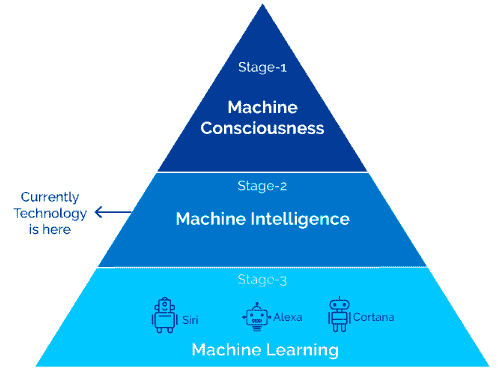
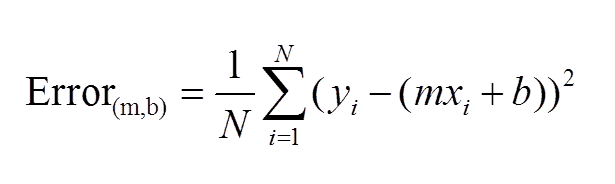

# 第九章：用于 NLU 和 NLG 问题的深度学习

在前几章中，我们已经看过了基于规则的方法和各种机器学习技术来解决 NLP 任务。在本章中，我们将看到一种被称为**深度学习**（**DL**）的机器学习技术的前沿子集。在过去的四到五年里，神经网络和深度学习技术在人工智能领域引起了极大的关注，因为许多科技巨头利用这些尖端技术解决现实生活中的问题，而这些技术的结果令人非常印象深刻。像谷歌、苹果、亚马逊、OpenAI 等科技巨头，花费了大量时间和精力去创造创新的解决方案来解决现实中的问题。这些努力主要是为了发展人工通用智能，并使世界变得更加美好。

我们首先将了解总体的 AI，概述其背景，以便让你了解为什么深度学习现在会引起如此大的关注。本章将涉及以下主题：

+   NLU 和 NLG 之间的区别

+   神经网络基础

+   使用各种深度学习技术构建 NLP 和 NLG 应用

在理解了深度学习的基础知识后，我们将讨论一些最近在深度学习领域发生的创新。那么，让我们开始吧！

# 人工智能概览

在本节中，我们将看到 AI 的各个方面以及深度学习与 AI 的关系。我们将看到 AI 的组成部分、AI 的不同阶段以及 AI 的不同类型；在本节末尾，我们将讨论为什么深度学习是实现 AI 的最有前景的技术之一。

# AI 基础

当我们谈到 AI 时，我们会想到智能机器，这是 AI 的基本概念。AI 是一个科学领域，持续朝着让机器具备人类水平的智能方向发展。AI 的基本思想是赋予机器智能，使其能够执行本只能由人类完成的任务。我们正在尝试通过一些很酷的算法技术，在机器中实现人类水平的智能；在这个过程中，机器获得的任何类型的智能都是人工生成的。用于生成 AI 的各种算法技术大多数属于机器学习技术。在深入学习机器学习和深度学习核心部分之前，我们将了解一些与 AI 相关的其他事实。

AI 受到许多领域的影响；在*图 9.1*中，我们将看到那些对人工智能影响深远的领域，将它们作为一个整体来看：


图 9.1：AI 受其他领域影响

# AI 的组成部分

首先，我们将看到 AI 的关键组成部分。这些组件对我们理解世界发展的方向非常有帮助。

在我看来，你可以在*图 9.2*中看到两个组件：


图 9.2：人工智能的组成部分

让我们详细看看人工智能的组成部分。我们还将看到一些例子。

# 自动化

自动化是人工智能中一个著名的组成部分。全球各地的人们在自动化领域投入了大量精力，并且我们在机器执行自动任务方面取得了巨大的成功。我们将看一些足够直观的例子，帮助你理解人工智能中的自动化概念。

在汽车行业，我们正在使用自动机器人来制造车辆。这些机器人遵循一套指令，执行特定任务。在这里，这些机器人不是能够与人类互动、提问或回答问题的智能机器人，而是按照一组指令执行任务，以达到高速度、高精度和高效的制造效果。因此，这些机器人是人工智能领域自动化的例子。

另一个例子是在 DevOps 领域。如今，DevOps 正在利用机器学习自动化许多需要大量人工的过程。例如，为了维护内部服务器，DevOps 团队在分析了各种服务器日志后，会收到一堆建议，接着，另一个机器学习模型会根据优先级对警报和建议进行排序。这种应用真正节省了 DevOps 团队的时间，使他们能够按时交付高质量的工作。这类应用帮助我们深刻理解自动化是人工智能中非常重要的组成部分。

现在让我们看看智能作为人工智能的一部分将如何影响世界。

# 智能

当我们谈到智能时，作为人类，我们的期望非常高。我们的目标是让机器能够理解我们的行为和情感。我们还希望机器能根据人类的行为做出智能反应，所有由机器生成的反应都应该模拟人类的智能。自 20 世纪中期以来，我们一直致力于实现这一目标。全球许多研究人员、科学家团队和社区正在进行大量前沿研究，旨在使机器像人类一样智能。

我们希望，在获得智能之后，机器能够以更高的准确性完成大多数人类任务，这是我们广泛的期望。在过去的四五年里，我们开始成功地实现这一广泛目标。经过多年努力，谷歌最近宣布，Google Assistant 能够听懂人类的自然语言，并像人类一样准确地解释语音信号。另一个例子是，Facebook 研究小组进行了一项非常强大的研究，旨在构建一个能够运用推理进行问答的系统。特斯拉和谷歌的自动驾驶汽车是复杂的人工智能系统，但它们非常有用且智能。自动驾驶汽车和聊天机器人属于窄人工智能的范畴。你还可以在网上找到许多新的例子，时不时地会有新的技术问世。

有一些子组件可以作为智能的一部分。请参见*图 9.3*：


图 9.3：智能的子组件

智能是前面图中描述的所有组件的结合。所有这些组件——推理、学习、从经验中学习、解决问题、感知和语言智能——对人类来说是非常自然的，但对机器来说却不是。因此，我们需要能够赋予机器智能的技术。

在学习本章稍后我们将使用的技术名称之前，让我们先了解一下人工智能的各个阶段。

# 人工智能的阶段

人工智能系统有三个主要阶段。我们将详细查看以下各个阶段：

+   机器学习

+   机器智能

+   机器意识

在深入了解人工智能每个阶段的细节之前，请参阅*图 9.4*：



图 9.4：人工智能的阶段（图片来源：[`cdn-images-1.medium.com/max/1600/0*aefkt8m-V66Wf5-j.png`](https://cdn-images-1.medium.com/max/1600/0*aefkt8m-V66Wf5-j.png)）

我们将从下到上开始学习，因此我们首先了解机器学习阶段，然后是机器智能，最后是机器意识。

# 机器学习

在前几章你已经学习了很多关于机器学习的内容，但我想在本章中从人工智能的角度给你讲解它。

机器学习技术是一组算法，解释了如何生成或达到定义的输出。这种算法被智能系统使用，这些系统试图从经验中学习。使用机器学习算法的系统热衷于从历史数据或实时数据中学习。因此，在人工智能的这个阶段，我们专注于通过我们提供给机器学习系统的特征，从数据中学习模式或特定结构的算法。为了更清楚地说明这一点，让我们举个例子。

假设你想构建一个情感分析应用程序。我们可以使用历史标记数据、手工设计的特征和朴素贝叶斯机器学习算法。结果，我们可以拥有一个智能系统，该系统通过学习示例学会了如何为一个未见的新数据实例提供情感标签。

# 机器智能

机器智能也是一组算法，但大多数算法受到人脑学习和思考方式的深刻影响。利用神经科学、生物学和数学，人工智能研究者提出了一组高级算法，帮助机器从数据中学习，而无需提供手工设计的特征。在这个阶段，算法使用的是无标签或有标签的数据。在这里，你只需要定义最终目标，先进的算法会找到自己的方式来实现预期结果。

如果你将我们在这个阶段使用的算法与传统的机器学习算法进行比较，你会发现主要的区别在于，在这个机器智能阶段，我们没有为任何算法提供手工设计的特征输入。由于这些算法受到人脑的启发，算法本身会学习特征和模式，并生成输出。目前，人工智能的世界正处于这个阶段。全球各地的人们正在使用这些看似非常有前景的先进算法，以期为机器实现类人智能。

**人工神经网络**（**ANNs**）和深度学习技术被用来实现机器智能。

# 机器意识

机器意识是人工智能中最受讨论的主题之一，因为我们的最终目标是达到这一阶段。

我们希望机器能像人类一样学习。作为人类，我们不需要大量数据；我们不需要很长时间就能理解抽象概念。我们通过少量数据或者没有数据来学习。大多数时候，我们是通过我们的经验来学习的。如果我们想构建一个像人类一样具有意识的系统，那么我们应该知道如何为机器生成意识。然而，我们是否完全了解大脑是如何工作和反应的，从而能够将这种知识转移到机器中，让它们像我们一样具有意识呢？不幸的是，目前我们并不完全了解这一点。我们期望，在这个阶段，机器可以在没有数据或只有非常少量数据的情况下学习，并利用自身的经验来达成既定的输出。

目前有很多有趣的研究在进行，我鼓励你查看一下研究员 John Searle 在 YouTube 上分享的视频，他讲解了机器意识：[`www.youtube.com/watch?v=rHKwIYsPXLg`](https://www.youtube.com/watch?v=rHKwIYsPXLg)。这个视频可能会为你提供关于人工智能中意识的全新视角。

我们已经看到了人工智能的不同阶段。人工神经网络（ANNs）和深度学习是机器智能阶段的一部分。在*深度学习简要概述*部分的结尾，你会获得一些必要的细节，帮助你理解为何深度学习成为了人工智能中的新热词。

现在我们将看到人工智能的各种类型。

# 人工智能的类型

人工智能有三种类型，如下所示：

+   人工窄智能

+   人工通用智能

+   人工超智能

# 人工窄智能

**人工窄智能**（**ANI**）是一种人工智能，涵盖了一些基本任务，如基于模板的聊天机器人、像苹果最初版本的 Siri 那样的基础个人助手应用。

这种类型的智能主要集中在应用的基本原型设计上。它是任何应用的起点，之后你可以改进这个基本原型。你可以通过添加人工通用智能来增强智能层次，但只有在你的最终用户真的需要这种功能时才行。我们也在第七章中看到了这种基本聊天机器人的示例，*基于规则的 NLP 系统*。

# 人工通用智能

**人工通用智能**（**AGI**）是一种人工智能，用来构建能够执行人类级别任务的系统。什么是人类级别的任务呢？比如构建自动驾驶汽车。谷歌的自动驾驶汽车和特斯拉的自动驾驶仪是最著名的例子。类人机器人也尝试使用这种类型的人工智能。

NLP 级别的示例是复杂的聊天机器人，它们能够忽略拼写错误和语法错误，并理解你的查询或问题。深度学习技术似乎对人类理解自然语言非常有前景。

我们现在正处于这样一个阶段，世界各地的人们和社区使用基本概念，通过相互参考彼此的研究工作，尝试构建具有 AGI 的系统。

# 人工超级智能

实现**人工超级智能**（**ASI**）的方式对我们来说有些困难，因为在这种类型的人工智能中，我们期望机器在学习特定任务时比人类更聪明，并且能够像人类一样执行多任务。这种超级智能目前对我们来说是一个梦想，但我们正在尝试以一种方式来实现它，使得机器和系统始终补充人类技能，并且不会对人类构成威胁。

# 人工智能的目标和应用

这是我们需要理解人工智能在各个领域的目标和应用的时机和环节。这些目标和应用只是为了让你了解当前人工智能应用的状态，但如果你能想到一些疯狂但有用的应用场景，无论在哪个领域，都应该尝试将其纳入这个列表中。你应该尝试在这些应用中实现不同类型和阶段的人工智能。

现在让我们看看我们希望在哪些领域集成不同阶段的人工智能，并使这些应用具备人工智能功能：

+   推理

+   机器学习

+   自然语言处理

+   机器人技术

+   实现通用智能

+   计算机视觉

+   自动化学习和调度

+   语音分析

你可以参考*图 9.5*，它展示了许多不同的领域和相关的应用：


图 9.5：人工智能的各种领域和应用（图片来源：http://vincejeffs.com/）

现在让我们看看前面列表中一些领域的应用。

# 人工智能应用

在这里，我将简要介绍一些人工智能应用。有些应用与自然语言处理（NLP）领域也有关：

+   为任何系统启用推理将是非常令人兴奋的事情。在这个领域，我们可以构建一个问答系统，利用推理来推导出所提问题的答案。

+   如果我们能为 AI 驱动的系统启用推理，那么这些系统将非常擅长决策，并将改善现有的决策系统。

+   在机器学习中，我们希望能够由机器自己决定的完美架构，来实现基于机器学习的应用。依我看，这就是一种 AI 驱动的机器学习应用。

+   当我们讨论 AI 驱动的自然语言处理（NLP）应用时，我们确实需要能够理解人类自然语言语境并像人类一样反应和行为的 NLP 系统。

+   类人机器人是描述 AI 驱动系统的最佳应用。机器人应该具备感知能力，这是一个长期的 AI 目标。

+   当我们讨论通用智能时，依我看，系统应该更像人类那样反应。特别是机器的反应应该与真实的人类行为相匹配。分析某些情况后，机器应当作出与人类相同甚至更好的反应。

+   如今，计算机视觉有许多应用，它们为我们提供了坚实的证据，表明 AI 将在这个领域很快取得突破。这些应用包括物体识别、图像识别、使用图像识别技术检测皮肤癌、从机器生成面部图像、为图像生成文本及其反向操作等。这些应用为 AI 驱动的计算机视觉提供了具体证据。

+   自动化学习和调度是一种为个人提供助理并管理日程的系统。关于 AI 部分，我们真的期望每个系统用户能够获得个性化体验，因此自动化学习个人偏好对于 AI 驱动的调度非常重要。为了实现这一目标，自动化学习系统还应该学会如何为特定用户选择最合适的模型。

+   语音分析是一种不同形式的自然语言处理，然而不幸的是，在本书中我们并未涉及这一概念。在这里，我们讨论的是语音识别系统在 AI 驱动领域中的潜力。通过在语音识别领域启用 AI，我们可以理解人在社会学、心理学和哲学的影响下所生成的环境与思维过程。我们还可以预测他们的个性。

在看到这些令人着迷的应用之后，有三个非常有趣的问题浮现在我们的脑海：是什么原因促使我们产生 AI 驱动的系统？为什么现在是构建 AI 驱动系统的最佳时机？我们该如何构建 AI 驱动的系统？

自 20 世纪中期以来，我们一直在尝试将智能引入机器。在这个过程中，研究人员和科学家提出了许多酷炫的概念。例如，人工神经元，也被称为**麦卡洛克-皮茨模型**（**MCP**），它的灵感来源于人脑，这一概念的目的是理解人脑的生物学工作过程，并用数学和物理的语言表示这一过程。因此，这对于实现机器的人工智能（AI）是非常有帮助的。

他们成功地给出了单个神经元如何工作的数学表示，但这个模型的一个结果并不适合训练目的。因此，研究员弗兰克·罗森布拉特在 1958 年的论文中提出了*感知机*，引入了*动态权重*和*阈值*的概念。之后，许多研究人员基于早期的概念发展了反向传播和多层神经网络等概念。研究界希望将这些已开发的概念应用于实际中，第一个实现这一目标的研究员是杰弗里·辛顿，他演示了如何使用广义反向传播算法训练多层神经网络。从那时起，研究人员和学术界开始使用这一广义模型，但在 20 世纪末，数据量远不如现在丰富，计算设备也既慢又昂贵，因此我们没有得到预期的结果。然而，尽管如此，研究人员相信，凭借当时取得的成果，这些概念将是实现 AI 驱动世界的关键。现在，我们拥有大量的数据和快速、廉价且足够强大的计算设备来处理这些数据。当我们将这些旧的人工神经网络（ANN）概念应用于当前时代，开发如通用机器翻译系统、语音识别系统、图像识别系统等应用时，我们取得了非常有希望的成果。举个例子，Google 正在使用 ANN 开发一个通用机器翻译系统，该系统能够翻译多种语言。这是因为我们拥有丰富的大型数据集，以及能够帮助我们通过 ANN 处理这些数据集的快速计算能力。我们使用的神经网络并非只有一层或两层，而是深度多层。所取得的成果令人印象深刻，以至于每一家大型科技公司都在使用深度学习模型来开发 AI 驱动的系统。在我看来，数据、计算能力和扎实的旧概念是开发 AI 驱动系统的关键组成部分。你可以参考*图 9.6*了解神经网络的简要历史：


图 9.6：人工神经网络的历史（图片来源：https://image.slidesharecdn.com/deeplearning-170124234229/95/deep-learning-9-638.jpg?cb=1485303074）

*图 9.7*将让你对神经网络的长期历史有所了解：


图 9.7：人工神经网络（ANN）的历史（图片来源：[`qingkaikong.blogspot.in/2016/11/machine-learning-3-artificial-neural.html`](http://qingkaikong.blogspot.in/2016/11/machine-learning-3-artificial-neural.html)）

现在让我们向下一个问题迈进：如何使 AI 成为可能？答案是深度学习。这是使非 AI 系统具备 AI 功能的最常用技术之一。虽然有些情况下深度学习没有被用于使 AI 成为可能，但在 NLP 领域，深度学习主要被用来使 AI 成为可能。为了发展通用智能，我们可以使用深度学习。我们从这项技术中得到了非常有前景的结果。诸如机器生成真人面孔、在嘈杂环境中更准确地理解人类语言、自驾车、为问答系统进行推理等实验，都是其中的一部分。深度学习技术使用大量的数据和高计算能力对给定数据进行系统训练。当我们将合适的深度学习模型应用于大量数据时，我们将得到神奇、令人印象深刻且充满前景的结果。这些就是深度学习如今成为热门话题的原因。所以，我想现在你明白为什么深度学习在 AI 世界中成为流行词了。

在本章后续部分，我们将详细探讨深度学习技术，并使用深度学习开发 NLP 应用。

# 比较 NLU 和 NLG

我们已经在第三章《句子结构理解》中看到了 NLU 和 NLG 的定义、细节及其区别。在这一节中，我们将从一个 AI 驱动的应用角度对这两个 NLP 子领域进行比较。

# 自然语言理解

之前，我们看到 NLU 更多的是处理语言结构的理解，无论是单词、短语还是句子。NLU 更侧重于将各种机器学习（ML）技术应用于已经生成的自然语言（NL）。在 NLU 中，我们关注句法和语义。我们还尝试解决与句法和语义相关的各种歧义。我们已经见识过词汇歧义、句法歧义、语义歧义和语用歧义。

现在让我们看看我们可以在哪里使用 AI 来帮助机器更准确高效地理解语言结构和意义。AI 和 ML 技术在解决自然语言（NL）这些方面并不落后。举个例子，深度学习在机器翻译中给我们带来了令人印象深刻的成果。现在，当我们谈论解决句法歧义和语义歧义时，我们可以使用深度学习。假设你有一个命名实体识别（NER）工具，它将使用深度学习和 Word2vec，那么我们就能解决句法歧义。这只是一个应用，但你还可以通过它来改进解析器的结果和词性标注器。

现在让我们来谈谈语用歧义，在这种情况下，我们真的需要人工通用智能（AGI）以及人工超级智能（ASI）。这种歧义出现在你尝试理解一句话的长距离上下文时，需要考虑其他先前写的或说过的话，并且还取决于说话者的表达意图。

让我们看一个语用歧义的例子。你和你的朋友正在交谈，你的朋友很久以前告诉你她加入了一个 NGO，并且会为贫困学生做一些社会活动。现在你问她社会活动如何。在这种情况下，你和你的朋友都知道你们在谈论的是什么社会活动。这是因为作为人类，我们的大脑存储了信息，并且知道何时获取这些信息，如何解读这些信息，以及这些信息与当前与你朋友交谈的内容的相关性。你和你的朋友都能理解彼此问题和答案的背景和相关性，但机器并不具备理解背景和说话者意图的能力。

这就是我们对智能机器的期望。我们希望机器也能理解这种复杂的情况。使机器能够解决语用歧义的能力被纳入了 MSI。这在未来肯定是可能的，但目前我们正处于机器试图采用 AGI 并使用统计技术来理解语义的阶段。

# 自然语言生成

NLG 是我们尝试教机器如何以合理的方式生成自然语言的一个领域。这本身就是一项具有挑战性的 AI 任务。深度学习在帮助我们完成这种具有挑战性的任务方面确实起到了重要作用。让我给你举个例子。如果你正在使用谷歌的新收件箱，你可能会注意到，当你回复任何邮件时，你会得到三条最相关的回复，以句子的形式出现。谷歌使用了数百万封电子邮件，创建了一个 NLG 模型，并通过深度学习训练它，从而生成或预测任何给定邮件的最相关回复。你可以参考*图 9.8*：


图 9.8：谷歌新收件箱的智能回复

除了这个应用，还有另一个应用：在看到图片后，机器会提供特定图片的说明。这也是一个使用深度学习的 NLG 应用。生成语言的任务比生成自然语言（NL）要简单一些，即连贯性，而这正是我们需要 AGI 的地方。

我们已经谈论了很多“深度学习”这个术语，但它到底是如何工作的，为什么它如此有前景呢？这个问题我们将在本章的后续部分中探讨。我们将解释 NLU 和 NLG 应用的编码部分。我们还将从零开始开发 NLU 和 NLG 应用。在此之前，你必须了解人工神经网络（ANN）和深度学习的概念。我将在后续章节中加入数学内容，并尽量保持简洁。让我们深入探索人工神经网络和深度学习的世界！

# 深度学习概述

机器学习是 AI 的一个子领域，深度学习是机器学习的一个子领域。请参见*图 9.9*：


图 9.9：深度学习作为机器学习的一个子领域

深度学习使用人工神经网络（ANN），其不仅仅是一个或两个层，而是多个层，称为**深度神经网络**（**DNN**）。当我们使用 DNN 来解决某个问题，并通过预测该问题的可能结果时，这就是**深度学习**。

深度学习可以使用带标签的数据或不带标签的数据，因此我们可以说，深度学习可以应用于监督学习技术和无监督学习技术。使用深度学习的主要思想是，利用深度神经网络（DNN）和大量数据，我们希望让机器概括特定任务，并为我们提供一个我们认为只有人类才能生成的结果。深度学习包括一系列技术和算法，可以帮助我们解决自然语言处理（NLP）中的各种问题，例如机器翻译、问答系统、摘要等。除了 NLP 外，您还可以找到其他应用领域，如图像识别、语音识别、物体识别、手写数字识别、面部检测和人造面孔生成等。

深度学习似乎在构建 AGI（通用人工智能）和 ASI（超人工智能）方面给我们带来了希望。您可以在*图 9.10*中看到一些深度学习应用的实例：


图 9.10：使用深度学习的应用（图片来源：http://www.fullai.org/）

本节将简要概述深度学习。我们将在本章中讨论深度学习的多个方面，但在此之前，我想解释一些与深度学习和人工神经网络（ANN）相关的概念。这些概念将帮助您理解深度学习的技术性内容。

# 神经网络基础

神经网络的概念是机器学习（ML）中最古老的技术之一。神经网络来源于人类大脑。在本节中，我们将首先了解人脑的组成部分，然后推导出人工神经网络（ANN）。

为了理解人工神经网络（ANN），我们首先需要理解人脑的基本工作流程。您可以参考*图 9.11*：


图 9.11：人脑神经元（图片来源：https://en.wikipedia.org/wiki/File:Blausen_0657_MultipolarNeuron.png）

人脑由大约数百亿个神经细胞组成，这些细胞称为**神经元**。每个神经元执行以下三个任务：

+   接收信号：它从**树突**接收一组信号。

+   决定是否将信号传递到细胞体：它将这些信号整合在一起，决定是否将信息传递到细胞体。

+   发送信号：如果一些信号超过某个阈值，它会通过轴突将这些信号（称为**动作电位**）传递到下一个神经元。

您可以参考*图 9.12*，它展示了用于执行生物神经网络中三项任务的组件：


图 9.12：展示执行这三项任务的组件

这只是我们的大脑如何学习和处理决策的一个非常简要的概述。现在的问题是：我们能否构建一个使用非生物基材（如硅或其他金属）的人工神经网络？我们可以构建它，然后通过提供大量的计算能力和数据，我们可以比人类更快地解决问题。

人工神经网络是一种受生物启发的算法，能够学习识别数据集中的模式。

我们在本章之前已经简要了解了人工神经网络的历史，现在是时候详细了解人工神经网络及其历史了。

# 第一个神经元计算模型

在 1943 年中期，研究人员 McCulloch 和 Pitts 发明了第一个神经元计算模型。他们的模型相当简单。该模型有一个神经元，它接收二进制输入，求和，如果总和超过某个阈值，则输出为 1，否则输出为 0。你可以在 *图 9.13* 中看到它的示意图：


图 9.13：McCulloch-Pitts 神经元计算模型（神经网络图片来源：http://wwwold.ece.utep.edu/research/webfuzzy/docs/kk-thesis/kk-thesis-html/node12.html）

它看起来非常简单，但由于它是在人工智能的早期发明的，这种模型的发明当时是一项非常了不起的成就。

# 感知机

在发明第一个神经元计算模型的几年后，一位名叫 Frank Rosenblatt 的心理学家发现，McCulloch-Pitts 模型没有从输入数据中学习的机制。因此，他发明了建立在第一个神经元计算模型基础上的神经网络。Frank Rosenblatt 将这个模型称为 **感知机**。它也被称为 **单层前馈神经网络**。我们称这个模型为前馈神经网络，因为在这个神经网络中，数据只沿一个方向流动——前向方向。

现在让我们了解感知机的工作原理，感知机引入了对给定输入进行加权的概念。如果你提供一些输入输出示例的训练集，它应该通过对每个训练示例的权重不断增加或减少来学习一个函数，具体取决于给定输入示例的输出是什么。这些权重值在数学上应用于输入，使得每次迭代后，输出预测变得更加准确。整个过程被称为 **训练**。请参考 *图 9.14* 来理解 Rosenblatt 感知机的示意图：


图 9.14：Rosenblatt 感知机的示意图（神经网络图片来源：http://sebastianraschka.com/Articles/2015_singlelayer_neurons.html）

在下一节中，我们将看到与人工神经网络相关的数学概念，如梯度下降、激活函数和损失函数。所以，准备好迎接一些数学内容吧！

# 理解人工神经网络（ANN）的数学概念

本节非常重要，因为机器学习（ML）、人工神经网络（ANN）和深度学习（DL）使用了大量的数学概念，我们将看到其中一些最重要的概念。这些概念将真正帮助你优化你的机器学习、人工神经网络和深度学习模型。我们还将看到不同类型的激活函数，并提供一些选择激活函数的小贴士。我们将要学习以下数学概念：

+   梯度下降法

+   激活函数

+   损失函数

# 梯度下降法

梯度下降法是一种非常重要的优化技术，几乎所有的神经网络都在使用它。为了说明这些技术，我想给出一个例子。我有一个数据集，包含了每个学生的考试成绩和学习时长。我们希望仅根据学生的学习时长来预测考试成绩。你可能会说，这看起来像是一个机器学习线性回归的例子。你说得对；我们正在使用线性回归来进行预测。那么，为什么使用线性回归？梯度下降与它有什么关系呢？让我来回答这个问题，然后我们将看看代码和一些有趣的可视化。

线性回归是机器学习中的一种技术，利用统计方法，允许我们研究两个连续的定量变量之间的关系。在这里，这两个变量是学生的成绩和学生的学习时长。通常在进行线性回归时，我们试图得到一条最适合我们数据集的直线，这意味着我们所做的所有计算，目的都是为了找到一条最适合给定数据集的直线。得到这条最适合的直线就是线性回归的目标。

现在我们来讨论线性回归与梯度下降的关系。梯度下降是我们用来优化线性回归准确度并最小化损失或误差函数的最流行优化技术。梯度下降是一种帮助我们最小化误差函数并最大化预测准确度的技术。梯度下降的数学定义是它是一种一阶迭代优化算法。该算法用于通过梯度下降找到函数的局部最小值。每一步的大小与当前点的梯度的负值成正比。你可以通过这个现实生活中的例子来理解梯度下降：假设你站在一座山顶，现在你想要走到山脚下的美丽湖泊，你需要开始下山。此时，你不知道应该朝哪个方向走。你观察周围的地形，尝试找到地形倾斜的地方。这样你就能大致知道应该往哪个方向走。如果你开始按照下坡的方向走，并且每次都遵循这个思路，那么你很有可能会到达湖泊。这正是我们在使用梯度下降的数学公式时所做的。在机器学习和深度学习中，我们把一切都看作是优化问题，所以梯度下降是用于随着时间推移最小化损失函数的技术。

另一个例子是，你有一个深碗，里面放了一个小球，从碗的一端开始。你会发现，经过一段时间后，小球减慢了速度，并试图到达碗底。参见*图 9.15*：


图 9.15：梯度下降的直观理解（图片来源：https://iamtrask.github.io/img/sgd_optimal.png）

你还必须查看这个 GitHub 链接中的图片：

[`github.com/jalajthanaki/NLPython/blob/master/ch9/gradientdescentexample/gradient_descent_example.gif`](https://github.com/jalajthanaki/NLPython/blob/master/ch9/gradientdescentexample/gradient_descent_example.gif)

这张图展示了使用梯度下降得到最佳拟合线的过程或步骤。它只是一个可视化图，帮助你大致了解我们将在代码中做的事情。顺便提一下，损失函数、误差函数和代价函数是同义词。梯度下降也被称为**最陡下降**。

现在让我们来看代码，并在过程中进行解释。在这里，我们不是在开发预测模型，而是实现和理解梯度下降。数据集和代码可以在[`github.com/jalajthanaki/NLPython/tree/master/ch9/gradientdescentexample`](https://github.com/jalajthanaki/NLPython/tree/master/ch9/gradientdescentexample)找到。

首先，让我们理解一下数据集。它是学生的测试分数和他们学习的小时数的数据集。我们知道这两个属性之间应该存在某种关系——学习的时间越少，学生的分数越差；学习的时间越多，分数就越高。我们将使用线性回归来证明这一关系。*`X`* 值表示数据集的第一列，也就是学生学习的小时数，*`Y`* 值表示第二列，即测试分数。请参见*图 9.16*：


图 9.16：数据集的样本数据

让我们定义一个主函数，它将读取我们的数据集以及一些基本的超参数。我们还调用了一个函数，用来计算误差和实际的梯度下降。你可以在*图 9.17*中看到代码片段：


图 9.17：梯度下降的代码片段

你可以在*图 9.18*中看到输出结果：


图 9.18：梯度下降的输出结果

正如你在*图 9.18*中看到的，我们调用了两个函数：`compute_error_for_line_points()`，它将计算实际值和预测值之间的误差，和`gradient_descent_runner()`，它将为我们计算梯度。我们需要先了解如何计算误差，然后再进行梯度下降。

# 计算误差或损失

计算机器学习算法误差的方法有很多，但在本章中我们将使用其中最流行的技术之一：平方和误差。现在我们将直接进入细节。

这个误差函数为我们做了什么？回想一下我们的目标：我们希望得到数据集的最佳拟合直线。请参见*图 9.19*，它是直线斜率的方程式。这里，`m` 是直线的斜率，`b` 是 `y` 截距，`x` 和 `y` 是数据点——在我们的例子中，`x` 是学生学习的小时数，`y` 是测试分数。请参见*图 9.19*：


图 9.19：直线斜率方程（图片来源：https://www.tes.com/lessons/Xn3MVjd8CqjH-Q/y-mx-b）

使用前述的方程，我们绘制了直线并从随机的斜率 `m` 和 `y` 截距 `b` 开始，同时使用我们的第一列数据点作为 `x` 的值，从而计算出 `y` 的值。在训练数据中，我们已经有了 `y` 的值，也就是说，我们知道每个学生的考试成绩。因此，对于每个学生，我们需要计算误差。让我们举一个非常直观的例子；请注意，我们使用的是虚拟值来进行解释。假设你通过随机选取的 `m` 和 `b` 值得到 `y` 的值为 41.0。现在，你有了 `y` 的实际值，即 52.5，那么预测值与实际值之间的差异是 11.5。这只是针对单一数据点的情况，但我们需要对每个数据点进行计算。因此，为了进行这种误差计算，我们使用了平方距离误差之和。

现在，我们是如何计算平方距离误差之和的，为什么我们要使用平方距离误差之和呢？

那么让我们从第一个问题开始，计算平方距离误差之和的方程见 *图 9.20*：



图 9.20：计算平方距离误差之和的方程（图片来源：[`spin.atomicobject.com/wp-content/uploads/linear_regression_error1.png`](https://spin.atomicobject.com/wp-content/uploads/linear_regression_error1.png)）

如你所见，最后部分的 *mx[i]+b* 是我们通过选择随机的 `m` 和 `b` 值绘制出的直线，实际上我们可以将 `y` 替换为 *mx[i]+b*。因此，这里我们计算了原始 `y` 值与生成的 `y` 值之间的差异。我们将原始 `y` 值与生成的 `y` 值相减，并对每个数据点的差值进行平方。我们平方该值是因为我们不想处理负值，在进行求和操作之前，计算平方后，我们希望衡量总体的大小。我们不关心实际值，因为我们希望最小化这个总体大小。现在回到方程；我们已经计算出了原始 `y` 值与生成的 `y` 值之间差异的平方。接下来，我们对所有这些点进行求和；我们将使用 sigma 符号表示对数据集中所有数据点的求和操作。到此为止，我们得到了表示误差大小的总和值，并将这些值除以数据点的总数。经过这个步骤，我们就得到了我们想要的实际误差值。

你可以在这个 GitHub 链接查看动画图片：

[`github.com/jalajthanaki/NLPython/blob/master/ch9/gradientdescentexample/gradient_descent_example.gif`](https://github.com/jalajthanaki/NLPython/blob/master/ch9/gradientdescentexample/gradient_descent_example.gif)

你可以看到，每次迭代中，直线都会移动，以生成与我们数据集最佳匹配的直线。我们根据误差的值更新 `m` 和 `b` 的值。现在，对于每个时间戳，直线是静止的，我们需要计算误差。请参见 *图 9.21*：


图 9.21：计算给定时间戳时直线与数据点之间的距离（图片来源：http://statutor.org/c3/glmregression/IMAG004.JPG）

现在我们需要根据给定的方程式以技术方式表达我们直观的例子和方程式。在这里，我们计算每个数据点到我们绘制的直线的距离，对它们进行平方，将它们全部加起来，然后除以总点数。因此，在每次迭代或时间戳后，我们可以计算我们的误差值，并了解我们的直线有多糟糕或多好。如果我们的直线不好，那么为了得到最佳拟合线，我们会更新`m`和`b`的值。因此，误差值为我们提供了一种指示，即是否有可能改进以生成最佳拟合线。最终，我们希望最小化我们在这里获得的误差值，以生成最佳拟合线。我们如何最小化这个误差并生成最佳拟合线呢？下一步被称为**梯度下降**。

对于平方误差的一些原因是，对于线性回归来说，这是计算误差的最流行技术。如果您有大数据集，您也可以使用这个技术。

让我们看看编码部分，然后我们将跳转到计算梯度下降的核心部分。参考*图 9.22*中的代码片段：


图 9.22：计算平方误差和的代码片段

现在让我们看下一步--计算梯度下降。

# 计算梯度下降

使用误差函数，我们知道是否应该更新我们的直线以生成最佳拟合线，但如何更新直线是我们将在本节中看到的内容。我们如何最小化这个误差并生成最佳拟合线呢？因此，为了回答这个问题，首先让我们对梯度下降和编码部分有一些基本的理解，其中我们只剩下最后一个函数`gradient_descent_runner()`。参考*图 9.23*：


图 9.23：理解梯度下降的 3D 图表（图片来源：https://spin.atomicobject.com/wp-content/uploads/gradient_descent_error_surface.png）

正如你在*图 9.23*中看到的，这是一张三维图。 这两个图是相同的；它们的视角不同。 所以这些图显示了斜率`m`、`y`-截距`b`和*误差*的所有可能值。这些是包含`m`、`b`和*误差*的三个值的对。这里，`x`轴是斜率值，`y`轴是`y`-截距，`z`轴是误差值。我们试图找到误差最小的点。如果你仔细观察图形，你会发现曲线的底部，误差值最小。值最小的点在机器学习中被称为**局部最小值**。在复杂的数据集中，你可能会发现多个局部最小值；但在这里我们的数据集很简单，所以只有一个局部最小值。如果你有一个复杂且高维的数据集，其中有多个局部最小值，那么你需要进行二阶优化，以决定选择哪个局部最小值以获得更好的准确性。在本书中我们不会讲解二阶优化。现在让我们回到图形，在这里我们可以直观地确定给我们最小误差值的点，且同一个点也给出了理想的`y`-截距`b`和斜率值`m`。当我们得到`b`和`m`的理想值时，我们将这些值代入我们的*y=mx+c*方程式，然后奇迹就会发生，我们会得到最佳拟合线。这不是唯一的获取最佳拟合线的方法，但我的目的是让你深入了解梯度下降的概念，以便我们以后可以在深度学习中使用这个概念。

现在，从视觉上你可以看到误差最小的那个点，但如何到达这个点呢？答案是通过计算梯度。梯度也叫做**斜率**，但这不是斜率值`m`，所以不要混淆。我们在这里讨论的是朝着最小误差点前进的方向的斜率。因此，我们有一些`b`值和一些`m`值，并且每次迭代后，我们都会更新这些`b`和`m`值，以便我们能够到达那个最小误差值的点。从三维图像的角度来看，如果你在曲线的顶部，那么每次迭代我们都会计算梯度和误差，然后更新`m`和`b`的值，以便我们能够到达曲线的底部。我们需要到达曲线的底部，通过计算梯度值，我们可以知道应该朝哪个方向迈出下一步。因此，梯度是切线，它不断告诉我们需要朝哪个方向移动，无论是向上还是向下，以到达最小误差点并获得理想的`b`和`m`值，从而生成最佳拟合线。请参考*图 9.24*：


图 9.24：梯度值和方向（图片来源：https://sebastianraschka.com/images/faq/closed-form-vs-gd/ball.png）

现在让我们来看最后一个计算梯度下降的方程式。在*图 9.25*中，你可以看到梯度下降的方程式，它们只是我们误差函数的偏导数。我们取了平方误差和的方程，并对`m`和`b`分别进行偏导数计算，从而得出梯度下降。结果如*图 9.25*所示：


图 9.25：计算梯度下降的方程式（图片来源：https://spin.atomicobject.com/wp-content/uploads/linear_regression_gradient1.png）

左侧的*∂*符号是偏导数符号。在这里，我们有两个方程式，因为我们使用误差函数并对变量`m`求偏导数，在第二个方程式中，我们对变量`b`求偏导数。通过这两个方程式，我们将获得更新后的`b`和`m`的值。

为了计算梯度，我们需要对误差函数进行偏导数推导。对于机器学习和深度学习中的一些问题，我们可能不知道误差函数的偏导数，这意味着我们无法计算梯度。因此，我们不知道该如何处理这种类型的函数。你的误差函数应该是可微分的，这意味着它应该有偏导数。另一个需要注意的是，我们使用的是线性方程，但如果你的数据是高维的，那么你可以使用非线性函数，只要你知道误差函数。梯度下降并不会在第一次迭代时就给出最小值。梯度只是告诉我们如何更新`m`和`b`的值，更新时是加上正值还是负值。所以梯度给我们一个更新`m`和`b`值的方向，这意味着通过计算梯度，我们得到了方向，并且在尽力找到误差值最小且`m`和`b`最优的点。

现在是时候再次跳转到代码并完成梯度下降了。请参考*图 9.26*：


图 9.26：实际梯度下降运行函数的代码片段

在代码中，我们将`m_gradient`和`b_gradient`与学习率相乘，因此学习率是一个重要的超参数。在选择其值时要小心。如果你选择一个非常高的值，模型可能根本无法训练。如果选择一个非常低的值，则可能需要很长时间进行训练，并且有过拟合的风险。请参考*图 9.27*，它能给你关于合适学习率的直觉：


图 9.27：学习率直觉（图片来源：http://cs231n.github.io/assets/nn3/learningrates.jpeg）

这就是线性回归和梯度下降的编码部分。让我们运行代码，*图 9.28*将给你一个关于输出的直觉：


图 9.28：输出的代码片段

梯度下降有多种类型，我们列举几个，但我们不会深入探讨。你可以探索带动量的梯度下降、Adagrad、Adam 等等。

如果你真的想深入探讨，我会提供一个链接，这对你会有帮助：

[`www.analyticsvidhya.com/blog/2017/03/introduction-to-gradient-descent-algorithm-along-its-variants/`](https://www.analyticsvidhya.com/blog/2017/03/introduction-to-gradient-descent-algorithm-along-its-variants/)

现在是时候理解激活函数了，让我们开始吧！

# 激活函数

让我们先来看激活函数。我想给你一个大致的概念，说明我们会在神经网络的哪个阶段使用激活函数。在我们讨论感知器时，我们提到神经网络如果超过某个阈值，将生成输出 1；否则，输出为 0。计算阈值并根据这个阈值生成输出的整个机制由激活函数负责。

激活函数能够提供位于 0 和 1 之间的值。之后，我们可以使用阈值生成输出值 1 或输出值 0。例如，如果我们的阈值是 0.777，激活函数的输出是 0.457，那么我们的结果输出将是 0；如果激活函数的输出是 0.852，那么结果输出将是 1。所以，这就是激活函数在神经网络中工作的方式。

通常，在神经网络中，我们为每个神经元指定一个权重和输入值。我们对它们求和并生成加权和。当我们将这些值通过一个非线性函数时，这个非线性函数会激活一定数量的神经元，从而得到复杂任务的输出；这种通过特定的非线性数学函数激活神经元的过程称为**激活函数**或**传递函数**。激活函数通过一定的数学运算将输入节点映射到输出节点。

在人工神经网络（ANN）中使用激活函数的目的是引入非线性。让我们一步步理解这个过程。

让我们专注于神经网络的结构。这个结构可以进一步分为三个部分：

+   **架构：** 架构是关于决定神经网络中神经元和层次的排列方式。

+   **活动：** 为了生成复杂任务的输出，我们需要观察神经元的活动——一个神经元如何响应另一个神经元，从而生成复杂的行为。

+   **学习规则：** 当神经网络生成输出时，我们需要在每个时间点更新 ANN 的权重，以便使用误差函数优化输出。

激活函数是活动部分的一部分。如前所述，我们将引入 ANN 中的非线性。背后的原因是，如果没有非线性，ANN 无法产生复杂行为来解决复杂任务。在深度学习（DL）中，大多数时候我们使用非线性激活函数来获得复杂的行为。除此之外，我们还希望以非线性的方式将输入映射到输出。

如果你没有使用非线性激活函数，那么 ANN 在处理复杂任务时不会给出大量有用的输出，因为你传递的是矩阵。如果你在 ANN 中使用多个层且使用线性激活函数，得到的输出将是输入值、权重和偏置在所有层中的求和。这个输出给你另一个线性函数，这意味着这个线性函数将多层 ANN 的行为转化为单层 ANN。这种行为在解决复杂任务时完全没有用。 

我想强调连接主义的思想。在人工神经网络（ANN）中，连接主义是指使用彼此相连的神经元来产生复杂的行为，就像人类的大脑一样，我们无法在不引入非线性性的情况下在 ANN 中实现这种行为。参考*图 9.29*来理解激活函数：


图 9.29：带有激活函数的 ANN（图片来源：https://cdn-images-1.medium.com/max/800/0*bWX2_ecf3l6lKyVA.png）

在这里，我们将介绍前面图像中提到的这些函数：

+   **传递潜力：** 这是聚合输入和权重的函数。更具体地说，这个函数执行输入与权重的求和

+   **激活函数：** 该函数将传递潜力函数的输出作为输入，并通过激活函数应用非线性的数学变换

+   **阈值函数：** 基于激活函数，阈值函数要么激活神经元，要么不激活神经元

传递潜力是一个简单的求和函数，它会对输入与连接权重的内积进行求和。你可以在*图 9.30*中看到该方程：


图 9.30：传递潜力的求和方程（图片来源：https://cdn-images-1.medium.com/max/800/0*005k9F1JxQ0oKEeM.png）

这个传递潜力通常是一个点积，但也可以使用任何数学方程，如多项式函数。

另一方面，激活函数应该是任何可微且非线性的函数。它需要是可微的，以便我们可以计算误差梯度，并且这个函数必须具备非线性特性，才能从神经网络中获得复杂行为。通常，我们使用 sigmoid 函数作为激活函数，它将转移势能的输出值作为输入，计算最终输出，然后计算实际输出与生成输出之间的误差。接着，我们将利用计算误差梯度的概念，并应用反向传播优化策略来更新人工神经网络（ANN）连接的权重。

*图 9.31*表示了转移势能函数，形式为 theta，也称为**logit**，我们将在 logistic sigmoid 激活函数的方程中使用它：


图 9.31：以 logit 值形式表示的转移势能输出（图片来源：https://cdn-images-1.medium.com/max/800/0*mPYW0-FKPTOSACPP.png）

你可以在*图 9.32*中看到 logistic sigmoid 函数的方程：


图 9.32：Logistic sigmoid 激活函数（图片来源：https://cdn-images-1.medium.com/max/800/0*SwSxznoodb2762_9.png）

激活函数的核心思想大致是模拟神经元在大脑中彼此之间的通讯方式。每个神经元如果达到一定的阈值，就会通过其动作电位被激活；然后我们就能知道是否激活该神经元。激活函数模拟了大脑动作电位的跃升。**深度神经网络**（**DNN**）被称为**通用逼近器**，因为它们可以在任何时刻计算任何函数。它们可以计算任何可微的线性以及非线性函数。现在你可能会问，我什么时候使用这个激活函数呢？我们将在下一个段落中讨论。

有多种激活函数可供选择。使用时要小心，我们不应该仅仅因为某个函数听起来新颖和酷就去使用它。在这里，我们将讨论如何判断应该使用哪一个激活函数。我们将讨论三种主要的激活函数，因为它们在深度学习中应用广泛，尽管还有其他激活函数也可以使用。

以下是提到的三种激活函数：

+   Sigmoid

+   Tanh

+   ReLU 及其变种

# Sigmoid

从数学概念上来看，sigmoid 函数非常容易理解。它的数学公式如*图 9.33*所示：


图 9.33：Sigmoid 函数方程（图片来源：https://cdn-images-1.medium.com/max/800/1*QHPXkxGmIyxn7mH4BtRJXQ.png）

如你在*图 9.33*中所见，sigmoid 函数会将给定的方程代入一个数字，并将这个数字压缩到零和一之间，产生一个 S 形曲线。

这个函数是 ANN 中第一个被用作激活函数的，因为它可以解释为神经元的发射率——零表示没有发射，1 表示完全饱和的发射。当我们将这个激活函数应用于深度神经网络（DNN）时，我们会发现它存在一些限制，使得它在如今变得不太流行。

这些函数的一些基本问题如下：

+   它受梯度消失问题的影响

+   它有较慢的收敛速度

+   它不是一个零中心函数

让我们详细了解每个问题：

**消失梯度问题**：当你使用基于梯度的方法训练某些人工神经网络（ANN），尤其是在使用反向传播的 ANN 中，你会遇到这个问题。这个问题使得很难学习和调整 ANN 中早期层的参数。当你增加更多层时，这个问题会变得更加严重。如果我们明智地选择激活函数，这个问题是可以解决的。我想先给你介绍这个问题的细节，然后我们再讨论其背后的原因。

基于梯度的方法通过理解输入参数和权重的微小变化如何影响神经网络的输出，来学习参数的值。如果这个梯度太小，参数的变化将导致 ANN 输出的变化非常微小。在这种情况下，经过一些迭代后，ANN 将无法有效地学习这些参数，也无法按照我们期望的方式收敛。这正是梯度消失问题的表现。网络输出相对于早期层的参数的梯度变得非常小。你可以说，即使输入层和权重的参数值发生了较大的变化，这对输出的影响也非常小。

我给你提供这些细节是因为你在使用 sigmoid 函数时也可能会遇到同样的问题。最基本的一点是，消失梯度问题依赖于你选择的激活函数。Sigmoid 函数以非线性方式将输入压缩到一个小范围的输出。如果你给 sigmoid 函数一个实数，它会将该数值压缩到 [0,1] 的范围内。因此，输入空间中的大部分区域会映射到一个非常小的范围。即使输入参数发生了很大的变化，输出也会产生非常小的变化，因为该区域的梯度很小。对于 sigmoid 函数，当神经元接近 0 或 1 时，该区域的梯度非常接近于零。在反向传播时，这个局部梯度将与每一层输出门的梯度相乘。因此，如果第一层映射到一个很大的输入区域，我们就会得到一个非常小的梯度以及非常小的第一层输出变化。这个小的变化会传递到下一层，并在第二层输出中产生更小的变化。如果我们有一个深度神经网络（DNN），经过几层后，输出就没有任何变化了。这就是 sigmoid 激活函数的问题。

你可以通过以下链接详细了解消失梯度问题：

[`ayearofai.com/rohan-4-the-vanishing-gradient-problem-ec68f76ffb9b`](https://ayearofai.com/rohan-4-the-vanishing-gradient-problem-ec68f76ffb9b)

**低收敛速度**：由于消失梯度问题，使用 sigmoid 激活函数的人工神经网络（ANN）有时会收敛得非常慢。

如果你真的想深入了解消失梯度问题，那么你可以查看这个链接：

[`cs224d.stanford.edu/notebooks/vanishing_grad_example.html`](https://cs224d.stanford.edu/notebooks/vanishing_grad_example.html)

**非零中心函数**：Sigmoid 函数不是一个零中心的激活函数。这意味着 sigmoid 函数的输出范围是 [0,1]，即函数的输出值始终为正，这使得权重的梯度要么全是正的，要么全是负的。这导致梯度更新在不同方向上走得过远，从而使优化变得更加困难。

由于这些限制，最近在 DNN 中不再使用 sigmoid 函数。虽然你可以使用其他函数来解决这些问题，但你也可以只在 ANN 的最后一层使用 sigmoid 激活函数。

# TanH

为了克服 sigmoid 函数的问题，我们将引入一种叫做**双曲正切函数**（**TanH**）的激活函数。TanH 的方程如 *图 9.34* 所示：


图 9.34：Tanh 激活函数方程（图片来源：https://cdn-images-1.medium.com/max/800/1*HJhu8BO7KxkjqRRMSaz0Gw.png）

这个函数将输入区域压缩到[-1 到 1]的范围内，因此它的输出是零中心的，这使得优化过程更容易。这个函数也有梯度消失问题，所以我们需要查看其他激活函数。

# ReLu 及其变种

**整流线性单元**（**ReLu**）是业界最流行的函数。请参见*图 9.35*中的方程：


图 9.35：ReLu 激活函数方程（图片来源：https://cdn-images-1.medium.com/max/800/1*JtJaS_wPTCshSvAFlCu_Wg.png）

如果你看到 ReLu 的数学方程，你会知道它就是*max(0,x)*，这意味着当`x`小于零时，值为零，而当`x`大于或等于零时，值则是斜率为`1`的线性函数。一位名为 Krizhevsky 的研究者在图像分类方面发表了一篇论文，指出他们使用 ReLu 作为激活函数时，收敛速度是以前的六倍。你可以通过点击[`www.cs.toronto.edu/~fritz/absps/imagenet.pdf`](http://www.cs.toronto.edu/~fritz/absps/imagenet.pdf)阅读这篇研究论文。这个函数很简单，没有复杂的计算，且与 sigmoid 和 TanH 相比，计算开销更小。这也是这个函数学习速度更快的原因。除此之外，它还没有梯度消失问题。

我们以前会在 DNN 的每一层中应用激活函数。如今，ReLu 被用于大多数 DNN，但它只应用于 DNN 的隐藏层。如果你正在解决分类问题，则输出层应使用 softmax，因为 softmax 函数可以为每个类别提供概率。在 word2vec 算法中，我们使用了 softmax 激活函数。在回归问题中，输出层应使用线性函数，因为信号不发生变化。

除了 ReLu 的所有这些优点之外，它还有一个问题：神经网络的一些单元可能会很脆弱，在训练过程中死亡，这意味着流经 ReLu 神经元的大梯度可能会导致权重更新，从而使它在任何数据点上都不会再激活。因此，从那时起流经它的梯度将始终为零。为了克服 ReLu 的这一限制，引入了 ReLu 的一个变种——Leaky ReLu。当`x`小于零时（*x<0*），Leaky ReLu 具有一个小的负斜率。请参见*图 9.36*：


图 9.36：Leaky ReLu（图片来源：http://wangxinliu.com/images/machine_learning/leakyrelu.png）

还有另一个变种叫做**maxout**，它是 ReLu 和 Leaky ReLu 的广义形式，但它将每个神经元的参数翻倍，这是一个缺点。

现在你已经了解了足够的激活函数，那么应该使用哪一个呢？答案是 ReLu，但如果有太多神经元死亡，那么使用 Leaky ReLu 或 maxout。这些激活函数应用于隐藏层。对于输出层，如果你正在解决分类问题，使用 softmax 函数；如果你正在解决回归问题，使用线性激活函数。sigmoid 和 TanH 不应该在 DNN 中使用。这是一个相当有趣的研究领域，仍有很大的空间来提出更好的激活函数。

这里有其他一些激活函数，你可以了解一下：恒等函数、二元阶跃函数、ArcTan 等等。在这里，我们将讨论第三个重要概念——损失函数。

# 损失函数

有时，损失函数也被称为**代价函数**或**误差函数**。损失函数给我们提供了一个衡量 ANN 在给定训练样本上的表现好坏的依据。因此，首先我们定义误差函数，并在开始训练 ANN 时得到输出。我们将生成的输出与作为训练数据一部分的期望输出进行比较，并计算该误差函数的梯度值。我们将误差梯度反向传播到网络中，以便更新现有的权重和偏置值，优化我们的输出。误差函数是训练的核心部分。有各种误差函数可供选择。如果你问我应该选择哪个误差函数，那么没有具体的答案，因为所有 ANN 的训练和优化都是基于这个损失函数的。所以它取决于你的数据和问题陈述。如果你问某人他们在 ANN 中使用了哪个误差函数，那么间接地你是在询问他们训练算法的整体逻辑。无论你使用哪个误差函数，确保该函数是可微的。我列出了一些最常见的误差函数：

+   二次损失函数，也叫做**均方误差**或**平方和误差**

+   交叉熵损失函数，也叫做**伯努利负对数似然**或**二元交叉熵**

+   库尔巴克-莱布勒散度，也叫做**信息散度**、**信息增益**、**相对熵**或**KLIC**

+   除了这三个，还有许多其他损失函数，如指数损失、赫林格距离、广义的库尔巴克-莱布勒散度和板仓-斋藤距离

通常，我们在回归问题中使用平方和误差，而在分类任务和类别数据中使用交叉熵。

我们已经了解了开发人工神经网络（ANN）最重要的数学和理论概念。在下一部分，我们将看到如何实现我们的第一个 ANN。让我们进入实现部分吧。

# ANN 的实现

在本节中，我们将使用`numpy`作为依赖项，在 Python 中实现我们的第一个人工神经网络（ANN）。在实现过程中，你可以理解梯度下降、激活函数和损失函数是如何被整合进我们的代码中的。除此之外，我们还将看到反向传播的概念。

我们将看到带有反向传播的单层神经网络的实现。

# 带有反向传播的单层神经网络

在这里，我们首先会看到反向传播的概念，然后我们将开始编写代码，我会在编程时进行讲解。

# 反向传播

在单层神经网络中，我们将输入传递到第一层。这些层之间的连接有一些权重。我们使用输入、权重和偏差，并将它们相加。这个和通过激活函数后产生输出。这个步骤非常重要，生成的输出应与实际期望输出进行比较。根据误差函数，计算误差。接下来，使用误差函数的梯度来计算误差梯度。这个过程和我们在梯度下降部分看到的相同。误差梯度指示了如何优化生成的输出。误差梯度回传到 ANN 中，开始更新权重，以便在下一次迭代中得到更好的输出。将误差梯度回传到 ANN 中，更新权重，以生成更准确输出的过程被称为**反向传播**。简而言之，反向传播是一种流行的训练技术，通过梯度下降来更新权重，从而训练神经网络。

其他计算和数学部分将在编程部分展示。现在让我们编写自己的单层前馈神经网络，并实现反向传播。

首先，我们将定义主函数和抽象步骤。在这里，我们将给定输入和输出值。由于我们的数据是有标签的，这属于监督学习的例子。第二步是训练，我们将重复训练 10,000 次。在训练开始时，我们会设置一个随机权重，并根据激活函数和误差函数调整权重。请参考*图 9.37*：


图 9.37：单层人工神经网络（ANN）主函数的代码片段

在这里，我们使用 sigmoid 作为激活函数。我们将使用 sigmoid 的导数来计算 sigmoid 曲线的梯度。我们的误差函数是将实际输出与生成输出做简单的减法。我们将误差值与梯度相乘，以获得误差梯度，这有助于我们调整神经网络的权重。更新后的权重和输入再次通过 ANN，计算 sigmoid 曲线的梯度下降和误差梯度，并调整权重，直到我们得到最小的误差。请参考*图 9.38*和*图 9.39*：


图 9.38：单层人工神经网络（ANN）的代码片段

请参考以下代码片段：


图 9.39：ANN 的代码片段

当你运行代码时，你将获得以下结果。参考*图 9.40*：


图 9.40：单层 ANN 的输出片段

# 练习

使用`numpy`作为依赖，构建一个三层深度 ANN。（提示：在单层 ANN 中，我们使用了单层，而在这里，你将使用三层。反向传播通常使用递归求导，但是在我们的一层示例中没有递归。所以你需要应用递归求导。）

# 深度学习和深度神经网络

现在，只需从 ANN 转到 DNN。在接下来的部分，我们将讨论深度学习、DNN 的架构，并比较 DL 和 NLP 的 ML 方法。

# 回顾 DL

我们已经看到了关于 DL 的一些基本细节。这里的目的是简单回顾一下内容作为小小的复习。ANN 不仅仅是两层或三层，而是有许多层的深度神经网络，这种网络叫做 DNN。当我们在大量数据上使用大量计算能力训练多层深度神经网络时，我们称这种过程为深度学习。

让我们看看深度神经网络的架构。

# DNN 的基本架构

在这一部分中，我们将看到 DNN 的架构。图示看起来很简单，并通过一些很酷的数学公式定义，例如激活函数、隐藏层的激活函数、损失函数等等。在*图 9.41*中，你可以看到 DNN 的基本架构：


图 9.41：DNN 的架构（图片来源：https://cdn-images-1.medium.com/max/800/1*5egrX--WuyrLA7gBEXdg5A.png）

那么，为什么我们使用多层深度神经网络？这是有某些原因的吗？拥有多个层次有什么重要意义？

让我解释一下为什么我们使用多层 DNN。假设作为一名编码员，你想开发一个识别水果图像的系统。现在你有一些橙子和苹果的图像，你开发了一个逻辑，例如可以通过水果的颜色来识别图像，并且你还添加了形状作为识别参数。你写了一些代码，并准备好了结果。现在如果有人告诉你，我们还有黑白图像，你就需要重新编写你的代码。一些图像的种类对你来说，作为人类，编码起来太复杂了，尽管你的大脑在识别实际水果名称方面非常擅长。那么，如果你有这样一个复杂的问题，并且你不知道如何编码，或者你对机器解决问题所需要的特征或参数了解不多，那么你就需要使用深度神经网络。这里有几个原因，接下来将提到：

+   DNN 是通过抽象人脑工作原理的概念推导出来的。

+   使用 DNN 时，我们改变了编码的方式。最初，我们将颜色、形状等特征提供给机器，让它在给定的图像中识别水果名称，但使用 DNN 和深度学习（DL）后，我们将许多示例提供给机器，机器会自行学习特征。之后，当我们提供一张新的水果图像给机器时，它将预测水果的名称。

现在你可能想了解 DNN 如何自我学习特征，下面我们列出一些要点：

+   DNN 使用多个非线性处理单元的级联层，用于特征提取和转换。每一层的输出都作为下一层的输入，这一过程与人脑如何传递信息从一个神经元到另一个神经元非常相似。所以我们试图借助 DNN 实现相同的结构。

+   在深度学习（DL）中，特征通过多层表示学习，借助 DNN 的帮助，较高层次的特征或表示是从较低层次的特征中衍生出来的。因此，我们可以说，在 DNN 中提取特征或表示的概念是层次化的。我们通过这些低层次的想法学习新知识，并尝试学习额外的东西。我们的脑袋也以层次化的方式使用和推导概念。这些不同层次的特征或表示与不同的抽象层次相关。

+   DNN 的多层结构帮助机器推导层次化的表示，这也是架构中有多个层次的重要性所在。

+   借助 DNN 和数学概念，机器能够模拟人脑的一些处理过程。

+   深度学习（DL）可以应用于监督数据集和无监督数据集，来开发 NLP 应用，如机器翻译、摘要生成、问答系统、文章生成、图像标签等。

接下来我们将进入下一部分，讨论深度学习在 NLP 中的需求。

# 深度学习在 NLP 中的应用

NLP 的早期阶段基于规则系统，许多应用的早期原型也是基于规则系统，因为我们没有大量的数据。如今，我们应用机器学习（ML）技术来处理自然语言，采用统计和基于概率的方法，其中我们将单词表示为一热编码格式或共现矩阵。

在这种方法中，我们主要获得的是句法表示，而非语义表示。当我们尝试基于词汇的方式，如词袋模型、n-gram 等时，我们无法区分某些上下文。

我们希望所有这些问题都能通过 DNN 和 DL 解决，因为如今我们拥有可以利用的大量数据。我们已经开发出像 word2vec、GloVe 等优秀的算法，用于捕捉自然语言的语义方面。除此之外，DNN 和 DL 还提供了一些很酷的功能，列举如下：

+   **表达能力：** 这一能力表达了机器能多好地对一个通用函数进行逼近。

+   **可训练性：** 这一能力对于自然语言处理应用非常重要，它表示深度学习系统能够多好、多快地学习给定问题，并开始生成有意义的输出。

+   **泛化能力：** 这表示机器能多好地泛化给定任务，从而能够为未见过的数据预测或生成准确的结果。

除了前述的三种能力，深度学习还提供了其他能力，例如可解释性、模块化、可迁移性、延迟、对抗稳定性和安全性。

我们知道，语言是非常复杂的事物，有时我们也不知道如何解决某些自然语言处理问题。其背后的原因是，世界上有许多语言，它们各自有自己的句法结构、词汇用法和含义，这些用法和含义不能以相同的方式在其他语言中表达。所以我们需要一些能够帮助我们泛化问题并给出好结果的技术。所有这些原因和因素将我们引导到使用深度神经网络（DNN）和深度学习（DL）来解决自然语言处理应用的问题。

现在让我们看看经典自然语言处理技术与深度学习自然语言处理技术之间的区别，因为这将帮助我们理解深度学习如何更有效地帮助我们解决自然语言处理领域相关问题。

# 经典自然语言处理与深度学习自然语言处理技术的区别

在本节中，我们将比较经典的自然语言处理技术与深度学习技术。因此，开始吧！请参考*图 9.42*：


图 9.42：经典自然语言处理方法（图片来源：[`s3.amazonaws.com/aylien-main/misc/blog/images/nlp-language-dependence-small.png`](https://s3.amazonaws.com/aylien-main/misc/blog/images/nlp-language-dependence-small.png)）

请参考*图 9.43*了解深度学习技术：


图 9.43：深度学习方法用于自然语言处理（图片来源：[`s3.amazonaws.com/aylien-main/misc/blog/images/nlp-language-dependence-small.png`](https://s3.amazonaws.com/aylien-main/misc/blog/images/nlp-language-dependence-small.png)）

在经典的自然语言处理技术中，我们在早期阶段对数据进行了预处理，然后从数据中生成特征。在接下来的阶段，我们使用手工制作的特征，这些特征是通过命名实体识别（NER）工具、词性标注器和解析器生成的。我们将这些特征作为输入提供给机器学习算法并训练模型。我们会检查准确性，如果准确性不好，我们会优化一些算法参数并尝试生成更准确的结果。根据自然语言处理应用的不同，您可以包括检测语言的模块，然后生成特征。

现在让我们来看看 NLP 应用中的深度学习技术。在这个方法中，我们会对已有数据进行一些基础的预处理。然后我们将文本输入数据转换为稠密向量的形式。为了生成这些稠密向量，我们将使用诸如 word2vec、GloVe、doc2vec 等词嵌入技术，并将这些稠密向量嵌入输入到 DNN 中。在这里，我们没有使用手工特征，而是根据 NLP 应用使用不同类型的 DNN，例如在机器翻译中，我们使用一种叫做**序列到序列模型（sequence-to-sequence model）**的 DNN 变种；而在摘要生成中，我们使用另一种变种，即**长短时记忆单元（LSTMs）**。DNN 的多层结构概括了目标，并学习达成目标的步骤。在这个过程中，机器学习到的是层次化的表示，并给出结果，我们再根据需要验证并调整模型。

如果你真的想看看不同变种的 DNN 编码，可以使用这个 GitHub 链接：

[`github.com/wagamamaz/tensorflow-tutorial`](https://github.com/wagamamaz/tensorflow-tutorial)

下一节是本章中最有趣的部分。我们将构建两个主要应用：一个是自然语言理解（NLU），另一个是自然语言生成（NLG）。我们将使用 TensorFlow 和 Keras 作为主要依赖库来编写示例代码。在编码过程中，我们将理解 DNN 的变种，如序列到序列（sequence-to-sequence）和长短时记忆网络（LSTM），以便更好地理解。

你猜我们将要构建什么？我们将构建一个机器翻译器，作为 NLP 应用的一部分，还将从食谱中生成摘要。那么，让我们进入编码部分吧！我会给你一些有趣的练习！

# 深度学习技术与自然语言理解（NLU）

本节内容以编码为基础，我会在过程中解释相关概念。我们在这里构建的应用是自然语言理解（NLU）中的一个主要应用。

人类有许多种语言在使用、书写或阅读。你曾经尝试过学习一门新语言吗？如果有，你就会知道掌握一门新语言的口语或书写技巧是多么困难。你有没有想过谷歌翻译是如何用来翻译语言的？如果你感兴趣，那就让我们开始使用深度学习技术开发一个机器翻译应用吧。别担心关于我们会使用什么类型的 DNN 这种问题，因为我会详细为你解释。所以，让我们开始翻译吧！

请注意，深度学习（DL）需要大量的计算能力，因此我们不会实际训练模型，尽管我会提供关于训练代码的详细信息，我们将使用已训练好的模型在本地复制结果。给你一个概念：谷歌为了训练语言翻译模型，使用了 100 个 GPU 连续训练一周。所以我们会通过代码，理解概念，使用已经训练好的模型，看看结果。

如果你想使用特定版本的 TensorFlow，你可以使用以下命令。如果你想安装 TensorFlow 0.12 版本，可以使用以下命令进行安装：

```py
$ export TF_BINARY_URL=https://storage.googleapis.com/tensorflow/linux/cpu/tensorflow-0.12.1-cp27-none-linux_x86_64.whl
$ sudo pip install --upgrade $TF_BINARY_URL

```

如果你想使用 TensorFlow 版本，那么在运行代码时，请更新你的导入语句。你可以使用以下简单命令来安装 CPU 版本的 TensorFlow。我只使用 GPU 版本：

```py
$ pip install tensorflow 

```

如果你想在 GPU 上运行，你可以使用云平台，比如 Google Cloud、AWS 或其他任何云平台，或者你需要一台支持 GPU 的计算机。要安装 GPU 版本的 TensorFlow，你可以通过这个链接进行操作：

[`www.tensorflow.org/install/`](https://www.tensorflow.org/install/)

# 机器翻译

**机器翻译**（**MT**）是自然语言理解（NLU）领域中一个广泛应用的技术。研究人员和科技巨头们正在进行大量实验，力图打造一个能够翻译任何语言的单一 MT 系统。这个 MT 系统被称为通用机器翻译系统。所以，长远目标是我们希望建立一个能够将英语翻译成德语的 MT 系统，并且同一个 MT 系统还应该能够将英语翻译成法语。我们正努力开发一个能够帮助我们翻译任何语言的系统。接下来，让我们谈谈迄今为止，研究人员在构建通用机器翻译系统方面所做的努力和实验。

1954 年，首次展示了机器翻译 demo，它能够在俄语和英语之间翻译 250 个单词。这是一种基于词典的方法，使用源语言和目标语言之间的单词映射关系进行翻译。翻译是逐词进行的，这种方法无法捕捉句法信息，意味着翻译的准确性较差。

下一个版本是中介语言翻译；它首先将源语言转换成一个中介语言，用来编码并表示源语言的某些规则，如语法、句法等，然后再从中介语言生成目标语言。与第一个版本相比，这种方法有一定的优势，但很快这种方法就被**统计机器翻译**（**SMT**）技术取代了。

IBM 采用了这种 SMT 方法；他们将文本分成若干段落，然后将其与对齐的双语语料库进行比较。之后，利用统计技术和概率，选择最可能的翻译结果。

世界上最常用的 SMT 是 Google 翻译，最近，Google 发布了一篇论文，指出他们的机器翻译系统使用深度学习来生成出色的翻译结果。我们使用的是 TensorFlow 库，它是 Google 提供的一个开源深度学习库。我们将通过编码来了解如何使用深度学习进行机器翻译。

我们使用电影字幕作为数据集。这个数据集包括德语和英语两种语言。我们正在构建一个将德语翻译成英语，反之亦然的模型。你可以从 [`opus.lingfil.uu.se/OpenSubtitles.php`](http://opus.lingfil.uu.se/OpenSubtitles.php) 下载数据。在这里，我使用的是数据的 pickle 格式。使用 `pickle`（这是一个 Python 依赖库），我们可以序列化我们的数据集。

首先，我们使用 LSTM 网络，它用于记住长期和短期的依赖关系。我们使用 TensorFlow 内置的 `data_utils` 类来预处理数据。接下来，我们需要定义词汇表的大小，以便训练模型。在这里，我们的数据集词汇表较小，因此我们考虑数据集中的所有单词，但我们定义词汇表大小为 30,000 个单词，也就是一个较小的训练数据集。我们将使用 `data_utils` 类从数据目录读取数据。该类为我们提供了来自两种语言的分词和格式化单词。然后我们定义 TensorFlow 的占位符，它们是输入的编码器和解码器。这两个占位符将是表示离散值的整数张量，它们被嵌入到密集表示中。我们将把词汇表中的单词输入到编码器，并将学习到的编码表示传递给解码器。你可以查看该代码，访问这个 Github 链接：[`github.com/jalajthanaki/NLPython/tree/master/ch9/MT/Machine_Translation_GR_EN`](https://github.com/jalajthanaki/NLPython/tree/master/ch9/MT/Machine_Translation_GR_EN)[.](https://github.com/jalajthanaki/NLPython/tree/master/ch9/MT/Machine_Translation_GR_EN)

现在我们可以构建我们的模型了。你可以在*图 9.44*、*图 9.45* 和 *图 9.46* 中查看代码片段：


图 9.44：机器翻译代码片段


图 9.45：机器翻译代码片段


图 9.46：机器翻译代码片段

现在让我们理解这个基于编码器和解码器的系统。谷歌最近发布了一篇论文，讨论了他们在翻译系统中集成的系统，即 **神经机器翻译**（**NMT**）。它是一个基于编码器-解码器的模型，具有新的 NMT 架构。早期，谷歌翻译是从语言 A 翻译到英语，再翻译到语言 B。现在，谷歌翻译可以直接从一种语言翻译到另一种语言。请参考*图 9.47*：


图 9.47：基于 LSTM 的编码器和解码器架构（图片来源：https://camo.githubusercontent.com/242210d7d0151cae91107ee63bff364a860db5dd/687474703a2f2f6936342e74696e797069632e636f6d2f333031333674652e706e67 ）

现在，有了 NMT，就不需要记住逐句翻译了。在 NMT 的帮助下，翻译系统可以编码句子的语义。这种编码是泛化的，因此它可以从中文翻译成英文，从法文翻译成英文，也能翻译像韩文到日文这样的语言对，即使这些翻译对之前从未见过。

现在我们可以使用这个简单的基于 LSTM 的编码器-解码器架构吗？我们将看到该架构的一些基本细节。请参考*图 9.48*：


图 9.48：用于翻译的 LSTM 循环神经网络（图片来源：https://smerity.com/articles/2016/google_nmt_arch.html）

我们可以使用 LSTM 循环神经网络来编码 A 语言的句子。RNN 会拆分一个隐藏状态*`S`*，如*图 9.48*所示。这个*`S`*表示句子的向量化内容。之后，我们将这个向量化形式传递给解码器，解码器逐词生成翻译后的 B 语言句子。理解这个架构不难，对吧？然而，这个架构也有一些缺点。该架构的内存有限。LSTM 的隐藏状态*`S`*就是我们试图将整个待翻译句子塞入其中的地方，但*`S`*通常只有几百个浮点数那么长。我们需要把句子适配到这个固定的维度，如果我们强行将句子适配到这个固定的维度，那么我们的网络会变得更具损失性，这意味着如果我们强行把句子压缩到一个固定的维度大小，部分信息就会丢失。我们本可以增加 LSTM 的隐藏层大小，因为它们的主要功能是记住长期依赖关系，但如果我们增加隐藏层大小，训练时间就会呈指数增长。因此，我们不应该使用一个需要大量时间才能收敛的架构。

我们将介绍另一种架构——基于注意力的编码器-解码器模型。作为人类，当我们看到一个长句子并且需要翻译时，我们可能会回头看几次源句子，以确保我们捕捉到了所有的细节。人类大脑会反复关注源句子中的相关部分。我们希望神经网络为我们做同样的事情，让它存储并参考 LST 的先前输出。这增加了我们模型的存储量，同时不改变 LSTM 的功能。请参考*图 9.49*：


图 9.49：基于注意力的 NMT 架构（图片来源：https://heuritech.files.wordpress.com/2016/01/trad_attention1.png?w=470）

一旦我们从编码器获得了 LSTM 的输出并存储下来，我们就可以查询每个输出，询问它与当前解码器中发生的计算的相关性。每个编码器输出都会得到一个相关性评分，我们可以使用 softmax 激活函数将其转换为概率分数。请参考*图 9.50*：


图 9.50：SoftMax 函数用于生成相关性分数（图片来源： https://smerity.com/）

然后，我们提取一个上下文向量，它是根据编码器输出的加权和，权重取决于它们的相关性。现在让我们回到代码。为了实现这个基于注意力的功能，我们将使用 TensorFlow 内置的嵌入式注意力序列到序列函数。该函数将编码器和解码器的输入作为参数，以及一些额外的超参数。这个函数与我们讨论的架构相同。TensorFlow 有一些非常棒的内置模型，我们可以轻松使用。请参考 *图 9.51* 查看代码片段：


图 9.51：基于注意力的序列到序列模型的代码片段

请参考 *图 9.52* 查看前面代码的输出：


图 9.52：机器翻译的输出

你还可以通过这个链接 [`www.tensorflow.org/tutorials/seq2seq`](https://www.tensorflow.org/tutorials/seq2seq) 来运行机器翻译示例，而无需编写自定义代码。这个教程是法语到英语和英语到法语的翻译系统示例。这是一种非常简单的运行方式。我建议你使用这种方法，因为自定义代码一开始会更加复杂。

1.  首先，你需要从这个链接下载 2.4GB 的训练数据集 `giga-fren.tar`：`http://www.statmt.org/wmt10/training-giga-fren.tar`。

1.  现在你需要将这些数据存储在 `data_dir` 目录中，并定期保存你训练的模型。为此，我们需要在 `train_dir` 内创建一个检查点目录。

1.  然后，你可以执行以下命令：

```py
python translate.py  --data_dir [your_data_directory] --train_dir          [checkpoints_directory]  --en_vocab_size=40000 --fr_vocab_size=40000 

```

1.  如果前面的命令占用了大量 GPU 内存，可以执行这个命令：

```py
python translate.py  --data_dir [your_data_directory] --train_dir  [checkpoints_directory]  --size=256 --num_layers=2 -- steps_per_checkpoint=50 

```

1.  一旦你的周期（epoch）达到 340 K，批量大小为 64，你可以在此之前使用模型进行翻译，不过准确率会如下所示：

```py
python translate.py --decode  --data_dir [your_data_directory] --train_dir [checkpoints_directory]Reading model parameters from /tmp/translate.ckpt-340000>  Who is the president of the United States? Qui est le président des États-Unis ? 

```

我们的德语到英语（GR_EN）翻译模型给出了相当不错的结果，我们仅进行了一个训练回合，但如果我们真的想获得与谷歌翻译系统相同的准确性，那么我们需要使用高计算能力，如连续几周使用 100 个 GPU 来训练该模型。在这里，我们肯定不会实现这个模型，但我会解释它的工作原理。那么，让我们从概念上深入了解。

如果输出没有足够的上下文信息来表示编码后的源句子，那么模型将无法给我们提供良好的翻译结果。在这种情况下，我们需要提供未来词汇的信息，这样编码器的输出就会由左侧和右侧的词汇决定。作为人类，我们使用这种完整的上下文来理解句子的意思。在机器层面，通过包含双向编码器来实现这一点，使其包含两个**循环神经网络**（**RNN**）。一个从前往后遍历句子，另一个从后往前遍历。因此，对于每个单词，它将连接产生双侧上下文向量的输出。参见*图 9.53*：


图 9.53：用于机器翻译的双向 RNN 架构（图片来源：http://img.yantuwan.com/weiyuehao.php?http://mmbiz.qpic.cn/mmbiz_png/KmXPKA19gW81aVM2Gdgrxfsa0vR4YVib2wCIHNabCic1Hr144r4PAuSDMLNMHGgWz12GtibYdgF1jTvHtuniauHYSw/0?wx_fmt=png)

谷歌在模型中加入了大量的层次结构，以及包含一个双向 RNN 层和七个单向层的编码器。解码器有八个单向 RNN 层。如果你增加更多的层次，训练时间会相应增加。在这里，我们仅使用一个双向层。如果所有层都是双向的，那么整个层次必须在其他层的计算开始之前完成其计算。借助单向层，我们可以并行执行计算。

这完全是关于机器翻译的内容。我们已经生成了机器翻译的输出，但仍然有改进的空间。通过使用深度学习（DL），我们将构建一个通用的单一机器翻译系统。

现在让我们开始基于自然语言生成（NLG）的下一部分编程。

# 深度学习技术与自然语言生成（NLG）

在这一部分，我们将构建一个非常简单但直观的自然语言生成（NLG）应用程序。我们将从简短的文章中生成一句话的摘要。在这一部分，我们将详细探讨摘要生成的所有细节。

这个应用程序需要大量的训练时间，因此你可以将模型放到 CPU 上训练，同时可以做一些其他任务。如果你没有其他任务，那让我给你分配一个任务。

# 练习

尝试想一想，如何仅通过提供一些起始字符序列就能生成一篇维基百科文章。别误会我！我很认真！你真的需要认真思考这个问题。这是你可以使用的数据集：[`einstein.ai/research/the-wikitext-long-term-dependency-language-modeling-dataset`](https://einstein.ai/research/the-wikitext-long-term-dependency-language-modeling-dataset)。跳转到下载部分并下载名为“Download WikiText-103 word level (181 MB)”的该数据集。

（提示：参见此链接，[`github.com/kumikokashii/lstm-text-generator`](https://github.com/kumikokashii/lstm-text-generator)。）

不用担心；理解了摘要的概念后，你就可以尝试这个了。让我们开始摘要之旅吧！

# 菜谱摘要器和标题生成

在进入代码之前，我想先给你一些关于摘要的简要背景。架构和其他技术部分将在编码过程中逐步理解。

语义在 NLP 中至关重要。随着数据密度的增加，信息量也在增加。如今，周围的人确实希望你能在短时间内高效地说出最重要的事情。

文本摘要起源于 90 年代。加拿大政府开发了一个名为**预测生成器**（**FoG**）的系统，利用天气预报数据生成摘要。那时采用的是基于模板的方法，机器只需要填充某些特定的值。让我给你举个例子，**周六将是晴天，降雨概率为 10%**。其中的*晴天*和*10%*其实是 FoG 生成的。

其他领域包括金融、医疗等。在当今世界，医生发现总结患者的病史非常有用，他们可以高效、有效地进行诊断。

以下是两种类型的摘要：

+   抽取式

+   抽象性

过去的大多数摘要工具都是抽取式的；它们从文章中选择现有的词语集合来创建摘要。而我们人类做的更多；也就是说，当我们总结时，我们会构建一个内部的语义表示，这个表示基于我们所阅读的内容。利用这个内部的语义表示，我们可以总结文本。这种摘要方式被称为**抽象摘要**。

那么，让我们使用 Keras 构建一个抽象摘要工具。

Keras 是一个高层封装的 TensorFlow 和 Theano 工具。这个示例需要多个 GPU 支持，训练时间超过 12 小时。如果你想在本地重现结果，那将需要大量的计算资源。

以下是编码部分的步骤。这里，我们首次使用 Python 3：

1.  克隆 GitHub 仓库：

    [`github.com/jalajthanaki/recipe-summarization`](https://github.com/jalajthanaki/recipe-summarization)

1.  已初始化子模块：

```py
git submodule update --init -recursive

```

1.  进入文件夹：

```py
 python src/config.p

```

1.  安装依赖：

```py
    pip install -r requirements.txt

```

1.  设置目录：

```py
    python src/config.py

```

1.  从网页抓取菜谱或使用这个链接中的现有菜谱：

```py
wget -P recipe-box/data https://storage.googleapis.com/recipe-  box/recipes_raw.zip; unzip recipe-box/data/recipes_raw.zip -d recipe-box/data

```

1.  对数据进行分词：

```py
    python src/tokenize_recipes.py 

```

1.  使用`GloVe 向量`初始化词嵌入：

    1.  获取 GloVe 向量训练模型：

```py
 wget -P data http://nlp.stanford.edu/data/glove.6B.zip;
 unzip data/glove.6B.zip -d data

```

1.  1.  初始化嵌入：

```py
  python src/vocabulary-embedding.py

```

1.  训练模型：

```py
 python src/train_seq2seq.py

```

1.  进行预测：

```py
 use src/predict.ipynb

```

这里，我们使用 GloVe 进行向量化，因为我们希望获得全球级别的词语表示用于摘要，并且我们使用的是序列到序列模型（Seq2Seq 模型）来训练数据。Seq2Seq 就是我们在*机器翻译*部分讨论的模型。查看*图 9.54*、*图 9.55*和*图 9.56*中的代码片段，训练完成后，你可以在*图 9.57*中看到输出：


图 9.54：分词代码片段

请参考以下图示以使用 GloVe 进行词汇构建：


图 9.55：使用 GloVe 进行词汇构建

请参考以下图示以训练模型：


图 9.56：模型训练

以下图示给出了示例：


图 9.57：模型的预测结果

我知道，摘要示例将需要大量的计算能力，可能会出现您的本地机器内存（RAM）不足以运行此代码的情况。在这种情况下，不用担心；有多种云服务选项可供使用。您可以使用 Google Cloud、Amazon Web Services（AWS）或任何其他服务。

现在，您已经对自然语言理解（NLU）和自然语言生成（NLG）应用有了足够的了解。我还在此 GitHub 链接中放置了一个与 NLG 领域相关的应用：

[`github.com/tensorflow/models/tree/master/im2txt`](https://github.com/tensorflow/models/tree/master/im2txt)

该应用程序为图像生成标题；这是一种计算机视觉与 NLG 结合的应用。相关的详细信息在 GitHub 上，所以也可以查看这个示例。

在下一节中，我们将讨论基于梯度下降的优化策略。TensorFlow 为我们提供了一些梯度下降算法的变种。一旦我们了解这些变种的工作原理以及它们各自的优缺点，那么选择最适合优化我们深度学习算法的选项将变得很容易。因此，让我们来理解基于梯度下降的优化。

# 基于梯度下降的优化

在本节中，我们将讨论 TensorFlow 提供的基于梯度下降的优化选项。最初，可能不清楚应该使用哪个优化选项，但随着您了解深度学习算法的实际逻辑，您会变得更加清晰。

我们使用基于梯度下降法的方法来开发智能系统。通过这种算法，机器可以学习如何从数据中识别模式。在这里，我们的最终目标是获得局部最小值，而目标函数是机器将做出的最终预测或机器生成的结果。在梯度下降算法中，我们并不专注于在第一步就实现目标函数的最佳最终目标，而是通过迭代或反复采取小步骤，选择中间的最佳选项，以帮助我们实现最终的最佳选项，也就是局部最小值。这种有根据的猜测与检验方法有助于获得局部最小值。当深度学习算法获得局部最小值时，算法可以生成最佳结果。我们已经看过了基础的梯度下降算法。如果你遇到过拟合或欠拟合的情况，你可以通过不同类型的梯度下降来优化算法。梯度下降有多种变体，可以帮助我们生成理想的局部最小值，控制算法的方差，更新我们的参数，并最终使我们的机器学习或深度学习算法收敛。让我们举个例子。如果你有函数 Y = X²，那么该函数的偏导数是 2X。当我们随机猜测起始值，并以 X = 3 开始时，Y = 2(3) = 6，为了获得局部最小值，我们需要朝负方向移动——所以 Y = -6。在第一次迭代后，如果你猜测 X = 2.3，那么 Y = 2(2.3) = 4.6，我们需要再次朝负方向移动——Y = -4.6——因为我们得到的是一个正值。如果得到负值，则需要朝正方向移动。经过若干次迭代后，Y 的值会接近零，这就是我们的局部最小值。现在让我们从基础的梯度下降法开始，探索梯度下降法的各种变体。

**基础梯度下降法**

在基础梯度下降法中，我们计算整个训练数据集中的参数相对于损失函数的梯度，并且为了执行一次更新，我们需要计算整个数据集的梯度。为了进行一次更新，我们必须考虑整个训练数据集以及所有参数，所以这个过程非常慢。你可以在*图 9.58*中看到这个方程：


图 9.58：梯度下降的方程（图片来源：http://sebastianruder.com/optimizing-gradient-descent/index.html#challenges）

你可以在*图 9.59*中找到理解此方法的示例逻辑代码：


图 9.59：梯度下降的示例代码（图片来源：http://sebastianruder.com/optimizing-gradient-descent/index.html#challenges）

由于这种方法较慢，我们将引入一种新的技术，叫做随机梯度下降法。

**随机梯度下降法**

在这个技术中，我们会为每个训练样本和标签更新参数，因此我们只需要为训练数据集添加一个循环，并且这种方法相比基础梯度下降法更新参数更快。你可以在*图 9.60*中看到公式：


图 9.60：随机梯度下降公式（图片来源：http://sebastianruder.com/optimizing-gradient-descent/index.html#challenges）

你可以在*图 9.61*中找到用于理解的示例逻辑代码：


图 9.61：随机梯度下降示例代码（图片来源：http://sebastianruder.com/optimizing-gradient-descent/index.html#challenges）

这种方法也有一些问题。该方法使得收敛变得复杂，有时更新参数的速度过快。算法可能会超过局部最小值并继续运行。为避免这个问题，引入了另一种方法，叫做小批量梯度下降。

**小批量梯度下降**

在这种方法中，我们将结合基础梯度下降法和随机梯度下降法的优点。我们将从训练数据集中取出一个子集作为小批量，并从中更新参数。这种类型的梯度下降法适用于基本的人工神经网络（ANN）。

你可以在*图 9.62*中看到公式：


图 9.62：小批量梯度下降公式（图片来源：http://sebastianruder.com/optimizing-gradient-descent/index.html#challenges）

你可以在*图 9.63*中找到用于理解的示例逻辑代码：


图 9.63：小批量梯度下降示例代码（图片来源：http://sebastianruder.com/optimizing-gradient-descent/index.html#challenges）

如果我们有一个高维数据集，那么我们可以使用一些其他的梯度下降方法；让我们从动量法开始。

**动量**

如果所有可能参数的值表面曲线在一个维度上比在另一个维度上陡峭得多，那么这种情况在局部最优附近非常常见。在这些场景中，SGD 会在坡度之间震荡。为了解决这个震荡问题，我们将使用动量法。你可以在*图 9.64*中看到公式：


图 9.64：动量公式（图片来源：http://sebastianruder.com/optimizing-gradient-descent/index.html#challenges）

如果你查看方程，我们将上一时间步的梯度方向的一部分加到当前步骤中，并将参数更新放大到正确的方向，这加速了我们的收敛，并减少了振荡。所以在这里，动量的概念与物理学中的动量概念相似。当达到局部最小值时，这种变种并不会减慢，因为此时动量较大。在这种情况下，我们的算法可能完全错过局部最小值，而这个问题可以通过 Nesterov 加速梯度来解决。

**Nesterov 加速梯度**

该方法由 Yurii Nesterov 发明。他试图解决动量技术中出现的问题。他已发布了一篇论文，你可以通过此链接查看：

你可以在*图 9.65*中看到该方程：


图 9.65：Nesterov 加速梯度的方程（图片来源：http://sebastianruder.com/optimizing-gradient-descent/index.html#challenges）

如你所见，我们做的是与动量法相同的计算，只是改变了计算顺序。在动量法中，我们计算梯度并按动量放大该方向的跳跃，而在 Nesterov 加速梯度法中，我们首先基于之前的动量进行跳跃，然后计算梯度，接着我们做一个修正，最终生成参数的更新值。这帮助我们更加动态地提供参数值。

**Adagrad**

Adagrad 代表自适应梯度。这种方法允许学习率基于参数进行自适应调整。该算法为不常出现的参数提供较大的更新，为频繁出现的参数提供较小的更新。你可以在*图 9.66*中看到该方程：


图 9.66：Adagrad 方程（图片来源：http://sebastianruder.com/optimizing-gradient-descent/index.html#challenges）

该方法为每个参数提供一个基于该参数过去梯度计算的不同学习率。在这里，我们无需手动调整学习率，尽管它有一个局限性。根据方程，学习率始终下降，因为分母中平方梯度的累积值始终为正，随着分母的增大，整个项会减少。有时，学习率变得非常小，导致机器学习模型停止学习。为了解决这个问题，Adadelta 方法应运而生。

**Adadelta**

Adadelta 是 Adagrad 的扩展。在 Adagrad 中，我们不断将平方根加入求和，从而导致学习率逐渐减小。与其将所有过去的平方根相加，我们将累积的过去梯度窗口限制为一个固定大小。

你可以在*图 9.67*中看到该方程：


图 9.67：Adadelta 的方程式（图片来源：[`sebastianruder.com/optimizing-gradient-descent/index.html#challenges`](http://sebastianruder.com/optimizing-gradient_descent/index.html#challenges)）

正如你在方程式中看到的，我们将使用梯度的总和作为所有过去的平方梯度的衰减平均值。这里，给定时间戳的运行平均值 *E[g²][t]* 依赖于前一个平均值和当前梯度。

经过对所有优化技术的了解，你现在知道我们如何计算每个参数的个别学习率，如何计算动量，以及如何防止学习率衰减。不过，通过应用一些自适应动量，依然有改进的空间，这就引出了我们最后的优化方法——**Adam**。

**Adam**

Adam 代表自适应动量估计。在计算每个参数的学习率时，我们还可以单独存储每个参数的动量变化。

你可以在*图 9.68*中看到方程式：


图 9.68：Adam 的均值和方差（图片来源：[`sebastianruder.com/optimizing-gradient-descent/index.html#challenges`](http://sebastianruder.com/optimizing-gradient_descent/index.html#challenges)）

首先，我们将计算梯度的均值，然后计算梯度的非中心方差，并使用这些值来更新参数。这就像 Adadelta 一样。你可以在*图 9.69*中看到 Adam 的方程式：


图 9.69：Adam 的方程式（图片来源：[`sebastianruder.com/optimizing-gradient-descent/index.html#challenges`](http://sebastianruder.com/optimizing-gradient_descent/index.html#challenges)）

那么现在你可能想知道我们应该使用哪种方法；依我看，Adam 是最好的整体选择，因为它在性能上超越了其他方法。你也可以使用 Adadelta 和 Adagrad。如果你的数据是稀疏的，那么你应该避免使用 SGD、动量方法或 Nesterov。

# 人工智能与人类智能

在过去的一年中，你可能听到过这样的问题。在人工智能的世界里，这类问题已经变得非常常见。人们制造了一种炒作，认为人工智能将使人类消失，机器将夺走我们的一切权力。现在让我告诉你，这并不是真相。这类威胁听起来像是科幻故事。依我看，人工智能正处于高速发展的阶段，但其目的是补充人类并使人类生活更轻松。我们仍在探索宇宙中一些复杂且未知的真理，这些真理能帮助我们提供更多关于如何构建人工智能系统的洞见。所以，人工智能纯粹是为了帮助我们。人工智能肯定会让我们的生活充满惊喜，但它不会很快饱和。享受这个人工智能阶段，并以积极的方式为人工智能生态系统做出贡献。

有人担心人工智能会夺走我们的工作。它不会夺走你的工作，它会让你的工作变得更轻松。如果你是医生，想要对某份癌症报告给出最终意见，人工智能会帮助你。在信息技术（IT）行业，有人担心人工智能会取代程序员。如果你相信研究人员和科技公司很快就会建造出比人类更强大的机器，认为人工智能的转变很快会发生，机器会夺走我们的工作，那么你最好掌握机器学习（ML）、深度学习（DL）和人工智能相关的技能，以确保你还有工作做，也许你是这个星球上最后一个还有工作的人！我们假设人工智能会夺走一些工作，但这个人工智能生态系统也会创造出许多新的工作机会。所以不要担心！这场讨论可以继续下去，但我真的想给你们一点时间思考这个问题。

# 总结

恭喜大家！我们已经到达最后一章了！我非常感谢你们的努力。在这一章中，你们学到了很多东西，比如人工智能的各个方面，帮助你们理解为什么深度学习如今成为热门词汇。我们已经了解了人工神经网络（ANNs）的概念，学习了梯度下降、各种激活函数和损失函数等概念。我们还看到了深度神经网络（DNN）的架构和深度学习生命周期。我们还涉及了序列到序列模型的基础，并开发了机器翻译、标题生成和摘要等应用。我们还学习了基于梯度下降的优化技术。

接下来的部分是附录 A 到 C，这些内容将为你提供关于框架（如 hadoop、spark 等）的概述。你还可以看到这些框架以及其他工具和库的安装指南。除此之外，你还可以找到很多 Python 库的备忘单，如果你是 Python 新手，这些备忘单会非常有用。如果你真的想提升你的数据科学和自然语言处理（NLP）技能，我还提供了一些我的个人建议。我还在附录中提供了 Gitter 链接，你可以通过这些链接联系我，若有任何问题可以随时向我请教。
