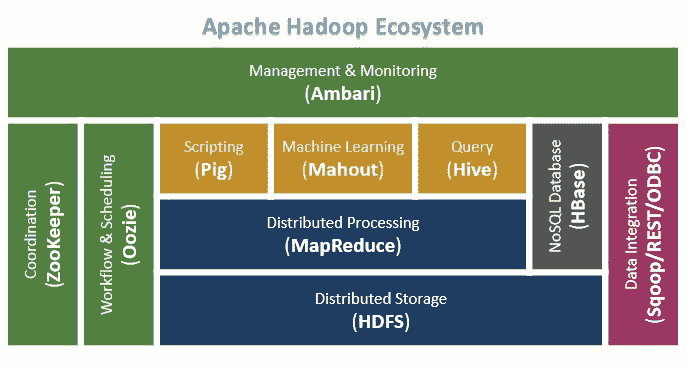
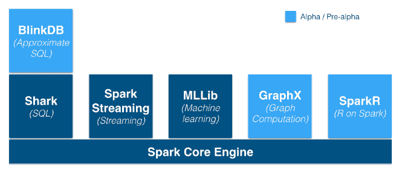

# 第十章：高级工具

本附录主要讨论各种框架如何在 NLP 应用程序中使用。我们将概述这些框架，并简要介绍它们的基本功能及其作用。我们不会详细查看每个框架的架构。此处的目的是让你了解可以一起使用的不同工具和框架，以便构建各种 NLP 应用程序。我们还将了解一些可帮助你开发仪表盘的可视化库。

# Apache Hadoop 作为一个存储框架

Apache Hadoop 是一个广泛使用的框架。Hadoop 允许使用简单的编程模型在商品计算机集群上分布式处理大数据集。Hadoop 使用了 MapReduce 的概念。MapReduce 将输入查询划分为小部分，并对存储在 **Hadoop 分布式文件系统** (**HDFS**) 上的数据进行并行处理。

Hadoop 具有以下特点：

+   它具有可扩展性

+   它具有成本效益

+   它提供了一个强大的生态系统

+   它提供更快的数据处理

Hadoop 可以作为 NLP 应用程序的存储框架。如果你想存储大量数据，那么可以使用一个多节点 Hadoop 集群，并将数据存储在 HDFS 上。因此，许多 NLP 应用程序会使用 HDFS 来存储它们的历史数据。Hadoop 将程序发送到数据上，数据会在本地处理。这个特性使得 Hadoop 具有较高的速度。需要注意的是，Hadoop 在磁盘级别执行操作，这比较慢，但我们通过并行执行操作，所以数据处理速度很快。现在，你可能会认为磁盘操作相比内存操作较慢，但我们有大量数据，这些数据一次是无法全部放入内存的。因此，采用在本地处理数据并通过多节点集群并行执行操作的方式，能给我们提供良好的吞吐量。

Hadoop 作为其核心架构的一部分，具有以下组件：

+   HDFS

+   MapReduce

+   YARN

+   Hadoop 常用工具

你可以在 *图 01* 中看到 Hadoop 的架构：

图 01：Hadoop 2.x YARN 架构（图片来源：[`github.com/zubayr/big_config/blob/master/hbase/hbase_tuning.md`](https://github.com/zubayr/big_config/blob/master/hbase/hbase_tuning.md)）

你可以在 *图 02* 中看到 Hadoop 生态系统：

图 02：Hadoop 生态系统（图片来源：[`s3.amazonaws.com/files.dezyre.com/images/blog/Big+Data+and+Hadoop+Training+Hadoop+Components+and+Architecture_1.png`](https://s3.amazonaws.com/files.dezyre.com/images/blog/Big+Data+and+Hadoop+Training+Hadoop+Components+and+Architecture_1.png)）

对于实时数据处理，Hadoop 稍显缓慢且效率较低。别担心！我们还有另一个框架可以帮助我们进行实时数据处理。

许多 NLP 应用程序使用 Hadoop 来存储数据，因为它能很好地处理数据。就个人而言，我曾使用 Hadoop 将我的语料库存储在 HDFS 上。然后，我使用 Spark MLlib 来开发 **机器学习** (**ML**) 算法。对于实时数据处理，我使用了 Apache Flink。

为了实验目的，我为你提供了设置单节点 Hadoop 集群的步骤。相关的 GitHub 链接是：[`github.com/jalajthanaki/NLPython/blob/master/Appendix3/Installationdocs/App3_3_Hadoop_installation.md`](https://github.com/jalajthanaki/NLPython/blob/master/Appendix3/Installationdocs/App3_3_Hadoop_installation.md)。

你可以在此文档中找到一些 Hadoop 的命令：

+   [`dzone.com/articles/top-10-hadoop-shell-commands`](https://dzone.com/articles/top-10-hadoop-shell-commands)。

+   [`hadoop.apache.org/docs/current/hadoop-project-dist/hadoop-common/FileSystemShell.html`](https://hadoop.apache.org/docs/current/hadoop-project-dist/hadoop-common/FileSystemShell.html)

# Apache Spark 作为处理框架

Apache Spark 是一个大规模数据处理框架。它是一个快速且通用的引擎。它是最快的处理框架之一。Spark 可以进行内存数据处理，也可以进行磁盘数据处理。

Spark 的重要功能如下：

+   **速度**：Apache Spark 可以比 Hadoop MapReduce 在内存中运行快 100 倍，或者在磁盘上运行快 10 倍。

+   **易用性**：提供了多种 API，适用于 Scala、Java、Spark 和 R，用于开发应用程序。

+   **通用性**：Spark 提供了结合 SQL、流式处理和复杂分析的功能。

+   **随处运行**：Spark 可以在 Hadoop、Mesos、独立模式或云端运行。你可以通过包括 HDFS、Cassandra、HBase 和 S3 来访问多种数据源。

我使用 Spark 通过 MLlib 训练我的模型。我使用了 Spark Java 和 PySpark API。结果是，你可以将数据重定向到 HDFS。我将训练好的模型保存到 HDFS，并根据需要加载它们。Spark 确实加速了你的处理时间。我亲身体验过这一点。其背后的原因是其内存中处理架构。Spark 的架构如*图 03*所示：

图 03：Spark 运行架构（图片来源：https://www.slideshare.net/datamantra/spark-architecture）

你可以在*图 04*中看到 Spark 生态系统：

图 04：Spark 生态系统（图片来源：http://jorditorres.org/spark-ecosystem/)

你可以在这个 GitHub 链接查看安装步骤：

[`github.com/jalajthanaki/NLPython/blob/master/Appendix3/Installationdocs/App3_4_Spark_installation.md`](https://github.com/jalajthanaki/NLPython/blob/master/Appendix3/Installationdocs/App3_4_Spark_installation.md)

你可以通过以下链接获取更多信息：

+   [`jaceklaskowski.gitbooks.io/mastering-apache-spark/content/`](https://jaceklaskowski.gitbooks.io/mastering-apache-spark/content/)

+   [`www.gitbook.com/book/jaceklaskowski/mastering-apache-spark/detail`](https://www.gitbook.com/book/jaceklaskowski/mastering-apache-spark/details)

+   [`spark.apache.org/`](http://spark.apache.org/)

+   [`spark.apache.org/docs/latest/ml-guide.html`](http://spark.apache.org/docs/latest/ml-guide.html)

+   [`spark.apache.org/docs/latest/mllib-guide.html`](http://spark.apache.org/docs/latest/mllib-guide.html)

# Apache Flink 作为实时处理框架

Apache Flink 用于实时流处理和批处理。我之前提到过我们不需要担心实时框架，因为我们有 Flink 框架来处理这个问题。

Flink 是一个开源流处理框架，适用于分布式、高性能、始终可用且精准的数据流应用。你可以在[`flink.apache.org/`](https://flink.apache.org/)查看更多关于 Flink 的信息。

Flink 必定会提供一个非常美好的未来。你可以在*图 05*中看到：

图 05：Flink 的特性（图片来源：https://flink.apache.org/）

Flink 是一个相对较新的框架。如果你想执行实时情感分析或制作一个推荐引擎，那么 Flink 非常有用。你可以参考以下视频，了解 HDFS、Flink、Kappa 和 Lambda 架构是如何被使用的。这是一个必看的视频：

[`www.youtube.com/watch?v=mYGF4BUwtaw`](https://www.youtube.com/watch?v=mYGF4BUwtaw)

这段视频帮助你理解各种框架如何融合在一起开发一个好的实时应用程序。

# Python 中的可视化库

可视化是跟踪某些过程和应用程序结果的重要活动之一。在第六章《高级特征工程与 NLP 算法》中，我们使用了`matplotlib`，其他章节也有使用。

除了`matplotlib`，我们还可以使用各种可视化库：

+   `matplotlib`：简单易用且非常实用

+   `bokeh`：提供自定义主题和图表

+   `pygal`：你可以用它制作酷炫的图表和图形

你可以通过以下链接参考每个库。所有库都有详细的文档，你可以查阅并开始制作自己的图表。

你可以在[`matplotlib.org/`](https://matplotlib.org/)找到更多关于`matplotlib`的信息。

你可以在[`bokeh.pydata.org/en/latest/docs/gallery.html`](http://bokeh.pydata.org/en/latest/docs/gallery.html)找到更多关于`Bokeh`的信息。

你可以在[`pygal.org/en/stable/documentation/index.html`](http://pygal.org/en/stable/documentation/index.html)上找到关于`pygal`的文档。

# 总结

如果你想了解关于这些框架和库的详细信息，可以使用 Gitter 聊天室与我联系，因为框架的深入细节超出了本书的范围。

这个框架概述将帮助您了解各种框架在自然语言处理（NLP）应用中的应用方式。Hadoop 用于存储。Spark MLlib 用于开发机器学习模型，并将训练好的模型存储在 HDFS 上。我们可以通过加载模型，根据需要运行训练好的模型。Flink 在实时分析和数据处理方面为我们带来了便利。实时情感分析、文档分类、用户推荐引擎等是您可以使用 Flink 构建的一些实时应用。`matplotlib` 用于开发机器学习模型。`pygal` 和 `bokeh` 用于为我们的最终用户制作漂亮的仪表盘。
