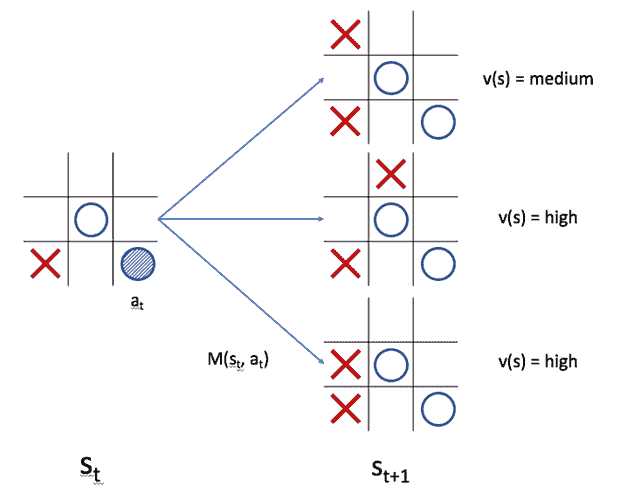

# 第一章：强化学习快速入门

**人工智能**（**AI**）在未来将会是什么样子？随着 AI 算法和软件应用的日益突出，这个问题应当引起许多人的关注。AI 的研究人员和从业者面临着进一步的相关问题：我们如何实现我们设想的目标并解决已知的问题？还有哪些创新和算法尚未开发出来？机器学习中的几个子领域展示了极大的潜力，能够解答我们许多问题。本书将聚焦于其中的一个子领域——强化学习，也许它是机器学习中最令人兴奋的话题之一。

强化学习的动机来自于通过与环境互动来学习的目标。想象一下一个婴儿是如何在其环境中活动的。通过四处移动并与周围环境互动，婴儿学习物理现象、因果关系以及与其互动的物体的各种属性和特性。婴儿的学习通常受到达成某个目标的驱动，比如玩周围的物体或满足某种好奇心。在强化学习中，我们追求类似的目标；我们采用一种计算方法来学习环境。换句话说，我们的目标是设计出通过与环境互动来完成任务的算法。

这些算法的用途是什么？通过拥有一种通用的学习算法，我们可以为解决多个现实世界中的问题提供有效的解决方案。一个显著的例子是强化学习算法用于自动驾驶汽车。尽管尚未完全实现，但这样的应用场景将为社会带来巨大益处，因为强化学习算法已经在实证中证明了其在多个任务中超越人类水平的能力。一个标志性的时刻发生在 2016 年，当时 DeepMind 的 AlphaGo 程序以四比一击败了 18 次围棋世界冠军李世石。AlphaGo 本质上能够在几个月内学习并超越人类三千年来积累的围棋智慧。最近，强化学习算法已被证明在玩更复杂的实时多智能体游戏（如 Dota）中也非常有效。这些驱动游戏算法的同样算法也成功地控制机器人手臂拾取物体，并指引无人机通过迷宫。这些例子不仅展示了这些算法的能力，还暗示了它们未来可能完成的任务。

# 本书简介

本书为那些渴望学习强化学习的读者提供了实用的指南。我们将通过大量的算法实例及其应用，采取动手实践的方式学习强化学习。每一章都专注于一个特定的应用案例，并介绍用于解决该问题的强化学习算法。这些应用案例中有些依赖于最先进的算法；因此，通过本书，我们将学习并实现一些业内最优表现的算法和技术。

随着你阅读本书，项目的难度/复杂度会逐渐增加。下表描述了你将从每一章节中学到的内容：

| **章节名称** | **应用案例/问题** | **讨论和使用的概念/算法/技术** |
| --- | --- | --- |
| *平衡推车杆* | 控制推车的水平移动以平衡竖直的杆 | OpenAI Gym 框架，Q 学习 |
| *玩 Atari 游戏* | 在人类水平的熟练度下玩各种 Atari 游戏 | 深度 Q 网络 |
| *模拟控制任务* | 控制一个在连续动作空间中的智能体，而非离散空间 | **确定性策略梯度**（**DPG**）、**信任域策略优化**（**TRPO**）、多任务学习 |
| *在 Minecraft 中构建虚拟世界* | 在 Minecraft 的虚拟世界中操作一个角色 | 异步优势 Actor-Critic（**A3C**） |
| *学习围棋* | 围棋，世界上最古老且最复杂的棋盘游戏之一 | 蒙特卡罗树搜索、策略和价值网络 |
| *创建聊天机器人* | 在对话环境中生成自然语言 | 策略梯度方法、**长短期记忆网络**（**LSTM**） |
| *自动生成深度学习图像分类器* | 创建一个生成神经网络来解决特定任务的智能体 | 循环神经网络、策略梯度方法（REINFORCE） |
| *预测未来股票价格* | 预测股票价格并做出买卖决策 | Actor-Critic 方法、时间序列分析、经验回放 |

# 期望

本书最适合以下读者：

+   具备中级 Python 编程能力

+   具备基本的机器学习和深度学习理解，特别是以下主题：

    +   神经网络

    +   反向传播

    +   卷积

    +   提高泛化能力和减少过拟合的技术

+   喜欢动手实践的学习方式

由于本书旨在作为该领域的实用入门指南，我们尽量将理论内容控制在最小范围。然而，建议读者具备一些机器学习领域所依赖的基础数学和统计学概念的知识。这些包括以下内容：

+   微积分（单变量和多变量）

+   线性代数

+   概率论

+   图论

对这些主题有一定了解将极大帮助读者理解本书中将涉及的概念和算法。

# 硬件和软件要求

接下来的章节将要求你实现各种强化学习算法。因此，为了顺利学习，必须有一个合适的开发环境。特别是，你应该具备以下条件：

+   一台运行 macOS 或 Linux 操作系统的计算机（对于 Windows 用户，建议尝试设置一个安装了 Linux 镜像的虚拟机）

+   稳定的互联网连接

+   一块 GPU（最好有）

我们将 exclusively 使用 Python 编程语言来实现我们的强化学习和深度学习算法。此外，我们将使用 Python 3.6。我们将使用的库的列表可以在官方 GitHub 仓库中找到，网址是 ([`github.com/PacktPublishing/Python-Reinforcement-Learning-Projects`](https://github.com/PacktPublishing/Python-Reinforcement-Learning-Projects))。你还可以在这个仓库中找到我们将在本书中讨论的每个算法的实现。

# 安装软件包

假设你已经有一个正常工作的 Python 安装，你可以通过我们的仓库中的 `requirements.txt` 文件安装所有所需的软件包。我们还建议你创建一个 `virtualenv` 来将开发环境与主操作系统隔离开来。以下步骤将帮助你构建环境并安装所需的包：

```py
# Install virtualenv using pip
$ pip install virtualenv

# Create a virtualenv
$ virtualenv rl_projects

# Activate virtualenv
$ source rl_projects/bin/activate

# cd into the directory with our requirements.txt
(rl_projects) $ cd /path/to/requirements.txt

# pip install the required packages
(rl_projects) $ pip install -r requirements.txt
```

现在你已经准备好开始了！本章接下来的几节将介绍强化学习领域，并对深度学习进行回顾。

# 什么是强化学习？

我们的旅程始于了解强化学习的基本概念。那些熟悉机器学习的人可能已经知道几种学习范式，即**监督学习**和**无监督学习**。在监督学习中，机器学习模型有一个监督者，提供每个数据点的真实标签。模型通过最小化其预测与真实标签之间的差距来学习。因此，数据集需要对每个数据点进行标注，例如，每张狗狗和猫的图片都会有相应的标签。在无监督学习中，模型无法访问数据的真实标签，因此必须在没有标签的情况下学习数据的分布和模式。

在强化学习中，代理指的是学习完成特定任务的模型/算法。代理主要通过接收**奖励信号**来学习，奖励信号是衡量代理完成任务表现的标量指标。

假设我们有一个代理，负责控制机器人行走的动作；如果代理成功朝目标行走，则会获得正向奖励，而如果摔倒或未能取得进展，则会获得负向奖励。

此外，与监督学习不同，这些奖励信号不会立即返回给模型；相反，它们是作为代理执行一系列**动作**的结果返回的。动作就是代理在其**环境**中可以做的事情。环境指的是代理所处的世界，主要负责向代理返回奖励信号。代理的动作通常会根据代理从环境中感知到的信息来决定。代理感知到的内容被称为**观察**或**状态**。强化学习与其他学习范式的一个重要区别在于，代理的动作可以改变环境及其随后产生的响应。

例如，假设一个代理的任务是玩《太空入侵者》，这是一款流行的 Atari 2600 街机游戏。环境就是游戏本身，以及它运行的逻辑。在游戏过程中，代理向环境发出查询以获取观察结果。观察结果仅仅是一个(210, 160, 3)形状的数组，代表游戏屏幕，屏幕上显示代理的飞船、敌人、得分以及任何投射物。根据这个观察结果，代理做出一些动作，可能包括向左或向右移动、发射激光或什么也不做。环境接收代理的动作作为输入，并对状态进行必要的更新。

举例来说，如果激光击中敌方飞船，它会从游戏中消失。如果代理决定仅仅向左移动，游戏会相应更新代理的坐标。这个过程会一直重复，直到达到**终止状态**，即表示序列结束的状态。在《太空入侵者》游戏中，终止状态对应的是代理的飞船被摧毁，游戏随后返回记录的得分，该得分是根据代理成功摧毁的敌方飞船数量计算得出的。

请注意，一些环境没有终止状态，例如股票市场。这些环境会一直运行，直到它们结束。

让我们回顾一下到目前为止学习的术语：

| **术语** | **描述** | **示例** |
| --- | --- | --- |
| 代理 | 负责学习完成任务的模型/算法。 | 自动驾驶汽车、行走机器人、视频游戏玩家 |
| 环境 | 代理所处的世界。它负责控制代理的感知内容，并提供关于代理执行特定任务表现的反馈。 | 汽车行驶的道路、视频游戏、股票市场 |
| 动作 | 代理在环境中做出的决策，通常取决于代理的感知。 | 驾驶汽车、买卖特定股票、从代理控制的太空船上发射激光 |
| 奖励信号 | 一个标量值，表示智能体在执行特定任务时的表现如何。 | 《太空入侵者》的得分、某只股票的投资回报、学习行走的机器人走过的距离 |
| 观察/状态 | 智能体可以感知的环境描述。 | 从仪表盘摄像头拍摄的视频、游戏屏幕、股市统计数据 |
| 终止状态 | 智能体无法再进行任何操作的状态。 | 迷宫的尽头，或者《太空入侵者》中的飞船被摧毁 |

更正式地说，在给定的时间步`t`，以下内容发生在智能体`P`和环境`E`之间：

```py
- P queries E for some observation 
- P decides to take action  based on observation 
- E receives  and returns reward  based on the action
- P receives 
- E updates  to  based on  and other factors
```

环境是如何计算和的？环境通常有自己的算法，根据多个输入/因素计算这些值，包括智能体采取的行动。

有时候，环境由多个智能体组成，它们试图最大化自己的奖励。重力作用于从高处落下的球的方式，很好地表现了环境是如何运作的；就像我们的周围环境遵循物理定律一样，环境也有一些内部机制来计算奖励和下一个状态。这个内部机制通常对智能体是隐藏的，因此我们的任务是构建能够在这种不确定性中依然能做好各自任务的智能体。

在接下来的章节中，我们将更详细地讨论每个强化学习问题的主要主体——智能体（Agent）。

# 智能体

强化学习智能体的目标是在环境中学会出色地执行任务。从数学角度来看，这意味着最大化累计奖励*R*，可以通过以下公式表示：


我们只是计算每个时间步获得奖励的加权总和。被称为**折扣因子**，它是一个介于 0 和 1 之间的标量值。其概念是奖励来得越晚，它的价值就越低。这也反映了我们对奖励的看法；比如，我们宁愿现在收到$100，也不愿一年后再收到，这表明同样的奖励信号可以根据其接近现在的程度而具有不同的价值。

由于环境的机制对智能体来说并非完全可观察或已知，它必须通过执行行动并观察环境如何反应来获取信息。这与人类如何学习执行某些任务的方式非常相似。

假设我们正在学习下棋。虽然我们并未将所有可能的棋步记在脑中，或者完全知道对手会如何下棋，但我们能够随着时间的推移提高我们的技巧。特别是，我们能够在以下方面变得熟练：

+   学习如何应对对手做出的行动

+   评估我们在赢得游戏中的位置有多好

+   预测对手接下来会做什么，并利用该预测来决定行动

+   理解别人如何在类似情况下进行游戏

事实上，强化学习代理可以学习做类似的事情。特别是，一个代理可以由多个功能和模型组成，以辅助其决策。一个代理可以包含三个主要组件：策略、价值函数和模型。

# 策略

策略是一个算法或一组规则，用来描述一个代理如何做出决策。例如，投资者在股市中交易时使用的策略就是一种策略，其中投资者在股价下跌时购买股票，在股价上涨时卖出股票。

更正式地说，策略是一个函数，通常表示为，它将一个状态映射到一个行动：


这意味着一个代理根据其当前状态来决定其行动。这个函数可以表示任何内容，只要它能够接收状态作为输入并输出一个行动，无论是表格、图表还是机器学习分类器。

例如，假设我们有一个代理需要导航一个迷宫。我们进一步假设代理知道迷宫的样子；以下是代理策略的表示方式：


图 1：一个迷宫，其中每个箭头表示代理下一个可能的行动方向

这个迷宫中的每个白色方块代表代理可能处于的状态。每个蓝色箭头指示代理在相应方块中会采取的行动。这本质上表示了代理在这个迷宫中的策略。此外，这也可以视为一个确定性策略，因为从状态到行动的映射是确定的。这与随机策略相对，后者会在给定某种状态时输出一个关于可能行动的概率分布：


这里，是所有可能行动的标准化概率向量，如以下示例所示：


图 2：一个将游戏状态（屏幕）映射到行动（概率）的策略

玩《Breakout》游戏的代理有一个策略，该策略以游戏屏幕为输入，并返回每个可能行动的概率。

# 价值函数

智能体的第二个组成部分称为**值函数**。如前所述，值函数有助于评估智能体在某一状态下的位置，无论是好是坏。在国际象棋中，玩家希望了解他们在当前棋盘状态下获胜的可能性。而在迷宫中，智能体则希望知道自己离目标有多近。值函数正是为此服务；它预测智能体在某一状态下将获得的预期未来奖励。换句话说，它衡量某一状态对智能体的吸引力。更正式地说，值函数将状态和策略作为输入，并返回一个标量值，表示预期的累计奖励：


以我们的迷宫示例为例，假设智能体每走一步就会收到-1 的惩罚奖励。智能体的目标是以尽可能少的步骤完成迷宫。每个状态的值可以如下表示：


图 3：一个迷宫，其中每个方格表示处于该状态时的值

每个方格基本上表示从当前位置到达迷宫终点所需的步数。如你所见，达到目标所需的最少步数为 15 步。

除了告诉我们某一状态的吸引力外，值函数还能如何帮助智能体更好地完成任务呢？正如我们将在接下来的章节中看到的，值函数在预测一系列动作是否能够成功之前起着至关重要的作用。这类似于国际象棋选手预想一系列未来动作如何有助于提高获胜的机会。为了做到这一点，智能体还需要了解环境是如何运作的。这时，智能体的第三个组成部分——**模型**——变得非常重要。

# 模型

在前面的章节中，我们讨论了环境对智能体的不可完全知晓。换句话说，智能体通常不知道环境内部算法的具体情况。因此，智能体需要与环境互动，以获取信息并学习如何最大化预期的累计奖励。然而，智能体可能会有一个环境的内部副本或模型。智能体可以使用该模型预测环境在给定状态下对某个动作的反应。例如，股市模型的任务是预测未来的价格。如果模型准确，智能体便可以利用其值函数评估未来状态的吸引力。更正式地说，模型可以表示为一个函数，，它预测在当前状态和某个动作下，下一状态的概率：


在其他场景中，环境的模型可以用来列举可能的未来状态。这通常用于回合制游戏，如国际象棋和井字游戏，其中规则和可能动作的范围已明确规定。树状图常用于展示回合制游戏中可能的动作和状态序列：



图 4：一个使用其价值函数评估可能动作的模型

在前面的井字游戏示例中，表示在给定状态下采取动作（表示为阴影圆圈）可能带来的结果，状态为。此外，我们可以使用代理的价值函数计算每个状态的值。中间和底部的状态将产生较高的值，因为代理离胜利仅一步之遥，而顶部的状态将产生中等值，因为代理需要阻止对手获胜。

让我们回顾一下到目前为止涵盖的术语：

| **术语** | **描述** | **它输出什么？** |
| --- | --- | --- |
| 策略 | 算法或函数，用于输出代理做出的决策 | 输出单一决策的标量（确定性策略）或关于可能动作的概率向量（随机策略） |
| 价值函数 | 描述某个状态好坏的函数 | 表示期望累积奖励的标量值 |
| 模型 | 代理对环境的表示，预测环境如何对代理的行为作出反应 | 给定动作和当前状态下的下一个状态的概率，或根据环境规则列出可能的状态 |

在接下来的章节中，我们将利用这些概念来学习强化学习中最基础的框架之一：马尔可夫决策过程。

# 马尔可夫决策过程（MDP）

马尔可夫决策过程是一个用来表示强化学习问题环境的框架。它是一个有向图模型（意味着图中的一个节点指向另一个节点）。每个节点代表环境中的一个可能状态，每个从状态指向外部的边代表在给定状态下可以采取的动作。例如，考虑以下的 MDP：


图 5：一个示例马尔可夫决策过程

前面的 MDP 表示程序员典型一天的情景。每个圆圈代表程序员可能处于的某个状态，其中蓝色状态（醒来）是初始状态（即代理在 *t*=0 时的状态），而橙色状态（发布代码）表示终止状态。每个箭头表示程序员可以在状态之间进行的转换。每个状态都有与之相关的奖励，奖励越高，该状态越具吸引力。

我们也可以将奖励制成邻接矩阵：

| **状态\动作** | **醒来** | **Netflix** | **编写代码和调试** | **小睡** | **部署** | **睡觉** |
| --- | --- | --- | --- | --- | --- | --- |
| 醒来 | N/A | -2 | -3 | N/A | N/A | N/A |
| Netflix | N/A | -2 | N/A | N/A | N/A | N/A |
| 编写代码和调试 | N/A | N/A | N/A | 1 | 10 | 3 |
| 小睡 | 0 | N/A | N/A | N/A | N/A | N/A |
| 部署 | N/A | N/A | N/A | N/A | N/A | 3 |
| 睡觉 | N/A | N/A | N/A | N/A | N/A | N/A |

左列表示可能的状态，顶行表示可能的动作。N/A 意味着在给定状态下无法执行该动作。该系统基本上表示程序员在一天中的决策过程。

当程序员醒来时，他们可以选择工作（编写和调试代码）或观看 Netflix。请注意，观看 Netflix 的奖励高于编写和调试代码的奖励。对于这个程序员来说，观看 Netflix 似乎是更有回报的活动，而编写和调试代码可能是一项苦差事（希望读者不会是这种情况！）。然而，这两种行为都会导致负奖励，尽管我们的目标是最大化累积奖励。如果程序员选择观看 Netflix，他们将陷入一个无休止的刷剧循环，这会不断降低奖励。相反，如果他们决定认真编写代码，更多有回报的状态将会向他们开放。我们来看看程序员可以采取的可能轨迹——即一系列动作：

+   醒来 | Netflix | Netflix | ...

+   醒来 | 编写代码和调试 | 小睡 | 醒来 | 编写代码和调试 | 小睡 | ...

+   醒来 | 编写代码和调试 | 睡觉

+   醒来 | 编写代码和调试 | 部署 | 睡觉

第一和第二条轨迹都代表了无限循环。让我们计算每条轨迹的累积奖励，假设我们设置了 :

+   

+   

+   

+   

很容易看出，尽管第一条和第二条轨迹没有达到终止状态，但它们永远不会返回正奖励。第四条轨迹带来了最高的奖励（成功部署代码是一个非常有回报的成就！）。

我们所计算的是四种策略的价值函数，程序员可以根据这些策略来规划他们的日常工作。回想一下，价值函数是指从给定状态出发并遵循某一策略的期望累计奖励。我们已经观察到四种可能的策略，并评估了每种策略如何导致不同的累计奖励；这个过程也叫做**策略评估**。此外，我们用于计算期望奖励的方程也被称为**贝尔曼期望方程**。贝尔曼方程是一组用于评估和改进策略与价值函数的方程，帮助强化学习智能体更好地学习。虽然本书并不深入介绍贝尔曼方程，但它们是构建强化学习理论理解的基础。我们鼓励读者深入研究这一主题。

虽然我们不会深入讲解贝尔曼方程，但我们强烈建议读者学习贝尔曼方程，以便建立强化学习的扎实理解。有关更多信息，请参见理查德·S·萨顿和安德鲁·巴托所著的《*强化学习：导论*》（本章末尾有参考文献）。

现在你已经了解了强化学习的一些关键术语和概念，或许你会想知道我们是如何教导强化学习智能体去最大化其奖励，换句话说，如何确定第四条轨迹是最优的。在本书中，你将通过解决许多任务和问题来实现这一目标，所有这些任务都将使用深度学习。虽然我们鼓励你熟悉深度学习的基础知识，但以下部分将作为该领域的轻度复习。

# 深度学习

深度学习已成为机器学习和计算机科学中最受欢迎且最具辨识度的领域之一。得益于可用数据和计算资源的增加，深度学习算法在无数任务中成功超越了以往的最先进成果。在多个领域，包括图像识别和围棋，深度学习甚至超越了人类的能力。

因此，许多强化学习算法开始利用深度学习来提高性能也就不足为奇了。本章开头提到的许多强化学习算法都依赖于深度学习。本书也将围绕深度学习算法展开，以解决强化学习问题。

以下部分将作为深度学习一些最基本概念的复习，包括神经网络、反向传播和卷积。然而，如果你不熟悉这些主题，我们强烈建议你寻求其他来源，获取更深入的介绍。

# 神经网络

神经网络是一种计算架构，由多层感知机组成。感知机由 Frank Rosenblatt 于 1950 年代首次构思，模拟生物神经元并计算输入向量的线性组合。它还使用非线性激活函数（如 sigmoid 函数）对线性组合进行转换并输出结果。假设一个感知机接收输入向量为。感知机的输出*a*如下：


其中是感知机的权重，*b*是常数，称为**偏置**，而是 sigmoid 激活函数，它输出一个介于 0 和 1 之间的值。

感知机被广泛用作决策的计算模型。假设任务是预测第二天晴天的可能性。每一个都代表一个变量，比如当天的温度、湿度或前一天的天气。然后，将计算一个值，反映明天晴天的可能性。如果模型对于有一组好的值，它就能做出准确的决策。

在典型的神经网络中，有多层神经元，每一层的每个神经元都与前一层和后一层的所有神经元相连接。因此，这些层也被称为**全连接层**。给定层的权重，*l*，可以表示为矩阵*W^l*：


其中，每个*w[ij]*表示前一层的第*i*个神经元与当前层的第*j*个神经元之间的权重。*B^l*表示偏置向量，每个神经元都有一个偏置。于是，给定层*l*的激活值*a^l*可以定义如下：


其中*a⁰(x)*只是输入。具有多层神经元的神经网络被称为**多层感知机**（**MLP**）。一个 MLP 有三个组件：输入层、隐藏层和输出层。数据从输入层开始，通过隐藏层中的一系列线性和非线性函数进行转换，然后从输出层输出为决策或预测。因此，这种架构也被称为前馈网络。以下图示展示了一个完全连接的网络的样子：


图 6：多层感知机的示意图

# 反向传播

如前所述，神经网络的性能取决于 *W* 的值有多好（为简便起见，我们将权重和偏差统称为 *W*）。当整个网络的规模增长时，手动为每一层的每个神经元确定最优权重变得不可行。因此，我们依赖于反向传播算法，它迭代且自动地更新每个神经元的权重。

为了更新权重，我们首先需要地面真实值，或者说神经网络尝试输出的目标值。为了理解这个地面真实值是什么样子，我们设定了一个样本问题。`MNIST` 数据集是一个包含 28x28 手写数字图像的大型库。它总共有 70,000 张图像，并且是机器学习模型的一个常见基准。给定十个不同的数字类别（从 0 到 9），我们希望识别给定图像属于哪个数字类别。我们可以将每张图像的地面真实值表示为一个长度为 10 的向量，其中类别的索引（从 0 开始）被标记为 1，其余为 0。例如，图像 *x* 的类别标签为 5，则其地面真实值为 ，其中 *y* 是我们要逼近的目标函数。

神经网络应该是什么样的？如果我们将图像中的每个像素看作输入，我们将会在输入层中拥有 28x28 个神经元（每张图像将被展平，变为一个 784 维的向量）。此外，由于有 10 个数字类别，我们在输出层中有 10 个神经元，每个神经元为给定类别产生一个 sigmoid 激活函数。隐藏层的神经元数量可以是任意的。

让 *f* 代表神经网络计算的转换序列，参数化为权重 *W*。*f* 本质上是目标函数 *y* 的近似，并将 784 维的输入向量映射到 10 维的输出预测。我们根据最大 sigmoid 输出的索引来对图像进行分类。

现在我们已经制定了地面真实值，我们可以衡量它与网络预测之间的距离。这个误差使得网络能够更新它的权重。我们将误差函数 *E(W)* 定义如下：


反向传播的目标是通过找到合适的 *W* 来最小化 *E*。这个最小化是一个优化问题，我们使用梯度下降法迭代地计算 *E* 相对于 *W* 的梯度，并从输出层开始将其传播通过网络。

不幸的是，反向传播的深入解释超出了本章节的范围。如果你对这个概念不熟悉，我们强烈建议你首先学习它。

# 卷积神经网络

通过反向传播，我们现在能够自动训练大型网络。这导致了越来越复杂的神经网络架构的出现。一个例子是**卷积神经网络**（**CNN**）。CNN 中主要有三种类型的层：卷积层、池化层和全连接层。全连接层与之前讨论的标准神经网络相同。在卷积层中，权重是卷积核的一部分。对二维图像像素数组的卷积定义如下：


其中，*f(u, v)*是输入在坐标*(u, v)*处的像素强度，*g(x-u, y-v)*是该位置卷积核的权重。

卷积层由一组卷积核组成；因此，卷积层的权重可以视为一个三维的盒子，而不是我们为全连接层定义的二维数组。应用于输入的单个卷积核的输出也是二维映射，我们称之为滤波器。由于有多个卷积核，卷积层的输出再次是一个三维的盒子，可以称之为体积。

最后，池化层通过对*m*m*局部像素块进行操作，并输出一个标量，来减小输入的大小。最大池化层对*m*m*像素块进行操作，并输出该像素块中的最大值。

给定一个形状为(32, 32, 3)的输入体积——对应于高度、宽度和深度（通道）——一个池化大小为 2x2 的最大池化层将输出形状为(16, 16, 3)的体积。CNN 的输入通常是图像，也可以看作是深度对应于 RGB 通道的体积。

以下是典型卷积神经网络的示意图：


图 7：一个示例卷积神经网络

# 神经网络的优势

CNN 相比标准神经网络的主要优势在于，前者能够学习输入的视觉和空间特征，而后者由于将输入数据展平为向量，丢失了这类信息。CNN 在计算机视觉领域取得了重大进展，最早体现在对`MNIST`数据的分类准确率提升，以及物体识别、语义分割等领域。CNN 在现实生活中有广泛的应用，从社交媒体中的人脸检测到自动驾驶汽车。最近的研究还将 CNN 应用于自然语言处理和文本分类任务，取得了最先进的成果。

现在我们已经介绍了机器学习的基础知识，接下来我们将进行第一次实现练习。

# 在 TensorFlow 中实现卷积神经网络

在本节中，我们将使用 TensorFlow 实现一个简单的卷积神经网络，以解决图像分类任务。由于本书其余部分将大量依赖于 TensorFlow 和 CNNs，我们强烈建议你熟悉如何使用该框架实现深度学习算法。

# TensorFlow

TensorFlow 是由 Google 于 2015 年开发的，是世界上最流行的深度学习框架之一。它被广泛应用于研究和商业项目，并拥有丰富的 API 和功能，帮助研究人员和从业人员开发深度学习模型。TensorFlow 程序可以在 GPU 和 CPU 上运行，从而将 GPU 编程进行了抽象化，使开发变得更加便捷。

本书中，我们将专门使用 TensorFlow，因此在继续阅读本书的章节时，确保你熟悉基本知识。

访问 [`www.tensorflow.org/`](https://www.tensorflow.org/) 获取完整的文档和其他教程。

# Fashion-MNIST 数据集

有深度学习经验的人大多听说过 `MNIST` 数据集。它是最广泛使用的图像数据集之一，作为图像分类和图像生成等任务的基准，并且被许多计算机视觉模型使用：


图 8：MNIST 数据集（本章末尾有参考文献）

然而，`MNIST` 数据集存在一些问题。首先，数据集过于简单，因为一个简单的卷积神经网络就能实现 99% 的测试准确率。尽管如此，该数据集在研究和基准测试中仍被过度使用。由在线时尚零售商 Zalando 提供的 `F-MNIST` 数据集，是对 `MNIST` 数据集的一个更复杂、更具挑战性的升级版本：


图 9：Fashion-MNIST 数据集（来源于 [`github.com/zalandoresearch/fashion-mnist`](https://github.com/zalandoresearch/fashion-mnist)，本章末尾有参考文献）

与数字不同，`F-MNIST` 数据集包含了十种不同类型的服装照片（从 T 恤到鞋子不等），这些照片被压缩为 28x28 的单色缩略图。因此，`F-MNIST` 作为 `MNIST` 的一个方便的替代品，越来越受到社区的欢迎。因此，我们也将在 `F-MNIST` 上训练我们的 CNN。前面的表格将每个标签索引映射到对应的类别：

| **索引** | **类别** |
| --- | --- |
| 0 | T 恤/上衣 |
| 1 | 长裤 |
| 2 | 套头衫 |
| 3 | 连衣裙 |
| 4 | 外套 |
| 5 | 凉鞋 |
| 6 | 衬衫 |
| 7 | 运动鞋 |
| 8 | 包 |
| 9 | 高帮靴 |

在接下来的子章节中，我们将设计一个卷积神经网络，它将学习如何对来自该数据集的数据进行分类。

# 构建网络

多个深度学习框架已经实现了加载`F-MNIST`数据集的 API，包括 TensorFlow。在我们的实现中，我们将使用 Keras，这是另一个与 TensorFlow 集成的流行深度学习框架。Keras 的数据集模块提供了一个非常方便的接口，将数据集加载为`numpy`数组。

最后，我们可以开始编写代码了！对于本次练习，我们只需要一个 Python 模块，我们将其命名为`cnn.py`。打开你喜欢的文本编辑器或 IDE，开始吧。

我们的第一步是声明我们将使用的模块：

```py
import logging
import os
import sys

logger = logging.getLogger(__name__)

import tensorflow as tf
import numpy as np
from keras.datasets import fashion_mnist
from keras.utils import np_utils
```

以下描述了每个模块的用途以及我们将如何使用它：

| **模块** | **用途** |
| --- | --- |
| `logging` | 用于在运行代码时打印统计信息 |
| `os`, `sys` | 用于与操作系统交互，包括写文件 |
| `tensorflow` | 主要的 TensorFlow 库 |
| `numpy` | 一个优化过的向量计算和简单数据处理库 |
| `keras` | 用于下载 F-MNIST 数据集 |

我们将实现一个名为`SimpleCNN`的类。`__init__`构造函数接受多个参数：

```py
class SimpleCNN(object):

    def __init__(self, learning_rate, num_epochs, beta, batch_size):
        self.learning_rate = learning_rate
        self.num_epochs = num_epochs
        self.beta = beta
        self.batch_size = batch_size
        self.save_dir = "saves"
        self.logs_dir = "logs"
        os.makedirs(self.save_dir, exist_ok=True)
        os.makedirs(self.logs_dir, exist_ok=True)
        self.save_path = os.path.join(self.save_dir, "simple_cnn")
        self.logs_path = os.path.join(self.logs_dir, "simple_cnn")
```

我们的`SimpleCNN`初始化时的参数在此进行描述：

| **参数** | **用途** |
| --- | --- |
| `learning_rate` | 优化算法的学习率 |
| `num_epochs` | 训练网络所需的 epoch 次数 |
| `beta` | 一个浮动值（介于 0 和 1 之间），控制 L2 惩罚的强度 |
| `batch_size` | 每次训练中处理的图像数量 |

此外，`save_dir`和`save_path`指代的是我们将存储网络参数的位置，`logs_dir`和`logs_path`则指代存储训练过程统计信息的位置（稍后我们会展示如何获取这些日志）。

# 构建网络的方法

在这一部分，我们将看到两种可以用于构建该功能的方法，它们分别是：

+   构建方法

+   拟合方法

# 构建方法

我们为`SimpleCNN`类定义的第一个方法是`build`方法，它负责构建 CNN 的架构。我们的`build`方法接受两个输入：输入张量和它应该预期的类别数：

```py
def build(self, input_tensor, num_classes):
    """
    Builds a convolutional neural network according to the input shape and the number of classes.
    Architecture is fixed.

    Args:
        input_tensor: Tensor of the input
        num_classes: (int) number of classes

    Returns:
        The output logits before softmax
    """
```

我们首先初始化`tf.placeholder`，命名为`is_training`。TensorFlow 的占位符类似于没有值的变量，只有在实际训练网络并调用相关操作时，我们才会给它赋值：

```py
with tf.name_scope("input_placeholders"):
    self.is_training = tf.placeholder_with_default(True, shape=(), name="is_training")
```

`tf.name_scope(...)`块允许我们为操作和张量命名。虽然这不是绝对必要的，但它有助于更好地组织代码，也有助于我们可视化网络。在这里，我们定义了一个名为`is_training`的`tf.placeholder_with_default`，其默认值为`True`。这个占位符将用于我们的 dropout 操作（因为 dropout 在训练和推理阶段有不同的模式）。

为操作和张量命名被认为是一种好习惯，它有助于你更好地组织代码。

下一步是定义我们 CNN 的卷积层。我们使用三种不同类型的层来创建多个卷积层：`tf.layers.conv2d`、`tf.max_pooling2d`和`tf.layers.dropout`：

```py
with tf.name_scope("convolutional_layers"):
    conv_1 = tf.layers.conv2d(
        input_tensor,
        filters=16,
        kernel_size=(5, 5),
        strides=(1, 1),
        padding="SAME",
        activation=tf.nn.relu,
        kernel_regularizer=tf.contrib.layers.l2_regularizer(scale=self.beta),
        name="conv_1")
    conv_2 = tf.layers.conv2d(
        conv_1,
        filters=32,
        kernel_size=(3, 3),
        strides=(1, 1),
        padding="SAME",
        activation=tf.nn.relu,
        kernel_regularizer=tf.contrib.layers.l2_regularizer(scale=self.beta),
        name="conv_2")
    pool_3 = tf.layers.max_pooling2d(
        conv_2,
        pool_size=(2, 2),
        strides=1,
        padding="SAME",
        name="pool_3"
    )
    drop_4 = tf.layers.dropout(pool_3, training=self.is_training, name="drop_4")

    conv_5 = tf.layers.conv2d(
        drop_4,
        filters=64,
        kernel_size=(3, 3),
        strides=(1, 1),
        padding="SAME",
        activation=tf.nn.relu,
        kernel_regularizer=tf.contrib.layers.l2_regularizer(scale=self.beta),
        name="conv_5")
    conv_6 = tf.layers.conv2d(
        conv_5,
        filters=128,
        kernel_size=(3, 3),
        strides=(1, 1),
        padding="SAME",
        activation=tf.nn.relu,
        kernel_regularizer=tf.contrib.layers.l2_regularizer(scale=self.beta),
        name="conv_6")
    pool_7 = tf.layers.max_pooling2d(
        conv_6,
        pool_size=(2, 2),
        strides=1,
        padding="SAME",
        name="pool_7"
    )
    drop_8 = tf.layers.dropout(pool_7, training=self.is_training, name="drop_8")
```

下面是一些参数的解释：

| **参数** | **类型** | **描述** |
| --- | --- | --- |
| `filters` | `int` | 卷积层输出的过滤器数量。 |
| `kernel_size` | `int`元组 | 卷积核的形状。 |
| `pool_size` | `int`元组 | 最大池化窗口的形状。 |
| `strides` | `int` | 每次卷积/最大池化操作时，滑动的像素数量。 |
| `padding` | `str` | 是否添加填充（SAME）或者不添加（VALID）。如果添加填充，卷积的输出形状将与输入形状保持一致。 |
| `activation` | `func` | 一个 TensorFlow 激活函数。 |
| `kernel_regularizer` | `op` | 使用哪种正则化方法来约束卷积核。默认值是`None`。 |
| `training` | `op` | 一个张量/占位符，用于告诉 dropout 操作当前是用于训练还是推理。 |

在上面的表格中，我们指定了卷积架构的层次顺序如下：

CONV | CONV | POOL | DROPOUT | CONV | CONV | POOL | DROPOUT

然而，我们鼓励您探索不同的配置和架构。例如，您可以添加批归一化层，以提高训练的稳定性。

最后，我们添加全连接层，将网络的输出生成最终结果：

```py
with tf.name_scope("fully_connected_layers"):
    flattened = tf.layers.flatten(drop_8, name="flatten")
    fc_9 = tf.layers.dense(
        flattened,
        units=1024,
        activation=tf.nn.relu,
        kernel_regularizer=tf.contrib.layers.l2_regularizer(scale=self.beta),
        name="fc_9"
    )
    drop_10 = tf.layers.dropout(fc_9, training=self.is_training, name="drop_10")
    logits = tf.layers.dense(
        drop_10,
        units=num_classes,
        kernel_regularizer=tf.contrib.layers.l2_regularizer(scale=self.beta),
        name="logits"
    )

return logits
```

`tf.layers.flatten`将卷积层的输出（即 3 维）转化为一个单一的向量（1 维），这样我们就可以将它们传入`tf.layers.dense`层。经过两个全连接层后，我们返回最终的输出，这个输出我们定义为`logits`。

请注意，在最终的`tf.layers.dense`层中，我们没有指定`activation`。当我们开始指定网络的训练操作时，您会明白为什么这么做。

接下来，我们实现几个辅助函数。`_create_tf_dataset`接受两个`numpy.ndarray`实例，并将它们转换为 TensorFlow 张量，可以直接传入网络。`_log_loss_and_acc`则简单地记录训练统计数据，如损失和准确率：

```py
def _create_tf_dataset(self, x, y):
    dataset = tf.data.Dataset.zip((
            tf.data.Dataset.from_tensor_slices(x),
            tf.data.Dataset.from_tensor_slices(y)
        )).shuffle(50).repeat().batch(self.batch_size)
    return dataset

def _log_loss_and_acc(self, epoch, loss, acc, suffix):
    summary = tf.Summary(value=[
        tf.Summary.Value(tag="loss_{}".format(suffix), simple_value=float(loss)),
        tf.Summary.Value(tag="acc_{}".format(suffix), simple_value=float(acc))
    ])
    self.summary_writer.add_summary(summary, epoch)
```

# fit 方法

我们为`SimpleCNN`实现的最后一个方法是`fit`方法。这个函数触发我们的 CNN 训练。我们的`fit`方法有四个输入：

| **参数** | **描述** |
| --- | --- |
| `X_train` | 训练数据 |
| `y_train` | 训练标签 |
| `X_test` | 测试数据 |
| `y_test` | 测试标签 |

`fit`的第一步是初始化`tf.Graph`和`tf.Session`。这两个对象是任何 TensorFlow 程序的核心。`tf.Graph`表示定义所有 CNN 操作的图。你可以把它看作是一个沙箱，我们在其中定义所有层和函数。`tf.Session`是实际执行`tf.Graph`中定义操作的类：

```py
def fit(self, X_train, y_train, X_valid, y_valid):
    """
    Trains a CNN on given data

    Args:
        numpy.ndarrays representing data and labels respectively
    """
    graph = tf.Graph()
    with graph.as_default():
        sess = tf.Session()
```

然后，我们使用 TensorFlow 的 Dataset API 和之前定义的`_create_tf_dataset`方法来创建数据集：

```py
train_dataset = self._create_tf_dataset(X_train, y_train)
valid_dataset = self._create_tf_dataset(X_valid, y_valid)

# Creating a generic iterator
iterator = tf.data.Iterator.from_structure(train_dataset.output_types,
                                           train_dataset.output_shapes)
next_tensor_batch = iterator.get_next()

# Separate training and validation set init ops
train_init_ops = iterator.make_initializer(train_dataset)
valid_init_ops = iterator.make_initializer(valid_dataset)

input_tensor, labels = next_tensor_batch
```

`tf.data.Iterator`构建一个迭代器对象，每次我们调用`iterator.get_next()`时，它都会输出一批图像。我们为训练数据和测试数据分别初始化数据集。`iterator.get_next()`的结果是输入图像和相应标签的元组。

前者是`input_tensor`，我们将其输入到`build`方法中。后者用于计算损失函数和反向传播：

```py
num_classes = y_train.shape[1]

# Building the network
logits = self.build(input_tensor=input_tensor, num_classes=num_classes)
logger.info('Built network')

prediction = tf.nn.softmax(logits, name="predictions")
loss_ops = tf.reduce_mean(tf.nn.softmax_cross_entropy_with_logits_v2(
    labels=labels, logits=logits), name="loss")
```

`logits`（网络的非激活输出）输入到两个其他操作中：`prediction`，它只是对`logits`进行 softmax 处理，以获得类的归一化概率，以及`loss_ops`，它计算预测和标签之间的平均类别交叉熵。

然后我们定义了用于训练网络的反向传播算法和用于计算准确度的操作：

```py
optimizer = tf.train.AdamOptimizer(learning_rate=self.learning_rate)
train_ops = optimizer.minimize(loss_ops)

correct = tf.equal(tf.argmax(prediction, 1), tf.argmax(labels, 1), name="correct")
accuracy_ops = tf.reduce_mean(tf.cast(correct, tf.float32), name="accuracy")
```

现在我们已经完成了网络和其优化算法的构建。我们使用`tf.global_variables_initializer()`来初始化网络的权重和操作。我们还初始化了`tf.train.Saver`和`tf.summary.FileWriter`对象。`tf.train.Saver`对象用于保存网络的权重和架构，而后者则跟踪各种训练统计数据：

```py
initializer = tf.global_variables_initializer()

logger.info('Initializing all variables')
sess.run(initializer)
logger.info('Initialized all variables')

sess.run(train_init_ops)
logger.info('Initialized dataset iterator')
self.saver = tf.train.Saver()
self.summary_writer = tf.summary.FileWriter(self.logs_path)
```

最后，一旦我们设置好所需的一切，就可以实现实际的训练循环。每个 epoch，我们跟踪训练的交叉熵损失和网络的准确度。在每个 epoch 结束时，我们将更新后的权重保存到磁盘。我们还会每 10 个 epoch 计算一次验证损失和准确度。这是通过调用`sess.run(...)`来完成的，其中该函数的参数是`sess`对象应该执行的操作：

```py
logger.info("Training CNN for {} epochs".format(self.num_epochs))
for epoch_idx in range(1, self.num_epochs+1):
    loss, _, accuracy = sess.run([
        loss_ops, train_ops, accuracy_ops
    ])
    self._log_loss_and_acc(epoch_idx, loss, accuracy, "train")

    if epoch_idx % 10 == 0:
        sess.run(valid_init_ops)
        valid_loss, valid_accuracy = sess.run([
            loss_ops, accuracy_ops
        ], feed_dict={self.is_training: False})
        logger.info("=====================> Epoch {}".format(epoch_idx))
        logger.info("\tTraining accuracy: {:.3f}".format(accuracy))
        logger.info("\tTraining loss: {:.6f}".format(loss))
        logger.info("\tValidation accuracy: {:.3f}".format(valid_accuracy))
        logger.info("\tValidation loss: {:.6f}".format(valid_loss))
        self._log_loss_and_acc(epoch_idx, valid_loss, valid_accuracy, "valid")

    # Creating a checkpoint at every epoch
    self.saver.save(sess, self.save_path)
```

到这里，我们完成了`fit`函数。我们的最后一步是创建脚本，实例化数据集、神经网络，并运行训练，这将在`cnn.py`的底部编写：

我们首先配置日志记录器，并使用 Keras 的`fashion_mnist`模块加载数据集，该模块加载训练数据和测试数据：

```py
if __name__ == "__main__":
    logging.basicConfig(stream=sys.stdout,
                        level=logging.DEBUG,
                        format='%(asctime)s %(name)-12s %(levelname)-8s %(message)s')
    logger = logging.getLogger(__name__)

    logger.info("Loading Fashion MNIST data")
    (X_train, y_train), (X_test, y_test) = fashion_mnist.load_data()
```

然后我们对数据进行一些简单的预处理。Keras API 返回形状为`(Number of images, 28, 28)`的`numpy`数组。

然而，我们实际上需要的是`(Number of images, 28, 28, 1)`，其中第三个轴是通道轴。这是必须的，因为我们的卷积层期望输入具有三个轴。此外，像素值本身的范围是`[0, 255]`。我们将它们除以 255，以获得`[0, 1]`的范围。这是一种常见的技术，有助于稳定训练。

此外，我们将标签（它只是标签索引的数组）转换为 one-hot 编码：

```py
logger.info('Shape of training data:')
logger.info('Train: {}'.format(X_train.shape))
logger.info('Test: {}'.format(X_test.shape))

logger.info('Adding channel axis to the data')
X_train = X_train[:,:,:,np.newaxis]
X_test = X_test[:,:,:,np.newaxis]

logger.info("Simple transformation by dividing pixels by 255")
X_train = X_train / 255.
X_test = X_test / 255.

X_train = X_train.astype(np.float32)
X_test = X_test.astype(np.float32)
y_train = y_train.astype(np.float32)
y_test = y_test.astype(np.float32)
num_classes = len(np.unique(y_train))

logger.info("Turning ys into one-hot encodings")
y_train = np_utils.to_categorical(y_train, num_classes=num_classes)
y_test = np_utils.to_categorical(y_test, num_classes=num_classes)
```

然后，我们定义了`SimpleCNN`构造函数的输入。可以自由调整这些数字，看看它们如何影响模型的性能：

```py
cnn_params = {
    "learning_rate": 3e-4,
    "num_epochs": 100,
    "beta": 1e-3,
    "batch_size": 32
}
```

最后，我们实例化`SimpleCNN`并调用其`fit`方法：

```py
logger.info('Initializing CNN')
simple_cnn = SimpleCNN(**cnn_params)
logger.info('Training CNN')
simple_cnn.fit(X_train=X_train,
               X_valid=X_test,
               y_train=y_train,
               y_valid=y_test)
```

要运行整个脚本，你只需运行模块：

```py
$ python cnn.py
```

就是这样！你已经成功地在 TensorFlow 中实现了一个卷积神经网络，并在 `F-MNIST` 数据集上进行训练。要跟踪训练进度，你只需查看终端/编辑器中的输出。你应该看到类似以下的输出：

```py
$ python cnn.py
Using TensorFlow backend.
2018-07-29 21:21:55,423 __main__ INFO Loading Fashion MNIST data
2018-07-29 21:21:55,686 __main__ INFO Shape of training data:
2018-07-29 21:21:55,687 __main__ INFO Train: (60000, 28, 28)
2018-07-29 21:21:55,687 __main__ INFO Test: (10000, 28, 28)
2018-07-29 21:21:55,687 __main__ INFO Adding channel axis to the data
2018-07-29 21:21:55,687 __main__ INFO Simple transformation by dividing pixels by 255
2018-07-29 21:21:55,914 __main__ INFO Turning ys into one-hot encodings
2018-07-29 21:21:55,914 __main__ INFO Initializing CNN
2018-07-29 21:21:55,914 __main__ INFO Training CNN
2018-07-29 21:21:58,365 __main__ INFO Built network
2018-07-29 21:21:58,562 __main__ INFO Initializing all variables
2018-07-29 21:21:59,284 __main__ INFO Initialized all variables
2018-07-29 21:21:59,639 __main__ INFO Initialized dataset iterator
2018-07-29 21:22:00,880 __main__ INFO Training CNN for 100 epochs
2018-07-29 21:24:23,781 __main__ INFO =====================> Epoch 10
2018-07-29 21:24:23,781 __main__ INFO Training accuracy: 0.406
2018-07-29 21:24:23,781 __main__ INFO Training loss: 1.972021
2018-07-29 21:24:23,781 __main__ INFO Validation accuracy: 0.500
2018-07-29 21:24:23,782 __main__ INFO Validation loss: 2.108872
2018-07-29 21:27:09,541 __main__ INFO =====================> Epoch 20
2018-07-29 21:27:09,541 __main__ INFO Training accuracy: 0.469
2018-07-29 21:27:09,541 __main__ INFO Training loss: 1.573592
2018-07-29 21:27:09,542 __main__ INFO Validation accuracy: 0.500
2018-07-29 21:27:09,542 __main__ INFO Validation loss: 1.482948
2018-07-29 21:29:57,750 __main__ INFO =====================> Epoch 30
2018-07-29 21:29:57,750 __main__ INFO Training accuracy: 0.531
2018-07-29 21:29:57,750 __main__ INFO Training loss: 1.119335
2018-07-29 21:29:57,750 __main__ INFO Validation accuracy: 0.625
2018-07-29 21:29:57,750 __main__ INFO Validation loss: 0.905031
2018-07-29 21:32:45,921 __main__ INFO =====================> Epoch 40
2018-07-29 21:32:45,922 __main__ INFO Training accuracy: 0.656
2018-07-29 21:32:45,922 __main__ INFO Training loss: 0.896715
2018-07-29 21:32:45,922 __main__ INFO Validation accuracy: 0.719
2018-07-29 21:32:45,922 __main__ INFO Validation loss: 0.847015
```

另一个需要查看的工具是 TensorBoard，这是由 TensorFlow 开发者开发的可视化工具，用于绘制模型的准确度和损失图。我们使用的 `tf.summary.FileWriter` 对象用于此目的。你可以通过以下命令运行 TensorBoard：

```py
$ tensorboard --logdir=logs/
```

`logs` 是我们的 `SimpleCNN` 模型写入统计数据的地方。TensorBoard 是一个很棒的工具，用于可视化我们的 `tf.Graph` 结构，并观察准确度和损失等统计数据随时间的变化。默认情况下，TensorBoard 日志可以通过将浏览器指向 `localhost:6006` 进行访问：


图 10：TensorBoard 及其对我们 CNN 的可视化

恭喜！我们已经成功使用 TensorFlow 实现了一个卷积神经网络。然而，我们实现的 CNN 相当基础，且只实现了中等的准确度——挑战在于，读者可以调整架构以提高其性能。

# 总结

在本章中，我们迈出了强化学习世界的第一步。我们介绍了一些该领域的基本概念和术语，包括智能体、策略、价值函数和奖励。同时，我们也涵盖了深度学习的基本主题，并使用 TensorFlow 实现了一个简单的卷积神经网络。

强化学习的领域非常广阔且不断扩展；在一本书中无法涵盖所有内容。然而，我们希望能为你提供必要的实践技能和经验，以便在这个领域中导航。

接下来的章节将包含独立的项目——我们将使用强化学习和深度学习算法的结合来解决多个任务和问题。我们将构建智能体，让它们学习下围棋、探索 Minecraft 世界并玩 Atari 电子游戏。我们希望你已经准备好踏上这段激动人心的学习旅程！

# 参考文献

Sutton, Richard S., 和 Andrew G. Barto. *强化学习：导论*. MIT 出版社，1998 年。

Y. LeCun, L. Bottou, Y. Bengio, 和 P. Haffner*. 基于梯度的学习应用于文档识别. 《IEEE 会议录》，86(11)：2278-2324，1998 年 11 月。*

Xiao, Han, Kashif Rasul, 和 Roland Vollgraf. *Fashion-mnist：一种用于基准测试机器学习算法的新型图像数据集*. arXiv 预印本 arXiv:1708.07747 (2017)。
