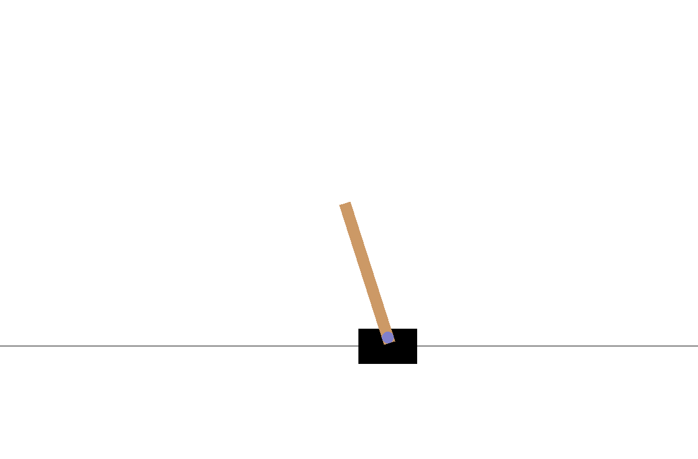
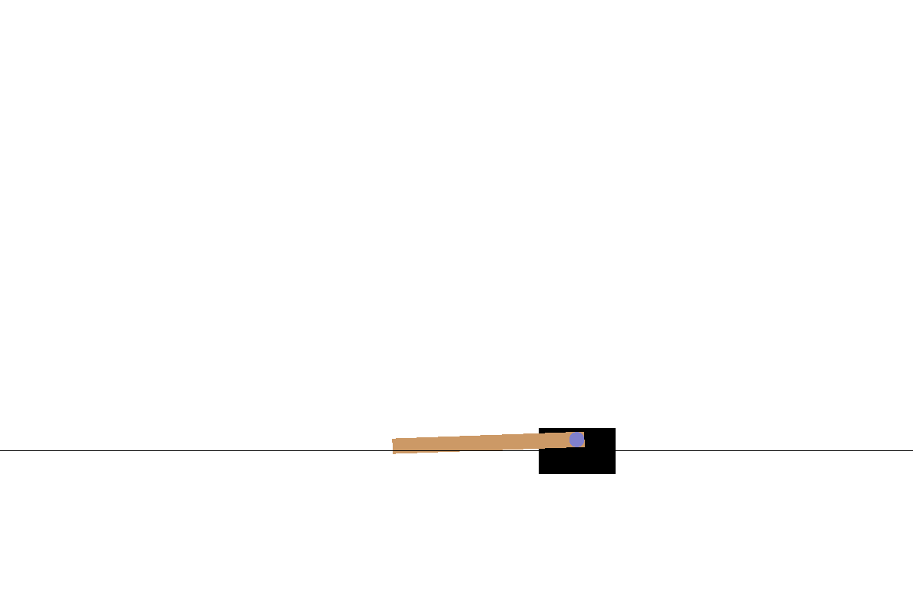
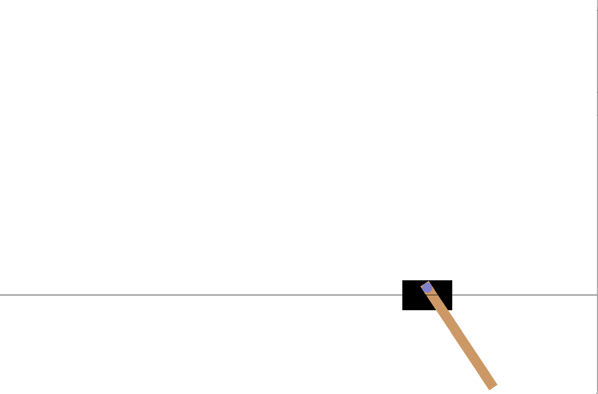
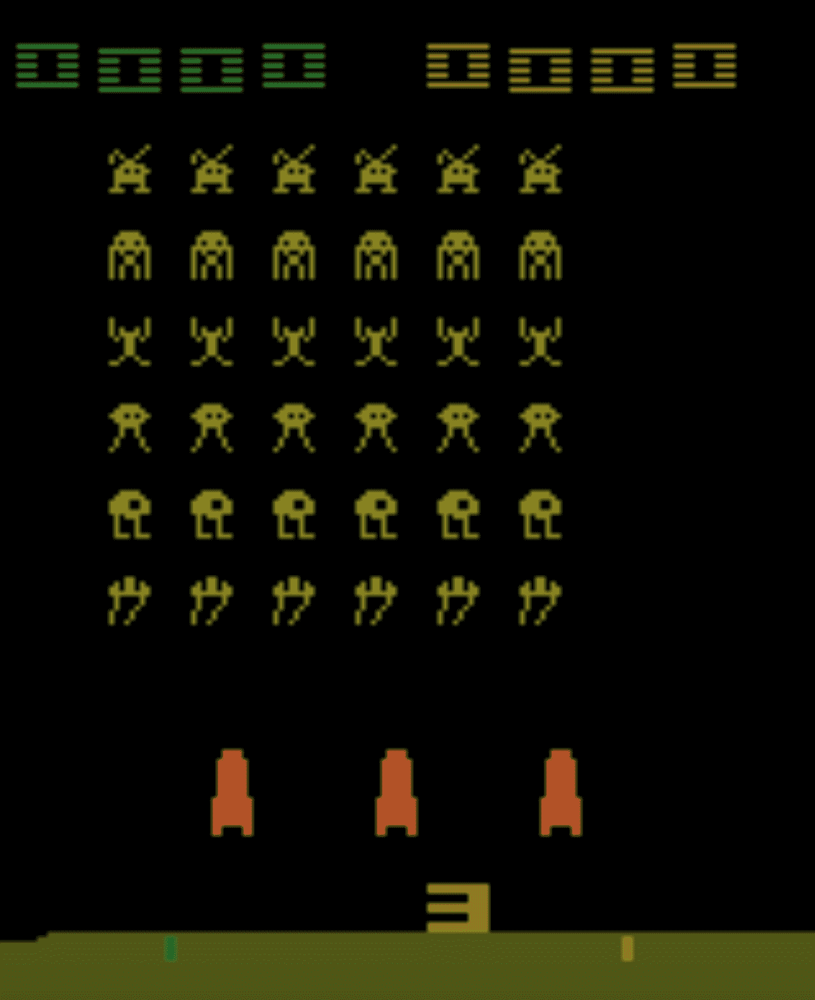
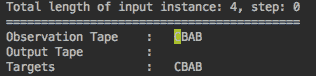
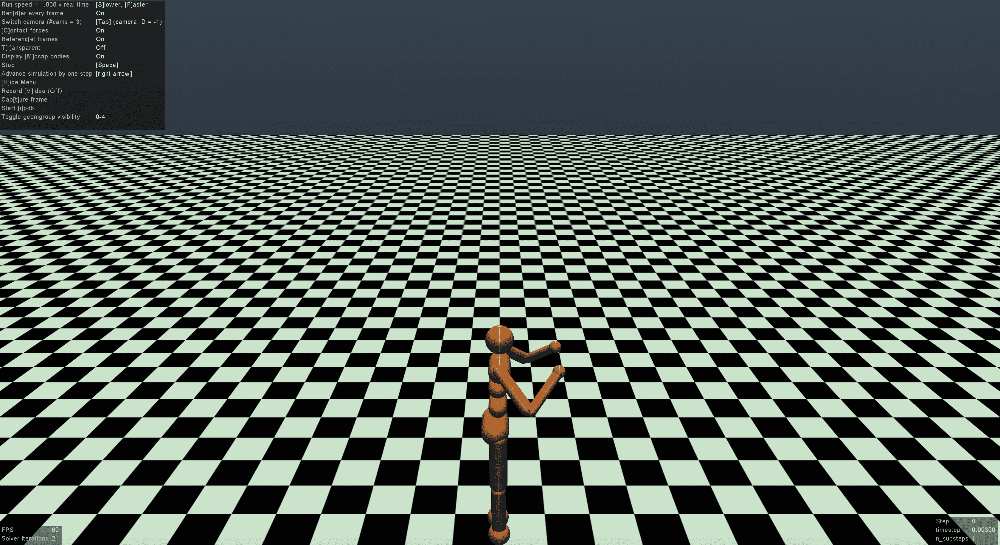
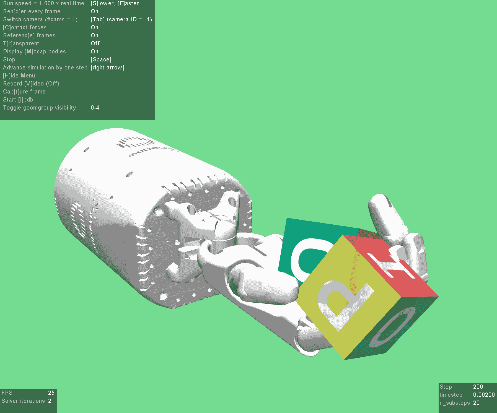
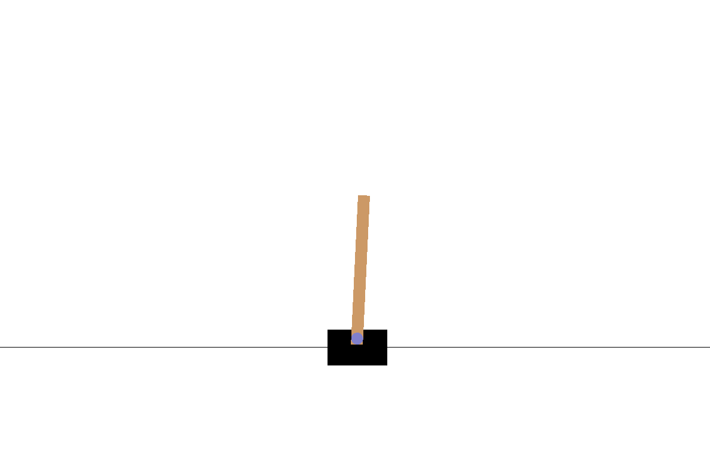

# 第二章：平衡 CartPole

在本章中，您将学习关于 CartPole 平衡问题的内容。CartPole 是一个倒立摆，杆子与重力平衡。传统上，这个问题通过控制理论和分析方程解决。然而，在本章中，我们将通过机器学习来解决这个问题。

本章将涵盖以下主题：

+   安装 OpenAI Gym

+   Gym 的不同环境

# OpenAI Gym

OpenAI 是一个致力于人工智能研究的非盈利组织。访问 [`openai.com`](https://openai.com) 了解更多关于 OpenAI 使命的信息。OpenAI 开发的技术对任何人都免费使用。

# Gym

Gym 提供了一个基准工具包，用于评估基于人工智能的任务。该接口易于使用，目标是实现可重复的研究。访问[`gym.openai.com`](https://gym.openai.com)了解更多关于 Gym 的信息。一个智能体可以在`gym`中学习，并掌握诸如玩游戏或走路等活动。环境是一个问题库。

Gym 提供的标准问题集如下：

+   CartPole

+   摆锤

+   Space Invaders

+   Lunar Lander

+   蚂蚁

+   Mountain Car

+   Acrobot

+   赛车

+   双足行走者

任何算法都可以在 Gym 中通过训练这些活动来运行。所有问题都具有相同的接口。因此，任何通用强化学习算法都可以通过该接口使用。

# 安装

Gym 的主要接口通过 Python 使用。一旦你在一个带有 `pip` 安装器的环境中拥有 Python3，就可以通过以下方式安装 Gym：

```py
sudo pip install gym 
```

高级用户如果想要修改源代码，可以通过以下命令从源代码编译：

```py
git clone https://github.com/openai/gym 
cd gym 
pip install -e .

```

可以通过源代码将一个新环境添加到 `gym` 中。有些环境需要更多的依赖项。对于 macOS，使用以下命令安装依赖项：

```py
brew install cmake boost boost-python sdl2 swig wget
```

对于 Ubuntu，使用以下命令：

```py
apt-get install -y python-numpy python-dev cmake zlib1g-dev libjpeg-dev xvfb libav-tools xorg-dev python-opengl libboost-all-dev libsdl2-dev swig
```

一旦依赖项准备好，按照以下方式安装完整的 `gym`：

```py
pip install 'gym[all]'
```

这将安装大多数所需的环境。

# 运行一个环境

任何 Gym 环境都可以通过简单的接口初始化并运行。让我们从导入 `gym` 库开始，如下所示：

1.  首先我们导入 `gym` 库：

```py
import gym 
```

1.  接下来，通过传递参数给 `gym.make` 创建一个环境。以下代码以 CartPole 为例：

```py
environment = gym.make('CartPole-v0') 
```

1.  接下来，重置环境：

```py
environment.reset() 
```

1.  然后，开始迭代并渲染环境，如下所示：

```py
for dummy in range(100):
    environment.render() 
    environment.step(environment.action_space.sample())

```

此外，在每一步都改变动作空间，以观察 CartPole 的移动。运行前面的程序应该会生成一个可视化界面。场景应以以下的可视化效果开始：



上面的图像称为 **CartPole**。CartPole 由一个可以水平移动的车厢和一个相对于车厢中心可以旋转的杆组成。

杆子被固定在小车上。经过一段时间，您会发现杆子开始向一侧倾斜，如下图所示：



在经过几次迭代后，杆子会摆回，如下图所示。所有的动作都受到物理定律的约束。步骤是随机进行的：



其他环境可以通过类似的方式显示，只需替换 Gym 环境的参数，如`MsPacman-v0`或`MountainCar-v0`。对于其他环境，可能需要其他许可证。接下来，我们将介绍其余的环境。

# Atari

要玩 Atari 游戏，可以调用任何环境。以下代码表示游戏《太空侵略者》：

```py
environment = gym.make('SpaceInvaders-v0')
```

执行前面的命令后，您将看到以下屏幕：



可以在这个环境中玩 Atari 游戏。

# 算法任务

有一些算法任务可以通过强化学习来学习。可以调用一个副本环境，如下所示：

```py
environment = gym.make('Copy-v0')
```

复制字符串的过程在下图中显示：



# MuJoCo

**MuJoCo** 代表**多关节动力学与接触**。它是一个用于机器人和多体动力学的仿真环境：

```py
environment = gym.make('Humanoid-v2')
```

以下是人形机器人的仿真可视化：



人形机器人仿真

在这个环境中可以模拟机器人和其他物体。

# 机器人技术

也可以创建一个机器人环境，如下所示：

```py
environment = gym.make('HandManipulateBlock-v0')
```

以下是机器人手部的可视化：



OpenAI Gym 可以用于多个环境。

# 马尔可夫模型

问题被设定为强化学习问题，采用试错法。环境通过`state_values` `state_values (?)`来描述，`state_values`会受到动作的影响。动作由一个算法确定，基于当前的`state_value`，以实现一个特定的`state_value`，这被称为**马尔可夫模型**。在理想情况下，过去的`state_values`确实会影响未来的`state_values`，但在这里，我们假设当前的`state_value`已经包含了所有以前的`state_values`。`state_values`有两种类型；一种是可观察的，另一种是不可观察的。模型也必须考虑不可观察的`state_values`。这被称为**隐马尔可夫模型**。

# CartPole

在每个小车和杆子的步骤中，可以观察到多个变量，如位置、速度、角度和角速度。小车的`state_values`可以向左右移动：

1.  `state_values`：四维连续值。

1.  `Actions`：两个离散值。

1.  维度或空间，可以称之为 `state_value` 空间和动作空间。我们首先导入所需的库，如下所示：

```py
import gym
import numpy as np
import random
import math
```

1.  接下来，创建用于玩 CartPole 的环境，如下所示：

```py
environment = gym.make('CartPole-v0')
```

1.  接下来，定义桶的数量和动作的数量，如下所示：

```py
no_buckets = (1, 1, 6, 3)
no_actions = environment.action_space.n
```

1.  接下来，定义 `state_value_bounds`，如下所示：

```py
state_value_bounds = list(zip(environment.observation_space.low, environment.observation_space.high))
state_value_bounds[1] = [-0.5, 0.5]
state_value_bounds[3] = [-math.radians(50), math.radians(50)]
```

1.  接下来，定义 `action_index`，如下所示：

```py
action_index = len(no_buckets)
```

1.  接下来，定义 `q_value_table`，如下所示：

```py
q_value_table = np.zeros(no_buckets + (no_actions,))
```

1.  接下来，定义最小探索率和最小学习率，如下所示：

```py
min_explore_rate = 0.01
min_learning_rate = 0.1
```

1.  接下来，定义最大回合数、最大时间步数、解决到达的连续次数、解决时间、折扣因子和连续次数作为常量：

```py
max_episodes = 1000
max_time_steps = 250
streak_to_end = 120
solved_time = 199
discount = 0.99
no_streaks = 0

```

1.  接下来，定义 `select` 动作来决定行动，如下所示：

```py
def select_action(state_value, explore_rate):
    if random.random() < explore_rate:
        action = environment.action_space.sample()
    else:
        action = np.argmax(q_value_table[state_value])
    return action
```

1.  接下来，选择探索状态，如下所示：

```py
def select_explore_rate(x):
    return max(min_explore_rate, min(1, 1.0 - math.log10((x+1)/25)))
```

1.  接下来，选择学习率，如下所示：

```py

def select_learning_rate(x):
    return max(min_learning_rate, min(0.5, 1.0 - math.log10((x+1)/25)))
```

1.  接下来，`bucketize` `state_value`，如下所示：

```py
def bucketize_state_value(state_value):
    bucket_indexes = []
    for i in range(len(state_value)):
        if state_value[i] <= state_value_bounds[i][0]:
           bucket_index = 0
        elif state_value[i] >= state_value_bounds[i][1]:
            bucket_index = no_buckets[i] - 1
        else:
            bound_width = state_value_bounds[i][1] - state_value_bounds[i][0]
            offset = (no_buckets[i]-1)*state_value_bounds[i][0]/bound_width
            scaling = (no_buckets[i]-1)/bound_width
            bucket_index = int(round(scaling*state_value[i] - offset))
        bucket_indexes.append(bucket_index)
    return tuple(bucket_indexes)

```

1.  接下来，训练各个回合，如下所示：

```py
for episode_no in range(max_episodes):
    explore_rate = select_explore_rate(episode_no)
    learning_rate = select_learning_rate(episode_no)

    observation = environment.reset()

    start_state_value = bucketize_state_value(observation)
    previous_state_value = start_state_value

    for time_step in range(max_time_steps):
        environment.render()
        selected_action = select_action(previous_state_value, explore_rate)
        observation, reward_gain, completed, _ = environment.step(selected_action)
        state_value = bucketize_state_value(observation)
        best_q_value = np.amax(q_value_table[state_value])
        q_value_table[previous_state_value + (selected_action,)] += learning_rate * (
                reward_gain + discount * (best_q_value) - q_value_table[previous_state_value + (selected_action,)])
```

1.  接下来，打印所有相关的训练过程指标，如下所示：

```py

        print('Episode number : %d' % episode_no)
        print('Time step : %d' % time_step)
        print('Selection action : %d' % selected_action)
        print('Current state : %s' % str(state_value))
        print('Reward obtained : %f' % reward_gain)
        print('Best Q value : %f' % best_q_value)
        print('Learning rate : %f' % learning_rate)
        print('Explore rate : %f' % explore_rate)
        print('Streak number : %d' % no_streaks)

        if completed:
            print('Episode %d finished after %f time steps' % (episode_no, time_step))
            if time_step >= solved_time:
                no_streaks += 1
            else:
                no_streaks = 0
            break

        previous_state_value = state_value

    if no_streaks > streak_to_end:
        break

```

1.  经过一段时间的训练后，CartPole 将能够自我保持平衡，如下图所示：



你已经学会了一个程序，它可以使 CartPole 稳定。

# 总结

在这一章中，你了解了 OpenAI Gym，它被用于强化学习项目。你看到了几个提供开箱即用的训练平台示例。然后，我们提出了 CartPole 问题，并通过试错法使 CartPole 保持平衡。

在下一章，你将学习如何使用 Gym 和强化学习方法来玩 Atari 游戏。
