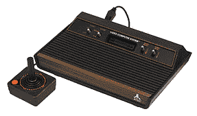
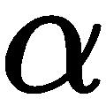

# 第三章：玩 Atari 游戏

一个机器如何自己学习玩视频游戏并击败人类玩家？解决这个问题是通向游戏领域**人工智能**（**AI**）的第一步。创建 AI 玩家所需的关键技术是**深度强化学习**。2015 年，谷歌的 DeepMind（该团队因开发击败围棋冠军李世石的机器 AlphaGo 而闻名）提出了深度 Q 学习算法，用于构建一个能够学习玩 Atari 2600 游戏，并在多个游戏中超越人类专家的 AI 玩家。这项工作对 AI 研究产生了重大影响，展示了构建通用 AI 系统的可能性。

在本章中，我们将介绍如何使用 gym 来玩 Atari 2600 游戏，然后解释为什么深度 Q 学习算法有效，并且如何使用 TensorFlow 实现它。目标是能够理解深度强化学习算法以及如何应用它们来解决实际任务。本章将为理解后续章节奠定坚实的基础，后续章节将介绍更复杂的方法。

本章将覆盖的主题如下：

+   Atari 游戏介绍

+   深度 Q 学习

+   DQN 实现

# Atari 游戏介绍

Atari, Inc. 是一家美国的视频游戏开发公司和家用计算机公司，由 Nolan Bushnell 和 Ted Dabney 于 1972 年创立。1976 年，Bushnell 开发了 Atari 视频计算机系统（或 Atari VCS，后来更名为 Atari 2600）。Atari VCS 是一款灵活的游戏主机，能够播放现有的 Atari 游戏，包括主机、两个摇杆、一对控制器和一张战斗游戏卡带。以下截图展示了 Atari 主机：



Atari 2600 拥有超过 500 款游戏，由 Atari、Sears 和一些第三方公司发布。一些著名的游戏包括《打砖块》（Breakout）、《吃豆人》（Pac-Man）、《陷阱》（Pitfall!）、《亚特兰蒂斯》（Atlantis）、《海底探险》（Seaquest）和《太空侵略者》（Space Invaders）。

由于 1983 年北美视频游戏崩溃的直接结果，Atari, Inc. 于 1984 年关闭，并将其资产拆分。Atari 的家用计算机和游戏主机部门于 1984 年 7 月被 Jack Tramiel 以 Atari Corporation 名义收购。

对于那些有兴趣玩 Atari 游戏的读者，这里有几个在线 Atari 2600 模拟器网站，您可以在这些网站上找到许多流行的 Atari 2600 游戏：

+   [`www.2600online.com/`](http://www.2600online.com/)

+   [`www.free80sarcade.com/all2600games.php`](http://www.free80sarcade.com/all2600games.php)

+   [`www.retrogames.cz/index.php`](http://www.retrogames.cz/index.php)

因为我们的目标是为这些游戏开发一个 AI 玩家，所以最好先玩这些游戏并了解它们的难点。最重要的是：放松并享受乐趣！

# 构建 Atari 模拟器

OpenAI gym 提供了一个具有 Python 接口的 Atari 2600 游戏环境。这些游戏由街机学习环境模拟，街机学习环境使用 Stella Atari 模拟器。有关更多细节，请阅读以下论文：

+   MG Bellemare, Y Naddaf, J Veness 和 M Bowling，*街机学习环境：通用代理的评估平台*，《人工智能研究杂志》（2012）

+   Stella：一个多平台的 Atari 2600 VCS 模拟器，[`stella.sourceforge.net/`](http://stella.sourceforge.net/)

# 快速入门

如果你没有完整安装 OpenAI `gym`，可以通过以下方式安装 Atari 环境的依赖项：

```py
pip install gym[atari]
```

这需要 `cmake` 工具。此命令将自动编译街机学习环境及其 Python 接口 `atari-py`。编译将在普通笔记本上花费几分钟时间，因此可以去喝杯咖啡。

安装完 Atari 环境后，可以尝试以下操作：

```py
import gym
atari = gym.make('Breakout-v0')
atari.reset()
atari.render()
```

如果运行成功，将会弹出一个小窗口，显示 `Breakout` 游戏的屏幕，如下所示的截图所示：


`Breakout` 的 rom 名称中的 v0 后缀的含义将在稍后解释。我们将使用 `Breakout` 来测试我们的 AI 游戏玩家训练算法。在 `Breakout` 中，几层砖块位于屏幕的顶部。一颗球在屏幕上移动，撞击屏幕的顶部和侧壁。当球击中砖块时，砖块会被销毁，球会反弹，并根据砖块的颜色为玩家提供一定的分数。当球触及屏幕底部时，玩家失去一次回合。为了避免这种情况，玩家需要移动挡板将球弹回。

Atari VCS 使用摇杆作为控制 Atari 2600 游戏的输入设备。摇杆和挡板能够提供的总输入数为 18。 在 `gym` Atari 环境中，这些动作被标记为从 0 到 17 的整数。每个动作的含义如下：

| 0 | 1 | 2 | 3 | 4 | 5 |
| --- | --- | --- | --- | --- | --- |
| 无操作 | 开火 | 上 | 右 | 左 | 下 |
| 6 | 7 | 8 | 9 | 10 | 11 |
| 上+右 | 上+左 | 下+右 | 下+左 | 上+开火 | 右+开火 |
| 12 | 13 | 14 | 15 | 16 | 17 |
| 左+开火 | 下+开火 | 上+右+开火 | 上+左+开火 | 下+右+开火 | 下+左+开火 |

可以使用以下代码获取游戏中有效动作的含义：

```py
actions = atari.env.get_action_meanings()
```

对于 `Breakout`，动作包括以下内容：

```py
[0, 1, 3, 4] or ['NOOP', 'FIRE', 'RIGHT', 'LEFT']
```

要获取动作的数量，也可以使用以下代码：

```py
num_actions = atari.env.action_space.n
```

在这里，`atari.env`中的成员变量`action_space`存储了有关游戏有效动作的所有信息。通常，我们只需要知道有效动作的总数。

我们现在知道如何访问 Atari 环境中的动作信息。但是，给定这些动作，如何控制游戏呢？要执行一个动作，可以调用 `step` 函数：

```py
observation, reward, done, info = atari.step(a)
```

输入参数`a`是你想要执行的动作，它是有效动作列表中的索引。例如，如果想执行`LEFT`动作，输入应该是`3`而不是`4`，或者如果不执行任何动作，输入应该是`0`。`step`函数返回以下四个值之一：

+   `Observation`：一个环境特定的对象，表示你对环境的观察。对于 Atari 来说，它是执行动作后屏幕帧的图像。

+   `Reward`：由动作获得的奖励数量。

+   `Done`：是否到了重新初始化环境的时间。在 Atari 游戏中，如果你失去了最后一条生命，`done`会为真，否则为假。

+   `Info`：有助于调试的诊断信息。不能在学习算法中使用这些信息，所以通常我们可以忽略它。

# Atari 模拟器的实现

我们现在准备使用 gym 构建一个简单的 Atari 模拟器。和其他电脑游戏一样，用于控制 Atari 游戏的键盘输入如下所示：

| *w* | *a* | *s* | *d* | *space* |
| --- | --- | --- | --- | --- |
| 上 | 左 | 下 | 右 | 发射 |

为了检测键盘输入，我们使用`pynput.keyboard`包，它允许我们控制和监控键盘（[`pythonhosted.org/pynput/`](http://pythonhosted.org/pynput/)）。如果没有安装`pynput`包，请运行以下命令：

```py
pip install pynput
```

`pynput.keyboard`提供了一个键盘监听器，用于捕获键盘事件。在创建键盘监听器之前，应该导入`Listener`类：

```py
import gym
import queue, threading, time
from pynput.keyboard import Key, Listener
```

除了`Listener`类，程序中还需要其他包，如`gym`和`threading`。

以下代码展示了如何使用`Listener`来捕获键盘输入，即按下了*W*、*A*、*S*、*D*或*space*键时的情况：

```py
def keyboard(queue):

    def on_press(key):
        if key == Key.esc:
            queue.put(-1)
        elif key == Key.space:
            queue.put(ord(' '))
        else:
            key = str(key).replace("'", '')
            if key in ['w', 'a', 's', 'd']:
                queue.put(ord(key))

    def on_release(key):
        if key == Key.esc:
            return False

    with Listener(on_press=on_press, on_release=on_release) as listener:
        listener.join()
```

实际上，键盘监听器是一个 Python 的`threading.Thread`对象，所有的回调都会从该线程中调用。在`keyboard`函数中，监听器注册了两个回调：`on_press`，当按下一个键时被调用，以及`on_release`，当一个键被释放时调用。该函数使用一个同步队列在不同线程之间共享数据。当*W*、*A*、*S*、*D*或*space*被按下时，其 ASCII 值会被发送到队列中，可以从另一个线程中访问。如果按下了*esc*键，一个终止信号`*-*`会被发送到队列中。然后，监听器线程会在*esc*键被释放时停止。

启动键盘监听器在 macOS X 上有一些限制；即以下条件之一应当为真：

+   进程必须以 root 权限运行

+   应用程序必须在辅助设备访问权限中列入白名单

详情请访问[`pythonhosted.org/pynput/keyboard.html`](https://pythonhosted.org/pynput/keyboard.html)。

# 使用 gym 的 Atari 模拟器

模拟器的另一部分是`gym` Atari 模拟器：

```py
def start_game(queue):

    atari = gym.make('Breakout-v0')
    key_to_act = atari.env.get_keys_to_action()
    key_to_act = {k[0]: a for k, a in key_to_act.items() if len(k) > 0}
    observation = atari.reset()

    import numpy
    from PIL import Image
    img = numpy.dot(observation, [0.2126, 0.7152, 0.0722])
    img = cv2_resize_image(img)
    img = Image.fromarray(img)
    img.save('save/{}.jpg'.format(0))

    while True:
        atari.render()
        action = 0 if queue.empty() else queue.get(block=False)
        if action == -1:
            break
        action = key_to_act.get(action, 0)
        observation, reward, done, _ = atari.step(action)
        if action != 0:
            print("Action {}, reward {}".format(action, reward))
        if done:
            print("Game finished")
            break
        time.sleep(0.05)
```

第一步是使用 `gym.make` 创建一个 `Atari` 环境。如果你有兴趣玩其他游戏，比如 Seaquest 或 Pitfall，只需将 Breakout-v0 改为 Seaquest-v0 或 `Pitfall-v0`。然后，调用 `get_keys_to_action` 获取 `key to action` 映射，该映射将 *w*、*a*、*s*、*d* 和 *space* 的 ASCII 值映射到内部动作。在 Atari 模拟器启动之前，必须调用 `reset` 函数来重置游戏参数和内存，并返回第一帧游戏画面。在主循环中，`render` 会在每一步渲染 Atari 游戏。输入动作从队列中拉取，且不会阻塞。如果动作是终止信号 -1，游戏将退出。否则，执行当前步骤的动作，通过运行 `atari.step`。

要启动模拟器，请运行以下代码：

```py
if __name__ == "__main__":
    queue = queue.Queue(maxsize=10)
    game = threading.Thread(target=start_game, args=(queue,))
    game.start()
    keyboard(queue)
```

按下射击按钮开始游戏并享受它！这个模拟器提供了一个用于在 `gym` Atari 环境中测试 AI 算法的基本框架。稍后，我们将用我们的 AI 玩家替换 `keyboard` 功能。

# 数据准备

仔细的读者可能会注意到每个游戏名称后都有一个后缀 v0，并产生以下问题：*v0 的意思是什么？* *是否可以将其替换为 v1 或 v2？* 实际上，这个后缀与从 Atari 环境提取的屏幕图像（观察）进行数据预处理的步骤有关。

每个游戏有三种模式，例如 Breakout、BreakoutDeterministic 和 BreakoutNoFrameskip，每种模式有两个版本，例如 Breakout-v0 和 Breakout-v4。三种模式的主要区别在于 Atari 环境中 frameskip 参数的值。这个参数表示一个动作重复的帧数（步骤数）。这就是所谓的 **帧跳过** 技术，它让我们能够在不显著增加运行时间的情况下玩更多游戏。

对于 Breakout，frameskip 是从 2 到 5 随机抽样的。以下截图显示了当提交 `LEFT` 动作时，`step` 函数返回的帧画面：


对于 BreakoutDeterministic，Space Invaders 游戏的 frameskip 被设置为 3，其他游戏的 frameskip 为 4。在相同的 `LEFT` 动作下，`step` 函数返回如下：


对于 BreakoutNoFrameskip，所有游戏的 frameskip 始终为 1，意味着没有帧跳过。类似地，`LEFT` 动作在每一步都会执行：


这些截图展示了尽管步进函数在相同的动作`LEFT`下被调用了四次，最终的球板位置却大不相同。由于 BreakoutDeterministic 的帧跳跃为 4，所以它的球板离左墙最近。而 BreakoutNoFrameskip 的帧跳跃为 1，因此它的球板离左墙最远。对于 Breakout，球板处于中间位置，因为在每一步中，帧跳跃是从[2, 5]中采样的。

从这个简单的实验中，我们可以看到帧跳跃参数的效果。它的值通常设置为 4，以便进行快速学习。回想一下，每个模式都有两个版本，v0 和 v4。它们的主要区别在于`repeat_action_probability`参数。这个参数表示尽管提交了另一个动作，仍然有概率采取**无操作**（**NOOP**）动作。对于 v0，它的值设置为 0.25，v4 的值为 0.0。由于我们希望得到一个确定性的 Atari 环境，本章选择了 v4 版本。

如果你玩过一些 Atari 游戏，你可能注意到游戏画面的顶部区域通常包含记分板，显示你当前的得分和剩余生命数。这些信息与游戏玩法无关，因此顶部区域可以被裁剪掉。另外，通过步进函数返回的帧图像是 RGB 图像。实际上，在 Atari 环境中，彩色图像并不提供比灰度图像更多的信息；换句话说，使用灰度屏幕也可以照常玩 Atari 游戏。因此，有必要通过裁剪帧图像并将其转换为灰度图像来保留有用的信息。

将 RGB 图像转换为灰度图像非常简单。灰度图像中每个像素的值表示光强度，可以通过以下公式计算：


这里，R、G 和 B 分别是 RGB 图像的红色、绿色和蓝色通道。给定一个形状为(height, width, channel)的 RGB 图像，可以使用以下 Python 代码将其转换为灰度图像：

```py
def rgb_to_gray(self, im):
    return numpy.dot(im, [0.2126, 0.7152, 0.0722])
```

以下图片给出了一个示例：


对于裁剪帧图像，我们使用`opencv-python`包，或者称为`cv2`，它是一个 Python 包装器，封装了原始的 C++ OpenCV 实现。欲了解更多信息，请访问`opencv-python`的官方网站：[`opencv-python-tutroals.readthedocs.io/en/latest/index.html`](http://opencv-python-tutroals.readthedocs.io/en/latest/index.html)。`opencv-python`包提供了基本的图像转换操作，如图像缩放、平移和旋转。在本章中，我们只需要使用图像缩放函数 resize，该函数接受输入图像、图像大小和插值方法作为输入参数，并返回缩放后的图像。

以下代码展示了图像裁剪操作，涉及两个步骤：

1.  重塑输入图像，使得最终图像的宽度等于通过`resized_shape`参数指定的调整后的宽度`84`。

1.  使用`numpy`切片裁剪重塑图像的顶部区域：

```py
def cv2_resize_image(image, resized_shape=(84, 84), 
                     method='crop', crop_offset=8):

    height, width = image.shape
    resized_height, resized_width = resized_shape

    if method == 'crop':
        h = int(round(float(height) * resized_width / width))
        resized = cv2.resize(image, 
                             (resized_width, h), 
                             interpolation=cv2.INTER_LINEAR)
        crop_y_cutoff = h - crop_offset - resized_height
        cropped = resized[crop_y_cutoff:crop_y_cutoff+resized_height, :]
        return numpy.asarray(cropped, dtype=numpy.uint8)
    elif method == 'scale':
        return numpy.asarray(cv2.resize(image, 
                                        (resized_width, resized_height), 
                                        interpolation=cv2.INTER_LINEAR), 
                                        dtype=numpy.uint8)
    else:
        raise ValueError('Unrecognized image resize method.')
```

例如，给定一张灰度输入图像，`cv2_resize_image`函数会返回一张裁剪后的图像，大小为 ，如下图所示：


到目前为止，我们已经完成了数据准备。数据现在已经可以用来训练我们的 AI 玩家了。

# 深度 Q 学习

现在是有趣的部分——我们 AI Atari 玩家的大脑设计。核心算法基于深度强化学习（Deep RL）。为了更好地理解它，需要一些基本的数学公式。深度强化学习是深度学习和传统强化学习的完美结合。如果不理解强化学习的基本概念，很难在实际应用中正确使用深度强化学习。例如，可能会有人在没有正确定义状态空间、奖励和转移的情况下尝试使用深度强化学习。

好了，别害怕这些公式的难度。我们只需要高中水平的数学知识，不会深入探讨为什么传统强化学习算法有效的数学证明。本章的目标是学习基本的 Q 学习算法，了解如何将其扩展为**深度 Q 学习算法**（**DQN**），并理解这些算法背后的直觉。此外，你还将学习 DQN 的优缺点，什么是探索与开发，为什么需要重放记忆，为什么需要目标网络，以及如何设计一个卷积神经网络来表示状态特征。

看起来很有趣，对吧？我们希望本章不仅帮助你理解如何应用深度强化学习来解决实际问题，也为深度强化学习研究打开了一扇门。对于已经熟悉卷积神经网络、马尔可夫决策过程和 Q 学习的读者，可以跳过第一部分，直接进入 DQN 的实现。

# 强化学习的基本元素

首先，让我们回顾一下在第一章中讨论的一些强化学习的基本元素：

+   **状态**：状态空间定义了环境的所有可能状态。在 Atari 游戏中，状态是玩家在某一时刻观察到的屏幕图像或几张连续的屏幕图像，表示当时的游戏状态。

+   **奖励函数**：奖励函数定义了强化学习问题的目标。它将环境的状态或状态-动作对映射到一个实数，表示该状态的可取性。在 Atari 游戏中，奖励是玩家在采取某个动作后获得的分数。

+   **策略函数**：策略函数定义了玩家在特定时间的行为，它将环境的状态映射到在这些状态下应该采取的动作。

+   **价值函数**：价值函数表示在长期内哪个状态或状态-动作对是好的。一个状态的价值是玩家从该状态开始，未来可以预期积累的奖励的总和（或折扣后的总和）。

# 演示基本的 Q 学习算法

为了演示基本的 Q 学习算法，我们来看一个简单的问题。假设我们的智能体（玩家）生活在一个网格世界中。一天，她被困在一个奇怪的迷宫中，如下图所示：


迷宫包含六个房间。我们的智能体出现在房间 1，但她对迷宫一无所知，也就是说，她不知道房间 6 有能够将她送回家的“心爱之物”，或者房间 4 有一个会击打她的闪电。因此，她必须小心地探索迷宫，尽快逃脱。那么，我们如何让我们可爱的智能体通过经验学习呢？

幸运的是，她的好朋友 Q 学习可以帮助她生存下来。这个问题可以表示为一个状态图，其中每个房间作为一个状态，智能体从一个房间到另一个房间的移动视为一个动作。状态图如下所示：


在这里，动作用箭头表示，箭头上标记的数字是该状态-动作对的奖励。例如，当我们的智能体从房间 5 移动到房间 6 时，由于达到了目标，她会获得 100 分。当她从房间 3 移动到房间 4 时，她会得到一个负奖励，因为闪电击中了她。这个状态图也可以用矩阵表示：

| **状态\动作** | **1** | **2** | **3** | **4** | **5** | **6** |
| --- | --- | --- | --- | --- | --- | --- |
| 1 | - | 0 | - | - | - | - |
| 2 | 0 | - | 0 | - | 0 | - |
| 3 | - | 0 | - | -50 | - | - |
| 4 | - | - | 0 | - | - | - |
| 5 | - | 0 | - | - | - | 100 |
| 6 | - | - | - | - | - | - |

矩阵中的虚线表示在该状态下该动作不可用。例如，我们的智能体不能直接从房间 1 移动到房间 6，因为两者之间没有连接的门。

让  是一个状态， 是一个动作， 是奖励函数， 是价值函数。回忆一下， 是状态-动作对  在长期内的期望回报，这意味着我们的智能体能够根据  来决定进入哪个房间。Q 学习算法非常简单，它通过以下更新规则来估计每个状态-动作对的 ：


在这里， 是当前状态， 是采取行动后进入的下一个状态， 是在  时的动作， 是在  时可用的动作集， 是折扣因子， 是学习率。折扣因子  的值位于 [0,1] 范围内。折扣因子小于 1 意味着我们的智能体更偏好当前的奖励，而非过去的奖励。

一开始，我们的智能体对价值函数一无所知，因此  被初始化为所有状态-动作对的 0。她将从一个状态探索到另一个状态，直到达到目标。我们将每一次探索称为一个回合，它由从初始状态（例如，房间 1）到最终状态（例如，房间 6）组成。Q 学习算法如下所示：

```py
Initialize  to zero and set parameters ,;
Repeat for each episode:
   Randomly select an initial state ;
   While the goal state hasn't been reached:
       Select action  among all the possible actions in state  (e.g., using greedy);
       Take action  and observe reward , next state ;
       Update ;
       Set the current state ;
   End while
```

小心的读者可能会问一个问题：如何选择在状态下的行动 ，例如，行动 是从所有可能的行动中随机选择，还是根据当前估算的价值函数 派生的策略来选择？什么是贪心策略？这些问题涉及到两个重要的概念，即探索和利用。探索意味着尝试新事物以收集更多的环境信息，而利用则是根据你已有的信息做出最佳决策。例如，尝试一家新餐厅是探索，而去你最喜欢的餐厅则是利用。在我们的迷宫问题中，探索是我们的代理尝试进入一个她之前没有去过的新房间，而利用则是她根据从环境中收集到的信息选择她最喜欢的房间。

探索和利用在强化学习中都是必要的。如果没有探索，我们的代理就无法获得关于环境的新知识，因此她将一遍又一遍地做出错误决策。如果没有利用，她从探索中获得的信息就会变得毫无意义，因为她无法从中学习以做出更好的决策。因此，探索和利用之间的平衡或权衡是必不可少的。贪心策略是实现这种权衡的最简单方式：

| 以概率 | 从所有可能的行动中随机选择一个行动 |
| --- | --- |
| 以概率 | 基于选择最佳行动，即选择使得 在状态 下所有可能的行动中最大 |

为了进一步理解 Q 学习的工作原理，我们通过几个步骤来手动演示。为清晰起见，我们设置学习率 和折扣因子 。以下代码展示了 Q 学习在 Python 中的实现：

```py
import random, numpy

def Q_learning_demo():

    alpha = 1.0
    gamma = 0.8
    epsilon = 0.2
    num_episodes = 100

    R = numpy.array([
        [-1, 0, -1, -1, -1, -1],
        [ 0, -1, 0, -1, 0, -1],
        [-1, 0, -1, -50, -1, -1],
        [-1, -1, 0, -1, -1, -1],
        [-1, 0, -1, -1, -1, 100],
        [-1, -1, -1, -1, -1, -1]
        ])
    # Initialize Q
    Q = numpy.zeros((6, 6))
    # Run for each episode
    for _ in range(num_episodes):
        # Randomly choose an initial state
        s = numpy.random.choice(5)
        while s != 5:
            # Get all the possible actions
            actions = [a for a in range(6) if R[s][a] != -1]
            # Epsilon-greedy
            if numpy.random.binomial(1, epsilon) == 1:
                a = random.choice(actions)
            else:
                a = actions[numpy.argmax(Q[s][actions])]
            next_state = a
            # Update Q(s,a)
            Q[s][a] += alpha * (R[s][a] + gamma * numpy.max(Q[next_state]) - Q[s][a])
            # Go to the next state
            s = next_state
    return Q
```

经过 100 轮训练后，价值函数 收敛到以下结果（对于那些对为什么该算法会收敛的读者，请参考*《强化学习：导论》*，作者为 Andrew Barto 和 Richard S. Sutton）：

| **状态\行动** | **1** | **2** | **3** | **4** | **5** | **6** |
| --- | --- | --- | --- | --- | --- | --- |
| 1 | - | 64 | - | - | - | - |
| 2 | 51.2 | - | 51.2 | - | 80 | - |
| 3 | - | 64 | - | -9.04 | - | - |
| 4 | - | - | 51.2 | - | - | - |
| 5 | - | 64 | - | - | - | 100 |
| 6 | - | - | - | - | - | - |

因此，得到的状态图变为：


这表明从其他所有状态到目标状态的最佳路径如下：


基于这些知识，我们的智能体能够返回家中，无论她处于哪个房间。更重要的是，她变得更加聪明和快乐，实现了我们训练智能 AI 代理或玩家的目标。

这个最简单的 Q 学习算法只能处理离散的状态和动作。对于连续状态，它无法处理，因为由于存在无限的状态，收敛性不能得到保证。我们如何在像 Atari 游戏这样的无限状态空间中应用 Q 学习？答案是用神经网络代替表格来近似动作-价值函数！[](img/95e1fcb0-c839-457f-b9cd-f05c1bd9b255.png)。这就是谷歌 DeepMind 论文《*Playing Atari with deep reinforcement learning*》背后的直觉。

为了将基本的 Q 学习算法扩展到深度 Q 学习算法，需要回答两个关键问题：

1.  可以使用什么样的神经网络来从 Atari 环境中的观察数据（如屏幕图像）中提取高级特征？

1.  如何在每个训练步骤中更新动作-价值函数，？

对于第一个问题，有几种方法可以近似动作-价值函数，。一种方法是将状态和动作都作为神经网络的输入，网络输出它们的 Q 值标量估计，如下图所示：


这种方法的主要缺点是需要额外的前向传播来计算！[](img/078a4917-00a8-4cbe-b266-891afc82f98a.png)，因为动作被作为输入之一传递到网络中，这会导致计算成本与所有可能动作的数量成线性关系。另一种方法是只将状态作为神经网络的输入，而每个可能的动作都有一个独立的输出：


这种方法的主要优点是能够通过网络的单次前向传播计算出给定状态下所有可能动作的 Q 值，而且通过选择相应的输出头可以轻松获取某个动作的 Q 值。

在深度 Q 网络中，应用了第二种架构。回顾一下，数据预处理步骤中的输出是一个  灰度帧图像。然而，当前的屏幕图像不足以进行 Atari 游戏，因为它不包含游戏状态的动态信息。以 Breakout 为例；如果我们只看到一帧，我们只能知道球和球拍的位置，但无法得知球的方向或速度。实际上，方向和速度对于决定如何移动球拍至关重要。如果没有它们，游戏就无法进行。因此，输入网络的不仅是单独的一帧图像，而是历史中的最后四帧图像被堆叠在一起，形成网络的输入。这四帧组成一个  图像。除了输入层，Q 网络包含三层卷积层和一层全连接层，如下所示：


第一层卷积层有 64 个  卷积核，步长为 4，之后接一个**整流线性单元**（**RELU**）。第二层卷积层有 64 个  卷积核，步长为 2，之后接 RELU。第三层卷积层有 64 个  卷积核，步长为 2，之后接 RELU。全连接的隐藏层有 512 个隐藏单元，再次接 RELU。输出层也是一个全连接层，每个动作对应一个输出。

熟悉卷积神经网络的读者可能会问，为什么第一层卷积层使用了一个  卷积核，而不是广泛应用于计算机视觉中的  卷积核或  卷积核。使用大卷积核的主要原因是，Atari 游戏通常包含非常小的物体，如球、子弹或弹丸。使用较大的卷积核的卷积层能够放大这些小物体，有助于学习状态的特征表示。对于第二层和第三层卷积层，较小的卷积核足以捕捉到有用的特征。

到目前为止，我们已经讨论了 Q 网络的架构。那么，我们如何在具有无限状态空间的 Atari 环境中训练这个 Q 网络呢？是否可以基于基本的 Q 学习算法来训练它？幸运的是，答案是肯定的。回顾一下，基本 Q 学习中  的更新规则如下：


当学习率为  时，该更新规则变为如下形式：


这就是所谓的**贝尔曼方程**。实际上，贝尔曼方程是许多强化学习算法的核心。使用贝尔曼方程作为迭代更新的算法称为值迭代算法。在本书中，我们不会详细讨论值迭代或策略迭代。如果你对它们感兴趣，可以参考 Andrew Barto 和 Richard S. Sutton 的《强化学习：导论》。

刚才显示的方程仅适用于确定性环境，其中给定当前状态 和动作 ，下一个状态 是固定的。在非确定性环境中，贝尔曼方程应该如下：


这里，右侧是关于下一个状态 的期望值（例如，的分布由 Atari 模拟器确定）。对于无限状态空间，通常使用函数逼近器（如 Q 网络）来估计动作价值函数 。然后，Q 网络可以通过最小化以下损失函数，在第*i*次迭代中进行训练，而不是迭代更新 ：


这里，*Q(s,a;)*表示由 参数化的 Q 网络，是第*i*次迭代的目标，是序列和动作的概率分布。在优化损失函数 时，来自前一次迭代*i-1*的参数是固定的，损失函数是关于 的。在实际应用中，无法精确计算 中的期望值。因此，我们不会直接优化 ，而是最小化 的经验损失，它通过从概率分布 和 Atari 模拟器中获得的样本 来替代期望值。与其他深度学习算法一样，经验损失函数可以通过随机梯度下降法进行优化。

这个算法不需要构建仿真器的估计，例如，它不需要知道 Atari 仿真器的内部游戏机制，因为它仅使用来自仿真器的样本来解决强化学习问题。这个特性称为**无模型**，即它可以将底层模型视为黑盒。这个算法的另一个特性是离策略。它学习贪婪策略，同时遵循平衡探索与开发的状态空间概率分布。如前所述，可以作为一种贪婪策略进行选择。

深度 Q 学习算法的推导对于不熟悉强化学习或马尔科夫决策过程的读者来说可能有点困难。为了使其更容易理解，让我们来看一下下面的图示：


我们 AI 玩家的大脑是 Q 网络控制器。在每个时间步 t，她观察屏幕图像（回想一下，st 是一个堆叠了最后四帧的图像）。然后，她的大脑分析这个观察结果，并做出一个动作，。Atari 仿真器接收到这个动作，并返回下一个屏幕图像，以及奖励。四元组被存储在内存中，并作为样本用于通过随机梯度下降最小化经验损失函数来训练 Q 网络。

我们如何从存储在内存中的四元组中抽取样本？一种方法是，这些样本，，是通过我们的 AI 玩家与环境的互动得出的。例如，样本用于训练 Q 网络。这个方法的主要缺点是，一批中的样本具有强烈的相关性。强相关性破坏了构建经验损失函数时样本独立性的假设，导致训练过程不稳定，表现不佳：


深度 Q 学习算法应用了另一种方法，利用了一种叫做经验回放的技术。AI 玩家在每个时间步骤  的经验被存储在回放记忆中，从中随机抽取一批样本以训练 Q 网络。从数学上讲，我们无法保证抽取样本之间的独立性。但在实际操作中，这种方法能够稳定训练过程并产生合理的结果：


到目前为止，我们已经讨论了深度 Q 学习算法中的所有组件。完整的算法如下所示：

```py
Initialize replay memory  to capacity ;
Initialize the Q-network  with random weights ;
Repeat for each episode:
    Set time step ;
    Receive an initial screen image  and do preprocessing ;
    While the terminal state hasn't been reached:
        Select an action at via greedy, i.e., select a random action with probability , otherwise select ;
        Execute action at in the emulator and observe reward  and image ;
        Set  and store transition  into replay memory ;
        Randomly sample a batch of transitions  from ;
        Set  if  is a terminal state or  if  is a non-terminal state;
        Perform a gradient descent step on ;
    End while
```

该算法在一些 Atari 游戏中表现良好，例如《打砖块》、《海底探险》、《乒乓》和《Qbert》，但仍然无法达到人类水平的控制。一个缺点是计算目标  时使用了当前的动作值函数估计 ，这使得训练步骤变得不稳定，即一个增加  的更新通常也会增加所有的 ，因此也增加了目标 ，这可能导致策略的振荡或发散。

为了解决这个问题，谷歌 DeepMind 在他们的论文《*通过深度强化学习实现人类水平的控制*》中引入了目标网络，该论文发表于《自然》杂志。目标网络背后的理念相当简单：使用一个独立的网络来生成 Q 学习更新中的目标 。更准确地说，对于每个  Q 学习更新，网络 Q 被克隆以获得目标网络 Q，并用于生成接下来的 Q 更新中的目标 。因此，深度 Q 学习算法变为如下：

```py
Initialize replay memory  to capacity ;
Initialize the Q-network  with random weights ;
Initialize the target network  with weights ;
Repeat for each episode:

```

```py
Set time step ;
    Receive an initial screen image  and do preprocessing ;
    While the terminal state hasn't been reached:
        Select an action at via greedy, i.e., select a random action with probability , otherwise select ;
        Execute action at in the emulator and observe reward  and image ;
        Set  and store transition  into replay memory ;
        Randomly sample a batch of transitions  from ;
        Set  if  is a terminal state or  if  is a non-terminal state;
        Perform a gradient descent step on ;
```

```py

        Set  for every  steps;
 End while
```

使用目标网络，通过深度 Q 学习算法训练的 AI 玩家能够超越大多数先前强化学习算法的表现，并在 49 款 Atari 2600 游戏中实现了人类水平的表现，例如《星际枪手》、《亚特兰蒂斯》、《攻击》和《太空侵略者》。

深度 Q 学习算法在通用人工智能方面迈出了重要一步。尽管它在 Atari 2600 游戏中表现良好，但仍然存在许多未解决的问题：

+   **收敛速度慢**：它需要很长时间（在一块 GPU 上需要 7 天）才能达到人类水平的表现。

+   **稀疏奖励失败**：它在《蒙特祖玛的复仇》游戏中无法发挥作用，因为该游戏需要长期规划。

+   **需要大量数据**：这是大多数强化学习算法常见的问题。

为了解决这些问题，最近提出了深度 Q 学习算法的不同变种，例如双重 Q 学习、优先经验回放、引导式 DQN 和对抗网络架构。我们在本书中不讨论这些算法。对于想要深入了解 DQN 的读者，请参考相关论文。

# DQN 的实现

本章将展示如何使用 Python 和 TensorFlow 实现深度 Q 学习算法的所有组件，例如 Q 网络、回放记忆、训练器和 Q 学习优化器。

我们将实现`QNetwork`类，这是我们在上一章中讨论的 Q 网络，其定义如下：

```py
class QNetwork:

    def __init__(self, input_shape=(84, 84, 4), n_outputs=4, 
                 network_type='cnn', scope='q_network'):

        self.width = input_shape[0]
        self.height = input_shape[1]
        self.channel = input_shape[2]
        self.n_outputs = n_outputs
        self.network_type = network_type
        self.scope = scope

        # Frame images
        self.x = tf.placeholder(dtype=tf.float32, 
                                shape=(None, self.channel, 
                                       self.width, self.height))
        # Estimates of Q-value
        self.y = tf.placeholder(dtype=tf.float32, shape=(None,))
        # Selected actions
        self.a = tf.placeholder(dtype=tf.int32, shape=(None,))

        with tf.variable_scope(scope):
            self.build()
            self.build_loss()
```

构造函数需要四个参数，`input_shape`、`n_outputs`、`network_type`和`scope`。`input_shape`是输入图像的大小。经过数据预处理后，输入是一个图像，因此默认参数是。`n_outputs`是所有可能动作的数量，例如在 Breakout 游戏中，`n_outputs`为四。`network_type`表示我们要使用的 Q 网络类型。我们的实现包含三种不同的网络，其中两种是由 Google DeepMind 提出的卷积神经网络，另一个是用于测试的前馈神经网络。`scope`是 Q 网络对象的名称，可以设置为`q_network`或`target_network`。

在构造函数中，创建了三个输入张量。`x`变量表示输入状态（一批图像）。`y`和`a`变量分别表示动作价值函数的估计值和与输入状态对应的选定动作，用于训练 Q 网络。创建输入张量后，调用`build`和`build_loss`两个函数来构建 Q 网络。

使用 TensorFlow 构建 Q 网络非常简单，如下所示：

```py
    def build(self):

        self.net = {}
        self.net['input'] = tf.transpose(self.x, perm=(0, 2, 3, 1))

        init_b = tf.constant_initializer(0.01)
        if self.network_type == 'cnn':
            self.net['conv1'] = conv2d(self.net['input'], 32, 
                                       kernel=(8, 8), stride=(4, 4), 
                                       init_b=init_b, name='conv1')
            self.net['conv2'] = conv2d(self.net['input'], 64, 
                                       kernel=(4, 4), stride=(2, 2), 
                                       init_b=init_b, name='conv2')
            self.net['conv3'] = conv2d(self.net['input'], 64, 
                                       kernel=(3, 3), stride=(1, 1), 
                                       init_b=init_b, name='conv3')
            self.net['feature'] = dense(self.net['conv2'], 512, 
                                        init_b=init_b, name='fc1')
        elif self.network_type == 'cnn_nips':
            self.net['conv1'] = conv2d(self.net['input'], 16, 
                                       kernel=(8, 8), stride=(4, 4), 
                                       init_b=init_b, name='conv1')
            self.net['conv2'] = conv2d(self.net['conv1'], 32, 
                                       kernel=(4, 4), stride=(2, 2), 
                                       init_b=init_b, name='conv2')
            self.net['feature'] = dense(self.net['conv2'], 256, 
                                        init_b=init_b, name='fc1')
        elif self.network_type == 'mlp':
            self.net['fc1'] = dense(self.net['input'], 50, 
                                    init_b=init_b), name='fc1')
            self.net['feature'] = dense(self.net['fc1'], 50, 
                                        init_b=init_b, name='fc2')
        else:
            raise NotImplementedError('Unknown network type')

        self.net['values'] = dense(self.net['feature'], 
                                   self.n_outputs, activation=None,
                                   init_b=init_b, name='values')

        self.net['q_value'] = tf.reduce_max(self.net['values'], 
                                            axis=1, name='q_value')
        self.net['q_action'] = tf.argmax(self.net['values'], 
                                         axis=1, name='q_action', 
                                         output_type=tf.int32)

        self.vars = tf.get_collection(tf.GraphKeys.TRAINABLE_VARIABLES, 
                                      tf.get_variable_scope().name)
```

如前一章所讨论的，Atari 环境的 Q 网络包含三个卷积层和一个隐藏层，当`network_type`为`cnn`时可以构建该网络。`cnn_nips`类型是为 Atari 游戏简化的 Q 网络，只包含两个卷积层和一个隐藏层，且具有较少的滤波器和隐藏单元。`mlp`类型是一个具有两个隐藏层的前馈神经网络，用于调试。`vars`变量是 Q 网络中所有可训练变量的列表。

回顾一下，损失函数为，可以按如下方式实现：

```py
    def build_loss(self):

        indices = tf.transpose(tf.stack([tf.range(tf.shape(self.a)[0]), 
                                         self.a], axis=0))
        value = tf.gather_nd(self.net['values'], indices)

        self.loss = 0.5 * tf.reduce_mean(tf.square((value - self.y)))
        self.gradient = tf.gradients(self.loss, self.vars)

        tf.summary.scalar("loss", self.loss, collections=['q_network'])
        self.summary_op = tf.summary.merge_all('q_network')
```

`tf.gather_nd`函数用于获取给定动作批次的动作值。变量 loss 表示损失函数，gradient 是损失函数相对于可训练变量的梯度。`summary_op`用于 TensorBoard 可视化。

回放记忆的实现不涉及 TensorFlow：

```py
class ReplayMemory:

    def __init__(self, history_len=4, capacity=1000000, 
                 batch_size=32, input_scale=255.0):

        self.capacity = capacity
        self.history_length = history_len
        self.batch_size = batch_size
        self.input_scale = input_scale

        self.frames = deque([])
        self.others = deque([])
```

`ReplayMemory`类接受四个输入参数，即`history_len`、`capacity`、`batch_size`和`input_scale`。`history_len`是堆叠在一起的帧数。通常，`history_len`在 Atari 游戏中设置为 4，形成一个输入图像。`capacity`是回放记忆的容量，即可以存储的最大帧数。`batch_size`是训练时的一批样本大小。`input_scale`是输入图像的归一化因子，例如，对于 RGB 图像，它设置为 255。变量 frames 记录所有帧图像，变量 others 记录对应的动作、奖励和终止信号。

`ReplayMemory`提供了一个将记录（帧图像、动作、奖励、终止信号）添加到内存中的功能：

```py
    def add(self, frame, action, r, termination):

        if len(self.frames) == self.capacity:
            self.frames.popleft()
            self.others.popleft()
        self.frames.append(frame)
        self.others.append((action, r, termination))

    def add_nullops(self, init_frame):
        for _ in range(self.history_length):
            self.add(init_frame, 0, 0, 0)
```

它还提供了一个功能，通过连接历史中的最后四帧图像来构建一个输入图像：

```py
    def phi(self, new_frame):
        assert len(self.frames) > self.history_length
        images = [new_frame] + [self.frames[-1-i] for i in range(self.history_length-1)]
        return numpy.concatenate(images, axis=0)
```

以下函数从回放记忆中随机抽取一个过渡（状态、动作、奖励、下一个状态、终止信号）：

```py
    def sample(self):

        while True:

            index = random.randint(a=self.history_length-1, 
                                   b=len(self.frames)-2)
            infos = [self.others[index-i] for i in range(self.history_length)]
            # Check if termination=1 before "index"
            flag = False
            for i in range(1, self.history_length):
                if infos[i][2] == 1:
                    flag = True
                    break
            if flag:
                continue

            state = self._phi(index)
            new_state = self._phi(index+1)
            action, r, termination = self.others[index]
            state = numpy.asarray(state / self.input_scale, 
                                  dtype=numpy.float32)
            new_state = numpy.asarray(new_state / self.input_scale, 
                                      dtype=numpy.float32)

            return (state, action, r, new_state, termination)
```

请注意，只有对应状态中最后一帧的终止信号可以为 True。`_phi(index)`函数将四帧图像堆叠在一起：

```py
    def _phi(self, index):
        images = [self.frames[index-i] for i in range(self.history_length)]
        return numpy.concatenate(images, axis=0)
```

`Optimizer`类用于训练 Q 网络：

```py
class Optimizer:

    def __init__(self, config, feedback_size, 
                 q_network, target_network, replay_memory):

        self.feedback_size = feedback_size
        self.q_network = q_network
        self.target_network = target_network
        self.replay_memory = replay_memory
        self.summary_writer = None

        self.gamma = config['gamma']
        self.num_frames = config['num_frames']

        optimizer = create_optimizer(config['optimizer'], 
                                     config['learning_rate'], 
                                     config['rho'], 
                                     config['rmsprop_epsilon'])

        self.train_op = optimizer.apply_gradients(
                 zip(self.q_network.gradient, 
                 self.q_network.vars))
```

它接受 Q 网络、目标网络、回放记忆和输入图像的大小作为输入参数。在构造函数中，它创建一个优化器（如 ADAM、RMSPROP 或 MOMENTUM 等流行优化器），然后构建一个用于训练的操作符。

要训练 Q 网络，需要构建一个与、和对应的迷你批样本（状态、动作、目标）来计算损失函数：

```py
    def sample_transitions(self, sess, batch_size):

        w, h = self.feedback_size
        states = numpy.zeros((batch_size, self.num_frames, w, h), 
                             dtype=numpy.float32)
        new_states = numpy.zeros((batch_size, self.num_frames, w, h), 
                                 dtype=numpy.float32)
        targets = numpy.zeros(batch_size, dtype=numpy.float32)
        actions = numpy.zeros(batch_size, dtype=numpy.int32)
        terminations = numpy.zeros(batch_size, dtype=numpy.int32)

        for i in range(batch_size):
            state, action, r, new_state, t = self.replay_memory.sample()
            states[i] = state
            new_states[i] = new_state
            actions[i] = action
            targets[i] = r
            terminations[i] = t

        targets += self.gamma * (1 - terminations) * self.target_network.get_q_value(sess, new_states)
        return states, actions, targets
```

请注意，目标是由目标网络计算的，而不是 Q 网络。给定一批状态、动作或目标，Q 网络可以通过以下方式轻松训练：

```py
    def train_one_step(self, sess, step, batch_size):

        states, actions, targets = self.sample_transitions(sess, batch_size)
        feed_dict = self.q_network.get_feed_dict(states, actions, targets)

        if self.summary_writer and step % 1000 == 0:
            summary_str, _, = sess.run([self.q_network.summary_op, 
                                        self.train_op], 
                                       feed_dict=feed_dict)
            self.summary_writer.add_summary(summary_str, step)
            self.summary_writer.flush()
        else:
            sess.run(self.train_op, feed_dict=feed_dict)
```

除了训练过程外，每 1000 步会将摘要写入日志文件。这个摘要用于监控训练过程，帮助调整参数和调试。

将这些模块结合在一起，我们可以实现用于主要深度 Q 学习算法的类 DQN：

```py
class DQN:

    def __init__(self, config, game, directory, 
                 callback=None, summary_writer=None):

        self.game = game
        self.actions = game.get_available_actions()
        self.feedback_size = game.get_feedback_size()
        self.callback = callback
        self.summary_writer = summary_writer

        self.config = config
        self.batch_size = config['batch_size']
        self.n_episode = config['num_episode']
        self.capacity = config['capacity']
        self.epsilon_decay = config['epsilon_decay']
        self.epsilon_min = config['epsilon_min']
        self.num_frames = config['num_frames']
        self.num_nullops = config['num_nullops']
        self.time_between_two_copies = config['time_between_two_copies']
        self.input_scale = config['input_scale']
        self.update_interval = config['update_interval']
        self.directory = directory

        self._init_modules()
```

在这里，`config` 包含 DQN 的所有参数，例如训练的批量大小和学习率。`game` 是 Atari 环境的一个实例。在构造函数中，回放记忆、Q 网络、目标网络和优化器被初始化。要开始训练过程，可以调用以下函数：

```py
    def train(self, sess, saver=None):

        num_of_trials = -1
        for episode in range(self.n_episode):
            self.game.reset()
            frame = self.game.get_current_feedback()
            for _ in range(self.num_nullops):
                r, new_frame, termination = self.play(action=0)
                self.replay_memory.add(frame, 0, r, termination)
                frame = new_frame

            for _ in range(self.config['T']):
                num_of_trials += 1
                epsilon_greedy = self.epsilon_min + \
                    max(self.epsilon_decay - num_of_trials, 0) / \
                    self.epsilon_decay * (1 - self.epsilon_min)

                if num_of_trials % self.update_interval == 0:
                    self.optimizer.train_one_step(sess, 
                                                  num_of_trials, 
                                                  self.batch_size)

                state = self.replay_memory.phi(frame)
                action = self.choose_action(sess, state, epsilon_greedy) 
                r, new_frame, termination = self.play(action)
                self.replay_memory.add(frame, action, r, termination)
                frame = new_frame

                if num_of_trials % self.time_between_two_copies == 0:
                    self.update_target_network(sess)
                    self.save(sess, saver)

                if self.callback:
                    self.callback()
                if termination:
                    score = self.game.get_total_reward()
                    summary_str = sess.run(self.summary_op, 
                                           feed_dict={self.t_score: score})
                    self.summary_writer.add_summary(summary_str, 
                                                    num_of_trials)
                    self.summary_writer.flush()
                    break
```

这个函数很容易理解。在每一轮中，它调用 `replay_memory.phi` 来获取当前状态，并通过 `choose_action` 函数选择一个动作，该函数使用 贪婪策略。这个动作通过调用 `play` 函数提交到 Atari 模拟器，后者返回相应的奖励、下一帧图像和终止信号。然后，过渡（当前帧图像、动作、奖励、终止）被存储到回放记忆中。对于每一个 `update_interval` 步骤（默认 `update_interval = 1`），Q 网络会用从回放记忆中随机采样的一批过渡数据进行训练。对于每 `time_between_two_copies` 步骤，目标网络会复制 Q 网络，并将 Q 网络的权重保存到硬盘。

在训练步骤之后，可以调用以下函数来评估 AI 玩家表现：

```py
    def evaluate(self, sess):

        for episode in range(self.n_episode):
            self.game.reset()
            frame = self.game.get_current_feedback()
            for _ in range(self.num_nullops):
                r, new_frame, termination = self.play(action=0)
                self.replay_memory.add(frame, 0, r, termination)
                frame = new_frame

            for _ in range(self.config['T']):
                state = self.replay_memory.phi(frame)
                action = self.choose_action(sess, state, self.epsilon_min) 
                r, new_frame, termination = self.play(action)
                self.replay_memory.add(frame, action, r, termination)
                frame = new_frame

                if self.callback:
                    self.callback()
                    if termination:
                        break
```

现在，我们准备好训练我们的第一个 Atari 游戏 AI 玩家了。如果你理解算法背后的直觉，实现并不难，不是吗？现在是时候运行程序，见证魔力了！

# 实验

深度 Q 学习算法的完整实现可以从 GitHub 下载（链接 xxx）。要训练我们的 Breakout AI 玩家，请在 `src` 文件夹下运行以下命令：

```py
python train.py -g Breakout -d gpu
```

`train.py` 中有两个参数。一个是 `-g` 或 `--game`，表示要测试的游戏名称。另一个是 `-d` 或 `--device`，指定要使用的设备（CPU 或 GPU）来训练 Q 网络。

对于 Atari 游戏，即使使用高端 GPU，也需要 4-7 天才能让我们的 AI 玩家达到人类水平的表现。为了快速测试算法，实现了一个名为 **demo** 的特殊游戏作为轻量级基准。可以通过以下方式运行 demo：

```py
python train.py -g demo -d cpu
```

演示游戏基于网站上的 GridWorld 游戏，网址为 [`cs.stanford.edu/people/karpathy/convnetjs/demo/rldemo.html`](https://cs.stanford.edu/people/karpathy/convnetjs/demo/rldemo.html)：


在这个游戏中，2D 网格世界中的一个机器人有九只眼睛，分别指向不同的角度，每只眼睛沿着其方向感知三个值：距离墙壁的距离、距离绿豆的距离或距离红豆的距离。它通过使用五个不同的动作之一来导航，每个动作使它转向不同的角度。它吃到绿豆时会获得正奖励（+1），而吃到红豆时会获得负奖励（-1）。目标是在一次游戏中尽可能多地吃绿豆。

训练将持续几分钟。在训练过程中，你可以打开一个新的终端，输入以下命令来可视化 Q 网络的架构和训练过程：

```py
tensorboard --logdir=log/demo/train
```

这里，`logdir` 指向存储示例日志文件的文件夹。一旦 TensorBoard 启动，你可以在浏览器中输入 `localhost:6006` 来查看 TensorBoard：


这两张图分别绘制了损失和得分与训练步数的关系。显然，经过 10 万步训练后，机器人表现变得稳定，例如得分约为 40。

你还可以通过 TensorBoard 可视化 Q 网络的权重。更多详情，请访问 TensorBoard 指南 [`www.tensorflow.org/programmers_guide/summaries_and_tensorboard`](https://www.tensorflow.org/programmers_guide/summaries_and_tensorboard)。这个工具对于调试和优化代码非常有用，特别是像 DQN 这样复杂的算法。

# 概述

恭喜你！你刚刚学习了四个重要的内容。第一个是如何使用 gym 实现一个 Atari 游戏模拟器，并如何玩 Atari 游戏来放松和娱乐。第二个是你学会了如何在强化学习任务中处理数据，比如 Atari 游戏。对于实际的机器学习应用，你将花费大量时间去理解和优化数据，而数据对 AI 系统的表现有很大的影响。第三个是深度 Q 学习算法。你了解了它的直觉，比如为什么需要重放记忆，为什么需要目标网络，更新规则的来源等等。最后一个是你学会了如何使用 TensorFlow 实现 DQN，并且如何可视化训练过程。现在，你已经准备好深入探讨我们在接下来章节中要讨论的更高级的主题。

在下一章，你将学习如何模拟经典的控制任务，以及如何实现最先进的演员-评论家算法来进行控制。
