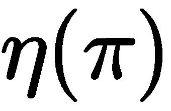
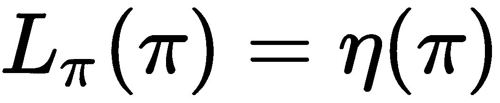

# 第四章：控制任务的仿真

在上一章中，我们看到了**深度 Q 学习**（**DQN**）在训练 AI 代理玩 Atari 游戏中的显著成功。DQN 的一个局限性是，动作空间必须是离散的，也就是说，代理可以选择的动作数量是有限的，并且动作的总数不能太大。然而，许多实际任务需要连续动作，这使得 DQN 难以应用。在这种情况下，对 DQN 的一种简单补救方法是将连续动作空间离散化。但由于维度灾难，这种补救方法并不起作用，意味着 DQN 很快变得不可行，并且无法很好地泛化。

本章将讨论用于具有连续动作空间的控制任务的深度强化学习算法。首先将介绍几个经典控制任务，如 CartPole、Pendulum 和 Acrobot。你将学习如何使用 Gym 仿真这些任务，并理解每个任务的目标和奖励。接下来，将介绍一种基本的演员-评论家算法，称为**确定性策略梯度**（**DPG**）。你将学习什么是演员-评论家架构，为什么这类算法能够处理连续控制任务。除此之外，你还将学习如何通过 Gym 和 TensorFlow 实现 DPG。最后，将介绍一种更高级的算法，称为**信任区域策略优化**（**TRPO**）。你将理解为什么 TRPO 的表现比 DPG 更好，以及如何通过应用共轭梯度法来学习策略。

本章需要一些数学编程和凸/非凸优化的背景知识。别担心，我们会一步步地讨论这些算法，确保你能充分理解它们背后的机制。理解它们为何有效、何时无法工作以及它们的优缺点，比仅仅知道如何用 Gym 和 TensorFlow 实现它们要重要得多。完成本章后，你将明白深度强化学习的魔法表演是由数学和深度学习共同指导的。

本章将涵盖以下主题：

+   经典控制任务介绍

+   确定性策略梯度方法

+   复杂控制任务的信任区域策略优化

# 控制任务介绍

OpenAI Gym 提供了经典强化学习文献中的经典控制任务。这些任务包括 CartPole、MountainCar、Acrobot 和 Pendulum。欲了解更多信息，请访问 OpenAI Gym 网站：[`gym.openai.com/envs/#classic_control`](https://gym.openai.com/envs/#classic_control)。此外，Gym 还提供了在流行物理模拟器 MuJoCo 中运行的更复杂的连续控制任务。MuJoCo 的主页地址是：[`www.mujoco.org/`](http://www.mujoco.org/)。MuJoCo 代表多关节动力学与接触，是一个用于机器人学、图形学和动画研究与开发的物理引擎。Gym 提供的任务包括 Ant、HalfCheetah、Hopper、Humanoid、InvertedPendulum、Reacher、Swimmer 和 Walker2d。这些名字很难理解，不是吗？有关这些任务的更多细节，请访问以下链接：[`gym.openai.com/envs/#mujoco`](https://gym.openai.com/envs/#mujoco)[.](http://www.mujoco.org/)

# 快速入门

如果你没有完整安装 OpenAI Gym，可以按如下方式安装`classic_control`和`mujoco`环境的依赖：

```py
pip install gym[classic_control]
pip install gym[mujoco]
```

MuJoCo 不是开源的，因此你需要按照`mujoco-py`中的说明（可在[`github.com/openai/mujoco-py#obtaining-the-binaries-and-license-key`](https://github.com/openai/mujoco-py#obtaining-the-binaries-and-license-key)获取）进行设置。安装经典控制环境后，尝试以下命令：

```py
import gym
atari = gym.make('Acrobot-v1')
atari.reset()
atari.render()
```

如果成功运行，一个小窗口将弹出，显示 Acrobot 任务的屏幕：


除了 Acrobot，你可以将`Acrobot-v1`任务名称替换为`CartPole-v0`、`MountainCarContinuous-v0`和`Pendulum-v0`，以查看其他控制任务。你可以运行以下代码来模拟这些任务，并尝试对它们的物理属性有一个高层次的理解：

```py
import gym
import time

def start(task_name):

    task = gym.make(task_name)
    observation = task.reset()

    while True:
        task.render()
        action = task.env.action_space.sample()
        observation, reward, done, _ = task.step(action)
        print("Action {}, reward {}, observation {}".format(action, reward, observation))
        if done:
            print("Game finished")
            break
        time.sleep(0.05)
    task.close()

if __name__ == "__main__":

    task_names = ['CartPole-v0', 'MountainCarContinuous-v0', 
                  'Pendulum-v0', 'Acrobot-v1']
    for task_name in task_names:
        start(task_name)
```

Gym 使用相同的接口来处理所有任务，包括 Atari 游戏、经典控制任务和 MuJoCo 控制任务。在每一步中，动作是从动作空间中随机抽取的，方法是调用`task.env.action_space.sample()`，然后这个动作通过`task.step(action)`提交给模拟器，告诉模拟器执行该动作。`step`函数返回与该动作对应的观察值和奖励。

# 经典控制任务

我们现在将详细介绍每个控制任务，并回答以下问题：

1.  控制输入是什么？对应的反馈是什么？

1.  奖励函数是如何定义的？

1.  动作空间是连续的还是离散的？

理解这些控制任务的细节对于设计合适的强化学习算法非常重要，因为它们的规格（例如动作空间的维度和奖励函数）会对性能产生很大影响。

CartPole 是控制和强化学习领域非常著名的控制任务。Gym 实现了由*Barto, Sutton, 和 Anderson*在其论文《Neuronlike Adaptive Elements That Can Solve Difficult Learning Control Problem》（1983 年）中描述的 CartPole 系统。在 CartPole 中，一根杆子通过一个没有驱动的关节连接到一辆小车上，小车在一条无摩擦轨道上移动，如下所示：


下面是 CartPole 的规格：

| **目标** | 目标是防止杆子倒下。 |
| --- | --- |
| **动作** | 动作空间是离散的，即通过对小车施加+1（右方向）和-1（左方向）的力量来控制系统。 |
| **观察** | 观察值是一个包含四个元素的向量，例如[ 0.0316304, -0.1893631, -0.0058115, 0.27025422]，表示杆子和小车的位置。 |
| **奖励** | 每当杆子保持竖直时，都会获得+1 的奖励。 |
| **终止条件** | 当杆子的角度超过 15 度或小车移动超过 2.4 个单位时，回合结束。 |

因为本章讲解的是解决连续控制任务，接下来我们将设计一个包装器用于 CartPole，将其离散的动作空间转换为连续的动作空间。

MountainCar 首次由 Andrew Moore 在其博士论文《A. Moore, Efficient Memory-Based Learning for Robot Control》中描述，该论文于 1990 年发表，广泛应用于控制、**马尔科夫决策过程**（**MDP**）和强化学习算法的基准测试。在 MountainCar 中，一辆小车在一条一维轨道上移动，在两座山之间，试图到达黄色旗帜，如下所示：


以下表格提供了其规格：

| **目标** | 目标是到达右侧山顶。然而，小车的发动机不足以一次性爬上山顶。因此，成功的唯一方式是前后行驶以积累动能。 |
| --- | --- |
| **动作** | 动作空间是连续的。输入的动作是施加于小车的发动机力量。 |
| **观察** | 观察值是一个包含两个元素的向量，例如[-0.46786288, -0.00619457]，表示小车的速度和位置。 |
| **奖励** | 奖励越大，表示用更少的能量达成目标。 |
| **终止条件** | 回合在小车到达目标旗帜或达到最大步数时结束。 |

Pendulum 摆动问题是控制文献中的经典问题，并作为测试控制算法的基准。在 Pendulum 中，一根杆子固定在一个支点上，如下所示：


下面是 Pendulum 的规格：

| **目标** | 目标是将杆子摆起并保持竖直，防止其倒下。 |
| --- | --- |
| **动作** | 动作空间是连续的。输入动作是施加在杆上的扭矩。 |
| **观察** | 观察是一个包含三个元素的向量，例如，[-0.19092327, 0.98160496, 3.36590881]，表示杆的角度和角速度。 |
| **奖励** | 奖励由一个函数计算，该函数的输入包括角度、角速度和扭矩。 |
| **终止** | 当达到最大步数时，任务结束。 |

Acrobot 最早由 Sutton 在 1996 年的论文《强化学习中的泛化：使用稀疏粗编码的成功案例》中描述。Acrobot 系统包含两个关节和两个链接，其中两个链接之间的关节是驱动的：


以下是 Acrobot 的设置：

| **目标** | 目标是将下部链接的末端摆动到指定高度。 |
| --- | --- |
| **动作** | 动作空间是离散的，也就是说，系统是通过向链接施加 0、+1 和-1 的扭矩来控制的。 |
| **观察** | 观察是一个包含六个元素的向量，例如，[0.9926474, 0.12104186, 0.99736744, -0.07251337, 0.47965018, -0.31494488]，表示两个链接的位置。 |
| **奖励** | 当下部链接位于给定高度时，每一步将获得+1 奖励，否则为-1 奖励。 |
| **终止** | 当下部链接的末端达到指定高度，或达到最大步数时，本轮任务结束。 |

请注意，在 Gym 中，CartPole 和 Acrobot 都有离散的动作空间，这意味着这两个任务可以通过应用深度 Q 学习算法来解决。由于本章讨论的是连续控制任务，我们需要将它们的动作空间转换为连续的。以下类为 Gym 经典控制任务提供了一个包装器：

```py
class Task:

    def __init__(self, name):

        assert name in ['CartPole-v0', 'MountainCar-v0', 
                        'Pendulum-v0', 'Acrobot-v1']
        self.name = name
        self.task = gym.make(name)
        self.last_state = self.reset()

    def reset(self):
        state = self.task.reset()
        self.total_reward = 0
        return state

    def play_action(self, action):

        if self.name not in ['Pendulum-v0', 'MountainCarContinuous-v0']:
            action = numpy.fmax(action, 0)
            action = action / numpy.sum(action)
            action = numpy.random.choice(range(len(action)), p=action)
        else:
            low = self.task.env.action_space.low
            high = self.task.env.action_space.high
            action = numpy.fmin(numpy.fmax(action, low), high)

        state, reward, done, _ = self.task.step(action)
        self.total_reward += reward
        termination = 1 if done else 0

        return reward, state, termination

    def get_total_reward(self):
        return self.total_reward

    def get_action_dim(self):
        if self.name not in ['Pendulum-v0', 'MountainCarContinuous-v0']:
            return self.task.env.action_space.n
        else:
            return self.task.env.action_space.shape[0]

    def get_state_dim(self):
        return self.last_state.shape[0]

    def get_activation_fn(self):
        if self.name not in ['Pendulum-v0', 'MountainCarContinuous-v0']:
            return tf.nn.softmax
        else:
            return None
```

对于 CartPole 和 Acrobot，输入动作应该是一个概率向量，表示选择每个动作的概率。在`play_action`函数中，动作会根据这个概率向量随机采样并提交给系统。`get_total_reward`函数返回一个回合中的总奖励。`get_action_dim`和`get_state_dim`函数分别返回动作空间和观察空间的维度。`get_activation_fn`函数用于演员网络的输出层，我们将在后续讨论中提到。

# 确定性策略梯度

正如前一章所讨论的，DQN 使用 Q 网络来估计 `状态-动作值` 函数，该函数对每个可用动作都有一个单独的输出。因此，由于动作空间是连续的，Q 网络无法应用。细心的读者可能还记得，Q 网络的另一种架构是将状态和动作作为输入，输出相应的 Q 值估计。这种架构不要求可用动作的数量是有限的，并且能够处理连续的输入动作：


如果我们使用这种网络来估计 `状态-动作值` 函数，那么必定还需要另一个网络来定义智能体的行为策略，即根据观察到的状态输出合适的动作。事实上，这正是演员-评论员强化学习算法的直观理解。演员-评论员架构包含两个部分：

1.  **演员**：演员定义了智能体的行为策略。在控制任务中，它根据系统的当前状态输出控制信号。

1.  **评论员**：评论员估计当前策略的 Q 值。它可以判断策略是否优秀。

因此，如果演员和评论员都能像在 DQN 中训练 Q 网络一样，利用系统反馈（状态、奖励、下一个状态、终止信号）进行训练，那么经典的控制任务就能得到解决。那么我们该如何训练它们呢？

# 策略梯度背后的理论

一种解决方案是 **深度确定性策略梯度** (**DDPG**) 算法，它将演员-评论员方法与 DQN 成功的经验相结合。相关论文如下：

+   D. Silver, G. Lever, N. Heess, T. Degris, D. Wierstra 和 M. Riedmiller. *确定性策略梯度算法*. 见于 ICML，2014。

+   T. P. Lillicrap, J. J. Hunt, A. Pritzel, N. Heess, T. Erez, Y. Tassa, D. Silver 和 D. Wierstra. *深度强化学习中的连续控制*. 见于 ICLR，2016。

引入 DDPG 的原因首先是它与 DQN 非常相似，因此在完成前一章内容后，你可以更轻松地理解其背后的机制。回顾一下，DQN 能够以稳定且健壮的方式训练 Q 网络，原因如下：

+   Q 网络通过从回放记忆中随机抽取样本进行训练，以最小化样本之间的相关性。

+   使用目标网络来估计目标 Q 值，从而减少策略发生振荡或发散的概率。DDPG 采用了相同的策略，这意味着 DDPG 也是一种无模型且离线的算法。

我们在强化学习设置中使用与上一章相同的符号。在每个时间步 ，智能体观察状态 ，采取动作 ，然后从函数  生成的奖励  中获得相应的回报。与使用  表示状态  下所有可用动作的集合不同，这里我们使用  来表示智能体的策略，它将状态映射到动作的概率分布。许多强化学习方法，如 DQN，都使用贝尔曼方程作为基础：

。

这个公式与 DQN 中的公式唯一的区别是这里的策略  是随机的，因此对  的期望是通过  来计算的。如果目标策略  是确定性的，可以通过函数  来描述，那么就可以避免这个内部的期望：

。

期望仅依赖于环境。这意味着可以使用 `状态-动作值` 函数  进行离策略学习，使用从其他策略生成的转换，就像我们在 DQN 中做的那样。函数  作为评估器，可以通过神经网络进行近似，该神经网络由  参数化，而策略  作为演员，也可以通过另一神经网络来表示，且该神经网络由  参数化（在 DQN 中， 只是 ）。然后，可以通过最小化以下损失函数来训练评估器 ：

。

这里，。如同 DQN 中一样， 可以通过目标网络来估计，而用于近似  的样本可以从重放记忆中随机抽取。

为了训练演员 ，我们通过最小化损失函数 来固定评论员 ，并尝试最大化 相对于 的值，因为较大的 Q 值意味着更好的策略。这可以通过应用链式法则来计算相对于演员参数的期望回报：

。

以下图展示了 DDPG 的高层架构：


与 DQN 相比，更新目标网络的方式有所不同。不是在几次迭代后直接将 的权重复制到目标网络，而是使用软更新：


这里， 表示目标网络的权重。这个更新意味着目标值的变化受到约束，变化速度较慢，从而大大提高了学习的稳定性。这个简单的变化将学习值函数的相对不稳定问题，拉近到了监督学习的情况。

与 DQN 类似，DDPG 在训练过程中也需要平衡探索和开发。由于由策略生成的动作 是连续的，因此无法应用 -贪婪策略。相反，我们可以通过向演员策略 中加入从分布 中采样的噪声来构造一个探索策略 ：

 其中 

 可以选择为 ，其中 是标准高斯分布，且 在每个训练步骤中递减。另一种选择是应用奥恩斯坦-乌伦贝克过程生成探索噪声 。

# DPG 算法

以下伪代码展示了 DDPG 算法：

```py
Initialize replay memory  to capacity ;
Initialize the critic network  and actor network  with random weights  and ;
Initialize the target networks  and  with weights  and ;
Repeat for each episode:
    Set time step ;
    Initialize a random process  for action exploration noise;
    Receive an initial observation state ;
    While the terminal state hasn't been reached:
        Select an action  according to the current policy and exploration noise;
        Execute action  in the simulator and observe reward  and the next state ;
        Store transition  into replay memory ;
        Randomly sample a batch of  transitions  from ;
        Set  if  is a terminal state or  if  is a non-terminal state;
        Update critic by minimizing the loss:
                      ;
        Update the actor policy using the sampled policy gradient:
                      ;
        Update the target networks:
                      ,
                      ;
    End while
```

通过将用于近似演员和评论员的前馈神经网络替换为递归神经网络，DDPG 自然扩展出了一个变体。这个扩展被称为**递归确定性策略梯度**算法（**RDPG**），在论文《N. Heess, J. J. Hunt, T. P. Lillicrap 和 D. Silver. *基于记忆的控制与递归神经网络*》中有讨论，发表于 2015 年。

循环评论家和演员通过**时间反向传播**（**BPTT**）进行训练。对于有兴趣的读者，可以从[`arxiv.org/abs/1512.04455`](https://arxiv.org/abs/1512.04455)下载相关论文。

# DDPG 实现

本节将向你展示如何使用 TensorFlow 实现演员-评论家架构。代码结构几乎与上一章展示的 DQN 实现相同。

`ActorNetwork`是一个简单的多层感知机（MLP），它将观测状态作为输入：

```py
class ActorNetwork:

    def __init__(self, input_state, output_dim, hidden_layers, activation=tf.nn.relu):

        self.x = input_state
        self.output_dim = output_dim
        self.hidden_layers = hidden_layers
        self.activation = activation

        with tf.variable_scope('actor_network'):
            self.output = self._build()
            self.vars = tf.get_collection(tf.GraphKeys.TRAINABLE_VARIABLES, 
                                          tf.get_variable_scope().name)

    def _build(self):

        layer = self.x
        init_b = tf.constant_initializer(0.01)

        for i, num_unit in enumerate(self.hidden_layers):
            layer = dense(layer, num_unit, init_b=init_b, name='hidden_layer_{}'.format(i))

        output = dense(layer, self.output_dim, activation=self.activation, init_b=init_b, name='output')
        return output
```

构造函数需要四个参数：`input_state`、`output_dim`、`hidden_layers`和`activation`。`input_state`是观测状态的张量。`output_dim`是动作空间的维度。`hidden_layers`指定隐藏层的数量和每层的单元数。`activation`表示输出层的激活函数。

`CriticNetwork`也是一个多层感知机（MLP），足以应对经典控制任务：

```py
class CriticNetwork:

    def __init__(self, input_state, input_action, hidden_layers):

        assert len(hidden_layers) >= 2
        self.input_state = input_state
        self.input_action = input_action
        self.hidden_layers = hidden_layers

        with tf.variable_scope('critic_network'):
            self.output = self._build()
            self.vars = tf.get_collection(tf.GraphKeys.TRAINABLE_VARIABLES, 
                                          tf.get_variable_scope().name)

    def _build(self):

        layer = self.input_state
        init_b = tf.constant_initializer(0.01)

        for i, num_unit in enumerate(self.hidden_layers):
            if i != 1:
                layer = dense(layer, num_unit, init_b=init_b, name='hidden_layer_{}'.format(i))
            else:
                layer = tf.concat([layer, self.input_action], axis=1, name='concat_action')
                layer = dense(layer, num_unit, init_b=init_b, name='hidden_layer_{}'.format(i))

        output = dense(layer, 1, activation=None, init_b=init_b, name='output')
        return tf.reshape(output, shape=(-1,))
```

网络将状态和动作作为输入。它首先将状态映射为一个隐藏特征表示，然后将该表示与动作进行拼接，接着通过几个隐藏层。输出层生成与输入对应的 Q 值。

演员-评论家网络将演员网络和评论家网络结合在一起：

```py
class ActorCriticNet:

    def __init__(self, input_dim, action_dim, 
                 critic_layers, actor_layers, actor_activation, 
                 scope='ac_network'):

        self.input_dim = input_dim
        self.action_dim = action_dim
        self.scope = scope

        self.x = tf.placeholder(shape=(None, input_dim), dtype=tf.float32, name='x')
        self.y = tf.placeholder(shape=(None,), dtype=tf.float32, name='y')

        with tf.variable_scope(scope):
            self.actor_network = ActorNetwork(self.x, action_dim, 
                                              hidden_layers=actor_layers, 
                                              activation=actor_activation)

            self.critic_network = CriticNetwork(self.x, 
                                                self.actor_network.get_output_layer(),
                                                hidden_layers=critic_layers)

            self.vars = tf.get_collection(tf.GraphKeys.TRAINABLE_VARIABLES, 
                                          tf.get_variable_scope().name)
            self._build()

    def _build(self):

        value = self.critic_network.get_output_layer()

        actor_loss = -tf.reduce_mean(value)
        self.actor_vars = self.actor_network.get_params()
        self.actor_grad = tf.gradients(actor_loss, self.actor_vars)
        tf.summary.scalar("actor_loss", actor_loss, collections=['actor'])
        self.actor_summary = tf.summary.merge_all('actor')

        critic_loss = 0.5 * tf.reduce_mean(tf.square((value - self.y)))
        self.critic_vars = self.critic_network.get_params()
        self.critic_grad = tf.gradients(critic_loss, self.critic_vars)
        tf.summary.scalar("critic_loss", critic_loss, collections=['critic'])
        self.critic_summary = tf.summary.merge_all('critic')
```

构造函数需要六个参数，分别为：`input_dim`和`action_dim`是状态空间和动作空间的维度，`critic_layers`和`actor_layers`指定评论家网络和演员网络的隐藏层，`actor_activation`表示演员网络输出层的激活函数，`scope`是用于`scope` TensorFlow 变量的作用域名称。

构造函数首先创建一个`self.actor_network`演员网络的实例，输入为`self.x`，其中`self.x`表示当前状态。然后，它使用以下输入创建评论家网络的实例：`self.actor_network.get_output_layer()`作为演员网络的输出，`self.x`作为当前状态。给定这两个网络，构造函数调用`self._build()`来构建我们之前讨论过的演员和评论家的损失函数。演员损失是`-tf.reduce_mean(value)`，其中`value`是评论家网络计算的 Q 值。评论家损失是`0.5 * tf.reduce_mean(tf.square((value - self.y)))`，其中`self.y`是由目标网络计算的预测目标值的张量。

`ActorCriticNet`类提供了在给定当前状态的情况下计算动作和 Q 值的功能，即`get_action`和`get_value`。它还提供了`get_action_value`，该函数根据当前状态和代理执行的动作计算`状态-动作值`函数：

```py
class ActorCriticNet:

    def get_action(self, sess, state):
        return self.actor_network.get_action(sess, state)

    def get_value(self, sess, state):
        return self.critic_network.get_value(sess, state)

    def get_action_value(self, sess, state, action):
        return self.critic_network.get_action_value(sess, state, action)

    def get_actor_feed_dict(self, state):
        return {self.x: state}

    def get_critic_feed_dict(self, state, action, target):
        return {self.x: state, self.y: target, 
                self.critic_network.input_action: action}

    def get_clone_op(self, network, tau=0.9):
        update_ops = []
        new_vars = {v.name.replace(network.scope, ''): v for v in network.vars}
        for v in self.vars:
            u = (1 - tau) * v + tau * new_vars[v.name.replace(self.scope, '')]
            update_ops.append(tf.assign(v, u))
        return update_ops
```

由于 DPG 与 DQN 的架构几乎相同，本章没有展示回放记忆和优化器的实现。欲了解更多细节，您可以参考前一章或访问我们的 GitHub 仓库([`github.com/PacktPublishing/Python-Reinforcement-Learning-Projects`](https://github.com/PacktPublishing/Python-Reinforcement-Learning-Projects))。通过将这些模块结合在一起，我们可以实现用于确定性策略梯度算法的`DPG`类：

```py
class DPG:

    def __init__(self, config, task, directory, callback=None, summary_writer=None):

        self.task = task
        self.directory = directory
        self.callback = callback
        self.summary_writer = summary_writer

        self.config = config
        self.batch_size = config['batch_size']
        self.n_episode = config['num_episode']
        self.capacity = config['capacity']
        self.history_len = config['history_len']
        self.epsilon_decay = config['epsilon_decay']
        self.epsilon_min = config['epsilon_min']
        self.time_between_two_copies = config['time_between_two_copies']
        self.update_interval = config['update_interval']
        self.tau = config['tau']

        self.action_dim = task.get_action_dim()
        self.state_dim = task.get_state_dim() * self.history_len
        self.critic_layers = [50, 50]
        self.actor_layers = [50, 50]
        self.actor_activation = task.get_activation_fn()

        self._init_modules()
```

这里，`config`包含 DPG 的所有参数，例如训练时的批量大小和学习率。`task`是某个经典控制任务的实例。在构造函数中，回放记忆、Q 网络、目标网络和优化器通过调用`_init_modules`函数进行初始化：

```py
    def _init_modules(self):
        # Replay memory
        self.replay_memory = ReplayMemory(history_len=self.history_len, 
                                          capacity=self.capacity)
        # Actor critic network
        self.ac_network = ActorCriticNet(input_dim=self.state_dim, 
                                         action_dim=self.action_dim, 
                                         critic_layers=self.critic_layers, 
                                         actor_layers=self.actor_layers, 
                                         actor_activation=self.actor_activation,
                                         scope='ac_network')
        # Target network
        self.target_network = ActorCriticNet(input_dim=self.state_dim, 
                                             action_dim=self.action_dim, 
                                             critic_layers=self.critic_layers, 
                                             actor_layers=self.actor_layers, 
                                             actor_activation=self.actor_activation,
                                             scope='target_network')
        # Optimizer
        self.optimizer = Optimizer(config=self.config, 
                                   ac_network=self.ac_network, 
                                   target_network=self.target_network, 
                                   replay_memory=self.replay_memory)
        # Ops for updating target network
        self.clone_op = self.target_network.get_clone_op(self.ac_network, tau=self.tau)
        # For tensorboard
        self.t_score = tf.placeholder(dtype=tf.float32, shape=[], name='new_score')
        tf.summary.scalar("score", self.t_score, collections=['dpg'])
        self.summary_op = tf.summary.merge_all('dpg')

    def choose_action(self, sess, state, epsilon=0.1):
        x = numpy.asarray(numpy.expand_dims(state, axis=0), dtype=numpy.float32)
        action = self.ac_network.get_action(sess, x)[0]
        return action + epsilon * numpy.random.randn(len(action))

    def play(self, action):
        r, new_state, termination = self.task.play_action(action)
        return r, new_state, termination

    def update_target_network(self, sess):
        sess.run(self.clone_op)
```

`choose_action`函数根据当前演员-评论员网络的估计和观察到的状态选择一个动作。

请注意，添加了由`epsilon`控制的高斯噪声以进行探索。

`play`函数将一个动作提交给模拟器，并返回模拟器的反馈。`update_target_network`函数从当前的演员-评论员网络中更新目标网络。

为了开始训练过程，可以调用以下函数：

```py
    def train(self, sess, saver=None):

        num_of_trials = -1
        for episode in range(self.n_episode):
            frame = self.task.reset()
            for _ in range(self.history_len+1):
                self.replay_memory.add(frame, 0, 0, 0)

            for _ in range(self.config['T']):
                num_of_trials += 1
                epsilon = self.epsilon_min + \
                          max(self.epsilon_decay - num_of_trials, 0) / \
                          self.epsilon_decay * (1 - self.epsilon_min)
                if num_of_trials % self.update_interval == 0:
                    self.optimizer.train_one_step(sess, num_of_trials, self.batch_size)

                state = self.replay_memory.phi(frame)
                action = self.choose_action(sess, state, epsilon) 
                r, new_frame, termination = self.play(action)
                self.replay_memory.add(frame, action, r, termination)
                frame = new_frame

                if num_of_trials % self.time_between_two_copies == 0:
                    self.update_target_network(sess)
                    self.save(sess, saver)

                if self.callback:
                    self.callback()
                if termination:
                    score = self.task.get_total_reward()
                    summary_str = sess.run(self.summary_op, feed_dict={self.t_score: score})
                    self.summary_writer.add_summary(summary_str, num_of_trials)
                    self.summary_writer.flush()
                    break
```

在每一轮中，它调用`replay_memory.phi`来获取当前状态，并调用`choose_action`函数根据当前状态选择一个动作。然后，通过调用`play`函数将该动作提交给模拟器，该函数返回相应的奖励、下一个状态和终止信号。接着，`(当前状态, 动作, 奖励, 终止)`的转移将被存储到回放记忆中。每当`update_interval`步（默认为`update_interval = 1`）时，演员-评论员网络会通过从回放记忆中随机抽取的一批转移进行训练。每当经过`time_between_two_copies`步时，目标网络将更新，并将 Q 网络的权重保存到硬盘。

在训练步骤之后，可以调用以下函数来评估我们训练好的代理的表现：

```py
    def evaluate(self, sess):

        for episode in range(self.n_episode):
            frame = self.task.reset()
            for _ in range(self.history_len+1):
                self.replay_memory.add(frame, 0, 0, 0)

            for _ in range(self.config['T']):
                print("episode {}, total reward {}".format(episode, 
                                                           self.task.get_total_reward()))

                state = self.replay_memory.phi(frame)
                action = self.choose_action(sess, state, self.epsilon_min) 
                r, new_frame, termination = self.play(action)
                self.replay_memory.add(frame, action, r, termination)
                frame = new_frame

                if self.callback:
                    self.callback()
                    if termination:
                        break
```

# 实验

DPG 的完整实现可以从我们的 GitHub 仓库下载([`github.com/PacktPublishing/Python-Reinforcement-Learning-Projects`](https://github.com/PacktPublishing/Python-Reinforcement-Learning-Projects))。要训练一个用于 CartPole 的代理，请在`src`文件夹下运行以下命令：

```py
python train.py -t CartPole-v0 -d cpu
```

`train.py`有两个参数。一个是`-t`或`--task`，表示您要测试的经典控制任务的名称。另一个是`-d`或`--device`，指定您要使用的设备（CPU 或 GPU）来训练演员-评论员网络。由于这些经典控制任务的状态空间维度相较于 Atari 环境较低，使用 CPU 训练代理已经足够快速，通常只需几分钟即可完成。

在训练过程中，你可以打开一个新的终端并输入以下命令，以可视化演员-评论员网络的架构和训练过程：

```py
tensorboard --logdir=log/CartPole-v0/train
```

这里，`logdir` 指向存储 `CartPole-v0` 日志文件的文件夹。TensorBoard 运行后，打开浏览器并导航到 `localhost:6006` 来查看 TensorBoard：


Tensorboard 视图

前两个图显示了演员损失和评论员损失相对于训练步骤的变化。对于经典控制任务，演员损失通常会持续下降，而评论员损失则会有较大的波动。在 60,000 个训练步骤后，分数变得稳定，达到了 200，这是 CartPole 仿真器中能达到的最高分数。

使用类似的命令，你也可以为 `Pendulum` 任务训练一个智能体：

```py
python train.py -t Pendulum-v0 -d cpu
```

然后，通过 `Tensorboard` 检查训练过程：

```py
tensorboard --logdir=log/Pendulum-v0/train
```

以下截图显示了训练过程中分数的变化：


训练过程中分数的变化

一位细心的读者可能会注意到，Pendulum 的分数波动比 CartPole 的分数要大。造成这个问题的原因有两个：

+   在 Pendulum 中，杆子的起始位置是不确定的，即它可能在两次尝试之间有所不同

+   DPG 的训练过程可能并不总是稳定的，尤其是对于复杂任务，如 MuJoCo 控制任务

Gym 提供的 MuJoCo 控制任务，例如 Ant、HalfCheetah、Hopper、Humanoid、InvertedPendulum、Reacher、Swimmer 和 Walker2d，具有高维度的状态和动作空间，这使得 DPG 无法正常工作。如果你对在运行 DPG 时 `Hopper-v0` 任务会发生什么感到好奇，你可以尝试以下操作：

```py
python train.py -t Hopper-v0 -d cpu
```

几分钟后，你会看到 DPG 无法教会 Hopper 如何行走。DPG 失败的主要原因是，本文讨论的简单的演员和评论员更新在高维输入下变得不稳定。

# 信任区域策略优化

**信任区域策略优化**（**TRPO**）算法旨在解决复杂的连续控制任务，相关论文如下：Schulman, S. Levine, P. Moritz, M. Jordan 和 P. Abbeel. *信任区域策略优化*，发表于 ICML，2015。

要理解为什么 TRPO 有效，需要一些数学背景。主要思路是，最好确保由一个训练步骤优化后的新策略 ，不仅在单调减少优化损失函数（从而改进策略）的同时，还不会偏离之前的策略  太远，这意味着应该对  和  之间的差异施加约束，例如对某个约束函数  施加常数 。

# TRPO 背后的理论

让我们来看一下 TRPO 背后的机制。如果你觉得这一部分难以理解，可以跳过它，直接看如何运行 TRPO 来解决 MuJoCo 控制任务。考虑一个无限期折扣的马尔科夫决策过程，记作 ，其中  是状态的有限集合，  是行动的有限集合，  是转移概率分布，  是成本函数，  是初始状态的分布，  是折扣因子。设  为我们希望通过最小化以下预期折扣成本来学习的随机策略：


这里是 ，  和 。在策略  下，`状态-行动值`函数 ，值函数 ，以及优势函数  的定义如下：


这里是  和 。

我们的目标是在每个训练步骤中，通过减少预期折扣成本，改善策略 。为了设计一个单调改善 的算法，让我们考虑以下方程：


这里，表示的是 ， 和 。这个方程对于任何策略  都成立。对于有兴趣了解此方程证明的读者，请参阅 TRPO 论文的附录或 Kakade 和 Langford 撰写的论文《*大致最优的近似强化学习*》。为了简化这个方程，设  为折扣访问频率：


通过将前面的方程重排，以对状态而不是时间步进行求和，它变为以下形式：


从这个方程我们可以看出，任何策略更新 ，只要在每个状态  上的期望优势非正，即 ，都能保证减少成本 。因此，对于像 Atari 环境这样的离散动作空间，DQN 中选择的确定性策略  保证如果至少有一个状态-动作对的优势值为负且状态访问概率非零，就能改进策略。然而，在实际问题中，特别是当策略通过神经网络近似时，由于近似误差，某些状态的期望优势可能为正。除此之外， 对  的依赖使得该方程难以优化，因此 TRPO 考虑通过将  替换为  来优化以下函数：


Kakade 和 Langford 显示，如果我们有一个参数化策略，，这是参数  的可微函数，那么对于任何参数 ：


这意味着，改进  也会通过对  的足够小的更新来改进 。基于这个思想，Kakade 和 Langford 提出了一个叫做保守策略迭代的策略更新方案：


这里， 是当前策略， 是新策略， 是通过求解  得到的。它们证明了以下更新的界限：

，其中 

请注意，这个界限仅适用于通过前述更新生成的混合策略。在 TRPO 中，作者将这个界限扩展到一般的随机策略，而不仅仅是混合策略。其主要思想是用  替换混合权重，使用  和  之间的距离度量。一个有趣的距离度量选项是总变差散度。以两个离散分布  和  为例，总变差散度定义如下：


对于策略  和 ，令  为所有状态的最大总变差散度：


使用  和 ，可以证明：

，其中 。

实际上，总变差散度可以被 KL 散度上界，即 ，这意味着：

，其中 。

# TRPO 算法

基于前述的策略改进界限，开发了以下算法：

```py
Initialize policy ;
Repeat for each step :
    Compute all advantage values ;
    Solve the following optimization problem:
    ;
Until convergence
```

在每一步中，该算法最小化  的上界，使得：


最后一条等式由此得出， 对于任何策略  都成立。这意味着该算法保证生成一系列单调改进的策略。

在实践中，由于难以计算  的确切值，并且很难通过惩罚项来控制每次更新的步长，TRPO 将惩罚项替换为 KL 散度受限于常数  的约束：


但由于约束条件过多，这个问题仍然很难解决。因此，TRPO 使用了一种启发式近似方法，考虑了平均 KL 散度：


这导致了以下优化问题：


换句话说，通过展开，我们需要解决以下问题：


现在，问题是：我们如何优化这个问题？一个直接的想法是通过模拟策略进行若干步，然后使用这些轨迹来逼近该问题的目标函数。由于优势函数，我们将目标函数中的替换为 Q 值，这只是使目标函数变化一个常数。此外，注意以下几点：


因此，给定一个在策略下生成的轨迹，我们将按以下方式进行优化：


对于 MuJoCo 控制任务，策略和`状态-动作值`函数都通过神经网络进行逼近。为了优化这个问题，KL 散度约束可以通过 Fisher 信息矩阵来近似。然后，可以通过共轭梯度算法来求解此问题。有关更多详细信息，您可以从 GitHub 下载 TRPO 的源代码，并查看`optimizer.py`，该文件实现了使用 TensorFlow 的共轭梯度算法。

# MuJoCo 任务实验

`Swimmer`任务是测试 TRPO 的一个很好的例子。这个任务涉及一个在粘性流体中游泳的三连杆机器人，目标是通过驱动两个关节，使其尽可能快地游向前方（[`gym.openai.com/envs/Swimmer-v2/`](http://gym.openai.com/envs/Swimmer-v2/)）。下面的截图显示了`Swimmer`在 MuJoCo 模拟器中的样子：


要训练一个`Swimmer`代理，请在`src`文件夹下运行以下命令：

```py
CUDA_VISIBLE_DEVICES= python train.py -t Swimmer
```

`train.py`中有两个参数。一个是`-t`，或`--task`，表示您要测试的 MuJoCo 或经典控制任务的名称。由于这些控制任务的状态空间相比于 Atari 环境维度较低，单独使用 CPU 进行训练就足够了，只需将`CUDA_VISIBLE_DEVICES`设置为空，这将花费 30 分钟到两小时不等。

在训练过程中，您可以打开一个新的终端，并输入以下命令来可视化训练过程：

```py
tensorboard --logdir=log/Swimmer
```

在这里，`logdir`指向存储`Swimmer`日志文件的文件夹。一旦 TensorBoard 正在运行，使用网页浏览器访问`localhost:6006`以查看 TensorBoard：


很明显，经过 200 个回合后，每个回合的总奖励变得稳定，即大约为 366。要检查训练后`Swimmer`如何移动，运行以下命令：

```py
CUDA_VISIBLE_DEVICES= python test.py -t Swimmer
```

你将看到一个看起来很有趣的`Swimmer`对象在地面上行走。

# 总结

本章介绍了 Gym 提供的经典控制任务和 MuJoCo 控制任务。你已经了解了这些任务的目标和规格，以及如何为它们实现一个模拟器。本章最重要的部分是用于连续控制任务的确定性 DPG 和 TRPO。你了解了它们背后的理论，这也解释了它们为什么在这些任务中表现良好。你还学习了如何使用 TensorFlow 实现 DPG 和 TRPO，以及如何可视化训练过程。

在下一章，我们将学习如何将强化学习算法应用于更复杂的任务，例如，玩 Minecraft。我们将介绍**异步演员-评论员**（**A3C**）算法，它在复杂任务中比 DQN 更快，并且已广泛应用于许多深度强化学习算法作为框架。
