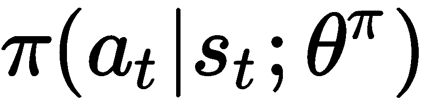

# 第五章：在 Minecraft 中构建虚拟世界

在前两章中，我们讨论了**深度 Q 学习**（**DQN**）算法，用于玩 Atari 游戏，以及**信任域策略优化**（**TRPO**）算法，用于连续控制任务。我们看到这些算法在解决复杂问题时取得了巨大成功，尤其是与传统强化学习算法相比，后者并未使用深度神经网络来逼近价值函数或策略函数。它们的主要缺点，尤其是对于 DQN 来说，是训练步骤收敛得太慢，例如，训练一个代理玩 Atari 游戏需要大约一周时间。对于更复杂的游戏，即使一周的训练时间也不够。

本章将介绍一个更复杂的例子——Minecraft，这是由瑞典游戏开发者 Markus Persson 创作并由 Mojang 开发的热门在线视频游戏。你将学习如何使用 OpenAI Gym 启动 Minecraft 环境，并完成不同的任务。为了构建一个 AI 玩家来完成这些任务，你将学习**异步优势行为者-批评者**（**A3C**）算法，这是一个轻量级的深度强化学习框架，使用异步梯度下降优化深度神经网络控制器。A3C 是广泛应用的深度强化学习算法，可以在单个多核 CPU 上训练一半的时间，而不是 GPU。对于像 Breakout 这样的 Atari 游戏，A3C 在训练 3 小时后即可达到人类水平的表现，远比 DQN 需要的 3 天训练时间要快。你将学习如何使用 Python 和 TensorFlow 实现 A3C。本章对数学背景的要求不如上一章那么高——尽情享受吧！

本章将涵盖以下主题：

+   Minecraft 环境简介

+   在 Minecraft 环境中为训练 AI 机器人准备数据

+   异步优势行为者-批评者框架

+   A3C 框架的实现

# Minecraft 环境简介

原始的 OpenAI Gym 不包含 Minecraft 环境。我们需要安装一个 Minecraft 环境包，地址为[`github.com/tambetm/gym-minecraft`](https://github.com/tambetm/gym-minecraft)。这个包是基于微软的 Malmö构建的，Malmö是一个建立在 Minecraft 之上的 AI 实验和研究平台。

在安装`gym-minecraft`包之前，首先需要从[`github.com/Microsoft/malmo`](https://github.com/Microsoft/malmo)下载 Malmö。我们可以从[`github.com/Microsoft/malmo/releases`](https://github.com/Microsoft/malmo/releases)下载最新的预构建版本。解压包后，进入`Minecraft`文件夹，在 Windows 上运行`launchClient.bat`，或者在 Linux/MacOS 上运行`launchClient.sh`，以启动 Minecraft 环境。如果成功启动，我们现在可以通过以下脚本安装`gym-minecraft`：

```py
python3 -m pip install gym
python3 -m pip install pygame

git clone https://github.com/tambetm/minecraft-py.git
cd minecraft-py
python setup.py install

git clone https://github.com/tambetm/gym-minecraft.git
cd gym-minecraft
python setup.py install
```

然后，我们可以运行以下代码来测试`gym-minecraft`是否已经成功安装：

```py
import logging
import minecraft_py
logging.basicConfig(level=logging.DEBUG)

proc, _ = minecraft_py.start()
minecraft_py.stop(proc)
```

`gym-minecraft`包提供了 15 个不同的任务，包括`MinecraftDefaultWorld1-v0`和`MinecraftBasic-v0`。例如，在`MinecraftBasic-v0`中，代理可以在一个小房间内移动，房间角落放置着一个箱子，目标是到达这个箱子的位置。以下截图展示了`gym-minecraft`中可用的几个任务：


`gym-minecraft`包与其他 Gym 环境（例如 Atari 和经典控制任务）具有相同的接口。你可以运行以下代码来测试不同的 Minecraft 任务，并尝试对它们的属性（例如目标、奖励和观察）进行高层次的理解：

```py
import gym
import gym_minecraft
import minecraft_py

def start_game():
    env = gym.make('MinecraftBasic-v0')
    env.init(start_minecraft=True)
    env.reset()

    done = False
    while not done:
        env.render(mode='human')
        action = env.action_space.sample()
        obs, reward, done, info = env.step(action)
    env.close()

if __name__ == "__main__":
    start_game()
```

在每个步骤中，通过调用`env.action_space.sample()`从动作空间中随机抽取一个动作，然后通过调用`env.step(action)`函数将该动作提交给系统，该函数会返回与该动作对应的观察结果和奖励。你也可以通过将`MinecraftBasic-v0`替换为其他名称来尝试其他任务，例如，`MinecraftMaze1-v0`和`MinecraftObstacles-v0`。

# 数据准备

在 Atari 环境中，请记住每个 Atari 游戏都有三种模式，例如，Breakout、BreakoutDeterministic 和 BreakoutNoFrameskip，每种模式又有两个版本，例如，Breakout-v0 和 Breakout-v4。三种模式之间的主要区别是 frameskip 参数，它表示一个动作在多少帧（步长）上重复。这就是**跳帧**技术，它使我们能够在不显著增加运行时间的情况下玩更多游戏。

然而，在 Minecraft 环境中，只有一种模式下 frameskip 参数等于 1。因此，为了应用跳帧技术，我们需要在每个时间步中显式地重复某个动作多个 frameskip 次数。除此之外，`step`函数返回的帧图像是 RGB 图像。类似于 Atari 环境，观察到的帧图像会被转换为灰度图像，并且被调整为 84x84 的大小。以下代码提供了`gym-minecraft`的包装器，其中包含了所有的数据预处理步骤：

```py
import gym
import gym_minecraft
import minecraft_py
import numpy, time
from utils import cv2_resize_image

class Game:

    def __init__(self, name='MinecraftBasic-v0', discrete_movement=False):

        self.env = gym.make(name)
        if discrete_movement:
            self.env.init(start_minecraft=True, allowDiscreteMovement=["move", "turn"])
        else:
            self.env.init(start_minecraft=True, allowContinuousMovement=["move", "turn"])
        self.actions = list(range(self.env.action_space.n))
        frame = self.env.reset()

        self.frame_skip = 4
        self.total_reward = 0
        self.crop_size = 84
        self.buffer_size = 8
        self.buffer_index = 0
        self.buffer = [self.crop(self.rgb_to_gray(frame)) for _ in range(self.buffer_size)]
        self.last_frame = frame

    def rgb_to_gray(self, im):
        return numpy.dot(im, [0.2126, 0.7152, 0.0722])

    def reset(self):
        frame = self.env.reset()
        self.total_reward = 0
        self.buffer_index = 0
        self.buffer = [self.crop(self.rgb_to_gray(frame)) for _ in range(self.buffer_size)]
        self.last_frame = frame

    def add_frame_to_buffer(self, frame):
        self.buffer_index = self.buffer_index % self.buffer_size
        self.buffer[self.buffer_index] = frame
        self.buffer_index += 1

    def get_available_actions(self):
        return list(range(len(self.actions)))

    def get_feedback_size(self):
        return (self.crop_size, self.crop_size)

    def crop(self, frame):
        feedback = cv2_resize_image(frame, 
                                    resized_shape=(self.crop_size, self.crop_size), 
                                    method='scale', crop_offset=0)
        return feedback

    def get_current_feedback(self, num_frames=4):
        assert num_frames < self.buffer_size, "Frame buffer is not large enough."
        index = self.buffer_index - 1
        frames = [numpy.expand_dims(self.buffer[index - k], axis=0) for k in range(num_frames)]
        if num_frames > 1:
            return numpy.concatenate(frames, axis=0)
        else:
            return frames[0]

    def play_action(self, action, num_frames=4):
        reward = 0
        termination = 0
        for i in range(self.frame_skip):
            a = self.actions[action]
            frame, r, done, _ = self.env.step(a)
            reward += r
            if i == self.frame_skip - 2: 
                self.last_frame = frame
            if done: 
                termination = 1
        self.add_frame_to_buffer(self.crop(numpy.maximum(self.rgb_to_gray(frame), self.rgb_to_gray(self.last_frame))))

        r = numpy.clip(reward, -1, 1)
        self.total_reward += reward
        return r, self.get_current_feedback(num_frames), termination
```

在构造函数中，Minecraft 的可用动作被限制为`move`和`turn`（不考虑其他动作，如相机控制）。将 RGB 图像转换为灰度图像非常简单。给定一个形状为（高度，宽度，通道）的 RGB 图像，`rgb_to_gray` 函数用于将图像转换为灰度图像。对于裁剪和重塑帧图像，我们使用`opencv-python`或`cv2`包，它们包含原始 C++ OpenCV 实现的 Python 封装，即`crop` 函数将图像重塑为 84x84 的矩阵。与 Atari 环境不同，在 Atari 环境中，`crop_offset`设置为`8`，以去除屏幕上的得分板，而在这里，我们将`crop_offset`设置为`0`，并只是重塑帧图像。

`play_action` 函数将输入的动作提交给 Minecraft 环境，并返回相应的奖励、观察值和终止信号。默认的帧跳参数设置为`4`，意味着每次调用`play_action`时，动作会重复四次。`get_current_feedback` 函数返回将最后四帧图像堆叠在一起的观察值，因为仅考虑当前帧图像不足以玩 Minecraft，因为它不包含关于游戏状态的动态信息。

这个封装器与 Atari 环境和经典控制任务的封装器具有相同的接口。因此，你可以尝试在 Minecraft 环境中运行 DQN 或 TRPO，而无需做任何更改。如果你有一块空闲的 GPU，最好先运行 DQN，然后再尝试我们接下来讨论的 A3C 算法。

# 异步优势演员-评论员算法

在前面的章节中，我们讨论了用于玩 Atari 游戏的 DQN，以及用于连续控制任务的 DPG 和 TRPO 算法。回顾一下，DQN 的架构如下：


在每个时间步长，智能体观察到帧图像，并根据当前学习到的策略选择一个动作。模拟器（Minecraft 环境）执行该动作并返回下一帧图像以及相应的奖励。然后，将四元组存储在经验记忆中，并作为训练 Q 网络的样本，通过最小化经验损失函数进行随机梯度下降。

基于经验回放的深度强化学习算法在玩 Atari 游戏方面取得了前所未有的成功。然而，经验回放有几个缺点：

+   它在每次真实交互中需要更多的内存和计算

+   它需要能够从由旧策略生成的数据中进行更新的离策略学习算法

为了减少内存消耗并加速 AI 智能体的训练，Mnih 等人提出了一种 A3C 框架，用于深度强化学习，能够显著减少训练时间而不会损失性能。该工作《*深度强化学习的异步方法*》发表于 2016 年 ICML。

A3C 不是使用经验回放，而是异步地在多个环境实例上并行执行多个智能体，如 Atari 或 Minecraft 环境。由于并行智能体经历了多种不同的状态，这种并行性打破了训练样本之间的相关性，从而稳定了训练过程，这意味着可以去除经验记忆。这个简单的想法使得许多基础的强化学习算法（如 Sarsa 和 actor-critic 方法）以及离策略强化学习算法（如 Q-learning）能够通过深度神经网络得到强健且有效的应用。

另一个优势是，A3C 能够在标准的多核 CPU 上运行，而不依赖于 GPU 或大规模分布式架构，并且在应用于 Atari 游戏时，所需的训练时间比基于 GPU 的算法（如 DQN）要少得多。A3C 适合深度强化学习的初学者，因为你可以在具有多个核心的标准 PC 上应用它，进行 Atari 游戏的训练。例如，在 Breakout 中，当执行八个智能体并行时，只需两到三小时就能达到 300 分。

在本章中，我们将使用与之前相同的符号。在每个时间步 ，智能体观察到状态 ，采取行动 ，然后从函数  生成的相应奖励  中获得反馈。我们使用  来表示智能体的策略，该策略将状态映射到动作的概率分布。贝尔曼方程如下：


状态-行动值函数  可以通过由  参数化的神经网络来逼近，策略  也可以通过另一个由  参数化的神经网络来表示。然后，  可以通过最小化以下损失函数来训练：


 是在第  步的近似状态-动作值函数。在单步 Q 学习（如 DQN）中， 等于 ，因此以下公式成立：


使用单步 Q 学习的一个缺点是，获得的奖励  只直接影响导致该奖励的状态动作对  的值。这可能导致学习过程变慢，因为需要进行大量更新才能将奖励传播到相关的前置状态和动作。加快奖励传播的一种方法是使用 n 步回报。在 n 步 Q 学习中， 可以设置为：


与基于价值的方法不同，基于策略的方法，例如 TRPO，直接优化策略网络 。除了 TRPO，更简单的方法是 REINFORCE，它通过更新策略参数  在方向  上进行更新，其中  是在状态  下采取动作  的优势。该方法属于演员-评论员方法，因为它需要估计价值函数  和策略 。

异步强化学习框架可以应用于之前讨论过的方法中。其主要思想是我们并行运行多个代理，每个代理拥有自己独立的环境实例，例如，多个玩家使用自己的游戏机玩同一款游戏。这些代理可能在探索环境的不同部分。参数  和  在所有代理之间共享。每个代理异步地更新策略和价值函数，而不考虑读写冲突。虽然没有同步更新策略似乎很奇怪，但这种异步方法不仅消除了发送梯度和参数的通信成本，而且还保证了收敛性。更多细节请参阅以下论文：《*一种无锁方法并行化随机梯度下降*》，Recht 等人。本章聚焦于 A3C，即我们在 REINFORCE 中应用异步强化学习框架。下图展示了 A3C 架构：


对于 A3C，策略  和价值函数  是通过两个神经网络来近似的。A3C 更新策略参数  的方向是 ，其中  是固定的，估算方法如下：


A3C 通过最小化损失来更新价值函数参数 ：


 是通过之前的估算计算得出的。为了在训练过程中鼓励探索，策略的熵  也被加入到策略更新中，作为正则化项。然后，策略更新的梯度变成以下形式：


以下伪代码展示了每个代理（线程）的 A3C 算法：

```py
Initialize thread step counter ;
Initialize global shared parameters  and ;
Repeat for each episode:
    Reset gradients  and ;
    Synchronize thread-specific parameters  and ;
    Set the start time step ;
    Receive an observation state ;
    While  is not the terminal state and :
        Select an action  according to ;
        Execute action  in the simulator and observe reward  and the next state ;
        Set ;
    End While
    Set  if  is the terminal state or  otherwise; 
    For  do
        Update ;
        Accumulate gradients wrt : ;
        Accumulate gradients wrt : ;
    End For
    Perform asynchronous update of  using  and of  using .
```

A3C 使用 ADAM 或 RMSProp 来执行参数的异步更新。对于不同的环境，很难判断哪种方法能带来更好的性能。我们可以在 Atari 和 Minecraft 环境中使用 RMSProp。

# A3C 的实现

现在我们来看如何使用 Python 和 TensorFlow 实现 A3C。在这里，策略网络和价值网络共享相同的特征表示。我们实现了两种不同的策略：一种基于 DQN 中使用的 CNN 架构，另一种基于 LSTM。

我们实现了基于 CNN 的策略的 `FFPolicy` 类：

```py
class FFPolicy:

    def __init__(self, input_shape=(84, 84, 4), n_outputs=4, network_type='cnn'):

        self.width = input_shape[0]
        self.height = input_shape[1]
        self.channel = input_shape[2]
        self.n_outputs = n_outputs
        self.network_type = network_type
        self.entropy_beta = 0.01

        self.x = tf.placeholder(dtype=tf.float32, 
                                shape=(None, self.channel, self.width, self.height))
        self.build_model()
```

构造函数需要三个参数：

1.  `input_shape`

1.  `n_outputs`

1.  `network_type`

`input_shape` 是输入图像的大小。经过数据预处理后，输入为 84x84x4 的图像，因此默认参数为(84, 84, 4)。`n_outputs` 是所有可用动作的数量。`network_type` 指示我们希望使用的特征表示类型。我们的实现包含两种不同的网络。一种是 DQN 中使用的 CNN 架构，另一种是用于测试的前馈神经网络。

1.  在构造函数中，`x` 变量表示输入状态（一个 84x84x4 的图像批次）。在创建输入张量之后，调用 `build_model` 函数来构建策略和价值网络。以下是 `build_model`：

```py
    def build_model(self):

        self.net = {}
        self.net['input'] = tf.transpose(self.x, perm=(0, 2, 3, 1))

        if self.network_type == 'cnn':
            self.net['conv1'] = conv2d(self.net['input'], 16, kernel=(8, 8), stride=(4, 4), name='conv1')
            self.net['conv2'] = conv2d(self.net['conv1'], 32, kernel=(4, 4), stride=(2, 2), name='conv2')
            self.net['feature'] = linear(self.net['conv2'], 256, name='fc1')
        else:
            self.net['fc1'] = linear(self.net['input'], 50, init_b = tf.constant_initializer(0.0), name='fc1')
            self.net['feature'] = linear(self.net['fc1'], 50, init_b = tf.constant_initializer(0.0), name='fc2')

        self.net['value'] = tf.reshape(linear(self.net['feature'], 1, activation=None, name='value',
                                              init_b = tf.constant_initializer(0.0)), 
                                       shape=(-1,))

        self.net['logits'] = linear(self.net['feature'], self.n_outputs, activation=None, name='logits',
                                    init_b = tf.constant_initializer(0.0))

        self.net['policy'] = tf.nn.softmax(self.net['logits'], name='policy')
        self.net['log_policy'] = tf.nn.log_softmax(self.net['logits'], name='log_policy')

        self.vars = tf.get_collection(tf.GraphKeys.TRAINABLE_VARIABLES, tf.get_variable_scope().name)
```

CNN 架构包含两个卷积层和一个隐藏层，而前馈架构包含两个隐藏层。如前所述，策略网络和价值网络共享相同的特征表示。

1.  用于更新网络参数的损失函数可以通过以下函数构建：

```py
    def build_gradient_op(self, clip_grad=None):

        self.action = tf.placeholder(dtype=tf.float32, shape=(None, self.n_outputs), name='action')
        self.reward = tf.placeholder(dtype=tf.float32, shape=(None,), name='reward')
        self.advantage = tf.placeholder(dtype=tf.float32, shape=(None,), name='advantage')

        value = self.net['value']
        policy = self.net['policy']
        log_policy = self.net['log_policy']
        entropy = -tf.reduce_sum(policy * log_policy, axis=1)
        p_loss = -tf.reduce_sum(tf.reduce_sum(log_policy * self.action, axis=1) * self.advantage + self.entropy_beta * entropy)
        v_loss = 0.5 * tf.reduce_sum((value - self.reward) ** 2)
        total_loss = p_loss + v_loss

        self.gradients = tf.gradients(total_loss, self.vars)
        if clip_grad is not None:
            self.gradients, _ = tf.clip_by_global_norm(self.gradients, clip_grad)

        tf.summary.scalar("policy_loss", p_loss, collections=['policy_network'])
        tf.summary.scalar("value_loss", v_loss, collections=['policy_network'])
        tf.summary.scalar("entropy", tf.reduce_mean(entropy), collections=['policy_network'])
        self.summary_op = tf.summary.merge_all('policy_network')

        return self.gradients
```

1.  此函数创建三个输入张量：

    1.  `action`

    1.  `reward`

    1.  `advantage`

1.  `action`变量表示选择的动作！[](img/70b47b9a-88ae-42c6-ad2c-83613ebe8d67.png)。`reward`变量是前述 A3C 算法中的折扣累计奖励！[](img/a7d4f306-f0a7-4553-8f42-733a355c378a.png)。`advantage`变量是通过！[](img/a2dc3329-3c39-43bd-b176-903ab799c8b7.png)计算的优势函数。在这个实现中，策略损失和价值函数损失被合并，因为特征表示层是共享的。

1.  因此，我们的实现不是分别更新`policy`参数和`value`参数，而是同时更新这两个参数。这个函数还为 TensorBoard 可视化创建了`summary_op`。

LSTM 策略的实现与前馈策略相似，主要区别在于`build_model`函数：

```py
    def build_model(self):

        self.net = {}
        self.net['input'] = tf.transpose(self.x, perm=(0, 2, 3, 1))

        if self.network_type == 'cnn':
            self.net['conv1'] = conv2d(self.net['input'], 16, kernel=(8, 8), stride=(4, 4), name='conv1')
            self.net['conv2'] = conv2d(self.net['conv1'], 32, kernel=(4, 4), stride=(2, 2), name='conv2')
            self.net['feature'] = linear(self.net['conv2'], 256, name='fc1')
        else:
            self.net['fc1'] = linear(self.net['input'], 50, init_b = tf.constant_initializer(0.0), name='fc1')
            self.net['feature'] = linear(self.net['fc1'], 50, init_b = tf.constant_initializer(0.0), name='fc2')

        num_units = self.net['feature'].get_shape().as_list()[-1]
        self.lstm = tf.contrib.rnn.BasicLSTMCell(num_units=num_units, forget_bias=0.0, state_is_tuple=True)
        self.init_state = self.lstm.zero_state(batch_size=1, dtype=tf.float32)

        step_size = tf.shape(self.x)[:1]
        feature = tf.expand_dims(self.net['feature'], axis=0)
        lstm_outputs, lstm_state = tf.nn.dynamic_rnn(self.lstm, feature, 
                                                     initial_state=self.init_state, 
                                                     sequence_length=step_size,
                                                     time_major=False)
        outputs = tf.reshape(lstm_outputs, shape=(-1, num_units))
        self.final_state = lstm_state

        self.net['value'] = tf.reshape(linear(outputs, 1, activation=None, name='value',
                                              init_b = tf.constant_initializer(0.0)), 
                                       shape=(-1,))

        self.net['logits'] = linear(outputs, self.n_outputs, activation=None, name='logits',
                                    init_b = tf.constant_initializer(0.0))

        self.net['policy'] = tf.nn.softmax(self.net['logits'], name='policy')
        self.net['log_policy'] = tf.nn.log_softmax(self.net['logits'], name='log_policy')

        self.vars = tf.get_collection(tf.GraphKeys.TRAINABLE_VARIABLES, tf.get_variable_scope().name)
```

在这个函数中，LSTM 层紧随特征表示层。在 TensorFlow 中，可以通过构造`BasicLSTMCell`并调用`tf.nn.dynamic_rnn`来轻松创建 LSTM 层，进而得到层的输出。`tf.nn.dynamic_rnn`返回每个时间步的输出和最终的单元状态。

现在我们实现 A3C 算法的主要部分——`A3C`类：

```py
class A3C:

    def __init__(self, system, directory, param, agent_index=0, callback=None):

        self.system = system
        self.actions = system.get_available_actions()
        self.directory = directory
        self.callback = callback
        self.feedback_size = system.get_feedback_size()
        self.agent_index = agent_index

        self.set_params(param)
        self.init_network()
```

`system`参数是模拟器，可以是 Atari 环境或 Minecraft 环境。`directory`表示保存模型和日志的文件夹。`param`包含 A3C 的所有训练参数，例如批量大小和学习率。`agent_index`是智能体的标签。构造函数调用`init_network`来初始化策略网络和值网络。以下是`init_network`的实现：

```py
    def init_network(self):

        input_shape = self.feedback_size + (self.num_frames,)
        worker_device = "/job:worker/task:{}/cpu:0".format(self.agent_index)

        with tf.device(tf.train.replica_device_setter(1, worker_device=worker_device)):
            with tf.variable_scope("global"):
                if self.use_lstm is False:
                    self.shared_network = FFPolicy(input_shape, len(self.actions), self.network_type)
                else:
                    self.shared_network = LSTMPolicy(input_shape, len(self.actions), self.network_type)

                self.global_step = tf.get_variable("global_step", shape=[], 
                                                   initializer=tf.constant_initializer(0, dtype=tf.int32),
                                                   trainable=False, dtype=tf.int32)
                self.best_score = tf.get_variable("best_score", shape=[], 
                                                   initializer=tf.constant_initializer(-1e2, dtype=tf.float32),
                                                   trainable=False, dtype=tf.float32)

        with tf.device(worker_device):
            with tf.variable_scope('local'):
                if self.use_lstm is False:
                    self.network = FFPolicy(input_shape, len(self.actions), self.network_type)
                else:
                    self.network = LSTMPolicy(input_shape, len(self.actions), self.network_type)
                # Sync params
                self.update_local_ops = update_target_graph(self.shared_network.vars, self.network.vars)
                # Learning rate
                self.lr = tf.get_variable(name='lr', shape=[], 
                                          initializer=tf.constant_initializer(self.learning_rate),
                                          trainable=False, dtype=tf.float32)
                self.t_lr = tf.placeholder(dtype=tf.float32, shape=[], name='new_lr')
                self.assign_lr_op = tf.assign(self.lr, self.t_lr)
                # Best score
                self.t_score = tf.placeholder(dtype=tf.float32, shape=[], name='new_score')
                self.assign_best_score_op = tf.assign(self.best_score, self.t_score)
                # Build gradient_op
                self.increase_step = self.global_step.assign_add(1)
                gradients = self.network.build_gradient_op(clip_grad=40.0)
                # Additional summaries
                tf.summary.scalar("learning_rate", self.lr, collections=['a3c'])
                tf.summary.scalar("score", self.t_score, collections=['a3c'])
                tf.summary.scalar("best_score", self.best_score, collections=['a3c'])
                self.summary_op = tf.summary.merge_all('a3c')

        if self.shared_optimizer:
            with tf.device(tf.train.replica_device_setter(1, worker_device=worker_device)):
                with tf.variable_scope("global"):
                    optimizer = create_optimizer(self.update_method, self.lr, self.rho, self.rmsprop_epsilon)
                    self.train_op = optimizer.apply_gradients(zip(gradients, self.shared_network.vars))
        else:
            with tf.device(worker_device):
                with tf.variable_scope('local'):
                    optimizer = create_optimizer(self.update_method, self.lr, self.rho, self.rmsprop_epsilon)
                    self.train_op = optimizer.apply_gradients(zip(gradients, self.shared_network.vars))
```

这个函数中比较棘手的部分是如何实现全局共享参数。在 TensorFlow 中，我们可以通过`tf.train.replica_device_setter`函数来实现这一点。我们首先创建一个在所有智能体之间共享的`global`设备。在这个设备内，创建了全局共享网络。然后，为每个智能体创建一个本地设备和本地网络。为了同步全局和本地参数，通过调用`update_target_graph`函数来创建`update_local_ops`：

```py
def update_target_graph(from_vars, to_vars):
    op_holder = []
    for from_var, to_var in zip(from_vars, to_vars):
        op_holder.append(to_var.assign(from_var))
    return op_holder
```

然后，通过调用`build_gradient_op`构建`gradients`操作，该操作用于计算每个智能体的梯度更新。通过`gradients`，使用`create_optimizer`函数构建优化器，用于更新全局共享参数。`create_optimizer`函数的使用方式如下：

```py
def create_optimizer(method, learning_rate, rho, epsilon):
    if method == 'rmsprop':
        opt = tf.train.RMSPropOptimizer(learning_rate=learning_rate, 
                                        decay=rho,
                                        epsilon=epsilon)
    elif method == 'adam':
        opt = tf.train.AdamOptimizer(learning_rate=learning_rate,
                                     beta1=rho)
    else:
        raise
    return opt
```

A3C 中的主要功能是`run`，用于启动并训练智能体：

```py
    def run(self, sess, saver=None):

        num_of_trials = -1
        for episode in range(self.num_episodes):

            self.system.reset()
            cell = self.network.run_initial_state(sess)
            state = self.system.get_current_feedback(self.num_frames)
            state = numpy.asarray(state / self.input_scale, dtype=numpy.float32)
            replay_memory = []

            for _ in range(self.T):
                num_of_trials += 1
                global_step = sess.run(self.increase_step)
                if len(replay_memory) == 0:
                    init_cell = cell
                    sess.run(self.update_local_ops)

                action, value, cell = self.choose_action(sess, state, cell)
                r, new_state, termination = self.play(action)
                new_state = numpy.asarray(new_state / self.input_scale, dtype=numpy.float32)
                replay = (state, action, r, new_state, value, termination)
                replay_memory.append(replay)
                state = new_state

                if len(replay_memory) == self.async_update_interval or termination:
                    states, actions, rewards, advantages = self.n_step_q_learning(sess, replay_memory, cell)
                    self.train(sess, states, actions, rewards, advantages, init_cell, num_of_trials)
                    replay_memory = []

                if global_step % 40000 == 0:
                    self.save(sess, saver)
                if self.callback:
                    self.callback()
                if termination:
                    score = self.system.get_total_reward()
                    summary_str = sess.run(self.summary_op, feed_dict={self.t_score: score})
                    self.summary_writer.add_summary(summary_str, global_step)
                    self.summary_writer.flush()
                    break

            if global_step - self.eval_counter > self.eval_frequency:
                self.evaluate(sess, n_episode=10, saver=saver)
                self.eval_counter = global_step
```

在每个时间步，它调用`choose_action`根据当前策略选择一个动作，并通过调用`play`执行这个动作。然后，将接收到的奖励、新的状态、终止信号，以及当前状态和选择的动作存储在`replay_memory`中，这个内存记录了智能体访问的轨迹。给定这条轨迹，它接着调用`n_step_q_learning`来估计累计奖励和`advantage`函数：

```py
def n_step_q_learning(self, sess, replay_memory, cell):

        batch_size = len(replay_memory)
        w, h = self.system.get_feedback_size()
        states = numpy.zeros((batch_size, self.num_frames, w, h), dtype=numpy.float32)
        rewards = numpy.zeros(batch_size, dtype=numpy.float32)
        advantages = numpy.zeros(batch_size, dtype=numpy.float32)
        actions = numpy.zeros((batch_size, len(self.actions)), dtype=numpy.float32)

        for i in reversed(range(batch_size)):
            state, action, r, new_state, value, termination = replay_memory[i]
            states[i] = state
            actions[i][action] = 1
            if termination != 0:
                rewards[i] = r
            else:
                if i == batch_size - 1:
                    rewards[i] = r + self.gamma * self.Q_value(sess, new_state, cell)
                else:
                    rewards[i] = r + self.gamma * rewards[i+1]
            advantages[i] = rewards[i] - value

        return states, actions, rewards, advantages
```

然后，它通过调用`train`来更新全局共享参数：

```py
    def train(self, sess, states, actions, rewards, advantages, init_cell, iter_num):

        lr = self.anneal_lr(iter_num)
        feed_dict = self.network.get_feed_dict(states, actions, rewards, advantages, init_cell)
        sess.run(self.assign_lr_op, feed_dict={self.t_lr: lr})

        step = int((iter_num - self.async_update_interval + 1) / self.async_update_interval)
        if self.summary_writer and step % 10 == 0:
            summary_str, _, step = sess.run([self.network.summary_op, self.train_op, self.global_step], 
                                            feed_dict=feed_dict)
            self.summary_writer.add_summary(summary_str, step)
            self.summary_writer.flush()
        else:
            sess.run(self.train_op, feed_dict=feed_dict)
```

注意，模型将在 40,000 次更新后保存到磁盘，并且在`self.eval_frequency`次更新后开始评估过程。

要启动一个智能体，我们可以运行以下写在`worker.py`文件中的代码：

```py
import numpy, time, random
import argparse, os, sys, signal
import tensorflow as tf
from a3c import A3C
from cluster import cluster_spec
from environment import new_environment

def set_random_seed(seed):
    random.seed(seed)
    numpy.random.seed(seed)

def delete_dir(path):
    if tf.gfile.Exists(path):
        tf.gfile.DeleteRecursively(path)
    tf.gfile.MakeDirs(path)
    return path

def shutdown(signal, frame):
    print('Received signal {}: exiting'.format(signal))
    sys.exit(128 + signal)

def train(args, server):

    os.environ['OMP_NUM_THREADS'] = '1'
    set_random_seed(args.task * 17)
    log_dir = os.path.join(args.log_dir, '{}/train'.format(args.env))
    if not tf.gfile.Exists(log_dir):
        tf.gfile.MakeDirs(log_dir)

    game, parameter = new_environment(args.env)
    a3c = A3C(game, log_dir, parameter.get(), agent_index=args.task, callback=None)

    global_vars = [v for v in tf.global_variables() if not v.name.startswith("local")] 
    ready_op = tf.report_uninitialized_variables(global_vars)
    config = tf.ConfigProto(device_filters=["/job:ps", "/job:worker/task:{}/cpu:0".format(args.task)])

    with tf.Session(target=server.target, config=config) as sess:
        saver = tf.train.Saver()
        path = os.path.join(log_dir, 'log_%d' % args.task)
        writer = tf.summary.FileWriter(delete_dir(path), sess.graph_def)
        a3c.set_summary_writer(writer)

        if args.task == 0:
            sess.run(tf.global_variables_initializer())
        else:
            while len(sess.run(ready_op)) > 0:
                print("Waiting for task 0 initializing the global variables.")
                time.sleep(1)
        a3c.run(sess, saver)

def main():

    parser = argparse.ArgumentParser(description=None)
    parser.add_argument('-t', '--task', default=0, type=int, help='Task index')
    parser.add_argument('-j', '--job_name', default="worker", type=str, help='worker or ps')
    parser.add_argument('-w', '--num_workers', default=1, type=int, help='Number of workers')
    parser.add_argument('-l', '--log_dir', default="save", type=str, help='Log directory path')
    parser.add_argument('-e', '--env', default="demo", type=str, help='Environment')

    args = parser.parse_args()
    spec = cluster_spec(args.num_workers, 1)
    cluster = tf.train.ClusterSpec(spec)

    signal.signal(signal.SIGHUP, shutdown)
    signal.signal(signal.SIGINT, shutdown)
    signal.signal(signal.SIGTERM, shutdown)

    if args.job_name == "worker":
        server = tf.train.Server(cluster, 
                                 job_name="worker", 
                                 task_index=args.task,
                                 config=tf.ConfigProto(intra_op_parallelism_threads=0, 
                                                       inter_op_parallelism_threads=0)) # Use default op_parallelism_threads
        train(args, server)
    else:
        server = tf.train.Server(cluster, 
                                 job_name="ps", 
                                 task_index=args.task,
                                 config=tf.ConfigProto(device_filters=["/job:ps"]))
        # server.join()
        while True:
            time.sleep(1000)

if __name__ == "__main__":
    main()
```

主函数将在`job_name`参数为`worker`时创建一个新的智能体并开始训练过程。否则，它将启动 TensorFlow 参数服务器，用于全局共享参数。注意，在启动多个智能体之前，我们需要先启动参数服务器。在`train`函数中，通过调用`new_environment`来创建环境，然后为该环境构建智能体。智能体成功创建后，初始化全局共享参数，并通过调用`a3c.run(sess, saver)`开始训练过程。

由于手动启动 8 或 16 个智能体非常不方便，可以通过以下脚本自动执行此操作：

```py
import argparse, os, sys, cluster
from six.moves import shlex_quote

parser = argparse.ArgumentParser(description="Run commands")
parser.add_argument('-w', '--num_workers', default=1, type=int,
                    help="Number of workers")
parser.add_argument('-e', '--env', type=str, default="demo",
                    help="Environment")
parser.add_argument('-l', '--log_dir', type=str, default="save",
                    help="Log directory path")

def new_cmd(session, name, cmd, logdir, shell):
    if isinstance(cmd, (list, tuple)):
        cmd = " ".join(shlex_quote(str(v)) for v in cmd)
    return name, "tmux send-keys -t {}:{} {} Enter".format(session, name, shlex_quote(cmd))

def create_commands(session, num_workers, logdir, env, shell='bash'):

    base_cmd = ['CUDA_VISIBLE_DEVICES=',
                sys.executable, 
                'worker.py', 
                '--log_dir', logdir,
                '--num_workers', str(num_workers),
                '--env', env]

    cmds_map = [new_cmd(session, "ps", base_cmd + ["--job_name", "ps"], logdir, shell)]
    for i in range(num_workers):
        cmd = base_cmd + ["--job_name", "worker", "--task", str(i)]
        cmds_map.append(new_cmd(session, "w-%d" % i, cmd, logdir, shell))
    cmds_map.append(new_cmd(session, "htop", ["htop"], logdir, shell))

    windows = [v[0] for v in cmds_map]
    notes = ["Use `tmux attach -t {}` to watch process output".format(session),
             "Use `tmux kill-session -t {}` to kill the job".format(session),
             "Use `ssh -L PORT:SERVER_IP:SERVER_PORT username@server_ip` to remote Tensorboard"]

    cmds = ["kill $(lsof -i:{}-{} -t) > /dev/null 2>&1".format(cluster.PORT, num_workers+cluster.PORT),
            "tmux kill-session -t {}".format(session),
            "tmux new-session -s {} -n {} -d {}".format(session, windows[0], shell)]

    for w in windows[1:]:
        cmds.append("tmux new-window -t {} -n {} {}".format(session, w, shell))
    cmds.append("sleep 1")

    for _, cmd in cmds_map:
        cmds.append(cmd)
    return cmds, notes

def main():

    args = parser.parse_args()
    cmds, notes = create_commands("a3c", args.num_workers, args.log_dir, args.env)

    print("Executing the following commands:")
    print("\n".join(cmds))

    os.environ["TMUX"] = ""
    os.system("\n".join(cmds))

    print("Notes:")
    print('\n'.join(notes))

if __name__ == "__main__":
    main()
```

这个脚本创建了用于创建参数服务器和一组智能体的 bash 命令。为了处理所有智能体的控制台，我们使用 TMUX（更多信息请参见[`github.com/tmux/tmux/wiki`](https://github.com/tmux/tmux/wiki)）。TMUX 是一个终端复用工具，允许我们在一个终端中轻松切换多个程序，分离它们，并将它们重新附加到不同的终端上。TMUX 对于检查 A3C 的训练状态是一个非常方便的工具。请注意，由于 A3C 在 CPU 上运行，我们将`CUDA_VISIBLE_DEVICES`设置为空。

与 DQN 相比，A3C 对训练参数更加敏感。随机种子、初始权重、学习率、批量大小、折扣因子，甚至 RMSProp 的超参数都会极大地影响性能。在不同的 Atari 游戏上测试后，我们选择了 `Parameter` 类中列出的以下超参数：

```py
class Parameter:

    def __init__(self, lr=7e-4, directory=None):
        self.directory = directory
        self.learning_rate = lr
        self.gamma = 0.99
        self.num_history_frames = 4
        self.iteration_num = 100000
        self.async_update_interval = 5
        self.rho = 0.99
        self.rmsprop_epsilon = 1e-1
        self.update_method = 'rmsprop'
        self.clip_delta = 0
        self.max_iter_num = 10 ** 8
        self.network_type = 'cnn'
        self.input_scale = 255.0
```

这里，`gamma`是折扣因子，`num_history_frames`是参数 frameskip，`async_update_interval`是训练更新的批量大小，`rho`和`rmsprop_epsilon`是 RMSProp 的内部超参数。这组超参数可以用于 Atari 和 Minecraft。

# 实验

A3C 算法的完整实现可以从我们的 GitHub 仓库下载（[`github.com/PacktPublishing/Python-Reinforcement-Learning-Projects`](https://github.com/PacktPublishing/Python-Reinforcement-Learning-Projects)）。在我们的实现中，有三个环境可以进行测试。第一个是特别的游戏`demo`，它在第三章《玩 Atai 游戏》中介绍。对于这个游戏，A3C 只需要启动两个智能体就能取得良好的表现。在`src`文件夹中运行以下命令：

```py
python3 train.py -w 2 -e demo
```

第一个参数`-w`或`--num_workers`表示启动的代理数量。第二个参数`-e`或`--env`指定环境，例如`demo`。其他两个环境是 Atari 和 Minecraft。对于 Atari 游戏，A3C 要求至少有 8 个代理并行运行。通常，启动 16 个代理可以获得更好的性能：

```py
python3 train.py -w 8 -e Breakout
```

对于 Breakout，A3C 大约需要 2-3 小时才能达到 300 分。如果你有一台性能不错的 PC，且有超过 8 个核心，最好使用 16 个代理进行测试。要测试 Minecraft，运行以下命令：

```py
python3 train.py -w 8 -e MinecraftBasic-v0
```

Gym Minecraft 环境提供了超过 10 个任务。要尝试其他任务，只需将`MinecraftBasic-v0`替换为其他任务名称。

运行上述命令之一后，输入以下命令来监控训练过程：

```py
tmux attach -t a3c
```

在控制台窗口之间切换，按*Ctrl* + *b*，然后按*0* - *9*。窗口 0 是参数服务器。窗口 1-8 显示 8 个代理的训练统计数据（如果启动了 8 个代理）。最后一个窗口运行 htop。要分离 TMUX，按*Ctrl*，然后按*b*。

`tensorboard`日志保存在`save/<environment_name>/train/log_<agent_index>`文件夹中。要使用 TensorBoard 可视化训练过程，请在该文件夹下运行以下命令：

```py
tensorboard --logdir=.
```

# 总结

本章介绍了 Gym Minecraft 环境，网址为[`github.com/tambetm/gym-minecraft`](https://github.com/tambetm/gym-minecraft)。你已经学会了如何启动 Minecraft 任务以及如何为其实现一个模拟器。本章最重要的部分是异步强化学习框架。你了解了 DQN 的不足之处，以及为什么 DQN 难以应用于复杂任务。接着，你学会了如何在行为者-评论员方法 REINFORCE 中应用异步强化学习框架，这引出了 A3C 算法。最后，你学会了如何使用 TensorFlow 实现 A3C 以及如何使用 TMUX 处理多个终端。实现中的难点是全局共享参数，这与创建 TensorFlow 服务器集群有关。对于想深入了解的读者，请访问[`www.tensorflow.org/deploy/distributed`](https://www.tensorflow.org/deploy/distributed)。

在接下来的章节中，你将学习更多关于如何在其他任务中应用强化学习算法，例如围棋和生成深度图像分类器。这将帮助你深入理解强化学习，并帮助你解决实际问题。
