# 第六章：学习围棋

在考虑 AI 的能力时，我们常常将其在特定任务中的表现与人类能达到的水平进行比较。如今，AI 代理已经能够在更复杂的任务中超越人类水平。在本章中，我们将构建一个能够学习如何下围棋的代理，而围棋被认为是史上最复杂的棋盘游戏。我们将熟悉最新的深度强化学习算法，这些算法能够实现超越人类水平的表现，即 AlphaGo 和 AlphaGo Zero，这两者都是由谷歌的 DeepMind 开发的。我们还将了解蒙特卡罗树搜索（Monte Carlo tree search），这是一种流行的树搜索算法，是回合制游戏代理的核心组成部分。

本章将涵盖以下内容：

+   围棋介绍及 AI 相关研究

+   AlphaGo 与 AlphaGo Zero 概述

+   蒙特卡罗树搜索算法

+   AlphaGo Zero 的实现

# 围棋简介

围棋是一种最早在两千年前中国有记载的棋盘游戏。与象棋、将棋和黑白棋等其他常见棋盘游戏类似，围棋有两位玩家轮流在 19x19 的棋盘上放置黑白棋子，目标是通过围住尽可能多的区域来捕获更多的领土。玩家可以通过用自己的棋子围住对方的棋子来捕获对方的棋子。被捕获的棋子会从棋盘上移除，从而形成一个空白区域，除非对方的领土被重新夺回，否则对方无法在该区域放置棋子。

当双方玩家都拒绝落子或其中一方认输时，比赛结束。比赛结束时，胜者通过计算每位玩家的领土和捕获的棋子数量来决定。

# 围棋及其他棋盘游戏

研究人员已经创建出能够超越最佳人类选手的 AI 程序，用于象棋、跳棋等棋盘游戏。1992 年，IBM 的研究人员开发了 TD-Gammon，采用经典的强化学习算法和人工神经网络，在跳棋比赛中达到了顶级玩家的水平。1997 年，由 IBM 和卡内基梅隆大学开发的国际象棋程序 Deep Blue，在六局对战中击败了当时的世界冠军加里·卡斯帕罗夫。这是第一次计算机程序在国际象棋中击败世界冠军。

开发围棋下棋智能体并不是一个新话题，因此人们可能会想，为什么研究人员花了这么长时间才在围棋领域复制出这样的成功。答案很简单——围棋，尽管规则简单，却远比国际象棋复杂。试想将一个棋盘游戏表示为一棵树，每个节点是棋盘的一个快照（我们也称之为**棋盘状态**），而它的子节点则是对手可能的下一步落子。树的高度本质上是游戏持续的步数。一场典型的国际象棋比赛大约进行 80 步，而一场围棋比赛则持续 150 步；几乎是国际象棋的两倍。此外，国际象棋每一步的平均可选步数为 35，而围棋每步可下的棋局则多达 250 种可能。根据这些数字，围棋的总游戏可能性为 10⁷⁶¹，而国际象棋的则为 10¹²⁰。在计算机中枚举围棋的每一种可能状态几乎是不可能的，这使得研究人员很难开发出能够在世界级水平上进行围棋对弈的智能体。

# 围棋与人工智能研究

2015 年，谷歌 DeepMind 的研究人员在《自然》杂志上发表了一篇论文，详细介绍了一种新型的围棋强化学习智能体——**AlphaGo**。同年 10 月，AlphaGo 以 5-0 战胜了欧洲冠军范辉（Fan Hui）。2016 年，AlphaGo 挑战了拥有 18 次世界冠军头衔的李世石，李世石被认为是现代围棋史上最伟大的选手之一。AlphaGo 以 4-1 获胜，标志着深度学习研究和围棋历史的一个分水岭。次年，DeepMind 发布了 AlphaGo 的更新版本——AlphaGo Zero，并在 100 场比赛中以 100 战全胜的成绩击败了其前身。在仅仅几天的训练后，AlphaGo 和 AlphaGo Zero 就学会并超越了人类数千年围棋智慧的积累。

接下来的章节将讨论 AlphaGo 和 AlphaGo Zero 的工作原理，包括它们用于学习和下棋的算法和技术。紧接着将介绍 AlphaGo Zero 的实现。我们的探索从蒙特卡洛树搜索算法开始，这一算法对 AlphaGo 和 AlphaGo Zero 在做出落子决策时至关重要。

# 蒙特卡洛树搜索

在围棋和国际象棋等游戏中，玩家拥有完美的信息，这意味着他们可以访问完整的游戏状态（棋盘和棋子的摆放位置）。此外，游戏状态不受随机因素的影响；只有玩家的决策能影响棋盘。这类游戏通常被称为**完全信息游戏**。在完全信息游戏中，理论上可以枚举所有可能的游戏状态。如前所述，这些状态可以表现为一棵树，其中每个子节点（游戏状态）是父节点的可能结果。在两人对弈的游戏中，树的交替层次表示两个竞争者所做的步棋。为给定状态找到最佳的步棋，实际上就是遍历树并找到哪一系列步棋能够导致胜利。我们还可以在每个节点存储给定状态的价值，或预期结果或奖励（胜利或失败）。

然而，对于围棋等游戏来说，构建一个完美的树是不现实的。那么，代理如何在没有这种知识的情况下学会如何下棋呢？**蒙特卡洛树搜索**（**MCTS**）算法提供了一个高效的近似完美树的方法。简而言之，MCTS 涉及反复进行游戏，记录访问过的状态，并学习哪些步骤更有利/更可能导致胜利。MCTS 的目标是尽可能构建一个近似前述完美树的树。游戏中的每一步对应 MCTS 算法的一次迭代。该算法有四个主要步骤：选择、扩展、模拟和更新（也称为**反向传播**）。我们将简要说明每个过程。

# 选择

MCTS 的第一步是智能地进行游戏。这意味着算法具有足够的经验来根据状态确定下一步棋。确定下一步棋的方法之一叫做**上置信界限 1 应用于树**（**UCT**）。简而言之，这个公式根据以下内容对步棋进行评分：

+   每个棋局中某一步棋所获得的平均奖励

+   该步棋被选择的频率

每个节点的评分可以表示如下：

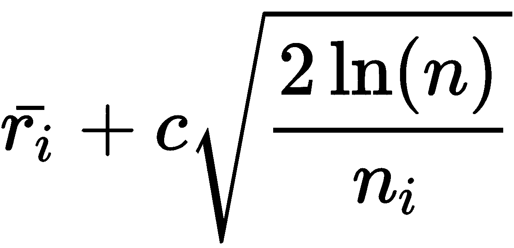

其中：

+   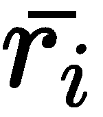：是选择步棋 的平均奖励（例如，胜率）

+   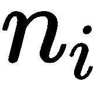：是算法选择步棋 的次数

+   ：是当前状态下所有已做步棋的总数（包括步棋 ）

+   ：是一个探索参数

下图展示了选择下一个节点的示例。在每个节点中，左边的数字代表节点的评分，右边的数字代表该节点的访问次数。节点的颜色表示轮到哪位玩家：

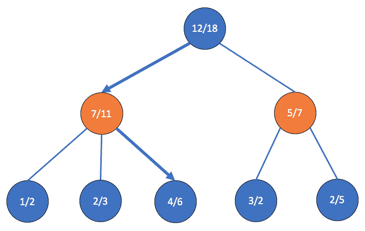

图 1：MCTS 中的选择

在选择过程中，算法会选择对前一个表达式具有最高价值的动作。细心的读者可能会注意到，虽然高平均奖励的动作  得到高度评价，但访问次数较少的动作  也同样如此。这是为什么呢？在 MCTS 中，我们不仅希望算法选择最有可能带来胜利的动作，还希望它尝试那些不常被选择的动作。这通常被称为开发与探索之间的平衡。如果算法仅仅依赖开发，那么结果树将会非常狭窄且经验不足。鼓励探索可以让算法从更广泛的经验和模拟中学习。在前面的例子中，我们简单地选择了评分为 7 的节点，然后是评分为 4 的节点。

# 扩展

我们应用选择方法来决定动作，直到算法无法再应用 UCT 来评估下一组动作。特别是，当某一状态的所有子节点没有记录（访问次数、平均奖励）时，我们就无法再应用 UCT。这时，MCTS 的第二阶段——扩展阶段就会发生。在这个阶段，我们简单地查看给定状态下所有可能的未访问子节点，并随机选择一个。然后，我们更新树结构以记录这个新的子节点。下图说明了这一过程：

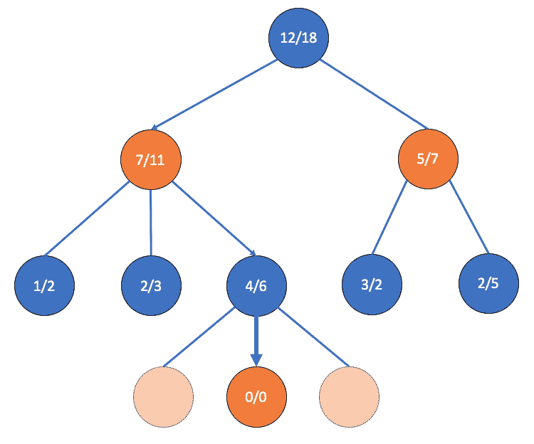

图 2：扩展

你可能会好奇，为什么在前面的图示中，我们初始化访问次数为零，而不是一。这个新节点的访问次数以及我们已经遍历过的节点的统计数据将在更新步骤中增加，这是 MCTS 迭代的最后一步。

# 模拟

扩展后，游戏的其余部分通过随机选择后续动作来进行。这也通常被称为**游戏展开（playout）**或**回滚（rollout）**。根据不同的游戏，可能会应用一些启发式方法来选择下一步动作。例如，在 DeepBlue 中，模拟依赖于手工制作的启发式方法来智能地选择下一步动作，而不是随机选择。这也被称为**重度回滚（heavy rollouts）**。虽然这种回滚提供了更真实的游戏体验，但它们通常计算开销较大，可能会减慢 MCTS 树的学习进程。

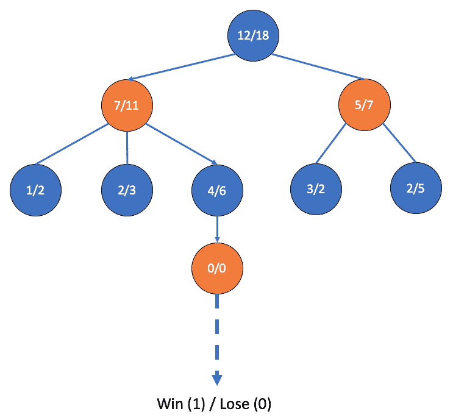

图 3：模拟

在我们前面的示例中，我们扩展一个节点并进行游戏，直到游戏结束（由虚线表示），最终得出胜利或失败的结果。模拟过程会产生奖励，在这个案例中，奖励为 1 或 0。

# 更新

最终，更新步骤发生在算法达到终止状态时，或者当任一玩家获胜或游戏以平局结束时。在这一轮迭代过程中，算法会更新每个访问过的节点/状态的平均奖励，并增加该状态的访问计数。这也被称为**反向传播**：

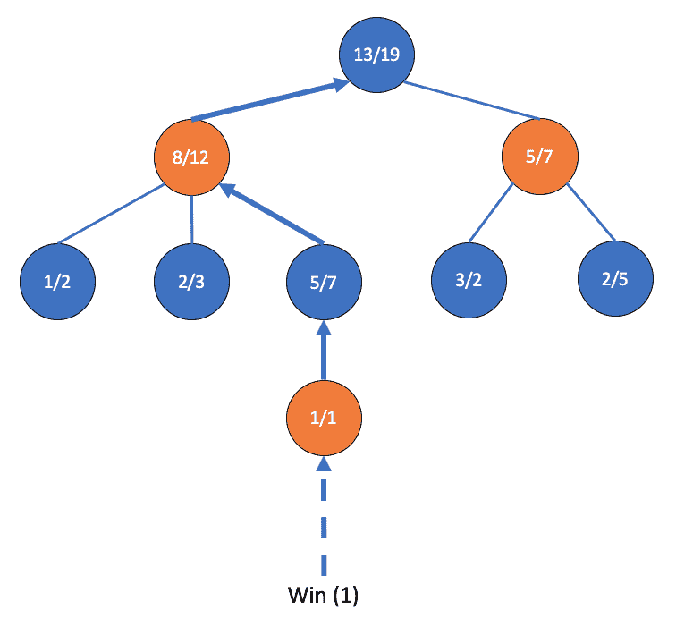

图 4：更新

在前面的图示中，由于我们到达了一个返回 1（胜利）的终止状态，因此我们会相应地为每个沿路径从根节点到达的节点增加访问计数和奖励。

这就是一次 MCTS 迭代中的四个步骤。正如蒙特卡洛方法的名字所示，我们会进行多次搜索，然后决定下一步走哪步。迭代次数是可配置的，通常取决于可用的时间或资源。随着时间的推移，树会学习出一种接近完美树的结构，进而可以用来引导智能体做出决策。

AlphaGo 和 AlphaGo Zero，DeepMind 的革命性围棋对弈智能体，依赖 MCTS 来选择棋步。在接下来的部分，我们将探讨这两种算法，了解它们如何将神经网络和 MCTS 结合起来，以超人的水平下围棋。

# AlphaGo

AlphaGo 的主要创新在于它如何将深度学习和蒙特卡洛树搜索相结合来下围棋。AlphaGo 架构由四个神经网络组成：一个小型的监督学习策略网络，一个大型的监督学习策略网络，一个强化学习策略网络和一个价值网络。我们训练这四个网络以及 MCTS 树。接下来的章节将详细介绍每个训练步骤。

# 监督学习策略网络

AlphaGo 训练的第一步涉及对两位职业选手下的围棋进行训练（在棋类游戏如国际象棋和围棋中，通常会记录历史比赛、棋盘状态和每一步棋的玩家动作）。主要思路是让 AlphaGo 学习并理解人类专家如何下围棋。更正式地说，给定一个棋盘状态，，和一组动作，，我们希望一个策略网络，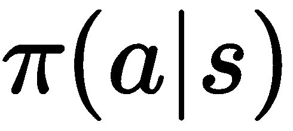，预测人类的下一步棋。数据由从 KGS 围棋服务器上 30,000,000 多场历史比赛中采样得到的棋盘状态对组成。网络的输入包括棋盘状态以及元数据。AlphaGo 有两个不同大小的监督学习策略网络。大型网络是一个 13 层的卷积神经网络，隐藏层使用 ReLU 激活函数，而较小的网络是一个单层的 softmax 网络。

为什么我们训练两个相似的网络？较大的策略网络初始化强化学习策略网络的权重，后者通过一种叫做**策略梯度**的 RL 方法进一步优化。较小的网络在 MCTS 的仿真步骤中使用。记住，虽然 MCTS 中的大多数仿真依赖于随机选择动作，但也可以利用轻度或重度启发式方法来进行更智能的仿真。较小的网络虽然缺乏较大监督网络的准确性，但推理速度更快，为回滚提供轻度启发式。

# 强化学习策略网络

一旦较大的监督学习策略网络训练完成，我们通过让 RL 策略网络与自己之前的版本进行对抗，进一步改进模型。网络的权重通过一种叫做**策略梯度**的方法进行更新，这是一种用于普通神经网络的梯度下降变种。从形式上来说，我们的 RL 策略网络的权重更新规则可以表示如下：

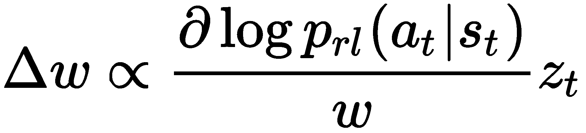

这里， 是 RL 策略网络的权重，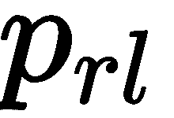，和 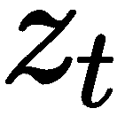 是在时间步  的预期奖励。奖励就是游戏的结果，胜利得 +1，失败得 -1。在这里，监督学习策略网络和强化学习策略网络的主要区别在于：前者的目标是最大化给定状态下选择某个特定动作的概率，换句话说，就是简单地模仿历史游戏中的动作。由于没有奖励函数，它并不关心游戏的最终结果。

另一方面，强化学习策略网络在更新权重时考虑了最终结果。更具体地说，它尝试最大化那些有助于获得更高奖励（即获胜动作）的动作的对数似然性。这是因为我们将对数似然的梯度与奖励（+1 或-1）相乘，从而决定了调整权重的方向。若某个动作不好，其权重会朝相反方向调整，因为我们可能会将梯度与-1 相乘。总结来说，网络不仅试图找出最可能的动作，还试图找出能够帮助它获胜的动作。根据 DeepMind 的论文，强化学习策略网络在与其监督学习对手及其他围棋程序（如 Pachi）对抗时，赢得了绝大多数（80%~85%）的比赛。

# 值网络

管道的最后一步涉及训练一个价值网络来评估棋盘状态，换句话说，就是确定某一特定棋盘状态对赢得游戏的有利程度。严格来说，给定特定的策略， 和状态，，我们希望预测预期奖励，。通过最小化**均方误差**（**MSE**）来训练网络，其中预测值，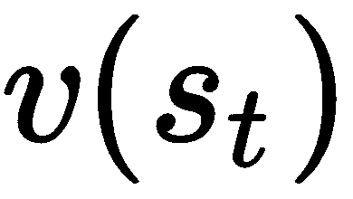，与最终结果之间的差异：

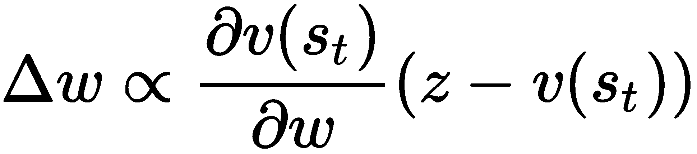

其中  是网络的参数。实际上，网络是在 30,000,000 对状态-奖励对上训练的，每一对都来自于一局独立的游戏。数据集是这样构建的，因为同一游戏中的棋盘状态可能高度相关，可能导致过拟合。

# 结合神经网络和蒙特卡洛树搜索（MCTS）

在 AlphaGo 中，策略网络和价值网络与 MCTS 相结合，在选择游戏中的行动时提供前瞻性搜索。之前，我们讨论了 MCTS 如何追踪每个节点的平均奖励和访问次数。在 AlphaGo 中，我们还需要追踪以下几个值：

+   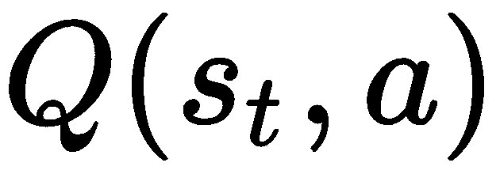：选择特定动作的平均行动价值

+   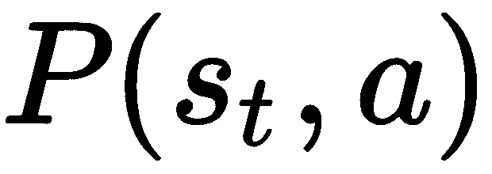：由较大的监督学习策略网络给定的特定棋盘状态下采取某个动作的概率

+   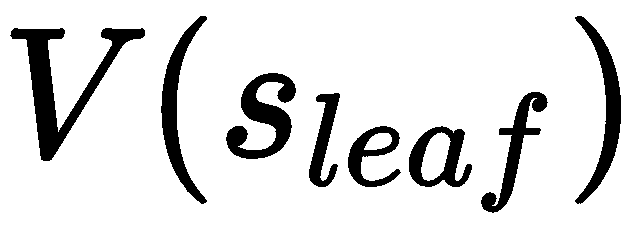：尚未探索的状态（叶节点）的价值评估

+   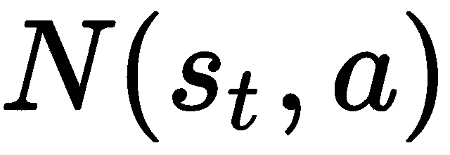：给定状态下选择特定动作的次数

在我们树搜索的单次模拟过程中，算法为给定的状态，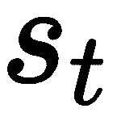，在特定的时间步，，选择一个动作，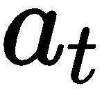，根据以下公式：

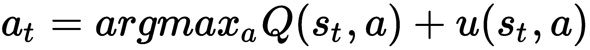

其中

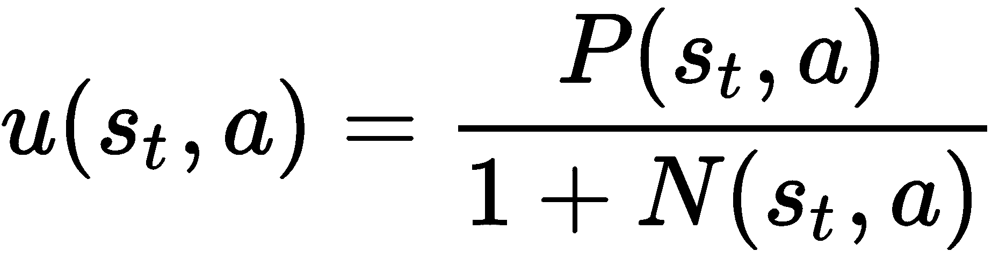

因此 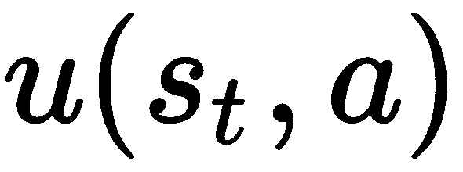 是一个值，偏向于由较大的策略网络判定为更可能的走法，但也通过惩罚那些被更频繁访问的走法来支持探索。

在扩展过程中，当我们没有给定棋盘状态和棋步的前置统计信息时，我们使用价值网络和模拟来评估叶子节点。特别地，我们对价值网络给出的预期值和模拟结果进行加权求和：

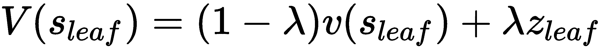

其中，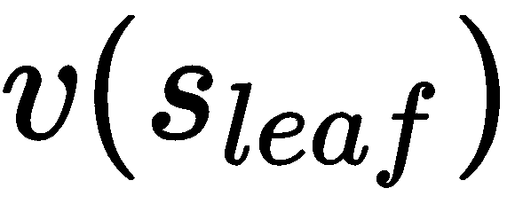 是价值网络的评估，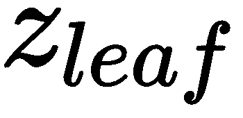 是搜索的最终奖励，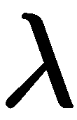 是通常称为混合参数的权重项。 是在展开后获得的，其中的模拟是通过使用较小且更快速的监督学习策略网络进行的。快速展开非常重要，尤其是在决策时间有限的情况下，因此需要较小的策略网络。

最后，在 MCTS 的更新步骤中，每个节点的访问计数会更新。此外，行动值通过计算所有包含给定节点的模拟的平均奖励来重新计算：

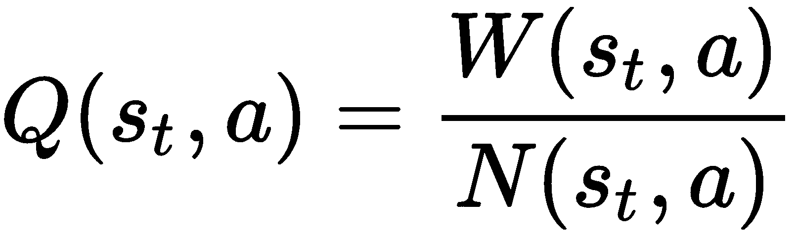

其中，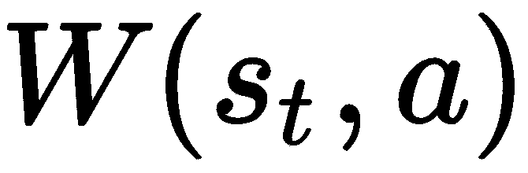 是在 轮次中 MCTS 所采取的总奖励， 是在节点  采取的行动。经过 MCTS 搜索后，模型在实际对弈时选择最常访问的棋步。

这就是 AlphaGo 的基本概述。虽然对其架构和方法论的深入讲解超出了本书的范围，但希望这能作为介绍 AlphaGo 工作原理的入门指南。

# AlphaGo Zero

在我们开始编写代码之前，我们将介绍 AlphaGo Zero，这一其前身的升级版。AlphaGo Zero 的主要特点解决了 AlphaGo 一些缺点，包括它对大量人类专家对弈数据的依赖。

AlphaGo Zero 和 AlphaGo 之间的主要区别如下：

+   AlphaGo Zero 完全通过自我对弈强化学习进行训练，这意味着它不依赖于任何人类生成的数据或监督，而这些通常用于训练 AlphaGo。

+   策略和价值网络合并为一个网络，并通过两个输出头表示，而不是两个独立的网络。

+   网络的输入是棋盘本身，作为图像输入，比如二维网格；该网络不依赖于启发式方法，而是直接使用原始的棋盘状态。

+   除了寻找最佳走法外，蒙特卡洛树搜索还用于策略迭代和评估；此外，AlphaGo Zero 在搜索过程中不进行展开。

# 训练 AlphaGo Zero

由于我们在训练或监督过程中不使用人类生成的数据，那么 AlphaGo Zero 是如何学习的呢？DeepMind 开发的这一新型强化学习算法涉及使用 MCTS 作为神经网络的教师，而该网络同时表示策略和价值函数。

特别地，MCTS 的输出包括 1）每次在模拟过程中选择移动的概率，，以及 2）游戏的最终结果，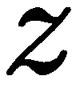。神经网络，，接受一个棋盘状态，，并输出一个元组，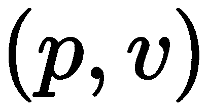，其中， 是一个表示移动概率的向量，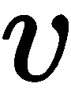 是的值。根据这些输出，我们希望训练我们的网络，使得网络的策略，，向由 MCTS 生成的策略，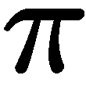，靠近，并且网络的值，，向最终结果，，靠近。请注意，在 MCTS 中，算法不进行滚动扩展，而是依赖于 来进行扩展，并模拟整个游戏直到结束。因此，在 MCTS 结束时，算法将策略从改进为，并能够作为的教师。网络的损失函数由两部分组成：一部分是与之间的交叉熵，另一部分是与之间的均方误差。这个联合损失函数如下所示：

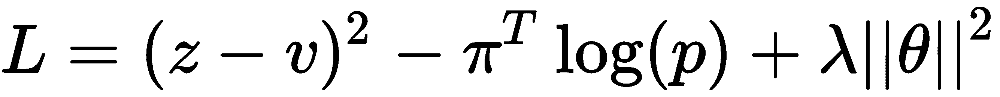

其中，是网络参数，是 L2 正则化的参数。

# 与 AlphaGo 的对比

根据 DeepMind 的论文，AlphaGo Zero 能在 36 小时内超越 AlphaGo，而后者则需要数月时间进行训练。在与击败李世石版本的 AlphaGo 进行的一对一比赛中，AlphaGo Zero 赢得了 100 场比赛中的 100 场。值得注意的是，尽管没有初始的人类监督，这个围棋程序能够更加高效地达到超越人类的水平，并发现人类在数千年的时间里通过数百万局游戏培养出的大量知识和智慧。

在接下来的章节中，我们将最终实现这个强大的算法。我们将在代码实现过程中涵盖 AlphaGo Zero 的其他技术细节。

# 实现 AlphaGo Zero

最后，我们将在这一部分实现 AlphaGo Zero。除了实现比 AlphaGo 更好的性能外，实际上它的实现相对容易一些。这是因为，如前所述，AlphaGo Zero 仅依赖`selfplay`数据进行学习，从而减轻了我们寻找大量历史数据的负担。此外，我们只需要实现一个神经网络，它既作为策略函数，也作为价值函数。以下实现做了一些进一步的简化——例如，我们假设围棋棋盘的大小是 9，而不是 19，以便加速训练。

我们实现的目录结构如下所示：

```py
alphago_zero/
|-- __init__.py
|-- config.py
|-- constants.py
|-- controller.py
|-- features.py
|-- go.py
|-- mcts.py
|-- alphagozero_agent.py
|-- network.py
|-- preprocessing.py
|-- train.py
`-- utils.py
```

我们将特别关注`network.py`和`mcts.py`，它们包含了双网络和 MCTS 算法的实现。此外，`alphagozero_agent.py`包含了将双网络与 MCTS 结合以创建围棋对弈代理的实现。

# 策略和价值网络

让我们开始实现双网络，我们将其称为`PolicyValueNetwork`。首先，我们将创建一些模块，其中包含我们的`PolicyValueNetwork`将使用的配置和常量。

# preprocessing.py

`preprocessing.py`模块主要处理从`TFRecords`文件的读取和写入，`TFRecords`是 TensorFlow 的原生数据表示文件格式。在训练 AlphaGo Zero 时，我们存储了 MCTS 自对弈结果和棋步。如前所述，这些数据成为`PolicyValueNetwork`学习的**真实数据**。`TFRecords`提供了一种方便的方式来保存来自 MCTS 的历史棋步和结果。当从磁盘读取这些数据时，`preprocessing.py`将`TFRecords`转换为`tf.train.Example`，这是一种内存中的数据表示，可以直接输入到`tf.estimator.Estimator`中。

`tf_records`通常以`*.tfrecord.zz`为文件名后缀。

以下函数用于从`TFRecords`文件中读取数据。我们首先将给定的`TFRecords`列表转换为`tf.data.TFRecordDataset`，这是在将其转换为`tf.train.Example`之前的中间表示：

```py
def process_tf_records(list_tf_records, shuffle_records=True,
                       buffer_size=GLOBAL_PARAMETER_STORE.SHUFFLE_BUFFER_SIZE,
                       batch_size=GLOBAL_PARAMETER_STORE.TRAIN_BATCH_SIZE):

    if shuffle_records:
        random.shuffle(list_tf_records)

    list_dataset = tf.data.Dataset.from_tensor_slices(list_tf_records)

    tensors_dataset = list_dataset.interleave(map_func=lambda x: tf.data.TFRecordDataset(x, compression_type='ZLIB'),
                                             cycle_length=GLOBAL_PARAMETER_STORE.CYCLE_LENGTH,
                                             block_length=GLOBAL_PARAMETER_STORE.BLOCK_LENGTH)
    tensors_dataset = tensors_dataset.repeat(1).shuffle(buffer_siz=buffer_size).batch(batch_size)

    return tensors_dataset
```

下一步是解析这个数据集，以便将数值输入到`PolicyValueNetwork`中。我们关心的有三个数值：输入，整个实现过程中我们称之为`x`或`board_state`，策略`pi`，以及输出结果`z`，这两个值都是由 MCTS 算法输出的：

```py
def parse_batch_tf_example(example_batch):
    features = {
        'x': tf.FixedLenFeature([], tf.string),
        'pi': tf.FixedLenFeature([], tf.string),
        'z': tf.FixedLenFeature([], tf.float32),
    }
    parsed_tensors = tf.parse_example(example_batch, features)

    # Get the board state
    x = tf.cast(tf.decode_raw(parsed_tensors['x'], tf.uint8), tf.float32)
    x = tf.reshape(x, [GLOBAL_PARAMETER_STORE.TRAIN_BATCH_SIZE, GOPARAMETERS.N,
                       GOPARAMETERS.N, FEATUREPARAMETERS.NUM_CHANNELS])

    # Get the policy target, which is the distribution of possible moves
    # Each target is a vector of length of board * length of board + 1
    distribution_of_moves = tf.decode_raw(parsed_tensors['pi'], tf.float32)
    distribution_of_moves = tf.reshape(distribution_of_moves,
                                       [GLOBAL_PARAMETER_STORE.TRAIN_BATCH_SIZE, GOPARAMETERS.N * GOPARAMETERS.N + 1])

    # Get the result of the game
    # The result is simply a scalar
    result_of_game = parsed_tensors['z']
    result_of_game.set_shape([GLOBAL_PARAMETER_STORE.TRAIN_BATCH_SIZE])

    return (x, {'pi_label': distribution_of_moves, 'z_label': result_of_game})
```

前面的两个函数将在以下函数中结合，构造要输入网络的输入张量：

```py
def get_input_tensors(list_tf_records, buffer_size=GLOBAL_PARAMETER_STORE.SHUFFLE_BUFFER_SIZE):
    logger.info("Getting input data and tensors")
    dataset = process_tf_records(list_tf_records=list_tf_records,
                                 buffer_size=buffer_size)
    dataset = dataset.filter(lambda input_tensor: tf.equal(tf.shape(input_tensor)[0],
                                                           GLOBAL_PARAMETER_STORE.TRAIN_BATCH_SIZE))
    dataset = dataset.map(parse_batch_tf_example)
    logger.info("Finished parsing")
    return dataset.make_one_shot_iterator().get_next()
```

最后，以下函数用于将自对弈结果写入磁盘：

```py
def create_dataset_from_selfplay(data_extracts):
    return (create_tf_train_example(extract_features(board_state), pi, result)
            for board_state, pi, result in data_extracts)

def shuffle_tf_examples(batch_size, records_to_shuffle):
    tf_dataset = process_tf_records(records_to_shuffle, batch_size=batch_size)
    iterator = tf_dataset.make_one_shot_iterator()
    next_dataset_batch = iterator.get_next()
    sess = tf.Session()
    while True:
        try:
            result = sess.run(next_dataset_batch)
            yield list(result)
        except tf.errors.OutOfRangeError:
            break

def create_tf_train_example(board_state, pi, result):
    board_state_as_tf_feature = tf.train.Feature(bytes_list=tf.train.BytesList(value=[board_state.tostring()]))
    pi_as_tf_feature = tf.train.Feature(bytes_list=tf.train.BytesList(value=[pi.tostring()]))
    value_as_tf_feature = tf.train.Feature(float_list=tf.train.FloatList(value=[result]))

    tf_example = tf.train.Example(features=tf.train.Features(feature={
        'x': board_state_as_tf_feature,
        'pi': pi_as_tf_feature,
        'z': value_as_tf_feature
    }))

    return tf_example

def write_tf_examples(record_path, tf_examples, serialize=True):
    with tf.python_io.TFRecordWriter(record_path, options=TF_RECORD_CONFIG) as tf_record_writer:
        for tf_example in tf_examples:
            if serialize:
                tf_record_writer.write(tf_example.SerializeToString())
            else:
                tf_record_writer.write(tf_example)
```

这些函数中的一些将在后续生成自对弈结果的训练数据时使用。

# features.py

该模块包含将围棋棋盘表示转化为适当 TensorFlow 张量的辅助代码，这些张量可以提供给`PolicyValueNetwork`。主要功能`extract_features`接收`board_state`（即围棋棋盘的表示），并将其转换为形状为`[batch_size, N, N, 17]`的张量，其中`N`是棋盘的形状（默认为`9`），`17`是特征通道的数量，表示过去的着棋和当前要下的颜色：

```py
import numpy as np

from config import GOPARAMETERS

def stone_features(board_state):
    # 16 planes, where every other plane represents the stones of a particular color
    # which means we track the stones of the last 8 moves.
    features = np.zeros([16, GOPARAMETERS.N, GOPARAMETERS.N], dtype=np.uint8)

    num_deltas_avail = board_state.board_deltas.shape[0]
    cumulative_deltas = np.cumsum(board_state.board_deltas, axis=0)
    last_eight = np.tile(board_state.board, [8, 1, 1])
    last_eight[1:num_deltas_avail + 1] -= cumulative_deltas
    last_eight[num_deltas_avail +1:] = last_eight[num_deltas_avail].reshape(1, GOPARAMETERS.N, GOPARAMETERS.N)

    features[::2] = last_eight == board_state.to_play
    features[1::2] = last_eight == -board_state.to_play
    return np.rollaxis(features, 0, 3)

def color_to_play_feature(board_state):
    # 1 plane representing which color is to play
    # The plane is filled with 1's if the color to play is black; 0's otherwise
    if board_state.to_play == GOPARAMETERS.BLACK:
        return np.ones([GOPARAMETERS.N, GOPARAMETERS.N, 1], dtype=np.uint8)
    else:
        return np.zeros([GOPARAMETERS.N, GOPARAMETERS.N, 1], dtype=np.uint8)

def extract_features(board_state):
    stone_feat = stone_features(board_state=board_state)
    turn_feat = color_to_play_feature(board_state=board_state)
    all_features = np.concatenate([stone_feat, turn_feat], axis=2)
    return all_features
```

`extract_features`函数将被`preprocessing.py`和`network.py`模块使用，以构建特征张量，这些张量要么写入`TFRecord`文件，要么输入到神经网络中。

# network.py

本文件包含我们对`PolicyValueNetwork`的实现。简而言之，我们构建一个`tf.estimator.Estimator`，该估算器使用围棋棋盘状态、策略和通过 MCTS 自对弈生成的自对弈结果进行训练。该网络有两个头：一个作为价值函数，另一个作为策略网络。

首先，我们定义一些将被`PolicyValueNetwork`使用的层：

```py
import functools
import logging
import os.path

import tensorflow as tf

import features
import preprocessing
import utils
from config import GLOBAL_PARAMETER_STORE, GOPARAMETERS
from constants import *

logger = logging.getLogger(__name__)
logger.setLevel(logging.INFO)

def create_partial_bn_layer(params):
    return functools.partial(tf.layers.batch_normalization,
        momentum=params["momentum"],
        epsilon=params["epsilon"],
        fused=params["fused"],
        center=params["center"],
        scale=params["scale"],
        training=params["training"]
    )

def create_partial_res_layer(inputs, partial_bn_layer, partial_conv2d_layer):
    output_1 = partial_bn_layer(partial_conv2d_layer(inputs))
    output_2 = tf.nn.relu(output_1)
    output_3 = partial_bn_layer(partial_conv2d_layer(output_2))
    output_4 = tf.nn.relu(tf.add(inputs, output_3))
    return output_4

def softmax_cross_entropy_loss(logits, labels):
 return tf.reduce_mean(tf.nn.softmax_cross_entropy_with_logits(logits=logits, labels=labels['pi_label']))

def mean_squared_loss(output_value, labels):
 return tf.reduce_mean(tf.square(output_value - labels['z_label']))

def get_losses(logits, output_value, labels):
 ce_loss = softmax_cross_entropy_loss(logits, labels)
 mse_loss = mean_squared_loss(output_value, labels)
 return ce_loss, mse_loss

def create_metric_ops(labels, output_policy, loss_policy, loss_value, loss_l2, loss_total):
 return {'accuracy': tf.metrics.accuracy(labels=labels['pi_label'], predictions=output_policy, name='accuracy'),
 'loss_policy': tf.metrics.mean(loss_policy),
 'loss_value': tf.metrics.mean(loss_value),
 'loss_l2': tf.metrics.mean(loss_l2),
 'loss_total': tf.metrics.mean(loss_total)}
```

接下来，我们有一个函数，用于创建`tf.estimator.Estimator`。虽然 TensorFlow 提供了几个预构建的估算器，如`tf.estimator.DNNClassifier`，但我们的架构相当独特，这就是我们需要构建自己的`Estimator`的原因。这可以通过创建`tf.estimator.EstimatorSpec`来完成，它是一个骨架类，我们可以在其中定义输出张量、网络架构、损失函数和评估度量等：

```py
def generate_network_specifications(features, labels, mode, params, config=None):
 batch_norm_params = {"epsilon": 1e-5, "fused": True, "center": True, "scale": True, "momentum": 0.997,
 "training": mode==tf.estimator.ModeKeys.TRAIN
 }
```

我们的`generate_network_specifications`函数接收多个输入：

+   `features`：围棋棋盘的张量表示（形状为`[batch_size, 9, 9, 17]`）

+   `labels`：我们的`pi`和`z`张量

+   `mode`：在这里，我们可以指定我们的网络是处于训练模式还是测试模式

+   `params`：指定网络结构的附加参数（例如，卷积滤波器大小）

然后我们实现网络的共享部分，策略输出头、价值输出头以及损失函数：

```py
with tf.name_scope("shared_layers"):
    partial_bn_layer = create_partial_bn_layer(batch_norm_params)
    partial_conv2d_layer = functools.partial(tf.layers.conv2d,
        filters=params[HYPERPARAMS.NUM_FILTERS], kernel_size=[3, 3], padding="same")
    partial_res_layer = functools.partial(create_partial_res_layer, batch_norm=partial_bn_layer,
                                          conv2d=partial_conv2d_layer)

    output_shared = tf.nn.relu(partial_bn_layer(partial_conv2d_layer(features)))

    for i in range(params[HYPERPARAMS.NUMSHAREDLAYERS]):
        output_shared = partial_res_layer(output_shared)

# Implement the policy network
with tf.name_scope("policy_network"):
    conv_p_output = tf.nn.relu(partial_bn_layer(partial_conv2d_layer(output_shared, filters=2,
                                                                          kernel_size=[1, 1]),
                                                                          center=False, scale=False))
    logits = tf.layers.dense(tf.reshape(conv_p_output, [-1, GOPARAMETERS.N * GOPARAMETERS.N * 2]),
                             units=GOPARAMETERS.N * GOPARAMETERS.N + 1)
    output_policy = tf.nn.softmax(logits,
                                  name='policy_output')

# Implement the value network
with tf.name_scope("value_network"):
    conv_v_output = tf.nn.relu(partial_bn_layer(partial_conv2d_layer(output_shared, filters=1, kernel_size=[1, 1]),
        center=False, scale=False))
    fc_v_output = tf.nn.relu(tf.layers.dense(
        tf.reshape(conv_v_output, [-1, GOPARAMETERS.N * GOPARAMETERS.N]),
        params[HYPERPARAMS.FC_WIDTH]))
    fc_v_output = tf.layers.dense(fc_v_output, 1)
    fc_v_output = tf.reshape(fc_v_output, [-1])
    output_value = tf.nn.tanh(fc_v_output, name='value_output')

# Implement the loss functions
with tf.name_scope("loss_functions"):
    loss_policy, loss_value = get_losses(logits=logits,
                                         output_value=output_value,
                                         labels=labels)
    loss_l2 = params[HYPERPARAMS.BETA] * tf.add_n([tf.nn.l2_loss(v)
        for v in tf.trainable_variables() if not 'bias' in v.name])
    loss_total = loss_policy + loss_value + loss_l2
```

然后我们指定优化算法。这里，我们使用`tf.train.MomentumOptimizer`。我们还会在训练过程中调整学习率；由于一旦创建了`Estimator`我们不能直接更改学习率，因此我们将学习率更新转化为 TensorFlow 操作。我们还将多个度量记录到 TensorBoard 中：

```py
# Steps and operations for training
global_step = tf.train.get_or_create_global_step()

learning_rate = tf.train.piecewise_constant(global_step, GLOBAL_PARAMETER_STORE.BOUNDARIES,
                                            GLOBAL_PARAMETER_STORE.LEARNING_RATE)

update_ops = tf.get_collection(tf.GraphKeys.UPDATE_OPS)

with tf.control_dependencies(update_ops):
    train_op = tf.train.MomentumOptimizer(learning_rate,
                params[HYPERPARAMS.MOMENTUM]).minimize(loss_total, global_step=global_step)

metric_ops = create_metric_ops(labels=labels,
                               output_policy=output_policy,
                               loss_policy=loss_policy,
                               loss_value=loss_value,
                               loss_l2=loss_l2,
                               loss_total=loss_total)

for metric_name, metric_op in metric_ops.items():
    tf.summary.scalar(metric_name, metric_op[1])
```

最后，我们创建一个`tf.estimator.EstimatorSpec`对象并返回。创建时我们需要指定几个参数：

+   `mode`：训练模式或测试模式，如前所述。

+   `predictions`：一个字典，将字符串（名称）映射到网络的输出操作。注意，我们可以指定多个输出操作。

+   `loss`：损失函数操作。

+   `train_op`：优化操作。

+   `eval_metrics_op`：运行以存储多个度量的操作，如损失、准确率和变量权重值。

对于`predictions`参数，我们提供政策网络和值网络的输出：

```py
return tf.estimator.EstimatorSpec(
    mode=mode,
    predictions={
        'policy_output': output_policy,
        'value_output': output_value,
    },
    loss=loss_total,
    train_op=train_op,
    eval_metric_ops=metric_ops,
)
```

在训练 AlphaGo Zero 的第一步中，我们必须用随机权重初始化模型。以下函数实现了这一点：

```py
def initialize_random_model(estimator_dir, **kwargs):
    sess = tf.Session(graph=tf.Graph())
    params = utils.parse_parameters(**kwargs)
    initial_model_path = os.path.join(estimator_dir, PATHS.INITIAL_CHECKPOINT_NAME)

    # Create the first model, where all we do is initialize random weights and immediately write them to disk
    with sess.graph.as_default():
        features, labels = get_inference_input()
        generate_network_specifications(features, labels, tf.estimator.ModeKeys.PREDICT, params)
        sess.run(tf.global_variables_initializer())
        tf.train.Saver().save(sess, initial_model_path)
```

我们使用以下函数根据给定的一组参数创建`tf.estimator.Estimator`对象：

```py
def get_estimator(estimator_dir, **kwargs):
    params = utils.parse_parameters(**kwargs)
    return tf.estimator.Estimator(generate_network_specifications, model_dir=estimator_dir, params=params)
```

`tf.estimator.Estimator`期望一个提供`tf.estimator.EstimatorSpec`的函数，这就是我们的`generate_network_specifications`函数。这里，`estimator_dir`指的是存储我们网络检查点的目录。通过提供此参数，我们的`tf.estimator.Estimator`对象可以加载之前训练迭代的权重。

我们还实现了用于训练和验证模型的函数：

```py
def train(estimator_dir, tf_records, model_version, **kwargs):
    """
    Main training function for the PolicyValueNetwork
    Args:
        estimator_dir (str): Path to the estimator directory
        tf_records (list): A list of TFRecords from which we parse the training examples
        model_version (int): The version of the model
    """
    model = get_estimator(estimator_dir, **kwargs)
    logger.info("Training model version: {}".format(model_version))
    max_steps = model_version * GLOBAL_PARAMETER_STORE.EXAMPLES_PER_GENERATION // \
                GLOBAL_PARAMETER_STORE.TRAIN_BATCH_SIZE
    model.train(input_fn=lambda: preprocessing.get_input_tensors(list_tf_records=tf_records),
                max_steps=max_steps)
    logger.info("Trained model version: {}".format(model_version))

def validate(estimator_dir, tf_records, checkpoint_path=None, **kwargs):
    model = get_estimator(estimator_dir, **kwargs)
    if checkpoint_path is None:
        checkpoint_path = model.latest_checkpoint()
    model.evaluate(input_fn=lambda: preprocessing.get_input_tensors(
        list_tf_records=tf_records,
        buffer_size=GLOBAL_PARAMETER_STORE.VALIDATION_BUFFER_SIZE),
                   steps=GLOBAL_PARAMETER_STORE.VALIDATION_NUMBER_OF_STEPS,
                   checkpoint_path=checkpoint_path)
```

`tf.estimator.Estimator.train`函数期望一个提供训练数据批次的函数（`input_fn`）。`input_data`使用我们在`preprocessing.py`模块中的`get_input_tensors`函数解析`TFRecords`数据并将其转化为输入张量。`tf.estimator.Estimator.evaluate`函数也期望相同的输入函数。

最后，我们将估算器封装到我们的`PolicyValueNetwork`中。这个类使用网络的路径（`model_path`）并加载其权重。它使用该网络来预测给定棋盘状态的价值和最可能的下一步棋：

```py
class PolicyValueNetwork():

    def __init__(self, model_path, **kwargs):
        self.model_path = model_path
        self.params = utils.parse_parameters(**kwargs)
        self.build_network()

    def build_session(self):
        config = tf.ConfigProto()
        config.gpu_options.allow_growth = True
        return tf.Session(graph=tf.Graph(), config=config)

    def build_network(self):
        self.sess = self.build_session()

        with self.sess.graph.as_default():
            features, labels = get_inference_input()
            model_spec = generate_network_specifications(features, labels,
                                                         tf.estimator.ModeKeys.PREDICT, self.params)
            self.inference_input = features
            self.inference_output = model_spec.predictions
            if self.model_path is not None:
                self.load_network_weights(self.model_path)
            else:
                self.sess.run(tf.global_variables_initializer())

    def load_network_weights(self, save_file):
        tf.train.Saver().restore(self.sess, save_file)
```

传递给构造函数的`model_path`参数是模型特定版本的目录。当此参数为`None`时，我们初始化随机权重。以下函数用于预测下一步动作的概率和给定棋盘状态的价值：

```py
def predict_on_single_board_state(self, position):
    probs, values = self.predict_on_multiple_board_states([position])
    prob = probs[0]
    value = values[0]
    return prob, value

def predict_on_multiple_board_states(self, positions):
    symmetries, processed = utils.shuffle_feature_symmetries(list(map(features.extract_features, positions)))
    network_outputs = self.sess.run(self.inference_output, feed_dict={self.inference_input: processed})
    action_probs, value_pred = network_outputs['policy_output'], network_outputs['value_output']
    action_probs = utils.invert_policy_symmetries(symmetries, action_probs)
    return action_probs, value_pred
```

请检查 GitHub 仓库，以获取该模块的完整实现。

# 蒙特卡洛树搜索（Monte Carlo tree search）

我们的 AlphaGo Zero 代理的第二个组件是 MCTS 算法。在我们的`mcts.py`模块中，我们实现了一个`MCTreeSearchNode`类，该类表示 MCTS 树中每个节点在搜索过程中的状态。然后，该类被`alphagozero_agent.py`中实现的代理使用，利用我们刚才实现的`PolicyValueNetwork`来执行 MCTS。

# mcts.py

`mcts.py`包含了我们对蒙特卡洛树搜索的实现。我们的第一个类是`RootNode`，它用于表示模拟开始时 MCTS 树的根节点。根据定义，根节点没有父节点。为根节点创建一个单独的类并非绝对必要，但这样可以使代码更清晰：

```py
import collections
import math

import numpy as np

import utils
from config import MCTSPARAMETERS, GOPARAMETERS

class RootNode(object):

    def __init__(self):
        self.parent_node = None
        self.child_visit_counts = collections.defaultdict(float)
        self.child_cumulative_rewards = collections.defaultdict(float)
```

接下来，我们实现`MCTreeSearchNode`类。该类具有多个属性，其中最重要的几个如下：

+   `parent_node`: 父节点

+   `previous_move`: 导致此节点棋盘状态的上一步棋

+   `board_state`: 当前棋盘状态

+   `is_visited`: 是否展开了叶子（子节点）；当节点初始化时，这个值为`False`。

+   `child_visit_counts`: 一个`numpy.ndarray`，表示每个子节点的访问次数

+   `child_cumulative_rewards`: 一个`numpy.ndarray`，表示每个子节点的累计奖励

+   `children_moves`: 子节点走法的字典

我们还定义了一些参数，比如 `loss_counter`、`original_prior` 和 `child_prior`。这些与 AlphaGo Zero 实现的高级 MCTS 技术相关，例如并行搜索过程以及向搜索中加入噪声。为了简洁起见，我们不会详细讨论这些技术，因此现在可以忽略它们。

这是 `MCTreeSearchNode` 类的 `__init__` 函数：

```py
class MCTreeSearchNode(object):

    def __init__(self, board_state, previous_move=None, parent_node=None):
        """
        A node of a MCTS tree. It is primarily responsible with keeping track of its children's scores
        and other statistics such as visit count. It also makes decisions about where to move next.

        board_state (go.BoardState): The Go board
        fmove (int): A number which represents the coordinate of the move that led to this board state. None if pass
        parent (MCTreeSearchNode): The parent node
        """
        if parent_node is None:
            parent_node = RootNode()
        self.parent_node = parent_node
        self.previous_move = previous_move
        self.board_state = board_state
        self.is_visited = False
        self.loss_counter = 0
        self.illegal_moves = 1000 * (1 - self.board_state.enumerate_possible_moves())
        self.child_visit_counts = np.zeros([GOPARAMETERS.N * GOPARAMETERS.N + 1], dtype=np.float32)
        self.child_cumulative_rewards = np.zeros([GOPARAMETERS.N * GOPARAMETERS.N + 1], dtype=np.float32)
        self.original_prior = np.zeros([GOPARAMETERS.N * GOPARAMETERS.N + 1], dtype=np.float32)
        self.child_prior = np.zeros([GOPARAMETERS.N * GOPARAMETERS.N + 1], dtype=np.float32)
        self.children_moves = {}
```

每个节点会跟踪每个子节点的平均奖励和动作值。我们将这些设置为属性：

```py
@property
def child_action_score(self):
    return self.child_mean_rewards * self.board_state.to_play + self.child_node_scores - self.illegal_moves

@property
def child_mean_rewards(self):
    return self.child_cumulative_rewards / (1 + self.child_visit_counts)

@property
def child_node_scores(self):
    # This scores each child according to the UCT scoring system
    return (MCTSPARAMETERS.c_PUCT * math.sqrt(1 + self.node_visit_count) * self.child_prior / 
            (1 + self.child_visit_counts))
```

当然，我们还会跟踪节点自身的动作值、访问次数和累积奖励。请记住，`child_mean_rewards` 是平均奖励，`child_visit_counts` 是子节点被访问的次数，`child_cumulative_rewards` 是节点的总奖励。我们通过添加 `@property` 和 `@*.setter` 装饰器为每个属性实现 getter 和 setter 方法：

```py
@property
def node_mean_reward(self):
    return self.node_cumulative_reward / (1 + self.node_visit_count)

@property
def node_visit_count(self):
    return self.parent_node.child_visit_counts[self.previous_move]

@node_visit_count.setter
def node_visit_count(self, value):
    self.parent_node.child_visit_counts[self.previous_move] = value

@property
def node_cumulative_reward(self):
    return self.parent_node.child_cumulative_rewards[self.previous_move]

@node_cumulative_reward.setter
def node_cumulative_reward(self, value):
    self.parent_node.child_cumulative_rewards[self.previous_move] = value

@property
def mean_reward_perspective(self):
    return self.node_mean_reward * self.board_state.to_play
```

在 MCTS 的选择步骤中，算法会选择具有最大动作值的子节点。这可以通过对子节点动作得分矩阵调用 `np.argmax` 来轻松完成：

```py
def choose_next_child_node(self):
    current = self
    pass_move = GOPARAMETERS.N * GOPARAMETERS.N
    while True:
        current.node_visit_count += 1
        # We stop searching when we reach a new leaf node
        if not current.is_visited:
            break
        if (current.board_state.recent
            and current.board_state.recent[-1].move is None
                and current.child_visit_counts[pass_move] == 0):
            current = current.record_child_node(pass_move)
            continue

        best_move = np.argmax(current.child_action_score)
        current = current.record_child_node(best_move)
    return current

def record_child_node(self, next_coordinate):
    if next_coordinate not in self.children_moves:
        new_board_state = self.board_state.play_move(
            utils.from_flat(next_coordinate))
        self.children_moves[next_coordinate] = MCTreeSearchNode(
            new_board_state, previous_move=next_coordinate, parent_node=self)
    return self.children_moves[next_coordinate]
```

正如我们在讨论 AlphaGo Zero 部分中提到的，`PolicyValueNetwork` 用于在 MCTS 迭代中进行模拟。同样，网络的输出是节点的概率和预测值，然后我们将其反映在 MCTS 树中。特别地，预测值通过 `back_propagate_result` 函数在树中传播：

```py
def incorporate_results(self, move_probabilities, result, start_node):
    if self.is_visited:
        self.revert_visits(start_node=start_node)
        return
    self.is_visited = True
    self.original_prior = self.child_prior = move_probabilities
    self.child_cumulative_rewards = np.ones([GOPARAMETERS.N * GOPARAMETERS.N + 1], dtype=np.float32) * result
    self.back_propagate_result(result, start_node=start_node)

def back_propagate_result(self, result, start_node):
    """
    This function back propagates the result of a match all the way to where the search started from

    Args:
        result (int): the result of the search (1: black, -1: white won)
        start_node (MCTreeSearchNode): the node to back propagate until
    """
    # Keep track of the cumulative reward in this node
    self.node_cumulative_reward += result

    if self.parent_node is None or self is start_node:
        return

    self.parent_node.back_propagate_result(result, start_node)
```

请参考 GitHub 仓库，查看我们 `MCTreeSearchNode` 类及其函数的完整实现。

# 结合 PolicyValueNetwork 和 MCTS

我们将 `PolicyValueNetwork` 和 MCTS 实现结合在 `alphagozero_agent.py` 中。该模块实现了 `AlphaGoZeroAgent`，它是主要的 AlphaGo Zero 代理，使用 `PolicyValueNetwork` 进行 MCTS 搜索和推理，以进行游戏。

# alphagozero_agent.py

最后，我们实现了一个代理，作为围棋游戏和算法之间的接口。我们将实现的主要类是 `AlphaGoZeroAgent`。同样，这个类将 `PolicyValueNetwork` 与我们的 MCTS 模块结合，正如 AlphaGo Zero 中所做的那样，用于选择走法并模拟游戏。请注意，任何缺失的模块（例如，`go.py`，它实现了围棋本身）可以在主 GitHub 仓库中找到：

```py
import logging
import os
import random
import time

import numpy as np

import go
import utils
from config import GLOBAL_PARAMETER_STORE, GOPARAMETERS
from mcts import MCTreeSearchNode
from utils import make_sgf

logger = logging.getLogger(__name__)

class AlphaGoZeroAgent:

    def __init__(self, network, player_v_player=False, workers=GLOBAL_PARAMETER_STORE.SIMULTANEOUS_LEAVES):
        self.network = network
        self.player_v_player = player_v_player
        self.workers = workers
        self.mean_reward_store = []
        self.game_description_store = []
        self.child_probability_store = []
        self.root = None
        self.result = 0
        self.logging_buffer = None
        self.conduct_exploration = True
        if self.player_v_player:
            self.conduct_exploration = True
        else:
            self.conduct_exploration = False
```

我们通过初始化我们的代理和游戏本身来开始围棋游戏。这是通过 `initialize_game` 方法完成的，该方法初始化了 `MCTreeSearchNode` 和用于跟踪网络输出的走法概率和动作值的缓冲区：

```py
def initialize_game(self, board_state=None):
    if board_state is None:
        board_state = go.BoardState()
    self.root = MCTreeSearchNode(board_state)
    self.result = 0
    self.logging_buffer = None
    self.game_description_store = []
    self.child_probability_store = []
    self.mean_reward_store = []
```

在每一回合中，我们的代理会进行 MCTS 并使用 `select_move` 函数选择一个走法。注意，在游戏的早期阶段，我们允许一定的探索，通过选择一个随机节点来进行。

`play_move(coordinates)` 方法接受由 `select_move` 返回的坐标，并更新 MCTS 树和棋盘状态：

```py
def play_move(self, coordinates):
    if not self.player_v_player:
       self.child_probability_store.append(self.root.get_children_as_probability_distributions())
    self.mean_reward_store.append(self.root.node_mean_reward)
    self.game_description_store.append(self.root.describe())
    self.root = self.root.record_child_node(utils.to_flat(coordinates))
    self.board_state = self.root.board_state
    del self.root.parent_node.children_moves
    return True

def select_move(self):
    # If we have conducted enough moves and this is single player mode, we turn off exploration
    if self.root.board_state.n > GLOBAL_PARAMETER_STORE.TEMPERATURE_CUTOFF and not self.player_v_player:
        self.conduct_exploration = False

    if self.conduct_exploration:
        child_visits_cum_sum = self.root.child_visit_counts.cumsum()
        child_visits_cum_sum /= child_visits_cum_sum[-1]
        coorindate = child_visits_cum_sum.searchsorted(random.random())
    else:
        coorindate = np.argmax(self.root.child_visit_counts)

    return utils.from_flat(coorindate)
```

这些函数被封装在`search_tree`方法中，该方法使用网络进行 MCTS 迭代，以选择下一步棋：

```py
def search_tree(self):
    child_node_store = []
    iteration_count = 0
    while len(child_node_store) < self.workers and iteration_count < self.workers * 2:
        iteration_count += 1
        child_node = self.root.choose_next_child_node()
        if child_node.is_done():
            result = 1 if child_node.board_state.score() > 0 else -1
            child_node.back_propagate_result(result, start_node=self.root)
            continue
        child_node.propagate_loss(start_node=self.root)
        child_node_store.append(child_node)
    if len(child_node_store) > 0:
        move_probs, values = self.network.predict_on_multiple_board_states(
            [child_node.board_state for child_node in child_node_store])
        for child_node, move_prob, result in zip(child_node_store, move_probs, values):
            child_node.revert_loss(start_node=self.root)
            child_node.incorporate_results(move_prob, result, start_node=self.root)
```

注意，一旦我们拥有叶子节点（在这些节点上无法根据访问次数选择节点），我们使用`PolicyValueNetwork.predict_on_multiple_board_states(board_states)`函数输出每个叶子节点的下一步概率和价值。然后，使用这个`AlphaGoZeroAgent`来进行与另一个网络的对弈或与自身的自对弈。我们为每种情况实现了独立的函数。对于`play_match`，我们首先为黑白棋子各初始化一个代理：

```py
def play_match(black_net, white_net, games, readouts, sgf_dir):

    # Create the players for the game
    black = AlphaGoZeroAgent(black_net, player_v_player=True, workers=GLOBAL_PARAMETER_STORE.SIMULTANEOUS_LEAVES)
    white = AlphaGoZeroAgent(white_net, player_v_player=True, workers=GLOBAL_PARAMETER_STORE.SIMULTANEOUS_LEAVES)

    black_name = os.path.basename(black_net.model_path)
    white_name = os.path.basename(white_net.model_path)
```

在游戏中，我们跟踪每一步的着棋数量，这也帮助我们判断当前轮到哪个代理。每当代理轮到时，我们使用 MCTS 和网络来选择下一步棋：

```py
for game_num in range(games):
    # Keep track of the number of moves made in the game
    num_moves = 0

    black.initialize_game()
    white.initialize_game()

    while True:
        start = time.time()
        active = white if num_moves % 2 else black
        inactive = black if num_moves % 2 else white

        current_readouts = active.root.node_visit_count
        while active.root.node_visit_count < current_readouts + readouts:
            active.search_tree()
```

一旦树搜索完成，我们查看代理是否已投降或游戏是否已通过其他方式结束。如果是，我们记录结果并结束游戏：

```py
logger.info(active.root.board_state)

# Check whether a player should resign
if active.should_resign():
    active.set_result(-1 * active.root.board_state.to_play, was_resign=True)
    inactive.set_result(active.root.board_state.to_play, was_resign=True)

if active.is_done():
    sgf_file_path = "{}-{}-vs-{}-{}.sgf".format(int(time.time()), white_name, black_name, game_num)
    with open(os.path.join(sgf_dir, sgf_file_path), 'w') as fp:
        game_as_sgf_string = make_sgf(active.board_state.recent, active.logging_buffer,
                          black_name=black_name,
                          white_name=white_name)
        fp.write(game_as_sgf_string)
    print("Game Over", game_num, active.logging_buffer)
    break

move = active.select_move()
active.play_move(move)
inactive.play_move(move)
```

`make_sgf`方法将游戏结果写入一种在其他围棋 AI 和计算机程序中常用的格式。换句话说，这个模块的输出与其他围棋软件兼容！虽然我们不会深入技术细节，但这将帮助您创建一个可以与其他代理甚至人类玩家对弈的围棋机器人。

**SGF**代表**智能棋局格式**，是一种流行的存储围棋等棋类游戏结果的格式。您可以在此了解更多信息：[`senseis.xmp.net/?SmartGameFormat`](https://senseis.xmp.net/?SmartGameFormat)。

`play_against_self()`用于训练中的自对弈模拟，而`play_match()`则用于将最新模型与早期版本进行对比评估。同样，关于模块的完整实现，请参考代码库。

# 将一切整合在一起

现在我们已经实现了 AlphaGo Zero 的两个主要组件——`PolicyValueNetwork`和 MCTS 算法——我们可以构建处理训练的控制器。在训练过程的最开始，我们用随机权重初始化一个模型。接下来，我们生成 100 个自对弈游戏。其中 5%的游戏及其结果会用于验证，其余的则用于训练网络。在首次初始化和自对弈迭代之后，我们基本上会循环执行以下步骤：

1.  生成自对弈数据

1.  整理自对弈数据以创建`TFRecords`

1.  使用整理后的自对弈数据训练网络

1.  在`holdout`数据集上进行验证

每执行完第 3 步后，结果模型会存储在目录中，作为最新版本。训练过程和逻辑由`controller.py`处理。

# controller.py

首先，我们从一些导入语句和帮助函数开始，这些帮助函数帮助我们检查目录路径并找到最新的模型版本：

```py
import argparse
import logging
import os
import random
import socket
import sys
import time

import argh
import tensorflow as tf
from tensorflow import gfile
from tqdm import tqdm

import alphagozero_agent
import network
import preprocessing
from config import GLOBAL_PARAMETER_STORE
from constants import PATHS
from alphagozero_agent import play_match
from network import PolicyValueNetwork
from utils import logged_timer as timer
from utils import print_flags, generate, detect_model_name, detect_model_version

logging.basicConfig(
 level=logging.DEBUG,
 handlers=[logging.StreamHandler(sys.stdout)],
 format='%(asctime)s %(name)-12s %(levelname)-8s %(message)s',
)

logger = logging.getLogger(__name__)

def get_models():
 """
 Get all model versions
 """
 all_models = gfile.Glob(os.path.join(PATHS.MODELS_DIR, '*.meta'))
 model_filenames = [os.path.basename(m) for m in all_models]
 model_versionbers_names = sorted([
 (detect_model_version(m), detect_model_name(m))
 for m in model_filenames])
 return model_versionbers_names

def get_latest_model():
 """
 Get the latest model

 Returns:
 Tuple of <int, str>, or <model_version, model_name>
 """
 return get_models()[-1]
```

每次训练运行的第一步是初始化一个随机模型。请注意，我们将模型定义和权重存储在`PATHS.MODELS_DIR`目录中，而由估算器对象输出的检查点结果则存储在`PATHS.ESTIMATOR_WORKING_DIR`：

```py
def initialize_random_model():
    bootstrap_name = generate(0)
    bootstrap_model_path = os.path.join(PATHS.MODELS_DIR, bootstrap_name)
    logger.info("Bootstrapping with working dir {}\n Model 0 exported to {}".format(
        PATHS.ESTIMATOR_WORKING_DIR, bootstrap_model_path))
    maybe_create_directory(PATHS.ESTIMATOR_WORKING_DIR)
    maybe_create_directory(os.path.dirname(bootstrap_model_path))
    network.initialize_random_model(PATHS.ESTIMATOR_WORKING_DIR)
    network.export_latest_checkpoint_model(PATHS.ESTIMATOR_WORKING_DIR, bootstrap_model_path)
```

接下来，我们实现执行自对弈模拟的函数。如前所述，自对弈的输出包括每个棋盘状态及由 MCTS 算法生成的相关棋步和游戏结果。大多数输出存储在`PATHS.SELFPLAY_DIR`，而一些存储在`PATHS.HOLDOUT_DIR`以供验证。自对弈涉及初始化一个`AlphaGoZeroAgent`，并让它与自己对弈。这时我们使用了在`alphagozero_agent.py`中实现的`play_against_self`函数。在我们的实现中，我们根据`GLOBAL_PARAMETER_STORE.NUM_SELFPLAY_GAMES`参数执行自对弈游戏。更多的自对弈游戏能让我们的神经网络从更多经验中学习，但请记住，训练时间也会相应增加：

```py
def selfplay():
    _, model_name = get_latest_model()
    try:
        games = gfile.Glob(os.path.join(PATHS.SELFPLAY_DIR, model_name, '*.zz'))
        if len(games) > GLOBAL_PARAMETER_STORE.MAX_GAMES_PER_GENERATION:
            logger.info("{} has enough games ({})".format(model_name, len(games)))
            time.sleep(600)
            sys.exit(1)
    except:
        pass

    for game_idx in range(GLOBAL_PARAMETER_STORE.NUM_SELFPLAY_GAMES):
        logger.info('================================================')
        logger.info("Playing game {} with model {}".format(game_idx, model_name))
        logger.info('================================================')
        model_save_path = os.path.join(PATHS.MODELS_DIR, model_name)
        game_output_dir = os.path.join(PATHS.SELFPLAY_DIR, model_name)
        game_holdout_dir = os.path.join(PATHS.HOLDOUT_DIR, model_name)
        sgf_dir = os.path.join(PATHS.SGF_DIR, model_name)

        clean_sgf = os.path.join(sgf_dir, 'clean')
        full_sgf = os.path.join(sgf_dir, 'full')
        os.makedirs(clean_sgf, exist_ok=True)
        os.makedirs(full_sgf, exist_ok=True)
        os.makedirs(game_output_dir, exist_ok=True)
        os.makedirs(game_holdout_dir, exist_ok=True)
```

在自对弈过程中，我们实例化一个带有之前生成的模型权重的代理，并让它与自己对弈，游戏的数量由`GLOBAL_PARAMETER_STORE.NUM_SELFPLAY_GAMES`定义：

```py
with timer("Loading weights from %s ... " % model_save_path):
    network = PolicyValueNetwork(model_save_path)

with timer("Playing game"):
    agent = alphagozero_agent.play_against_self(network, GLOBAL_PARAMETER_STORE.SELFPLAY_READOUTS)

```

代理与自己对弈后，我们将其生成的棋步存储为游戏数据，用来训练我们的策略网络和价值网络：

```py
output_name = '{}-{}'.format(int(time.time()), socket.gethostname())
game_play = agent.extract_data()
with gfile.GFile(os.path.join(clean_sgf, '{}.sgf'.format(output_name)), 'w') as f:
    f.write(agent.to_sgf(use_comments=False))
with gfile.GFile(os.path.join(full_sgf, '{}.sgf'.format(output_name)), 'w') as f:
    f.write(agent.to_sgf())

tf_examples = preprocessing.create_dataset_from_selfplay(game_play)

# We reserve 5% of games played for validation
holdout = random.random() < GLOBAL_PARAMETER_STORE.HOLDOUT
if holdout:
    to_save_dir = game_holdout_dir
else:
    to_save_dir = game_output_dir
tf_record_path = os.path.join(to_save_dir, "{}.tfrecord.zz".format(output_name))

preprocessing.write_tf_examples(tf_record_path, tf_examples)
```

请注意，我们保留了一部分对弈作为验证集。

在生成自对弈数据后，我们预计大约 5%的自对弈游戏会存储在`holdout`目录中，用于验证。大多数自对弈数据用于训练神经网络。我们添加了另一个步骤，叫做**aggregate**，它将最新的模型版本及其自对弈数据用于构建`TFRecords`，这是我们神经网络所要求的格式。这里我们使用了在`preprocessing.py`中实现的函数。

```py
def aggregate():
    logger.info("Gathering game results")

    os.makedirs(PATHS.TRAINING_CHUNK_DIR, exist_ok=True)
    os.makedirs(PATHS.SELFPLAY_DIR, exist_ok=True)
    models = [model_dir.strip('/')
              for model_dir in sorted(gfile.ListDirectory(PATHS.SELFPLAY_DIR))[-50:]]

    with timer("Finding existing tfrecords..."):
        model_gamedata = {
            model: gfile.Glob(
                os.path.join(PATHS.SELFPLAY_DIR, model, '*.zz'))
            for model in models
        }
    logger.info("Found %d models" % len(models))
    for model_name, record_files in sorted(model_gamedata.items()):
        logger.info("    %s: %s files" % (model_name, len(record_files)))

    meta_file = os.path.join(PATHS.TRAINING_CHUNK_DIR, 'meta.txt')
    try:
        with gfile.GFile(meta_file, 'r') as f:
            already_processed = set(f.read().split())
    except tf.errors.NotFoundError:
        already_processed = set()

    num_already_processed = len(already_processed)

    for model_name, record_files in sorted(model_gamedata.items()):
        if set(record_files) <= already_processed:
            continue
        logger.info("Gathering files for %s:" % model_name)
        for i, example_batch in enumerate(
                tqdm(preprocessing.shuffle_tf_examples(GLOBAL_PARAMETER_STORE.EXAMPLES_PER_RECORD, record_files))):
            output_record = os.path.join(PATHS.TRAINING_CHUNK_DIR,
                                         '{}-{}.tfrecord.zz'.format(model_name, str(i)))
            preprocessing.write_tf_examples(
                output_record, example_batch, serialize=False)
        already_processed.update(record_files)

    logger.info("Processed %s new files" %
          (len(already_processed) - num_already_processed))
    with gfile.GFile(meta_file, 'w') as f:
        f.write('\n'.join(sorted(already_processed)))
```

在生成训练数据后，我们训练一个新的神经网络版本。我们搜索最新版本的模型，加载使用最新版本权重的估算器，并执行另一次训练迭代：

```py
def train():
    model_version, model_name = get_latest_model()
    logger.info("Training on gathered game data, initializing from {}".format(model_name))
    new_model_name = generate(model_version + 1)
    logger.info("New model will be {}".format(new_model_name))
    save_file = os.path.join(PATHS.MODELS_DIR, new_model_name)

    try:
        logger.info("Getting tf_records")
        tf_records = sorted(gfile.Glob(os.path.join(PATHS.TRAINING_CHUNK_DIR, '*.tfrecord.zz')))
        tf_records = tf_records[
                     -1 * (GLOBAL_PARAMETER_STORE.WINDOW_SIZE // GLOBAL_PARAMETER_STORE.EXAMPLES_PER_RECORD):]

        print("Training from:", tf_records[0], "to", tf_records[-1])

        with timer("Training"):
            network.train(PATHS.ESTIMATOR_WORKING_DIR, tf_records, model_version+1)
            network.export_latest_checkpoint_model(PATHS.ESTIMATOR_WORKING_DIR, save_file)

    except:
        logger.info("Got an error training")
        logging.exception("Train error")
```

最后，每次训练迭代后，我们希望用`holdout`数据集验证模型。当有足够的数据时，我们会取最后五个版本的`holdout`数据：

```py
def validate(model_version=None, validate_name=None):
    if model_version is None:
        model_version, model_name = get_latest_model()
    else:
        model_version = int(model_version)
        model_name = get_model(model_version)

    models = list(
        filter(lambda num_name: num_name[0] < (model_version - 1), get_models()))

    if len(models) == 0:
        logger.info('Not enough models, including model N for validation')
        models = list(
            filter(lambda num_name: num_name[0] <= model_version, get_models()))
    else:
        logger.info('Validating using data from following models: {}'.format(models))

    tf_record_dirs = [os.path.join(PATHS.HOLDOUT_DIR, pair[1])
                    for pair in models[-5:]]

    working_dir = PATHS.ESTIMATOR_WORKING_DIR
    checkpoint_name = os.path.join(PATHS.MODELS_DIR, model_name)

    tf_records = []
    with timer("Building lists of holdout files"):
        for record_dir in tf_record_dirs:
            tf_records.extend(gfile.Glob(os.path.join(record_dir, '*.zz')))

    with timer("Validating from {} to {}".format(os.path.basename(tf_records[0]), os.path.basename(tf_records[-1]))):
        network.validate(working_dir, tf_records, checkpoint_path=checkpoint_name, name=validate_name)
```

最后，我们实现了`evaluate`函数，该函数让一个模型与另一个模型进行多场对弈：

```py
def evaluate(black_model, white_model):
    os.makedirs(PATHS.SGF_DIR, exist_ok=True)

    with timer("Loading weights"):
        black_net = network.PolicyValueNetwork(black_model)
        white_net = network.PolicyValueNetwork(white_model)

    with timer("Playing {} games".format(GLOBAL_PARAMETER_STORE.EVALUATION_GAMES)):
        play_match(black_net, white_net, GLOBAL_PARAMETER_STORE.EVALUATION_GAMES,
                   GLOBAL_PARAMETER_STORE.EVALUATION_READOUTS, PATHS.SGF_DIR)
```

`evaluate`方法接受两个参数，`black_model`和`white_model`，每个参数都指向用于对弈的代理路径。我们使用`black_model`和`white_model`来实例化两个`PolicyValueNetworks`。通常，我们希望评估最新的模型版本，它会作为黑方或白方进行对弈。

# train.py

最终，`train.py`是我们在控制器中实现的所有函数的调用和协调的地方。更具体地说，我们通过`subprocess`执行每一步：

```py
import subprocess
import sys
from utils import timer

import os

from constants import PATHS

import logging

logger = logging.getLogger(__name__)

def main():

    if not os.path.exists(PATHS.SELFPLAY_DIR):
        with timer("Initialize"):
            logger.info('==========================================')
            logger.info("============ Initializing...==============")
            logger.info('==========================================')
            res = subprocess.call("python controller.py initialize-random-model", shell=True)

        with timer('Initial Selfplay'):
            logger.info('=======================================')
            logger.info('============ Selplaying...=============')
            logger.info('=======================================')
            subprocess.call('python controller.py selfplay', shell=True)
```

假设尚未训练任何模型，我们使用随机权重初始化一个模型，并让它与自己对弈，从而为我们的策略网络和价值网络生成一些数据。奖励后，我们重复以下步骤：

1.  汇总数据自我对弈数据

1.  训练网络

1.  让代理与自己对弈

1.  在验证数据上进行验证

实现方法如下：

```py
while True:
    with timer("Aggregate"):
        logger.info('=========================================')
        logger.info("============ Aggregating...==============")
        logger.info('=========================================')
        res = subprocess.call("python controller.py aggregate", shell=True)
        if res != 0:
            logger.info("Failed to gather")
            sys.exit(1)

    with timer("Train"):
        logger.info('=======================================')
        logger.info("============ Training...===============")
        logger.info('=======================================')
        subprocess.call("python controller.py train", shell=True)

    with timer('Selfplay'):
        logger.info('=======================================')
        logger.info('============ Selplaying...=============')
        logger.info('=======================================')
        subprocess.call('python controller.py selfplay', shell=True)

    with timer("Validate"):
        logger.info('=======================================')
        logger.info("============ Validating...=============")
        logger.info('=======================================')
        subprocess.call("python controller.py validate", shell=True)
```

最后，由于这是主模块，我们在文件末尾添加以下内容：

```py
if __name__ == '__main__':
    main()
```

终于，我们完成了！

要运行 AlphaGo Zero 的训练，你所需要做的就是调用这个命令：

```py
$ python train.py
```

如果一切实现正确，你应该开始看到模型训练的过程。然而，读者需要注意，训练将需要很长的时间。为了让你有个大致的概念，DeepMind 使用了 64 个 GPU 工作节点和 19 个 CPU 服务器，花费了 40 天时间训练 AlphaGo Zero。如果你希望看到你的模型达到高水平的熟练度，预计需要等待很长时间。

请注意，训练 AlphaGo Zero 需要非常长的时间。不要期望模型很快达到职业级水平！

你应该能够看到如下所示的输出：

```py
2018-09-14 03:41:27,286 utils INFO Playing game: 342.685 seconds
2018-09-14 03:41:27,332 __main__ INFO ================================================
2018-09-14 03:41:27,332 __main__ INFO Playing game 9 with model 000010-pretty-tetra
2018-09-14 03:41:27,332 __main__ INFO ================================================
INFO:tensorflow:Restoring parameters from models/000010-pretty-tetra
2018-09-14 03:41:32,352 tensorflow INFO Restoring parameters from models/000010-pretty-tetra
2018-09-14 03:41:32,624 utils INFO Loading weights from models/000010-pretty-tetra ... : 5.291 seconds
```

你还将能够看到棋盘状态，当代理与自己或其他代理对弈时：

```py
 A B C D E F G H J
 9 . . . . . . . . X 9
 8 . . . X . . O . . 8
 7 . . . . X O O . . 7
 6 O . X X X<. . . . 6
 5 X . O O . . O X . 5
 4 . . X X . . . O . 4
 3 . . X . X . O O . 3
 2 . . . O . . . . X 2
 1 . . . . . . . . . 1
 A B C D E F G H J
Move: 25\. Captures X: 0 O: 0
 -5.5
 A B C D E F G H J
 9 . . . . . . . . X 9
 8 . . . X . . O . . 8
 7 . . . . X O O . . 7
 6 O . X X X . . . . 6
 5 X . O O . . O X . 5
 4 . . X X . . . O . 4
 3 . . X . X . O O . 3
 2 . . . O . . . . X 2
 1 . . . . . . . . . 1
 A B C D E F G H J
Move: 26\. Captures X: 0 O: 0
```

如果你想让一个模型与另一个模型对弈，可以运行以下命令（假设模型存储在`models/`目录下）：

```py
python controller.py evaluate models/{model_name_1} models/{model_name_2}
```

# 总结

在这一章中，我们研究了强化学习算法，专门用于世界上最复杂、最困难的游戏之一——围棋。特别是，我们探索了蒙特卡洛树搜索（MCTS），一种流行的算法，它通过时间积累学习最佳棋步。在 AlphaGo 中，我们观察到 MCTS 如何与深度神经网络结合，使学习变得更加高效和强大。然后，我们研究了 AlphaGo Zero 如何通过完全依赖自我对弈经验而彻底改变围棋代理，且超越了所有现有的围棋软件和玩家。接着，我们从零开始实现了这个算法。

我们还实现了 AlphaGo Zero，它是 AlphaGo 的简化版，因为它不依赖于人类的游戏数据。然而，如前所述，AlphaGo Zero 需要大量的计算资源。此外，正如你可能已经注意到的，AlphaGo Zero 依赖于众多超参数，所有这些都需要进行精细调优。简而言之，完全训练 AlphaGo Zero 是一项极具挑战的任务。我们并不期望读者实现最先进的围棋代理；相反，我们希望通过本章，读者能够更好地理解围棋深度强化学习算法的工作原理。对这些技术和算法的更深理解，已经是本章一个有价值的收获和成果。当然，我们鼓励读者继续探索这一主题，并构建出一个更好的 AlphaGo Zero 版本。

要获取更多关于我们在本章中涉及主题的深入信息和资源，请参考以下链接：

+   **AlphaGo 主页**: [`deepmind.com/research/alphago/`](https://deepmind.com/research/alphago/%E2%80%8B)

+   **AlphaGo 论文**: [`storage.googleapis.com/deepmind-media/alphago/AlphaGoNaturePaper.pdf`](https://storage.googleapis.com/deepmind-media/alphago/AlphaGoNaturePaper.pdf)

+   **AlphaGo Zero 论文**: [`www.nature.com/articles/nature24270`](https://www.nature.com/articles/nature24270)

+   **DeepMind 发布的 AlphaGo Zero 博客文章**: [`deepmind.com/blog/alphago-zero-learning-scratch/`](https://deepmind.com/blog/alphago-zero-learning-scratch/)

+   **MCTS 方法调查**: [`mcts.ai/pubs/mcts-survey-master.pdf`](http://mcts.ai/pubs/mcts-survey-master.pdf)

现在计算机在棋盘游戏中超越了人类表现，人们可能会问，接下来是什么？这些结果有什么影响？仍然有很多工作要做；围棋作为一个完全信息且逐轮进行的游戏，与许多现实生活中的情况相比仍然被认为是简单的。可以想象，自动驾驶汽车的问题由于信息不完全和更多的变量而面临更大的挑战。尽管如此，AlphaGo 和 AlphaGo Zero 已经迈出了实现这些任务的关键一步，人们对这一领域的进一步发展肯定是兴奋的。

# 参考文献

1.  Silver, D., Huang, A., Maddison, C. J., Guez, A., Sifre, L., Van Den Driessche, G., ... 和 Dieleman, S. (2016). *使用深度神经网络和树搜索掌握围棋*. 自然, 529(7587), 484.

1.  Silver, D., Schrittwieser, J., Simonyan, K., Antonoglou, I., Huang, A., Guez, A., ... 和 Chen, Y. (2017). *不借助人类知识掌握围棋*. 自然, 550(7676), 354.

1.  Browne, C. B., Powley, E., Whitehouse, D., Lucas, S. M., Cowling, P. I., Rohlfshagen, P., ... 和 Colton, S. (2012). *蒙特卡洛树搜索方法调查*. IEEE 计算智能与 AI 在游戏中的应用, 4(1), 1-43.
