# 第八章：生成深度学习图像分类器

在过去的十年里，深度学习凭借在计算机视觉、自然语言处理、语音识别等多个应用领域取得的卓越成果，赢得了广泛的声誉。一些人类研究者设计并开发的模型也获得了广泛的关注，包括 AlexNet、Inception、VGGNet、ResNet 和 DenseNet；其中一些模型现在已成为各自任务的标准。然而，似乎模型越优秀，其架构就越复杂，特别是在卷积层之间引入残差连接后。设计一个高性能神经网络的任务因此变得异常艰巨。因此，问题随之而来：是否有可能让一个算法学会生成神经网络架构？

正如本章标题所示，确实有可能训练一个神经网络来生成在给定任务中表现良好的神经网络。在本章中，我们将介绍由 Google Brain 团队的 Barret Zoph 和 Quoc V. Le 开发的一个新型框架——**神经架构搜索**（以下简称**NAS**），它利用深度强化学习训练一个控制器，生成子网络来学习完成任务。我们将学习策略梯度方法（特别是 REINFORCE）如何训练这样的控制器。随后，我们将实现一个控制器，使用 NAS 生成在`CIFAR-10`数据集上进行训练的子网络。

在本章中，我们将涵盖以下内容：

+   理解 NAS 以及它如何学会生成其他神经网络

+   实现一个简单的 NAS 框架，用于生成神经网络并在`CIFAR-10`数据集上进行训练

你可以从以下来源找到后续主题的原始资料：

1.  Zoph, B., 和 Le, Q. V. (2016). *通过强化学习的神经架构搜索*。arXiv 预印本 arXiv:1611.01578。

1.  Pham, H., Guan, M. Y., Zoph, B., Le, Q. V., 和 Dean, J. (2018). *通过参数共享的高效神经架构搜索*。arXiv 预印本 arXiv:1802.03268。

# 神经架构搜索

接下来的几个部分将描述 NAS 框架。你将了解该框架如何使用一种叫做**REINFORCE**的强化学习方案来学习生成其他神经网络，完成任务。**REINFORCE**是一种策略梯度算法。

# 生成并训练子网络

生成神经网络架构的算法研究自 1970 年代以来便存在。NAS 与之前的研究不同之处在于，它能够应对大规模深度学习算法，并将任务表述为强化学习问题。更具体地说，代理，我们称之为控制器，是一个递归神经网络，它生成一系列值。你可以把这些值看作是子网络的某种遗传码，定义了子网络的架构；它设置了每个卷积核的大小、每个核的长度、每层的滤波器数量等等。在更先进的框架中，这些值还决定了各层之间的连接，从而生成残差层：

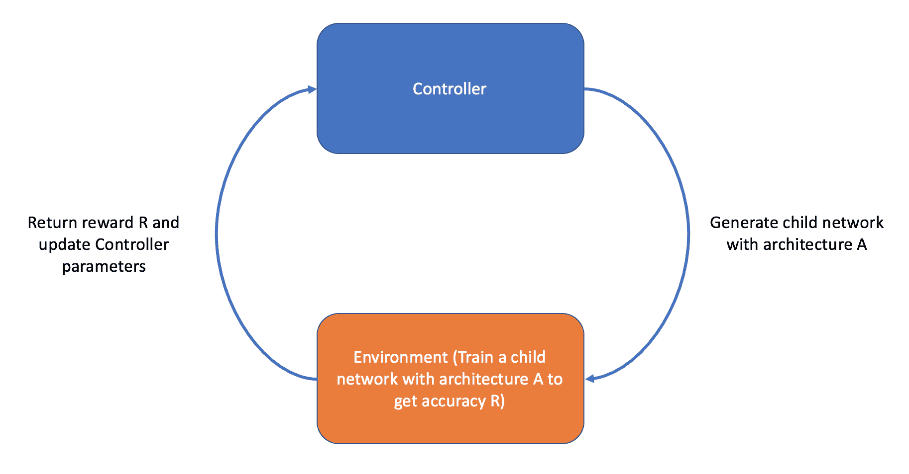

图 1：NAS 框架概览

此外，控制器输出的每个遗传码值都算作一个动作，*a*，它是以概率*p*采样的。由于控制器是一个递归神经网络，我们可以将*t*^(th)动作表示为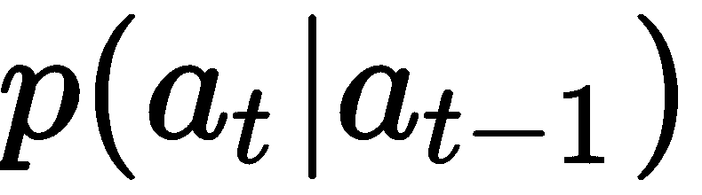。一旦我们拥有了动作列表，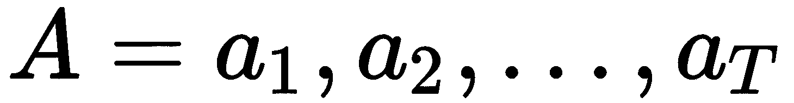—其中*T*是一个预定义的参数，用来设置遗传码的最大大小—我们就可以根据指定的架构生成子网络*A*：

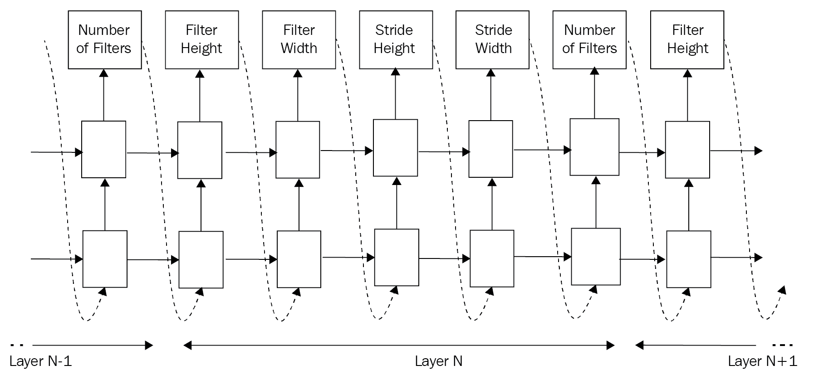

图 2：控制器架构

一旦控制器生成了一个子网络，我们就对其在给定任务上进行训练，直到满足某些终止标准（例如，在指定的轮次后）。然后我们在验证集上评估子网络，得到一个验证准确率*R*。验证准确率作为控制器的奖励信号。所以，控制器的目标是最大化期望奖励：

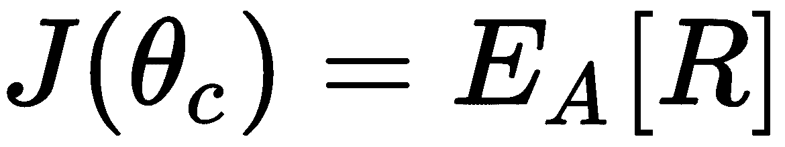

这里，*J*是奖励函数（也称为拟合函数），是控制器的参数，方程右侧是给定子网络架构*A*时，奖励的期望值。在实际操作中，这个期望值是通过对控制器在一批次中生成的*m*个子网络模型的奖励进行平均来计算的：

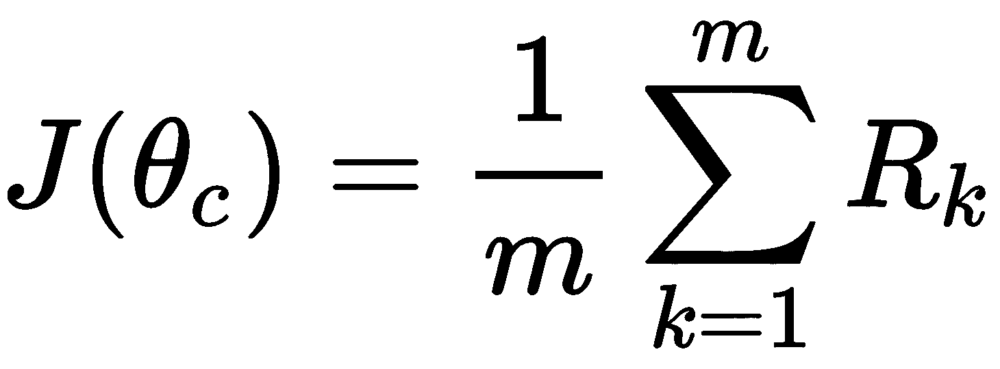

# 训练控制器

我们如何使用这个奖励信号来更新控制器？请记住，这个奖励信号不像监督学习中的损失函数那样可微；我们不能仅仅通过控制器进行反向传播。相反，我们使用一种叫做**REINFORCE**的策略梯度方法，迭代地更新控制器的参数，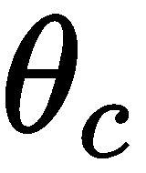。在 REINFORCE 中，奖励函数的梯度，*J*，相对于控制器参数，，定义如下：

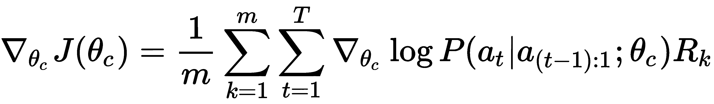

你可能记得在第六章《学习下围棋》中看到过类似的表达式。确实，这是 AlphaGo 和 AlphaGo Zero 用于更新其强化学习策略网络权重的策略梯度方法。我们当时简单介绍了这种方法，今天我们将更深入地探讨它。

让我们分解一下前面的方程。在右侧，我们希望表示选择某个架构 *A* 的概率。具体来说，

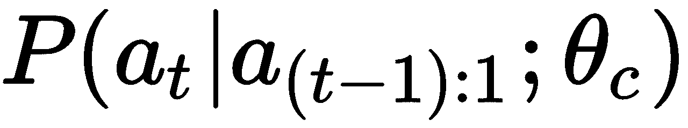 代表控制器在给定所有之前的动作、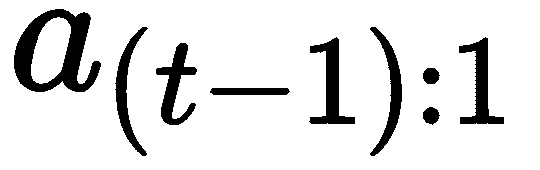 和控制器参数  后采取某个动作的概率。再次强调，动作  对应于基因序列中代表子网络架构的 *t*^(th) 值。选择所有动作的联合概率，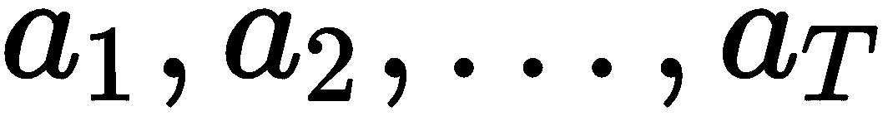，可以按照以下方式表示：

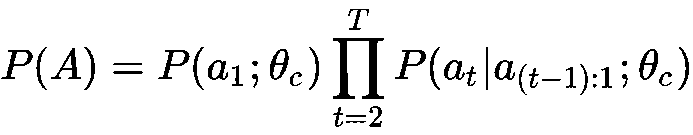

通过将这个联合概率转换到对数空间，我们可以将乘积转化为概率的和：

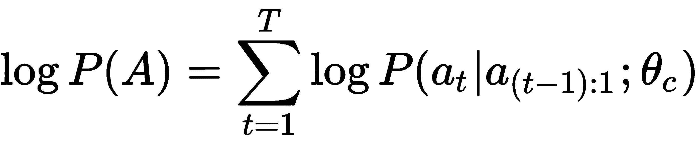

一般来说，我们希望最大化采取某个动作的对数条件概率。换句话说，我们希望提高控制器生成特定基因代码序列的可能性。因此，我们对这个目标执行梯度上升，求取关于控制器参数的对数概率的导数：

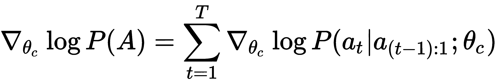

但是，我们如何更新控制器的参数，以便生成更好的架构呢？这时我们利用奖励信号 *R*。通过将前面的结果与奖励信号相乘，我们可以控制策略梯度的大小。换句话说，如果某个架构达到了较高的验证准确率（最高为 1.0），那么该策略的梯度将相对较强，控制器将学习生成类似的架构。相反，较小的验证准确率将意味着较小的梯度，这有助于控制器忽略这些架构。

REINFORCE 算法的一个问题是奖励信号 *R* 的方差可能很大，这会导致训练曲线的不稳定。为了减少方差，通常会从奖励中减去一个值 *b*，我们称之为基准函数。在 Zoph 等人的研究中，基准函数定义为过去奖励的指数移动平均。因此，我们的 REINFORCE 策略梯度现在定义为：

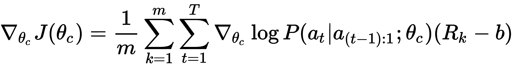

一旦得到这个梯度，我们就应用常规的反向传播算法来更新控制器的参数， 。

# 训练算法

控制器的训练步骤如下：

+   对于每一轮，执行以下操作：

    1.  生成 *m* 个子网络架构

    1.  在给定任务上训练子网络并获得 *m* 个验证准确度

    1.  计算 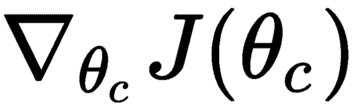

    1.  更新 

在 Zoph 等人的研究中，训练过程通过多个控制器副本完成。每个控制器通过  参数化，而该参数本身以分布式方式存储在多个服务器中，这些服务器我们称之为参数服务器。

在每一轮训练中，控制器创建若干个子架构并独立训练。计算出的策略梯度随后被发送到参数服务器，以更新控制器的参数：

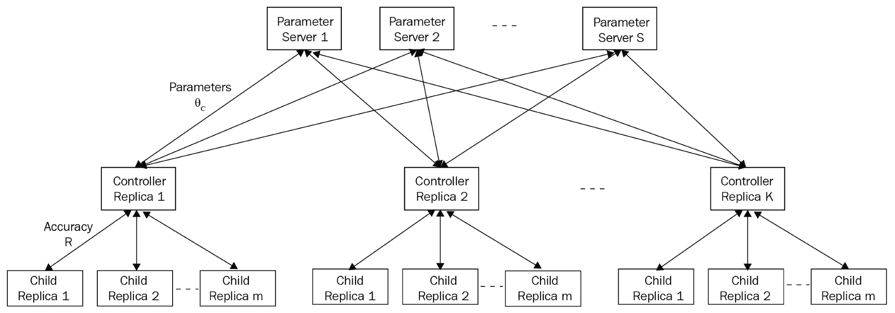

图 3：训练架构

控制器的参数在多个参数服务器之间共享。此外，多个控制器副本并行训练，每个副本为其各自的子网络架构批次计算奖励和梯度。

这种架构使得控制器可以在资源充足的情况下快速训练。然而，对于我们的目的，我们将坚持使用一个控制器来生成 *m* 个子网络架构。一旦我们训练了控制器指定的轮数，我们通过选择验证精度最好的子网络架构来计算测试准确度，并在测试集上测量其性能。

# 实现 NAS

在这一部分，我们将实现 NAS。具体来说，我们的控制器负责生成子网络架构，用于学习从`CIFAR-10`数据集中分类图像。子网络的架构将由一个数字列表表示。这个列表中的每四个值代表子网络中的一个卷积层，每个值描述卷积核大小、步长、滤波器数量和随后的池化层的池化窗口大小。此外，我们将子网络中的层数作为超参数指定。例如，如果我们的子网络有三层，那么它的架构将表示为一个长度为 12 的向量。如果我们的架构表示为`[3, 1, 12, 2, 5, 1, 24, 2]`，那么这个子网络是一个两层网络，其中第一层的卷积核大小为 3，步长为 1，12 个滤波器，最大池化窗口大小为 2；第二层的卷积核大小为 5，步长为 1，24 个滤波器，最大池化窗口大小为 2。我们将每一层之间的激活函数设置为 ReLU。最后一层将对最后一个卷积层的输出进行展平，并应用一个线性层，宽度为类别数，之后应用 Softmax 激活。以下部分将带你完成实现。

# child_network.py

我们将首先实现我们的子网络模块。这个模块包含一个名为`ChildCNN`的类，它根据某些架构配置构建子网络，这些配置我们称之为`cnn_dna`。如前所述，`cnn_dna`只是一个数字列表，每个值代表其对应卷积层的参数。在我们的`config.py`中，我们指定了子网络最多可以有多少层。对于我们的实现，每个卷积层由四个参数表示，每个参数分别对应卷积核大小、步长、滤波器数量和随后的最大池化窗口大小。

我们的`ChildCNN`是一个类，它的构造函数接受以下参数：

+   `cnn_dna`：网络架构

+   `child_id`：一个字符串，用于标识子网络架构

+   `beta`：L2 正则化的权重参数

+   `drop_rate`：丢弃率

```py
import logging

import tensorflow as tf

logger = logging.getLogger(__name__)

class ChildCNN(object):

    def __init__(self, cnn_dna, child_id, beta=1e-4, drop_rate=0.2, **kwargs):
        self.cnn_dna = self.process_raw_controller_output(cnn_dna)
        self.child_id = child_id
        self.beta = beta
        self.drop_rate = drop_rate
        self.is_training = tf.placeholder_with_default(True, shape=None, name="is_training_{}".format(self.child_id))
        self.num_classes = 10
```

我们还实现了一个辅助函数`proces_raw_controller_output()`，它解析控制器输出的`cnn_dna`：

```py
def process_raw_controller_output(self, output):
    """
    A helper function for preprocessing the output of the NASCell
    Args:
        output (numpy.ndarray) The output of the NASCell

    Returns:
        (list) The child network's architecture
    """
    output = output.ravel()
    cnn_dna = [list(output[x:x+4]) for x in range(0, len(output), 4)]
    return cnn_dna
```

最后，我们包含了`build`方法，它使用给定的`cnn_dna`构建我们的子网络。你会注意到，尽管我们让控制器决定我们子网络的架构，但我们仍然硬编码了几个部分，例如激活函数`tf.nn.relu`以及卷积核的初始化方式。我们在每个卷积层后添加最大池化层的做法也是硬编码的。一个更复杂的 NAS 框架还会让控制器决定这些架构组件，代价是更长的训练时间：

```py
def build(self, input_tensor):
    """
    Method for creating the child neural network
    Args:
        input_tensor: The tensor which represents the input

    Returns:
        The tensor which represents the output logit (pre-softmax activation)

    """
    logger.info("DNA is: {}".format(self.cnn_dna))
    output = input_tensor
    for idx in range(len(self.cnn_dna)):
        # Get the configuration for the layer
        kernel_size, stride, num_filters, max_pool_size = self.cnn_dna[idx]
        with tf.name_scope("child_{}_conv_layer_{}".format(self.child_id, idx)):
            output = tf.layers.conv2d(output,
                    # Specify the number of filters the convolutional layer will output
                    filters=num_filters,
                    # This specifies the size (height, width) of the convolutional kernel
                    kernel_size=(kernel_size, kernel_size),
                    # The size of the stride of the kernel
                    strides=(stride, stride),
                    # We add padding to the image
                    padding="SAME",
                    # It is good practice to name your layers
                    name="conv_layer_{}".format(idx),
                    activation=tf.nn.relu,
                    kernel_initializer=tf.contrib.layers.xavier_initializer(),
                    bias_initializer=tf.zeros_initializer(),
                    kernel_regularizer=tf.contrib.layers.l2_regularizer(scale=self.beta))
```

每个卷积层后面都跟着一个最大池化层和一个丢弃层：

```py
            # We apply 2D max pooling on the output of the conv layer
            output = tf.layers.max_pooling2d(
                output, pool_size=(max_pool_size, max_pool_size), strides=1,
                padding="SAME", name="pool_out_{}".format(idx)
            )
            # Dropout to regularize the network further
            output = tf.layers.dropout(output, rate=self.drop_rate, training=self.is_training)
```

最后，在经过几个卷积层、池化层和丢弃层之后，我们将输出体积展平并连接到一个全连接层：

```py
    # Lastly, we flatten the outputs and add a fully-connected layer
    with tf.name_scope("child_{}_fully_connected".format(self.child_id)):
        output = tf.layers.flatten(output, name="flatten")
        logits = tf.layers.dense(output, self.num_classes)

    return logits
```

我们的`build`方法的参数是一个输入张量，默认形状为(32, 32, 3)，这是`CIFAR-10`数据的形状。读者可以自由调整此网络的架构，包括添加更多的全连接层或在卷积之间插入批量归一化层。

# cifar10_processor.py

该模块包含处理`CIFAR-10`数据的代码，我们使用这些数据来训练我们的子网络。特别地，我们使用 TensorFlow 的原生`tf.data.Dataset` API 构建输入数据管道。那些已经使用 TensorFlow 一段时间的人可能更熟悉创建`tf.placeholder`张量并通过`sess.run(..., feed_dict={...})`提供数据。然而，这已经不是将数据输入网络的首选方式；事实上，它是训练网络最慢的方式，因为从`numpy`格式的数据到原生 TensorFlow 格式的重复转换会导致显著的计算开销。`tf.data.Dataset`通过将输入管道转化为 TensorFlow 操作，这些操作是符号图的一部分，解决了这个问题。换句话说，数据从一开始就直接转换为张量。这使得输入管道更加流畅，并能加速训练。

有关`tf.data.Dataset` API 的更多信息，请参考这个官方教程（[`www.tensorflow.org/guide/datasets_for_estimators`](https://www.tensorflow.org/guide/datasets_for_estimators)）。

`cifar10_processor.py`包含一个方法，用于将`CIFAR-10`数据转换为张量。我们首先实现一个辅助函数来创建`tf.data.Dataset`对象：

```py
import logging

import numpy as np
import tensorflow as tf
from keras.datasets import cifar10
from keras.utils import np_utils

logger = logging.getLogger(__name__)

def _create_tf_dataset(x, y, batch_size):
    return tf.data.Dataset.zip((tf.data.Dataset.from_tensor_slices(x),
                                tf.data.Dataset.from_tensor_slices(y))).shuffle(500).repeat().batch(batch_size)
```

在主数据处理函数中，我们首先加载`CIFAR-10`数据。我们使用`keras.datasets` API 来完成这项工作（如果没有 Keras，请在终端中运行`pip install keras`）：

```py
def get_tf_datasets_from_numpy(batch_size, validation_split=0.1):
    """
    Main function getting tf.Data.datasets for training, validation, and testing

    Args:
        batch_size (int): Batch size
        validation_split (float): Split for partitioning training and validation sets. Between 0.0 and 1.0.
    """
    # Load data from keras datasets api
    (X, y), (X_test, y_test) = cifar10.load_data()

    logger.info("Dividing pixels by 255")
    X = X / 255.
    X_test = X_test / 255.

    X = X.astype(np.float32)
    X_test = X_test.astype(np.float32)
    y = y.astype(np.float32)
    y_test = y_test.astype(np.float32)

    # Turn labels into onehot encodings
    if y.shape[1] != 10:
        y = np_utils.to_categorical(y, num_classes=10)
        y_test = np_utils.to_categorical(y_test, num_classes=10)

    logger.info("Loaded data from keras")

    split_idx = int((1.0 - validation_split) * len(X))
    X_train, y_train = X[:split_idx], y[:split_idx]
    X_valid, y_valid = X[split_idx:], y[split_idx:]
```

然后我们将这些 NumPy 数组转换为 TensorFlow 张量，直接将其输入网络。实际上，我们的`_create_tf_dataset`辅助函数中发生了什么？我们使用`tf.dataset.Dataset.from_tensor_slices()`函数将数据和标签（它们都是 NumPy 数组）转换为 TensorFlow 张量。然后通过将这些张量打包创建原生数据集。打包后的`shuffle`、`repeat`和`batch`函数定义了我们希望输入管道如何工作。在我们的案例中，我们对输入数据进行随机洗牌，当达到数据集末尾时重复数据集，并以给定的批量大小进行分批。我们还计算每个数据集的批次数并返回它们：

```py
train_dataset = _create_tf_dataset(X_train, y_train, batch_size)
valid_dataset = _create_tf_dataset(X_valid, y_valid, batch_size)
test_dataset = _create_tf_dataset(X_test, y_test, batch_size)

# Get the batch sizes for the train, valid, and test datasets
num_train_batches = int(X_train.shape[0] // batch_size)
num_valid_batches = int(X_valid.shape[0] // batch_size)
num_test_batches = int(X_test.shape[0] // batch_size)

return train_dataset, valid_dataset, test_dataset, num_train_batches, num_valid_batches, num_test_batches
```

就这样，我们得到了一个比使用`feed_dict`更快的优化输入数据管道。

# controller.py

`controller.py`模块是所有内容汇聚的地方。我们将实现控制器，负责训练每个子网络以及它自己的参数更新。首先，我们实现一个辅助函数，计算一组数字的指数移动平均值。我们使用这个作为 REINFORCE 梯度计算的基准函数，如前所述，用来计算过去奖励的指数移动平均值：

```py
import logging

import numpy as np
import tensorflow as tf

from child_network import ChildCNN
from cifar10_processor import get_tf_datasets_from_numpy
from config import child_network_params, controller_params

logger = logging.getLogger(__name__)

def ema(values):
    """
    Helper function for keeping track of an exponential moving average of a list of values.
    For this module, we use it to maintain an exponential moving average of rewards

    Args:
        values (list): A list of rewards 

    Returns:
        (float) The last value of the exponential moving average
    """
    weights = np.exp(np.linspace(-1., 0., len(values)))
    weights /= weights.sum()
    a = np.convolve(values, weights, mode="full")[:len(values)]
    return a[-1]
```

接下来，我们定义我们的`Controller`类：

```py
class Controller(object):

    def __init__(self):
        self.graph = tf.Graph()
        self.sess = tf.Session(graph=self.graph)
        self.num_cell_outputs = controller_params['components_per_layer'] * controller_params['max_layers']
        self.reward_history = []
        self.architecture_history = []
        self.divison_rate = 100
        with self.graph.as_default():
            self.build_controller()
```

有几个属性需要注意：`self.num_cell_outputs`表示我们**递归神经网络**（**RNN**）应该输出的值的数量，并对应子网络架构配置的长度。`self.reward_history`和`self.architecture_history`只是缓冲区，允许我们跟踪 RNN 生成的奖励和子网络架构。

# 生成控制器的方法

接下来，我们实现一个用于生成控制器的方法，称为`build_controller`。构建控制器的第一步是定义输入占位符。我们创建了两个占位符——一个用于子网络 DNA，作为输入传递给 RNN，以生成新的子网络 DNA，另一个是用于存储折扣奖励的列表，以便在计算 REINFORCE 梯度时使用：

```py
def build_controller(self):
    logger.info('Building controller network')
    # Build inputs and placeholders
    with tf.name_scope('controller_inputs'):
        # Input to the NASCell
        self.child_network_architectures = tf.placeholder(tf.float32, [None, self.num_cell_outputs], 
                                                          name='controller_input')
        # Discounted rewards
        self.discounted_rewards = tf.placeholder(tf.float32, (None, ), name='discounted_rewards')
```

然后，我们定义 RNN 的输出张量（将在此处实现）。注意，RNN 的输出值较小，范围在(-1, 1)之间。所以，我们将输出乘以 10，以便生成子网络的 DNA：

```py
# Build controller
with tf.name_scope('network_generation'):
    with tf.variable_scope('controller'):
        self.controller_output = tf.identity(self.network_generator(self.child_network_architectures), 
                                             name='policy_scores')
        self.cnn_dna_output = tf.cast(tf.scalar_mul(self.divison_rate, self.controller_output), tf.int32,
                                      name='controller_prediction')
```

然后，我们定义损失函数和优化器。我们使用`RMSPropOptimizer`作为反向传播算法，其中学习率按指数衰减。与通常在其他神经网络模型中调用`optimizer.minimize(loss)`不同，我们调用`compute_gradients`方法来获得计算 REINFORCE 梯度所需的梯度：

```py
# Set up optimizer
self.global_step = tf.Variable(0, trainable=False)
self.learning_rate = tf.train.exponential_decay(0.99, self.global_step, 500, 0.96, staircase=True)
self.optimizer = tf.train.RMSPropOptimizer(learning_rate=self.learning_rate)

# Gradient and loss computation
with tf.name_scope('gradient_and_loss'):
    # Define policy gradient loss for the controller
    self.policy_gradient_loss = tf.reduce_mean(tf.nn.softmax_cross_entropy_with_logits(
        logits=self.controller_output[:, -1, :],
        labels=self.child_network_architectures))
    # L2 weight decay for Controller weights
    self.l2_loss = tf.reduce_sum(tf.add_n([tf.nn.l2_loss(v) for v in
                                           tf.trainable_variables(scope="controller")]))
    # Add the above two losses to define total loss
    self.total_loss = self.policy_gradient_loss + self.l2_loss * controller_params["beta"]
    # Compute the gradients
    self.gradients = self.optimizer.compute_gradients(self.total_loss)

    # Gradients calculated using REINFORCE
    for i, (grad, var) in enumerate(self.gradients):
        if grad is not None:
            self.gradients[i] = (grad * self.discounted_rewards, var)
```

最后，我们在控制器参数上应用 REINFORCE 梯度：

```py
with tf.name_scope('train_controller'):
    # The main training operation. This applies REINFORCE on the weights of the Controller
    self.train_op = self.optimizer.apply_gradients(self.gradients, global_step=self.global_step)

logger.info('Successfully built controller')
```

实际的控制器网络是通过`network_generator`函数创建的。如前所述，控制器是一个具有特殊类型单元的递归神经网络。然而，我们不必从头实现这一点，因为 TensorFlow 的开发者已经实现了一个自定义的`tf.contrib.rnn.NASCell`。我们只需要使用这个来构建我们的递归神经网络并获得输出：

```py
def network_generator(self, nas_cell_hidden_state):
    # number of output units we expect from a NAS cell
    with tf.name_scope('network_generator'):
        nas = tf.contrib.rnn.NASCell(self.num_cell_outputs)
        network_architecture, nas_cell_hidden_state = tf.nn.dynamic_rnn(nas, tf.expand_dims(
            nas_cell_hidden_state, -1), dtype=tf.float32)
        bias_variable = tf.Variable([0.01] * self.num_cell_outputs)
        network_architecture = tf.nn.bias_add(network_architecture, bias_variable)
        return network_architecture[:, -1:, :]
```

# 使用控制器生成子网络

现在，我们实现一个方法，通过控制器生成一个子网络：

```py
def generate_child_network(self, child_network_architecture):
    with self.graph.as_default():
        return self.sess.run(self.cnn_dna_output, {self.child_network_architectures: child_network_architecture})
```

一旦我们生成了子网络，就调用`train_child_network`函数来训练它。该函数接受`child_dna`和`child_id`，并返回子网络达到的验证精度。首先，我们实例化一个新的`tf.Graph()`和一个新的`tf.Session()`，这样子网络就与控制器的图分开：

```py
def train_child_network(self, cnn_dna, child_id):
    """
    Trains a child network and returns reward, or the validation accuracy
    Args:
        cnn_dna (list): List of tuples representing the child network's DNA
        child_id (str): Name of child network

    Returns:
        (float) validation accuracy
    """
    logger.info("Training with dna: {}".format(cnn_dna))
    child_graph = tf.Graph()
    with child_graph.as_default():
        sess = tf.Session()

        child_network = ChildCNN(cnn_dna=cnn_dna, child_id=child_id, **child_network_params)
```

接着我们定义输入数据管道，使用我们在此实现的`tf.data.Dataset`创建器。具体来说，我们使用`tf.data.Iterator`创建一个生成器，每次调用`iterator.get_next()`时都会生成一批输入张量。我们分别为训练集和验证集初始化一个迭代器。这一批输入张量包含`CIFAR-10`图像及其对应的标签，我们会在最后解包它们：

```py
# Create input pipeline
train_dataset, valid_dataset, test_dataset, num_train_batches, num_valid_batches, num_test_batches = \
    get_tf_datasets_from_numpy(batch_size=child_network_params["batch_size"])

# Generic iterator
iterator = tf.data.Iterator.from_structure(train_dataset.output_types, train_dataset.output_shapes)
next_tensor_batch = iterator.get_next()

# Separate train and validation set init ops
train_init_ops = iterator.make_initializer(train_dataset)
valid_init_ops = iterator.make_initializer(valid_dataset)

# Build the graph
input_tensor, labels = next_tensor_batch
```

`input_tensor`成为子网络`build`方法的参数。接着我们定义了训练所需的所有 TensorFlow 操作，包括预测、损失、优化器和精度操作：

```py
# Build the child network, which returns the pre-softmax logits of the child network
logits = child_network.build(input_tensor)

# Define the loss function for the child network
loss_ops = tf.nn.softmax_cross_entropy_with_logits_v2(labels=labels, logits=logits, name="loss")

# Define the training operation for the child network
train_ops = tf.train.AdamOptimizer(learning_rate=child_network_params["learning_rate"]).minimize(loss_ops)

# The following operations are for calculating the accuracy of the child network
pred_ops = tf.nn.softmax(logits, name="preds")
correct = tf.equal(tf.argmax(pred_ops, 1), tf.argmax(labels, 1), name="correct")
accuracy_ops = tf.reduce_mean(tf.cast(correct, tf.float32), name="accuracy")

initializer = tf.global_variables_initializer()
```

接着我们训练子网络。请注意，在调用`sess.run(...)`时，我们不再传递`feed_dict`参数。相反，我们只是调用想要运行的操作（`loss_ops`、`train_ops`和`accuracy_ops`）。这是因为输入已经在子网络的计算图中以张量的形式表示：

```py
# Training
sess.run(initializer)
sess.run(train_init_ops)

logger.info("Training child CNN {} for {} epochs".format(child_id, child_network_params["max_epochs"]))
for epoch_idx in range(child_network_params["max_epochs"]):
    avg_loss, avg_acc = [], []

    for batch_idx in range(num_train_batches):
        loss, _, accuracy = sess.run([loss_ops, train_ops, accuracy_ops])
        avg_loss.append(loss)
        avg_acc.append(accuracy)

    logger.info("\tEpoch {}:\tloss - {:.6f}\taccuracy - {:.3f}".format(epoch_idx,
                                                                       np.mean(avg_loss), np.mean(avg_acc)))
```

训练完成后，我们计算验证精度并返回：

```py
    # Validate and return reward
    logger.info("Finished training, now calculating validation accuracy")
    sess.run(valid_init_ops)
    avg_val_loss, avg_val_acc = [], []
    for batch_idx in range(num_valid_batches):
        valid_loss, valid_accuracy = sess.run([loss_ops, accuracy_ops])
        avg_val_loss.append(valid_loss)
        avg_val_acc.append(valid_accuracy)
    logger.info("Valid loss - {:.6f}\tValid accuracy - {:.3f}".format(np.mean(avg_val_loss),
                                                                      np.mean(avg_val_acc)))

return np.mean(avg_val_acc)
```

最后，我们实现了一个用于训练 Controller 的方法。由于计算资源的限制，我们不会并行化训练过程（即每个 Controller 周期内并行训练*m*个子网络）。相反，我们会顺序生成这些子网络，并跟踪它们的均值验证精度。

# train_controller 方法

`train_controller`方法在构建 Controller 之后被调用。因此，第一步是初始化所有变量和初始状态：

```py
def train_controller(self):
    with self.graph.as_default():
        self.sess.run(tf.global_variables_initializer())

    step = 0
    total_rewards = 0
    child_network_architecture = np.array([[10.0, 128.0, 1.0, 1.0] *
                                           controller_params['max_layers']], dtype=np.float32)
```

第一个`child_network_architecture`是一个类似架构配置的列表，将作为参数传递给`NASCell`，从而输出第一个子网络 DNA。

训练过程由两个`for`循环组成：一个是 Controller 的周期数，另一个是每个 Controller 周期内生成的子网络数。在内层`for`循环中，我们使用`NASCell`生成新的`child_network_architecture`，并基于它训练一个子网络以获得验证精度：

```py
for episode in range(controller_params['max_episodes']):
    logger.info('=============> Episode {} for Controller'.format(episode))
    step += 1
    episode_reward_buffer = []

    for sub_child in range(controller_params["num_children_per_episode"]):
        # Generate a child network architecture
        child_network_architecture = self.generate_child_network(child_network_architecture)[0]

        if np.any(np.less_equal(child_network_architecture, 0.0)):
            reward = -1.0
        else:
            reward = self.train_child_network(cnn_dna=child_network_architecture,
                                              child_id='child/{}'.format("{}_{}".format(episode, sub_child)))
        episode_reward_buffer.append(reward)
```

在获得*m*次验证精度后，我们使用均值奖励和相对于上一个子网络 DNA 计算出的梯度来更新 Controller。同时，我们还会记录过去的均值奖励。通过之前实现的`ema`方法，我们计算出基准值，并将其从最新的均值奖励中减去。然后我们调用`self.sess.run([self.train_op, self.total_loss]...)`来更新 Controller 并计算 Controller 的损失：

```py
mean_reward = np.mean(episode_reward_buffer)

self.reward_history.append(mean_reward)
self.architecture_history.append(child_network_architecture)
total_rewards += mean_reward

child_network_architecture = np.array(self.architecture_history[-step:]).ravel() / self.divison_rate
child_network_architecture = child_network_architecture.reshape((-1, self.num_cell_outputs))
baseline = ema(self.reward_history)
last_reward = self.reward_history[-1]
rewards = [last_reward - baseline]
logger.info("Buffers before loss calculation")
logger.info("States: {}".format(child_network_architecture))
logger.info("Rewards: {}".format(rewards))

with self.graph.as_default():
    _, loss = self.sess.run([self.train_op, self.total_loss],
                            {self.child_network_architectures: child_network_architecture,
                             self.discounted_rewards: rewards})

logger.info('Episode: {} | Loss: {} | DNA: {} | Reward : {}'.format(
    episode, loss, child_network_architecture.ravel(), mean_reward))
```

就是这样！你可以在主 GitHub 仓库中找到`controller.py`的完整实现。

# 测试 ChildCNN

既然我们已经实现了`child_network`和`controller`，接下来就可以通过我们的`Controller`测试`ChildCNN`的训练，使用自定义的子网络配置。我们希望确保，在合理的架构下，`ChildCNN`能够充分学习。

要做到这一点，首先打开你最喜欢的终端，并启动一个 Jupyter 控制台：

```py
$ ipython
Python 3.6.4 (default, Jan 6 2018, 11:49:38)
Type 'copyright', 'credits' or 'license' for more information
IPython 6.4.0 -- An enhanced Interactive Python. Type '?' for help.
```

我们首先配置日志记录器，这样就能在终端上看到输出：

```py
In [1]: import sys

In [2]: import logging

In [3]: logging.basicConfig(stream=sys.stdout,
   ...: level=logging.DEBUG,
   ...: format='%(asctime)s %(name)-12s %(levelname)-8s %(message)s')
   ...:

In [4]:
```

接下来，我们从`controller.py`导入`Controller`类：

```py
In [4]: import numpy as np

In [5]: from controller import Controller

In [6]:
```

然后，我们手工设计一些子网络架构，并将其传递给 Controller 的`train_child_network`函数：

```py
In [7]: dna = np.array([[3, 1, 30, 2], [3, 1, 30, 2], [3, 1, 40, 2]])
```

最后，我们实例化我们的`Controller`并调用`train_child_network`方法：

```py
In [8]: controller = Controller()

...

2018-09-16 01:58:54,978 controller INFO Successfully built controller

In [9]: controller.train_child_network(dna, "test")

2018-09-16 01:58:59,208 controller INFO Training with dna: [[ 3 1 30 2]
 [ 3 1 30 2]
 [ 3 1 40 2]]
2018-09-16 01:58:59,605 cifar10_processor INFO Dividing pixels by 255
2018-09-16 01:59:01,289 cifar10_processor INFO Loaded data from keras
2018-09-16 01:59:03,150 child_network INFO DNA is: [[3, 1, 30, 2], [3, 1, 30, 2], [3, 1, 40, 2]]
2018-09-16 01:59:14,270 controller INFO Training child CNN first for 1000 epochs
```

如果成功，经过若干轮训练后，你应该会看到不错的准确度：

```py
2018-09-16 06:25:01,927 controller INFO Epoch 436: loss - 1.119608 accuracy - 0.663
2018-09-16 06:25:19,310 controller INFO Epoch 437: loss - 0.634937 accuracy - 0.724
2018-09-16 06:25:36,438 controller INFO Epoch 438: loss - 0.769766 accuracy - 0.702
2018-09-16 06:25:53,413 controller INFO Epoch 439: loss - 0.760520 accuracy - 0.711
2018-09-16 06:26:10,530 controller INFO Epoch 440: loss - 0.606741 accuracy - 0.812
```

# config.py

`config.py`模块包含了 Controller 和子网络使用的配置。在这里，你可以调整多个训练参数，比如训练轮数、学习率以及 Controller 每个 epoch 生成的子网络数量。你还可以尝试调整子网络的大小，但请注意，子网络越大，训练所需的时间就越长，包括 Controller 和子网络的训练时间：

```py
child_network_params = {
    "learning_rate": 3e-5,
    "max_epochs": 100,
    "beta": 1e-3,
    "batch_size": 20
}

controller_params = {
    "max_layers": 3,
    "components_per_layer": 4,
    'beta': 1e-4,
    'max_episodes': 2000,
    "num_children_per_episode": 10
}
```

这些数字中的一些（例如`max_episodes`）是任意选择的。我们鼓励读者调整这些数字，以理解它们如何影响 Controller 和子网络的训练。

# train.py

这个`train.py`模块充当我们训练 Controller 的顶层入口：

```py
import logging
import sys

from .controller import Controller

if __name__ == '__main__':
    # Configure the logger
    logging.basicConfig(stream=sys.stdout,
                        level=logging.DEBUG,
                        format='%(asctime)s %(name)-12s %(levelname)-8s %(message)s')
    controller = Controller()
    controller.train_controller()
```

就这样；一个生成其他神经网络的神经网络！确保你的实现有以下目录结构：

```py
src
|-- __init__.py
|-- child_network.py
|-- cifar10_processor.py
|-- config.py
|-- constants.py
|-- controller.py
`-- train.py
```

要执行训练，只需运行以下命令：

```py
$ python train.py
```

如果一切顺利，你应该会看到如下输出：

```py
2018-09-16 04:13:45,484 src.controller INFO Successfully built controller 
2018-09-16 04:13:45,542 src.controller INFO =============> Episode 0 for Controller 
2018-09-16 04:13:45,952 src.controller INFO Training with dna: [[ 2 10 2 4 1 1 12 14 7 1 1 1]] 2018-09-16 04:13:45.953482: I tensorflow/core/common_runtime/gpu/gpu_device.cc:1484] Adding visible gpu devices: 0 
2018-09-16 04:13:45.953530: I tensorflow/core/common_runtime/gpu/gpu_device.cc:965] Device interconnect StreamExecutor with strength 1 edge matrix: 
2018-09-16 04:13:45.953543: I tensorflow/core/common_runtime/gpu/gpu_device.cc:971] 0 
2018-09-16 04:13:45.953558: I tensorflow/core/common_runtime/gpu/gpu_device.cc:984] 0: N 
2018-09-16 04:13:45.953840: I tensorflow/core/common_runtime/gpu/gpu_device.cc:1097] Created TensorFlow device (/job:localhost/replica:0/task:0/device:GPU:0 wi th 21618 MB memory) -> physical GPU (device: 0, name: Tesla M40 24GB, pci bus id: 0000:03:00.0, compute capability: 5.2) 
2018-09-16 04:13:47,143 src.cifar10_processor INFO Dividing pixels by 255 
2018-09-16 04:13:55,119 src.cifar10_processor INFO Loaded data from keras 
2018-09-16 04:14:09,050 src.child_network INFO DNA is: [[2, 10, 2, 4], [1, 1, 12, 14], [7, 1, 1, 1]] 
2018-09-16 04:14:21,326 src.controller INFO Training child CNN child/0_0 for 100 epochs 
2018-09-16 04:14:32,830 src.controller INFO Epoch 0: loss - 2.351300 accuracy - 0.100
2018-09-16 04:14:43,976 src.controller INFO Epoch 1: loss - 2.202928 accuracy - 0.180 
2018-09-16 04:14:53,412 src.controller INFO Epoch 2: loss - 2.102713 accuracy - 0.220 
2018-09-16 04:15:03,704 src.controller INFO Epoch 3: loss - 2.092676 accuracy - 0.232 
2018-09-16 04:15:14,349 src.controller INFO Epoch 4: loss - 2.092633 accuracy - 0.240

```

你应该会看到每个子网络架构的 CIFAR-10 训练日志中的日志语句。在 CIFAR-10 训练过程中，我们会打印每一轮的损失和准确度，以及返回给 Controller 的验证准确度。

# 额外的练习

在这一部分，我们实现了适用于`CIFAR-10`数据集的 NAS 框架。虽然这是一个很好的开始，但还有其他功能可以实现，我们将其留给读者作为练习：

+   我们如何让 Controller 创建能够解决其他领域问题的子网络，例如文本和语音识别？

+   我们如何让 Controller 并行训练多个子网络，以加快训练过程？

+   我们如何使用 TensorBoard 可视化训练过程？

+   我们如何让 Controller 设计包含残差连接的子网络？

其中一些练习可能需要对代码库做出显著修改，但对加深你对 NAS 的理解是有帮助的。我们强烈推荐尝试这些练习！

# NAS 的优势

NAS 最大的优势在于无需花费大量时间为特定问题设计神经网络。这也意味着即使不是数据科学家的人，只要能够准备数据，也能创建机器学习代理。事实上，谷歌已经将这个框架产品化为 Cloud AutoML，允许任何人以最小的努力训练定制化的机器学习模型。根据谷歌的说法，Cloud AutoML 提供了以下优势：

+   用户只需与简单的图形界面交互即可创建机器学习模型。

+   如果用户的数据集尚未标注，他们可以让 Cloud AutoML 为其数据集添加标注。这与亚马逊的 Mechanical Turk 服务类似。

+   由 Cloud AutoML 生成的模型保证具有高准确性和快速性能。

+   一个简单的端到端管道，用于上传数据、训练和验证模型、部署模型以及创建用于获取预测的 REST 端点。

当前，Cloud AutoML 可用于图像分类/检测、自然语言处理（文本分类）和翻译。

欲了解更多关于 Cloud AutoML 的信息，请访问他们的官方网站：[`cloud.google.com/automl/`](https://cloud.google.com/automl/)

NAS 的另一个优势是能够生成比人工设计的模型更紧凑的模型。根据 Hieu Pham 等人所著的《*通过参数共享实现高效的神经架构搜索*》一文，最新的最先进的`CIFAR-10`分类神经网络有 2620 万个参数，而一个 NAS 生成的神经网络，其测试准确率与人工设计的网络相当（人工设计网络为 97.44%，NAS 生成网络为 97.35%），但只有 330 万个参数。值得注意的是，像 VGG16、ResNet50 和 InceptionV3 这样的旧模型，分别有 1.38 亿、2500 万和 2300 万个参数。参数规模的大幅减少使得推理时间和模型存储更加高效，这两者在将模型部署到生产环境时都非常重要。

# 总结

在本章中，我们实现了 NAS，这是一个框架，其中强化学习代理（控制器）生成子神经网络来完成特定任务。我们研究了控制器如何通过策略梯度方法学习生成更好的子网络架构的理论。接着，我们实现了一个简化版本的 NAS，该版本生成能够学习分类`CIFAR-10`图像的子网络。

欲了解更多相关话题，请参考以下链接列表：

+   通过强化学习实现的 NAS：[`arxiv.org/abs/1611.01578`](https://arxiv.org/abs/1611.01578)

+   高效的 NAS 通过参数共享：[`arxiv.org/pdf/1802.03268`](https://arxiv.org/pdf/1802.03268)

+   Google Cloud AutoML：[`cloud.google.com/automl/`](https://cloud.google.com/automl/)

+   极棒的架构搜索——一个关于生成神经网络的论文精选列表：[`github.com/markdtw/awesome-architecture-search`](https://github.com/markdtw/awesome-architecture-search)

NAS 框架标志着深度学习领域的一个令人兴奋的发展，因为我们已经弄清楚了如何自动设计神经网络架构，这一决定以前是由人类做出的。现在已经有了改进版的 NAS 和其他能够自动生成神经网络的算法，我们鼓励读者也去了解这些内容。
