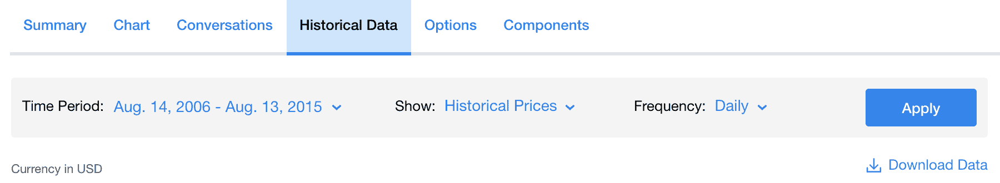

# 第九章：预测未来股价

金融市场是任何经济的重要组成部分。一个经济要繁荣，其金融市场必须稳固。自从机器学习的出现以来，许多公司开始在股票和其他金融资产的购买中采用算法交易。这个方法已被证明是成功的，并且随着时间的推移而变得更加重要。由于其迅速崛起，已经开发并采用了多种机器学习模型来进行算法交易。一种流行的用于交易的机器学习模型是时间序列分析。你已经学习过强化学习和 Keras，在本章中，它们将被用来开发一个可以预测股价的模型。

# 背景问题

自动化几乎渗透到了每个行业，金融市场也不例外。创建自动化的算法交易模型可以在购买前对股票进行更快速、更准确的分析。多个指标可以以人类无法达到的速度进行分析。而且，在交易中，情绪化的操作是危险的。机器学习模型可以解决这个问题。同时，交易成本也减少了，因为不再需要持续的监督。

在本教程中，你将学习如何将强化学习与时间序列建模结合起来，以便基于真实数据预测股票价格。

# 使用的数据

我们将使用的数据是标准普尔 500 指数。根据维基百科，它是 *基于 500 家大型公司的市值的美国股票市场指数，这些公司在纽约证券交易所或纳斯达克上市并拥有普通股。* 这里是数据的链接（[`ca.finance.yahoo.com/quote/%255EGSPC/history?p=%255EGSPC`](https://ca.finance.yahoo.com/quote/%255EGSPC/history?p=%255EGSPC)）。

数据包含以下列：

1.  **日期**：这表示考虑的日期

1.  **开盘价**：这表示当天市场开盘时的价格

1.  **最高价**：这表示当天市场的最高价格

1.  **低价**：这表示当天市场的最低价格

1.  **收盘价**：这表示当天市场收盘时的价格，经过拆股调整

1.  **调整后收盘价**：这表示经过拆股和分红调整后的收盘价

1.  **交易量**：这表示可用的股票总量

用于训练数据的日期如下：

```py
Start: 14 August 2006
End: 13th August 2015
```

在网站上，按以下方式筛选日期，并下载数据集：



对于测试，我们将使用以下日期范围：

```py
Start: 14 August 2015
End: 14 August 2018
```

相应地更改网站上的日期，并下载用于测试的数据集，如下所示：


在接下来的部分，我们将定义一些代理可以执行的可能操作。

# 分步指南

我们的解决方案使用了一个基于演员-评论员的强化学习模型，并结合了时间序列，帮助我们基于股票价格预测最佳操作。可能的操作如下：

1.  **持有**：这意味着根据价格和预期利润，交易者应该持有股票。

1.  **卖出**：这意味着根据价格和预期利润，交易者应该卖出股票。

1.  **购买**：这意味着根据价格和预期利润，交易者应该购买股票。

演员-评论员网络是一类基于两个交互网络模型的强化学习方法。这些模型有两个组成部分：演员和评论员。在我们的案例中，我们将使用神经网络作为网络模型。我们将使用你已经学过的 Keras 包来创建神经网络。我们希望改进的奖励函数是利润。

演员接受环境状态，然后返回最佳动作，或者返回一个指向动作的概率分布的策略。这似乎是执行强化学习的一种自然方式，因为策略是作为状态的函数直接返回的。

评论员评估由演员网络返回的动作。这类似于传统的深度 Q 网络；在环境状态和一个动作下，返回一个分数，表示在给定状态下采取该动作的价值。评论员的工作是计算一个近似值，然后用它来根据梯度更新演员。评论员本身是通过时序差分算法进行训练的。

这两个网络是同时训练的。随着时间的推移，评论员网络能够改善其`Q_value`预测，演员也学会了如何根据状态做出更好的决策。

这个解决方案由五个脚本组成，它们将在接下来的章节中描述。

# 演员脚本

演员脚本是在这里定义策略模型的。我们首先从 Keras 中导入某些模块：layers、optimizers、models 和 backend。这些模块将帮助我们构建神经网络：让我们从导入 Keras 的所需函数开始。

```py
from keras import layers, models, optimizers
from keras import backend as K

```

1.  我们创建了一个名为`Actor`的类，它的对象接受`state`和`action`大小的参数：

```py
class Actor:

  # """Actor (policy) Model. """

    def __init__(self, state_size, action_size):
        self.state_size = state_size
        self.action_size = action_size

```

1.  上述代码展示了状态大小，表示每个状态的维度，以及动作大小，表示动作的维度。接下来，调用一个函数来构建模型，如下所示：

```py
        self.build_model()
```

1.  构建一个策略模型，将状态映射到动作，并从定义输入层开始，如下所示：

```py
    def build_model(self):
        states = layers.Input(shape=(self.state_size,), name='states')         
```

1.  向模型中添加隐藏层。共有两层密集层，每一层后面跟着批归一化和激活层。这些密集层是正则化的。两层分别有 16 个和 32 个隐藏单元：

```py
        net = layers.Dense(units=16,kernel_regularizer=layers.regularizers.l2(1e-6))(states)
        net = layers.BatchNormalization()(net)
        net = layers.Activation("relu")(net)
        net = layers.Dense(units=32,kernel_regularizer=layers.regularizers.l2(1e-6))(net)
        net = layers.BatchNormalization()(net)
        net = layers.Activation("relu")(net)
```

1.  最终的输出层将预测具有`softmax`激活函数的动作概率：

```py
        actions = layers.Dense(units=self.action_size, activation='softmax', name = 'actions')(net)

        self.model = models.Model(inputs=states, outputs=actions)

```

1.  通过使用动作值（`Q_value`）的梯度来定义损失函数，如下所示：

```py
        action_gradients = layers.Input(shape=(self.action_size,))
        loss = K.mean(-action_gradients * actions)
```

1.  定义`optimizer`和训练函数，如下所示：

```py
        optimizer = optimizers.Adam(lr=.00001)
        updates_op = optimizer.get_updates(params=self.model.trainable_weights, loss=loss)
        self.train_fn = K.function(
            inputs=[self.model.input, action_gradients, K.learning_phase()],
            outputs=[],
            updates=updates_op)
```

演员网络的自定义训练函数，利用与动作概率相关的 Q 梯度进行训练。通过这个自定义函数，训练的目标是最大化利润（换句话说，最小化`Q_values`的负值）。

# 评论家脚本

我们首先导入 Keras 的一些模块：layers、optimizers、models 和 backend。这些模块将帮助我们构建神经网络：

```py
from keras import layers, models, optimizers
from keras import backend as K
```

1.  我们创建了一个名为`Critic`的类，其对象接收以下参数：

```py
class Critic:
    """Critic (Value) Model."""

    def __init__(self, state_size, action_size):
        """Initialize parameters and build model.
        Params
        ======
            state_size (int): Dimension of each state
            action_size (int): Dimension of each action
        """
        self.state_size = state_size
        self.action_size = action_size

        self.build_model()
```

1.  构建一个评论家（价值）网络，它将`state`和`action`对（`Q_values`）映射，并定义输入层，如下所示：

```py
    def build_model(self):
        states = layers.Input(shape=(self.state_size,), name='states')
        actions = layers.Input(shape=(self.action_size,), name='actions')
```

1.  为状态路径添加隐藏层，如下所示：

```py
        net_states = layers.Dense(units=16,kernel_regularizer=layers.regularizers.l2(1e-6))(states)
        net_states = layers.BatchNormalization()(net_states)
        net_states = layers.Activation("relu")(net_states)

        net_states = layers.Dense(units=32, kernel_regularizer=layers.regularizers.l2(1e-6))(net_states)
```

1.  为动作路径添加隐藏层，如下所示：

```py
        net_actions = layers.Dense(units=32,kernel_regularizer=layers.regularizers.l2(1e-6))(actions)
```

1.  合并状态路径和动作路径，如下所示：

```py
        net = layers.Add()([net_states, net_actions])
        net = layers.Activation('relu')(net)
```

1.  添加最终输出层，以产生动作值（`Q_values`）：

```py
        Q_values = layers.Dense(units=1, name='q_values',kernel_initializer=layers.initializers.RandomUniform(minval=-0.003, maxval=0.003))(net)
```

1.  创建 Keras 模型，如下所示：

```py
        self.model = models.Model(inputs=[states, actions], outputs=Q_values)
```

1.  定义`optimizer`并编译一个模型以进行训练，使用内置的损失函数：

```py
        optimizer = optimizers.Adam(lr=0.001)
        self.model.compile(optimizer=optimizer, loss='mse')
```

1.  计算动作梯度（`Q_values`相对于`actions`的导数）：

```py
        action_gradients = K.gradients(Q_values, actions)
```

1.  定义一个附加函数来获取动作梯度（供演员模型使用），如下所示：

```py
        self.get_action_gradients = K.function(
            inputs=[*self.model.input, K.learning_phase()],
            outputs=action_gradients)
```

到此为止，评论家脚本已完成。

# 代理脚本

在这一部分，我们将训练一个代理，该代理将基于演员和评论家网络执行强化学习。我们将执行以下步骤以实现此目标：

1.  创建一个代理类，其初始化函数接收批次大小、状态大小和一个评估布尔函数，用于检查训练是否正在进行中。

1.  在代理类中，创建以下方法：

1.  导入`actor`和`critic`脚本：

```py
from actor import Actor
from critic import Critic
```

1.  导入`numpy`、`random`、`namedtuple`和`deque`，这些模块来自`collections`包：

```py
import numpy as np
from numpy.random import choice
import random

from collections import namedtuple, deque
```

1.  创建一个`ReplayBuffer`类，该类负责添加、抽样和评估缓冲区：

```py
class ReplayBuffer:
    #Fixed sized buffer to stay experience tuples

    def __init__(self, buffer_size, batch_size):

    #Initialize a replay buffer object.

    #parameters

    #buffer_size: maximum size of buffer. Batch size: size of each batch

        self.memory = deque(maxlen = buffer_size)  #memory size of replay buffer
        self.batch_size = batch_size               #Training batch size for Neural nets
        self.experience = namedtuple("Experience", field_names = ["state", "action", "reward", "next_state", "done"])                                           #Tuple containing experienced replay

```

1.  向重放缓冲区记忆中添加一个新的经验：

```py
    def add(self, state, action, reward, next_state, done):
        e = self.experience(state, action, reward, next_state, done)
        self.memory.append(e)
```

1.  随机从记忆中抽取一批经验元组。在以下函数中，我们从记忆缓冲区中随机抽取状态。这样做是为了确保我们输入模型的状态在时间上没有相关性，从而减少过拟合：

```py
    def sample(self, batch_size = 32):
        return random.sample(self.memory, k=self.batch_size)
```

1.  返回当前缓冲区内存的大小，如下所示：

```py
    def __len__(self):
        return len(self.memory)
```

1.  使用演员-评论家网络进行学习的强化学习代理如下所示：

```py
class Agent:
    def __init__(self, state_size, batch_size, is_eval = False):
        self.state_size = state_size #
```

1.  动作数量定义为 3：坐下、买入、卖出

```py
        self.action_size = 3 
```

1.  定义重放记忆的大小：

```py
        self.buffer_size = 1000000
        self.batch_size = batch_size
        self.memory = ReplayBuffer(self.buffer_size, self.batch_size)
        self.inventory = []
```

1.  定义训练是否正在进行中的变量。在训练和评估阶段，此变量将会变化：

```py
        self.is_eval = is_eval    
```

1.  Bellman 方程中的折扣因子：

```py
        self.gamma = 0.99        
```

1.  可以通过以下方式对演员和评论家网络进行软更新：

```py
        self.tau = 0.001   
```

1.  演员策略模型将状态映射到动作，并实例化演员网络（本地和目标模型，用于软更新参数）：

```py
        self.actor_local = Actor(self.state_size, self.action_size) 
        self.actor_target = Actor(self.state_size, self.action_size)    
```

1.  评论家（价值）模型，它将状态-动作对映射到`Q_values`，如下所示：

```py
        self.critic_local = Critic(self.state_size, self.action_size)
```

1.  实例化评论模型（使用本地和目标模型以允许软更新），如下所示：

```py
        self.critic_target = Critic(self.state_size, self.action_size)    
        self.critic_target.model.set_weights(self.critic_local.model.get_weights()) 
```

1.  以下代码将目标模型参数设置为本地模型参数：

```py
      self.actor_target.model.set_weights(self.actor_local.model.get_weights()
```

1.  给定一个状态，使用演员（策略网络）和演员网络的`softmax`层输出返回一个动作，返回每个动作的概率。一个返回给定状态的动作的方法如下：

```py
 def act(self, state):
        options = self.actor_local.model.predict(state) 
        self.last_state = state
        if not self.is_eval:
            return choice(range(3), p = options[0])     
        return np.argmax(options[0])
```

1.  基于训练模型中的动作概率返回随机策略，并在测试期间返回与最大概率对应的确定性动作。智能体在每一步执行的动作集如下所示：

```py
    def step(self, action, reward, next_state, done):
```

1.  以下代码向记忆中添加一个新经验：

```py
        self.memory.add(self.last_state, action, reward, next_state, 
          done) 
```

1.  以下代码断言记忆中有足够的经验以进行训练：

```py
        if len(self.memory) > self.batch_size:               
```

1.  以下代码从记忆中随机抽取一批样本进行训练：

```py
       experiences = self.memory.sample(self.batch_size)
```

1.  从采样的经验中学习，如下所示：

```py
        self.learn(experiences)                                 
```

1.  以下代码将状态更新到下一个状态：

```py
        self.last_state = next_state                   
```

1.  通过演员和评论者从采样的经验中学习。创建一个方法，通过演员和评论者从采样的经验中学习，如下所示：

```py
    def learn(self, experiences):               
        states = np.vstack([e.state for e in experiences if e is not None]).astype(np.float32).reshape(-1,self.state_size)    
        actions = np.vstack([e.action for e in experiences if e is not None]).astype(np.float32).reshape(-1,self.action_size)
        rewards = np.array([e.reward for e in experiences if e is not None]).astype(np.float32).reshape(-1,1)
        dones = np.array([e.done for e in experiences if e is not None]).astype(np.float32).reshape(-1,1)
        next_states = np.vstack([e.next_state for e in experiences if e is not None]).astype(np.float32).reshape(-1,self.state_size) 

```

1.  返回回放组件中每个经验的独立数组，并基于下一个状态预测动作，如下所示：

```py
        actions_next = self.actor_target.model.predict_on_batch(next_states)    
```

1.  预测演员输出的`Q_value`，用于下一个状态，如下所示：

```py
        Q_targets_next = self.critic_target.model.predict_on_batch([next_states, actions_next])  
```

1.  以基于时间差的`Q_value`作为评论网络的标签，如下所示：

```py
        Q_targets = rewards + self.gamma * Q_targets_next * (1 - dones)   
```

1.  将评论模型拟合到目标的时间差，如下所示：

```py
        self.critic_local.model.train_on_batch(x = [states, actions], y = Q_targets) 

```

1.  使用评论网络输出关于动作概率的梯度训练演员模型（本地模型）：

```py
        action_gradients = np.reshape(self.critic_local.get_action_gradients([states, actions, 0]),(-1, self.action_size))
```

1.  接下来，定义一个自定义的训练函数，如下所示：

```py
        self.actor_local.train_fn([states, action_gradients, 1])  
```

1.  接下来，初始化两个网络的参数软更新，如下所示：

```py
        self.soft_update(self.actor_local.model, self.actor_target.model)
```

1.  该方法根据参数`tau`对模型参数进行软更新，以避免模型发生剧烈变化。通过执行基于参数`tau`的软更新来更新模型（以避免剧烈的模型变化）的方法如下：

```py
    def soft_update(self, local_model, target_model):
        local_weights = np.array(local_model.get_weights())
        target_weights = np.array(target_model.get_weights())
        assert len(local_weights) == len(target_weights)
        new_weights = self.tau * local_weights + (1 - self.tau) * target_weights
        target_model.set_weights(new_weights)
```

这结束了智能体脚本。

# 辅助脚本

在这个脚本中，我们将通过以下步骤创建一些有助于训练的函数：

1.  导入`numpy`和`math`模块，如下所示：

```py
import numpy as np
import math
```

1.  接下来，定义一个将价格格式化为两位小数的函数，以减少数据的歧义性：

```py
def formatPrice(n):

    if n>=0:
        curr = "$"
    else:
        curr = "-$"
    return (curr +"{0:.2f}".format(abs(n)))
```

1.  从 CSV 文件中返回一个股票数据向量。将数据中的收盘股价转换为向量，并返回所有股价的向量，如下所示：

```py
def getStockData(key):
    datavec = []
    lines = open("data/" + key + ".csv", "r").read().splitlines()

    for line in lines[1:]:
        datavec.append(float(line.split(",")[4]))

    return datavec
```

1.  接下来，定义一个函数来根据输入向量生成状态。通过生成上一阶段创建的向量中的状态来创建时间序列。这个函数有三个参数：数据；时间 *t*（你想预测的日期）；以及窗口（回溯多少天）。然后，将衡量这些向量之间的变化率，并基于 sigmoid 函数：

```py
def getState(data, t, window):    
    if t - window >= -1:
        vec = data[t - window+ 1:t+ 1]
    else: 
        vec = -(t-window+1)*[data[0]]+data[0: t + 1]
    scaled_state = []
    for i in range(window - 1):
```

1.  接下来，用 sigmoid 函数将状态向量从 0 到 1 进行缩放。sigmoid 函数可以将任何输入值映射到 0 到 1 范围内。这有助于将值标准化为概率：

```py
        scaled_state.append(1/(1 + math.exp(vec[i] - vec[i+1])))  
    return np.array([scaled_state])
```

所有必要的函数和类现在都已定义，因此我们可以开始训练过程。

# 训练数据

我们将基于代理和辅助方法来训练数据。这将为我们提供三种操作之一，基于当天股票价格的状态。这些状态可以是买入、卖出或保持。在训练过程中，将预测每一天的预定操作，并计算该操作的价格（利润、损失或不变）。在训练期结束时，将计算累计总和，我们将看到是否有盈利或亏损。目标是最大化总利润。

让我们从导入开始，如下所示：

```py
from agent import Agent
from helper import getStockData, getState
import sys
```

1.  接下来，定义要考虑的市场交易天数作为窗口大小，并定义神经网络训练的批量大小，如下所示：

```py
window_size = 100                         
batch_size = 32
```

1.  使用窗口大小和批量大小实例化股票代理，如下所示：

```py
agent = Agent(window_size, batch_size)  
```

1.  接下来，从 CSV 文件中读取训练数据，使用辅助函数：

```py
data = getStockData("^GSPC")
l = len(data) - 1
```

1.  接下来，将回合数定义为`300`。代理将在数据上查看这么多次。一个回合表示对数据的完整遍历：

```py
episode_count = 300
```

1.  接下来，我们可以开始遍历回合，如下所示：

```py
for e in range(episode_count):
    print("Episode " + str(e) + "/" + str(episode_count))
```

1.  每个回合必须以基于数据和窗口大小的状态开始。库存初始化后，再遍历数据：

```py
    state = getState(data, 0, window_size + 1)
    agent.inventory = []
    total_profit = 0
    done = False
```

1.  接下来，开始遍历每一天的股票数据。基于`state`，代理预测动作的概率：

```py
    for t in range(l):
        action = agent.act(state)
        action_prob = agent.actor_local.model.predict(state)

        next_state = getState(data, t + 1, window_size + 1)
        reward = 0

```

1.  如果代理决定不对股票进行任何操作，则`action`可以保持不变。另一个可能的操作是买入（因此，股票将被加入库存），如下所示：

```py
        if action == 1:
            agent.inventory.append(data[t])
            print("Buy:" + formatPrice(data[t]))
```

1.  如果`action`为`2`，代理卖出股票并将其从库存中移除。根据销售情况，计算利润（或损失）：

```py
        elif action == 2 and len(agent.inventory) > 0:  # sell
            bought_price = agent.inventory.pop(0)
            reward = max(data[t] - bought_price, 0)
            total_profit += data[t] - bought_price
            print("sell: " + formatPrice(data[t]) + "| profit: " + 
              formatPrice(data[t] - bought_price))

        if t == l - 1:
            done = True
        agent.step(action_prob, reward, next_state, done)
        state = next_state

        if done:
            print("------------------------------------------")
            print("Total Profit: " + formatPrice(total_profit))
            print("------------------------------------------")
```

1.  在训练过程中，你可以看到类似下面的日志。股票在特定的价格下被买入和卖出：

```py
sell: $2102.15| profit: $119.30
sell: $2079.65| profit: $107.36
Buy:$2067.64
sell: $2108.57| profit: $143.75
Buy:$2108.63
Buy:$2093.32
Buy:$2099.84
Buy:$2083.56
Buy:$2077.57
Buy:$2104.18
sell: $2084.07| profit: $115.18
sell: $2086.05| profit: $179.92
------------------------------------------
Total Profit: $57473.53
```

1.  接下来，从 CSV 文件中读取测试数据。初始状态由数据推断得出。这些步骤与训练过程中的单一回合非常相似：

```py
test_data = getStockData("^GSPC Test")
l_test = len(test_data) - 1
state = getState(test_data, 0, window_size + 1)
```

1.  利润从`0`开始。代理初始化时库存为零，并且处于测试模式：

```py
total_profit = 0
agent.inventory = []
agent.is_eval = False
done = False
```

1.  接下来，迭代交易的每一天，代理可以根据数据做出决策。每天，代理决定一个动作。根据动作，股票会被持有、卖出或买入：

```py
for t in range(l_test):
    action = agent.act(state)
```

1.  如果操作是`0`，则没有交易。在这期间，状态可以被称为**持有**。

```py
    next_state = getState(test_data, t + 1, window_size + 1)
    reward = 0

```

1.  如果操作是`1`，则通过将股票加入库存来购买股票，操作如下：

```py
    if action == 1:  

        agent.inventory.append(test_data[t])
        print("Buy: " + formatPrice(test_data[t]))
```

1.  如果操作是`2`，代理通过将股票从库存中移除来卖出股票。价格差异被记录为利润或亏损：

```py
    elif action == 2 and len(agent.inventory) > 0: 
        bought_price = agent.inventory.pop(0)
        reward = max(test_data[t] - bought_price, 0)
        total_profit += test_data[t] - bought_price
        print("Sell: " + formatPrice(test_data[t]) + " | profit: " + formatPrice(test_data[t] - bought_price))

    if t == l_test - 1:
        done = True
    agent.step(action_prob, reward, next_state, done)
    state = next_state

    if done:
        print("------------------------------------------")
        print("Total Profit: " + formatPrice(total_profit))
        print("------------------------------------------")
```

1.  一旦脚本开始运行，模型将随着训练逐步变得更好。你可以查看日志，内容如下：

```py
Sell: $2818.82 | profit: $44.80
Sell: $2802.60 | profit: $4.31
Buy: $2816.29
Sell: $2827.22 | profit: $28.79
Buy: $2850.40
Sell: $2857.70 | profit: $53.21
Buy: $2853.58
Buy: $2833.28
------------------------------------------
Total Profit: $10427.24
```

模型已进行了交易，总利润为`$10,427`。请注意，这种交易方式不适合现实世界，因为交易涉及更多成本和不确定性；因此，这种交易风格可能会产生不利影响。

# 最终结果

在训练数据之后，我们用`test`数据集对模型进行了测试。我们的模型总共获得了`$10427.24`的利润。模型的最佳之处在于，利润随着时间的推移不断增加，表明它正在有效学习并采取更好的行动。

# 总结

总之，机器学习可以应用于多个行业，并且在金融市场中可以非常高效地应用，正如你在本章中所见。我们可以结合不同的模型，正如我们结合了强化学习和时间序列，以生成更强大的模型来满足我们的用例。我们讨论了使用强化学习和时间序列来预测股市。我们使用了一个演员-评论家模型，根据股票价格的状态来决定最佳行动，目的是最大化利润。最终，我们获得了一个结果，展示了总体利润，并且利润随时间增加，表明代理在每个状态中学得更多。

在下一章中，你将学习未来的工作领域。
