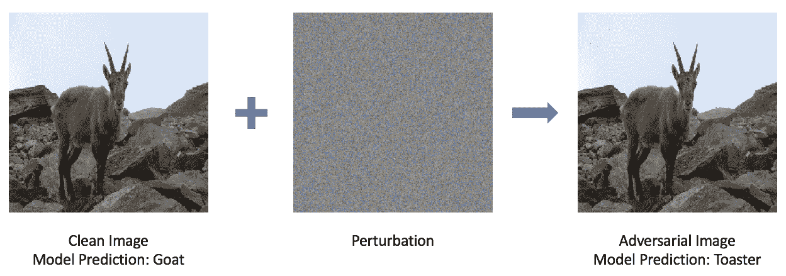
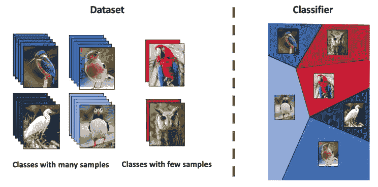
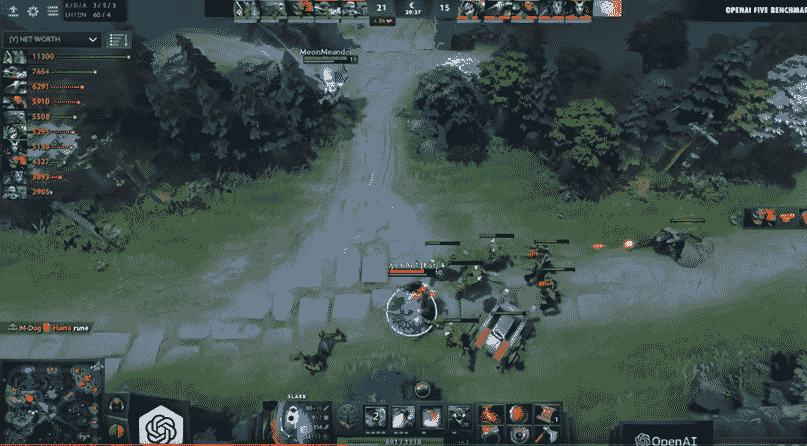

# 第十章：展望未来

在过去的几百页中，我们面临了许多挑战，并应用了强化学习和深度学习算法。为了总结我们的**强化学习**（**RL**）之旅，本章将探讨我们尚未涵盖的该领域的几个方面。我们将从讨论强化学习的几个缺点开始，任何从业者或研究人员都应该对此有所了解。为了以积极的语气结束，我们将描述该领域近年来所看到的许多令人兴奋的学术进展和成就。

# 强化学习的缺点

到目前为止，我们只讨论了强化学习算法能做什么。对于读者而言，强化学习可能看起来是解决各种问题的灵丹妙药。但为什么我们在现实生活中并没有看到强化学习算法的广泛应用呢？现实情况是，该领域存在许多缺点，阻碍了其商业化应用。

为什么有必要谈论该领域的缺陷？我们认为这将帮助你建立一个更全面、更客观的强化学习观念。此外，理解强化学习和机器学习的弱点是一个优秀的机器学习研究员或从业者的重要素质。在接下来的小节中，我们将讨论强化学习目前面临的一些最重要的局限性。

# 资源效率

当前的深度强化学习算法需要大量的时间、训练数据和计算资源，才能达到理想的熟练程度。对于像 AlphaGo Zero 这样的算法，它的强化学习算法在没有任何先验知识和经验的情况下学习围棋，资源效率成为了将此类算法推广到商业规模的主要瓶颈。回想一下，当 DeepMind 实现 AlphaGo Zero 时，他们需要在数千万场游戏中使用数百个 GPU 和数千个 CPU 来训练代理。为了让 AlphaGo Zero 达到合理的熟练度，它需要进行数百万场游戏，相当于数十万人的一生所进行的游戏数量。

除非未来普通消费者能够轻松利用像谷歌和英伟达今天所提供的庞大计算能力，否则开发超人类的强化学习算法的能力仍将远远超出公众的掌控。这意味着，强大的、资源密集型的强化学习算法将被少数几家机构垄断，这可能并非一件好事。

因此，在有限资源下使强化学习算法可训练将继续是社区必须解决的重要问题。

# 可重复性

在众多科学研究领域，一个普遍存在的问题是无法重复学术论文和期刊中所声称的实验结果。在 2016 年《自然》杂志（世界上最著名的科学期刊）进行的一项调查中，70%的受访者表示他们未能重复自己或其他研究者的实验结果。此外，对于无法重复实验结果的态度十分严峻，90%的研究人员认为确实存在可重复性危机。

《自然》报道的原始工作可以在这里找到：[`www.nature.com/news/1-500-scientists-lift-the-lid-on-reproducibility-1.19970`](https://www.nature.com/news/1-500-scientists-lift-the-lid-on-reproducibility-1.19970)。

尽管这项调查面向多个学科的研究人员，包括生物学和化学，但强化学习也面临类似的问题。在论文《深度强化学习的重要性》（参考文献见本章末尾；你可以在[`arxiv.org/pdf/1709.06560.pdf`](https://arxiv.org/pdf/1709.06560.pdf)查看在线版本）中，Peter Henderson 等人研究了深度强化学习算法的不同配置对实验结果的影响。这些配置包括超参数、随机数生成器的种子以及网络架构。

在极端情况下，他们发现，在对同一个模型进行训练时，使用两组五个不同的随机种子配置，最终得到的两个模型的平均回报存在显著差异。此外，改变其他设置，如 CNN 架构、激活函数和学习率，也对结果产生深远影响。

不一致和无法重复的结果意味着什么呢？随着强化学习和机器学习的应用和普及以接近指数的速度增长，互联网上可自由获取的强化学习算法实现数量也在增加。如果这些实现无法重现它们声称能够达到的结果，这将会在现实应用中引发重大问题和潜在危险。毫无疑问，没有人希望他们的自动驾驶汽车被实现得无法做出一致的决策！

# 可解释性/可追溯性

我们已经看到，代理的策略可以返回单一的动作或一组可能动作的概率分布，而它的价值函数可以返回某一状态的期望程度。那么，模型如何解释它是如何得出这些预测的呢？随着强化学习变得更加流行并有可能在现实应用中得到广泛应用，将会有越来越大的需求去解释强化学习算法的输出。

今天，大多数先进的强化学习算法都包含深度神经网络，而这些网络目前只能通过一组权重和一系列非线性函数来表示。此外，由于神经网络的高维特性，它们无法提供任何有意义的、直观的输入与相应输出之间的关系，普通人难以理解。因此，深度学习算法通常被称为“黑盒”，因为我们很难理解神经网络内部究竟发生了什么。

为什么强化学习算法需要具有可解释性？假设一辆自动驾驶汽车发生了车祸（假设这只是两辆车之间无害的小碰撞，驾驶员没有受伤）。人类驾驶员可以解释导致事故发生的原因；他们能够说明为什么采取某个特定的操作，以及事故发生时究竟发生了什么。这将帮助执法部门确定事故原因，并可能追究责任。然而，即使我们使用现有的算法创造出一个能够驾驶汽车的智能体，这依然是做不到的。

如果不能解释预测结果，用户和大众将难以信任任何使用机器学习的软件，尤其是在算法需要为做出重要决策负责的应用场景中。这对强化学习算法在实际应用中的普及构成了严重障碍。

# 易受攻击的风险

深度学习算法在多个任务中展现了惊人的成果，包括计算机视觉、自然语言处理和语音识别。在一些任务中，深度学习已经超越了人类的能力。然而，最近的研究表明，这些算法对攻击极为脆弱。所谓攻击，指的是对输入进行难以察觉的修改，从而导致模型表现出不同的行为。举个例子：

对抗攻击的示意图。通过对图像添加难以察觉的扰动，攻击者可以轻易欺骗深度学习图像分类器。

最右侧的图片是通过将左侧的原始图像和中间的扰动图像相加得到的结果。即便是最准确、表现最好的深度神经网络图像分类器，也无法将右侧的图像识别为山羊，反而将其误判为烤面包机。

这些例子让许多研究人员感到震惊，因为人们没想到深度学习算法如此脆弱，并容易受到此类攻击。这一领域现在被称为**对抗性机器学习**，随着越来越多的研究者关注深度学习算法的鲁棒性和漏洞，它的知名度和重要性也在迅速提升。

强化学习算法同样无法避免这些结果和攻击。根据 Anay Pattanaik 等人撰写的题为*《带有对抗攻击的鲁棒深度强化学习》*（[`arxiv.org/abs/1712.03632`](https://arxiv.org/abs/1712.03632)）的论文，对抗性攻击强化学习算法可以定义为任何可能的扰动，导致智能体在该状态下采取最差行动的概率增加。例如，我们可以在 Atari 游戏的屏幕上添加噪声，目的是欺骗玩游戏的 RL 智能体做出错误的决策，从而导致更低的分数。

更为严重的应用包括向街道标志添加噪声，以欺骗自动驾驶汽车将 STOP 标志误认为速度限制标志，或让 ATM 识别$100 支票为$1,000,000 支票，甚至欺骗面部识别系统将攻击者的面孔识别为其他用户的面孔。

不用多说，这些漏洞进一步增加了在实际、关乎安全的使用场景中采用深度学习算法的风险。虽然目前已有大量努力在应对对抗性攻击，但深度学习算法要足够强大以适应这些使用场景，仍然有很长的路要走。

# 强化学习的未来发展

前几节可能为深度学习（DL）和强化学习（RL）描绘了一个严峻的前景。然而，不必感到完全沮丧；事实上，现在正是深度学习和强化学习的激动人心时刻，许多重大的研究进展正在持续塑造该领域，并促使其以飞快的速度发展。随着计算资源和数据的不断增加，扩展和改进深度学习和强化学习算法的可能性也在不断扩展。

# 解决局限性

首先，前述问题已被研究界认识和承认，正在有多个方向进行解决。在 Pattanaik 等人研究中，作者不仅展示了当前深度强化学习算法容易受到对抗性攻击的影响，还提出了可以使这些算法对这些攻击更具鲁棒性的方法。特别是，通过在经过对抗性扰动的示例上训练深度 RL 算法，模型能够提高其对类似攻击的鲁棒性。这一技术通常被称为对抗训练。

此外，研究界正在积极采取行动解决可复现性问题。ICLR 和 ICML 是机器学习领域两个最大的会议，它们举办了挑战赛，邀请参与者重新实现并重新运行已提交论文中的实验，以复制报告的结果。参与者随后需要通过撰写可复现性报告来批评原始工作，报告应描述问题陈述、实验方法、实施细节、分析以及原始论文的可复现性。该挑战由 Joelle Pineau 和麦吉尔大学组织，旨在促进实验和学术工作的透明度，确保结果的可复现性和完整性。

关于 ICLR 2018 可复现性挑战的更多信息可以在此找到：[`www.cs.mcgill.ca/~jpineau/ICLR2018-ReproducibilityChallenge.html`](https://www.cs.mcgill.ca/~jpineau/ICLR2018-ReproducibilityChallenge.html)。同样，关于 ICML 原始可复现性研讨会的信息可以在此找到：[`sites.google.com/view/icml-reproducibility-workshop/home`](https://sites.google.com/view/icml-reproducibility-workshop/home)。

# 迁移学习

另一个越来越受到关注的重要话题是迁移学习。迁移学习是机器学习中的一种范式，其中在一个任务上训练的模型经过微调后，用于完成另一个任务。

例如，我们可以训练一个模型来识别汽车图像，并使用该模型的权重来初始化一个相同的模型，该模型学习识别卡车。主要的直觉是，通过在一个任务上进行训练学到的某些抽象概念和特征，可以迁移到其他类似的任务。这一思想同样适用于许多强化学习问题。一个学会玩特定 Atari 游戏的智能体应该能够熟练地玩其他 Atari 游戏，而不需要从头开始训练，就像人类一样。

Demis Hassabis，DeepMind 的创始人和深度强化学习的先驱，在最近的一次演讲中提到，迁移学习是实现通用智能的关键。而我认为，成功实现迁移学习的关键在于获取概念性知识，这些知识是从你学习的地方的感知细节中抽象出来的。

Demis Hassabis 的引用和相关演讲可以在此找到：[`www.youtube.com/watch?v=YofMOh6_WKo`](https://www.youtube.com/watch?v=YofMOh6_WKo)

在计算机视觉和自然语言处理领域，已经有多个进展，其中利用从一个领域初始化的知识和先验知识来学习另一个领域的数据。

这在第二领域缺乏数据时尤其有用。被称为**少样本**或**单样本**学习，这些技术允许模型即使在数据集较小的情况下，也能很好地学习执行任务，如下图所示：

一个关于少样本学习分类器学习如何为数据量较少的类别划分良好决策边界的示例

强化学习中的少样本学习涉及让智能体在给定任务上达到高水平的熟练度，而不依赖于大量的时间、数据和计算资源。设想一个可以轻松微调以在任何其他视频游戏中表现良好的通用游戏玩家智能体，且使用现成的计算资源；这将使强化学习算法的训练更加高效，从而更易于让更广泛的受众访问。

# 多智能体强化学习

另一个取得显著进展的有前景领域是多智能体强化学习。与我们之前看到的只有一个智能体做出决策的问题不同，这一主题涉及多个智能体同时并协作地做出决策，以实现共同目标。与此相关的最重要的工作之一是 OpenAI 的 Dota2 对战系统，名为**OpenAI Five**。Dota2 是世界上最受欢迎的**大型多人在线角色扮演游戏**（**MMORPGs**）之一。与围棋和 Atari 等传统的强化学习游戏相比，Dota2 由于以下原因更为复杂：

+   **多个智能体**：Dota2 游戏包含两支五人队伍，每支队伍争夺摧毁对方的基地。因此，决策不仅仅由一个智能体做出，而是由多个智能体同时做出。

+   **可观察性**：屏幕仅显示智能体角色的周围环境，而不是整个地图。这意味着游戏的整体状态，包括对手的位置和他们的行动，是不可观察的。在强化学习中，我们称这种情况为*部分可观察*状态。

+   **高维度性**：Dota2 智能体的观察可以包括 20,000 个数据点，每个点展示了人类玩家可能在屏幕上看到的内容，包括健康状态、控制角色的位置、敌人的位置以及任何攻击。而围棋则需要更少的数据点来构建一个观察（19 x 19 棋盘，历史走法）。因此，观察具有高维度性和复杂性。这同样适用于决策，Dota2 AI 的动作空间包含 17 万个可能性，包括移动、施放技能和使用物品的决策。

要了解更多关于 OpenAI 的 Dota2 AI 的信息，请查看他们的项目博客：[`blog.openai.com/openai-five/`](https://blog.openai.com/openai-five/)。

此外，通过对传统强化学习算法进行创新升级，OpenAI Five 中的每个智能体都能够学会与其他智能体协作，共同实现摧毁敌方基地的目标。它们甚至能够学习到一些经验丰富的玩家使用的团队策略。以下是 Dota2 玩家队伍与 OpenAI Five 之间比赛的一张截图：

OpenAI 对抗人类玩家（来源：[`www.youtube.com/watch?v=eaBYhLttETw`](https://www.youtube.com/watch?v=eaBYhLttETw)）

尽管这个项目需要极高的资源要求（240 个 GPU、120,000 个 CPU 核心、约 200 年人类游戏时间），它展示了当前的 AI 算法确实能够在一个极为复杂的环境中互相合作，达成共同目标。这项工作象征着 AI 和强化学习研究的另一个重要进展，并展示了当前技术的潜力。

# 摘要

这标志着我们在强化学习的入门之旅的结束。在本书的过程中，我们学习了如何实现能够玩 Atari 游戏、在 Minecraft 中导航、预测股市价格、玩复杂的围棋棋盘游戏，甚至生成其他神经网络来训练`CIFAR-10`数据的智能体。在此过程中，您已经掌握并习惯了许多基础的和最先进的深度学习与强化学习算法。简而言之，您已经取得了很多成就！

但这段旅程并不会也不应当就此结束。我们希望，凭借您新获得的技能和知识，您将继续利用深度学习和强化学习算法，解决本书之外的实际问题。更重要的是，我们希望本指南能激励您去探索机器学习的其他领域，进一步发展您的知识和经验。

强化学习社区面临许多障碍需要克服。然而，未来值得期待。随着该领域的日益流行和发展，我们迫不及待想要看到该领域将取得的新进展和里程碑。我们希望读者在完成本指南后，能够感到更加充实并准备好构建强化学习算法，并为该领域做出重要贡献。

# 参考文献

Open Science Collaboration. (2015)。*估算心理学科学的可重复性*。Science, 349(6251), aac4716。

Henderson, P., Islam, R., Bachman, P., Pineau, J., Precup, D., 和 Meger, D. (2017)。*真正重要的深度强化学习*。arXiv 预印本 arXiv:1709.06560。

Pattanaik, A., Tang, Z., Liu, S., Bommannan, G., 和 Chowdhary, G. (2018 年 7 月)。*抗干扰的强大深度强化学习*。载于第 17 届国际自主代理与多智能体系统会议论文集（第 2040-2042 页）。国际自主代理与多智能体系统基金会。
