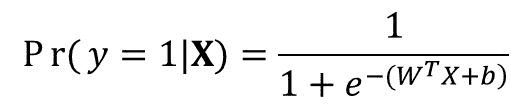

# 第二章：使用 R 进行深度学习

本章将为神经网络打下基础，接着是深度学习基础和趋势的介绍。我们将涵盖以下主题：

+   从逻辑回归开始

+   引入数据集

+   使用 H2O 执行逻辑回归

+   使用 TensorFlow 执行逻辑回归

+   可视化 TensorFlow 图

+   从多层感知机开始

+   使用 H2O 设置神经网络

+   使用 H2O 的网格搜索调优超参数

+   使用 MXNet 设置神经网络

+   使用 TensorFlow 设置神经网络

# 从逻辑回归开始

在深入探讨神经网络和深度学习模型之前，让我们先了解一下逻辑回归，它可以看作是一个单层神经网络。即使是逻辑回归中常用的**sigmoid**函数，也被用作神经网络中的激活函数。

# 准备工作

逻辑回归是一种监督学习方法，用于对二分类/有序（顺序离散）类别进行分类。

# 如何操作...

逻辑回归作为构建复杂神经网络模型的基础，使用 sigmoid 作为激活函数。逻辑函数（或 sigmoid）可以表示如下：


上述的 sigmoid 函数形成一个连续曲线，其值限制在 [0, 1] 之间，如下图所示：


Sigmoid 函数形式

逻辑回归模型的公式可以写作如下：



这里，*W* 是与特征 *X* = ** [*x[1], x[2], ..., x[m]*] 相关的权重，*b* 是模型的截距，也称为模型偏差。整个目标是优化 *W*，以适应给定的损失函数，例如交叉熵。另一种看待逻辑回归模型的方法是为了获得 *Pr*(*y=1|***X)**，如下图所示：


带有 sigmoid 激活函数的逻辑回归架构

# 引入数据集

该配方展示了如何准备一个数据集，供展示不同的模型使用。

# 准备工作

由于逻辑回归是线性分类器，它假设独立变量与对数几率之间是线性关系。因此，在独立特征与对数几率之间存在线性依赖的情况下，模型表现非常好。可以将高阶特征包含在模型中，以捕获非线性行为。让我们看看如何使用前一章讨论的主要深度学习包构建逻辑回归模型。需要互联网连接才能从 UCI 仓库下载数据集。

# 如何操作...

在本章中，将使用**UC Irivine ML 库**中的占用检测数据集，构建逻辑回归和神经网络模型。该数据集是一个实验性数据集，主要用于二元分类，判断一个房间是否被占用（1）或未被占用（0），基于多变量预测因子，如下表所示。该数据集的贡献者是*Luis Candanedo*，来自 UMONS。

下载数据集：[`archive.ics.uci.edu/ml/datasets/Occupancy+Detection+`](https://archive.ics.uci.edu/ml/datasets/Occupancy+Detection+)。

有三个数据集需要下载；然而，我们将使用`datatraining.txt`进行训练/交叉验证，并使用`datatest.txt`进行测试。

该数据集包含七个属性（包括响应变量占用情况），共 20,560 个实例。以下表格总结了属性信息：

| **属性** | **描述** | **特性** |
| --- | --- | --- |
| 日期时间 | 年-月-日 时:分:秒格式 | 日期 |
| 温度 | 单位为摄氏度（Celsius） | 实际值 |
| 相对湿度 | 单位为百分比（%） | 实际值 |
| 光照 | 单位为勒克斯（Lux） | 实际值 |
| CO2 | 单位为 ppm | 实际值 |
| 湿度比 | 由温度和相对湿度推导而来，单位为水蒸气/空气，单位为 kg/kg | 实际值 |
| 占用状态 | 0 表示未占用；1 表示已占用 | 二元类别 |

# 使用 H2O 执行逻辑回归

**广义线性模型**（**GLM**）广泛应用于基于回归和分类的预测分析。这些模型通过最大似然法进行优化，并能够很好地扩展至更大的数据集。在 H2O 中，GLM 具有处理 L1 和 L2 惩罚（包括弹性网）的灵活性。它支持高斯、二项、泊松和伽玛分布的因变量。它在处理分类变量、计算完整的正则化并执行分布式*n 折*交叉验证以防止模型过拟合方面非常高效。它具有优化超参数的功能，如使用分布式网格搜索来优化弹性网（α），并处理预测属性系数的上下界。它还可以自动处理缺失值填充。它采用 Hogwild 方法进行优化，这是随机梯度下降的并行版本。

# 准备就绪

前一章提供了 H2O 在 R 中的安装细节，并展示了使用其 Web 界面的工作示例。要开始建模，请在 R 环境中加载`h20`包：

```py
require(h2o)

```

然后，使用`h2o.init()`函数初始化一个单节点的 H2O 实例，运行在八个核心上，并在 IP 地址`localhost`和端口号`54321`上实例化相应的客户端模块：

```py
localH2O = h2o.init(ip = "localhost", port = 54321, startH2O = TRUE,min_mem_size = "20G",nthreads = 8)

```

H2O 包依赖 Java JRE。因此，必须在执行初始化命令之前预先安装它。

# 如何执行...

本节将演示使用 H2O 构建 GLM 模型的步骤。

1.  现在，在 R 中加载占用训练集和测试集数据集：

```py
# Load the occupancy data 
occupancy_train <-read.csv("C:/occupation_detection/datatraining.txt",stringsAsFactors = T)
occupancy_test <- read.csv("C:/occupation_detection/datatest.txt",stringsAsFactors = T)

```

1.  以下独立变量（`x`）和因变量（`y`）将用于建模 GLM：

```py
# Define input (x) and output (y) variables"
x = c("Temperature", "Humidity", "Light", "CO2", "HumidityRatio")
y = "Occupancy"

```

1.  根据 H2O 的要求，将因变量转换为因子，如下所示：

```py
# Convert the outcome variable into factor
occupancy_train$Occupancy <- as.factor(occupancy_train$Occupancy)
occupancy_test$Occupancy <- as.factor(occupancy_test$Occupancy)

```

1.  然后，将数据集转换为 H2OParsedData 对象：

```py
occupancy_train.hex <- as.h2o(x = occupancy_train, destination_frame = "occupancy_train.hex")
occupancy_test.hex <- as.h2o(x = occupancy_test, destination_frame = "occupancy_test.hex")

```

1.  一旦数据被加载并转换为 H2OParsedData 对象，使用`h2o.glm`函数运行 GLM 模型。在当前的设置中，我们计划训练五折交叉验证、弹性网正则化（*α = 5*）和最优正则化强度（`lamda_search = TRUE`）等参数：

```py
# Train the model
occupancy_train.glm <- h2o.glm(x = x, # Vector of predictor variable names
                               y = y, # Name of response/dependent variable
                               training_frame = occupancy_train.hex, # Training data
                               seed = 1234567,        # Seed for random numbers
                               family = "binomial",   # Outcome variable
                               lambda_search = TRUE,  # Optimum regularisation lambda
                               alpha = 0.5,           # Elastic net regularisation
                               nfolds = 5             # N-fold cross validation
                               )

```

1.  除了前面的命令外，您还可以定义其他参数来微调模型性能。以下列表未涵盖所有功能参数，而是根据重要性涵盖了一些。完整的参数列表可以在`h2o`包的文档中找到。

+   +   使用 fold_assignment 指定生成交叉验证样本的策略，如随机抽样、分层抽样、模数抽样和自动（选择）。也可以通过指定列名（fold_column）在特定属性上进行采样。

    +   通过为每个观测值指定权重（weights_column）或执行过/欠采样（balance_classes）来处理倾斜结果（不平衡数据）的选项。

    +   通过均值插补或跳过观测值的方式处理缺失值的选项，使用 missing_values_handling。

    +   通过使用 non_negative 选项限制系数为非负，并使用 beta_constraints 约束其值的选项。

    +   如果响应变量的均值未反映现实，可以为 y==1（逻辑回归）提供先验概率（prior）以用于抽样数据。

    +   指定需要考虑交互作用（interactions）的变量。

# 它是如何工作的...

模型的性能可以通过多种指标进行评估，例如准确率、**曲线下面积**（**AUC**）、误分类错误（%）、误分类错误计数、F1 分数、精度、召回率、特异性等。然而，在本章中，模型性能的评估是基于 AUC 的。

以下是训练模型的训练和交叉验证准确度：

```py
# Training accuracy (AUC)
> occupancy_train.glm@model$training_metrics@metrics$AUC
[1] 0.994583

# Cross validation accuracy (AUC)
> occupancy_train.glm@model$cross_validation_metrics@metrics$AUC
[1] 0.9945057

```

现在，让我们评估模型在测试数据上的表现。以下代码帮助预测测试数据的结果：

```py
# Predict on test data
yhat <- h2o.predict(occupancy_train.glm, occupancy_test.hex)

```

然后，根据实际测试结果评估`AUC`值，如下所示：

```py
# Test accuracy (AUC)
> yhat$pmax <- pmax(yhat$p0, yhat$p1, na.rm = TRUE) 
> roc_obj <- pROC::roc(c(as.matrix(occupancy_test.hex$Occupancy)),
                       c(as.matrix(yhat$pmax)))
> auc(roc_obj)
Area under the curve: 0.9915

```

在 H2O 中，还可以从 GLM 模型中计算变量的重要性，如下图所示：

```py
#compute variable importance and performance
h2o.varimp_plot(occupancy_train.glm, num_of_features = 5)

```


使用 H2O 进行变量重要性评估

# 另见

更多关于`h2o.glm`的功能参数可以参考[`www.rdocumentation.org/packages/h2o/versions/3.10.3.6/topics/h2o.gbm`](https://www.rdocumentation.org/packages/h2o/versions/3.10.3.6/topics/h2o.gbm)。

# 使用 TensorFlow 执行逻辑回归

在本节中，我们将介绍 TensorFlow 在设置逻辑回归模型中的应用。示例将使用与 H2O 模型设置中类似的数据集。

# 准备就绪

前一章提供了 TensorFlow 安装的详细信息。本节的代码是在 Linux 上创建的，但可以在任何操作系统上运行。要开始建模，请在环境中加载 `tensorflow` 包。R 会加载默认的 TensorFlow 环境变量，还会从 Python 中加载 NumPy 库至 `np` 变量：

```py
library("tensorflow") # Load TensorFlow 
np <- import("numpy") # Load numpy library

```

# 如何执行...

数据使用 R 中的标准函数导入，如以下代码所示。

1.  数据使用 `read.csv` 文件导入，并转换为矩阵格式，接着选择用于建模的特征，如 `xFeatures` 和 `yFeatures`*.* 接下来的步骤是在 TensorFlow 中设置一个图形以进行优化：

```py
# Loading input and test data
xFeatures = c("Temperature", "Humidity", "Light", "CO2", "HumidityRatio")
yFeatures = "Occupancy"
occupancy_train <-as.matrix(read.csv("datatraining.txt",stringsAsFactors = T))
occupancy_test <- as.matrix(read.csv("datatest.txt",stringsAsFactors = T))

# subset features for modeling and transform to numeric values
occupancy_train<-apply(occupancy_train[, c(xFeatures, yFeatures)], 2, FUN=as.numeric) 
occupancy_test<-apply(occupancy_test[, c(xFeatures, yFeatures)], 2, FUN=as.numeric)

# Data dimensions
nFeatures<-length(xFeatures)
nRow<-nrow(occupancy_train)

```

1.  在设置图形之前，让我们使用以下命令重置图形：

```py
# Reset the graph
tf$reset_default_graph()

```

1.  此外，让我们启动一个交互式会话，这样可以在不引用会话间对象的情况下执行变量：

```py
# Starting session as interactive session
sess<-tf$InteractiveSession()

```

1.  在 TensorFlow 中定义逻辑回归模型：

```py
# Setting-up Logistic regression graph
x <- tf$constant(unlist(occupancy_train[, xFeatures]), shape=c(nRow, nFeatures), dtype=np$float32) # 
W <- tf$Variable(tf$random_uniform(shape(nFeatures, 1L)))
b <- tf$Variable(tf$zeros(shape(1L)))
y <- tf$matmul(x, W) + b

```

1.  输入特征 `x` 被定义为常量，因为它将作为系统的输入。权重 `W` 和偏置 `b` 被定义为变量，在优化过程中会进行优化。`y` 被设置为 `x`、`W` 和 `b` 之间的符号表示。权重 `W` 设置为初始化的随机均匀分布，而 `b` 的值被赋为零。

1.  下一步是设置逻辑回归的成本函数：

```py
# Setting-up cost function and optimizer
y_ <- tf$constant(unlist(occupancy_train[, yFeatures]), dtype="float32", shape=c(nRow, 1L))
cross_entropy<-tf$reduce_mean(tf$nn$sigmoid_cross_entropy_with_logits(labels=y_, logits=y, name="cross_entropy"))
optimizer <- tf$train$GradientDescentOptimizer(0.15)$minimize(cross_entropy)

```

变量 `y_` 是响应变量。逻辑回归使用交叉熵作为损失函数进行设置。损失函数被传递给梯度下降优化器，学习率为 0.15。优化之前，初始化全局变量：

```py
# Start a session
init <- tf$global_variables_initializer()
sess$run(init)

```

1.  执行梯度下降算法，通过交叉熵作为损失函数优化权重：

```py
# Running optimization 
for (step in 1:5000) {
  sess$run(optimizer)
  if (step %% 20== 0)
    cat(step, "-", sess$run(W), sess$run(b), "==>", sess$run(cross_entropy), "n")
}

```

# 它是如何工作的...

可以使用 AUC 来评估模型的性能：

```py
# Performance on Train
library(pROC) 
ypred <- sess$run(tf$nn$sigmoid(tf$matmul(x, W) + b))
roc_obj <- roc(occupancy_train[, yFeatures], as.numeric(ypred))

# Performance on test
nRowt<-nrow(occupancy_test)
xt <- tf$constant(unlist(occupancy_test[, xFeatures]), shape=c(nRowt, nFeatures), dtype=np$float32)
ypredt <- sess$run(tf$nn$sigmoid(tf$matmul(xt, W) + b))
roc_objt <- roc(occupancy_test[, yFeatures], as.numeric(ypredt)).

```

AUC 可以使用来自 `pROC` 包的 `plot.auc` 函数进行可视化，如以下命令的截图所示。训练和测试（hold-out）的性能非常相似。

```py
plot.roc(roc_obj, col = "green", lty=2, lwd=2)
plot.roc(roc_objt, add=T, col="red", lty=4, lwd=2)

```


使用 TensorFlow 执行逻辑回归的性能

# 可视化 TensorFlow 图

可以使用 TensorBoard 来可视化 TensorFlow 图。它是一个利用 TensorFlow 事件文件来可视化 TensorFlow 模型为图形的服务。TensorBoard 中的图形模型可视化还可以用于调试 TensorFlow 模型。

# 准备就绪

可以通过在终端中使用以下命令启动 TensorBoard：

```py
$ tensorboard --logdir home/log --port 6006 

```

以下是 TensorBoard 的主要参数：

+   `--logdir`：映射到加载 TensorFlow 事件的目录

+   `--debug`：增加日志的详细程度

+   `--host`：定义主机以监听其本地主机（`127.0.0.1`）默认地址

+   `--port`：定义 TensorBoard 提供服务的端口

上述命令将在本地主机的 `6006` 端口启动 TensorFlow 服务，如下图所示：


TensorBoard

TensorBoard 中的标签捕捉在图执行过程中生成的相关数据。

# 如何实现...

本节介绍了如何在 TensorBoard 中可视化 TensorFlow 模型和输出。

1.  为了可视化摘要和图表，可以使用来自总结模块的`FileWriter`命令将 TensorFlow 的数据导出。可以使用以下命令添加默认的会话图：

```py
# Create Writer Obj for log
log_writer = tf$summary$FileWriter('c:/log', sess$graph)

```

使用前述代码开发的逻辑回归图如下图所示：


在 TensorBoard 中可视化逻辑回归图

关于 TensorBoard 上符号描述的详细信息可以在[`www.tensorflow.org/get_started/graph_viz`](https://www.tensorflow.org/get_started/graph_viz)找到。

1.  同样，其他变量摘要可以使用正确的摘要添加到 TensorBoard，如以下代码所示：

```py
# Adding histogram summary to weight and bias variable
w_hist = tf$histogram_summary("weights", W)
b_hist = tf$histogram_summary("biases", b)

```

摘要是判断模型性能的非常有用的方式。例如，对于前述案例，可以通过研究测试和训练的成本函数来理解优化性能和收敛情况。

1.  为测试创建交叉熵评估。生成测试和训练的交叉熵成本函数的示例脚本如下所示：

```py
# Set-up cross entropy for test
nRowt<-nrow(occupancy_test)
xt <- tf$constant(unlist(occupancy_test[, xFeatures]), shape=c(nRowt, nFeatures), dtype=np$float32)
ypredt <- tf$nn$sigmoid(tf$matmul(xt, W) + b)
yt_ <- tf$constant(unlist(occupancy_test[, yFeatures]), dtype="float32", shape=c(nRowt, 1L))
cross_entropy_tst<-tf$reduce_mean(tf$nn$sigmoid_cross_entropy_with_logits(labels=yt_, logits=ypredt, name="cross_entropy_tst"))

```

上述代码与使用不同数据集进行训练交叉熵计算相似。通过设置一个函数返回张量对象，可以将工作量最小化。

1.  添加要收集的摘要变量：

```py
# Add summary ops to collect data
w_hist = tf$summary$histogram("weights", W)
b_hist = tf$summary$histogram("biases", b)
crossEntropySummary<-tf$summary$scalar("costFunction", cross_entropy)
crossEntropyTstSummary<-tf$summary$scalar("costFunction_test", cross_entropy_tst)

```

该脚本定义了要记录在文件中的总结事件。

1.  打开写入对象`log_writer`。它将默认图写入位置`c:/log`：

```py
# Create Writer Obj for log
log_writer = tf$summary$FileWriter('c:/log', sess$graph)

```

1.  运行优化并收集摘要：

```py
for (step in 1:2500) {
  sess$run(optimizer)

  # Evaluate performance on training and test data after 50 Iteration
  if (step %% 50== 0){
   ### Performance on Train
   ypred <- sess$run(tf$nn$sigmoid(tf$matmul(x, W) + b))
   roc_obj <- roc(occupancy_train[, yFeatures], as.numeric(ypred))

   ### Performance on Test
   ypredt <- sess$run(tf$nn$sigmoid(tf$matmul(xt, W) + b))
   roc_objt <- roc(occupancy_test[, yFeatures], as.numeric(ypredt))
   cat("train AUC: ", auc(roc_obj), " Test AUC: ", auc(roc_objt), "n")

   # Save summary of Bias and weights
   log_writer$add_summary(sess$run(b_hist), global_step=step)
   log_writer$add_summary(sess$run(w_hist), global_step=step)
   log_writer$add_summary(sess$run(crossEntropySummary), global_step=step)
   log_writer$add_summary(sess$run(crossEntropyTstSummary), global_step=step)
} }

```

1.  使用总结模块的`merge_all`命令将所有摘要收集到一个张量中：

```py
summary = tf$summary$merge_all() 

```

1.  使用`log_writer`对象将摘要写入日志文件：

```py
log_writer = tf$summary$FileWriter('c:/log', sess$graph)
summary_str = sess$run(summary)
log_writer$add_summary(summary_str, step)
log_writer$close()

```

# 它是如何工作的...

本节介绍了使用 TensorBoard 可视化模型性能。训练和测试的交叉熵记录在 SCALARS 标签中，如以下屏幕截图所示：


训练和测试数据的交叉熵

目标函数在训练和测试成本函数上表现出类似的行为；因此，对于给定的案例，模型似乎是稳定的，且收敛大约在 1,600 次迭代时达到。

# 从多层感知机开始

本节将重点介绍将逻辑回归概念扩展到神经网络。

神经网络，也称为**人工神经网络**（**ANN**），是一种受生物大脑神经结构启发的计算范式。

# 准备工作

人工神经网络（ANN）是一组执行数据简单操作的人工神经元；这些操作的输出传递给另一个神经元。在每个神经元生成的输出称为其**激活函数**。多层感知机模型的示例可以在以下屏幕截图中看到：


多层神经网络的示例

上述图中的每一条连接都与神经元处理的权重相关。每个神经元可以看作是一个处理单元，接收输入并将输出传递给下一层，示例如下图所示：


一个神经元接收三个输入并输出一个结果的示例

上述图示展示了三个输入合并到神经元中，产生一个输出，之后可能传递给另一个神经元。神经元的处理操作可以是非常简单的操作，例如输入乘以权重再求和，或者是一个变换操作，例如 Sigmoid 激活函数。

# 如何实现…

本节介绍了多层感知机中的激活函数类型。激活函数是人工神经网络中的关键组件之一，它根据给定输入定义节点的输出。在构建神经网络时，使用了多种不同的激活函数：

+   **Sigmoid**：Sigmoid 激活函数是一个连续函数，也称为逻辑函数，形式为 *1/(1+exp(-x))*。Sigmoid 函数在训练过程中有使反向传播项归零的倾向，导致响应饱和。在 TensorFlow 中，Sigmoid 激活函数使用 `tf.nn.sigmoid` 函数定义。

+   **ReLU**：修正线性单元（ReLU）是最著名的连续但不光滑的激活函数之一，用于神经网络中捕捉非线性。ReLU 函数的定义是 *max(0,x)*。在 TensorFlow 中，ReLU 激活函数定义为 `tf.nn.relu`*。

+   **ReLU6**：它将 ReLU 函数的输出上限限制为 6，定义为 *min(max(0,x), 6)*，因此值不会变得过小或过大。该函数在 TensorFlow 中的定义是 `tf.nn.relu6`。

+   **tanh**：双曲正切函数是另一种平滑函数，作为神经网络中的激活函数使用，其值域为[ -1 到 1]，并通过 `tf.nn.tanh` 实现。

+   **softplus**：它是 ReLU 的连续版本，因此其导数存在，定义为 *log(exp(x)+1)*。在 TensorFlow 中，softplus 函数定义为 `tf.nn.softplus`。

# 还有更多…

神经网络中有三种主要的网络架构：

+   **前馈型人工神经网络**：这是一种神经网络模型，信息流从输入到输出是单向的，因此架构不会形成任何循环。以下图展示了一个前馈型网络的示例：


神经网络的前馈架构

+   **反馈型人工神经网络**：这也被称为 Elman 递归网络，是一种神经网络类型，其中输出节点的误差作为反馈，迭代更新以最小化误差。以下图展示了一个单层反馈型神经网络架构的示例：


神经网络的反馈架构

+   **横向 ANN**：这是一类神经网络，介于反馈神经网络和前馈神经网络之间，神经元在层之间相互作用。以下是一个横向神经网络架构的示例：


横向神经网络架构

# 另见

在 TensorFlow 中支持的更多激活函数可以在[`www.tensorflow.org/versions/r0.10/api_docs/python/nn/activation_functions_`](https://www.tensorflow.org/versions/r0.10/api_docs/python/nn/activation_functions_)找到。

# 使用 H2O 设置神经网络

本节将介绍如何使用 H2O 设置神经网络。该示例将使用与逻辑回归中类似的数据集。

# 准备工作

我们首先使用以下代码加载所有所需的包：

```py
# Load the required packages
require(h2o)

```

然后，使用`h2o.init()`函数在八个核心上初始化一个单节点 H2O 实例，并在 IP 地址`localhost`和端口号`54321`上实例化相应的客户端模块：

```py
# Initialize H2O instance (single node)
localH2O = h2o.init(ip = "localhost", port = 54321, startH2O = TRUE,min_mem_size = "20G",nthreads = 8)

```

# 如何操作...

本节展示了如何使用 H20 构建神经网络。

1.  在 R 中加载占用训练和测试数据集：

```py
# Load the occupancy data 
occupancy_train <-read.csv("C:/occupation_detection/datatraining.txt",stringsAsFactors = T)
occupancy_test <- read.csv("C:/occupation_detection/datatest.txt",stringsAsFactors = T)

```

1.  以下独立变量（`x`）和因变量（`y`）将用于建模 GLM：

```py
# Define input (x) and output (y) variables
x = c("Temperature", "Humidity", "Light", "CO2", "HumidityRatio")
y = "Occupancy"

```

1.  根据 H2O 的要求，将因变量转换为因子，方法如下：

```py
# Convert the outcome variable into factor
occupancy_train$Occupancy <- as.factor(occupancy_train$Occupancy)
occupancy_test$Occupancy <- as.factor(occupancy_test$Occupancy)

```

1.  然后将数据集转换为 H2OParsedData 对象：

```py
# Convert Train and Test datasets into H2O objects
occupancy_train.hex <- as.h2o(x = occupancy_train, destination_frame = "occupancy_train.hex")
occupancy_test.hex <- as.h2o(x = occupancy_test, destination_frame = "occupancy_test.hex")

```

1.  一旦数据加载并转换为 H2OParsedData 对象，使用`h2o.deeplearning`函数构建多层前馈神经网络。在当前设置中，使用以下参数构建 NN 模型：

+   +   使用`hidden`创建一个包含五个神经元的单隐藏层

    +   使用`epochs`进行 50 次迭代

    +   使用自适应学习率（`adaptive_rate`）代替固定学习率（rate）

    +   基于 ReLU 的`Rectifier`激活函数

    +   使用`nfold`进行五折交叉验证

```py
# H2O based neural network to Train the model 
occupancy.deepmodel <- h2o.deeplearning(x = x, 
                                        y = y, 
                                        training_frame = occupancy_train.hex, 
                                        validation_frame = occupancy_test.hex, 
                                        standardize = F, 
                                        activation = "Rectifier", 
                                        epochs = 50, 
                                        seed = 1234567, 
                                        hidden = 5, 
                                        variable_importances = T,
                                        nfolds = 5,
                                        adpative_rate = TRUE)

```

1.  除了配方中描述的*使用 H2O 执行逻辑回归*命令外，你还可以定义其他参数来微调模型性能。以下列表未覆盖所有功能参数，但涵盖了一些重要的参数。完整的参数列表可以在`h2o`包的文档中找到。

+   +   选项可以使用预训练的自编码器模型初始化模型。

    +   通过修改时间衰减因子（*rho*）和平滑因子（*epsilon*）的选项来微调自适应学习率。对于固定学习率（*rate*），可以选择修改退火率（*rate_annealing*）和层之间的衰减因子（*rate_decay*）。

    +   初始化权重和偏差的选项，以及权重分布和缩放。

    +   基于分类中的错误比例和回归中的均方误差的停止标准（*classification_stop* 和 *regression_stop*）。还可以选择执行早期停止。

    +   使用弹性平均方法改进分布式模型收敛的选项，包括移动速率和正则化强度等参数。

# 它是如何工作的...

模型的性能可以通过多种指标进行评估，例如准确率、AUC、误分类错误率（%）、误分类错误计数、F1 分数、精确度、召回率、特异性等。然而，在本章中，模型性能的评估是基于 AUC。

以下是训练模型的训练集和交叉验证准确度。训练集和交叉验证 AUC 分别为 `0.984` 和 `0.982`：

```py
# Get the training accuracy (AUC)
> train_performance <- h2o.performance(occupancy.deepmodel,train = T)
> train_performance@metrics$AUC
[1] 0.9848667

# Get the cross-validation accuracy (AUC)
> xval_performance <- h2o.performance(occupancy.deepmodel,xval = T)
> xval_performance@metrics$AUC
[1] 0.9821723

```

因为我们已经在模型中提供了测试数据（作为验证数据集），下面是其性能。测试数据集上的 AUC 为 `0.991`。

```py
# Get the testing accuracy(AUC)
> test_performance <- h2o.performance(occupancy.deepmodel,valid = T)
> test_performance@metrics$AUC
[1] 0.9905056

```

# 在 H2O 中使用网格搜索调优超参数

H2O 包还允许通过网格搜索（`h2o.grid`）执行超参数调优。

# 准备开始

我们首先加载并初始化 H2O 包，代码如下：

```py
# Load the required packages
require(h2o)

# Initialize H2O instance (single node)
localH2O = h2o.init(ip = "localhost", port = 54321, startH2O = TRUE,min_mem_size = "20G",nthreads = 8)

```

载入占用数据集，转换为十六进制格式，并命名为 *occupancy_train.hex*。

# 如何做...

本节将重点介绍如何使用网格搜索优化 H2O 中的超参数。

1.  在我们的例子中，我们将优化激活函数、隐藏层数量（以及每层中的神经元数量）、`epochs` 和正则化参数 lambda（`l1` 和 `l2`）：

```py
# Perform hyper parameter tuning
activation_opt <- c("Rectifier","RectifierWithDropout", "Maxout","MaxoutWithDropout")
hidden_opt <- list(5, c(5,5))
epoch_opt <- c(10,50,100)
l1_opt <- c(0,1e-3,1e-4)
l2_opt <- c(0,1e-3,1e-4)

hyper_params <- list(activation = activation_opt,
                     hidden = hidden_opt,
                     epochs = epoch_opt,
                     l1 = l1_opt,
                     l2 = l2_opt)

```

1.  以下是设置进行网格搜索的搜索标准。除了以下列表外，还可以指定停止度量的类型、停止的最小容忍度和最大停止轮次：

```py
#set search criteria
search_criteria <- list(strategy = "RandomDiscrete", max_models=300)

```

1.  现在，让我们对训练数据执行网格搜索，具体如下：

```py
# Perform grid search on training data
dl_grid <- h2o.grid(x = x,
                    y = y,
                    algorithm = "deeplearning",
                    grid_id = "deep_learn",
                    hyper_params = hyper_params,
                    search_criteria = search_criteria,
                    training_frame = occupancy_train.hex,
                    nfolds = 5)

```

1.  一旦网格搜索完成（此处共有 216 个不同的模型），可以根据多个指标选择最佳模型，例如对数损失、残差偏差、均方误差、AUC、准确率、精确度、召回率、F1 分数等。在我们的场景中，选择 AUC 最高的最佳模型：

```py
#Select best model based on auc
d_grid <- h2o.getGrid("deep_learn",sort_by = "auc", decreasing = T)
best_dl_model <- h2o.getModel(d_grid@model_ids[[1]])

```

# 它是如何工作的...

以下是网格搜索模型在训练集和交叉验证数据集上的表现。我们可以观察到，在执行网格搜索后，训练集和交叉验证数据集的 AUC 都增加了一个单位。网格搜索后的训练集和交叉验证 AUC 分别为 `0.996` 和 `0.997`。

```py
# Performance on Training data after grid search
> train_performance.grid <- h2o.performance(best_dl_model,train = T)
> train_performance.grid@metrics$AUC
[1] 0.9965881

# Performance on Cross validation data after grid search
> xval_performance.grid <- h2o.performance(best_dl_model,xval = T)
> xval_performance.grid@metrics$AUC
[1] 0.9979131

```

现在，让我们评估在测试数据集上进行网格搜索后最佳模型的性能。我们可以观察到，在执行网格搜索后，AUC 增加了 0.25 个单位。测试数据集上的 AUC 为 `0.993`。

```py
# Predict the outcome on test dataset
yhat <- h2o.predict(best_dl_model, occupancy_test.hex) 

# Performance of the best grid-searched model on the Test dataset
> yhat$pmax <- pmax(yhat$p0, yhat$p1, na.rm = TRUE) 
> roc_obj <- pROC::roc(c(as.matrix(occupancy_test.hex$Occupancy)), c(as.matrix(yhat$pmax)))
> pROC::auc(roc_obj)
Area under the curve: 0.9932

```

# 使用 MXNet 设置神经网络

上一章提供了在 R 中安装 MXNet 的详细信息，并通过其 Web 界面展示了一个工作示例。要开始建模，请在 R 环境中加载 MXNet 包。

# 准备开始

加载所需的包：

```py
# Load the required packages
require(mxnet)

```

# 如何做...

1.  在 R 中加载占用训练集和测试集数据集：

```py
# Load the occupancy data 
occupancy_train <-read.csv("C:/occupation_detection/datatraining.txt",stringsAsFactors = T)
occupancy_test <- read.csv("C:/occupation_detection/datatest.txt",stringsAsFactors = T)

```

1.  以下是用于建模 GLM 的独立变量（`x`）和依赖变量（`y`）：

```py
# Define input (x) and output (y) variables
x = c("Temperature", "Humidity", "Light", "CO2", "HumidityRatio")
y = "Occupancy"

```

1.  根据 MXNet 的要求，将训练集和测试集数据集转换为矩阵，并确保结果变量的类别是数值型（而不是像 H2O 中那样的因子型）：

```py
# convert the train data into matrix
occupancy_train.x <- data.matrix(occupancy_train[,x])
occupancy_train.y <- occupancy_train$Occupancy

# convert the test data into matrix
occupancy_test.x <- data.matrix(occupancy_test[,x])
occupancy_test.y <- occupancy_test$Occupancy

```

1.  现在，让我们手动配置一个神经网络。首先，配置一个具有特定名称的符号变量。然后，配置一个包含五个神经元的符号全连接网络，并跟随使用对数损失函数（或交叉熵损失函数）的 softmax 激活函数。还可以创建额外的（全连接的）隐藏层，并使用不同的激活函数。

```py
# Configure Neural Network structure 
smb.data <- mx.symbol.Variable("data")
smb.fc <- mx.symbol.FullyConnected(smb.data, num_hidden=5) 
smb.soft <- mx.symbol.SoftmaxOutput(smb.fc)

```

1.  一旦神经网络配置完成，接下来我们使用 `mx.model.FeedForward.create` 函数创建（或训练）前馈神经网络模型。模型的参数如迭代次数或周期数（*100*）、评估指标（分类准确率）、每次迭代或周期的大小（100 个观察值）以及学习率（*0.01*）被调整：

```py
# Train the network
model.nn <- mx.model.FeedForward.create(symbol = smb.soft,
                                        X = occupancy_train.x,
                                        y = occupancy_train.y,
                                        ctx = mx.cpu(),
                                        num.round = 100,
                                        eval.metric = mx.metric.accuracy,
                                        array.batch.size = 100,
                                        learning.rate = 0.01)

```

# 它是如何工作的...

现在，让我们评估模型在训练和测试数据集上的表现。训练数据集上的 AUC 为 `0.978`，测试数据集上的 AUC 为 `0.982`：

```py
# Train accuracy (AUC)
> train_pred <- predict(model.nn,occupancy_train.x)
> train_yhat <- max.col(t(train_pred))-1
> roc_obj <- pROC::roc(c(occupancy_train.y), c(train_yhat))
> pROC::auc(roc_obj)
Area under the curve: 0.9786

#Test accuracy (AUC)
> test_pred <- predict(nnmodel,occupancy_test.x)
> test_yhat <- max.col(t(test_pred))-1
> roc_obj <- pROC::roc(c(occupancy_test.y), c(test_yhat))
> pROC::auc(roc_obj)
Area under the curve: 0.9824

```

# 使用 TensorFlow 设置神经网络

在本节中，我们将介绍 TensorFlow 在设置二层神经网络模型中的应用。

# 准备工作

要开始建模，在环境中加载 `tensorflow` 包。R 会加载默认的 tf 环境变量，并从 Python 中加载 NumPy 库到 `np` 变量：

```py
library("tensorflow") # Load Tensorflow 
np <- import("numpy") # Load numpy library

```

# 如何操作...

1.  数据通过 R 中的标准函数导入，如以下代码所示。数据通过 `read.csv` 文件导入，并转换为矩阵格式，接着选择用于建模的特征，这些特征在 `xFeatures` 和 `yFeatures` 中定义*：* 

```py
# Loading input and test data
xFeatures = c("Temperature", "Humidity", "Light", "CO2", "HumidityRatio")
yFeatures = "Occupancy"
occupancy_train <-as.matrix(read.csv("datatraining.txt",stringsAsFactors = T))
occupancy_test <- as.matrix(read.csv("datatest.txt",stringsAsFactors = T))

# subset features for modeling and transform to numeric values
occupancy_train<-apply(occupancy_train[, c(xFeatures, yFeatures)], 2, FUN=as.numeric) 
occupancy_test<-apply(occupancy_test[, c(xFeatures, yFeatures)], 2, FUN=as.numeric)

# Data dimensions
nFeatures<-length(xFeatures)
nRow<-nrow(occupancy_train)

```

1.  现在加载网络和模型参数。网络参数定义了神经网络的结构，模型参数定义了其调整标准。如前所述，神经网络是通过两层隐藏层构建的，每一层有五个神经元。`n_input` 参数定义了自变量的数量，`n_classes` 定义了输出类别数量减一的值。在输出变量为 one-hot 编码的情况下（一个属性为占用，另一个属性为不占用），`n_classes` 将为 2L（等于 one-hot 编码属性的数量）。在模型参数中，学习率为 `0.001`，模型构建的周期数（或迭代次数）为 `10000`：

```py
# Network Parameters
n_hidden_1 = 5L # 1st layer number of features
n_hidden_2 = 5L # 2nd layer number of features
n_input = 5L    # 5 attributes
n_classes = 1L  # Binary class

# Model Parameters
learning_rate = 0.001
training_epochs = 10000

```

1.  在 TensorFlow 中的下一步是设置一个图来执行优化。在设置图之前，使用以下命令重置图：

```py
# Reset the graph
tf$reset_default_graph()

```

1.  此外，让我们启动一个交互式会话，因为它将允许我们在不引用会话之间对象的情况下执行变量：

```py
# Starting session as interactive session
sess<-tf$InteractiveSession()

```

1.  以下脚本定义了图的输入（x 为自变量，y 为因变量）。输入特征 `x` 被定义为常量，因为它将作为输入提供给系统。类似地，输出特征 `y` 也被定义为常量，并具有 `float32` 类型：

```py
# Graph input
x = tf$constant(unlist(occupancy_train[,xFeatures]), shape=c(nRow, n_input), dtype=np$float32)
y = tf$constant(unlist(occupancy_train[,yFeatures]), dtype="float32", shape=c(nRow, 1L))

```

1.  现在，让我们创建一个具有两层隐藏层的多层感知器。两层隐藏层都使用 ReLU 激活函数，输出层使用线性激活函数。权重和偏置被定义为变量，在优化过程中进行优化。初始值是从正态分布中随机选择的。以下脚本用于初始化并存储隐藏层的权重和偏置以及多层感知器模型：

```py
# Initializes and store hidden layer's weight & bias
weights = list(
 "h1" = tf$Variable(tf$random_normal(c(n_input, n_hidden_1))),
 "h2" = tf$Variable(tf$random_normal(c(n_hidden_1, n_hidden_2))),
 "out" = tf$Variable(tf$random_normal(c(n_hidden_2, n_classes)))
)
biases = list(
 "b1" = tf$Variable(tf$random_normal(c(1L,n_hidden_1))),
 "b2" = tf$Variable(tf$random_normal(c(1L,n_hidden_2))),
 "out" = tf$Variable(tf$random_normal(c(1L,n_classes)))
)

# Create model
multilayer_perceptron <- function(x, weights, biases){
 # Hidden layer with RELU activation
 layer_1 = tf$add(tf$matmul(x, weights[["h1"]]), biases[["b1"]])
 layer_1 = tf$nn$relu(layer_1)
 # Hidden layer with RELU activation
 layer_2 = tf$add(tf$matmul(layer_1, weights[["h2"]]), biases[["b2"]])
 layer_2 = tf$nn$relu(layer_2)
 # Output layer with linear activation
 out_layer = tf$matmul(layer_2, weights[["out"]]) + biases[["out"]]
 return(out_layer)
}

```

1.  现在，使用初始化的`weights`和`biases`来构建模型：

```py
pred = multilayer_perceptron(x, weights, biases)

```

1.  下一步是定义神经网络的`cost`和`optimizer`函数：

```py
# Define cost and optimizer
cost = tf$reduce_mean(tf$nn$sigmoid_cross_entropy_with_logits(logits=pred, labels=y))
optimizer = tf$train$AdamOptimizer(learning_rate=learning_rate)$minimize(cost)

```

1.  神经网络使用 Sigmoid 交叉熵作为损失函数进行设置。然后，损失函数传递给一个梯度下降优化器（Adam），学习率为 0.001。在运行优化之前，按如下方式初始化全局变量：

```py
# Initializing the global variables
init = tf$global_variables_initializer()
sess$run(init)

```

1.  一旦全局变量与损失函数和优化器函数一起初始化完毕，就开始在训练数据集上进行训练：

```py
# Training cycle
for(epoch in 1:training_epochs){
    sess$run(optimizer)
   if (epoch %% 20== 0)
    cat(epoch, "-", sess$run(cost), "n") 
}

```

# 它是如何工作的...

可以使用 AUC 评估模型的性能：

```py
# Performance on Train
library(pROC) 
ypred <- sess$run(tf$nn$sigmoid(multilayer_perceptron(x, weights, biases)))
roc_obj <- roc(occupancy_train[, yFeatures], as.numeric(ypred))

# Performance on Test
nRowt<-nrow(occupancy_test)
xt <- tf$constant(unlist(occupancy_test[, xFeatures]), shape=c(nRowt, nFeatures), dtype=np$float32) #
ypredt <- sess$run(tf$nn$sigmoid(multilayer_perceptron(xt, weights, biases)))
roc_objt <- roc(occupancy_test[, yFeatures], as.numeric(ypredt))

```

可以使用`pROC`包中的`plot.auc`函数来可视化 AUC，如下命令执行后显示的图像所示。训练和测试（持出）性能非常相似。

```py
plot.roc(roc_obj, col = "green", lty=2, lwd=2)
plot.roc(roc_objt, add=T, col="red", lty=4, lwd=2)

```


使用 TensorFlow 的多层感知器性能

# 还有更多内容...

神经网络基于大脑的哲学；然而，大脑由约 1000 亿个神经元组成，每个神经元与 10000 个其他神经元连接。90 年代初期开发的神经网络由于计算和算法限制，面临着构建更深神经网络的许多挑战。

随着大数据、计算资源（如 GPU）和更好算法的进步，深度学习的概念应运而生，它使我们能够从文本、图像、音频等各种数据中捕捉更深的表示。

+   **深度学习的趋势**：深度学习是神经网络的进步，深受技术提升的推动。深度学习作为人工智能主流领域发展的主要因素如下：

+   **计算能力**：摩尔定律的持续性，即硬件的加速能力每两年翻一番，帮助在时间限制内训练更多的层次和更大的数据。

+   **存储和更好的压缩算法**：由于存储成本降低和更好的压缩算法，存储大模型的能力得到了提升，这推动了该领域的发展，实践者专注于捕捉实时数据流，如图像、文本、音频和视频格式。

+   **可扩展性**：从简单计算机到农场或使用 GPU 设备的扩展能力大大促进了深度学习模型的训练。

+   **深度学习架构：** 随着卷积神经网络等新架构的发展，强化学习为我们能够学习的内容提供了推动力，也帮助加速了学习速率。

+   **跨平台编程：** 在跨平台架构中进行编程和构建模型的能力显著帮助了用户基础的扩大，并在该领域带来了巨大的发展。

+   **迁移学习：** 这使得可以重用预训练模型，并进一步帮助显著减少训练时间。
