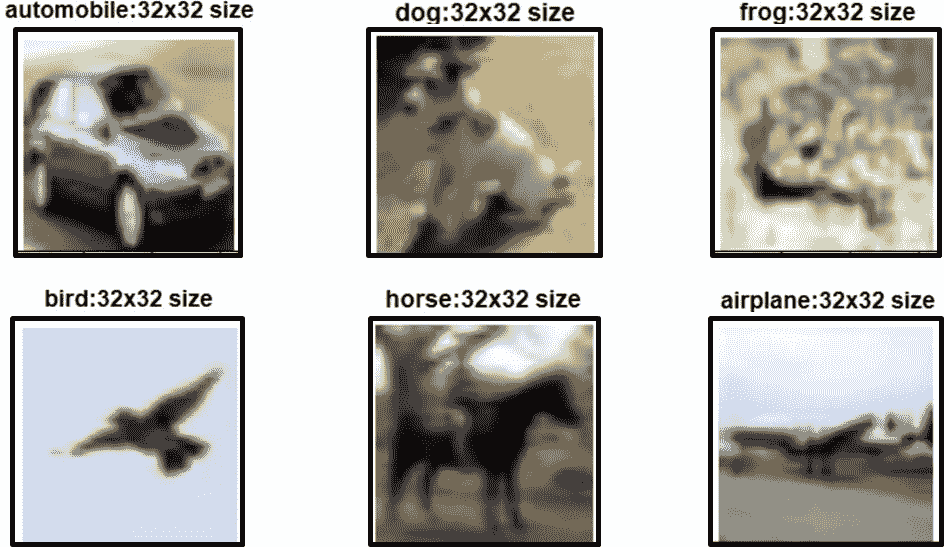
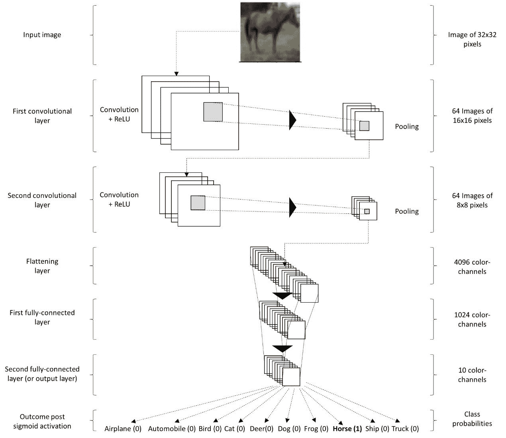
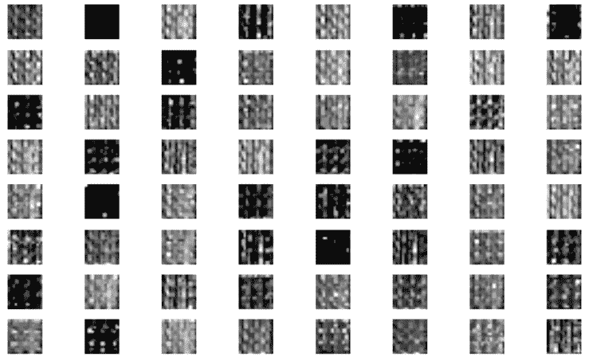
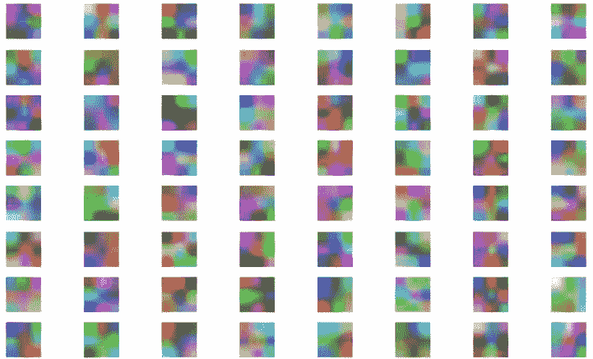
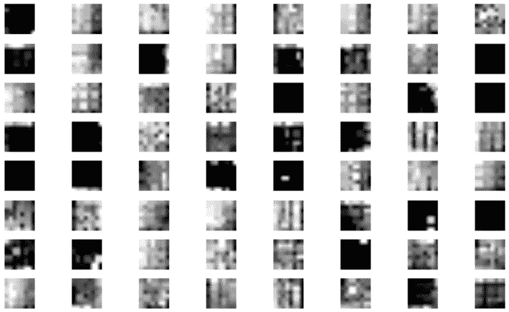
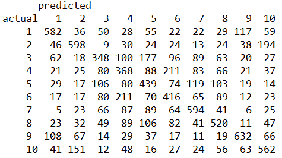
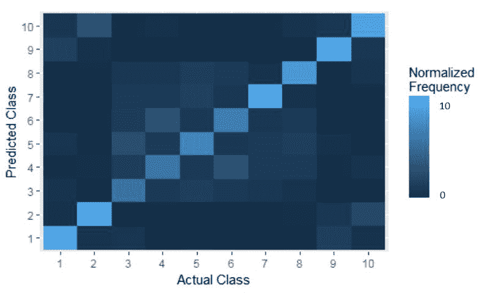
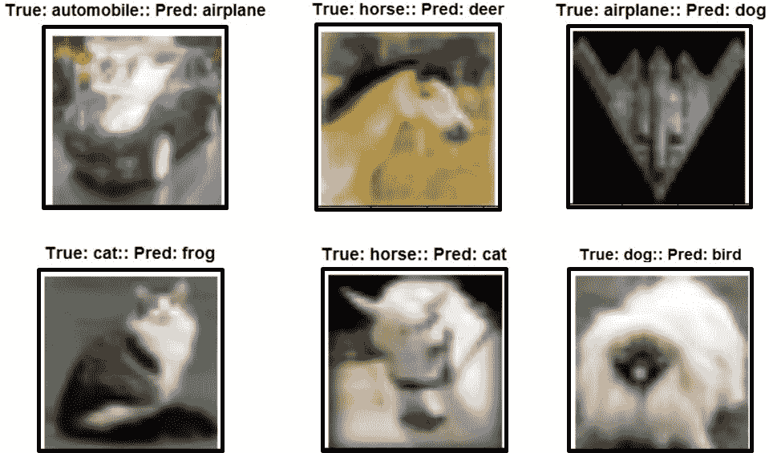

# 第三章：卷积神经网络

本章将涉及以下主题：

+   下载并配置图像数据集

+   学习 CNN 分类器的架构

+   使用函数初始化权重和偏差

+   使用函数创建新的卷积层

+   使用函数将密集连接层展平

+   定义占位符变量

+   创建第一个卷积层

+   创建第二个卷积层

+   展平第二个卷积层

+   创建第一个全连接层

+   对第一个全连接层应用 dropout

+   创建带有 dropout 的第二个全连接层

+   应用 softmax 激活函数以获取预测类别

+   定义用于优化的成本函数

+   执行梯度下降成本优化

+   在 TensorFlow 会话中执行图

+   在测试数据上评估性能

# 介绍

**卷积神经网络** (**CNN**) 是深度学习神经网络的一类，在构建基于图像识别和自然语言处理的分类模型中发挥着重要作用。

CNN 的架构类似于 LeNet，它主要用于识别数字、邮政编码等字符。与人工神经网络不同，CNN 有按三维空间（宽度、深度、高度）排列的神经元层。每一层将二维图像转换为三维输入体积，接着通过神经元激活将其转换为三维输出体积。

CNN 主要使用三种类型的激活层：卷积层 ReLU、池化层和全连接层。卷积层用于从输入向量（图像）中提取特征（像素之间的空间关系），并在计算与权重（和偏差）的点积后存储它们，以供进一步处理。

**修正线性单元** (**ReLU**) 在卷积操作后应用，以引入非线性。

这是一个逐元素操作（如阈值函数、sigmoid 和 tanh），应用于每一个卷积特征图。然后，池化层（如最大池化、平均池化和求和池化等操作）用于缩减每个特征图的维度，以确保最小的信息丢失。该空间尺寸缩减操作用于控制过拟合，并增强网络对小的扭曲或变换的鲁棒性。池化层的输出随后与传统的多层感知机（也称为全连接层）连接。该感知机使用激活函数，如 softmax 或 SVM，来构建基于分类器的 CNN 模型。

本章中的教程将重点讲解如何使用 R 中的 TensorFlow 构建图像分类的卷积神经网络。虽然这些教程会给你提供典型 CNN 的概览，但我们鼓励你根据自己的需求调整和修改参数。

# 下载并配置图像数据集

在本章中，我们将使用 CIFAR-10 数据集来构建用于图像分类的卷积神经网络。CIFAR-10 数据集包含 60,000 张 32x32 的彩色图像，涵盖 10 个类别，每个类别有 6,000 张图像。数据集进一步分为五个训练批次和一个测试批次，每个批次包含 10,000 张图像。

测试批次包含每个类别中精确选择的 1,000 张随机图片。训练批次包含剩余的图片，按随机顺序排列，但某些训练批次可能包含某一类别更多的图片。所有训练批次中，每个类别的图片总数为 5,000 张。十个输出类别分别为飞机、汽车、鸟类、猫、鹿、狗、青蛙、马、船和卡车。各类别完全互斥。此外，数据集的格式如下：

+   第一列：包含 10 个类别的标签：飞机、汽车、鸟类、猫、鹿、狗、青蛙、马、船和卡车

+   接下来的 1,024 列：红色像素值范围从 0 到 255

+   接下来的 1,024 列：绿色像素值范围从 0 到 255

+   接下来的 1,024 列：蓝色像素值范围从 0 到 255

# 准备就绪

对于本食谱，您需要安装一些包的 R 版本，例如`data.table`和`imager`。

# 如何做...

1.  启动 R（使用 Rstudio 或 Docker）并加载所需的包。

1.  手动从[`www.cs.toronto.edu/~kriz/cifar.html`](http://www.cs.toronto.edu/~kriz/cifar.html)下载数据集（二进制版本），或者使用以下函数在 R 环境中下载数据。该函数以工作目录或下载数据集的位置路径作为输入参数（`data_dir`）：

```py
# Function to download the binary file
download.cifar.data <- function(data_dir) {
dir.create(data_dir, showWarnings = FALSE)
setwd(data_dir)
if (!file.exists('cifar-10-binary.tar.gz')){
download.file(url='http://www.cs.toronto.edu/~kriz/cifar-10-binary.tar.gz', destfile='cifar-10-binary.tar.gz', method='wget')
untar("cifar-10-binary.tar.gz") # Unzip files
file.remove("cifar-10-binary.tar.gz") # remove zip file
}
setwd("..")
}
# Download the data
download.cifar.data(data_dir="Cifar_10/")

```

1.  一旦数据集下载并解压（或解压缩），将其作为训练和测试数据集读取到 R 环境中。该函数以训练和测试批次数据集的文件名（`filenames`）和每个批次文件中要检索的图像数量（`num.images`）作为输入参数：

```py
# Function to read cifar data
read.cifar.data <- function(filenames,num.images){
images.rgb <- list()
images.lab <- list()
for (f in 1:length(filenames)) {
to.read <- file(paste("Cifar_10/",filenames[f], sep=""), "rb")
for(i in 1:num.images) {
l <- readBin(to.read, integer(), size=1, n=1, endian="big")
r <- as.integer(readBin(to.read, raw(), size=1, n=1024, endian="big"))
g <- as.integer(readBin(to.read, raw(), size=1, n=1024, endian="big"))
b <- as.integer(readBin(to.read, raw(), size=1, n=1024, endian="big"))
index <- num.images * (f-1) + i
images.rgb[[index]] = data.frame(r, g, b)
images.lab[[index]] = l+1
}
close(to.read)
cat("completed :", filenames[f], "\n")
remove(l,r,g,b,f,i,index, to.read)
}
return(list("images.rgb"=images.rgb,"images.lab"=images.lab))
}
# Train dataset
cifar_train <- read.cifar.data(filenames = c("data_batch_1.bin","data_batch_2.bin","data_batch_3.bin","data_batch_4.bin", "data_batch_5.bin"))
images.rgb.train <- cifar_train$images.rgb
images.lab.train <- cifar_train$images.lab
rm(cifar_train)
# Test dataset
cifar_test <- read.cifar.data(filenames = c("test_batch.bin"))
images.rgb.test <- cifar_test$images.rgb
images.lab.test <- cifar_test$images.lab
rm(cifar_test)

```

1.  前面函数的输出是每张图片的红、绿、蓝像素数据框和它们的标签。然后，使用以下函数将数据展平为两个数据框（一个用于输入，另一个用于输出）的列表，该函数需要两个参数——输入变量列表（`x_listdata`）和输出变量列表（`y_listdata`）：

```py
# Function to flatten the data
flat_data <- function(x_listdata,y_listdata){
# Flatten input x variables
x_listdata <- lapply(x_listdata,function(x){unlist(x)})
x_listdata <- do.call(rbind,x_listdata)
# Flatten outcome y variables
y_listdata <- lapply(y_listdata,function(x){a=c(rep(0,10)); a[x]=1; return(a)})
y_listdata <- do.call(rbind,y_listdata)
# Return flattened x and y variables
return(list("images"=x_listdata, "labels"=y_listdata))
}
# Generate flattened train and test datasets
train_data <- flat_data(x_listdata = images.rgb.train, y_listdata = images.lab.train)
test_data <- flat_data(x_listdata = images.rgb.test, y_listdata = images.lab.test)

```

1.  一旦输入和输出的训练与测试数据框列表准备就绪，通过绘制图像及其标签来执行完整性检查。该函数需要两个必需的参数（`index`：图片行号和`images.rgb`：展平的输入数据集）和一个可选参数（`images.lab`：展平的输出数据集）：

```py
labels <- read.table("Cifar_10/batches.meta.txt")
# function to run sanity check on photos & labels import
drawImage <- function(index, images.rgb, images.lab=NULL) {
require(imager)
# Testing the parsing: Convert each color layer into a matrix,
# combine into an rgb object, and display as a plot
img <- images.rgb[[index]]
img.r.mat <- as.cimg(matrix(img$r, ncol=32, byrow = FALSE))
img.g.mat <- as.cimg(matrix(img$g, ncol=32, byrow = FALSE)
img.b.mat <- as.cimg(matrix(img$b, ncol=32, byrow = FALSE))
img.col.mat <- imappend(list(img.r.mat,img.g.mat,img.b.mat),"c") #Bind the three channels into one image
# Extract the label
if(!is.null(images.lab)){
lab = labels[[1]][images.lab[[index]]]
}
# Plot and output label
plot(img.col.mat,main=paste0(lab,":32x32 size",sep=" "),xaxt="n")
axis(side=1, xaxp=c(10, 50, 4), las=1)
return(list("Image label" =lab,"Image description" =img.col.mat))
}
# Draw a random image along with its label and description from train dataset
drawImage(sample(1:50000, size=1), images.rgb.train, images.lab.train)

```

1.  现在使用最小-最大标准化技术对输入数据进行转换。可以使用包中的`preProcess`函数进行归一化。该方法的`"range"`选项执行最小-最大归一化，过程如下：

```py
# Function to normalize data
Require(caret) 
normalizeObj<-preProcess(train_data$images, method="range") 
train_data$images<-predict(normalizeObj, train_data$images) 
test_data$images <- predict(normalizeObj, test_data$images) 

```

# 它是如何工作的...

让我们回顾一下前面步骤中做的事情。在第 2 步中，我们从给定链接下载了 CIFAR-10 数据集，以防该链接或工作目录中没有该数据集。在第 3 步中，解压缩后的文件作为训练集和测试集加载到 R 环境中。训练集包含 50,000 张图像，测试集包含 10,000 张图像及其标签。然后，在第 4 步中，训练集和测试集被展平成包含两个数据框的列表：一个是输入变量（或图像），其长度为 3,072（1,024 个红色，1,024 个绿色，1,024 个蓝色），另一个是输出变量（或标签），长度为 10（每个类别的二进制标签）。在第 5 步中，我们通过生成图表对创建的训练集和测试集进行合理性检查。下图展示了一组六张训练图像及其标签。最后，在第 6 步中，使用最小-最大标准化技术对输入数据进行转换。CIFAR-10 数据集的类别示例如下图所示：



# 另请参见

*《从微小图像中学习多层特征》，Alex Krizhevsky，2009* ([`www.cs.toronto.edu/~kriz/learning-features-2009-TR.pdf`](http://www.cs.toronto.edu/~kriz/learning-features-2009-TR.pdf))。这也是本节的参考文献。

# 学习 CNN 分类器的架构

本章介绍的 CNN 分类器有两个卷积层，后面跟着两个全连接层，其中最后一层使用 softmax `激活`函数作为分类器。

# 准备工作

该教程需要 CIFAR-10 数据集。因此，应该下载 CIFAR-10 数据集并将其加载到 R 环境中。此外，图像的大小为 32 x 32 像素。

# 怎么做……

让我们按如下方式定义 CNN 分类器的配置：

1.  每个输入图像（CIFAR-10）的大小为 32 x 32 像素，并可以被标记为 10 个类别中的一个：

```py
# CIFAR images are 32 x 32 pixels.
img_width  = 32L
img_height = 32L

# Tuple with height and width of images used to reshape arrays.
img_shape = c(img_width, img_height)
# Number of classes, one class for each of 10 images
num_classes = 10L

```

1.  CIFAR-10 数据集的图像有三个通道（红色、绿色和蓝色）：

```py
# Number of color channels for the images: 3 channel for red, blue, green scales.
num_channels = 3L

```

1.  图像存储在以下长度的一维数组中（`img_size_flat`）：

```py
# Images are stored in one-dimensional arrays of length.
img_size_flat = img_width * img_height * num_channels

```

1.  在第一个卷积层中，卷积滤波器的大小（宽度 x 高度）为 5 x 5 像素（`filter_size1`），卷积滤波器的深度（或数量）为`64`（`num_filters1`）：

```py
# Convolutional Layer 1.
filter_size1 = 5L
num_filters1 = 64L

```

1.  在第二个卷积层中，卷积滤波器的大小和深度与第一个卷积层相同：

```py
# Convolutional Layer 2.
filter_size2 = 5L
num_filters2 = 64L

```

1.  类似地，第一个全连接层的输出与第二个全连接层的输入相同：

```py
# Fully-connected layer.
fc_size = 1024L

```

# 它是如何工作的……

输入图像的维度和特性分别在步骤 1 和步骤 2 中展示。每个输入图像在卷积层中经过一组滤波器的进一步处理，如步骤 4 和 5 所定义。第一个卷积层生成一组 64 张图像（每个滤波器对应一张图像）。此外，这些图像的分辨率也被减半（因为使用了 2 x 2 最大池化）；即，从 32 x 32 像素变为 16 x 16 像素。

第二卷积层将输入这 64 张图像，并输出新的 64 张图像，分辨率进一步降低。更新后的分辨率为 8 x 8 像素（由于 2 x 2 最大池化）。在第二卷积层中，共创建了 64 x 64 = 4,096 个滤波器，然后它们被进一步卷积为 64 张输出图像（或通道）。请记住，这 64 张 8 x 8 分辨率的图像对应于一个输入图像。

此外，这 64 张 8 x 8 像素的输出图像会被展平为一个长度为 4,096（8 x 8 x 64）的单一向量，如第 3 步中所定义，并作为输入传递给一层全连接神经元，这些神经元在第 6 步中定义。该 4,096 个元素的向量接着被输入到第一个包含 1,024 个神经元的全连接层。输出神经元再次输入到第二个包含 10 个神经元的全连接层（与`num_classes`相等）。这 10 个神经元代表每个类别标签，然后用来确定图像的（最终）类别。

首先，卷积层和全连接层的权重被随机初始化，直到分类阶段（CNN 图的结束）。在这里，分类误差是基于真实类别和预测类别计算的（也叫做交叉熵）。

然后，优化器通过使用链式法则反向传播误差，通过卷积网络进行传播，之后更新各层（或滤波器）的权重，使得误差最小化。这个包含一次正向传播和反向传播的完整周期被称为一次迭代。进行成千上万次这样的迭代，直到分类误差降到足够低的值。

通常，这些迭代使用一批图像而不是单一图像来执行，以提高计算效率。

以下图像展示了本章设计的卷积网络：



# 使用函数初始化权重和偏置

权重和偏置是任何深度神经网络优化的重要组成部分，在这里我们定义了一些函数来自动化这些初始化。一个好的做法是用小噪声初始化权重，以打破对称性并防止零梯度。此外，适当的小正偏置将避免神经元不激活，适合 ReLU 激活神经元。

# 准备开始

权重和偏置是模型系数，需要在模型编译之前初始化。此步骤需要根据输入数据集确定`shape`参数。

# 如何操作...

1.  以下函数用于返回随机初始化的权重：

```py
# Weight Initialization
weight_variable <- function(shape) {
initial <- tf$truncated_normal(shape, stddev=0.1)
tf$Variable(initial)
}

```

1.  以下函数用于返回常量偏置：

```py
bias_variable <- function(shape) {
initial <- tf$constant(0.1, shape=shape)
tf$Variable(initial)
}

```

# 它是如何工作的...

这些函数返回 TensorFlow 变量，后续将在 TensorFlow 图中使用。`shape`定义为一个列表，描述了卷积层中滤波器的属性，接下来会在下一个配方中介绍。权重以标准差为`0.1`随机初始化，偏置则以常量`0.1`初始化。

# 使用函数创建新的卷积层

创建卷积层是 CNN TensorFlow 计算图中的主要步骤。此函数主要用于定义 TensorFlow 图中的数学公式，后续在优化过程中会用到这些公式进行实际计算。

# 准备工作

输入数据集已定义并加载。配方中呈现的`create_conv_layer`函数接受以下五个输入参数，并且在设置卷积层时需要定义：

1.  `Input`：这是一个四维张量（或列表），包含多个（输入）图像，每个图像的高度（此处为 32L）、宽度（此处为 32L）以及每个图像的通道数（此处为 3L：红色、蓝色和绿色）。

1.  `Num_input_channels`：这是指在第一个卷积层的情况下颜色通道的数量，或者在后续卷积层的情况下滤波器通道的数量。

1.  `Filter_size`：这是指卷积层中每个滤波器的宽度和高度。这里假设滤波器为正方形。

1.  `Num_filters`：这是指在给定卷积层中滤波器的数量。

1.  `Use_pooling`：这是一个二进制变量，用于执行 2 x 2 的最大池化。

# 如何操作...

1.  运行以下函数以创建一个新的卷积层：

```py
# Create a new convolution layer
create_conv_layer <- function(input,
num_input_channels,
filter_size,
num_filters,
use_pooling=True)
{
# Shape of the filter-weights for the convolution.
shape1 = shape(filter_size, filter_size, num_input_channels, num_filters)
# Create new weights
weights = weight_variable(shape=shape1)
# Create new biases
biases = bias_variable(shape=shape(num_filters))
# Create the TensorFlow operation for convolution.
layer = tf$nn$conv2d(input=input,
filter=weights,
strides=shape(1L, 1L, 1L ,1L),
padding="SAME")
# Add the biases to the results of the convolution.
layer = layer + biases
# Use pooling (binary flag) to reduce the image resolution
if(use_pooling){
layer = tf$nn$max_pool(value=layer,
ksize=shape(1L, 2L, 2L, 1L),
strides=shape(1L, 2L, 2L, 1L),
padding='SAME')
}
# Add non-linearity using Rectified Linear Unit (ReLU).
layer = tf$nn$relu(layer)
# Retrun resulting layer and updated weights
return(list("layer" = layer, "weights" = weights))
}

```

1.  运行以下函数以生成卷积层的图：

```py
drawImage_conv <- function(index, images.bw, images.lab=NULL,par_imgs=8) {
require(imager)
img <- images.bw[index,,,]
n_images <- dim(img)[3]
par(mfrow=c(par_imgs,par_imgs), oma=c(0,0,0,0),
mai=c(0.05,0.05,0.05,0.05),ann=FALSE,ask=FALSE)
for(i in 1:n_images){
img.bwmat <- as.cimg(img[,,i])
# Extract the label
if(!is.null(images.lab)){
lab = labels[[1]][images.lab[[index]]]
}
# Plot and output label
plot(img.bwmat,axes=FALSE,ann=FALSE)
}
par(mfrow=c(1,1))
}

```

1.  运行以下函数以生成卷积层权重的图：

```py
drawImage_conv_weights <- function(weights_conv, par_imgs=8) {
require(imager)
n_images <- dim(weights_conv)[4]
par(mfrow=c(par_imgs,par_imgs), oma=c(0,0,0,0),
mai=c(0.05,0.05,0.05,0.05),ann=FALSE,ask=FALSE)
for(i in 1:n_images){
img.r.mat <- as.cimg(weights_conv[,,1,i])
img.g.mat <- as.cimg(weights_conv[,,2,i])
img.b.mat <- as.cimg(weights_conv[,,3,i])
img.col.mat <- imappend(list(img.r.mat,img.g.mat,img.b.mat),"c") 
#Bind the three channels into one image
# Plot and output label
plot(img.col.mat,axes=FALSE,ann=FALSE)
}
par(mfrow=c(1,1))
}

```

# 它是如何工作的...

该函数首先创建一个形状张量；即一个包含四个整数的列表，分别是滤波器的宽度、滤波器的高度、输入通道数和给定滤波器的数量。使用该形状张量，初始化一个具有定义形状的新权重张量，并为每个滤波器创建一个新的（常量）偏置张量。

一旦初始化了必要的权重和偏置，使用`tf$nn$conv2d`函数创建卷积的 TensorFlow 操作。在我们当前的设置中，所有四个维度的步长都设置为 1，填充设置为`SAME`。第一和最后一个默认设置为 1，但中间两个可以有更大的步长。步长是指我们允许滤波器矩阵在输入（图像）矩阵上滑动的像素数。

步幅为 3 意味着每次过滤器滑动时，沿*x*或*y*轴会跳过三个像素。较小的步幅会产生较大的特征图，从而需要更多的计算来收敛。由于填充设置为`SAME`，输入（图像）矩阵会在边界周围用零填充，以便我们可以将过滤器应用于输入矩阵的边界元素。利用这个特性，我们可以控制输出矩阵（或特征图）的大小与输入矩阵相同。

在卷积中，偏置值被添加到每个过滤器通道，并通过池化来防止过拟合。在当前设置中，执行 2 x 2 最大池化（使用`tf$nn$max_pool`）以减少图像分辨率。在这里，我们考虑 2 x 2（`ksize`*）大小的窗口，并选择每个窗口中的最大值。这些窗口每次按两个像素（`strides`）沿 x 或 y 方向滑动。

在池化时，我们通过 ReLU 激活函数（`tf$nn$relu`）向层中添加非线性。在 ReLU 中，每个像素都会在过滤器中被触发，所有负的像素值都会通过`max(x,0)`函数替换为零，其中*x*是像素值。通常，ReLU 激活会在池化之前执行。然而，由于我们使用的是最大池化，它对结果的影响并不显著，因为`relu(max_pool(x))`等同于`max_pool(relu(x))`。因此，通过在池化后应用 ReLU，我们可以节省大量 ReLU 操作（大约 75%）。

最后，函数返回一个包含卷积层及其对应权重的列表。卷积层是一个四维张量，具有以下属性：

+   输入图像的数量，与`input`相同

+   每个图像的高度（在 2 x 2 最大池化的情况下减少一半）

+   每个图像的宽度（在 2 x 2 最大池化的情况下减少一半）

+   每个卷积过滤器产生的通道数

# 使用函数创建新的卷积层

新创建的卷积层的四维结果被扁平化为二维层，以便将其作为输入用于全连接的多层感知机。

# 准备工作

该配方解释了如何在构建深度学习模型之前扁平化卷积层。给定函数（`flatten_conv_layer`）的输入是一个四维的卷积层，该层是基于前一层定义的。

# 如何操作……

1.  运行以下函数以扁平化卷积层：

```py
flatten_conv_layer <- function(layer){
# Extract the shape of the input layer
layer_shape = layer$get_shape()
# Calculate the number of features as img_height * img_width * num_channels
num_features = prod(c(layer_shape$as_list()[[2]],layer_shape$as_list()[[3]],layer_shape$as_list()[[4]]))
# Reshape the layer to [num_images, num_features].
layer_flat = tf$reshape(layer, shape(-1, num_features))
# Return both the flattened layer and the number of features.
return(list("layer_flat"=layer_flat, "num_features"=num_features))
}

```

# 它是如何工作的……

该函数首先提取给定输入层的形状。如前述配方所述，输入层的形状由四个整数组成：图像数量、图像高度、图像宽度以及图像的颜色通道数。然后，通过图像高度、图像宽度和颜色通道数的点积计算特征数量（`num_features`）。

然后，该层被扁平化或调整为二维张量（使用`tf$reshape`）。第一维设置为-1（等于图像总数），第二维是特征数。

最后，函数返回一个包含扁平化层及输入特征总数的列表。

# 使用函数扁平化密集连接层

CNN 通常以一个全连接的多层感知机结束，在输出层使用 softmax 激活函数。在这里，前一卷积扁平化层中的每个神经元都与下一层（全连接层）中的每个神经元相连。

全卷积层的主要目的是利用卷积和池化阶段生成的特征，将给定的输入图像分类为不同的输出类别（这里是 10L）。它还有助于学习这些特征的非线性组合，从而定义输出类别。

在本章中，我们使用两个全连接层进行优化。这个函数主要用于定义张量流图中的数学公式，随后在优化过程中实际计算时使用。

# 准备就绪

(`create_fc_layer`)函数接收四个输入参数，具体如下：

+   `Input`：这类似于新卷积层函数的输入。

+   `Num_inputs`：这是在扁平化卷积层后生成的输入特征数量。

+   `Num_outputs`：这是与输入神经元完全连接的输出神经元数量。

+   `Use_relu`：这是一个二进制标志，只有在最终全连接层时设置为`FALSE`。

# 如何实现...

1.  运行以下函数以创建新的全连接层：

```py
# Create a new fully connected layer
create_fc_layer <- function(input,
num_inputs,
num_outputs,
use_relu=True)
{
# Create new weights and biases.
weights = weight_variable(shape=shape(num_inputs, num_outputs))
biases = bias_variable(shape=shape(num_outputs))
# Perform matrix multiplication of input layer with weights and then add biases
layer = tf$matmul(input, weights) + biases
# Use ReLU?
if(use_relu){
layer = tf$nn$relu(layer)
}
return(layer)
}

```

# 它是如何工作的...

函数从初始化新的权重和偏置开始。然后，对输入层与初始化的权重进行矩阵乘法，并添加相关偏置。

如果全连接层不是 CNN 张量流图中的最终层，则可以执行 ReLU 非线性激活。最后，返回全连接层。

# 定义占位符变量

在这个配方中，让我们定义作为张量流计算图模块输入的占位符变量。这些通常是多维数组或矩阵，呈现为张量的形式。

# 准备就绪

占位符变量的数据类型设置为 float32（`tf$float32`），形状设置为二维张量。

# 如何实现...

1.  创建一个输入占位符变量：

```py
x = tf$placeholder(tf$float32, shape=shape(NULL, img_size_flat), name='x')

```

占位符中的 NULL 值允许我们传递非确定性数组的大小。

1.  将输入占位符`x`重新调整为四维张量：

```py
x_image = tf$reshape(x, shape(-1L, img_size, img_size, num_channels))

```

1.  创建一个输出占位符变量：

```py
y_true = tf$placeholder(tf$float32, shape=shape(NULL, num_classes), name='y_true')

```

1.  使用 argmax 获取输出的（true）类别：

```py
y_true_cls = tf$argmax(y_true, dimension=1L)

```

# 它是如何工作的...

在步骤 1 中，我们定义了一个输入占位符变量。形状张量的维度是 `NULL` 和 `img_size_flat`。前者用于存储任意数量的图像（作为行），后者定义了每张图像的输入特征长度（作为列）。在步骤 2 中，输入的二维张量被重塑成一个四维张量，作为卷积层的输入。四个维度如下：

+   第一项定义了输入图像的数量（当前设置为 -1）

+   第二项定义了每张图像的高度（相当于图像大小 32L）

+   第三项定义了每张图像的宽度（相当于图像大小，这里是 32L）

+   第四项定义了每张图像的颜色通道数（这里是 3L）

在步骤 3 中，我们定义了一个输出占位符变量，用于保存 `x` 中图像的真实类别或标签。形状张量的维度是 `NULL` 和 `num_classes`。前者用于存储任意数量的图像（作为行），后者定义了每张图像的真实类别作为一个长度为 `num_classes` 的二进制向量（作为列）。在我们的场景中，有 10 个类别。步骤 4 中，我们将二维输出占位符压缩成一个一维的类别编号张量，类别编号范围从 1 到 10。

# 创建第一个卷积层

在这个食谱中，我们来创建第一个卷积层。

# 准备就绪

以下是食谱 *使用函数创建新的卷积层* 中定义的函数 `create_conv_layer` 的输入：

+   `Input`：这是一个四维的重塑输入占位符变量：`x_image`

+   `Num_input_channels`：这是颜色通道的数量，也就是 `num_channels`

+   `Filter_size`：这是过滤层的高度和宽度 `filter_size1`

+   `Num_filters`：这是过滤层的深度，也就是 `num_filters1`

+   `Use_pooling`：这是一个设置为 `TRUE` 的二进制标志

# 如何操作...

1.  运行 `create_conv_layer` 函数，使用前面的输入参数：

```py
# Convolutional Layer 1
conv1 <- create_conv_layer(input=x_image,
num_input_channels=num_channels,
filter_size=filter_size1,
num_filters=num_filters1,
use_pooling=TRUE)

```

1.  提取第一个卷积层的 `layers`：

```py
layer_conv1 <- conv1$layer
conv1_images <- conv1$layer$eval(feed_dict = dict(x = train_data$images, y_true = train_data$labels))

```

1.  提取第一个卷积层的最终 `weights`：

```py
weights_conv1 <- conv1$weights
weights_conv1 <- weights_conv1$eval(session=sess)

```

1.  生成第一个卷积层的图：

```py
drawImage_conv(sample(1:50000, size=1), images.bw = conv1_images, images.lab=images.lab.train)

```

1.  生成第一个卷积层的权重图：

```py
drawImage_conv_weights(weights_conv1)

```

# 它是如何工作的...

在步骤 1 和 2 中，我们创建了一个四维的第一个卷积层。第一维（?）表示输入图像的数量，第二和第三维分别表示每个卷积图像的高度（16 像素）和宽度（16 像素），第四维表示产生的通道数（64）——每个卷积过滤器对应一个通道。在步骤 3 和 5 中，我们提取卷积层的最终权重，如下截图所示：



在步骤 4 中，我们绘制第一个卷积层的输出，如下截图所示：



# 创建第二个卷积层

在这个食谱中，我们来创建第二个卷积层。

# 准备就绪

以下是食谱《使用函数创建新的卷积层》中定义的函数输入`create_conv_layer`：

+   `Input`：这是第一个卷积层的四维输出；即`layer_conv1`

+   `Num_input_channels`：这是第一个卷积层中的滤波器数量（或深度），`num_filters1`

+   `Filter_size`：这是滤波器层的高度和宽度；即`filter_size2`

+   `Num_filters`：这是滤波器层的深度，`num_filters2`

+   `Use_pooling`：这是设置为`TRUE`的二进制标志

# 操作方法...

1.  使用前述输入参数运行`create_conv_layer`函数：

```py
# Convolutional Layer 2
conv2 <- create_conv_layer(input=layer_conv1,
num_input_channels=num_filters1,
filter_size=filter_size2,
num_filters=num_filters2,
use_pooling=TRUE)

```

1.  提取第二个卷积层的层：

```py
layer_conv2 <- conv2$layer
conv2_images <- conv2$layer$eval(feed_dict = dict(x = train_data$images, y_true = train_data$labels))

```

1.  提取第二卷积层的最终权重：

```py
weights_conv2 <- conv2$weights
weights_conv2 <- weights_conv2$eval(session=sess)

```

1.  生成第二卷积层的图：

```py
drawImage_conv(sample(1:50000, size=1), images.bw = conv2_images, images.lab=images.lab.train)

```

1.  生成第二卷积层权重图：

```py
drawImage_conv_weights(weights_conv2)

```

# 工作原理...

在第 1 步和第 2 步中，我们创建一个四维的第二卷积层。第一维（?）表示任意数量的输入图像，第二和第三维表示每个卷积图像的高度（8 像素）和宽度（8 像素），第四维表示每个卷积滤波器产生的通道数（64）。

在第 3 步和第 5 步中，我们提取卷积层的最终权重，如下图所示：



在第 4 步中，我们绘制第二个卷积层的输出，如下图所示：



# 展平第二个卷积层

在本食谱中，我们将展平我们创建的第二个卷积层。

# 准备工作

以下是食谱《创建第二个卷积层》中定义的函数输入，`flatten_conv_layer`：

+   `Layer`：这是第二个卷积层的输出，`layer_conv2`

# 操作方法...

1.  使用前述输入参数运行`flatten_conv_layer`函数：

```py
flatten_lay <- flatten_conv_layer(layer_conv2)

```

1.  提取展平层：

```py
layer_flat <- flatten_lay$layer_flat

```

1.  提取每个图像生成的（输入）特征数量：

```py
num_features <- flatten_lay$num_features

```

# 工作原理...

在将（第二）卷积层的输出与全连接网络连接之前，在第 1 步中，我们将四维卷积层重塑为二维张量。第一维（?）表示任意数量的输入图像（作为行），第二维表示为每个图像生成的展平特征向量，长度为 4,096；即 8 x 8 x 64（作为列）。第 2 步和第 3 步验证重塑后层和输入特征的维度。

# 创建第一个全连接层

在本食谱中，我们将创建第一个全连接层。

# 准备工作

以下是食谱《使用函数展平密集连接层》中定义的函数输入，`create_fc_layer`：

+   `Input`：这是展平后的卷积层；即`layer_flat`

+   `Num_inputs`：这是在展平之后生成的特征数量，`num_features`

+   `Num_outputs`：这是全连接神经元的输出数量，`fc_size`

+   `Use_relu`：这是一个二进制标志，设置为 `TRUE` 以在张量中引入非线性

# 如何操作...

1.  使用前面的输入参数运行 `create_fc_layer` 函数：

```py
layer_fc1 = create_fc_layer(input=layer_flat,
num_inputs=num_features,
num_outputs=fc_size,
use_relu=TRUE)

```

# 它是如何工作的...

在这里，我们创建一个全连接层，该层返回一个二维张量。第一维（？）表示任意数量的（输入）图像，第二维表示输出神经元的数量（这里是 1,024）。

# 将 dropout 应用到第一个全连接层

在本食谱中，我们将应用 dropout 到全连接层的输出，以减少过拟合的可能性。dropout 步骤包括在学习过程中随机去除一些神经元。

# 准备就绪

dropout 连接到层的输出。因此，模型的初始结构已设置并加载。例如，在 dropout 当前层 `layer_fc1` 中定义了 dropout 并应用于此层。

# 如何操作...

1.  创建一个占位符用于 dropout，可以接收概率作为输入：

```py
keep_prob <- tf$placeholder(tf$float32)

```

1.  使用 TensorFlow 的 dropout 函数来处理神经元输出的缩放和屏蔽：

```py
layer_fc1_drop <- tf$nn$dropout(layer_fc1, keep_prob)

```

# 它是如何工作的...

在步骤 1 和步骤 2 中，我们可以根据输入的概率（或百分比）丢弃（或屏蔽）输出神经元。dropout 通常在训练期间允许，并且在测试期间可以关闭（通过将概率设置为 `1` 或 `NULL`）。

# 创建第二个全连接层并加入 dropout

在本食谱中，我们将创建第二个全连接层并加入 dropout。

# 准备就绪

以下是函数 *使用函数来展开全连接层* 中定义的输入参数，`create_fc_layer`：

+   `Input`：这是第一个全连接层的输出，即 `layer_fc1`

+   `Num_inputs`：这是第一个全连接层输出的特征数量，`fc_size`

+   `Num_outputs`：这是全连接神经元输出的数量（等于标签的数量，`num_classes`）

+   `Use_relu`：这是一个二进制标志，设置为 `FALSE`

# 如何操作...

1.  使用前面的输入参数运行 `create_fc_layer` 函数：

```py
layer_fc2 = create_fc_layer(input=layer_fc1_drop,
num_inputs=fc_size,
num_outputs=num_classes,
use_relu=FALSE)

```

1.  使用 TensorFlow 的 dropout 函数来处理神经元输出的缩放和屏蔽：

```py
layer_fc2_drop <- tf$nn$dropout(layer_fc2, keep_prob)

```

# 它是如何工作的...

在步骤 1 中，我们创建一个全连接层，返回一个二维张量。第一维（？）表示任意数量的（输入）图像，第二维表示输出神经元的数量（这里是 10 个类别标签）。在步骤 2 中，我们提供了一个选项用于 dropout，主要在网络训练过程中使用。

# 应用 softmax 激活函数来获得预测类别

在本食谱中，我们将使用 softmax 激活函数规范化第二个全连接层的输出，使得每个类别的（概率）值限制在 0 和 1 之间，且所有 10 个类别的值加起来为 1。

# 准备就绪

激活函数应用于深度学习模型生成的预测结果的管道末端。在执行此步骤之前，管道中的所有步骤需要执行完毕。该配方需要 TensorFlow 库。

# 如何做...

1.  在第二个全连接层的输出上运行 `softmax` 激活函数：

```py
y_pred = tf$nn$softmax(layer_fc2_drop)

```

1.  使用 `argmax` 函数确定标签的类别编号。它是具有最大（概率）值的类别的索引：

```py
y_pred_cls = tf$argmax(y_pred, dimension=1L)

```

# 定义用于优化的损失函数

损失函数主要用于通过将真实类别标签（`y_true_cls`）与预测类别标签（`y_pred_cls`）进行比较，评估模型的当前性能。基于当前的性能，优化器会进一步调整网络参数，例如权重和偏置，从而提升模型的性能。

# 做好准备

损失函数的定义至关重要，因为它决定了优化的标准。损失函数定义需要真实类别和预测类别进行比较。本例中使用的目标函数是交叉熵，适用于多分类问题。

# 如何做...

1.  使用交叉熵函数在 TensorFlow 中评估每张图像的当前性能。由于 TensorFlow 中的交叉熵函数内部应用了 softmax 正则化，我们将全连接层丢弃后的输出（`layer_fc2_drop`）与真实标签（`y_true`）一起作为输入：

```py
cross_entropy = tf$nn$softmax_cross_entropy_with_logits(logits=layer_fc2_drop, labels=y_true)

```

在当前的损失函数中，softmax 激活函数已经嵌入，因此不需要单独定义激活函数。

1.  计算交叉熵的平均值，并使用优化器将其最小化：

```py
cost = tf$reduce_mean(cross_entropy)

```

# 它是如何工作的...

在步骤 1 中，我们定义了一个交叉熵函数来评估分类的性能。根据真实标签和预测标签之间的准确匹配，交叉熵函数返回一个正值，并遵循连续分布。因为零交叉熵确保完全匹配，优化器通常通过更新网络参数（如权重和偏置）将交叉熵最小化至零。交叉熵函数为每个单独的图像返回一个值，该值需要进一步压缩成一个标量值，供优化器使用。因此，在步骤 2 中，我们计算交叉熵输出的简单平均值，并将其存储为 *cost*。

# 执行梯度下降成本优化

在本例中，我们定义一个能够最小化成本的优化器。优化后，检查 CNN 的性能。

# 做好准备

优化器定义需要定义 `cost` 配方，因为它作为输入传递给优化器。

# 如何做...

1.  使用目标是最小化给定 `learning_rate` 的成本的 Adam 优化器：

```py
optimizer = tf$train$AdamOptimizer(learning_rate=1e-4)$minimize(cost)

```

1.  提取 `correct_predictions` 的数量，并计算平均准确率：

```py
correct_prediction = tf$equal(y_pred_cls, y_true_cls)
accuracy = tf$reduce_mean(tf$cast(correct_prediction, tf$float32))

```

# 在 TensorFlow 会话中执行图

到目前为止，我们只创建了张量对象并将它们添加到 TensorFlow 图中以供后续执行。在这个例子中，我们将学习如何创建一个可以用来执行（或运行）TensorFlow 图的 TensorFlow 会话。

# 准备工作

在运行图之前，我们应该已经在 R 中安装并加载了 TensorFlow。安装详细信息可以在第一章中找到，*入门*。

# 如何操作...

1.  加载`tensorflow`库并导入`numpy`包：

```py
library(tensorflow)
np <- import("numpy")

```

1.  重置或移除任何现有的`default_graph`：

```py
tf$reset_default_graph()

```

1.  启动`InteractiveSession`：

```py
sess <- tf$InteractiveSession()

```

1.  初始化`global_variables`：

```py
sess$run(tf$global_variables_initializer())

```

1.  运行迭代以执行优化（`training`）：

```py
# Train the model
train_batch_size = 128L
for (i in 1:100) {
spls <- sample(1:dim(train_data$images)[1],train_batch_size)
if (i %% 10 == 0) {
train_accuracy <- accuracy$eval(feed_dict = dict(
x = train_data$images[spls,], y_true = train_data$labels[spls,], keep_prob = 1.0))
cat(sprintf("step %d, training accuracy %g\n", i, train_accuracy))
}
optimizer$run(feed_dict = dict(
x = train_data$images[spls,], y_true = train_data$labels[spls,], keep_prob = 0.5))
}

```

1.  评估训练模型在测试数据上的表现：

```py
# Test the model
test_accuracy <- accuracy$eval(feed_dict = dict(
x = test_data$images, y_true = test_data$labels, keep_prob = 1.0))
cat(sprintf("test accuracy %g", test_accuracy))

```

# 它是如何工作的...

步骤 1 至 4 在某种程度上是启动一个新 TensorFlow 会话的默认方式。在第 4 步中，权重和偏置的变量会被初始化，这是它们优化之前的必要步骤。第 5 步主要是执行 TensorFlow 会话进行优化。由于我们有大量的训练图像，计算所有图像的最优梯度变得非常困难（计算上）。

因此，每次迭代时，选择 128 张小的随机样本来训练激活层（权重和偏置）。在当前设置中，我们运行 100 次迭代，并在每十次迭代后报告训练准确度。

然而，这些值可以根据集群配置或计算能力（CPU 或 GPU）增加，以提高模型准确性。此外，每次迭代使用 50%的 dropout 率来训练 CNN。在第 6 步中，我们可以评估训练模型在 10,000 张测试图像上的表现。

# 在测试数据上的性能评估

在这个例子中，我们将使用混淆矩阵和图表来查看训练后的 CNN 在测试图像上的表现。

# 准备工作

绘图的先决条件包是`imager`和`ggplot2`。

# 如何操作...

1.  获取测试图像的`实际`或`真实`类别标签：

```py
test_true_class <- c(unlist(images.lab.test))

```

1.  获取测试图像的预测类别标签。记得给每个类别标签加`1`，因为 TensorFlow（与 Python 相同）的起始索引是 0，而 R 是`1`：

```py
test_pred_class <- y_pred_cls$eval(feed_dict = dict(
x = test_data$images, y_true = test_data$labels, keep_prob = 1.0))
test_pred_class <- test_pred_class + 1

```

1.  生成混淆矩阵，行是实际标签，列是预测标签：

```py
table(actual = test_true_class, predicted = test_pred_class)

```

1.  生成`confusion`矩阵的图：

```py
confusion <- as.data.frame(table(actual = test_true_class, predicted = test_pred_class))
plot <- ggplot(confusion)
plot + geom_tile(aes(x=actual, y=predicted, fill=Freq)) + scale_x_discrete(name="Actual Class") + scale_y_discrete(name="Predicted Class") + scale_fill_gradient(breaks=seq(from=-.5, to=4, by=.2)) + labs(fill="Normalized\nFrequency")

```

1.  运行一个辅助函数来绘制图像：

```py
check.image <- function(images.rgb,index,true_lab, pred_lab) {
require(imager)
# Testing the parsing: Convert each color layer into a matrix,
# combine into an rgb object, and display as a plot
img <- images.rgb[[index]]
img.r.mat <- as.cimg(matrix(img$r, ncol=32, byrow = FALSE))
img.g.mat <- as.cimg(matrix(img$g, ncol=32, byrow = FALSE))
img.b.mat <- as.cimg(matrix(img$b, ncol=32, byrow = FALSE))
img.col.mat <- imappend(list(img.r.mat,img.g.mat,img.b.mat),"c")
# Plot with actual and predicted label
plot(img.col.mat,main=paste0("True: ", true_lab,":: Pred: ",
pred_lab),xaxt="n")
axis(side=1, xaxp=c(10, 50, 4), las=1)
}

```

1.  绘制随机分类错误的测试图像：

```py
labels <- c("airplane","automobile","bird","cat","deer","dog","frog","horse","ship","truck")
# Plot misclassified test images
plot.misclass.images <- function(images.rgb, y_actual, y_predicted,labels){
# Get indices of misclassified
indices <- which(!(y_actual == y_predicted))
id <- sample(indices,1)
# plot the image with true and predicted class
true_lab <- labels[y_actual[id]]
pred_lab <- labels[y_predicted[id]]
check.image(images.rgb,index=id, true_lab=true_lab,pred_lab=pred_lab)
}
plot.misclass.images(images.rgb=images.rgb.test,y_actual=test_true_class,y_predicted=test_pred_class,labels=labels)

```

# 它是如何工作的...

在步骤 1 至 3 中，我们提取了真实的和预测的测试类别标签，并创建了混淆矩阵。下图展示了当前测试预测的混淆矩阵：


700 次训练迭代后的测试准确率仅为约 51%，可以通过增加迭代次数、增加批量大小、配置层参数（使用了 2 个卷积层）、激活函数类型（使用了 ReLU）、全连接层数量（使用了两个）、优化目标函数（使用了准确率）、池化（使用了最大 2 x 2）、丢弃概率等进一步提高。

第 4 步用于构建测试混淆矩阵的分面图，如下面的截图所示：



在第 5 步中，我们定义了一个辅助函数来绘制图像，标题中包含真实类和预测类。`check.image` 函数的输入参数是（`test`）扁平化输入数据集（`images.rgb`）、图像编号（`index`）、真实标签（`true_lab`*）、*和预测标签（`pred_lab`）。这里，红色、绿色和蓝色像素首先被解析出来，转换为矩阵，作为列表附加，并使用 *plot* 函数显示为图像。

在第 6 步中，我们使用第 5 步的辅助函数绘制误分类的测试图像。`plot.misclass.images` 函数的输入参数是（`test`）扁平化输入数据集（`images.rgb`）、真实标签的向量（`y_actual`）、预测标签的向量（`y_predicted`）和唯一有序字符标签的向量（`labels`）。在这里，获取误分类图像的索引，并随机选择一个索引生成绘图。以下截图显示了一组六个误分类图像及其真实和预测标签：


