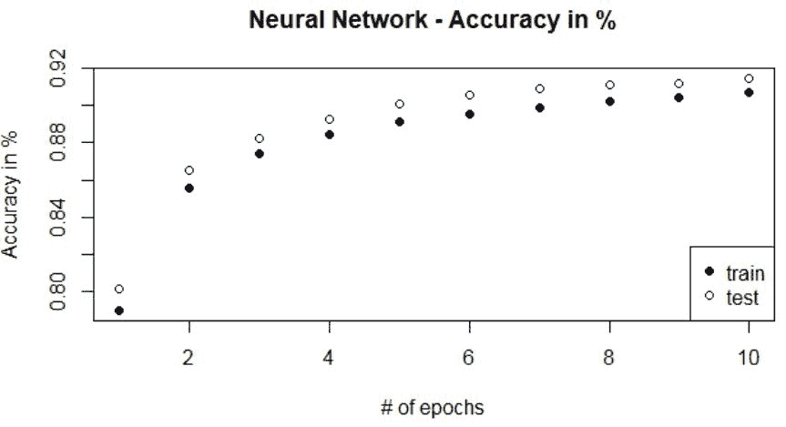

# 第五章：深度学习中的生成模型

在本章中，我们将讨论以下主题：

+   比较主成分分析与限制玻尔兹曼机

+   为伯努利分布输入设置限制玻尔兹曼机

+   训练限制玻尔兹曼机

+   RBM 的反向或重建阶段

+   理解重建的对比散度

+   初始化并启动一个新的 TensorFlow 会话

+   评估 RBM 的输出

+   为协同过滤设置限制玻尔兹曼机

+   执行 RBM 训练的完整运行

+   设置深度信念网络

+   实现前馈反向传播神经网络

+   设置深度限制玻尔兹曼机

# 比较主成分分析与限制玻尔兹曼机

在本节中，你将学习两种广泛推荐的降维技术——**主成分分析**（**PCA**）和**限制玻尔兹曼机**（**RBM**）。考虑在*n*维空间中的一个向量*v*。降维技术本质上将向量*v*转换为一个相对较小（有时是相等）的*m*维向量*v'*（*m*<*n*）。这种转换可以是线性或非线性的。

PCA 对特征进行线性变换，从而生成正交调整的组件，这些组件之后会根据它们在方差捕捉中的相对重要性进行排序。这些*m*个组件可以视为新的输入特征，并可以如下定义：

向量*v'* = 

这里，*w* 和 *c* 分别对应于权重（加载）和转换后的组件。

与 PCA 不同，RBM（或 DBN/自编码器）通过可见单元和隐藏单元之间的连接执行非线性变换，正如在第四章 *使用自编码器的数据表示*中所描述的那样。非线性有助于更好地理解与潜在变量之间的关系。除了信息捕获外，它们还倾向于去除噪声。RBM 通常基于随机分布（无论是伯努利分布还是高斯分布）。

执行大量的吉布斯采样以学习和优化可见层与隐藏层之间的连接权重。优化过程分为两个阶段：前向阶段，其中使用给定的可见层对隐藏层进行采样；反向阶段，其中使用给定的隐藏层对可见层进行重新采样。该优化旨在最小化重建误差。

以下图像表示一个限制玻尔兹曼机：


# 准备工作

对于这个食谱，你将需要 R（`rbm`和`ggplot2`包）和 MNIST 数据集。MNIST 数据集可以从 TensorFlow 数据集库中下载。该数据集包含 28 x 28 像素的手写图像。它有 55,000 个训练样本和 10,000 个测试样本。可以通过以下脚本从`tensorflow`库下载：

```py
library(tensorflow) 
datasets <- tf$contrib$learn$datasets 
mnist <- datasets$mnist$read_data_sets("MNIST-data", one_hot = TRUE)  

```

# 如何操作...

1.  提取训练数据集（`trainX`包含所有 784 个独立变量，`trainY`包含相应的 10 个二元输出）：

```py
trainX <- mnist$train$images 
trainY <- mnist$train$labels 

```

1.  对`trainX`数据执行 PCA：

```py
PCA_model <- prcomp(trainX, retx=TRUE) 

```

1.  对`trainX`数据运行 RBM：

```py
RBM_model <- rbm(trainX, retx=TRUE, max_epoch=500,num_hidden =900) 

```

1.  使用生成的模型对训练数据进行预测。对于 RBM 模型，生成概率：

```py
PCA_pred_train <- predict(PCA_model) 
RBM_pred_train <- predict(RBM_model,type='probs')

```

1.  将结果转换为数据框：

```py
PCA_pred_train <- as.data.frame(PCA_pred_train)
 class="MsoSubtleEmphasis">RBM_pred_train <- as.data.frame(as.matrix(RBM_pred_train))

```

1.  将 10 类二元`trainY`数据框转换为数值向量：

```py
    trainY_num<- as.numeric(stringi::stri_sub(colnames(as.data.frame(trainY))[max.col(as.data.frame(trainY),ties.method="first")],2))

```

1.  绘制使用 PCA 生成的组件图。这里，*x*轴表示组件 1，*y*轴表示组件 2。以下图片展示了 PCA 模型的结果：

```py
ggplot(PCA_pred_train, aes(PC1, PC2))+
  geom_point(aes(colour = trainY))+ 
  theme_bw()+labs()+ 
  theme(plot.title = element_text(hjust = 0.5)) 

```


1.  绘制使用 PCA 生成的隐藏层。这里，*x*轴表示隐藏 1，*y*轴表示隐藏 2。以下图片展示了 RBM 模型的结果：

```py
ggplot(RBM_pred_train, aes(Hidden_2, Hidden_3))+
  geom_point(aes(colour = trainY))+ 
  theme_bw()+labs()+ 
  theme(plot.title = element_text(hjust = 0.5)) 

```


以下代码和图片展示了主成分所解释的累积方差：

```py
var_explain <- as.data.frame(PCA_model$sdev²/sum(PCA_model$sdev²)) 
var_explain <- cbind(c(1:784),var_explain,cumsum(var_explain[,1])) 
colnames(var_explain) <- c("PcompNo.","Ind_Variance","Cum_Variance") 
plot(var_explain$PcompNo.,var_explain$Cum_Variance, xlim = c(0,100),type='b',pch=16,xlab = "# of Principal Components",ylab = "Cumulative Variance",main = 'PCA - Explained variance') 

```


以下代码和图片展示了在使用多个训练周期生成 RBM 时，重建训练误差的下降：

```py
plot(RBM_model,xlab = "# of epoch iterations",ylab = "Reconstruction error",main = 'RBM - Reconstruction Error') 

```


# 为伯努利分布输入设置限制玻尔兹曼机

在本节中，我们将为伯努利分布的输入数据设置限制玻尔兹曼机，其中每个属性的值范围从 0 到 1（相当于一个概率分布）。本配方中使用的数据集（MNIST）具有满足伯努利分布的输入数据。

限制玻尔兹曼机由两层组成：一个可见层和一个隐藏层。可见层是输入层，节点数量等于输入属性的数量。在我们的案例中，MNIST 数据集中的每个图像由 784 个像素（28 x 28 大小）定义。因此，我们的可见层将包含 784 个节点。

另一方面，隐藏层通常是由用户定义的。隐藏层具有一组二值激活的节点，每个节点与所有其他可见节点有一定的连接概率。在我们的案例中，隐藏层将包含 900 个节点。作为初步步骤，所有可见层的节点与所有隐藏层的节点是双向连接的。

每个连接都由一个权重定义，因此定义了一个权重矩阵，其中行代表输入节点的数量，列代表隐藏节点的数量。在我们的案例中，权重矩阵（*w*）将是一个 784 x 900 的张量。

除了权重外，每个层中的所有节点还由偏置节点辅助。可见层的偏置节点将与所有可见节点（即 784 个节点）连接，表示为**vb**，而隐藏层的偏置节点将与所有隐藏节点（即 900 个节点）连接，表示为**vh**。

记住，RBM 的一个要点是每层内部的节点之间没有连接。换句话说，连接是跨层的，而不是层内的。

以下图像表示了包含可见层、隐藏层和连接的 RBM：


# 准备工作

本节提供了设置 RBM 的要求。

+   在 R 中安装并设置 TensorFlow

+   `mnist`数据被下载并加载以设置 RBM

# 如何操作...

本节提供了使用 TensorFlow 设置 RBM 的可见层和隐藏层的步骤：

1.  启动一个新的交互式 TensorFlow 会话：

```py
# Reset the graph 
tf$reset_default_graph() 
# Starting session as interactive session 
sess <- tf$InteractiveSession() 

```

1.  定义模型参数。`num_input`参数定义可见层节点的数量，`num_hidden`定义隐藏层节点的数量：

```py
num_input<-784L 
num_hidden<-900L

```

1.  为权重矩阵创建占位符变量：

```py
W <- tf$placeholder(tf$float32, shape = shape(num_input, num_hidden)) 

```

1.  为可见和隐藏偏置创建占位符变量：

```py
vb <- tf$placeholder(tf$float32, shape = shape(num_input)) 
hb <- tf$placeholder(tf$float32, shape = shape(num_hidden)) 

```

# 训练限制玻尔兹曼机

每次训练 RBM 都会经历两个阶段：正向阶段和反向阶段（或重建阶段）。通过进行正向和反向阶段的多次迭代，来精细调节可见单元的重建。

**正向阶段训练**：在正向阶段，输入数据从可见层传递到隐藏层，所有计算发生在隐藏层的节点中。计算本质上是对每个从可见层到隐藏层连接的随机决策。在隐藏层中，输入数据（`X`）与权重矩阵（`W`）相乘，并加上一个隐藏偏置向量（`hb`）。

得到的向量（大小等于隐藏层节点的数量）会通过 sigmoid 函数，确定每个隐藏节点的输出（或激活状态）。在我们的案例中，每个输入数字会生成一个包含 900 个概率的张量向量，由于我们有 55,000 个输入数字，所以我们会得到一个大小为 55,000 x 900 的激活矩阵。利用隐藏层的概率分布矩阵，我们可以生成激活向量的样本，之后可用于估计负向阶段的梯度。

# 准备工作

本节提供了设置 RBM 的要求。

+   在 R 中安装并设置 TensorFlow

+   `mnist`数据被下载并加载以设置 RBM

+   RBM 模型的设置按照*为伯努利分布输入设置限制玻尔兹曼机*的步骤进行。

# 一个采样的示例

假设一个常量向量`s1`，它等于一个概率的张量向量。然后，使用常量向量`s1`的分布，创建一个新的随机均匀分布样本`s2`。接着计算它们的差异，并应用一个修正的线性激活函数。

# 如何操作...

本节提供了使用 TensorFlow 运行 RBM 模型的脚本设置步骤：

```py
X = tf$placeholder(tf$float32, shape=shape(NULL, num_input)) 
prob_h0= tf$nn$sigmoid(tf$matmul(X, W) + hb) 
h0 = tf$nn$relu(tf$sign(prob_h0 - tf$random_uniform(tf$shape(prob_h0))))

```

使用以下代码执行在 TensorFlow 中创建的图：

```py
sess$run(tf$global_variables_initializer()) 
s1 <- tf$constant(value = c(0.1,0.4,0.7,0.9)) 
cat(sess$run(s1)) 
s2=sess$run(tf$random_uniform(tf$shape(s1))) 
cat(s2) 
cat(sess$run(s1-s2)) 
cat(sess$run(tf$sign(s1 - s2))) 
cat(sess$run(tf$nn$relu(tf$sign(s1 - s2)))) 

```

# RBM 的反向或重建阶段

在重建阶段，来自隐藏层的数据被传递回可见层。隐藏层的概率向量`h0`与权重矩阵`W`的转置相乘，并加上一个可见层偏置`vb`，然后通过 Sigmoid 函数生成重建的输入向量`prob_v1`。

通过使用重建的输入向量创建一个样本输入向量，该向量随后与权重矩阵`W`相乘，并加上隐藏偏置向量`hb`，生成更新后的隐藏概率向量`h1`。

这也叫做吉布斯采样。在某些情况下，样本输入向量不会生成，而是直接使用重建的输入向量`prob_v1`来更新隐藏层


# 准备开始

本节提供了使用输入概率向量进行图像重建的要求。

+   `mnist`数据已加载到环境中

+   RBM 模型是通过*训练限制玻尔兹曼机*的配方进行训练的

# 如何做...

本节介绍了执行反向重建和评估的步骤：

1.  反向图像重建可以使用输入概率向量通过以下脚本进行：

```py
prob_v1 = tf$nn$sigmoid(tf$matmul(h0, tf$transpose(W)) + vb)
v1 = tf$nn$relu(tf$sign(prob_v1 - tf$random_uniform(tf$shape(prob_v1))))
h1 = tf$nn$sigmoid(tf$matmul(v1, W) + hb) 

```

1.  评估可以使用一个定义的度量标准进行，如**均方误差**（**MSE**），它是在实际输入数据（`X`）和重建的输入数据（`v1`）之间计算的。MSE 在每个周期后计算，关键目标是最小化 MSE：

```py
err = tf$reduce_mean(tf$square(X - v1)) 

```

# 理解重建的对比散度

作为初步设置，目标函数可以定义为最小化重建可见向量*v*的平均负对数似然，其中*P(v)*表示生成概率的向量：


# 准备开始

本节提供了使用输入概率向量进行图像重建的要求。

+   `mnist`数据已加载到环境中

+   图像是使用*反向或重建阶段*的配方重建的

# 如何做...

当前配方介绍了使用**对比散度**（**CD**）技术加速采样过程的步骤：

1.  通过将输入向量`X`与来自给定概率分布`prob_h0`的隐藏向量`h0`样本相乘（外积），计算正权重梯度：

```py
w_pos_grad = tf$matmul(tf$transpose(X), h0) 

```

1.  通过将重建的输入数据样本`v1`与更新的隐藏激活向量`h1`进行外积，计算负权重梯度：

```py
w_neg_grad = tf$matmul(tf$transpose(v1), h1)

```

1.  然后，通过从正梯度中减去负梯度并除以输入数据的大小来计算`CD`矩阵：

```py
CD = (w_pos_grad - w_neg_grad) / tf$to_float(tf$shape(X)[0])

```

1.  然后，使用学习率（*alpha*）和 CD 矩阵，将权重矩阵`W`更新为`update_W`：

```py
update_w = W + alpha * CD 

```

1.  此外，更新可见和隐藏偏置向量：

```py
update_vb = vb + alpha * tf$reduce_mean(X - v1) 
update_hb = hb + alpha * tf$reduce_mean(h0 - h1) 

```

# 它是如何工作的...

目标函数可以通过随机梯度下降法最小化，间接修改（并优化）权重矩阵。整个梯度可以基于概率密度进一步分为两种形式：正梯度和负梯度。正梯度主要依赖于输入数据，而负梯度仅依赖于生成的模型。

在正梯度中，重构训练数据的概率增加，而在负梯度中，由模型随机生成的均匀样本的概率减小。

CD 技术用于优化负相。使用 CD 技术时，在每次重构迭代中都会调整权重矩阵。新的权重矩阵通过以下公式生成。学习率定义为*alpha*，在我们的情况下：


# 初始化并启动新的 TensorFlow 会话

计算误差度量（如均方误差 MSE）的一个重要部分是初始化和启动新的 TensorFlow 会话。以下是我们进行操作的步骤。

# 准备就绪

本节提供了启动新的 TensorFlow 会话所需的要求，用于计算误差度量。

+   `mnist` 数据已加载到环境中

+   RBM 的 TensorFlow 图已加载

# 如何操作...

本节提供了使用 RBM 重构优化误差的步骤：

1.  初始化当前和前一个偏置向量及权重矩阵：

```py
cur_w = tf$Variable(tf$zeros(shape = shape(num_input, num_hidden), dtype=tf$float32)) 
cur_vb = tf$Variable(tf$zeros(shape = shape(num_input), dtype=tf$float32)) 
cur_hb = tf$Variable(tf$zeros(shape = shape(num_hidden), dtype=tf$float32)) 
prv_w = tf$Variable(tf$random_normal(shape=shape(num_input, num_hidden), stddev=0.01, dtype=tf$float32)) 
prv_vb = tf$Variable(tf$zeros(shape = shape(num_input), dtype=tf$float32)) 
prv_hb = tf$Variable(tf$zeros(shape = shape(num_hidden), dtype=tf$float32)) 

```

1.  启动一个新的 TensorFlow 会话：

```py
sess$run(tf$global_variables_initializer()) 

```

1.  使用完整的输入数据（**trainX**）执行第一次运行，并获得第一组权重矩阵和偏置向量：

```py
output <- sess$run(list(update_w, update_vb, update_hb), feed_dict = dict(X=trainX, 
                                                                          W = prv_w$eval(), 
                                                                          vb = prv_vb$eval(), 
                                                                          hb = prv_hb$eval())) 
prv_w <- output[[1]]
prv_vb <-output[[2]] 
prv_hb <-output[[3]]

```

1.  我们来看一下第一次运行的误差：

```py
sess$run(err, feed_dict=dict(X= trainX, W= prv_w, vb= prv_vb, hb= prv_hb)) 

```

1.  使用以下脚本可以训练 RBM 的完整模型：

```py
epochs=15 
errors <- list() 
weights <- list() 
u=1 
for(ep in 1:epochs){ 
  for(i in seq(0,(dim(trainX)[1]-100),100)){ 
    batchX <- trainX[(i+1):(i+100),] 
    output <- sess$run(list(update_w, update_vb, update_hb), feed_dict = dict(X=batchX, 
                                                                              W = prv_w, 
                                                                              vb = prv_vb, 
                                                                              hb = prv_hb)) 
    prv_w <- output[[1]]  
    prv_vb <- output[[2]] 
    prv_hb <-  output[[3]] 
    if(i%%10000 == 0){ 
      errors[[u]] <- sess$run(err, feed_dict=dict(X= trainX, W= prv_w, vb= prv_vb, hb= prv_hb)) 
      weights[[u]] <- output[[1]] 
      u <- u+1 
     cat(i , " : ") 
    } 
  } 
  cat("epoch :", ep, " : reconstruction error : ", errors[length(errors)][[1]],"\n") 
} 

```

1.  使用均方误差绘制重构：

```py
error_vec <- unlist(errors)
plot(error_vec,xlab="# of batches",ylab="mean squared reconstruction error",main="RBM-Reconstruction MSE plot")

```

# 它是如何工作的...

在这里，我们将运行 15 个周期（或迭代），每个周期中会执行批量（大小=100）的优化。在每个批次中，计算 CD 并相应更新权重和偏置。为了跟踪优化过程，每处理完 10,000 行数据后都会计算一次 MSE。

下图展示了计算 90 个批次的均方重构误差的下降趋势：


# 评估来自 RBM 的输出

在这里，我们将绘制最终层的权重与输出（重构输入数据）之间的关系。在当前的场景下，900 是隐藏层的节点数，784 是输出（重构）层的节点数。

在下图中，可以看到隐藏层的前 400 个节点：


在这里，每个图块表示一个隐藏节点与所有可见层节点之间的连接向量。在每个图块中，黑色区域表示负权重（权重 < 0），白色区域表示正权重（权重 > 1），灰色区域表示没有连接（权重 = 0）。正值越高，隐藏节点的激活概率越大，反之亦然。这些激活有助于确定给定隐藏节点正在确定输入图像的哪一部分。

# 准备开始

本节提供了运行评估教程所需的要求：

+   `mnist`数据已加载到环境中

+   使用 TensorFlow 执行 RBM 模型，并获得最佳权重

# 如何操作...

本教程涵盖了从 RBM 中获得的权重评估步骤：

1.  运行以下代码生成 400 个隐藏节点的图像：

```py
uw = t(weights[[length(weights)]])   # Extract the most recent weight matrix 
numXpatches = 20    # Number of images in X-axis (user input) 
numYpatches=20      # Number of images in Y-axis (user input) 
pixels <- list() 
op <- par(no.readonly = TRUE) 
par(mfrow = c(numXpatches,numYpatches), mar = c(0.2, 0.2, 0.2, 0.2), oma = c(3, 3, 3, 3)) 
for (i in 1:(numXpatches*numYpatches)) { 
  denom <- sqrt(sum(uw[i, ]²)) 
  pixels[[i]] <- matrix(uw[i, ]/denom, nrow = numYpatches, ncol = numXpatches) 
  image(pixels[[i]], axes = F, col = gray((0:32)/32)) 
} 
par(op) 

```

1.  从训练数据中选择四个实际输入的数字样本：

```py
sample_image <- trainX[1:4,]

```

1.  然后，使用以下代码可视化这些样本数字：

```py
mw=melt(sample_image) 
mw$X3=floor((mw$X2-1)/28)+1 
mw$X2=(mw$X2-1)%%28 + 1; 
mw$X3=29-mw$X3 
ggplot(data=mw)+geom_tile(aes(X2,X3,fill=value))+facet_wrap(~X1,nrow=2)+ 
  scale_fill_continuous(low='black',high='white')+coord_fixed(ratio=1)+ 
  labs(x=NULL,y=NULL,)+ 
  theme(legend.position="none")+ 
  theme(plot.title = element_text(hjust = 0.5)) 

```

1.  现在，使用最终获得的权重和偏置重构这四个样本图像：

```py
hh0 = tf$nn$sigmoid(tf$matmul(X, W) + hb) 
vv1 = tf$nn$sigmoid(tf$matmul(hh0, tf$transpose(W)) + vb) 
feed = sess$run(hh0, feed_dict=dict( X= sample_image, W= prv_w, hb= prv_hb)) 
rec = sess$run(vv1, feed_dict=dict( hh0= feed, W= prv_w, vb= prv_vb)) 

```

1.  然后，使用以下代码可视化重构后的样本数字：

```py
mw=melt(rec) 
mw$X3=floor((mw$X2-1)/28)+1 
mw$X2=(mw$X2-1)%%28 + 1 
mw$X3=29-mw$X3 
ggplot(data=mw)+geom_tile(aes(X2,X3,fill=value))+facet_wrap(~X1,nrow=2)+ 
  scale_fill_continuous(low='black',high='white')+coord_fixed(ratio=1)+ 
  labs(x=NULL,y=NULL,)+ 
  theme(legend.position="none")+ 
  theme(plot.title = element_text(hjust = 0.5)) 

```

# 它是如何工作的...

下图展示了四个样本数字的原始图像：


重构的图像似乎去除了噪声，尤其是在数字**3**和**6**的情况下。

下图展示了同四个数字的重构图像：


# 为协同过滤设置限制玻尔兹曼机

在本教程中，你将学习如何使用 RBM 构建一个基于协同过滤的推荐系统。这里，对于每个用户，RBM 会根据他们过去对各种项目的评分行为，识别出相似的用户，然后尝试推荐下一个最佳项目。

# 准备开始

在本教程中，我们将使用 Grouplens 研究机构提供的 movielens 数据集。数据集（`movies.dat` 和 `ratings.dat`）可以通过以下链接下载。`Movies.dat`包含 3,883 部电影的信息，`Ratings.dat`包含 1,000,209 个用户对这些电影的评分。评分范围从 1 到 5，5 为最高分。

[`files.grouplens.org/datasets/movielens/ml-1m.zip`](http://files.grouplens.org/datasets/movielens/ml-1m.zip)

# 如何操作...

本教程涵盖了使用 RBM 设置协同过滤的步骤。

1.  在 R 中读取`movies.dat`数据集：

```py
txt <- readLines("movies.dat", encoding = "latin1") 
txt_split <- lapply(strsplit(txt, "::"), function(x) as.data.frame(t(x), stringsAsFactors=FALSE)) 
movies_df <- do.call(rbind, txt_split) 
names(movies_df) <- c("MovieID", "Title", "Genres") 
movies_df$MovieID <- as.numeric(movies_df$MovieID) 

```

1.  向电影数据集添加一个新列（`id_order`），因为当前的 ID 列（`UserID`）不能用来索引电影，因为它的值范围是从 1 到 3,952：

```py
movies_df$id_order <- 1:nrow(movies_df) 

```

1.  在 R 中读取`ratings.dat`数据集：

```py
ratings_df <- read.table("ratings.dat", sep=":",header=FALSE,stringsAsFactors = F) 
ratings_df <- ratings_df[,c(1,3,5,7)] 
colnames(ratings_df) <- c("UserID","MovieID","Rating","Timestamp")

```

1.  使用`all=FALSE`合并电影和评分数据集：

```py
merged_df <- merge(movies_df, ratings_df, by="MovieID",all=FALSE) 

```

1.  删除不必要的列：

```py
merged_df[,c("Timestamp","Title","Genres")] <- NULL 

```

1.  将评分转换为百分比：

```py
merged_df$rating_per <- merged_df$Rating/5 

```

1.  生成一个包含 1,000 个用户对所有电影评分的矩阵：

```py
num_of_users <- 1000 
num_of_movies <- length(unique(movies_df$MovieID)) 
trX <- matrix(0,nrow=num_of_users,ncol=num_of_movies) 
for(i in 1:num_of_users){ 
  merged_df_user <- merged_df[merged_df$UserID %in% i,] 
  trX[i,merged_df_user$id_order] <- merged_df_user$rating_per 
} 

```

1.  查看`trX`训练数据集的分布。它似乎遵循伯努利分布（值的范围在 0 到 1 之间）：

```py
summary(trX[1,]); summary(trX[2,]); summary(trX[3,]) 

```

1.  定义输入模型参数：

```py
num_hidden = 20 
num_input = nrow(movies_df)

```

1.  启动一个新的 TensorFlow 会话：

```py
sess$run(tf$global_variables_initializer()) 
output <- sess$run(list(update_w, update_vb, update_hb), feed_dict = dict(v0=trX, 
                                                                          W = prv_w$eval(), 
                                                                          vb = prv_vb$eval(), 
                                                                          hb = prv_hb$eval())) 
prv_w <- output[[1]]  
prv_vb <- output[[2]] 
prv_hb <-  output[[3]] 
sess$run(err_sum, feed_dict=dict(v0=trX, W= prv_w, vb= prv_vb, hb= prv_hb))

```

1.  使用 500 个 epoch 迭代和批次大小 100 训练 RBM：

```py
epochs= 500 
errors <- list() 
weights <- list() 

for(ep in 1:epochs){ 
  for(i in seq(0,(dim(trX)[1]-100),100)){ 
    batchX <- trX[(i+1):(i+100),] 
    output <- sess$run(list(update_w, update_vb, update_hb), feed_dict = dict(v0=batchX, 
                                                                              W = prv_w, 
                                                                              vb = prv_vb, 
                                                                              hb = prv_hb)) 
    prv_w <- output[[1]]  
    prv_vb <- output[[2]] 
    prv_hb <-  output[[3]] 
    if(i%%1000 == 0){ 
      errors <- c(errors,sess$run(err_sum, feed_dict=dict(v0=batchX, W= prv_w, vb= prv_vb, hb= prv_hb))) 
      weights <- c(weights,output[[1]]) 
      cat(i , " : ") 
    } 
  } 
  cat("epoch :", ep, " : reconstruction error : ", errors[length(errors)][[1]],"\n") 
} 

```

1.  绘制重建均方误差：

```py
error_vec <- unlist(errors) 
plot(error_vec,xlab="# of batches",ylab="mean squared reconstruction error",main="RBM-Reconstruction MSE plot") 

```

# 执行完整的 RBM 训练过程

使用前面配方中提到的相同 RBM 设置，使用 20 个隐藏节点对用户评分数据集（`trX`）进行训练。为了跟踪优化过程，每训练完 1,000 行就会计算一次 MSE。以下图片展示了计算得出的 500 批次（即 epochs）均方重建误差的下降趋势：


**查看 RBM 推荐**：现在让我们来看一下基于 RBM 的协同过滤为特定用户 ID 生成的推荐。在这里，我们将查看该用户 ID 的顶级评分流派和顶级推荐流派，并列出前 10 名电影推荐。

以下图片展示了顶级评分的流派列表：


以下图片展示了顶级推荐流派列表：


# 准备就绪

本节提供了协同过滤输出评估的要求：

+   已安装并设置 TensorFlow for R

+   `movies.dat`和`ratings.dat`数据集已加载到环境中

+   配方*为协同过滤设置限制玻尔兹曼机*已执行

# 如何执行...

本配方包含评估 RBM 协同过滤输出的步骤：

1.  选择一个用户的评分：

```py
inputUser = as.matrix(t(trX[75,]))
names(inputUser) <- movies_df$id_order

```

1.  移除用户未评分的电影（假设这些电影还未观看）：

```py
inputUser <- inputUser[inputUser>0]

```

1.  绘制用户查看的流派：

```py
top_rated_movies <- movies_df[as.numeric(names(inputUser)[order(inputUser,decreasing = TRUE)]),]$Title
top_rated_genres <- movies_df[as.numeric(names(inputUser)[order(inputUser,decreasing = TRUE)]),]$Genres
top_rated_genres <- as.data.frame(top_rated_genres,stringsAsFactors=F)
top_rated_genres$count <- 1
top_rated_genres <- aggregate(count~top_rated_genres,FUN=sum,data=top_rated_genres)
top_rated_genres <- top_rated_genres[with(top_rated_genres, order(-count)), ]
top_rated_genres$top_rated_genres <- factor(top_rated_genres$top_rated_genres, levels = top_rated_genres$top_rated_genres)
ggplot(top_rated_genres[top_rated_genres$count>1,],aes(x=top_rated_genres,y=count))+
geom_bar(stat="identity")+
theme_bw()+
theme(axis.text.x = element_text(angle = 90, hjust = 1))+
labs(x="Genres",y="count",)+
theme(plot.title = element_text(hjust = 0.5))

```

1.  重建输入向量以获取所有流派/电影的推荐百分比：

```py
hh0 = tf$nn$sigmoid(tf$matmul(v0, W) + hb)
vv1 = tf$nn$sigmoid(tf$matmul(hh0, tf$transpose(W)) + vb)
feed = sess$run(hh0, feed_dict=dict( v0= inputUser, W= prv_w, hb= prv_hb))
rec = sess$run(vv1, feed_dict=dict( hh0= feed, W= prv_w, vb= prv_vb))
names(rec) <- movies_df$id_order

```

1.  绘制顶级推荐流派：

```py
top_recom_genres <- movies_df[as.numeric(names(rec)[order(rec,decreasing = TRUE)]),]$Genres
top_recom_genres <- as.data.frame(top_recom_genres,stringsAsFactors=F)
top_recom_genres$count <- 1
top_recom_genres <- aggregate(count~top_recom_genres,FUN=sum,data=top_recom_genres)
top_recom_genres <- top_recom_genres[with(top_recom_genres, order(-count)), ]
top_recom_genres$top_recom_genres <- factor(top_recom_genres$top_recom_genres, levels = top_recom_genres$top_recom_genres)
ggplot(top_recom_genres[top_recom_genres$count>20,],aes(x=top_recom_genres,y=count))+
geom_bar(stat="identity")+
theme_bw()+
theme(axis.text.x = element_text(angle = 90, hjust = 1))+
labs(x="Genres",y="count",)+
theme(plot.title = element_text(hjust = 0.5))

```

1.  查找前 10 个推荐电影：

```py
top_recom_movies <- movies_df[as.numeric(names(rec)[order(rec,decreasing = TRUE)]),]$Title[1:10]

```

以下图片展示了前 10 个推荐电影：


# 设置深度置信网络（DBN）

深度置信网络（DBN）是一种**深度神经网络**（**DNN**），由多个隐藏层（或潜在变量）组成。在这里，连接只存在于各层之间，而层内的节点之间没有连接。DBN 可以作为无监督模型和有监督模型进行训练。

无监督模型用于去噪并重建输入，而有监督模型（经过预训练后）用于执行分类。由于每一层中的节点之间没有连接，DBN 可以看作是一个由无监督 RBM 或自编码器组成的集合，每个隐藏层作为其后续连接隐藏层的可见层。

这种堆叠 RBM 通过在所有层之间应用 CD，增强了输入重建的性能，从实际的输入训练层开始，直到最后的隐藏（或潜在）层。

DBN 是一种图模型，以贪婪的方式训练堆叠的 RBM。它们的网络倾向于使用输入特征向量*i*和隐藏层*h[1,2....m]*之间的联合分布来学习深层次的层次表示：


这里，*i* = *h[0]*；*P(h[k-1]|h[k])*是 RBM 第*k*层的隐藏层上重构可见单元的条件分布；*P(h[m-1],h[m])*是 DBN 最终 RBM 层的隐藏单元和可见单元（重构）的联合分布。下图展示了一个具有四个隐藏层的 DBN，其中**W**表示权重矩阵：


DBN 还可以增强 DNN 的鲁棒性。DNN 在实现反向传播时面临局部优化问题。在错误表面有许多低谷的情况下，反向传播导致梯度下降发生在局部深谷中（而不是全局深谷）。而 DBN 则对输入特征进行预训练，这有助于优化指向全局最深的低谷，然后使用反向传播执行梯度下降，以逐步最小化误差率。

**训练三个 RBM 的堆叠**：在本配方中，我们将使用三个堆叠的 RBM 训练一个 DBN，其中第一个隐藏层有 900 个节点，第二个隐藏层有 500 个节点，第三个隐藏层有 300 个节点。

# 准备好

本节提供了 TensorFlow 的要求。

+   数据集已加载并设置完毕

+   使用以下脚本加载`TensorFlow`包：

```py
require(tensorflow)

```

# 怎么做...

本配方涵盖了设置**深度置信网络**（**DBM**）的步骤：

1.  将每个隐藏层的节点数定义为一个向量：

```py
RBM_hidden_sizes = c(900, 500 , 300 )

```

1.  利用*为伯努利分布输入设置限制玻尔兹曼机*配方中展示的代码，生成一个 RBM 函数，使用以下输入和输出参数：


这是设置 RBM 的函数：

```py
RBM <- function(input_data, num_input, num_output, epochs = 5, alpha = 0.1, batchsize=100){
# Placeholder variables
vb <- tf$placeholder(tf$float32, shape = shape(num_input))
hb <- tf$placeholder(tf$float32, shape = shape(num_output))
W <- tf$placeholder(tf$float32, shape = shape(num_input, num_output))
# Phase 1 : Forward Phase
X = tf$placeholder(tf$float32, shape=shape(NULL, num_input))
prob_h0= tf$nn$sigmoid(tf$matmul(X, W) + hb) #probabilities of the hidden units
h0 = tf$nn$relu(tf$sign(prob_h0 - tf$random_uniform(tf$shape(prob_h0)))) #sample_h_given_X
# Phase 2 : Backward Phase
prob_v1 = tf$nn$sigmoid(tf$matmul(h0, tf$transpose(W)) + vb)
v1 = tf$nn$relu(tf$sign(prob_v1 - tf$random_uniform(tf$shape(prob_v1))))
h1 = tf$nn$sigmoid(tf$matmul(v1, W) + hb)
# calculate gradients
w_pos_grad = tf$matmul(tf$transpose(X), h0)
w_neg_grad = tf$matmul(tf$transpose(v1), h1)
CD = (w_pos_grad - w_neg_grad) / tf$to_float(tf$shape(X)[0])
update_w = W + alpha * CD
update_vb = vb + alpha * tf$reduce_mean(X - v1)
update_hb = hb + alpha * tf$reduce_mean(h0 - h1)
# Objective function
err = tf$reduce_mean(tf$square(X - v1))
# Initialize variables
cur_w = tf$Variable(tf$zeros(shape = shape(num_input, num_output), dtype=tf$float32))
cur_vb = tf$Variable(tf$zeros(shape = shape(num_input), dtype=tf$float32))
cur_hb = tf$Variable(tf$zeros(shape = shape(num_output), dtype=tf$float32))
prv_w = tf$Variable(tf$random_normal(shape=shape(num_input, num_output), stddev=0.01, dtype=tf$float32))
prv_vb = tf$Variable(tf$zeros(shape = shape(num_input), dtype=tf$float32))
prv_hb = tf$Variable(tf$zeros(shape = shape(num_output), dtype=tf$float32))
# Start tensorflow session
sess$run(tf$global_variables_initializer())
output <- sess$run(list(update_w, update_vb, update_hb), feed_dict = dict(X=input_data,
W = prv_w$eval(),
vb = prv_vb$eval(),
hb = prv_hb$eval()))
prv_w <- output[[1]]
prv_vb <- output[[2]]
prv_hb <- output[[3]]
sess$run(err, feed_dict=dict(X= input_data, W= prv_w, vb= prv_vb, hb= prv_hb))
errors <- weights <- list()
u=1
for(ep in 1:epochs){
for(i in seq(0,(dim(input_data)[1]-batchsize),batchsize)){
batchX <- input_data[(i+1):(i+batchsize),]
output <- sess$run(list(update_w, update_vb, update_hb), feed_dict = dict(X=batchX,
W = prv_w,
vb = prv_vb,
hb = prv_hb))
prv_w <- output[[1]]
prv_vb <- output[[2]]
prv_hb <- output[[3]]
if(i%%10000 == 0){
errors[[u]] <- sess$run(err, feed_dict=dict(X= batchX, W= prv_w, vb= prv_vb, hb= prv_hb))
weights[[u]] <- output[[1]]
u=u+1
cat(i , " : ")
}
}
cat("epoch :", ep, " : reconstruction error : ", errors[length(errors)][[1]],"\n")
}
w <- prv_w
vb <- prv_vb
hb <- prv_hb
# Get the output
input_X = tf$constant(input_data)
ph_w = tf$constant(w)
ph_hb = tf$constant(hb)
out = tf$nn$sigmoid(tf$matmul(input_X, ph_w) + ph_hb)
sess$run(tf$global_variables_initializer())
return(list(output_data = sess$run(out),
error_list=errors,
weight_list=weights,
weight_final=w,
bias_final=hb))
}

```

1.  按顺序训练三种不同类型的隐藏节点。换句话说，首先训练包含 900 个隐藏节点的 RBM1，然后将 RBM1 的输出作为输入，训练包含 500 个隐藏节点的 RBM2，再将 RBM2 的输出作为输入，训练包含 300 个隐藏节点的 RBM3。将所有三个 RBM 的输出存储为一个列表，`RBM_output`：

```py
inpX = trainX
RBM_output <- list()
for(i in 1:length(RBM_hidden_sizes)){
size <- RBM_hidden_sizes[i]
# Train the RBM
RBM_output[[i]] <- RBM(input_data= inpX,
num_input= ncol(trainX),
num_output=size,
epochs = 5,
alpha = 0.1,
batchsize=100)
# Update the input data
inpX <- RBM_output[[i]]$output_data
# Update the input_size
num_input = size
cat("completed size :", size,"\n")
}

```

1.  创建一个包含三个隐藏层批次误差的数据框：

```py
error_df <- data.frame("error"=c(unlist(RBM_output[[1]]$error_list),unlist(RBM_output[[2]]$error_list),unlist(RBM_output[[3]]$error_list)),
"batches"=c(rep(seq(1:length(unlist(RBM_output[[1]]$error_list))),times=3)),
"hidden_layer"=c(rep(c(1,2,3),each=length(unlist(RBM_output[[1]]$error_list)))),
stringsAsFactors = FALSE)

```

1.  绘制重构均方误差：

```py
plot(error ~ batches,
xlab = "# of batches",
ylab = "Reconstruction Error",
pch = c(1, 7, 16)[hidden_layer],
main = "Stacked RBM-Reconstruction MSE plot",
data = error_df)
legend('topright',
c("H1_900","H2_500","H3_300"),
pch = c(1, 7, 16))

```

# 它是如何工作的...

**评估训练三个堆叠 RBM 的性能**：在这里，我们将为每个 RBM 运行五个时期（或迭代）。每个时期将执行批量优化（批大小 = 100）。在每个批次中，计算 CD 并相应地更新权重和偏置。

为了跟踪优化过程，在每批 10,000 行数据后计算均方误差。下图显示了为三种 RBM 分别计算的 30 个批次的均方重构误差下降趋势：


# 实现前馈反向传播神经网络

在这个配方中，我们将实现一个带有反向传播的柳树神经网络。神经网络的输入是第三个（或最后一个）RBM 的结果。换句话说，重构的原始数据（`trainX`）实际上被用来训练神经网络，作为一个监督分类器来识别（10）个数字。反向传播技术用于进一步调整分类性能。

# 准备工作

本节提供了 TensorFlow 的要求。

+   数据集被加载并设置完毕

+   `TensorFlow`包已经设置并加载

# 如何做…

本节涵盖了设置前馈反向传播神经网络的步骤：

1.  让我们将神经网络的输入参数定义为函数参数。下表描述了每个参数：

神经网络函数将具有如下脚本中所示的结构：

```py
NN_train <- function(Xdata,Ydata,Xtestdata,Ytestdata,input_size,
learning_rate=0.1,momentum = 0.1,epochs=10,
batchsize=100,rbm_list,dbn_sizes){
library(stringi)
*## insert all the codes mentioned in next 11 points* }

```

1.  初始化一个长度为 4 的权重和偏置列表，第一个是一个 784 x 900 的标准差为 0.01 的正态分布张量，第二个是 900 x 500，第三个是 500 x 300，第四个是 300 x 10：

```py
weight_list <- list()
bias_list <- list()
# Initialize variables
for(size in c(dbn_sizes,ncol(Ydata))){
#Initialize weights through a random uniform distribution
weight_list <- c(weight_list,tf$random_normal(shape=shape(input_size, size), stddev=0.01, dtype=tf$float32))
#Initialize bias as zeroes
bias_list <- c(bias_list, tf$zeros(shape = shape(size), dtype=tf$float32))
input_size = size
}

```

1.  检查堆叠的 RBM 的结果是否符合`dbn_sizes`参数中提到的隐藏层尺寸：

```py
#Check if expected dbn_sizes are correct
if(length(dbn_sizes)!=length(rbm_list)){
stop("number of hidden dbn_sizes not equal to number of rbm outputs generated")
# check if expected sized are correct
for(i in 1:length(dbn_sizes)){
if(dbn_sizes[i] != dbn_sizes[i])
stop("Number of hidden dbn_sizes do not match")
}
}

```

1.  现在，将权重和偏置放置在`weight_list`和`bias_list`中的合适位置：

```py
for(i in 1:length(dbn_sizes)){
weight_list[[i]] <- rbm_list[[i]]$weight_final
bias_list[[i]] <- rbm_list[[i]]$bias_final
}

```

1.  创建输入和输出数据的占位符：

```py
input <- tf$placeholder(tf$float32, shape = shape(NULL,ncol(Xdata)))
output <- tf$placeholder(tf$float32, shape = shape(NULL,ncol(Ydata)))

```

1.  现在，使用从堆叠 RBM 中获得的权重和偏置来重构输入数据，并将每个 RBM 的重构数据存储在列表`input_sub`中：

```py
input_sub <- list()
weight <- list()
bias <- list()
for(i in 1:(length(dbn_sizes)+1)){
weight[[i]] <- tf$cast(tf$Variable(weight_list[[i]]),tf$float32)
bias[[i]] <- tf$cast(tf$Variable(bias_list[[i]]),tf$float32)
}
input_sub[[1]] <- tf$nn$sigmoid(tf$matmul(input, weight[[1]]) + bias[[1]])
for(i in 2:(length(dbn_sizes)+1)){
input_sub[[i]] <- tf$nn$sigmoid(tf$matmul(input_sub[[i-1]], weight[[i]]) + bias[[i]])
}

```

1.  定义成本函数——即预测与实际数字之间的均方误差：

```py
cost = tf$reduce_mean(tf$square(input_sub[[length(input_sub)]] - output))

```

1.  实现反向传播以最小化成本：

```py
train_op <- tf$train$MomentumOptimizer(learning_rate, momentum)$minimize(cost)

```

1.  生成预测结果：

```py
predict_op = tf$argmax(input_sub[[length(input_sub)]],axis=tf$cast(1.0,tf$int32))

```

1.  执行训练迭代：

```py
train_accuracy <- c()
test_accuracy <- c()
for(ep in 1:epochs){
for(i in seq(0,(dim(Xdata)[1]-batchsize),batchsize)){
batchX <- Xdata[(i+1):(i+batchsize),]
batchY <- Ydata[(i+1):(i+batchsize),]
#Run the training operation on the input data
sess$run(train_op,feed_dict=dict(input = batchX,
output = batchY))
}
for(j in 1:(length(dbn_sizes)+1)){
# Retrieve weights and biases
weight_list[[j]] <- sess$run(weight[[j]])
bias_list[[j]] <- sess$ run(bias[[j]])
}
train_result <- sess$run(predict_op, feed_dict = dict(input=Xdata, output=Ydata))+1
train_actual <- as.numeric(stringi::stri_sub(colnames(as.data.frame(Ydata))[max.col(as.data.frame(Ydata),ties.method="first")],2))
test_result <- sess$run(predict_op, feed_dict = dict(input=Xtestdata, output=Ytestdata))+1
test_actual <- as.numeric(stringi::stri_sub(colnames(as.data.frame(Ytestdata))[max.col(as.data.frame(Ytestdata),ties.method="first")],2))
train_accuracy <- c(train_accuracy,mean(train_actual==train_result))
test_accuracy <- c(test_accuracy,mean(test_actual==test_result))
cat("epoch:", ep, " Train Accuracy: ",train_accuracy[ep]," Test Accuracy : ",test_accuracy[ep],"\n")
}

```

1.  最后，返回四个结果的列表，分别是训练准确度（`train_accuracy`）、测试准确度（`test_accuracy`）、每次迭代生成的权重矩阵列表（`weight_list`）和每次迭代生成的偏置向量列表（`bias_list`）：

```py
return(list(train_accuracy=train_accuracy,
test_accuracy=test_accuracy,
weight_list=weight_list,
bias_list=bias_list))

```

1.  对定义的神经网络进行训练迭代：

```py
NN_results <- NN_train(Xdata=trainX,
Ydata=trainY,
Xtestdata=testX,
Ytestdata=testY,
input_size=ncol(trainX),
rbm_list=RBM_output,
dbn_sizes = RBM_hidden_sizes)

```

1.  以下代码用于绘制训练和测试准确度：

```py
accuracy_df <- data.frame("accuracy"=c(NN_results$train_accuracy,NN_results$test_accuracy),
"epochs"=c(rep(1:10,times=2)),
"datatype"=c(rep(c(1,2),each=10)),
stringsAsFactors = FALSE)
plot(accuracy ~ epochs,
xlab = "# of epochs",
ylab = "Accuracy in %",
pch = c(16, 1)[datatype],
main = "Neural Network - Accuracy in %",
data = accuracy_df)
legend('bottomright',
c("train","test"),
pch = c( 16, 1))

```

# 它是如何工作的…

**评估神经网络的训练和测试性能**：下图显示了在训练神经网络时观察到的训练和测试准确度的增长趋势：



# 设置深度限制玻尔兹曼机

与 DBNs 不同，**深度限制玻尔兹曼机** (**DRBM**) 是由互联的隐藏层组成的无向网络，能够学习这些连接上的联合概率。在当前的设置中，每次迭代后，能见度和隐藏变量会从偏置偏移向量中减去，进行中心化处理。研究表明，中心化优化了 DRBM 的性能，并且与传统的 RBM 相比，可以达到更高的对数似然值。

# 准备就绪

本节提供了设置 DRBM 的要求：

+   已加载并设置 `MNIST` 数据集：

+   已设置并加载 `tensorflow` 包：

# 如何操作...

本节详细介绍了如何在 R 中使用 TensorFlow 设置 DRBM 模型的步骤：

1.  定义 DRBM 的参数：

```py
learning_rate = 0.005
momentum = 0.005
minbatch_size = 25
hidden_layers = c(400,100)
biases = list(-1,-1)

```

1.  使用双曲正切定义一个 sigmoid 函数 *[(log(1+x) -log(1-x))/2]*：

```py
arcsigm <- function(x){
return(atanh((2*x)-1)*2)
}

```

1.  使用双曲正切定义一个 sigmoid 函数 *[(e^x-e^(-x))/(e^x+e^(-x))]*：

```py
sigm <- function(x){
return(tanh((x/2)+1)/2)
}

```

1.  定义一个 `binarize` 函数，返回一个二值矩阵（0,1）：

```py
binarize <- function(x){
# truncated rnorm
trnrom <- function(n, mean, sd, minval = -Inf, maxval = Inf){
qnorm(runif(n, pnorm(minval, mean, sd), pnorm(maxval, mean, sd)), mean, sd)
}
return((x > matrix( trnrom(n=nrow(x)*ncol(x),mean=0,sd=1,minval=0,maxval=1), nrow(x), ncol(x)))*1)
}

```

1.  定义一个 `re_construct` 函数，返回一个像素矩阵：

```py
re_construct <- function(x){
x = x - min(x) + 1e-9
x = x / (max(x) + 1e-9)
return(x*255)
}

```

1.  定义一个函数来执行给定层的 `gibbs` 激活：

```py
gibbs <- function(X,l,initials){
if(l>1){
bu <- (X[l-1][[1]] - matrix(rep(initials$param_O[[l-1]],minbatch_size),minbatch_size,byrow=TRUE)) %*%
initials$param_W[l-1][[1]]
} else {
bu <- 0
}
if((l+1) < length(X)){
td <- (X[l+1][[1]] - matrix(rep(initials$param_O[[l+1]],minbatch_size),minbatch_size,byrow=TRUE))%*%
t(initials$param_W[l][[1]])
} else {
td <- 0
}
X[[l]] <- binarize(sigm(bu+td+matrix(rep(initials$param_B[[l]],minbatch_size),minbatch_size,byrow=TRUE)))
return(X[[l]])
}

```

1.  定义一个函数来执行偏置向量的重参数化：

```py
reparamBias <- function(X,l,initials){
if(l>1){
bu <- colMeans((X[[l-1]] - matrix(rep(initials$param_O[[l-1]],minbatch_size),minbatch_size,byrow=TRUE))%*%
initials$param_W[[l-1]])
} else {
bu <- 0
}
if((l+1) < length(X)){
td <- colMeans((X[[l+1]] - matrix(rep(initials$param_O[[l+1]],minbatch_size),minbatch_size,byrow=TRUE))%*%
t(initials$param_W[[l]]))
} else {
td <- 0
}
initials$param_B[[l]] <- (1-momentum)*initials$param_B[[l]] + momentum*(initials$param_B[[l]] + bu + td)
return(initials$param_B[[l]])
}

```

1.  定义一个函数来执行偏置偏移向量的重参数化：

```py
reparamO <- function(X,l,initials){
initials$param_O[[l]] <- colMeans((1-momentum)*matrix(rep(initials$param_O[[l]],minbatch_size),minbatch_size,byrow=TRUE) + momentum*(X[[l]]))
return(initials$param_O[[l]])
}

```

1.  定义一个函数来初始化权重、偏置、偏置偏移和输入矩阵：

```py
DRBM_initialize <- function(layers,bias_list){
# Initialize model parameters and particles
param_W <- list()
for(i in 1:(length(layers)-1)){
param_W[[i]] <- matrix(0L, nrow=layers[i], ncol=layers[i+1])
}
param_B <- list()
for(i in 1:length(layers)){
param_B[[i]] <- matrix(0L, nrow=layers[i], ncol=1) + bias_list[[i]]
}
param_O <- list()
for(i in 1:length(param_B)){
param_O[[i]] <- sigm(param_B[[i]])
}
param_X <- list()
for(i in 1:length(layers)){
param_X[[i]] <- matrix(0L, nrow=minbatch_size, ncol=layers[i]) + matrix(rep(param_O[[i]],minbatch_size),minbatch_size,byrow=TRUE)
}
return(list(param_W=param_W,param_B=param_B,param_O=param_O,param_X=param_X))
}

```

1.  使用前面配方中引入的 MNIST 训练数据（`trainX`）。通过将 `trainX` 数据除以 255，进行标准化处理：

```py
X <- trainX/255

```

1.  生成初始的权重矩阵、偏置向量、偏置偏移向量和输入矩阵：

```py
layers <- c(784,hidden_layers)
bias_list <- list(arcsigm(pmax(colMeans(X),0.001)),biases[[1]],biases[[2]])
initials <-DRBM_initialize(layers,bias_list)

```

1.  对输入数据 `X` 进行子集化（`minbatch_size`）：

```py
batchX <- X[sample(nrow(X))[1:minbatch_size],]

```

1.  执行 1,000 次迭代。在每次迭代中，更新初始权重和偏置 100 次，并绘制权重矩阵的图像：

```py
for(iter in 1:1000){

# Perform some learnings
for(j in 1:100){
# Initialize a data particle
dat <- list()
dat[[1]] <- binarize(batchX)
for(l in 2:length(initials$param_X)){
dat[[l]] <- initials$param_X[l][[1]]*0 + matrix(rep(initials$param_O[l][[1]],minbatch_size),minbatch_size,byrow=TRUE)
}

# Alternate gibbs sampler on data and free particles
for(l in rep(c(seq(2,length(initials$param_X),2), seq(3,length(initials$param_X),2)),5)){
dat[[l]] <- gibbs(dat,l,initials)
}
for(l in rep(c(seq(2,length(initials$param_X),2), seq(1,length(initials$param_X),2)),1)){
initials$param_X[[l]] <- gibbs(initials$param_X,l,initials)
}

# Parameter update
for(i in 1:length(initials$param_W)){
initials$param_W[[i]] <- initials$param_W[[i]] + (learning_rate*((t(dat[[i]] - matrix(rep(initials$param_O[i][[1]],minbatch_size),minbatch_size,byrow=TRUE)) %*%
(dat[[i+1]] - matrix(rep(initials$param_O[i+1][[1]],minbatch_size),minbatch_size,byrow=TRUE))) -
(t(initials$param_X[[i]] - matrix(rep(initials$param_O[i][[1]],minbatch_size),minbatch_size,byrow=TRUE)) %*%
(initials$param_X[[i+1]] - matrix(rep(initials$param_O[i+1][[1]],minbatch_size),minbatch_size,byrow=TRUE))))/nrow(batchX))
}

for(i in 1:length(initials$param_B)){
initials$param_B[[i]] <- colMeans(matrix(rep(initials$param_B[[i]],minbatch_size),minbatch_size,byrow=TRUE) + (learning_rate*(dat[[i]] - initials$param_X[[i]])))
}

# Reparameterization
for(l in 1:length(initials$param_B)){
initials$param_B[[l]] <- reparamBias(dat,l,initials)
}
for(l in 1:length(initials$param_O)){
initials$param_O[[l]] <- reparamO(dat,l,initials)
}
}

# Generate necessary outputs
cat("Iteration:",iter," ","Mean of W of VL-HL1:",mean(initials$param_W[[1]])," ","Mean of W of HL1-HL2:",mean(initials$param_W[[2]]) ,"\n")
cat("Iteration:",iter," ","SDev of W of VL-HL1:",sd(initials$param_W[[1]])," ","SDev of W of HL1-HL2:",sd(initials$param_W[[2]]) ,"\n")

# Plot weight matrices
W=diag(nrow(initials$param_W[[1]]))
for(l in 1:length(initials$param_W)){
W = W %*% initials$param_W[[l]]
m = dim(W)[2] * 0.05
w1_arr <- matrix(0,28*m,28*m)
i=1
for(k in 1:m){
for(j in 1:28){
vec <- c(W[(28*j-28+1):(28*j),(k*m-m+1):(k*m)])
w1_arr[i,] <- vec
i=i+1
}
}
w1_arr = re_construct(w1_arr)
w1_arr <- floor(w1_arr)
image(w1_arr,axes = TRUE, col = grey(seq(0, 1, length = 256)))
}
}

```

# 它是如何工作的...

由于前面的 DRBM 使用了两个隐藏层进行训练，我们生成了两个权重矩阵。第一个权重矩阵定义了可见层和第一个隐藏层之间的连接。第二个权重矩阵定义了第一个隐藏层和第二个隐藏层之间的连接。下图显示了第一个权重矩阵的像素图像：


下图显示了第二个权重矩阵的第二个像素图像：


