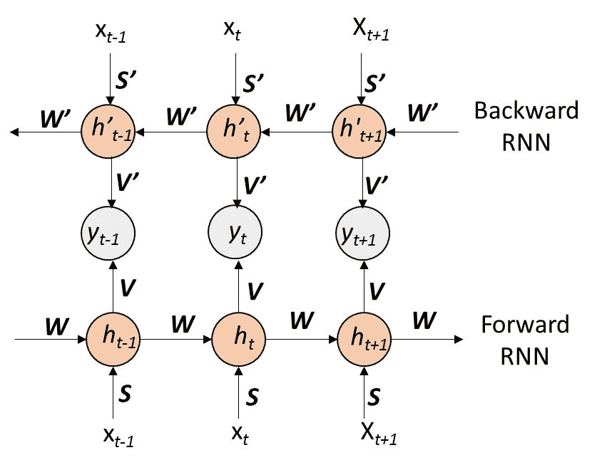
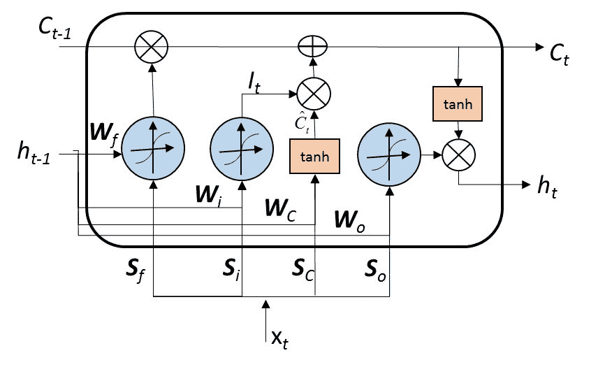

# 第六章：循环神经网络

本章将介绍用于序列数据集建模的循环神经网络。在本章中，我们将涵盖：

+   设置基础的循环神经网络

+   设置双向 RNN 模型

+   设置深度 RNN 模型

+   设置基于长短期记忆的序列模型

# 设置基础的循环神经网络

**循环神经网络** (**RNN**) 用于处理存在高自相关性的序列数据集。例如，使用患者的历史数据集预测患者的就诊路径，或预测给定句子中的下一个单词。这些问题的共同点在于输入长度不固定，并且存在序列依赖性。标准的神经网络和深度学习模型受到固定大小输入的限制，并产生固定长度的输出。例如，基于占用数据集构建的深度学习神经网络有六个输入特征，并且输出为二项式结果。

# 准备工作

机器学习领域中的生成模型是指那些能够生成可观察数据值的模型。例如，训练一个生成模型，通过图像库生成新的图像。所有生成模型的目标是计算给定数据集的联合分布，无论是隐式还是显式地：

1.  安装并设置 TensorFlow。

1.  加载所需的包：

```py
library(tensorflow) 

```

# 如何操作…

本节将提供设置 RNN 模型的步骤。

1.  加载 `MNIST` 数据集：

```py
# Load mnist dataset from tensorflow library 
datasets <- tf$contrib$learn$datasets 
mnist <- datasets$mnist$read_data_sets("MNIST-data", one_hot = TRUE) 

```

1.  重置图形并开始交互式会话：

```py
# Reset the graph and set-up a interactive session 
tf$reset_default_graph() 
sess<-tf$InteractiveSession() 

```

1.  使用 第四章 *使用自编码器的数据表示* 中的 `reduceImage` 函数，将图像大小缩小至 16 x 16 像素：

```py
# Covert train data to 16 x 16  pixel image 
trainData<-t(apply(mnist$train$images, 1, FUN=reduceImage)) 
validData<-t(apply(mnist$test$images, 1, FUN=reduceImage)) 

```

1.  提取定义好的 `train` 和 `valid` 数据集的标签：

```py
labels <- mnist$train$labels 
labels_valid <- mnist$test$labels

```

1.  定义模型参数，如输入像素的大小（`n_input`）、步长（`step_size`）、隐藏层的数量（`n.hidden`）和结果类别的数量（`n.classes`）：

```py
# Define Model parameter 
n_input<-16 
step_size<-16 
n.hidden<-64 
n.class<-10 

```

1.  定义训练参数，如学习率（`lr`）、每批次输入数量（`batch`）和迭代次数（`iteration`）：

```py
lr<-0.01 
batch<-500 
iteration = 100 

```

1.  定义一个函数 `rnn`，该函数接收批量输入数据集（`x`）、权重矩阵（`weight`）和偏置向量（`bias`）；并返回最基本 RNN 的最终预测向量：

```py
# Set up a most basic RNN 
rnn<-function(x, weight, bias){ 
  # Unstack input into step_size 
  x = tf$unstack(x, step_size, 1) 

  # Define a most basic RNN  
  rnn_cell = tf$contrib$rnn$BasicRNNCell(n.hidden) 

  # create a Recurrent Neural Network 
  cell_output = tf$contrib$rnn$static_rnn(rnn_cell, x, dtype=tf$float32) 

  # Linear activation, using rnn inner loop  
  last_vec=tail(cell_output[[1]], n=1)[[1]] 
  return(tf$matmul(last_vec, weights) + bias) 
} 
Define a function eval_func to evaluate mean accuracy using actual (y) and predicted labels (yhat): 
# Function to evaluate mean accuracy 
eval_acc<-function(yhat, y){ 
  # Count correct solution 
  correct_Count = tf$equal(tf$argmax(yhat,1L), tf$argmax(y,1L)) 

  # Mean accuracy 
  mean_accuracy = tf$reduce_mean(tf$cast(correct_Count, tf$float32)) 

  return(mean_accuracy) 
}

```

1.  定义 `placeholder` 变量（`x` 和 `y`），并初始化权重矩阵和偏置向量：

```py
with(tf$name_scope('input'), { 
# Define placeholder for input data 
x = tf$placeholder(tf$float32, shape=shape(NULL, step_size, n_input), name='x') 
y <- tf$placeholder(tf$float32, shape(NULL, n.class), name='y') 

# Define Weights and bias 
weights <- tf$Variable(tf$random_normal(shape(n.hidden, n.class))) 
bias <- tf$Variable(tf$random_normal(shape(n.class))) 
}) 

```

1.  生成预测标签：

```py
# Evaluate rnn cell output 
yhat = rnn(x, weights, bias) 
Define the loss function and optimizer 
cost = tf$reduce_mean(tf$nn$softmax_cross_entropy_with_logits(logits=yhat, labels=y)) 
optimizer = tf$train$AdamOptimizer(learning_rate=lr)$minimize(cost) 

```

1.  在初始化全局变量初始化器后运行优化：

```py
sess$run(tf$global_variables_initializer()) 
for(i in 1:iteration){ 
  spls <- sample(1:dim(trainData)[1],batch) 
  sample_data<-trainData[spls,] 
  sample_y<-labels[spls,] 

  # Reshape sample into 16 sequence with each of 16 element 
  sample_data=tf$reshape(sample_data, shape(batch, step_size, n_input)) 
  out<-optimizer$run(feed_dict = dict(x=sample_data$eval(), y=sample_y)) 

  if (i %% 1 == 0){ 
    cat("iteration - ", i, "Training Loss - ",  cost$eval(feed_dict = dict(x=sample_data$eval(), y=sample_y)), "\n") 
  } 
} 

```

1.  获取 `valid_data` 上的平均准确率：

```py
valid_data=tf$reshape(validData, shape(-1, step_size, n_input)) 
cost$eval(feed_dict=dict(x=valid_data$eval(), y=labels_valid)) 

```

# 它是如何工作的…

任何结构上的变化都需要重新训练模型。然而，这些假设可能不适用于很多序列数据集，比如文本分类，它们可能具有不同的输入和输出。RNN 架构有助于解决可变输入长度的问题。

标准的 RNN 架构，输入和输出如图所示：


循环神经网络架构

RNN 结构可以表述为如下：


其中  是时间/索引 *t* 时的状态， 是时间/索引 *t* 时的输入。矩阵 *W* 表示连接隐藏节点的权重，*S* 连接输入与隐藏层。时间/索引 *t* 时的输出节点与状态 *h[t]* 的关系如下所示：


在前面的方程层中，权重在状态和时间上保持不变。

# 设置双向 RNN 模型

循环神经网络专注于仅通过使用历史状态来捕捉时间 *t* 的顺序信息。然而，双向 RNN 从两个方向训练模型，一个 RNN 层从开始到结束移动，另一个 RNN 层从结束到开始移动。

因此，模型依赖于历史数据和未来数据。双向 RNN 模型在存在因果结构的情况下非常有用，例如文本和语音。双向 RNN 的展开结构如下图所示：



展开的双向 RNN 结构

# 准备工作

安装并设置 TensorFlow：

1.  加载所需的包：

```py
library(tensorflow) 

```

1.  加载 `MNIST` 数据集。

1.  `MNIST` 数据集中的图像被缩小为 16 x 16 像素并进行归一化处理（详细内容请参见 *设置 RNN 模型* 部分）。

# 如何操作...

本节介绍设置双向 RNN 模型的步骤。

1.  重置图并开始交互式会话：

```py
# Reset the graph and set-up a interactive session 
tf$reset_default_graph() 
sess<-tf$InteractiveSession() 

```

1.  使用 第四章 的 `reduceImage` 函数将图像大小减少为 16 x 16 像素，*使用自编码器的数据表示*：

```py
# Covert train data to 16 x 16  pixel image 
trainData<-t(apply(mnist$train$images, 1, FUN=reduceImage)) 
validData<-t(apply(mnist$test$images, 1, FUN=reduceImage)) 

```

1.  提取定义的 `train` 和 `valid` 数据集的标签：

```py
labels <- mnist$train$labels 
labels_valid <- mnist$test$labels 

```

1.  定义模型参数，例如输入像素的大小（`n_input`）、步长（`step_size`）、隐藏层的数量（`n.hidden`）和结果类别的数量（`n.classes`）：

```py
# Define Model parameter 
n_input<-16 
step_size<-16 
n.hidden<-64 
n.class<-10 

```

1.  定义训练参数，例如学习率（`lr`）、每批次运行的输入数量（`batch`）和迭代次数（`iteration`）：

```py
lr<-0.01 
batch<-500 
iteration = 100 

```

1.  定义一个函数来执行 `bidirectional` 循环神经网络：

```py
bidirectionRNN<-function(x, weights, bias){ 
  # Unstack input into step_size 
  x = tf$unstack(x, step_size, 1) 

  # Forward lstm cell 
  rnn_cell_forward = tf$contrib$rnn$BasicRNNCell(n.hidden) 

  # Backward lstm cell 
  rnn_cell_backward = tf$contrib$rnn$BasicRNNCell(n.hidden) 

  # Get lstm cell output 
  cell_output = tf$contrib$rnn$static_bidirectional_rnn(rnn_cell_forward, rnn_cell_backward, x, dtype=tf$float32) 

  # Linear activation, using rnn inner loop last output 
  last_vec=tail(cell_output[[1]], n=1)[[1]] 
  return(tf$matmul(last_vec, weights) + bias) 
} 

```

1.  定义一个 `eval_func` 函数，用于使用实际标签（`y`）和预测标签（`yhat`）评估平均准确度：

```py
# Function to evaluate mean accuracy 
eval_acc<-function(yhat, y){ 
  # Count correct solution 
  correct_Count = tf$equal(tf$argmax(yhat,1L), tf$argmax(y,1L)) 

  # Mean accuracy 
  mean_accuracy = tf$reduce_mean(tf$cast(correct_Count, tf$float32)) 

  return(mean_accuracy) 
} 

```

1.  定义 `placeholder` 变量（`x` 和 `y`）并初始化权重矩阵和偏差向量：

```py
with(tf$name_scope('input'), { 
# Define placeholder for input data 
x = tf$placeholder(tf$float32, shape=shape(NULL, step_size, n_input), name='x') 
y <- tf$placeholder(tf$float32, shape(NULL, n.class), name='y') 

# Define Weights and bias 
weights <- tf$Variable(tf$random_normal(shape(n.hidden, n.class))) 
bias <- tf$Variable(tf$random_normal(shape(n.class))) 
}) 

```

1.  生成预测标签：

```py
# Evaluate rnn cell output 
yhat = bidirectionRNN(x, weights, bias) 

```

1.  定义损失函数和优化器：

```py
cost = tf$reduce_mean(tf$nn$softmax_cross_entropy_with_logits(logits=yhat, labels=y)) 
optimizer = tf$train$AdamOptimizer(learning_rate=lr)$minimize(cost) 

```

1.  在初始化会话后，使用全局变量初始化器运行优化：

```py
sess$run(tf$global_variables_initializer()) 
# Running optimization 
for(i in 1:iteration){ 
  spls <- sample(1:dim(trainData)[1],batch) 
  sample_data<-trainData[spls,] 
  sample_y<-labels[spls,] 

  # Reshape sample into 16 sequence with each of 16 element 
  sample_data=tf$reshape(sample_data, shape(batch, step_size, n_input)) 
  out<-optimizer$run(feed_dict = dict(x=sample_data$eval(), y=sample_y)) 

  if (i %% 1 == 0){ 
    cat("iteration - ", i, "Training Loss - ",  cost$eval(feed_dict = dict(x=sample_data$eval(), y=sample_y)), "\n") 
  } 
} 

```

1.  获取验证数据的平均准确度：

```py
valid_data=tf$reshape(validData, shape(-1, step_size, n_input)) 
cost$eval(feed_dict=dict(x=valid_data$eval(), y=labels_valid))

```

1.  RNN 的代价函数收敛情况如下图所示：


MNIST 数据集上的双向循环神经网络收敛图

# 设置深度 RNN 模型

RNN 架构由输入层、隐藏层和输出层组成。通过将隐藏层分解为多个组，或通过在 RNN 架构中添加计算节点，例如在微学习中使用多层感知器模型，可以使 RNN 网络变深。计算节点可以添加在输入-隐藏、隐藏-隐藏和隐藏-输出的连接之间。以下是多层深度 RNN 模型的示例：


两层深度递归神经网络架构示例

# 如何实现...

TensorFlow 中的 RNN 模型可以通过使用 `MultiRNNCell` 容易地扩展为深度 RNN 模型。之前的 `rnn` 函数可以用 `stacked_rnn` 函数替换，从而实现深度 RNN 架构：

1.  定义深度 RNN 架构中的层数：

```py
num_layers <- 3 

```

1.  定义一个 `stacked_rnn` 函数以执行多隐藏层深度 RNN：

```py
stacked_rnn<-function(x, weight, bias){ 
  # Unstack input into step_size 
  x = tf$unstack(x, step_size, 1) 

  # Define a most basic RNN  
  network = tf$contrib$rnn$GRUCell(n.hidden) 

  # Then, assign stacked RNN cells 
  network = tf$contrib$rnn$MultiRNNCell(lapply(1:num_layers,function(k,network){network},network)) 

  # create a Recurrent Neural Network 
  cell_output = tf$contrib$rnn$static_rnn(network, x, dtype=tf$float32) 

  # Linear activation, using rnn inner loop  
  last_vec=tail(cell_output[[1]], n=1)[[1]] 
  return(tf$matmul(last_vec, weights) + bias) 
} 

```

# 设置基于长短期记忆的序列模型

在序列学习中，目标是捕捉短期记忆和长期记忆。标准的 RNN 能很好地捕捉短期记忆，但它们在捕捉长期依赖关系时并不有效，因为在 RNN 链中，梯度会随着时间的推移消失（或极少爆炸）。

当权重值很小时，梯度会消失，这些值在相乘后会随时间消失；相比之下，权重大时，随着时间的推移，值不断增大，并导致学习过程的发散。为了解决这个问题，**长短期记忆**（**LSTM**）被提出。

# 如何实现...

TensorFlow 中的 RNN 模型可以通过使用 `BasicLSTMCell` 容易地扩展为 LSTM 模型。之前的 `rnn` 函数可以用 `lstm` 函数替换，从而实现 LSTM 架构：

```py
# LSTM implementation 
lstm<-function(x, weight, bias){ 
  # Unstack input into step_size 
  x = tf$unstack(x, step_size, 1) 

  # Define a lstm cell 
  lstm_cell = tf$contrib$rnn$BasicLSTMCell(n.hidden, forget_bias=1.0, state_is_tuple=TRUE) 

  # Get lstm cell output 
  cell_output = tf$contrib$rnn$static_rnn(lstm_cell, x, dtype=tf$float32) 

  # Linear activation, using rnn inner loop last output 
  last_vec=tail(cell_output[[1]], n=1)[[1]] 
  return(tf$matmul(last_vec, weights) + bias) 
} 

```

为了简洁，代码的其他部分未被复制。

# 它是如何工作的...

LSTM 的结构类似于 RNN，然而，基本单元却非常不同，因为传统的 RNN 使用单一的**多层感知器**（**MLP**），而 LSTM 的单个单元包含四个相互作用的输入层。这三个层是：

+   忘记门

+   输入门

+   输出门

LSTM 中的*忘记门*决定丢弃哪些信息，它依赖于上一个隐藏状态输出 *h[t-1]* 和 *X[t]*，其中 *X[t]* 表示时间 *t* 的输入。


忘记门的示意图

在前面的图中，*C[t]* 表示时间 *t* 时刻的单元状态。输入数据由 *X[t]* 表示，隐藏状态由 *h[t-1]* 表示。前一层可以表示为：


*输入门*决定更新值并决定记忆单元的候选值，同时更新单元状态，如下图所示：


输入门的示意图

+   时间 *t* 时刻的输入 *i[t]* 更新如下：


+   当前状态的期望值和输入门的输出用于更新时刻*t*的当前状态，计算公式为：


输出门，如下图所示，根据输入*X[t]*、前一层输出*h[t-1]*和当前状态*C[t]*来计算 LSTM 单元的输出：



输出门示意图

基于*输出门*的输出可以按以下方式计算：


