# 第七章：强化学习

本章将介绍强化学习。我们将涵盖以下主题：

+   设置马尔可夫决策过程

+   执行基于模型的学习

+   执行无模型学习

# 引言

**强化学习**（**RL**）是机器学习的一个领域，灵感来自心理学，例如智能体（软件程序）如何采取行动以最大化累积奖励。

强化学习是基于奖励的学习方式，其中奖励要么在学习结束时出现，要么在学习过程中分配。例如，在国际象棋中，奖励是与胜负相关的，而在像网球这样的游戏中，每赢得一分就是奖励。一些强化学习的商业实例包括谷歌的 DeepMind，它利用强化学习掌握跑酷技术。类似地，特斯拉也在使用强化学习开发人工智能驱动的技术。以下图示为强化架构的一个例子：

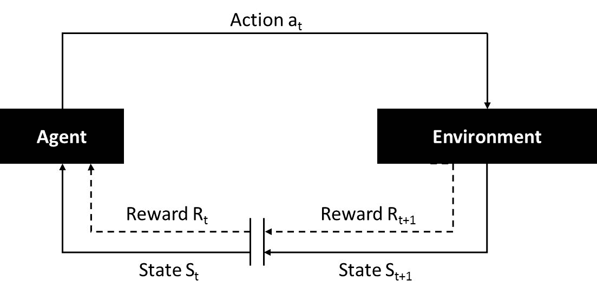

强化学习中智能体与环境的交互

强化学习的基本符号如下：

+   **T(s, a, s')**：表示当在状态 *s* 执行动作 *a* 时，达到状态 *s'* 的转移模型

+   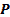：表示一个策略，定义了在每个可能状态下应该采取的行动！[](img/00114.gif)

+   **R(s)**：表示智能体在状态 *s* 时获得的奖励

本章将探讨如何使用 R 设置强化模型。下一小节将介绍来自 R 的 `MDPtoolbox`。

# 设置马尔可夫决策过程

**马尔可夫决策过程**（**MDP**）是设置强化学习的基础，其中决策的结果是半控制的；即，它部分是随机的，部分是由决策者控制的。一个 MDP 通过一组可能的状态（**S**）、一组可能的动作（**A**）、一个实值奖励函数（**R**）以及给定动作的状态转移概率（**T**）来定义。此外，一个动作对某个状态的影响仅依赖于该状态本身，而不依赖于其之前的状态。

# 准备工作

在本节中，我们定义一个智能体在 4 x 4 网格上移动，如下图所示：

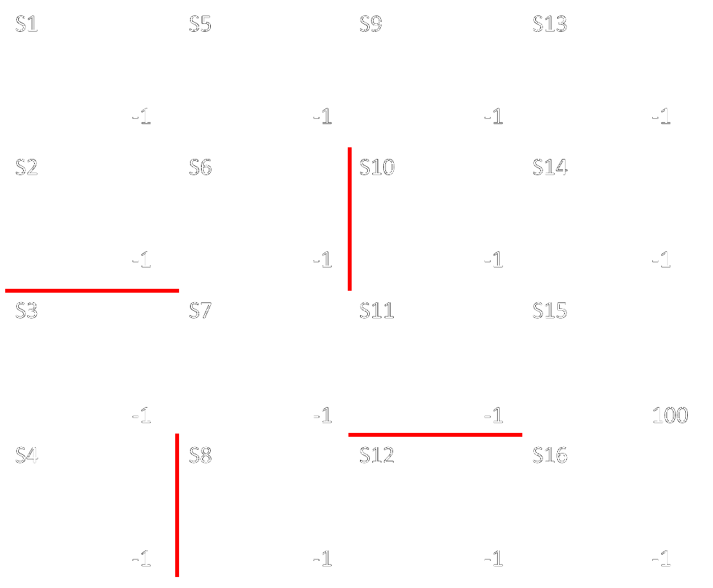

一个 4 x 4 的 16 状态网格示例

该网格有 16 个状态（*S1*、*S2*……*S16*）。在每个状态下，智能体可以执行四个动作（*上*、*右*、*下*、*左*）。然而，智能体将根据以下约束限制一些动作：

+   边缘上的状态将限制为只指向网格中的状态的动作。例如，智能体在 *S1* 时仅限于向 *右* 或 *下* 的动作。

+   一些状态转移有障碍，标记为红色。例如，智能体不能从 *S2* 向下转移到 *S3*。

每个状态也被分配了一个奖励。智能体的目标是以最少的步骤到达目标，从而获得最大奖励。除状态 *S15* 的奖励值为 100 外，其他所有状态的奖励值均为 *-1*。

这里，我们将使用 R 中的`MDPtoolbox`包。

# 如何实现...

本节将展示如何在 R 中使用`MDPtoolbox`设置强化学习（RL）模型：

1.  安装并加载所需的包：

```py
Install.packages("MDPtoolbox") 
library(MDPtoolbox) 

```

1.  定义动作的转移概率。这里，每一行表示“从某个状态”，每一列表示“到某个状态”。由于我们有 16 个状态，每个动作的转移概率矩阵将是一个 16 x 16 的矩阵，每一行的和为 1：

```py
up<- matrix(c(1      ,     0     ,     0     ,     0     ,     0     ,     0   ,     0     ,     0     ,     0     ,     0     ,     0     ,     0     ,   0     ,     0     ,     0     ,     0     , 
               0.7   ,     0.2   ,     0     ,     0     ,     0     ,     0.1   ,     0     ,     0     ,     0     ,     0     ,     0     ,     0     ,   0     ,     0     ,     0     ,     0     , 
               0     ,     0     ,     0.8   ,     0.05  ,     0     ,     0   ,     0.15  ,     0     ,     0     ,     0     ,     0     ,     0     ,   0     ,     0     ,     0     ,     0     , 
               0     ,     0     ,     0.7   ,     0.3   ,     0     ,     0   ,     0     ,     0     ,     0     ,     0     ,     0     ,     0     ,   0     ,     0     ,     0     ,     0     , 
               0.1   ,     0     ,     0     ,     0     ,     0.7   ,     0.1   ,     0     ,     0     ,     0.1   ,     0     ,     0     ,     0     ,   0     ,     0     ,     0     ,     0     , 
               0     ,     0.05  ,     0     ,     0     ,     0.7   ,     0.15   ,     0.1   ,     0     ,     0     ,     0     ,     0     ,     0     ,   0     ,     0     ,     0     ,     0     , 
               0     ,     0     ,     0.05  ,     0     ,     0     ,     0.7   ,     0.15  ,     0.05  ,     0     ,     0     ,     0.05  ,     0     ,   0     ,     0     ,     0     ,     0     , 
               0     ,     0     ,     0     ,     0     ,     0     ,     0   ,     0.7   ,     0.2   ,     0     ,     0     ,     0     ,     0.1   ,   0     ,     0     ,     0     ,     0     , 
               0     ,     0     ,     0     ,     0     ,     0.05  ,     0   ,     0     ,     0     ,     0.85  ,     0.05  ,     0     ,     0     ,   0.05  ,     0     ,     0     ,     0     , 
               0     ,     0     ,     0     ,     0     ,     0     ,     0   ,     0     ,     0     ,     0.7   ,     0.2   ,     0.05  ,     0     ,   0     ,     0.05  ,     0     ,     0     , 
               0     ,     0     ,     0     ,     0     ,     0     ,     0   ,     0.05  ,     0     ,     0     ,     0.7   ,     0.2   ,     0     ,   0     ,     0     ,     0.05  ,     0     , 
               0     ,     0     ,     0     ,     0     ,     0     ,     0   ,     0     ,     0.05  ,     0     ,     0     ,     0     ,     0.9   ,   0     ,     0     ,     0     ,     0.05  , 
               0     ,     0     ,     0     ,     0     ,     0     ,     0   ,     0     ,     0     ,     0.1   ,     0     ,     0     ,     0     ,   0.9   ,     0     ,     0     ,     0     , 
               0     ,     0     ,     0     ,     0     ,     0     ,     0   ,     0     ,     0     ,     0     ,     0.1   ,     0     ,     0     ,   0.7   ,     0.2   ,     0     ,     0     , 
               0     ,     0     ,     0     ,     0     ,     0     ,     0   ,     0     ,     0     ,     0     ,     0     ,     0.05  ,     0     ,   0     ,     0.8   ,     0.15  ,     0     , 
               0     ,     0     ,     0     ,     0     ,     0     ,     0   ,     0     ,     0     ,     0     ,     0     ,     0     ,     0     ,   0     ,     0     ,     0.8   ,     0.2   ), 
nrow=16, ncol=16, byrow=TRUE) 
left<- matrix(c(1    ,     0     ,     0     ,     0     ,     0     ,     0   ,     0     ,     0     ,     0     ,     0     ,     0     ,     0     ,   0     ,     0     ,     0     ,     0     , 
                 0.05      ,     0.9   ,     0     ,     0     ,     0     ,   0.05  ,     0     ,     0     ,     0     ,     0     ,     0     ,     0   ,     0     ,     0     ,     0     ,     0     , 
                 0   ,     0     ,     0.9   ,     0.05  ,     0     ,     0   ,     0.05  ,     0     ,     0     ,     0     ,     0     ,     0     ,   0     ,     0     ,     0     ,     0     , 
                 0   ,     0     ,     0.05  ,     0.9   ,     0     ,     0   ,     0     ,     0.05  ,     0     ,     0     ,     0     ,     0     ,   0     ,     0     ,     0     ,     0     , 
                 0.8 ,     0     ,     0     ,     0     ,     0.1   ,     0.05   ,     0     ,     0     ,     0.05  ,     0     ,     0     ,     0     ,   0     ,     0     ,     0     ,     0     , 
                 0   ,     0.8   ,     0     ,     0     ,     0.05  ,     0.1   ,     0.05  ,     0     ,     0     ,     0     ,     0     ,     0     ,   0     ,     0     ,     0     ,     0     , 
                 0   ,     0     ,     0.8   ,     0     ,     0     ,     0.05   ,     0.1   ,     0.05  ,     0     ,     0     ,     0     ,     0     ,   0     ,     0     ,     0     ,     0     , 
                 0   ,     0     ,     0     ,     0     ,     0     ,     0   ,     0.1   ,     0.8   ,     0     ,     0     ,     0     ,     0.1   ,   0     ,     0     ,     0     ,     0     , 
                 0   ,     0     ,     0     ,     0     ,     0.8   ,     0   ,     0     ,     0     ,     0.1   ,     0.05  ,     0     ,     0     ,   0.05  ,     0     ,     0     ,     0     , 
                 0   ,     0     ,     0     ,     0     ,     0     ,     0.8   ,     0     ,     0     ,     0.05  ,     0.1   ,     0.05  ,     0     ,   0     ,     0     ,     0     ,     0     , 
                 0   ,     0     ,     0     ,     0     ,     0     ,     0   ,     0.8   ,     0     ,     0     ,     0.1   ,     0.1   ,     0     ,   0     ,     0     ,     0     ,     0     , 
                 0   ,     0     ,     0     ,     0     ,     0     ,     0   ,     0     ,     0.8   ,     0     ,     0     ,     0     ,     0.2   ,   0     ,     0     ,     0     ,     0     , 
                 0   ,     0     ,     0     ,     0     ,     0     ,     0   ,     0     ,     0     ,     0.8   ,     0     ,     0     ,     0     ,   0.2   ,     0     ,     0     ,     0     , 
                 0   ,     0     ,     0     ,     0     ,     0     ,     0   ,     0     ,     0     ,     0     ,     0.8   ,     0     ,     0     ,   0.05  ,     0.1   ,     0.05  ,     0     , 
                 0   ,     0     ,     0     ,     0     ,     0     ,     0   ,     0     ,     0     ,     0     ,     0     ,     0.8   ,     0     ,   0     ,     0.05  ,     0.1   ,     0.05  , 
                 0   ,     0     ,     0     ,     0     ,     0     ,     0   ,     0     ,     0     ,     0     ,     0     ,     0     ,     0.8   ,   0     ,     0     ,     0.05  ,     0.15), 
nrow=16, ncol=16, byrow=TRUE) 
down<- matrix(c(0.1  ,     0.8   ,     0     ,     0     ,     0.1   ,     0   ,     0     ,     0     ,     0     ,     0     ,     0     ,     0     ,   0     ,     0     ,     0     ,     0     , 
                 0.05      ,     0.9   ,     0     ,     0     ,     0     ,   0.05  ,     0     ,     0     ,     0     ,     0     ,     0     ,     0   ,     0     ,     0     ,     0     ,     0     , 
                 0   ,     0     ,     0.1   ,     0.8   ,     0     ,     0   ,     0.1   ,     0     ,     0     ,     0     ,     0     ,     0     ,   0     ,     0     ,     0     ,     0     , 
                 0   ,     0     ,     0.1   ,     0.9   ,     0     ,     0   ,     0     ,     0     ,     0     ,     0     ,     0     ,     0     ,   0     ,     0     ,     0     ,     0     , 
                 0.05      ,     0     ,     0     ,     0     ,     0.15  ,   0.8   ,     0     ,     0     ,     0     ,     0     ,     0     ,     0   ,     0     ,     0     ,     0     ,     0     , 
                 0   ,     0     ,     0     ,     0     ,     0     ,     0.2   ,     0.8   ,     0     ,     0     ,     0     ,     0     ,     0     ,   0     ,     0     ,     0     ,     0     , 
                 0   ,     0     ,     0     ,     0     ,     0     ,     0   ,     0.2   ,     0.8   ,     0     ,     0     ,     0     ,     0     ,   0     ,     0     ,     0     ,     0     , 
                 0   ,     0     ,     0     ,     0     ,     0     ,     0   ,     0.1   ,     0.9   ,     0     ,     0     ,     0     ,     0     ,   0     ,     0     ,     0     ,     0     , 
                 0   ,     0     ,     0     ,     0     ,     0.05  ,     0   ,     0     ,     0     ,     0.1   ,     0.8   ,     0     ,     0     ,   0.05  ,     0     ,     0     ,     0     , 
                 0   ,     0     ,     0     ,     0     ,     0     ,     0   ,     0     ,     0     ,     0     ,     0.2   ,     0.8   ,     0     ,   0     ,     0     ,     0     ,     0     , 
                 0   ,     0     ,     0     ,     0     ,     0     ,     0   ,     0     ,     0     ,     0     ,     0.05  ,     0.8   ,     0     ,   0     ,     0     ,     0.05  ,     0     , 
                 0   ,     0     ,     0     ,     0     ,     0     ,     0   ,     0     ,     0.05  ,     0     ,     0     ,     0     ,     0.9   ,   0     ,     0     ,     0     ,     0.05  , 
                 0   ,     0     ,     0     ,     0     ,     0     ,     0   ,     0     ,     0     ,     0     ,     0     ,     0     ,     0     ,   0.2   ,     0.8   ,     0     ,     0     , 
                 0   ,     0     ,     0     ,     0     ,     0     ,     0   ,     0     ,     0     ,     0     ,     0     ,     0     ,     0     ,   0.05  ,     0.15  ,     0.8   ,     0     , 
                 0   ,     0     ,     0     ,     0     ,     0     ,     0   ,     0     ,     0     ,     0     ,     0     ,     0     ,     0     ,   0     ,     0     ,     0.2   ,     0.8   , 
                 0   ,     0     ,     0     ,     0     ,     0     ,     0   ,     0     ,     0     ,     0     ,     0     ,     0     ,     0     ,   0     ,     0     ,     0     ,     1), 
nrow=16, ncol=16, byrow=TRUE) 
right<- matrix(c(0.2 ,     0.1   ,     0     ,     0     ,     0.7   ,     0   ,     0     ,     0     ,     0     ,     0     ,     0     ,     0     ,   0     ,     0     ,     0     ,     0     , 
                  0.1      ,     0.1   ,     0     ,     0     ,     0     ,   0.8   ,     0     ,     0     ,     0     ,     0     ,     0     ,     0   ,     0     ,     0     ,     0     ,     0     , 
                  0  ,     0     ,     0.2   ,     0     ,     0     ,     0   ,     0.8   ,     0     ,     0     ,     0     ,     0     ,     0     ,   0     ,     0     ,     0     ,     0     , 
                  0  ,     0     ,     0.1   ,     0.9   ,     0     ,     0   ,     0     ,     0     ,     0     ,     0     ,     0     ,     0     ,   0     ,     0     ,     0     ,     0     , 
                  0  ,     0     ,     0     ,     0     ,     0.2   ,     0.1   ,     0     ,     0     ,     0.7   ,     0     ,     0     ,     0     ,   0     ,     0     ,     0     ,     0     , 
                  0  ,     0     ,     0     ,     0     ,     0     ,     0.9   ,     0.1   ,     0     ,     0     ,     0     ,     0     ,     0     ,   0     ,     0     ,     0     ,     0     , 
                  0  ,     0     ,     0     ,     0     ,     0     ,     0.05   ,     0.1   ,     0     ,     0     ,     0     ,     0.85  ,     0     ,   0     ,     0     ,     0     ,     0     , 
                  0  ,     0     ,     0     ,     0     ,     0     ,     0   ,     0.1   ,     0.2   ,     0     ,     0     ,     0     ,     0.7   ,   0     ,     0     ,     0     ,     0     , 
                  0  ,     0     ,     0     ,     0     ,     0     ,     0   ,     0     ,     0     ,     0.2   ,     0     ,     0     ,     0     ,   0.8   ,     0     ,     0     ,     0     , 
                  0  ,     0     ,     0     ,     0     ,     0     ,     0   ,     0     ,     0     ,     0     ,     0.1   ,     0     ,     0     ,   0     ,     0.9   ,     0     ,     0     , 
                  0  ,     0     ,     0     ,     0     ,     0     ,     0   ,     0     ,     0     ,     0     ,     0     ,     0.1   ,     0     ,   0     ,     0     ,     0.9   ,     0     , 
                  0  ,     0     ,     0     ,     0     ,     0     ,     0   ,     0     ,     0     ,     0     ,     0     ,     0     ,     0.2   ,   0     ,     0     ,     0     ,     0.8   , 
                  0  ,     0     ,     0     ,     0     ,     0     ,     0   ,     0     ,     0     ,     0     ,     0     ,     0     ,     0     ,   1     ,     0     ,     0     ,     0     , 
                  0  ,     0     ,     0     ,     0     ,     0     ,     0   ,     0     ,     0     ,     0     ,     0     ,     0     ,     0     ,   0     ,     1     ,     0     ,     0     , 
                  0  ,     0     ,     0     ,     0     ,     0     ,     0   ,     0     ,     0     ,     0     ,     0     ,     0     ,     0     ,   0     ,     0     ,     1     ,     0     , 
                  0  ,     0     ,     0     ,     0     ,     0     ,     0   ,     0     ,     0     ,     0     ,     0     ,     0     ,     0     ,   0     ,     0     ,     0     ,     1), 
nrow=16, ncol=16, byrow=TRUE) 

```

1.  定义一个转移概率矩阵列表：

```py
TPMs <- list(up=up, left=left, 
down=down, right=right) 

```

1.  定义一个维度为：16（状态数量）x 4（动作数量）的奖励矩阵：

```py
Rewards<- matrix(c(-1, -1, -1, -1, 
              -1, -1, -1, -1, 
              -1, -1, -1, -1, 
              -1, -1, -1, -1, 
              -1, -1, -1, -1, 
              -1, -1, -1, -1,
              -1, -1, -1, -1, 
              -1, -1, -1, -1, 
              -1, -1, -1, -1, 
              -1, -1, -1, -1, 
              -1, -1, -1, -1, 
              -1, -1, -1, -1, 
              -1, -1, -1, -1, 
              -1, -1, -1, -1, 
              100, 100, 100, 100, 
              -1, -1, -1, -1), 
nrow=16, ncol=4, byrow=TRUE) 

```

1.  测试定义的 `TPMs` 和 `Rewards` 是否满足一个明确的 MDP。如果返回空字符串，则说明该 MDP 是有效的：

```py
mdp_check(TPMs, Rewards) 

```

# 执行基于模型的学习

正如名称所示，学习是通过使用预定义的模型来增强的。这里，模型以转移概率的形式表示，关键目标是使用这些预定义的模型属性（即 `TPMs`）来确定最优策略和价值函数。策略被定义为一个智能体的学习机制，跨多个状态进行遍历。换句话说，确定智能体在给定状态下采取的最佳动作，以便转移到下一个状态，称为策略。

策略的目标是最大化从起始状态到目标状态的累积奖励，定义如下，其中 *P(s)* 是从起始状态 *s* 开始的累积策略 *P*，*R* 是通过执行动作 at 从状态 *st* 转移到状态 *s[t+1]* 的奖励。

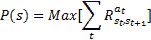

值函数有两种类型：状态值函数和状态-动作值函数。在状态值函数中，对于给定的策略，它被定义为处于某一特定状态（包括起始状态）的期望奖励；而在状态-动作值函数中，对于给定的策略，它被定义为处于某一特定状态（包括起始状态）并执行某一特定动作的期望奖励。

现在，若一个策略被称为最优策略，意味着它返回最大的期望累积奖励，并且其对应的状态被称为最优状态值函数，或者其对应的状态和动作被称为最优状态-动作值函数。

在基于模型的学习中，为了获得最优策略，执行以下迭代步骤，如下图所示：

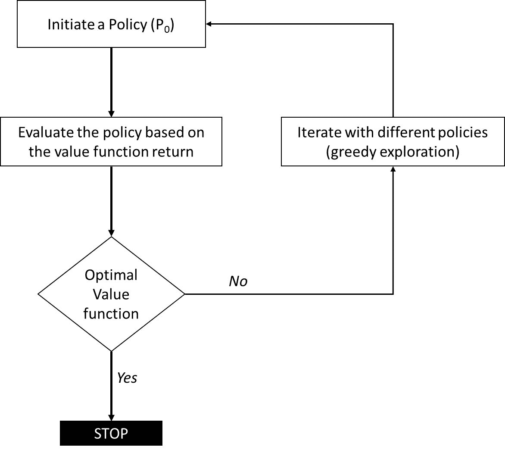

迭代步骤以找到最优策略

在本节中，我们将使用状态值函数评估策略。在每次迭代中，使用贝尔曼方程动态评估策略，如下所示，其中 *V[i]* 表示第 *i* 次迭代时的值，*P* 表示给定状态 *s* 和动作 *a* 的任意策略，*T* 表示由于动作 *a* 从状态 *s* 转移到状态 *s'* 的转移概率，*R* 表示在从状态 *s* 执行动作 *a* 后到达状态 *s'* 时的奖励，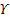 表示折扣因子，取值范围为（0,1）。折扣因子确保学习初期的步骤比后续步骤更为重要。

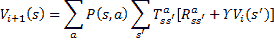

# 如何实现...

本节将向你展示如何设置基于模型的强化学习（RL）：

1.  使用状态-动作值函数进行策略迭代，折扣因子 *Υ = 0.9*：

```py
mdp_policy<- mdp_policy_iteration(P=TPMs, R=Rewards, discount=0.9) 

```

1.  获取最佳（最优）策略 P*，如下图所示。绿色箭头标记显示了从 *S1* 到 *S15* 的遍历方向：

```py
mdp_policy$policy 
names(TPMs)[mdp_policy$policy] 

```

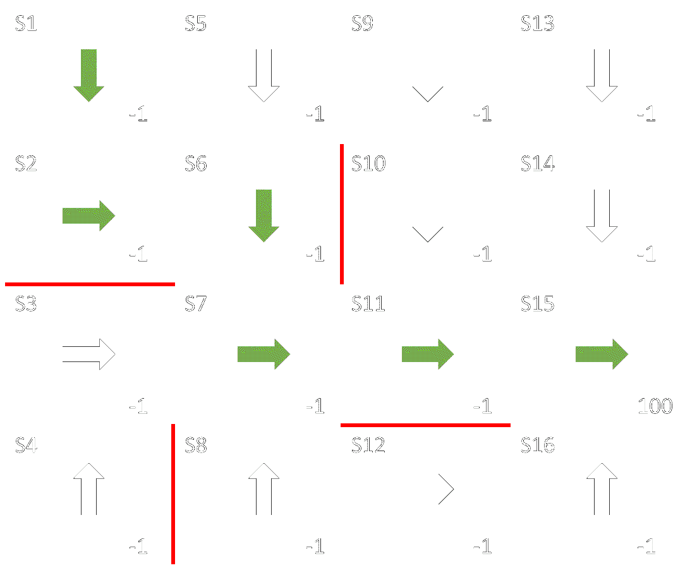

使用基于模型的迭代获得最优策略，并通过最优路径从 *S1* 到 *S15*

1.  获取每个状态的最优价值函数 V* 并如图所示绘制：

```py
mdp_policy$V 
names(mdp_policy$V) <- paste0("S",1:16) 
barplot(mdp_policy$V,col="blue",xlab="states",ylab="Optimal value",main="Value function of the optimal Policy",width=0.5) 

```

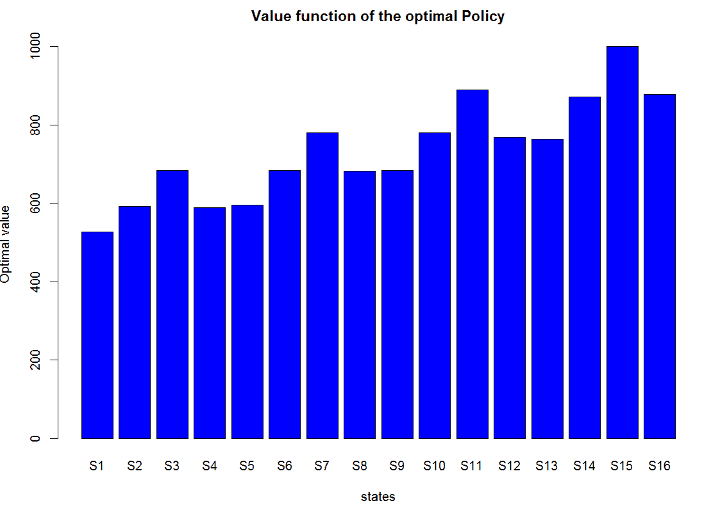

最优策略的价值函数

# 执行无模型学习

与基于模型的学习不同，基于模型的学习明确提供了转移的动态（例如从一个状态到另一个状态的转移概率），而在无模型学习中，转移应该通过状态之间的互动（使用动作）直接推断和学习，而不是显式提供。常见的无模型学习框架有**蒙特卡洛**方法和**Q-learning**技术。前者实现简单，但收敛较慢，而后者实现复杂，但由于离策略学习，收敛效率较高。

# 做好准备

在本节中，我们将实现 R 语言中的 Q-learning 算法。对周围环境的同时探索和对现有知识的利用被称为离策略收敛。例如，一个代理在特定状态下首先探索所有可能的动作，以过渡到下一个状态并观察相应的奖励，然后利用当前知识通过选取产生最大可能奖励的动作来更新现有的状态-动作值。

Q 学习返回一个大小为状态数 × 动作数的二维 Q 表。Q 表中的值根据以下公式更新，其中 *Q* 表示状态 *s* 和动作 *a* 的值，*r'* 表示所选动作 *a* 在下一个状态的奖励，*Υ* 表示折扣因子，*α* 表示学习率：

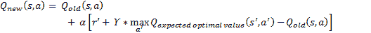

以下图所示为 Q-learning 框架：

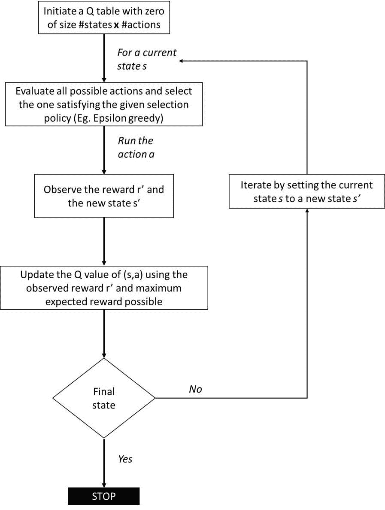

Q-learning 框架

# 如何实现...

本节提供了如何设置 Q-learning 的步骤：

1.  定义 16 个状态：

```py
states <- c("s1", "s2", "s3", "s4", "s5", "s6", "s7", "s8", "s9", "s10", "s11", "s12", "s13", "s14", "s15", "s16") 

```

1.  定义四个动作：

```py
actions<- c("up", "left", "down", "right") 

```

1.  定义`transitionStateAction`函数，该函数可以通过动作*a*模拟从一个状态*s*到另一个状态*s'*的转移。该函数输入当前状态*s*和选定的动作*a*，返回下一个状态*s'*和相应的奖励*r'*。在存在约束动作的情况下，返回的下一个状态为当前状态*s*，并返回现有奖励*r*：

```py
transitionStateAction<- function(state, action) { 
  # The default state is the existing state in case of constrained action 
next_state<- state 
if (state == "s1"&& action == "down") next_state<- "s2" 
if (state == "s1"&& action == "right") next_state<- "s5" 
if (state == "s2"&& action == "up") next_state<- "s1" 
if (state == "s2"&& action == "right") next_state<- "s6" 
if (state == "s3"&& action == "right") next_state<- "s7" 
if (state == "s3"&& action == "down") next_state<- "s4" 
if (state == "s4"&& action == "up") next_state<- "s3" 
if (state == "s5"&& action == "right") next_state<- "s9" 
if (state == "s5"&& action == "down") next_state<- "s6" 
if (state == "s5"&& action == "left") next_state<- "s1" 
if (state == "s6"&& action == "up") next_state<- "s5" 
if (state == "s6"&& action == "down") next_state<- "s7" 
if (state == "s6"&& action == "left") next_state<- "s2" 
if (state == "s7"&& action == "up") next_state<- "s6" 
if (state == "s7"&& action == "right") next_state<- "s11" 
if (state == "s7"&& action == "down") next_state<- "s8" 
if (state == "s7"&& action == "left") next_state<- "s3" 
if (state == "s8"&& action == "up") next_state<- "s7" 
if (state == "s8"&& action == "right") next_state<- "s12" 
if (state == "s9"&& action == "right") next_state<- "s13" 
if (state == "s9"&& action == "down") next_state<- "s10" 
if (state == "s9"&& action == "left") next_state<- "s5" 
if (state == "s10"&& action == "up") next_state<- "s9" 
if (state == "s10"&& action == "right") next_state<- "s14" 
if (state == "s10"&& action == "down") next_state<- "s11" 
if (state == "s11"&& action == "up") next_state<- "s10" 
if (state == "s11"&& action == "right") next_state<- "s15" 
if (state == "s11"&& action == "left") next_state<- "s7" 
if (state == "s12"&& action == "right") next_state<- "s16" 
if (state == "s12"&& action == "left") next_state<- "s8" 
if (state == "s13"&& action == "down") next_state<- "s14" 
if (state == "s13"&& action == "left") next_state<- "s9" 
if (state == "s14"&& action == "up") next_state<- "s13" 
if (state == "s14"&& action == "down") next_state<- "s15" 
if (state == "s14"&& action == "left") next_state<- "s10" 
if (state == "s15"&& action == "up") next_state<- "s14" 
if (state == "s15"&& action == "down") next_state<- "s16" 
if (state == "s15"&& action == "left") next_state<- "s11" 
if (state == "s16"&& action == "up") next_state<- "s15" 
if (state == "s16"&& action == "left") next_state<- "s12" 
  # Calculate reward 
if (next_state == "s15") { 
reward<- 100 
  } else { 
reward<- -1 
  } 

return(list(state=next_state, reward=reward)) 
} 

```

1.  定义一个函数，通过`n`次迭代执行 Q 学习：

```py
Qlearning<- function(n, initState, termState, 
epsilon, learning_rate) { 
  # Initialize a Q-matrix of size #states x #actions with zeroes 
Q_mat<- matrix(0, nrow=length(states), ncol=length(actions), 
dimnames=list(states, actions)) 
  # Run n iterations of Q-learning 
for (i in 1:n) { 
Q_mat<- updateIteration(initState, termState, epsilon, learning_rate, Q_mat) 
  } 
return(Q_mat) 
} 
   updateIteration<- function(initState, termState, epsilon, learning_rate, Q_mat) { 
state<- initState # set cursor to initial state 
while (state != termState) { 
    # Select the next action greedily or randomnly 
if (runif(1) >= epsilon) { 
action<- sample(actions, 1) # Select randomnly 
    } else { 
action<- which.max(Q_mat[state, ]) # Select best action 
    } 
    # Extract the next state and its reward 
response<- transitionStateAction(state, action) 
    # Update the corresponding value in Q-matrix (learning) 
Q_mat[state, action] <- Q_mat[state, action] + learning_rate * 
      (response$reward + max(Q_mat[response$state, ]) - Q_mat[state, action]) 
state<- response$state # update with next state 
  } 
return(Q_mat) 
} 

```

1.  设置学习参数，如`epsilon`和`learning_rate`：

```py
epsilon<- 0.1 
learning_rate<- 0.9 

```

1.  获取经过 50 万次迭代后的 Q 表：

```py
Q_mat<- Qlearning(500, "s1", "s15", epsilon, learning_rate) 
Q_mat 

```

1.  获取最佳（最优）策略 P*，如以下图所示。绿色标记的箭头显示了从*S1*到*S15*的遍历方向：

```py
actions[max.col(Q_mat)] 

```

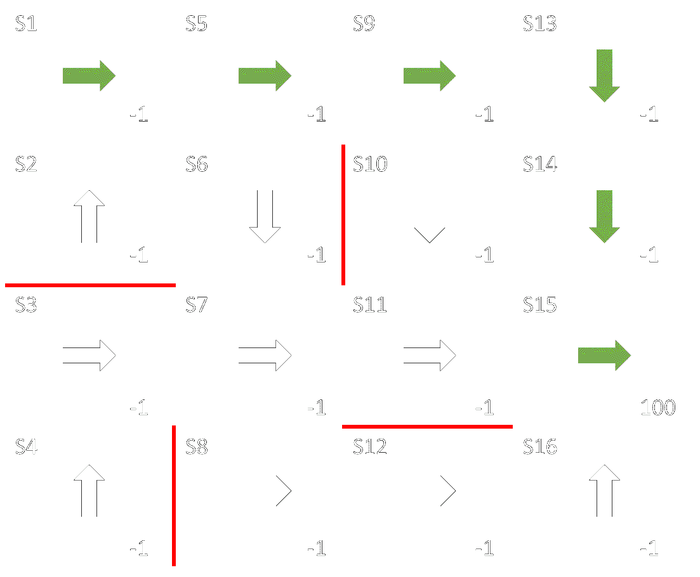

使用无模型迭代得到的最优策略，并展示从*S1*到*S15*的最优路径
