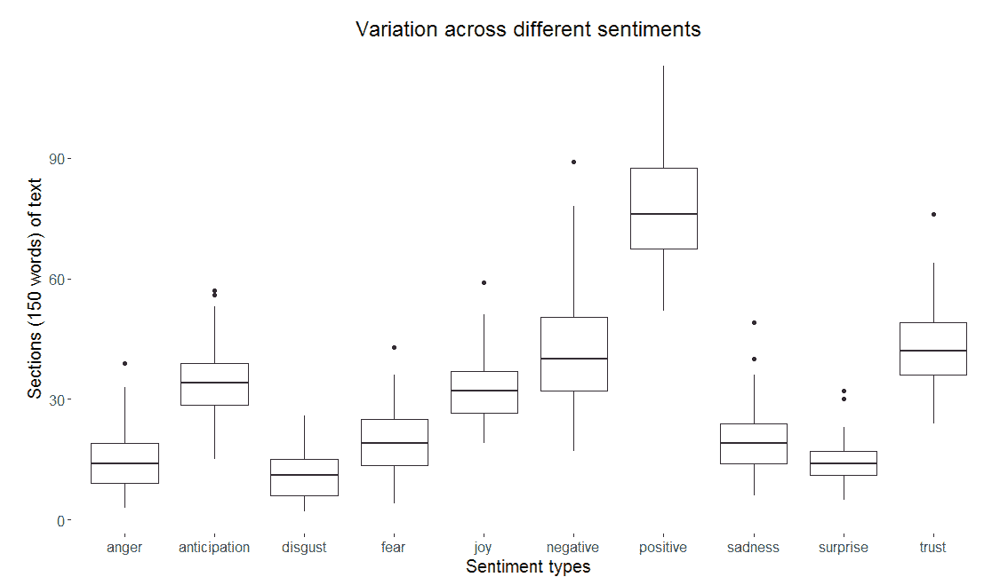

# 第八章：深度学习在文本挖掘中的应用

本章我们将涵盖以下主题：

+   执行文本数据的预处理和情感提取

+   使用 tf-idf 分析文档

+   使用 LSTM 网络进行情感预测

+   使用 text2vec 示例的应用

# 执行文本数据的预处理和情感提取

在本节中，我们将使用简·奥斯汀的畅销小说《傲慢与偏见》（1813 年出版）进行文本数据预处理分析。在 R 中，我们将使用 Hadley Wickham 的`tidytext`包进行分词、去除停用词、使用预定义的情感词典进行情感提取、**词频-逆文档频率**（**tf-idf**）矩阵创建，并理解*n*-grams 之间的配对相关性。

在本节中，我们不将文本存储为字符串、语料库或**文档词频矩阵**（**DTM**），而是将其处理成每行一个标记的表格格式。

# 如何做……

这是我们进行预处理的步骤：

1.  加载所需的包：

```py
load_packages=c("janeaustenr","tidytext","dplyr","stringr","ggplot2","wordcloud","reshape2","igraph","ggraph","widyr","tidyr") 
lapply(load_packages, require, character.only = TRUE) 

```

1.  加载《傲慢与偏见》数据集。`line_num`属性与书中打印的行号相似：

```py
Pride_Prejudice <- data.frame("text" = prideprejudice, 
                              "book" = "Pride and Prejudice", 
                              "line_num" = 1:length(prideprejudice), 
                              stringsAsFactors=F) 

```

1.  现在，执行分词操作，将每行一个字符串的格式重新构建为每行一个标记的格式。这里，标记可以是单个单词、一组字符、共现词（*n*-grams）、句子、段落等。目前，我们将句子分词为单个单词：

```py
Pride_Prejudice <- Pride_Prejudice %>% unnest_tokens(word,text) 

```

1.  然后，使用`stop words`去除语料库去除常见词，如*the*、*and*、*for*等：

```py
data(stop_words) 
Pride_Prejudice <- Pride_Prejudice %>% anti_join(stop_words,
by="word") 

```

1.  提取最常用的文本单词：

```py
most.common <- Pride_Prejudice %>% dplyr::count(word, sort = TRUE)

```

1.  可视化最常出现的前 10 个词，如下图所示：


前 10 个常见词

```py
most.common$word  <- factor(most.common$word , levels = most.common$word) 
ggplot(data=most.common[1:10,], aes(x=word, y=n, fill=word)) + 
  geom_bar(colour="black", stat="identity")+ 
  xlab("Common Words") + ylab("N Count")+ 
  ggtitle("Top 10 common words")+ 
  guides(fill=FALSE)+ 
  theme(plot.title = element_text(hjust = 0.5))+ 
  theme(text = element_text(size = 10))+ 
  theme(panel.background = element_blank(), panel.grid.major = element_blank(),panel.grid.minor = element_blank()) 

```

1.  然后，使用`bing`词典提取更高层次的情感（即正面或负面）。

```py
Pride_Prejudice_POS_NEG_sentiment <- Pride_Prejudice %>% inner_join(get_sentiments("bing"), by="word") %>% dplyr::count(book, index = line_num %/% 150, sentiment) %>% spread(sentiment, n, fill = 0) %>% mutate(net_sentiment = positive - negative)

```

1.  可视化文本小节（150 个词）中的情感变化，如下图所示：


每个 150 个词的句子中正面和负面词的分布

```py
ggplot(Pride_Prejudice_POS_NEG_sentiment, aes(index, net_sentiment))+ 
  geom_col(show.legend = FALSE) + 
  geom_line(aes(y=mean(net_sentiment)),color="blue")+ 
  xlab("Section (150 words each)") + ylab("Values")+ 
  ggtitle("Net Sentiment (POS - NEG) of Pride and Prejudice")+ 
  theme(plot.title = element_text(hjust = 0.5))+ 
  theme(text = element_text(size = 10))+ 
  theme(panel.background = element_blank(), panel.grid.major = element_blank(),panel.grid.minor = element_blank())

```

1.  现在使用`nrc`词典提取更细粒度的情感（即正面、负面、愤怒、厌恶、惊讶、信任等）：

```py
Pride_Prejudice_GRAN_sentiment <- Pride_Prejudice %>% inner_join(get_sentiments("nrc"), by="word") %>% dplyr::count(book, index = line_num %/% 150, sentiment) %>% spread(sentiment, n, fill = 0)

```

1.  可视化不同情感定义的变化，如下图所示：



不同类型情感的变化

```py
ggplot(stack(Pride_Prejudice_GRAN_sentiment[,3:12]), aes(x = ind, y = values)) + 
  geom_boxplot()+ 
  xlab("Sentiment types") + ylab("Sections (150 words) of text")+ 
  ggtitle("Variation across different sentiments")+ 
  theme(plot.title = element_text(hjust = 0.5))+ 
  theme(text = element_text(size = 15))+ 
  theme(panel.background = element_blank(), panel.grid.major = element_blank(),panel.grid.minor = element_blank())

```

1.  基于`bing`词典提取最常出现的正面和负面词，并如图所示可视化它们：


《傲慢与偏见》中正面和负面词的前 10 名

```py
POS_NEG_word_counts <- Pride_Prejudice %>% inner_join(get_sentiments("bing"), by="word") %>% dplyr::count(word, sentiment, sort = TRUE) %>% ungroup() POS_NEG_word_counts %>% group_by(sentiment) %>% top_n(10) %>% ungroup() %>% mutate(word = reorder(word, n)) %>% ggplot(aes(word, n, fill = sentiment)) + geom_col(show.legend = FALSE) + facet_wrap(~sentiment, scales = "free_y") + ggtitle("Top 10 positive and negative words")+ coord_flip() + theme(plot.title = element_text(hjust = 0.5))+ theme(text = element_text(size = 15))+ labs(y = NULL, x = NULL)+ theme(panel.background = element_blank(),panel.border = element_rect(linetype = "dashed", fill = NA))

```

1.  生成如下图所示的情感词云：


正面和负面词的词云

```py
Prejudice %>% 
inner_join(get_sentiments("bing"), by = "word") %>% dplyr::count(word, sentiment, sort = TRUE) %>% acast(word ~ sentiment, value.var = "n", fill = 0) %>% comparison.cloud(colors = c("red", "green"), max.words = 100,title.size=2, use.r.layout=TRUE, random.order=TRUE, scale=c(6,0.5)

```

1.  现在分析整本书各章节的情感：

1.  1.  提取章节并执行分词：

```py
austen_books_df <- as.data.frame(austen_books(),stringsAsFactors=F) austen_books_df$book <- as.character(austen_books_df$book) Pride_Prejudice_chapters <- austen_books_df %>% group_by(book) %>% filter(book == "Pride & Prejudice") %>% mutate(chapter = cumsum(str_detect(text, regex("^chapter [\\divxlc]", ignore_case = TRUE)))) %>% ungroup() %>% unnest_tokens(word, text)

```

1.  1.  从`bing`词典中提取`positive`和`negative`词集：

```py
bingNEG <- get_sentiments("bing") %>%  
  filter(sentiment == "negative")  
bingPOS <- get_sentiments("bing") %>%  
  filter(sentiment == "positive") 

```

1.  1.  获取每章的词频：

```py
  wordcounts <- Pride_Prejudice_chapters %>% 
  group_by(book, chapter) %>% 
  dplyr::summarize(words = n()) 

```

1.  1.  提取正面和负面词的比例：

```py
POS_NEG_chapter_distribution <- merge ( Pride_Prejudice_chapters %>% 
semi_join(bingNEG, by="word") %>% 
group_by(book, chapter) %>% 
dplyr::summarize(neg_words = n()) %>% 
left_join(wordcounts, by = c("book", "chapter")) %>% 
mutate(neg_ratio = round(neg_words*100/words,2)) %>% 
filter(chapter != 0) %>% 
ungroup(), 
Pride_Prejudice_chapters %>% 
semi_join(bingPOS, by="word") %>% 
group_by(book, chapter) %>%            dplyr::summarize(pos_words = n()) %>% 
left_join(wordcounts, by = c("book", "chapter")) %>% 
mutate(pos_ratio = round(pos_words*100/words,2)) %>% 
filter(chapter != 0) %>% 
ungroup() ) 

```

1.  1.  基于每章正面和负面词汇的比例，为每章生成情感标志：

```py
POS_NEG_chapter_distribution$sentiment_flag <- ifelse(POS_NEG_chapter_distribution$neg_ratio > POS_NEG_chapter_distribution$pos_ratio,"NEG","POS") 
table(POS_NEG_chapter_distribution$sentiment_flag)  

```

# 它是如何工作的...

如前所述，本节使用了简·奥斯汀的著名小说《傲慢与偏见》，详细介绍了数据整理的步骤，并使用（公开的）词典提取情感。

步骤 1 和步骤 2 显示了所需的`cran`包和所需文本的加载。步骤 3 和步骤 4 执行 unigram 分词和停用词移除。步骤 5 和步骤 6 提取并可视化所有 62 章中出现次数最多的前 10 个单词。步骤 7 到 12 展示了使用两个广泛使用的情感词典`bing`和`nrc`进行的高层次和细粒度情感分析。

这两个词典都包含了一些广泛使用的英文单词，并将其标记为不同的情感。在`bing`词典中，每个单词都被标记为高层次的二元情感（积极或消极），而在`nrc`词典中，每个单词都被标记为细粒度的多种情感之一（积极、消极、愤怒、期待、快乐、恐惧、厌恶、信任、悲伤和惊讶）。

每个 150 个单词的句子都被标记为一个情感，并且这一点已在图中展示，图中显示了*每个 150 个单词的句子中正面和负面词汇的分布*。在步骤 13 中，使用`bing`词典中正面或负面词汇的最大出现频率对每一章进行情感标记。在 62 章中，有 52 章正面词汇出现次数更多，而 10 章负面词汇出现次数更多。

# 使用 tf-idf 分析文档

在本节中，我们将学习如何定量分析文档。一种简单的方法是查看文档中 unigram 单词的分布及其出现频率，也称为**词频**（**tf**）。出现频率较高的单词通常会主导文档内容。

然而，对于像“the”、“is”、“of”等常见单词，人们往往会有所不同的看法。因此，这些词会通过停用词字典被移除。除此之外，可能还有一些特定的单词，它们频繁出现但相关性较低。这类单词会通过其**逆文档频率**（**idf**）值进行惩罚。这里，出现频率较高的单词会被惩罚。

tf-idf 统计量结合了这两个量（通过乘法），并提供了一个衡量给定文档在多个文档（或语料库）中每个单词的重要性或相关性的标准。

在本节中，我们将生成《傲慢与偏见》一书中各章节的 tf-idf 矩阵。

# 如何做到这一点...

这是我们如何使用 tf-idf 分析文档：

1.  提取《傲慢与偏见》一书中所有 62 章的文本。然后，返回每个单词按章节出现的次数。该书的总词汇量约为 1.22M。

```py
Pride_Prejudice_chapters <- austen_books_df %>% 
group_by(book) %>% 
filter(book == "Pride & Prejudice") %>% 
mutate(linenumber = row_number(), 
chapter = cumsum(str_detect(text, regex("^chapter [\\divxlc]",
                                        ignore_case = TRUE)))) %>% 
ungroup() %>% 
unnest_tokens(word, text) %>% 
count(book, chapter, word, sort = TRUE) %>% 
ungroup() 

```

1.  计算单词的排名，使得出现频率较高的单词排名较低。同时，按排名可视化词频，如下图所示：


该图显示了具有较高词频（比率）值的单词的排名较低

```py
freq_vs_rank <- Pride_Prejudice_chapters %>%  
mutate(rank = row_number(),  
       term_frequency = n/totalwords) 
freq_vs_rank %>%  
  ggplot(aes(rank, term_frequency)) +  
  geom_line(size = 1.1, alpha = 0.8, show.legend = FALSE) +  
  scale_x_log10() + 
  scale_y_log10()

```

1.  使用`bind_tf-idf`函数计算每个单词的`tf-idf`值：

```py
Pride_Prejudice_chapters <- Pride_Prejudice_chapters %>% 
bind_tf_idf(word, chapter, n)

```

1.  提取并可视化 tf-idf 值较高的前 15 个单词，如下图所示：


tf-idf 值的前 15 个单词

```py

Pride_Prejudice_chapters %>% 
  select(-totalwords) %>% 
  arrange(desc(tf_idf)) 

Pride_Prejudice_chapters %>% 
  arrange(desc(tf_idf)) %>% 
  mutate(word = factor(word, levels = rev(unique(word)))) %>%  
  group_by(book) %>%  
  top_n(15) %>%  
  ungroup %>% 
  ggplot(aes(word, tf_idf, fill = book)) + 
  geom_col(show.legend = FALSE) + 
  labs(x = NULL, y = "tf-idf") + 
  facet_wrap(~book, ncol = 2, scales = "free") + 
  coord_flip() 

```

# 它是如何工作的...

如前所述，可以观察到，非常常见的单词，如*the*，其 tf-idf 值接近零，而出现较少的单词，如专有名词*Austen*，其 tf-idf 值接近一。

# 使用 LSTM 网络进行情感预测

在本节中，我们将使用 LSTM 网络进行情感分析。与传统的前馈神经网络不同，LSTM 网络不仅考虑单词本身，还通过递归连接考虑序列，这使得它比传统的神经网络更准确。

在这里，我们将使用`cran`包中的`movie reviews`数据集`text2vec`。该数据集包含 5000 条 IMDb 电影评论，每条评论都标记有二元情感标志（正面或负面）。

# 如何操作...

下面是如何使用 LSTM 进行情感预测的方法：

1.  加载所需的包和电影评论数据集：

```py
load_packages=c("text2vec","tidytext","tensorflow") 
lapply(load_packages, require, character.only = TRUE) 
data("movie_review") 

```

1.  提取电影评论和标签，分别作为数据框和矩阵。在电影评论中，添加一个额外的属性`"Sno"`表示评论编号。在标签矩阵中，添加与`negative flag`相关的附加属性。

```py
reviews <- data.frame("Sno" = 1:nrow(movie_review), 
                         "text"=movie_review$review, 
                         stringsAsFactors=F) 

labels <- as.matrix(data.frame("Positive_flag" = movie_review$sentiment,"negative_flag" = (1
                    movie_review$sentiment)))

```

1.  提取所有评论中的独特单词，并获取它们的出现次数（*n*）。同时，给每个单词标记一个唯一整数（`orderNo`）。因此，每个单词都使用唯一整数进行编码，之后将用于 LSTM 网络。

```py
reviews_sortedWords <- reviews %>% unnest_tokens(word,text) %>% dplyr::count(word, sort = TRUE) 
reviews_sortedWords$orderNo <- 1:nrow(reviews_sortedWords) 
reviews_sortedWords <- as.data.frame(reviews_sortedWords) 

```

1.  现在，根据单词的出现情况将标记的单词重新分配给评论：

```py
reviews_words <- reviews %>% unnest_tokens(word,text) 
reviews_words <- plyr::join(reviews_words,reviews_sortedWords,by="word") 

```

1.  使用第 4 步的结果，创建一个评论列表，将每条评论转换为表示单词的编码数字集合：

```py
reviews_words_sno <- list() 
for(i in 1:length(reviews$text))
{ 
  reviews_words_sno[[i]] <- c(subset(reviews_words,Sno==i,orderNo)) 
} 

```

1.  为了方便将等长序列输入 LSTM 网络，我们将限制评论长度为 150 个单词。换句话说，超过 150 个单词的评论将被截断为前 150 个单词，而短于 150 个单词的评论将通过在前面添加必要数量的零填充为 150 个单词。因此，我们现在添加一个新的单词**0**。

```py
reviews_words_sno <- lapply(reviews_words_sno,function(x) 
{ 
  x <- x$orderNo 
  if(length(x)>150)
  { 
    return (x[1:150]) 
  } 
  else 
  { 
  return(c(rep(0,150-length(x)),x)) 
  } 
})

```

1.  现在，将这 5000 条评论按 70:30 的比例拆分为训练集和测试集。同时，将训练集和测试集评论按行合并成矩阵格式，行表示评论，列表示单词的位置：

```py
train_samples <- caret::createDataPartition(c(1:length(labels[1,1])),p = 0.7)$Resample1 

train_reviews <- reviews_words_sno[train_samples] 
test_reviews <- reviews_words_sno[-train_samples] 

train_reviews <- do.call(rbind,train_reviews) 
test_reviews <- do.call(rbind,test_reviews)  

```

1.  同样地，也将标签根据情况拆分为训练集和测试集：

```py
train_labels <- as.matrix(labels[train_samples,]) 
test_labels <- as.matrix(labels[-train_samples,]) 

```

1.  重置图，并启动交互式 TensorFlow 会话：

```py
tf$reset_default_graph() 
sess<-tf$InteractiveSession() 

```

1.  定义模型参数，如输入像素的大小（`n_input`）、步长（`step_size`）、隐藏层的数量（`n.hidden`）和输出类别的数量（`n.classes`）：

```py
n_input<-15 
step_size<-10 
n.hidden<-2 
n.class<-2 

```

1.  定义训练参数，如学习率(`lr`)、每批次输入的数量(`batch`)和迭代次数(`iteration`)：

```py
lr<-0.01 
batch<-200 
iteration = 500

```

1.  基于第六章《*循环神经网络*》中定义的 RNN 和 LSTM 函数，来自《*使用全局变量初始化器运行优化*》部分。

```py
sess$run(tf$global_variables_initializer()) 
train_error <- c() 
for(i in 1:iteration){ 
  spls <- sample(1:dim(train_reviews)[1],batch) 
  sample_data<-train_reviews[spls,] 
  sample_y<-train_labels[spls,] 

  # Reshape sample into 15 sequence with each of 10 elements 
  sample_data=tf$reshape(sample_data, shape(batch, step_size, n_input)) 
  out<-optimizer$run(feed_dict = dict(x=sample_data$eval(session = sess), y=sample_y)) 

  if (i %% 1 == 0){ 
    cat("iteration - ", i, "Training Loss - ",  cost$eval(feed_dict = dict(x=sample_data$eval(), y=sample_y)), "\n") 
  } 
  train_error <-  c(train_error,cost$eval(feed_dict = dict(x=sample_data$eval(), y=sample_y))) 
} 

```

1.  绘制训练误差在各次迭代中的减少情况，如下图所示：


训练数据集的情感预测误差分布

```py
plot(train_error, main="Training sentiment prediction error", xlab="Iterations", ylab = "Train Error")

```

1.  获取测试数据的误差：

```py
test_data=tf$reshape(test_reviews, shape(-1, step_size, n_input)) 
cost$eval(feed_dict=dict(x= test_data$eval(), y=test_labels))

```

# 它是如何工作的...

在第 1 到第 8 步中，加载、处理并转换电影评论数据集为一组训练和测试矩阵，可以直接用于训练 LSTM 网络。第 9 到第 14 步用于运行使用 TensorFlow 的 LSTM，如第六章《*循环神经网络*》中所描述。图表《*训练数据集情感预测误差分布*》显示了在 500 次迭代中训练误差的下降。

# 使用 text2vec 示例的应用

在本节中，我们将分析逻辑回归在各种`text2vec`示例中的性能。

# 如何操作...

这是我们如何应用`text2vec`的方式：

1.  加载所需的包和数据集：

```py
library(text2vec) 
library(glmnet) 
data("movie_review") 

```

1.  执行 Lasso 逻辑回归的函数，并返回训练和测试的`AUC`值：

```py
logistic_model <- function(Xtrain,Ytrain,Xtest,Ytest)
{ 
  classifier <- cv.glmnet(x=Xtrain, y=Ytrain, 
  family="binomial", alpha=1, type.measure = "auc", 
  nfolds = 5, maxit = 1000) 
  plot(classifier) 
  vocab_test_pred <- predict(classifier, Xtest, type = "response") 
  return(cat("Train AUC : ", round(max(classifier$cvm), 4), 
  "Test AUC : ",glmnet:::auc(Ytest, vocab_test_pred),"\n")) 
} 

```

1.  将电影评论数据按 80:20 比例划分为训练集和测试集：

```py
train_samples <- caret::createDataPartition(c(1:length(labels[1,1])),p = 0.8)$Resample1 
train_movie <- movie_review[train_samples,] 
test_movie <- movie_review[-train_samples,] 

```

1.  生成所有词汇词的 DTM（不去除任何停用词），并使用 Lasso 逻辑回归评估其性能：

```py
train_tokens <- train_movie$review %>% tolower %>% word_tokenizer 
test_tokens <- test_movie$review %>% tolower %>% word_tokenizer 

vocab_train <- create_vocabulary(itoken(train_tokens,ids=train$id,progressbar = FALSE)) 

# Create train and test DTMs 
vocab_train_dtm <- create_dtm(it = itoken(train_tokens,ids=train$id,progressbar = FALSE), 
                              vectorizer = vocab_vectorizer(vocab_train)) 
vocab_test_dtm <- create_dtm(it = itoken(test_tokens,ids=test$id,progressbar = FALSE), 
                              vectorizer = vocab_vectorizer(vocab_train)) 

dim(vocab_train_dtm) 
dim(vocab_test_dtm) 

# Run LASSO (L1 norm) Logistic Regression 
logistic_model(Xtrain = vocab_train_dtm, 
               Ytrain = train_movie$sentiment, 
               Xtest = vocab_test_dtm, 
               Ytest = test_movie$sentiment) 

```

1.  使用停用词列表进行修剪，然后使用 Lasso 逻辑回归评估性能：

```py
data("stop_words") 
vocab_train_prune <- create_vocabulary(itoken(train_tokens,ids=train$id,progressbar = FALSE), 
                                       stopwords = stop_words$word) 

vocab_train_prune <- prune_vocabulary(vocab_train_prune,term_count_min = 15, 
                                      doc_proportion_min = 0.0005, 
                                      doc_proportion_max = 0.5) 

vocab_train_prune_dtm <- create_dtm(it = itoken(train_tokens,ids=train$id,progressbar = FALSE), 
                              vectorizer = vocab_vectorizer(vocab_train_prune)) 
vocab_test_prune_dtm <- create_dtm(it = itoken(test_tokens,ids=test$id,progressbar = FALSE), 
                             vectorizer = vocab_vectorizer(vocab_train_prune)) 

logistic_model(Xtrain = vocab_train_prune_dtm, 
               Ytrain = train_movie$sentiment, 
               Xtest = vocab_test_prune_dtm, 
               Ytest = test_movie$sentiment) 

```

1.  使用*n*-gram（单词单元和二元词组）生成 DTM，然后使用 Lasso 逻辑回归评估性能：

```py
vocab_train_ngrams <- create_vocabulary(itoken(train_tokens,ids=train$id,progressbar = FALSE), 
                                        ngram = c(1L, 2L)) 

vocab_train_ngrams <- prune_vocabulary(vocab_train_ngrams,term_count_min = 10, 
                                       doc_proportion_min = 0.0005, 
                                       doc_proportion_max = 0.5) 

vocab_train_ngrams_dtm <- create_dtm(it = itoken(train_tokens,ids=train$id,progressbar = FALSE), 
                                    vectorizer = vocab_vectorizer(vocab_train_ngrams)) 
vocab_test_ngrams_dtm <- create_dtm(it = itoken(test_tokens,ids=test$id,progressbar = FALSE), 
                                   vectorizer = vocab_vectorizer(vocab_train_ngrams)) 

logistic_model(Xtrain = vocab_train_ngrams_dtm, 
               Ytrain = train_movie$sentiment, 
               Xtest = vocab_test_ngrams_dtm, 
               Ytest = test_movie$sentiment) 

```

1.  执行特征哈希，然后使用 Lasso 逻辑回归评估性能：

```py
vocab_train_hashing_dtm <- create_dtm(it = itoken(train_tokens,ids=train$id,progressbar = FALSE), 
                                      vectorizer = hash_vectorizer(hash_size = 2¹⁴, ngram = c(1L, 2L))) 
vocab_test_hashing_dtm <- create_dtm(it = itoken(test_tokens,ids=test$id,progressbar = FALSE), 
                                    vectorizer = hash_vectorizer(hash_size = 2¹⁴, ngram = c(1L, 2L))) 

logistic_model(Xtrain = vocab_train_hashing_dtm, 
               Ytrain = train_movie$sentiment, 
               Xtest = vocab_test_hashing_dtm, 
               Ytest = test_movie$sentiment) 

```

1.  在完整词汇 DTM 上使用 tf-idf 转换，使用 Lasso 逻辑回归评估性能：

```py
vocab_train_tfidf <- fit_transform(vocab_train_dtm, TfIdf$new()) 
vocab_test_tfidf <- fit_transform(vocab_test_dtm, TfIdf$new()) 

logistic_model(Xtrain = vocab_train_tfidf, 
               Ytrain = train_movie$sentiment, 
               Xtest = vocab_test_tfidf, 
               Ytest = test_movie$sentiment)  

```

# 它是如何工作的...

第 1 到第 3 步加载评估不同`text2vec`示例所需的必要包、数据集和函数。逻辑回归使用`glmnet`包实现，并采用 L1 惩罚（Lasso 正则化）。在第 4 步，使用训练集中的所有词汇创建 DTM，测试`auc`值为 0.918。在第 5 步，通过停用词和词频修剪训练和测试 DTM。

测试`auc`值观察到为 0.916，与使用所有词汇时相比没有太大下降。在第 6 步，除了单个词（或单元语法），还将二元语法（bi-grams）添加到词汇中。测试`auc`值增加到 0.928。接着，在第 7 步进行特征哈希，测试`auc`值为 0.895。尽管`auc`值有所降低，但哈希旨在提高大数据集的运行时性能。特征哈希是由 Yahoo 广泛推广的。最后，在第 8 步，进行 tf-idf 转换，返回测试`auc`值为 0.907。
