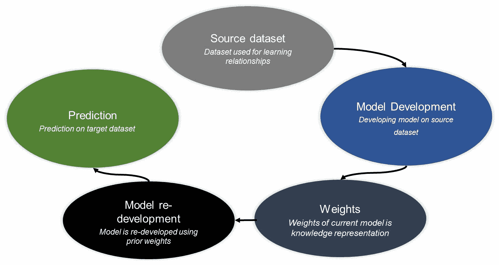
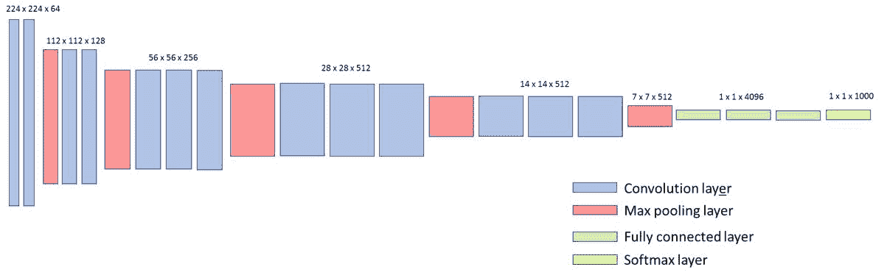
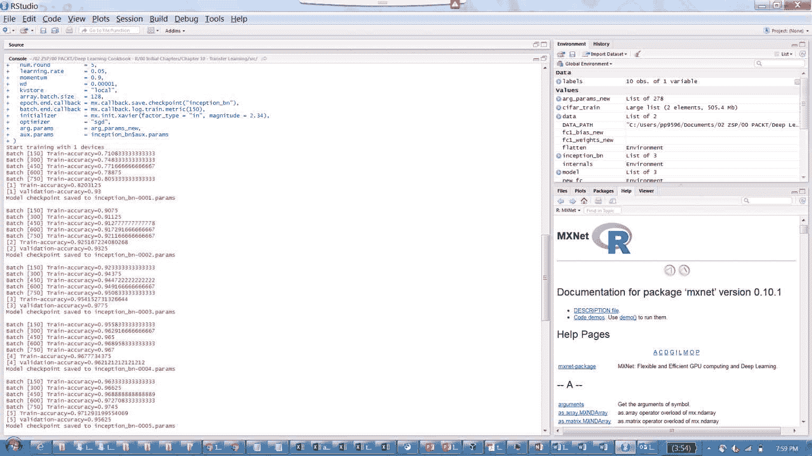
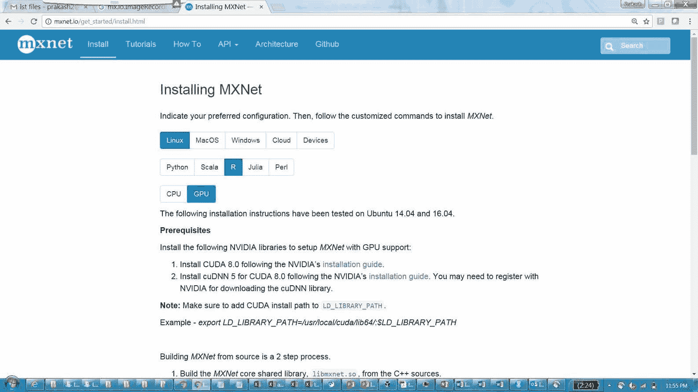
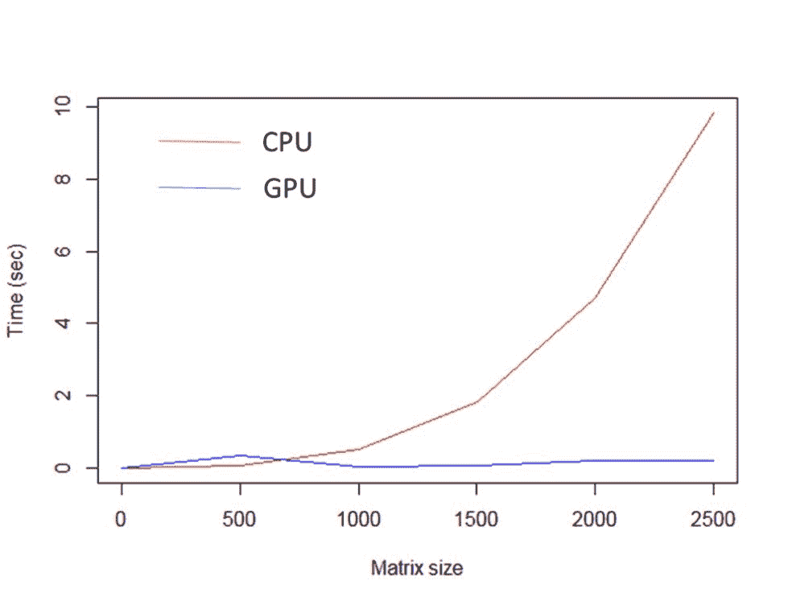

# 第十章：迁移学习

在本章中，我们将讨论迁移学习的概念。以下是将要涵盖的主题：

+   演示如何使用预训练模型

+   设置迁移学习模型

+   构建图像分类模型

+   在 GPU 上训练深度学习模型

+   比较使用 CPU 和 GPU 的性能

# 介绍

近年来，深度学习领域发生了许多发展，提升了算法的有效性和计算效率，涵盖了文本、图像、音频和视频等不同领域。然而，当涉及到在新数据集上进行训练时，机器学习通常会从零开始重建模型，就像在传统数据科学问题解决中所做的一样。当需要训练一个新的大数据集时，这会变得很具挑战性，因为它需要非常高的计算能力和大量时间才能达到预期的模型效果。

迁移学习是一种从现有模型中学习新场景的机制。这种方法对于在大数据集上训练非常有用，不一定来自相似的领域或问题描述。例如，研究人员展示了迁移学习的例子，其中他们在完全不同的问题场景下进行了迁移学习训练，例如使用分类猫和狗的模型来分类物体，如飞机与汽车。

从类比的角度来看，它更多的是将已学到的关系传递到新的架构中，以便微调权重。以下图示展示了迁移学习的应用示例：



迁移学习流程示意图

图示展示了迁移学习的步骤，其中一个预先开发的深度学习模型的权重/架构被重用以预测一个新的问题。迁移学习有助于为深度学习架构提供一个良好的起点。不同领域的多个开源项目正在进行中，促进了迁移学习的应用，例如，ImageNet ([`image-net.org/index`](http://image-net.org/index))是一个用于图像分类的开源项目，许多不同的架构，如 Alexnet、VGG16 和 VGG19，已经在该项目中得到了开发。同样，在文本挖掘领域，Google News 的 Word2Vec 表示法已经通过三十亿个单词训练完成。

有关 word2vec 的详细信息，请参见[`code.google.com/archive/p/word2vec/.`](https://code.google.com/archive/p/word2vec/)

# 演示如何使用预训练模型

当前的配方将涵盖使用预训练模型的设置。我们将使用 TensorFlow 来演示该配方。当前的配方将使用基于 ImageNet 数据集构建的 VGG16 架构。ImageNet 是一个开源图像库，旨在构建图像识别算法。该数据库拥有超过 1000 万张标记图像，且超过 100 万张图像包含了捕获物体的边界框。

使用 ImageNet 数据集开发了许多不同的深度学习架构。一个受欢迎的架构是 VGG 网络，它是由 Zisserman 和 Simonyan（2014）提出的卷积神经网络，并在包含 1,000 个类别的 ImageNet 数据集上进行训练。当前的方案将考虑 VGG 架构的 VGG16 变种，它因其简洁性而著名。该网络使用 224 x 224 RGB 图像作为输入。网络使用了 13 个卷积层，具有不同的宽度 x 高度 x 深度。最大池化层用于减小卷积层输出的体积大小。该网络使用了 5 个最大池化层。卷积层的输出通过 3 个全连接层。全连接层的输出通过 softmax 函数来评估 1,000 类的概率。

VGG16 的详细架构如下图所示：



VGG16 架构

# 准备就绪

本部分介绍了使用 VGG16 预训练模型进行分类所需的步骤。

1.  从 [`download.tensorflow.org/models/vgg_16_2016_08_28.tar.gz`](http://download.tensorflow.org/models/vgg_16_2016_08_28.tar.gz) 下载 VGG16 权重文件。可以使用以下脚本下载文件：

```py
require(RCurl) 
URL <- 'http://download.tensorflow.org/models/vgg_16_2016_08_28.tar.gz' 
download.file(URL,destfile="vgg_16_2016_08_28.tar.gz",method="libcurl") 

```

1.  在 Python 中安装 TensorFlow。

1.  在 R 中安装 R 和 `tensorflow` 包。

1.  从 [`image-net.org/download-imageurls`](http://image-net.org/download-imageurls) 下载示例图像。

# 如何操作...

当前部分提供使用预训练模型的步骤：

1.  在 R 中加载 `tensorflow`：

```py
require(tensorflow) 

```

1.  从 TensorFlow 中导入 `slim` 库：

```py
slimobj = tf$contrib$slim 

```

TensorFlow 中的 `slim` 库用于维护复杂的神经网络模型，涵盖定义、训练和评估等方面。

1.  在 TensorFlow 中重置图：

```py
tf$reset_default_graph() 

```

1.  定义输入图像：

```py
# Resizing the images 
input.img= tf$placeholder(tf$float32, shape(NULL, NULL, NULL, 3)) 
scaled.img = tf$image$resize_images(input.img, shape(224,224))

```

1.  重新定义 VGG16 网络：

```py
# Define VGG16 network 
library(magrittr) 
VGG16.model<-function(slim, input.image){ 
  vgg16.network = slim$conv2d(input.image, 64, shape(3,3), scope='vgg_16/conv1/conv1_1') %>%  
    slim$conv2d(64, shape(3,3), scope='vgg_16/conv1/conv1_2')  %>% 
    slim$max_pool2d( shape(2, 2), scope='vgg_16/pool1')  %>% 

    slim$conv2d(128, shape(3,3), scope='vgg_16/conv2/conv2_1')  %>% 
    slim$conv2d(128, shape(3,3), scope='vgg_16/conv2/conv2_2')  %>% 
    slim$max_pool2d( shape(2, 2), scope='vgg_16/pool2')  %>% 

    slim$conv2d(256, shape(3,3), scope='vgg_16/conv3/conv3_1')  %>% 
    slim$conv2d(256, shape(3,3), scope='vgg_16/conv3/conv3_2')  %>% 
    slim$conv2d(256, shape(3,3), scope='vgg_16/conv3/conv3_3')  %>% 
    slim$max_pool2d(shape(2, 2), scope='vgg_16/pool3')  %>% 

    slim$conv2d(512, shape(3,3), scope='vgg_16/conv4/conv4_1')  %>% 
    slim$conv2d(512, shape(3,3), scope='vgg_16/conv4/conv4_2')  %>% 
    slim$conv2d(512, shape(3,3), scope='vgg_16/conv4/conv4_3')  %>% 
    slim$max_pool2d(shape(2, 2), scope='vgg_16/pool4')  %>% 

    slim$conv2d(512, shape(3,3), scope='vgg_16/conv5/conv5_1')  %>% 
    slim$conv2d(512, shape(3,3), scope='vgg_16/conv5/conv5_2')  %>% 
    slim$conv2d(512, shape(3,3), scope='vgg_16/conv5/conv5_3')  %>% 
    slim$max_pool2d(shape(2, 2), scope='vgg_16/pool5')  %>% 

    slim$conv2d(4096, shape(7, 7), padding='VALID', scope='vgg_16/fc6')  %>% 
    slim$conv2d(4096, shape(1, 1), scope='vgg_16/fc7') %>%  

    slim$conv2d(1000, shape(1, 1), scope='vgg_16/fc8')  %>% 
    tf$squeeze(shape(1, 2), name='vgg_16/fc8/squeezed') 
  return(vgg16.network) 
} 

```

1.  上面的函数定义了用于 VGG16 网络的网络架构。可以使用以下脚本来定义网络：

```py
vgg16.network<-VGG16.model(slim, input.image = scaled.img) 

```

1.  加载 *入门指南* 部分中下载的 VGG16 权重 `vgg_16_2016_08_28.tar.gz`：

```py
# Restore the weights 
restorer = tf$train$Saver() 
sess = tf$Session() 
restorer$restore(sess, 'vgg_16.ckpt')

```

1.  下载示例测试图像。让我们根据以下脚本从 `testImgURL` 位置下载一个示例图像：

```py
# Evaluating using VGG16 network 
testImgURL<-"http://farm4.static.flickr.com/3155/2591264041_273abea408.jpg" 
img.test<-tempfile() 
download.file(testImgURL,img.test, mode="wb") 
read.image <- readJPEG(img.test) 
# Clean-up the temp file 
file.remove(img.test)  

```

上面的脚本从变量 `testImgURL` 中提到的 URL 下载以下图片。以下是下载的图片：


用于评估 imagenet 的示例图像

1.  使用 VGG16 预训练模型确定类别：

```py
## Evaluate  
size = dim(read.image) 
imgs = array(255*read.image, dim = c(1, size[1], size[2], size[3])) 
VGG16_eval = sess$run(vgg16.network, dict(images = imgs)) 
probs = exp(VGG16_eval)/sum(exp(VGG16_eval))  

```

所达到的最大概率为 0.62，属于类别 672，该类别在 VGG16 训练数据集中对应的标签是——山地自行车，全地形自行车，越野车。

# 设置迁移学习模型

当前方案将涵盖使用 CIFAR-10 数据集进行迁移学习。上一方案介绍了如何使用预训练模型。当前方案将展示如何将预训练模型应用于不同的问题陈述。

我们将使用另一个非常好的深度学习包，MXNET，通过另一种架构 Inception 来演示该概念。为了简化计算，我们将问题的复杂度从 10 个类别减少到两个类别：飞机和汽车。这个食谱的重点是使用 Inception-BN 进行迁移学习的数据准备。

# 做好准备

本节为即将到来的迁移学习模型设置部分做准备。

1.  从[`www.cs.toronto.edu/~kriz/cifar.html`](http://www.cs.toronto.edu/~kriz/cifar.html)下载 CIFAR-10 数据集。可以使用第三章中的`download.cifar.data`函数来下载数据集，*卷积神经网络*章节。

1.  安装`imager`包：

```py
install.packages("imager")

```

# 如何操作...

本部分食谱将提供一步步的指南，准备数据集以用于 Inception-BN 预训练模型。

1.  加载依赖包：

```py
# Load packages 
require(imager) 
source("download_cifar_data.R") 
The download_cifar_data consists of function to download and read CIFAR10 dataset. 

```

1.  读取下载的 CIFAR-10 数据集：

```py
# Read Dataset and labels  
DATA_PATH<-paste(SOURCE_PATH, "/Chapter 4/data/cifar-10-batches-bin/", sep="") 
labels <- read.table(paste(DATA_PATH, "batches.meta.txt", sep="")) 
cifar_train <- read.cifar.data(filenames = c("data_batch_1.bin","data_batch_2.bin","data_batch_3.bin","data_batch_4.bin")) 

```

1.  过滤数据集中的飞机和汽车。这是一个可选步骤，用于简化后续的复杂度：

```py
# Filter data for Aeroplane and Automobile with label 1 and 2, respectively 
Classes = c(1, 2)  
images.rgb.train <- cifar_train$images.rgb 
images.lab.train <- cifar_train$images.lab 
ix<-images.lab.train%in%Classes 
images.rgb.train<-images.rgb.train[ix] 
images.lab.train<-images.lab.train[ix] 
rm(cifar_train)   

```

1.  转换为图像。此步骤是必需的，因为 CIFAR-10 数据集是 32 x 32 x 3 的图像，需要将其展平为 1024 x 3 格式：

```py
# Function to transform to image 
transform.Image <- function(index, images.rgb) { 
  # Convert each color layer into a matrix,  
  # combine into an rgb object, and display as a plot 
  img <- images.rgb[[index]] 
  img.r.mat <- as.cimg(matrix(img$r, ncol=32, byrow = FALSE)) 
  img.g.mat <- as.cimg(matrix(img$g, ncol=32, byrow = FALSE)) 
  img.b.mat <- as.cimg(matrix(img$b, ncol=32, byrow = FALSE)) 

  # Bind the three channels into one image 
  img.col.mat <- imappend(list(img.r.mat,img.g.mat,img.b.mat),"c")  
  return(img.col.mat) 
} 

```

1.  下一步是对图像进行零填充：

```py
  # Function to pad image 
  image.padding <- function(x) { 
  img_width <- max(dim(x)[1:2]) 
  img_height <- min(dim(x)[1:2]) 
  pad.img <- pad(x, nPix = img_width - img_height, 
                 axes = ifelse(dim(x)[1] < dim(x)[2], "x", "y")) 
  return(pad.img) 
}

```

1.  将图像保存到指定文件夹：

```py
# Save train images 
MAX_IMAGE<-length(images.rgb.train) 

# Write Aeroplane images to aero folder 
sapply(1:MAX_IMAGE, FUN=function(x, images.rgb.train, images.lab.train){ 
  if(images.lab.train[[x]]==1){ 
    img<-transform.Image(x, images.rgb.train)   
    pad_img <- image.padding(img) 
    res_img <- resize(pad_img, size_x = 224, size_y = 224) 
    imager::save.image(res_img, paste("train/aero/aero", x, ".jpeg", sep=""))     
  } 
}, images.rgb.train=images.rgb.train, images.lab.train=images.lab.train) 

# Write Automobile images to auto folder 
sapply(1:MAX_IMAGE, FUN=function(x, images.rgb.train, images.lab.train){ 
  if(images.lab.train[[x]]==2){ 
    img<-transform.Image(x, images.rgb.train)   
    pad_img <- image.padding(img) 
    res_img <- resize(pad_img, size_x = 224, size_y = 224) 
    imager::save.image(res_img, paste("train/auto/auto", x, ".jpeg", sep=""))     
  } 
}, images.rgb.train=images.rgb.train, images.lab.train=images.lab.train) 

```

前面的脚本将把飞机图像保存到`aero`文件夹，将汽车图像保存到`auto`文件夹。

1.  转换为 MXNet 支持的`.rec`记录格式。此转换需要 Python 中的`im2rec.py` MXNet 模块，因为 R 不支持此转换。不过，一旦在 Python 中安装了 MXNet，可以通过系统命令从 R 调用。数据集的划分可以使用以下文件：

```py
System("python ~/mxnet/tools/im2rec.py --list True --recursive True --train-ratio 0.90 cifar_224/pks.lst cifar_224/trainf/")

```

前面的脚本将生成两个列表文件：`pks.lst_train.lst`和`pks.lst_train.lst`。训练和验证的划分由前面脚本中的`-train-ratio`参数控制。类别的数量基于`trainf`目录中的文件夹数量。在这个场景中，选择了两个类别：汽车和飞机。

1.  转换用于训练和验证的数据集的`*.rec`文件：

```py
# Creating .rec file from training sample list 
System("python ~/mxnet/tools/im2rec.py --num-thread=4 --pass-through=1 /home/prakash/deep\ learning/cifar_224/pks.lst_train.lst /home/prakash/deep\ learning/cifar_224/trainf/")   

# Creating .rec file from validation sample list 
System("python ~/mxnet/tools/im2rec.py --num-thread=4 --pass-through=1 /home/prakash/deep\ learning/cifar_224/pks.lst_val.lst /home/prakash/deep\ learning/cifar_224/trainf/") 

```

前面的脚本将创建`pks.lst_train.rec`和`pks.lst_val.rec`文件，这些文件将在下一个食谱中用于使用预训练模型训练模型。

# 构建图像分类模型

这个食谱的重点是使用迁移学习构建图像分类模型。它将利用前面食谱中准备的数据集，并使用 Inception-BN 架构。Inception-BN 中的 BN 代表**批量归一化**。有关计算机视觉中 Inception 模型的详细信息，可以参考 Szegedy 等人（2015 年）的论文。

# 做好准备

本节内容涵盖了使用 INCEPTION-BN 预训练模型设置分类模型的前提条件。

1.  将图像转换为用于训练和验证的`.rec`文件。

1.  从[`data.dmlc.ml/models/imagenet/inception-bn/.`](http://data.dmlc.ml/models/imagenet/inception-bn/)下载 Inception-BN 架构。

1.  安装 R 和 R 中的`mxnet`包。

# 如何操作...

1.  将`.rec`文件加载为迭代器。以下是将`.rec`数据作为迭代器加载的函数：

```py
# Function to load data as iterators 
data.iterator <- function(data.shape, train.data, val.data, BATCHSIZE = 128) { 

  # Load training data as iterator 
  train <- mx.io.ImageRecordIter( 
    path.imgrec = train.data, 
    batch.size  = BATCHSIZE, 
    data.shape  = data.shape, 
    rand.crop   = TRUE, 
    rand.mirror = TRUE) 

  # Load validation data as iterator 
  val <- mx.io.ImageRecordIter( 
    path.imgrec = val.data, 
    batch.size  = BATCHSIZE, 
    data.shape  = data.shape, 
    rand.crop   = FALSE, 
    rand.mirror = FALSE 
  ) 

  return(list(train = train, val = val)) 
} 

```

在上面的函数中，`mx.io.ImageRecordIter`从`RecordIO`（`.rec`）文件中读取图像批次。

1.  使用`data.iterator`函数加载数据：

```py
# Load dataset 
data  <- data.iterator(data.shape = c(224, 224, 3), 
                      train.data = "pks.lst_train.rec", 
                      val.data  = "pks.lst_val.rec", 
                      BATCHSIZE = 8) 
train <- data$train 
val   <- data$val 

```

1.  从`Inception-BN`文件夹加载 Inception-BN 预训练模型：

```py
# Load Inception-BN model 
inception_bn <- mx.model.load("Inception-BN", iteration = 126) 
symbol <- inception_bn$symbol 
The different layers of the model can be viewed using function symbol$arguments 

```

1.  获取 Inception-BN 模型的层：

```py
# Load model information 
internals <- symbol$get.internals() 
outputs <- internals$outputs 
flatten <- internals$get.output(which(outputs == "flatten_output")) 

```

1.  定义一个新的层来替换`flatten_output`层：

```py
# Define new layer 
new_fc <- mx.symbol.FullyConnected(data = flatten,  
                                   num_hidden = 2,  
                                   name = "fc1")  
new_soft <- mx.symbol.SoftmaxOutput(data = new_fc,  
                                    name = "softmax") 

```

1.  为新定义的层初始化权重。为了重新训练最后一层，可以使用以下脚本进行权重初始化：

```py
# Re-initialize the weights for new layer 
arg_params_new <- mxnet:::mx.model.init.params( 
  symbol = new_soft,  
  input.shape = c(224, 224, 3, 8),  
  output.shape = NULL,  
  initializer = mxnet:::mx.init.uniform(0.2),  
  ctx = mx.cpu(0) 
)$arg.params 
fc1_weights_new <- arg_params_new[["fc1_weight"]] 
fc1_bias_new <- arg_params_new[["fc1_bias"]] 

```

在上述层中，权重是通过在[*-0.2*，*0.2*]区间内使用均匀分布进行赋值的。`ctx`定义了执行操作的设备。

1.  重新训练模型：

```py
# Mode re-train 
model <- mx.model.FeedForward.create( 
  symbol             = new_soft, 
  X                  = train, 
  eval.data          = val, 
  ctx                = mx.cpu(0), 
  eval.metric        = mx.metric.accuracy, 
  num.round          = 5, 
  learning.rate      = 0.05, 
  momentum           = 0.85, 
  wd                 = 0.00001, 
  kvstore            = "local", 
  array.batch.size   = 128, 
  epoch.end.callback = mx.callback.save.checkpoint("inception_bn"), 
  batch.end.callback = mx.callback.log.train.metric(150), 
  initializer        = mx.init.Xavier(factor_type = "in", magnitude = 2.34), 
  optimizer          = "sgd", 
  arg.params         = arg_params_new, 
  aux.params         = inception_bn$aux.params 
)  

```

上述模型设置为在 CPU 上运行五轮，并使用准确度作为评估指标。以下截图显示了所描述模型的执行情况：



从使用 CIFAR-10 数据集训练的 Inception-BN 模型输出：

训练后的模型产生了 0.97 的训练准确度和 0.95 的验证准确度。

# 在 GPU 上训练深度学习模型

**图形处理单元**（**GPU**）是用于使用大量核心进行图像渲染的硬件。Pascal 是 NVIDIA 发布的最新 GPU 微架构。GPU 中数百个核心的存在有助于提高计算效率。本节提供了使用 GPU 运行深度学习模型的配方。

# 准备工作

本节提供了运行 GPU 和 CPU 所需的依赖项：

1.  本实验使用了 GTX 1070 等 GPU 硬件。

1.  安装适用于 GPU 的`mxnet`。要为指定机器安装适用于 GPU 的`mxnet`，请按照`mxnet.io`上的安装说明进行操作。根据截图选择相应的需求，并按照说明进行操作：



获取 MXNet 安装说明的步骤

# 如何操作...

以下是如何在 GPU 上训练深度学习模型：

1.  上节讨论的 Inception-BN 迁移学习配方可以通过更改设备设置使其在已安装 GPU 并配置好的机器上运行，脚本如下所示：

```py
# Mode re-train 
model <- mx.model.FeedForward.create( 
  symbol             = new_soft, 
  X                  = train, 
  eval.data          = val, 
  ctx                = mx.gpu(0), 
  eval.metric        = mx.metric.accuracy, 
  num.round          = 5, 
  learning.rate      = 0.05, 
  momentum           = 0.85, 
  wd                 = 0.00001, 
  kvstore            = "local", 
  array.batch.size   = 128, 
  epoch.end.callback = mx.callback.save.checkpoint("inception_bn"), 
  batch.end.callback = mx.callback.log.train.metric(150), 
  initializer        = mx.init.Xavier(factor_type = "in", magnitude = 2.34), 
  optimizer          = "sgd", 
  arg.params         = arg_params_new, 
  aux.params         = inception_bn$aux.params 
)  

```

在上述模型中，设备设置从`mx.cpu`更改为`mx.gpu`。使用 CPU 进行五次迭代的计算大约需要 2 小时，而同样的迭代使用 GPU 大约需要 15 分钟即可完成。

# 比较使用 CPU 和 GPU 的性能

设备切换时的一个问题是，为什么从 CPU 切换到 GPU 时会观察到如此大的改进。由于深度学习架构涉及大量的矩阵计算，GPU 利用大量并行核心加速这些计算，这些核心通常用于图像渲染。

许多算法已经利用 GPU 的强大计算能力加速执行。以下配方提供了使用`gpuR`包进行矩阵计算的一些基准。`gpuR`包是一个用于 R 中 GPU 计算的通用包。

# 做好准备

本节介绍了设置 GPU 与 CPU 比较所需的要求。

1.  使用已安装的 GPU 硬件，如 GTX 1070。

1.  使用 URL [`developer.nvidia.com/cuda-downloads`](https://developer.nvidia.com/cuda-downloads) 安装 CUDA 工具包。

1.  安装`gpuR`包：

```py
install.packages("gpuR") 

```

1.  测试`gpuR`：

```py
library(gpuR) 
# verify you have valid GPUs 
detectGPUs()  

```

# 如何操作...

我们从加载包开始：

1.  加载包，并将精度设置为`float`（默认情况下，GPU 的精度设置为单精度）：

```py
library("gpuR") 
options(gpuR.default.type = "float") 

```

1.  将矩阵分配给 GPU：

```py
# Assigning a matrix to GPU 
A<-matrix(rnorm(1000), nrow=10) 

vcl1 = vclMatrix(A)

```

上述命令的输出将包含对象的详细信息。以下脚本展示了一个示例：

```py
> vcl1 
An object of class "fvclMatrix" 
Slot "address": 
<pointer: 0x000000001822e180> 

Slot ".context_index": 
[1] 1 

Slot ".platform_index": 
[1] 1 

Slot ".platform": 
[1] "Intel(R) OpenCL" 

Slot ".device_index": 
[1] 1 

Slot ".device": 
[1] "Intel(R) HD Graphics 530" 

```

1.  让我们考虑一下 CPU 与 GPU 的评估。由于大多数深度学习将使用 GPU 进行矩阵计算，性能通过矩阵乘法使用以下脚本进行评估：

```py
# CPU vs GPU performance 
DF <- data.frame() 
evalSeq<-seq(1,2501,500) 
for (dimpower in evalSeq){ 
  print(dimpower) 
  Mat1 = matrix(rnorm(dimpower²), nrow=dimpower) 
  Mat2 = matrix(rnorm(dimpower²), nrow=dimpower) 

  now <- Sys.time() 
  Matfin = Mat1%*%Mat2 
  cpu <- Sys.time()-now 

  now <- Sys.time() 
  vcl1 = vclMatrix(Mat1) 
  vcl2 = vclMatrix(Mat2) 
  vclC = vcl1 %*% vcl2 
  gpu <- Sys.time()-now 

  DF <- rbind(DF,c(nrow(Mat1), cpu, gpu))  
} 
DF<-data.frame(DF) 
colnames(DF) <- c("nrow", "CPU_time", "gpu_time")   

```

上述脚本使用 CPU 和 GPU 进行矩阵乘法计算；时间会记录在不同维度的矩阵中。上面脚本的输出结果如下图所示：



CPU 与 GPU 的比较

图表显示，CPU 所需的计算工作量随着 CPU 的增加呈指数增长。因此，GPU 极大地加速了这一过程。

# 还有更多...

GPU 是机器学习计算中的新领域，许多包已经在 R 中开发，以便在保持熟悉的 R 环境中访问 GPU，例如`gputools`、`gmatrix`和`gpuR`。其他算法也已经开发并实现，通过访问 GPU 来增强其计算能力，例如`RPUSVM`，它使用 GPU 实现 SVM。因此，这个主题需要大量的创造力和一些探索，以便在利用硬件的全部能力时部署算法。

# 另见

要了解更多使用 R 进行并行计算的信息，请阅读 Simon R. Chapple 等人的《Mastering Parallel Programming with R》（2016 年）。
