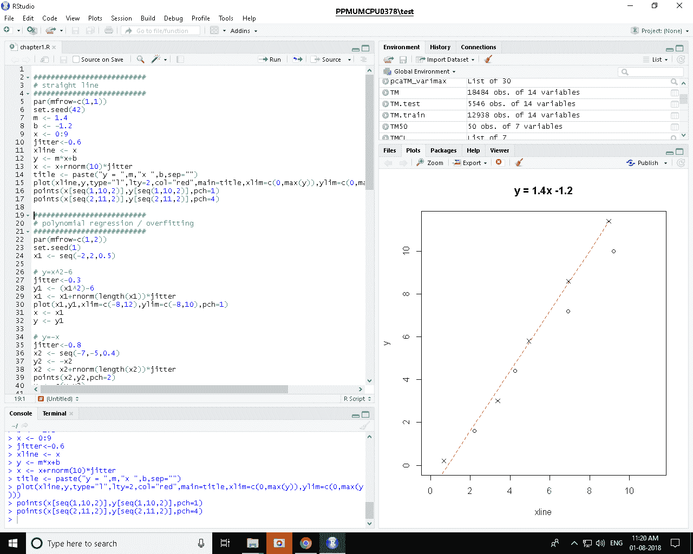

# 第一章：深度学习入门

本章讨论了深度学习，一种强大的多层架构，用于模式识别、信号检测以及分类或预测。尽管深度学习并不新鲜，但它仅在过去十年才获得了极大的关注，这部分归功于计算能力的提升、更加高效的模型训练方法以及不断增长的数据量。在本章中，你将了解什么是深度学习、可用于训练此类模型的 R 包，以及如何为分析设置系统。我们将简要讨论**MXNet**和**Keras**，这两种框架将在后续章节的多个示例中用于实际训练和使用深度学习模型。

在本章中，我们将探讨以下主题：

+   什么是深度学习？

+   深度学习的概念概览

+   设置 R 环境及在 R 中可用的深度学习框架

+   GPU 和可重复性

# 什么是深度学习？

**深度学习**是机器学习的一个子领域，而机器学习又是人工智能的一个子领域。**人工智能**是创造能够执行需要人类智能的任务的机器的艺术。**机器学习**使用算法来学习，而无需明确编程。深度学习是机器学习的一个子集，使用模仿大脑工作方式的人工神经网络。

以下图表展示了它们之间的关系。例如，自动驾驶汽车是人工智能的一个应用。自动驾驶汽车的一个关键部分是识别其他道路使用者，如汽车、行人、骑车人等。这需要机器学习，因为无法明确编程来实现这一点。最终，深度学习可能被选择作为实现这一机器学习任务的方法：


图 1.1：人工智能、机器学习和深度学习之间的关系

人工智能作为一个领域自 20 世纪 40 年代就已经存在；前述图表中的定义来自于 1990 年**库兹韦尔**。它是一个广泛的领域，涵盖了哲学、数学、神经科学和计算机工程等多个不同领域的思想。机器学习是人工智能中的一个子领域，致力于开发和使用能够从原始数据中学习的算法。当机器学习任务需要预测一个结果时，这被称为**监督学习**。当任务是从一组可能的结果中进行预测时，这就是**分类**任务；当任务是预测一个数值时，这就是**回归**任务。一些分类任务的例子包括判断某一信用卡购买是否欺诈，或者某张图片是猫还是狗。回归任务的一个例子是预测客户下个月将花费多少钱。还有其他类型的机器学习，其中学习并不预测值。这被称为**无监督学习**，包括对数据进行聚类（分段）或创建数据的压缩格式。

深度学习是机器学习中的一个子领域。之所以称其为**深度**，是因为它使用多层结构来映射输入和输出之间的关系。**层**是一个神经元集合，负责对其输入进行数学运算。这个内容将在下一部分的*神经网络概念概述*中详细解释。这个深度结构意味着模型足够大，可以处理许多变量，并且足够灵活，可以近似数据中的模式。深度学习还可以作为整体学习算法的一部分生成特征，而不是将特征创建作为一个前提步骤。深度学习在图像识别（包括手写识别、照片或物体分类）、语音识别和自然语言处理领域表现尤为有效。它在过去几年彻底改变了如何使用图像、文本和语音数据进行预测，取代了之前处理这些数据的方式。它还使这些领域向更多人开放，因为它自动化了大量特征生成工作，这些工作原本需要专业技能。

深度学习并不是机器学习中唯一的技术。还有其他类型的机器学习算法；最常见的包括回归、决策树、随机森林和朴素贝叶斯。对于许多应用场景，这些算法中的某些可能是更好的选择。深度学习可能不是最佳选择的一些例子包括当可解释性是必需的要求、数据集较小，或者你在开发模型时资源（时间和/或硬件）有限。重要的是要认识到，尽管行业存在过度炒作，但在行业中大多数机器学习并不使用深度学习。话虽如此，本书涵盖了深度学习算法，因此我们将继续讲解。接下来的章节将更深入地讨论神经网络和深度神经网络。

# 神经网络的概念概览

理解为什么神经网络如此有效可能是困难的。这个介绍将从两个角度来观察它们。如果你了解线性回归的工作原理，第一个角度应该很有帮助。第二个角度则更直观且技术性较少，但同样有效。我鼓励你阅读这两个角度，并花些时间思考这两种概述。

# 神经网络作为线性回归的扩展

最简单、最古老的预测模型之一是 **回归**。它基于另一个值预测一个连续值（即数字）。线性回归函数是：

*y=mx+b*

其中 *y* 是你要预测的值，而 *x* 是你的输入变量。线性回归系数（或参数）为 *m*（直线的斜率）和 *b*（截距）。以下 R 代码创建了一个 *y= 1.4x -2* 的函数，并绘制它：

```py
set.seed(42)
m <- 1.4
b <- -1.2
x <- 0:9
jitter<-0.6
xline <- x
y <- m*x+b
x <- x+rnorm(10)*jitter
title <- paste("y = ",m,"x ",b,sep="")
plot(xline,y,type="l",lty=2,col="red",main=title,xlim=c(0,max(y)),ylim=c(0,max(y)))
points(x[seq(1,10,2)],y[seq(1,10,2)],pch=1)
points(x[seq(2,11,2)],y[seq(2,11,2)],pch=4)
```

*o* 或 *x* 点是给定 *x* 轴值时需要预测的值，直线是实际的真实值。添加了一些随机噪声，因此点并不完全在直线上。此代码生成以下输出：


图 1.2：回归线拟合数据的示例（即从 *x* 预测 *y*）

在回归任务中，你会得到一些 *x* 和对应的 *y* 值，但并未给出将 *x* 映射到 *y* 的底层函数。监督式机器学习任务的目的是，在给定一些之前的 *x* 和 *y* 样本的情况下，我们能否预测出仅知道 *x* 而不知道 *y* 的新数据的 *y* 值。一个例子可能是根据房屋卧室数量预测房价。到目前为止，我们只考虑了一个输入变量 *x*，但我们可以轻松扩展这个例子来处理多个输入变量。对于房屋的例子，我们会使用卧室数量和房屋面积来预测房价。我们的代码可以通过将输入 *x* 从向量（一维数组）更改为矩阵（二阶数组）来适应这一点。

如果我们考虑用我们的模型来预测房价，线性回归有一个严重的限制：它只能估计线性函数。如果 *x* 到 *y* 的映射不是线性的，它就无法很好地预测 *y*。这个函数总是为一个变量生成一条直线，如果使用多个 *x* 预测变量，它会生成一个超平面。这意味着线性回归模型在数据的低端和高端可能不准确。

让模型拟合非线性关系的一个简单方法是向函数中添加多项式项。这就是所谓的 **多项式回归**。例如，通过添加一个四次的多项式，我们的函数变为：

*y = m[1]x⁴ + m[2]x³ + m[3]x² + m[4]x + b*

通过添加这些额外的项，直线（或决策边界）不再是线性的。以下代码演示了这一点——我们创建了一些示例数据，并创建了三个回归模型来拟合这些数据。第一个模型没有多项式项，模型是一个直线，拟合效果很差。第二个模型（蓝色圆圈）包含多项式，最高到 3 次方，即 *X*、*X²* 和 *X³*。最后一个模型包含最高 12 次方的多项式，即 *X*、*X²*、.....、*X¹²*。第一个模型（直线）欠拟合数据，而最后一个模型则过拟合数据。过拟合是指模型过于复杂，最终记住了数据。这意味着该模型的泛化能力差，在未见过的数据上表现不好。以下代码生成数据并创建了三个随着多项式阶数增加的模型：

```py
par(mfrow=c(1,2))
set.seed(1)
x1 <- seq(-2,2,0.5)

# y=x²-6
jitter<-0.3
y1 <- (x1²)-6
x1 <- x1+rnorm(length(x1))*jitter
plot(x1,y1,xlim=c(-8,12),ylim=c(-8,10),pch=1)
x <- x1
y <- y1

# y=-x
jitter<-0.8
x2 <- seq(-7,-5,0.4)
y2 <- -x2
x2 <- x2+rnorm(length(x2))*jitter
points(x2,y2,pch=2)
x <- c(x,x2)
y <- c(y,y2)

# y=0.4 *rnorm(length(x3))*jitter
jitter<-1.2
x3 <- seq(5,9,0.5)
y3 <- 0.4 *rnorm(length(x3))*jitter
points(x3,y3,pch=3)
x <- c(x,x3)
y <- c(y,y3)

df <- data.frame(cbind(x,y))
plot(x,y,xlim=c(-8,12),ylim=c(-8,10),pch=4)

model1 <- lm(y~.,data=df)
abline(coef(model1),lty=2,col="red")

max_degree<-3
for (i in 2:max_degree)
{
 col<-paste("x",i,sep="")
 df[,col] <- df$x^i
}
model2 <- lm(y~.,data=df)
xplot <- seq(-8,12,0.1)
yplot <- (xplot⁰)*model2$coefficients[1]
for (i in 1:max_degree)
 yplot <- yplot +(xplot^i)*model2$coefficients[i+1]
points(xplot,yplot,col="blue", cex=0.5)

max_degree<-12
for (i in 2:max_degree)
{
 col<-paste("x",i,sep="")
 df[,col] <- df$x^i
}
model3 <- lm(y~.,data=df)
xplot <- seq(-8,12,0.1)
yplot <- (xplot⁰)*model3$coefficients[1]
for (i in 1:max_degree)
 yplot <- yplot +(xplot^i)*model3$coefficients[i+1]
points(xplot,yplot,col="green", cex=0.5,pch=2)

MSE1 <- c(crossprod(model1$residuals)) / length(model1$residuals)
MSE2 <- c(crossprod(model2$residuals)) / length(model2$residuals)
MSE3 <- c(crossprod(model3$residuals)) / length(model3$residuals)
print(sprintf(" Model 1 MSE = %1.2f",MSE1))
[1] " Model 1 MSE = 14.17"
print(sprintf(" Model 2 MSE = %1.2f",MSE2))
[1] " Model 2 MSE = 3.63"
print(sprintf(" Model 3 MSE = %1.2f",MSE3))
[1] " Model 3 MSE = 0.07"
```

如果我们要选择一个模型使用，应该选择中间的模型，即使第三个模型的 **MSE**（**均方误差**）更低。在下面的截图中；最佳模型是左上角的弯曲线：


图 1.3：多项式回归

如果我们查看这三个模型，并观察它们如何处理极端的左右点，我们会明白为什么过拟合可能导致在未见过的数据上的不良结果。在图的右侧，最后一组点（加号）具有局部线性关系。然而，12 次方的多项式回归线（绿色三角形）过度强调最后一个点，这是额外的噪声，导致曲线急剧下降。这会导致模型在 *x* 增加时对 *y* 预测极端的负值，而如果我们查看数据，这是不合理的。过拟合是一个重要的问题，我们将在后续章节中更详细地讨论。

通过添加平方、立方和更多的多项式项，模型能够拟合比仅使用线性函数在输入数据上更复杂的数据。神经网络使用类似的概念，区别在于，它们不是使用输入变量的多项式项，而是将多个回归函数通过非线性项链接在一起。

以下是一个神经网络架构的示例。圆圈代表节点，线条是节点之间的连接。如果两个节点之间有连接，左侧节点的输出就是下一个节点的输入。一个节点的输出值是该节点输入值和权重的矩阵运算结果：


图 1.4：一个神经网络示例

在一个节点的输出值被传递给下一个节点作为输入值之前，会对这些值应用一个函数，将整体函数转换为非线性函数。这些函数被称为**激活函数**，它们的作用与多项式项相同。

通过将多个小函数组合在一起来创建机器学习模型，这种思路在机器学习中非常常见。它被广泛应用于随机森林中，在那里，多个独立的决策树*投票*决定结果。它也被应用于提升算法中，其中一个函数中的错误分类实例在下一个函数中被赋予更多的权重。

通过包含多个层的节点，神经网络模型可以逼近几乎任何函数。虽然这确实使得训练模型变得更加困难，但我们会简要解释如何训练神经网络。每个节点最初会被分配一组随机权重。在第一次传递时，这些权重会用于计算并将值从输入层传递（或传播）到隐藏层，最终到达输出层。这被称为**前向传播**。由于权重是随机设置的，输出层的最终（预测）值与实际值相比将不准确，因此我们需要一种方法来计算预测值与实际值之间的差异。这是通过使用**成本函数**来计算的，成本函数提供了模型在训练过程中的准确度衡量标准。然后，我们需要调整从输出层到各层节点的权重，使其更接近目标值。这是通过**反向传播**实现的；我们从右到左移动，稍微更新每一层节点的权重，使其逐步接近实际值。前向传播和反向传播的循环会持续进行，直到损失函数的误差值不再减小；这可能需要几百次甚至几千次的迭代，或称为“周期”。

为了正确地更新节点权重，我们需要知道这个变化会让我们更接近目标，目标是最小化成本函数的结果。我们之所以能够做到这一点，是因为一个巧妙的技巧——我们使用具有导数函数的激活函数。

如果你对微积分的知识有限，刚开始理解导数可能会有些困难。但简单来说，一个函数可能有一个导数公式，告诉我们如何改变一个函数的 *输入*，从而使函数的 *输出* 发生正向或负向的变化。这个导数/公式使得算法能够最小化代价函数，代价函数是对误差的衡量。用更专业的术语来说，函数的导数衡量了随着输入变化，函数变化的速率。如果我们知道了一个函数在输入变化时的变化速率，更重要的是知道它朝哪个方向变化，那么我们就能利用这些信息逐步逼近最小化该函数的目标。你可能见过的一个示例是以下图示：


图 1.5：一个函数（曲线）及其在某点的导数

在这个图示中，曲线是我们希望在 *y* 上最小化的数学函数，也就是说，我们想要到达最低点（由箭头标示）。我们当前位于红色圆圈中的点，且该点的导数是切线的斜率。导数函数表示了我们需要朝哪个方向移动才能到达最低点。随着我们接近目标（箭头所在的点），导数值会发生变化，因此我们不能一步到位。因此，算法会以小步伐前进，每走一步都重新计算导数，但如果我们选择步伐太小，算法收敛的时间会非常长（即到达最小值的时间）。如果步伐太大，则有可能会错过最小值。你选择的步长大小被称为 **学习率**，它实际上决定了算法训练所需的时间。

这可能看起来有些抽象，所以用一个类比可能会更清楚一些。这个类比可能有些过于简化，但它解释了导数、学习率和成本函数。假设一个简单的驾驶汽车模型，车速必须设置为适合条件和限速的值。你当前的速度和目标速度之间的差异就是误差率，这是通过成本函数计算的（在这种情况下只是简单的减法）。为了改变车速，你可以踩油门加速，或者踩刹车减速。加速度/减速度（即速度的变化率）就是速度的导数。施加到踏板上的力量决定了加速/减速发生的快慢，这个力量类似于机器学习算法中的学习率。它控制了达到目标值所需的时间。如果只对踏板施加小的变化，你最终会达到目标速度，但会花费更长的时间。然而，你通常不希望对踏板施加最大力量，因为这样做可能会很危险（如果猛踩刹车）或浪费燃料（如果加速过猛）。存在一个最佳的平衡点，在这个点上，你可以安全且迅速地达到目标速度。

# 神经网络作为记忆单元网络

另一种考虑神经网络的方式是将其与人类思维进行比较。顾名思义，神经网络的灵感来自大脑中的神经过程和神经元。神经网络包含一系列互相连接的神经元或节点，用于处理输入。神经元具有从先前观察（数据）中学习到的权重。神经元的输出是其输入和权重的函数。最终神经元的激活即为预测结果。

我们将考虑一个假设的案例，其中大脑的一个小部分负责匹配基本形状，例如方形和圆形。在这种情况下，一些神经元在基本层次上对水平线发火，另一组神经元对垂直线发火，另一组神经元则对弯曲的线段发火。这些神经元将输入信息传递到更高层次的处理过程，从而识别更复杂的物体，例如，当水平和垂直神经元同时被激活时，识别为一个方形。

在下图中，输入数据以方形表示。这些可以是图像中的像素。下一层的隐藏神经元由识别基本特征的神经元组成，例如水平线、垂直线或曲线。最后，输出可能是一个通过两个隐藏神经元同时激活而被激活的神经元：


图 1.6：神经网络作为一种记忆单元网络

在这个例子中，隐藏层中的第一个节点擅长匹配水平线，而第二个节点则擅长匹配垂直线。这些节点*记住*了这些物体是什么。如果这些节点结合在一起，可以检测到更复杂的物体。例如，如果隐藏层识别出水平线和垂直线，那么这个物体更可能是一个正方形而不是圆形。这与卷积神经网络的工作原理类似，我们将在第五章中讨论，*使用卷积神经网络进行图像分类*。

我们在这里对神经网络的理论进行了非常浅显的介绍，因为我们不希望在第一章就让你感到不知所措！在接下来的章节中，我们将更深入地讨论一些这些问题，但同时，如果你希望更深入理解神经网络背后的理论，以下资源值得推荐：

+   *Goodfellow 等人*（2016 年）第六章

+   *Hastie, T.*, *Tibshirani, R.*, 和 *Friedman, J.*（2009 年）第十一章，免费提供于[`web.stanford.edu/~hastie/Papers/ESLII.pdf`](https://web.stanford.edu/~hastie/Papers/ESLII.pdf)

+   *Murphy, K. P.*（2012 年）第十六章

接下来，我们将简要介绍深度神经网络。

# 深度神经网络

**深度神经网络**（**DNN**）是一种具有多个隐藏层的神经网络。仅仅增加少量层的神经网络中的节点数量（即浅层神经网络）并不能获得好的结果。DNN 能够在参数较少的情况下更准确地拟合数据，因为更多的层（每层有更少的神经元）提供了更高效和更准确的表示。使用多个隐藏层使得从简单元素到更复杂元素的构建更加精细。在前面的例子中，我们考虑了一个可以识别基本形状的神经网络，例如圆形或正方形。在深度神经网络中，许多圆形和正方形可以组合形成其他更复杂的形状。浅层神经网络无法从基本元素构建出更复杂的形状。DNN 的缺点是这些模型更难训练，并且容易出现过拟合。

如果我们考虑从图像数据中识别手写文本，那么原始数据就是来自图像的像素值。第一层捕捉简单的形状，如直线和曲线。下一层利用这些简单形状识别更高层次的抽象，例如角落和圆形。第二层不必直接从像素中学习，因为像素是嘈杂和复杂的。相比之下，浅层架构可能需要更多的参数，因为每个隐藏神经元都必须能够直接从图像的像素到达目标值。而且它还无法结合特征，所以例如，如果图像数据的位置不同（例如，没有居中），它将无法识别文本。

训练深度神经网络的挑战之一是如何高效地学习权重。模型非常复杂，参数数量庞大。深度学习领域的一个重大进展发生在 2006 年，当时研究表明**深度置信网络**（**DBNs**）可以逐层训练（见 *Hinton,* G. E., *Osindero,* S., 和 *Teh, Y. W.* (2006)）。DBN 是一种具有多个隐藏层的深度神经网络，层与层之间存在连接（但同一层内的神经元之间没有连接）（即，第一层的一个神经元可以与第二层的神经元连接，但不能与第一层的另一个神经元连接）。没有层内连接的限制使得可以使用更快速的训练算法，例如**对比散度算法**。本质上，DBN 可以逐层训练；首先训练第一隐藏层，并用其将原始数据转化为隐藏神经元，随后将这些隐藏神经元作为下一隐藏层的新输入，直到所有层都被训练完毕。

认识到深度置信网络（DBNs）可以逐层训练的好处，不仅仅局限于 DBNs。DBNs 有时被用作深度神经网络的预训练阶段。这使得可以使用相对快速的、贪婪的逐层训练方法来提供较好的初始估计，然后使用其他效率较低的训练算法（如反向传播）在深度神经网络中进行优化。

到目前为止，我们主要集中在前馈神经网络上，其中一层和神经元的结果会传递到下一层。在结束这一节之前，值得提到两种在深度神经网络中越来越流行的特定类型。第一种是**递归神经网络**（**RNN**），在这种网络中，神经元会互相发送反馈信号。这些反馈循环使得 RNNs 能够很好地处理序列。RNN 的一个应用实例是自动生成吸引点击的标题，比如*前往洛杉矶的十大理由：第六条*会让你震惊！*或者*一招让你知道大牌发廊不想让你知道的秘密*。RNN 在这类任务中表现优异，因为它们可以从一个较大的初始词汇池（甚至只是流行的搜索词或名字）中获取种子，然后预测/生成下一个词。这个过程可以重复几次，直到生成一个短语，即吸引点击的标题。我们将在第七章，*使用深度学习进行自然语言处理*中看到 RNN 的例子。

第二种类型是**卷积神经网络**（**CNN**）。CNNs 最常用于图像识别。CNN 的工作原理是让每个神经元响应图像的重叠子区域。CNN 的优势在于，它们需要较少的预处理，且通过权重共享（例如，跨图像的子区域）仍然不需要太多参数。这对图像特别有价值，因为图像通常不一致。例如，想象十个不同的人拍摄同一张桌子的照片。有些可能离得更近或更远，或者处于导致基本相同的图像却有不同高度、宽度和焦点对象周围捕获图像数量的位置。我们将在第五章，*使用卷积神经网络进行图像分类*中深入探讨 CNN。

本描述仅提供了深度神经网络的简要概述，以及它们的一些应用场景。深度学习的奠基性参考文献是*Goodfellow 等人*（2016）。

# 一些关于深度学习的常见迷思

关于深度学习，有许多误解、半真半假的说法和误导性观点。以下是一些关于深度学习的常见误解：

+   人工智能意味着深度学习，并取代所有其他技术

+   深度学习需要博士级别的数学理解

+   深度学习难以训练，几乎是一种艺术形式

+   深度学习需要大量数据

+   深度学习的可解释性差

+   深度学习需要 GPU

接下来的段落将逐一讨论这些说法。

深度学习不是人工智能，也并不取代所有其他机器学习算法。它只是机器学习中一类算法。尽管有炒作，深度学习可能只占当前生产环境中机器学习项目的不到 1%。当你在浏览网络时，遇到的大多数推荐引擎和在线广告并不是由深度学习驱动的。许多公司内部用来管理其订阅者的模型，例如*流失分析*，也不是深度学习模型。用于决定谁能获得信用的信用机构模型也并不使用深度学习。

深度学习并不要求对数学有深入理解，除非你有兴趣研究新的深度学习算法和专门的架构。大多数从业者使用现有的深度学习技术处理他们的数据，采用现有架构并根据自己的工作需求进行修改。这并不需要深厚的数学基础，深度学习中使用的数学知识在世界各地的高中阶段就已经教授。事实上，我们在第三章《深度学习基础》中展示了这一点，在不到 70 行代码的情况下，我们从零开始构建了一个完整的神经网络！

训练深度学习模型是困难的，但它并不是一种艺术形式。它确实需要练习，但相同的问题会一遍又一遍地出现。更好的是，通常会有针对这些问题的解决方法，例如，如果模型过拟合，可以添加正则化；如果模型训练不佳，可以构建更复杂的模型和/或使用*数据增强*。我们将在第六章《调优与优化模型》中深入探讨这一点。

深度学习需要大量数据这一说法是有一定道理的。然而，你仍然可以通过使用预训练网络或从现有数据中创建更多训练数据（数据增强）来将深度学习应用于问题。我们将在后续的第六章《调优与优化模型》和第十一章《深度学习的下一个层次》中探讨这些内容。

深度学习模型难以解释。我们的意思是能够解释模型是如何做出决策的。这是许多机器学习算法中的问题，不仅仅是深度学习。在机器学习中，通常准确性和可解释性之间存在反比关系——模型需要越准确，它的可解释性就越差。对于某些任务，例如在线广告，可解释性并不重要，而且错误的成本也很小，所以通常选择最强大的算法。而在某些情况下，例如信用评分，法律可能要求可解释性；人们可能会要求解释为什么他们被拒绝了信用。在其他情况下，如医学诊断，可解释性可能对医生理解模型为何认为某人患有疾病至关重要。

如果可解释性很重要，可以对机器学习模型应用一些方法，以便了解它们为何对某个实例预测了这个结果。某些方法通过扰动数据（即，对数据进行轻微的修改）来工作，试图找出哪些变量在模型做出决策时最具影响力。一个这样的算法叫做**LIME**（**局部可解释模型无关解释**）。(*Ribeiro, Marco Tulio, Sameer Singh, 和 Carlos Guestrin. 为什么我应该相信你？：解释任何分类器的预测。第 22 届 ACM SIGKDD 国际知识发现与数据挖掘会议论文集。ACM, 2016.*) 这个算法已在包括 R 在内的多种语言中实现；有一个叫做`lime`的包。我们将在第六章，*调优与优化模型*中使用这个包。

最后，虽然深度学习模型可以在 CPU 上运行，但实际上，任何实际工作都需要配备 GPU 的工作站。这并不意味着你需要购买一个 GPU，因为你可以使用云计算来训练模型。在第十章，*在云中运行深度学习模型*，我们将讨论使用 AWS、Azure 和 Google Cloud 来训练深度学习模型。

# 设置你的 R 环境

在开始你的深度学习之旅之前，第一步是安装 R，R 可在 [`cran.r-project.org/`](https://cran.r-project.org/) 下载。当你下载并使用 R 时，默认只安装了一些核心包，但可以通过选择菜单选项或一行代码来添加新包。我们不会详细讨论如何安装 R 或如何添加包，因为我们假设大多数读者已经熟练掌握这些技能。一个好的**集成开发环境**（**IDE**）对于使用 R 至关重要。到目前为止，最受欢迎的 IDE，也是我推荐的，是 RStudio，可以从 [`www.rstudio.com/`](https://www.rstudio.com/) 下载。另一个选择是 **Emacs**。Emacs 和 RStudio 的一个优点是它们都可以在所有主要平台（Windows、macOS 和 Linux）上使用，因此即使你更换电脑，也能保持一致的 IDE 体验。以下是 RStudio IDE 的截图：



图 1.7 RStudio IDE

使用 RStudio 相比于 Windows 上的 R 图形用户界面（GUI）有了显著的提升。在 RStudio 中有多个面板，可以从不同的角度查看你的工作。左上方的面板显示代码，左下方的面板显示控制台（运行代码的结果）。右上方的面板显示变量列表及其当前值，右下方的面板显示代码生成的图表。这些面板还包含更多的标签页，可以进一步探索不同的视角。

除了 IDE，RStudio（公司）还开发或大力支持了 R 环境中的其他工具和包。我们将使用其中一些工具，包括 R Markdown 和 R Shiny 应用程序。R Markdown 类似于 Jupyter 或 IPython 笔记本；它允许你将代码、输出（例如图表）和文档结合在一个脚本中。R Markdown 被用来创建本书中的部分章节，其中代码和描述性文本交织在一起。R Markdown 是一个非常好的工具，可以确保你的数据科学实验得到正确的文档记录。通过将文档嵌入到分析中，它们更有可能保持同步。R Markdown 可以输出为 HTML、Word 或 PDF。以下是一个 R Markdown 脚本的示例，左侧是代码，右侧是输出：


图 1.8：R Markdown 示例；左侧是 R 代码和文本信息的混合，右侧是从源脚本生成的 HTML 输出。

我们还将使用 R Shiny 创建基于 R 的网页应用程序。这是一种创建交互式应用程序以展示关键功能的极佳方法。以下截图是一个 R Shiny 网页应用程序的示例，我们将在第五章中看到，*卷积神经网络的图像分类*：


图 1.9：一个 R Shiny 网页应用程序的示例

安装 R 后，你可以添加适用于基本神经网络的包。`nnet`包就是其中之一，它可以拟合具有一个隐藏层的前馈神经网络，例如*图*1.6 所示的网络。关于`nnet`包的更多细节，请参见*Venables, W.* *N.* 和 *Ripley, B.* D.（2002）。`neuralnet`包可以拟合具有多个隐藏层的神经网络，并使用反向传播进行训练。它还允许自定义误差和神经元激活函数。我们还将使用`RSNNS`包，这是**斯图加特神经网络模拟器**（**SNNS**）的 R 包装器。SNNS 最初是用 C 语言编写的，后来移植到 C++。`RSNNS`包使许多 SNNS 的模型组件得以使用，从而可以训练多种类型的模型。有关`RSNNS`包的更多详细信息，请参见*Bergmeir,* C. 和 *Benitez,* *J.* *M.*（2012）。我们将在第二章 *训练预测模型*中看到如何使用这些模型的示例。

`deepnet`包提供了多种深度学习工具，特别是它可以训练 RBM，并将其用作 DBN 的一部分，生成初始值以训练深度神经网络。`deepnet`包还允许使用不同的激活函数，并支持使用 dropout 进行正则化。

# R 的深度学习框架

有许多 R 包可用于神经网络，但深度学习的选择较少。当本书的第一版发布时，它使用了 h2o 中的深度学习功能（[`www.h2o.ai/`](https://www.h2o.ai/)）。这是一个由 Java 编写的优秀通用机器学习框架，且有一个 API 可以从 R 中使用。我推荐你去看一下，特别是当你处理大型数据集时。然而，大多数深度学习从业者更倾向于使用其他深度学习库，如 TensorFlow、CNTK 和 MXNet，而这些库在本书第一版编写时并未在 R 中得到支持。如今，R 中已经有了很多支持的深度学习库——MXNet 和 Keras。Keras 实际上是其他深度学习库的前端抽象，并可以在后台使用 TensorFlow。本书中，我们将使用 MXNet、Keras 和 TensorFlow。

# MXNet

MXNet 是由 Amazon 开发的深度学习库，支持在 CPU 和 GPU 上运行。本章中，只在 CPU 上运行即可。

Apache MXNet 是一个灵活且可扩展的深度学习框架，支持**卷积神经网络**（**CNNs**）和**长短期记忆网络**（**LSTMs**）。它可以在多个处理器/机器上分布式运行，并在多个 GPU/CPU 上几乎实现线性扩展。它可以轻松安装到 R 中，并支持 R 的广泛深度学习功能。它是编写我们第一个深度学习图像分类模型的绝佳选择。

MXNet 起源于 *卡内基梅隆大学*，并且得到了 Amazon 的大力支持；他们在 2016 年将其选为默认的深度学习库。2017 年，MXNet 被接受为 *Apache Incubator* 项目，确保其保持开源软件。它有一个类似于 Keras 的更高层次编程模型，但报告的性能更好。随着增加更多 GPU，MXNet 具有很好的可扩展性。

要为 Windows 安装 MXNet 包，请在 R 会话中运行以下代码：

```py
cran <- getOption("repos")
cran["dmlc"] <- "https://apache-mxnet.s3-accelerate.dualstack.amazonaws.com/R/CRAN"
options(repos = cran)
install.packages("mxnet")
```

这将安装 CPU 版本；如果需要 GPU 版本，你需要将第二行更改为：

```py
cran["dmlc"] <- "https://apache-mxnet.s3-accelerate.dualstack.amazonaws.com/R/CRAN/GPU/cu92"
```

你必须根据你机器上安装的 CUDA 版本将 `cu92` 更改为 `cu80`、`cu90` 或 `cu91`。对于其他操作系统（以及万一此方法不工作，因为深度学习领域变化很快），你可以参考 [`mxnet.incubator.apache.org/install/index.html`](https://mxnet.incubator.apache.org/install/index.html) 获取进一步的安装说明。

# Keras

**Keras** 是一个由 Google 的 François Chollet 创建的高层次开源深度学习框架，强调迭代和快速开发；它通常被认为是学习深度学习的最佳选择之一。Keras 可以选择后端低层次的框架：TensorFlow、Theano 或 CNTK，但它最常与 TensorFlow 一起使用。Keras 模型几乎可以部署到任何环境中，例如，Web 服务器、iOS、Android、浏览器或 Raspberry Pi。

要了解更多关于 Keras 的信息，请访问 [`keras.io/`](https://keras.io/)。要了解如何在 R 中使用 Keras，请访问 [`keras.rstudio.com`](https://keras.rstudio.com)；该链接还提供了更多关于 R 和 Keras 的示例，并且有一张方便的 Keras 备忘单，详细介绍了 R Keras 包的所有功能。要为 R 安装 `keras` 包，请运行以下代码：

```py
devtools::install_github("rstudio/keras")
library(keras)
install_keras()
```

这将安装基于 CPU 的 Keras 和 TensorFlow 包。如果你的机器有合适的 GPU，可以参考 `install_keras()` 的文档，了解如何安装它。

# 我需要 GPU 吗（它到底是什么）？

深度学习指数级增长的两个最大原因可能是：

+   能够累积、存储和处理各种类型的大型数据集

+   使用 GPU 训练深度学习模型的能力

那么，GPU 到底是什么？它们为什么对深度学习如此重要？可能最好的起点是实际看看 CPU，并分析为什么它不适合训练深度学习模型。现代 PC 中的 CPU 是人类设计与工程的巅峰之一。即使是手机中的芯片，现在也比第一代航天飞机的整个计算机系统还要强大。然而，由于 CPU 是为处理所有任务而设计的，它们可能不是处理某些特殊任务的最佳选择。一个这样的任务就是高端图形处理。

如果我们回到上世纪 90 年代中期，大多数游戏都是 2D 的，例如平台游戏，在这些游戏中，角色要在各种平台之间跳跃和/或避开障碍物。今天，几乎所有的计算机游戏都利用了 3D 空间。现代主机和个人电脑都有协处理器，负责将 3D 空间建模到 2D 屏幕上。这些协处理器被称为**GPU**。

GPU 实际上比 CPU 简单得多。它们被设计为只做一件事：大规模并行矩阵运算。CPU 和 GPU 都有*核心*，实际计算发生在这些核心中。一台配有 Intel i7 CPU 的 PC 有四个物理核心和通过*超线程*使用的八个虚拟核心。NVIDIA TITAN Xp GPU 卡有 3840 个 CUDA®核心。这些核心不是直接可比的；CPU 中的核心比 GPU 中的核心更强大。但是，如果工作负载需要大量可以独立完成的矩阵操作，具有许多简单核心的芯片会快得多。

在深度学习甚至成为一个概念之前，神经网络研究人员意识到，进行高端图形和训练神经网络都涉及到工作负载：大量可以并行进行的矩阵乘法。他们意识到，在 GPU 上训练模型而不是 CPU 将允许他们创建更复杂的模型。

如今，所有深度学习框架都在 GPU 和 CPU 上运行。事实上，如果你想要从头开始训练模型和/或有大量数据，你几乎肯定需要一块 GPU。GPU 必须是 NVIDIA GPU，你还需要安装 CUDA® Toolkit、NVIDIA 驱动程序和 cuDNN。这些允许你与 GPU 进行接口交互，*劫持*它的使用，从一个图形卡转变为数学协处理器。安装这些并不总是容易，你必须确保你使用的 CUDA、cuDNN 版本和深度学习库是兼容的。有些人建议你需要使用 Unix 而不是 Windows，但是 Windows 上的支持已经大大改善。这本书的代码是在 Windows 工作站上开发的。忘记在 macOS 上使用，因为它们不支持 NVIDIA 卡。

这是坏消息。好消息是，即使没有合适的 GPU，你也可以学会关于深度学习的一切。本书早期章节的例子在现代 PC 上运行得很好。当我们需要扩展时，本书将解释如何利用云资源，如 AWS 和 Google Cloud，来训练大型深度学习模型。

# 设置可复现的结果

数据科学软件正在快速发展和变化。虽然这对于进步是令人兴奋的，但也可能使得重现他人的结果变得具有挑战性。即使是您自己的代码，在几个月后回过头来看，也可能无法正常工作。这是当今科学研究中的一个重大问题，涉及所有领域，不仅仅是人工智能和机器学习。如果您从事科研或学术工作，并且想要在科学期刊上发布您的研究成果，那么这是您需要关注的问题。本书的第一版部分解决了这个问题，使用了 Revolution Analytics 提供的 R checkpoint 包。该包记录了使用过的软件版本，并确保可以获取其快照。

对于第二版，我们将不再使用此包，原因有多个：

+   大多数读者可能并不会发布自己的作品，而是更关注其他问题（如最大化准确性、可解释性等）。

+   深度学习需要大规模的数据集。当您拥有大量数据时，意味着虽然每次结果可能不完全相同，但差距非常小（仅为百分比的几分之一）。

+   在生产系统中，重现性不仅仅是软件的问题。您还必须考虑数据管道和随机种子生成。

+   为了确保可重现性，所使用的库必须保持冻结状态。深度学习 API 的新版不断发布，并可能包含改进。如果我们仅限于使用旧版本，我们可能会得到较差的结果。

如果您有兴趣了解更多关于`checkpoint`包的信息，可以阅读该包的在线手册：[`cran.r-project.org/web/packages/checkpoint/vignettes/checkpoint.html`](https://cran.r-project.org/web/packages/checkpoint/vignettes/checkpoint.html)。

本书是使用 Windows 10 Professional x64 版的 R 3.5 编写的，这是本书编写时 R 的最新版本。代码是在搭载 Intel i5 处理器和 32 GB 内存的计算机上运行的；它也应能在搭载 Intel i3 处理器和 8 GB 内存的计算机上运行。

您可以从您的帐户中下载本书的示例代码文件：[`www.packtpub.com/`](http://www.packtpub.com/)。如果您在其他地方购买了本书，可以访问[`www.packtpub.com/support`](http://www.packtpub.com/support)并注册，将文件直接通过电子邮件发送给您。

您可以按照以下步骤下载代码文件：

1.  使用您的电子邮件地址和密码登录或注册我们的网站。

1.  将鼠标指针悬停在顶部的**支持**选项卡上。

1.  点击**代码下载与勘误**。

1.  在**搜索框**中输入书名。

1.  选择您希望下载代码文件的书籍。

1.  从下拉菜单中选择您购买本书的地方。

1.  点击**代码下载**。

文件下载后，请确保使用最新版本的以下工具解压或提取文件夹：

+   WinRAR I 7-Zip for Windows

+   Zipeg I iZip I UnRarX for Mac

+   7-Zip I PeaZip for Linux

# 总结

本章简要介绍了神经网络和深度神经网络。通过使用多个隐藏层，深度神经网络在机器学习中引发了一场革命。它们在各种机器学习任务中始终表现优于其他方法，特别是在计算机视觉、自然语言处理和语音识别等领域。

本章还探讨了神经网络背后的部分理论，浅层神经网络与深层神经网络的区别，以及当前关于深度学习的一些误解。

我们在本章结束时讨论了如何设置 R 以及使用 GUI（RStudio）的重要性。本节讨论了 R 中可用的深度学习库（MXNet、Keras 和 TensorFlow）、GPU 以及可重复性。

在下一章，我们将开始训练神经网络并生成我们自己的预测。
