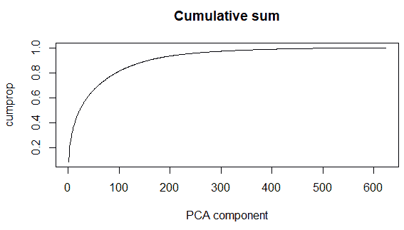
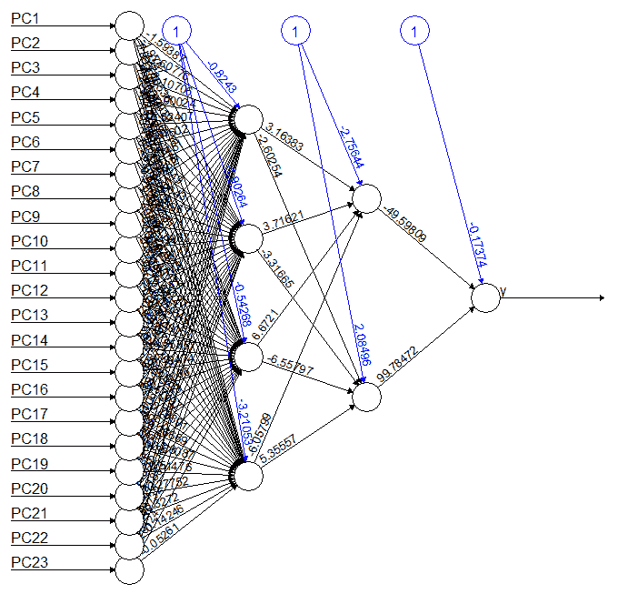
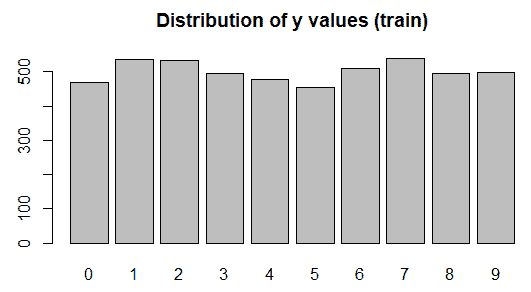
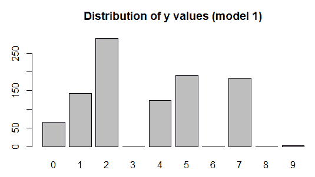
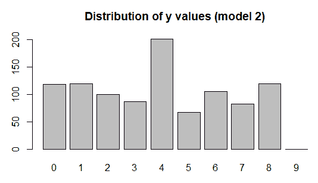
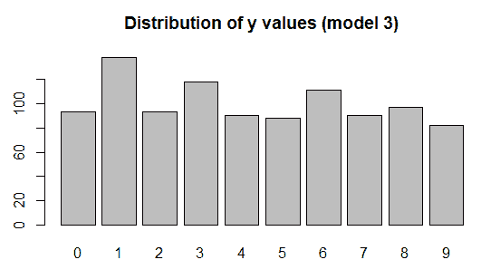
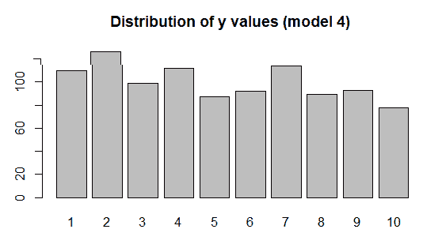
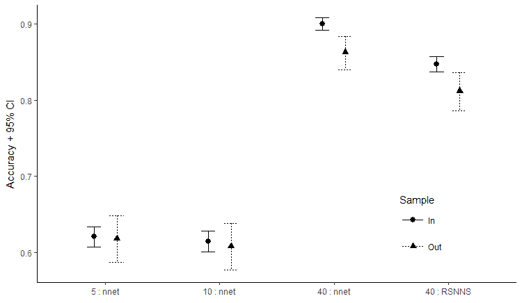
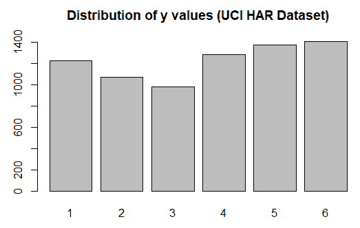

# 第二章：训练预测模型

本章通过实际示例向你展示如何在 R 中构建和训练基础的神经网络，并展示如何评估不同的超参数来找到最佳的模型设置。深度学习中的另一个重要问题是过拟合，即模型在训练数据上表现良好，但在未见过的数据上表现差。本章简要介绍了这个问题，我们将在第三章，*深度学习基础*中深入探讨。最后通过一个实际用例，使用智能手机的活动数据分类为步行、上下楼梯、坐着、站着或躺着。

本章涵盖以下主题：

+   R 中的神经网络

+   二分类

+   可视化神经网络

+   使用 nnet 和 RSNNS 包进行多分类

+   数据过拟合问题——解释其后果

+   用例——构建和应用神经网络

# R 中的神经网络

在本节中，我们将构建几个神经网络。首先，我们将使用 neuralnet 包创建一个神经网络模型，并且可以可视化。我们还将使用`nnet`和`RSNNS`（Bergmeir, C., 和 Benítez, J. M.（2012））包。这些是标准的 R 包，可以通过`install.packages`命令或 RStudio 中的包面板安装。虽然可以直接使用`nnet`包，但我们将通过`caret`包来使用它，`caret`是**分类和回归训练**（**Classification and Regression Training**）的缩写。`caret`包为 R 中的许多**机器学习**（**ML**）模型提供了一个标准化的接口，并且还具备一些用于验证和性能评估的实用功能，我们将在本章和下章中使用这些功能。

对于我们构建神经网络的第一个示例，我们将使用`MNIST`数据集，这是一个经典的分类问题：根据图片识别手写数字。数据可以从 Apache MXNet 网站下载（[`apache-mxnet.s3-accelerate.dualstack.amazonaws.com/R/data/mnist_csv.zip`](https://apache-mxnet.s3-accelerate.dualstack.amazonaws.com/R/data/mnist_csv.zip)）。数据格式为 CSV，其中每一列数据或特征表示图片中的一个像素。每张图片有 784 个像素（28 x 28），像素是灰度的，范围从 0 到 255。第一列包含数字标签，其余列是像素值，用于分类。

# 构建神经网络模型

代码位于本书`Chapter2`文件夹中。如果你还没有下载并解压代码，请回到第一章，*深度学习入门*，获取下载代码的链接。将代码解压到你的机器中的一个文件夹，你将看到不同章节的文件夹。我们将使用的代码是`Chapter2\chapter2.R`。

我们将使用`MNIST`数据集来构建一些神经网络模型。脚本的前几行查看数据文件（`train.csv`）是否在数据目录中。如果文件已经存在于数据目录中，则程序继续执行；如果不存在，则从[`apache-mxnet.s3-accelerate.dualstack.amazonaws.com/R/data/mnist_csv.zip`](https://apache-mxnet.s3-accelerate.dualstack.amazonaws.com/R/data/mnist_csv.zip)下载 ZIP 文件，并解压到数据文件夹中。这个检查意味着您不必手动下载数据，并且程序只下载文件一次。以下是下载数据的代码：

```py
dataDirectory <- "../data"
if (!file.exists(paste(dataDirectory,'/train.csv',sep="")))
{
  link <- 'https://apache-mxnet.s3-accelerate.dualstack.amazonaws.com/R/data/mnist_csv.zip'
  if (!file.exists(paste(dataDirectory,'/mnist_csv.zip',sep="")))
    download.file(link, destfile = paste(dataDirectory,'/mnist_csv.zip',sep=""))
  unzip(paste(dataDirectory,'/mnist_csv.zip',sep=""), exdir = dataDirectory)
  if (file.exists(paste(dataDirectory,'/test.csv',sep="")))
    file.remove(paste(dataDirectory,'/test.csv',sep=""))
}
```

作为替代方案，`MNIST`数据也可以在 Keras 中获得，因此我们可以从该库中下载并保存为 CSV 文件：

```py
if (!file.exists(paste(dataDirectory,'/train.csv',sep="")))
{
 library(keras)
 mnist <- dataset_mnist()
 c(c(x_train,y_train),c(x_test,y_test)) %<-% dataset_mnist()
 x_train <- array_reshape(x_train,c(dim(x_train)[1],dim(x_train)[2]*dim(x_train)[3]))
 y_train <- array_reshape(y_train,c(length(y_train),1))
 data_mnist <- as.data.frame(cbind(y_train,x_train))
 colnames(data_mnist)[1] <- "label"
 colnames(data_mnist)[2:ncol(data_mnist)] <- paste("pixel",seq(1,784),sep="")
 write.csv(data_mnist,paste(dataDirectory,'/train.csv',sep=""),row.names = FALSE)
}
```

当您第一次加载任何新数据集时，您应该快速检查数据，以确保行数和列数符合预期，如以下代码所示：

```py
digits <- read.csv("../data/train.csv")
dim(digits)
[1] 42000 785

head(colnames(digits), 4)
[1] "label" "pixel0" "pixel1" "pixel2"

tail(colnames(digits), 4)
[1] "pixel780" "pixel781" "pixel782" "pixel783"

head(digits[, 1:4])
  label pixel0 pixel1 pixel2
1     1      0      0      0
2     0      0      0      0
3     1      0      0      0
4     4      0      0      0
5     0      0      0      0
6     0      0      0      0
```

数据看起来不错，我们有`42000`行和`785`列。头部被正确导入，值是数值型的。现在我们已经加载了数据并对其进行了一些验证检查，我们可以继续建模。我们的第一个模型将使用`neuralnet`库，因为这允许我们可视化神经网络。我们将仅选择标签为 5 或 6 的行，并创建一个二元分类任务来区分它们。当然，您可以选择任何您喜欢的数字，但选择 5 和 6 是一个不错的选择，因为它们在图形上相似，因此我们的模型将比选择不那么相似的两个数字（例如 1 和 8）更难工作。我们将标签重命名为 0 和 1 进行建模，然后将该数据分成训练集和测试集。

然后，我们对训练数据使用**主成分分析**（**PCA**）进行降维——我们使用 PCA 是因为我们希望将数据中的预测变量数量减少到一个合理的数量以进行绘图。PCA 要求我们移除具有零方差的列；这些列在每个实例中具有相同的值。在我们的图像数据中，所有图像周围都有一个边框，即所有值都为零。请注意，我们如何使用仅用于训练模型的数据找到具有零方差的列；先应用此检查然后再拆分数据进行建模是不正确的。

**降维**：我们的图像数据是灰度数据，取值范围从 0（黑色）到 255（白色）。这些值高度相关，即如果一个像素是黑色（即 0），则其周围的像素很可能是黑色或深灰色。类似地，如果一个像素是白色（255），则其周围的像素很可能是白色或浅灰色。降维是一种无监督机器学习技术，它接受一个输入数据集并生成一个具有相同特性的输出数据集。

这样的操作将会减少数据的行数，但列数更少。不过，关键在于，这些更少的列可以解释输入数据集中的大部分信号。PCA 是一种降维算法。我们在这里使用它是因为我们想要创建一个列数较少的数据集来绘制网络，但我们仍然希望我们的算法能够产生良好的结果。

以下代码选择了标签为 5 或 6 的行，并创建了一个训练/测试数据集的拆分。它还去除了方差为零的列，这些列在每一行中的值都相同：

```py
digits_nn <- digits[(digits$label==5) | (digits$label==6),]
digits_nn$y <- digits_nn$label
digits_nn$label <- NULL
table(digits_nn$y)
   5    6 
3795 4137 

digits_nn$y <- ifelse(digits_nn$y==5, 0, 1)
table(digits_nn$y)
   0    1 
3795 4137 

set.seed(42)
sample <- sample(nrow(digits_nn), nrow(digits_nn)*0.8)
test <- setdiff(seq_len(nrow(digits_nn)), sample)

digits.X2 <- digits_nn[,apply(digits_nn[sample,1:(ncol(digits_nn)-1)], 2, var, na.rm=TRUE) != 0]
length(digits.X2)
[1] 624
```

我们将列数据的数量从`784`减少到了`624`，也就是说，`160`列在所有行中具有相同的值。现在，我们对数据进行 PCA 分析并绘制方差的累积和：

```py
df.pca <- prcomp(digits.X2[sample,],center = TRUE,scale. = TRUE) 
s<-summary(df.pca)
cumprop<-s$importance[3, ]
plot(cumprop, type = "l",main="Cumulative sum",xlab="PCA component")
```

PCA 解释方差的累积和展示了需要多少主成分才能解释输入数据中的方差比例。通俗来说，这张图表明我们可以使用前 100 个变量（*主成分*），这就能解释原始数据中超过 80%的方差：



图 2.1：主成分解释方差的累积和。

下一个代码块选择了解释我们 50%方差的主成分，并使用这些变量来创建神经网络：

```py
num_cols <- min(which(cumprop>0.5))
cumprop[num_cols]
 PC23 
0.50275 

newdat<-data.frame(df.pca$x[,1:num_cols])
newdat$y<-digits_nn[sample,"y"]
col_names <- names(newdat)
f <- as.formula(paste("y ~", paste(col_names[!col_names %in% "y"],collapse="+")))
nn <- neuralnet(f,data=newdat,hidden=c(4,2),linear.output = FALSE)
```

我们可以看到，原始数据中 50%的方差只需 23 个主成分就能解释。接下来，我们通过调用`plot`函数绘制神经网络：

```py
plot(nn)
```

这会生成一个类似于以下屏幕截图的图。我们可以看到输入变量（**PC1**到**PC23**）、隐藏层和偏置，甚至是网络权重：



图 2.2：带有权重和偏置的神经网络示例

我们选择了 23 个主成分作为我们神经网络库的预测变量。我们决定使用两个隐藏层，第一个有四个节点，第二个有两个节点。该图输出了系数，虽然从图中并不容易解读，但如果需要，还是可以使用相关函数访问它们。

接下来，我们将在一个未参与构建降维或神经网络模型的保留数据集或测试数据集上进行预测。我们需要先将测试数据传递给`predict`函数，传入之前创建的`df.pca`对象，以获取测试数据的主成分。然后，我们可以将这些数据传入神经网络预测中（将列过滤到前 23 个主成分），最后显示混淆矩阵和总体准确率：

```py
test.data <- predict(df.pca, newdata=digits_nn[test,colnames(digits.X2)])
test.data <- as.data.frame(test.data)
preds <- compute(nn,test.data[,1:num_cols])
preds <- ifelse(preds$net.result > 0.5, "1", "0")
t<-table(digits_nn[test,"y"], preds,dnn=c("Actual", "Predicted"))
acc<-round(100.0*sum(diag(t))/sum(t),2)
print(t)
 Predicted
Actual 0   1
 0   740  17
 1    17 813
print(sprintf(" accuracy = %1.2f%%",acc))
[1] " accuracy = 97.86%"
```

我们达到了`97.86%`的准确率，考虑到我们仅使用了 23 个主成分在神经网络中，这个结果相当不错。需要注意的是，这些 23 个变量并不能直接与输入数据集中的任何列或彼此进行比较。事实上，PCA（主成分分析）或任何降维算法的关键就在于生成相互之间没有相关性的列。

接下来，我们将创建执行多分类的模型，也就是说，它们可以对数字 0-9 进行分类。我们将标签（数字 0 到 9）转换为因子，以便 R 知道这是一个分类问题而不是回归问题。对于实际问题，应该使用所有可用的数据，但如果我们使用所有 42,000 行数据，使用 R 中的神经网络包进行训练将需要很长时间。因此，我们将选择 5,000 行用于训练，1,000 行用于测试。我们应随机选择这些行，并确保训练集和测试集之间没有重复的行。我们还将数据分为特征或预测变量（`digits.x`）和结果（`digits.Y`）。在这里，我们使用除了标签之外的所有列作为预测变量：

```py
sample <- sample(nrow(digits), 6000)
train <- sample[1:5000]
test <- sample[5001:6000]

digits.X <- digits[train, -1]
digits.y_n <- digits[train, 1]
digits$label <- factor(digits$label, levels = 0:9)
digits.y <- digits[train, 1]

digits.test.X <- digits[test, -1]
digits.test.y <- digits[test, 1]
rm(sample,train,test)
```

最后，在开始构建我们的神经网络之前，让我们快速检查一下数字的分布情况。这一点很重要，例如，如果某个数字非常少见，我们可能需要调整建模方法，以确保在性能评估中对该数字给予足够的权重，特别是当我们希望准确预测该特定数字时。以下代码片段创建了一个条形图，展示了每个数字标签的频率：

```py
barplot(table(digits.y),main="Distribution of y values (train)")
```

从图中我们可以看到，各类别的分布相对均匀，因此无需增加任何特定类别的权重或重要性：



图 2.3：训练数据集的 *y* 值分布

现在，让我们通过`caret`包的包装器使用`nnet`包来构建和训练我们的第一个神经网络。首先，我们使用`set.seed()`函数并指定一个特定的种子，以确保结果是可重复的。具体的种子值并不重要，重要的是每次运行脚本时使用相同的种子。`train()`函数首先接受特征或预测数据（`x`），然后是结果变量（`y`）作为参数。`train()`函数可以与多种模型一起使用，具体模型通过`method`参数确定。尽管机器学习模型的许多方面是自动学习的，但有些参数需要手动设置。这些参数因使用的方法而异；例如，在神经网络中，一个参数是隐藏单元的数量。`train()`函数提供了一种简单的方式，将各种调优参数作为命名的数据框传递给`tuneGrid`参数。它返回每组调优参数的性能测量值，并返回最佳训练模型。我们将从仅有五个隐藏神经元的模型开始，并使用适中的衰减率。学习率控制每次迭代或步骤对当前权重的影响程度。衰减率是正则化超参数，用于防止模型过拟合。另一个参数`trcontrol`控制`train()`的其他方面，当评估多种调优参数时，用于告知`caret`包如何验证并选择最佳调优参数。

对于这个例子，我们将训练控制方法设置为*none*，因为这里只有一组调优参数在使用。最后，我们可以指定额外的命名参数，这些参数会传递给实际的`nnet()`函数（或指定的任何算法）。由于预测变量的数量（`784`），我们将最大权重数增加到 10,000，并指定最大迭代次数为 100。由于数据量相对较小，且隐藏神经元较少，这个初始模型运行时间并不长：

```py
set.seed(42) 
tic <- proc.time()
digits.m1 <- caret::train(digits.X, digits.y,
           method = "nnet",
           tuneGrid = expand.grid(
             .size = c(5),
             .decay = 0.1),
           trControl = trainControl(method = "none"),
           MaxNWts = 10000,
           maxit = 100)
print(proc.time() - tic)
   user system elapsed 
  54.47 0.06 54.85
```

`predict()`函数为数据生成一组预测值。我们将使用测试数据集来评估模型；该数据集包含未用于训练模型的记录。我们将在下图中检查预测数字的分布。

```py
digits.yhat1 <- predict(digits.m1,newdata=digits.test.X)
accuracy <- 100.0*sum(digits.yhat1==digits.test.y)/length(digits.test.y)
print(sprintf(" accuracy = %1.2f%%",accuracy))
[1] " accuracy = 54.80%"
barplot(table(digits.yhat1),main="Distribution of y values (model 1)")
```

很明显，这不是一个好的模型，因为预测值的分布与实际值的分布差异很大：



图 2.4：预测模型中*y*值的分布

`barplot`是对预测结果的简单检查，显示了我们的模型并不十分准确。我们还可以通过计算预测结果中与实际值匹配的行的百分比来计算准确率。该模型的准确率为`54.8%`，并不理想。通过`caret`包中的`confusionMatrix()`函数，可以更正式地评估模型的性能。由于在`RSNNS`包中也有同名函数，它们被掩盖了，因此我们使用`caret::confusionMatrix`来确保调用的是`caret`包中的函数。以下代码展示了混淆矩阵和测试集上的性能指标：

```py
caret::confusionMatrix(xtabs(~digits.yhat1 + digits.test.y))
Confusion Matrix and Statistics

            digits.test.y
digits.yhat1    0   1   2   3   4   5   6   7   8   9
           0   61   1   0   1   0   2   0   0   0   1
           1    1 104   0   2   0   4   3   9  12   8
           2    6   2  91  56   4  20  68   1  41   1
           3    0   0   0   0   0   0   0   0   0   0
           4    2   0   4   1  67   1  22   4   2  21
           5   39   0   6  45   4  46   0   5  30  16
           6    0   0   0   0   0   0   0   0   0   0
           7    0   0   0   6   9   0   0  91   2  75
           8    0   0   0   0   0   0   0   0   0   0
           9    0   0   0   0   0   0   0   3   0   0

Overall Statistics

               Accuracy : 0.46 
                 95% CI : (0.4288, 0.4915)
    No Information Rate : 0.122 
    P-Value [Acc > NIR] : < 2.2e-16 

                  Kappa : 0.4019 
 Mcnemar's Test P-Value : NA 

Statistics by Class:

                     Class: 0 Class: 1 Class: 2 Class: 3 Class: 4 Class: 5 Class: 6
Sensitivity            0.5596   0.9720   0.9010    0.000   0.7976   0.6301    0.000
Specificity            0.9944   0.9563   0.7786    1.000   0.9378   0.8436    1.000
Pos Pred Value         0.9242   0.7273   0.3138      NaN   0.5403   0.2408      NaN
Neg Pred Value         0.9486   0.9965   0.9859    0.889   0.9806   0.9666    0.907
Prevalence             0.1090   0.1070   0.1010    0.111   0.0840   0.0730    0.093
Detection Rate         0.0610   0.1040   0.0910    0.000   0.0670   0.0460    0.000
Detection Prevalence   0.0660   0.1430   0.2900    0.000   0.1240   0.1910    0.000
Balanced Accuracy      0.7770   0.9641   0.8398    0.500   0.8677   0.7369    0.500
                     Class: 7 Class: 8 Class: 9
Sensitivity            0.8053    0.000   0.0000
Specificity            0.8963    1.000   0.9966
Pos Pred Value         0.4973      NaN   0.0000
Neg Pred Value         0.9731    0.913   0.8776
Prevalence             0.1130    0.087   0.1220
Detection Rate         0.0910    0.000   0.0000
Detection Prevalence   0.1830    0.000   0.0030
Balanced Accuracy      0.8508    0.500   0.4983
```

由于我们有多个数字，性能输出分为三个主要部分。首先，显示的是实际频率的交叉表。正确的预测位于对角线，误分类的不同频率出现在非对角线上。接下来是总体统计数据，表示模型在所有类别上的性能。准确率仅仅是正确分类的案例比例，并附带一个 95%的置信区间，这对于较小的数据集尤为有用，因为在这些数据集中估计值可能存在较大的不确定性。

`No Information Rate`指的是如果没有任何信息，仅通过猜测最常见的类别来期望的准确率，在此例中为 1，该类别出现的频率为 11.16%。p 值测试观察到的准确率（44.3%）是否与`No Information Rate`（11.2%）显著不同。尽管在统计学上显著，这对数字分类并没有太大意义，因为我们期望比仅仅猜测最常见的数字要好得多！最后，显示了每个数字的个体性能指标。这些指标是通过计算该数字与其他每个数字的比较来得出的，因此每个指标都是一个二分类比较。

现在我们对如何设置、训练和评估模型性能有了一些基本了解，我们将尝试增加隐藏神经元的数量，这是提高模型性能的一个关键方式，但代价是大幅增加模型复杂性。回想一下第一章，*深度学习入门*，每个预测器或特征都会连接到每个隐藏神经元，而每个隐藏神经元又与每个输出或结果相连接。对于`784`个特征，每增加一个隐藏神经元就会增加大量参数，这也会导致运行时间延长。根据你的计算机配置，准备好等待几分钟，直到下一个模型运行完成：

```py
set.seed(42) 
tic <- proc.time()
digits.m2 <- caret::train(digits.X, digits.y,
           method = "nnet",
           tuneGrid = expand.grid(
             .size = c(10),
             .decay = 0.1),
           trControl = trainControl(method = "none"),
            MaxNWts = 50000,
            maxit = 100)
print(proc.time() - tic)
   user system elapsed 
 154.49 0.09 155.33 

digits.yhat2 <- predict(digits.m2,newdata=digits.test.X)
accuracy <- 100.0*sum(digits.yhat2==digits.test.y)/length(digits.test.y)
print(sprintf(" accuracy = %1.2f%%",accuracy))
[1] " accuracy = 66.30%"
barplot(table(digits.yhat2),main="Distribution of y values (model 2)")
```

这个模型比上一个模型要好，但预测值的分布仍然不均匀：



图 2.5：预测模型的*y*值分布

将隐藏神经元的数量从 5 增加到 10，提高了我们的样本内表现，整体准确率从`54.8%`提升到`66.3%`，但这仍然距离理想状态有一定差距（想象一下，一个字符识别软件会混淆超过 30% 的所有字符！）。我们再次增加数量，这次增加到 40 个隐藏神经元，并且让模型等待更长时间才能完成训练：

```py
set.seed(42) 
tic <- proc.time()
digits.m3 <- caret::train(digits.X, digits.y,
           method = "nnet",
           tuneGrid = expand.grid(
             .size = c(40),
             .decay = 0.1),
           trControl = trainControl(method = "none"),
           MaxNWts = 50000,
           maxit = 100)
print(proc.time() - tic)
   user system elapsed 
2450.16 0.96 2457.55

digits.yhat3 <- predict(digits.m3,newdata=digits.test.X)
accuracy <- 100.0*sum(digits.yhat3==digits.test.y)/length(digits.test.y)
print(sprintf(" accuracy = %1.2f%%",accuracy))
[1] " accuracy = 82.20%"
barplot(table(digits.yhat3),main="Distribution of y values (model 3)")
```

在这个模型中，预测值的分布是均匀的，这是我们所追求的。然而，准确率仍然只有 82.2%，这相当低：



图 2.6：*y* 值的分布来自预测模型

使用 40 个隐藏神经元后，整体准确率提高到了`82.2%`，且在一台 i5 电脑上运行耗时超过 40 分钟。某些数字的模型表现仍然不理想。如果这是一个真实的研究或商业问题，我们可能会继续尝试更多的神经元、调整衰减率或修改特征，以进一步提高模型表现，但现在我们将继续进行下一步。

接下来，我们将看看如何使用 RSNNS 包来训练神经网络。该包提供了一个接口，能够使用**斯图加特神经网络模拟器**（**SNNS**）代码来实现多种可能的模型；然而，对于基本的单隐层前馈神经网络，我们可以使用`mlp()`便捷包装函数，这代表了多层感知机。RSNNS 包的使用比通过`caret`包中的 nnet 更加复杂，但其一个优势是，它可以更灵活，允许训练许多其他类型的神经网络架构，包括递归神经网络，同时也提供了更多的训练策略。

nnet 和 RSNNS 包之间的一个区别是，对于多类别的输出（例如数字），RSNNS 需要进行虚拟编码（即独热编码），每个可能的类别作为一列，使用 0/1 编码。这可以通过使用`decodeClassLabels()`函数来实现，如下所示的代码片段：

```py
head(decodeClassLabels(digits.y))
     0 1 2 3 4 5 6 7 8 9
[1,] 0 0 0 0 0 0 0 0 0 1
[2,] 0 0 0 0 1 0 0 0 0 0
[3,] 1 0 0 0 0 0 0 0 0 0
[4,] 0 0 0 0 0 1 0 0 0 0
[5,] 0 0 0 0 1 0 0 0 0 0
[6,] 0 0 0 1 0 0 0 0 0 0
```

由于我们在使用 40 个隐藏神经元时取得了相当不错的效果，所以这里我们将使用相同的规模。我们将使用基于 Riedmiller, M.和 Braun, H.（1993）工作的**弹性传播**，而不是标准传播作为学习函数。弹性反向传播是标准反向传播的**优化**方法，它应用了更快速的权重更新机制。随着神经网络复杂度的增加，训练时间通常较长，这是一个常见的问题。我们将在后续章节中深入讨论这一点，但目前，你只需要知道这个神经网络更快，因为它会跟踪过去的导数，如果它们在反向传播过程中方向相同，它会采取更大的步伐。还要注意，因为传递的是一个结果矩阵，尽管单个数字的预测概率不会超过 1，但所有数字的预测概率总和可能超过 1，也可能小于 1（也就是说，对于某些情况，模型可能并不认为它们非常可能代表任何数字）。`predict`函数返回一个矩阵，其中每一列代表一个单独的数字，因此我们使用`encodeClassLabels()`函数将其转换回一个数字标签的单一向量，以便绘制和评估模型的性能：

```py
set.seed(42) 
tic <- proc.time()
digits.m4 <- mlp(as.matrix(digits.X),
             decodeClassLabels(digits.y),
             size = 40,
             learnFunc = "Rprop",
             shufflePatterns = FALSE,
             maxit = 80)
print(proc.time() - tic)
   user system elapsed 
 179.71 0.08 180.99 

digits.yhat4 <- predict(digits.m4,newdata=digits.test.X)
digits.yhat4 <- encodeClassLabels(digits.yhat4)
accuracy <- 100.0*sum(I(digits.yhat4 - 1)==digits.test.y)/length(digits.test.y)
print(sprintf(" accuracy = %1.2f%%",accuracy))
[1] " accuracy = 81.70%"
barplot(table(digits.yhat4),main="Distribution of y values (model 4)")
```

下图条形图显示了预测值在各个类别之间相对均匀分布。这与实际类别值的分布相匹配：



图 2.7：来自预测模型的*y*值分布

准确率为 81.70%，且在我的计算机上运行了 3 分钟。这仅比我们使用 40 个隐藏节点的 nnet 稍低，当时在同一台机器上花费了 40 分钟！这展示了使用优化器的重要性，我们将在后续章节中看到这一点。

# 从神经网络生成预测

对于任何给定的观察值，它可能属于多个类别中的某一个（例如，一个观察值可能有 40%的概率是*5*，20%的概率是*6*，依此类推）。为了评估模型的性能，必须做出一些选择，将类别成员资格的概率转化为离散分类。在本节中，我们将更详细地探讨其中的一些选项。

只要没有完美的平局，最简单的方法就是基于最高预测概率来分类观察值。另一种方法是 RSNNS 包称之为**赢家通吃**（**WTA**）方法，选择具有最高概率的类别，前提是满足以下条件：

+   没有最高概率的平局情况

+   最高概率超过用户定义的阈值（阈值可以为零）

+   其余类别的预测概率都低于最大值减去另一个用户定义的阈值

否则，观测值将被分类为未知。如果两个阈值都为零（默认值），这相当于说必须有一个唯一的最大值。这种方法的优点是提供了一些质量控制。在我们一直在探讨的数字分类示例中，有 10 个可能的类别。

假设 9 个数字的预测概率为 0.099，其余类别的预测概率为 0.109。尽管某个类别在技术上比其他类别更可能，但差异相当微小，我们可以得出结论，模型无法以任何确定性分类该观测值。一种叫做 402040 的最终方法，只有当一个值超过用户定义的阈值，且所有其他值低于另一个用户定义的阈值时，才进行分类；如果多个值超过第一个阈值，或者任何值不低于第二个阈值，它将该观测值视为未知。再次强调，这里的目标是提供某种质量控制。

这看起来似乎是不必要的，因为预测的不确定性应该已经体现在模型的表现中。然而，知道你的模型在预测时是否高度确信并且预测正确，或者不确定且预测正确或错误，还是很有帮助的。

最后，在某些情况下，并非所有类别都同样重要。例如，在一个医学背景中，收集患者的多种生物标志物和基因，并用来分类他们是否面临癌症风险或心脏病风险，即使患者有 40%的癌症风险，可能也足以进一步调查，尽管他们有 60%的健康概率。这与我们之前看到的性能度量有关，除了整体准确度外，我们还可以评估诸如敏感性、特异性以及阳性和阴性预测值等方面。有些情况下，整体准确度并不如确保没有遗漏任何人更为重要。

以下代码显示了样本数据的原始概率，以及这些不同选择对预测值的影响：

```py
digits.yhat4_b <- predict(digits.m4,newdata=digits.test.X)
head(round(digits.yhat4_b, 2))
      [,1] [,2] [,3] [,4] [,5] [,6] [,7] [,8] [,9] [,10]
18986 0.00 0.00 0.00 0.98 0.00 0.02 0.00 0.00 0.00 0.00
41494 0.00 0.00 0.03 0.00 0.13 0.01 0.95 0.00 0.00 0.00
21738 0.00 0.00 0.02 0.03 0.00 0.46 0.01 0.00 0.74 0.00
37086 0.00 0.01 0.00 0.63 0.02 0.01 0.00 0.00 0.03 0.00
35532 0.00 0.00 0.00 0.00 0.01 0.00 0.00 0.99 0.00 0.00
17889 0.03 0.00 0.00 0.00 0.00 0.34 0.01 0.00 0.00 0.00

table(encodeClassLabels(digits.yhat4_b,method = "WTA", l = 0, h = 0))
1 2 3 4 5 6 7 8 9 10
102 116 104 117 93 66 93 127 89 93

table(encodeClassLabels(digits.yhat4_b,method = "WTA", l = 0, h = .5))
0 1 2 3 4 5 6 7 8 9 10
141 95 113 86 93 67 53 89 116 73 74

table(encodeClassLabels(digits.yhat4_b,method = "WTA", l = .2, h = .5))
0 1 2 3 4 5 6 7 8 9 10
177 91 113 77 91 59 50 88 116 70 68

table(encodeClassLabels(digits.yhat4_b,method = "402040", l = .4, h = .6))
  0 1 2 3 4 5 6 7 8 9 10 
254 89 110 71 82 46 41 79 109 65 54 
```

我们现在开始检查与过拟合数据相关的问题，以及这些问题对模型性能评估的影响。

# 过拟合数据的问题——后果解释

机器学习中的一个常见问题是过拟合数据。一般来说，过拟合是指模型在用于训练模型的数据上的表现优于在未用于训练模型的数据（如留出数据、未来的实际使用等）上的表现。过拟合发生在模型记住了部分训练数据，并拟合了训练数据中的噪声。训练数据中的准确度很高，但由于噪声在不同数据集之间变化，这种准确度并不适用于未见过的数据，也就是说，我们可以说模型的泛化能力不强。

过拟合随时可能发生，但随着参数与信息的比率增加，过拟合的情况往往会变得更严重。通常，这可以被视为参数与观测值的比率，但并不总是如此。例如，假设我们有一个非常不平衡的数据集，目标预测的结果是一个罕见事件，发生的概率为每五百万个案例中有一个。在这种情况下，1500 万的样本中可能只有 3 个正例。即使样本量很大，但信息量却很低。为了考虑一个简单但极端的情况，想象一下将一条直线拟合到两个数据点上。拟合会非常完美，在这两个训练数据上，你的线性回归模型似乎完全解释了数据中的所有变异性。然而，如果我们将这条线应用到另外 1000 个案例上，它可能就不太适用了。

在前面的章节中，我们生成了模型的样本外预测，也就是说，我们评估了在测试（或保留）数据上的准确性。但我们从未检查过模型是否出现了过拟合，也就是测试数据上的准确性。我们可以通过检查样本内预测的准确性来检验模型的泛化能力。我们可以看到，样本内数据的准确性为 84.7%，而保留数据的准确性为 81.7%。有一个 3.0%的损失；换句话说，使用训练数据来评估模型表现导致了对准确性的过度乐观估计，这一过高估计为 3.0%：

```py
digits.yhat4.train <- predict(digits.m4)
digits.yhat4.train <- encodeClassLabels(digits.yhat4.train)
accuracy <- 100.0*sum(I(digits.yhat4.train - 1)==digits.y)/length(digits.y)
print(sprintf(" accuracy = %1.2f%%",accuracy))
[1] " accuracy = 84.70%"
```

由于我们之前拟合了多个不同复杂度的模型，我们可以通过比较样本内与样本外的表现衡量，检查过拟合或过度乐观的准确性程度。这里的代码应该足够简单易懂。我们调用模型的预测函数，并且不传入任何新数据；这将返回模型所训练的数据的预测结果。其余的代码是标准的代码，用来生成图形图表。

```py
digits.yhat1.train <- predict(digits.m1)
digits.yhat2.train <- predict(digits.m2)
digits.yhat3.train <- predict(digits.m3)
digits.yhat4.train <- predict(digits.m4)
digits.yhat4.train <- encodeClassLabels(digits.yhat4.train)

measures <- c("AccuracyNull", "Accuracy", "AccuracyLower", "AccuracyUpper")
n5.insample <- caret::confusionMatrix(xtabs(~digits.y + digits.yhat1.train))
n5.outsample <- caret::confusionMatrix(xtabs(~digits.test.y + digits.yhat1))
n10.insample <- caret::confusionMatrix(xtabs(~digits.y + digits.yhat2.train))
n10.outsample <- caret::confusionMatrix(xtabs(~digits.test.y + digits.yhat2))
n40.insample <- caret::confusionMatrix(xtabs(~digits.y + digits.yhat3.train))
n40.outsample <- caret::confusionMatrix(xtabs(~digits.test.y + digits.yhat3))
n40b.insample <- caret::confusionMatrix(xtabs(~digits.y + I(digits.yhat4.train - 1)))
n40b.outsample <- caret::confusionMatrix(xtabs(~ digits.test.y + I(digits.yhat4 - 1)))

shrinkage <- rbind(
  cbind(Size = 5, Sample = "In", as.data.frame(t(n5.insample$overall[measures]))),
  cbind(Size = 5, Sample = "Out", as.data.frame(t(n5.outsample$overall[measures]))),
  cbind(Size = 10, Sample = "In", as.data.frame(t(n10.insample$overall[measures]))),
  cbind(Size = 10, Sample = "Out", as.data.frame(t(n10.outsample$overall[measures]))),
  cbind(Size = 40, Sample = "In", as.data.frame(t(n40.insample$overall[measures]))),
  cbind(Size = 40, Sample = "Out", as.data.frame(t(n40.outsample$overall[measures]))),
  cbind(Size = 40, Sample = "In", as.data.frame(t(n40b.insample$overall[measures]))),
  cbind(Size = 40, Sample = "Out", as.data.frame(t(n40b.outsample$overall[measures])))
  )
shrinkage$Pkg <- rep(c("nnet", "RSNNS"), c(6, 2))
dodge <- position_dodge(width=0.4)

ggplot(shrinkage, aes(interaction(Size, Pkg, sep = " : "), Accuracy,
                      ymin = AccuracyLower, ymax = AccuracyUpper,
                      shape = Sample, linetype = Sample)) +
  geom_point(size = 2.5, position = dodge) +
  geom_errorbar(width = .25, position = dodge) +
  xlab("") + ylab("Accuracy + 95% CI") +
  theme_classic() +
  theme(legend.key.size = unit(1, "cm"), legend.position = c(.8, .2))
```

代码生成如下图表，展示了准确性指标及这些指标的置信区间。从这张图表中我们注意到，随着模型变得更加复杂，样本内和样本外表现衡量之间的差距逐渐增大。这突出显示了复杂模型容易过拟合，也就是说，它们在样本内数据上的表现优于未见过的样本外数据：



图 2.8：神经网络模型的样本内和样本外表现衡量

# 用例 – 构建并应用神经网络

本章最后，我们将讨论神经网络的一个更现实的应用场景。我们将使用 Anguita, D., Ghio, A., Oneto, L., Parra, X., 和 Reyes-Ortiz, J. L.（2013）发布的公开数据集，该数据集使用智能手机来追踪身体活动。数据可以从[`archive.ics.uci.edu/ml/datasets/human+activity+recognition+using+smartphones`](https://archive.ics.uci.edu/ml/datasets/human+activity+recognition+using+smartphones)下载。这些智能手机配备了加速度计和陀螺仪，从中提取了 561 个特征，涵盖了时域和频域数据。

智能手机在步行、走楼梯、下楼梯、站立、坐着和躺下时佩戴。虽然这些数据来自手机，但类似的度量可以从其他设计用于追踪活动的设备中得出，例如各种健身追踪手表或腕带。因此，如果我们想销售设备并自动跟踪佩戴者进行的这些不同活动，这些数据就非常有用。

这些数据已经归一化，范围从 -1 到 +1；通常，如果数据没有归一化，我们可能会进行一些归一化操作。请从链接下载数据，并将其解压到与章节文件夹同级的“data”文件夹中；我们在后续章节中也将使用这些数据。我们可以导入训练和测试数据，以及标签。接下来，我们可以通过以下代码快速查看结果变量的分布：

```py
use.train.x <- read.table("../data/UCI HAR Dataset/train/X_train.txt")
use.train.y <- read.table("../data/UCI HAR Dataset/train/y_train.txt")[[1]]

use.test.x <- read.table("../data/UCI HAR Dataset/test/X_test.txt")
use.test.y <- read.table("../data/UCI HAR Dataset/test/y_test.txt")[[1]]

use.labels <- read.table("../data/UCI HAR Dataset/activity_labels.txt")

barplot(table(use.train.y),main="Distribution of y values (UCI HAR Dataset)")
```

这将生成以下条形图，显示类别的分布相对均衡：



图 2.9：UCI HAR 数据集的 *y* 值分布

我们将评估各种调优参数，以展示如何尝试不同的方法来获得最佳的模型。我们将使用不同的超参数，并评估哪个模型表现最好。

由于模型的训练可能需要一些时间，并且 R 通常只使用单核处理器，我们将使用一些特殊的包来实现并行运行多个模型。这些包是`parallel`、`foreach`和`doSNOW`，如果你从脚本的第一行运行，它们应该已经被加载。

现在我们可以选择调优参数，并设置一个本地集群作为`foreach` R 包的后台，以支持并行 for 循环。请注意，如果你在少于五个核心的机器上执行此操作，应将`makeCluster(5)`更改为较低的数字：

```py
## choose tuning parameters
tuning <- list(
  size = c(40, 20, 20, 50, 50),
  maxit = c(60, 100, 100, 100, 100),
  shuffle = c(FALSE, FALSE, TRUE, FALSE, FALSE),
  params = list(FALSE, FALSE, FALSE, FALSE, c(0.1, 20, 3)))

## setup cluster using 5 cores
## load packages, export required data and variables
## and register as a backend for use with the foreach package
cl <- makeCluster(5)
clusterEvalQ(cl, {source("cluster_inc.R")})
clusterExport(cl,
  c("tuning", "use.train.x", "use.train.y",
    "use.test.x", "use.test.y")
  )
registerDoSNOW(cl)
```

现在我们准备训练所有模型。以下代码展示了一个并行 for 循环，使用的代码与之前看到的类似，但这次根据我们先前存储在列表中的调优参数设置了一些参数：

```py
## train models in parallel
use.models <- foreach(i = 1:5, .combine = 'c') %dopar% {
  if (tuning$params[[i]][1]) {
    set.seed(42) 
    list(Model = mlp(
      as.matrix(use.train.x),
      decodeClassLabels(use.train.y),
      size = tuning$size[[i]],
      learnFunc = "Rprop",
      shufflePatterns = tuning$shuffle[[i]],
      learnFuncParams = tuning$params[[i]],
      maxit = tuning$maxit[[i]]
      ))
  } else {
    set.seed(42) 
    list(Model = mlp(
      as.matrix(use.train.x),
      decodeClassLabels(use.train.y),
      size = tuning$size[[i]],
      learnFunc = "Rprop",
      shufflePatterns = tuning$shuffle[[i]],
      maxit = tuning$maxit[[i]]
    ))
  }
}
```

由于生成样本外的预测也可能需要一些时间，我们将并行处理这个步骤。然而，首先我们需要将模型结果导出到集群中的每个工作节点，然后我们可以计算预测值：

```py
## export models and calculate both in sample,
## 'fitted' and out of sample 'predicted' values
clusterExport(cl, "use.models")
use.yhat <- foreach(i = 1:5, .combine = 'c') %dopar% {
  list(list(
    Insample = encodeClassLabels(fitted.values(use.models[[i]])),
    Outsample = encodeClassLabels(predict(use.models[[i]],
                                          newdata = as.matrix(use.test.x)))
    ))
}
```

最后，我们可以将实际值和拟合值或预测值合并成一个数据集，计算每个值的表现度量，并将整体结果一起存储以供检查和比较。我们可以使用与接下来的代码几乎相同的代码来生成样本外的表现度量。该代码没有在书中显示，但可以在与书一起提供的代码包中找到。这里需要进行一些额外的数据管理，因为有时模型可能无法预测每个可能的响应级别，但这可能会导致非对称的频率交叉表，除非我们将变量转换为因子并指定级别。我们还会删除`o`值，这表示模型对如何分类一个观测结果存在不确定性：

```py
use.insample <- cbind(Y = use.train.y,
  do.call(cbind.data.frame, lapply(use.yhat, `[[`, "Insample")))
colnames(use.insample) <- c("Y", paste0("Yhat", 1:5))

performance.insample <- do.call(rbind, lapply(1:5, function(i) {
  f <- substitute(~ Y + x, list(x = as.name(paste0("Yhat", i))))
  use.dat <- use.insample[use.insample[,paste0("Yhat", i)] != 0, ]
  use.dat$Y <- factor(use.dat$Y, levels = 1:6)
  use.dat[, paste0("Yhat", i)] <- factor(use.dat[, paste0("Yhat", i)], levels = 1:6)
  res <- caret::confusionMatrix(xtabs(f, data = use.dat))

  cbind(Size = tuning$size[[i]],
        Maxit = tuning$maxit[[i]],
        Shuffle = tuning$shuffle[[i]],
        as.data.frame(t(res$overall[c("AccuracyNull", "Accuracy", "AccuracyLower", "AccuracyUpper")])))
}))

use.outsample <- cbind(Y = use.test.y,
  do.call(cbind.data.frame, lapply(use.yhat, `[[`, "Outsample")))
colnames(use.outsample) <- c("Y", paste0("Yhat", 1:5))
performance.outsample <- do.call(rbind, lapply(1:5, function(i) {
  f <- substitute(~ Y + x, list(x = as.name(paste0("Yhat", i))))
  use.dat <- use.outsample[use.outsample[,paste0("Yhat", i)] != 0, ]
  use.dat$Y <- factor(use.dat$Y, levels = 1:6)
  use.dat[, paste0("Yhat", i)] <- factor(use.dat[, paste0("Yhat", i)], levels = 1:6)
  res <- caret::confusionMatrix(xtabs(f, data = use.dat))

  cbind(Size = tuning$size[[i]],
        Maxit = tuning$maxit[[i]],
        Shuffle = tuning$shuffle[[i]],
        as.data.frame(t(res$overall[c("AccuracyNull", "Accuracy", "AccuracyLower", "AccuracyUpper")])))
}))
```

如果我们打印出样本内和样本外的表现，我们可以看到每个模型的表现以及调整某些调参参数的效果。输出结果如下所示。第四列（null accuracy）被删除，因为它在这次比较中不那么重要：

```py
options(width = 80, digits = 3)
performance.insample[,-4]
  Size Maxit Shuffle Accuracy AccuracyLower AccuracyUpper
1   40    60   FALSE    0.984         0.981         0.987
2   20   100   FALSE    0.982         0.978         0.985
3   20   100    TRUE    0.982         0.978         0.985
4   50   100   FALSE    0.981         0.978         0.984
5   50   100   FALSE    1.000         0.999         1.000

performance.outsample[,-4]
  Size Maxit Shuffle Accuracy AccuracyLower AccuracyUpper
1   40    60   FALSE    0.916         0.906         0.926
2   20   100   FALSE    0.913         0.902         0.923
3   20   100   TRUE     0.913         0.902         0.923
4   50   100   FALSE    0.910         0.900         0.920
5   50   100   FALSE    0.938         0.928         0.946
```

提醒一下，样本内结果评估的是训练数据上的预测，而样本外结果评估的是保留数据（或测试数据）上的预测。最佳的超参数集是最后一组，其中我们在未见过的数据上获得了 93.8%的准确率。这表明我们能够基于智能手机的数据相当准确地分类人们从事的活动类型。我们还可以看到，复杂模型在样本内数据上的表现更好，但在样本外表现度量上并不总是如此。

对于每个模型，我们在样本内数据和样本外数据的准确率之间存在很大差异；这些模型显然存在过拟合问题。我们将在第三章中探讨如何应对这种过拟合问题，*深度学习基础*，因为我们将在那里训练具有多个隐藏层的深度神经网络。

尽管样本外的表现稍微差一些，但这些模型仍然表现良好——远远超过仅凭运气的表现——对于我们的示例用例，我们可以选择最佳模型，并且可以非常有信心地认为，使用这个模型可以提供准确的用户活动分类。

# 总结

本章展示了如何开始构建和训练神经网络来对数据进行分类，包括图像识别和身体活动数据。我们查看了可以可视化神经网络的包，并创建了多个模型，以对具有 10 个不同类别的数据进行分类。尽管我们只使用了一些神经网络包，而不是深度学习包，但我们的模型训练时间很长，并且遇到了过拟合问题。

本章中的一些基本神经网络模型训练时间较长，尽管我们并没有使用所有可用的数据。对于 MNIST 数据集，我们在二分类任务中使用了大约 8,000 行数据，在多分类任务中只用了 6,000 行数据。即便如此，一个模型的训练时间仍然接近一个小时。我们的深度学习模型将更为复杂，并且应该能够处理数百万条记录。现在你应该明白为什么训练深度学习模型需要专门的硬件了。

其次，我们看到机器学习中的一个潜在陷阱是，复杂的模型更容易发生过拟合，因此，在使用训练数据评估模型性能时，可能会得到偏向的、过于乐观的性能估计。事实上，这甚至可能影响到选择哪种模型作为最优模型。过拟合对于深度神经网络也是一个问题。在下一章中，我们将讨论防止过拟合的各种技术，并获得更准确的模型性能评估。

在下一章，我们将从零开始构建一个神经网络，并了解它如何应用于深度学习。我们还将讨论一些应对过拟合的方法。
