# 第三章：深度学习基础

在上一章中，我们使用 R 中的神经网络包创建了一些机器学习模型。本章将通过使用基本的数学和矩阵运算创建一个神经网络，来介绍一些神经网络和深度学习的基础知识。这个应用示例将有助于解释深度学习算法中的一些关键参数，以及一些允许它们在大数据集上训练的优化方法。我们还将展示如何评估模型的不同超参数，以找到最佳的设置。在上一章中，我们简要地讨论了过拟合问题；本章将更深入地探讨这个话题，并介绍如何克服这个问题。它包括一个使用 dropout（深度学习中最常见的正则化技术）的示例用例。

本章涵盖以下主题：

+   从零开始在 R 中构建神经网络

+   深度学习中的常见参数

+   深度学习算法中的一些关键组件

+   使用正则化克服过拟合

+   用例—使用 dropout 改善样本外模型性能

# 从零开始在 R 中构建神经网络

尽管我们已经使用了一些神经网络算法，但现在是时候更深入地了解它们是如何工作的了。本节演示了如何从头开始编写神经网络的代码。你可能会惊讶地发现，神经网络的核心代码可以用不到 80 行代码来编写！本章的代码正是这样做的，它使用 R 编写了一个交互式网络应用程序。这应该能让你更直观地理解神经网络。首先我们将看这个网络应用程序，然后我们将更深入地探讨神经网络的代码。

# 神经网络 Web 应用程序

首先，我们将看一个 R Shiny 网络应用程序。我鼓励你运行该应用并按照示例操作，这将真正帮助你更好地理解神经网络是如何工作的。为了运行它，你需要在 RStudio 中打开 `Chapter3` 项目。

**什么是 R Shiny**？

R Shiny 是 RStudio 公司提供的一个 R 包，它允许你仅使用 R 代码创建交互式 Web 应用程序。你可以构建仪表板和可视化，使用 R 的完整功能。你还可以通过 CSS、组件和 JavaScript 扩展 R Shiny 应用程序。还可以将你的应用程序托管在网上。它是一个展示数据科学应用的好工具，如果你还不熟悉它，我鼓励你了解一下。更多信息请见 [`shiny.rstudio.com/`](https://shiny.rstudio.com/)，如果你想了解 R Shiny 能做什么，可以查看 [`shiny.rstudio.com/gallery/`](https://shiny.rstudio.com/gallery/)。

1.  打开 `server.R` 文件，在 RStudio 中点击 Run App 按钮：


图 3.1：如何运行 R Shiny 应用程序

1.  当你点击 "Run App" 按钮时，应该会弹出一个网页应用的屏幕。以下是应用启动后的截图：

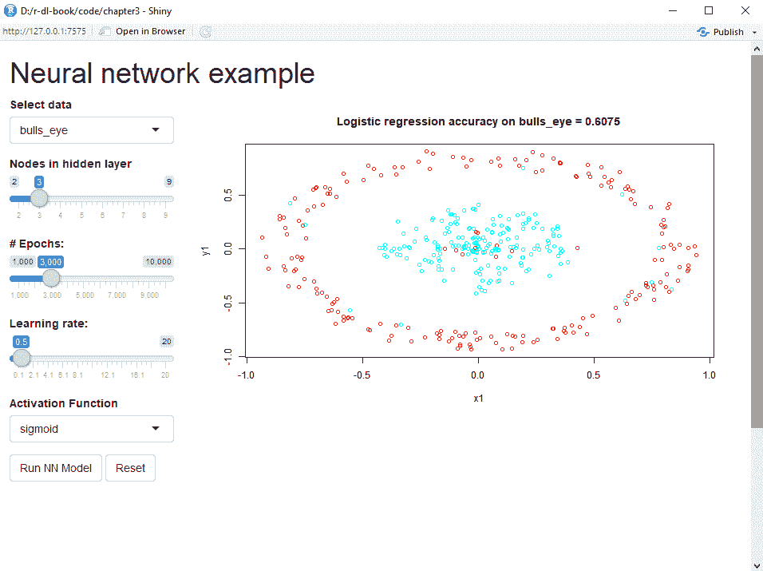

图 3.2：R Shiny 应用启动时的界面

这个网页应用可以在弹出窗口中使用，也可以在浏览器中打开。左侧是输入选择的集合，这些是神经网络的参数。它们被称为超参数，以便与模型尝试优化的*参数*区分开来。从上到下，这些超参数包括：

+   **选择数据**：你可以使用四个不同的数据集作为训练数据。

+   **隐藏层中的节点数**：隐藏层中节点的数量。神经网络只有一个隐藏层。

+   **# 迭代次数**：模型构建过程中算法对数据迭代的次数。

+   **学习率**：在反向传播过程中应用的学习率。学习率影响算法在每次迭代时权重的变化量。

+   **激活函数**：应用于每个节点输出的激活函数。

+   "Run NN Model" 按钮使用输入选择的内容训练一个模型。"Reset" 按钮将输入选择恢复为默认值。

有四个不同的数据集可供选择，每个数据集的分布不同；你可以从下拉框中选择它们。它们有描述性名称；例如，*图 3.2* 中绘制的数据被称为 `bulls_eye`。这些数据集来自另一个用于测试聚类算法的 R 包。数据包含两个相等大小的类别，并由各种几何形状组成。你可以使用这个网页应用探索这些数据集。我们对数据所做的唯一改变是随机交换 5% 数据的标签。当你运行应用时，你会注意到在内圈有一些红色点，外圈有一些蓝色点。这是为了让我们的模型的最大准确度只能达到 0.95（95%）。这能让我们确信模型运行正常。如果准确度超过了这个值，模型可能会过拟合，因为它学习到的函数过于复杂。我们将在下一节中再次讨论过拟合问题。

机器学习的第一步之一应该是建立一个基准分数，这对于衡量你的进展非常有用。基准分数可以是经验法则，或者是一个简单的机器学习算法；它不应是你花费大量时间精力去研究的内容。在这个应用程序中，我们使用基本的逻辑回归模型作为基准。我们可以看到，在前面的截图中，逻辑回归模型的准确率只有 0.6075，或者说 60.75%。这仅仅比 50%稍高，但请记住，逻辑回归只能拟合一条直线，而这组数据无法用一条直线分割开来。神经网络应该能在逻辑回归的基准上有所改进，因此，如果我们在这个数据集上的准确率低于 0.6075，那说明我们的模型存在问题，应该检查。

那么，开始吧！点击“运行神经网络模型”按钮，该按钮使用输入的选择在数据上运行神经网络模型。几秒钟后，应用程序应会更改为以下截图所示的样子：

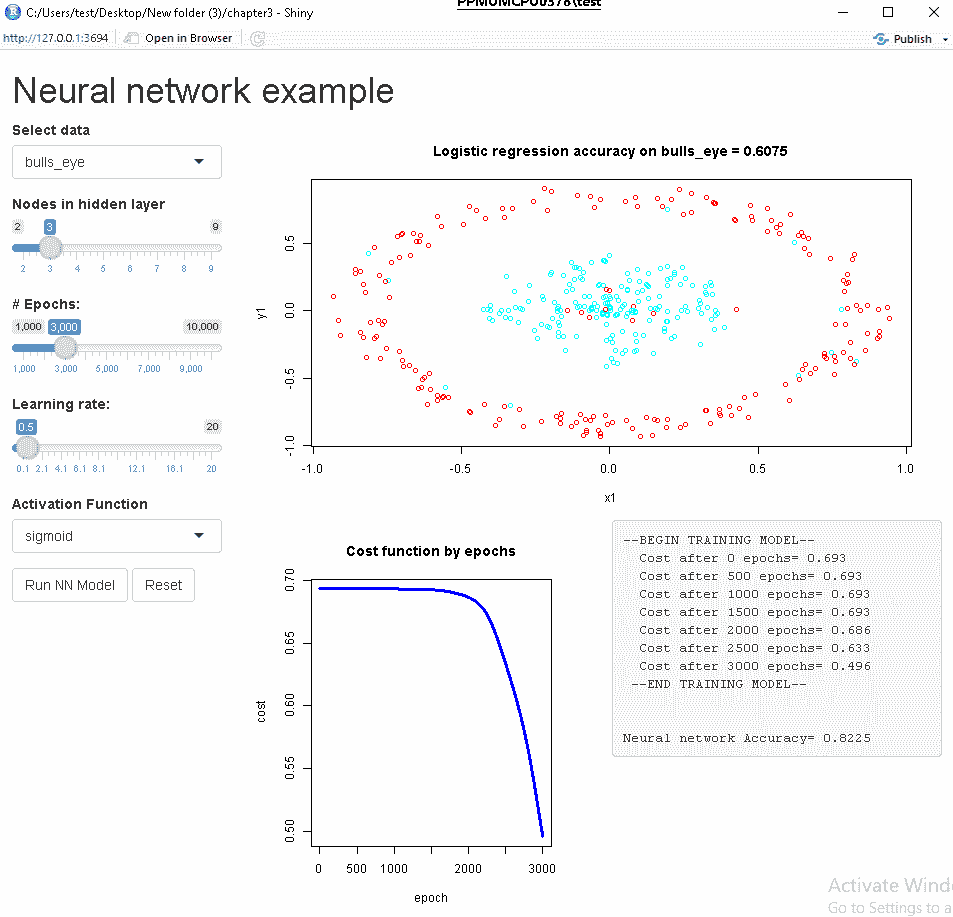

图 3.3：神经网络模型默认设置下的执行

应用程序需要几秒钟时间，然后它会创建一个关于**# Epochs**的成本函数图，并输出随着算法对数据进行迭代而得到的成本函数值。文本输出还包括屏幕右下角的最终准确率。在右下角的诊断信息中，我们可以看到，在训练过程中成本下降，我们达到了 0.825 的最终准确率。成本是模型试图最小化的值——成本越低，准确率越高。由于模型最初很难获得正确的权重，所以成本下降花了一些时间。

在深度学习模型中，权重和偏差不应使用随机值进行初始化。如果使用随机值，可能会导致训练问题，例如梯度消失或梯度爆炸。这是因为权重变得过小或过大，导致模型无法成功训练。另外，如果权重没有正确初始化，模型训练的时间会更长，正如我们之前所看到的。避免这些问题的两种最流行的初始化技术是 Xavier 初始化和 He 初始化（以它们的发明者命名）。

我们可以在*图 3.3*中看到，成本尚未趋于平稳，最后几组数值显示它仍在下降。这表明，如果我们训练模型更长时间，它是可以改进的。将**# Epochs**更改为**7000**，然后再次点击**运行神经网络模型**按钮；屏幕将更改为以下图形：

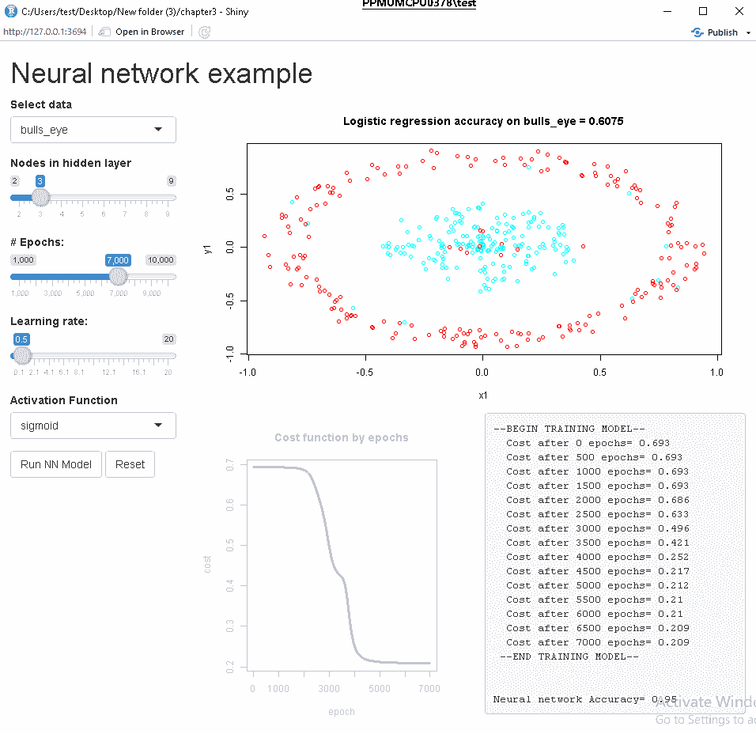

图 3.4：神经网络模型执行（更多的训练周期）

现在我们得到了 0.95 的准确率，这是最大可能的准确率。我们注意到成本值已经平稳（即不再进一步下降），大约为 0.21。这表明即使训练模型更长时间（即更多的迭代次数），结果也可能不会有所改善，无论当前的准确率如何。如果模型尚未充分训练且成本值已经平稳，我们就需要考虑更改模型的架构，或者获取更多的数据来提高准确率。让我们看看如何更改模型中的节点数量。点击重置按钮，将输入值更改为默认值，然后将节点数量更改为 7，点击**运行神经网络模型**按钮。现在屏幕将变为以下内容：

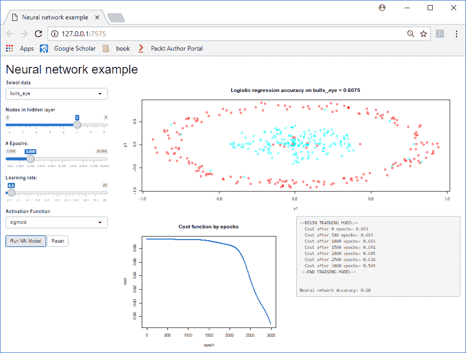

图 3.5：更多节点的神经网络模型执行

这里的准确率是 0.68，但与之前的示例相比，当我们使用相同的输入并且只有三个节点时，结果要差得多！实际上，更多的节点反而使性能更差！这是因为我们的数据模式相对简单，七个节点的模型可能过于复杂，训练时间也更长。向一层中添加更多的节点会增加训练时间，但不一定提高性能。

让我们看看**学习率**。点击**重置**按钮，将输入值更改为默认值，然后将**学习率**更改为大约**5**，然后再次点击**运行神经网络模型**按钮，复现以下屏幕：

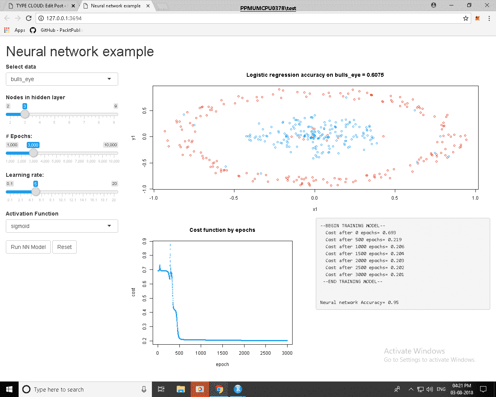

图 3.6：较大学习率的神经网络模型执行

我们再次得到了 0.95 的准确率，这是最好的准确率。如果我们与之前的示例进行比较，可以看到模型*收敛*得更快（即成本函数平稳的时间），仅用了**500**次迭代。我们需要的迭代次数更少，因此可以看到学习率和训练周期数之间存在反比关系。较高的学习率可能意味着你需要更少的训练周期。但更大的学习率总是更好吗？嗯，不是的。

点击**重置**按钮，将输入值更改为默认值，然后将**学习率**更改为最大值（**20**），然后再次点击**运行神经网络模型**按钮。当你这么做时，你将看到类似于以下的输出：

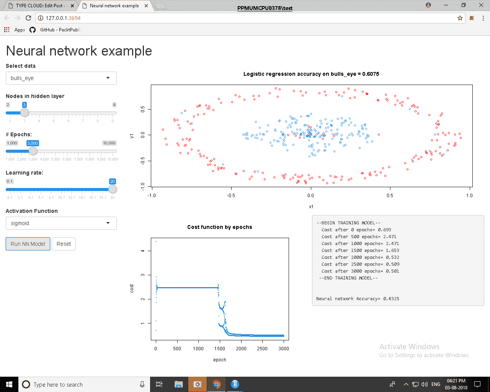

图 3.7：学习率过大的神经网络模型执行

我们得到了 0.83 的准确率。刚刚发生了什么？通过选择一个非常大的学习率，我们的模型根本没有收敛。我们可以看到，成本函数在训练开始时实际上增加了，这表明学习率太高。我们的成本函数图看起来有重复的值，这表明梯度下降算法有时会超过最小值。

最后，我们可以观察激活函数的选择如何影响模型训练。通过更改激活函数，您可能还需要更改**学习率**。点击**重置**按钮，将输入值恢复为默认值，并选择激活函数为`tanh`。当我们选择`tanh`作为激活函数，且学习率为 1.5 时，成本在 500 到 3,500 个 epochs 之间卡在 0.4，随后突然下降到 0.2。这种现象在神经网络中会出现，当网络卡在局部最优解时。这种现象可以通过以下图表看到：

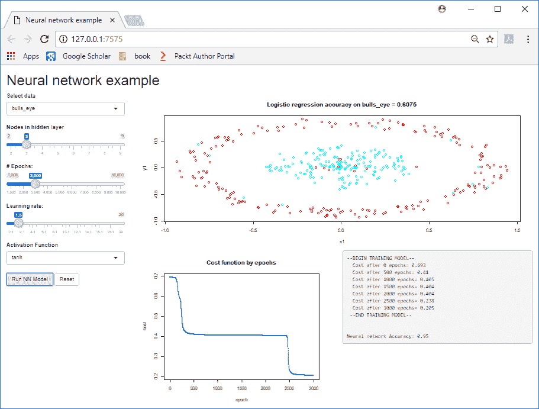

图 3.8：使用 tanh 激活函数的神经网络模型执行

相比之下，使用 relu 激活函数会导致模型训练速度更快。以下是一个示例，我们只运行 1,500 个 epochs，使用 relu 激活函数即可获得最大准确率 0.95：

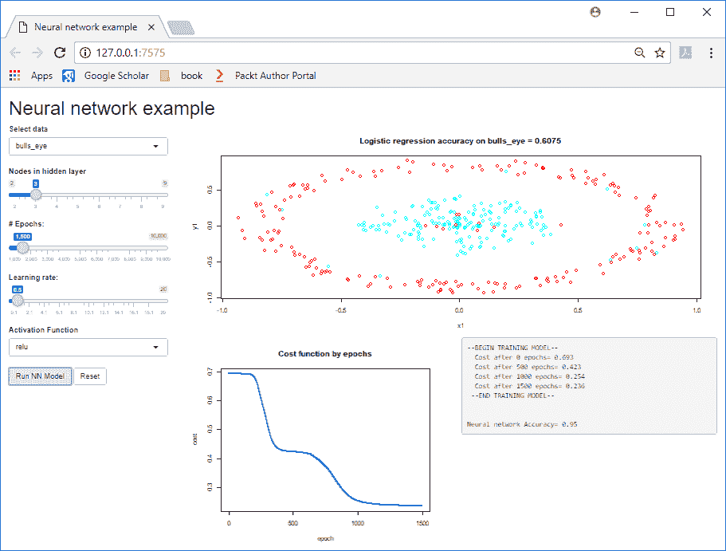

图 3.9：使用 relu 激活函数的神经网络模型执行

我鼓励您尝试其他数据集。作为参考，以下是我在每个数据集上获得的最大准确率。一个有趣的实验是观察不同的激活函数和学习率在这些数据集上的表现：

+   **蠕虫（准确率=0.95）**：3 个节点，3,000 个 epochs，学习率=0.5，激活函数=tanh

+   **月亮（准确率=0.95）**：5 个节点，5,000 个 epochs，学习率=5，激活函数=sigmoid

+   **块（准确率=0.9025）**：5 个节点，5,000 个 epochs，学习率=10，激活函数=sigmoid

一般来说，您将看到以下结果：

+   使用更多的 epochs 意味着更长的训练时间，但这并不总是必要的。

+   如果模型尚未达到最佳准确率，并且成本函数在训练的后期已经趋于平稳（即，变化不大），那么延长训练时间（即更多 epochs）或增加学习率不太可能改善性能。相反，可以考虑更改模型的架构，例如更改层数（在此演示中无法选择）、增加节点数或更改激活函数。

+   学习率必须谨慎选择。如果选择的值太低，模型的训练时间将非常长。如果选择的值太高，模型将无法训练。

# 神经网络代码

虽然 Web 应用程序在查看神经网络输出时非常有用，但我们也可以运行神经网络代码，真正理解它是如何工作的。`Chapter3/nnet.R`中的代码可以实现这一点。此代码具有与 Web 应用程序中相同的超参数；该文件允许您从 RStudio IDE 运行神经网络。以下是加载数据并设置神经网络初始超参数的代码：

```py
source("nnet_functions.R")
data_sel <- "bulls_eye"

........

####################### neural network ######################
hidden <- 3
epochs <- 3000
lr <- 0.5
activation_ftn <- "sigmoid"

df <- getData(data_sel) # from nnet_functions
X <- as.matrix(df[,1:2])
Y <- as.matrix(df$Y)
n_x=ncol(X)
n_h=hidden
n_y=1
m <- nrow(X)
```

这段代码应该不难理解，它加载了一个数据集并设置了一些变量。数据是通过 `Chapter3/nnet_functions.R` 文件中的 `getData` 函数创建的。数据来自 `clustersim` 包中的函数。`Chapter3/nnet_functions.R` 文件包含了我们神经网络的核心功能，我们将在这里详细查看。一旦加载了数据，接下来的步骤是初始化权重和偏置。`hidden` 变量控制隐藏层中的节点数，我们将其设置为 3。我们需要两组权重和偏置，一组用于隐藏层，另一组用于输出层：

```py
# initialise weights
set.seed(42)
weights1 <- matrix(0.01*runif(n_h*n_x)-0.005, ncol=n_x, nrow=n_h)
weights2 <- matrix(0.01*runif(n_y*n_h)-0.005, ncol=n_h, nrow=n_y)
bias1 <- matrix(rep(0,n_h),nrow=n_h,ncol=1)
bias2 <- matrix(rep(0,n_y),nrow=n_y,ncol=1)
```

这将为 `(weights1, bias1)` 隐藏层和 `(weights2, bias2)` 输出层创建矩阵。我们需要确保矩阵的维度是正确的。例如，`weights1` 矩阵的列数应与输入层的列数相同，行数应与隐藏层的行数相同。现在我们继续进行神经网络的实际处理循环：

```py
for (i in 0:epochs)
{
  activation2 <- forward_prop(t(X),activation_ftn,weights1,bias1, weights2,bias2)
  cost <- cost_f(activation2,t(Y))
  backward_prop(t(X),t(Y),activation_ftn,weights1,weights2, activation1,activation2)
  weights1 <- weights1 - (lr * dweights1)
  bias1 <- bias1 - (lr * dbias1)
  weights2 <- weights2 - (lr * dweights2)
  bias2 <- bias2 - (lr * dbias2)

  if ((i %% 500) == 0)
    print (paste(" Cost after",i,"epochs =",cost))
}
[1] " Cost after 0 epochs = 0.693147158995952"
[1] " Cost after 500 epochs = 0.69314587328381"
[1] " Cost after 1000 epochs = 0.693116915341439"
[1] " Cost after 1500 epochs = 0.692486724429629"
[1] " Cost after 2000 epochs = 0.687107068792801"
[1] " Cost after 2500 epochs = 0.660418522655335"
[1] " Cost after 3000 epochs = 0.579832913091798"
```

我们首先运行前向传播函数，然后计算代价。接着，我们调用反向传播步骤来计算我们的导数，`(dweights1, dbias1, dweights2, dbias2)`。然后我们使用学习率 `(lr)` 来更新权重和偏置 `(weights1, bias1, weights2, bias2)`。我们会运行这个循环指定的 `epochs (3000)` 次，并且每 500 次 `epochs` 输出一条诊断消息。这描述了每个神经网络和深度学习模型的工作原理：首先调用前向传播，然后计算代价和导数值，利用这些值通过反向传播更新权重并重复执行。

现在让我们看一下 `nnet_functions.R` 文件中的一些函数。以下是 `forward` 传播函数：

```py
forward_prop <- function(X,activation_ftn,weights1,bias1,weights2,bias2)
{
  # broadcast hack
  bias1a<-bias1
  for (i in 2:ncol(X))
    bias1a<-cbind(bias1a,bias1)
  bias2a<-bias2
  for (i in 2:ncol(activation1))
    bias2a<-cbind(bias2a,bias2)

  Z1 <<- weights1 %*% X + bias1a
  activation1 <<- activation_function(activation_ftn,Z1)
  bias2a<-bias2
  for (i in 2:ncol(activation1))
    bias2a<-cbind(bias2a,bias2)
  Z2 <<- weights2 %*% activation1 + bias2a
  activation2 <<- sigmoid(Z2)
  return (activation2)
}
```

如果你仔细查看代码，可能已经注意到 `activation1`、`activation2`、`Z1` 和 `Z2` 变量的赋值使用了 `<<-` 而不是 `<-`。这使得这些变量在全局范围内有效；我们还希望在反向传播时使用这些值。使用全局变量通常不被推荐，我本可以返回一个列表，但在这里使用它们是可以接受的，因为这个应用是为了学习目的。

这两个 `for` 循环将偏置向量扩展为矩阵，然后将该向量重复 n 次。关键的代码从 `Z1` 赋值开始。`Z1` 是一个矩阵乘法操作，后面跟着一个加法运算。我们对该值调用 `activation_function` 函数。然后，我们使用该输出值并对 `Z2` 执行类似的操作。最后，我们对输出层应用 sigmoid 激活函数，因为我们的问题是二分类问题。

以下是激活函数的代码；第一个参数决定了使用哪种函数（`sigmoid`、`tanh` 或 `relu`）。第二个参数是作为输入的值：

```py
activation_function <- function(activation_ftn,v)
{
  if (activation_ftn == "sigmoid")
    res <- sigmoid(v)
  else if (activation_ftn == "tanh")
    res <- tanh(v)
  else if (activation_ftn == "relu")
  {
    v[v<0] <- 0
    res <- v
  }
  else
    res <- sigmoid(v)
  return (res)
}
```

以下是 `cost` 函数：

```py
cost_f <- function(activation2,Y)
{
  cost = -mean((log(activation2) * Y)+ (log(1-activation2) * (1-Y)))
  return(cost)
}
```

提醒一下，`cost`函数的输出是我们试图最小化的目标。`cost`函数有很多种类型；在这个应用中我们使用的是二元交叉熵。二元交叉熵的公式是*-1/m ∑ log(ȳ[i]) * y[i] + (log(1 -ȳ[i]) * (1-y[i]))*。我们的目标值（*y[i]*）始终是*1*或*0*，因此当*y[i] = 1*时，这就简化为*∑ log(ȳ[i])*。如果我们有两行数据，其中*y[i] = 1*，假设我们的模型对第一行预测*1.0*，对第二行预测*0.0001*，那么这两行的代价分别是*log(1)=0*和*log(0.0001)=-9.1*。我们可以看到，越接近*1*的预测，其`cost`值越低。同样，对于*y[i] = 0*的行，这就简化为*log(1-ȳ[i])*，因此对于这些行，越接近 0 的预测，其`cost`值越低。

如果我们试图最大化准确性，为什么我们不在模型训练过程中直接使用它呢？二元交叉熵是一个更好的`cost`函数，因为我们的模型不仅仅输出 0 或 1，而是输出从 0.0 到 1.0 之间的连续值。例如，如果两个输入行的目标值为 1（即 y=1），而我们的模型给出的概率分别为 0.51 和 0.99，那么二元交叉熵分别会给它们的代价为 0.67 和 0.01。它为第一行分配了更高的代价，因为模型对它不确定（概率接近 0.5）。如果我们仅仅看准确度，我们可能会认为这两行具有相同的代价值，因为它们都被正确分类了（假设我们为预测值<0.5 的分配类=0，预测值>=0.5 的分配类=1）。

以下是反向传播函数的代码：

```py
backward_prop <- function(X,Y,activation_ftn,weights1,weights2,activation1,activation2)
{
  m <- ncol(Y)
  derivative2 <- activation2-Y
  dweights2 <<- (derivative2 %*% t(activation1)) / m
  dbias2 <<- rowSums(derivative2) / m
  upd <- derivative_function(activation_ftn,activation1)
  derivative1 <- t(weights2) %*% derivative2 * upd
  dweights1 <<- (derivative1 %*% t(X)) / m
  dbias1 <<- rowSums(derivative1) / m
}
```

反向传播按相反方向处理网络，从最后一层隐层开始，直到第一层隐层，也就是说，从输出层到输入层的方向。在我们的情况下，我们只有一层隐层，因此它首先计算来自输出层的损失，并计算`dweight2`和`dbias2`。然后它计算`activation1`值的`derivative`，这个值是在前向传播步骤中计算出来的。`derivative`函数类似于激活函数，但它不是调用激活函数，而是计算该函数的`derivative`。例如，`sigmoid(x)`的`derivative`是*sigmoid(x)*(1 - sigmoid(x))*。简单函数的`derivative`值可以在任何微积分参考书或在线找到：

```py
derivative_function <- function(activation_ftn,v)
{
  if (activation_ftn == "sigmoid")
   upd <- (v * (1 - v))
  else if (activation_ftn == "tanh")
   upd <- (1 - (v²))
  else if (activation_ftn == "relu")
   upd <- ifelse(v > 0.0,1,0)
  else
   upd <- (v * (1 - v))
  return (upd)
}
```

就是这样！一个使用基础 R 代码工作的神经网络。它可以拟合复杂的函数，并且表现得比逻辑回归更好。你可能不会一次性理解所有的部分，没关系。以下是步骤的简要回顾：

1.  进行一次前向传播步骤，这包括对每一层的输入乘以权重，并将输出传递给下一层。

1.  使用`cost`函数评估最终层的输出。

1.  根据错误率，使用反向传播对每一层中节点的权重进行小幅调整。学习率控制每次调整的幅度。

1.  重复步骤 1-3，可能成千上万次，直到 `cost` 函数开始趋于平稳，这表明我们的模型已被训练好。

# 回到深度学习

前一部分的许多概念适用于深度学习，因为深度学习只是具有两个或更多隐藏层的神经网络。为了演示这一点，让我们看看以下在 R 中加载 `mxnet` 深度学习库并调用该库中训练深度学习模型的函数帮助命令的代码。尽管我们尚未使用此库训练任何模型，但我们已经看到该函数中的许多参数：

```py
library(mxnet)
?mx.model.FeedForward.create
```

如果出现错误提示 `mxnet` 包不可用，请参见 第一章，*深度学习入门*，获取安装说明。然而，我们在本章中并未运行任何 `mxnet` 代码，我们只想展示某个函数的帮助页面。所以请放心继续阅读，等到下章我们使用该库时再进行安装。

这将显示 `mxnet` 库中 `FeedForward` 函数的帮助页面，这是前向传播/模型训练函数。`mxnet` 和大多数深度学习库没有特定的 *反向*传播函数，它们会隐式地处理这一过程：

```py
mx.model.FeedForward.create(symbol, X, y = NULL, ctx = NULL,
 begin.round = 1, num.round = 10, optimizer = "sgd",
 initializer = mx.init.uniform(0.01), eval.data = NULL,
 eval.metric = NULL, epoch.end.callback = NULL,
 batch.end.callback = NULL, array.batch.size = 128
 ...)
```

我们将在后续章节中看到更多此函数的内容；目前我们仅关注其参数。

# `symbol`、X、y 和 `ctx` 参数

`symbol` 参数定义了深度学习架构；X 和 y 是输入和输出数据结构。`ctx` 参数控制模型在特定设备（例如 CPU/GPU）上进行训练。

# `num.round` 和 `begin.round` 参数

`num.round` 相当于我们代码中的 epochs；也就是我们迭代数据的次数。`begin.round` 是我们如果暂停训练时，恢复训练的起始点。如果我们暂停了训练，可以保存部分训练好的模型，稍后重新加载并继续训练。

# `optimizer` 参数

我们的神经网络实现使用了梯度下降。当研究人员开始创建更复杂的多层神经网络模型时，他们发现训练时间异常长。这是因为没有优化的基本梯度下降算法效率不高；它在每个 epoch 中朝着目标迈出小步，无论前几个 epoch 发生了什么。我们可以将其与猜数字游戏进行比较：一个人必须在一个范围内猜一个数字，每次猜测后，他们会被告知是往上还是往下（假设他们没有猜对！）。高/低的指示类似于导数值，它指示了我们必须前进的方向。现在，假设可能的数字范围是 1 到 1,000,000，第一个猜测是 1,000。这个人被告知要往上猜，他们应该做什么：

+   尝试 1001。

+   计算猜测值和最大值的差，然后除以 2。将这个值加到之前的猜测值上。

第二种选择要好得多，应该意味着这个人在 20 次猜测内能得到正确答案。如果你有计算机科学背景，你可能会认出这是二分查找算法。第一种选择，猜 1,001，1,002，....，1,000,000，是一个糟糕的选择，可能会失败，因为一方会放弃！但这与梯度下降的工作方式相似。它逐步朝着目标前进。如果你尝试增加学习率来解决这个问题，可能会超过目标，导致模型无法收敛。

研究人员提出了一些聪明的优化方法来加速训练。第一个优化器被称为动量，它正如其名字所示。它查看导数的大小，如果前面的步骤都在同一方向，它会在每个 epoch 中采取更大的*步伐*。这应该意味着模型训练会更快。还有一些其他算法是这些算法的增强版，比如 RMS-Prop 和 Adam。你通常不需要了解它们的工作原理，只需要知道，当你更换优化器时，可能还需要调整其他超参数，比如学习率。一般来说，可以参考别人做过的例子，复制那些超参数。

实际上，我们在上一章的示例中使用了其中一种优化器。在那一章中，我们有两个具有相似架构的模型（40 个隐藏节点）。第一个模型（`digits.m3`）使用了`nnet`库，训练时间为 40 分钟。第二个模型（`digits.m3`）使用了弹性反向传播，训练时间为 3 分钟。这展示了在神经网络和深度学习中使用优化器的好处。

# 初始化参数

当我们为权重和偏置（即模型参数）创建初始值时，我们使用了随机数，但将它们限制在 -0.005 到 +0.005 之间。如果你回顾一下 `cost` 函数的一些图形，你会发现 `cost` 函数开始下降时需要 2,000 轮训练。这是因为初始值不在正确的范围内，花了 2,000 轮训练才达到正确的幅度。幸运的是，我们不需要担心如何设置这些参数，因为 `mxnet` 库中的该参数控制了在训练之前如何初始化权重和偏置。

# `eval.metric` 和 `eval.data` 参数

这两个参数控制用于评估模型的数据和度量标准。`eval.metric` 相当于我们代码中使用的 `cost` 函数。`eval.data` 用于当你想要在未用于训练的验证数据集上评估模型时。

# `epoch.end.callback` 参数

这是一个 `callback` 函数，允许你注册另一个函数，该函数会在 *n* 轮训练后被调用。深度学习模型的训练时间通常较长，因此你需要一些反馈来确保模型正常工作！你可以编写自定义的 `callback` 函数来执行所需的操作，但通常它会在 *n* 轮训练后输出到屏幕或日志。这相当于我们在神经网络中每 *500* 轮训练时打印诊断信息的代码。`callback` 函数还可以用来将模型保存到磁盘，例如，如果你想在模型开始过拟合之前保存模型。

# `array.batch.size` 参数

我们的数据中只有 400 个实例（行），这可以轻松地适应内存。然而，如果你的输入数据有数百万个实例，则在训练过程中需要将数据分批，以便能适应 CPU/GPU 的内存。你一次训练的实例数量就是批量大小。请注意，你仍然需要对所有数据进行迭代以完成指定轮次，你只是将数据分成多个批次，在每次迭代中将每个批次用于正向传播和反向传播步骤。例如，如果你有 100 个实例，并选择批量大小为 *32*，训练 *6* 轮，你每轮需要 *4* 个批次（*100/32 = 3.125*，因此我们需要 *4* 个批次来处理所有数据），总共需要 *24* 次循环。

选择批量大小时存在一个权衡。如果你选择的值过小，模型的训练时间会更长，因为它需要进行更多的操作，而且由于批量较小，每个批次的数据会有更多的波动。你也不能选择一个过大的批量大小，这可能会导致模型崩溃，因为它将过多的数据加载到 CPU 或 GPU 中。在大多数情况下，你要么使用另一个深度学习模型中的合理默认值，要么设置一个值（例如，1,024），如果模型崩溃，再尝试将其值减半（例如，512）。

**批次大小**、**学习率**和**# 训练周期**之间存在一定的关系。但在选择这些值时，并没有硬性规定。然而，通常建议一起调整这些值，并且避免使用某一超参数的极端值。例如，选择较大的学习率通常意味着训练周期较少，但如果批次大小过小，模型可能无法训练成功。最好的建议是查看类似的架构，选择一组相似的值和范围。

现在我们已经看到，深度学习仍然使用许多神经网络中的概念，我们将继续讨论一个你在每个深度学习模型中都可能遇到的重要问题：过拟合。

# 使用正则化来克服过拟合

在上一章中，我们看到神经网络在进一步训练迭代中的回报逐渐递减，尤其是在对持出数据或测试数据（即未用于训练模型的数据）进行预测时。这是因为复杂的模型可能会记住数据中的一些噪音，而不是学习到一般的模式。这些模型在预测新数据时表现会更差。我们可以应用一些方法来让模型具备更强的泛化能力，也就是说，能够拟合整体的模式。这些方法被称为**正则化**，旨在减少测试误差，使得模型在新数据上表现良好。

深度学习中最常用的正则化技术是 dropout（丢弃法）。然而，我们还将讨论另外两种在回归和深度学习中有应用基础的正则化技术。这两种正则化技术分别是**L1 惩罚**，也叫做**Lasso**，和**L2 惩罚**，也叫做**Ridge**。

# L1 惩罚

**L1 惩罚**（也称为**最小绝对收缩与选择算子**，**Lasso**–Hastie, T.，Tibshirani, R. 和 Friedman, J.（2009））的基本概念是，通过惩罚项将权重收缩到零。惩罚项使用的是权重的绝对值之和，因此一些权重可能会被收缩为零。这意味着 Lasso 也可以作为一种变量选择方法。惩罚项的强度由一个超参数 alpha（λ）控制，它会乘以绝对权重之和，alpha 可以是一个固定值，或者像其他超参数一样，通过交叉验证或类似方法来优化。

如果使用**普通最小二乘法**（**OLS**）回归模型来描述 Lasso，会更加直观。在回归中，使用最小二乘误差准则来估计一组系数或模型权重，其中权重/系数向量*Θ*通过最小化*∑(y[i] - ȳ[i])*来估计，其中*ȳ[i]=b+Θx*，*y[i]*是我们要预测的目标值，*ȳ[i]*是预测值。Lasso 回归在此基础上增加了一个惩罚项，它尝试最小化∑(y[i] - ȳ[i]) + λ⌊Θ⌋，其中⌊Θ⌋是*Θ*的绝对值。通常，截距项或偏置项会被排除在这个约束之外。

Lasso 回归有一些实际的影响。首先，惩罚的效果取决于权重的大小，而权重的大小又取决于数据的尺度。因此，数据通常会先进行标准化，使其方差为单位方差（或者至少使每个变量的方差相等）。L1 惩罚倾向于将小的权重缩小到零（有关此现象的解释，见 Hastie, T.，Tibshirani, R.和 Friedman, J.（2009））。如果你只考虑 L1 惩罚留下非零权重的变量，它实际上可以作为特征选择。L1 惩罚将小系数缩小到零的趋势，也有助于简化模型结果的解释。

对神经网络应用 L1 惩罚的方式与回归中的应用完全相同。如果*X*代表输入，*Y*是输出或因变量，*B*是参数，*F*是目标函数，我们希望通过优化目标函数*F(B; X, Y)*来获得*B*，即我们要最小化*F(B; X, Y)*。L1 惩罚会修改目标函数为 F(B; X, Y) + λ⌊Θ⌋，其中*Θ*代表权重（通常忽略偏置项）。L1 惩罚倾向于产生稀疏解（即更多的零权重），因为小的和较大的权重会产生相同的惩罚，因此在每次梯度更新时，权重会朝零移动。

我们只考虑了*λ*为常量的情况，这控制着惩罚或正则化的程度。然而，在深度神经网络中，可以设置不同的值，其中可以对不同的层应用不同程度的正则化。考虑这种差异化正则化的一个原因是，有时希望允许更多的参数（比如在某一层增加更多的神经元），然后通过更强的正则化来抵消这种增加。然而，如果我们允许 L1 惩罚在深度神经网络的每一层都变化，并使用交叉验证来优化 L1 惩罚的所有可能组合，这种方法可能会非常耗费计算资源。因此，通常在整个模型中使用一个单一的值。

# L1 惩罚的应用

为了观察 L1 惩罚是如何工作的，我们可以使用一个模拟的线性回归问题。本章其余部分的代码在`Chapter3/overfitting.R`中。我们使用一组相关的预测变量来模拟数据：

```py
set.seed(1234)
X <- mvrnorm(n = 200, mu = c(0, 0, 0, 0, 0),
  Sigma = matrix(c(
    1, .9999, .99, .99, .10,
    .9999, 1, .99, .99, .10,
    .99, .99, 1, .99, .10,
    .99, .99, .99, 1, .10,
    .10, .10, .10, .10, 1
  ), ncol = 5))
y <- rnorm(200, 3 + X %*% matrix(c(1, 1, 1, 1, 0)), .5)
```

接下来，我们可以将 OLS 回归模型拟合到前 100 个案例，然后使用 `lasso`。为了使用 `lasso`，我们需要使用 `glmnet` 包中的 `glmnet()` 函数。这个函数实际上可以拟合 L1 或 L2 惩罚（将在下一节讨论），哪种惩罚取决于参数 alpha。当 `alpha = 1` 时，它是 L1 惩罚（即 `lasso`），而当 `alpha = 0` 时，它是 L2 惩罚（即岭回归）。此外，由于我们不知道应该选择哪个 `lambda` 值，我们可以评估多个选项，并使用交叉验证自动调整这个超参数，这就是 `cv.glmnet()` 函数。然后，我们可以绘制 `lasso` 对象，查看不同 `lambda` 值下的均方误差，以便选择合适的正则化水平：

```py
m.ols <- lm(y[1:100] ~ X[1:100, ])
m.lasso.cv <- cv.glmnet(X[1:100, ], y[1:100], alpha = 1)
plot(m.lasso.cv)
```

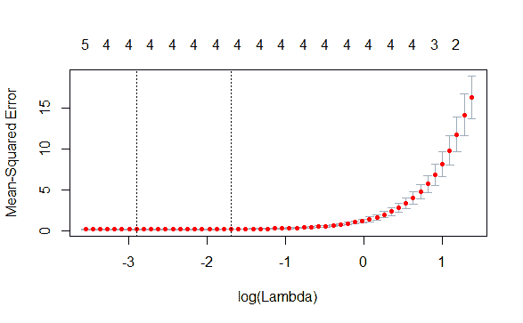

图 3.10：Lasso 正则化

从图中我们可以看到，当惩罚过高时，交叉验证模型的误差增加。实际上，`lasso` 在非常低的 lambda 值下表现较好，这可能表明对于这个数据集，`lasso` 对于提升样本外表现/泛化能力并没有太大帮助。为了这个示例，我们将继续，但在实际应用中，这可能会让我们停下来思考 `lasso` 是否真的起到了帮助作用。最后，我们可以将系数与 `lasso` 的结果进行比较：

```py
cbind(OLS = coef(m.ols),Lasso = coef(m.lasso.cv)[,1])
               OLS Lasso
(Intercept)  2.958  2.99
X[1:100, ]1 -0.082  1.41
X[1:100, ]2  2.239  0.71
X[1:100, ]3  0.602  0.51
X[1:100, ]4  1.235  1.17
X[1:100, ]5 -0.041  0.00
```

注意到 OLS 系数更为嘈杂，而且在 `lasso` 中，第 5 个预测变量被惩罚到 0。回顾一下模拟数据，真实的系数是 3, 1, 1, 1, 1 和 0。OLS 的估计值对于第一个预测变量过低，对于第二个预测变量过高，而 `lasso` 对每个系数的估计值更为准确。这表明，`lasso` 回归比 OLS 回归在这个数据集上的泛化能力更强。

# L2 惩罚

**L2 惩罚**，也称为 **岭回归**，在许多方面与 L1 惩罚相似，但与基于绝对权重和惩罚的 L1 惩罚不同，L2 惩罚是基于权重的平方。这意味着较大的绝对权重会受到更大的惩罚。在神经网络的背景下，这有时被称为权重衰减。如果你检查正则化目标函数的梯度，你会发现有一个惩罚项，在每次更新时，权重会受到乘法惩罚。至于 L1 惩罚，尽管可以包括它，但通常会将偏置或偏移量排除在外。

从线性回归问题的角度来看，L2 惩罚是对最小化目标函数的一种修改，修改的形式是从 *∑(y[i] - ȳ[i])* 到 *∑(y[i] - ȳ[i]) + λΘ²*。

# L2 惩罚的应用

为了观察 L2 惩罚项的作用，我们可以使用与 L1 惩罚项相同的模拟线性回归问题。为了拟合岭回归模型，我们使用来自`glmnet`包的`glmnet()`函数。如前所述，该函数实际上可以拟合 L1 或 L2 惩罚项，哪种惩罚项取决于参数 alpha。当`alpha = 1`时，拟合的是`lasso`，而当`alpha = 0`时，拟合的是岭回归。这次我们选择`alpha = 0`。同样，我们评估一系列 lambda 选项，并通过交叉验证自动调节该超参数。通过使用`cv.glmnet()`函数来实现这一点。我们绘制岭回归对象，查看不同 lambda 值下的误差：

```py
m.ridge.cv <- cv.glmnet(X[1:100, ], y[1:100], alpha = 0)
plot(m.ridge.cv)
```

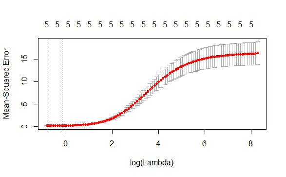

图 3.11：岭正则化

尽管形状与`lasso`不同，因为在更高的 lambda 值下误差似乎趋于平稳，但仍然可以明显看出，当惩罚项过高时，交叉验证的模型误差会增加。与`lasso`类似，岭回归模型在非常低的 lambda 值下似乎表现不错，这可能表明 L2 惩罚并未显著改善模型的外部样本表现/泛化能力。

最后，我们可以将 OLS 系数与`lasso`和岭回归模型的系数进行比较：

```py
> cbind(OLS = coef(m.ols),Lasso = coef(m.lasso.cv)[,1],Ridge = coef(m.ridge.cv)[,1])
               OLS Lasso   Ridge
(Intercept)  2.958  2.99  2.9919
X[1:100, ]1 -0.082  1.41  0.9488
X[1:100, ]2  2.239  0.71  0.9524
X[1:100, ]3  0.602  0.51  0.9323
X[1:100, ]4  1.235  1.17  0.9548
X[1:100, ]5 -0.041  0.00 -0.0023
```

尽管岭回归没有将第五个预测变量的系数压缩到精确为 0，但它比 OLS 中的系数要小，而且其余的参数都稍微被收缩，但仍然接近它们的真实值：3，1，1，1，1 和 0。

# 权重衰减（神经网络中的 L2 惩罚）

我们在上一章中已经无意间使用了正则化。我们使用`caret`和`nnet`包训练的神经网络使用了`0.10`的权重衰减。我们可以通过变化该衰减值并使用交叉验证进行调优来进一步研究权重衰减的使用：

1.  如之前一样加载数据。然后我们创建一个本地集群来并行运行交叉验证：

```py
set.seed(1234)
## same data as from previous chapter
if (!file.exists('../data/train.csv'))
{
  link <- 'https://apache-mxnet.s3-accelerate.dualstack.amazonaws.com/R/data/mnist_csv.zip'
  if (!file.exists(paste(dataDirectory,'/mnist_csv.zip',sep="")))
    download.file(link, destfile = paste(dataDirectory,'/mnist_csv.zip',sep=""))
  unzip(paste(dataDirectory,'/mnist_csv.zip',sep=""), exdir = dataDirectory)
  if (file.exists(paste(dataDirectory,'/test.csv',sep="")))
    file.remove(paste(dataDirectory,'/test.csv',sep=""))
}

digits.train <- read.csv("../data/train.csv")

## convert to factor
digits.train$label <- factor(digits.train$label, levels = 0:9)

sample <- sample(nrow(digits.train), 6000)
train <- sample[1:5000]
test <- sample[5001:6000]

digits.X <- digits.train[train, -1]
digits.y <- digits.train[train, 1]
test.X <- digits.train[test, -1]
test.y <- digits.train[test, 1]

## try various weight decays and number of iterations
## register backend so that different decays can be
## estimated in parallel
cl <- makeCluster(5)
clusterEvalQ(cl, {source("cluster_inc.R")})
registerDoSNOW(cl)
```

1.  在数字分类任务上训练一个神经网络，并将权重衰减惩罚分别设置为`0`（无惩罚）和`0.10`。我们还分别使用两组迭代次数：`100`次或`150`次。请注意，这段代码计算量较大，运行需要一些时间：

```py
set.seed(1234)
digits.decay.m1 <- lapply(c(100, 150), function(its) {
  caret::train(digits.X, digits.y,
           method = "nnet",
           tuneGrid = expand.grid(
             .size = c(10),
             .decay = c(0, .1)),
           trControl = caret::trainControl(method="cv", number=5, repeats=1),
           MaxNWts = 10000,
           maxit = its)
})
```

1.  检查结果时，我们看到，当我们限制迭代次数为`100`时，无论是非正则化模型还是正则化模型，基于交叉验证的结果，其准确率均为`0.56`，对于这些数据来说并不是很理想：

```py
digits.decay.m1[[1]]
Neural Network 

5000 samples
 784 predictor
  10 classes: '0', '1', '2', '3', '4', '5', '6', '7', '8', '9' 

No pre-processing
Resampling: Cross-Validated (5 fold) 
Summary of sample sizes: 4000, 4001, 4000, 3998, 4001 
Resampling results across tuning parameters:

  decay  Accuracy   Kappa
    0.0     0.56    0.51 
    0.1     0.56    0.51 

Tuning parameter 'size' was held constant at a value of 10
Accuracy was used to select the optimal model using the
 largest value.
The final values used for the model were size = 10 and decay = 0.1.
```

1.  使用`150`次迭代来检查模型，看看正则化模型和非正则化模型哪个表现更好：

```py
digits.decay.m1[[2]]
Neural Network 

5000 samples
 784 predictor
  10 classes: '0', '1', '2', '3', '4', '5', '6', '7', '8', '9' 

No pre-processing
Resampling: Cross-Validated (5 fold) 
Summary of sample sizes: 4000, 4002, 3998, 4000, 4000 
Resampling results across tuning parameters:

  decay  Accuracy   Kappa
    0.0      0.64    0.60 
    0.1      0.63    0.59 

Tuning parameter 'size' was held constant at a value of 10
Accuracy was used to select the optimal model using the
 largest value.
The final values used for the model were size = 10 and decay = 0.
```

总体来说，具有更多迭代次数的模型在表现上优于具有较少迭代次数的模型，无论是否进行正则化。然而，比较这两种均为 150 次迭代的模型时，正则化模型（`准确率 = 0.66`）优于非正则化模型（`准确率 = 0.65`），尽管两者之间的差异相对较小。

这些结果突出了正则化通常对于那些具有更大灵活性、能够拟合（并过拟合）数据的复杂模型最为有用。在那些对于数据来说合适或过于简单的模型中，正则化可能会降低性能。在开发新模型架构时，应该避免在模型尚未在训练数据上表现良好之前加入正则化。如果在提前加入正则化并且模型在训练数据上的表现较差，你将无法判断问题是出在模型架构上，还是正则化的影响。接下来的章节将讨论集成和模型平均技术，这是本书中突出的最后一种正则化形式。

# 集成和模型平均

另一种正则化方法是创建多个模型（集成），并将它们结合起来，比如通过模型平均或其他某种结合单个模型结果的算法。使用集成技术在机器学习中有着丰富的历史，比如袋装法、提升法和随机森林等方法都采用了这一技术。其基本思想是，如果你使用训练数据构建不同的模型，每个模型在预测值上会有不同的误差。当一个模型预测的值过高时，另一个模型可能预测的值过低，而当将这些模型的结果进行平均时，一些误差会相互抵消，从而得到比单独模型更准确的预测。

集成方法的关键在于，不同的模型必须在其预测结果中有一定的变异性。如果不同模型的预测结果高度相关，那么使用集成技术将不会有益。如果不同模型的预测结果之间相关性非常低，那么平均值将更加准确，因为它能够融合每个模型的优点。以下代码给出了一个使用模拟数据的示例。这个小示例通过仅仅三个模型来说明这一点：

```py
## simulated data
set.seed(1234)
d <- data.frame(
 x = rnorm(400))
d$y <- with(d, rnorm(400, 2 + ifelse(x < 0, x + x², x + x².5), 1))
d.train <- d[1:200, ]
d.test <- d[201:400, ]

## three different models
m1 <- lm(y ~ x, data = d.train)
m2 <- lm(y ~ I(x²), data = d.train)
m3 <- lm(y ~ pmax(x, 0) + pmin(x, 0), data = d.train)

## In sample R2
cbind(M1=summary(m1)$r.squared,
 M2=summary(m2)$r.squared,M3=summary(m3)$r.squared)
       M1  M2   M3
[1,] 0.33 0.6 0.76
```

我们可以看到，每个模型的预测值，至少在训练数据上，变化非常大。评估训练数据中拟合值之间的相关性也有助于指出模型预测之间的重叠程度：

```py
cor(cbind(M1=fitted(m1),
 M2=fitted(m2),M3=fitted(m3)))
     M1   M2   M3
M1 1.00 0.11 0.65
M2 0.11 1.00 0.78
M3 0.65 0.78 1.00
```

接下来，我们为测试数据生成预测值、预测值的平均值，并再次将预测值与测试数据中的实际值进行相关性分析：

```py
## generate predictions and the average prediction
d.test$yhat1 <- predict(m1, newdata = d.test)
d.test$yhat2 <- predict(m2, newdata = d.test)
d.test$yhat3 <- predict(m3, newdata = d.test)
d.test$yhatavg <- rowMeans(d.test[, paste0("yhat", 1:3)])

## correlation in the testing data
cor(d.test)
             x     y  yhat1  yhat2 yhat3 yhatavg
x        1.000  0.44  1.000 -0.098  0.60    0.55
y        0.442  1.00  0.442  0.753  0.87    0.91
yhat1    1.000  0.44  1.000 -0.098  0.60    0.55
yhat2   -0.098  0.75 -0.098  1.000  0.69    0.76
yhat3    0.596  0.87  0.596  0.687  1.00    0.98
yhatavg  0.552  0.91  0.552  0.765  0.98    1.00
```

从结果可以看出，三种模型预测的平均值表现优于任何单独的模型。然而，这并非总是如此；一个表现好的模型可能会比平均预测值表现得更好。一般来说，最好检查被平均的模型在训练数据上是否表现相似。第二个教训是，给定具有相似表现的模型，最好让模型预测之间的相关性较低，因为这将产生表现最好的平均值。

还有其他形式的集成方法，它们被包含在其他机器学习算法中，例如，bagging 和 boosting。Bagging 被用于随机森林中，其中生成了许多模型，每个模型都有不同的数据样本。这些模型故意被设计成小型、不完全的模型。通过对大量使用数据子集的、训练不足的模型的预测结果进行平均，我们应该能得到一个更强大的模型。boosting 的一个例子是梯度提升模型（GBMs），它也使用多个模型，但这次每个模型都专注于在前一个模型中被错误预测的实例。随机森林和 GBMs 在结构化数据中已被证明非常成功，因为它们能够减少方差，即避免过拟合数据。

在深度神经网络中，bagging 和模型平均使用得不太频繁，因为训练每个模型的计算成本可能相当高，因此重复这一过程在时间和计算资源上变得非常昂贵。尽管如此，在深度神经网络中仍然可以使用模型平均，尽管可能只是在少数几个模型中进行，而不是像随机森林和其他一些方法中那样使用数百个模型。

# 用例 – 使用 dropout 改进样本外模型的表现

Dropout 是一种新颖的正则化方法，对于大型复杂的深度神经网络尤其有价值。关于在深度神经网络中使用 dropout 的更详细探讨，请参见 Srivastava, N., Hinton, G., Krizhevsky, A., Sutskever, I., 和 Salakhutdinav, R. (2014)。dropout 背后的概念实际上非常简单。在模型训练过程中，单位（例如，输入和隐藏神经元）会以一定的概率被丢弃，连同它们的所有输入输出连接一同丢弃。

例如，下面的图示是一个示例，展示了在训练过程中，对于每个训练周期，隐藏神经元及其连接以 1/3 的概率被丢弃时可能发生的情况。一旦一个节点被丢弃，它与下一层的连接也会被丢弃。在下图中，灰色的节点和虚线连接表示被丢弃的部分。需要注意的是，被丢弃的节点选择在每个训练周期都会发生变化：

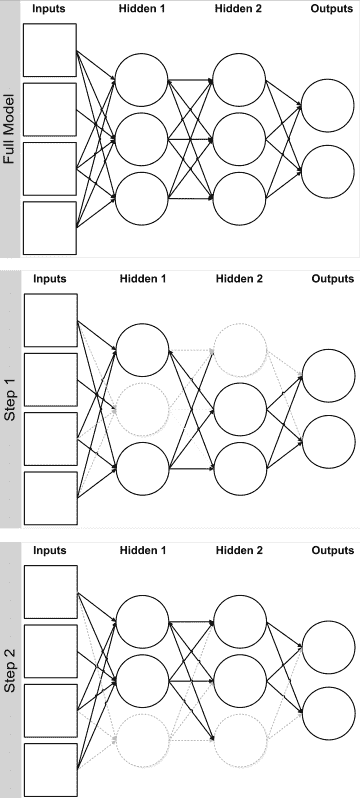

图 3.12：在不同的训练周期中应用 dropout 到一个层

思考 dropout 的一种方式是，它迫使模型对扰动更加鲁棒。虽然完整模型中包含了许多神经元，但在训练过程中并非所有神经元都会同时存在，因此神经元必须比平时更独立地运作。另一种看待 dropout 的方式是，如果你有一个包含 N 个权重的大型模型，并且在训练过程中有 50% 的权重被丢弃，那么虽然所有 N 个权重在训练的某些阶段都会被使用，但你实际上将总模型复杂度减少了一半，因为平均权重数量将减少一半。这减少了模型的复杂度，因此有助于防止数据的过拟合。由于这一特性，Srivastava, N., Hinton, G., Krizhevsky, A., Sutskever, I., 和 Salakhutdinov, R. (2014) 推荐通过 1/p 来放大目标模型的复杂度，以便最终得到一个大致相同复杂度的模型。

在模型测试/评分时，通常不会丢弃神经元，因为这在计算上不方便。相反，我们可以使用一种近似平均值，通过根据每个权重被包含的概率（即 1/p）对单个神经网络的权重进行缩放。这通常由深度学习库处理。

除了效果良好外，这种近似的权重重缩放是一个相对简单的计算。因此，dropout 的主要计算成本来自于必须使用一个包含更多神经元和权重的模型，因为在每次训练更新中，会丢弃很多（通常推荐隐藏神经元的丢弃比例为 50%）。

虽然 dropout 很容易实现，但可能需要一个更大的模型来进行补偿。为了加速训练，可以使用更高的学习率，从而减少所需的训练轮数。结合这些方法的一个潜在缺点是，由于神经元减少和学习率加快，某些权重可能会变得非常大。幸运的是，可以将 dropout 与其他正则化方法结合使用，例如 L1 或 L2 惩罚。综合来看，结果是一个更大的模型，它能够快速（通过更快的学习率）探索更广泛的参数空间，但通过 dropout 和惩罚进行正则化，以保持权重在合理范围内。

为了展示 dropout 在神经网络中的应用，我们将回到**修改版国家标准与技术研究院**（**MNIST**）数据集（我们在第二章，*训练预测模型*中下载过该数据集）进行操作。我们将使用来自`deepnet`包的`nn.train()`函数，因为它支持 dropout。与前一章一样，我们将并行运行四个模型，以减少所需时间。具体来说，我们比较了四个模型，其中两个使用 dropout 正则化，两个不使用 dropout 正则化，且每个模型有 40 或 80 个隐藏神经元。对于 dropout，我们分别为隐藏层和可见单元指定不同的 dropout 比例。根据经验法则，大约 50% 的隐藏单元（和 80% 的观察单元）应被保留，我们分别将 dropout 比例指定为 `0.5` 和 `0.2`：

```py
## Fit Models
nn.models <- foreach(i = 1:4, .combine = 'c') %dopar% {
set.seed(1234)
 list(nn.train(
    x = as.matrix(digits.X),
    y = model.matrix(~ 0 + digits.y),
    hidden = c(40, 80, 40, 80)[i],
    activationfun = "tanh",
    learningrate = 0.8,
    momentum = 0.5,
    numepochs = 150,
    output = "softmax",
    hidden_dropout = c(0, 0, .5, .5)[i],
    visible_dropout = c(0, 0, .2, .2)[i]))
}
```

接下来，我们可以遍历模型，获取预测值并评估整体模型的性能：

```py
nn.yhat <- lapply(nn.models, function(obj) {
 encodeClassLabels(nn.predict(obj, as.matrix(digits.X)))
 })
perf.train <- do.call(cbind, lapply(nn.yhat, function(yhat) {
 caret::confusionMatrix(xtabs(~ I(yhat - 1) + digits.y))$overall
 }))
colnames(perf.train) <- c("N40", "N80", "N40_Reg", "N80_Reg")
options(digits = 4)
perf.train
                   N40     N80 N40_Reg N80_Reg
Accuracy        0.9478  0.9622  0.9278  0.9400
Kappa           0.9420  0.9580  0.9197  0.9333
AccuracyLower   0.9413  0.9565  0.9203  0.9331
AccuracyUpper   0.9538  0.9673  0.9348  0.9464
AccuracyNull    0.1126  0.1126  0.1126  0.1126
AccuracyPValue  0.0000  0.0000  0.0000  0.0000
McnemarPValue      NaN     NaN     NaN     NaN
```

在评估样本内训练数据时，似乎没有正则化的模型表现优于有正则化的模型。当然，真正的考验来自于测试数据或保留数据：

```py
nn.yhat.test <- lapply(nn.models, function(obj) {
 encodeClassLabels(nn.predict(obj, as.matrix(test.X)))
 })

perf.test <- do.call(cbind, lapply(nn.yhat.test, function(yhat) {
 caret::confusionMatrix(xtabs(~ I(yhat - 1) + test.y))$overall
 }))
colnames(perf.test) <- c("N40", "N80", "N40_Reg", "N80_Reg")

perf.test
                   N40     N80 N40_Reg N80_Reg
Accuracy        0.8890  0.8520  0.8980  0.9030
Kappa           0.8765  0.8352  0.8864  0.8920
AccuracyLower   0.8679  0.8285  0.8776  0.8830
AccuracyUpper   0.9078  0.8734  0.9161  0.9206
AccuracyNull    0.1180  0.1180  0.1180  0.1180
AccuracyPValue  0.0000  0.0000  0.0000  0.0000
McnemarPValue      NaN     NaN     NaN     NaN
```

测试数据突显了样本内性能过于乐观（准确率 = 0.9622 与训练和测试数据中 80 神经元、无正则化模型的准确率 = 0.8520）。我们可以看到，正则化模型在 40 和 80 神经元模型中都有明显的优势。尽管这两个模型在测试数据中的表现仍然不如训练数据，但它们在测试数据中的表现与同等的无正则化模型相当，甚至更好。这一差异对 80 神经元模型尤其重要，因为在测试数据中表现最好的模型是正则化模型。

虽然这些数字远未创造记录，但它们确实展示了使用 dropout 或更广泛的正则化的价值，以及如何调整模型和 dropout 参数以提高最终的测试性能。

# 摘要

本章一开始向你展示了如何从零开始编程一个神经网络。我们展示了如何仅使用 R 代码创建的 Web 应用程序中的神经网络。我们深入探讨了神经网络的实际工作原理，展示了如何编码前向传播、`cost` 函数和反向传播。然后，我们查看了神经网络参数如何应用于现代深度学习库，通过查看 `mxnet` 深度学习库中的`mx.model.FeedForward.create`函数。

然后我们讲解了过拟合，展示了几种防止过拟合的方法，包括常见的惩罚项、L1 惩罚和 L2 惩罚、简单模型的集成以及丢弃法（dropout），其中变量和/或样本被丢弃以增加模型的噪声。我们考察了惩罚项在回归问题和神经网络中的作用。在下一章中，我们将进入深度学习和深度神经网络的内容，看看如何进一步提高预测模型的准确性和性能。
