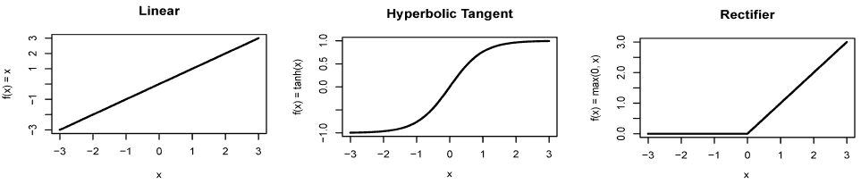
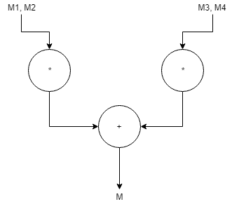
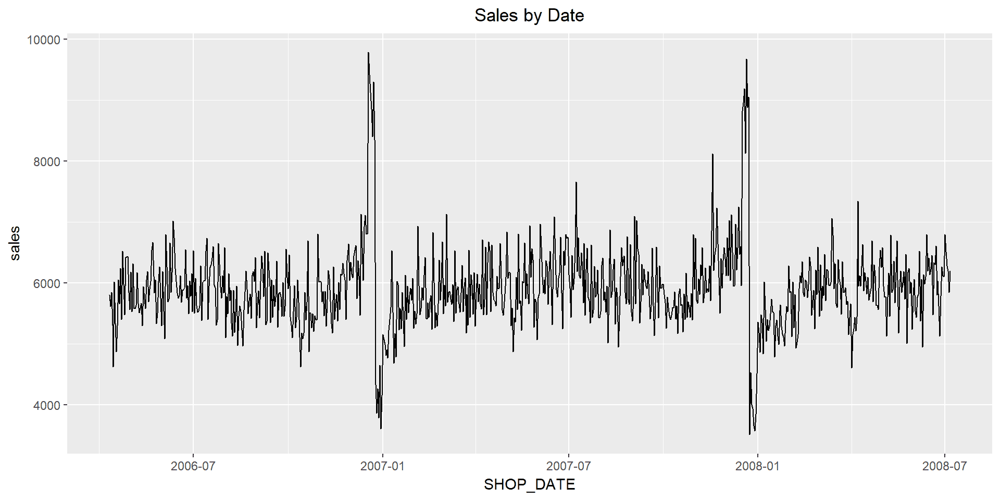
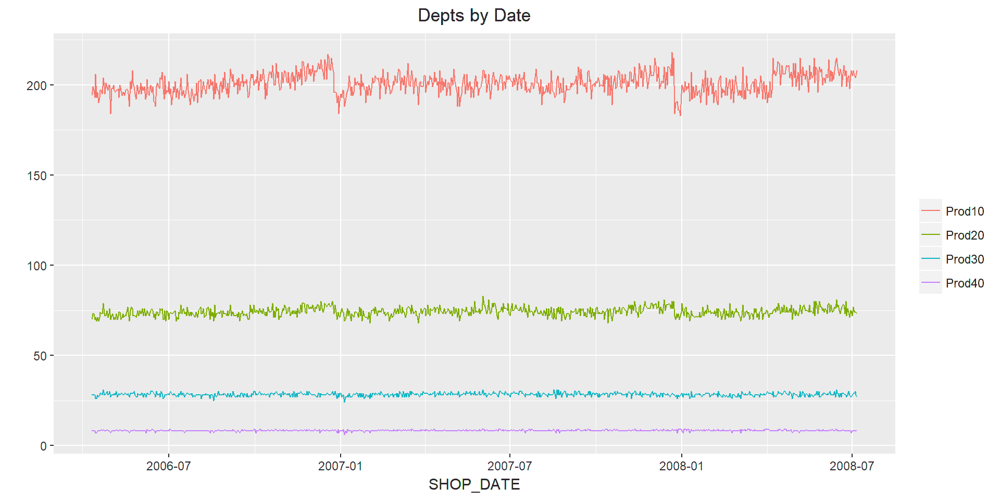
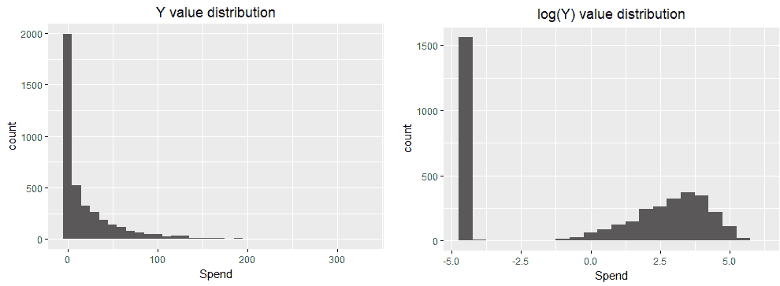
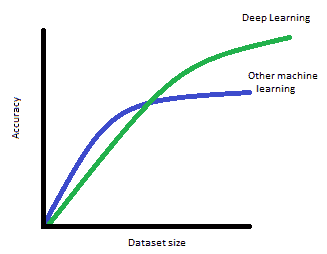

# 第四章：训练深度预测模型

前几章介绍了神经网络背后的部分理论，并使用了 R 中的一些神经网络包。现在是时候深入探讨如何训练深度学习模型了。在本章中，我们将探索如何训练和构建前馈神经网络，这是最常见的深度学习模型类型。我们将使用 MXNet 构建深度学习模型，利用零售数据集进行分类和回归。

本章将涵盖以下主题：

+   深度前馈神经网络入门

+   常见激活函数 – 整流器、双曲正切和最大激活

+   MXNet 深度学习库简介

+   使用案例 - 使用 MXNet 进行分类和回归

# 深度前馈神经网络入门

深度前馈神经网络旨在逼近一个函数，*f()*，该函数将一组输入变量，*x*，映射到输出变量，*y*。它们被称为前馈神经网络，因为信息从输入层通过每一层依次传递直到输出层，并且没有反馈或递归环路（包含前向和后向连接的模型被称为递归神经网络）。

深度前馈神经网络适用于广泛的问题，特别是在图像分类等应用中非常有用。更一般来说，前馈神经网络适用于那些有明确定义结果的预测和分类任务（例如图像包含的数字、某人是否在走楼梯或走平地、是否患有某种疾病等）。

深度前馈神经网络可以通过将层或函数连接在一起来构建。例如，下面的图示展示了一个包含四个隐藏层的网络：


图 4.1：一个深度前馈神经网络

该模型的图示是一个有向无环图。作为一个函数表示，从输入，*X*，到输出，*Y*，的整体映射是一个多层函数。第一隐藏层为 *H[1] = f^((1))(X, w[1] a[1])*，第二隐藏层为 *H[2] = f^((2))(H[1], w[2] a[2])*，依此类推。这些多层可以将复杂的函数和变换从相对简单的函数中构建出来。

如果在一层中包含足够的隐藏神经元，它可以通过许多不同类型的函数逼近到所需的精度。前馈神经网络可以通过在层之间应用非线性变换来逼近非线性函数。这些非线性函数被称为激活函数，我们将在下一节中讨论。

每一层的权重将在模型通过前向传播和反向传播训练时学习到。另一个必须确定的关键部分是代价函数或损失函数。最常用的两种代价函数是交叉熵，用于分类任务，以及**均方误差**（**MSE**），用于回归任务。

# 激活函数

激活函数决定了输入与隐藏层之间的映射关系。它定义了神经元激活的函数形式。例如，线性激活函数可以定义为：*f(x) = x*，在这种情况下，神经元的值将是原始输入 *x*。图 4.2 的顶部面板显示了线性激活函数。线性激活函数很少使用，因为在实践中，深度学习模型使用线性激活函数很难学习非线性的函数形式。在前面的章节中，我们使用了双曲正切作为激活函数，即 *f(x) = tanh(x)*。双曲正切在某些情况下表现良好，但一个潜在的限制是，在低值或高值时，它会饱和，正如图 4.2 中间面板所示。

目前可能是最流行的激活函数，也是一个不错的首选（Nair, V., 和 Hinton, G. E.（2010）），它被称为 *修正线性单元*（rectifier）。修正线性单元有不同种类，但最常见的定义为 *f(x) = max(0, x)* 的函数，这被称为**relu**。relu 激活在零以下是平的，在零以上是线性的；一个示例如图 4.2 所示。

我们将讨论的最后一种激活函数是 maxout（Goodfellow、Warde­-Farley、Mirza、Courville 和 Bengio（2013））。maxout 单元取其输入的最大值，尽管和往常一样，这是在加权之后进行的，因此并不是输入变量中值最高的那个总是会胜出。maxout 激活函数似乎与 dropout 特别契合。

relu 激活是最常用的激活函数，也是本书其余部分深度学习模型的默认选项。以下是我们讨论过的一些激活函数的图示：



图 4.2：常见的激活函数

# MXNet 深度学习库简介

本书中我们将使用的深度学习库有 MXNet、Keras 和 TensorFlow。Keras 是一个前端 API，这意味着它不是一个独立的库，它需要一个底层库作为后端，通常是 TensorFlow。使用 Keras 而不是 TensorFlow 的优点在于它具有更简单的接口。我们将在本书的后续章节中使用 Keras。

MXNet 和 TensorFlow 都是多功能的数值计算库，可以利用 GPU 进行大规模并行矩阵运算。因此，多维矩阵是这两个库的核心。在 R 中，我们熟悉向量，它是一个一维的相同类型值的数组。R 数据框是一个二维数组，其中每一列可以包含不同类型的数据。R 矩阵是一个二维数组，所有值的类型相同。一些机器学习算法在 R 中需要矩阵作为输入。我们在第二章，*训练预测模型*中，使用了 RSNSS 包的例子。

在 R 中，使用多于两维的数据结构并不常见，但深度学习广泛使用它们。例如，如果你有一张 32 x 32 的彩色图像，你可以将像素值存储在一个 32 x 32 x 3 的矩阵中，其中前两个维度是宽度和高度，最后一个维度代表红色、绿色和蓝色。这可以通过添加一个新的维度来进一步扩展，表示一组图像。这称为一个批次，并允许处理器（CPU/GPU）同时处理多张图像。批次大小是一个超参数，选择的值取决于输入数据的大小和内存容量。如果我们的批次大小为 64，那么我们的矩阵将是一个 4 维矩阵，大小为 32 x 32 x 3 x 64，其中前两个维度是宽度和高度，第三个维度是颜色，最后一个维度是批次大小 64。需要注意的是，这只是表示数据的另一种方式。在 R 中，我们会将相同的数据存储为一个 2 维矩阵（或数据框），具有 64 行和 32 x 32 x 3 = 3,072 列。我们所做的仅仅是重新排列数据，并没有改变数据本身。

这些包含相同类型元素的 n 维矩阵是使用 MXNet 和 TensorFlow 的基石。在 MXNet 中，它们被称为 NDArrays。在 TensorFlow 中，它们被称为 **张量**。这些 n 维矩阵非常重要，因为它们意味着我们可以更高效地将数据输入到 GPU；GPU 可以比处理单行数据更高效地批量处理数据。在前面的例子中，我们使用了 64 张图像作为一个批次，因此深度学习库会将输入数据分成 32 x 32 x 3 x 64 的块进行处理。

本章将使用 MXNet 深度学习库。MXNet 起源于卡内基梅隆大学，并得到了亚马逊的强力支持，2016 年他们将其作为默认的深度学习库。2017 年，MXNet 被接受为 Apache 孵化项目，确保它将保持开源软件。这是一个在 MXNet 中使用 R 进行 NDArray（矩阵）操作的非常简单的示例。如果你还没有安装 MXNet 包，请回到第一章，*深度学习入门*，查看安装说明，或者使用此链接：[`mxnet.apache.org/install/index.html`](https://mxnet.apache.org/install/index.html)：

```py
library(mxnet) # 1
ctx = mx.cpu() # 2
a <- mx.nd.ones(c(2,3),ctx=ctx) # 3
b <- a * 2 + 1 # 4
typeof(b) # 5
[1] "externalptr"
class(b) # 6
[1] "MXNDArray"
b # 7
     [,1] [,2] [,3]
[1,]    3    3    3
[2,]    3    3    3
```

我们可以逐行分析这段代码：

+   第 1 行加载了 MXNet 包。

+   第 2 行设置了 CPU 上下文。这告诉 MXNet 在哪里处理你的计算，要么是在 CPU 上，要么是在可用的 GPU 上。

+   第 3 行创建了一个大小为 2 x 3 的二维 NDArray，每个值都是 1。

+   第 4 行创建了一个大小为 2 x 3 的二维 NDArray。每个值都会是 3，因为我们进行逐元素乘法并加上 1。

+   第 5 行显示 b 是一个外部指针。

+   第 6 行显示 b 的类是 MXNDArray。

+   第 7 行显示结果。

我们可以对`b`变量执行数学运算，如乘法和加法。然而，需要注意的是，虽然这与 R 矩阵类似，但它并不是一个原生的 R 对象。当我们输出该变量的类型和类时，就能看到这一点。

在开发深度学习模型时，通常有两个不同的步骤。首先是创建模型架构，然后是训练模型。这样做的主要原因是，大多数深度学习库采用符号化编程，而不是你习惯的命令式编程。你以前在 R 中编写的大部分代码是命令式程序，它按顺序执行代码。对于数学优化任务，比如深度学习，这可能不是最高效的执行方法。包括 MXNet 和 TensorFlow 在内的大多数深度学习库都使用符号化编程。符号化编程首先设计一个计算图，用于程序执行。然后，图会被编译并执行。当计算图生成时，输入、输出和图操作已经定义好了，这意味着代码可以得到优化。这意味着，对于深度学习，符号程序通常比命令式程序更高效。

这里是一个使用符号程序进行优化的简单例子：

*M = (M1 * M2) + (M3* M4)*

一个命令式程序会按如下方式计算：

*Mtemp1 = (M1 * M2)*

*Mtemp2 = (M3* M4)*

*M = Mtemp1 + Mtemp2*

一个符号化程序会首先创建一个计算图，可能如下所示：



图 4.3：计算图示例

*M1*、*M2*、*M3* 和 *M4* 是需要操作的符号。图展示了操作之间的依赖关系；*+* 操作要求先执行两个乘法操作才能执行。但是两个乘法步骤之间没有依赖关系，因此它们可以并行执行。这种优化意味着代码能够更快地执行。

从编码的角度来看，这意味着创建深度学习模型有两个步骤——首先定义模型的架构，然后训练模型。你为深度学习模型创建*层*，每一层都有作为占位符的符号。例如，第一层通常是：

```py
data <- mx.symbol.Variable("data")
```

`data` 是输入的占位符，我们稍后会插入数据。每一层的输出作为下一层的输入。这可能是一个卷积层、一个全连接层、一个激活层、一个丢弃层等。以下代码示例展示了层与层之间如何继续传递数据；这个示例来自本章后面完整的例子。注意每一层的符号如何作为下一层的输入，这就是模型如何一层一层构建的方式。`data1` 符号传递给第一次调用的 `mx.symbol.FullyConnected`，`fc1` 符号传递给第一次调用的 `mx.symbol.Activation`，依此类推。

```py
data <- mx.symbol.Variable("data")
fc1 <- mx.symbol.FullyConnected(data, name="fc1", num_hidden=64)
act1 <- mx.symbol.Activation(fc1, name="activ1", act_type=activ)

drop1 <- mx.symbol.Dropout(data=act1,p=0.2)
fc2 <- mx.symbol.FullyConnected(drop1, name="fc2", num_hidden=32)
act2 <- mx.symbol.Activation(fc2, name="activ2", act_type=activ)

.....
softmax <- mx.symbol.SoftmaxOutput(fc4, name="sm")
```

当你执行这段代码时，它会立即运行，因为在这个阶段没有任何操作会被执行。最终，你将最后一层传入一个函数来训练模型。在 MXNet 中，这是 `mx.model.FeedForward.create` 函数。在这一阶段，计算图会被计算出来，模型开始训练：

```py
softmax <- mx.symbol.SoftmaxOutput(fc4, name="sm")
model <- mx.model.FeedForward.create(softmax, X = train_X, y = train_Y,
                                     ctx = devices,num.round = num_epochs,
                                     ................
```

这就是深度学习模型被创建并训练的过程。关于 MXNet 架构的更多信息可以在线找到；以下链接将帮助你入门：

+   [`mxnet.apache.org/tutorials/basic/symbol.html`](https://mxnet.apache.org/tutorials/basic/symbol.html)

+   [`mxnet.incubator.apache.org/architecture/program_model.html`](https://mxnet.incubator.apache.org/architecture/program_model.html)

# 深度学习层

在之前的代码片段中，我们看到了一些深度学习模型的层，包括 `mx.symbol.FullyConnected`、`mx.symbol.Activation` 和 `mx.symbol.Dropout`。层是模型构建的方式；它们是数据的计算变换。例如，`mx.symbol.FullyConnected` 是我们在第一章 *深度学习入门* 中介绍的矩阵操作的第一种层操作。它是*全连接*的，因为所有输入值都与层中的所有节点相连接。在其他深度学习库中，如 Keras，它被称为**密集层**。

`mx.symbol.Activation` 层对前一层的输出执行激活函数。`mx.symbol.Dropout` 层对前一层的输出执行丢弃操作。MXNet 中的其他常见层类型包括：

+   `mxnet.symbol.Convolution`：执行卷积操作，匹配数据中的模式。它主要用于计算机视觉任务，我们将在第五章中看到，*使用卷积神经网络进行图像分类*。它们也可以用于自然语言处理，我们将在第六章中看到，*使用深度学习进行自然语言处理*。

+   `mx.symbol.Pooling`：对前一层的输出进行池化操作。池化通过取输入部分的平均值或最大值来减少元素的数量。这些操作通常与卷积层一起使用。

+   `mx.symbol.BatchNorm`：用于对前一层的权重进行归一化。这样做的原因与归一化输入数据类似：有助于模型更好地训练。它还可以防止梯度消失和梯度爆炸问题，避免在训练过程中梯度变得非常小或非常大，这可能导致模型无法收敛，即训练失败。

+   `mx.symbol.SoftmaxOutput`：从前一层的输出中计算 Softmax 结果。

使用这些层时有一定的规律，例如，激活层通常跟在全连接层后面。Dropout 层通常应用在激活函数之后，但也可以放在全连接层和激活函数之间。卷积层和池化层通常在图像任务中按此顺序一起使用。此时，不必强迫自己记住何时使用这些层；在本书的后续章节中你将遇到大量实例！

如果这些内容让你感到困惑，可以放心，很多应用这些层的复杂工作已经被抽象出来，不需要你亲自处理。在上一章，我们建立神经网络时，需要管理各层的输入输出。这意味着必须确保矩阵的维度正确，以便操作能够顺利进行。深度学习库，如 MXNet 和 TensorFlow，会为你处理这些问题。

# 构建深度学习模型

现在我们已经掌握了基础知识，让我们来看看如何构建第一个真正的深度学习模型！我们将使用在第二章中使用过的`UHI HAR`数据集，*训练预测模型*。以下代码进行了一些数据准备：它加载数据并只选择存储均值的列（那些列名中包含`mean`的）。`y`变量的取值从 1 到 6；我们将减去 1，使其范围变为 0 到 5。此部分的代码位于`Chapter4/uci_har.R`中。它需要将`UHI HAR`数据集放在数据文件夹中；可以从[`archive.ics.uci.edu/ml/datasets/human+activity+recognition+using+smartphones`](https://archive.ics.uci.edu/ml/datasets/human+activity+recognition+using+smartphones)下载并解压到数据文件夹中：

```py
train.x <- read.table("../data/UCI HAR Dataset/train/X_train.txt")
train.y <- read.table("../data/UCI HAR Dataset/train/y_train.txt")[[1]]
test.x <- read.table("../data/UCI HAR Dataset/test/X_test.txt")
test.y <- read.table("../data/UCI HAR Dataset/test/y_test.txt")[[1]]
features <- read.table("../data/UCI HAR Dataset/features.txt")
meanSD <- grep("mean\\(\\)|std\\(\\)", features[, 2])
train.y <- train.y-1
test.y <- test.y-1
```

接下来，我们将转置数据并将其转换为矩阵。MXNet 期望数据的格式为宽度`x`高度，而不是高度`x`宽度：

```py
train.x <- t(train.x[,meanSD])
test.x <- t(test.x[,meanSD])
train.x <- data.matrix(train.x)
test.x <- data.matrix(test.x)
```

下一步是定义计算图。我们创建一个占位符来存储数据，并创建两个全连接（或密集）层，后面跟着 relu 激活函数。第一层有 64 个节点，第二层有 32 个节点。然后我们创建一个最终的全连接层，包含六个节点——这是我们的 y 变量中的不同类别数。我们使用 softmax 激活函数，将最后六个节点的数值转换为每个类别的概率：

```py
data <- mx.symbol.Variable("data")
fc1 <- mx.symbol.FullyConnected(data, name="fc1", num_hidden=64)
act1 <- mx.symbol.Activation(fc1, name="relu1", act_type="relu")
fc2 <- mx.symbol.FullyConnected(act1, name="fc2", num_hidden=32)
act2 <- mx.symbol.Activation(fc2, name="relu2", act_type="relu")
fc3 <- mx.symbol.FullyConnected(act2, name="fc3", num_hidden=6)
softmax <- mx.symbol.SoftmaxOutput(fc3, name="sm")
```

当你运行前面的代码时，实际上什么也不会执行。为了训练模型，我们创建一个`devices`对象，指示代码应该在哪运行，CPU 还是 GPU。然后将最后一层的符号（softmax）传递给`mx.model.FeedForward.create`函数。这个函数还有其他参数，更恰当地说它们是超参数。包括 epochs（`num.round`），它控制我们遍历数据的次数；学习率（`learning.rate`），它控制每次遍历时梯度更新的幅度；动量（`momentum`），这是一个可以帮助模型更快训练的超参数；以及权重初始化器（`initializer`），它控制节点的权重和偏置是如何初始化的。我们还传递了评估指标（`eval.metric`），即模型的评估方式，以及回调函数（`epoch.end.callback`），它用于输出进度信息。当我们运行该函数时，它会训练模型并根据我们在`epoch.end.callback`参数中使用的值输出进度信息，即每个 epoch：

```py
devices <- mx.cpu()
mx.set.seed(0)
tic <- proc.time()
model <- mx.model.FeedForward.create(softmax, X = train.x, y = train.y,
                                      ctx = devices,num.round = 20,
                                      learning.rate = 0.08, momentum = 0.9,
                                      eval.metric = mx.metric.accuracy,
                                      initializer = mx.init.uniform(0.01),
                                      epoch.end.callback =
                                        mx.callback.log.train.metric(1))
Start training with 1 devices
[1] Train-accuracy=0.185581140350877
[2] Train-accuracy=0.26104525862069
[3] Train-accuracy=0.555091594827586
[4] Train-accuracy=0.519127155172414
[5] Train-accuracy=0.646551724137931
[6] Train-accuracy=0.733836206896552
[7] Train-accuracy=0.819100215517241
[8] Train-accuracy=0.881869612068966
[9] Train-accuracy=0.892780172413793
[10] Train-accuracy=0.908674568965517
[11] Train-accuracy=0.898572198275862
[12] Train-accuracy=0.896821120689655
[13] Train-accuracy=0.915544181034483
[14] Train-accuracy=0.928879310344828
[15] Train-accuracy=0.926993534482759
[16] Train-accuracy=0.934401939655172
[17] Train-accuracy=0.933728448275862
[18] Train-accuracy=0.934132543103448
[19] Train-accuracy=0.933324353448276
[20] Train-accuracy=0.934132543103448
print(proc.time() - tic)
   user system elapsed 
   7.31 3.03 4.31 
```

现在我们已经训练好了模型，让我们看看它在测试集上的表现：

```py

preds1 <- predict(model, test.x)
pred.label <- max.col(t(preds1)) - 1
t <- table(data.frame(cbind(test.y,pred.label)),
            dnn=c("Actual", "Predicted"))
acc<-round(100.0*sum(diag(t))/length(test.y),2)
print(t)
      Predicted
Actual   0   1   2   3   4   5
     0 477  15   4   0   0   0
     1 108 359   4   0   0   0
     2  13  42 365   0   0   0
     3   0   0   0 454  37   0
     4   0   0   0 141 391   0
     5   0   0   0  16   0 521
print(sprintf(" Deep Learning Model accuracy = %1.2f%%",acc))
[1] " Deep Learning Model accuracy = 87.11%"
```

不错！我们在测试集上的准确率达到了`87.11%`。

等等，我们在前面的章节中覆盖的反向传播、导数等在哪里？答案是深度学习库大部分情况下会自动管理这些问题。在 MXNet 中，自动微分包含在一个称为 autograd 包中，该包使用链式法则对操作图进行微分。在构建深度学习模型时，这是少去的一件烦恼。更多信息，请访问 [`mxnet.incubator.apache.org/tutorials/gluon/autograd.html`](https://mxnet.incubator.apache.org/tutorials/gluon/autograd.html)。

# Use case – 使用 MXNet 进行分类和回归

在本节中，我们将使用一个新数据集创建一个二分类任务。我们将在这里使用的数据集是一个可在 [`www.dunnhumby.com/sourcefiles`](https://www.dunnhumby.com/sourcefiles) 获取的交易数据集。这个数据集是由 dunnhumby 提供的，他们因与 Tesco（一家英国超市）会员卡的关联而闻名，该会员卡是世界上最大的零售忠诚系统之一。我推荐阅读以下书籍，描述了 dunnhumby 如何通过分析他们的零售忠诚计划帮助 Tesco 成为第一零售商：*Humby, Clive, Terry Hunt, and Tim Phillips. Scoring points. Kogan Page Publishers, 2008*。尽管这本书相对较旧，但仍然是描述如何基于数据分析推出业务转型计划的最佳案例之一。

# 数据下载和探索

当你访问上述链接时，会有几个不同的数据选项；我们将使用的是称为 **Let’s Get Sort-of-Real** 的数据集。这个数据集是一个虚构零售忠诚计划的超过两年的数据。数据包括按篮子 ID 和顾客代码链接的购买记录，也就是说，我们可以追踪顾客随时间的交易。这里有多种选项，包括完整的数据集，压缩后大小为 4.3 GB，解压后超过 40 GB。对于我们的第一个模型，我们将使用最小的数据集，并将下载名为 **All transactions for a randomly selected sample of 5,000 customers** 的数据；这相当于完整数据库的 1/100 大小。

我要感谢 dunnhumby 发布这个数据集，并允许我们使用它。深度学习和机器学习中的一个问题是缺乏大规模真实生活数据集，供人们练习他们的技能。当一家公司努力发布这样一个数据集时，我们应该感谢他们的努力，并且不要在未经授权的情况下使用该数据集。请花时间阅读条款和条件，并仅将数据集用于个人学习目的。请记住，任何对这个数据集（或其他公司发布的数据集）的滥用，都会使公司更不愿意在未来发布其他数据集。

阅读完条款和条件并将数据集下载到你的电脑后，请将其解压到`code`文件夹下的`dunnhumby/in`目录中。确保文件直接解压到该文件夹下，而不是子目录中，否则你可能需要在解压后手动复制文件。数据文件采用**逗号分隔**（**CSV**）格式，每周一个独立文件。这些文件可以通过文本编辑器打开查看。我们将在分析中使用*表 4.1*中的一些字段：

| **字段名称** | **描述** | **格式** |
| --- | --- | --- |
| `BASKET_ID` | 购物篮 ID 或交易 ID。一个购物篮中的所有商品共享相同的`basket_id`值。 | 数值 |
| `CUST_CODE` | 客户代码。将交易/访问与客户关联。 | 字符 |
| `SHOP_DATE` | 购物发生的日期。日期采用 yyyymmdd 格式。 | 字符 |
| `STORE_CODE` | 店铺代码。 | 字符 |
| `QUANTITY` | 在该购物篮中购买的相同商品数量。 | 数值 |
| `SPEND` | 与购买的商品相关的消费金额。 | 数值 |
| `PROD_CODE` | 产品代码。 | 字符 |
| `PROD_CODE_10` | 产品层级 10 代码。 | 字符 |
| `PROD_CODE_20` | 产品层级 20 代码。 | 字符 |
| `PROD_CODE_30` | 产品层级 30 代码。 | 字符 |
| `PROD_CODE_40` | 产品层级 40 代码。 | 字符 |

表 4.1：交易数据集的部分数据字典

该数据存储了客户交易的详细信息。每个客户在购物交易中购买的独特商品都由一行表示，且同一交易中的商品会有相同的`BASKET_ID`字段。交易还可以通过`CUST_CODE`字段与客户关联。如果你想了解更多字段类型的信息，ZIP 文件中包含了一个 PDF 文件。

我们将使用该数据集进行客户流失预测任务。流失预测任务是指预测客户在接下来的`x`天内是否会回归。流失预测用于找出那些有可能离开你的服务的客户。购物忠诚计划、手机订阅、电视订阅等公司都会使用流失预测，以确保他们保持足够的客户数量。对于大多数依赖于订阅收入的公司来说，投入资源维持现有客户群比去获取新客户更为有效。这是因为获取新客户的成本较高。此外，随着时间推移，客户一旦流失，再将其吸引回来变得越来越难，因此在这段小的时间窗口内向他们发送特别优惠可能会促使他们留下。

除了二分类任务外，我们还将建立一个回归模型。该模型将预测一个人在未来 14 天内的消费金额。幸运的是，我们可以构建一个适合这两种预测任务的数据集。

数据以 117 个 CSV 文件的形式提供（忽略`time.csv`，它是一个查找文件）。第一步是进行一些基本的数据探索，验证数据是否已成功下载，然后执行一些基本的数据质量检查。这是任何分析中的重要第一步：尤其是当你使用外部数据集时，在创建任何机器学习模型之前，你应该对数据运行一些验证检查。`Chapter4/0_Explore.Rmd`脚本创建了一个汇总文件，并对数据进行了探索性分析。这是一个 RMD 文件，因此需要在 RStudio 中运行。为了简洁起见，并且因为本书是关于深度学习而非数据处理的，我将只包含部分输出和图表，而不是重现所有的代码。你也应该运行这个文件中的代码，以确保数据正确导入，尽管第一次运行可能需要几分钟时间。以下是该脚本中的一些数据汇总：

```py
Number of weeks we have data: 117.
Number of transaction lines: 2541019.
Number of transactions (baskets): 390320.
Number of unique Customers: 5000.
Number of unique Products: 4997.
Number of unique Stores: 761.
```

如果我们将其与网站和 PDF 进行对比，数据看起来是有序的。我们有超过 250 万条记录，并且数据来自 5,000 个客户，跨越 761 个商店。数据探索脚本还会生成一些图表，帮助我们感受数据。*图 4.3*展示了 117 周内的销售数据；我们可以看到数据的多样性（它不是一条平坦的线，表明每天的数据都是不同的），并且没有缺失数据的间隙。数据中存在季节性模式，特别是在日历年的年底，即假日季节：



图 4.3：按时间绘制的销售数据。

图 4.3 中的图表表明数据已成功导入。数据看起来一致，符合零售交易文件的预期，我们没有看到任何缺失数据，并且存在季节性波动。

对于每个个人购买的商品，都有一个产品代码（`PROD_CODE`）和四个部门代码（`PROD_CODE_10`、`PROD_CODE_20`、`PROD_CODE_30`、`PROD_CODE_40`）。我们将在分析中使用这些部门代码；`Chapter4/0_Explore.Rmd`中的代码会为它们创建一个汇总。我们希望查看每个部门代码的独特值有多少，代码是否代表了一个层级结构（每个代码最多只有一个父级），以及是否存在重复代码：

```py
PROD_CODE: Number of unique codes: 4997\. Number of repeated codes: 0.
PROD_CODE_10: Number of unique codes:250\. Number of repeated codes: 0.
PROD_CODE_20: Number of unique codes:90\. Number of repeated codes: 0.
PROD_CODE_30: Number of unique codes:31\. Number of repeated codes: 0.
PROD_CODE_40: Number of unique codes:9.
```

我们有 4,997 个独特的产品代码和 4 个部门代码。我们的部门代码从`PROD_CODE_10`开始，它有 250 个独特的代码，到`PROD_CODE_40`，它有 9 个独特的代码。这是一个产品部门代码层级结构，其中`PROD_CODE_40`是主类目，`PROD_CODE_10`是层级中最底层的部门代码。在`PROD_CODE_10`、`PROD_CODE_20`和`PROD_CODE_30`中的每个代码只有一个父级；例如，没有重复的代码，即每个部门代码只属于一个上级分类。我们没有提供查找文件来说明这些代码代表什么，但一个产品代码层级的例子可能类似于下面这样：

```py
PROD_CODE_40 : Chilled goods
  PROD_CODE_30 : Dairy
    PROD_CODE_20 : Fresh Milk
      PROD_CODE_10 : Full-fat Milk
        PROD_CODE : Brand x Full-fat Milk
```

为了理解这些部门代码，我们还可以根据独特产品部门代码的数量绘制时间序列的销售数据，如*图 4.4*所示。这个图表也是在`Chapter4/0_Explore.Rmd`中创建的：



图 4.4：按日期购买的独特产品代码

请注意，对于此图，*y*轴表示独特的产品代码，而非销售数据。该数据看起来也很一致；虽然数据中有一些波峰和波谷，但它们不像*图 4.3*中那样显著，这是符合预期的。

# 为我们的模型准备数据

现在我们已经下载并验证了数据，我们可以用它来为我们的二分类和回归模型任务创建数据集。对于二分类任务，我们希望能够预测哪些客户将在接下来的两周内访问商店，对于回归任务，我们希望预测他们将在接下来的两周内消费多少钱。`Chapter4/prepare_data.R`脚本将原始交易数据转换为适合机器学习的格式。你需要运行代码来为模型创建数据集，但不必完全理解它是如何工作的。如果你想专注于深度学习模型的构建，可以跳过这部分内容。

我们需要将数据转换为适合预测任务的格式。每个我们要预测的实例应该只有一行。列将包括一些特征字段（`X`变量）和一个预测值字段（`Y`变量）。我们希望预测客户是否回访及他们的消费情况，因此我们的数据集每个客户将有一行，包含特征和预测变量。

第一步是找到一个截止日期，该日期将用于区分用于预测的变量（`X`）和我们将要预测的变量（`Y`）。代码会查看数据，找到最后一个交易日期；然后从该日期减去 13 天。这个日期就是截止日期，我们希望预测哪些客户将在截止日期*及之后*在我们的商店消费；根据截止日期*之前*发生的情况。截止日期之前的数据将用于生成我们的 X 或特征变量，截止日期及之后的销售数据将用于生成我们的 Y 或预测变量。以下是这部分代码：

```py
library(readr)
library(reshape2)
library(dplyr)

source("import.R")

# step 1, merge files
import_data(data_directory,bExploreData=0)

# step 2, group and pivot data
fileName <- paste(data_directory,"all.csv",sep="")
fileOut <- paste(data_directory,"predict.csv",sep="")
df <- read_csv(fileName,col_types = cols(.default = col_character()))

# convert spend to numeric field
df$SPEND<-as.numeric(df$SPEND)

# group sales by date. we have not converted the SHOP_DATE to date
# but since it is in yyyymmdd format,
# then ordering alphabetically will preserve date order
sumSalesByDate<-df %>%
   group_by(SHOP_WEEK,SHOP_DATE) %>%
   summarise(sales = sum(SPEND)
   )

# we want to get the cut-off date to create our data model
# this is the last date and go back 13 days beforehand
# therefore our X data only looks at everything from start to max date - 13 days
# and our Y data only looks at everything from max date - 13 days to end (i.e. 14 days)
max(sumSalesByDate$SHOP_DATE)
[1] "20080706"
sumSalesByDate2 <- sumSalesByDate[order(sumSalesByDate$SHOP_DATE),]
datCutOff <- as.character(sumSalesByDate2[(nrow(sumSalesByDate2)-13),]$SHOP_DATE)
datCutOff
[1] "20080623"
rm(sumSalesByDate,sumSalesByDate2)
```

如果此代码无法运行，最可能的原因是源数据未保存在正确的位置。数据集必须解压到名为 dunnhumby/in 的目录下，位于代码文件夹中，即与章节文件夹处于同一级别。

我们数据中的最后日期是`20080706`，即 2008 年 7 月 7 日，截止日期是 2008 年 6 月 23 日。尽管我们有从 2006 年开始的数据，但我们只会使用 2008 年的销售数据。任何超过六个月的数据不太可能影响未来的客户销售。任务是预测客户是否会在 2008 年 6 月 23 日至 2008 年 7 月 7 日之间回访，基于他们在 2008 年 6 月 23 日之前的活动。

我们现在需要从数据中创建特征；为了使用按部门代码拆分的消费数据，我们将使用`PROD_CODE_40`字段。我们可以直接按该部门代码对销售数据进行分组，但这将使得 2008 年 1 月和 2008 年 6 月的消费权重相等。我们希望在预测变量列中加入时间因素。因此，我们将创建一个部门代码和周组合的特征，这将使我们的模型更加重视近期的活动。首先，我们按客户代码、周和部门代码进行分组，并创建`fieldName`列。然后，我们将这些数据进行透视，创建我们的特征（`X`）数据集。该数据集的单元格值表示该客户（行）和该周-部门代码（列）的销售额。以下是两个客户数据转换后的示例。*表 4.2*显示了按周和`PROD_CODE_40`字段的销售支出。然后，*表 4.3*通过透视创建了一个数据集，数据集中每个客户只有一行，聚合字段现在作为列，销售额作为值：

| `CUST_CODE` | `PROD_CODE_40` | `SHOP_WEEK` | `fieldName` | `Sales` |
| --- | --- | --- | --- | --- |
| `cust_001` | D00001 | 200801 | `D00001_200801` | 10.00 |
| `cust_002` | D00001 | 200801 | `D00001_200801` | 12.00 |
| `cust_001` | D00015 | 200815 | `D00015_200815` | 15.00 |
| `cust_001` | D00020 | 200815 | `D00020_200815` | 20.00 |
| `cust_002` | D00030 | 200815 | `D00030_200815` | 25.00 |

表 4.2：按客户代码、部门代码和周汇总的销售数据

| `CUST_CODE` | `D00001_200801` | `D00015_200815` | `D00020_200815` | `D00030_200815` |
| --- | --- | --- | --- | --- |
| `cust_001` | 10.00 | 15.00 | 20.00 |  |
| `cust_002` | 12.00 |  |  | 25.00 |

表 4.3：表 4.2 转换后的数据

以下是执行此转换的代码：

```py
# we are going to limit our data here from year 2008 only
# group data and then pivot it
sumTemp <- df %>%
   filter((SHOP_DATE < datCutOff) & (SHOP_WEEK>="200801")) %>%
   group_by(CUST_CODE,SHOP_WEEK,PROD_CODE_40) %>%
   summarise(sales = sum(SPEND)
   )
sumTemp$fieldName <- paste(sumTemp$PROD_CODE_40,sumTemp$SHOP_WEEK,sep="_")
df_X <- dcast(sumTemp,CUST_CODE ~ fieldName, value.var="sales")
df_X[is.na(df_X)] <- 0
```

预测变量（`Y`）是一个标志，表示客户是否在`200818`到`200819`周期间访问过该网站。我们在截止日期之后对数据进行分组，并按客户对销售数据进行分组，这些数据将形成我们`Y`值的基础。我们将`X`和`Y`数据集合并，确保通过左连接保留`X`端的所有行。最后，我们为二分类任务创建一个 1/0 标志。当我们完成时，我们看到数据集中有`3933`条记录：`1560`个未返回的客户和`2373`个已返回的客户。我们通过保存文件来完成模型构建的准备。以下代码展示了这些步骤：

```py
# y data just needs a group to get sales after cut-off date
df_Y <- df %>%
   filter(SHOP_DATE >= datCutOff) %>%
   group_by(CUST_CODE) %>%
   summarise(sales = sum(SPEND)
   )
colnames(df_Y)[2] <- "Y_numeric"

# use left join on X and Y data, need to include all values from X
# even if there is no Y value
dfModelData <- merge(df_X,df_Y,by="CUST_CODE", all.x=TRUE)
# set binary flag
dfModelData$Y_categ <- 0
dfModelData[!is.na(dfModelData$Y_numeric),]$Y_categ <- 1
dfModelData[is.na(dfModelData$Y_numeric),]$Y_numeric <- 0
rm(df,df_X,df_Y,sumTemp)

nrow(dfModelData)
[1] 3933
table(dfModelData$Y_categ)
   0    1 
1560 2373 

# shuffle data
dfModelData <- dfModelData[sample(nrow(dfModelData)),]

write_csv(dfModelData,fileOut)
```

我们使用销售数据来创建我们的预测字段，但在这项任务中，我们忽略了一些客户属性。这些字段包括`Customers Price Sensitivity`和`Customers Lifestage`。我们不使用这些字段的主要原因是避免数据泄漏。数据泄漏是在构建预测模型时可能发生的，它发生在某些字段的值在生产环境中创建数据集时不可用或不同。因为我们不知道这些字段的设置时间，它们可能是在客户注册时创建的，也可能是一个每天运行的过程。如果这些字段是在我们的截止日期之后创建的，这意味着它们可能会不公平地预测我们的`Y`变量。

例如，`Customers Price Sensitivity`字段有`Less Affluent`、`Mid Market`和`Up Market`等值，这些值可能是从客户的购买行为中推导出来的。因此，在进行流失预测任务时，如果这些字段在创建我们预测模型的数据集后的截止日期之后进行了更新，那么使用这些字段将导致数据泄漏。`Customers Price Sensitivity`字段中的`Up Market`值可能与回报支出高度相关，但实际上，这个值是其预测值的总结。数据泄漏是数据模型在生产环境中表现不佳的主要原因之一，因为模型是在包含与 Y 变量相关的数据上进行训练的，而这些数据在现实中永远不会存在。你应当始终检查时间序列任务中的数据泄漏，并问自己是否有任何字段（特别是查找属性）可能在创建模型数据所使用的日期之后被修改。

# 二分类模型

前一节的代码在`dunnhumby`文件夹中创建了一个名为`predict.csv`的新文件。这个数据集为每个客户创建了一行，其中包含一个 0/1 字段，表示他们在过去两周是否访问过，以及基于这两周前的销售数据的预测变量。现在，我们可以继续构建一些机器学习模型。`Chapter4/binary_predict.R`文件包含了我们第一个预测任务——二分类的代码。代码的第一部分加载数据，并通过包含所有列（除了客户 ID、二分类预测变量和回归预测变量）来创建预测变量数组。特征列都是数值型字段，这些字段分布呈现出明显的右偏，因此我们对这些字段应用了对数变换。我们首先加上`0.01`，以避免尝试对零值取对数时得到非数值结果（*log(0)= -Inf*）。

以下图表展示了数据在变换前后的情况，左边是变换前的数据，右边是变换后的数据：



图 4.5：特征变量在变换前后的分布。

第二张图中左边的大条表示原始字段为零的地方*（log(0+0.01) = -4.6）*。以下代码加载数据，执行对数变换，并生成前面的图：

```py
set.seed(42)
fileName <- "../dunnhumby/predict.csv"
dfData <- read_csv(fileName,
                    col_types = cols(
                      .default = col_double(),
                      CUST_CODE = col_character(),
                      Y_categ = col_integer())
                    )
nobs <- nrow(dfData)
train <- sample(nobs, 0.9*nobs)
test <- setdiff(seq_len(nobs), train)
predictorCols <- colnames(dfData)[!(colnames(dfData) %in% c("CUST_CODE","Y_numeric","Y_categ"))]

# data is right-skewed, apply log transformation
qplot(dfData$Y_numeric, geom="histogram",binwidth=10,
       main="Y value distribution",xlab="Spend")+theme(plot.title = element_text(hjust = 0.5))
dfData[, c("Y_numeric",predictorCols)] <- log(0.01+dfData[, c("Y_numeric",predictorCols)])
qplot(dfData$Y_numeric, geom="histogram",binwidth=0.5,
       main="log(Y) value distribution",xlab="Spend")+theme(plot.title = element_text(hjust = 0.5))
trainData <- dfData[train, c(predictorCols)]
testData <- dfData[test, c(predictorCols)]
trainData$Y_categ <- dfData[train, "Y_categ"]$Y_categ
testData$Y_categ <- dfData[test, "Y_categ"]$Y_categ
```

在训练深度学习模型之前，我们先在数据上训练了三种机器学习模型——逻辑回归模型、`Random Forest`模型和`XGBoost`模型——作为基准。这个代码部分包含了数据加载、转换和三个模型：

```py
#Logistic Regression Model
logReg=glm(Y_categ ~ .,data=trainData,family=binomial(link="logit"))
pr <- as.vector(ifelse(predict(logReg, type="response",
                                testData) > 0.5, "1", "0"))
# Generate the confusion matrix showing counts.
t<-table(dfData[test, c(predictorCols, "Y_categ")]$"Y_categ", pr,
          dnn=c("Actual", "Predicted"))
acc<-round(100.0*sum(diag(t))/length(test),2)
print(t)
      Predicted
Actual   0   1
     0 130  42
     1  48 174
print(sprintf(" Logistic regression accuracy = %1.2f%%",acc))
[1] " Logistic regression accuracy = 77.16%"
rm(t,pr,acc)

rf <- randomForest::randomForest(as.factor(Y_categ) ~ .,
                                  data=trainData,
                                  na.action=randomForest::na.roughfix)
pr <- predict(rf, newdata=testData, type="class")
# Generate the confusion matrix showing counts.
t<-table(dfData[test, c(predictorCols, "Y_categ")]$Y_categ, pr,
          dnn=c("Actual", "Predicted"))
acc<-round(100.0*sum(diag(t))/length(test),2)
print(t)
      Predicted
Actual   0   1
     0 124  48
     1  30 192
print(sprintf(" Random Forest accuracy = %1.2f%%",acc))
[1] " Random Forest accuracy = 80.20%"
rm(t,pr,acc)

xgb <- xgboost(data=data.matrix(trainData[,predictorCols]), label=trainData[,"Y_categ"]$Y_categ,
                nrounds=75, objective="binary:logistic")
pr <- as.vector(ifelse(
   predict(xgb, data.matrix(testData[, predictorCols])) > 0.5, "1", "0"))
t<-table(dfData[test, c(predictorCols, "Y_categ")]$"Y_categ", pr,
          dnn=c("Actual", "Predicted"))
acc<-round(100.0*sum(diag(t))/length(test),2)
print(t)
      Predicted
Actual   0   1
     0 125  47
     1  44 178
print(sprintf(" XGBoost accuracy = %1.2f%%",acc))
[1] " XGBoost accuracy = 76.90%"
rm(t,pr,acc)
```

我们创建了逻辑回归、`Random Forest`和`XGBoost`模型，原因有几个。首先，大部分工作已经在数据准备阶段完成，因此做这些模型是微不足道的。其次，这为我们提供了一个基准，可以将其与深度学习模型进行比较。第三，如果数据准备过程中存在问题，这些机器学习算法会更快速地发现这些问题，因为它们比训练深度学习模型要快。在这种情况下，我们只有几千条记录，因此这些机器学习算法能够轻松运行在这些数据上。如果数据过大而这些算法无法处理，我会考虑取一个较小的样本来运行我们的基准任务。有许多机器学习算法可供选择，但我选择这些算法作为基准，原因如下：

+   逻辑回归是一个基础模型，始终是一个不错的基准选择。

+   `Random Forest`以其默认参数训练表现良好，并且对过拟合和相关变量（我们这里有的）具有鲁棒性。

+   `XGBoost`被一致认为是表现最好的机器学习算法之一。

这三种算法的准确度相似，最高的准确度由`Random Forest`模型取得，准确率为 80.2%。我们现在知道这个数据集适用于预测任务，并且有了基准可以进行比较。

接下来我们将使用 MXNet 构建一个深度学习模型：

```py
require(mxnet)

# MXNet expects matrices
train_X <- data.matrix(trainData[, predictorCols])
test_X <- data.matrix(testData[, predictorCols])
train_Y <- trainData$Y_categ

# hyper-parameters
num_hidden <- c(128,64,32)
drop_out <- c(0.2,0.2,0.2)
wd=0.00001
lr <- 0.03
num_epochs <- 40
activ <- "relu"

# create our model architecture
# using the hyper-parameters defined above
data <- mx.symbol.Variable("data")
fc1 <- mx.symbol.FullyConnected(data, name="fc1", num_hidden=num_hidden[1])
act1 <- mx.symbol.Activation(fc1, name="activ1", act_type=activ)

drop1 <- mx.symbol.Dropout(data=act1,p=drop_out[1])
fc2 <- mx.symbol.FullyConnected(drop1, name="fc2", num_hidden=num_hidden[2])
act2 <- mx.symbol.Activation(fc2, name="activ2", act_type=activ)

drop2 <- mx.symbol.Dropout(data=act2,p=drop_out[2])
fc3 <- mx.symbol.FullyConnected(drop2, name="fc3", num_hidden=num_hidden[3])
act3 <- mx.symbol.Activation(fc3, name="activ3", act_type=activ)

drop3 <- mx.symbol.Dropout(data=act3,p=drop_out[3])
fc4 <- mx.symbol.FullyConnected(drop3, name="fc4", num_hidden=2)
softmax <- mx.symbol.SoftmaxOutput(fc4, name="sm")

# run on cpu, change to 'devices <- mx.gpu()'
# if you have a suitable GPU card
devices <- mx.cpu()
mx.set.seed(0)
tic <- proc.time()
# This actually trains the model
model <- mx.model.FeedForward.create(softmax, X = train_X, y = train_Y,
                                      ctx = devices,num.round = num_epochs,
                                      learning.rate = lr, momentum = 0.9,
                                      eval.metric = mx.metric.accuracy,
                                      initializer = mx.init.uniform(0.1),
                                      wd=wd,
                                      epoch.end.callback = mx.callback.log.train.metric(1))
print(proc.time() - tic)
   user system elapsed 
   9.23 4.65 4.37 

pr <- predict(model, test_X)
pred.label <- max.col(t(pr)) - 1
t <- table(data.frame(cbind(testData[,"Y_categ"]$Y_categ,pred.label)),
            dnn=c("Actual", "Predicted"))
acc<-round(100.0*sum(diag(t))/length(test),2)
print(t)
      Predicted
Actual   0   1
     0 136  36
     1  54 168
print(sprintf(" Deep Learning Model accuracy = %1.2f%%",acc))
[1] " Deep Learning Model accuracy = 77.16%"
rm(t,pr,acc)
rm(data,fc1,act1,fc2,act2,fc3,act3,fc4,softmax,model)
```

深度学习模型在测试数据上的准确度为`77.16%`，仅被`Random Forest`模型超越。这表明，深度学习模型可以与最好的机器学习算法竞争。这也表明，深度学习模型在分类任务中并不总是优于其他机器学习算法。我们使用这些模型提供基准，以便知道我们的深度学习模型是否得到了不错的结果；它让我们有信心相信我们的深度学习模型是有竞争力的。

我们的深度学习模型在每一层使用 20%的**dropout**并且使用权重衰减进行正则化。如果没有使用**dropout**，模型会明显过拟合。这可能是因为特征之间高度相关，因为我们的列表示的是各个部门的开支。可以推测，如果一列是某种类型的面包，另一列是某种类型的牛奶，那么这些开支会一起变化，也就是说，花费更多且交易更多的人更可能同时购买这两种商品。

# 回归模型

前一节开发了一个用于二分类任务的深度学习模型，本节开发了一个用于预测连续数值的深度学习回归模型。我们使用与二分类任务相同的数据集，但使用不同的目标列进行预测。在那个任务中，我们想要预测客户是否会在接下来的 14 天内回到我们的商店。而在这个任务中，我们想要预测客户在接下来的 14 天内将会在我们的商店花费多少。我们遵循类似的流程，通过对数据应用对数变换来加载和准备数据集。代码位于`Chapter4/regression.R`中：

```py
set.seed(42)
fileName <- "../dunnhumby/predict.csv"
dfData <- read_csv(fileName,
                    col_types = cols(
                      .default = col_double(),
                      CUST_CODE = col_character(),
                      Y_categ = col_integer())
 )
nobs <- nrow(dfData)
train <- sample(nobs, 0.9*nobs)
test <- setdiff(seq_len(nobs), train)
predictorCols <- colnames(dfData)[!(colnames(dfData) %in% c("CUST_CODE","Y_numeric","Y_numeric"))]

dfData[, c("Y_numeric",predictorCols)] <- log(0.01+dfData[, c("Y_numeric",predictorCols)])
trainData <- dfData[train, c(predictorCols,"Y_numeric")]
testData <- dfData[test, c(predictorCols,"Y_numeric")]

xtrain <- model.matrix(Y_numeric~.,trainData)
xtest <- model.matrix(Y_numeric~.,testData)
```

然后，我们使用`lm`对数据进行回归分析，以便在创建深度学习模型之前建立基准：

```py
# lm Regression Model
regModel1=lm(Y_numeric ~ .,data=trainData)
pr1 <- predict(regModel1,testData)
rmse <- sqrt(mean((exp(pr1)-exp(testData[,"Y_numeric"]$Y_numeric))²))
print(sprintf(" Regression RMSE = %1.2f",rmse))
[1] " Regression RMSE = 29.30"
mae <- mean(abs(exp(pr1)-exp(testData[,"Y_numeric"]$Y_numeric)))
print(sprintf(" Regression MAE = %1.2f",mae))
[1] " Regression MAE = 13.89"
```

我们为回归任务输出两个指标，rmse 和 mae。我们在本章前面已经介绍过这些指标。平均绝对误差（mae）衡量的是预测值与实际值之间的绝对差异。**均方根误差**（**rmse**）对预测值与实际值之间差异的平方进行惩罚，因此一个大的错误比多个小错误的总和代价更高。现在，让我们来看一下深度学习回归代码。首先，我们加载数据并定义模型：

```py
require(mxnet)
Loading required package: mxnet

# MXNet expects matrices
train_X <- data.matrix(trainData[, predictorCols])
test_X <- data.matrix(testData[, predictorCols])
train_Y <- trainData$Y_numeric

set.seed(42)
# hyper-parameters
num_hidden <- c(256,128,128,64)
drop_out <- c(0.4,0.4,0.4,0.4)
wd=0.00001
lr <- 0.0002
num_epochs <- 100
activ <- "tanh"

# create our model architecture
# using the hyper-parameters defined above
data <- mx.symbol.Variable("data")
fc1 <- mx.symbol.FullyConnected(data, name="fc1", num_hidden=num_hidden[1])
act1 <- mx.symbol.Activation(fc1, name="activ1", act_type=activ)
drop1 <- mx.symbol.Dropout(data=act1,p=drop_out[1])

fc2 <- mx.symbol.FullyConnected(drop1, name="fc2", num_hidden=num_hidden[2])
act2 <- mx.symbol.Activation(fc2, name="activ2", act_type=activ)
drop2 <- mx.symbol.Dropout(data=act2,p=drop_out[2])

fc3 <- mx.symbol.FullyConnected(drop2, name="fc3", num_hidden=num_hidden[3])
act3 <- mx.symbol.Activation(fc3, name="activ3", act_type=activ)
drop3 <- mx.symbol.Dropout(data=act3,p=drop_out[3])

fc4 <- mx.symbol.FullyConnected(drop3, name="fc4", num_hidden=num_hidden[4])
act4 <- mx.symbol.Activation(fc4, name="activ4", act_type=activ)
drop4 <- mx.symbol.Dropout(data=act4,p=drop_out[4])

fc5 <- mx.symbol.FullyConnected(drop4, name="fc5", num_hidden=1)
lro <- mx.symbol.LinearRegressionOutput(fc5)

```

现在我们开始训练模型；注意，第一个注释展示了如何切换到使用 GPU 而非 CPU：

```py
# run on cpu, change to 'devices <- mx.gpu()'
# if you have a suitable GPU card
devices <- mx.cpu()
mx.set.seed(0)
tic <- proc.time()
# This actually trains the model
model <- mx.model.FeedForward.create(lro, X = train_X, y = train_Y,
 ctx = devices,num.round = num_epochs,
 learning.rate = lr, momentum = 0.9,
 eval.metric = mx.metric.rmse,
 initializer = mx.init.uniform(0.1),
 wd=wd,
 epoch.end.callback = mx.callback.log.train.metric(1))
print(proc.time() - tic)
 user system elapsed 
 13.90 1.82 10.50 

pr4 <- predict(model, test_X)[1,]
rmse <- sqrt(mean((exp(pr4)-exp(testData[,"Y_numeric"]$Y_numeric))²))
print(sprintf(" Deep Learning Regression RMSE = %1.2f",rmse))
[1] " Deep Learning Regression RMSE = 28.92"
mae <- mean(abs(exp(pr4)-exp(testData[,"Y_numeric"]$Y_numeric)))
print(sprintf(" Deep Learning Regression MAE = %1.2f",mae))
[1] " Deep Learning Regression MAE = 14.33"
rm(data,fc1,act1,fc2,act2,fc3,act3,fc4,lro,model)
```

对于回归指标，越低越好，因此我们在深度学习模型上的 rmse 指标（28.92）比原始回归模型（29.30）有所改进。有趣的是，深度学习模型上的 mae（14.33）实际上比原始回归模型（13.89）更差。由于 rmse 对实际值和预测值之间的大差异惩罚更多，这表明深度学习模型的误差比回归模型的误差更为温和。

# 改进二分类模型

本节基于之前的二分类任务，并着眼于提高该任务的准确性。我们可以改善模型的第一件事是使用更多的数据，实际上是使用 100 倍的数据！我们将下载整个数据集，压缩文件大小超过 4GB，解压后数据大小为 40GB。回到下载链接（[`www.dunnhumby.com/sourcefiles`](https://www.dunnhumby.com/sourcefiles)），再次选择**Let’s Get Sort-of-Real**，并下载**完整数据集**的所有文件。共有九个文件需要下载，CSV 文件应解压到`dunnhumby/in`文件夹中。记得检查 CSV 文件是否在该文件夹中，而不是在子文件夹中。你需要再次运行`Chapter4/prepare_data.R`中的代码。完成后，`predict.csv`文件应包含 390,000 条记录。

你可以尝试跟着这个步骤进行，但要注意，准备数据并运行深度学习模型将会花费很长时间。如果你的计算机较慢，可能还会遇到一些问题。我在一台配备 32 GB RAM 的 Intel i5 处理器的电脑上测试了这段代码，模型运行了 30 分钟。而且，它还需要超过 50 GB 的硬盘空间来存储解压后的文件和临时文件。如果你在本地计算机上运行时遇到问题，另一种选择是将这个例子运行在云端，我们将在后续章节中介绍。

本节代码在`Chapter4/binary_predict2.R`脚本中。由于我们有更多数据，我们可以构建一个更复杂的模型。我们有 100 倍的数据量，因此我们的新模型增加了一层，并在隐藏层中添加了更多的节点。我们减少了正则化量并调整了学习率，还增加了训练的周期数。下面是`Chapter4/binary_predict2.R`中的代码，构建并训练深度学习模型。我们没有包含加载和准备数据的样板代码，因为这些部分与原始脚本没有变化：

```py
# hyper-parameters
num_hidden <- c(256,128,64,32)
drop_out <- c(0.2,0.2,0.1,0.1)
wd=0.0
lr <- 0.03
num_epochs <- 50
activ <- "relu"

# create our model architecture
# using the hyper-parameters defined above
data <- mx.symbol.Variable("data")
fc1 <- mx.symbol.FullyConnected(data, name="fc1", num_hidden=num_hidden[1])
act1 <- mx.symbol.Activation(fc1, name="activ1", act_type=activ)

drop1 <- mx.symbol.Dropout(data=act1,p=drop_out[1])
fc2 <- mx.symbol.FullyConnected(drop1, name="fc2", num_hidden=num_hidden[2])
act2 <- mx.symbol.Activation(fc2, name="activ2", act_type=activ)

drop2 <- mx.symbol.Dropout(data=act2,p=drop_out[2])
fc3 <- mx.symbol.FullyConnected(drop2, name="fc3", num_hidden=num_hidden[3])
act3 <- mx.symbol.Activation(fc3, name="activ3", act_type=activ)

drop3 <- mx.symbol.Dropout(data=act3,p=drop_out[3])
fc4 <- mx.symbol.FullyConnected(drop3, name="fc4", num_hidden=num_hidden[4])
act4 <- mx.symbol.Activation(fc4, name="activ4", act_type=activ)

drop4 <- mx.symbol.Dropout(data=act4,p=drop_out[4])
fc5 <- mx.symbol.FullyConnected(drop4, name="fc5", num_hidden=2)
softmax <- mx.symbol.SoftmaxOutput(fc5, name="sm")

# run on cpu, change to 'devices <- mx.gpu()'
# if you have a suitable GPU card
devices <- mx.cpu()
mx.set.seed(0)
tic <- proc.time()
# This actually trains the model
model <- mx.model.FeedForward.create(softmax, X = train_X, y = train_Y,
 ctx = devices,num.round = num_epochs,
 learning.rate = lr, momentum = 0.9,
 eval.metric = mx.metric.accuracy,
 initializer = mx.init.uniform(0.1),
 wd=wd,
 epoch.end.callback = mx.callback.log.train.metric(1))
print(proc.time() - tic)
 user system elapsed 
1919.75 1124.94 871.31

pr <- predict(model, test_X)
pred.label <- max.col(t(pr)) - 1
t <- table(data.frame(cbind(testData[,"Y_categ"]$Y_categ,pred.label)),
 dnn=c("Actual", "Predicted"))
acc<-round(100.0*sum(diag(t))/length(test),2)
print(t)
      Predicted
Actual     0     1
 0     10714  4756
 1      3870 19649
print(sprintf(" Deep Learning Model accuracy = %1.2f%%",acc))
[1] " Deep Learning Model accuracy = 77.88%"
```

准确率已经从早期模型的`77.16%`提高到该模型的`77.88%`。这看起来可能不算显著，但如果考虑到大数据集包含了近 39 万行数据，准确度提高了 0.72%就意味着大约 2,808 个客户现在被正确分类。如果每个客户的价值为 50 美元，那么这将为公司带来额外的 14 万美元收入。

通常来说，当你增加更多的数据时，你的模型应该变得更加复杂，以便能够在所有数据模式中进行泛化。我们将在第六章《调优与优化模型》中详细讲解这一点，但我鼓励你在`Chapter4/binary_predict.R`中实验代码。试着更改超参数或添加更多层。即使准确度提高了 0.1% - 0.2%，也是一个显著的进步。如果你能在这个数据集上达到超过 78%的准确度，那就算是一个不错的成就。

如果你想进一步探索，还有其他方法可以调查。这些方法涉及如何创建模型数据的变化。如果你真的想挑战自己，以下是一些你可以尝试的额外想法：

+   我们当前的特征是部门代码和周数的组合，我们使用`PROD_CODE_40`字段作为部门代码。这个字段只有九个唯一值，因此每一周只有九个字段表示这些数据。如果你使用`PROD_CODE_30`、`PROD_CODE_20`或`PROD_CODE_10`，你将会创建更多的特征。

+   以类似的方式，你可以尝试使用部门代码和天数，而不是使用部门代码和周数。这可能会产生太多的特征，但我建议你考虑在截止日期之前的最后 14 天进行此操作。

+   尝试不同的数据准备方法。我们使用对数尺度，在我们的二分类任务中效果很好，但对于回归任务来说并非最佳方法，因为它不会创建具有正态分布的数据。尝试应用 z-scaling 和 min-max 标准化到数据中。如果这样做，必须确保在评估模型之前正确地应用到测试数据上。

+   训练数据使用销售金额。您可以将此更改为商品数量或商品所在的交易次数。

+   您可以创建新的特征。一个潜在强大的例子是基于一周中的某一天或月份的字段。我们可以为每周的消费金额和访问次数创建特征。

+   我们可以基于购物篮平均大小、顾客访问频率等创建特征。

+   我们可以尝试一个可以利用时间序列数据的不同模型架构。

如果给我这样一个工作任务，这些都是我会尝试的事情。在传统机器学习中，添加更多特征通常会导致问题，因为大多数传统机器学习算法在高维数据上很难处理。深度学习模型可以处理这些情况，因此通常添加更多特征是没有害处的。

# 数据的不合理有效性

我们的第一个二分类任务的深度学习模型少于 4,000 条记录。我们这样做是为了您可以快速运行示例。对于深度学习，您确实需要更多的数据，因此我们创建了一个更复杂的模型，并使用了更多的数据，这提高了我们的准确性。这个过程证明了以下事实：

+   在使用深度学习模型之前，与其他机器学习算法建立基准提供了一个很好的参考点

+   我们不得不创建一个更复杂的模型，并调整我们更大数据集的超参数

+   数据的不合理有效性

这里的最后一点来自彼得·诺维格的一篇文章，可在[`static.googleusercontent.com/media/research.google.com/en//pubs/archive/35179.pdf`](https://static.googleusercontent.com/media/research.google.com/en//pubs/archive/35179.pdf)找到。同名的 YouTube 视频也有。诺维格文章的一个主要观点是：简单模型和大量数据始终胜过基于较少数据的更复杂模型。

我们已经将深度学习模型的准确率提高了 0.38%。考虑到我们的数据集包含高度相关的变量，而且我们所处的领域是建模人类活动，这个提升还算不错。人类，嗯，是可以预测的；所以在尝试预测他们接下来做什么时，一个小的数据集通常就足够了。而在其他领域，增加数据往往会有更大的效果。考虑一下一个复杂的图像识别任务，图像包含颜色，且图像的质量和格式不一致。在这种情况下，若将我们的训练数据增加 10 倍，比之前的例子会产生更大的效果。对于许多深度学习项目，应该从项目一开始就包括获取更多数据的任务。可以通过手动标注数据，外包任务（如 Amazon Turk），或在你的应用中建立某种形式的反馈机制来完成。

虽然其他机器学习算法在增加数据后也可能会看到性能提升，但最终增加数据将不再产生任何变化，性能将停滞不前。这是因为这些算法从未设计用于处理大型高维数据，因此无法建模非常大的数据集中的复杂模式。然而，你可以构建越来越复杂的深度学习架构来建模这些复杂的模式。以下图表展示了深度学习算法如何继续利用更多数据，并且在其他机器学习算法的性能停滞后，性能依然能够提升：



图 4.6：深度学习模型与其他机器学习模型在数据集大小增加时准确率的变化

# 总结

本章涵盖了许多内容。我们研究了激活函数，并使用 MXNet 构建了我们的第一个真正的深度学习模型。接着，我们使用一个实际的数据集，创建了两个应用机器学习模型的用例。第一个用例是预测哪些客户将来会回来，基于他们过去的活动。这是一个二分类任务。第二个用例是预测客户将来会花费多少钱，基于他们过去的活动。这是一个回归任务。我们先在一个小数据集上运行了两个模型，并使用不同的机器学习库将它们与我们的深度学习模型进行比较。我们的深度学习模型超越了所有算法。

然后我们进一步使用了一个比之前大 100 倍的数据集。我们构建了一个更大的深度学习模型，并调整了参数，提升了我们在二分类任务中的准确性。我们以简短的讨论结束本章，探讨了深度学习模型如何在大数据集上超越传统的机器学习算法。

在下一章中，我们将探讨计算机视觉任务，深度学习在这一领域已带来革命性变化。
