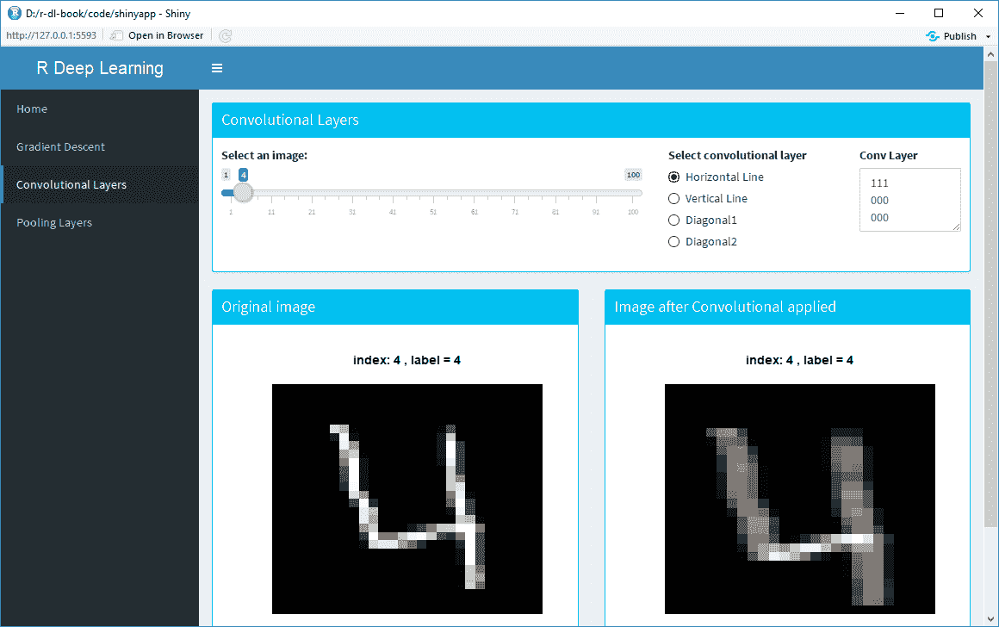
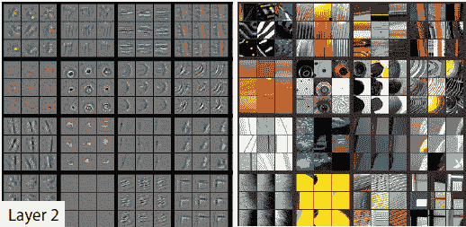

# 第五章：使用卷积神经网络进行图像分类

毫不夸张地说，深度学习领域对卷积神经网络的巨大兴趣增长，可以说主要归功于卷积神经网络。**卷积神经网络**（**CNN**）是深度学习中图像分类模型的主要构建块，并且已经取代了以前该领域专家使用的大多数技术。深度学习模型现在是执行所有大规模图像任务的事实标准方法，包括图像分类、目标检测、检测人工生成的图像，甚至为图像添加文本描述。本章中，我们将探讨其中一些技术。

为什么 CNN 如此重要？为了说明这一点，我们可以回顾一下 ImageNet 竞赛的历史。**ImageNet**竞赛是一个开放的大规模图像分类挑战，共有一千个类别。它可以视为图像分类的非正式世界锦标赛。参赛队伍大多由学者和研究人员组成，来自世界各地。2011 年，约 25%的错误率是基准。2012 年，由 Alex Krizhevsky 领导、Geoffrey Hinton 指导的团队通过取得 16%的错误率，赢得了比赛，取得了巨大进步。他们的解决方案包括 6000 万个参数和 65 万个神经元，五个卷积层，部分卷积层后接最大池化层，以及三个全连接层，最终通过一个 1000 分类的 Softmax 层进行最终分类。

其他研究人员在随后的几年里在他们的技术基础上做了改进，最终使得原始的 ImageNet 竞赛被基本视为*解决*。到 2017 年，几乎所有的队伍都达到了低于 5%的错误率。大多数人认为，2012 年 ImageNet 的胜利标志着新一轮深度学习革命的开始。

在本章中，我们将探讨使用 CNN 进行图像分类。我们将从`MNIST`数据集开始，`MNIST`被认为是深度学习任务的*Hello World*。`MNIST`数据集包含 10 个类别的灰度图像，尺寸为 28 x 28，类别为数字 0-9。这比 ImageNet 竞赛要容易得多；它有 10 个类别而不是 1000 个，图像是灰度的而不是彩色的，最重要的是，MNIST 图像中没有可能混淆模型的背景。然而，MNIST 任务本身也很重要；例如，大多数国家使用包含数字的邮政编码，每个国家都有更复杂变体的自动地址路由解决方案。

本任务中我们将使用 Amazon 的 MXNet 库。MXNet 库是深度学习的一个优秀入门库，它允许我们以比其他库（如后面会介绍的 TensorFlow）更高的抽象级别进行编码。

本章将涵盖以下主题：

+   什么是 CNN？

+   卷积层

+   池化层

+   Softmax

+   深度学习架构

+   使用 MXNet 进行图像分类

# 卷积神经网络（CNN）

卷积神经网络（CNN）是深度学习中图像分类的基石。本节将介绍它们，讲解 CNN 的历史，并解释它们为何如此强大。

在我们开始之前，我们将先看看一个简单的深度学习架构。深度学习模型难以训练，因此使用现有的架构通常是最好的起点。架构是一个现有的深度学习模型，在最初发布时是最先进的。一些例子包括 AlexNet、VGGNet、GoogleNet 等。我们将要介绍的是 Yann LeCun 及其团队于 1990 年代中期提出的用于数字分类的原始 LeNet 架构。这个架构被用来处理`MNIST`数据集。该数据集由 28 x 28 尺寸的灰度图像组成，包含数字 0 到 9。以下图示展示了 LeNet 架构：


图 5.1：LeNet 架构

原始图像大小为 28 x 28。我们有一系列的隐藏层，包括卷积层和池化层（在这里，它们被标记为*子采样*）。每个卷积层改变结构；例如，当我们在第一隐藏层应用卷积时，输出的大小是三维的。我们的最终层大小是 10 x 1，这与类别的数量相同。我们可以在这里应用一个`softmax`函数，将这一层的值转换为每个类别的概率。具有最高概率的类别将是每个图像的类别预测。

# 卷积层

本节将更深入地展示卷积层的工作原理。从基本层面来看，卷积层不过是一组滤波器。当你戴着带有红色镜片的眼镜看图像时，所有的事物似乎都带有红色的色调。现在，想象这些眼镜由不同的色调组成，也许是带有红色色调的镜片，里面还嵌入了一些水平绿色色调。如果你拥有这样一副眼镜，效果将是突出前方场景的某些方面。任何有绿色水平线的地方都会更加突出。

卷积层会在前一层的输出上应用一系列补丁（或卷积）。例如，在人脸识别任务中，第一层的补丁会识别图像中的基本特征，例如边缘或对角线。这些补丁会在图像上移动，匹配图像的不同部分。下面是一个 3 x 3 卷积块在 6 x 6 图像上应用的示例：


图 5.2：应用于图像的单一卷积示例

卷积块中的值是逐元素相乘（即非矩阵乘法），然后将这些值加起来得到一个单一值。下面是一个示例：


图 5.3：应用于输入层两个部分的卷积块示例

在这个例子中，我们的卷积块呈对角线模式。图像中的第一个块（*A1:C3*）也是对角线模式，因此当我们进行元素乘法并求和时，得到一个相对较大的值**6.3**。相比之下，图像中的第二个块（*D4:F6*）是水平线模式，因此我们得到一个较小的值。

可视化卷积层如何作用于整个图像可能很困难，因此下面的 R Shiny 应用将更加清晰地展示这一过程。该应用包含在本书的`Chapter5/server.R`文件中。请在**RStudio**中打开该文件并选择**Run app**。应用加载后，选择左侧菜单栏中的**Convolutional Layers**。应用将加载`MNIST`数据集中的前 100 张图像，这些图像稍后将用于我们的第一次深度学习图像分类任务。图像为 28 x 28 大小的灰度手写数字 0 到 9 的图像。下面是应用程序的截图，选择的是第四张图像，显示的是数字四：



图 5.4：显示水平卷积滤波器的 Shiny 应用

加载后，你可以使用滑块浏览图像。在右上角，有四个可选择的卷积层可应用于图像。在前面的截图中，选择了一个水平线卷积层，我们可以在右上角的文本框中看到它的样子。当我们将卷积滤波器应用到左侧的输入图像时，我们可以看到右侧的结果图像几乎完全是灰色的，只有在原始图像中的水平线位置才会突出显示。我们的卷积滤波器已经匹配了图像中包含水平线的部分。如果我们将卷积滤波器更改为垂直线，结果将如下所示：


图 5.5：显示垂直卷积滤波器的 Shiny 应用

现在我们可以看到，在应用卷积后，原始图像中的垂直线在右侧的结果图像中被突出显示。实际上，应用这些滤波器是一种特征提取的方式。我鼓励你使用该应用浏览图像，看看不同的卷积是如何应用于不同类别的图像的。

这就是卷积滤波器的基础，虽然它是一个简单的概念，但当你开始做两件事时，它会变得非常强大：

+   将许多卷积滤波器组合成卷积层

+   将另一组卷积滤波器（即卷积层）应用于先前卷积层的输出

这可能需要一些时间才能理解。如果我对一张图像应用了一个滤波器，然后对该输出再次应用一个滤波器，我得到的结果是什么？如果我再应用第三次，也就是先对一张图像应用滤波器，再对该输出应用滤波器，然后对该输出再应用滤波器，我得到的是什么？答案是，每一层后续的卷积层都会结合前一层识别到的特征，找到更为复杂的模式，例如角落、弧线等等。后续的层会发现更丰富的特征，比如一个带有弧形的圆圈，表示人的眼睛。

有两个参数用于控制卷积的移动：填充（padding）和步幅（strides）。在下图中，我们可以看到原始图像的大小是 6 x 6，而有 4 x 4 的子图。我们因此将数据表示从 6 x 6 矩阵减少到了 4 x 4 矩阵。当我们将大小为*c1*，*c2*的卷积应用于大小为 n，m 的数据时，输出将是*n-c1+1*，*m-c2+1*。如果我们希望输出与输入大小相同，可以通过在图像边缘添加零来填充输入。对于之前的例子，我们在整个图像周围添加一个 1 像素的边框。下图展示了如何将第一个 3 x 3 卷积应用于具有填充的图像：


图 5.6 在卷积前应用的填充

我们可以应用于卷积的第二个参数是步幅（strides），它控制卷积的移动。默认值为 1，这意味着卷积每次移动 1 个单位，首先向右移动，然后向下移动。在实际应用中，这个值很少被改变，因此我们将不再进一步讨论它。

我们现在知道，卷积像小型特征生成器一样工作，它们应用于输入层（对于第一层来说是图像数据），而后续的卷积层则发现更复杂的特征。那么它们是如何计算的呢？我们是否需要精心手动设计一组卷积来应用到我们的模型中？答案是否定的；这些卷积是通过梯度下降算法的魔力自动计算出来的。最佳的特征模式是在经过多次训练数据集迭代后找到的。

那么，一旦我们超越了 2-3 层卷积层，卷积是如何工作的呢？答案是，任何人都很难理解卷积层具体的数学原理。即使是这些网络设计的原始设计者，也可能并不完全理解一系列卷积神经网络中的隐藏层在做什么。如果这让你感到担忧，请记住，2012 年赢得 ImageNet 竞赛的解决方案有 6000 万个参数。随着计算能力的进步，深度学习架构可能会有数亿个参数。对于任何人来说，完全理解如此复杂的模型中的每一个细节是不可能的。这就是为什么这些模型常常被称为**黑箱**模型的原因。

这可能一开始让你感到惊讶。深度学习如何在图像分类中实现人类水平的表现？如果我们不能完全理解它们是如何工作的，我们又如何构建深度学习模型呢？这个问题已经将深度学习社区分裂，主要是行业与学术界之间的分歧。许多（但不是所有）研究人员认为，我们应该更深入地理解深度学习模型的工作原理。一些研究人员还认为，只有通过更好地理解当前架构的工作原理，我们才能开发出下一代人工智能应用。在最近的 NIPS 会议上（这是深度学习领域最古老和最重要的会议之一），深度学习被不利地与炼金术相提并论。与此同时，业界的从业者并不关心深度学习是如何工作的。他们更关注构建更加复杂的深度学习架构，以最大化准确性或性能。

当然，这只是业界现状的粗略描述；并不是所有学者都是向内看的，也不是所有从业者都仅仅是在调整模型以获得小幅改进。深度学习仍然相对较新（尽管神经网络的基础块已经存在了数十年）。但这种紧张关系确实存在，并且已经持续了一段时间——例如，一种流行的深度学习架构引入了*Inception*模块，命名灵感来源于电影《盗梦空间》中的*Inception*。在这部电影中，莱昂纳多·迪卡普里奥带领一个团队，通过进入人们的梦境来改变他们的思想和观点。最初，他们只进入一个层次的梦境，但随后深入下去，实际上进入了梦中的梦境。随着他们深入，梦境变得越来越复杂，结果也变得不确定。我们在这里不会详细讨论*Inception 模块*的具体内容，但它们将卷积层和最大池化层并行结合在一起。论文的作者在论文中承认了该模型的内存和计算成本，但通过将关键组件命名为*Inception 模块*，他们巧妙地暗示了自己站在哪一方。

在 2012 年 ImageNet 竞赛获胜者的突破性表现之后，两个研究人员对模型的工作原理缺乏洞见感到不满。他们决定逆向工程该算法，尝试展示导致特征图中某一激活的输入模式。这是一项非平凡的任务，因为原始模型中使用的某些层（例如池化层）会丢弃信息。他们的论文展示了每一层的前 9 个激活。以下是第一层的特征可视化：


图 5.7：CNN 第一层的特征可视化 来源：https://cs.nyu.edu/~fergus/papers/zeilerECCV2014.pdf

这张图片分为两部分；左边我们可以看到卷积（论文只突出了每层的 9 个卷积）。右边，我们可以看到与该卷积匹配的图像中的模式示例。例如，左上角的卷积是一个对角线边缘检测器。以下是第二层的特征可视化：



图 5.8：CNN 第二层的特征可视化 来源：https://cs.nyu.edu/~fergus/papers/zeilerECCV2014.pdf

同样，左侧的图像是卷积的解释，而右侧的图像展示了激活该卷积的图像补丁示例。在这里，我们开始看到一些组合模式。例如，在左上角，我们可以看到有条纹的图案。更有趣的是第二行第二列的例子。在这里，我们看到圆形图形，这可能表示一个人的或动物的眼球。现在，让我们继续来看第三层的特征可视化：


图 5.9：CNN 第三层的特征可视化 来源：https://cs.nyu.edu/~fergus/papers/zeilerECCV2014.pdf

在第三层中，我们可以看到一些非常有趣的模式。在第二行第二列，我们已经识别出车轮的部分。在第三行第三列，我们已经开始识别人脸。在第二行第四列，我们识别出了图像中的文本。

在论文中，作者展示了更多层的示例。我鼓励你阅读论文，进一步了解卷积层的工作原理。

需要注意的是，尽管深度学习模型在图像分类任务中能够达到与人类相当的表现，但它们并不像人类那样解读图像。它们没有“猫”或“狗”的概念，它们只能匹配给定的模式。在论文中，作者强调了一个例子，在这个例子中，匹配的模式几乎没有任何相似之处；模型匹配的是背景中的特征（如草地），而不是前景中的物体。

在另一个图像分类任务中，模型在实际操作中失败了。任务是区分狼和狗。模型在实际应用中失败是因为训练数据包含了处于自然栖息地的狼——即雪地。因此，模型误以为任务是区分*雪*和*狗*。任何在其他环境下的狼的图像都会被错误分类。

从中得到的教训是，训练数据应该是多样化的，并且与模型预期要预测的实际数据密切相关。理论上这可能听起来很显而易见，但在实践中往往并不容易做到。我们将在下一章进一步讨论这一点。

# 池化层

池化层在卷积神经网络（CNN）中用于减少模型中的参数数量，因此可以减少过拟合。它们可以被看作是一种降维方式。类似于卷积层，池化层在上一层上滑动，但操作和返回值不同。它返回一个单一的值，通常是该区域内各个单元格的最大值，因此称之为最大池化。你也可以执行其他操作，例如平均池化，但这种方式较少使用。这里是一个使用 2 x 2 块进行最大池化的例子。第一个块的值为 7、0、6、6，其中最大值为 7，因此输出为 7。注意，最大池化通常不使用填充（padding），并且它通常会应用步幅参数来移动块。这里的步幅是 2，因此在获取第一个块的最大值后，我们会向右移动 2 个单元：


图 5.10：最大池化应用于矩阵

我们可以看到，最大池化将输出减少了四倍；输入是 6 x 6，输出是 3 x 3。如果你之前没有见过这种情况，你的第一反应可能是不相信。为什么我们要丢弃数据？为什么要使用最大池化？这个问题的答案有三个部分：

+   **池化**：它通常在卷积层之后应用，因此我们不是在像素上操作，而是在匹配的模式上操作。卷积层之后的降维并不会丢弃 75% 的输入数据；如果存在模式，数据中仍然有足够的信号来识别它。

+   **正则化**：如果你学习过机器学习，你会知道许多模型在处理相关特征时会遇到问题，而且通常建议去除相关特征。在图像数据中，特征与它们周围的空间模式高度相关。应用最大池化可以在保持特征的同时减少数据。

+   **执行速度**：当我们考虑前面提到的两个原因时，我们可以看到，最大池化大大减少了网络的大小，而没有去除过多的信号。这使得模型训练变得更快。

需要注意的是，卷积层和池化层使用的参数是不同的。通常，卷积块的尺寸比池化块大（例如 3 x 3 的卷积块和 2 x 2 的池化块），而且它们不应该重叠。例如，不能同时使用 4 x 4 的卷积块和 2 x 2 的池化块。如果它们重叠，池化块将仅仅在相同的卷积块上操作，模型将无法正确训练。

# Dropout

**Dropout**是一种正则化方法，旨在防止模型过拟合。过拟合是指模型记住了训练数据集中的一部分内容，但在未见过的测试数据上表现不佳。当你构建模型时，可以通过查看训练集的准确度与测试集的准确度之间的差距来检查是否存在过拟合问题。如果训练集上的表现远好于测试集，那么模型就是过拟合的。Dropout 指的是在训练过程中临时随机移除网络中的一些节点。它通常只应用于隐藏层，而不应用于输入层。下面是应用 dropout 的神经网络示例：


图 5.11：深度学习模型中 dropout 的示例

每次前向传播时，会移除一组不同的节点，因此每次网络的结构都会不同。在原始论文中，dropout 被与集成技术进行了比较，从某种程度上来说，它确实有相似之处。dropout 的工作方式与随机森林为每棵树随机选择特征的方式有些相似。

另一种看待 dropout 的方式是，每个层中的节点必须学会与该层中的所有节点以及它从上一层获得的输入一起工作。这可以防止某些节点在层内占据主导地位并获得过大的权重，从而影响该层的输出。这意味着每个层中的节点将作为一个整体工作，防止某些节点过于懒惰，而其他节点过于支配。

# Flatten 层、密集层和 softmax

应用多个卷积层后，得到的数据结构是一个多维矩阵（或张量）。我们必须将其转换为所需输出形状的矩阵。例如，如果我们的分类任务有 10 个类别（例如，`MNIST`示例中的 10 个类别），则需要将模型的输出设置为一个 1 x 10 的矩阵。我们通过将卷积层和最大池化层的结果进行处理，使用 Flatten 层重新塑造数据来实现这一点。最后一层的节点数应与我们要预测的类别数相同。如果我们的任务是二分类任务，则最后一层的`activation`函数将是 sigmoid。如果我们的任务是多分类任务，则最后一层的`activation`函数将是 softmax。

在应用 softmax/sigmoid 激活函数之前，我们可以选择性地应用多个密集层。密集层就是我们在第一章《深度学习入门》中看到的普通隐藏层。

我们需要一个 softmax 层，因为最后一层的值是数字，但范围从负无穷到正无穷。我们必须将这些输入值转换为一系列概率，表示该实例属于每个类别的可能性。将这些数值转换为概率的函数必须具有以下特点：

+   每个输出值必须在 0.0 到 1.0 之间。

+   输出值的总和应为 1.0。

一种方法是通过将每个输入值除以绝对输入值的总和来重新缩放这些值。这个方法有两个问题：

+   它无法正确处理负值。

+   重新缩放输入值可能会导致概率值过于接近。

这两个问题可以通过首先对每个输入值应用 **e^x**（其中 e 为 2.71828）然后重新缩放这些值来解决。这将把任何负数转换为一个小的正数，同时也使得概率更加极化。可以通过一个示例来演示这一点；在这里，我们可以看到来自稠密层的结果。类别 5 和 6 的值分别为 17.2 和 15.8，相当接近。然而，当我们应用 `softmax` 函数时，类别 5 的概率值是类别 6 的 4 倍。`softmax` 函数倾向于使某个类别的概率远远大于其他类别，这正是我们所希望的：


图 5.12 Softmax 函数的示例。

# 使用 MXNet 库进行图像分类。

MXNet 包在第一章中介绍过，*深度学习入门*，如果你还没有安装这个包，可以回到该章查看安装说明。我们将演示如何在图像数据分类任务中获得接近 100% 的准确率。我们将使用在第二章中介绍的 `MNIST` 数据集，*使用卷积神经网络进行图像分类*。该数据集包含手写数字（0-9）的图像，所有图像大小为 28 x 28。它是深度学习中的 *Hello World!*。Kaggle 上有一个长期的竞赛使用这个数据集。脚本 `Chapter5/explore.Rmd` 是一个 R markdown 文件，用于探索这个数据集。

1.  首先，我们将检查数据是否已经下载，如果没有，我们将下载它。如果该链接无法获取数据，请参阅 `Chapter2/chapter2.R` 中的代码，获取数据的替代方法：

```py
dataDirectory <- "../data"
if (!file.exists(paste(dataDirectory,'/train.csv',sep="")))
{
  link <- 'https://apache-mxnet.s3-accelerate.dualstack.amazonaws.com/R/data/mnist_csv.zip'
  if (!file.exists(paste(dataDirectory,'/mnist_csv.zip',sep="")))
    download.file(link, destfile = paste(dataDirectory,'/mnist_csv.zip',sep=""))
  unzip(paste(dataDirectory,'/mnist_csv.zip',sep=""), exdir = dataDirectory)
  if (file.exists(paste(dataDirectory,'/test.csv',sep="")))
    file.remove(paste(dataDirectory,'/test.csv',sep=""))
}
```

1.  接下来，我们将数据读取到 R 中并进行检查：

```py
train <- read.csv(paste(dataDirectory,'/train.csv',sep=""), header=TRUE, nrows=20)
```

我们有 `20` 行和 `785` 列。在这里，我们将查看数据集末尾的行，并查看前 6 列和最后 6 列：

```py
tail(train[,1:6])
   label pixel0 pixel1 pixel2 pixel3 pixel4
15     3      0      0      0      0      0
16     1      0      0      0      0      0
17     2      0      0      0      0      0
18     0      0      0      0      0      0
19     7      0      0      0      0      0
20     5      0      0      0      0      0

tail(train[,(ncol(train)-5):ncol(train)])
   pixel778 pixel779 pixel780 pixel781 pixel782 pixel783
15        0        0        0        0        0        0
16        0        0        0        0        0        0
17        0        0        0        0        0        0
18        0        0        0        0        0        0
19        0        0        0        0        0        0
20        0        0        0        0        0        0
```

我们有 `785` 列。第一列是数据标签，然后是 784 列，命名为 `pixel0`、…、`pixel783`，其中包含像素值。我们的图像是 *28 x 28 = 784*，因此一切看起来正常。

在我们开始构建模型之前，确保数据格式正确、特征与标签对齐总是一个好主意。让我们绘制前 9 个实例及其数据标签。

1.  为此，我们将创建一个名为 `plotInstance` 的 `helper` 函数，该函数接受像素值并输出图像，带有可选的标题：

```py
plotInstance <-function (row,title="")
 {
  mat <- matrix(row,nrow=28,byrow=TRUE)
  mat <- t(apply(mat, 2, rev))
  image(mat, main = title,axes = FALSE, col = grey(seq(0, 1, length = 256)))
 }
 par(mfrow = c(3, 3))
 par(mar=c(2,2,2,2))
 for (i in 1:9)
 {
  row <- as.numeric(train[i,2:ncol(train)])
  plotInstance(row, paste("index:",i,", label =",train[i,1]))
 }
```

这段代码的输出显示了前 9 张图像及其分类：


图 5.13：MNIST 数据集中的前 9 张图像

这完成了我们的数据探索。现在，我们可以继续使用 MXNet 库创建一些深度学习模型。我们将创建两个模型——第一个是标准的神经网络模型，我们将其作为基线。第二个深度学习模型基于一个名为**LeNet**的架构。这是一个较旧的架构，但由于我们的图像分辨率较低且不包含背景，因此在这种情况下适用。LeNet 的另一个优点是，它的训练速度很快，即使是在 CPU 上也能高效训练，因为它的层数不多。

本节代码位于`Chapter5/mnist.Rmd`。我们必须将数据读入 R 并转换为矩阵。我们将训练数据分割成训练集和测试集，以便获得不偏的准确性估计。由于数据行数较多，我们可以使用 90/10 的分割比例：

```py
require(mxnet)
options(scipen=999)

dfMnist <- read.csv("../data/train.csv", header=TRUE)
yvars <- dfMnist$label
dfMnist$label <- NULL

set.seed(42)
train <- sample(nrow(dfMnist),0.9*nrow(dfMnist))
test <- setdiff(seq_len(nrow(dfMnist)),train)
train.y <- yvars[train]
test.y <- yvars[test]
train <- data.matrix(dfMnist[train,])
test <- data.matrix(dfMnist[test,])

rm(dfMnist,yvars)
```

每个图像表示为 784 个（28 x 28）像素值的一行。每个像素的值范围为 0-255，我们通过除以 255 将其线性转换为 0-1。我们还对输入矩阵进行转置，因为`mxnet`使用的是列主序格式。

```py
train <- t(train / 255.0)
test <- t(test / 255.0)
```

在创建模型之前，我们应该检查我们的数据集是否平衡，即每个数字的实例数是否合理均衡：

```py
table(train.y)
## train.y
##    0    1    2    3    4    5    6    7    8    9
## 3716 4229 3736 3914 3672 3413 3700 3998 3640 3782
```

看起来没问题，我们现在可以继续创建一些深度学习模型了。

# 基础模型（无卷积层）

现在我们已经探索了数据，并且确认它看起来没问题，下一步是创建我们的第一个深度学习模型。这与我们在上一章看到的示例类似。该代码位于`Chapter5/mnist.Rmd`：

```py
data <- mx.symbol.Variable("data")
fullconnect1 <- mx.symbol.FullyConnected(data, name="fullconnect1", num_hidden=256)
activation1 <- mx.symbol.Activation(fullconnect1, name="activation1", act_type="relu")
fullconnect2 <- mx.symbol.FullyConnected(activation1, name="fullconnect2", num_hidden=128)
activation2 <- mx.symbol.Activation(fullconnect2, name="activation2", act_type="relu")
fullconnect3 <- mx.symbol.FullyConnected(activation2, name="fullconnect3", num_hidden=10)
softmax <- mx.symbol.SoftmaxOutput(fullconnect3, name="softmax")
```

让我们详细查看这段代码：

1.  在`mxnet`中，我们使用其自有的数据类型符号来配置网络。

1.  我们创建了第一个隐藏层（`fullconnect1 <- ....`）。这些参数是输入数据、层的名称以及该层的神经元数。

1.  我们对`fullconnect`层应用激活函数（`activation1 <- ....`）。`mx.symbol.Activation`函数接收来自第一个隐藏层`fullconnect1`的输出。

1.  第二个隐藏层（`fullconnect1 <- ....`）将`activation1`作为输入。

1.  第二个激活函数类似于`activation1`。

1.  `fullconnect3`是输出层。该层有 10 个神经元，因为这是一个多分类问题，共有 10 个类别。

1.  最后，我们使用 softmax 激活函数来为每个类别获得一个概率预测。

现在，让我们训练基础模型。我安装了 GPU，因此可以使用它。你可能需要将这一行改为`devices <- mx.cpu()`：

```py
devices <- mx.gpu()
mx.set.seed(0)
model <- mx.model.FeedForward.create(softmax, X=train, y=train.y,
                                     ctx=devices,array.batch.size=128,
                                     num.round=10,
                                     learning.rate=0.05, momentum=0.9,
                                     eval.metric=mx.metric.accuracy,
                                     epoch.end.callback=mx.callback.log.train.metric(1))
```

为了进行预测，我们将调用`predict`函数。然后我们可以创建混淆矩阵，并计算测试数据的准确率：

```py
preds1 <- predict(model, test)
pred.label1 <- max.col(t(preds1)) - 1
res1 <- data.frame(cbind(test.y,pred.label1))
table(res1)
##      pred.label1
## test.y   0   1   2   3   4   5   6   7   8   9
##      0 405   0   0   1   1   2   1   1   0   5
##      1   0 449   1   0   0   0   0   4   0   1
##      2   0   0 436   0   0   0   0   3   1   1
##      3   0   0   6 420   0   1   0   2   8   0
##      4   0   1   1   0 388   0   2   0   1   7
##      5   2   0   0   6   1 363   3   0   2   5
##      6   3   1   3   0   2   1 427   0   0   0
##      7   0   2   3   0   1   0   0 394   0   3
##      8   0   4   2   4   0   2   1   1 403   6
##      9   1   0   1   2   7   0   1   1   0 393

accuracy1 <- sum(res1$test.y == res1$pred.label1) / nrow(res1)
accuracy1
## 0.971
```

我们的基础模型的准确率为`0.971`。还不错，但让我们看看能否有所改进。

# LeNet

现在，我们可以基于 LeNet 架构创建一个模型。这是一个非常简单的模型；我们有两组卷积层和池化层，然后是一个 Flatten 层，最后是两个全连接层。相关代码在 `Chapter5/mnist.Rmd` 中。首先，我们来定义这个模型：

```py
data <- mx.symbol.Variable('data')
# first convolution layer
convolution1 <- mx.symbol.Convolution(data=data, kernel=c(5,5), num_filter=64)
activation1 <- mx.symbol.Activation(data=convolution1, act_type="tanh")
pool1 <- mx.symbol.Pooling(data=activation1, pool_type="max",
                           kernel=c(2,2), stride=c(2,2))

# second convolution layer
convolution2 <- mx.symbol.Convolution(data=pool1, kernel=c(5,5), num_filter=32)
activation2 <- mx.symbol.Activation(data=convolution2, act_type="relu")
pool2 <- mx.symbol.Pooling(data=activation2, pool_type="max",
                           kernel=c(2,2), stride=c(2,2))

# flatten layer and then fully connected layers
flatten <- mx.symbol.Flatten(data=pool2)
fullconnect1 <- mx.symbol.FullyConnected(data=flatten, num_hidden=512)
activation3 <- mx.symbol.Activation(data=fullconnect1, act_type="relu")
fullconnect2 <- mx.symbol.FullyConnected(data=activation3, num_hidden=10)
# final softmax layer
softmax <- mx.symbol.SoftmaxOutput(data=fullconnect2)

```

现在，让我们重新调整数据的形状，以便它可以在 MXNet 中使用：

```py
train.array <- train
dim(train.array) <- c(28,28,1,ncol(train))
test.array <- test
dim(test.array) <- c(28,28,1,ncol(test))
```

最后，我们可以构建模型：

```py
devices <- mx.gpu()
mx.set.seed(0)
model2 <- mx.model.FeedForward.create(softmax, X=train.array, y=train.y,
                                     ctx=devices,array.batch.size=128,
                                     num.round=10,
                                     learning.rate=0.05, momentum=0.9, wd=0.00001,
                                     eval.metric=mx.metric.accuracy,
                                     epoch.end.callback=mx.callback.log.train.metric(1))
```

最后，让我们评估模型：

```py
preds2 <- predict(model2, test.array)
pred.label2 <- max.col(t(preds2)) - 1
res2 <- data.frame(cbind(test.y,pred.label2))
table(res2)
## pred.label2
## test.y   0   1   2   3   4   5   6   7   8   9
##      0 412   0   0   0   0   1   1   1   0   1
##      1   0 447   1   1   1   0   0   4   1   0
##      2   0   0 438   0   0   0   0   3   0   0
##      3   0   0   6 427   0   1   0   1   2   0
##      4   0   0   0   0 395   0   0   1   0   4
##      5   1   0   0   5   0 369   2   0   1   4
##      6   2   0   0   0   1   1 432   0   1   0
##      7   0   0   2   0   0   0   0 399   0   2
##      8   1   0   1   0   1   1   1   1 414   3
##      9   2   0   0   0   4   0   0   1   1 398

accuracy2
## 0.9835714
```

我们的 CNN 模型的准确率是 `0.9835714`，相比我们基准模型的 `0.971`，有了相当大的提升。

最后，我们可以在 R 中可视化我们的模型：

```py
graph.viz(model2$symbol)
```

这会生成以下图表，展示深度学习模型的架构：


图 5.14：卷积深度学习模型（LeNet）

恭喜你！你已经构建了一个准确率超过 98% 的深度学习模型！

我们在 *图 5.1* 中看到了 LeNet 的架构，并且已经使用 MXNet 库进行了编程。接下来，我们更详细地分析 LeNet 架构。本质上，我们有两组卷积层和两层全连接层。我们的卷积组包含一个卷积层，接着是一个 `activation` 函数，然后是一个池化层。这种层的组合在许多深度学习图像分类任务中非常常见。第一层卷积层有 64 个 5 x 5 大小的卷积块，没有填充。这可能会错过图像边缘的一些特征，但如果我们回顾 *图 5.15* 中的样本图像，我们可以看到大多数图像的边缘并没有数据。我们使用 `pool_type=max` 的池化层。其他类型也是可能的；平均池化曾经常用，但最近已经不太流行了。这也是一个可以尝试的超参数。我们计算 2 x 2 的池化区域，然后步长为 2（即“跳跃”）。因此，每个输入值在最大池化层中只使用一次。

我们为第一个卷积块使用`Tanh`作为激活函数，然后为后续层使用`ReLU`。如果你愿意，可以尝试更改这些并查看它们的效果。执行卷积层后，我们可以使用 Flatten 将数据重构为全连接层可以使用的格式。全连接层就是一组节点集合，也就是类似于前面代码中基本模型的层。我们有两层，一层包含 512 个节点，另一层包含 10 个节点。我们选择在最后一层中使用 10 个节点，因为这是我们问题中的类别数量。最后，我们使用 Softmax 将该层中的数值转化为每个类别的概率集。我们已经达到了 98.35%的准确率，这比*普通*的深度学习模型有了显著的提升，但仍然有改进空间。一些模型在该数据集上的准确率可达到 99.5%，也就是每 1000 个记录中有 5 个错误分类。接下来，我们将查看一个不同的数据集，虽然它与 MNIST 相似，但比 MNIST 要更具挑战性。这就是 Fashion `MNIST`数据集，具有与 MNIST 相同大小的灰度图像，并且也有 10 个类别。

# 使用 Fashion MNIST 数据集进行分类

这个数据集与`MNIST`的结构相同，因此我们只需要更换数据集，并使用我们现有的加载数据的样板代码。脚本`Chapter5/explore_Fashion.Rmd`是一个 R markdown 文件，用来探索这个数据集；它与我们之前用于`MNIST`数据集的`explore.Rmd`几乎完全相同，因此我们不再重复。唯一的不同是在`explore.Rmd`中增加了输出标签。我们将查看 16 个示例，因为这是一个新数据集。以下是使用我们为`MNIST`数据集创建示例时所用的相同样板代码，生成的一些来自该数据集的示例图像：


图 5.15：来自 Fashion MNIST 数据集的部分图像

这个数据集的一个有趣的事实是，发布该数据集的公司还创建了一个 GitHub 仓库，在那里他们对比了多种机器学习库在该数据集上的表现。基准测试可以在[`fashion-mnist.s3-website.eu-central-1.amazonaws.com/`](http://fashion-mnist.s3-website.eu-central-1.amazonaws.com/)查看。如果我们查看这些结果，会发现他们尝试的所有机器学习库都没有达到 90%的准确率（他们没有尝试深度学习）。这是我们希望通过深度学习分类器超越的目标。深度学习模型的代码在`Chapter5/fmnist.R`中，能够在该数据集上实现超过 91%的准确率。与上面模型架构相比，有一些小的但重要的差异。试着在不查看解释的情况下找到它们。

首先，让我们定义模型架构。

```py
data <- mx.symbol.Variable('data')
# first convolution layer
convolution1 <- mx.symbol.Convolution(data=data, kernel=c(5,5),
                                      stride=c(1,1), pad=c(2,2), num_filter=64)
activation1 <- mx.symbol.Activation(data=convolution1, act_type=act_type1)
pool1 <- mx.symbol.Pooling(data=activation1, pool_type="max",
                           kernel=c(2,2), stride=c(2,2))

# second convolution layer
convolution2 <- mx.symbol.Convolution(data=pool1, kernel=c(5,5),
                                      stride=c(1,1), pad=c(2,2), num_filter=32)
activation2 <- mx.symbol.Activation(data=convolution2, act_type=act_type1)
pool2 <- mx.symbol.Pooling(data=activation2, pool_type="max",
                           kernel=c(2,2), stride=c(2,2))

# flatten layer and then fully connected layers with activation and dropout
flatten <- mx.symbol.Flatten(data=pool2)
fullconnect1 <- mx.symbol.FullyConnected(data=flatten, num_hidden=512)
activation3 <- mx.symbol.Activation(data=fullconnect1, act_type=act_type1)
drop1 <- mx.symbol.Dropout(data=activation3,p=0.4)
fullconnect2 <- mx.symbol.FullyConnected(data=drop1, num_hidden=10)
# final softmax layer
softmax <- mx.symbol.SoftmaxOutput(data=fullconnect2)
```

现在让我们来训练模型：

```py
logger <- mx.metric.logger$new()
model2 <- mx.model.FeedForward.create(softmax, X=train.array, y=train.y,
                                     ctx=devices, num.round=20,
                                     array.batch.size=64,
                                     learning.rate=0.05, momentum=0.9,
                                     wd=0.00001,
                                     eval.metric=mx.metric.accuracy,
                                     eval.data=list(data=test.array,labels=test.y),
                                     epoch.end.callback=mx.callback.log.train.metric(100,logger))
```

第一个变化是我们将所有层的激活函数切换为使用`relu`。另一个变化是我们为卷积层使用了填充，以便捕捉图像边缘的特征。我们增加了每一层的节点数，给模型增加了深度。我们还添加了一个 dropout 层，以防止模型过拟合。我们还在模型中加入了日志记录功能，输出每个 epoch 的训练和验证指标。我们利用这些数据来检查模型表现，并决定它是否过拟合。

这是该模型的准确率结果及其诊断图：

```py
preds2 <- predict(model2, test.array)
pred.label2 <- max.col(t(preds2)) - 1
res2 <- data.frame(cbind(test.y,pred.label2))
table(res2)
      pred.label2
test.y   0   1   2   3   4   5   6   7   8   9
     0 489   0  12  10   0   0  53   0   3   0
     1   0 586   1   6   1   0   1   0   0   0
     2   8   1 513   7  56   0  31   0   0   0
     3  13   0   3 502  16   0  26   1   1   0
     4   1   1  27  13 517   0  32   0   2   0
     5   1   0   0   0   0 604   0   9   0   3
     6  63   0  47   9  28   0 454   0   3   0
     7   0   0   0   1   0  10   0 575   1  11
     8   0   0   1   0   1   2   1   0 618   0
     9   0   0   0   0   0   1   0  17   1 606
accuracy2 <- sum(res2$test.y == res2$pred.label2) / nrow(res2)
accuracy2
# 0.9106667
```

需要注意的一点是，我们在训练过程中展示度量指标和评估最终模型时使用的是相同的验证/测试集。这并不是一个好做法，但在这里是可以接受的，因为我们并没有使用验证指标来调整模型的超参数。我们 CNN 模型的准确率是`0.9106667`。

让我们绘制训练集和验证集准确率随模型训练进展的变化图。深度学习模型代码中有一个`callback`函数，可以在模型训练时保存指标。我们可以利用它绘制每个 epoch 的训练和验证指标图：

```py
# use the log data collected during model training
dfLogger<-as.data.frame(round(logger$train,3))
dfLogger2<-as.data.frame(round(logger$eval,3))
dfLogger$eval<-dfLogger2[,1]
colnames(dfLogger)<-c("train","eval")
dfLogger$epoch<-as.numeric(row.names(dfLogger))

data_long <- melt(dfLogger, id="epoch")

ggplot(data=data_long,
       aes(x=epoch, y=value, colour=variable,label=value)) +
  ggtitle("Model Accuracy") +
  ylab("accuracy") +
  geom_line()+geom_point() +
  geom_text(aes(label=value),size=3,hjust=0, vjust=1) +
  theme(legend.title=element_blank()) +
  theme(plot.title = element_text(hjust = 0.5)) +
  scale_x_discrete(limits= 1:nrow(dfLogger))
```

这向我们展示了模型在每个 epoch（或训练轮次）后的表现。以下是生成的截图：


图 5.16：每个 epoch 的训练和验证准确率

从这张图中可以得出两个主要结论：

+   该模型出现了过拟合。我们可以看到训练集的性能为**0.95xxx**，而验证集的性能为**0.91xxx**，二者之间存在明显的差距。

+   我们可能在第 8 个 epoch 后就可以停止模型训练，因为此后性能没有再提升。

正如我们在前几章讨论的那样，深度学习模型默认几乎总是会出现过拟合，但有方法可以避免这一点。第二个问题与*早停*相关，了解如何做到这一点至关重要，这样你就不会浪费数小时继续训练一个不再改进的模型。如果你是使用云资源来构建模型，这一点尤其重要。我们将在下一章讨论这些以及与构建深度学习模型相关的更多问题。

# 参考文献/进一步阅读

这些论文是该领域经典的深度学习论文，其中一些记录了赢得 ImageNet 竞赛的方案。我鼓励你下载并阅读所有这些论文。你可能一开始无法理解它们，但随着你在深度学习领域的进展，它们的重要性将变得更加显而易见。

+   Krizhevsky, Alex, Ilya Sutskever 和 Geoffrey E. Hinton. *使用深度卷积神经网络进行 ImageNet 分类*. 神经信息处理系统进展. 2012.

+   Szegedy, Christian 等人. *通过卷积深入探索*. Cvpr, 2015.

+   LeCun, Yann 等人。*分类学习算法：手写数字识别比较研究*。神经网络：统计力学视角 261（1995）：276。

+   Zeiler, Matthew D.和 Rob Fergus。*可视化和理解卷积网络*。欧洲计算机视觉会议。斯普林格，香槟，2014。

+   Srivastava, Nitish 等人。*Dropout：防止神经网络过拟合的简单方法*。机器学习研究杂志 15.1（2014）：1929-1958。

# 摘要

在本章中，我们使用深度学习进行图像分类。我们讨论了用于图像分类的不同层类型：卷积层，池化层，Dropout，全连接层以及 Softmax 激活函数。我们看到了一个 R-Shiny 应用程序，展示了卷积层如何在图像数据上进行特征工程。

我们使用 MXNet 深度学习库在 R 中创建了一个基础深度学习模型，其准确率达到了 97.1%。然后，我们基于 LeNet 架构开发了一个 CNN 深度学习模型，在测试数据上实现了超过 98.3%的准确率。我们还使用了一个稍难的数据集（`Fashion MNIST`），并创建了一个新模型，其准确率超过了 91%。这个准确率比使用非深度学习算法的所有分数都要好。在下一章中，我们将建立在我们所讨论的基础上，并展示如何利用预训练模型进行分类，以及作为新深度学习模型的构建块。

在接下来的章节中，我们将讨论深度学习中关于调优和优化模型的重要主题。这包括如何利用可能有的有限数据，数据预处理，数据增强以及超参数选择。
