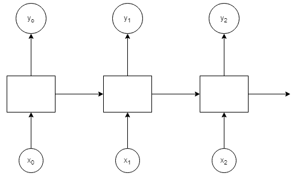

# 第七章：使用深度学习的自然语言处理

本章将展示如何使用深度学习进行 **自然语言处理**（**NLP**）。NLP 是对人类语言文本的处理。NLP 是一个广泛的术语，涵盖了涉及文本数据的多种任务，包括（但不限于）以下内容：

+   **文档分类**：根据主题将文档分类为不同类别

+   **命名实体识别**：从文档中提取关键信息，例如人物、组织和地点

+   **情感分析**：将评论、推文或评价分类为正面或负面情感

+   **语言翻译**：将文本数据从一种语言翻译成另一种语言

+   **词性标注**：为文档中的每个单词分配类型，通常与其他任务一起使用

在本章中，我们将讨论文档分类，这是最常见的自然语言处理技术之一。本章的结构与前几章不同，因为我们将集中讨论一个用例（文本分类），但会应用多种方法。本章将涵盖：

+   如何使用传统机器学习技术进行文本分类

+   词向量

+   比较传统文本分类与深度学习

+   高级深度学习文本分类，包括 1D 卷积神经网络、RNN、LSTM 和 GRU

# 文档分类

本章将通过 Keras 进行文本分类。我们将使用的数据集包含在 Keras 库中。与前几章一样，我们将首先使用传统机器学习技术创建基准模型，然后再应用深度学习算法。这样做的目的是展示深度学习模型与其他技术的表现差异。

# Reuters 数据集

我们将使用 Reuters 数据集，可以通过 Keras 库中的一个函数访问该数据集。该数据集包含 11,228 条记录，涵盖 46 个类别。要查看有关该数据集的更多信息，请运行以下代码：

```py
library(keras)
?dataset_reuters
```

尽管可以通过 Keras 访问 Reuters 数据集，但它并不是其他机器学习算法可以直接使用的格式。文本数据不是实际的单词，而是单词索引的列表。我们将编写一个简短的脚本（`Chapter7/create_reuters_data.R`），它下载数据及其查找索引文件，并创建一个包含 `y` 变量和文本字符串的数据框。然后，我们将把训练数据和测试数据分别保存到两个文件中。以下是创建训练数据文件的代码第一部分：

```py
library(keras)

# the reuters dataset is in Keras
c(c(x_train, y_train), c(x_test, y_test)) %<-% dataset_reuters()
word_index <- dataset_reuters_word_index()

# convert the word index into a dataframe
idx<-unlist(word_index)
dfWords<-as.data.frame(idx)
dfWords$word <- row.names(dfWords)
row.names(dfWords)<-NULL
dfWords <- dfWords[order(dfWords$idx),]

# create a dataframe for the train data
# for each row in the train data, we have a list of index values
# for words in the dfWords dataframe
dfTrain <- data.frame(y_train)
dfTrain$sentence <- ""
colnames(dfTrain)[1] <- "y"
for (r in 1:length(x_train))
{
  row <- x_train[r]
  line <- ""
  for (i in 1:length(row[[1]]))
  {
     index <- row[[1]][i]
     if (index >= 3)
       line <- paste(line,dfWords[index-3,]$word)
  }
  dfTrain[r,]$sentence <- line
  if ((r %% 100) == 0)
    print (r)
}
write.table(dfTrain,"../data/reuters.train.tab",sep="\t",row.names = FALSE)

```

代码的第二部分类似，它创建了包含测试数据的文件：

```py
# create a dataframe for the test data
# for each row in the train data, we have a list of index values
# for words in the dfWords dataframe
dfTest <- data.frame(y_test)
dfTest$sentence <- ""
colnames(dfTest)[1] <- "y"
for (r in 1:length(x_test))
{
  row <- x_test[r]
  line <- ""
  for (i in 1:length(row[[1]]))
  {
    index <- row[[1]][i]
    if (index >= 3)
      line <- paste(line,dfWords[index-3,]$word)
  }
  dfTest[r,]$sentence <- line
  if ((r %% 100) == 0)
    print (r)
}
write.table(dfTest,"../data/reuters.test.tab",sep="\t",row.names = FALSE)
```

这将创建两个文件，分别是 `../data/reuters.train.tab` 和 `../data/reuters.test.tab`。如果我们打开第一个文件，下面是第一行数据。这句话是一个正常的英语句子：

| **y** | **句子** |
| --- | --- |
| 3 | mcgrath rentcorp 表示，由于在 12 月收购了 Space Co，公司预计 1987 年的每股收益将在 1.15 至 1.30 美元之间，较 1986 年的 70 美分有所增长。公司表示，税前净收入将从 1986 年的 600 万美元增长到 900 万至 1000 万美元，租赁业务收入将从 1250 万美元增长到 1900 万至 2200 万美元。预计今年每股现金流将为 2.50 至 3 美元。路透社 3 |

现在我们已经将数据转化为表格格式，我们可以使用 *传统* 的 NLP 机器学习方法来创建分类模型。当我们合并训练集和测试集并查看 *y* 变量的分布时，我们可以看到共有 46 个类别，但每个类别中的实例数并不相同：

```py
> table(y_train)
 0   1   2    3    4   5   6   7   8   9  10  11  12  13  14  15  16  17 
  67 537  94 3972 2423  22  62  19 177 126 154 473  62 209  28  29 543  51 

 18   19  20  21  22  23  24  25  26  27  28  29  30  31  32  33  34  35 
  86  682 339 127  22  53  81 123  32  19  58  23  57  52  42  16  57  16 

 36  37  38  39  40  41  42  43  44  45 
  60  21  22  29  46  38  16  27  17  19 
```

对于我们的测试集，我们将创建一个二分类问题。我们的任务是从所有其他记录中识别出分类为 3 的新闻片段。当我们更改标签时，我们的 *y* 分布将变化如下：

```py
y_train[y_train!=3] <- 0
y_train[y_train==3] <- 1
table(y_train)
 0    1 
7256 3972 
```

# 传统文本分类

我们的第一个 NLP 模型将使用传统的 NLP 技术，即不使用深度学习。在本章剩余部分，当我们使用传统 NLP 一词时，我们指的是不使用深度学习的方法。传统 NLP 分类中最常用的方法是使用 *词袋模型*。

我们还将使用一组超参数和机器学习算法来最大化准确性：

+   **特征生成**：特征可以是词频、tf-idf 或二元标志

+   **预处理**：我们通过对单词进行词干提取来预处理文本数据

+   **去除停用词**：我们将特征创建、停用词和词干提取选项视为超参数

+   **机器学习算法**：该脚本将三种机器学习算法应用于数据（朴素贝叶斯、SVM、神经网络和随机森林）

我们在数据上训练了 48 个机器学习算法，并评估哪一个模型表现最佳。该代码的脚本位于 `Chapter7/classify_text.R` 文件夹中。该代码不包含任何深度学习模型，所以如果你愿意，可以跳过它。首先，我们加载必要的库，并创建一个函数，用于为多种机器学习算法的超参数组合创建一组文本分类模型：

```py
library(tm)
require(nnet)
require(kernlab)
library(randomForest)
library(e1071)
options(digits=4)

TextClassification <-function (w,stem=0,stop=0,verbose=1)
{
  df <- read.csv("../data/reuters.train.tab", sep="\t", stringsAsFactors = FALSE)
  df2 <- read.csv("../data/reuters.test.tab", sep="\t", stringsAsFactors = FALSE)
  df <- rbind(df,df2)

  # df <- df[df$y %in% c(3,4),]
  # df$y <- df$y-3
  df[df$y!=3,]$y<-0
  df[df$y==3,]$y<-1
  rm(df2)

  corpus <- Corpus(DataframeSource(data.frame(df[, 2])))
  corpus <- tm_map(corpus, content_transformer(tolower))

  # hyperparameters
  if (stop==1)
    corpus <- tm_map(corpus, function(x) removeWords(x, stopwords("english")))
  if (stem==1)
    corpus <- tm_map(corpus, stemDocument)
  if (w=="tfidf")
    dtm <- DocumentTermMatrix(corpus,control=list(weighting=weightTfIdf))
  else if (w=="tf")
    dtm <- DocumentTermMatrix(corpus,control=list(weighting=weightTf))
  else if (w=="binary")
    dtm <- DocumentTermMatrix(corpus,control=list(weighting=weightBin))

  # keep terms that cover 95% of the data
  dtm2<-removeSparseTerms(dtm, 0.95)
  m <- as.matrix(dtm2)
  remove(dtm,dtm2,corpus)

  data<-data.frame(m)
  data<-cbind(df[, 1],data)
  colnames(data)[1]="y"

  # create train, test sets for machine learning
  seed <- 42 
  set.seed(seed) 
  nobs <- nrow(data)
  sample <- train <- sample(nrow(data), 0.8*nobs)
  validate <- NULL
  test <- setdiff(setdiff(seq_len(nrow(data)), train), validate)
```

现在我们已经创建了一个稀疏数据框，我们将对数据使用 4 种不同的机器学习算法：朴素贝叶斯、支持向量机（SVM）、神经网络模型和随机森林模型。我们使用 4 种机器学习算法，因为正如你所看到的，调用机器学习算法的代码相较于创建前一部分数据和执行 NLP 所需的代码要少得多。通常来说，当可能时，运行多个机器学习算法总是一个好主意，因为没有任何一个机器学习算法始终是最好的。

```py

  # create Naive Bayes model
  nb <- naiveBayes(as.factor(y) ~., data=data[sample,])
  pr <- predict(nb, newdata=data[test, ])
  # Generate the confusion matrix showing counts.
  tab<-table(na.omit(data[test, ])$y, pr,
             dnn=c("Actual", "Predicted"))
  if (verbose) print (tab)
  nb_acc <- 100*sum(diag(tab))/length(test)
  if (verbose) print(sprintf("Naive Bayes accuracy = %1.2f%%",nb_acc))

  # create SVM model
  if (verbose) print ("SVM")
  if (verbose) print (Sys.time())
  ksvm <- ksvm(as.factor(y) ~ .,
               data=data[sample,],
               kernel="rbfdot",
               prob.model=TRUE)
  if (verbose) print (Sys.time())
  pr <- predict(ksvm, newdata=na.omit(data[test, ]))
  # Generate the confusion matrix showing counts.
  tab<-table(na.omit(data[test, ])$y, pr,
             dnn=c("Actual", "Predicted"))
  if (verbose) print (tab)
  svm_acc <- 100*sum(diag(tab))/length(test)
  if (verbose) print(sprintf("SVM accuracy = %1.2f%%",svm_acc))

  # create Neural Network model
  rm(pr,tab)
  set.seed(199)
  if (verbose) print ("Neural Network")
  if (verbose) print (Sys.time())
  nnet <- nnet(as.factor(y) ~ .,
               data=data[sample,],
               size=10, skip=TRUE, MaxNWts=10000, trace=FALSE, maxit=100)
  if (verbose) print (Sys.time())
  pr <- predict(nnet, newdata=data[test, ], type="class")
  # Generate the confusion matrix showing counts.
  tab<-table(data[test, ]$y, pr,
             dnn=c("Actual", "Predicted"))
  if (verbose) print (tab)
  nn_acc <- 100*sum(diag(tab))/length(test)
  if (verbose) print(sprintf("Neural Network accuracy = %1.2f%%",nn_acc))

  # create Random Forest model
  rm(pr,tab)
  if (verbose) print ("Random Forest")
  if (verbose) print (Sys.time())
  rf_model<-randomForest(as.factor(y) ~., data=data[sample,])
  if (verbose) print (Sys.time())
  pr <- predict(rf_model, newdata=data[test, ], type="class")
  # Generate the confusion matrix showing counts.
  tab<-table(data[test, ]$y, pr,
             dnn=c("Actual", "Predicted"))
  if (verbose) print (tab)
  rf_acc <- 100*sum(diag(tab))/length(test)
  if (verbose) print(sprintf("Random Forest accuracy = %1.2f%%",rf_acc))

  dfParams <- data.frame(w,stem,stop)
  dfParams$nb_acc <- nb_acc
  dfParams$svm_acc <- svm_acc
  dfParams$nn_acc <- nn_acc
  dfParams$rf_acc <- rf_acc

  return(dfParams)
}
```

现在我们将使用以下代码，通过不同的超参数来调用该函数：

```py
dfResults <- TextClassification("tfidf",verbose=1) # tf-idf, no stemming
dfResults<-rbind(dfResults,TextClassification("tf",verbose=1)) # tf, no stemming
dfResults<-rbind(dfResults,TextClassification("binary",verbose=1)) # binary, no stemming

dfResults<-rbind(dfResults,TextClassification("tfidf",1,verbose=1)) # tf-idf, stemming
dfResults<-rbind(dfResults,TextClassification("tf",1,verbose=1)) # tf, stemming
dfResults<-rbind(dfResults,TextClassification("binary",1,verbose=1)) # binary, stemming

dfResults<-rbind(dfResults,TextClassification("tfidf",0,1,verbose=1)) # tf-idf, no stemming, remove stopwords
dfResults<-rbind(dfResults,TextClassification("tf",0,1,verbose=1)) # tf, no stemming, remove stopwords
dfResults<-rbind(dfResults,TextClassification("binary",0,1,verbose=1)) # binary, no stemming, remove stopwords

dfResults<-rbind(dfResults,TextClassification("tfidf",1,1,verbose=1)) # tf-idf, stemming, remove stopwords
dfResults<-rbind(dfResults,TextClassification("tf",1,1,verbose=1)) # tf, stemming, remove stopwords
dfResults<-rbind(dfResults,TextClassification("binary",1,1,verbose=1)) # binary, stemming, remove stopwords

dfResults[, "best_acc"] <- apply(dfResults[, c("nb_acc","svm_acc","nn_acc","rf_acc")], 1, max)
dfResults <- dfResults[order(-dfResults$best_acc),]
dfResults

strResult <- sprintf("Best accuracy score was %1.2f%%. Hyper-parameters: ",dfResults[1,"best_acc"])
strResult <- paste(strResult,dfResults[1,"w"],",",sep="")
strResult <- paste(strResult,
                   ifelse(dfResults[1,"stem"] == 0,"no stemming,","stemming,"))
strResult <- paste(strResult,
                   ifelse(dfResults[1,"stop"] == 0,"no stop word processing,","removed stop words,"))
if (dfResults[1,"best_acc"] == dfResults[1,"nb_acc"]){
  strResult <- paste(strResult,"Naive Bayes model")
} else if (dfResults[1,"best_acc"] == dfResults[1,"svm_acc"]){
  strResult <- paste(strResult,"SVM model")
} else if (dfResults[1,"best_acc"] == dfResults[1,"nn_acc"]){
  strResult <- paste(strResult,"Neural Network model")
}else if (dfResults[1,"best_acc"] == dfResults[1,"rf_acc"]){
  strResult <- paste(strResult,"Random Forest model")
}

print (strResult)
```

对于每种超参数组合，脚本会将四种机器学习算法中的最佳得分保存在`best_acc`字段中。训练完成后，我们可以查看结果：

```py
> dfResults
 w stem stop nb_acc svm_acc nn_acc rf_acc best_acc
12 binary    1    1   86.06   95.24   90.52   94.26     95.24
9  binary    0    1   87.71   95.15   90.52   93.72     95.15
10 tfidf     1    1   91.99   95.15   91.05   94.17     95.15
3  binary    0    0   85.98   95.01   90.29   93.99     95.01
6  binary    1    0   84.59   95.01   90.34   93.63     95.01
7  tfidf     0    1   91.27   94.43   94.79   93.54     94.79
11 tf        1    1   77.47   94.61   92.30   94.08     94.61
4  tfidf     1    0   92.25   94.57   90.96   93.99     94.57
5  tf        1    0   75.11   94.52   93.46   93.90     94.52
1  tfidf     0    0   91.54   94.26   91.59   93.23     94.26
2  tf        0    0   75.82   94.03   91.54   93.59     94.03
8  tf        0    1   78.14   94.03   91.63   93.68     94.03

> print (strResult)
[1] "Best accuracy score was 95.24%. Hyper-parameters: binary, stemming, removed stop words, SVM model"
```

结果按最佳结果排序，所以我们可以看到我们的最佳准确率整体为`95.24%`。训练这么多模型的原因是，对于传统的自然语言处理任务，没有一个适用于大多数情况的固定公式，因此你应该尝试多种预处理和不同算法的组合，就像我们在这里所做的那样。例如，如果你在线搜索文本分类的示例，你可能会找到一个示例，建议使用 tf-idf 和朴素贝叶斯。然而，在这里，我们可以看到它是表现最差的模型之一。

# 深度学习文本分类

之前的代码运行了 48 种传统机器学习算法，针对不同的超参数对数据进行了处理。现在，是时候看看我们能否找到一个表现优于它们的深度学习模型了。第一个深度学习模型位于`Chapter7/classify_keras1.R`。代码的第一部分加载了数据。Reuters 数据集中的词项按其出现频率（在训练集中的频率）进行排名，`max_features`参数控制模型中将使用多少个不同的词项。我们将此参数设置为词汇表中的条目数，以便使用所有的词项。maxlen 参数控制输入序列的长度，所有序列必须具有相同的长度。如果序列长度超过 maxlen 变量，则会被截断；如果序列较短，则会填充至 maxlen 长度。我们将其设置为 250，这意味着我们的深度学习模型期望每个实例的输入为 250 个词项：

```py
library(keras)

set.seed(42)
word_index <- dataset_reuters_word_index()
max_features <- length(word_index)
maxlen <- 250
skip_top = 0

reuters <- dataset_reuters(num_words = max_features,skip_top = skip_top)
c(c(x_train, y_train), c(x_test, y_test)) %<-% reuters
x_train <- pad_sequences(x_train, maxlen = maxlen)
x_test <- pad_sequences(x_test, maxlen = maxlen)
x_train <- rbind(x_train,x_test)
y_train <- c(y_train,y_test)
table(y_train)

y_train[y_train!=3] <- 0
y_train[y_train==3] <- 1
table(y_train)
```

代码的下一部分构建了模型：

```py
model <- keras_model_sequential() %>%
  layer_embedding(input_dim = max_features, output_dim = 16,input_length = maxlen) %>%
  layer_flatten() %>%
  layer_dropout(rate = 0.25) %>% 
  layer_dense(units = 16, activation = 'relu') %>%
  layer_dropout(rate = 0.5) %>% 
  layer_dense(units = 16, activation = 'relu') %>%
  layer_dropout(rate = 0.5) %>% 
  layer_dense(units = 1, activation = "sigmoid")

model %>% compile(
  optimizer = "rmsprop",
  loss = "binary_crossentropy",
  metrics = c("acc")
)
summary(model)
history <- model %>% fit(
  x_train, y_train,
  epochs = 5,
  batch_size = 32,
  validation_split = 0.2
)
```

这段代码中唯一我们之前没见过的是`layer_embedding`。它接收输入并创建一个嵌入层，为每个输入词项生成一个向量。我们将在下一节更详细地描述词向量。需要注意的另一点是，我们没有对文本进行预处理或创建任何特征——我们只是将词汇索引输入，并让深度学习算法自行处理。以下是模型训练过程中的脚本输出：

```py
Train on 8982 samples, validate on 2246 samples
Epoch 1/5
8982/8982 [==============================] - 3s 325us/step - loss: 0.4953 - acc: 0.7674 - val_loss: 0.2332 - val_acc: 0.9274
Epoch 2/5
8982/8982 [==============================] - 3s 294us/step - loss: 0.2771 - acc: 0.9235 - val_loss: 0.1990 - val_acc: 0.9394
Epoch 3/5
8982/8982 [==============================] - 3s 297us/step - loss: 0.2150 - acc: 0.9414 - val_loss: 0.1975 - val_acc: 0.9497
Epoch 4/5
8982/8982 [==============================] - 3s 282us/step - loss: 0.1912 - acc: 0.9515 - val_loss: 0.2118 - val_acc: 0.9461
Epoch 5/5
8982/8982 [==============================] - 3s 280us/step - loss: 0.1703 - acc: 0.9584 - val_loss: 0.2490 - val_acc: 0.9466
```

尽管代码很简单，但我们在经过仅三次训练周期后，在验证集上的准确率达到了 94.97%，仅比最好的传统 NLP 方法少了 0.27%。现在，是时候更详细地讨论词向量了。

# 词向量

深度学习不是将文本数据表示为词袋模型，而是将其表示为词向量或嵌入。向量/嵌入不过是表示一个词的数字序列。你可能已经听说过流行的词向量，例如 Word2Vec 和 GloVe。Word2Vec 模型是由谷歌发明的（*Mikolov, Tomas, et al. Efficient estimation of word representations in vector space. arXiv preprint arXiv:1301.3781 (2013)*）。在他们的论文中，提供了一些示例，展示了这些词向量具有某种神秘和奇妙的特性。如果你取“*King*”一词的向量，减去“*Man*”一词的向量，再加上“*Man*”一词的向量，你会得到一个接近“*Queen*”一词向量的值。其他相似性也存在，例如：

+   *vector('King') - vector('Man') + vector('Woman') = vector('Queen')*

+   *vector('Paris') - vector('France') + vector('Italy') = vector('Rome')*

如果这是你第一次接触 Word2Vec，那么你可能会对它感到有些惊讶。我知道我当时是！这些示例暗示着词向量*理解*语言，那么我们是否已经解决了自然语言处理的问题呢？答案是否定的——我们距离这个目标还很远。词向量是从文本文件的集合中学习得到的。实际上，我们深度学习模型中的第一层就是嵌入层，它为词语创建了一个向量空间。我们再来看一下`Chapter7/classify_keras.R`中的一些代码：

```py
library(keras)

word_index <- dataset_reuters_word_index()
max_features <- length(word_index)
max_features
[1] 30979
.......

model <- keras_model_sequential() %>%
 layer_embedding(input_dim = max_features, output_dim = 16,input_length = maxlen) %>%
.......

summary(model)
_______________________________________________________________________________________
Layer (type)                Output Shape         Param # 
=======================================================================================
embedding_1 (Embedding)     (None, 150, 16)      495664
.......
```

`max_features`的值是`30979`，也就是说，我们有`30979`个独特的特征。这些特征是**标记**，或者说是词。在传统的文本分类中，我们几乎有相同数量的独特标记（`30538`）。这两个数字之间的差异并不重要；它是由于两种方法中使用的不同分词过程，即文档如何被切分成标记。嵌入层有`495664`个参数，即*30,979 x 16*，也就是说，每个独特的特征/标记由一个`16`维的向量表示。深度学习算法学习到的词向量或嵌入将具有前面提到的一些特性，例如：

+   同义词（意义相同的两个词）会有非常相似的词向量

+   来自同一语义集合的词语会聚集在一起（例如，颜色、星期几、汽车品牌等）。

+   相关词语之间的向量空间可以表示这些词语之间的关系（例如，w(国王) – w(皇后)的性别关系）

嵌入层基于词语及其周围的词语来创建词向量/嵌入。词向量之所以具有这些特性，归结于一个简单的事实，可以用 1957 年英国语言学家约翰·弗斯的名言来总结：

“你可以通过一个词周围的词语来了解它的含义。”

深度学习算法通过观察周围的词汇来学习每个单词的向量，因此可以学习到一些上下文。当它看到*King*这个词时，周围的某些词可能会暗示出性别信息，例如，“The *King* picked up *his* sword。”另一句话可能是“The *Queen* looked in *her* mirror。”*King*和*Queen*的词向量在数据中从周围的词汇中学习到了一些潜在的性别成分。但需要意识到的是，深度学习算法并不理解性别是什么，或者它适用于什么样的实体。即便如此，词向量仍然比词袋方法有了很大的改进，因为词袋方法无法识别不同标记之间的关系。使用词向量还意味着我们不必丢弃稀疏词条。最后，随着唯一标记数量的增加，处理它们比词袋方法更加高效。

我们将在第九章《异常检测与推荐系统》中再次讨论嵌入，当我们在自编码器中使用它们时。现在，我们已经了解了一些传统机器学习和深度学习方法来解决这个问题，接下来是时候更详细地比较它们了。

# 比较传统文本分类和深度学习

传统的文本分类执行了多个预处理步骤，包括词干提取、停用词处理和特征生成（tf-idf，tf 或二进制）。而深度学习文本分类不需要这些预处理。你可能之前听过各种关于这一点的解释：

+   深度学习可以自动学习特征，因此不需要手动创建特征

+   深度学习算法在 NLP 任务中所需的预处理远少于传统的文本分类方法

这确实有一定的道理，但这并没有回答为什么我们在传统文本分类中需要复杂的特征生成。传统文本分类中需要预处理的一个主要原因是为了克服一个根本性的问题。

对于一些传统的 NLP 方法（例如分类），文本预处理不仅仅是为了创建更好的特征。它也是必要的，因为词袋表示法会产生一个稀疏的高维数据集。大多数机器学习算法在处理这样的数据集时会遇到问题，这意味着我们必须在应用机器学习算法之前减少数据的维度。适当的文本预处理是这一过程的关键，确保相关数据不会被丢弃。

对于传统的文本分类，我们使用了一种叫做**词袋模型**的方法。这本质上是对每个***标记***（单词）进行独热编码。每一列代表一个单独的标记，每个单元格的值是以下之一：

+   **tf-idf**（**词频，逆文档频率**）用于该标记

+   词频，也就是该标记在文档/实例中出现的次数

+   一个二进制标志，也就是说，如果该标记出现在该文档/实例中，则为 1；否则为 0

你可能以前没听说过*tf-idf*。它通过计算标记在文档中的词频（*tf*）（例如该标记在文档中出现的次数），除以该标记在整个语料库中的出现次数的对数（*idf*），来衡量标记的重要性。**语料库**是所有文档的集合。*tf*部分衡量标记在单个文档中的重要性，而*idf*衡量该标记在所有文档中的独特性。如果标记在文档中出现多次，但也在其他文档中出现多次，那么它不太可能对文档分类有用。如果该标记只出现在少数几个文档中，那么它可能是一个对分类任务有价值的特征。

我们的传统文本分类方法也使用了*词干提取*（stemming）和处理*停用词*（stop-words）。实际上，我们在传统文本分类中取得的最佳结果使用了这两种方法。词干提取尝试将单词还原为它们的词干或根形式，从而减少词汇表的大小。它还意味着具有相同意义但动词时态或名词形式不同的单词会标准化为相同的标记。以下是一个词干提取的例子。请注意，输入词中的 6 个/7 个词的输出值是相同的：

```py
library(corpus)
text <- "love loving lovingly loved lover lovely love"
text_tokens(text, stemmer = "en") # english stemmer
[[1]]
[1] "love" "love" "love" "love" "lover" "love" "love" 
```

停用词是指在一种语言的大多数文档中都会出现的常见词汇。它们在大多数文档中出现的频率非常高，以至于几乎永远不会对机器学习有用。以下示例展示了英语语言中的停用词列表：

```py
library(tm)
> stopwords()
 [1] "i" "me" "my" "myself" "we" "our" 
 [7] "ours" "ourselves" "you" "your" "yours" "yourself" 
 [13] "yourselves" "he" "him" "his" "himself" "she"
 [19] "her" "hers" "herself" "it" "its" "itself" 
 [25] "they" "them" "their" "theirs" "themselves" "what" 
.........
```

我们在传统自然语言处理（NLP）中要讨论的最后一部分是它如何处理稀疏词项。回想一下，传统的 NLP 采用词袋模型（bag-of-words），其中每个唯一的标记（token）会得到一个单独的列。对于大量文档集合来说，将会有成千上万个唯一的标记，而由于大多数标记不会出现在单个文档中，这就导致了非常稀疏的表示，也就是说，大多数单元格都是空的。我们可以通过查看`classify_text.R`中的一些代码，稍作修改，然后查看`dtm`和`dtm2`变量来验证这一点：

```py
library(tm)
df <- read.csv("../data/reuters.train.tab", sep="\t", stringsAsFactors = FALSE)
df2 <- read.csv("../data/reuters.test.tab", sep="\t", stringsAsFactors = FALSE)
df <- rbind(df,df2)

df[df$y!=3,]$y<-0
df[df$y==3,]$y<-1
rm(df2)

corpus <- Corpus(DataframeSource(data.frame(df[, 2])))
corpus <- tm_map(corpus, content_transformer(tolower))

dtm <- DocumentTermMatrix(corpus,control=list(weighting=weightBin))

# keep terms that cover 95% of the data
dtm2<-removeSparseTerms(dtm, 0.95)

dtm
<<DocumentTermMatrix (documents: 11228, terms: 30538)>>
Non-/sparse entries: 768265/342112399
Sparsity : 100%
Maximal term length: 24
Weighting : binary (bin)

dtm2
<<DocumentTermMatrix (documents: 11228, terms: 230)>>
Non-/sparse entries: 310275/2272165
Sparsity : 88%
Maximal term length: 13
Weighting : binary (bin)
```

我们可以看到我们的第一个文档-词项矩阵（dtm）有 11,228 个文档和 30,538 个独特的词汇。在这个文档-词项矩阵中，只有 768,265 个（0.22%）单元格有值。大多数机器学习算法处理这样一个高维度稀疏数据框架时都会遇到困难。如果你尝试在一个有 30,538 维的数据框上使用这些机器学习算法（例如，SVM、随机森林、朴素贝叶斯），它们在 R 中无法运行（我试过了！）。这是传统 NLP 中的一个已知问题，所以在 NLP 库中有一个函数（`removeSparseTerms`）可以从文档-词项矩阵中去除稀疏词项。这个函数会去掉那些大部分单元格为空的列。我们可以看到其效果，第二个文档-词项矩阵仅有 230 个独特的词汇，且 310,275 个（12%）单元格有值。这个数据集依然相对稀疏，但它已转化为适合机器学习的格式。

这突显了传统 NLP 方法的问题：*词袋模型*方法创建了一个非常稀疏的高维数据集，而这个数据集不能被机器学习算法使用。因此，你需要去除一些维度，这就导致在我们的示例中，单元格中的有值数量从 768,265 减少到 310,275。我们在应用任何机器学习之前就丢弃了几乎 60%的数据！这也解释了为什么在传统 NLP 中使用文本预处理步骤，如词干提取和停用词移除。词干提取有助于减少词汇量，并通过将许多词汇的变体合并为一个形式来标准化术语。

通过合并变体，意味着它们更有可能在数据筛选时存活下来。我们处理停用词的理由则恰恰相反：如果我们不去除停用词，这些词可能会在去除稀疏词项后被保留下来。在`tm`包中的`stopwords()`函数里有 174 个停用词。如果减少后的数据集中有许多这些词，它们可能不会作为预测变量发挥作用，因为它们在文档中普遍存在。

同样值得注意的是，在自然语言处理（NLP）领域，这个数据集非常小。我们只有 11,228 个文档和 30,538 个独特的词汇。一个更大的***语料库***（文本文件集合）可能包含有五十万个独特的词汇。为了将词汇的数量减少到一个可以在 R 中处理的水平，我们不得不丢弃更多的数据。

当我们使用深度学习方法进行 NLP 时，我们将数据表示为词向量/嵌入，而不是采用传统 NLP 中的词袋方法。这种方法更加高效，因此无需预处理数据来去除常见词汇、简化词形或在应用深度学习算法之前减少词汇数量。我们唯一需要做的就是选择嵌入大小和处理每个实例时最大令牌数的长度。这是必要的，因为深度学习算法不能将可变长度的序列作为输入传递到一个层次。当实例的令牌数量超过最大长度时，它们会被截断；当实例的令牌数量少于最大长度时，它们会被填充。

在这一切完成后，你可能会想，如果传统 NLP 方法丢弃了 60%的数据，为什么深度学习算法并没有显著超过传统 NLP 方法？原因有几个：

+   数据集很小。如果我们拥有更多的数据，深度学习方法的提升速度将快于传统 NLP 方法。

+   某些 NLP 任务，如文档分类和情感分析，依赖于一小部分特定的词汇。例如，为了区分体育新闻和财经新闻，也许 50 个精选的词汇就足以达到 90%以上的准确率。回想一下传统文本分类方法中用于去除稀疏词汇的功能——之所以有效，是因为它假设（并且正确）非稀疏词汇对于机器学习算法来说是有用的特征。

+   我们运行了 48 个机器学习算法，仅有一个深度学习方法，而且它相对简单！我们很快会遇到一些方法，它们在性能上超过了传统的 NLP 方法。

本书实际上只是触及了传统 NLP 方法的表面。关于这个话题已经有整本书的内容。研究这些方法的目的是展示它们的脆弱性。深度学习方法更容易理解，且设置远少于传统方法。它不涉及文本的预处理或基于加权（如 tf-idf）来创建特征。即便如此，我们的第一个深度学习方法也与传统文本分类中 48 个模型中的最佳模型相差无几。

# 高级深度学习文本分类

我们的基本深度学习模型比传统的机器学习方法要简单得多，但其性能并不完全优越。本节将探讨一些深度学习中用于文本分类的高级技术。接下来的章节将解释多种不同的方法，并侧重于代码示例，而非过多的理论解释。如果你对更详细的内容感兴趣，可以参考 Goodfellow、Bengio 和 Courville 的书《*Deep Learning*》（*Goodfellow, Ian, et al. Deep learning. Vol. 1. Cambridge: MIT Press, 2016.*）。另一本很好的参考书是 Yoav Goldberg 的书《*Neural network methods for natural language processing*》，它涵盖了深度学习中的自然语言处理（NLP）。

# 1D 卷积神经网络模型

我们已经看到，传统 NLP 方法中的词袋模型忽视了句子结构。考虑在下表中的四条电影评论上应用情感分析任务：

| **Id** | **句子** | **评分（1=推荐，0=不推荐）** |
| --- | --- | --- |
| 1 | 这部电影非常好 | 1 |
| 2 | 这部电影不好 | 0 |
| 3 | 这部电影不太好 | 0 |
| 4 | 这部电影不好 | 1 |

如果我们将其表示为词袋模型，并计算词频，我们将得到以下输出：

| **Id** | **坏** | **好** | **是** | **电影** | **不** | **这** | **非常** |
| --- | --- | --- | --- | --- | --- | --- | --- |
| 1 | 0 | 1 | 1 | 1 | 0 | 1 | 1 |
| 2 | 0 | 1 | 1 | 1 | 1 | 1 | 0 |
| 3 | 0 | 1 | 1 | 1 | 1 | 1 | 1 |
| 4 | 1 | 0 | 1 | 1 | 1 | 1 | 0 |

在这个简单的例子中，我们可以看到词袋方法的一些问题，我们丢失了否定词（**not**）与形容词（**good**，**bad**）之间的关系。为了解决这个问题，传统 NLP 方法可能会使用二元词组（bigrams），也就是说，不使用单一的单词作为标记，而是使用两个单词作为标记。现在，在第二个例子中，**not good**将作为一个标记，这样机器学习算法更有可能识别它。然而，第三个例子（**not very good**）仍然存在问题，因为我们会得到**not very**和**very good**两个标记。这些仍然是模糊的，**not very**暗示着负面情感，而**very good**则暗示着正面情感。我们可以尝试更高阶的 n-gram，但这会进一步加剧我们在前一节看到的稀疏性问题。

词向量或嵌入也面临相同的问题。我们需要某种方法来处理词序列。幸运的是，深度学习算法中有一些层可以处理顺序数据。我们已经在第五章中看到过一种，这一章讨论了**卷积神经网络在图像分类中的应用**。回想一下，这些是移动于图像上的 2D 补丁，用来识别模式，如对角线或边缘。类似地，我们可以将 1D 卷积神经网络应用于词向量。以下是使用 1D 卷积神经网络层来解决相同文本分类问题的示例。代码位于`Chapter7/classify_keras2.R`。我们只展示模型架构的代码，因为这与`Chapter7/classify_keras1.R`中的代码唯一的不同：

```py
model <- keras_model_sequential() %>%
  layer_embedding(input_dim = max_features, output_dim = 16,input_length = maxlen) %>%
  layer_dropout(rate = 0.25) %>%
  layer_conv_1d(64,5, activation = "relu") %>%
  layer_dropout(rate = 0.25) %>%
  layer_max_pooling_1d() %>%
  layer_flatten() %>%
  layer_dense(units = 50, activation = 'relu') %>%
  layer_dropout(rate = 0.6) %>%
  layer_dense(units = 1, activation = "sigmoid")
```

我们可以看到，这与我们在图像数据中看到的模式相同；我们有一个卷积层，后面跟着一个最大池化层。这里有 64 个卷积层，`length=5`，因此这些层能够*学习*数据中的局部模式。以下是模型训练的输出：

```py
Train on 8982 samples, validate on 2246 samples
Epoch 1/5
8982/8982 [==============================] - 13s 1ms/step - loss: 0.3020 - acc: 0.8965 - val_loss: 0.1909 - val_acc: 0.9470
Epoch 2/5
8982/8982 [==============================] - 13s 1ms/step - loss: 0.1980 - acc: 0.9498 - val_loss: 0.1816 - val_acc: 0.9537
Epoch 3/5
8982/8982 [==============================] - 12s 1ms/step - loss: 0.1674 - acc: 0.9575 - val_loss: 0.2233 - val_acc: 0.9368
Epoch 4/5
8982/8982 [==============================] - 12s 1ms/step - loss: 0.1587 - acc: 0.9606 - val_loss: 0.1787 - val_acc: 0.9573
Epoch 5/5
8982/8982 [==============================] - 12s 1ms/step - loss: 0.1513 - acc: 0.9628 - val_loss: 0.2186 - val_acc: 0.9408
```

这个模型比我们之前的深度学习模型有所改进；它在第四个周期时取得了 95.73%的准确率。这比传统的 NLP 方法提高了 0.49%，这是一个显著的进步。接下来，我们将介绍其他也关注序列匹配的方法。我们将从**循环神经网络**（**RNNs**）开始。

# 循环神经网络模型

到目前为止，我们所见的深度学习网络没有记忆的概念。每一条新信息都被视为原子信息，与已经发生的事情没有关联。但在时间序列和文本分类中，特别是在情感分析中，序列是非常重要的。在上一节中，我们看到词的结构和顺序是至关重要的，我们使用卷积神经网络（CNN）来解决这个问题。虽然这种方法有效，但它并没有完全解决问题，因为我们仍然需要选择一个过滤器大小，这限制了层的范围。循环神经网络（RNN）是用来解决这个问题的深度学习层。它们是带有反馈回路的网络，允许信息流动，因此能够*记住*重要特征：



图 7.1：一个循环神经网络

在前面的图中，我们可以看到一个循环神经网络的示例。每一条信息（X[o], X[1], X[2]）都被输入到一个节点，该节点预测*y*变量。预测值也被传递到下一个节点作为输入，从而保留了一些序列信息。

我们的第一个 RNN 模型位于`Chapter7/classify_keras3.R`。我们需要调整模型的一些参数：我们必须将使用的特征数减少到 4,000，将最大长度调整为 100，并删除最常见的 100 个标记。我们还需要增加嵌入层的大小至 32，并运行 10 个周期：

```py
word_index <- dataset_reuters_word_index()
max_features <- length(word_index)
max_features <- 4000
maxlen <- 100
skip_top = 100

........

model <- keras_model_sequential() %>%
  layer_embedding(input_dim = max_features, output_dim = 32,input_length = maxlen) %>%
  layer_spatial_dropout_1d(rate = 0.25) %>%
  layer_simple_rnn(64,activation = "relu", dropout=0.2) %>%
  layer_dense(units = 1, activation = "sigmoid")

........

history <- model %>% fit(
  x_train, y_train,
  epochs = 10,
  batch_size = 32,
  validation_split = 0.2
)

```

以下是模型训练的输出：

```py
Train on 8982 samples, validate on 2246 samples
Epoch 1/10
8982/8982 [==============================] - 4s 409us/step - loss: 0.5289 - acc: 0.7848 - val_loss: 0.3162 - val_acc: 0.9078
Epoch 2/10
8982/8982 [==============================] - 4s 391us/step - loss: 0.2875 - acc: 0.9098 - val_loss: 0.2962 - val_acc: 0.9305
Epoch 3/10
8982/8982 [==============================] - 3s 386us/step - loss: 0.2496 - acc: 0.9267 - val_loss: 0.2487 - val_acc: 0.9234
Epoch 4/10
8982/8982 [==============================] - 3s 386us/step - loss: 0.2395 - acc: 0.9312 - val_loss: 0.2709 - val_acc: 0.9332
Epoch 5/10
8982/8982 [==============================] - 3s 381us/step - loss: 0.2259 - acc: 0.9336 - val_loss: 0.2360 - val_acc: 0.9270
Epoch 6/10
8982/8982 [==============================] - 3s 381us/step - loss: 0.2182 - acc: 0.9348 - val_loss: 0.2298 - val_acc: 0.9341
Epoch 7/10
8982/8982 [==============================] - 3s 383us/step - loss: 0.2129 - acc: 0.9380 - val_loss: 0.2114 - val_acc: 0.9390
Epoch 8/10
8982/8982 [==============================] - 3s 382us/step - loss: 0.2128 - acc: 0.9341 - val_loss: 0.2306 - val_acc: 0.9359
Epoch 9/10
8982/8982 [==============================] - 3s 378us/step - loss: 0.2053 - acc: 0.9382 - val_loss: 0.2267 - val_acc: 0.9368
Epoch 10/10
8982/8982 [==============================] - 3s 385us/step - loss: 0.2031 - acc: 0.9389 - val_loss: 0.2204 - val_acc: 0.9368
```

最佳验证准确率出现在第 7 个训练周期，达到了 93.90%的准确率，虽然不如 CNN 模型。简单 RNN 模型的一个问题是，当不同信息之间的间隔变大时，很难保持上下文。接下来我们将讨论一个更复杂的模型，即 LSTM 模型。

# 长短期记忆（LSTM）模型

LSTM（长短期记忆网络）被设计用来学习长期依赖关系。与 RNN 类似，它们是链式结构，并且有四个内部神经网络层。它们将状态分为两部分，一部分管理短期状态，另一部分添加长期状态。LSTM 具有*门控*机制，用于控制*记忆*的存储方式。输入门控制应该将输入的哪部分加入到长期记忆中。遗忘门控制应该遗忘长期记忆中的哪部分。最后一个门，即输出门，控制长期记忆中应该包含哪部分内容。以上是 LSTM 的简要描述——想了解更多细节，参考[`colah.github.io/posts/2015-08-Understanding-LSTMs/`](http://colah.github.io/posts/2015-08-Understanding-LSTMs/)。

我们的 LSTM 模型代码在`Chapter7/classify_keras4.R`中。模型的参数为最大长度=150，嵌入层大小=32，模型训练了 10 个周期：

```py
word_index <- dataset_reuters_word_index()
max_features <- length(word_index)
maxlen <- 150
skip_top = 0

.........

model <- keras_model_sequential() %>%
  layer_embedding(input_dim = max_features, output_dim = 32,input_length = maxlen) %>%
  layer_dropout(rate = 0.25) %>%
  layer_lstm(128,dropout=0.2) %>%
  layer_dense(units = 1, activation = "sigmoid")

.........

history <- model %>% fit(
  x_train, y_train,
  epochs = 10,
  batch_size = 32,
  validation_split = 0.2
)
```

以下是模型训练的输出：

```py
Train on 8982 samples, validate on 2246 samples
Epoch 1/10
8982/8982 [==============================] - 25s 3ms/step - loss: 0.3238 - acc: 0.8917 - val_loss: 0.2135 - val_acc: 0.9394
Epoch 2/10
8982/8982 [==============================] - 26s 3ms/step - loss: 0.2465 - acc: 0.9206 - val_loss: 0.1875 - val_acc: 0.9470
Epoch 3/10
8982/8982 [==============================] - 26s 3ms/step - loss: 0.1815 - acc: 0.9493 - val_loss: 0.2577 - val_acc: 0.9408
Epoch 4/10
8982/8982 [==============================] - 26s 3ms/step - loss: 0.1691 - acc: 0.9521 - val_loss: 0.1956 - val_acc: 0.9501
Epoch 5/10
8982/8982 [==============================] - 25s 3ms/step - loss: 0.1658 - acc: 0.9507 - val_loss: 0.1850 - val_acc: 0.9537
Epoch 6/10
8982/8982 [==============================] - 25s 3ms/step - loss: 0.1658 - acc: 0.9508 - val_loss: 0.1764 - val_acc: 0.9510
Epoch 7/10
8982/8982 [==============================] - 26s 3ms/step - loss: 0.1659 - acc: 0.9522 - val_loss: 0.1884 - val_acc: 0.9466
Epoch 8/10
8982/8982 [==============================] - 26s 3ms/step - loss: 0.1548 - acc: 0.9556 - val_loss: 0.1900 - val_acc: 0.9479
Epoch 9/10
8982/8982 [==============================] - 26s 3ms/step - loss: 0.1562 - acc: 0.9548 - val_loss: 0.2035 - val_acc: 0.9461
Epoch 10/10
8982/8982 [==============================] - 26s 3ms/step - loss: 0.1508 - acc: 0.9567 - val_loss: 0.2052 - val_acc: 0.9470
```

最佳验证准确率出现在第 5 个训练周期，达到了 95.37%的准确率，这是相较于简单 RNN 模型的一大进步，尽管仍然不如 CNN 模型好。接下来我们将介绍 GRU 单元，它与 LSTM 有相似的概念。

# 门控循环单元（GRU）模型

**门控循环单元（GRUs）**与 LSTM 单元相似，但更简单。它们有一个门控机制，结合了 LSTM 中的遗忘门和输入门，并且没有输出门。虽然 GRU 比 LSTM 更简单，因此训练速度更快，但是否优于 LSTM 仍然存在争议，因为研究结果尚无定论。因此，建议同时尝试两者，因为不同任务的结果可能会有所不同。我们的 GRU 模型代码在`Chapter7/classify_keras5.R`中。模型的参数为最大长度=150，嵌入层大小=32，模型训练了 10 个周期：

```py
word_index <- dataset_reuters_word_index()
max_features <- length(word_index)
maxlen <- 250
skip_top = 0

...........

model <- keras_model_sequential() %>%
  layer_embedding(input_dim = max_features, output_dim = 32,input_length = maxlen) %>%
  layer_dropout(rate = 0.25) %>%
  layer_gru(128,dropout=0.2) %>%
  layer_dense(units = 1, activation = "sigmoid")

...........

history <- model %>% fit(
  x_train, y_train,
  epochs = 10,
  batch_size = 32,
  validation_split = 0.2
)
```

以下是模型训练的输出：

```py
Train on 8982 samples, validate on 2246 samples
Epoch 1/10
8982/8982 [==============================] - 35s 4ms/step - loss: 0.3231 - acc: 0.8867 - val_loss: 0.2068 - val_acc: 0.9372
Epoch 2/10
8982/8982 [==============================] - 35s 4ms/step - loss: 0.2084 - acc: 0.9381 - val_loss: 0.2065 - val_acc: 0.9421
Epoch 3/10
8982/8982 [==============================] - 35s 4ms/step - loss: 0.1824 - acc: 0.9454 - val_loss: 0.1711 - val_acc: 0.9501
Epoch 4/10
8982/8982 [==============================] - 35s 4ms/step - loss: 0.1656 - acc: 0.9515 - val_loss: 0.1719 - val_acc: 0.9550
Epoch 5/10
8982/8982 [==============================] - 35s 4ms/step - loss: 0.1569 - acc: 0.9551 - val_loss: 0.1668 - val_acc: 0.9541
Epoch 6/10
8982/8982 [==============================] - 35s 4ms/step - loss: 0.1477 - acc: 0.9570 - val_loss: 0.1667 - val_acc: 0.9555
Epoch 7/10
8982/8982 [==============================] - 35s 4ms/step - loss: 0.1441 - acc: 0.9605 - val_loss: 0.1612 - val_acc: 0.9581
Epoch 8/10
8982/8982 [==============================] - 36s 4ms/step - loss: 0.1361 - acc: 0.9611 - val_loss: 0.1593 - val_acc: 0.9590
Epoch 9/10
8982/8982 [==============================] - 35s 4ms/step - loss: 0.1361 - acc: 0.9620 - val_loss: 0.1646 - val_acc: 0.9568
Epoch 10/10
8982/8982 [==============================] - 35s 4ms/step - loss: 0.1306 - acc: 0.9634 - val_loss: 0.1660 - val_acc: 0.9559
```

最佳验证准确率出现在第 5 个训练周期，达到了 95.90%的准确率，较 LSTM 的 95.37%有所提升。实际上，这是我们迄今为止看到的最佳结果。在下一部分中，我们将讨论双向架构。

# 双向 LSTM 模型

我们在*图 7.1*中看到，RNN（以及 LSTM 和 GRU）很有用，因为它们可以向前传递信息。但是在自然语言处理任务中，回溯信息同样也很重要。例如，下面这两句话的意思是相同的：

+   我在春天去了柏林

+   春天我去了柏林

双向 LSTM 可以将信息从未来状态传递到当前状态。我们的双向 LSTM 模型的代码在`Chapter7/classify_keras6.R`中。模型的参数为最大长度=150，嵌入层的大小=32，模型训练了 10 个周期：

```py
word_index <- dataset_reuters_word_index()
max_features <- length(word_index)
maxlen <- 250
skip_top = 0

..................

model <- keras_model_sequential() %>%
  layer_embedding(input_dim = max_features, output_dim = 32,input_length = maxlen) %>%
  layer_dropout(rate = 0.25) %>%
  bidirectional(layer_lstm(units=128,dropout=0.2)) %>%
  layer_dense(units = 1, activation = "sigmoid")

..................

history <- model %>% fit(
  x_train, y_train,
  epochs = 10,
  batch_size = 32,
  validation_split = 0.2
)
```

这是模型训练的输出：

```py
Train on 8982 samples, validate on 2246 samples
Epoch 1/10
8982/8982 [==============================] - 82s 9ms/step - loss: 0.3312 - acc: 0.8834 - val_loss: 0.2166 - val_acc: 0.9377
Epoch 2/10
8982/8982 [==============================] - 87s 10ms/step - loss: 0.2487 - acc: 0.9243 - val_loss: 0.1889 - val_acc: 0.9457
Epoch 3/10
8982/8982 [==============================] - 86s 10ms/step - loss: 0.1873 - acc: 0.9464 - val_loss: 0.1708 - val_acc: 0.9519
Epoch 4/10
8982/8982 [==============================] - 82s 9ms/step - loss: 0.1685 - acc: 0.9537 - val_loss: 0.1786 - val_acc: 0.9577
Epoch 5/10
8982/8982 [==============================] - 83s 9ms/step - loss: 0.1634 - acc: 0.9531 - val_loss: 0.2094 - val_acc: 0.9310
Epoch 6/10
8982/8982 [==============================] - 82s 9ms/step - loss: 0.1567 - acc: 0.9571 - val_loss: 0.1809 - val_acc: 0.9475
Epoch 7/10
8982/8982 [==============================] - 83s 9ms/step - loss: 0.1499 - acc: 0.9575 - val_loss: 0.1652 - val_acc: 0.9555
Epoch 8/10
8982/8982 [==============================] - 83s 9ms/step - loss: 0.1488 - acc: 0.9586 - val_loss: 0.1795 - val_acc: 0.9510
Epoch 9/10
8982/8982 [==============================] - 83s 9ms/step - loss: 0.1513 - acc: 0.9567 - val_loss: 0.1758 - val_acc: 0.9555
Epoch 10/10
8982/8982 [==============================] - 83s 9ms/step - loss: 0.1463 - acc: 0.9571 - val_loss: 0.1731 - val_acc: 0.9550
```

最佳验证准确度是在第 4 个周期后得到的，当时我们获得了 95.77%的准确度。

# 堆叠双向模型

双向模型擅长从未来状态中获取信息，这些信息会影响当前状态。堆叠双向模型使我们能够像堆叠计算机视觉任务中的多个卷积层一样，堆叠多个 LSTM/GRU 层。我们的双向 LSTM 模型的代码在`Chapter7/classify_keras7.R`中。模型的参数为最大长度=150，嵌入层的大小=32，模型训练了 10 个周期：

```py
word_index <- dataset_reuters_word_index()
max_features <- length(word_index)
maxlen <- 250
skip_top = 0

..................

model <- keras_model_sequential() %>%
  layer_embedding(input_dim = max_features, output_dim = 32,input_length = maxlen) %>%
  layer_dropout(rate = 0.25) %>%
  bidirectional(layer_lstm(units=32,dropout=0.2,return_sequences = TRUE)) %>%
  bidirectional(layer_lstm(units=32,dropout=0.2)) %>%
  layer_dense(units = 1, activation = "sigmoid")

..................

history <- model %>% fit(
  x_train, y_train,
  epochs = 10,
  batch_size = 32,
  validation_split = 0.2
)
```

这是模型训练的输出：

```py
Train on 8982 samples, validate on 2246 samples
Epoch 1/10
8982/8982 [==============================] - 70s 8ms/step - loss: 0.2854 - acc: 0.9006 - val_loss: 0.1945 - val_acc: 0.9372
Epoch 2/10
8982/8982 [==============================] - 66s 7ms/step - loss: 0.1795 - acc: 0.9511 - val_loss: 0.1791 - val_acc: 0.9484
Epoch 3/10
8982/8982 [==============================] - 69s 8ms/step - loss: 0.1586 - acc: 0.9557 - val_loss: 0.1756 - val_acc: 0.9492
Epoch 4/10
8982/8982 [==============================] - 70s 8ms/step - loss: 0.1467 - acc: 0.9607 - val_loss: 0.1664 - val_acc: 0.9559
Epoch 5/10
8982/8982 [==============================] - 70s 8ms/step - loss: 0.1394 - acc: 0.9614 - val_loss: 0.1775 - val_acc: 0.9533
Epoch 6/10
8982/8982 [==============================] - 70s 8ms/step - loss: 0.1347 - acc: 0.9636 - val_loss: 0.1667 - val_acc: 0.9519
Epoch 7/10
8982/8982 [==============================] - 70s 8ms/step - loss: 0.1344 - acc: 0.9618 - val_loss: 0.2101 - val_acc: 0.9332
Epoch 8/10
8982/8982 [==============================] - 70s 8ms/step - loss: 0.1306 - acc: 0.9647 - val_loss: 0.1893 - val_acc: 0.9479
Epoch 9/10
8982/8982 [==============================] - 70s 8ms/step - loss: 0.1286 - acc: 0.9646 - val_loss: 0.1663 - val_acc: 0.9550
Epoch 10/10
8982/8982 [==============================] - 70s 8ms/step - loss: 0.1254 - acc: 0.9669 - val_loss: 0.1687 - val_acc: 0.9492
```

最佳验证准确度是在第 4 个周期后得到的，当时我们获得了 95.59%的准确度，这比我们的双向模型差，后者的准确度为 95.77%。

# 双向 1D 卷积神经网络模型

到目前为止，我们看到的最佳方法来自 1D 卷积神经网络模型，其准确度为 95.73%，以及门控递归单元模型，其准确度为 95.90%。以下代码将它们结合在一起！我们的双向 1D 卷积神经网络模型的代码在`Chapter7/classify_keras8.R`中。

模型的参数为最大长度=150，嵌入层的大小=32，模型训练了 10 个周期：

```py
word_index <- dataset_reuters_word_index()
max_features <- length(word_index)
maxlen <- 250
skip_top = 0

..................

model <- keras_model_sequential() %>%
  layer_embedding(input_dim = max_features, output_dim = 32,input_length = maxlen) %>%
  layer_spatial_dropout_1d(rate = 0.25) %>%
  layer_conv_1d(64,3, activation = "relu") %>%
  layer_max_pooling_1d() %>%
  bidirectional(layer_gru(units=64,dropout=0.2)) %>%
  layer_dense(units = 1, activation = "sigmoid")

..................

history <- model %>% fit(
  x_train, y_train,
  epochs = 10,
  batch_size = 32,
  validation_split = 0.2
)
```

这是模型训练的输出：

```py
Train on 8982 samples, validate on 2246 samples
Epoch 1/10
8982/8982 [==============================] - 26s 3ms/step - loss: 0.2891 - acc: 0.8952 - val_loss: 0.2226 - val_acc: 0.9319
Epoch 2/10
8982/8982 [==============================] - 25s 3ms/step - loss: 0.1712 - acc: 0.9505 - val_loss: 0.1601 - val_acc: 0.9586
Epoch 3/10
8982/8982 [==============================] - 26s 3ms/step - loss: 0.1651 - acc: 0.9548 - val_loss: 0.1639 - val_acc: 0.9541
Epoch 4/10
8982/8982 [==============================] - 26s 3ms/step - loss: 0.1466 - acc: 0.9582 - val_loss: 0.1699 - val_acc: 0.9550
Epoch 5/10
8982/8982 [==============================] - 26s 3ms/step - loss: 0.1391 - acc: 0.9606 - val_loss: 0.1520 - val_acc: 0.9586
Epoch 6/10
8982/8982 [==============================] - 26s 3ms/step - loss: 0.1347 - acc: 0.9626 - val_loss: 0.1626 - val_acc: 0.9550
Epoch 7/10
8982/8982 [==============================] - 27s 3ms/step - loss: 0.1332 - acc: 0.9638 - val_loss: 0.1572 - val_acc: 0.9604
Epoch 8/10
8982/8982 [==============================] - 26s 3ms/step - loss: 0.1317 - acc: 0.9629 - val_loss: 0.1693 - val_acc: 0.9470
Epoch 9/10
8982/8982 [==============================] - 26s 3ms/step - loss: 0.1259 - acc: 0.9654 - val_loss: 0.1531 - val_acc: 0.9599
Epoch 10/10
8982/8982 [==============================] - 28s 3ms/step - loss: 0.1233 - acc: 0.9665 - val_loss: 0.1653 - val_acc: 0.9573
```

最佳验证准确度是在第 6 个周期后得到的，当时我们获得了 96.04%的准确度，超越了所有之前的模型。

# 比较深度学习 NLP 架构

以下是本章所有模型的总结，按本章中的顺序排列。我们可以看到，最佳传统机器学习方法的准确度为 95.24%，被许多深度学习方法超越。虽然最佳传统机器学习方法与最佳深度学习模型之间的增量变化看起来仅为 0.80%，但它将我们的误分类示例减少了 17%，这是一个显著的相对变化：

| **模型** | **准确度** |
| --- | --- |
| 最佳传统机器学习方法 | 95.24% |
| 简单的深度学习方法 | 94.97% |
| 1D 卷积神经网络模型 | 95.73% |
| 循环神经网络模型 | 93.90% |
| 长短期记忆模型 | 95.37% |
| 门控递归单元模型 | 95.90% |
| 双向 LSTM 模型 | 95.77% |
| 堆叠双向模型 | 95.59% |
| 双向 1D 卷积神经网络 | 96.04% |

# 总结

本章我们真的涵盖了很多内容！我们构建了一个相当复杂的传统 NLP 示例，包含了许多超参数，并在多个机器学习算法上进行了训练。它取得了 95.24% 的可靠准确率。然而，当我们更深入地研究传统 NLP 时，发现它存在一些主要问题：需要复杂的特征工程，生成稀疏的高维数据框，并且可能需要在机器学习之前丢弃大量数据。

相比之下，深度学习方法使用词向量或嵌入，这些方法更加高效，并且不需要预处理。我们介绍了多种深度学习方法，包括 1D 卷积层、循环神经网络、GRU 和 LSTM。最后，我们将前两种最佳方法结合成一种方法，并在最终模型中获得了 96.08% 的准确率，而传统的 NLP 方法准确率为 95.24%。

在下一章，我们将使用 TensorFlow 开发模型。我们将了解 TensorBoard，它可以帮助我们可视化和调试复杂的深度学习模型。我们还将学习如何使用 TensorFlow 估算器，这是使用 TensorFlow 的另一种选择。接着，我们还将学习 TensorFlow Runs，它能自动化许多超参数调优的步骤。最后，我们将探索部署深度学习模型的各种选项。
