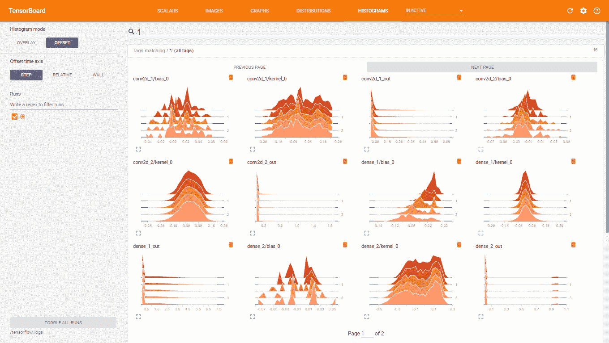

# 第八章：在 R 中使用 TensorFlow 构建深度学习模型

本章内容将介绍如何在 R 中使用 TensorFlow。我们已经在使用 TensorFlow 了很多，因为 Keras 是一个高级神经网络 API，它可以使用 TensorFlow、CNTK 或 Theano。在 R 中，Keras 背后使用的是 TensorFlow。尽管使用 TensorFlow 开发深度学习模型较为复杂，但 TensorFlow 中有两个有趣的包可能会被忽视：TensorFlow 估算器和 TensorFlow 运行。我们将在本章中介绍这两个包。

本章将涉及以下主题：

+   TensorFlow 简介

+   使用 TensorFlow 构建模型

+   TensorFlow 估算器

+   TensorFlow 运行包

# TensorFlow 库简介

**TensorFlow** 不仅是一个深度学习库，还是一个表达性强的编程语言，可以对数据执行各种优化和数学变换。虽然它主要用于实现深度学习算法，但它能够做的远不止这些。在 TensorFlow 中，程序通过计算图表示，数据则以 `tensors` 的形式存储。**张量** 是一种数据数组，所有元素具有相同的数据类型，张量的秩是指其维度的数量。由于张量中的所有数据必须是相同类型的，因此它们与 R 矩阵更为相似，而不是数据框。

下面是不同秩的张量示例：

```py
library(tensorflow)

> # tensor of rank-0
> var1 <- tf$constant(0.1)
> print(var1)
Tensor("Const:0", shape=(), dtype=float32)

> sess <- tf$InteractiveSession()
T:\src\github\tensorflow\tensorflow\core\common_runtime\gpu\gpu_device.cc:1084] Created TensorFlow device (/job:localhost/replica:0/task:0/device:GPU:0 with 3019 MB memory) -> physical GPU (device: 0, name: GeForce GTX 1050 Ti, pci bus id: 0000:01:00.0, compute capability: 6.1)

> sess$run(tf$global_variables_initializer())
> var2 <- tf$constant(2.3)
> var3 = var1 + var2
> print(var1)
Tensor("Const:0", shape=(), dtype=float32)
 num 0.1

> print(var2)
Tensor("Const_1:0", shape=(), dtype=float32)
 num 2.3

> print(var3)
Tensor("Add:0", shape=(), dtype=float32)
 num 2.4

> # tensor of rank-1
> var4 <- tf$constant(4.5,shape=shape(5L))
> print(var4)
Tensor("Const_2:0", shape=(5,), dtype=float32)
 num [1:5(1d)] 4.5 4.5 4.5 4.5 4.5

> # tensor of rank-2
> var5 <- tf$constant(6.7,shape=shape(3L,3L))
> print(var5)
Tensor("Const_3:0", shape=(3, 3), dtype=float32)
 num [1:3, 1:3] 6.7 6.7 6.7 6.7 6.7 ...
```

一个 TensorFlow 程序包含两个部分。首先，您需要构建计算图，图中包含张量以及对这些张量的操作。定义完图之后，第二部分是创建一个 TensorFlow 会话来运行计算图。在前面的例子中，当我们第一次打印张量 `a` 的值时，我们只得到张量的定义，而不是其值。我们所做的只是定义了计算图的一部分。只有当我们调用 `tf$InteractiveSession` 时，我们才会告诉 TensorFlow 执行张量上的操作。会话负责运行计算图。

TensorFlow 程序被称为图，因为代码可以构建成图的形式。对于我们而言，这可能不太直观，因为我们在本书中构建的大多数深度学习模型都包含了层上的顺序操作。在 TensorFlow（以及 Keras 和 MXNet）中，操作的输出可以多次使用，并且可以将多个输入结合到一个操作中。

随着深度学习模型的规模不断增大，越来越难以进行可视化和调试。在一些代码块中，我们打印了显示模型层次结构的摘要，或者绘制了网络图。然而，这些工具对于调试具有千万级参数的模型帮助不大！幸运的是，TensorFlow 提供了一个可视化工具，用于总结、调试和修复 TensorFlow 程序。这个工具叫做 TensorBoard，我们将在接下来介绍它。

# 使用 TensorBoard 可视化深度学习网络

TensorFlow 中的计算图可以非常复杂，因此有一个叫做**TensorBoard**的可视化工具，用于可视化这些图并辅助调试。TensorBoard 可以绘制计算图、显示训练过程中的指标等。由于 Keras 在后台使用 TensorFlow，它也可以使用 TensorBoard。以下是启用了 TensorBoard 日志的 Keras MNIST 示例代码。该代码可以在 `Chapter8/mnist_keras.R` 文件夹中找到。代码的第一部分加载数据，进行预处理，并定义模型架构。希望这一部分你已经比较熟悉了：

```py
library(keras)

mnist_data <- dataset_mnist()
xtrain <- array_reshape(mnist_data$train$x,c(nrow(mnist_data$train$x),28,28,1))
ytrain <- to_categorical(mnist_data$train$y,10)
xtrain <- xtrain / 255.0

model <- keras_model_sequential()
model %>%
  layer_conv_2d(filters=32,kernel_size=c(5,5),activation='relu',
                input_shape=c(28,28,1)) %>% 
  layer_max_pooling_2d(pool_size=c(2,2)) %>% 
  layer_dropout(rate=0.25) %>% 
  layer_conv_2d(filters=32,kernel_size=c(5,5),activation='relu') %>% 
  layer_max_pooling_2d(pool_size=c(2,2)) %>% 
  layer_dropout(rate=0.25) %>% 
  layer_flatten() %>% 
  layer_dense(units=256,activation='relu') %>% 
  layer_dropout(rate=0.4) %>% 
  layer_dense(units=10,activation='softmax')

model %>% compile(
  loss=loss_categorical_crossentropy,
  optimizer="rmsprop",metrics="accuracy"
)
```

要启用日志记录，在 `model.fit` 函数中添加一个 `callbacks` 参数，以告诉 Keras/TensorFlow 将事件日志记录到某个目录。以下代码将日志数据输出到 `/tensorflow_logs` 目录：

```py
model %>% fit(
  xtrain,ytrain,
  batch_size=128,epochs=10,
 callbacks=callback_tensorboard("/tensorflow_logs",
 histogram_freq=1,write_images=0),
  validation_split=0.2
)
# from cmd line,run 'tensorboard --logdir /tensorflow_logs'
```

**警告**：事件日志可能会占用大量空间。在`MNIST`数据集上训练 5 个 epoch 时，生成了 1.75 GB 的信息。大部分数据来自于图像数据，因此你可以考虑设置`write_images=0`来减少日志的大小。

TensorBoard 是一个 Web 应用程序，你必须启动 TensorBoard 程序才能运行它。当模型训练完成后，按照以下步骤启动 TensorBoard Web 应用程序：

1.  打开命令提示符并输入以下内容：

```py
$ tensorboard --logdir /tensorflow_logs
```

1.  如果 TensorBoard 启动成功，你应该会在命令提示符中看到类似以下的消息：

```py
TensorBoard 0.4.0rc2 at http://xxxxxx:6006 (Press CTRL+C to quit)
```

1.  打开一个网页浏览器，访问提供的链接。网页应该类似于以下内容：


图 8.1: TensorBoard – 模型指标

1.  上面的截图显示了训练集和验证集上的模型指标——这些指标类似于在 RStudio 中训练时显示的指标：


图 8.2: RStudio – 模型指标

1.  如果你点击**图像**选项，你将能够可视化模型中的各个层，并查看它们在训练过程中如何变化：


图 8.3: TensorBoard – 可视化模型层

1.  如果你点击**图形**选项，它将显示模型的计算图。你也可以将其下载为图像文件。以下是该模型的计算图：


图 8.4: TensorBoard – 计算图

其中一些部分应该是你已经熟悉的。我们可以看到卷积层、最大池化层、扁平化层、全连接层和 Dropout 层。其他部分不那么明显。作为一种更高级的抽象，Keras 处理了创建计算图时的许多复杂性。

1.  点击**直方图**选项，你可以看到张量的分布随时间变化的情况：



图 8.5: TensorBoard – 直方图

可以使用 TensorBoard 来调试模型。例如，可以调查梯度消失或梯度爆炸问题，查看模型的权重是否在消失到零或爆炸到无限大。TensorBoard 的功能远不止这些，如果你感兴趣，可以参考在线文档了解更多内容。

在接下来的部分，我们将使用 TensorFlow 构建一个回归模型和一个卷积神经网络。

# TensorFlow 模型

在本节中，我们将使用 TensorFlow 构建一些机器学习模型。首先，我们将构建一个简单的线性回归模型，然后是一个卷积神经网络模型，类似于我们在第五章《使用卷积神经网络进行图像分类》中看到的模型。

以下代码加载 TensorFlow 库。我们可以通过设置并访问一个常量字符串值来确认它是否成功加载：

```py
> library(tensorflow)

# confirm that TensorFlow library has loaded
> sess=tf$Session()
> hello_world <- tf$constant('Hello world from TensorFlow')
> sess$run(hello_world)
b'Hello world from TensorFlow'
```

# 使用 TensorFlow 的线性回归

在这个第一个 TensorFlow 示例中，我们将探讨回归问题。此部分的代码位于`Chapter8/regression_tf.R`文件夹中：

1.  首先，我们为输入值*x*和输出值*y*创建一些虚拟数据。我们将*y*设为大约等于`0.8 + x * 1.3`。我们希望应用程序发现`beta0`和`beta1`的值，分别为`0.8`和`1.3`：

```py
library(tensorflow)

set.seed(42)
# create 50000 x variable between 0 and 100
x_var <- runif(50000,min=0,max=1)
#y = approx(1.3x + 0.8)
y_var <- rnorm(50000,0.8,0.04) + x_var * rnorm(50000,1.3,0.05)

# y_pred = beta0 + beta1 * x
beta0 <- tf$Variable(tf$zeros(shape(1L)))
beta1 <- tf$Variable(tf$random_uniform(shape(1L), -1.0, 1.0))
y_pred <- beta0 + beta1*x_var
```

1.  现在，我们设置`loss`函数，以便梯度下降算法可以工作：

```py
# create our loss value which we want to minimize
loss <- tf$reduce_mean((y_pred-y_var)²)
# create optimizer
optimizer <- tf$train$GradientDescentOptimizer(0.6)
train <- optimizer$minimize(loss)
```

1.  然后，我们设置 TensorFlow 会话并初始化变量。最后，我们可以运行图：

```py
# create TensorFlow session and initialize variables
sess = tf$Session()
sess$run(tf$global_variables_initializer())

# solve the regression
for (step in 0:80) {
  if (step %% 10 == 0)
    print(sprintf("Step %1.0f:beta0=%1.4f, beta1=%1.4f",step,sess$run(beta0), sess$run(beta1)))
  sess$run(train)
}
[1] "Step 0:beta0=0.0000, beta1=-0.3244"
[1] "Step 10:beta0=1.0146, beta1=0.8944"
[1] "Step 20:beta0=0.8942, beta1=1.1236"
[1] "Step 30:beta0=0.8410, beta1=1.2229"
[1] "Step 40:beta0=0.8178, beta1=1.2662"
[1] "Step 50:beta0=0.8077, beta1=1.2850"
[1] "Step 60:beta0=0.8033, beta1=1.2932"
[1] "Step 70:beta0=0.8014, beta1=1.2967"
[1] "Step 80:beta0=0.8006, beta1=1.2983"
```

我们可以看到，模型成功找到了`beta0`和`beta1`的值，这些值解出了函数`y=beta0 + beta1*x`。下一部分是一个更复杂的示例，我们将为图像分类构建一个 TensorFlow 模型。

# 使用 TensorFlow 的卷积神经网络

在本节中，我们将基于 MNIST 数据集构建一个 TensorFlow 模型。该代码具有与第五章《使用卷积神经网络进行图像分类》中的 Lenet 模型相似的层和参数。然而，在 TensorFlow 中构建模型的代码比在 Keras 或 MXNet 中构建模型的代码要复杂。原因之一是，程序员需要确保各层的尺寸正确对齐。在 Keras/MXNet 模型中，我们只需更改某一层的节点数即可。在 TensorFlow 中，如果我们更改一层的节点数，必须确保同时更改下一层的输入。

在某些方面，在 TensorFlow 中编程更接近我们在第三章《深度学习基础》中手写的神经网络代码。与 Keras/MXNet 在训练循环中的另一个区别是，我们需要管理批次，而不仅仅是调用要求遍历所有数据 *x* 次（其中 *x* 是一个时期）。此示例的代码位于`Chapter8/mnist_tf.R`文件夹中。首先，我们加载 Keras 包以获取 MNIST 数据，但我们使用 TensorFlow 训练模型。以下是代码的第一部分：

```py
library(RSNNS) # for decodeClassLabels
library(tensorflow)
library(keras)

mnist <- dataset_mnist()
set.seed(42)

xtrain <- array_reshape(mnist$train$x,c(nrow(mnist$train$x),28*28))
ytrain <- decodeClassLabels(mnist$train$y)
xtest <- array_reshape(mnist$test$x,c(nrow(mnist$test$x),28*28))
ytest <- decodeClassLabels(mnist$test$y)
xtrain <- xtrain / 255.0
xtest <- xtest / 255.0
head(ytrain)
     0 1 2 3 4 5 6 7 8 9
[1,] 0 0 0 0 0 1 0 0 0 0
[2,] 1 0 0 0 0 0 0 0 0 0
[3,] 0 0 0 0 1 0 0 0 0 0
[4,] 0 1 0 0 0 0 0 0 0 0
[5,] 0 0 0 0 0 0 0 0 0 1
[6,] 0 0 1 0 0 0 0 0 0 0
```

我们使用来自 RSNNS 库的`decodeClassLabels`函数，因为 TensorFlow 要求一个虚拟编码矩阵，因此每个可能的类都表示为一个列，并以 0/1 的形式编码，如前面的代码输出所示。

在下一个代码块中，我们为模型的输入和输出值创建一些占位符。我们还将输入数据重塑为一个 4 阶张量，即一个 4 维数据结构。第一维（-1L）用于处理批次中的记录。接下来的两维是图像文件的维度，最后一维是通道数，即颜色数。由于我们的图像是灰度图像，因此只有 1 个通道。如果图像是彩色图像，则有 3 个通道。以下代码块创建了占位符并重塑数据：

```py
# placeholders
x <- tf$placeholder(tf$float32, shape(NULL,28L*28L))
y <- tf$placeholder(tf$float32, shape(NULL,10L))
x_image <- tf$reshape(x, shape(-1L,28L,28L,1L))
```

接下来，我们将定义模型架构。我们将创建卷积块，就像之前做的那样。不过，有许多其他值需要设置。例如，在第一个卷积层中，我们必须定义形状，初始化权重，并处理偏置变量。以下是 TensorFlow 模型的代码：

```py
# first convolution layer
conv_weights1 <- tf$Variable(tf$random_uniform(shape(5L,5L,1L,16L), -0.4, 0.4))
conv_bias1 <- tf$constant(0.0, shape=shape(16L))
conv_activ1 <- tf$nn$tanh(tf$nn$conv2d(x_image, conv_weights1, strides=c(1L,1L,1L,1L), padding='SAME') + conv_bias1)
pool1 <- tf$nn$max_pool(conv_activ1, ksize=c(1L,2L,2L,1L),strides=c(1L,2L,2L,1L), padding='SAME')

# second convolution layer
conv_weights2 <- tf$Variable(tf$random_uniform(shape(5L,5L,16L,32L), -0.4, 0.4))
conv_bias2 <- tf$constant(0.0, shape=shape(32L))
conv_activ2 <- tf$nn$relu(tf$nn$conv2d(pool1, conv_weights2, strides=c(1L,1L,1L,1L), padding='SAME') + conv_bias2)
pool2 <- tf$nn$max_pool(conv_activ2, ksize=c(1L,2L,2L,1L),strides=c(1L,2L,2L,1L), padding='SAME')

# densely connected layer
dense_weights1 <- tf$Variable(tf$truncated_normal(shape(7L*7L*32L,512L), stddev=0.1))
dense_bias1 <- tf$constant(0.0, shape=shape(512L))
pool2_flat <- tf$reshape(pool2, shape(-1L,7L*7L*32L))
dense1 <- tf$nn$relu(tf$matmul(pool2_flat, dense_weights1) + dense_bias1)

# dropout
keep_prob <- tf$placeholder(tf$float32)
dense1_drop <- tf$nn$dropout(dense1, keep_prob)

# softmax layer
dense_weights2 <- tf$Variable(tf$truncated_normal(shape(512L,10L), stddev=0.1))
dense_bias2 <- tf$constant(0.0, shape=shape(10L))

yconv <- tf$nn$softmax(tf$matmul(dense1_drop, dense_weights2) + dense_bias2)
```

现在，我们需要定义损失方程，定义使用的优化器（Adam），并定义准确率指标：

```py
cross_entropy <- tf$reduce_mean(-tf$reduce_sum(y * tf$log(yconv), reduction_indices=1L))
train_step <- tf$train$AdamOptimizer(0.0001)$minimize(cross_entropy)
correct_prediction <- tf$equal(tf$argmax(yconv, 1L), tf$argmax(y, 1L))
accuracy <- tf$reduce_mean(tf$cast(correct_prediction, tf$float32))
```

最后，我们可以在 10 个周期内训练模型。然而，仍然存在一个复杂性，因此我们必须手动管理批次。我们获取训练所需的批次数量，并依次加载它们。如果我们的训练数据集中有 60,000 张图像，则每个周期有 469 个批次（60,000/128 = 468.75 并四舍五入为 469）。我们每次输入一个批次，并每 100 个批次输出一次指标：

```py
sess <- tf$InteractiveSession()
sess$run(tf$global_variables_initializer())

# if you get out of memory errors when running on gpu
# then lower the batch_size
batch_size <- 128
batches_per_epoch <- 1+nrow(xtrain) %/% batch_size
for (epoch in 1:10)
{
  for (batch_no in 0:(-1+batches_per_epoch))
  {
    nStartIndex <- 1 + batch_no*batch_size
    nEndIndex <- nStartIndex + batch_size-1
    if (nEndIndex > nrow(xtrain))
      nEndIndex <- nrow(xtrain)
    xvalues <- xtrain[nStartIndex:nEndIndex,]
    yvalues <- ytrain[nStartIndex:nEndIndex,]
    if (batch_no %% 100 == 0) {
      batch_acc <- accuracy$eval(feed_dict=dict(x=xvalues,y=yvalues,keep_prob=1.0))
      print(sprintf("Epoch %1.0f, step %1.0f: training accuracy=%1.4f",epoch, batch_no, batch_acc))
    }
    sess$run(train_step,feed_dict=dict(x=xvalues,y=yvalues,keep_prob=0.5))
  }
  cat("\n")
}
```

这是第一轮训练的输出：

```py
[1] "Epoch 1, step 0: training accuracy=0.0625"
[1] "Epoch 1, step 100: training accuracy=0.8438"
[1] "Epoch 1, step 200: training accuracy=0.8984"
[1] "Epoch 1, step 300: training accuracy=0.9531"
[1] "Epoch 1, step 400: training accuracy=0.8750"
```

训练完成后，我们可以通过计算测试集上的准确率来评估模型。同样，我们必须按批次执行此操作，以防止内存溢出错误：

```py
# calculate test accuracy
# have to run in batches to prevent out of memory errors
batches_per_epoch <- 1+nrow(xtest) %/% batch_size
test_acc <- vector(mode="numeric", length=batches_per_epoch)
for (batch_no in 0:(-1+batches_per_epoch))
{
  nStartIndex <- 1 + batch_no*batch_size
  nEndIndex <- nStartIndex + batch_size-1
  if (nEndIndex > nrow(xtest))
    nEndIndex <- nrow(xtest)
  xvalues <- xtest[nStartIndex:nEndIndex,]
  yvalues <- ytest[nStartIndex:nEndIndex,]
  batch_acc <- accuracy$eval(feed_dict=dict(x=xvalues,y=yvalues,keep_prob=1.0))
  test_acc[batch_no+1] <- batch_acc
}
# using the mean is not totally accurate as last batch is not a complete batch
print(sprintf("Test accuracy=%1.4f",mean(test_acc)))
[1] "Test accuracy=0.9802"
```

我们最终获得了 `0.9802` 的准确率。如果将这段代码与 第五章 *卷积神经网络图像分类* 中的 MNIST 示例进行比较，可以发现 TensorFlow 代码更为冗长，且更容易出错。我们可以真正看到使用更高层次抽象的好处，比如 MXNet 或 Keras（它可以使用 TensorFlow 作为后端）。对于大多数深度学习应用场景，尤其是使用现有层作为构建块构建深度学习模型时，在 TensorFlow 中编写代码并没有太多好处。在这些场景中，使用 Keras 或 MXNet 更简单且更高效。

查看完这段代码后，你可能会想回到更熟悉的 Keras 和 MXNet。不过，接下来的部分将介绍 TensorFlow 估算器和 TensorFlow 运行包，这是两个非常有用的包，你应该了解它们。

# TensorFlow 估算器和 TensorFlow 运行包

TensorFlow 估算器和 TensorFlow 运行包是非常适合深度学习的工具包。在本节中，我们将使用这两个包基于来自 第四章 *训练深度预测模型* 的流失预测数据来训练一个模型。

# TensorFlow 估算器

**TensorFlow 估算器** 允许你使用更简洁的 API 接口来构建 TensorFlow 模型。在 R 中，`tfestimators` 包允许你调用这个 API。不同的模型类型包括线性模型和神经网络。可用的估算器如下：

+   `linear_regressor()` 用于线性回归

+   `linear_classifier()` 用于线性分类

+   `dnn_regressor()` 用于深度神经网络回归

+   `dnn_classifier()` 用于深度神经网络分类

+   `dnn_linear_combined_regressor()` 用于深度神经网络线性组合回归

+   `dnn_linear_combined_classifier()` 用于深度神经网络线性组合分类

估算器隐藏了创建深度学习模型的很多细节，包括构建图、初始化变量和层，并且它们还可以与 TensorBoard 集成。更多详细信息请访问 [`tensorflow.rstudio.com/tfestimators/`](https://tensorflow.rstudio.com/tfestimators/)。我们将使用 `dnn_classifier` 处理来自 第四章 *训练深度预测模型* 的二元分类任务的数据。以下代码位于 `Chapter8/tf_estimators.R` 文件夹中，演示了 TensorFlow 估算器的使用。

1.  我们只包含特定于 TensorFlow 估算器的代码，省略了文件开头加载数据并将其拆分为训练数据和测试数据的部分：

```py
response <- function() "Y_categ"
features <- function() predictorCols

FLAGS <- flags(
  flag_numeric("layer1", 256),
  flag_numeric("layer2", 128),
  flag_numeric("layer3", 64),
  flag_numeric("layer4", 32),
  flag_numeric("dropout", 0.2)
)
num_hidden <- c(FLAGS$layer1,FLAGS$layer2,FLAGS$layer3,FLAGS$layer4)

classifier <- dnn_classifier(
  feature_columns = feature_columns(column_numeric(predictorCols)),
  hidden_units = num_hidden,
  activation_fn = "relu",
  dropout = FLAGS$dropout,
  n_classes = 2
)

bin_input_fn <- function(data)
{
 input_fn(data, features = features(), response = response())
}
tr <- train(classifier, input_fn = bin_input_fn(trainData))
[\] Training -- loss: 22.96, step: 2742 

tr
Trained for 2,740 steps. 
Final step (plot to see history):
 mean_losses: 61.91
total_losses: 61.91
```

1.  模型训练完成后，以下代码将绘制训练和验证的指标：

```py
plot(tr)
```

1.  这将生成以下图表：


图 8.6：训练 TensorFlow 估算器模型的损失图

1.  代码的下一部分调用 `evaluate` 函数来生成模型的评估指标：

```py
# predictions <- predict(classifier, input_fn = bin_input_fn(testData))
evaluation <- evaluate(classifier, input_fn = bin_input_fn(testData))
[-] Evaluating -- loss: 37.77, step: 305

for (c in 1:ncol(evaluation))
 print(paste(colnames(evaluation)[c]," = ",evaluation[c],sep=""))
[1] "accuracy = 0.77573162317276"
[1] "accuracy_baseline = 0.603221416473389"
[1] "auc = 0.842994153499603"
[1] "auc_precision_recall = 0.887594640254974"
[1] "average_loss = 0.501933991909027"
[1] "label/mean = 0.603221416473389"
[1] "loss = 64.1636199951172"
[1] "precision = 0.803375601768494"
[1] "prediction/mean = 0.562777876853943"
[1] "recall = 0.831795573234558"
[1] "global_step = 2742"
```

我们可以看到，我们获得了`77.57%`的准确率，这实际上几乎与我们在第四章《训练深度预测模型》中，使用类似架构的 MXNet 模型所获得的准确率完全相同。`dnn_classifier()`函数隐藏了许多细节，因此 TensorFlow 估算器是利用 TensorFlow 强大功能处理结构化数据任务的好方法。

使用 TensorFlow 估算器创建的模型可以保存到磁盘，并在以后加载。`model_dir()`函数显示模型工件保存的位置（通常在`temp`目录中，但也可以复制到其他位置）：

```py
model_dir(classifier)
"C:\\Users\\xxxxxx\\AppData\\Local\\Temp\\tmpv1e_ri23"
# dnn_classifier has a model_dir parameter to load an existing model
?dnn_classifier
```

模型工件中包含了可以被 TensorBoard 使用的事件日志。例如，当我启动 TensorBoard 并将其指向`temp`目录中的日志目录时，我可以看到创建的 TensorFlow 图表：


图 8.7：使用 TensorBoard 显示 TensorFlow 估算器模型的图表

# TensorFlow 运行包

`tfruns`包是一组用于管理深度学习模型不同训练运行的工具集。它可以作为框架，用不同的超参数构建多个深度学习模型。它可以跟踪每次训练运行的超参数、度量标准、输出和源代码，并允许你比较最佳模型，以便看到训练运行之间的差异。这使得超参数调优变得更加容易，并且可以与任何`tfestimator`模型或`Keras`模型一起使用。更多详情，请访问[`tensorflow.rstudio.com/tools/tfruns/articles/overview.html`](https://tensorflow.rstudio.com/tools/tfruns/articles/overview.html)。

以下代码位于`Chapter8/hyperparams.R`文件夹中，并且还使用了我们在*TensorFlow 估算器*部分中使用的脚本（`Chapter8/tf_estimators.R`）：

```py
library(tfruns)
# FLAGS <- flags(
# flag_numeric("layer1", 256),
# flag_numeric("layer2", 128),
# flag_numeric("layer3", 64),
# flag_numeric("layer4", 32),
# flag_numeric("dropout", 0.2),
# flag_string("activ","relu")
# )

training_run('tf_estimators.R')
training_run('tf_estimators.R', flags = list(layer1=128,layer2=64,layer3=32,layer4=16))
training_run('tf_estimators.R', flags = list(dropout=0.1,activ="tanh"))
```

这将使用不同的超参数运行`Chapter8/tf_estimators.R`脚本。第一次运行时，我们不会更改任何超参数，因此它使用`Chapter8/tf_estimators.R`中包含的默认值。每次使用分类脚本训练一个新模型时，都会被称为**训练运行**，并且训练运行的详细信息将保存在当前工作目录的`runs`文件夹中。

对于每次训练运行，一个新的网站将弹出，显示该运行的详细信息，如下图所示：


图 8.8：TensorFlow 训练运行 – 概要屏幕

我们可以看到训练进度图，以及训练运行发生的时间和评估指标的详细信息。我们还可以在右下角看到用于训练运行的**标志**（即超参数）。还有一个标签页显示 R 代码输出，其中包含来自内部文件（`Chapter8/tf_estimators.R`）的所有输出，包括图表。

一旦所有训练运行完成，以下代码会显示所有训练运行的摘要：

```py
ls_runs(order=eval_accuracy)
ls_runs(order=eval_accuracy)[,1:5]
Data frame: 3 x 5 
                    run_dir eval_accuracy eval_accuracy_baseline eval_auc eval_auc_precision_recall
3 runs/2018-08-02T19-50-17Z        0.7746                 0.6032   0.8431                    0.8874
2 runs/2018-08-02T19-52-04Z        0.7724                 0.6032   0.8425                    0.8873
1 runs/2018-08-02T19-53-39Z        0.7711                 0.6032   0.8360                    0.8878
```

在这里，我们按 `eval_accuracy` 列排序结果。如果你关闭了显示训练运行摘要的窗口，你可以通过调用 `view_run` 函数并传入文件夹名称来重新显示它。例如，要显示最佳训练运行的摘要，可以使用以下代码：

```py
dir1 <- ls_runs(order=eval_accuracy)[1,1]
view_run(dir1)
```

最后，你还可以比较两个运行。在这里，我们比较了两个最佳模型：

```py
dir1 <- ls_runs(order=eval_accuracy)[1,1]
dir2 <- ls_runs(order=eval_accuracy)[2,1]
compare_runs(runs=c(dir1,dir2))
```

这将弹出类似以下内容的页面：


图 8.9：比较两个 TensorFlow 运行

此页面展示了两个训练运行的评估指标，并显示了所使用的超参数。如我们所见，这使得调整深度学习模型的过程更加容易。超参数调整的方法具有自动日志记录、可追溯性，并且可以轻松比较不同的超参数设置。你可以看到训练运行的指标和使用的不同超参数。再也不需要比较配置文件来尝试匹配超参数设置和输出日志了！相比之下，我为第七章《*使用深度学习的自然语言处理*》中的 NLP 示例所写的超参数选择代码，在此看起来显得粗糙。

# 总结

在这一章中，我们开发了一些 TensorFlow 模型。我们看了 TensorBoard，它是一个非常好的工具，用于可视化和调试深度学习模型。我们使用 TensorFlow 构建了几个模型，包括一个基本的回归模型和一个用于计算机视觉的 Lenet 模型。通过这些示例，我们看到了使用 TensorFlow 编程比使用本书中其他地方的高级 API（如 MXNet 和 Keras）更复杂且容易出错。

接下来，我们开始使用 TensorFlow 估算器，这比直接使用 TensorFlow 界面更简单。然后我们在另一个名为**tfruns**的包中使用了该脚本，tfruns 代表 TensorFlow 运行。这个包允许我们每次调用 TensorFlow 估算器或 Keras 脚本时使用不同的标志。我们用它来进行超参数选择、运行和评估多个模型。TensorFlow 运行与 RStudio 有出色的集成，我们能够查看每次运行的摘要，并比较不同的运行，查看使用的指标和超参数的差异。

在下一章，我们将讨论嵌入和自编码器。我们已经在第七章《*使用深度学习的自然语言处理*》中看过嵌入，因此在下一章我们将看到嵌入如何创建数据的低层次编码。我们还将使用训练自编码器，这些自编码器会创建这些嵌入。我们将使用自编码器进行异常检测，并且还会用于协同过滤（推荐系统）。
