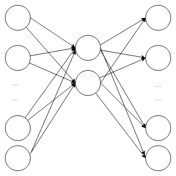
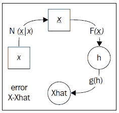
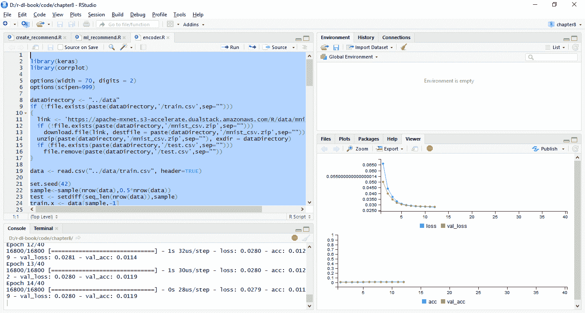
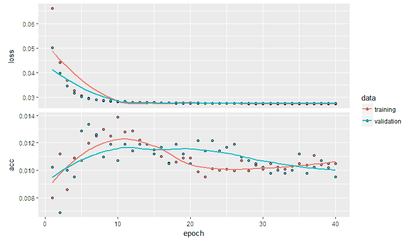
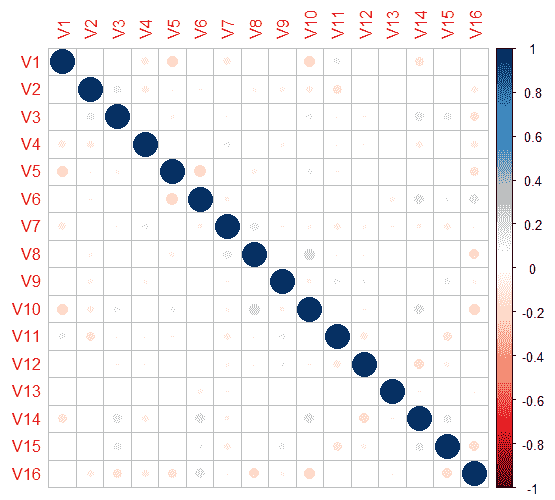
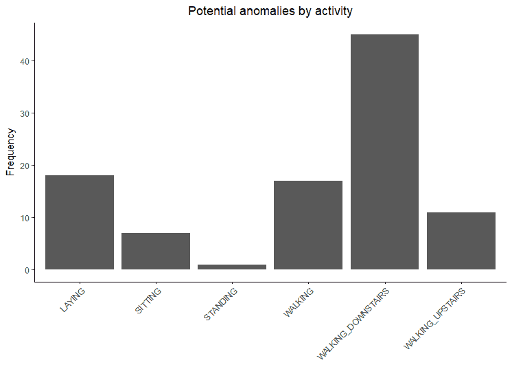

# 第九章：异常检测和推荐系统

本章将探讨自编码器模型和推荐系统。尽管这两个应用场景看起来非常不同，但它们都依赖于找到数据的不同表示。这些表示类似于我们在第七章《*使用深度学习的自然语言处理*》中看到的嵌入。本文的第一部分介绍了无监督学习，在这种学习中没有特定的预测结果。接下来的部分提供了关于自编码器模型的概念性概述，特别是在机器学习和深度神经网络的背景下。我们将向您展示如何构建并应用自编码器模型来识别异常数据。这些非典型数据可能是坏数据或离群值，但也可能是需要进一步调查的实例，例如欺诈检测。应用异常检测的一个例子是，当个人的信用卡消费模式与他们的常规行为不同的时候。最后，本章以一个用例结束，讲解如何使用在第四章《*训练深度预测模型*》中介绍的零售数据集来应用推荐系统进行交叉销售和追加销售。

本章将涵盖以下主题：

+   什么是无监督学习？

+   自编码器是如何工作的？

+   在 R 中训练自编码器

+   使用自编码器进行异常检测

+   用例——协同过滤

# 什么是无监督学习？

到目前为止，我们关注的是广义上属于监督学习类别的模型和技术。监督学习之所以叫做监督，是因为任务是让机器学习一组变量或特征与一个或多个结果之间的关系。例如，在第四章《*训练深度预测模型*》中，我们希望预测某人是否会在接下来的 14 天内访问商店。在本章中，我们将深入探讨无监督学习的方法。与监督学习不同，监督学习需要有结果变量或标签数据，而无监督学习则不使用任何结果或标签数据。无监督学习仅使用输入特征进行学习。无监督学习的一个常见示例是聚类分析，例如 k 均值聚类，其中机器学习数据中的隐藏或潜在聚类，以最小化一个标准（例如，聚类内的最小方差）。

另一种无监督学习方法是寻找数据的另一种表示方式，或者将输入数据缩减为一个更小的数据集，同时在过程中尽量不丢失过多信息，这就是所谓的降维。降维的目标是通过一组*p*特征找到一组潜在变量*k*，使得*k < p*。然而，使用*k*个潜在变量时，可以合理地重建*p*个原始变量。我们在第二章的神经网络示例中使用了**主成分分析**（**PCA**），*训练预测模型*。在这个例子中，我们看到维度数量与信息损失之间存在一个权衡，如*图 2.1*所示。主成分分析使用正交变换将原始数据转换为主成分。除了不相关外，主成分按从解释方差最多的成分到解释方差最少的成分的顺序排列。尽管可以使用所有主成分（这样数据的维度就不会减少），但只有解释了足够多方差的成分（例如，基于高特征值）才会被保留，而解释相对较少方差的成分则会被视为噪声或不必要的部分。在第二章的神经网络示例中，*训练预测模型*，我们在去除方差为零的特征后，得到了 624 个输入。当我们应用 PCA 时，我们发现数据的 50%的方差（信息）仅能通过 23 个主成分来表示。

# 自动编码器是如何工作的？

自动编码器是一种降维技术。当它们以这种方式使用时，数学上和概念上与其他降维技术（如 PCA）有相似之处。自动编码器由两部分组成：编码器，它创建数据的表示；解码器，它试图重建或预测输入。因此，隐藏层和神经元不是输入和其他结果之间的映射，而是自编码（auto）过程。考虑到足够的复杂性，自动编码器可以简单地学习身份函数，隐藏神经元将完全复制原始数据，结果是没有任何有意义的收益。类似地，在 PCA 中，使用所有主成分也不会带来任何好处。因此，最好的自动编码器不一定是最准确的，而是能够揭示数据中某种有意义结构或架构的，或者能够减少噪声、识别异常值或异常数据，或者带来其他有用的副作用，这些副作用不一定直接与模型输入的准确预测相关。

低维度自编码器称为 **欠完备**；通过使用欠完备自编码器，可以迫使自编码器学习数据中最重要的特征。自编码器的一个常见应用是对深度神经网络或其他监督学习模型进行预训练。此外，也可以使用隐藏特征本身。我们稍后会看到它在异常检测中的应用。使用欠完备模型实际上是一种正则化模型的方法。然而，也可以训练过完备自编码器，其中隐藏层的维度大于原始数据，只要使用了其他形式的正则化。

自编码器大致有两个部分：

+   首先，编码函数 *f()* 将原始数据 *x* 编码到隐藏神经元 *H* 中

+   其次，解码函数 *g()* 将 *H* 解码回 *x*

下图展示了一个欠完备编码器，其中隐藏层的节点较少。右侧的输出层是左侧输入层的解码版本。隐藏层的任务是尽可能多地存储输入层的信息（编码输入层），以便输入层可以被重建（或解码）：



图 9.1：自编码器的示例

# 正则化自编码器

欠完备自编码器是一种正则化自编码器，其正则化通过使用比数据更浅（或以其他方式更低）维度的表示来实现。然而，正则化也可以通过其他方式实现。这些就是惩罚自编码器。

# 惩罚自编码器

正如我们在前几章中看到的，防止过拟合的一种方法是使用惩罚，即正则化。通常，我们的目标是最小化重建误差。如果我们有一个目标函数 *F*，我们可以优化 *F(y, f(x))*，其中 *f()* 对原始数据输入进行编码，以生成预测或期望的 *y* 值。对于自编码器，我们有 *F(x, g(f(x)))*，因此机器学习 *f()* 和 *g()* 的权重及功能形式，以最小化 *x* 和 *x* 的重建值 *g(f(x))* 之间的差异。如果我们想使用过完备自编码器，我们需要引入某种形式的正则化，迫使机器学习到一种表示，而不仅仅是复制输入。例如，我们可以添加一个基于复杂度的惩罚函数，这样我们就可以优化 *F(x, g(f(x))) + P(f(x))*，其中惩罚函数 *P* 取决于编码或原始输入 *f()*。

这种惩罚方法与我们之前看到的有所不同，因为它的设计目的是促使潜变量 *H* 的稀疏性，而不是参数的稀疏性，*H* 是原始数据的编码表示。目标是学习一个捕捉数据本质特征的潜在表示。

另一种可以用于提供正则化的惩罚是基于导数的惩罚。稀疏自编码器有一种惩罚方法，可以促使潜变量的稀疏性，而对导数的惩罚则使得模型学习到一种对原始输入数据 *x* 的微小扰动相对不敏感的 *f()* 形式。我们所指的意思是，它对那些在 *x* 变化时编码变化很大的函数施加惩罚，偏好那些梯度相对平坦的区域。

# 去噪自编码器

去噪自编码器能够去除噪声或还原数据，是学习原始数据潜在表示的有用技术 (*Vincent, P., Larochelle, H., Bengio, Y., 和 Manzagol, P. A. (2008 年 7 月); Bengio, Y., Courville, A., 和 Vincent, P. (2013 年)*)。我们说过，自编码器的常见任务是优化：*F(x, g(f(x)))*。然而，对于去噪自编码器来说，任务是从噪声或受损的 *x* 版本中恢复 *x*。去噪自编码器的一个应用是恢复可能已经模糊或损坏的旧图像。

尽管去噪自编码器用于从受损数据或带噪声的数据中尝试恢复真实的表示，但这一技术也可以作为正则化工具使用。作为一种正则化方法，不是处理带噪声或受损的数据并试图恢复真实数据，而是故意让原始数据受到损坏。这迫使自编码器不仅仅学习身份函数，因为原始输入不再与输出完全相同。这个过程如下图所示：



图 9.2：去噪自编码器

剩下的选择是 *N()* 函数，它负责添加噪声或损坏 *x*，应该是什么样的。两种选择是通过随机过程添加噪声，或在每次训练迭代中仅包括原始 *x* 输入的一个子集。在下一节中，我们将探讨如何在 R 中实际训练自编码器模型。

# 在 R 中训练自编码器

在本节中，我们将展示如何在 R 中训练自编码器，并向你展示它如何作为降维技术使用。我们将它与在第二章《训练预测模型》中采用的方法进行比较，在那一章中，我们使用 PCA 找到图像数据中的主成分。在那个例子中，我们使用 PCA 发现 23 个因子足以解释数据中 50% 的方差。我们使用这 23 个因子构建了一个神经网络模型来分类包含 *5* 或 *6* 的数据集，并且在该例子中，我们的准确率为 97.86%。

在本示例中，我们将遵循类似的过程，并再次使用`MINST`数据集。以下来自`Chapter8/encoder.R`的代码加载数据。我们将使用一半的数据来训练自编码器，另一半将用于构建分类模型，以评估自编码器在降维方面的效果。代码的第一部分与之前的示例相似；它加载并归一化数据，使得数值介于 0.0 和 1.0 之间：

```py
library(keras)
library(corrplot)
library(neuralnet)
options(width = 70, digits = 2)
options(scipen=999)
dataDirectory <- "../data"
if (!file.exists(paste(dataDirectory,'/train.csv',sep="")))
{
 link <- 'https://apache-mxnet.s3-accelerate.dualstack.amazonaws.com/R/data/mnist_csv.zip'
 if (!file.exists(paste(dataDirectory,'/mnist_csv.zip',sep="")))
 download.file(link, destfile = paste(dataDirectory,'/mnist_csv.zip',sep=""))
 unzip(paste(dataDirectory,'/mnist_csv.zip',sep=""), exdir = dataDirectory)
 if (file.exists(paste(dataDirectory,'/test.csv',sep="")))
 file.remove(paste(dataDirectory,'/test.csv',sep=""))
}

data <- read.csv("../data/train.csv", header=TRUE)
set.seed(42)
sample<-sample(nrow(data),0.5*nrow(data))
test <- setdiff(seq_len(nrow(data)),sample)
train.x <- data[sample,-1]
test.x <- data[test,-1]
train.y <- data[sample,1]
test.y <- data[test,1]
rm(data)
train.x <- train.x/255
test.x <- test.x/255
train.x <- data.matrix(train.x)
test.x <- data.matrix(test.x)
input_dim <- 28*28 #784
```

现在，我们将进入我们的第一个自编码器。我们将在自编码器中使用`16`个隐藏神经元，并使用 tanh 作为激活函数。我们使用 20%的数据作为验证集，以便提供自编码器表现的无偏估计。以下是代码。为了简洁起见，我们只显示部分输出：

```py
# model 1
inner_layer_dim <- 16
input_layer <- layer_input(shape=c(input_dim))
encoder <- layer_dense(units=inner_layer_dim, activation='tanh')(input_layer)
decoder <- layer_dense(units=784)(encoder)
autoencoder <- keras_model(inputs=input_layer, outputs = decoder)
autoencoder %>% compile(optimizer='adam', loss='mean_squared_error',metrics='accuracy')
history <- autoencoder %>% fit(train.x,train.x,
 epochs=40, batch_size=128,validation_split=0.2)

Train on 16800 samples, validate on 4200 samples
Epoch 1/40
16800/16800 [==============================] - 1s 36us/step - loss: 0.0683 - acc: 0.0065 - val_loss: 0.0536 - val_acc: 0.0052
Epoch 2/40
16800/16800 [==============================] - 1s 30us/step - loss: 0.0457 - acc: 0.0082 - val_loss: 0.0400 - val_acc: 0.0081
Epoch 3/40
16800/16800 [==============================] - 0s 29us/step - loss: 0.0367 - acc: 0.0101 - val_loss: 0.0344 - val_acc: 0.0121
...
...
Epoch 38/40
16800/16800 [==============================] - 0s 29us/step - loss: 0.0274 - acc: 0.0107 - val_loss: 0.0275 - val_acc: 0.0098
Epoch 39/40
```

```py
16800/16800 [==============================] - 1s 31us/step - loss: 0.0274 - acc: 0.0111 - val_loss: 0.0275 - val_acc: 0.0093
Epoch 40/40
16800/16800 [==============================] - 1s 32us/step - loss: 0.0274 - acc: 0.0120 - val_loss: 0.0275 - val_acc: 0.0095
```

验证损失为`0.0275`，这表明模型表现相当好。另一个不错的特点是，如果你在 RStudio 中运行代码，它会在图形中显示训练指标，并在模型训练过程中自动更新。这在以下截图中有所展示：



图 9.3：RStudio 中查看器面板显示的模型指标

一旦模型完成训练，你还可以使用以下代码绘制模型架构和模型指标（输出也包含在内）。通过调用 plot 函数，你可以查看训练集和验证集上的准确率和损失图表：

```py
summary(autoencoder)
______________________________________________________________________
Layer (type)               Output Shape                 Param # 
======================================================================
input_1 (InputLayer)       (None, 784)                  0 
______________________________________________________________________
dense_1 (Dense)            (None, 16)                   12560 
______________________________________________________________________
dense_2 (Dense)            (None, 784)                  13328 
======================================================================
Total params: 25,888
Trainable params: 25,888
Non-trainable params: 0
______________________________________________________________________

plot(history)
```

这段代码生成了以下图表：



图 9.4：自编码器模型指标

上述图表显示，验证准确率相对稳定，但它可能在第 20 个周期后已经达到峰值。现在，我们将用`32`个隐藏节点训练第二个模型，代码如下：

```py
# model 2
inner_layer_dim <- 32
input_layer <- layer_input(shape=c(input_dim))
encoder <- layer_dense(units=inner_layer_dim, activation='tanh')(input_layer)
decoder <- layer_dense(units=784)(encoder)
autoencoder <- keras_model(inputs=input_layer, outputs = decoder)
autoencoder %>% compile(optimizer='adam',
 loss='mean_squared_error',metrics='accuracy')
history <- autoencoder %>% fit(train.x,train.x,
 epochs=40, batch_size=128,validation_split=0.2)

Train on 16800 samples, validate on 4200 samples
Epoch 1/40
16800/16800 [==============================] - 1s 41us/step - loss: 0.0591 - acc: 0.0104 - val_loss: 0.0406 - val_acc: 0.0131
Epoch 2/40
16800/16800 [==============================] - 1s 34us/step - loss: 0.0339 - acc: 0.0111 - val_loss: 0.0291 - val_acc: 0.0093
Epoch 3/40
16800/16800 [==============================] - 1s 33us/step - loss: 0.0262 - acc: 0.0108 - val_loss: 0.0239 - val_acc: 0.0100
...
...
Epoch 38/40
16800/16800 [==============================] - 1s 33us/step - loss: 0.0174 - acc: 0.0130 - val_loss: 0.0175 - val_acc: 0.0095
Epoch 39/40
16800/16800 [==============================] - 1s 31us/step - loss: 0.0174 - acc: 0.0132 - val_loss: 0.0175 - val_acc: 0.0098
Epoch 40/40
16800/16800 [==============================] - 1s 34us/step - loss: 0.0174 - acc: 0.0126 - val_loss: 0.0175 - val_acc: 0.0100
```

我们的验证损失已经改善至`0.0175`，接下来我们试试`64`个隐藏节点：

```py
# model 3
inner_layer_dim <- 64
input_layer <- layer_input(shape=c(input_dim))
encoder <- layer_dense(units=inner_layer_dim, activation='tanh')(input_layer)
decoder <- layer_dense(units=784)(encoder)
autoencoder <- keras_model(inputs=input_layer, outputs = decoder)
autoencoder %>% compile(optimizer='adam',
 loss='mean_squared_error',metrics='accuracy')
history <- autoencoder %>% fit(train.x,train.x,
 epochs=40, batch_size=128,validation_split=0.2)

Train on 16800 samples, validate on 4200 samples
Epoch 1/40
16800/16800 [==============================] - 1s 50us/step - loss: 0.0505 - acc: 0.0085 - val_loss: 0.0300 - val_acc: 0.0138
Epoch 2/40
16800/16800 [==============================] - 1s 39us/step - loss: 0.0239 - acc: 0.0110 - val_loss: 0.0197 - val_acc: 0.0090
Epoch 3/40
16800/16800 [==============================] - 1s 41us/step - loss: 0.0173 - acc: 0.0115 - val_loss: 0.0156 - val_acc: 0.0117
...
...
Epoch 38/40
16800/16800 [==============================] - 1s 41us/step - loss: 0.0094 - acc: 0.0124 - val_loss: 0.0096 - val_acc: 0.0131
Epoch 39/40
16800/16800 [==============================] - 1s 39us/step - loss: 0.0095 - acc: 0.0128 - val_loss: 0.0095 - val_acc: 0.0121
Epoch 40/40
16800/16800 [==============================] - 1s 37us/step - loss: 0.0094 - acc: 0.0126 - val_loss: 0.0098 - val_acc: 0.0133
```

我们的验证损失为`0.0098`，这再次表明有所改进。我们可能已经到达了一个阶段，在这个阶段增加更多隐藏节点会导致模型过拟合，因为我们只使用了`16800`行数据来训练自编码器。我们可以考虑应用正则化，但由于我们的第一个模型准确率为`0.01`，所以表现已经足够好。

# 访问自编码器模型的特征

我们可以从模型中提取深度特征，也就是模型中隐藏神经元的值。为此，我们将使用具有 16 个隐藏节点的模型。我们将使用`ggplot2`包检查相关性的分布，如以下代码所示。结果显示在*图 9.5*中。深度特征之间的相关性较小，也就是说，通常其绝对值小于*<.20*。这是我们期望的情况，以确保自编码器正常工作。这意味着特征之间不应重复信息：

```py
encoder <- keras_model(inputs=input_layer, outputs=encoder)
encodings <- encoder %>% predict(test.x)
encodings<-as.data.frame(encodings)
M <- cor(encodings)
corrplot(M, method = "circle", sig.level = 0.1)
```

上述代码生成了以下图表：



图 9.5：自编码器隐藏层权重之间的相关性

在第二章《训练预测模型》中，我们使用 PCA 进行降维，发现即使仅使用 23 个特征作为输入，二分类任务中区分 5 和 6 的准确率仍然可以达到 97.86%。这 23 个特征是**主成分**，并且它们占据了数据集中 50%的方差。我们将使用自编码器中的权重来执行相同的实验。请注意，我们在 50%的数据上训练了自编码器，并且使用剩下的 50%数据进行二分类任务，即我们不想尝试在用于构建自编码器的数据上进行分类任务：

```py
encodings$y <- test.y
encodings <- encodings[encodings$y==5 | encodings$y==6,]
encodings[encodings$y==5,]$y <- 0
encodings[encodings$y==6,]$y <- 1
table(encodings$y)
   0    1 
1852 2075 
nobs <- nrow(encodings)
train <- sample(nobs, 0.9*nobs)
test <- setdiff(seq_len(nobs), train)
trainData <- encodings[train,]
testData <- encodings[test,]
col_names <- names(trainData)
f <- as.formula(paste("y ~", paste(col_names[!col_names %in%"y"],collapse="+")))
nn <- neuralnet(f,data=trainData,hidden=c(4,2),linear.output = FALSE)
preds_nn <- compute(nn,testData[,1:(-1+ncol(testData))])
preds_nn <- ifelse(preds_nn$net.result > 0.5, "1", "0")
t<-table(testData$y, preds_nn,dnn=c("Actual", "Predicted"))
acc<-round(100.0*sum(diag(t))/sum(t),2)
print(t)
      Predicted
Actual 0 1
     0 182 5
     1 3 203
print(sprintf(" accuracy = %1.2f%%",acc))
[1] " accuracy = 97.96%"
```

我们的模型达到了`97.96%`的准确率，略高于在第二章《训练预测模型》中获得的`97.86%`的准确率。事实上，这两个模型非常相似并不令人惊讶，因为 PCA 的数学基础涉及矩阵分解，而自编码器则使用反向传播来设置隐藏层的矩阵权重。实际上，如果我们去掉非线性激活函数，我们的编码结果将非常类似于 PCA。这表明，自编码器模型可以有效地用作降维技术。

# 使用自编码器进行异常检测

既然我们已经构建了自编码器并访问了内部层的特征，接下来我们将介绍自编码器如何用于异常检测的示例。这里的前提非常简单：我们从解码器中获取重构输出，并查看哪些实例的误差最大，也就是说，哪些实例是解码器最难重构的。这里使用的代码位于`Chapter9/anomaly.R`，并且我们将使用已经在第二章《训练预测模型》中介绍过的`UCI HAR`数据集。如果你还没有下载数据，可以回到该章节查看如何下载数据。代码的第一部分加载了数据，我们对子集特征进行了筛选，仅使用了名称中包含均值、标准差和偏度的特征：

```py
library(keras)
library(ggplot2)
train.x <- read.table("UCI HAR Dataset/train/X_train.txt")
train.y <- read.table("UCI HAR Dataset/train/y_train.txt")[[1]]
test.x <- read.table("UCI HAR Dataset/test/X_test.txt")
test.y <- read.table("UCI HAR Dataset/test/y_test.txt")[[1]]

use.labels <- read.table("UCI HAR Dataset/activity_labels.txt")
colnames(use.labels) <-c("y","label")

features <- read.table("UCI HAR Dataset/features.txt")
meanSD <- grep("mean\\(\\)|std\\(\\)|max\\(\\)|min\\(\\)|skewness\\(\\)", features[, 2])

train.x <- data.matrix(train.x[,meanSD])
test.x <- data.matrix(test.x[,meanSD])
input_dim <- ncol(train.x)
```

现在，我们可以构建我们的自编码器模型。这个模型将是一个堆叠自编码器，包含两个`40`个神经元的隐藏编码器层和两个 40 个神经元的隐藏解码器层。为了简洁起见，我们省略了部分输出：

```py
# model
inner_layer_dim <- 40
input_layer <- layer_input(shape=c(input_dim))
encoder <- layer_dense(units=inner_layer_dim, activation='tanh')(input_layer)
encoder <- layer_dense(units=inner_layer_dim, activation='tanh')(encoder)
decoder <- layer_dense(units=inner_layer_dim)(encoder)
decoder <- layer_dense(units=inner_layer_dim)(decoder)
decoder <- layer_dense(units=input_dim)(decoder)

autoencoder <- keras_model(inputs=input_layer, outputs = decoder)
autoencoder %>% compile(optimizer='adam',
 loss='mean_squared_error',metrics='accuracy')
history <- autoencoder %>% fit(train.x,train.x,
 epochs=30, batch_size=128,validation_split=0.2)
Train on 5881 samples, validate on 1471 samples
Epoch 1/30
5881/5881 [==============================] - 1s 95us/step - loss: 0.2342 - acc: 0.1047 - val_loss: 0.0500 - val_acc: 0.1013
Epoch 2/30
5881/5881 [==============================] - 0s 53us/step - loss: 0.0447 - acc: 0.2151 - val_loss: 0.0324 - val_acc: 0.2536
Epoch 3/30
5881/5881 [==============================] - 0s 44us/step - loss: 0.0324 - acc: 0.2772 - val_loss: 0.0261 - val_acc: 0.3413
...
...

Epoch 27/30
5881/5881 [==============================] - 0s 45us/step - loss: 0.0098 - acc: 0.2935 - val_loss: 0.0094 - val_acc: 0.3379
Epoch 28/30
5881/5881 [==============================] - 0s 44us/step - loss: 0.0096 - acc: 0.2908 - val_loss: 0.0092 - val_acc: 0.3215
Epoch 29/30
5881/5881 [==============================] - 0s 44us/step - loss: 0.0094 - acc: 0.2984 - val_loss: 0.0090 - val_acc: 0.3209
Epoch 30/30
5881/5881 [==============================] - 0s 44us/step - loss: 0.0092 - acc: 0.2955 - val_loss: 0.0088 - val_acc: 0.3209

```

我们可以通过调用 summary 函数来查看模型的层次结构和参数数量，如下所示：

```py
summary(autoencoder)
_______________________________________________________________________
Layer (type)                 Output Shape                           Param # 
=======================================================================
input_4 (InputLayer)         (None, 145)                            0 
_______________________________________________________________________
dense_16 (Dense)             (None, 40)                             5840 
_______________________________________________________________________
dense_17 (Dense)             (None, 40)                             1640 
_______________________________________________________________________
dense_18 (Dense)             (None, 40)                             1640 
_______________________________________________________________________
dense_19 (Dense)             (None, 40)                             1640 
_______________________________________________________________________
dense_20 (Dense)             (None, 145)                            5945 
=======================================================================
Total params: 16,705
Trainable params: 16,705
Non-trainable params: 0
_______________________________________________________________________
```

我们的验证损失是`0.0088`，这意味着我们的模型在编码数据方面表现良好。现在，我们将使用测试集对自编码器进行测试，并获得重构的数据。这将创建一个与测试集大小相同的数据集。然后，我们将选择任何预测值与测试集之间的平方误差（se）和大于 4 的实例。

这些是自编码器在重构时遇到最多困难的实例，因此它们是潜在异常。4 的限制值是一个超参数；如果设置得更高，则检测到的潜在异常较少；如果设置得更低，则检测到的潜在异常较多。这个值会根据所使用的数据集而有所不同。

该数据集包含 6 个类别。我们想分析异常是否分布在所有类别中，还是仅限于某些类别。我们将打印出测试集中各类别的频率表，并且可以看到各类别的分布相对均匀。当打印出潜在异常类别的频率表时，我们可以看到大多数异常集中在`WALKING_DOWNSTAIRS`类别中。潜在异常如*图 9.6 所示：*

```py
# anomaly detection
preds <- autoencoder %>% predict(test.x)
preds <- as.data.frame(preds)
limit <- 4
preds$se_test <- apply((test.x - preds)², 1, sum)
preds$y_preds <- ifelse(preds$se_test>limit,1,0)
preds$y <- test.y
preds <- merge(preds,use.labels)
table(preds$label)
LAYING SITTING STANDING WALKING WALKING_DOWNSTAIRS WALKING_UPSTAIRS 
   537     491      532     496                420              471 

table(preds[preds$y_preds==1,]$label)
LAYING SITTING STANDING WALKING WALKING_DOWNSTAIRS WALKING_UPSTAIRS 
    18       7        1      17                 45               11 
```

我们可以使用以下代码进行绘制：

```py
ggplot(as.data.frame(table(preds[preds$y_preds==1,]$label)),aes(Var1, Freq)) +
 ggtitle("Potential anomalies by activity") +
 geom_bar(stat = "identity") +
 xlab("") + ylab("Frequency") +
 theme_classic() +
 theme(plot.title = element_text(hjust = 0.5)) +
 theme(axis.text.x = element_text(angle = 45, hjust = 1, vjust = 1))
```



图 9.6：异常的分布

在这个示例中，我们使用了深度自编码器模型来学习来自智能手机的动作数据特征。这样的工作对于排除未知或不寻常的活动非常有用，而不是错误地将它们分类。例如，在一个应用程序中，分类你进行了什么活动以及持续了多少分钟，可能更好的是直接忽略模型不确定的几分钟，或者隐藏特征没有充分重构输入的情况，而不是错误地将活动分类为走路或坐着，而实际上是下楼走路。

这样的工作也有助于识别模型可能存在问题的地方。或许需要额外的传感器和数据来表示下楼走路，或者需要更多工作来理解为什么下楼走路会产生相对较高的错误率。

这些深度自编码器在其他需要识别异常的场景中也非常有用，例如金融数据或信用卡使用模式。异常的消费模式可能表明存在欺诈或信用卡被盗。与其尝试手动搜索数百万次信用卡交易，不如训练一个自编码器模型，并用它来识别异常以进行进一步调查。

# 用例 – 协同过滤

本用例是关于协同过滤的。我们将基于从深度学习模型创建的嵌入（embeddings）来构建一个推荐系统。为此，我们将使用在第四章中使用的相同数据集，*训练深度预测模型*，即零售交易数据库。如果你还没有下载数据库，可以访问以下链接，[`www.dunnhumby.com/sourcefiles`](https://www.dunnhumby.com/sourcefiles)，并选择*Let’s Get Sort-of-Real*。选择名为*为 5,000 名顾客随机抽样的所有交易*的最小数据集选项。在阅读了条款并下载了数据集后，将其解压到代码文件夹下名为 `dunnhumby/in` 的目录中。确保文件直接解压到该文件夹下，而不是子目录，因为解压后你可能需要复制它们。

数据包含通过购物篮 ID 关联的零售交易详情。每笔交易都有一个日期和商店代码，部分交易还与顾客关联。以下是我们将在本次分析中使用的字段：

| **字段名** | **描述** | **格式** |
| --- | --- | --- |
| `CUST_CODE` | 顾客代码。此字段将交易/访问与顾客关联。 | 字符 |
| `SPEND` | 与所购商品相关的花费。 | 数值 |
| `PROD_CODE` | 产品代码。 | 字符 |
| `PROD_CODE_10` | 产品层级 10 代码。 | 字符 |
| `PROD_CODE_20` | 产品层级 20 代码。 | 字符 |
| `PROD_CODE_30` | 产品层级 30 代码。 | 字符 |
| `PROD_CODE_40` | 产品层级 40 代码。 | 字符 |

如果你想了解更多关于文件结构的细节，可以回头重新阅读第四章中的用例，*训练深度预测模型*。我们将使用这个数据集来创建推荐引擎。这里有一类叫做**市场购物篮分析**的机器学习算法，可以与交易数据一起使用，但本用例基于协同过滤。协同过滤是一种基于人们对产品评分的推荐方法。它们通常用于音乐和电影推荐，用户会对物品进行评分，通常是 1 到 5 分。也许最著名的推荐系统是 Netflix，因为 Netflix 奖（[`en.wikipedia.org/wiki/Netflix_Prize`](https://en.wikipedia.org/wiki/Netflix_Prize)）。

我们将使用我们的数据集来创建隐式排名，评估客户如何*评价*某个商品。如果你不熟悉隐式排名，它们是通过数据推导出的排名，而不是用户显式指定的排名。我们将使用一个产品代码，`PROD_CODE_40`，并计算该产品代码的消费分位数。分位数将把字段划分为大致相等的 5 个组。我们将用这些分位数为每个客户基于他们对该产品代码的消费额分配一个评分。排名前 20%的客户将获得评分 5，接下来的 20%将获得评分 4，以此类推。每个存在的客户/产品代码组合将会有一个从 1 到 5 的评分：

在零售忠诚度系统中使用分位数有着丰富的历史。零售忠诚度数据的早期细分方法之一被称为**RFM 分析**。RFM 是 Recency、Frequency 和 Monetary 支出的首字母缩写。它为每个客户在这些类别中打分，1 为最低，5 为最高，每个评分类别中包含相同数量的客户。对于*Recency*，最近访问的 20%客户会得到评分 5，接下来的 20%得到评分 4，以此类推。对于*Frequency*，交易最多的 20%客户会得到评分 5，接下来的 20%得到评分 4，以此类推。类似地，对于*Monetary*支出，根据收入排名前 20%的客户会得到评分 5，接下来的 20%得到评分 4，以此类推。最终将这些分数连接在一起，因此一个 RFM 为 453 的客户在 Recency 上是 4，Frequency 上是 5，Monetary 支出上是 3。一旦计算出评分，它可以用于很多目的，例如交叉销售、客户流失分析等。RFM 分析在 90 年代末和 2000 年代初非常流行，许多营销经理都喜欢使用它，因为它易于实施且理解容易。然而，它不够灵活，正在被机器学习技术所取代。

# 数据准备

创建评分的代码在`Chapter9/create_recommend.R`中。代码的第一部分处理原始交易数据。数据保存在不同的 CSV 文件中，所以它会处理每个文件，选择与客户关联的记录（即，`CUST_CODE!=""`），然后按`CUST_CODE`和`PROD_CODE_40`分组销售数据。接着将结果附加到临时文件中，然后继续处理下一个输入文件：

```py
library(magrittr)
library(dplyr)
library(readr)
library(broom)

set.seed(42)
file_list <- list.files("../dunnhumby/in/", "trans*")
temp_file <- "../dunnhumby/temp.csv"
out_file <- "../dunnhumby/recommend.csv"
if (file.exists(temp_file)) file.remove(temp_file)
if (file.exists(out_file)) file.remove(out_file)
options(readr.show_progress=FALSE)

i <- 1
for (file_name in file_list)
{
  file_name<-paste("../dunnhumby/in/",file_name,sep="")
  df<-suppressMessages(read_csv(file_name))

  df2 <- df %>%
    filter(CUST_CODE!="") %>%
    group_by(CUST_CODE,PROD_CODE_40) %>%
    summarise(sales=sum(SPEND))

  colnames(df2)<-c("cust_id","prod_id","sales")
  if (i ==1)
    write_csv(df2,temp_file)
  else
    write_csv(df2,temp_file,append=TRUE)
  print (paste("File",i,"/",length(file_list),"processed"))
  i <- i+1
}
[1] "File 1 / 117 processed"
[1] "File 2 / 117 processed"
[1] "File 3 / 117 processed"
...
...
...
[1] "File 115 / 117 processed"
[1] "File 116 / 117 processed"
[1] "File 117 / 117 processed"
rm(df,df2)
```

本节按客户和产品代码对`117`个输入文件进行分组。在处理每个文件时，我们将客户代码重命名为`cust_id`，产品部门代码重命名为`prod_id`。处理完成后，合并的文件显然会有重复的客户-产品代码组合；也就是说，我们需要再次对合并的数据进行分组。我们通过打开临时文件，再次对字段进行分组来实现这一点：

```py
df_processed<-read_csv(temp_file)
if (file.exists(temp_file)) file.remove(temp_file)

df2 <- df_processed %>%
 group_by(cust_id,prod_id) %>%
 summarise(sales=sum(sales))
```

我们本可以尝试加载所有交易数据并对其进行分组，但那样会非常占用内存和计算资源。通过分两步进行处理，我们减少了每个阶段需要处理的数据量，这意味着在内存有限的机器上运行的可能性更大。

一旦我们获得了每个客户和产品部门代码组合的总支出，我们就可以创建评分。得益于优秀的`tidyr`包，只需要几行代码就能为每一行分配评分。首先，我们按照`prod_id`字段进行分组，并使用分位数函数返回每个产品代码的销售分位数。这些分位数将返回将客户分成`5`个等大小组的销售范围。然后，我们使用这些分位数来分配排名：

```py
# create quantiles
dfProds <- df2 %>%
 group_by(prod_id) %>%
 do( tidy(t(quantile(.$sales, probs = seq(0, 1, 0.2)))) )
colnames(dfProds)<-c("prod_id","X0","X20","X40","X60","X80","X100")
df2<-merge(df2,dfProds)
df2$rating<-0
df2[df2$sales<=df2$X20,"rating"] <- 1
df2[(df2$sales>df2$X20) & (df2$sales<=df2$X40),"rating"] <- 2
df2[(df2$sales>df2$X40) & (df2$sales<=df2$X60),"rating"] <- 3
df2[(df2$sales>df2$X60) & (df2$sales<=df2$X80),"rating"] <- 4
df2[(df2$sales>df2$X80) & (df2$sales<=df2$X100),"rating"] <- 5
```

唯一剩下的就是保存结果。在我们执行之前，我们做了几个基本检查，确保我们的评分从 1 到 5 分布均匀。然后，我们随机选择一个产品代码，并检查该产品的评分是否从 1 到 5 均匀分布：

```py
# sanity check, are our ratings spread out relatively evenly
df2 %>%
  group_by(rating) %>%
  summarise(recs=n())
  rating  recs
1      1 68246
2      2 62592
3      3 62162
4      4 63488
5      5 63682
df2 %>%
  filter(prod_id==df2[sample(1:nrow(df2), 1),]$prod_id) %>%
  group_by(prod_id,rating) %>%
  summarise(recs=n())
  prod_id rating recs
1 D00008       1  597
2 D00008       2  596
3 D00008       3  596
4 D00008       4  596
5 D00008       5  596

df2 <- df2[,c("cust_id","prod_id","rating")]
write_csv(df2,out_file)
```

这里一切看起来都很好：`rating=1`的数量为`68246`，而`2`到`5`的评分范围为`62162`到`63682`，但这并不是什么问题，因为协同过滤模型并不要求评分分布均匀。对于单个商品（`D00008`），每个评分的分布均匀，分别为`596`或`597`。

# 构建协同过滤模型

在我们开始应用深度学习模型之前，我们应该按照前几章的做法，使用标准的机器学习算法创建一个基准准确度评分。这很快，容易实现，并且能让我们确信深度学习模型的效果比单纯使用*普通*机器学习要好。以下是用 R 语言实现协同过滤的 20 行代码。这个代码可以在`Chapter8/ml_recommend.R`中找到：

```py
library(readr)
library(recommenderlab)
library(reshape2)

set.seed(42)
in_file <- "../dunnhumby/recommend.csv"
df <- read_csv(in_file)
dfPivot <-dcast(df, cust_id ~ prod_id)
m <- as.matrix(dfPivot[,2:ncol(dfPivot)])

recommend <- as(m,"realRatingMatrix")
e <- evaluationScheme(recommend,method="split",
 train=0.9,given=-1, goodRating=5)
e
Evaluation scheme using all-but-1 items
Method: ‘split’ with 1 run(s).
Training set proportion: 0.900
Good ratings: >=5.000000
Data set: 5000 x 9 rating matrix of class ‘realRatingMatrix’ with 25688 ratings.

r1 <- Recommender(getData(e,"train"),"UBCF")
r1
Recommender of type ‘UBCF’ for ‘realRatingMatrix’ 
learned using 4500 users.

p1 <- predict(r1,getData(e,"known"),type="ratings")
err1<-calcPredictionAccuracy(p1,getData(e,"unknown"))
print(sprintf(" User based collaborative filtering model MSE = %1.4f",err1[2]))
[1] " User based collaborative filtering model MSE = 0.9748"
```

这段代码创建了一个协同过滤模型，且该模型的均方误差（MSE）为`0.9748`。和之前一样，我们这样做是因为这个示例的大部分工作都集中在数据准备上，而非模型构建，因此，使用基础机器学习算法进行比较并不困难。这里的代码使用了标准的 R 库来创建推荐系统，正如你所见，这相对简单，因为数据已经处于预期格式。如果你想了解更多关于这个协同过滤算法的信息，可以搜索`user based collaborative filtering in r`，或者查看文档页面。

现在，让我们专注于创建深度学习模型。

# 构建深度学习协同过滤模型

在这里，我们将看看是否能构建一个深度学习模型来超越之前的方法！以下代码位于`Chapter9/keras_recommend.R`。第一部分加载数据集并为客户和产品代码创建新的 ID。这是因为 Keras 期望索引是顺序的，从零开始，并且唯一：

```py
library(readr)
library(keras)

set.seed(42)
use_session_with_seed(42, disable_gpu = FALSE, disable_parallel_cpu = FALSE)

df<-read_csv("recommend.csv")
custs <- as.data.frame(unique(df$cust_id))
custs$cust_id2 <- as.numeric(row.names(custs))
colnames(custs) <- c("cust_id","cust_id2")
custs$cust_id2 <- custs$cust_id2 - 1
prods <- as.data.frame(unique(df$prod_id))
prods$prod_id2 <- as.numeric(row.names(prods))
colnames(prods) <- c("prod_id","prod_id2")
prods$prod_id2 <- prods$prod_id2 - 1
df<-merge(df,custs)
df<-merge(df,prods)
n_custs = length(unique(df$cust_id2))
n_prods = length(unique(df$prod_id2))

# shuffle the data
trainData <- df[sample(nrow(df)),]
```

我们有 5000 个独特的客户和 9 个独特的产品代码。这与大多数协同过滤的例子不同；通常情况下，产品的数量要远高于客户的数量。接下来的部分是创建模型。我们将为客户和产品创建嵌入层，然后计算这些嵌入层的点积。嵌入层是数据的低阶表示，正如我们之前看到的自动编码器中的编码器一样。我们还将为每个客户和产品设置一个偏置项——这对数据进行了一种归一化处理。如果某个产品非常流行，或者某个客户有很多高评分，这将对此进行补偿。我们将在嵌入层中使用 10 个因素来表示客户和产品。我们将在嵌入层中使用一些 L2 正则化，以防止过拟合。以下代码定义了模型架构：

```py
n_factors<-10
# define the model
cust_in <- layer_input(shape = 1)
cust_embed <- layer_embedding(
 input_dim = n_custs 
 ,output_dim = n_factors 
 ,input_length = 1 
 ,embeddings_regularizer=regularizer_l2(0.0001)
 ,name = "cust_embed"
 )(cust_in)
prod_in <- layer_input(shape = 1)
prod_embed <- layer_embedding(
 input_dim = n_prods 
 ,output_dim = n_factors 
 ,input_length = 1
 ,embeddings_regularizer=regularizer_l2(0.0001)
 ,name = "prod_embed"
 )(prod_in)

ub = layer_embedding(
 input_dim = n_custs, 
 output_dim = 1, 
 input_length = 1, 
 name = "custb_embed"
 )(cust_in)
ub_flat <- layer_flatten()(ub)

mb = layer_embedding(
 input_dim = n_prods, 
 output_dim = 1, 
 input_length = 1, 
 name = "prodb_embed"
 )(prod_in)
mb_flat <- layer_flatten()(mb)

cust_flat <- layer_flatten()(cust_embed)
prod_flat <- layer_flatten()(prod_embed)

x <- layer_dot(list(cust_flat, prod_flat), axes = 1)
x <- layer_add(list(x, ub_flat))
x <- layer_add(list(x, mb_flat))
```

现在，我们准备好构建模型了。我们将从数据中抽取 10% 用于验证：

```py
model <- keras_model(list(cust_in, prod_in), x)
compile(model,optimizer="adam", loss='mse')

model.optimizer.lr=0.001
fit(model,list(trainData$cust_id2,trainData$prod_id2),trainData$rating,
 batch_size=128,epochs=40,validation_split = 0.1 )
Train on 23119 samples, validate on 2569 samples
Epoch 1/40
23119/23119 [==============================] - 1s 31us/step - loss: 10.3551 - val_loss: 9.9817
Epoch 2/40
23119/23119 [==============================] - 0s 21us/step - loss: 8.6549 - val_loss: 7.7826
Epoch 3/40
23119/23119 [==============================] - 0s 20us/step - loss: 6.0651 - val_loss: 5.2164
...
...
...
Epoch 37/40
23119/23119 [==============================] - 0s 19us/step - loss: 0.6674 - val_loss: 0.9575
Epoch 38/40
23119/23119 [==============================] - 0s 18us/step - loss: 0.6486 - val_loss: 0.9555
Epoch 39/40
23119/23119 [==============================] - 0s 19us/step - loss: 0.6271 - val_loss: 0.9547
Epoch 40/40
23119/23119 [==============================] - 0s 20us/step - loss: 0.6023 - val_loss: 0.9508
```

我们的模型达到了 `0.9508` 的 MSE，这比我们在机器学习模型中得到的 `0.9748` 的 MSE 有了改进。我们的深度学习模型存在过拟合问题，但其中一个原因是因为我们的数据库相对较小。我尝试增加正则化，但这并没有改善模型。

# 将深度学习模型应用于商业问题

现在我们有了一个模型，我们如何使用它呢？协同过滤模型的最典型应用是向用户推荐他们还未评分的商品。这个概念在音乐和电影推荐等领域效果很好，协同过滤模型通常在这些领域中得到应用。然而，我们将把它用于不同的目的。市场营销经理关心的一个问题是他们从客户那里获得的**钱包份额**。这个定义（来自[`en.wikipedia.org/wiki/Share_of_wallet`](https://en.wikipedia.org/wiki/Share_of_wallet)）是指*客户对某产品的支出（‘钱包’的份额）中，分配给销售该产品的公司的百分比*。它基本上衡量了一个客户在我们这里可能支出的百分比，从而评估该客户的价值。举个例子，我们可能有一些客户定期访问我们的商店并消费相当一部分金额。但他们是否从我们这里购买了所有商品？也许他们把新鲜食品从其他地方购买，也就是说，他们在其他商店购买肉类、水果、蔬菜等。我们可以使用协同过滤来找到那些模型预测他们在我们商店购买某些商品，但实际上他们并没有这样做的客户。记住，协同过滤是基于其他相似客户的行为来推荐的。因此，如果客户 A 在我们商店没有像其他相似客户那样购买肉类、水果、蔬菜等，我们可以通过向他们发送这些产品的优惠来尝试吸引他们在我们的商店消费更多。

我们将寻找预测值大于 4 但实际值小于 2 的客户-产品部门代码。这些客户应该按照模型在我们这里购买这些商品，因此通过向他们发送这些部门商品的优惠券，我们可以捕获更多的消费额。

协同过滤模型应该非常适合这种类型的分析。该算法的基础是根据相似客户的活动来推荐产品，因此它已经调整了消费规模。例如，如果对某个客户的预测是他们在新鲜水果和蔬菜上的消费应该为 5，那是基于与其他相似客户的比较。以下是评估代码，它也在`Chapter8/kerarecommend.R`中。代码的第一部分生成预测并将其链接回去。我们输出了一些指标，这些指标看起来很有说服力，但请注意，它们是在所有数据上运行的，包括模型训练时使用的数据，因此这些指标过于乐观。我们对预测进行了一些调整——有些值大于 5 或小于 1，因此我们将它们调整回有效值。这对我们的指标产生了非常小的改善：

```py
##### model use-case, find products that customers 'should' be purchasing ######
df$preds<-predict(model,list(df$cust_id2,df$prod_id2))
# remove index variables, do not need them anymore
df$cust_id2 <- NULL
df$prod_id2 <- NULL
mse<-mean((df$rating-df$preds)²)
rmse<-sqrt(mse)
mae<-mean(abs(df$rating-df$preds))
print (sprintf("DL Collaborative filtering model: MSE=%1.3f, RMSE=%1.3f, MAE=%1.3f",mse,rmse,mae))
[1] "DL Collaborative filtering model: MSE=0.478, RMSE=0.691, MAE=0.501"

df <- df[order(-df$preds),]
head(df)
     prod_id        cust_id rating    preds
10017 D00003 CUST0000283274      5 5.519783
4490  D00002 CUST0000283274      5 5.476133
9060  D00002 CUST0000084449      5 5.452055
6536  D00002 CUST0000848462      5 5.447111
10294 D00003 CUST0000578851      5 5.446453
7318  D00002 CUST0000578851      5 5.442836

df[df$preds>5,]$preds <- 5
df[df$preds<1,]$preds <- 1
mse<-mean((df$rating-df$preds)²)
rmse<-sqrt(mse)
mae<-mean(abs(df$rating-df$preds))
print (sprintf("DL Collaborative filtering model (adjusted): MSE=%1.3f, RMSE=%1.3f, MAE=%1.3f",mse,rmse,mae))
[1] "DL Collaborative filtering model (adjusted): MSE=0.476, RMSE=0.690, MAE=0.493"
```

现在，我们可以查看那些预测评分与实际评分差距最大的客户-产品部门代码：

```py
df$diff <- df$preds - df$rating
df <- df[order(-df$diff),]
head(df,20)
     prod_id        cust_id rating    preds     diff
3259  D00001 CUST0000375633      1 5.000000 4.000000
12325 D00003 CUST0000038166      1 4.306837 3.306837
14859 D00004 CUST0000817991      1 4.025836 3.025836
15279 D00004 CUST0000620867      1 4.016025 3.016025
22039 D00008 CUST0000588390      1 3.989520 2.989520
3370  D00001 CUST0000530875      1 3.969685 2.969685
22470 D00008 CUST0000209037      1 3.927513 2.927513
22777 D00008 CUST0000873432      1 3.905162 2.905162
13905 D00004 CUST0000456347      1 3.877517 2.877517
18123 D00005 CUST0000026547      1 3.853488 2.853488
24208 D00008 CUST0000732836      1 3.810606 2.810606
22723 D00008 CUST0000872856      1 3.746022 2.746022
22696 D00008 CUST0000549120      1 3.718482 2.718482
15463 D00004 CUST0000035935      1 3.714494 2.714494
24090 D00008 CUST0000643072      1 3.679629 2.679629
21167 D00006 CUST0000454947      1 3.651651 2.651651
23769 D00008 CUST0000314496      1 3.649187 2.649187
14294 D00004 CUST0000127124      1 3.625893 2.625893
22534 D00008 CUST0000556279      1 3.578591 2.578591
22201 D00008 CUST0000453430      1 3.576008 2.576008
```

这为我们提供了一份客户清单，以及我们应该向他们提供优惠的产品。例如，在第二行中，实际评分是 `1`，而预测评分是 `4.306837`。该客户并没有购买此产品代码的商品，而我们的模型 *预测* 他应该购买这些商品。

我们还可以查看实际评分远高于预测值的案例。这些是与其他相似客户相比，在该部门过度消费的客户：

```py
df <- df[order(df$diff),]
head(df,20)
     prod_id        cust_id rating    preds      diff
21307 D00006 CUST0000555858      5 1.318784 -3.681216
15353 D00004 CUST0000640069      5 1.324661 -3.675339
21114 D00006 CUST0000397007      5 1.729860 -3.270140
23097 D00008 CUST0000388652      5 1.771072 -3.228928
21551 D00006 CUST0000084985      5 1.804969 -3.195031
21649 D00007 CUST0000083736      5 1.979534 -3.020466
23231 D00008 CUST0000917696      5 2.036216 -2.963784
21606 D00007 CUST0000899988      5 2.050258 -2.949742
21134 D00006 CUST0000373894      5 2.071380 -2.928620
14224 D00004 CUST0000541731      5 2.081161 -2.918839
15191 D00004 CUST0000106540      5 2.162569 -2.837431
13976 D00004 CUST0000952727      5 2.174777 -2.825223
21851 D00008 CUST0000077294      5 2.202812 -2.797188
16545 D00004 CUST0000945695      5 2.209504 -2.790496
23941 D00008 CUST0000109728      5 2.224301 -2.775699
24031 D00008 CUST0000701483      5 2.239778 -2.760222
21300 D00006 CUST0000752292      5 2.240073 -2.759927
21467 D00006 CUST0000754753      5 2.240705 -2.759295
15821 D00004 CUST0000006239      5 2.264089 -2.735911
15534 D00004 CUST0000586590      5 2.272885 -2.727115
```

我们可以如何利用这些推荐？我们的模型根据客户在每个产品部门的消费情况为其打分（1-5），因此如果客户的实际评分与预测值相比普遍较高，说明他们在这些部门的消费超出了与之类似的客户。那些人可能在其他部门没有消费，所以他们应该作为交叉销售活动的目标；也就是说，应该向他们提供其他部门的产品优惠，以吸引他们在那里购买。

# 总结

我希望本章能够让你明白，深度学习不仅仅是关于计算机视觉和自然语言处理的问题！在这一章中，我们讲解了如何使用 Keras 构建自编码器和推荐系统。我们看到自编码器可以用作一种降维方法，而且在其最简单的形式中，只有一层时，它们与主成分分析（PCA）相似。我们使用自编码器模型创建了一个异常检测系统。如果自编码器模型中的重构误差超过某个阈值，我们将该实例标记为潜在的异常。我们在本章中的第二个主要示例构建了一个使用 Keras 的推荐系统。我们通过交易数据构建了一个隐式评分的数据集，并建立了推荐系统。我们通过展示该模型如何用于交叉销售目的，演示了其实际应用。

在下一章，我们将讨论在云端训练深度学习模型的各种选项。如果你的本地机器没有 GPU，像 AWS、Azure、Google Cloud 和 Paperspace 等云服务提供商允许你以低廉的价格访问 GPU 实例。我们将在下一章中介绍这些选项。
