# 第十章：在云端运行深度学习模型

到目前为止，我们只简要讨论了训练深度学习模型的硬件要求，因为本书中的几乎所有示例都可以在任何现代计算机上运行。虽然你不需要一台基于**GPU**（**图形处理单元**）的计算机来运行本书中的示例，但不可否认的是，训练复杂的深度学习模型需要一台带有 GPU 的计算机。即使你的计算机上有合适的 GPU，安装必要的软件以便使用 GPU 训练深度学习模型也不是一件简单的事。本节将简要讨论如何安装必要的软件，以便在 GPU 上运行深度学习模型，并讨论使用云计算进行深度学习的优缺点。我们将使用各种云服务提供商创建虚拟实例或访问服务，从而使我们能够在云端训练深度学习模型。

本章涵盖以下主题：

+   设置本地计算机以进行深度学习

+   使用 Amazon Web Services（AWS）进行深度学习

+   使用 Azure 进行深度学习

+   使用 Google Cloud 进行深度学习

+   使用 Paperspace 进行深度学习

# 设置本地计算机以进行深度学习

在撰写本书时，你可以购买一台适合深度学习的 GPU 计算机，价格低于$1,000。AWS 上最便宜的 GPU 计算机的按需费用是每小时$0.90，相当于连续使用这台机器 46 天。因此，如果你刚开始接触深度学习，云资源是最便宜的起步方式。一旦你掌握了基础知识，你可能会决定购买一台基于 GPU 的计算机，但即便如此，你仍然可以继续使用云资源进行深度学习。云端提供了更多灵活性。例如，在 AWS 上，你可以以每小时$24.48 的按需价格获得一台 p3.16xlarge 机器，配备 8 个 Tesla V100 GPU 卡。相当于 NVIDIA 的 DGX-1（[`www.nvidia.com/en-us/data-center/dgx-1/`](https://www.nvidia.com/en-us/data-center/dgx-1/)），它配备了 8 个 Tesla V100 GPU 卡，价格为$149,000！

如果你考虑使用自己的计算机进行深度学习，以下情况适用：

+   你已经拥有一台带有合适 GPU 处理器的计算机

+   你将购买一台计算机来构建深度学习模型

+   你将构建一台计算机来构建深度学习模型

如果你想在本地计算机上进行深度学习，你需要一张合适的 GPU 卡，并且必须是 NVIDIA 的。检查这一点的最好方法是访问 NVIDIA 官网，查看你的显卡是否与 CUDA 兼容。CUDA 是一个应用程序编程接口（API），它允许程序使用 GPU 进行计算。你需要安装 CUDA 才能使用 GPU 进行深度学习。当前检查显卡是否兼容 CUDA 的链接是[`developer.nvidia.com/cuda-gpus`](https://developer.nvidia.com/cuda-gpus)。

虽然一些公司出售专门为深度学习设计的机器，但它们非常昂贵。如果你刚开始学习深度学习，我不建议购买这些机器。相反，我建议你考虑购买一台为高端电脑游戏设计的计算机。这台计算机应该配备适合深度学习的 GPU 卡。再强调一次，首先检查这张卡是否与 CUDA 兼容（[`developer.nvidia.com/cuda-gpus`](https://developer.nvidia.com/cuda-gpus)）。

用于深度学习的游戏电脑？听起来似乎有点不寻常，但其实并不奇怪。GPU 最初是为在计算机上进行高端游戏而开发的，而不是为了深度学习。但是，设计用于游戏的机器通常会有较高的配置，例如 SSD 硬盘、大量（快速的）RAM，最重要的是 GPU 卡。早期的深度学习从业者发现，计算 3D 空间中矩阵运算的过程与神经网络中使用的矩阵运算非常相似。NVIDIA 发布了 CUDA 作为 API，使其他应用程序能够将 GPU 作为协处理器使用。无论是运气还是前瞻性，NVIDIA 成为了深度学习 GPU 卡的事实标准，并且其股价在过去三年增长了 10 倍，主要是因为人工智能对 GPU 卡的巨大需求。

第三种选择是自己组装深度学习计算机。如果你考虑这个选项，除了 GPU 卡、内存和 SSD 硬盘之外，你还需要考虑电源和主板。由于 GPU 卡和风扇的原因，你可能需要比标准计算机更大功率的电源。至于主板，你需要考虑主板与 GPU 卡之间的硬件接口是否会限制数据传输——这些接口是 PCIe 通道。GPU 可以在满负荷状态下使用 16 个 PCIe 通道。为了扩展，你可能希望选择一块支持 40 个 PCIe 通道的主板，这样你可以同时支持两张 GPU 卡和一个 SSD 硬盘。

在我们继续讨论本章关于使用云计算进行深度学习的内容之前，应该简要讨论一下云中的 GPU 卡与本书中使用的 GPU 卡的性能对比。对于本书，我使用的是一块 GTX 1050 Ti，它有 768 个核心和 4GB 的内存。根据我的经验，这张卡的性能大致与 AWS 上的**p2.xlarge**实例相当。我通过在本地 CPU（i5 处理器）、本地 GPU（GTX 1050 Ti）和 AWS GPU（**p2.xlarge**）上运行两个模型进行了测试。我测试了两个模型：来自第四章的二分类预测任务，*训练深度预测模型*，以及来自第五章的 LeNet 卷积神经网络，*使用卷积神经网络进行图像分类*。这两个模型都是使用 MXNet 构建的，并运行了 50 个周期：

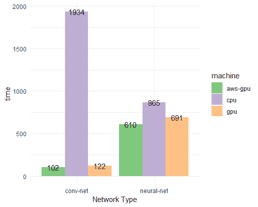

图 10.1：两个深度学习网络在 CPU、本地 GPU 和 AWS GPU 上的执行时间（秒）

在我的本地机器上，运行二进制预测任务的深度学习模型在 GPU 上比在 CPU 上快约 20%，而 AWS GPU 机器比本地 GPU 快约 13%。然而，在运行卷积神经网络时，使用本地 CPU 训练几乎比使用本地 GPU 慢 16 倍。反过来，AWS GPU 比本地 GPU 快约 16%。这些结果是预期的，并且与我在实践中看到的情况和其他网站上的基准测试相符，明确表明对于深度学习计算机视觉任务，GPU 是必不可少的。我的本地机器上的 GPU 卡（GTX 1050 Ti）可能是您应该用于深度学习的最低规格 GPU 卡。目前的价格不到$200。作为比较，高端 GPU 卡（GTX 1080 Ti）拥有 3584 个核心和 11 GB 的内存，目前的价格约为$700。GTX 1080 Ti 比 GTX 1050 Ti 快大约 4-5 倍。

为什么前面的图表只涉及 AWS，而不涉及 Azure、Google Cloud 和 Paperspace？为什么我没有对它们的性能和/或成本进行基准测试？我有几个理由决定不这样做。首先，也是最重要的是，任何推荐在几个月后就会过时——深度学习非常流行，各个云服务提供商不断更改其产品和价格。另一个原因是，本书中的示例相对较小，我们使用的是最便宜的 GPU 实例。因此，与生产用例的任何比较都可能误导。最后，当您刚开始时，易用性可能比原始成本更重要。本书中的所有示例在任何提供商的云中都应在 1 小时内运行，因此争论一个提供商每小时成本为$0.55 和另一个为$0.45 是不重要的。

# 我如何知道我的模型是在 GPU 上训练的？

许多刚开始深度学习的人会问一个问题，*我如何知道我的模型是在 GPU 上训练的？*幸运的是，无论您是使用云实例还是本地机器，您都可以检查深度学习模型是在 GPU 还是 CPU 上进行训练。实例上有一个工具可以显示 GPU 的活动。在 Linux 中，您可以输入以下命令：

```py
watch -n0.5 nvidia-smi
```

在 Windows 中，您可以从命令提示符中使用以下命令：

```py
nvidia-smi -l 1
```

这将运行一个脚本，输出关于计算机 GPU 的诊断信息。如果您的模型当前正在 GPU 上训练，GPU 实用程序将会很高。在下面的示例中，我们可以看到它为 75-78%。我们还可以看到名为`rsession.exe`的文件正在使用 GPU 内存。这证实了模型正在 GPU 上训练：

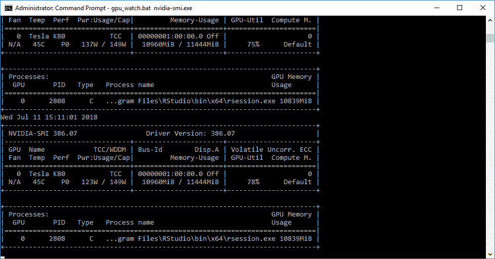

图 10.2：nvidia-smi 工具显示 GPU 卡的利用率为 75-85%

# 使用 AWS 进行深度学习

**AWS** 是最大的云服务提供商，因此它值得我们关注。如果你知道如何使用 AWS，特别是如果你熟悉竞价请求，它可以是训练复杂深度学习模型的一种非常具有成本效益的方法。

# AWS 简介

本节简要介绍了 AWS 的工作原理。它描述了 EC2、AMI 以及如何在云中创建虚拟机。这不会是对 AWS 的详尽介绍——网上有很多教程可以指导你。

AWS 是一套云资源。另一个术语是**基础设施即服务**（**IaaS**），与**软件即服务**（**SaaS**）或**平台即服务**（**PaaS**）不同。在 IaaS 中，与 SaaS 或 PaaS 不同，你获得的是基础设施（硬件），如何使用它取决于你。这包括安装软件和管理安全性与网络，尽管 AWS 会处理一些安全性和网络方面的内容。AWS 提供了许多服务，但对于深度学习，你将使用的是 EC2，它是一个虚拟计算环境，允许你启动实例（虚拟计算机）。你可以通过 Web 界面或远程登录它们来运行命令控制这些虚拟计算机。当你启动一个 EC2 实例时，可以选择操作系统（如 Ubuntu、Linux、Windows 等）以及你想要的机器类型。

你还可以选择使用**Amazon 机器镜像**（**AMI**），它已经预装了软件应用和库。这对于深度学习是一个不错的选择，因为这意味着你可以启动一个已安装深度学习库的 EC2 实例，直接开始深度学习。

你应该熟悉的另一个服务是 S3，它是一种持久存储。我建议你采用的一个非常有用的做法是将你的虚拟机视为临时资源，并将数据和中间结果保存在 S3 中。我们在本章中不会讨论这个，因为它是一个高级话题。

在上一节中，我们提到当前 AWS 上最便宜的 GPU 计算机的按需费用为每小时$0.90。*按需* 是一种使用 AWS 虚拟机的方式，但在 AWS 中有三种不同的方式来租用虚拟机：

+   **按需实例**：当你按需租用实例时。

+   **预留实例**：当你承诺在一定时间内（通常为 1-3 年）租用机器时。这比按需实例便宜大约 50%。然而，你需要承诺在这段时间内为资源付费。

+   **现货实例**：为了应对需求波动，亚马逊大部分时间都有备用的计算资源。你可以竞标这些未使用的资源，通常你可以以比按需和保留实例便宜的价格获得它，具体价格取决于该类型机器的需求。然而，一旦你获得了这台机器，并不保证你会一直使用它——如果计算机需求增加，你的计算机可能会被终止。

保留实例对于深度学习并不实用。租用最便宜的 GPU 机器 1 年的费用将超过 5000 美元，而你可以花更少的钱买到性能更好的深度学习机器。按需实例保证你会在需要时拥有资源，但费用较高。如果你知道如何正确使用现货实例并计划好计算机可能会被终止的风险，它是一种有趣且成本效益高的使用方法。

通常，现货价格大约是按需价格的 30%，所以节省的费用非常可观。你的竞标价格是你愿意为现货实例支付的最高金额，实际价格取决于市场价格，市场价格基于需求变化。

因此，你应该将竞标价格设定得更高；我建议设定为按需价格的 51%、76%或 101%。额外的 1%是因为，与任何竞标市场类似，人们习惯将竞标价格定为圆整的数字，通过加上 1%的额外数值，可以避开这一惯性，从而可能产生不同的结果。

现货实例最初的使用场景是低优先级的批处理任务。公司使用现货实例来节省计算资源，运行那些如果未能完成可以重新启动的长期任务。例如，可能是运行一个处理非关键操作数据的二次数据摄取过程。然而，基于 GPU 的实例的需求模式有所不同，可能是因为类似 Kaggle 这样的在线数据挖掘比赛。由于 GPU 实例并不常见，GPU 实例的需求波动更大。这导致了现货定价中出现一些奇怪的现象，人们为现货实例竞标的价格可能是按需价格的 10 倍。人们之所以这样做，是因为他们认为这样不太可能被其他人超出出价。有时候，p2.16xlarge 的现货价格为每小时 144 美元，而按需价格为 14.40 美元。那些设置这些竞标的人不希望自己的机器被终止，并认为即使他们出高价，平均下来使用现货实例仍然比按需实例便宜。如果你打算使用现货实例，我不推荐这种做法，因为如果需求突然上升，你可能会遇到非常大的意外！不过，你应该意识到这一定价怪癖——不要认为只要将竞标价格设定为略高于按需价格，就能保证你的机器不会被终止。

AWS 通过提供定价历史图表来帮助你设置竞价请求，图表会提供按需价格和竞价价格的建议。在下图中，我们可以看到某个特定区域（us-east）过去三个月的价格变化情况。该区域有 6 个可用区（us-east-1a 到 us-east-1f），该实例类型（**p2.16xlarge**）的当前竞价价格在 4.32 美元至 14.40 美元之间，而按需价格为 14.40 美元：

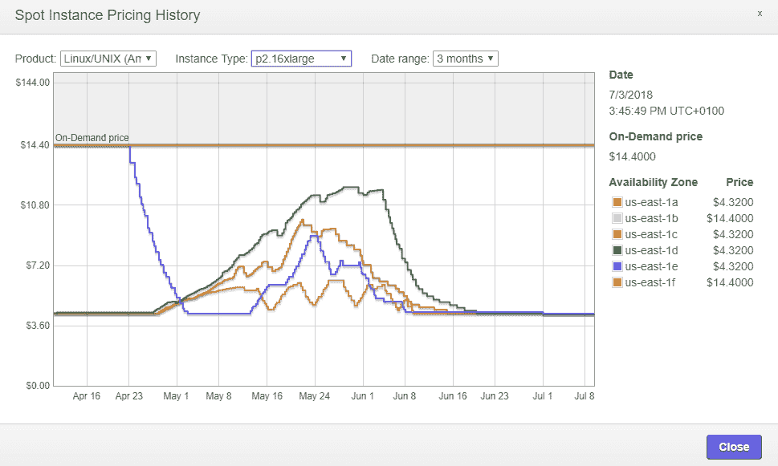

图 10.3：p2.16xlarge 实例类型的竞价历史

查看上述资源的图表后，我会考虑以下因素：

+   如果可能，我会选择 **us-east-1a** 可用区，因为它的价格波动最小。

+   我会将价格设置为每小时 7.21 美元，这只是按需价格的 50% 以上。由于自从 us-east-1a 区域的竞价价格超过每小时 4.32 美元已经过去一个月，我可能只会支付每小时 4.32 美元。将价格设置为较高的金额会使得我的竞价实例被终止的可能性较小。

**区域和可用区：** AWS 将其服务安排在不同的区域（**us-east1**、**eu-west1** 等）。目前，有 18 个不同的区域，并且每个区域中都有多个可用区，你可以将它们视为物理数据中心。对于一些使用案例（例如，网站、灾难恢复等）和合规要求，区域和可用区非常重要。对于深度学习来说，它们并不那么重要，因为你通常可以在任何位置运行深度学习模型。各个区域/可用区的竞价价格不同，某些资源在某些区域会更贵。你还需要注意，在不同区域之间转移数据是有成本的，所以最好将数据和实例保持在同一区域内。

# 在 AWS 中创建深度学习 GPU 实例

本节将使用 AWS 来训练 第九章《异常检测与推荐系统》中的深度学习模型。这将包括设置机器、访问机器、下载数据以及运行模型。我们将使用来自 RStudio 的预构建 AWS AMI，里面已经安装了 TensorFlow 和 Keras。有关此 AMI 的详细信息，请访问此链接：[`aws.amazon.com/marketplace/pp/B0785SXYB2`](https://aws.amazon.com/marketplace/pp/B0785SXYB2)。如果你还没有 AWS 账户，你需要在 [`portal.aws.amazon.com/billing/signup`](https://portal.aws.amazon.com/billing/signup) 注册一个账户。一旦注册完成，请按照以下步骤在 AWS 上创建一个带有 GPU 的虚拟机：

请注意，在 AWS 中设置实例时，实例运行期间会计费！务必确保关闭实例，否则你将继续被收费。在完成使用虚拟实例后，检查 AWS 控制台，确保没有正在运行的实例。

1.  登录到 AWS 控制台并选择 EC2。你应该会看到一个类似于以下的屏幕。这是创建新虚拟机器的 Web 界面：

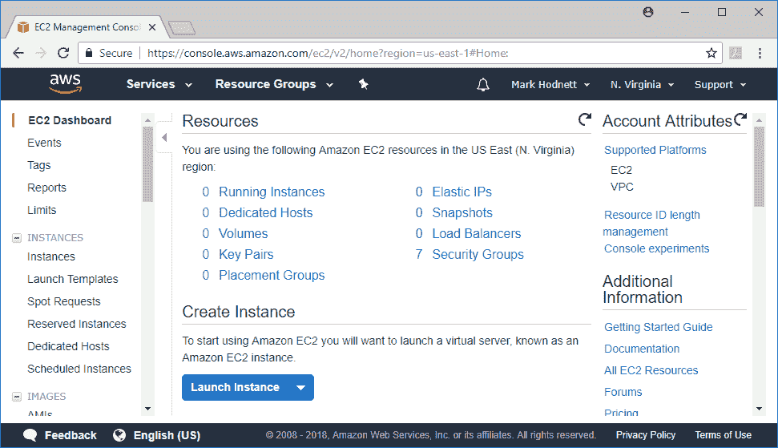

图 10.4：AWS EC2 仪表板

1.  点击启动实例按钮，以下页面将加载。

1.  点击左侧的**AWS Marketplace**，在搜索框中输入`rstudio`（参见以下截图）。

1.  选择**带有 Tensorflow-GPU 的 RStudio 服务器（适用于 AWS）**。请注意，还有另一个选项带有**Pro**字样——这是一个付费订阅，附加了额外费用，所以不要选择这个 AMI：

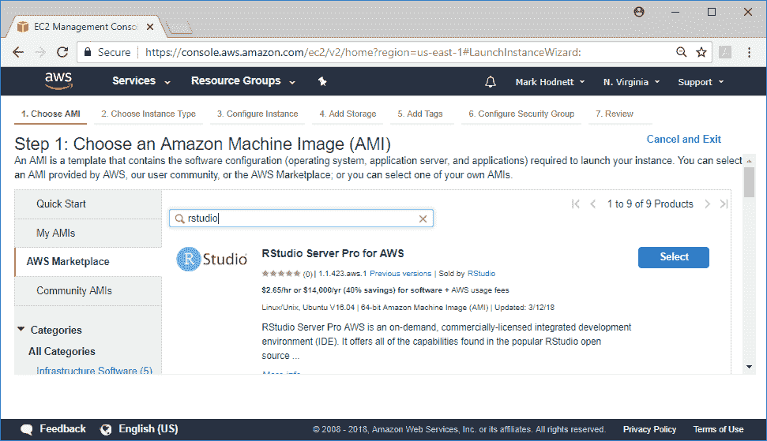

图 10.5：AWS 启动实例向导，第 1 步

1.  一旦点击**选择**，可能会出现以下屏幕，其中包含有关访问实例的附加信息。请仔细阅读说明，因为它们可能与以下屏幕截图中显示的内容有所不同：

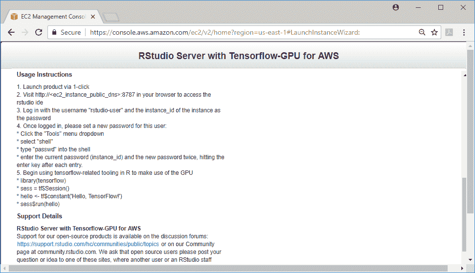

图 10.6：RStudio AMI 信息

1.  当你点击**继续**时，以下屏幕将出现，选择机器类型非常重要。一定要选择一个带有 GPU 的机器，所以在**按筛选条件：**选项中，选择 GPU 计算，然后从列表中选择**p2.xlarge**。你的选项应该与以下截图类似：

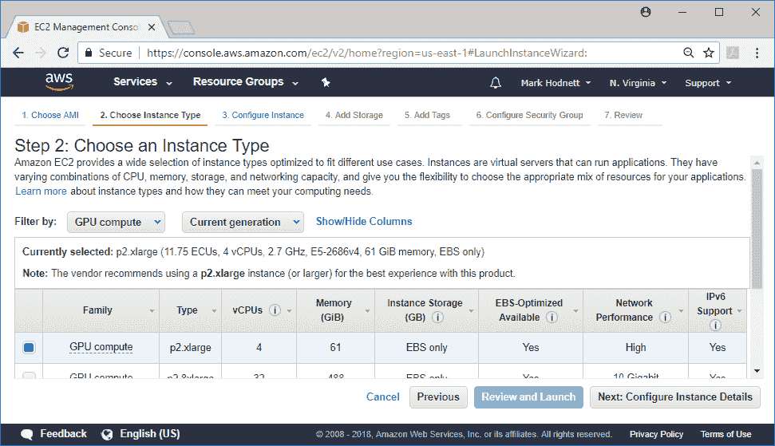

图 10.7：AWS 启动实例向导，第 2 步

1.  点击下一步后，你将看到一个包含各种配置选项的屏幕。默认选项是可以的，所以只需再次点击下一步：

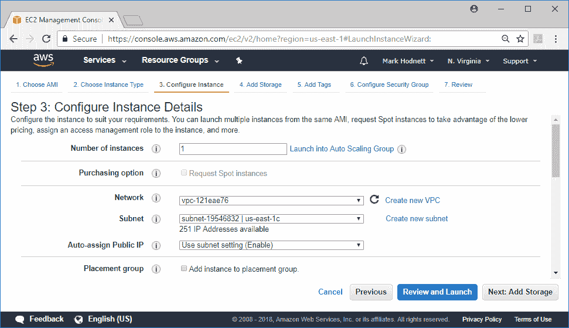

图 10.8：AWS 启动实例向导，第 3 步

1.  此屏幕允许你更改存储选项。根据数据大小，你可能需要增加额外的存储。存储相对便宜，所以我建议选择输入数据大小的 3 倍到 5 倍的存储空间。

1.  点击**下一步**以进入下一个截图：

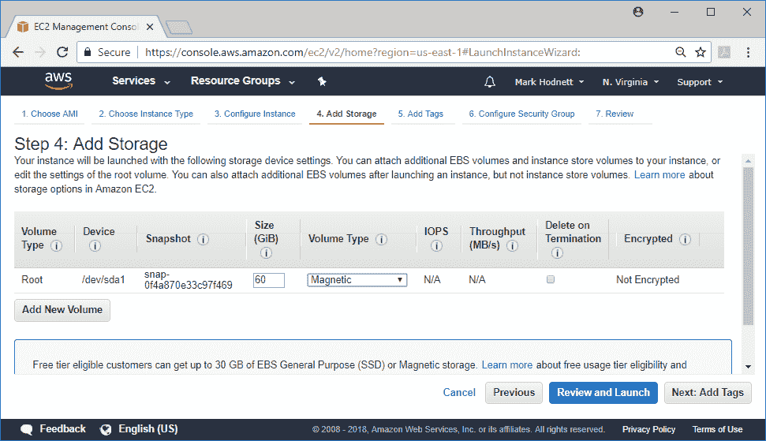

图 10.9：AWS 启动实例向导，第 4 步

1.  以下屏幕不重要——标签用于在 AWS 中跟踪资源，但我们不需要它们。点击下一步以进入下一个截图：

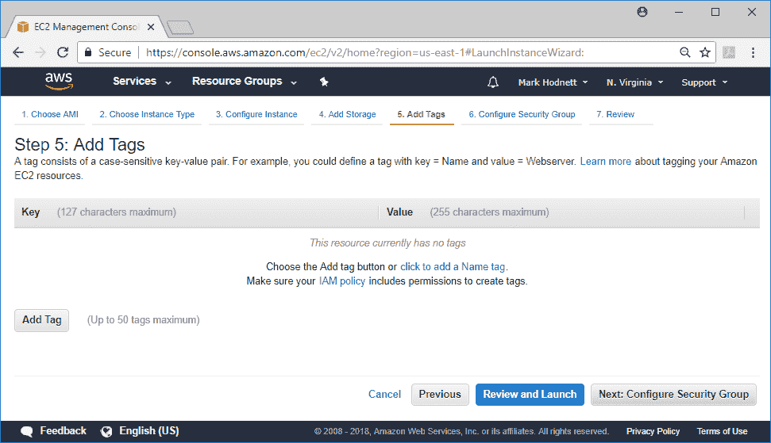

图 10.10：AWS 启动实例向导，第 5 步

1.  以下截图显示了安全选项。AWS 限制了对实例的访问，因此你必须打开任何需要的端口。此处提供的默认选项允许访问端口`22`（SSH）以访问 shell，并且还允许访问端口`8787`，这是 RStudio 使用的 Web 端口。点击审查并启动以继续：

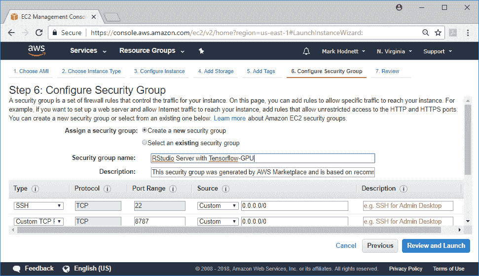

图 10.11：AWS 启动实例向导，第 6 步

下面的截图将会显示。注意关于安全性的警告信息——在生产环境中，你可能需要解决这些问题。

1.  点击**启动**按钮以继续：

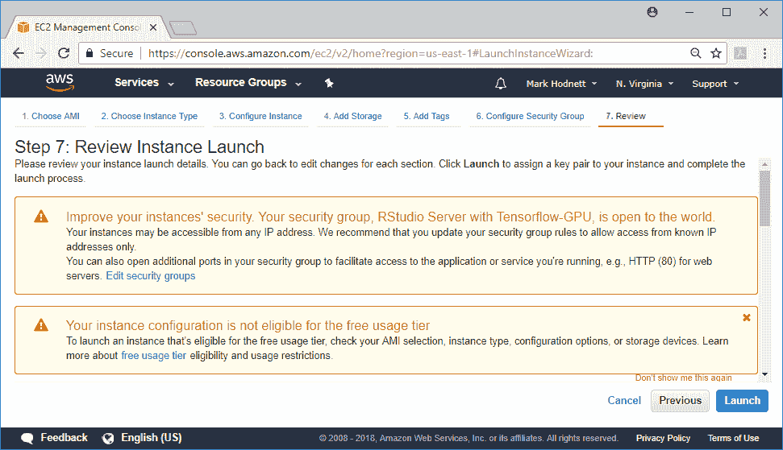

图 10.12：AWS 启动实例向导，第 7 步

1.  系统会要求你选择一个密钥对。如果你还没有创建密钥对，请选择相应的选项进行创建。给它起一个描述性的名字，然后点击下载密钥对按钮。之后，点击“启动实例”按钮：

密钥对用于通过 SSH 访问实例。你应该非常小心地保护这个密钥，因为如果有人获得了你的私钥，他们将能够登录到你的任何实例。你应该定期删除密钥对并创建一个新的。

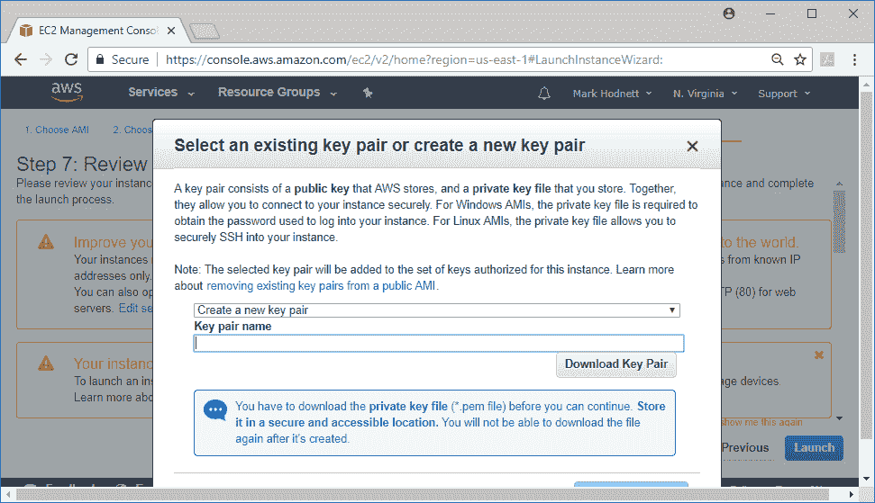

图 10.13：AWS 启动实例向导，选择密钥对

1.  完成此操作后，你可以返回到 EC2 控制台，看到你有 1 个正在运行的实例。点击该链接查看实例的详细信息：

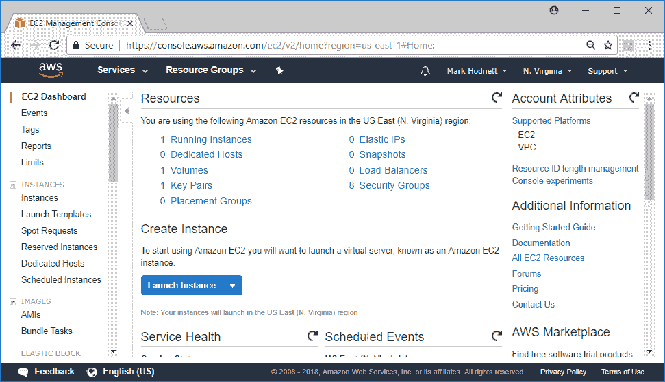

图 10.14：AWS EC2 控制台

1.  在这里，你将看到实例的详细信息。在本例中，IP 地址是`34.227.109.123`。还需要记下被高亮显示的实例 ID，因为这是用于连接到 RStudio 实例的密码：

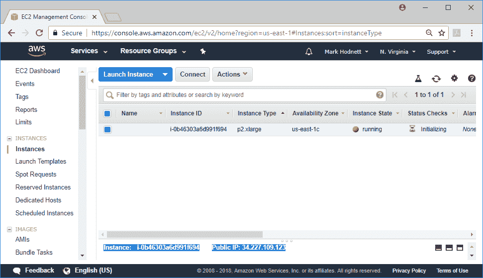

图 10.15：AWS EC2 控制台，实例详细信息

1.  打开另一个网页，浏览到你机器的 IP 地址，并在后面加上`:8787`以访问该链接。在我的示例中，链接是`http://34.227.109.123:8787/`。登录的说明在*图 10.6*中，即使用`rstudio-user`作为用户名，实例 ID 作为密码。你还应考虑按照说明更改密码。

1.  登录后，你将看到一个熟悉的界面——它类似于 RStudio 桌面程序。一个不同之处是你右下角的**上传**按钮，它允许你上传文件。在以下示例中，我已经上传了第九章的数据显示和脚本，*异常检测与推荐系统*，用于 Keras 推荐系统示例，并成功运行：

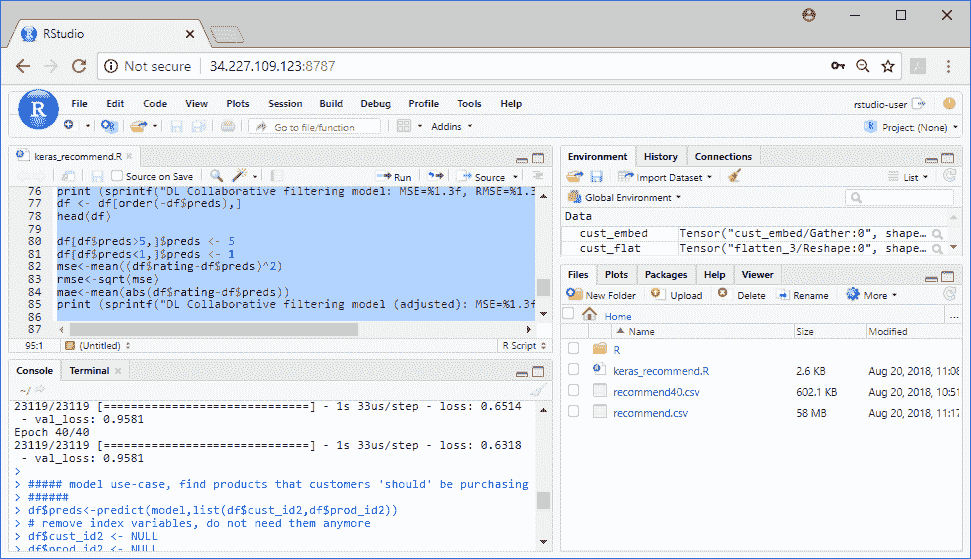

图 10.16：通过 RStudio Server 访问云中的深度学习实例

RStudio 的 Web 界面类似于在本地计算机上使用 RStudio。在*图 10.16*中，你可以看到我上传的数据显示文件（`recomend.csv`，`recomend40.csv`）以及位于左下窗口的文件中的 R 脚本。我们还可以看到在左下角控制台窗口中执行的代码。

这就完成了我们在 AWS 中如何设置深度学习机器的示例。再提醒一次，记得计算机运行时会计费。确保终止你的实例，否则你将继续被收费。为此，返回到 EC2 仪表板，找到实例，并点击**操作**按钮。会弹出一个菜单，选择**实例状态**，然后选择**终止**：

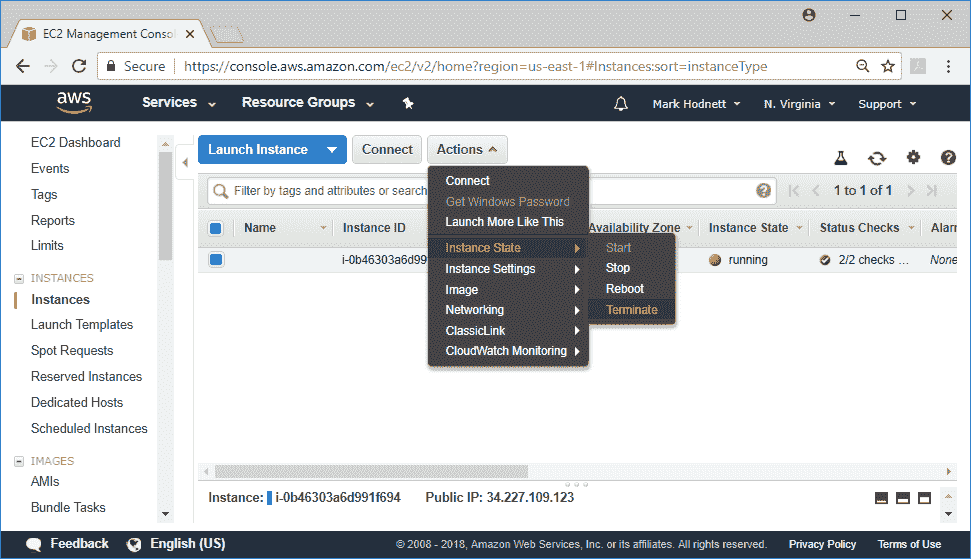

图 10.17：终止 AWS 实例

# 在 AWS 中创建深度学习 AMI

在之前的示例中，我们使用了由 RStudio 构建的**Amazon Machine Image**（**AMI**）。在 AWS 中，你也可以创建自己的 AMI。当你创建 AMI 时，可以安装所需的软件，将数据加载到 AMI 中，并按自己的需求进行设置。本节将向你展示如何使用 AMI 在 AWS 上使用 MXNet。

1.  创建 AMI 的第一步是选择要使用的基础镜像。我们可以从只安装了操作系统的基础镜像开始，但我们将使用之前提到的**带有 Tensorflow-GPU 的 RStudio Server for AWS**，并向其中添加 MXNet 包。

1.  安装 MXNet 的说明改编自[`mxnet.incubator.apache.org/install/index.html`](https://mxnet.incubator.apache.org/install/index.html)。第一步是按照前一节的说明，从**带有 Tensorflow-GPU 的 RStudio Server for AWS** AMI 创建实例。

1.  完成此步骤后，你需要 SSH 登录到机器。如何操作取决于你自己计算机的操作系统。对于 Linux 和 macOS，你可以在 shell 中执行本地命令；在 Windows 上，你可以使用 Putty。

1.  登录到机器后，运行以下命令：

```py
vi ~/.profile
```

1.  将以下行添加到文件的末尾并保存文件：

```py
export CUDA_HOME=/usr/local/cuda
```

1.  回到 shell 后，依次运行以下命令：

```py
sudo apt-get update
sudo dpkg --configure -a
sudo apt-get install -y build-essential git
export CUDA_HOME=/usr/local/cuda
git clone --recursive https://github.com/apache/incubator-mxnet
cd incubator-mxnet
make -j $(nproc) USE_OPENCV=1 USE_CUDA=1 USE_CUDA_PATH=/usr/local/cuda USE_CUDNN=1
```

1.  最后一个命令可能需要最多 2 小时才能完成。完成后，运行最后几行命令：

```py
sudo ldconfig /usr/local/cuda/lib64
sudo make rpkg
sudo R CMD INSTALL mxnet_current_r.tar.gz
```

第二行命令可能需要最多 30 分钟。最后一行可能会返回关于缺少文件的警告，可以忽略该警告。

1.  要测试是否一切安装正确，访问该实例的 RStudio 页面并输入以下代码：

```py
library(mxnet)
a <- mx.nd.ones(c(2,3), ctx = mx.gpu())
b <- a * 2 + 1
b
```

1.  你应该得到以下输出：

```py
 [,1] [,2] [,3]
[1,]    3    3    3
[2,]    3    3    3
```

1.  现在返回到 EC2 仪表板，点击**运行中的实例**，并在列表中选择该机器。点击**操作**按钮，从下拉菜单中选择**镜像**，然后选择**创建镜像**。如下图所示：

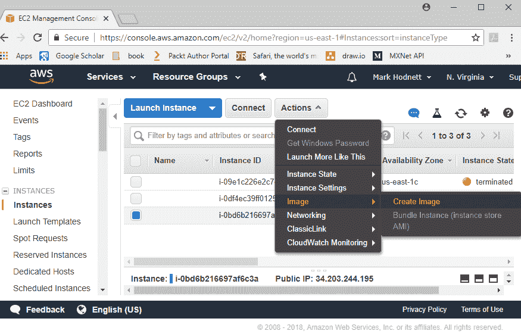

图 10.18：创建 AMI

1.  镜像创建可能需要 15-20 分钟才能完成。完成后，点击左侧菜单中的 AMI，显示与你账户关联的 AMI 列表。你应该能看到刚刚创建的 AMI。该 AMI 可以用于创建新的按需实例或新的抢占实例。下图展示了为 AMI 创建抢占实例的菜单选项：

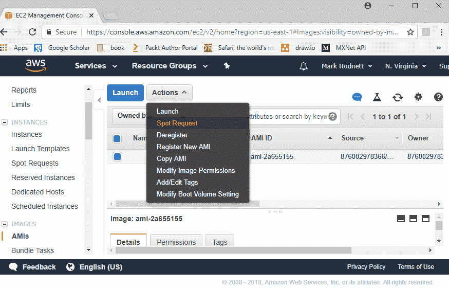

图 10.19：使用现有的 AMI 创建 Spot 请求

这个 AMI 现在可以使用，你可以创建新的深度学习实例。请注意，即使不使用它，存储 AMI 也会产生持续的费用。

# 使用 Azure 进行深度学习

Azure 是 Microsoft 云服务的品牌名。你可以使用 Azure 进行深度学习，类似于 AWS，它提供了预先配置了深度学习库的深度学习虚拟机。在这个示例中，我们将创建一个 Windows 实例，可以用于 Keras 或 MXNet。假设你的本地计算机也是 Windows 系统，因为你将使用**远程桌面协议**（**RDP**）访问云实例。

1.  第一步是创建一个 Azure 账户，然后在 [`portal.azure.com`](https://portal.azure.com) 登录 Azure。你将看到一个类似于下面的截图。点击**创建资源**并搜索**深度学习虚拟机**：

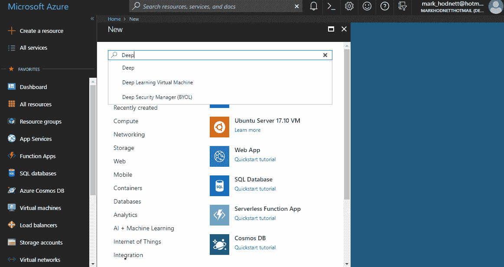

图 10.20：Azure 门户网站

1.  当你选择**深度学习虚拟机**时，以下屏幕将显示。点击**创建**：

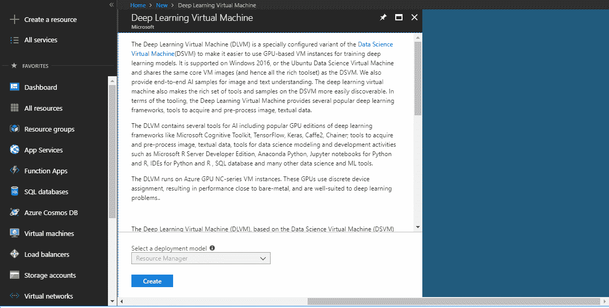

图 10.21：在 Azure 上部署深度学习实例，步骤 0

1.  现在你将开始一个 4 步向导来创建新实例。

第一步（基础）要求提供一些基本信息。可以输入与我相同的值，但请小心填写用户名和密码，因为稍后会用到：

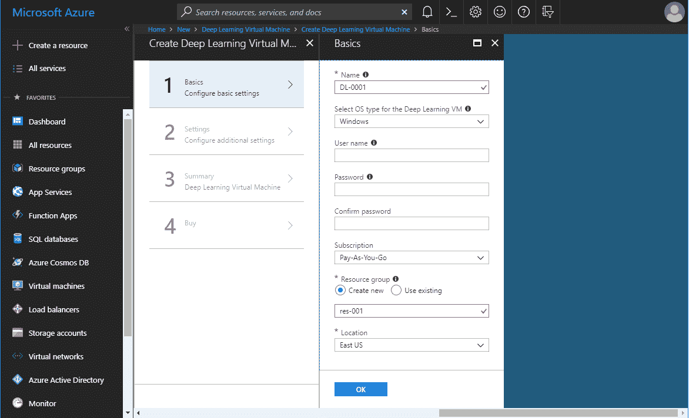

图 10.22：在 Azure 上部署深度学习实例，步骤 1

在第 2 步（设置）中，确保虚拟机的大小为 1 x Standard NC6（1 GPU），然后点击**确定**继续：

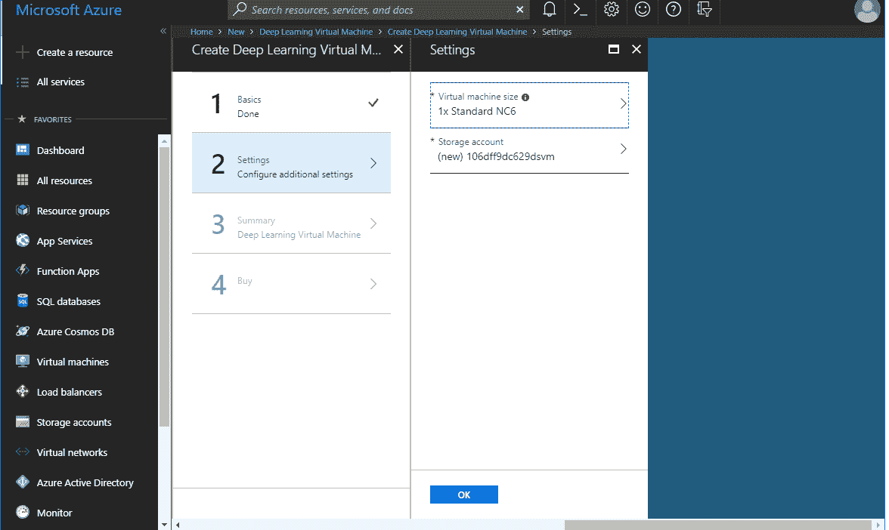

图 10.23：在 Azure 上部署深度学习实例，步骤 2

在第 3 步（摘要）中，有一个简短的验证检查。系统可能会提示你，账户没有足够的计算/虚拟机（核心/vCPU）资源，这是因为 Microsoft 在账户创建时可能对其进行了限制。你需要创建一个支持票，申请增加资源，然后再试。如果你通过了此步骤，点击**确定**继续。现在你进入了最后一步，只需点击**创建**：

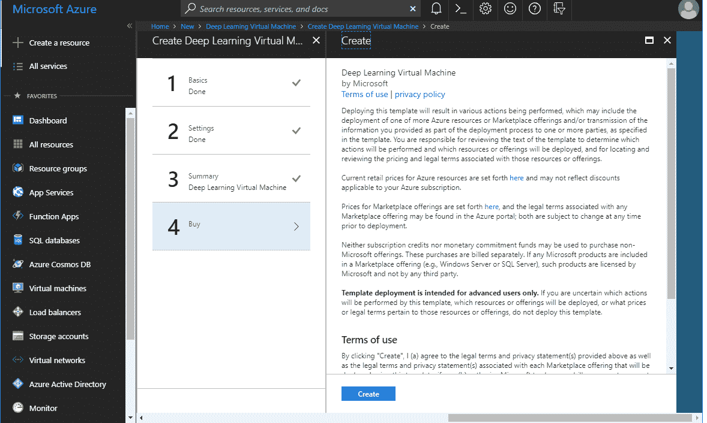

图 10.24：在 Azure 上部署深度学习实例，步骤 4

你可能需要等待 30-40 分钟，直到资源创建完成。完成后，选择左侧的**所有资源**，你会看到所有对象已经创建。以下截图显示了这一点。点击类型为**虚拟机**的项目：

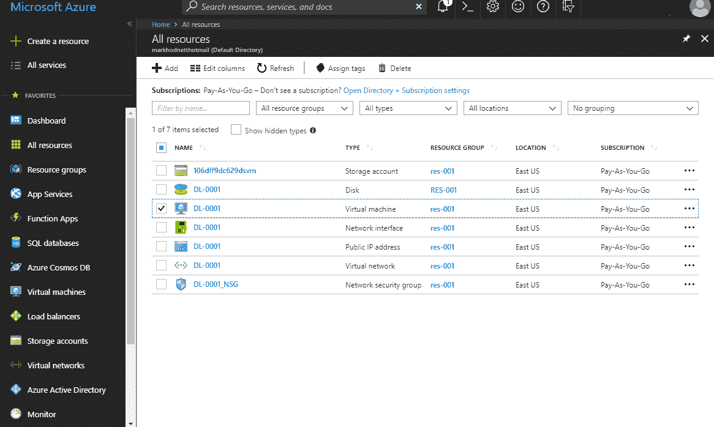

图 10.25：当前在 Azure 上部署的资源列表

1.  然后你将看到以下截图。点击屏幕顶部的**连接**按钮。

1.  右侧将弹出一个面板，提供**下载 RDP 文件**的选项。点击该选项，当文件下载完毕后，双击它：

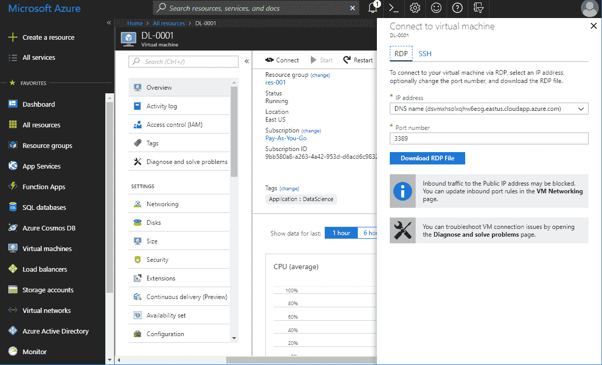

图 10.26：下载 RDP 文件以连接到 Azure 中的云实例

1.  这应该会弹出一个登录窗口，连接到云实例。输入你在第 1 步中创建的用户名和密码以连接到实例。连接后，你将看到一个类似于以下截图的桌面：

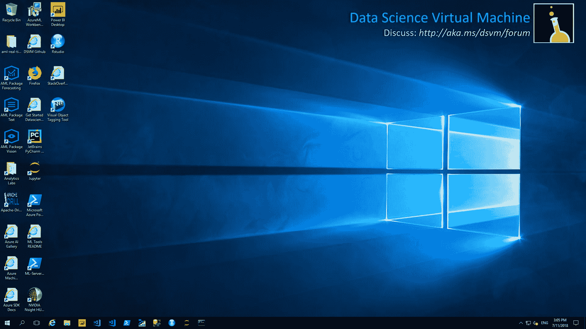

图 10.27：深度学习实例的远程桌面（Azure）

太好了！RStudio 已经安装好。Keras 也已安装，因此你任何的 Keras 深度学习代码都可以运行。现在让我们尝试运行一些 MXNet 代码。打开 RStudio 并运行以下命令来安装 MXNet：

```py
cran <- getOption("repos")
cran["dmlc"] <- "https://apache-mxnet.s3-accelerate.dualstack.amazonaws.com/R/CRAN/GPU/cu90"
options(repos = cran)
install.packages("mxnet")

# validate install
library(mxnet)
a <- mx.nd.ones(c(2,3), ctx = mx.gpu())
b <- a * 2 + 1
b
```

在当前安装的 R 版本中，这将无法工作。如果你想使用 MXNet，必须下载最新版本的 R（撰写本书时是 3.5.1 版本）并安装。不幸的是，这会禁用 Keras，因此只有在你希望使用 MXNet 而不是 Keras 时才这样做。从 https://cran.r-project.org/ 下载 R 后，再重新运行上面的代码来安装 MXNet。

注意：这些 AMI 上安装的软件频繁变动。在安装任何深度学习库之前，检查已安装的 CUDA 版本。你需要确保深度学习库与机器上已安装的 CUDA 版本兼容。

# 使用 Google Cloud 进行深度学习

Google Cloud 也提供 GPU 实例。在撰写本书时，配备 NVIDIA Tesla K80 GPU 卡（这也是 AWS p2.xlarge 实例中的 GPU 卡）的实例按需价格为每小时 $0.45。这比 AWS 的按需价格便宜得多。有关 Google Cloud GPU 实例的更多详情，请访问 [`cloud.google.com/gpu/`](https://cloud.google.com/gpu/)。然而，对于 Google Cloud，我们将不使用实例，而是使用 Google Cloud Machine Learning Engine API 将机器学习任务提交到云中。与虚拟机配置相比，这种方法的一个大优势是你只需为所使用的硬件资源付费，而无需担心设置和终止实例。更多详情和定价信息可以在 [`cloud.google.com/ml-engine/pricing`](https://cloud.google.com/ml-engine/pricing) 查找到。

按照以下步骤注册 Google Cloud 并启用 API：

1.  注册 Google Cloud 账号。

1.  你需要登录到门户网站 [`console.cloud.google.com`](https://console.cloud.google.com) 并启用**Cloud Machine Learning Engine** API。

1.  从主菜单中选择**APIs & Services**，然后点击**启用 API 和服务**按钮。

1.  API 按组进行分类。选择**查看全部**以查看**机器学习**组，然后选择**Cloud Machine Learning Engine**并确保该 API 已启用。

启用 API 后，从 RStudio 执行以下代码：

```py
devtools::install_github("rstudio/cloudml")
library(cloudml)
gcloud_init()
```

这应该会安装 Google Cloud SDK，并要求您将 Google 账户连接到 SDK。然后，您将进入终端窗口中的一个选项菜单。第一个选项如下：

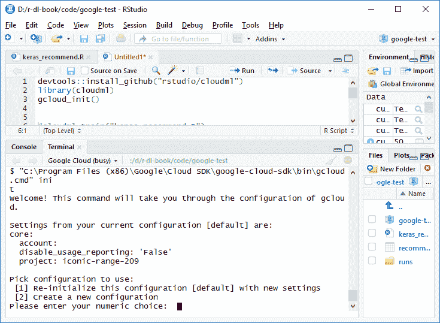

图 10.28：从 RStudio 访问 Google Cloud SDK

现在，暂时不要创建任何新的项目或配置，只需选择已经存在的项目。一旦将您的 Google 账户连接到机器上的 Google SDK 并启用了相关服务，您就可以开始使用了。Cloud Machine Learning Engine 允许您向 Google Cloud 提交作业，而无需创建任何实例。工作文件夹中的所有文件（R 脚本和数据）将被打包并发送到 Google Cloud。

在这个示例中，我从 第八章 项目中获取了推荐文件，*使用 TensorFlow 在 R 中的深度学习模型*。我将该文件和 `keras_recommend.R` 脚本复制到一个新目录，并在该目录中创建了一个新的 RStudio 项目。然后，我在 RStudio 中打开该项目。您可以在前面的截图中看到这两个文件和 RStudio 项目文件。接着，我在 RStudio 中执行以下命令提交深度学习作业：

```py
cloudml_train("keras_recommend.R", master_type = "standard_gpu")
```

这将收集当前工作目录中的文件，并将其发送到 Cloud Machine Learning Engine。在作业执行过程中，一些进度信息将返回到 RStudio。您还可以通过选择**ML Engine** | **Jobs**，在 [`console.cloud.google.com`](https://console.cloud.google.com) 控制台页面上监控活动。以下是该网页的截图，显示了两个已完成的作业和一个已取消的作业：

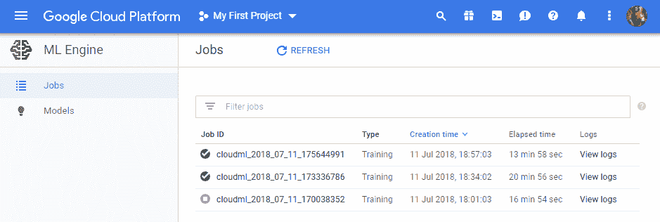

图 10.29：Google Cloud Platform 网页上的 ML 引擎/作业页面

当作业完成时，日志将被下载到本地机器。一个漂亮的总结网页会自动生成，显示作业的统计信息，如以下截图所示：

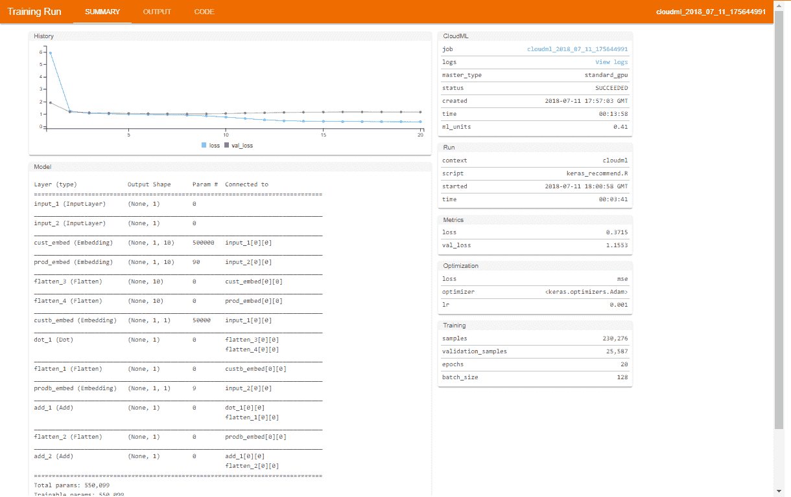

图 10.30：机器学习作业的网页总结页面

我们可以看到图表显示了模型在训练过程中的进度、模型摘要、一些超参数（**epochs**、**batch_size** 等），以及成本（**ml_units**）。该网页还包含来自 R 脚本的输出。选择菜单中的**输出**以查看。在以下截图中，我们可以看到 R 代码及其输出：

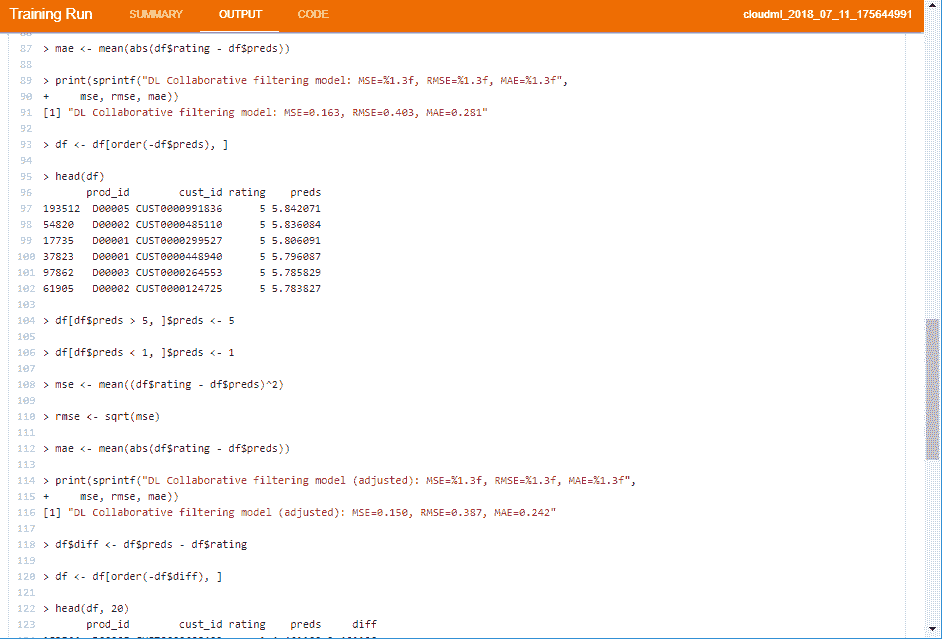

图 10.31：显示 R 代码和输出的机器学习作业网页总结页面

这只是使用 Google 云机器学习引擎的简要介绍。这里有一个出色的教程，您可以在[`tensorflow.rstudio.com/tools/cloudml/articles/tuning.html`](https://tensorflow.rstudio.com/tools/cloudml/articles/tuning.html)查看，它解释了如何使用此服务进行超参数训练。使用此服务进行超参数训练，比使用虚拟实例自己管理训练要简单得多，而且可能更加便宜。您不必监控它或协调模型训练的不同运行。有关如何使用此服务的更多信息，请访问[`tensorflow.rstudio.com/tools/cloudml/articles/getting_started.html`](https://tensorflow.rstudio.com/tools/cloudml/articles/getting_started.html)。

# 使用 Paperspace 进行深度学习

**Paperspace**是另一种有趣的方式，可以在云中进行深度学习。它可能是训练深度学习模型最简单的云端方式。要使用 Paperspace 设置云实例，您可以登录他们的控制台，配置一个新机器，并通过您的网页浏览器连接到它：

1.  首先注册 Paperspace 账号，登录控制台，通过选择核心或计算进入虚拟机部分。Paperspace 提供了一个带有 NVIDIA GPU 库（CUDA 8.0 和 cuDNN 6.0）以及 GPU 版本的 TensorFlow 和 Keras for R 的 RStudio TensorFlow 模板。您在选择**公共模板**时将看到这种机器类型，如下图所示：

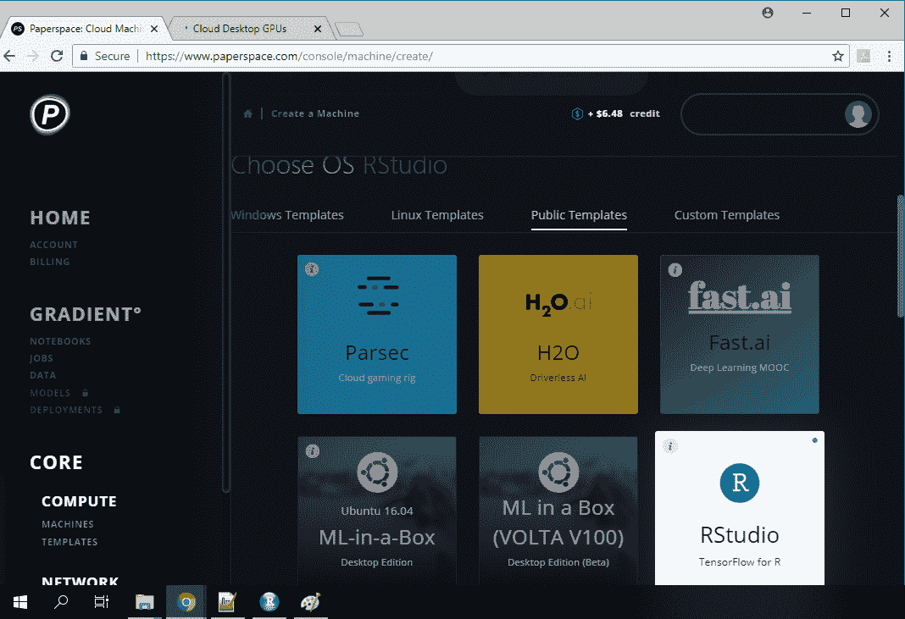

图 10.32：Paperspace 门户

1.  您将可以选择三种 GPU 实例，并选择按小时或按月付费。请选择最便宜的选项（目前是 P4000，按小时收费$0.40）和按小时计费。向下滚动页面底部，点击**创建**按钮。几分钟后，您的机器将被配置完毕，您将能够通过浏览器访问它。以下是一个 RStudio Paperspace 实例的示例：

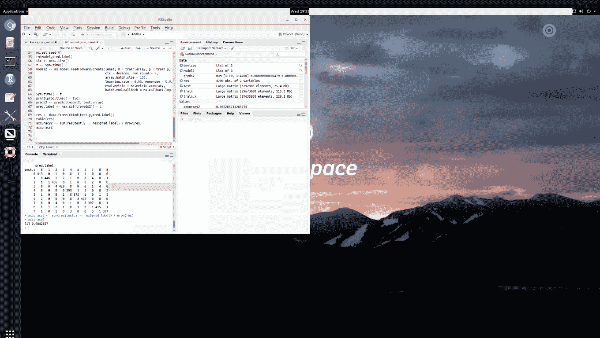

图 10.33：从网页访问虚拟机桌面并运行 RStudio，适用于 Paperspace 实例

默认情况下，Keras 已经安装，因此您可以直接使用 Keras 训练深度学习模型。然而，我们还将要在实例中安装 MXNet：

1.  第一步是打开 RStudio 并安装一些包。从 RStudio 执行以下命令：

```py
install.packages("devtools")
install.packages(c("imager","DiagrammeR","influenceR","rgexf"))
```

1.  下一步是访问您刚刚创建的实例的终端（或 Shell）。您可以返回控制台页面从那里操作。或者，点击桌面右上角的圆形目标（请参见前面的截图）。这还为您提供了其他选项，如同步本地计算机和虚拟机之间的复制粘贴。

1.  登录实例的终端后，运行以下命令将安装 MXNet：

```py
sudo apt-get update
sudo dpkg --configure -a
sudo apt-get install -y build-essential git
export CUDA_HOME=/usr/local/cuda
git clone --recursive https://github.com/apache/incubator-mxnet
cd incubator-mxnet
make -j $(nproc) USE_OPENCV=1 USE_BLAS=blas USE_CUDA=1 USE_CUDA_PATH=/usr/local/cuda USE_CUDNN=1

sudo ldconfig /usr/local/cuda/lib64
sudo make rpkg
```

1.  你还需要将以下行添加到 `.profile` 文件的末尾：

```py
export CUDA_HOME=/usr/local/cuda
```

完成后，重新启动实例。现在你有了一台可以在云端训练 Keras 和 MXNet 深度学习模型的机器。有关如何在 Paperspace 中使用 RStudio 的更多详细信息，请参见 [`tensorflow.rstudio.com/tools/cloud_desktop_gpu.html`](https://tensorflow.rstudio.com/tools/cloud_desktop_gpu.html)。

# 总结

本章已经涵盖了许多训练深度学习模型的选项！我们讨论了本地运行的选项，并展示了拥有 GPU 卡的重要性。我们使用了三大主流云服务提供商，在云端使用 R 来训练深度学习模型。云计算是一个极其出色的资源——我们举了一个超级计算机的例子，价值 149,000 美元。几年前，这样的资源几乎是每个人都无法企及的，但现在得益于云计算，你可以按小时租用这样的机器。

对于 AWS、Azure 和 Paperspace，我们在云端资源上安装了 MXNet，这让我们可以选择使用哪种深度学习库。我鼓励你使用本书其他章节中的示例，并尝试这里的所有不同云服务提供商。想想看，能做到这一点，而且你的总费用可能还不到 $10，真是令人惊叹！

在下一章也是最后一章，我们将基于图像文件构建图像分类解决方案。我们将展示如何应用迁移学习，这使得你可以将现有模型适应新的数据集。我们还将展示如何通过 REST API 部署模型到生产环境，并简要讨论生成对抗网络、强化学习，同时提供一些进一步的资源，以便你继续深入学习深度学习。
