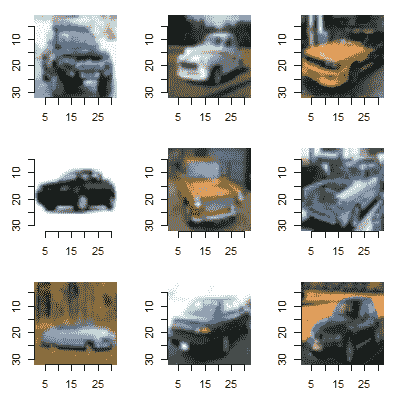
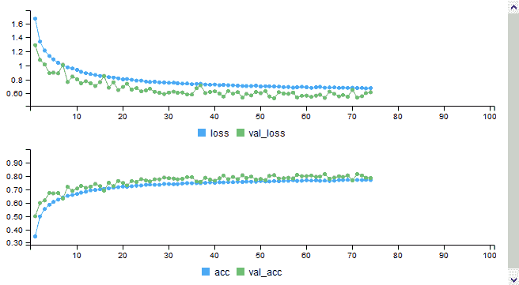
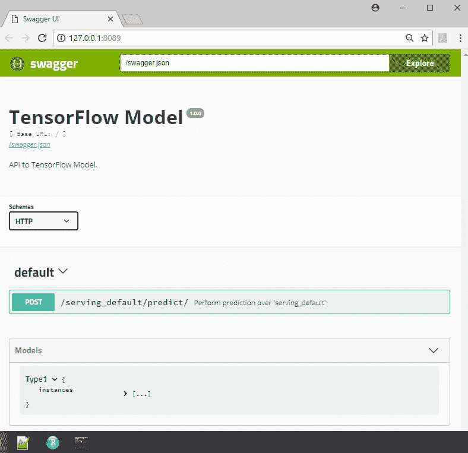
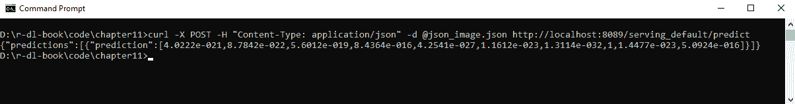
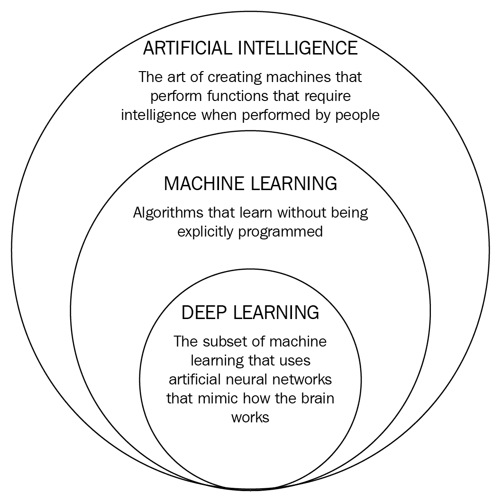

# 第十一章：深度学习的下一层级

我们的深度学习之旅即将结束。本章内容涉及多个主题。我们将从重新回顾一个图像分类任务开始，构建一个完整的图像分类解决方案，使用图像文件而不是表格数据。然后，我们将解释迁移学习，您可以将现有模型应用于新的数据集。接下来，我们讨论在任何机器学习项目中的一个重要考虑因素——您的模型将在部署中如何使用，也就是在生产环境中如何使用？我们将展示如何创建一个 REST API，允许任何编程语言调用 R 中的深度学习模型对新数据进行预测。然后，我们将简要讨论另外两个深度学习主题：生成对抗网络和强化学习。最后，我们将通过提供一些您可能感兴趣的其他资源，结束本章和本书的内容。

本章我们将涵盖以下主题：

+   构建完整的图像分类解决方案

+   ImageNet 数据集

+   迁移学习

+   部署 TensorFlow 模型

+   生成对抗网络

+   强化学习

+   其他深度学习资源

# 图像分类模型

我们在第五章中介绍了图像分类，*使用卷积神经网络进行图像分类*。在那一章中，我们描述了对于涉及图像的深度学习任务至关重要的卷积层和池化层。我们还在一个简单的数据集——MNIST 数据集上构建了多个模型。在这里，我们将探讨一些高级的图像分类主题。首先，我们将构建一个完整的图像分类模型，使用图像文件作为输入。我们将了解回调函数，这是构建复杂深度学习模型时的得力助手。一个回调函数将被用来将模型持久化（保存）到文件中，并在之后加载。接下来，我们将使用这个模型进行迁移学习。在迁移学习中，您会使用预训练模型中的一些层来处理新的数据。

# 构建完整的图像分类解决方案

我们已经构建了一些图像分类模型，但它们使用的是从 Keras 或 CSV 文件加载的 MNIST 数据集。数据始终是表格格式的。显然，这不是大多数情况下图像存储的方式。本节内容将讨论如何使用一组图像文件构建图像分类模型。第一个任务是获取一组图像文件。我们将加载包含在 Keras 中的 `CIFAR10` 数据，并将其保存为图像文件。然后，我们将使用这些文件构建深度学习模型。完成这项练习后，您将学会如何使用自己的图像文件创建深度学习图像分类任务。

本章的深度学习模型并不是一个复杂的模型。重点是展示图像分类任务的数据管道结构。我们会看看如何安排图像文件，如何使用数据增强，以及如何在训练过程中使用回调。

# 创建图像数据

第一步是创建图像文件。此部分的代码位于 `Chapter11/gen_cifar10_data.R` 文件夹中。我们将加载 `CIFAR10` 数据并将图像文件保存在数据目录中。第一步是创建目录结构。`CIFAR10` 数据集包含 10 个类别：我们将为构建模型保存 8 个类别，并将在后面的部分中使用 2 个类别（*迁移学习*）。以下代码将在 `data` 下创建以下目录：

+   `cifar_10_images`

+   `cifar_10_images/data1`

+   `cifar_10_images/data2`

+   `cifar_10_images/data1/train`

+   `cifar_10_images/data1/valid`

+   `cifar_10_images/data2/train`

+   `cifar_10_images/data2/valid`

这是 Keras 期望图像数据存储的结构。如果您使用此结构，则可以将图像用于在 Keras 中训练模型。在代码的第一部分，我们创建了这些目录：

```py
library(keras)
library(imager)
# this script loads the cifar_10 data from Keras
# and saves the data as individual images

# create directories,
# we will save 8 classes in the data1 folder for model building
# and use 2 classes for transfer learning
data_dir <- "../data/cifar_10_images/"
if (!dir.exists(data_dir))
  dir.create(data_dir)
if (!dir.exists(paste(data_dir,"data1/",sep="")))
  dir.create(paste(data_dir,"data1/",sep=""))
if (!dir.exists(paste(data_dir,"data2/",sep="")))
  dir.create(paste(data_dir,"data2/",sep=""))
train_dir1 <- paste(data_dir,"data1/train/",sep="")
valid_dir1 <- paste(data_dir,"data1/valid/",sep="")
train_dir2 <- paste(data_dir,"data2/train/",sep="")
valid_dir2 <- paste(data_dir,"data2/valid/",sep="")

if (!dir.exists(train_dir1))
  dir.create(train_dir1)
if (!dir.exists(valid_dir1))
  dir.create(valid_dir1)
if (!dir.exists(train_dir2))
  dir.create(train_dir2)
if (!dir.exists(valid_dir2))
  dir.create(valid_dir2)
```

在每个 train 和 valid 目录下，都为每个类别使用一个单独的目录。我们将 8 个类别的图像保存在 `data1` 文件夹下，将 2 个类别的图像保存在 `data2` 文件夹下：

```py
# load CIFAR10 dataset
c(c(x_train,y_train),c(x_test,y_test)) %<-% dataset_cifar10()
# get the unique categories,
# note that unique does not mean ordered!
# save 8 classes in data1 folder
categories <- unique(y_train)
for (i in categories[1:8])
{
  label_dir <- paste(train_dir1,i,sep="")
  if (!dir.exists(label_dir))
    dir.create(label_dir)
  label_dir <- paste(valid_dir1,i,sep="")
  if (!dir.exists(label_dir))
    dir.create(label_dir)
}
# save 2 classes in data2 folder
for (i in categories[9:10])
{
  label_dir <- paste(train_dir2,i,sep="")
  if (!dir.exists(label_dir))
    dir.create(label_dir)
  label_dir <- paste(valid_dir2,i,sep="")
  if (!dir.exists(label_dir))
    dir.create(label_dir)
}
```

一旦我们创建了目录，下一步就是将图像保存到正确的目录中，我们将在以下代码中完成此操作：

```py
# loop through train images and save in the correct folder
for (i in 1:dim(x_train)[1])
{
  img <- x_train[i,,,]
  label <- y_train[i,1]
  if (label %in% categories[1:8])
    image_array_save(img,paste(train_dir1,label,"/",i,".png",sep=""))
  else
    image_array_save(img,paste(train_dir2,label,"/",i,".png",sep=""))
  if ((i %% 500)==0)
    print(i)
}

# loop through test images and save in the correct folder
for (i in 1:dim(x_test)[1])
{
  img <- x_test[i,,,]
  label <- y_test[i,1]
  if (label %in% categories[1:8])
    image_array_save(img,paste(valid_dir1,label,"/",i,".png",sep=""))
  else
    image_array_save(img,paste(valid_dir2,label,"/",i,".png",sep=""))
  if ((i %% 500)==0)
    print(i)
}
```

最后，像之前做的那样，我们将进行验证检查，确保我们的图像是正确的。让我们加载 9 张来自同一类别的图像。我们想检查这些图像是否正确显示，并且它们是否来自同一类别：

```py
# plot some images to verify process
image_dir <- list.dirs(valid_dir1, full.names=FALSE, recursive=FALSE)[1]
image_dir <- paste(valid_dir1,image_dir,sep="")
img_paths <- paste(image_dir,list.files(image_dir),sep="/")

par(mfrow = c(3, 3))
par(mar=c(2,2,2,2))
for (i in 1:9)
{
  im <- load.image(img_paths[i])
  plot(im)
}
```

这将生成以下图表：



图 11.1：样本 CIFAR10 图像

这看起来不错！图像显示正确，我们可以看到这些图像似乎都属于同一个类别，即汽车。图像有些模糊，但那是因为它们仅是 32 x 32 的缩略图。

# 构建深度学习模型

一旦你运行了前面部分的脚本，你应该会在 `cifar_10_images/data1/train` 目录中拥有 40,000 张训练图像，在 `cifar_10_images/data1/valid` 目录中拥有 8,000 张验证图像。我们将使用这些数据训练一个模型。此部分的代码位于 `Chapter11/build_cifar10_model.R` 文件夹中。第一部分创建了模型定义，您应该已经很熟悉：

```py
library(keras)

# train a model from a set of images
# note: you need to run gen_cifar10_data.R first to create the images!
model <- keras_model_sequential()
model %>%
  layer_conv_2d(name="conv1", input_shape=c(32, 32, 3),
    filter=32, kernel_size=c(3,3), padding="same"
  ) %>%
  layer_activation("relu") %>%
  layer_conv_2d(name="conv2",filter=32, kernel_size=c(3,3),
                padding="same") %>%
  layer_activation("relu") %>%
  layer_max_pooling_2d(pool_size=c(2,2)) %>%
  layer_dropout(0.25,name="drop1") %>%

  layer_conv_2d(name="conv3",filter=64, kernel_size=c(3,3),
                padding="same") %>%
  layer_activation("relu") %>%
  layer_conv_2d(name="conv4",filter=64, kernel_size=c(3,3),
                padding="same") %>%
  layer_activation("relu") %>%
  layer_max_pooling_2d(pool_size=c(2,2)) %>%
  layer_dropout(0.25,name="drop2") %>%

  layer_flatten() %>%
  layer_dense(256) %>%
  layer_activation("relu") %>%
  layer_dropout(0.5) %>%
  layer_dense(256) %>%
  layer_activation("relu") %>%
  layer_dropout(0.5) %>%

  layer_dense(8) %>%
  layer_activation("softmax")

model %>% compile(
  loss="categorical_crossentropy",
  optimizer="adam",
  metrics="accuracy"
)
```

模型定义是基于 VGG16 架构进行修改的，我们将在后面看到它。我使用了更少的块和节点。请注意，最终的密集层必须有 8 个节点，因为 `data1` 文件夹中只有 8 个类别，而不是 10 个。

下一部分设置了数据生成器；其目的是在模型训练时将图像文件批次加载到模型中。我们还可以在数据生成器中对训练数据集应用数据增强。我们将选择通过随机水平翻转图像、水平/垂直平移图像和旋转图像最多 15 度来创建人工数据。我们在第六章 *模型调优与优化* 中看到，数据增强可以显著改善现有模型：

```py
# set up data generators to stream images to the train function
data_dir <- "../data/cifar_10_images/"
train_dir <- paste(data_dir,"data1/train/",sep="")
valid_dir <- paste(data_dir,"data1/valid/",sep="")

# in CIFAR10
# there are 50000 images in training set
# and 10000 images in test set
# but we are only using 8/10 classes,
# so its 40000 train and 8000 validation
num_train <- 40000
num_valid <- 8000
flow_batch_size <- 50
# data augmentation
train_gen <- image_data_generator(
  rotation_range=15,
  width_shift_range=0.2,
  height_shift_range=0.2,
  horizontal_flip=TRUE,
  rescale=1.0/255)
# get images from directory
train_flow <- flow_images_from_directory(
  train_dir,
  train_gen,
  target_size=c(32,32),
  batch_size=flow_batch_size,
  class_mode="categorical"
)

# no augmentation on validation data
valid_gen <- image_data_generator(rescale=1.0/255)
valid_flow <- flow_images_from_directory(
  valid_dir,
  valid_gen,
  target_size=c(32,32),
  batch_size=flow_batch_size,
  class_mode="categorical"
)
```

一旦数据生成器设置完毕，我们还将使用两个回调函数。回调函数允许你在执行特定数量的批次/周期后运行自定义代码。你可以编写自己的回调函数，或者使用一些预定义的回调函数。之前我们使用回调函数来记录指标，但在这里，回调函数将实现模型检查点和提前停止，这些通常在构建复杂深度学习模型时使用。

模型检查点用于将模型权重保存到磁盘。然后，你可以从磁盘加载模型到内存中，使用它来预测新的数据，或者你可以从保存到磁盘的地方继续训练模型。你可以在每个训练周期后保存权重，这在使用云资源并担心机器突然终止时可能非常有用。在这里，我们用它来保存到目前为止在训练过程中看到的最佳模型。每个训练周期后，它会检查验证损失，如果验证损失低于现有文件中的验证损失，则保存模型。

提前停止允许你在模型的性能不再提高时停止训练。有些人称之为一种正则化方法，因为提前停止可以防止模型过拟合。尽管它可以避免过拟合，但它与我们在第三章*深度学习基础*中看到的正则化技术（如 L1、L2、权重衰减和丢弃法）非常不同。使用提前停止时，你通常会允许模型继续训练几个周期，即使性能不再提升，停止训练前允许的周期数在 Keras 中被称为*耐心*。在这里，我们将其设置为 10，也就是说，如果模型在 10 个周期内没有提升，我们将停止训练。以下是我们将在模型中使用的回调函数代码：

```py
# call-backs
callbacks <- list(
  callback_early_stopping(monitor="val_acc",patience=10,mode="auto"),
  callback_model_checkpoint(filepath="cifar_model.h5",mode="auto",
                            monitor="val_loss",save_best_only=TRUE)
)
```

这是训练模型的代码：

```py
# train the model using the data generators and call-backs defined above
history <- model %>% fit_generator(
  train_flow,
  steps_per_epoch=as.integer(num_train/flow_batch_size),
  epochs=100,
  callbacks=callbacks,
  validation_data=valid_flow,
  validation_steps=as.integer(num_valid/flow_batch_size)
)
```

这里有一点需要注意的是，我们必须管理训练和验证生成器的每个周期的步数。当你设置一个生成器时，你并不知道实际有多少数据，所以我们需要为每个周期设置步数。这只是记录数除以批次大小的结果。

该模型在 GPU 上训练应少于一小时，而在 CPU 上训练则会显著更长。随着模型的训练，最佳模型会保存在`cifar_model.h5`文件中。我机器上最佳的结果是在第 64 轮时，验证准确率约为 0.80。此后，模型继续训练了另外 10 个轮次，但未能提升性能。以下是训练指标的图表：



图 11.2：模型训练期间的输出指标

# 使用已保存的深度学习模型

现在我们已经构建了深度学习模型，可以重新启动 R 并从磁盘重新加载模型。本节的代码位于`Chapter11/use_cifar10_model.R`文件夹中。我们将使用以下代码加载上一节中创建的模型：

```py
library(keras)

# load model trained in build_cifar10_model.R
model <- load_model_hdf5("cifar_model.h5")
```

我们将使用该模型为验证集中的图像文件生成预测。我们将选择验证文件夹中的第一个目录，然后从该文件夹中选择第 7 个文件。我们加载图像并对其进行与训练期间相同的预处理，即通过将像素值除以 255.0 来对数据进行归一化处理。以下是加载图像并生成预测的代码：

```py
> valid_dir <-"../data/cifar_10_images/data1/valid/"
> first_dir <- list.dirs(valid_dir, full.names=FALSE, recursive=FALSE)[1]
> valid_dir <- paste(valid_dir,first_dir,sep="")
> img_path <- paste(valid_dir,list.files(valid_dir)[7],sep="/")

# load image and convert to shape we can use for prediction
> img <- image_load(img_path, target_size = c(32,32))
> x <- image_to_array(img)
> x <- array_reshape(x, c(1, dim(x)))
> x <- x / 255.0
> preds <- model %>% predict(x)
> preds <- round(preds,3)
> preds
      [,1] [,2] [,3] [,4] [,5] [,6] [,7]  [,8]
[1,] 0.997    0    0    0    0    0    0 0.003
```

模型预测输入来自第一类，且置信度为 99.7%。由于我们选择了验证集中的第一个目录，预测是正确的。

我们将使用模型做的最后一件事是评估它在图像文件目录上的表现。我们还将展示如何为整个图像文件目录生成预测。该代码通过数据生成器加载来自目录的图像，类似于我们训练模型的方式。以下是评估并使用模型对我们保存到磁盘的验证图像进行类别预测的代码：

```py
> valid_dir <-"../data/cifar_10_images/data1/valid/"
> flow_batch_size <- 50
> num_valid <- 8000
> 
> valid_gen <- image_data_generator(rescale=1.0/255)
> valid_flow <- flow_images_from_directory(
   valid_dir,
   valid_gen,
   target_size=c(32,32),
   batch_size=flow_batch_size,
   class_mode="categorical"
 )
> 
> evaluate_generator(model,valid_flow,
   steps=as.integer(num_valid/flow_batch_size))
$`loss`
[1] 0.5331386

$acc
[1] 0.808625
```

验证准确率为`80.86%`，这与我们在模型训练过程中观察到的相似，确认了模型已正确保存到磁盘。以下是为所有 8,000 个验证图像生成预测的代码：

```py
> preds <- predict_generator(model,valid_flow,
    steps=as.integer(num_valid/flow_batch_size))
> dim(preds)
[1] 8000 8

> # view the predictions,
> preds <- round(preds,3)
> head(preds)
      [,1]  [,2]  [,3]  [,4]  [,5]  [,6]  [,7]  [,8]
[1,] 0.000 0.000 0.000 0.000 0.000 0.000 0.999 0.001
[2,] 0.000 0.007 0.001 0.002 0.990 0.000 0.000 0.000
[3,] 0.000 0.855 0.069 0.032 0.021 0.017 0.002 0.002
[4,] 0.134 0.001 0.000 0.000 0.000 0.000 0.001 0.864
[5,] 0.011 0.064 0.057 0.226 0.051 0.515 0.004 0.073
[6,] 0.108 0.277 0.135 0.066 0.094 0.091 0.052 0.179
```

我们可以看到，预测输出有 8,000 行和 8 列，因此对于每个验证图像，每个类别都有一个概率。我们可以看到每行的总和为 1.0，并且通常会有一个类别的概率显著较大。例如，模型预测第一张图像属于第 7 类，概率为 99.9%。

我们现在已经建立了一个完整的图像分类解决方案，使用图像文件。只要图像数据存储在相同的目录结构中，这个模板就可以重复用于其他任务。如果新的任务有不同数量的类别，那么您只需要更改最后一个全连接层中的节点数，可能还需要修改 softmax 激活函数。然而，如果您有一个新的图像分类任务，涉及现实生活中的图像，那么使用现有模型并进行迁移学习可能会获得更好的结果。在我解释如何操作之前，我将提供一些关于 ImageNet 数据集的背景信息，它通常用于训练复杂的模型，然后这些模型可以用于迁移学习。

# ImageNet 数据集

从 2010 年开始，举办了一年一度的图像分类比赛，名为 **ImageNet 大规模视觉识别挑战**（**ILSVRC**）。该图像集包含超过 1400 万张已标记了 1000 多个类别的图像。如果没有这个数据集，今天深度学习的巨大关注度将不会出现。它通过竞赛激发了深度学习领域的研究。然后，在 ImageNet 数据集上学习到的模型和权重通过迁移学习被应用于成千上万的其他深度学习模型。ImageNet 的实际历史是一个有趣的故事。以下链接（[`qz.com/1034972/the-data-that-changed-the-direction-of-ai-research-and-possibly-the-world/`](https://qz.com/1034972/the-data-that-changed-the-direction-of-ai-research-and-possibly-the-world/)）解释了这个项目最初并未受到关注，但随着一系列相关事件的发展，情况发生了变化：

+   ILSVRC 成为了研究人员图像分类的基准。

+   NVIDIA 发布了允许访问**图形处理单元**（**GPU**）的库。GPU 设计用于执行大规模并行矩阵运算，而这正是构建深度神经网络所需的。

+   多伦多大学的 Geoffrey Hinton、Ilya Sutskever 和 Alex Krizhevsky 创建了一个名为 **AlexNet** 的深度卷积神经网络架构，并在 2012 年赢得了比赛。尽管这不是卷积神经网络的首次应用，但他们的提交大大超过了下一个方法。

+   研究人员注意到，当他们使用 ImageNet 数据集训练模型时，能够将其应用于其他分类任务。他们几乎总是发现，使用 ImageNet 模型并进行迁移学习，比从头开始在原始数据集上训练模型要获得更好的性能。

图像分类的进展可以通过 ILSVRC 竞赛中的一些重要条目进行追踪：

| **团队** | **年份** | **错误率** |
| --- | --- | --- |
| 2011 年 ILSVRC 冠军（非深度学习） | 2011 | 25.8% |
| AlexNet（7 层） | 2012 | 15.3% |
| VGG Net（16 层） | 2014 | 7.32% |
| GoogLeNet / Inception（19 层） | 2014 | 6.67% |
| ResNet（152 层） | 2015 | 3.57% |

VGGNet、Inception 和 Resnet 都可以在 Keras 中使用。可以在[`keras.rstudio.com/reference/index.html#section-applications`](https://keras.rstudio.com/reference/index.html#section-applications)找到可用网络的完整列表。

这些网络的模型可以在 Keras 中加载，并用来将新图像分类到 ImageNet 的 1,000 个类别之一。我们接下来会讨论这个问题。如果你有一个新的分类任务，并且使用不同的图像集，你也可以使用这些网络，然后使用迁移学习，我们将在本章后面讨论迁移学习。类别的数量可以不同；你不需要为你的任务拥有 1,000 个类别。

也许最简单的模型是 VGGNet，因为它与我们在第五章中看到的*使用卷积神经网络进行图像分类*并没有太大区别。

# 加载现有模型

在本节中，我们将加载一个现有的模型（VGGNet）并用它来分类一张新图片。本节的代码可以在`Chapter11/vgg_model.R`中找到。我们将从加载模型并查看其架构开始：

```py
> library(keras)
> model <- application_vgg16(weights = 'imagenet', include_top = TRUE)

> summary(model)
_________________________________________________________________________
Layer (type)                     Output Shape                 Param # 
=========================================================================
input_1 (InputLayer)             (None, 224, 224, 3)          0 
_________________________________________________________________________
block1_conv1 (Conv2D)            (None, 224, 224, 64)         1792 
_________________________________________________________________________
block1_conv2 (Conv2D)            (None, 224, 224, 64)         36928 
_________________________________________________________________________
block1_pool (MaxPooling2D)       (None, 112, 112, 64)         0 
_________________________________________________________________________
block2_conv1 (Conv2D)            (None, 112, 112, 128)        73856 
_________________________________________________________________________
block2_conv2 (Conv2D)            (None, 112, 112, 128)        147584 
_________________________________________________________________________
block2_pool (MaxPooling2D)       (None, 56, 56, 128)          0 
_________________________________________________________________________
block3_conv1 (Conv2D)            (None, 56, 56, 256)          295168 
_________________________________________________________________________
block3_conv2 (Conv2D)            (None, 56, 56, 256)          590080 
_________________________________________________________________________
block3_conv3 (Conv2D)            (None, 56, 56, 256)          590080 
_________________________________________________________________________
block3_pool (MaxPooling2D)       (None, 28, 28, 256)          0 
_________________________________________________________________________
block4_conv1 (Conv2D)            (None, 28, 28, 512)          1180160 
_________________________________________________________________________
block4_conv2 (Conv2D)            (None, 28, 28, 512)          2359808 
_________________________________________________________________________
block4_conv3 (Conv2D)            (None, 28, 28, 512)          2359808 
_________________________________________________________________________
block4_pool (MaxPooling2D)       (None, 14, 14, 512)          0 
_________________________________________________________________________
block5_conv1 (Conv2D)            (None, 14, 14, 512)          2359808 
_________________________________________________________________________
block5_conv2 (Conv2D)            (None, 14, 14, 512)          2359808 
_________________________________________________________________________
block5_conv3 (Conv2D)            (None, 14, 14, 512)          2359808 
_________________________________________________________________________
block5_pool (MaxPooling2D)       (None, 7, 7, 512)            0 
_________________________________________________________________________
flatten (Flatten)                (None, 25088)                0 
_________________________________________________________________________
fc1 (Dense)                      (None, 4096)                 102764544 
_________________________________________________________________________
fc2 (Dense)                      (None, 4096)                 16781312 
_________________________________________________________________________
predictions (Dense)              (None, 1000)                 4097000 
=========================================================================
Total params: 138,357,544
Trainable params: 138,357,544
Non-trainable params: 0
_________________________________________________________________________
```

这个模型看起来很复杂，但当你仔细看时，实际上没有什么是我们之前没有见过的。它有两个包含两个卷积层的模块，后面跟着一个最大池化层。然后是三个包含三个卷积层的模块，后面也跟着一个最大池化层。最后，我们有一个扁平层和三个全连接层。最后一个全连接层有 1,000 个节点，这是 ImageNet 数据集中类别的数量。

让我们使用这个模型对一张新图像进行预测。这张图像是一辆自行车，尽管它有些不寻常——它是一辆计时赛自行车：


图 11.3：分类测试图像

以下代码块将图像处理成适合在 VGG 模型中使用的格式。它加载图像并将其调整为训练模型时使用的图像尺寸`(224, 224)`。然后，我们需要在调用`predict`函数之前对图像数据进行预处理。最后，Keras 中有一个名为`imagenet_decode_predictions`的辅助函数，我们可以用它来获取预测类别和概率：

```py
> img_path <- "image1.jpg"
> img <- image_load(img_path, target_size = c(224,224))
> x <- image_to_array(img)
> x <- array_reshape(x, c(1, dim(x)))
> x <- imagenet_preprocess_input(x)

> preds <- model %>% predict(x)
> imagenet_decode_predictions(preds, top = 5)
[[1]]
  class_name       class_description      score
1  n02835271   bicycle-built-for-two 0.31723219
2  n03792782   mountain_bike         0.16578741
3  n03891332   parking_meter         0.12548350
4  n04485082   tripod                0.06399463
5  n09193705   alp                   0.04852912
```

最好的预测是`bicycle-built-for-two`，概率略高于 30%，第二好的预测是`mountain_bike`，概率为 16.5%。ImageNet 有三轮车和独轮车（甚至还有`Model_T`汽车！）的类别，但似乎没有自行车的类别，因此这个预测结果不算差。不过，`mountain_bike`可能是这个图像的更准确类别，因为它显然不是一辆双人自行车！

# 迁移学习

深度学习相较于传统机器学习的一个少数缺点是它需要大量数据。迁移学习是克服这一问题的一种方式，方法是使用一个之前训练好的模型的权重（通常是训练在 ImageNet 数据上的）并将其应用到新的问题集上。

ImageNet 数据集包含 1,500 万张图片，分为 1,000 个类别。由于我们可以复用已在如此大量数据上训练过的模型的部分内容，可能只需每个类别几百张图片就能训练新模型。这取决于新数据与原始模型训练数据的相关性。例如，尝试将 ImageNet 模型（其训练数据为照片）上的迁移学习应用到其他领域的数据（例如，卫星图像或医学扫描）上，将会更加困难，并且需要更多的数据。我们在第六章中关于不同数据源的讨论，也同样适用。如果数据来自不同类型的数据分布，例如，移动设备拍摄的图像、偏离中心的照片、不同的光照条件等，这也会产生影响。这时，通过数据增强创建更多合成数据将会起到很大的作用。

现在，我们将应用迁移学习，使用在*构建深度学习模型*部分中构建的模型。回想一下，在构建和评估该模型时，我们仅使用了 8/10 的类别。现在我们将使用迁移学习构建一个新模型，用于区分剩下的 2 个类别。本部分的代码可以在`Chapter11/cifar_txr.R`文件夹中找到：

1.  我们将使用前一部分中构建的模型，并通过以下代码加载它：

```py
library(keras)

# load model trained in build_cifar10_model.R
model <- load_model_hdf5("cifar_model.h5")
```

1.  接下来，我们将调用模型对象上的`trainable_weights`来获取可训练层的数量。这将计算模型中所有非激活层的数量。

```py
> length(model$trainable_weights)
[1] 14
```

1.  接下来，我们将冻结模型中的早期层。冻结模型中的层意味着在反向传播过程中这些层的权重不会更新。我们冻结卷积块，但不冻结模型末尾的全连接层。我们使用在模型定义中设置的名称来指定冻结的第一层和最后一层。

1.  然后我们再次调用模型的`trainable_weights`，以确认数量已从之前的`14`变为`6`。这是冻结层的代码：

```py
freeze_weights(model,from="conv1", to="drop2")
length(model$trainable_weights)
[1] 6
```

1.  接下来，我们将通过在以下代码中调用`pop_layer`函数两次，从模型中移除最后的全连接层和激活层。我们需要这么做，因为我们的新任务有 2 个类别，而不是 8 个：

```py
# remove the softmax layer
pop_layer(model)
pop_layer(model)
```

1.  现在，我们可以通过以下代码添加一个包含 2 个节点的新层（因为在新任务中我们有 2 个类别）：

```py
# add a new layer that has the correct number of nodes for the new task
model %>%
  layer_dense(name="new_dense",units=2, activation='softmax')
summary(model)
```

1.  以下代码块会重新编译模型并设置生成器以加载数据。这与我们在构建模型时所看到的类似。不同之处在于这里没有使用数据增强：

```py
# compile the model again
model %>% compile(
  loss = "binary_crossentropy",
  optimizer="adam",
  metrics=c('accuracy')
)

# set up data generators to stream images to the train function
data_dir <- "../data/cifar_10_images/"
train_dir <- paste(data_dir,"data2/train/",sep="")
valid_dir <- paste(data_dir,"data2/valid/",sep="")

# in CIFAR10, # there are 50000 images in training set
# and 10000 images in test set
# but we are only using 2/10 classes,
# so its 10000 train and 2000 validation
num_train <- 10000
num_valid <- 2000
flow_batch_size <- 50
# no data augmentation
train_gen <- image_data_generator(rescale=1.0/255)
# get images from directory
train_flow <- flow_images_from_directory(
  train_dir,
  train_gen,
  target_size=c(32,32),
  batch_size=flow_batch_size,
  class_mode="categorical"
)

# no augmentation on validation data
valid_gen <- image_data_generator(rescale=1.0/255)
valid_flow <- flow_images_from_directory(
  valid_dir,
  valid_gen,
  target_size=c(32,32),
  batch_size=flow_batch_size,
  class_mode="categorical"
)
```

1.  最后，我们可以通过以下代码训练模型：

```py
> history <- model %>% fit_generator(
+ train_flow,
+ steps_per_epoch=as.integer(num_train/flow_batch_size),
+ epochs=10,
+ validation_data=valid_flow,
+ validation_steps=as.integer(num_valid/flow_batch_size)
+ )
Found 10000 images belonging to 2 classes.
Found 2000 images belonging to 2 classes.
Epoch 1/10
200/200 [==============================] - 5s 27ms/step - loss: 0.3115 - acc: 0.8811 - val_loss: 0.1529 - val_acc: 0.9425
Epoch 2/10
200/200 [==============================] - 4s 20ms/step - loss: 0.1971 - acc: 0.9293 - val_loss: 0.1316 - val_acc: 0.9550
Epoch 3/10
200/200 [==============================] - 4s 20ms/step - loss: 0.1637 - acc: 0.9382 - val_loss: 0.1248 - val_acc: 0.9540
Epoch 4/10
200/200 [==============================] - 4s 20ms/step - loss: 0.1367 - acc: 0.9497 - val_loss: 0.1200 - val_acc: 0.9575
Epoch 5/10
200/200 [==============================] - 4s 20ms/step - loss: 0.1227 - acc: 0.9543 - val_loss: 0.1148 - val_acc: 0.9605
Epoch 6/10
200/200 [==============================] - 4s 20ms/step - loss: 0.1161 - acc: 0.9559 - val_loss: 0.1110 - val_acc: 0.9625
Epoch 7/10
200/200 [==============================] - 4s 20ms/step - loss: 0.1022 - acc: 0.9622 - val_loss: 0.1118 - val_acc: 0.9620
Epoch 8/10
200/200 [==============================] - 4s 20ms/step - loss: 0.0996 - acc: 0.9655 - val_loss: 0.1068 - val_acc: 0.9645
Epoch 9/10
200/200 [==============================] - 4s 20ms/step - loss: 0.0861 - acc: 0.9687 - val_loss: 0.1095 - val_acc: 0.9655
Epoch 10/10
200/200 [==============================] - 4s 20ms/step - loss: 0.0849 - acc: 0.9696 - val_loss: 0.1189 - val_acc: 0.9620
```

最佳的准确率出现在第 9 个训练周期（epoch），当时我们得到了 `96.55%` 的准确率。这比我们在多分类模型中得到的准确率（大约 81%）要高得多，但二分类任务比多分类任务要容易得多。我们还可以看到，模型的训练速度非常快，因为它只需要更新最后几层的权重。

# 部署 TensorFlow 模型

从历史上看，使用 R 进行数据科学项目的一个被认为的缺点是，部署在 R 中构建的机器学习模型的难度。这通常意味着公司主要将 R 用作原型设计工具，先构建模型，然后将其用 Java 或 .NET 等其他语言重写。这也是公司转向使用 Python 进行数据科学的主要原因之一，因为 Python 具有更多的*粘合代码*，使得它可以与其他编程语言进行接口对接。

幸运的是，这种情况正在发生变化。RStudio 发布了一个名为 RStudio Connect 的有趣新产品，它允许公司创建一个平台，用于共享 R-Shiny 应用程序、R Markdown 报告、仪表盘和模型。这使得公司能够通过 REST 接口提供机器学习模型。

本书中创建的 TensorFlow（以及 Keras）模型可以部署，而不依赖于 R 或 Python 的任何运行时环境。一种方式是使用 TensorFlow Serving，它是一个开源软件库，用于为 TensorFlow 模型提供服务。另一种选择是使用我们在第十章*“在云端运行深度学习模型”*中看到的 Google CloudML 接口。这使你可以创建一个公开的 REST API，供你的应用程序调用。TensorFlow 模型也可以部署到 iPhone 和 Android 手机上。

在生产环境中有两种基本的评分模型选项：

+   **批处理模式**：在批处理模式下，一组数据在离线状态下进行评分，预测结果会被存储并在其他地方使用。

+   **实时模式**：在实时模式下，数据会立即进行评分，通常是一次处理一条记录，并且结果会立即使用。

对于许多应用程序来说，批处理模式已经足够。你应该仔细考虑自己是否真的需要实时预测系统，因为它需要更多的资源并且需要持续监控。批量处理记录比分别处理要高效得多。批处理模式的另一个优势是你事先知道应用程序的需求，可以相应地规划资源。而实时系统中，需求激增或拒绝服务攻击可能会导致预测模型出现问题。

我们已经在本章的*使用已保存的深度学习模型*部分看到过批量模式的应用。因此，让我们看看如何构建一个 REST 接口，用于实时从深度学习模型获取新数据的预测。这将使用`tfdeploy`包。本节的代码可以在`Chapter11/deploy_model.R`中找到。我们将基于 MNIST 数据集构建一个简单的模型，然后创建一个 web 接口，我们可以在其中提交一张新的图片进行分类。以下是构建模型并打印测试集前 5 行预测结果的代码第一部分：

```py
library(keras)
#devtools::install_github("rstudio/tfdeploy")
library(tfdeploy)

# load data
c(c(x_train, y_train), c(x_test, y_test)) %<-% dataset_mnist()

# reshape and rescale
x_train <- array_reshape(x_train, dim=c(nrow(x_train), 784)) / 255
x_test <- array_reshape(x_test, dim=c(nrow(x_test), 784)) / 255

# one-hot encode response
y_train <- to_categorical(y_train, 10)
y_test <- to_categorical(y_test, 10)

# define and compile model
model <- keras_model_sequential()
model %>%
  layer_dense(units=256, activation='relu', input_shape=c(784),name="image") %>%
  layer_dense(units=128, activation='relu') %>%
  layer_dense(units=10, activation='softmax',name="prediction") %>%
  compile(
    loss='categorical_crossentropy',
    optimizer=optimizer_rmsprop(),
    metrics=c('accuracy')
  )

# train model
history <- model %>% fit(
  x_train, y_train,
  epochs=10, batch_size=128,
  validation_split=0.2
)
preds <- round(predict(model, x_test[1:5,]),0)
head(preds)
     [,1] [,2] [,3] [,4] [,5] [,6] [,7] [,8] [,9] [,10]
[1,]    0    0    0    0    0    0    0    1    0     0
[2,]    0    0    1    0    0    0    0    0    0     0
[3,]    0    1    0    0    0    0    0    0    0     0
[4,]    1    0    0    0    0    0    0    0    0     0
[5,]    0    0    0    0    1    0    0    0    0     0
```

这段代码没有什么新颖之处。接下来，我们将为测试集中的一张图片文件创建一个 JSON 文件。JSON 代表 JavaScript 对象表示法，是用于序列化和通过网络连接发送数据的公认标准。如果 HTML 是计算机与人类之间的网页通信语言，那么 JSON 则是计算机之间的网页通信语言。它在微服务架构中被广泛使用，微服务架构是一种通过许多小型 web 服务构建复杂 web 生态系统的框架。JSON 文件中的数据必须应用与训练过程中相同的预处理方式——因为我们对训练数据进行了归一化处理，因此也必须对测试数据进行归一化处理。以下代码会创建一个包含测试集第一条数据值的 JSON 文件，并将文件保存为`json_image.json`：

```py

# create a json file for an image from the test set
json <- "{\"instances\": [{\"image_input\": ["
json <- paste(json,paste(x_test[1,],collapse=","),sep="")
json <- paste(json,"]}]}",sep="")
write.table(json,"json_image.json",row.names=FALSE,col.names=FALSE,quote=FALSE)
```

现在我们有了一个 JSON 文件，让我们为我们的模型创建一个 REST web 接口：

```py
export_savedmodel(model, "savedmodel")
serve_savedmodel('savedmodel', browse=TRUE)
```

完成此操作后，应该会弹出一个类似于以下内容的新网页：



图 11.4：TensorFlow 模型 REST web 服务的 Swagger UI

这是一个显示 TensorFlow 模型 RESTful web 服务的 Swagger UI 页面。这允许我们测试 API。虽然我们可以尝试使用这个接口，但使用我们刚刚创建的 JSON 文件会更为简便。打开你机器上的命令提示符，浏览到`Chapter11`代码目录，并运行以下命令：

```py
curl -X POST -H "Content-Type: application/json" -d @json_image.json http://localhost:8089/serving_default/predict
```

你应该得到以下响应：



REST web 接口会返回另一个包含这些结果的 JSON 字符串。我们可以看到列表中的第 8 项为 1.0，其他所有数字都非常小。这与我们在本节开始时在代码中看到的第一行的预测结果相匹配。

我想阅读这篇文章的人一半会非常激动，另一半则毫不关心！那一半真正感兴趣的人可以看到如何使用 R 来提供与 web 应用程序接口的模型预测。这为使用 R 打开了巨大的可能性，而之前人们认为你必须使用 Python，或者必须用其他语言重新开发模型。那一半不感兴趣的人可能从未与这些 R 相关问题打过交道，但随着时间的推移，他们也会意识到这有多重要！

# 其他深度学习话题

深度学习中有两个备受关注的话题，**生成对抗网络（GANs）**和强化学习。我们这里只简要介绍这两个话题，本节没有代码，原因有两个。首先，这两个话题都非常高级，想要创建一个非平凡的应用场景需要为每个话题写上几章。其次，强化学习在 R 中的支持不够好，因此创建一个示例会很困难。尽管如此，我还是将这两个话题纳入本书，因为我认为它们是深度学习中重要的前沿领域，你绝对应该了解它们。

# 生成对抗网络

生成对抗网络被深度学习领域最杰出的人物之一 Yann LeCunn 称为*自从面包被切片以来最酷的东西*。如果他这么认为，那我们都应该引起注意！

本书中的大多数模型都是判别模型，也就是说，我们试图将一种类别与另一种类别区分开来。然而，在第九章《异常检测与推荐系统》中，我们在异常检测的应用场景中创建了一个生成模型。这个模型可以生成新的数据，尽管是输入数据的不同表示形式。创建复杂的生成模型是深度学习中的一个非常热门的研究话题。许多人认为生成模型能够解决深度学习中的许多问题，其中之一就是缺乏正确标注的数据。然而，在生成对抗网络（GANs）出现之前，很难判断一个生成模型到底有多好。由 Ian Goodfellow 领导的一组研究人员提出了生成对抗网络（GANs）（Goodfellow, Ian, et al. *Generative adversarial nets.* Advances in neural information processing systems. 2014），它可以用来生成逼真的人工数据。

在 GANs 中，两个模型一起训练，第一个是生成模型 G，它生成新的数据。第二个模型是判别模型 D，它尝试预测一个示例是否来自真实数据集，或者是由生成模型 G 生成的。基本的 GAN 思想是，生成模型试图“欺骗”判别模型，而判别模型则必须尝试区分假数据和真实数据。生成器不断生成新数据并改进其过程，直到判别模型无法再区分生成的数据和真实的训练数据。

在论文中，这个过程被比作一群伪钞制造者在创造假币（生成模型），以及试图检测伪币的警察（判别模型）。这两个模型逐步改进，直到无法区分假币和真钱。

GAN 的训练通常非常困难。一篇记录了在图像数据上训练 GAN 的有效方法的论文，将他们的方法称为深度卷积生成对抗网络（Radford, Alec, Luke Metz, 和 Soumith Chintala. *无监督表示学习与深度卷积生成对抗网络*。arXiv 预印本 arXiv:1511.06434（2015））。在这篇论文中，他们推荐了一些训练稳定深度卷积生成对抗网络（DCGAN）的指导原则：

+   将所有池化层替换为步幅卷积（判别器）和分数步幅卷积（生成器）。

+   对两个模型都使用批归一化（batchnorm）。

+   移除深度架构中的全连接隐藏层。

+   对生成器来说，在输出层使用 tanh 激活函数，其他地方使用 ReLU。

+   对于判别器，所有层使用 LeakyReLU 激活函数。

训练 DCGAN 是一个迭代过程，以下步骤会重复进行：

+   首先，生成器创建一些新的示例。

+   判别器使用真实数据和生成数据进行训练。

+   在判别器训练完成后，两个模型一起训练。判别器的权重被冻结，但其梯度会在生成器模型中使用，以便生成器可以更新它的权重。

在这个循环中，至关重要的是一个模型不能主导另一个模型，它们应该一起改进。如果判别器过于聪明，并且非常确信生成器的实例是假的，那么就不会有信号传递回生成器，它将无法再改进。同样，如果生成器找到了一个聪明的技巧来欺骗判别器，它可能会生成过于相似的图像，或者仅属于一个输入类别，GAN 将再次无法改进。这展示了训练任何 GAN 的难度，你必须找到一组适用于数据的参数，并保持两个模型同步。来自 DCGAN 论文作者之一的关于如何使 GAN 工作的一条良好参考是[`github.com/soumith/ganhacks`](https://github.com/soumith/ganhacks)。

GAN 有许多潜在的应用场景，包括能够用更少的数据进行训练。它们还可以用来预测缺失的数据，例如给模糊的图像/视频添加定义。它们也可以在强化学习中应用，我们将在下一节中讨论。

# 强化学习

强化学习有一个看似简单的定义：一个智能体与环境进行交互，并根据其行为的后果改变自己的行为。这实际上就是人类和动物在现实世界中的行为方式，也正是许多人认为强化学习是实现人工通用智能（AGI）的关键原因。

如果计算机能够像人类一样执行复杂任务，那么人工通用智能（AGI）将实现。这也要求计算机能够像人类一样，将当前的知识应用于新问题。专家们对 AGI 是否可能实现存在分歧。如果我们参考第一章*，《深度学习入门》*中的第一张图片，我们可以看到，人工智能的定义（*...当由人类执行时，表现出需要智能的功能*）与强化学习的定义非常相似：



图 11.5：人工智能、机器学习和深度学习之间的关系

大卫·西尔弗（David Silver），强化学习领域最杰出的人物之一，以及参与 AlphaGo 的主要人物之一，提出了以下公式：

*人工智能 = 强化学习 + 深度学习*

强化学习的一个著名例子是一个算法，它仅通过将图像像素作为输入，能够比大多数人玩多个 Atari 2600 视频游戏更好。这个强化学习算法通过玩游戏数千次，甚至可能是数百万次，学习它需要采取什么行动来获得奖励，奖励可能是收集积分或尽可能长时间保持角色的生命。强化学习中最著名的例子或许就是 AlphaGo，它击败了世界上最强的围棋选手之一。AlphaGo 是一个混合人工系统，由神经网络、强化学习和启发式搜索算法组成。编程让计算机在围棋中获胜比在其他游戏（如国际象棋）中更难，因为暴力破解方法不可行。围棋的另一个问题是评估当前局势的困难。

强化学习的正式定义是，代理在时间步长 *t* 观察到状态 *s[t]*。当处于状态 *s[t]* 时，代理通过采取行动与环境进行交互，这意味着代理将过渡到新的状态 *s[t+1]*。进入新状态与奖励相关联，代理的目标是学习一个能够最大化期望奖励的策略。奖励可以是累积的和/或折扣的；例如，近时间的奖励比远期的回报更有价值。价值函数是对未来奖励的预测。如果新状态 *s[t+1]* 仅依赖于先前的状态 *s[t]* 和动作 *a[t]*，那么它就成为了马尔可夫过程。然而，强化学习中的一个主要问题是奖励可能是稀疏的，并且可能在采取行动和获得奖励之间存在较长的延迟。还有一个问题是，直接的奖励可能会导致代理走上一条最终会导致破坏的路径。例如，在一款电子游戏中，代理可能会采取直接的步骤来最大化得分，但这最终意味着角色会更早*死亡*。在更接近现实生活的场景中，例如自动驾驶汽车，如果目标是快速到达某个地点，那么代理可能决定采取危险驾驶，进而把乘客和其他道路使用者置于风险之中。

强化学习中的核心元素包括以下内容：

+   奖励是代理在短期内能够获得的收益。

+   价值函数是代理从当前状态中能够期望获得的奖励。价值函数关注长期的奖励/目标，因此这可能意味着采取一些在短期内不最大化奖励的行动。

+   策略指导代理可以采取的行动，它将状态映射到从该状态可能采取的动作。

+   模型是代理与环境交互的封装。因此，它是对物理世界的一个不完整表示，但只要它能够在给定某个动作后准确地模拟下一步，并计算奖励，那么它就是一个足以用于强化学习的充分表示。

强化学习中的其他重要机制包括多标签分类、记忆、无监督学习、知识转移（使用从一个问题中学到的知识来解决相关问题）、搜索（通过查看所有可能的排列，*x*步后选择最佳的下一步行动）、多代理强化学习（multi-agent RL）和学习如何学习（learning to learn）。我们不会深入讨论这些任务，因为其中一些你可能已经熟悉。然而，这个清单确实突显了强化学习所涉及的复杂性。

深度学习可以作为强化学习中的一个组成部分，处理子任务，如物体检测、语音识别、自然语言处理等。深度学习也可以是强化学习的关键组成部分，特别是当它用于强化学习中的核心要素——价值函数、策略和环境模型时。这就是所谓的深度强化学习（deep RL）。例如，通过在隐藏单元之间使用递归连接，Hausknecht 和 Stone 建立了一个深度递归 Q 网络（DRQN），能够预测计算机游戏**Pong**中球的速度。将深度学习与强化学习联系起来的另一个研究领域是模仿学习。在模仿学习中，智能体通过观察*专家*来学习。它尤其在奖励延迟且当前状态难以评估的情况下非常有用。但模仿学习可能代价高昂，因此一种方法是使用生成对抗网络（GANs）生成人工数据，用于强化学习。

尽管 AlphaGo 成功击败了围棋世界冠军，但它距离解决人工通用智能问题还相差甚远。DeepMind 是一个专注于人工智能的公司，汇集了强化学习、监督学习、树搜索功能的专家，以及巨大的硬件资源来解决一个单一问题。AlphaGo 的训练数据集包含了 3000 万个游戏状态，并模拟了数百万场游戏。击败世界顶级围棋选手的版本几乎使用了 2000 个 CPU 和 300 个 GPU。它在击败世界冠军之前，曾接受过欧洲冠军的指导，尽管早期版本确实先击败了他。然而，AlphaGo 只解决了一个问题，甚至不能推广到其他棋类游戏。因此，它离解决人工通用智能问题还远远不够。

对 AlphaGo 的较为诚实的评价来自 Andrej Karpathy，他是深度学习领域的杰出研究员，现为特斯拉人工智能部门的总监。在 AlphaGo 于 2017 年击败世界排名第一的选手后，他发布了一篇名为**AlphaGo, in context**的博客([`medium.com/@karpathy/alphago-in-context-c47718cb95a5`](https://medium.com/@karpathy/alphago-in-context-c47718cb95a5))。Karpathy 列出了围棋与其他人工智能任务相比的以下局限性：

+   该游戏是完全确定性的，即规则是固定的，且事先完全已知。相比之下，大多数现实世界的问题并非如此。

+   该游戏是完全可观察的，即所有参与方都知道完整信息，且没有隐藏变量或状态。

+   该游戏具有离散的动作空间，即有固定数量的可允许动作。

+   存在完美的模拟器，即可以在安全空间中模拟数百万个例子。现实生活中的人工智能没有这种能力。

+   该游戏相对较短。

+   存在历史数据集，来自以往的游戏

如果我们将自动驾驶汽车视为一个人工智能任务，那么它可能并不符合这些特性中的任何一个。

AlphaGo 与世界冠军对弈时的一个不寻常的特点是，有时它会跳过那些原本会占据棋盘空间的走法。作为人类，我们在玩游戏时，有时会渴望即时反馈，因此会做出一些走法来获得短期奖励。而 AlphaGo 被编程为赢得比赛，无论胜负差距如何，因此它在比赛中非常乐意跳过这些走法。令人有趣的是，一些围棋高手认为，通过研究 AlphaGo 的策略，他们可以提高自己的水平。我们已经走到了一个循环的尽头——人类试图模仿计算机的行为，而计算机的行为反过来又是根据人类的行为模型来设计的。

# 额外的深度学习资源

本节内容包含了一些建议，帮助你继续在深度学习领域的发展。我的第一个建议是确保你已经运行了本书中的所有代码示例。如果你只是读这本书而没有运行代码，你得到的收益将不到 50%。去完成这些示例，修改代码，试图超越我得到的结果，将 MXNet 代码改写为 Keras 代码，等等。

我强烈推荐 Andrew Ng 在 Coursera 上的*深度学习专攻*（[`www.coursera.org/specializations/deep-learning`](https://www.coursera.org/specializations/deep-learning)）。不幸的是，它是用 Python 编写的，但它仍然是一个很好的资源。在 Python 方面，还有 Jeremy Howard 在 fast.ai 上的两个优秀课程（[`www.fast.ai/`](http://www.fast.ai/)）。这两个选择采取了截然不同的 approach：Coursera 上的*深度学习*专攻采用的是自下而上的方法，从理论到实践，而 fast.ai 的课程从一开始就展示实际例子，之后才讲解理论。

另一个优秀的资源是 Kaggle（[`www.kaggle.com/competitions`](https://www.kaggle.com/competitions)）。Kaggle 举办竞赛，数据科学家们在机器学习竞赛中竞相争夺最佳成绩。这些任务中的许多都是计算机视觉任务。我对这些竞赛不是特别感兴趣，因为我认为它们忽略了数据集的准备和获取工作，也忽视了模型的部署方式。然而，Kaggle 有两个值得注意的特点：其 Kernels 和论坛/博客。Kernels 是其他人编写的 Python 或 R 脚本。这些脚本通常对机器学习任务有非常有趣的处理方式。非常值得关注一个竞赛，看看其他竞争者是如何解决这些问题的。第二个值得注意的特点是 Kaggle 的论坛/博客。在竞赛论坛上也会讨论一些有趣的方法，在每个竞赛结束后，通常会有一篇获胜者的博客，讨论他们获胜的策略。

回到 R，另一个非常棒的资源是 RStudio 网站。这些人做了很多出色的工作，保持 R 在数据科学和机器学习中的相关性。RStudio 把大量成果回馈到 R 生态系统中；例如，他们的首席科学家 Hadley Wickham 的优秀工作。RStudio 的创始人（J.J. Allaire）是 TensorFlow 和 Keras 的 R API 的作者。我们在本书中使用了他们的一些优秀工具，包括 RStudio IDE、RShiny、RMarkdown、tidy universe 包等等。以下是一些包含示例的链接，值得你查看：

+   [`keras.rstudio.com/`](https://keras.rstudio.com/)

+   [`keras.rstudio.com/articles/examples/index.html`](https://keras.rstudio.com/articles/examples/index.html)

+   [`tensorflow.rstudio.com/`](https://tensorflow.rstudio.com/)

+   [`tensorflow.rstudio.com/tfestimators/`](https://tensorflow.rstudio.com/tfestimators/)

+   [`tensorflow.rstudio.com/tensorflow/`](https://tensorflow.rstudio.com/tensorflow/)

+   [`tensorflow.rstudio.com/tools/`](https://tensorflow.rstudio.com/tools/)

+   [`tensorflow.rstudio.com/learn/resources.html`](https://tensorflow.rstudio.com/learn/resources.html)

我的最终建议是阅读研究论文。以下是一些可以开始的优秀论文：

+   Krizhevsky, Alex, Ilya Sutskever, 和 Geoffrey E. Hinton. *使用深度卷积神经网络进行 ImageNet 分类*. 神经信息处理系统进展. 2012.

+   Szegedy, Christian, 等人. *深入卷积网络*. Cvpr, 2015.

+   LeCun, Yann, 等人. *分类学习算法：手写数字识别比较*. 神经网络：统计力学视角 261 (1995): 276.

+   Zeiler, Matthew D., 和 Rob Fergus. *可视化与理解卷积网络*. 欧洲计算机视觉会议. Springer, Cham, 2014.

+   Srivastava, Nitish, 等人. *Dropout：防止神经网络过拟合的简单方法*. 机器学习研究期刊 15.1 (2014): 1929-1958.

+   Simonyan, Karen, 和 Andrew Zisserman. *用于大规模图像识别的超深卷积神经网络*. arXiv 预印本 arXiv:1409.1556 (2014).

+   Szegedy, Christian, 等人. *深入卷积网络*. IEEE 计算机视觉与模式识别会议论文集. 2015.

+   He, Kaiming, 等人. *用于图像识别的深度残差学习*. IEEE 计算机视觉与模式识别会议论文集. 2016.

+   Goodfellow, Ian, 等人. *生成对抗网络*. 神经信息处理系统进展. 2014.

+   LeCun, Yann, Yoshua Bengio, 和 Geoffrey Hinton. 深度学习. nature 521.7553 (2015): 436.

+   Goldberg, Yoav. *自然语言处理中的神经网络模型简介*. 人工智能研究期刊 57 (2016): 345-420.

# 总结

在本章中，读者已经了解了一些先进的深度学习技术。首先，我们研究了一些图像分类模型，并回顾了一些历史模型。接下来，我们将一个已有的、带有预训练权重的模型加载到 R 中，并使用它来分类一张新的图像。我们还研究了迁移学习，它允许我们将已有的模型作为基础，基于此构建一个用于新数据的深度学习模型。我们构建了一个图像分类器模型，可以在图像文件上进行训练。这个模型还向我们展示了如何使用数据增强和回调，这些技术在许多深度学习模型中都有使用。最后，我们演示了如何在 R 中构建一个模型，并创建一个 REST 端点来提供预测 API，供其他应用程序或通过网络访问。

本书已经到了结尾，我真的希望它对你有所帮助。R 是一门很适合数据科学的语言，我相信它比主要的替代品 Python 更易于使用，并且能让你更快地开发出机器学习原型。现在，它已经支持 MXNet、Keras 和 TensorFlow 等一些优秀的深度学习框架，我相信 R 将继续成为数据科学家和机器学习从业者的一个优秀选择。
