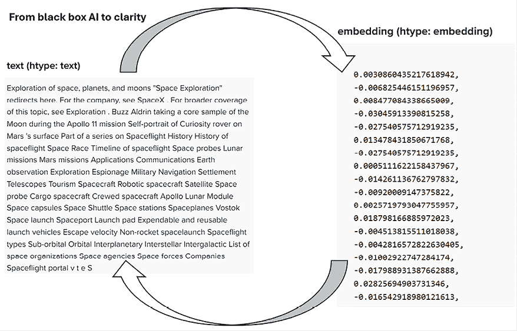
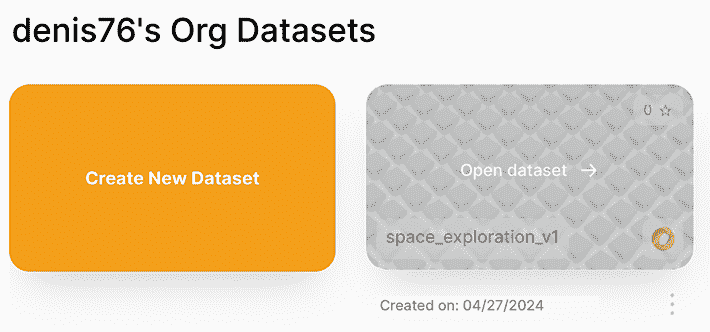
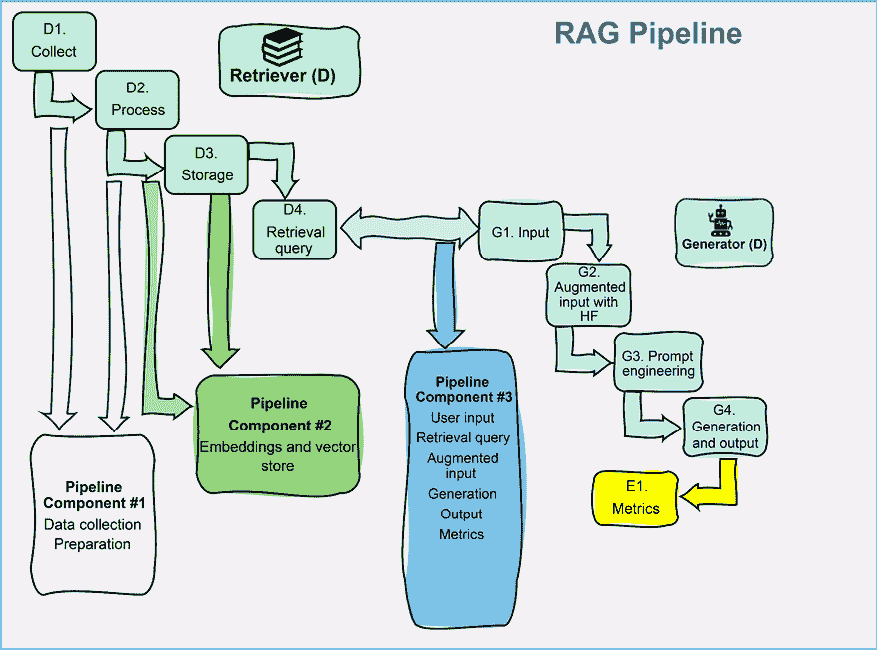
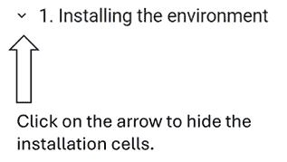
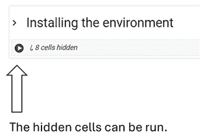
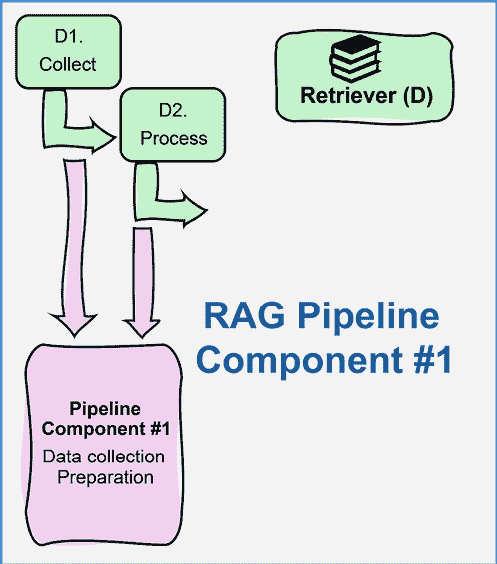
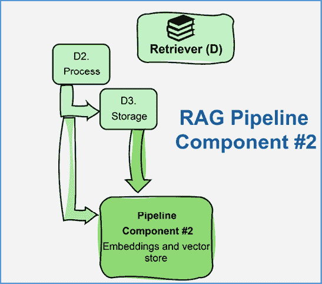
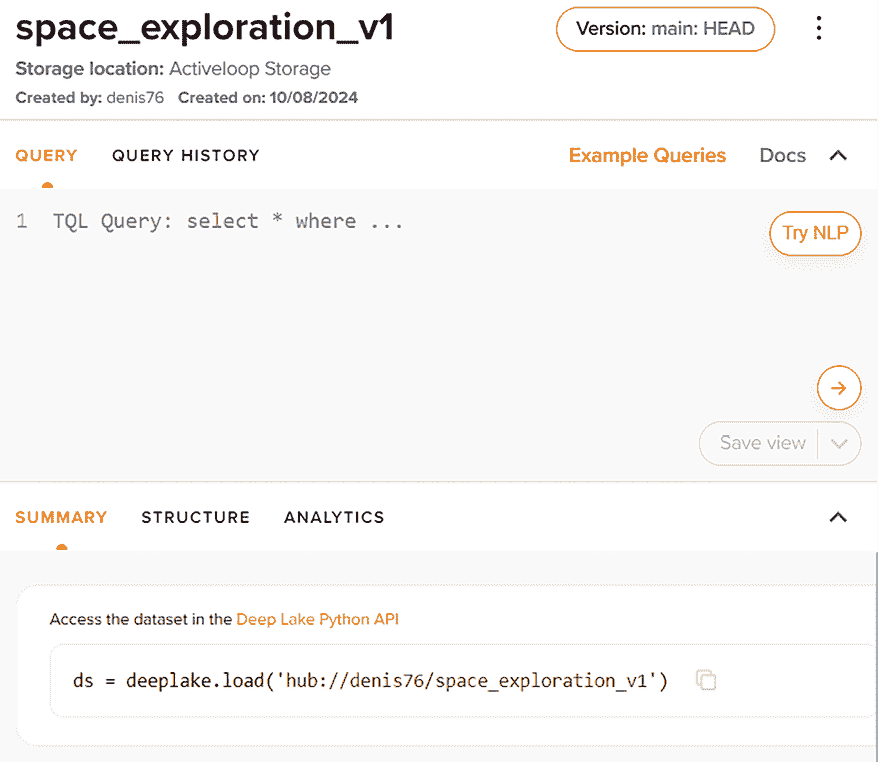
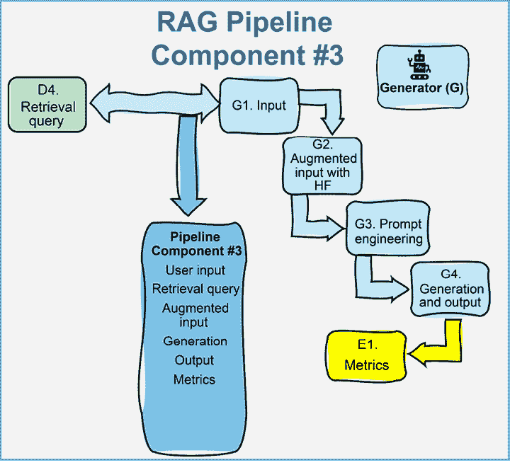

# 第二章：使用 Deep Lake 和 OpenAI 构建 RAG 嵌入向量存储

在执行你的项目过程中，将不可避免地遇到在实现由 RAG 驱动的生成式 AI 时复杂性增加的情况。嵌入将庞大的结构化或非结构化文本转换为紧凑的高维向量，这些向量捕捉了它们的语义本质，从而实现了更快、更高效的信息检索。然而，随着管理越来越大的数据集时文档嵌入的创建和存储变得必要，我们不可避免地会面临存储问题。此时，你可能会问，为什么不使用关键词而不是嵌入呢？答案是简单的：虽然嵌入需要更多的存储空间，但它们捕捉了文本的更深层次的语义含义，与僵化且经常匹配的关键词相比，具有更细腻和上下文感知的检索。这导致了更好的、更相关的检索结果。因此，我们的选择是转向向量存储，其中嵌入被组织和快速访问。

我们将首先通过加载 OpenAI 嵌入模型，从原始数据探索如何进入 Activeloop Deep Lake 向量存储。这需要安装和实现几个跨平台包，这使我们了解了这些系统的架构。我们将把我们的 RAG 管道组织成独立的组件，因为将 RAG 管道分解成独立的部分将使多个团队能够同时在一个项目上工作。然后，我们将为 RAG 驱动的生成式 AI 管道制定蓝图。最后，我们将使用 Activeloop Deep Lake、OpenAI 和自定义构建的函数从头开始构建一个三组件的 RAG 管道。

这段编码之旅将带我们深入到跨平台环境问题，包括包和依赖项。我们还将面临数据分块、嵌入向量和在向量存储上加载它们的挑战。我们将通过检索查询增强 GPT-4o 模型的输入，并产生可靠的输出。到本章结束时，你将完全理解如何利用向量存储中嵌入文档的力量为生成式 AI 提供支持。

总结来说，本章涵盖了以下主题：

+   介绍文档嵌入和向量存储

+   如何将 RAG 管道分解成独立组件

+   从原始数据构建 RAG 管道到 Activeloop Deep Lake

+   面对跨平台包和库的环境挑战

+   利用 LLM 的强大功能，使用 OpenAI 嵌入模型嵌入数据

+   查询 Activeloop Deep Lake 向量存储以增强用户输入

+   使用 OpenAI GPT-4o 生成可靠的增强输出

让我们从学习如何将原始数据转换为向量存储开始。

# 从原始数据到向量存储中的嵌入

嵌入将任何形式的数据（文本、图像或音频）转换为实数。因此，文档被转换为向量。这些文档的数学表示允许我们计算文档之间的距离并检索相似的数据。

原始数据（书籍、文章、博客、图片或歌曲）首先被收集和清理以去除噪声。准备好的数据随后被输入到如 OpenAI `text-embedding-3-small`这样的模型中，该模型将嵌入数据。例如，Activeloop Deep Lake，我们将在本章中实现，将文本分解为预定义的块，这些块由一定数量的字符定义。一个块的大小可以是 1,000 个字符，例如。我们可以让系统优化这些块，正如我们将在下一章的*优化块分割*部分中实现的那样。这些文本块使得处理大量数据变得更容易，并为文档提供更详细的嵌入，如图所示：



图 2.1：Activeloop 向量存储数据集记录的摘录

透明度自从参数模型开始以来一直是人工智能的圣杯，在这些模型中，信息被隐藏在产生黑盒系统的学习参数中。RAG 是一个变革者，如图*2.1*所示，因为内容是完全可追溯的：

+   左侧（文本）：在 RAG 框架中，每一条生成的内容都可以追溯到其源数据，确保输出的透明度。OpenAI 的生成模型将做出响应，考虑到增强输入。

+   右侧（嵌入）：数据嵌入直接可见并与文本相关联，与参数模型形成对比，在参数模型中数据来源被编码在模型参数中。

一旦我们有了文本和嵌入，下一步就是高效地存储它们以便快速检索。这正是*向量存储*发挥作用的地方。向量存储是一种专门为处理高维数据（如嵌入）而设计的数据库。我们可以在如 Activeloop 这样的无服务器平台上创建数据集，如图*2.2*所示。我们可以通过 API 在代码中创建和访问它们，正如我们在本章的*构建 RAG 管道*部分中所做的那样。



图 2.2：使用向量存储管理数据集

向量存储的另一个特点是它们能够使用优化方法检索数据。向量存储是通过强大的索引方法构建的，我们将在下一章中讨论。这种检索能力允许 RAG 模型在生成阶段快速找到并检索最相关的嵌入，增强用户输入，并提高模型生成高质量输出的能力。

我们现在将看到如何组织一个 RAG 管道，该管道从数据收集、处理和检索到增强输入生成。

# 在管道中组织 RAG

RAG 管道通常会收集数据并通过清理等方式准备它，例如，将文档分块、嵌入并存储在向量存储数据集中。然后查询这个向量数据集来增强生成式 AI 模型的用户输入以产生输出。然而，当使用向量存储时，强烈建议不要在一个单独的程序中运行这个 RAG 序列。我们至少应该将这个过程分为三个组件：

+   数据收集和准备

+   数据嵌入并将它们加载到向量存储的数据集中

+   查询向量化数据集以增强生成式 AI 模型的输入以产生响应

让我们来看看采用这种组件方法的主要原因：

+   **专业化**，将允许团队中的每个成员都做他们最擅长的事情，无论是收集和清理数据、运行嵌入模型、管理向量存储还是调整生成式 AI 模型。

+   **可扩展性**，使得在技术发展和不同组件的扩展上使用专门的方法变得更加容易。例如，存储原始数据可以在存储嵌入向量的不同服务器上进行扩展，而不是在云平台上。

+   **并行开发**，允许每个团队根据自己的节奏前进，无需等待他人。可以在不影响其他组件流程的情况下，对单个组件进行持续改进。

+   **维护**是组件独立的。一个团队可以专注于一个组件，而不会影响系统的其他部分。例如，如果 RAG 管道正在生产中，用户可以通过向量存储继续查询和运行生成式 AI，同时一个团队修复数据收集组件。

+   **安全性**和隐私问题最小化，因为每个团队都可以分别使用特定的授权、访问和角色来处理每个组件。

正如我们所见，在现实生活中的生产环境或大型项目中，单个程序或团队管理端到端流程的情况很少见。我们现在已经准备好绘制我们将在此章中用 Python 构建的 RAG 管道的蓝图。

# 由 RAG 驱动的生成式 AI 管道

让我们深入了解一个真实的 RAG 管道是什么样子。想象一下，我们是一个必须在几周内交付整个系统的团队。一开始，我们就被各种问题淹没，比如：

+   谁将收集并清理所有数据？

+   谁将负责设置 OpenAI 的嵌入模型？

+   谁将编写代码来启动那些嵌入并管理向量存储？

+   谁将负责实施 GPT-4 并管理其输出的内容？

几分钟内，每个人都开始显得有些担忧。整个事情感觉压倒性——真的，谁会想到独自应对所有这些？

所以我们这样做。我们分成三个小组，每个人都承担管道的不同部分，如图 *图 2.3* 所示：



图 2.3：RAG 管道组件

三个小组中的每一个都需要实现一个组件：

+   **数据收集和准备（D1 和 D2）**：一个团队负责收集数据并进行清理。

+   **数据嵌入和存储（D2 和 D3）**：另一个团队负责通过 OpenAI 的嵌入模型获取数据，并将这些向量存储在 Activeloop Deep Lake 数据集中。

+   **增强生成（D4，G1-G4 和 E1）**：最后一个团队负责根据用户输入和检索查询生成内容。他们使用 GPT-4 来完成这项工作，尽管听起来工作量很大，但实际上要容易一些，因为他们不需要等待其他人——他们只需要计算机进行计算和评估输出。

突然间，这个项目看起来不再那么可怕。每个人都有自己的部分要关注，我们都可以专注于自己的工作，而不会被其他团队分心。这样，我们都可以更快地工作，避免通常会使事情变慢的延误。

项目组织，如图 2.3 所示，是第一章“为什么是检索增强生成？”中图 1.3 所示的 RAG 生态系统框架的一个变体。

现在，我们可以开始构建一个 RAG 管道。

# 构建 RAG 管道

我们现在将通过实现上一节中描述并在图 2.3 中展示的管道来构建一个 RAG 管道。我们假设有三个团队（`Team #1`、`Team #2`和`Team #3`）并行工作以实现管道，将实现三个组件：

+   由`Team #1`进行的数据收集和准备

+   数据嵌入和存储由`Team #2`完成

+   增强生成由`Team #3`完成

第一步是为这些组件设置环境。

## 设置环境

让我们直面现实。安装跨平台、跨库的包及其依赖项可能相当具有挑战性！考虑到这种复杂性并准备好正确运行环境是很重要的。每个包都有可能存在冲突版本的依赖项。即使我们调整了版本，应用程序也可能不再按预期运行。因此，请花时间安装正确的包和依赖项版本。

我们在本节中只描述一次环境，适用于所有三个组件，并在必要时引用此部分。

### 安装包和库

要在本节中构建 RAG 管道，我们需要包并需要冻结包版本以防止依赖项冲突和库函数的问题，例如：

+   依赖项版本之间可能存在的冲突。

+   当其中一个库需要更新以使应用程序运行时可能出现的冲突。例如，在 2024 年 8 月，安装 `Deep Lake` 需要 `Pillow` 版本 10.x.x，而 Google Colab 的版本是 9.x.x。因此，在安装 `Deep Lake` 之前，有必要卸载 `Pillow` 并使用较新版本重新安装它。毫无疑问，Google Colab 将更新 Pillow。在快速发展的市场中，这种情况经常发生。

+   如果版本冻结时间过长，可能出现的问题。

+   如果版本冻结时间过长且未通过升级修复错误，可能出现的问题。

因此，如果我们冻结版本，应用程序可能会在一段时间内保持稳定，但会遇到问题。但如果我们升级版本太快，一些其他库可能就不再工作了。没有万能的解决方案！这是一个持续的质量控制过程。

对于我们的程序，在本节中，我们将冻结版本。现在，让我们通过安装步骤来创建管道的环境。

### 安装过程中的相关组件

让我们先描述在每个笔记本的 *安装环境* 部分中安装的组件。这些组件不一定在所有笔记本中安装；本节作为包的清单。

在第一个管道部分，*1. 数据收集和准备*，我们只需要安装 Beautiful Soup 和 Requests：

```py
!pip install beautifulsoup4==4.12.3
!pip install requests==2.31.0 
```

这解释了为什么这个管道组件应该保持独立。对于喜欢创建与网络交互界面的开发者来说，这是一项简单的工作。这也非常适合想要参与数据收集和分析的初级开发者。

在本节中，我们将构建的两个其他管道组件，*2. 数据嵌入和存储* 和 *3. 增强生成*，也需要更多的关注以及安装 `requirements01.txt`，如前节所述。现在，让我们继续逐步进行安装。

#### 挂载驱动器

在这种情况下，程序在 Google Colab 中挂载 Google Drive，以安全地读取 OpenAI API 密钥以访问 OpenAI 模型，以及 Activeloop API 令牌以进行认证以访问 Activeloop Deep Lake 数据集：

```py
#Google Drive option to store API Keys
#Store your key in a file and read it(you can type it directly in the # #notebook but it will be visible for somebody next to you)
from google.colab import drive
drive.mount('/content/drive') 
```

您可以选择在其他地方存储您的密钥和令牌。只需确保它们在一个安全的位置。

#### 创建子进程以从 GitHub 下载文件

这里的目标是编写一个函数，从 GitHub 下载 `grequests.py` 文件。这个程序包含一个使用 `curl` 下载文件的函数，如果需要，可以添加一个私有令牌：

```py
import subprocess
url = "https://raw.githubusercontent.com/Denis2054/RAG-Driven-Generative-AI/main/commons/grequests.py"
output_file = "grequests.py"
# Prepare the curl command using the private token
curl_command = [
    "curl",
    "-o", output_file,
    url
]
# Execute the curl command
try:
    subprocess.run(curl_command, check=True)
    print("Download successful.")
except subprocess.CalledProcessError:
    print("Failed to download the file.") 
```

`grequests.py` 文件包含一个函数，如果需要，可以接受一个私有令牌或任何其他在用 `curl` 命令检索数据时需要凭证的安全系统：

```py
import subprocess
import os
# add a private token after the filename if necessary
def download(directory, filename):
    # The base URL of the image files in the GitHub repository
    base_url = 'https://raw.githubusercontent.com/Denis2054/RAG-Driven-Generative-AI/main/'
    # Complete URL for the file
    file_url = f"{base_url}{directory}/{filename}"
    # Use curl to download the file, including an Authorization header for the private token
    try:
        # Prepare the curl command with the Authorization header
        #curl_command = f'curl -H "Authorization: token {private_token}" -o {filename} {file_url}'
        curl_command = f'curl -H -o {filename} {file_url}'
        # Execute the curl command
        subprocess.run(curl_command, check=True, shell=True)
        print(f"Downloaded '{filename}' successfully.")
    except subprocess.CalledProcessError:
        print(f"Failed to download '{filename}'. Check the URL, your internet connection, and if the token is correct and has appropriate permissions.") 
```

#### 安装需求

现在，当与 Activeloop Deep Lake 和 OpenAI 一起工作时，我们将安装本节的依赖项。我们只需要：

```py
!pip install deeplake==3.9.18
!pip install openai==1.40.3 
```

截至 2024 年 8 月，Google Colab 的 Pillow 版本与`deeplake`包冲突。然而，`deeplake`安装包会自动处理这个问题。您只需重新启动会话并再次运行即可，这就是为什么`pip install deeplake==3.9.18`是安装在每个 notebook 中的第一行。

安装完要求后，我们必须运行一行代码以激活 Activeloop 的公共 DNS 服务器：

```py
# For Google Colab and Activeloop(Deeplake library)
#This line writes the string "nameserver 8.8.8.8" to the file. This is specifying that the DNS server the system
#should use is at the IP address 8.8.8.8, which is one of Google's Public DNS servers.
with open('/etc/resolv.conf', 'w') as file:
   file.write("nameserver 8.8.8.8") 
```

#### 认证过程

您需要在 OpenAI 上注册以获取 API 密钥：[`openai.com/`](https://openai.com/)。在使用密钥之前，请确保检查定价政策。首先，让我们激活 OpenAI 的 API 密钥：

```py
#Retrieving and setting OpenAI API key
f = open("drive/MyDrive/files/api_key.txt", "r")
API_KEY=f.readline().strip()
f.close()
#The OpenAI API key
import os
import openai
os.environ['OPENAI_API_KEY'] =API_KEY
openai.api_key = os.getenv("OPENAI_API_KEY") 
```

然后，我们激活 Deep Lake 的 Activeloop API 令牌：

```py
#Retrieving and setting Activeloop API token
f = open("drive/MyDrive/files/activeloop.txt", "r")
API_token=f.readline().strip()
f.close()
ACTIVELOOP_TOKEN=API_token
os.environ['ACTIVELOOP_TOKEN'] =ACTIVELOOP_TOKEN 
```

您需要在 Activeloop 上注册以获取 API 令牌：[`www.activeloop.ai/`](https://www.activeloop.ai/)。再次提醒，在使用 Activeloop 令牌之前，请确保检查定价政策。

环境安装完成后，您可以隐藏我们刚刚运行的**安装环境**单元格，以便专注于管道组件的内容，如图*图 2.4*所示：



图 2:4：隐藏安装单元格

隐藏安装单元格后，它们仍然可以运行，如图*图 2.5*所示：



图 2.5：运行隐藏单元格

现在，我们可以专注于每个管道组件的管道组件。让我们从数据收集和准备开始。

## 1. 数据收集和准备

数据收集和准备是第一个管道组件，如本章前面所述。**Team #1**将只关注他们的组件，如图*图 2.6*所示：



图 2.6：管道组件#1：数据收集和准备

让我们加入并帮助**Team #1**。我们的工作定义清晰，因此我们可以享受实现组件所花费的时间。我们将检索并处理 10 篇维基百科文章，这些文章提供了对太空探索各个方面的全面视角：

+   **太空探索**：关于太空探索的历史、技术、任务和计划的概述（[`en.wikipedia.org/wiki/Space_exploration`](https://en.wikipedia.org/wiki/Space_exploration)）

+   **阿波罗计划**：关于将人类首次送上月球并执行其重大任务的 NASA 计划的信息（[`en.wikipedia.org/wiki/Apollo_program`](https://en.wikipedia.org/wiki/Apollo_program)）

+   **哈勃太空望远镜**：关于有史以来最显著的望远镜之一的信息，它在许多天文学发现中发挥了关键作用（[`en.wikipedia.org/wiki/Hubble_Space_Telescope`](https://en.wikipedia.org/wiki/Hubble_Space_Telescope)）

+   **火星漫游车**：深入了解被送往火星以研究其表面和环境的漫游车（[`en.wikipedia.org/wiki/Mars_rover`](https://en.wikipedia.org/wiki/Mars_rover)）

+   **国际空间站（ISS）**：关于 ISS 的详细信息，其建设、国际合作及其在空间研究中的作用（[`en.wikipedia.org/wiki/International_Space_Station`](https://en.wikipedia.org/wiki/International_Space_Station)）

+   **SpaceX**：涵盖了 SpaceX 的历史、成就和目标，这是最有影响力的私营太空飞行公司之一（[`en.wikipedia.org/wiki/SpaceX`](https://en.wikipedia.org/wiki/SpaceX)）

+   **朱诺号（航天器）**：关于环绕并研究木星、其结构和卫星的 NASA 太空探测器的信息（[`en.wikipedia.org/wiki/Juno_(spacecraft))`](https://en.wikipedia.org/wiki/Juno_(spacecraft)）

+   **旅行者计划**：关于旅行者任务，包括它们对我们理解外太阳系和星际空间的贡献（[`en.wikipedia.org/wiki/Voyager_program`](https://en.wikipedia.org/wiki/Voyager_program)）

+   **伽利略号（航天器）**：概述了研究木星及其卫星的任务，提供了关于这颗气态巨行星及其系统的宝贵数据（[`en.wikipedia.org/wiki/Galileo_(spacecraft)`](https://en.wikipedia.org/wiki/Galileo_(spacecraft)）

+   **开普勒太空望远镜**：关于设计用于发现绕其他恒星运行的地球大小行星的太空望远镜的信息（[`en.wikipedia.org/wiki/Kepler_Space_Telescope`](https://en.wikipedia.org/wiki/Kepler_Space_Telescope)）

这些文章涵盖了太空探索的广泛主题，从历史计划到现代技术进步和任务。

现在，在 GitHub 仓库中打开`1-Data_collection_preparation.ipynb`。我们首先收集数据。

### 收集数据

我们只需要`import requests`进行 HTTP 请求，`from bs4 import BeautifulSoup`进行 HTML 解析，以及`import re`，正则表达式模块：

```py
import requests
from bs4 import BeautifulSoup
import re 
```

我们然后选择所需的 URL：

```py
# URLs of the Wikipedia articles
urls = [
    "https://en.wikipedia.org/wiki/Space_exploration",
    "https://en.wikipedia.org/wiki/Apollo_program",
    "https://en.wikipedia.org/wiki/Hubble_Space_Telescope",
    "https://en.wikipedia.org/wiki/Mars_over",
    "https://en.wikipedia.org/wiki/International_Space_Station",
    "https://en.wikipedia.org/wiki/SpaceX",
    "https://en.wikipedia.org/wiki/Juno_(spacecraft)",
    "https://en.wikipedia.org/wiki/Voyager_program",
    "https://en.wikipedia.org/wiki/Galileo_(spacecraft)",
    "https://en.wikipedia.org/wiki/Kepler_Space_Telescope"
] 
```

这个列表在代码中。然而，它也可以存储在数据库中，文件中，或任何其他格式，例如 JSON。我们现在可以准备数据。

### 准备数据

首先，我们编写一个清理函数。此函数使用正则表达式从给定的文本字符串中删除数字引用，如[1] [2]，并返回清理后的文本：

```py
def clean_text(content):
    # Remove references that usually appear as [1], [2], etc.
    content = re.sub(r'\[\d+\]', '', content)
    return content 
```

然后，我们编写一个经典的获取和清理函数，该函数将通过从文档中提取所需内容来返回一个整洁的文本：

```py
def fetch_and_clean(url):
    # Fetch the content of the URL
    response = requests.get(url)
    soup = BeautifulSoup(response.content, 'html.parser')
    # Find the main content of the article, ignoring side boxes and headers
    content = soup.find('div', {'class': 'mw-parser-output'})
    # Remove the bibliography section, which generally follows a header like "References", "Bibliography"
    for section_title in ['References', 'Bibliography', 'External links', 'See also']:
        section = content.find('span', id=section_title)
        if section:
            # Remove all content from this section to the end of the document
            for sib in section.parent.find_next_siblings():
                sib.decompose()
            section.parent.decompose()
    # Extract and clean the text
    text = content.get_text(separator=' ', strip=True)
    text = clean_text(text)
    return text 
```

最后，我们将内容写入`llm.txt`文件，供数据嵌入和存储功能的小组使用：

```py
# File to write the clean text
with open('llm.txt', 'w', encoding='utf-8') as file:
    for url in urls:
        clean_article_text = fetch_and_clean(url)
        file.write(clean_article_text + '\n')
print("Content written to llm.txt") 
```

输出确认文本已被写入：

```py
Content written to llm.txt 
```

程序可以根据项目特定需求修改以保存数据到其他格式和位置：

```py
# Open the file and read the first 20 lines
with open('llm.txt', 'r', encoding='utf-8') as file:
    lines = file.readlines()
    # Print the first 20 lines
    for line in lines[:20]:
        print(line.strip()) 
```

输出显示了将要处理的文档的第一行：

```py
Exploration of space, planets, and moons "Space Exploration" redirects here. For the company, see SpaceX . For broader coverage of this topic, see Exploration . Buzz Aldrin taking a core sample of the Moon during the Apollo 11 mission… 
```

这个组件可以由一个喜欢在网络上或公司数据环境中搜索文档的团队管理。该团队将在识别项目最佳文档方面获得经验，这是任何 RAG 框架的基础。

`Team #2`现在可以处理数据以嵌入文档并将它们存储起来。

## 2. 数据嵌入和存储

`Team #2`的任务是专注于管道的第二组件。他们将接收准备好的数据批次以进行处理。他们不必担心检索数据。`Team #1`在数据收集和准备组件方面支持他们。



图 2.7：管道组件#2：数据嵌入和存储

让我们现在跳进去帮助`Team #2`完成任务。在 GitHub 仓库中打开`2-Embeddings_vector_store.ipynb`。我们将嵌入并存储`Team #1`提供的数据，并检索一批文档进行处理。

### 检索一批准备好的文档

首先，我们下载由`Team #1`提供并存储在服务器上的一批文档，这是持续流入文档的第一批。在这种情况下，我们假设它是太空探索文件：

```py
from grequests import download
source_text = "llm.txt"
directory = "Chapter02"
filename = "llm.txt"
download(directory, filename) 
```

注意，`source_text = "llm.txt"` 将由将数据添加到我们的向量存储库的函数使用。然后我们简要检查文档，以确保`Team #1`已经验证了信息：

```py
# Open the file and read the first 20 lines
with open('llm.txt', 'r', encoding='utf-8') as file:
    lines = file.readlines()
    # Print the first 20 lines
    for line in lines[:20]:
        print(line.strip()) 
```

输出令人满意，如下所示：

```py
Exploration of space, planets, and moons "Space Exploration" redirects here. 
```

我们现在将数据分块。我们将根据字符数确定块大小。在这种情况下，它是 `CHUNK_SIZE = 1000`，但我们可以使用不同的策略选择块大小。*第七章*，*使用 Wikipedia API 和 LlamaIndex 构建可扩展的基于知识图谱的 RAG*，将进一步优化块大小，实现自动无缝分块。

分块是优化数据处理所必需的：选择文本部分、嵌入和加载数据。它还使嵌入的数据集更容易查询。以下代码将文档分块以完成准备过程：

```py
with open(source_text, 'r') as f:
    text = f.read()
CHUNK_SIZE = 1000
chunked_text = [text[i:i+CHUNK_SIZE] for i in range(0,len(text), CHUNK_SIZE)] 
```

我们现在已准备好创建一个向量存储库以向量化数据或向现有的存储库中添加数据。

### 验证向量存储是否存在并在不存在时创建它

首先，我们需要定义我们的 Activeloop 向量存储路径，无论我们的数据集是否存在：

```py
vector_store_path = "hub://denis76/space_exploration_v1" 
```

确保将 `` `hub://denis76/space_exploration_v1` `` 替换为您的组织和数据集名称。

然后，我们编写一个函数来尝试加载向量存储库或自动创建一个如果它不存在的话：

```py
from deeplake.core.vectorstore.deeplake_vectorstore import VectorStore
import deeplake.util
try:
    # Attempt to load the vector store
    vector_store = VectorStore(path=vector_store_path)
    print("Vector store exists")
except FileNotFoundError:
    print("Vector store does not exist. You can create it.")
    # Code to create the vector store goes here
    create_vector_store=True 
```

输出确认向量存储已创建：

```py
Your Deep Lake dataset has been successfully created!
Vector store exists 
```

我们现在需要创建一个嵌入函数。

### 嵌入函数

嵌入函数将把创建的数据块转换为向量，以实现基于向量的搜索。在这个程序中，我们将使用`"text-embedding-3-small"`来嵌入文档。

OpenAI 还有其他可以使用的嵌入模型：[`platform.openai.com/docs/models/embeddings`](https://platform.openai.com/docs/models/embeddings)。第六章*使用 Pinecone 扩展 RAG 银行客户数据*在*嵌入*部分提供了嵌入模型的替代代码。无论如何，建议在选择生产中的嵌入模型之前对其进行评估。检查 OpenAI 描述的每个嵌入模型的特点，重点关注它们的长度和能力。在这种情况下，选择`text-embedding-3-small`是因为它作为一个高效且快速的稳健选择而突出：

```py
def embedding_function(texts, model="text-embedding-3-small"):
   if isinstance(texts, str):
       texts = [texts]
   texts = [t.replace("\n", " ") for t in texts]
   return [data.embedding for data in openai.embeddings.create(input = texts, model=model).data] 
```

OpenAI 的`text-embedding-3-small`文本嵌入模型通常使用具有限制性维度的嵌入，以平衡在嵌入中获得足够细节与大型计算工作负载和存储空间之间的平衡。在运行代码之前，请确保检查模型页面和定价信息：[`platform.openai.com/docs/guides/embeddings/embedding-models`](https://platform.openai.com/docs/guides/embeddings/embedding-models)。

现在我们已经准备好开始填充向量存储。

### 向向量存储添加数据

我们将添加数据的标志设置为`True`：

```py
add_to_vector_store=True
if add_to_vector_store == True:
    with open(source_text, 'r') as f:
        text = f.read()
        CHUNK_SIZE = 1000
        chunked_text = [text[i:i+1000] for i in range(0, len(text), CHUNK_SIZE)]
vector_store.add(text = chunked_text,
              embedding_function = embedding_function,
              embedding_data = chunked_text,
              metadata = [{"source": source_text}]*len(chunked_text)) 
```

源文本`source_text = "llm.txt"`已被嵌入并存储。数据集结构的摘要显示，数据集已被加载：

```py
Creating 839 embeddings in 2 batches of size 500:: 100%|██████████| 2/2 [01:44<00:00, 52.04s/it]
Dataset(path='hub://denis76/space_exploration_v1', tensors=['text', 'metadata', 'embedding', 'id'])
  tensor      htype       shape      dtype  compression
  -------    -------     -------    -------  -------
   text       text      (839, 1)      str     None  
 metadata     json      (839, 1)      str     None  
 embedding  embedding  (839, 1536)  float32   None  
    id        text      (839, 1)      str     None 
```

观察到数据集包含四个张量：

+   `embedding`：每个数据块都嵌入到一个向量中

+   `id`：ID 是一串字符，且是唯一的

+   `metadata`：元数据包含数据的来源——在本例中，是`llm.txt`文件。

+   `text`：数据集中文本块的内容

这种数据集结构可能因项目而异，正如我们将在第四章*多模态模块化 RAG 用于无人机技术*中看到的。我们还可以在任何时候可视化数据集的组织结构以验证其结构。以下代码将显示刚刚显示的摘要：

```py
# Print the summary of the Vector Store
print(vector_store.summary()) 
```

如果我们愿意，我们还可以可视化向量存储信息。

## 向量存储信息

Activeloop 的 API 参考为我们提供了管理数据集所需的所有信息：[`docs.deeplake.ai/en/latest/`](https://docs.deeplake.ai/en/latest/)。在[`app.activeloop.ai/datasets/mydatasets/`](https://app.activeloop.ai/datasets/mydatasets/)登录后，我们可以可视化我们的数据集。

我们也可以用一行代码加载我们的数据集：

```py
ds = deeplake.load(vector_store_path) 
```

输出提供了一个路径，可以可视化我们的数据集，并在线查询和探索它们：

```py
This dataset can be visualized in Jupyter Notebook by ds.visualize() or at https://app.activeloop.ai/denis76/space_exploration_v1
hub://denis76/space_exploration_v1 loaded successfully. 
```

您也可以通过登录 Activeloop 并进入您的数据集来直接访问您的数据集。您将找到在线数据集探索工具来查询您的数据集等，如下所示：



图 2.8：在线查询和探索 Deep Lake 数据集。

在许多可用功能中，我们可以显示数据集的估计大小：

```py
#Estimates the size in bytes of the dataset.
ds_size=ds.size_approx() 
```

一旦我们获得了大小，我们可以将其转换为兆字节和千兆字节：

```py
# Convert bytes to megabytes and limit to 5 decimal places
ds_size_mb = ds_size / 1048576
print(f"Dataset size in megabytes: {ds_size_mb:.5f} MB")
# Convert bytes to gigabytes and limit to 5 decimal places
ds_size_gb = ds_size / 1073741824
print(f"Dataset size in gigabytes: {ds_size_gb:.5f} GB") 
```

输出显示了数据集的大小（以兆字节和千兆字节为单位）：

```py
Dataset size in megabytes: 55.31311 MB
Dataset size in gigabytes: 0.05402 GB 
```

`团队#2`的数据嵌入和存储管道组件似乎正在正常工作。现在让我们探索增强生成。

## 3. 增强输入生成

增强生成是第三个管道组件。我们将使用我们检索到的数据来增强用户输入。该组件处理用户输入，查询向量存储，增强输入，并调用`gpt-4-turbo`，如图*图 2.9*所示：



图 2.9：管道组件#3：增强输入生成

*图 2.9*显示，管道组件#3 完全配得上其**检索增强生成**（**RAG**）的名称。然而，如果没有`团队#1`和`团队#2`的工作，提供生成增强输入内容所需的信息，将无法运行此组件。

让我们跳进去看看`团队#3`是如何完成工作的。在 GitHub 仓库中打开`3-Augmented_Generation.ipynb`。笔记本的*安装环境*部分在本章的*设置环境*部分有描述。我们选择向量存储（将向量存储路径替换为您的向量存储）：

```py
vector_store_path = "hub://denis76/space_exploration_v1" 
```

然后，我们加载数据集：

```py
from deeplake.core.vectorstore.deeplake_vectorstore import VectorStore
import deeplake.util
ds = deeplake.load(vector_store_path) 
```

我们打印一条确认消息，表明向量存储存在。在这个阶段，`团队#2`之前确保了一切工作正常，因此我们可以快速前进：

```py
vector_store = VectorStore(path=vector_store_path) 
```

输出确认数据集存在并已加载：

```py
Deep Lake Dataset in hub://denis76/space_exploration_v1 already exists, loading from the storage 
```

我们假设管道组件`#2`，如在第*数据嵌入和存储*部分所述构建，已经创建并填充了`vector_store`，并已验证它可以被查询。现在让我们处理用户输入。

### 输入和查询检索

我们需要嵌入函数来嵌入用户输入：

```py
def embedding_function(texts, model="text-embedding-3-small"):
   if isinstance(texts, str):
       texts = [texts]
   texts = [t.replace("\n", " ") for t in texts]
   return [data.embedding for data in openai.embeddings.create(input = texts, model=model).data] 
```

注意，我们使用与数据嵌入和存储组件相同的嵌入模型，以确保输入和向量数据集之间的完全兼容性：`text-embedding-ada-002`。

我们现在可以使用交互式提示输入或批量处理用户输入。在这种情况下，我们处理一个已经输入的用户输入，例如可以从用户界面获取。

我们首先要求用户输入或定义一个：

```py
def get_user_prompt():
    # Request user input for the search prompt
    return input("Enter your search query: ")
# Get the user's search query
#user_prompt = get_user_prompt()
user_prompt="Tell me about space exploration on the Moon and Mars." 
```

然后我们将提示插入到搜索查询中，并将输出存储在`search_results`中：

```py
search_results = vector_store.search(embedding_data=user_prompt, embedding_function=embedding_function) 
```

存储在`search_results`中的用户提示和搜索结果被格式化以供显示。首先，让我们打印用户提示：

```py
print(user_prompt) 
```

我们还可以将检索到的文本包装起来以获得格式化的输出：

```py
# Function to wrap text to a specified width
def wrap_text(text, width=80):
    lines = []
    while len(text) > width:
        split_index = text.rfind(' ', 0, width)
        if split_index == -1:
            split_index = width
        lines.append(text[:split_index])
        text = text[split_index:].strip()
    lines.append(text)
    return '\n'.join(lines) 
```

然而，我们只选择最上面的一个结果并打印它：

```py
import textwrap
# Assuming the search results are ordered with the top result first
top_score = search_results['score'][0]
top_text = search_results['text'][0].strip()
top_metadata = search_results['metadata'][0]['source']
# Print the top search result
print("Top Search Result:")
print(f"Score: {top_score}")
print(f"Source: {top_metadata}")
print("Text:")
print(wrap_text(top_text)) 
```

以下输出显示我们有一个相当好的匹配：

```py
Top Search Result:
Score: 0.6016581654548645
Source: llm.txt
Text:
Exploration of space, planets, and moons "Space Exploration" redirects here.
For the company, see SpaceX . For broader coverage of this topic, see
Exploration . Buzz Aldrin taking a core sample of the Moon during the Apollo 11 mission Self-portrait of Curiosity rover on Mars 's surface Part of a series on… 
```

我们准备好使用我们检索到的附加信息来增强输入。

### 增强输入

程序将检索到的最上面的文本添加到用户输入中：

```py
augmented_input=user_prompt+" "+top_text
print(augmented_input) 
```

输出显示了增强输入：

```py
Tell me about space exploration on the Moon and Mars. Exploration of space, planets … 
```

`gpt-4o` 现在可以处理增强输入并生成内容：

```py
from openai import OpenAI
client = OpenAI()
import time
gpt_model = "gpt-4o" 
start_time = time.time()  # Start timing before the request 
```

注意，我们正在计时这个过程。我们现在编写生成式 AI 调用，为创建的消息添加角色：

```py
def call_gpt4_with_full_text(itext):
    # Join all lines to form a single string
    text_input = '\n'.join(itext)
    prompt = f"Please summarize or elaborate on the following content:\n{text_input}"
    try:
        response = client.chat.completions.create(
            model=gpt_model,
            messages=[
                {"role": "system", "content": "You are a space exploration expert."},
                {"role": "assistant", "content": "You can read the input and answer in detail."},
                {"role": "user", "content": prompt}
            ],
            temperature=0.1  # Fine-tune parameters as needed
        )
        return response.choices[0].message.content.strip()
    except Exception as e:
        return str(e) 
```

生成模型使用增强输入被调用；计算并显示响应时间以及输出：

```py
gpt4_response = call_gpt4_with_full_text(augmented_input)
response_time = time.time() - start_time  # Measure response time
print(f"Response Time: {response_time:.2f} seconds")  # Print response time
print(gpt_model, "Response:", gpt4_response) 
```

注意，原始输出会显示响应时间：

```py
Response Time: 8.44 seconds
gpt-4o Response: Space exploration on the Moon and Mars has been a significant focus of human spaceflight and robotic missions. Here's a detailed summary… 
```

让我们使用 `textwrap` 格式化输出并打印结果。`print_formatted_response(response)` 首先检查返回的响应是否包含 Markdown 功能。如果是这样，它将格式化响应；如果不是，它将执行标准输出文本换行：

```py
import textwrap
import re
from IPython.display import display, Markdown, HTML
import markdown
def print_formatted_response(response):
    # Check for markdown by looking for patterns like headers, bold, lists, etc.
    markdown_patterns = [
        r"^#+\s",           # Headers
        r"^\*+",            # Bullet points
        r"\*\*",            # Bold
        r"_",               # Italics
        r"\[.+\]\(.+\)",    # Links
        r"-\s",             # Dashes used for lists
        r"\`\`\`"           # Code blocks
    ]
    # If any pattern matches, assume the response is in markdown
    if any(re.search(pattern, response, re.MULTILINE) for pattern in markdown_patterns):
        # Markdown detected, convert to HTML for nicer display
        html_output = markdown.markdown(response)
        display(HTML(html_output))  # Use display(HTML()) to render HTML in Colab
    else:
        # No markdown detected, wrap and print as plain text
        wrapper = textwrap.TextWrapper(width=80)
        wrapped_text = wrapper.fill(text=response)
        print("Text Response:")
        print("--------------------")
        print(wrapped_text)
        print("--------------------\n")
print_formatted_response(gpt4_response) 
```

输出令人满意：

```py
Moon Exploration
    Historical Missions:
    1\. Apollo Missions: NASA's Apollo program, particularly Apollo 11, marked the first manned Moon landing in 1969\. Astronauts like Buzz Aldrin collected core samples and conducted experiments.
    2\. Lunar Missions: Various missions have been conducted to explore the Moon, including robotic landers and orbiters from different countries.
Scientific Goals:
    3\. Geological Studies: Understanding the Moon's composition, structure, and history.
    4\. Resource Utilization: Investigating the potential for mining resources like Helium-3 and water ice.
    Future Plans:
    1\. Artemis Program: NASA's initiative to return humans to the Moon and establish a sustainable presence by the late 2020s.
    2\. International Collaboration: Partnerships with other space agencies and private companies to build lunar bases and conduct scientific research.
Mars Exploration
    Robotic Missions:
    1\. Rovers: NASA's rovers like Curiosity and Perseverance have been exploring Mars' surface, analyzing soil and rock samples, and searching for signs of past life.
    2\. Orbiters: Various orbiters have been mapping Mars' surface and studying its atmosphere… 
```

让我们引入一个评估指标来衡量输出的质量。

# 使用余弦相似度评估输出

在本节中，我们将实现余弦相似度来衡量用户输入和生成式 AI 模型输出之间的相似度。我们还将衡量增强用户输入与生成式 AI 模型输出之间的相似度。让我们首先定义一个余弦相似度函数：

```py
from sklearn.feature_extraction.text import TfidfVectorizer
from sklearn.metrics.pairwise import cosine_similarity
def calculate_cosine_similarity(text1, text2):
    vectorizer = TfidfVectorizer()
    tfidf = vectorizer.fit_transform([text1, text2])
    similarity = cosine_similarity(tfidf[0:1], tfidf[1:2])
    return similarity[0][0] 
```

然后，让我们计算一个分数来衡量用户提示和 GPT-4 的响应之间的相似度：

```py
similarity_score = calculate_cosine_similarity(user_prompt, gpt4_response)
print(f"Cosine Similarity Score: {similarity_score:.3f}") 
```

尽管输出对于人类来说似乎是可以接受的，但分数很低：

```py
Cosine Similarity Score: 0.396 
```

看起来我们可能遗漏了某些内容或需要使用另一个指标。

让我们尝试计算增强输入和 GPT-4 的响应之间的相似度：

```py
# Example usage with your existing functions
similarity_score = calculate_cosine_similarity(augmented_input, gpt4_response)
print(f"Cosine Similarity Score: {similarity_score:.3f}") 
```

分数似乎更好：

```py
Cosine Similarity Score: 0.857 
```

我们可以使用另一种方法吗？当使用 **词频-逆文档频率**（**TF-IDF**）时，余弦相似度高度依赖于精确的词汇重叠，并考虑重要的语言特征，如语义含义、同义词或上下文用法。因此，这种方法可能会为概念上相似但词汇选择不同的文本产生较低的相似度分数。

相比之下，使用 Sentence Transformers 计算相似度涉及捕捉单词和短语之间更深层次语义关系的嵌入。这种方法在识别文本之间的上下文和概念相似性方面更有效。让我们尝试这种方法。

首先，让我们安装 `sentence-transformers`：

```py
!pip install sentence-transformers 
```

在会话结束时安装此库要小心，因为它可能会与 RAG 管道的要求产生潜在冲突。根据项目的需求，这段代码可能又是另一个独立的管道组件。

截至 2024 年 8 月，使用 Hugging Face 令牌是可选的。如果 Hugging Face 需要令牌，请注册 Hugging Face 获取 API 令牌，检查条件，并按照说明设置密钥。

我们现在将使用 MiniLM 架构使用`all-MiniLM-L6-v2`执行任务。此模型可通过我们使用的 Hugging Face 模型库获得。它是`sentence-transformers`库的一部分，该库是 Hugging Face Transformers 库的扩展。我们使用此架构是因为它提供了一个紧凑且高效的模型，在快速生成有意义的句子嵌入方面表现出色。现在让我们使用以下函数实现它：

```py
from sentence_transformers import SentenceTransformer
model = SentenceTransformer('all-MiniLM-L6-v2')
def calculate_cosine_similarity_with_embeddings(text1, text2):
    embeddings1 = model.encode(text1)
    embeddings2 = model.encode(text2)
    similarity = cosine_similarity([embeddings1], [embeddings2])
    return similarity[0][0] 
```

我们现在可以调用函数来计算增强用户输入与 GPT-4 响应之间的相似度：

```py
similarity_score = calculate_cosine_similarity_with_embeddings(augmented_input, gpt4_response)
print(f"Cosine Similarity Score: {similarity_score:.3f}") 
```

输出显示，Sentence Transformer 在捕捉文本之间的语义相似性方面更为有效，从而产生了高余弦相似度分数：

```py
Cosine Similarity Score: 0.739 
```

指标的选择取决于每个项目阶段的具体要求。*第三章*，*使用 LlamaIndex、Deep Lake 和 OpenAI 构建基于索引的 RAG*，将在我们实施基于索引的 RAG 时提供高级指标。然而，在这个阶段，RAG 管道的三个组件已经成功构建。让我们总结我们的旅程，迈向下一个层次！

# 摘要

在本章中，我们解决了使用 RAG 驱动的生成式 AI 的复杂性，重点关注处理大数据集时文档嵌入的基本作用。我们看到了如何从原始文本到嵌入并将它们存储在向量存储中的方法。与参数化生成式 AI 模型不同，向量存储（如 Activeloop）提供了 API 工具和可视化界面，使我们能够随时查看嵌入的文本。

一个 RAG 管道详细说明了将 OpenAI 嵌入集成到 Activeloop Deep Lake 向量存储中的组织过程。RAG 管道被分解为不同的组件，这些组件可能因项目而异。这种分离允许多个团队同时工作而无需依赖，加速开发并促进对个别方面的专业关注，例如数据收集、嵌入处理和增强生成式 AI 过程中的查询生成。

我们随后构建了一个三组件的 RAG 管道，首先强调了特定跨平台包的必要性以及仔细的系统架构规划。涉及到的资源包括从头开始构建的 Python 函数，Activeloop Deep Lake 用于在向量存储中组织和存储数据集的嵌入，OpenAI 嵌入模型，以及 OpenAI 的 GPT-4o 生成式 AI 模型。程序引导我们使用 Python 构建一个三部分的 RAG 管道，涉及实际步骤，包括设置环境、处理依赖项以及解决实现挑战，如数据分块和向量存储集成。

这段旅程为我们提供了对在向量存储中嵌入文档以及利用它们来增强生成式 AI 输出的稳健理解，使我们能够将这些见解应用于组织内有序流程和团队中的实际 AI 应用。向量存储增强了需要精确信息检索的文档检索。索引将 RAG 推进一步，并提高了检索的速度和相关性。下一章将引入更高级的索引方法，以检索和增强输入。

# 问题

用 *Yes* 或 *No* 回答以下问题：

1.  嵌入是否将文本转换为高维向量，以在 RAG 中实现更快的检索？

1.  关键词搜索在检索详细语义内容方面是否比嵌入更有效？

1.  是否建议将 RAG 管道分离成独立的组件？

1.  RAG 管道是否仅由两个主要组件组成？

1.  Activeloop Deep Lake 是否可以同时处理嵌入和向量存储？

1.  OpenAI 的 text-embedding-3-small 模型是否用于本章生成嵌入？

1.  数据嵌入在 RAG 驱动的系统中是否可见且可直接追踪？

1.  RAG 管道是否可以在不拆分成单独组件的情况下顺利运行？

1.  将大文本分成更小的部分对嵌入和存储是否必要？

1.  是否使用余弦相似度指标来评估检索信息的相关性？

# 参考文献

+   OpenAI Ada 嵌入文档指南：[`platform.openai.com/docs/guides/embeddings/embedding-models`](https://platform.openai.com/docs/guides/embeddings/embedding-models)

+   OpenAI GPT 内容生成文档：[`platform.openai.com/docs/models/gpt-4-turbo-and-gpt-4`](https://platform.openai.com/docs/models/gpt-4-turbo-and-gpt-4)

+   Activeloop API 文档：[`docs.deeplake.ai/en/latest/`](https://docs.deeplake.ai/en/latest/)

+   MiniLM 模型参考：[`huggingface.co/sentence-transformers/all-MiniLM-L6-v2`](https://huggingface.co/sentence-transformers/all-MiniLM-L6-v2)

# 进一步阅读

+   OpenAI 关于嵌入的文档：[`platform.openai.com/docs/guides/embeddings`](https://platform.openai.com/docs/guides/embeddings)

+   Activeloop 文档：[`docs.activeloop.ai/`](https://docs.activeloop.ai/)

# 加入我们的 Discord 社区

加入我们的社区 Discord 空间，与作者和其他读者进行讨论：

[`www.packt.link/rag`](https://www.packt.link/rag)


